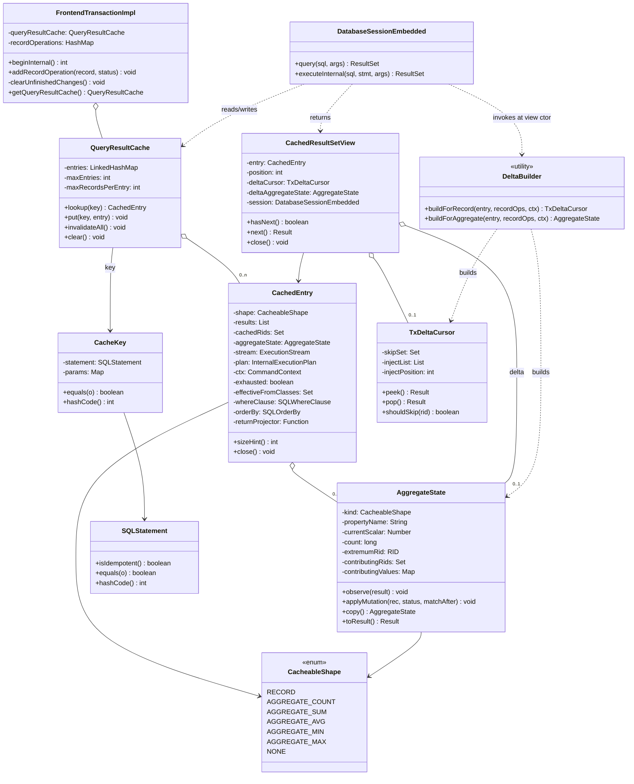
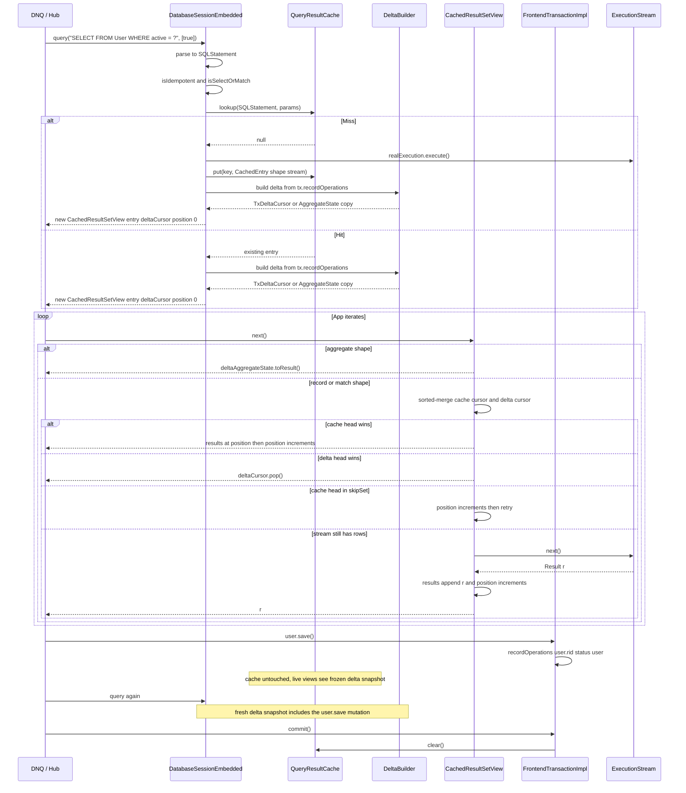

# YTDB-820 Transaction-scoped query result cache — Design

## Overview

YouTrackDB today re-executes every `Database.query()` call against storage, even when the same idempotent query was issued moments earlier in the same transaction. Hub and YouTrack DNQ workloads issue hundreds to thousands of duplicate-shape SELECT/MATCH queries per request — the lost cache (compared to the pre-migration Xodus `EntityIterable` cache) translates to a sustained per-request slowdown.

This design adds an opt-in **transaction-scoped result cache** keyed by parsed query AST + normalized parameters. The cache lives on `FrontendTransactionImpl` and is wiped on every transaction-end path (commit, rollback, close). Cache entries are **immutable** from the moment they are populated — intra-transaction mutations never touch the cached state. Instead, each `query()` call constructs a `CachedResultSetView` over the immutable cached entry plus a **snapshot tx-delta-cursor** built from `FrontendTransactionImpl.recordOperations` at view-construction time. `view.next()` performs a sorted-merge between the cached list and the delta-cursor's skip-set + sorted inject-list. Mutations only ever grow `recordOperations`; the cache itself never mutates.

The enabling primitives all exist already: `SQLStatement.equals()` is structural; `SQLStatement.isIdempotent()` excludes mutating statements; `FrontendTransactionImpl.recordOperations` is the canonical mutation log; `clearUnfinishedChanges()` is the single tx-end sink; `SQLWhereClause.matchesFilters(record, ctx)` evaluates WHERE in memory; `MatchPrefetchStep` + `PREFETCHED_MATCH_ALIAS_PREFIX` enables constrained pattern walks (used by Etap B future work).

Disabled by default behind `youtrackdb.query.txResultCache.enabled`. Two more knobs bound memory (`maxEntries`, `maxRecordsPerEntry`). Non-deterministic queries (sysdate, random, uuid, $now, $current) are detected via a denylist AST walk and bypass the cache; `SQLSelectStatement.noCache` hint extends to opt-out per-query.

### Why lazy merge-on-read

The earlier eager K1 sharp-merge design mutated `entry.results` in place on every `addRecordOperation` and required live `CachedResultSetView`s to fail-fast with `IllegalStateException` when a mutation invalidated the position counter. Lazy merge-on-read eliminates that contract: cached entries are frozen snapshots of storage at populate time, and the tx-delta is reconciled per query at view-construction. Per-mutation work drops to O(0); per-query delta build is O(N) where N is total tx mutations (O(p) with a per-class index, deferred to v2); per-`next()` stays O(1) when delta is empty and O(log p) otherwise. Hub workload (read-many, mutate-few) keeps p small. The contract is "every view sees a coherent snapshot from query-call moment", matching the existing `OrderByStep` blocking-materializer guarantee — caching no longer introduces a fail-fast path consumers must handle.

### Known v1 limitations (deferred to v2 / hardening)

Three correctness-bounded trade-offs accepted for v1, each tracked by a deferred D-record:

- **LIMIT after DELETE may return a short list.** When a cached record is tx-DELETED, the view's delta skip-set hides it without backfilling from beyond the cached prefix. The next call returns up to LIMIT-1 records even if a fresh execution would have N records by promoting one from beyond the original window. Acceptable per I4's "WHERE/ORDER BY/LIMIT contract honored against the cached + delta snapshot" framing.
- **MIN/MAX worst-case O(n) recompute.** When the cached extremum element leaves at delta-build time (DELETED, transitions out of WHERE, or UPDATED away from the extremum), `AggregateState.applyMutation` re-scans `contributingValues` to find the new extremum — bounded by `maxRecordsPerEntry` (10000). D14 in `implementation-plan.md` proposes a `TreeMap` sorted-value index (O(log n)) as a deferred opt-in. Decision gate: D13 Hub-replay measurement.
- **MATCH multi-alias CREATED (Etap B) deferred.** Track 6 Etap A handles single-alias MATCH CREATED by folding to RECORD shape with a RETURN projector. Multi-alias / cross-join / pattern-with-edges CREATED is classified `NONE` (non-cacheable) — the cache misses on the first such mutation. v2 candidate using `MatchPrefetchStep` + `PREFETCHED_MATCH_ALIAS_PREFIX` for constrained pattern execution; see § Open questions deferred to execution.

`AST equals` fragility (D2 risk) and per-call allocation rate are tracked under § Open questions deferred to execution and validated pre-merge by D13.

The rest of the document is structured as: Class Design → Workflow → Cache key composition → Pause/resume mechanics → Lazy merge-on-read → Cache invalidation → Non-determinism handling → Memory bounds → Concurrency and lifecycle → Invariants.

## Class Design



**TL;DR.** Three new classes carry the design: `QueryResultCache` (the LRU bounded map on the transaction), `CachedEntry` (one cache slot — frozen results, paused stream, AST metadata), and `TxDeltaCursor` (the per-view delta snapshot — skip-set + sorted inject-list, built once at view construction). `CachedResultSetView` is the consumer-facing `ResultSet` wrapper that does a sorted-merge between cached and delta. `DeltaBuilder` is a stateless utility that iterates `recordOperations` once at view-construction to populate the cursor (record shape) or to apply mutations against a copy of `entry.aggregateState` (aggregate shape). Everything else is hooks on existing types: `FrontendTransactionImpl` owns the cache and clears it; `DatabaseSessionEmbedded.query()` builds views; `addRecordOperation` is **not** hooked by the cache — recordOperations growth is what tx already records, and views snapshot it on construction.

### References
- Invariants: I1 (cache cleared on every tx-end path), I2 (cache only touched by owning thread), I7 (view's deltaCursor is immutable post-construction)

## Workflow



**TL;DR.** Read path: every `query()` (hit or miss) ends with a delta build from current `recordOperations` snapshot and returns a fresh `CachedResultSetView`. Miss kicks off real execution and populates `entry.results` incrementally via stream pull as the consumer iterates. Hit reuses the existing entry (immutable). Each `view.next()` is a sorted-merge between the cached cursor and the view's frozen delta-cursor (record shape) — or a direct read of `deltaAggregateState.toResult()` (aggregate shape). Mutations land in `tx.recordOperations` without touching the cache; only the **next** `query()`'s view sees them via fresh delta build. Tx end clears the whole cache.

### Edge cases / Gotchas
- A second consumer calling `query()` for the same key before the first finished iterating gets a separate view with its own delta snapshot. If a mutation happened between the two `query()` calls, the second consumer sees the mutation via delta; the first does not.
- If a consumer drops the view without exhausting it, the stream stays live in the cache entry until another consumer pulls it further, until LRU evicts the entry, or until tx end closes everything.
- `next()` that pulls from the live stream and appends MUST do so atomically with respect to the `position++` it does locally — trivial under the per-tx single-threading constraint.

### References
- D-records: D2 (key composition), D4 (pause/resume), D5-lazy (lazy merge architecture), D6 (non-determinism), D15 (snapshot-at-construction)

## Cache key composition

**TL;DR.** Key = `(SQLStatement, normalizedParams)`. `SQLStatement.equals()` is already structural over target/projection/whereClause/groupBy/orderBy/unwind/skip/limit/fetchPlan/letClause/timeout/parallel/noCache (see SQLSelectStatement:380), so the parsed AST hashed against a normalized parameter map gives semantically-equivalent queries the same key automatically. Whitespace, alias renaming, formatting differences all map to the same slot.

The parser is already on the hot path — `SQLEngine.parse()` runs on every `query()` call (DatabaseSessionEmbedded:632), and the result is itself cached by the existing `STATEMENT_CACHE_SIZE` knob. The result cache lookup happens after parsing but before execution-plan creation; the AST is the input we already have.

Parameter normalization: `Object[]` form is converted to a `LinkedHashMap<Integer, Object>` keyed by positional index; the named `Map<String, Object>` form is wrapped read-only. The stored type is `Map<Object, Object>` — the same union the existing `SQLStatement.execute(...)` API carries (`SQLStatement.java:62/66/83/89`), because positional params use `Integer` keys and named params use `String` keys. Equality is `Objects.equals` deep; arrays go through `Arrays.deepEquals`. Records and identifiables compare by RID (their existing equals contract).

### Edge cases / Gotchas
- `SQLStatement.equals()` is the same one that backs `STATEMENT_CACHE_SIZE` AST cache, so the cache-key behavior matches existing precedent.
- Parameters containing mutable objects (e.g., a `List` the caller reuses) are a footgun — if the caller mutates the list after `query()` returns, our key becomes stale. Document and defensive-copy the parameter map at lookup time. Cost is one shallow copy per query call.
- Two parameter maps differing only in iteration order on `HashMap` would collide on equals (good — they're semantically the same parameter set).
- D12 AST identity fast-path: `STATEMENT_CACHE` returns the same `SQLStatement` instance for identical-text queries, so `CacheKey.equals` short-circuits on `stmt == other.stmt` before the deep AST walk.

### References
- D-records: D2, D12

## Pause/resume mechanics

**TL;DR.** A `CachedEntry` keeps a strong reference to the live `ExecutionStream` + `InternalExecutionPlan` + `CommandContext`. While not exhausted, any view that outruns the cached list calls `entry.stream.next()`, appends the result to the shared list, and returns it. When the stream reports `hasNext()==false`, the entry flips `exhausted=true`, closes the stream, nulls the reference. From that point all views are pure list-replays.

This makes `query()` calls within a transaction **idempotent in the consumer's view**: regardless of when a consumer arrives or how much of the prior consumer iterated, they all see the full, ordered, consistent result of the cached query. The first consumer to want a tail row pays its storage cost; everyone else pays nothing.

Critically — unlike the eager design — `entry.results` is only ever appended to (during initial stream pull), never reordered or removed. The deltaCursor on each view is what reconciles mutations; the cached list itself is immutable in content from the moment a row enters it.

### Edge cases / Gotchas
- **WeakValueHashMap interaction.** `DatabaseSessionEmbedded.activeQueries` is weak-valued in embedded mode (DatabaseSessionEmbedded:256). The cache holds its own strong reference to the stream inside `CachedEntry`, which keeps the consumer-facing `LocalResultSet` reachable only if the cache also tracks it — but the cache deliberately does NOT track the original wrapper, only the bare `ExecutionStream`. So the original `LocalResultSet` wrapping the stream may be GC'd, which is fine: we only need the stream itself.
- **`session.closeActiveQueries()` in `clear()`** (FrontendTransactionImpl:973) iterates `activeQueries.values()` and calls `close()`. Cached streams are NOT in that map. The cache's own `clear()` — called from `clearUnfinishedChanges()` — is what closes paused streams on tx end.
- **Mid-iteration mutation.** When `addRecordOperation` fires, no cache state changes. The currently-live view's `deltaCursor` was snapshotted at view construction and remains frozen — the new mutation is invisible to it. The next `query()` constructs a fresh view with a fresh delta snapshot that sees the mutation. This matches the `OrderByStep` blocking-materializer contract (uncached `query()` results don't reflect mid-iteration mutations either).
- **Storage cursor lifetime.** YTDB transactions are thread-affine (`assertOnOwningThread`). A paused stream's underlying B-tree cursor stays alive between the originating `next()` and the resuming `next()` — no concurrent mutation can sneak in on another thread.

### References
- D-records: D4, D15
- Invariants: I3 (paused stream lives at most as long as its CachedEntry), I7 (deltaCursor immutable post-construction)

## Lazy merge-on-read

**TL;DR.** Every `CachedResultSetView` is constructed with a frozen snapshot of the tx's mutations relevant to the entry's `effectiveFromClasses`. The snapshot — a `TxDeltaCursor` (for record/match shape) or a copy of `AggregateState` with delta replayed (for aggregate shape) — is built once at view construction by `DeltaBuilder` and never refreshed mid-iteration. The cache itself is immutable from populate time. All "what does this query return given the cache + current tx state" logic lives in the delta-build step.

### Per-shape classify

A static helper `ShapeClassifier.classify(SQLStatement) → CacheableShape` decides cacheability and merge composition for a parsed statement. Computed once per entry on first cache put. Returns one of `RECORD`, `AGGREGATE_COUNT`, `AGGREGATE_SUM`, `AGGREGATE_AVG`, `AGGREGATE_MIN`, `AGGREGATE_MAX`, or `NONE`.

- **RECORD** — simple SELECT shape (`SELECT [projection] FROM Class [WHERE simple-predicate] [ORDER BY columns | deterministic-modifier-chain] [SKIP n] [LIMIT m]` with `n + m <= maxRecordsPerEntry`), no GROUP BY, no aggregates, no LET, no subqueries, no LET-based unionall. Also: single-alias MATCH `MATCH {as:u, class:X WHERE simple-predicate} RETURN <projection of u>` (Etap A) classifies as RECORD with a stored `returnProjector` that constructs single-binding tuples from a record.
- **AGGREGATE_***  — single-aggregate SELECT shape (`SELECT <COUNT(*)|SUM(prop)|AVG(prop)|MIN(prop)|MAX(prop)> FROM Class [WHERE simple-predicate]`), no GROUP BY, no HAVING, no expression in aggregate argument.
- **NONE** — anything else: GROUP BY, HAVING, expression-aggregates, MEDIAN/MODE/PERCENTILE/COUNT DISTINCT, subqueries in WHERE/target, LET clauses, expression-ORDER BY containing non-deterministic functions, SKIP with `n + m > maxRecordsPerEntry`, multi-alias MATCH (Etap B deferred), MATCH patterns with cross-alias-state WHEREs (`$current`, `$matched`). NONE entries are **non-cacheable** — `cache.put` skips them; the query falls through to direct execution. There is no "wipe on first mutation" path under lazy.

### TxDeltaCursor — record/match shape

`DeltaBuilder.buildForRecord(entry, recordOps, ctx)` iterates `tx.recordOperations.values()`. For each `RecordOperation`:

1. **Class filter** — if `op.record.getSchemaClass().getName() ∉ entry.effectiveFromClasses`, skip (O(1) hash-set contains; the closure is precomputed at entry construction per D11). Non-`Entity` records and entities with null schema class skip the entry.
2. **WHERE evaluation** — `match_after = entry.whereClause.matchesFilters(op.record, ctx)`. For shapes with no WHERE clause, treat as `true`.
3. **Cache-membership check** — `cached = entry.cachedRids.contains(op.rid)`. `cachedRids` is a `Set<RID>` materialized at entry populate time (alongside `entry.results`).
4. **Dispatch on `(op.type, cached, match_after)`**:

| op.type | cached | match_after | Action |
|---|---|---|---|
| CREATED | * | true  | `inject_list.add(op.record)` |
| CREATED | * | false | no-op (defensive: never expected — newly-created RIDs aren't in cache) |
| UPDATED | true  | true  | `skip_set.add(op.rid); inject_list.add(op.record)` |
| UPDATED | true  | false | `skip_set.add(op.rid)` |
| UPDATED | false | true  | `inject_list.add(op.record)` |
| UPDATED | false | false | no-op |
| DELETED | true  | *     | `skip_set.add(op.rid)` |
| DELETED | false | *     | no-op |

5. **Sort `inject_list`** by `entry.orderBy` comparator (O(p log p)). For ORDER BY null, append in iteration order (no sort).
6. **For MATCH Etap A** — wrap each `inject_list` record through `entry.returnProjector(rec, ctx)` to produce a single-binding tuple `Result` matching the original RETURN-clause shape. The sort then operates on projected tuples (ORDER BY on projection values is supported via the comparator).
7. Return `new TxDeltaCursor(skipSet, injectList)`.

The view's `next()` then performs sorted-merge:

```
view.next():
  while true:
    cache_head = (position < entry.results.size()) ? entry.results[position] : null
    if cache_head != null && deltaCursor.shouldSkip(cache_head.rid):
      position++; continue
    delta_head = deltaCursor.peek()  // null if exhausted

    if cache_head == null && delta_head == null:
      if !entry.exhausted: pull from entry.stream and re-loop
      else: throw NoSuchElementException

    if cache_head == null: return deltaCursor.pop()
    if delta_head == null: position++; return cache_head
    if cmp(delta_head, cache_head, orderBy) <= 0:
      return deltaCursor.pop()
    position++; return cache_head
```

LIMIT clipping is enforced by the consumer-visible count: the view exits after returning LIMIT results regardless of source.

### Aggregate delta — AGGREGATE_* shapes

For `AGGREGATE_*`, the cached entry carries an immutable `AggregateState` populated at entry-creation by the `AggregateCacheTapStep` side-tap (unchanged from prior design — see § Aggregate side-tap below). At view construction, `DeltaBuilder.buildForAggregate(entry, recordOps, ctx)`:

1. **Copy** — `deltaState = entry.aggregateState.copy()`. The copy is shallow-deep — new mutable containers (`contributingRids`, `contributingValues`) but reuse of underlying RID and Number references.
2. **Replay applyMutation** — iterate `tx.recordOperations.values()`, class filter as above, compute `match_after`, call `deltaState.applyMutation(record, status, match_after)` on the copy. This is the same `applyMutation` code that the eager design called from `invalidateOnMutation` — algorithm unchanged, driver changed.
3. View carries `deltaState` (not a `TxDeltaCursor`); `view.next()` returns `deltaState.toResult()` directly. `hasNext()` is true exactly once (aggregate queries return a single row).

### Aggregate side-tap

Entry-population for `AGGREGATE_*` shapes requires per-RID material to seed `contributingValues` and `contributingRids`. The collapsed `ResultSet` carries only the scalar — no per-RID data to derive from.

`AggregateCacheTapStep extends AbstractExecutionStep` is spliced into the plan chain immediately upstream of `AggregateProjectionCalculationStep` (`AggregateProjectionCalculationStep.java:121-137` shows the blocking aggregation loop: `prev.start(ctx)` → `while lastRs.hasNext: aggregate(lastRs.next, ctx, ...)`). The tap step's `internalStart(ctx)` calls `getPrev().start(ctx)` to obtain the upstream `ExecutionStream`, then returns a wrapping `ExecutionStream` whose `next(ctx)` invokes `entry.aggregateState.observe(result)` before forwarding the unchanged `Result` to the consumer. `observe(result)` reads `result.getRecord().getIdentity()` for the RID and the projection-target property via the prebuilt extractor; for `COUNT(*)` it only adds to `contributingRids`. The tap is transparent to the downstream aggregate step.

**Splice point.** Post-construction plan rewrite — `DatabaseSessionEmbedded.query()` miss path obtains the constructed `InternalExecutionPlan` from `statement.execute(...)`, walks its `steps` list, finds the `AggregateProjectionCalculationStep`, and rewires its `prev` link to a new `AggregateCacheTapStep` whose own `prev` is the original upstream. Local to cache code; no planner changes. Failure to find the expected step downgrades the entry to `shape=NONE`. Track 5 owns this wiring.

### MATCH Etap A — RECORD-shape composition

Single-alias MATCH `MATCH {as:u, class:X WHERE simple-predicate} RETURN <projection of u>` classifies as `RECORD` with extra state on the entry:
- `effectiveFromClasses = {X} ∪ subclass closure` (per D11)
- `whereClause = pattern's where: clause for alias u`
- `orderBy = the ORDER BY from the MATCH statement (if any)`
- `returnProjector: Function<RecordAbstract, Result>` — a closure built at entry construction from the MATCH `RETURN` clause that takes a single record and produces a `Result` shaped like the original execution's output (e.g., `RETURN u, u.name` produces `Result{u: rec, name: rec.name}`).

Delta-build for MATCH Etap A is the RECORD path with the `returnProjector` applied to each inject-list entry. Equivalence vs fresh re-execution validated by a Track 6 step-g test that runs the same MATCH twice (cache miss then hit + delta) and asserts result-set equality across CREATED/UPDATED/DELETED scenarios.

### SKIP support

When `ShapeClassifier.classify(stmt) == RECORD` and the statement carries `SKIP n LIMIT m` with `n + m <= maxRecordsPerEntry`, the cache entry's record list is the **full prefix** of size `n + m` rather than just the visible window of size `m`. `CachedResultSetView` returns records at positions `[n, n + m)` from the merged cursor (cache + delta).

Sorted-merge operates on the full prefix list. CREATED splices into the inject_list and sorts; the view-level LIMIT clipping enforces the visible `m` rows after `n` skips. If a CREATED record sorts before position `n`, it shifts the visible window — correct behavior. If a DELETED removal also shifts the window, again correct.

When `n + m > maxRecordsPerEntry`, classify returns `NONE` — the query is non-cacheable. Pathological deep pagination (`SKIP 1000000 LIMIT 10`) bypasses the cache entirely.

### Edge cases / Gotchas

- **Aggregate over expression** — `SUM(age + bonus)` is NOT cacheable (classify returns NONE). The map would have to cache the result of the expression, not the property value, which mixes evaluation context with cache storage. Not worth the complexity for v1.
- **MIN/MAX recompute cost** — worst case O(n) when the current extremum element leaves at delta-build time (DELETED, transitions out of WHERE, or UPDATED to a non-extremum value). Bounded by `maxRecordsPerEntry`. Amortized O(1) for typical workloads where most mutations don't target the extremum. D14 covers the v2 sorted-value index optimization.
- **WHERE re-evaluation per query** — under lazy, the same Alice gets re-evaluated through `WHERE.matchesFilters` on every `query()` for an entry whose `effectiveFromClasses` includes her class, for the entire tx duration. Eager evaluated her once at mutation time. Per-entry per-RID memoization could amortize this; left as v2 optimization gated on D13 measurement.
- **Aggregate result type** — `COUNT(*)` returns `Long`, `SUM/AVG/MIN/MAX` return whatever the underlying numeric type is. The cached `Result` wrapping needs the same shape on replay as a fresh execution — preserve numeric type fidelity (don't coerce everything to `double`).
- **WHERE references helper variables (`LET`, `$current`)** — these can't be re-evaluated on a single dirty record outside the original execution context. `classify` returns NONE when `LET` is present or when `$current` / `$matched` is referenced anywhere in the WHERE AST.
- **Multi-class FROM (`SELECT FROM [Class1, Class2]`)** — cacheable; `effectiveFromClasses` is the union of subclass closures. The delta-build only considers records whose class is in this union.
- **Polymorphism / inheritance.** `SELECT FROM Person` picks up `Employee` records. D11 specifies the closure step at entry construction. Polymorphism gate at delta-build time is a single O(1) hash-set contains. The closure stays valid for the entry's lifetime because I8 forbids schema mutation mid-tx.
- **Pre-update state of UPDATED records is gone.** `RecordOperation.record` is the post-mutation state; the pre-update value of any property is no longer in memory. For UPDATED with `cached=true && match_after=true`, we always skip+inject (re-position) without trying to detect "ORDER BY key didn't change" — that detection requires the pre-update key, which we don't have.
- **WHERE contains a deterministic function** — e.g., `WHERE lower(name) = ?`. `WHERE.matchesFilters` evaluates the function against the dirty record — works. Non-deterministic functions in WHERE are excluded from caching at entry creation time (per § Non-determinism handling).
- **MATCH pattern WHEREs referencing cross-alias state** (`$current`, `$matched`, `${otherAlias}.field`) — `classify` returns `NONE`. Per-record re-evaluation can't reconstruct the pattern context for a single dirty record.

### References
- D-records: D5-lazy, D8-lazy, D9 (deterministic ORDER BY admission), D10-lazy (SKIP prefix cap), D11 (effectiveFromClasses closure), D15 (snapshot-at-construction)
- Invariants: I4 (view output equals fresh-execution composed with tx-delta-applied snapshot), I7 (deltaCursor immutable post-construction)

## Cache invalidation

**TL;DR.** Two invalidation paths converge on `QueryResultCache`:

1. **Bulk-only DML invalidation.** `DatabaseSessionEmbedded.executeInternal()` calls `queryResultCache.invalidateAll()` for `SQLTruncateClassStatement`, the only legitimately mid-tx-runnable bulk operation. Schema DDL (`CREATE/DROP/ALTER CLASS|PROPERTY|INDEX`) is **excluded** because invariant I8 makes those statements unreachable mid-tx: `SchemaShared.saveInternal` and `IndexManagerEmbedded` throw before any cache effect would matter. Track 7 wires a `Java assert` after parsing that fires if a schema-DDL statement reaches the cache hook while a tx is active. Regular `INSERT`/`UPDATE`/`DELETE` is **not hooked here** — mutations go through `addRecordOperation` and into `recordOperations`, where each subsequent `query()` picks them up via fresh delta build. Scripts (`computeScript(...)`) are outside this path entirely; the plan declares them a Non-Goal.

2. **Tx-end invalidation.** `clearUnfinishedChanges()` calls `queryResultCache.clear()`. Single hook for commit, rollback, close — see Concurrency and lifecycle below.

**Notable absence**: there is no per-record `invalidateOnMutation` hook on `FrontendTransactionImpl.addRecordOperation`. Under lazy, the cache never reacts to individual mutations — `recordOperations` growth is what the tx already records, and each new `query()` snapshots it. This is the largest single simplification vs eager.

### Edge cases / Gotchas
- Class-level bulk ops (`TRUNCATE CLASS`, `DROP CLASS`) — full wipe; same path as DML.
- Index DDL — full wipe; index changes can change query plan even if data is unchanged. The query that hit the cache may now have a different plan, but the **cached results** are still correct *for this transaction's state* because the cache key is the AST, not the plan. So index DDL doesn't strictly require invalidation; we wipe anyway as a conservative simplification.
- Records mutated via direct API (`session.save(record)`) flow through `addRecordOperation` — same as SQL mutation. The cache is unaffected; the next `query()` sees the mutation via delta.

### References
- D-records: D3

## Non-determinism handling

**TL;DR.** A static predicate `containsNonDeterministicReference(SQLStatement)` walks the AST and returns true if the statement references any of:
- Function names from the denylist: `sysdate`, `date` (zero-arg form), `uuid`, `random`, `eval`, `currentTimeMillis`, `nanoTime`.
- Context variables: `$now`, `$current`, `$thread`, `$parent`, `$depth`.
- Explicit opt-out: `SQLSelectStatement.noCache == TRUE`.

Cache lookup and put are both gated on `!containsNonDeterministicReference(stmt)`. The check runs once per query, on the parsed AST, before lookup; on positive hit, the query is executed normally without touching the cache.

### Why a denylist, not a feature flag in SQLFunction

There's no `isDeterministic()` predicate on `SQLFunction` today (only `aggregateResults()`, `filterResult()`). Adding such a flag everywhere is in-scope creep — the denylist is centralized in one new utility (`NonDeterministicQueryDetector`) and easy to audit. Future work can add the SPI-level flag if Hub starts using more functions that need exemption.

### Deterministic ORDER BY admission

D9 originally framed this as "modifier-chain ORDER BY in K1 RECORD gated on determinism". Under lazy the rationale changes: the ORDER BY comparator runs at **delta-build time** to sort the `inject_list`, not at K1-splice time. So the admission gate isn't "can K1 splice safely use this comparator" — it's "is the comparator deterministic enough to give consistent results across the entry's lifetime". Same gate (`NonDeterministicQueryDetector` reports each ORDER BY item as deterministic or not), different rationale.

### Edge cases / Gotchas
- **`date(literal)` and `date(field)` are deterministic** — only zero-arg `date()` returns current-time. The denylist entry for `date` checks arity.
- **`$variable` set via `LET`** is deterministic if its expression is deterministic — but classify excludes LET (cacheable shapes have no LET clause anyway).
- **User-defined Java functions.** No way to inspect determinism. Practical choice: trust user-defined functions are deterministic; document that adding non-deterministic UDFs requires the `noCache` hint.
- **`sysdate()` inside `WHERE` clause** — caught by the AST walk. Cache is bypassed.

### References
- D-records: D6, D9

## Memory bounds

**TL;DR.** Two knobs:
- `youtrackdb.query.txResultCache.maxEntries` (default 200) — LRU cap on cache-entry count per transaction. Eviction closes the evicted entry's stream.
- `youtrackdb.query.txResultCache.maxRecordsPerEntry` (default 10000) — per-entry cap on `results.size()`. When the cap is hit while populating, the entry switches to "do-not-cache" mode: the view continues to return live stream results to the consumer but stops appending to `results`. The entry is marked `overflow=true` and is no longer used for replay (next `query()` of the same key gets a miss and starts over).

Together, worst-case per-tx memory is bounded at `maxEntries × maxRecordsPerEntry` Result references. A `Result` typically holds either a `RecordAbstract` reference (which already lives in `localCache` so no duplicate heap cost) or a small projection map. 200×10000 = 2M Result references → manageable for typical Hub workloads.

Each view also allocates a `TxDeltaCursor` whose size is bounded by the per-tx mutation count `p` on relevant classes — typically small (Hub is read-mostly).

### Edge cases / Gotchas
- **Backpressure on overflow.** When an entry crosses `maxRecordsPerEntry`, the consumer iterates normally — they just don't get cached. Other consumers calling `query()` for the same key get a miss and start fresh. This is correct but wasteful for a query that's actually re-issued — surface a logging metric so operations can tune.
- **Eviction during iteration.** A view holding an entry that gets LRU-evicted — the view's local cached list is still valid (it's referenced from the view, not the cache), but the entry's stream is closed by eviction. View continues to operate over its frozen list and reports exhaustion when the list runs out. Acceptable: behavior degrades to "I got the prefix that was cached at eviction time" rather than blowing up.
- **Default values are conservative.** Hub may need higher `maxEntries` (DNQ generates ~1000 distinct query shapes per request in pathological cases) — knobs are hot-changeable.

### References
- D-records: D7

## Concurrency and lifecycle

**TL;DR.** All cache **mutation paths** (lookup, put, invalidateAll, begin-clear, LRU-eviction in `removeEldestEntry`) run under `FrontendTransactionImpl.assertOnOwningThread()` — enforced via existing guards at line 165 (`beginInternal`), 224 (`commitInternalImpl`), 250 (`getRecord`), 474 (`deleteRecord`), 511 (`addRecordOperation`), and the `executeInternal` path. The only cross-thread entry is `clear()` itself via tx-end paths (`close()`, `rollbackInternal()`), which are explicitly excluded from `assertOnOwningThread` to allow pool shutdown. Cache inherits the existing tx-shutdown best-effort semantics; no locking is added.

### Single-thread invariant (ENFORCED)

| Operation | Caller | Thread guard |
|---|---|---|
| `cache.lookup`, `cache.put` | `DatabaseSessionEmbedded.query()` / `executeInternal()` | owning thread (assertIfNotActive + tx ops) |
| `DeltaBuilder.buildFor*` | `DatabaseSessionEmbedded.query()` at view ctor | owning thread |
| `cache.invalidateAll` | `executeInternal()` bulk-bypass branch | owning thread |
| `cache.clear()` (begin) | `beginInternal()` line 164 | `assertOnOwningThread()` |
| `view.next()` | consumer of returned `ResultSet` | owning thread (consumer = caller of `query()`) |
| **`cache.clear()` (tx end)** | `close()` / `rollbackInternal()` via `clearUnfinishedChanges()` | **NOT enforced — may run from pool-shutdown thread** |

The last row is the only cross-thread access. Cache inherits this from the existing tx model (same as `localCache.clear()` and `session.closeActiveQueries()`).

### Pool-shutdown semantics (inherited)

`DatabaseSessionEmbeddedPooled.realClose` may invoke `close()` from a thread different than the one that started the tx. Comment in `FrontendTransactionImpl.java:122-132` spells this out and lists `close()` and `rollbackInternal()` as exemptions from `assertOnOwningThread`. The downstream `clear() → clearUnfinishedChanges() → queryResultCache.clear()` chain therefore runs cross-thread in this scenario.

YouTrackDB's tx model already accepts this for `localCache.clear()` and `closeActiveQueries()`. Cache inherits the same "best-effort cancel" contract: a consumer caught mid-iteration during pool shutdown may receive an arbitrary exception (typically from a closed-stream read), same as for any other active query at that moment.

### Idempotent close requirement

Because the LocalResultSet wrapper (when still alive in `activeQueries`) and the cache both hold references to the same `ExecutionStream`, `closeActiveQueries()` (line 973) and `queryResultCache.clear()` (called from line 993) can both invoke `stream.close()` on the same instance. Order is fixed by the existing code (`closeActiveQueries` before `clearUnfinishedChanges`), but it doesn't matter for correctness — the second invocation MUST be a no-op.

ENFORCED requirements:
- `ExecutionStream.close(ctx)` is idempotent. Track 3 adds a regression test calling `close` twice and asserting no exception.
- `QueryResultCache.clear()` is idempotent. Track 1 adds a test calling `clear` twice and asserting no exception + `size() == 0` both times.
- `CachedEntry.close()` is idempotent (null-guards `stream`, `plan`, `ctx`; second invocation early-returns).

### Lifecycle hooks
- **Creation:** lazy. First call to `getQueryResultCache()` on the transaction allocates the cache (only when `QUERY_TX_RESULT_CACHE_ENABLED` is true).
- **Reset on begin:** `beginInternal()` calls `queryResultCache.clear()` defensively, mirroring the existing `localCache.clear()` at line 182.
- **Reset on tx end:** `clearUnfinishedChanges()` (called from `clear()` which is called from `close()` and from `rollbackInternal()`) calls `queryResultCache.clear()`. Single sink.
- **`queryResultCache.clear()`** iterates entries (snapshot copy first — see LRU note below), closes each entry's non-null stream, drops the entries map.

### LRU and iteration safety

`entries` is a `LinkedHashMap<CacheKey, CachedEntry>` constructed with `accessOrder=true` so successful `lookup(key)` calls promote the entry to the head (LRU touch). The LRU cap is enforced by overriding `removeEldestEntry` — when `size() > maxEntries`, the eldest entry's `close()` is invoked and the map drops it.

Consequence: **read iteration of `entries` can mutate the map's structural state via the `accessOrder` promotion**. Any code that iterates the entries map (`invalidateAll`, `clear`) must first take a snapshot (`new ArrayList<>(entries.values())` or equivalent) before dispatching to per-entry handlers.

### Edge cases / Gotchas
- **Nested transactions (reentrant `beginInternal`).** `txStartCounter > 0` path skips the cache reset (same as `localCache`). The cache is per-outermost-tx, not per-nest-level.
- **Read-only transactions.** Cache is active; reads benefit. No reason to gate on writable.
- **Auto-commit (`FrontendTransactionNoTx`).** Out of scope for v1; this transaction style begins-and-commits per command, so cache would have zero hit rate anyway. The cache field stays null for `FrontendTransactionNoTx`.
- **Exception during cache population.** If `entry.stream.next()` throws mid-iteration, the view propagates the exception to the consumer. The entry's stream is still open at that point — closed by the next tx-end hook. No special recovery: the failed query is unlikely to succeed on retry anyway, and the view's consumer is responsible for rollback semantics.
- **Concurrent close during view.next().** Pool shutdown invokes `cache.clear()` while owning thread is in `view.next()`. View may observe a closed stream (`stream.next()` throws) or a partially-cleared entries map. Result: arbitrary exception bubbles to consumer. Acceptable for shutdown path; no locking added.

### References
- Invariants: I1, I2, I3, I6, I7

## Invariants

**TL;DR.** Eight load-bearing properties the v1 implementation must hold: I1 (clear on every tx-end), I2 (mutation-path thread-affinity), I3 (paused-stream lifetime ≤ entry lifetime), I4 (view output equals fresh-execution composed with tx-delta-applied snapshot), I5 (no caching of non-deterministic or `NOCACHE`-hinted queries), I6 (idempotent tx-end clear under cross-thread invocation), I7 (view's deltaCursor is immutable post-construction; recordOperations growth doesn't affect live views), I8 (schema immutable per tx — enforced upstream). Each invariant carries an explicit test assertion in the track that introduces the relevant primitive.

- **I1 — Cache cleared on every tx-end path.** `clearUnfinishedChanges()` calls `queryResultCache.clear()`. Test: induce commit, rollback, and exception-during-iterate; assert `cache.size()==0` after each.
- **I2 — Cache MUTATION paths accessed only by owning thread.** `lookup`, `put`, `invalidateAll`, and begin-time `clear()` are all reached through call sites protected by `FrontendTransactionImpl.assertOnOwningThread()`. Tx-end `clear()` is the documented exception (see I6). Test: spawn another thread, attempt to invoke a mutation path via the tx (e.g., `executeInternal` of a `TRUNCATE CLASS`), assert AssertionError.
- **I3 — Paused stream lives at most as long as its `CachedEntry`.** When the entry is evicted or the tx ends, the stream is closed. Test: pause a stream, evict the entry via LRU, assert `stream.isClosed()`.
- **I4 — View output equals fresh-execution result composed with tx-delta-applied snapshot.** For each shape (RECORD, AGGREGATE_*, MATCH Etap A), a view constructed at moment T over recordOperations snapshot returns the same result as a fresh uncached execution at moment T against the same storage + tx state — honoring WHERE / ORDER BY / LIMIT. Test: cache a SELECT with various tx-mutation patterns; verify view output matches fresh-execution output across CREATED/UPDATED/DELETED mid-tx scenarios.
- **I5 — Cache only stores results of idempotent, deterministic statements.** Test: query with `sysdate()`, `random()`, and `noCache` hint; assert no entry is created.
- **I6 — Tx-end `clear()` is idempotent and safe under cross-thread invocation.** `QueryResultCache.clear()`, `CachedEntry.close()`, and `ExecutionStream.close()` are all idempotent — a second invocation is a no-op, not an exception. Required because pool shutdown can invoke `close() → cache.clear()` from a thread different than the one running `view.next()`, and because `closeActiveQueries()` (line 973) and `cache.clear()` (line 993) may both reach the same stream. Test: call `cache.clear()` twice, assert no exception + `size()==0` both times; call `ExecutionStream.close(ctx)` twice on a populated stream, assert no exception.
- **I7 — View's `TxDeltaCursor` (or `deltaAggregateState`) is immutable post-construction.** The snapshot is built once at view construction by `DeltaBuilder` from the recordOperations state at that moment. Subsequent `recordOperations` growth — appending new mutations from any thread, including the owning thread mid-iteration — does NOT affect any live view's delta or output. Matches the existing `OrderByStep` blocking-materializer contract. Test: cache a SELECT, start iterating the view, mutate a matching record mid-iteration, assert view output is unchanged (does not include the new mutation); then issue a fresh `query()` and assert the new view DOES include the mutation.
- **I8 — Schema is immutable for the lifetime of a transaction (ENFORCED upstream).** `SchemaShared.saveInternal` throws `SchemaException("Cannot change the schema while a transaction is active...")` at `SchemaShared.java:820-823` for every CREATE/DROP/ALTER CLASS|PROPERTY operation. `IndexManagerEmbedded` throws `IllegalStateException("Cannot create/drop an index inside a transaction")` at lines 307 (create) and 459 (drop). Therefore `effectiveFromClasses` and every other AST-derived metadata on `CachedEntry` is stable from `beginInternal` through the matching tx-end path; no recomputation is needed after entry construction. Test: with an active tx, invoke `CREATE CLASS X EXTENDS Person` via SQL DDL and `schemaClass.setSuperClasses(...)` via the programmatic API; assert both throw, the cache state is unchanged.

### References
- D-records: D5-lazy (view-output contract → I4), D6 (non-determinism → I5), D11 (effectiveFromClasses closure depends on I8), D15 (snapshot-at-construction → I7)
- Tracks: T1 (I1, I2, I6), T3 (I3), T4 (I4, I7 for record/match), T5 (I4, I7 for aggregate), T7 (I5)

## Open questions deferred to execution

**TL;DR.** One item punted from v1 design to a separate ADR: MATCH CREATED Etap B (multi-alias incremental tuple discovery). Track 6 covers Etap A (single-alias CREATED via RECORD-shape composition) in v1; Etap B requires constrained pattern walk via `MatchPrefetchStep` plus edge-CREATED dispatch — too large a scope-bump for v1 even under lazy. Other deferred items live in `implementation-plan.md` as D-records: D13 (Hub-replay validation gate, in Track 8 scope), D14 (MIN/MAX sorted-value index, v2 candidate gated on D13). Per-entry per-RID WHERE-evaluation memoization is also v2-deferred — measured under D13.

- **MATCH CREATED Etap B (multi-alias).** v2 candidate: pre-populate `ctx[PREFETCHED_MATCH_ALIAS_PREFIX + alias] = [rec]` and re-execute the cached `MatchExecutionPlan` (using `MatchFirstStep`'s prefetch fallback) for each alias that the CREATED record could bind into. Plus edge-CREATED dispatch — a freshly-created vertex only appears in multi-alias tuples once its edges are created, so each edge-CREATED separately triggers re-execution. Out of scope for v1; separate ADR.
- **Per-entry per-RID WHERE memoization.** Under lazy the same `WHERE.matchesFilters(rec, ctx)` evaluation can fire on every `query()` for an entry that touches `rec.class`. Eager evaluated it once at mutation-time. Memoization would cache `(rid → match_after)` per entry; cost is correctness (entries become mutable again — defeating part of lazy's simplification) vs CPU. Measured under D13 Hub replay; implemented only if measurements show hot.

### References
- D-records: D8-lazy (Etap A in scope; Etap B deferred), D13 (Hub-replay), D14 (MIN/MAX sorted index)
- Tracks: T8 (JMH + metrics), T6 (Etap A delivery)
