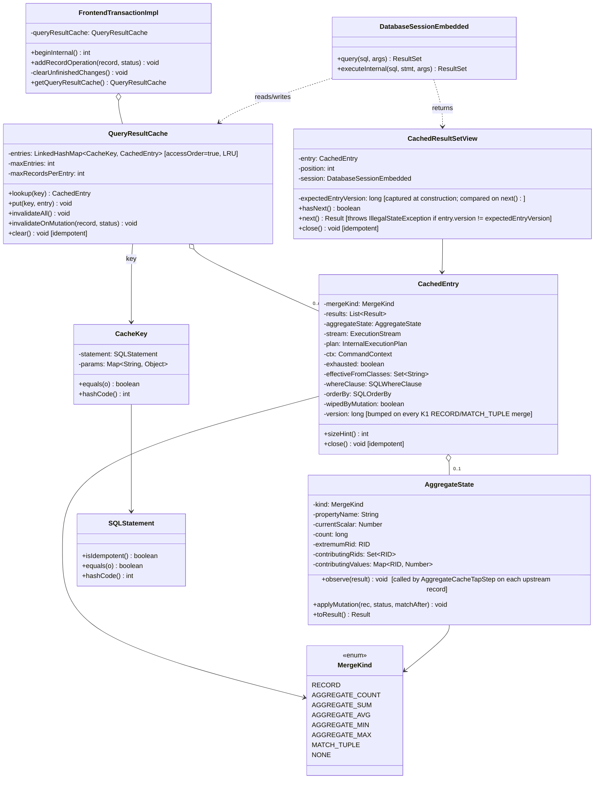

# YTDB-820 Transaction-scoped query result cache — Design

## Overview

YouTrackDB today re-executes every `Database.query()` call against storage, even when the same idempotent query was issued moments earlier in the same transaction. Hub and YouTrack DNQ workloads issue hundreds to thousands of duplicate-shape SELECT/MATCH queries per request — the lost cache (compared to the pre-migration Xodus `EntityIterable` cache) translates to a sustained per-request slowdown.

This design adds an opt-in **transaction-scoped result cache** keyed by parsed query AST + normalized parameters. The cache lives on `FrontendTransactionImpl` and is wiped on every transaction-end path (commit, rollback, close). First execution of a key populates the cache incrementally as the consumer iterates; subsequent executions of the same key return a thin view that replays cached `Result`s and, when the upstream stream was not exhausted, falls through to that stream to extend the cached list. Intra-transaction mutations either sharp-merge into existing entries (`WHERE.matchesFilters` + `ORDER BY` comparator) or wipe the cache (complex AST shapes).

The enabling primitives all exist already: `SQLStatement.equals()` is structural; `SQLStatement.isIdempotent()` excludes mutating statements; `FrontendTransactionImpl.addRecordOperation` is the single dirty-write hook; `clearUnfinishedChanges()` is the single tx-end sink; `SQLWhereClause.matchesFilters(record, ctx)` evaluates the WHERE in memory.

Disabled by default behind `youtrackdb.query.txResultCache.enabled`. Two more knobs bound memory (`maxEntries`, `maxRecordsPerEntry`). Non-deterministic queries (sysdate, random, uuid, $now, $current) are detected via a denylist AST walk and bypass the cache; `SQLSelectStatement.noCache` hint extends to opt-out per-query.

### Known v1 limitations (deferred to v2 / hardening)

Three correctness-bounded trade-offs accepted for v1, each tracked by a deferred D-record:

- **LIMIT after DELETE may return a short list.** Sharp-merge on K1 RECORD entries removes a deleted record from `entry.results` and re-clips to LIMIT. There is no "backfill" from beyond the cached prefix — the next call returns up to LIMIT-1 records even if a fresh execution would have N records by promoting one from beyond the original window. Acceptable per I4's "same LIMIT contract — at most LIMIT, possibly less" framing. Tracked at § Dirty-merge → LIMIT-clipped entries.
- **MIN/MAX worst-case O(n) recompute.** When the cached extremum element leaves (DELETED, transitions out of WHERE, or UPDATED away from the extremum), `AggregateState` re-scans `contributingValues` to find the new extremum — bounded by `maxRecordsPerEntry` (10000). D14 in `implementation-plan.md` proposes a `TreeMap` sorted-value index (O(log n)) as a deferred opt-in. Decision gate: D13 Hub-replay measurement.
- **MATCH multi-alias CREATED → K0 wipe (Etap B).** Track 8 Etap A handles single-alias MATCH CREATED with an O(1) `matchesFilters` + append. Multi-alias / cross-join / pattern-with-edges CREATED still wipes the entry — incremental discovery requires constrained pattern re-execution plus edge-CREATED dispatch. v2 candidate; see § Open questions deferred to execution.

`AST equals` fragility (D2 risk) and per-call allocation rate are tracked under § Open questions deferred to execution and validated pre-merge by D13.

The rest of the document is structured as: Class Design → Workflow → Cache key composition → Pause/resume mechanics → Dirty-merge policy → Cache invalidation → Non-determinism handling → Memory bounds → Concurrency and lifecycle.

## Class Design



> Note: Tracks 7 (SKIP support) and 8 (MATCH per-tuple sharp-merge) extend `CachedEntry` with additional fields (`skip`, `limit`, `aliasClasses`, `aliasWheres`, `contributingRids`, `reverseIndex`) not shown above; see § SKIP support and § MATCH per-tuple sharp-merge below.

**TL;DR.** Two new classes carry the design: `QueryResultCache` (the LRU bounded map on the transaction) and `CachedEntry` (one cache slot — results, paused stream, AST metadata for merge). `CachedResultSetView` is the consumer-facing `ResultSet` wrapper that reads from the cached list and falls through to the live stream. Everything else is hooks on existing types: `FrontendTransactionImpl` owns the cache and clears it; `DatabaseSessionEmbedded.query()` reads it; `addRecordOperation` triggers invalidation/sharp-merge. The cache is invisible behind the existing `ResultSet` API — consumers see no behavioral change other than speed.

### References
- Invariants: I1 (cache cleared on every tx-end path), I2 (cache only touched by owning thread)

## Workflow

```mermaid
sequenceDiagram
    participant App as DNQ / Hub
    participant Sess as DatabaseSessionEmbedded
    participant Cache as QueryResultCache
    participant View as CachedResultSetView
    participant Tx as FrontendTransactionImpl
    participant Stream as ExecutionStream

    App->>Sess: query("SELECT FROM User WHERE active = ?", [true])
    Sess->>Sess: parse → SQLStatement (cached in STATEMENT_CACHE)
    Sess->>Sess: isIdempotent? yes
    Sess->>Cache: lookup(SQLStatement, params)
    alt Miss
        Cache-->>Sess: null
        Sess->>Stream: realExecution.execute()
        Sess->>Cache: put(key, CachedEntry{results=[], stream, ...})
        Sess-->>App: new CachedResultSetView(entry, position=0)
        loop App iterates
            App->>View: next()
            alt position < results.size()
                View->>View: return results[position++]
            else stream still has rows
                View->>Stream: next()
                Stream-->>View: Result r
                View->>View: results.add(r); position++
                View-->>App: r
            else stream exhausted
                View->>View: entry.exhausted=true; stream.close()
                View-->>App: NoSuchElementException
            end
        end
    else Hit
        Cache-->>Sess: existing entry
        opt Dirty merge needed
            Cache->>Cache: apply pending dirty record ops
        end
        Sess-->>App: new CachedResultSetView(entry, position=0)
    end

    App->>Tx: user.save()
    Tx->>Cache: invalidateOnMutation(user, UPDATED)
    Cache->>Cache: dispatch per entry mergeKind — record splice / aggregate delta / K0 wipe

    App->>Tx: commit()
    Tx->>Cache: clear()
```

**TL;DR.** Read path branches on cache-miss vs cache-hit. Miss kicks off the real stream and returns a `CachedResultSetView` over a fresh `CachedEntry`. Each `next()` on the view either returns from the cached list or pulls one more `Result` from the stream and appends. Hit returns a new view over an existing entry — different consumers iterate independent positions over a shared, growing list. Mutations (`addRecordOperation`) either sharp-merge per entry (K1) or wipe everything (K0 fallback). Tx end clears the whole cache.

### Edge cases / Gotchas
- A second consumer calling `query()` before the first finished iterating sees what the first consumer already pulled (those `Result`s are in `entry.results` now). When the second consumer outruns the first's position, the second consumer is the one pulling from the live stream and appending. Different position counters on the views, shared list and stream.
- If a consumer drops the view without exhausting it, the stream stays live in the cache entry until another consumer pulls it further, until a mutation invalidates the entry, or until tx end closes everything.
- `next()` that pulls from the live stream and appends MUST do so atomically with respect to the `position++` it does locally — but the per-tx single-threading constraint (`assertOnOwningThread`) makes this trivial.

### References
- D-records: D2 (key composition), D4 (pause/resume), D5 (merge), D6 (non-determinism)

## Cache key composition

**TL;DR.** Key = `(SQLStatement, normalizedParams)`. `SQLStatement.equals()` is already structural over target/projection/whereClause/groupBy/orderBy/unwind/skip/limit/fetchPlan/letClause/timeout/parallel/noCache (see SQLSelectStatement:380), so the parsed AST hashed against a normalized parameter map gives semantically-equivalent queries the same key automatically. Whitespace, alias renaming, formatting differences all map to the same slot.

The parser is already on the hot path — `SQLEngine.parse()` runs on every `query()` call (DatabaseSessionEmbedded:632), and the result is itself cached by the existing `STATEMENT_CACHE_SIZE` knob. The result cache lookup happens after parsing but before execution-plan creation; the AST is the input we already have.

Parameter normalization: `Object[]` form is converted to a `LinkedHashMap<Integer, Object>` keyed by positional index, `Map` form is wrapped read-only. Equality is `Objects.equals` deep; arrays go through `Arrays.deepEquals`. Records and identifiables compare by RID (their existing equals contract).

### Edge cases / Gotchas
- `SQLStatement.equals()` is the same one that backs `STATEMENT_CACHE_SIZE` AST cache, so the cache-key behavior matches existing precedent.
- Parameters containing mutable objects (e.g., a `List` the caller reuses) are a footgun — if the caller mutates the list after `query()` returns, our key becomes stale. Document and defensive-copy the parameter map at lookup time. Cost is one shallow copy per query call.
- Two parameter maps differing only in iteration order on `HashMap` would collide on equals (good — they're semantically the same parameter set).

### References
- D-records: D2

## Pause/resume mechanics

**TL;DR.** A `CachedEntry` keeps a strong reference to the live `ExecutionStream` + `InternalExecutionPlan` + `CommandContext`. While not exhausted, any view that outruns the cached list calls `entry.stream.next()`, appends the result to the shared list, and returns it. When the stream reports `hasNext()==false`, the entry flips `exhausted=true`, closes the stream, nulls the reference. From that point all views are pure list-replays.

This makes `query()` calls within a transaction **idempotent in the consumer's view**: regardless of when a consumer arrives or how much of the prior consumer iterated, they all see the full, ordered, consistent result of the cached query. The first consumer to want a tail row pays its storage cost; everyone else pays nothing.

### Edge cases / Gotchas
- **WeakValueHashMap interaction.** `DatabaseSessionEmbedded.activeQueries` is weak-valued in embedded mode (DatabaseSessionEmbedded:256). The cache holds its own strong reference to the stream inside `CachedEntry`, which keeps the consumer-facing `LocalResultSet` reachable only if the cache also tracks it — but the cache deliberately does NOT track the original wrapper, only the bare `ExecutionStream`. So the original `LocalResultSet` wrapping the stream may be GC'd, which is fine: we only need the stream itself.
- **`session.closeActiveQueries()` in `clear()`** (FrontendTransactionImpl:973) iterates `activeQueries.values()` and calls `close()`. Cached streams are NOT in that map (cache only stores the raw stream, not the wrapping `LocalResultSet`). The cache's own `clear()` — called from `clearUnfinishedChanges()` — is what closes paused streams on tx end.
- **Mid-iteration mutation — K0 wipe.** When `addRecordOperation` fires and the cache decides to wipe the entry (K0), the entry's stream is closed immediately and the entry is removed from the cache. Live `CachedResultSetView`s still hold a Java reference to the now-removed entry, so they continue functioning over the **frozen** `entry.results` list until they hit the end of the list, at which point they raise `NoSuchElementException`. K0 does NOT mutate the cached list — it just drops the entry from the cache map — so the view's position counter remains valid. Document this as expected behavior: post-K0-wipe consumers either re-query for fresh data (cache miss now) or accept the snapshot of what was visible before the mutation.
- **Mid-iteration mutation — K1 merge (fail-fast).** K1 sharp-merge (RECORD or MATCH_TUPLE) mutates `entry.results` in place — splices, removes, re-clips. After the mutation, a view's positional index no longer maps to the same logical row in the result sequence. The view detects this via the `entry.version` counter: K1 merge increments `entry.version`; the view captured `expectedEntryVersion` at construction; on the next `view.next()` call, the version mismatch triggers `IllegalStateException("Cache view invalidated by in-tx mutation; re-issue query()")`. Contract: a consumer that mutates a record mid-iteration of a cached view of the same shape MUST drain the view first or accept that subsequent `next()` calls will fail. The fail-fast prevents silent skips / repeats. K1 aggregate does NOT bump `version` — aggregate views are single-row by construction (no position to invalidate); they always read the current `aggregateState.toResult()` on each call.
- **Storage cursor lifetime.** YTDB transactions are thread-affine (`assertOnOwningThread`). A paused stream's underlying B-tree cursor stays alive between the originating `next()` and the resuming `next()` — no concurrent mutation can sneak in on another thread. Storage-level pausing has been used for years in non-cache contexts (e.g., the consumer-driven iteration of a normal `query()` ResultSet), so the pattern is exercised.

### References
- D-records: D4
- Invariants: I3 (paused stream lives at most as long as its CachedEntry)

## Dirty-merge policy

**TL;DR.** When the cache holds an entry for a query and the transaction makes a record mutation that *could* affect that entry's results, four strategies apply:

- **K1 sharp (record-returning)** for simple SELECT shape (`SELECT FROM Class [WHERE simple-predicate] [ORDER BY columns | expressions] [SKIP n] [LIMIT m]`, no GROUP BY, no aggregates, no LET, no subqueries, no LET-based unionall): apply the mutation to each entry's `results` (or full prefix list for SKIP — see §"SKIP support" below).
  - **DELETED**: remove by RID.
  - **UPDATED**: if the record no longer matches `WHERE`, remove by RID. Otherwise remove by RID and re-splice via the comparator, then re-clip to `LIMIT` (or `SKIP + LIMIT` for SKIP entries). The re-splice collapses to "replace in place" when `ORDER BY` is null or the rank didn't change — doing it unconditionally costs O(LIMIT), avoids a per-call rank-change probe, and eliminates a class of bugs where in-place replace leaves a stale rank.
  - **CREATED**: if the RID is already in `results` (defensive against duplicate signals from a re-create within the same tx), treat as UPDATED. Otherwise evaluate `WHERE.matchesFilters(record, ctx)`; if matches, splice via the comparator (or append if no `ORDER BY`); re-clip to `LIMIT` (or `SKIP + LIMIT`).

  Expression `ORDER BY` is admitted when all items are flagged deterministic by `NonDeterministicQueryDetector`. `SKIP n LIMIT m` is admitted when `n + m <= maxRecordsPerEntry`; otherwise the entry falls back to K0.
- **K1 sharp (aggregate)** for single-aggregate SELECT shape (`SELECT <COUNT(*)|SUM(prop)|AVG(prop)|MIN(prop)|MAX(prop)> FROM Class [WHERE simple-predicate]`, no GROUP BY, no HAVING, no expression in aggregate argument): apply the mutation to each entry's `AggregateState`. See §"Aggregate sharp-merge" below.
- **K1 sharp (MATCH per-tuple)** for MATCH statement shape where every pattern node carries a `class:` annotation, no LET / UNWIND in scope, and no pattern-node WHERE references cross-alias state. Apply the mutation to each entry's tuple list via the per-RID reverse index. See §"MATCH per-tuple sharp-merge" below.
- **K0 wipe-on-mutation** for everything else: any entry whose discriminator is `NONE` is wiped on first matching mutation in this tx.

A static helper `SharpMergePredicate.classify(SQLStatement) → MergeKind` decides which strategy applies, computed once per entry on first cache put. Returns one of `RECORD`, `AGGREGATE_COUNT`, `AGGREGATE_SUM`, `AGGREGATE_AVG`, `AGGREGATE_MIN`, `AGGREGATE_MAX`, `MATCH_TUPLE`, or `NONE`.

### Why the hybrid

K0 alone (wipe every entry on first mutation) was the no-go baseline — in Hub-shaped workloads (read-many, mutate-few, repeat) the first save kills the cache for the rest of the transaction, eliminating ~all the benefit. K1 record-returning + K1 aggregate + K1 MATCH per-tuple together cover the dominant Hub shapes: per-class lookups (`SELECT FROM Class WHERE …`), paginated lists (`SKIP / LIMIT`), expression-ordered lists (`ORDER BY lower(name)`), the simple aggregates DNQ commonly emits (`COUNT(*)`, `SUM`, `AVG`, `MIN`, `MAX` over a plain property), and graph traversals (`MATCH {as:u, class:User}...`). Subqueries, GROUP BY, HAVING, expression-aggregates, non-decomposable aggregates (MEDIAN/MODE/PERCENTILE/COUNT DISTINCT), LET-based unions, and MATCH with cross-alias-state WHEREs fall through to K0 — they'd need full re-execution semantics that defeat the point of caching, or v2 effort that exceeds v1's budget.

### Aggregate sharp-merge

When `SharpMergePredicate.classify(stmt)` returns one of the `AGGREGATE_*` flavors, the cache entry carries an `AggregateState` (instead of a record list) with:
- `currentScalar` — the cached aggregate value
- `contributingRids` — `Set<RID>` of records currently included in the aggregate
- `contributingValues` — `Map<RID, Number>` of the per-record contribution value at the time of inclusion (for COUNT this map is omitted)
- For AVG: an extra `count` field alongside `currentScalar=sum` so the average can be recomputed on read.

`AggregateState` is populated from the **inner record stream** feeding the aggregate step, not from the user-visible `ResultSet`. The collapsed `ResultSet` carries only the scalar and has no per-RID material to seed `contributingValues`.

**Side-tap mechanism.** A new step class `AggregateCacheTapStep extends AbstractExecutionStep` (under `internal.core.tx`) is spliced into the plan chain immediately upstream of `AggregateProjectionCalculationStep` (`AggregateProjectionCalculationStep.java:121-137` shows the blocking aggregation loop: `prev.start(ctx)` → `while lastRs.hasNext: aggregate(lastRs.next, ctx, ...)`). The tap step's `internalStart(ctx)` calls `getPrev().start(ctx)` to obtain the upstream `ExecutionStream`, then returns a wrapping `ExecutionStream` whose `next(ctx)` invokes `aggregateState.observe(result)` before forwarding the unchanged `Result` to the consumer (which is `AggregateProjectionCalculationStep.aggregate`). `observe(result)` reads `result.getRecord().getIdentity()` for the RID and the projection-target property via the prebuilt extractor; for `COUNT(*)` it only adds to `contributingRids`. The tap is transparent to the downstream aggregate step — same `ExecutionStream` contract, identical record sequence.

**Splice point.** Two implementation options considered:
- **(a) Post-construction plan rewrite** — `DatabaseSessionEmbedded.query()` miss path obtains the constructed `InternalExecutionPlan` from `statement.execute(...)`, walks its `steps` list, finds the `AggregateProjectionCalculationStep`, and rewires `aggregateStep.prev` from its current upstream to a new `AggregateCacheTapStep` whose own `prev` is the original upstream. Local to cache code; no planner changes. Fragility: depends on the field name `prev` and on the planner emitting exactly one aggregate step.
- **(b) Planner callback** — `SelectExecutionPlanner` accepts an optional `Consumer<AggregateProjectionCalculationStep>` from the cache; the planner invokes it after constructing the aggregate step, letting the cache splice in the tap during plan build. Cleaner long-term, requires planner-side API surface.

**Chosen path: (a) for v1**, scoped entirely to cache code in `internal.core.tx`. The plan-rewrite happens once per cache-miss on an aggregate query, immediately before the first consumer `next()`; failure to find the expected aggregate step (e.g., planner emitted a different shape than `SharpMergePredicate.classify` predicted) downgrades the entry to `mergeKind=NONE` (K0 wipe on first mutation) rather than crashing. Track 4 step 3 owns the wiring; (b) is a v2 refactor candidate if the v1 rewrite proves fragile.

The cache derives `currentScalar` from the populated map (and `count` for AVG, `extremumRid` for MIN/MAX) once the underlying iterator drains — i.e., when `AggregateProjectionCalculationStep.executeAggregation` finishes consuming `prev.start(ctx)`. At that moment the tap has observed every record that contributed to the aggregate, so `AggregateState` is complete before the user reads the single-row aggregate result.

Per-mutation handling (where `match_before = contributingRids.contains(record.rid)`, `match_after = WHERE.matchesFilters(record, ctx)`):

- **COUNT(*)** — `match_before, match_after` transitions: T→T no-op; F→F no-op; T→F decrement and `rids.remove`; F→T increment and `rids.add`. CREATED is `match_before=false`; DELETED is the T→F case.
- **SUM / AVG** — same transition matrix. For T→T compute `delta = new_value - old_value` and update the scalar; otherwise add/subtract the full contribution. Update `contributingValues` in the same step.
- **MIN / MAX** — same transition matrix. The `AggregateState` for MIN/MAX carries an extra field `extremumRid: @Nullable RID` naming the record that currently holds the cached extremum value. `was_extremum = rid.equals(extremumRid)` — boolean RID identity, never numeric comparison. If `match_before` and `was_extremum` and the new state is no longer the extremum (the record is removed, transitions out of WHERE, or its new value loses the extremum-direction comparison against the other contributors), do an O(n) recompute over the remaining `contributingValues` to find the new extremum; update both `currentScalar` AND `extremumRid` from the recompute result. Otherwise the update is O(1): compare new value to `currentScalar` and adopt if it wins (in which case `extremumRid` also flips to the new winner's RID).

**Why RID comparison instead of `Number.equals`:** `Long.valueOf(5L).equals(Integer.valueOf(5))` returns `false` in Java — boxed `Number` subtypes never `.equals` across types. A `MIN(age)` query whose property is stored as `Long` but whose cached scalar was assigned from an `Integer` (or vice-versa via autoboxing / arithmetic narrowing) would have `was_extremum=false` for the actual extremum row, silently skipping the O(n) recompute and leaving a stale scalar after the extremum row mutates. Tracking the extremum by RID sidesteps every cross-type comparison hazard and gives ties unambiguous semantics (one RID owns the slot at any time; the next ties-recompute picks whichever survives).

### SKIP support

When `SharpMergePredicate.classify(stmt) == RECORD` and the statement carries `SKIP n LIMIT m` with `n + m <= maxRecordsPerEntry`, the cache entry's record list is the **full prefix** of size `n + m` rather than just the visible window of size `m`. `CachedResultSetView` returns records at positions `[n, n+m)` from the prefix.

Sharp-merge operates on the prefix list. CREATED splices into the prefix via comparator + re-clip to `n + m`; UPDATED removes by RID and re-splices; DELETED removes by RID and lets later records shift up. If a CREATED splice would push a record into position `< n`, that record becomes invisible to the view (correct behavior — it's now in the skipped prefix). If a DELETED removal shifts a record across the `n` boundary, the visible window now starts at a different record (also correct).

When `n + m > maxRecordsPerEntry`, classify returns `NONE` — the entry caches normally up to `maxRecordsPerEntry` but cannot support sharp-merge on the prefix beyond the cap. Pathological deep pagination (`SKIP 1000000 LIMIT 10`) falls into this fallback and is wiped on any matching mutation.

### MATCH per-tuple sharp-merge

When `SharpMergePredicate.classify(stmt) == MATCH_TUPLE`, the cache entry carries:

- `results: List<Result>` — the cached tuples in execution order.
- `contributingRids: Map<TupleIndex, Set<RID>>` — for each tuple, the set of RIDs across all alias bindings.
- `reverseIndex: Map<RID, Set<TupleIndex>>` — inverted lookup; populated incrementally as tuples are added.
- `aliasClasses: Map<String, Set<String>>` — per-alias class set (from the pattern node's `class:` annotation, plus subclasses via `SchemaClass.isSubClassOf`).
- `aliasWheres: Map<String, SQLWhereClause>` — per-alias WHERE filter (the pattern node's `where:` annotation).

The `effectiveFromClasses` for the polymorphism gate is the union of every `aliasClasses` value (each `aliasClasses[a]` already carries the subclass closure per Track 8 step 3) — see §"effectiveFromClasses scope" above.

Per-mutation handling for a mutated record `rec` with RID `rid`:

- **DELETED**: from `reverseIndex.get(rid)` (may be empty), drop every referenced tuple — remove them from `results`, drop the `(rid → tuples)` entry, and for every other RID those tuples carried, prune the now-dead tuple indices from `reverseIndex`. Bounded by entry size.
- **UPDATED**: from `reverseIndex.get(rid)`, for each tuple, identify which alias `a` bound `rid` by walking the tuple's `aliasClasses[a]` per alias and applying the Entity-guarded `isSubClassOf` gate `rec instanceof Entity entity && entity.getSchemaClass() != null && entity.getSchemaClass().isSubClassOf(name)` for each name in `aliasClasses[a]`. The per-alias `isSubClassOf` loop is used here (rather than the K1 RECORD path's single hash-set contains on `effectiveFromClasses`) because `aliasClasses` is alias-keyed: a record can bind to alias `u` but not alias `g`, so each alias's class set is consulted independently. Re-evaluate `aliasWheres[a].matchesFilters(rec, ctx)`. If the WHERE now fails for that alias, drop the tuple (same bookkeeping as DELETED). Otherwise leave the tuple in place — the updated record still satisfies the pattern position. Non-`Entity` records and entities with null schema class skip the entry entirely, same Entity-shape short-circuit as the K1 RECORD path.
- **CREATED**: branch on `entry.singleAlias` (captured at entry construction; true when `matchExpressions.size() == 1 && matchExpressions[0].items.isEmpty()`):
  - **Etap A — single-alias pattern** (`MATCH {as:u, class:User WHERE …} RETURN …`, one node, no edges): evaluate `aliasWheres[onlyAlias].matchesFilters(rec, ctx)`. If false, no-op. If true, invoke the entry-captured `returnProjector(rec, ctx)` to build a single-binding `Result` matching the original RETURN-clause shape, append to `entry.results`, update `contributingRids` + `reverseIndex` for the new tuple index, bump `entry.version`. O(1) — identical complexity profile to K1 RECORD CREATED.
  - **Etap B — multi-alias / cross-join / pattern-with-edges** (anything else): K0 wipe. Discovering new tuples that pass through `rec` as an entry-node of a multi-node pattern would require constrained-pattern re-execution (synthesize `@rid = rec.rid` constraint on the binding alias, run the scoped pattern walker), plus dispatch on edge-CREATED to catch new tuples that emerge only when a freshly-created vertex gains its edges. Out of scope for v1; separate ADR / v2 candidate.

**Multi-alias-same-class patterns** (e.g., `MATCH {as:u, class:User}.out('reportsTo'){as:m, class:User}`): a mutated `User` record may bind to multiple aliases in the same tuple. UPDATED re-evaluates every relevant alias's WHERE; if any fails, drop the tuple.

**Cross-alias-state WHEREs** — pattern WHEREs referencing `$current`, `$matched`, or other-alias bindings (`where: 'name = $matched.u.name'`) — can't be re-evaluated on a single dirty record outside the original pattern context. `classify` returns `NONE` for any MATCH whose pattern WHEREs contain such references.

**Subqueries in pattern WHEREs** — `classify` also returns `NONE` for any MATCH whose pattern WHEREs contain a nested `SQLSelectStatement` (e.g., `MATCH {as:u, class:User WHERE id IN (SELECT id FROM Active)} RETURN u`). Symmetric with the K1 RECORD / K1 AGGREGATE classify gate — subqueries in WHERE force re-execution of the inner SELECT on every per-mutation eval, defeating sharp-merge's cost model. Caught at classify time by walking each `aliasWheres[a]`'s AST for any `SQLSelectStatement` descendant.

### Edge cases / Gotchas
- **Aggregate over expression** — `SUM(age + bonus)` is NOT sharp-mergeable (predicate returns NONE → K0). The map would have to cache the result of the expression, not the property value, which mixes evaluation context with cache storage. Not worth the complexity for v1.
- **MIN/MAX recompute cost** — worst case O(n) when the current extremum element leaves (DELETED, transitions out of WHERE, or UPDATED to a non-extremum value). Bounded by `maxRecordsPerEntry`. Amortized O(1) for typical workloads where most mutations don't target the extremum.
- **Aggregate result type** — `COUNT(*)` returns `Long`, `SUM/AVG/MIN/MAX` return whatever the underlying numeric type is. The cached `Result` wrapping needs the same shape on replay as a fresh execution — preserve numeric type fidelity (don't coerce everything to `double`).
- **The `WHERE` predicate may reference helper variables (`LET`, `$current`)** — these can't be re-evaluated on a single dirty record outside the original execution context. `isSharpMergeable` returns NONE when `LET` is present.
- **`ORDER BY` may reference non-record properties (e.g., projections, function calls).** The comparator calls `SQLExpression.execute(record, ctx)` for each ORDER BY item regardless of whether the item is a plain reference or a more complex expression — same API the ranking primitives (`SQLOrderByItem.compare` → `modifier.execute(...)`) reach into at execution time. Classify admits expression ORDER BY when every item is flagged deterministic by `NonDeterministicQueryDetector`; non-deterministic ORDER BY (e.g., `ORDER BY sysdate()`, `ORDER BY random()`) is bypassed at cache-lookup time alongside any other non-deterministic AST reference.
- **Multi-class FROM (`SELECT FROM [Class1, Class2]`)** — sharp-mergeable, the predicate accepts. The mutation only fires sharp-merge if the record's class is one of the FROM classes; otherwise the entry is untouched.
- **Polymorphism / inheritance.** A `SELECT FROM Person` should pick up `Employee` records too if `Employee extends Person`. D11 specifies a closure step at entry construction that expands `fromClasses = {"Person"}` to `effectiveFromClasses = {"Person", "Employee", ...}` via `SchemaClass.getAllSubclasses()`. The polymorphism gate at mutation time is then `record instanceof Entity entity && entity.getSchemaClass() != null && entry.effectiveFromClasses.contains(entity.getSchemaClass().getName())`: a single O(1) hash-set contains. Non-`Entity` records (raw byte records, blobs, any `RecordAbstract` subclass that doesn't implement `Entity`) and entities with `getSchemaClass() == null` short-circuit to "skip entry"; those mutations cannot bind into a `SELECT FROM Class` result, so no cache invalidation is needed. `Entity.getSchemaClass()` is declared on `Entity` (`Entity.java:289`) and implemented by `EntityImpl` / `EdgeEntityImpl`. The closure stays valid for the entry's lifetime because I8 forbids schema mutation mid-tx.
- **LIMIT-clipped entries.** If `WHERE c WITH LIMIT 10` returned the first 10 of 1000 matches, and we splice an 11th match in the middle (CREATED record sorts before some of the existing 10), the entry now has 11 results. Do we truncate back to 10? Yes — sharp-merge re-applies LIMIT after splicing, preserving the cached result's contract. For SKIP+LIMIT entries the re-clip target is `SKIP + LIMIT` (the prefix cap), not `LIMIT`.
- **OFFSET/SKIP within cap.** `SKIP n LIMIT m` is K1-mergeable when `n + m <= maxRecordsPerEntry` (see §"SKIP support"). Above the cap, classify returns `NONE` and the entry falls back to K0.
- **WHERE contains a function on a non-cached value.** E.g., `WHERE indexOf(items, 'x') > 0`. `WHERE.matchesFilters` evaluates the function against the dirty record — works for deterministic functions; non-deterministic functions in WHERE are already excluded from caching at the entry's creation time (per Non-determinism handling).
- **MATCH pattern WHEREs referencing cross-alias state** (`$current`, `$matched`, `${otherAlias}.field`) — `classify` returns `NONE` because per-tuple re-evaluation can't reconstruct the pattern context for a single dirty record.

### References
- D-records: D5 (baseline K1), D8 (MATCH per-tuple), D9 (expression ORDER BY), D10 (SKIP with prefix cap)
- Invariants: I4 (post-merge entry observes same WHERE/ORDER BY/LIMIT contract as original execution)

## Cache invalidation

**TL;DR.** Three invalidation paths converge on `QueryResultCache`:

1. **Per-record mutation invalidation.** `FrontendTransactionImpl.addRecordOperation(record, status)` calls `queryResultCache.invalidateOnMutation(record, status)`. The cache iterates its entries; for each entry whose `effectiveFromClasses` contains the record's class name (O(1) hash-set contains; the closure is precomputed at entry construction per D11), dispatch on `entry.mergeKind`: `RECORD` → list splice (K1 record); `AGGREGATE_*` → `AggregateState.applyMutation` (K1 aggregate); `NONE` → wipe (K0). Standard `INSERT`/`UPDATE`/`DELETE` flow through `addRecordOperation` per affected record, so per-entry sharp-merge handles them without any bulk step.
2. **Bulk-only DML invalidation.** `DatabaseSessionEmbedded.executeInternal()` calls `queryResultCache.invalidateAll()` for `SQLTruncateClassStatement`, the only legitimately mid-tx-runnable bulk operation. Schema DDL (`CREATE/DROP/ALTER CLASS|PROPERTY|INDEX`) is **excluded** from this list because invariant I8 makes those statements unreachable mid-tx: `SchemaShared.saveInternal` and `IndexManagerEmbedded` throw before any cache effect would matter. Track 5 wires a `Java assert` after parsing that fires if a schema-DDL statement reaches the cache hook while a tx is active; the assert defends against silent regression if the upstream guard is ever relaxed. Regular `INSERT`/`UPDATE`/`DELETE` is also excluded: wiping on top of per-record invalidation would destroy K1-merged state for zero benefit. Scripts (`computeScript(...)`) are outside this path entirely; the plan declares them a Non-Goal.
3. **Tx-end invalidation.** `clearUnfinishedChanges()` calls `queryResultCache.clear()`. Single hook for commit, rollback, close — see Concurrency and lifecycle below.

### effectiveFromClasses scope

**Lifecycle.** `effectiveFromClasses` is computed **once** at `CachedEntry` construction (Track 2 wires the cache-lookup helper; Track 4 step 1 captures the closure). It is then **read on every `FrontendTransactionImpl.addRecordOperation(record, status)` call**: `invalidateOnMutation` iterates a snapshot of entries and skips any whose `effectiveFromClasses` does not contain `record.getSchemaClass().getName()` (O(1) hash-set lookup). The set is **never recomputed** after entry construction — invariant I8 guarantees schema stability per tx. This makes `effectiveFromClasses` the fast-path filter that keeps unrelated-class mutations from running per-entry sharp-merge work.

Two-step computation: **(1) extract** raw class names from the AST per the shape rules below; **(2) expand** to the subclass closure via `SchemaClass.getAllSubclasses()` for each extracted name. D11 captures the decision and trade-off. The closure step is what makes `effectiveFromClasses` "effective": it pre-computes polymorphism so the runtime gate is a single hash-set contains, not a per-name `isSubClassOf` loop.

Per-shape **raw** extraction (input to the closure step):

- **`RECORD` and `AGGREGATE_*` (simple SELECT)**: class names extracted from the top-level statement's `SQLFromClause.getItem()` (singular — `SQLFromClause` carries one `SQLFromItem`). The class name lives in `SQLFromItem.getIdentifier()` for the plain `FROM Class` shape; for the rid-list shape (`FROM [#cls:0, #cls:1]`) the classes are resolved from `SQLFromItem.getRids()`. Single-class FROM yields a one-element set; rid-list FROM yields the union of the cluster-owning classes; FROM-subquery falls through to the subquery walk in the `NONE` bullet below.
- **`SQLMatchStatement` (either `MATCH_TUPLE` or `NONE`)**: union of `class:` annotations across every pattern node. `MATCH {as:u, class:User}.out('memberOf'){as:g, class:Group} RETURN u` → `{User, Group}`. A mutation on a class outside this set (after closure expansion) skips the entry. Extraction is identical regardless of whether `classify` returns `MATCH_TUPLE` (Track 8 sharp-merge eligible; see §"MATCH per-tuple sharp-merge") or `NONE` (fallback when LET/UNWIND or cross-alias-state WHEREs disqualify per-tuple merge). The K1 vs K0 decision is orthogonal to class extraction: per-class scoping is the floor for both paths and already beats global wipe.
- **`NONE` with subquery in `WHERE` or `target`**: recursive walk collects raw class names from every nested `SQLSelectStatement`. A mutation on a class referenced only inside a subquery still wipes the outer entry. Required for correctness — without this, `SELECT FROM A WHERE id IN (SELECT id FROM B)` would survive mutations on `B` and serve stale results.
- **Fallback**: if the AST shape defeats class extraction (e.g., `FROM ($subqueryExpression)` where the inner shape isn't a literal class reference), `effectiveFromClasses` is `null`. The gate treats `null` as "matches everything" and forces a wipe on every mutation. Conservatively correct.

### Edge cases / Gotchas
- Class-level bulk ops (`TRUNCATE CLASS`, `DROP CLASS`) — full wipe; same path as DML.
- Index DDL — full wipe; index changes can change query plan even if data is unchanged. The query that hit the cache may now have a different plan, but the **cached results** are still correct *for this transaction's state* because the cache key is the AST, not the plan. So index DDL doesn't strictly require invalidation; we wipe anyway as a conservative simplification.
- Records mutated via direct API (`session.save(record)`) eventually flow through `addRecordOperation` — the hook is upstream of any save path, so per-record invalidation covers both SQL and programmatic mutation.

### References
- D-records: D3, D5

## Non-determinism handling

**TL;DR.** A static predicate `containsNonDeterministicReference(SQLStatement)` walks the AST and returns true if the statement references any of:
- Function names from the denylist: `sysdate`, `date` (zero-arg form), `uuid`, `random`, `eval`, `currentTimeMillis`, `nanoTime`.
- Context variables: `$now`, `$current`, `$thread`, `$parent`, `$depth`.
- Explicit opt-out: `SQLSelectStatement.noCache == TRUE`.

Cache lookup and put are both gated on `!containsNonDeterministicReference(stmt)`. The check runs once per query, on the parsed AST, before lookup; on positive hit, the query is executed normally without touching the cache.

### Why a denylist, not a feature flag in SQLFunction

There's no `isDeterministic()` predicate on `SQLFunction` today (only `aggregateResults()`, `filterResult()`). Adding such a flag everywhere is in-scope creep — the denylist is centralized in one new utility (`NonDeterministicQueryDetector`) and easy to audit. Future work can add the SPI-level flag if Hub starts using more functions that need exemption.

### Edge cases / Gotchas
- **`date(literal)` and `date(field)` are deterministic** — only zero-arg `date()` returns current-time. The denylist entry for `date` checks arity.
- **`$variable` set via `LET`** is deterministic if its expression is deterministic — but the predicate already excludes LET (sharp-merge fallback). Cache only gets simple AST shapes anyway.
- **User-defined Java functions.** No way to inspect determinism. Conservative default: any function not in a known-deterministic allowlist is treated as non-deterministic for caching purposes? Too aggressive — would exclude most queries. Practical choice: trust user-defined functions are deterministic; document that adding non-deterministic UDFs requires the `noCache` hint.
- **`sysdate()` inside `WHERE` clause** — caught by the AST walk. Cache is bypassed.

### References
- D-records: D6

## Memory bounds

**TL;DR.** Two knobs:
- `youtrackdb.query.txResultCache.maxEntries` (default 200) — LRU cap on cache-entry count per transaction. Eviction closes the evicted entry's stream.
- `youtrackdb.query.txResultCache.maxRecordsPerEntry` (default 10000) — per-entry cap on `results.size()`. When the cap is hit while populating, the entry switches to "do-not-cache" mode: the view continues to return live stream results to the consumer but stops appending to `results`. The entry is marked `overflow=true` and is no longer used for replay (next `query()` of the same key gets a miss and starts over).

Together, worst-case per-tx memory is bounded at `maxEntries × maxRecordsPerEntry` Result references. A `Result` typically holds either a `RecordAbstract` reference (which already lives in `localCache` so no duplicate heap cost) or a small projection map. 200×10000 = 2M Result references → manageable for typical Hub workloads.

### Edge cases / Gotchas
- **Backpressure on overflow.** When an entry crosses `maxRecordsPerEntry`, the consumer iterates normally — they just don't get cached. Other consumers calling `query()` for the same key get a miss and start fresh. This is correct but wasteful for a query that's actually re-issued — surface a logging metric so operations can tune.
- **Eviction during iteration.** A view holding an entry that gets LRU-evicted — the view's local cached list is still valid (it's referenced from the view, not the cache), but the entry's stream is closed by eviction. View continues to operate over its frozen list and reports exhaustion when the list runs out. Acceptable: behavior degrades to "I got the prefix that was cached at eviction time" rather than blowing up.
- **Default values are conservative.** Hub may need higher `maxEntries` (DNQ generates ~1000 distinct query shapes per request in pathological cases) — knobs are hot-changeable.

### References
- D-records: D7

## Concurrency and lifecycle

**TL;DR.** All cache **mutation paths** (lookup, put, invalidateOnMutation, invalidateAll, begin-clear) run under `FrontendTransactionImpl.assertOnOwningThread()` — enforced via existing guards at line 165 (`beginInternal`), 224 (`commitInternalImpl`), 250 (`getRecord`), 474 (`deleteRecord`), 511 (`addRecordOperation`), and the `executeInternal` path. The only cross-thread entry is `clear()` itself via tx-end paths (`close()`, `rollbackInternal()`), which are explicitly excluded from `assertOnOwningThread` to allow pool shutdown. Cache inherits the existing tx-shutdown best-effort semantics; no locking is added.

### Single-thread invariant (ENFORCED)

| Operation | Caller | Thread guard |
|---|---|---|
| `cache.lookup`, `cache.put` | `DatabaseSessionEmbedded.query()` / `executeInternal()` | owning thread (assertIfNotActive + tx ops) |
| `cache.invalidateOnMutation` | `FrontendTransactionImpl.addRecordOperation()` line 511 | `assertOnOwningThread()` |
| `cache.invalidateAll` | `executeInternal()` bulk-bypass branch | owning thread |
| `cache.clear()` (begin) | `beginInternal()` line 164 | `assertOnOwningThread()` |
| `view.next()` | consumer of returned `ResultSet` | owning thread (consumer = caller of `query()`) |
| **`cache.clear()` (tx end)** | `close()` / `rollbackInternal()` via `clearUnfinishedChanges()` | **NOT enforced — may run from pool-shutdown thread** |

The last row is the only cross-thread access. Cache inherits this from the existing tx model (same as `localCache.clear()` and `session.closeActiveQueries()`).

### Pool-shutdown semantics (inherited)

`DatabaseSessionEmbeddedPooled.realClose` may invoke `close()` from a thread different than the one that started the tx. Comment in FrontendTransactionImpl.java:122-132 spells this out and lists `close()` and `rollbackInternal()` as exemptions from `assertOnOwningThread`. The downstream `clear() → clearUnfinishedChanges() → queryResultCache.clear()` chain therefore runs cross-thread in this scenario.

YouTrackDB's tx model already accepts this for `localCache.clear()` and `closeActiveQueries()`. Cache inherits the same "best-effort cancel" contract: a consumer caught mid-iteration during pool shutdown may receive an arbitrary exception (typically from a closed-stream read), same as for any other active query at that moment.

### Idempotent close requirement

Because the LocalResultSet wrapper (when still alive in `activeQueries`) and the cache both hold references to the same `ExecutionStream`, `closeActiveQueries()` (line 973) and `queryResultCache.clear()` (called from line 993) can both invoke `stream.close()` on the same instance. Order is fixed by the existing code (`closeActiveQueries` before `clearUnfinishedChanges`), but it doesn't matter for correctness — the second invocation MUST be a no-op.

ENFORCED requirements:
- `ExecutionStream.close(ctx)` is idempotent. Track 3 adds a regression test calling `close` twice and asserting no exception.
- `QueryResultCache.clear()` is idempotent. Track 1 adds a test calling `clear` twice and asserting no exception + `size() == 0` both times.
- `CachedEntry.close()` is idempotent (null-guards `stream`, `plan`, `ctx`; second invocation early-returns).

### Lifecycle hooks
- **Creation:** lazy. First call to `getQueryResultCache()` on the transaction allocates the cache (only when `QUERY_TX_RESULT_CACHE_ENABLED` is true).
- **Reset on begin:** `beginInternal()` calls `queryResultCache.clear()` defensively, mirroring the existing `localCache.clear()` at line 182.
- **Reset on tx end:** `clearUnfinishedChanges()` (called from `clear()` which is called from `close()` and from `rollbackInternal()`) calls `queryResultCache.clear()`. Single sink.
- **`queryResultCache.clear()`** iterates entries (snapshot copy first — see LRU note below), closes each entry's non-null stream, drops the entries map.

### LRU and iteration safety

`entries` is a `LinkedHashMap<CacheKey, CachedEntry>` constructed with `accessOrder=true` so successful `lookup(key)` calls promote the entry to the head (LRU touch). The LRU cap is enforced by overriding `removeEldestEntry` — when `size() > maxEntries`, the eldest entry's `close()` is invoked and the map drops it.

Consequence: **read iteration of `entries` can mutate the map's structural state via the `accessOrder` promotion**. Any code that iterates the entries map (`invalidateOnMutation`, `invalidateAll`, `clear`) must first take a snapshot (`new ArrayList<>(entries.values())` or equivalent) before dispatching to per-entry handlers. The snapshot also guards against `ConcurrentModificationException` from `cache.remove(key)` called by K0 dispatch during iteration.

### Edge cases / Gotchas
- **Nested transactions (reentrant `beginInternal`).** `txStartCounter > 0` path skips the cache reset (same as `localCache`). The cache is per-outermost-tx, not per-nest-level — consistent with the rest of the tx state.
- **Read-only transactions.** Cache is active; reads benefit. No reason to gate on writable.
- **Auto-commit (`FrontendTransactionNoTx`).** Out of scope for v1; this transaction style begins-and-commits per command, so cache would have zero hit rate anyway. The cache field stays null for `FrontendTransactionNoTx`.
- **Exception during cache population.** If `entry.stream.next()` throws mid-iteration, the view propagates the exception to the consumer. The entry's stream is still open at that point — it's closed by the next tx-end hook. No special recovery: the failed query is unlikely to succeed on retry anyway, and the view's consumer is responsible for rollback semantics.
- **Concurrent close during view.next().** Pool shutdown invokes `cache.clear()` while owning thread is in `view.next()`. View may observe a closed stream (`stream.next()` throws) or a partially-cleared entries map. Result: arbitrary exception bubbles to consumer. Acceptable for shutdown path; no locking added. The view's consumer is in a tx that's being torn down — the exception is the signal.

### References
- Invariants: I1, I2, I3, I6, I7

## Invariants

**TL;DR.** Eight load-bearing properties the v1 implementation must hold: I1 (clear on every tx-end), I2 (mutation-path thread-affinity), I3 (paused-stream lifetime ≤ entry lifetime), I4 (post-merge entry == fresh-execution WHERE/ORDER BY/LIMIT contract), I5 (no caching of non-deterministic or `NOCACHE`-hinted queries), I6 (idempotent tx-end clear under cross-thread invocation), I7 (live view fail-fast on K1 merge of its entry), I8 (schema immutable per tx — enforced upstream). Each invariant carries an explicit test assertion in the track that introduces the relevant primitive. Together they cover: lifecycle correctness (I1, I3, I6), concurrency contract (I2, I6), result-set equivalence after sharp-merge (I4, I7), non-determinism gate (I5), and the schema-stability assumption that justifies D11's `effectiveFromClasses` closure precompute (I8).

- **I1 — Cache cleared on every tx-end path.** `clearUnfinishedChanges()` calls `queryResultCache.clear()`. Test: induce commit, rollback, and exception-during-iterate; assert `cache.size()==0` after each.
- **I2 — Cache MUTATION paths accessed only by owning thread.** `lookup`, `put`, `invalidateOnMutation`, `invalidateAll`, and begin-time `clear()` are all reached through call sites protected by `FrontendTransactionImpl.assertOnOwningThread()` (lines 165, 224 (`commitInternalImpl`), 250 (`getRecord`), 474, 511, plus the `executeInternal` path's `assertIfNotActive`). Tx-end `clear()` is the documented exception (see I6). Test: spawn another thread, attempt to invoke a mutation path via the tx (e.g., `addRecordOperation`), assert AssertionError.
- **I3 — Paused stream lives at most as long as its `CachedEntry`.** When the entry is evicted, wiped, or the tx ends, the stream is closed. Test: pause a stream, evict the entry, assert `stream.isClosed()`.
- **I4 — Post-merge entry observes the same WHERE / ORDER BY / LIMIT contract as the original execution.** Test: cache a SELECT with `WHERE active=true ORDER BY name LIMIT 10`, mutate records, verify K1-merged entry still satisfies all three constraints.
- **I5 — Cache only stores results of idempotent, deterministic statements.** Test: query with `sysdate()`, `random()`, and `noCache` hint; assert no entry is created.
- **I6 — Tx-end `clear()` is idempotent and safe under cross-thread invocation.** `QueryResultCache.clear()`, `CachedEntry.close()`, and `ExecutionStream.close()` are all idempotent — a second invocation is a no-op, not an exception. Required because pool shutdown can invoke `close() → cache.clear()` from a thread different than the one running `view.next()`, and because `closeActiveQueries()` (line 973) and `cache.clear()` (line 993) may both reach the same stream. Test: call `cache.clear()` twice, assert no exception + `size()==0` both times; call `ExecutionStream.close(ctx)` twice on a populated stream, assert no exception.
- **I7 — Live `CachedResultSetView` fails fast on K1 merge of its entry.** K1 RECORD and K1 MATCH_TUPLE merges increment `entry.version`. Each view captures `expectedEntryVersion` at construction and re-checks on every `next()`; mismatch throws `IllegalStateException("Cache view invalidated by in-tx mutation; re-issue query()")`. K1 AGGREGATE does not bump the version (single-row read; no positional invariant). K0 wipe does not bump the version either (entry is dropped from the cache map, but the view's frozen list remains valid). Test: cache a `SELECT … ORDER BY … LIMIT n`, start iterating the view, mutate a matching record mid-iteration, assert next `view.next()` throws `IllegalStateException`.
- **I8 — Schema is immutable for the lifetime of a transaction (ENFORCED upstream).** `SchemaShared.saveInternal` throws `SchemaException("Cannot change the schema while a transaction is active...")` at `SchemaShared.java:820-823` for every CREATE/DROP/ALTER CLASS|PROPERTY operation. `IndexManagerEmbedded` throws `IllegalStateException("Cannot create/drop an index inside a transaction")` at lines 307 (create) and 459 (drop). Therefore `effectiveFromClasses` (the subclass closure of the raw FROM names — see D11), `aliasClasses`, `aliasWheres`, and every other AST-derived metadata on `CachedEntry` is stable from `beginInternal` through the matching tx-end path; no recomputation is needed after entry construction. Test: with an active tx, invoke `CREATE CLASS X EXTENDS Person` via SQL DDL and `schemaClass.setSuperClasses(...)` via the programmatic API; assert both throw, the cache state is unchanged, and any subsequent INSERT of an `X` record (if `X` happens to already exist outside the tx) routes through the existing polymorphism gate's runtime `isSubClassOf` check.

### References
- D-records: D5 (post-merge contract → I4), D6 (non-determinism → I5), D11 (effectiveFromClasses closure depends on I8)
- Tracks: T1 (I1, I2, I6), T3 (I3), T4 (I4, I7), T5 (I5), T8 (I7 MATCH_TUPLE half)

## Open questions deferred to execution

**TL;DR.** One item punted from v1 design to a separate ADR: MATCH CREATED Etap B (multi-alias incremental tuple discovery). Track 8 covers Etap A (single-alias CREATED) in v1; Etap B requires constrained-pattern re-execution plus edge-CREATED dispatch — too large a scope-bump for v1. Other deferred items live in `implementation-plan.md` as D-records: D13 (Hub-replay validation gate, in Track 6 scope), D14 (MIN/MAX sorted-value index, v2 candidate gated on D13). Public-API plumbing, JMH benchmark shape, and telemetry surface were resolved during plan review and now live in their respective tracks (Track 6 for benchmarks + metrics).

- **MATCH CREATED Etap B (multi-alias).** Track 8's CREATED branch handles single-alias `MATCH {as:u, class:X WHERE …} RETURN …` (Etap A, in scope). Multi-alias / cross-join / pattern-with-edges CREATED still wipes the entry (K0). v2 candidate: constrained-pattern execution (synthesize `@rid = rec.rid` on the binding alias, run scoped pattern walker) + edge-CREATED dispatch (a freshly-created vertex only appears in multi-alias tuples once its edges are created — each edge-create separately triggers `addRecordOperation`). Out of scope for v1; separate ADR.

### References
- D-records: D8 (MATCH per-tuple sharp-merge — Etap A in scope here; Etap B is the deferred extension), D13 (Hub-replay), D14 (MIN/MAX sorted index)
- Tracks: T6 (JMH + metrics), T8 (Etap A delivery)
