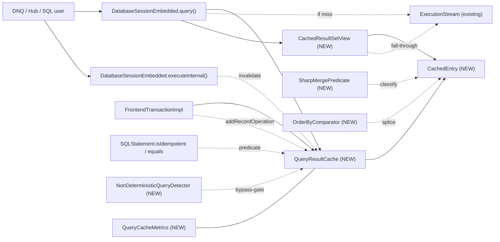

# YTDB-820 Transaction-scoped query result cache

## Design Document
[design.md](design.md)

## High-level plan

### Goals

Restore Xodus `EntityIterable`-style query result caching that DNQ-on-YTDB lost when Hub migrated off OrientDB. The cache is transaction-scoped, opt-in, and transparent — consumers see normal `ResultSet` semantics with a speedup on duplicate idempotent queries within one transaction. Target: Hub transactions issuing thousands of duplicate-shape SELECT/MATCH queries return their second-and-later executions from memory.

### Constraints

- **Opt-in.** Disabled by default via `youtrackdb.query.txResultCache.enabled`. Existing deployments must observe zero behavioral change unless the knob is flipped.
- **Transaction-scoped only.** Cache lives on `FrontendTransactionImpl` and is wiped on every tx-end path. No cross-tx leakage; no persistent or session-scoped variant in v1.
- **Idempotent queries only.** `SQLStatement.isIdempotent()` gates entry. DML statements bypass and invalidate.
- **Thread-affine.** `FrontendTransactionImpl` is single-threaded by design (`assertOnOwningThread`); cache inherits this — no locks.
- **Memory bounded.** Two knobs (`maxEntries`, `maxRecordsPerEntry`) cap per-tx footprint to predictable limits.
- **Result semantics preserved.** Cached views must return results identical to a fresh execution: same WHERE / ORDER BY / LIMIT contract, including post-mutation dirty-merge.
- **Implementation in `core` module.** No changes required in `server`, `embedded`, or higher modules. Lucene module is excluded per project convention.

### Architecture Notes

#### Component Map

- **`DatabaseSessionEmbedded`** (modified) — `query()` overloads gain a cache lookup before `statement.execute()`; cache miss path inserts and wraps in `CachedResultSetView`; `executeInternal()` non-idempotent branch calls `cache.invalidateAll()`. Read-only behavioral change: returned `ResultSet` is a view, not a fresh `LocalResultSet`.
- **`FrontendTransactionImpl`** (modified) — owns a lazily-allocated `QueryResultCache`. Defensive clear in `beginInternal()`. Final clear in `clearUnfinishedChanges()`. `addRecordOperation()` calls `cache.invalidateOnMutation()`.
- **`QueryResultCache` (new)** — LRU-bounded map keyed by `CacheKey`, value `CachedEntry`. Holds the per-tx state. Public API: `lookup`, `put`, `invalidateOnMutation`, `invalidateAll`, `clear`.
- **`CachedEntry` (new)** — one cache slot: `List<Result>`, paused `ExecutionStream`, exhaustion flag, AST metadata (`effectiveFromClasses` — the subclass closure of raw FROM names per D11, `whereClause`, `orderBy`) for sharp-merge.
- **`CachedResultSetView` (new)** — `ResultSet` implementation backed by a `CachedEntry`. Owns its own `position`; falls through to `entry.stream` when local position outruns cached list.
- **`CacheKey` (new)** — record holding `(SQLStatement, normalizedParams)`; key type for `QueryResultCache`. Reuses `SQLStatement.equals()` / `hashCode()` for structural equality and a defensive-copied normalized parameter map for caller-mutation immunity.
- **`MergeKind` (new enum)** — discriminator computed by `SharpMergePredicate.classify(stmt)`: `RECORD | AGGREGATE_COUNT | AGGREGATE_SUM | AGGREGATE_AVG | AGGREGATE_MIN | AGGREGATE_MAX | MATCH_TUPLE | NONE`. Drives the `invalidateOnMutation` dispatch. `MATCH_TUPLE` is the Track 8 addition (MATCH per-tuple sharp-merge); Track 4 introduces the other seven values.
- **`AggregateState` (new)** — per-entry container for aggregate-flavored caches: `currentScalar`, `contributingRids`, `contributingValues`, `count` (AVG only). Encapsulates the five aggregate-specific mutation handlers and the initial population loop. Held on `CachedEntry` only when `mergeKind ∈ AGGREGATE_*`.
- **`SharpMergePredicate` (new)** — static `classify(SQLStatement) → MergeKind`; AST-only inspection (no execution) called once per entry at construction. Encodes the K1 RECORD / K1 AGGREGATE / K1 MATCH_TUPLE / K0 NONE decision used by `QueryResultCache.invalidateOnMutation`.
- **`OrderByComparator` (new)** — builds `Comparator<Result>` from `SQLOrderBy`; used by K1 RECORD CREATED/UPDATED splice. Delegates per-item ranking to `SQLOrderByItem.compare(a, b, ctx)`, which in turn calls `modifier.execute(record, value, ctx)` so deterministic modifier-chain items (D9) work without comparator changes.
- **`NonDeterministicQueryDetector` (new)** — denylist AST walker for `sysdate`/`random`/`uuid`/`eval` function calls and `$now`/`$current`/`$thread`/etc identifier nodes. Single static `contains(SQLStatement)`; gates cache lookup (Track 5) and the K1 RECORD ORDER-BY-modifier admission (D9).
- **`QueryCacheMetrics` (new)** — operator telemetry: hit / miss / eviction counters owned by `QueryResultCache`. Surfaced via `FrontendTransactionImpl.getQueryCacheMetrics()`; sibling to the inline `TransactionMeters` record in `DatabaseSessionEmbedded`.
- **`SQLStatement.isIdempotent()` + `equals()` + `hashCode()`** (existing, reused) — DML predicate and cache-key primitive. No changes to existing override semantics.
- **`GlobalConfiguration`** (modified) — three new knobs: `QUERY_TX_RESULT_CACHE_ENABLED`, `QUERY_TX_RESULT_CACHE_MAX_ENTRIES`, `QUERY_TX_RESULT_CACHE_MAX_RECORDS_PER_ENTRY`.

#### D1: Cache value type is `List<Result>`, not `List<RecordAbstract>`

- **Alternatives considered**: literal `List<RecordAbstract>` per spec wording; `List<Result>` (chosen).
- **Rationale**: `ResultSet.next()` returns `Result`. SELECT queries with projections (`SELECT name, age+1 FROM …`) produce `Result`s that wrap computed properties, not records. Caching `RecordAbstract` would exclude all projection queries — half of DNQ's emission according to the issue context. Issue's `List<RecordAbstract>` is informal phrasing; `Result` is the type that crosses the API boundary.
- **Risks/Caveats**: `Result`s referencing the session must remain valid for replay — they don't carry session state directly, so safe.
- **Implemented in**: Track 2.

#### D2: Cache key = (parsed `SQLStatement`, normalized parameter map)

- **Alternatives considered**: raw SQL text hash; AST + params (chosen); AST with toCanonicalString output.
- **Rationale**: `SQLStatement.equals()` is already structural (verified on `SQLSelectStatement:380` over target/projection/where/groupBy/orderBy/unwind/skip/limit/fetchPlan/letClause/timeout/parallel/noCache). Reusing it gives whitespace/alias-invariant keys for free. Parsing already runs on the hot path; we don't pay extra parse cost. Parameter map is defensive-copied at lookup to immunize against caller mutation.
- **Risks/Caveats**: AST equality is only as good as `equals()` overrides on every node type — bugs there give wrong cache hits. `STATEMENT_CACHE_SIZE` keys by **SQL text**, not AST, so `SQLStatement.equals()` on deep AST trees is effectively new ground; latent override bugs may surface. Track 2 hardening: per-node-type equality tests for every AST node touched by D2 (target / projection / where / groupBy / orderBy / unwind / skip / limit / fetchPlan / letClause / timeout / parallel / noCache); plus a regression spy in the cache that, on every hit, optionally re-executes and compares result sets under a debug flag (`youtrackdb.query.txResultCache.verifyHits`). Verified pre-merge against the Hub-replay scenario in D13.
- **Implemented in**: Track 2.

#### D3: Cache lookup gated on `instanceof SQLSelectStatement || SQLMatchStatement`; bulk-bypass types invalidate

- **Alternatives considered**: cache all statements (wrong — DML is non-deterministic); cache via `isIdempotent()` predicate (too wide — `SQLProfileStatement`, `SQLExplainStatement`, `SQLIfStatement` also return true, and PROFILE/EXPLAIN cache hits would return stale plan/timing metadata); narrow type check (chosen).
- **Rationale**: PROFILE and EXPLAIN return plan/timing metadata that changes per call — caching them would silently return stale debug info. `SQLIfStatement` whose body is idempotent is technically cacheable but adds a corner case for no Hub-workload benefit. A direct `instanceof` check against the two statement types whose cache semantics are actually desired (SELECT and MATCH) keeps the gate narrow and obvious. The **DML invalidation** path uses an explicit type list, **not** `!isIdempotent()`: regular `INSERT`/`UPDATE`/`DELETE` flow through `addRecordOperation` per affected record, so per-entry sharp-merge already covers them — wiping on top would destroy K1-merged state for zero benefit. `invalidateAll()` fires only for `SQLTruncateClassStatement`, the only legitimately mid-tx-runnable bulk operation. Schema DDL (`CREATE/DROP/ALTER CLASS|PROPERTY|INDEX`) is excluded from the bulk-bypass list because I8 makes those statements unreachable mid-tx: `SchemaShared.saveInternal` and `IndexManagerEmbedded` throw before any cache effect would matter. Track 5 wires a `Java assert` that fires if a schema-DDL statement reaches the cache hook while a tx is active — defends against silent regression if upstream guard is ever relaxed. Scripts route through `computeScript(...)` — declared a Non-Goal, outside the cache surface entirely.
- **Risks/Caveats**: New idempotent statement types added in the future (e.g., a hypothetical new query DSL) would need an explicit cache opt-in. Same for new bulk-bypass statement types — the type list in Track 5's `isBulkBypass` helper has to be extended explicitly. If YouTrackDB ever relaxes the I8 schema-immutability guard (allows mid-tx schema DDL), the bulk-bypass list must be re-expanded to cover `SQLCreate/Drop/Alter` Class|Property|Index statements; the Track 5 assert is the canary.
- **Implemented in**: Track 2 (cache-lookup gate, narrow type check), Track 5 (DML invalidation hook, explicit bulk-bypass type list).

#### D4: Pause/resume via shared `ExecutionStream` + per-view position counters

- **Alternatives considered**: force-exhaust on first hit (consumer-unfriendly: pays for unused rows); materialize-on-demand without resume (spec violation: second consumer can't continue); pause/resume with shared stream (chosen).
- **Rationale**: spec explicitly requires "continue iterating during the next execution of the same query". Holding the live stream in the cache entry achieves this; per-view position counters make multiple concurrent consumers safe (within the single-threaded tx). Pulls from stream append to the shared list, so later consumers see the full ordered result.
- **Risks/Caveats**: storage cursor lifetime across `next()` calls — already exercised by normal consumer-paced iteration; the cache holds a longer-lived reference but no new failure mode. `LocalResultSetLifecycleDecorator` / `activeQueries` weak-value semantics: cache stores only the raw `ExecutionStream`, not the wrapper, so no interference.
- **Implemented in**: Track 3.
- **Full design**: design.md §"Pause/resume mechanics"

#### D5: Dirty-merge hybrid — K1 sharp (record-returning + decomposable aggregate) and K0 wipe-on-mutation otherwise

- **Alternatives considered**: K0-only (kills cache for read+write Hub tx — unacceptable); K1 record-only (loses aggregate cache hits); K1 record + K1 aggregate (chosen) with K0 fallback for non-decomposable shapes.
- **Rationale**: Hub workload is read-heavy with sparse writes and emits both record-returning SELECTs (DNQ entity lookups) and simple aggregates (per-class counters, ranges). K1 record handles the first set via `SQLWhereClause.matchesFilters` + `ORDER BY` comparator. K1 aggregate handles `COUNT(*)`, `SUM(prop)`, `AVG(prop)`, `MIN(prop)`, `MAX(prop)` over a plain property — each is incrementally updatable from a per-record contribution snapshot held in `AggregateState`. K0 fallback covers GROUP BY, HAVING, expression-aggregates, MEDIAN/MODE/PERCENTILE/COUNT DISTINCT, subqueries, LET, expression-ORDER BY, and SKIP — shapes where incremental update is intractable.
- **Risks/Caveats**: predicate `isSharpMergeable` returns one of seven discriminator values (`RECORD`, `AGGREGATE_COUNT`, `AGGREGATE_SUM`, `AGGREGATE_AVG`, `AGGREGATE_MIN`, `AGGREGATE_MAX`, `NONE`). False negatives (NONE when sharp would work) lose some cache hits but stay correct; false positives are silent-correctness bugs. MIN/MAX worst-case O(n) recompute when the extremum leaves — bounded by `maxRecordsPerEntry`.
- **Implemented in**: Track 4.
- **Full design**: design.md §"Dirty-merge policy" (+ §"Aggregate sharp-merge")

#### D6: Non-determinism via denylist AST walk + reused `noCache` hint

- **Alternatives considered**: `SQLFunction.isDeterministic()` SPI (adds API surface, requires touching every function class); denylist + opt-out (chosen); ignore problem (silently incorrect for sysdate-using queries).
- **Rationale**: known set of non-deterministic primitives (`sysdate`, `random`, `uuid`, `eval`, zero-arg `date()`, `$now`, `$current`, `$thread`) is small and stable. A single `NonDeterministicQueryDetector.contains(SQLStatement)` walker handles it. `SQLSelectStatement.noCache` Boolean already parses and surfaces; we extend its semantics to "skip result cache" in addition to its existing "skip execution-plan cache" meaning.
- **Risks/Caveats**: user-defined Java functions cannot be inspected — documented escape valve is `NOCACHE` hint. New non-deterministic stdlib functions (added in future) need an entry in the detector; coupling exists but is localized.
- **Implemented in**: Track 5.
- **Full design**: design.md §"Non-determinism handling"

#### D7: Per-tx memory bound — LRU at `maxEntries` + per-entry `maxRecordsPerEntry`

- **Alternatives considered**: unbounded (OOM on pathological tx); time-based eviction (per-tx timing is meaningless); LRU + per-entry cap (chosen).
- **Rationale**: two-dimensional bound — entry count caps distinct queries; per-entry row count caps any single query's footprint. LRU eviction is the standard choice for working-set workloads. Defaults (200 entries × 10000 rows = 2M Result refs) are pessimistic-but-safe for typical Hub.
- **Risks/Caveats**: knob tuning is workload-dependent — surface metrics for hit-rate / eviction-rate so operators can adjust. Hot-changeable per `GlobalConfiguration` convention.
- **Implemented in**: Track 1 (knob declarations + LRU map), Track 5 (per-entry overflow handling).

#### D8: MATCH per-tuple sharp-merge (DELETED + UPDATED full; CREATED Etap A — single-alias only; multi-alias CREATED deferred to v2)

- **Alternatives considered**: K0 always for MATCH (v1 baseline — loses cache for any tx with a mutation on a class in the pattern); partial K1 covering `DELETED` + `UPDATED` only (initial Track-8 proposal); partial K1 + Etap A single-alias `CREATED` (chosen, justified by Hub list-view workload — DNQ emits many `MATCH {as:u, class:User WHERE …} RETURN u` shapes which K0-wipe on every `entity.save()`); full K1 including multi-alias `CREATED` discovery (Etap B — incremental pattern-walker on a single record with edge-CREATED dispatch — v2).
- **Rationale**: Hub uses MATCH heavily for graph traversals AND for class-scoped lookups. K0 baseline kills MATCH cache the moment any save touches a class in the pattern. Per-tuple RID-set tracking enables targeted invalidation for DELETED / UPDATED. For CREATED, the natural split is **single-alias** (pattern collapses to "class scan + WHERE filter", merge logic is structurally identical to K1 RECORD CREATED — O(1) `matchesFilters` + append) vs **multi-alias** (requires constrained pattern re-execution + edge-CREATED dispatch). Etap A captures the ~30-50% of Hub MATCH queries that are single-alias at near-zero implementation cost. Etap B's incremental pattern walker plus the edge-CREATED dispatch infrastructure are a separate ADR.
- **Risks/Caveats**: per-tuple `Set<RID> contributingRids` adds ~5-10% memory per MATCH entry. Reverse-index `Map<RID, Set<TupleIndex>>` adds O(distinct-RIDs × entry-size) bookkeeping. Multi-alias-same-class patterns (e.g., self-loops where a record could bind to both alias `u` and alias `g`) require re-evaluating every relevant alias's WHERE. Pattern WHEREs referencing cross-alias state (`$current`, `$matched`) defeat per-tuple re-eval — classify falls back to NONE. Etap A risk: `returnProjector` correctness depends on the projection-evaluation closure built at entry construction matching the original execution's projection semantics exactly; a divergence would silently return malformed `Result`s for new tuples. Track 8 step 6 test (g) validates equivalence vs fresh re-execution.
- **Implemented in**: Track 8.
- **Full design**: design.md § Dirty-merge policy → MATCH per-tuple merge (Etap A added in this revision; Etap B deferred).

#### D9: Modifier-chain ORDER BY in K1 RECORD (gated on determinism)

- **Alternatives considered**: plain-identifier-only ORDER BY (v1 baseline — loses K1 for `ORDER BY name.upper()`, `ORDER BY name.toLowerCase().trim()`); allow any ORDER BY expression (would require grammar extension — current `YouTrackDBSql.jj` ORDER BY production accepts only `Identifier [Modifier]`, `Rid`, or `RECORD_ATTRIBUTE`; arithmetic forms like `ORDER BY priority * 10` and function-call forms like `ORDER BY lower(name)` are not grammar-supported); allow deterministic modifier-chain ORDER BY (chosen).
- **Rationale**: `SQLOrderByItem` carries an alias `String` plus an optional `SQLModifier` chain. The modifier chain is exactly the AST slot already exercised by `SQLOrderByItem.compare` at execution time, which reaches into `modifier.execute(record, value, ctx)`. `NonDeterministicQueryDetector` (Track 5) already walks the AST for the cache-bypass gate; reusing the same walker on each item's `modifier` adds one method call. Gate: "ORDER BY item is admitted iff its `modifier` chain (when present) contains no non-deterministic function call or `$variable` reference". Plain-identifier items (no modifier) are always admitted; arithmetic / function-call ORDER BY is out of scope (would need grammar work — deferred to a future track or version).
- **Risks/Caveats**: per-comparator-call `modifier.execute(...)` adds CPU vs direct field lookup — bounded by `maxRecordsPerEntry` × LIMIT. For typical entries (≤100 records, LIMIT 10) the overhead is negligible. For pathological entries (10000 records) the splice path's modifier-execute calls dominate; acceptable trade-off for the cache hits saved.
- **Implemented in**: Track 5 (classify-gate relaxation; `OrderByComparator` from Track 4 already delegates ranking to `SQLOrderByItem.compare`).

#### D10: SKIP support in K1 RECORD with prefix-cap

- **Alternatives considered**: SKIP always K0 (v1 baseline — loses K1 for any paginated query); SKIP always K1 with unbounded prefix cache (memory blowup for `SKIP 1000000 LIMIT 10`); SKIP K1 conditional on `skip + limit <= maxRecordsPerEntry` (chosen).
- **Rationale**: typical UI pagination has `skip + limit` in the 10-1000 range — well under the 10000 default cap. Hub list views reissue the same query shape repeatedly as the user pages. Caching the full prefix up to `skip + limit` records (not just the visible window) lets CREATED/UPDATED mutations re-splice into the prefix; the view returns records `[skip, skip+limit)` after each merge. The cap protects against pathological deep-pagination patterns.
- **Risks/Caveats**: prefix cache is `skip + limit` records, not `limit` — slightly larger entry footprint than the visible window. Re-splice on CREATED operates on the prefix, then re-clips to `prefix.size() ≤ skip + limit`; if the window moves past a record on splice, the visible page changes (correct behavior). When `skip + limit > maxRecordsPerEntry`, classify returns NONE (K0).
- **Implemented in**: Track 7.

#### D11: Pre-expand `fromClasses` to subclass closure at entry construction (field renamed to `effectiveFromClasses`)

- **Alternatives considered**: per-mutation `isSubClassOf` loop over raw `fromClasses` (v1 baseline before D11); pre-expanded closure stored on the entry as `effectiveFromClasses` (chosen, justified by I8); cache `SchemaClass` references instead of names (no benefit — `SchemaClass.equals` is name-based, hash-set on names is identical).
- **Rationale**: I8 guarantees schema is immutable per tx, so the closure `effectiveFromClasses = fromClasses ∪ (every subclass of each name)` computed via `SchemaClass.getAllSubclasses()` at entry construction is stable for the entry's lifetime. The polymorphism gate at mutation time becomes a single `O(1)` `Set<String>.contains(record.class.name)` instead of `O(|fromClasses|)` `isSubClassOf` calls. Symmetric with Track 8's per-alias `aliasClasses` (which already pre-expands to subclass closure). Field rename from `fromClasses` to `effectiveFromClasses` makes the "is a closure, not raw FROM names" semantics self-documenting.
- **Risks/Caveats**: `SchemaClass.getAllSubclasses()` cost at construction is `O(subclass count)` — acceptable since it happens once per entry. Class deletion mid-tx would invalidate the closure, but I8 forbids this. If I8 is ever relaxed (mid-tx schema mutations allowed), the closure becomes stale and must be recomputed on each schema-DDL; the Track 5 assert (D3 risk) is the canary.
- **Implemented in**: Track 4 step 1 (capture `effectiveFromClasses` via closure expansion); Track 4 step 4 (gate uses `effectiveFromClasses.contains(name)`).
- **Full design**: design.md §"effectiveFromClasses scope" (two-step extract-then-expand model)

#### D12: AST identity fast-path on cache lookup

- **Alternatives considered**: deep `SQLStatement.equals()` on every lookup (baseline — D2 behavior); identity (`==`) fast-path before falling through to deep equals (chosen); pre-canonicalized text key (loses the whitespace/alias-invariance D2 buys for free).
- **Rationale**: `SQLEngine.parse()` is backed by `STATEMENT_CACHE` (size-bounded LRU of parsed ASTs keyed by raw SQL text). When the same SQL text is reissued, `parse()` returns the **same `SQLStatement` instance** that previous calls returned — `==` identity, not just `equals`. The cache-key comparison can short-circuit: `if (cached.stmt == lookup.stmt) → hit` before walking the AST recursively for structural equality. For DNQ workloads that reissue the same query text thousands of times, this collapses the per-lookup cost from deep-AST-walk to a pointer compare plus the parameter-map equality. The deep-equals path remains correct for the cross-`STATEMENT_CACHE`-eviction case (different parse, structurally equal AST).
- **Risks/Caveats**: identity fast-path is purely an optimization — correctness fall-through to deep equals preserves D2's semantics. Risk localized to the `CacheKey.equals` implementation: identity comparison must NOT replace deep equals, only precede it. Track 2 test verifies both paths: (i) two identical-text queries return cache hit via identity (verified by spy that records which equality branch fired); (ii) `STATEMENT_CACHE` eviction between two issues of the same text still returns a hit via deep equals.
- **Implemented in**: Track 2 (incorporated into `CacheKey.equals(Object)` body alongside parameter-map deep equality).

#### D13: Hub-replay validation gate (pre-merge)

- **Alternatives considered**: ship on synthetic JMH alone (chosen baseline before D13 — measures hit/miss/sharp-merge in isolation); ship after Hub-workload replay validates K1 coverage (chosen, justified by D5 K1-vs-K0 risk).
- **Rationale**: D5 admits K1 sharp-merge only for "simple SELECT shape" + 5 decomposable aggregates + bounded MATCH; all other shapes fall back to K0 wipe-on-first-mutation. D5 asserts Hub workload is read-heavy and emits primarily K1-shaped queries, but no production query-distribution data is in this design. Before Hub deployment, Track 6 will record an anonymized DNQ-emission sample from a Hub staging environment (single tx, ~1000 queries representative of one HTTP request's query mix) and replay it against the cache; pass criteria: ≥70% of repeat-shape queries classify as K1 (i.e., `SharpMergePredicate.classify(stmt) != NONE`) AND post-merge state matches fresh-execution state across the recorded mutation sites. Failures inform whether K1 coverage needs broadening or whether deployment is premature.
- **Risks/Caveats**: replay requires DNQ-query-log capture from staging — coordinate with Hub team to schedule. If K1 coverage falls below 70%, Track 8 (MATCH) and a follow-up "K1 for LET" / "K1 for subquery" become higher priority. Replay output committed to `_workflow/` for branch lifetime as the headline pre-merge artifact.
- **Implemented in**: Track 6 (JMH harness extended with a `HubReplay` scenario; replay data sourced from Hub staging).

#### D14: MIN/MAX sorted-value index (deferred to v2, decision warranted by D13 replay)

- **Alternatives considered**: O(n) recompute when the extremum element leaves (v1 baseline — chosen); `TreeMap<Number, Set<RID>>` sorted index on `AggregateState` giving O(log n) per-op; heap-backed extremum (O(1) read, O(log n) insert, but O(n) remove-by-RID — doesn't fit the K1 mutation profile).
- **Rationale**: D5 worst case for MIN/MAX is O(`maxRecordsPerEntry`) = O(10000) recompute when the cached extremum is removed / transitions out of WHERE / updated to a non-extremum value. Sorted-value index trades O(1) common-case for O(log n) consistent — ~14 ops at n=10000 vs O(10000) worst case (~700× faster in the patho case, ~14× slower in the typical case where mutations don't touch the extremum). Net win depends on workload: stable extremum (`MIN(createdAt)` after monotonic inserts) → status quo wins; churning extremum (`MIN(priority)` with constant updates) → sorted index wins. Hub's actual MIN/MAX usage pattern is the gating question; D13 replay measures it.
- **Risks/Caveats**: ~4× memory growth for MIN/MAX entries (additional `TreeMap` per entry); negligible for typical Hub MIN/MAX counts (<50 such entries per tx). Numeric comparator needs `BigDecimal`-coerced equality to avoid cross-Number-subtype hazards (same reason the v1 design uses RID-identity instead of `Number.equals`). If activated, would expose as opt-in flag `youtrackdb.query.txResultCache.minMaxSortedIndex.enabled` (default false, hot-changeable) to allow operators to switch per-workload.
- **Implemented in**: deferred — v2 candidate. Decision gate: D13's Hub replay surfaces patho-MIN/MAX recompute frequency. If recompute median > 100ms per tx (Track 6 JMH threshold), implement in v1.1; otherwise leave for v2.

### Invariants

- **I1** — Cache cleared on every tx-end path (commit, rollback, close). Enforced by single hook in `clearUnfinishedChanges()`. Test: T1.
- **I2** — Cache MUTATION paths (`lookup`, `put`, `invalidateOnMutation`, `invalidateAll`, begin-time `clear()`) accessed only by owning thread. Enforced via existing `assertOnOwningThread()` guards in `FrontendTransactionImpl` at lines 165 (`beginInternal`), 224 (`commitInternalImpl`), 250 (`getRecord`), 474 (`deleteRecord`), 511 (`addRecordOperation`). Tx-end `clear()` is the explicit exception, covered by I6. Test: T1.
- **I3** — Paused `ExecutionStream` in a `CachedEntry` is closed when the entry is evicted, invalidated, or the tx ends. Test: T3.
- **I4** — Post-merge `CachedEntry` observes identical WHERE / ORDER BY / LIMIT contract as a fresh execution. Test: T4.
- **I5** — Non-deterministic queries (denylist hit or `NOCACHE` hint) never produce a cache entry and never hit a cache entry. Test: T5.
- **I6** — Tx-end `clear()` is idempotent and safe under cross-thread invocation. `QueryResultCache.clear()`, `CachedEntry.close()`, and `ExecutionStream.close()` are all idempotent — a second invocation is a no-op. Required because pool shutdown invokes `close() → cache.clear()` cross-thread, and because `closeActiveQueries()` (line 973) may reach the same stream as `cache.clear()` (line 993). Tests: T1 (cache + entry double-close), T3 (ExecutionStream double-close regression).
- **I7** — Live `CachedResultSetView` fails fast on K1 merge of its underlying entry. K1 RECORD and K1 MATCH_TUPLE merges increment `entry.version`; view captures `expectedEntryVersion` at construction and throws `IllegalStateException` on mismatch in `next()`. K1 AGGREGATE does not bump version (single-row reads); K0 wipe does not bump version (view continues over the frozen list). Test: T4 (mid-iteration mutation on a cached entry → next `view.next()` throws).
- **I8** — Schema is immutable for the lifetime of a transaction (ENFORCED upstream). `SchemaShared.saveInternal` (`SchemaShared.java:820-823`) throws `SchemaException` on every CREATE/DROP/ALTER CLASS|PROPERTY mid-tx; `IndexManagerEmbedded` (lines 307, 459) throws on index DDL mid-tx. `effectiveFromClasses` (subclass closure per D11), `aliasClasses`, `aliasWheres`, and other AST-derived metadata on `CachedEntry` therefore do not require recomputation after construction. Test: T1 (attempt `CREATE CLASS X EXTENDS Y` and `schemaClass.setSuperClasses(...)` mid-tx; assert both throw; cache state unchanged).

### Integration Points

- `DatabaseSessionEmbedded.query(...)` and `executeInternal(...)` — cache lookup / population / invalidation hooks.
- `FrontendTransactionImpl.beginInternal()` / `clearUnfinishedChanges()` / `addRecordOperation()` — lifecycle hooks.
- `SQLStatement.isIdempotent()` and `equals()` — cache predicate and key.
- `SQLWhereClause.matchesFilters(Identifiable | Result, CommandContext)` — dirty-merge primitive.
- `SQLSelectStatement.noCache` — opt-out hint, semantics extended.

### Non-Goals

- Cross-transaction result sharing (between concurrent `FrontendTransaction` instances).
- Persistent / disk-backed cache.
- Cache for the `computeScript(...)` path or for Gremlin queries (separate engine in `embedded`).
- Server-mode propagation (remote storage). Cache lives in the embedded session.
- `FrontendTransactionNoTx` (auto-commit) support — single-statement tx have no replay potential.
- Eviction tuning beyond LRU + caps (e.g., size-aware eviction, TTL).
- Cache-aware query plans (planner reading the cache to pick join orders).
- Sharp-merge for aggregates other than `COUNT(*)`, `SUM(prop)`, `AVG(prop)`, `MIN(prop)`, `MAX(prop)` over a plain property. `GROUP BY`, `HAVING`, expression-aggregates (`SUM(a+b)`), `COUNT(DISTINCT col)`, `MEDIAN`, `MODE`, `PERCENTILE` all fall back to K0 wipe on first matching mutation in v1.
- MATCH `CREATED` **multi-alias** per-tuple discovery (Etap B) — incremental pattern-walker execution on a single new record across edge traversals, plus dispatch on edge-CREATED to catch tuples that emerge only once a freshly-created vertex gains its edges. Out of scope for v1; separate ADR / v2 candidate. **Etap A — single-alias MATCH CREATED** (`MATCH {as:u, class:X WHERE …} RETURN …`, `matchExpressions.size() == 1 && matchExpressions[0].items.isEmpty()`) IS in scope for v1 per D8 and Track 8: the merge collapses to O(1) `matchesFilters` + append + index update. v1 K1 for MATCH thus covers full `DELETED` + `UPDATED` (any shape) and `CREATED` (single-alias only). Multi-alias / cross-join / pattern-with-edges CREATED still wipes the entry.
- SKIP queries where `skip + limit > maxRecordsPerEntry` — the prefix cache for K1 SKIP is bounded by `maxRecordsPerEntry`, so paginated queries past that depth fall back to K0 wipe on first matching mutation.
- LET-based unions (`SELECT EXPAND($u) LET ..., $u = unionall($a, $b)`) — `LET` is K0 in v1; relaxing it requires a separate "K1 for LET" effort. v2 candidate if DNQ generates this shape.

## Checklist

- [ ] Track 1: Skeleton — knobs, data structures, lifecycle wiring
  > Lay down the foundational pieces with no behavioral change: three `GlobalConfiguration` knobs, new `QueryResultCache` and `CachedEntry` types (empty methods or no-op), `queryResultCache` field on `FrontendTransactionImpl`, and the begin/clear lifecycle hooks. After this track the cache exists, is allocated lazily when enabled, and is correctly wiped on every tx-end path — but no `query()` reads or writes it yet.
  > **Scope:** ~4-5 steps covering knob declarations, `QueryResultCache` + `CachedEntry` skeleton, `FrontendTransactionImpl` field wiring, lifecycle invariant tests.

- [ ] Track 2: Read path — cache key, lookup, population, `CachedResultSetView`
  > Wire the cache into `DatabaseSessionEmbedded.query()` and `executeInternal()` idempotent branch. Build the cache key from the parsed AST + normalized parameters; on miss, execute normally and wrap the result in a `CachedResultSetView` that incrementally populates the entry as the consumer iterates; on hit, return a view over the existing entry. No dirty-merge, no pause/resume across queries yet — only the populate-and-replay path within one consumer's lifetime.
  > **Scope:** ~5 steps covering `CacheKey`, `CachedResultSetView`, lookup at all three `query()` overloads + `executeInternal`, behavioral tests for second-query hit, idempotent-only gate.
  > **Depends on:** Track 1

- [ ] Track 3: Pause/resume — shared stream + per-view position
  > Extend `CachedEntry` to hold the live `ExecutionStream` past the first consumer's iteration, and extend `CachedResultSetView` to fall through to it when the consumer outruns the cached list. Multiple `query()` calls within one tx return independent views sharing the same entry; the first view to pull a particular row is the one that pays the storage cost. Close the stream when exhausted, evicted, or invalidated.
  > **Scope:** ~4-5 steps covering stream-hold in `CachedEntry`, fall-through in `CachedResultSetView`, exhaustion flip, stream-lifecycle tests including invalidation-mid-iteration.
  > **Depends on:** Track 2

- [ ] Track 4: Dirty-state merge — K1 record + K1 aggregate (COUNT/SUM/AVG/MIN/MAX) + K0 fallback
  > Hook `addRecordOperation()` to call `invalidateOnMutation`. Implement `SharpMergePredicate.classify(stmt) → MergeKind` (seven discriminator values), K1 record-returning sharp-merge (UPDATED by-RID replace, DELETED by-RID remove, CREATED via `WHERE.matchesFilters` + `ORDER BY` splice + `LIMIT` re-clip), K1 aggregate sharp-merge via per-entry `AggregateState` (incremental scalar update for COUNT/SUM/AVG/MIN/MAX), and K0 wipe fallback for non-decomposable AST (GROUP BY, HAVING, expression-aggregates, MEDIAN/MODE/PERCENTILE/COUNT DISTINCT, subqueries, LET, expression-ORDER BY, SKIP). Capture AST metadata + classify at entry creation in Track 2's path — minor revisit.
  > **Scope:** ~7 steps covering predicate, OrderByComparator, AggregateState, invalidateOnMutation dispatch, polymorphism, addRecordOperation hook, full test matrix (record paths + aggregate transition matrix + K0 fallbacks).
  > **Depends on:** Tracks 2, 3

- [ ] Track 5: Hardening — non-determinism, DML invalidation, memory bound, expression ORDER BY
  > Production-readiness for correctness: AST denylist for non-deterministic functions/variables, `NOCACHE` hint extension, full-wipe on non-idempotent `executeInternal()` calls, LRU enforcement at `maxEntries`, per-entry overflow handling at `maxRecordsPerEntry`. Plus R-B: with `NonDeterministicQueryDetector` now in place, relax the K1 RECORD classify gate to admit ORDER BY expressions that the detector reports as deterministic. `OrderByComparator` (built in Track 4) already calls `SQLExpression.execute(record, ctx)` for each item, so no comparator changes are needed.
  > **Scope:** ~5-6 steps covering `NonDeterministicQueryDetector` + wiring, `noCache` semantic extension, DML invalidation hook, per-entry overflow handling, expression-ORDER-BY gate relaxation, integration tests across all five surfaces.
  > **Depends on:** Tracks 1, 2, 3, 4

- [ ] Track 6: Observability — `QueryCacheMetrics` + JMH benchmark
  > Operator-facing observability: new `QueryCacheMetrics` class with hit/miss/eviction counters held by `QueryResultCache`, accessible from `FrontendTransactionImpl`. JMH microbenchmark for cache-hit, cache-miss, sharp-merge, and wipe paths against the cache-disabled baseline. Integration tests assert counter increments under all relevant paths.
  > **Scope:** ~3-4 steps covering `QueryCacheMetrics` class + accessor, counter increments at cache callsites, JMH benchmark scenarios, counter assertions in integration tests.
  > **Depends on:** Track 5

- [ ] Track 7: SKIP support in K1 RECORD — prefix-cap merge
  > R-C extension to Track 4's K1 RECORD: relax the `no SKIP` gate so paginated `SELECT … SKIP n LIMIT m` queries with `n + m <= maxRecordsPerEntry` survive in-tx mutations via prefix-cache splicing rather than wiping. Above the cap, classify falls back to NONE (K0 wipe — v1 baseline). Mechanics (prefix shape on `CachedEntry`, view offset/window, re-clip target) live in `plan/track-7.md` and `design.md` § SKIP support.
  > **Scope:** ~3-4 steps covering classify-gate relaxation with cap check, prefix-cache shape on `CachedEntry`, view offset/window logic, merge-on-prefix tests (paginated queries with mid-page inserts/deletes), cap-exceeded fallback test.
  > **Depends on:** Tracks 4, 6 (Track 6's JMH baseline serves as the "before SKIP" measurement; Track 7 adds a SKIP-specific JMH scenario)

- [ ] Track 8: MATCH per-tuple merge — `MergeKind.MATCH_TUPLE`
  > R-A: extend `MergeKind` enum with `MATCH_TUPLE`. `SharpMergePredicate.classify(SQLMatchStatement)` returns `MATCH_TUPLE` iff every pattern node carries a `class:` annotation, no LET/UNWIND in scope, and no pattern-node WHERE references cross-alias state. `CachedEntry` for MATCH_TUPLE carries: per-tuple `Set<RID> contributingRids`; reverse index `Map<RID, Set<TupleIndex>>`; per-alias maps `aliasClasses: Map<String, Set<String>>` and `aliasWheres: Map<String, SQLWhereClause>`. `invalidateOnMutation` for MATCH_TUPLE: DELETED drops all tuples in the reverse-index lookup; UPDATED re-evaluates `aliasWheres[alias].matchesFilters(rec)` for each tuple's matching alias and drops tuples whose WHERE now fails; CREATED still wipes the entry (incremental pattern discovery is v2 territory).
  > **Scope:** ~5-6 steps covering `MergeKind.MATCH_TUPLE` addition, classify rules for MATCH, reverse-index + per-alias metadata population during entry construction, DELETED branch, UPDATED branch, MATCH-specific JMH scenario, test matrix (DELETE/UPDATE/CREATE × single-alias/multi-alias/self-loop patterns).
  > **Depends on:** Tracks 4, 6 (Track 6's JMH baseline + Track 8's MATCH JMH scenario)

## Plan Review
- [x] Plan review (consistency + structural) — passed at iteration 1 (manual `/review-plan` re-validation, current session)

**Auto-fixed (mechanical) — current session**:
- CR1: relabeled `assertOnOwningThread` call-site citations `224/250 (commit)` → `224 (\`commitInternalImpl\`), 250 (\`getRecord\`)` across `implementation-plan.md` I2, `design.md` § Concurrency TL;DR, and `design.md` § Invariants I2. Line 224 is `commitInternalImpl`; line 250 is `getRecord(RID)`, not commit (verified at `FrontendTransactionImpl.java:248-256`).
- CR2: added a one-line `> Note:` annotation immediately after the `design.md` § Class Design class diagram fence calling out that Tracks 7 and 8 extend `CachedEntry` with fields (`skip`, `limit`, `aliasClasses`, `aliasWheres`, `contributingRids`, `reverseIndex`) not enumerated in the Track-4-shaped diagram; cross-references § SKIP support and § MATCH per-tuple sharp-merge.
- CR3: `plan/track-2.md` step 4 — `executeInternal idempotent branch (line 740)` → `the \`else\` block starting at line 740; the idempotent return is at line 742`. The actual return statement is at line 742; line 740 is just the `else` keyword.
- CR4: `plan/track-5.md` Context — replaced citation of generated parser file `YouTrackDBSql.jj:8260-8270` with canonical grammar source `YouTrackDBSql.jjt:3726-3729` (project convention: don't edit / cite generated parser files).
- CR5: `plan/track-4.md` Concrete deliverables bullet — stale `populateFrom(ResultSet, propertyName)` updated to `populateFromRecordStream(Iterator<Record>, Function<Record, Number> propertyExtractor)`. Pre-existing carry-over from Session-3 rename: the Plan-of-Work step 3 (line 84), Artifacts (line 123), and signatures (line 143) inside the same track file had already been migrated; the deliverables-list bullet on line 66 was missed. User-spotted during re-validation review.

**Escalated (design decisions) — current session**: none. All four consistency-review findings were mechanical citation/diagram-completeness fixes; the structural review surfaced zero findings.

**Structural review**: PASS, zero findings — 0 blockers, 0 should-fix. Component Map, 10 DRs (D1-D10), 7 Invariants (I1-I7), Integration Points, Non-Goals all present. All 10 DRs within ~6-7 lines (cap ~30); all 7 invariants within 1-4 lines (cap ~5). Plan file 260 lines (cap ~1500). Track 4 retains its single-track shape (~7 steps + 6b + ~20 test cases) per the prior iteration's S3 user resolution — not re-raised.

**Pre-existing structural debt observed (still not in scope of this review)**:
- `design.md` § Invariants and § Open questions deferred to execution are missing TL;DR + References footers (4 mechanical-check blockers carried forward from Phase 1 creation).
- `design.md` em-dash density / fragmented-header findings (14 `dsc-ai-tell` should-fix) — pre-existing house-style debt in paragraphs untouched by this review's fixes.

Recommended follow-up before Phase 4 unchanged from prior iteration: a dedicated `content-edit` mutation per affected section to add the TL;DR + References footers, plus a global em-dash sweep against `house-style.md` § Em-dash discipline. Out of scope for Phase 2 per `implementation-review.md` (narrative quality is the mutation discipline's responsibility at write time).

---

### Earlier audit-trail

Sessions 1-3, Iteration 1, and the Track 8 introduction (the substantive K1 aggregate / MATCH per-tuple / DML-invalidation / fromClasses-scope shifts that predate Mutation 1 in the per-edit log) have been **relocated to `design-mutations.md § Pre-Mutation-1 History`** for consolidation: all design-evolution records (Pre-Mutation history + Mutations 1-N) now live in a single file. See `design-mutations.md` for the full chronological audit trail.

## Final Artifacts
- [ ] Phase 4: Final artifacts (`design-final.md`, `adr.md`)
