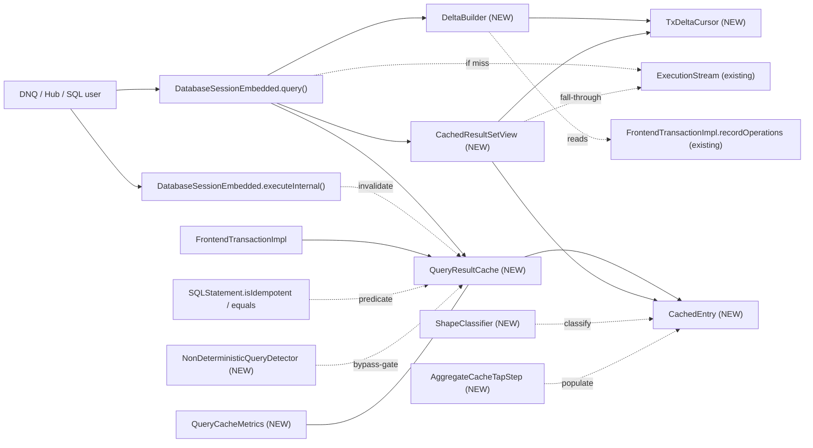

<!-- workflow-sha: 8995acfc3b0c50453595911342427c60742617b4 -->
# YTDB-820 Transaction-scoped query result cache

## Design Document
[design.md](design.md)

## High-level plan

### Goals

Restore Xodus `EntityIterable`-style query result caching that DNQ-on-YTDB lost when Hub migrated off OrientDB. The cache is transaction-scoped, opt-in, and transparent — consumers see normal `ResultSet` semantics with a speedup on duplicate idempotent queries within one transaction. Target: Hub transactions issuing thousands of duplicate-shape SELECT/MATCH queries return their second-and-later executions from memory.

The v1 architecture is **lazy merge-on-read** — cached entries are immutable from populate time; intra-tx mutations are reconciled per-query at view-construction via a snapshot `TxDeltaCursor` (record/match shape) or a replayed `AggregateState` copy (aggregate shape). Mutations never touch the cache.

### Constraints

- **Opt-in.** Disabled by default via `youtrackdb.query.txResultCache.enabled`. Existing deployments must observe zero behavioral change unless the knob is flipped.
- **Transaction-scoped only.** Cache lives on `FrontendTransactionImpl` and is wiped on every tx-end path. No cross-tx leakage; no persistent or session-scoped variant in v1.
- **Idempotent queries only.** `SQLStatement.isIdempotent()` gates entry. DML statements bypass; `TRUNCATE CLASS` invalidates.
- **Thread-affine.** `FrontendTransactionImpl` is single-threaded by design (`assertOnOwningThread`); cache inherits this — no locks.
- **Memory bounded.** Two knobs (`maxEntries`, `maxRecordsPerEntry`) cap per-tx footprint to predictable limits.
- **Result semantics preserved.** Cached views must return results equivalent to a fresh execution at the same query-call moment: WHERE/ORDER BY/LIMIT honored against (cached + tx-delta) snapshot. Live views are immune to mid-iteration mutations (matches `OrderByStep` blocking-materializer contract).
- **Implementation in `core` module.** No changes required in `server`, `embedded`, or higher modules. Lucene module is excluded per project convention.

### Architecture Notes

#### Component Map

- **`DatabaseSessionEmbedded`** (modified) — `query()` overloads gain a cache lookup before `statement.execute()`; on hit or miss, after entry is populated (or already present), `DeltaBuilder` builds a `TxDeltaCursor` (or `AggregateState` copy) from current `recordOperations`, and the result is wrapped in a `CachedResultSetView`. `executeInternal()` calls `cache.invalidateAll()` for `SQLTruncateClassStatement`.
- **`FrontendTransactionImpl`** (modified) — owns a lazily-allocated `QueryResultCache`. Defensive clear in `beginInternal()`. Final clear in `clearUnfinishedChanges()`. **No `invalidateOnMutation` hook on `addRecordOperation`** — under lazy, mutations only grow `recordOperations`; the cache does not react. Gains `mutationVersion: long` counter incremented on every `addRecordOperation` call (whether new or type-change collapse); `DeltaBuilder` uses this as the version key for cross-view delta sharing per design.md § Cross-view delta sharing via mutationVersion. Per D21, `addRecordOperation` also stamps each `RecordOperation.version: long` from the post-increment `mutationVersion` at both code paths — new-entry (`txEntry = new RecordOperation(...)`) and collapse-in-place (existing `txEntry.type` flip per `FrontendTransactionImpl.java:591-612`) — so `op.version` always reflects the latest mutation timestamp for its RID; DeltaBuilder filters on `op.version > entry.populateMutationVersion` to skip pre-populate ops the tx-aware executor already baked into `entry.results`.
- **`QueryResultCache` (new)** — LRU-bounded map keyed by `CacheKey`, value `CachedEntry`. Also holds `nonCacheableKeys: Set<CacheKey>` (short-circuits lookup after overflow per L7 fix) and a per-tx `inFlightLookup: boolean` flag (re-entrancy guard per L9 fix; nested `lookup` / `put` calls from UDFs in WHERE evaluation bypass the cache). Public API: `lookup`, `put`, `invalidateAll`, `clear`.
- **`CachedEntry` (new)** — one cache slot: `List<Result>` (append-only after populate; observable as immutable to live views via I7+I9), `Set<RID> cachedRids` (load-bearing for dispatch under D21 — distinguishes true-post-populate CREATE from CREATE+UPDATE collapse case), paused `ExecutionStream`, exhaustion flag, AST metadata (`effectiveFromClasses`, `whereClause`, `orderBy`, `returnProjector`) for delta build. `aggregateState` for AGGREGATE_* shapes. For MATCH_TUPLE_MULTI shape: `aliasClasses: Map<String, Set<String>>`, `aliasWheres: Map<String, SQLWhereClause>`, `contributingRids: Map<Integer, Set<RID>>`, `reverseIndex: Map<RID, Set<Integer>>`, `tombstoned: boolean` (set at delta-build pre-scan when a CREATED hits a pattern class, forcing evict + miss). Holds the cached delta artifacts shared across views: `cachedSkipSet: Set<RID>`, `cachedInjectList: List<Result>`, `cachedDeltaVersion: long` — populated/replaced by `DeltaBuilder` when a new view's `tx.mutationVersion` doesn't match the cached value (per design.md § Cross-view delta sharing via mutationVersion). `populateMutationVersion: long` (D18 + D21) stamped at the moment cache miss begins driving the executor: for K0_NONE shapes compared at lookup to gate cache hits (D18); for cacheable shapes used by DeltaBuilder as the `op.version > populateMutationVersion` filter to skip pre-populate ops the tx-aware executor already baked into `entry.results` (D21). `k0InvalidationCount: int` incremented for K0_NONE only when a lookup observes diverged mutationVersion and forces re-populate, with the third increment routing the key to `nonCacheableKeys` to bound churn. `liveViewCount: int` (I9) incremented by `CachedResultSetView` ctor and decremented (idempotent) by `close()` / natural exhaustion; `QueryResultCache.removeEldestEntry` skips entries with `liveViewCount > 0` to prevent silent result truncation when LRU eviction would otherwise close the entry's stream out from under an iterating consumer.
- **`CachedResultSetView` (new)** — `ResultSet` implementation backed by a `CachedEntry` + a per-view delta object (either `TxDeltaCursor` for RECORD / MATCH-Etap-A, or `AggregateState` for AGGREGATE_*, or `MatchMultiDelta` for MATCH_TUPLE_MULTI). Owns its own `position` and `emitted`; falls through to `entry.stream` when local position outruns cached list. RECORD/MATCH-Etap-A: sorted-merge between cache and delta-cursor. MATCH_TUPLE_MULTI: per-tuple-index skip iteration with stream-pull RID-skip-set filter. AGGREGATE: single-row read of `deltaAggregateState.toResult()`.
- **`CacheKey` (new)** — record holding `(SQLStatement, normalizedParams)`; key type for `QueryResultCache`. `equals` and `hashCode` delegate to `SQLStatement.equals` / `hashCode` (structural per `SQLSelectStatement:380` and `SQLMatchStatement:508`), with the D12 identity fast-path checking `this.stmt == other.stmt` before the deep walk. Different SKIP/LIMIT values produce distinct cache entries; correctness for these shapes is handled by routing them to K0_NONE under D18's mutation-version gate. Defensive-copied normalized parameter map (`Map<Object, Object>` to hold the positional-Integer + named-String union).
- **`CacheableShape` (new enum)** — discriminator computed by `ShapeClassifier.classify(stmt)`: `RECORD | AGGREGATE_COUNT | AGGREGATE_SUM | AGGREGATE_AVG | AGGREGATE_MIN | AGGREGATE_MAX | AGGREGATE_COUNT_DISTINCT | MATCH_TUPLE_MULTI | K0_NONE`. Drives `DeltaBuilder` dispatch and the K0 invalidation gate. Classify checks `stmt.skip != null || stmt.limit != null` first and routes such queries to K0_NONE before any shape-specific check. AGGREGATE_COUNT_DISTINCT covers `COUNT(DISTINCT prop)` over a plain property (D20 — extends coverage beyond eager's K0 fallback). MATCH_TUPLE_MULTI introduced for multi-alias MATCH (Etap B partial in v1; see D8-lazy); supports DELETED + UPDATED via reverseIndex, tombstones on CREATED. K0_NONE covers delta-unreconcilable shapes (any SKIP/LIMIT query, LET, GROUP BY, $matched, subqueries, MEDIAN / MODE / PERCENTILE, expression-aggregates); D18 caches them under `tx.mutationVersion` gate; entry serves cache hits while mutationVersion is unchanged, invalidates when it diverges.
- **`AggregateState` (new)** — per-entry container for aggregate caches: `currentScalar` (the publicly-returned scalar; type evolves with input via storage's promotion rules), `contributingRids`, `contributingValues`, `count` (AVG only), `extremumRid` (MIN/MAX only — `@Nullable RID` field; `was_extremum = rid.equals(extremumRid)` uses RID identity, NOT `Number.equals`, sidestepping the cross-`Number`-subtype hazard), `sumAccumulator: Number` (SUM/AVG only — running total evolves through `PropertyTypeInternal.increment` matching storage exactly per D19; no BigDecimal forced coercion, no pinned return type), `distinctBuckets: Map<Object, Set<RID>>` (AGGREGATE_COUNT_DISTINCT only — per D20, maps each distinct value to its contributing RIDs using `Object.equals`/`hashCode` directly mirroring `SQLFunctionDistinct`'s `LinkedHashSet<Object>` semantics; the scalar is `distinctBuckets.size()`). Encapsulates `observe` (called by `AggregateCacheTapStep` during populate), `applyMutation` (called by `DeltaBuilder.buildForAggregate` during delta replay), and `copy` (for view-time snapshot). D14 sorted-value index (`TreeMap<BigDecimal, Set<RID>>`) for O(log n) extremum maintenance is v2-deferred per D14.
- **`TxDeltaCursor` (new)** — immutable per-view delta snapshot for RECORD / MATCH-Etap-A shape: `Set<RID> skipSet` (hide these RIDs from the cached cursor) + sorted `List<Result> injectList` (interleave these into the merge). Built once at view construction; never mutated.
- **`MatchMultiDelta` (new)** — immutable per-view delta snapshot for MATCH_TUPLE_MULTI shape: `Set<Integer> tupleSkipSet` (tuple-index skip — drop these existing tuples from the cache cursor) + `Set<RID> ridSkipSet` (RID skip — drop stream-pulled tuples whose ANY alias binding's RID is in this set). No injectList — partial Etap B does not discover new tuples on CREATED (tombstone path takes over). Built once at view construction.
- **`DeltaBuilder` (new utility)** — static methods `buildForRecord(entry, recordOps, ctx) → TxDeltaCursor`, `buildForAggregate(entry, recordOps, ctx) → AggregateState`, `buildForMatchMulti(entry, recordOps, ctx) → MatchMultiDelta` (or TOMBSTONE sentinel signaling cache-lookup to evict + miss). Iterates `tx.recordOperations.values()` once per call.
- **`ShapeClassifier` (new)** — static `classify(SQLStatement) → CacheableShape`; AST-only inspection (no execution) called once per entry at construction. Encodes cacheability + which delta-build path applies.
- **`AggregateCacheTapStep` (new)** — `AbstractExecutionStep` spliced upstream of `AggregateProjectionCalculationStep` during cache-miss execution. Observes each record before forwarding; populates `entry.aggregateState` for later view-time delta replay. Transparent to the downstream aggregate step.
- **`IdempotentExecutionStream` (new)** — wrapper around an `ExecutionStream` that makes `close(ctx)` idempotent (first call forwards to underlying, subsequent calls no-op). The cache substitutes this wrapper into both its own `CachedEntry.stream` field and the paired `LocalResultSet`'s stream slot at cache-put time, so cross-caller double-close (closeActiveQueries + cache.clear at tx-end) is safe regardless of underlying `ExecutionStream` impl behaviour. The `ExecutionStream` interface contract itself does NOT mandate idempotency, so the wrapper is the load-bearing safety net.
- **`NonDeterministicQueryDetector` (new)** — denylist AST walker for `sysdate`/`random`/`uuid`/`eval`/zero-arg-`date`/`currentTimeMillis`/`nanoTime` function calls and `$now`/`$current`/`$currentMatch`/`$matched`/`$thread`/`$parent`/`$depth` identifier nodes. The context-variable list covers every per-row / per-MATCH-candidate binding in `CommandContext` (`VAR_CURRENT`, `VAR_CURRENT_MATCH`, `VAR_MATCHED`, `VAR_DEPTH`) plus thread- / time- / parent-context bindings — per-row variables are bypassed conservatively rather than reconciled via DeltaBuilder ctx setup, because the standard executor's upstream-step `ctx.setSystemVariable` chain is not replicated by `DeltaBuilder`. Walker traverses the full AST including MATCH per-alias WHEREs and WHILE conditions. Single static `contains(SQLStatement)`; gates cache lookup (Track 3) and the deterministic-ORDER-BY admission gate (D9).
- **`QueryCacheMetrics` (new)** — operator telemetry: hit / miss / delta-build-cost / eviction counters owned by `QueryResultCache`. Surfaced via `FrontendTransactionImpl.getQueryCacheMetrics()`.
- **`SQLStatement.isIdempotent()` + `equals()` + `hashCode()`** (existing, reused) — DML predicate and cache-key primitive. No changes to existing override semantics.
- **`GlobalConfiguration`** (modified) — four new knobs: `QUERY_TX_RESULT_CACHE_ENABLED`, `QUERY_TX_RESULT_CACHE_MAX_ENTRIES`, `QUERY_TX_RESULT_CACHE_MAX_RECORDS_PER_ENTRY`, `QUERY_TX_RESULT_CACHE_K0_NONE_INVALIDATION_THRESHOLD` (D18 — N invalidations of a K0_NONE entry before its key joins `nonCacheableKeys`, default 3).

#### D1: Cache value type is `List<Result>`, not `List<RecordAbstract>`

- **Alternatives considered**: literal `List<RecordAbstract>` per spec wording; `List<Result>` (chosen).
- **Rationale**: `ResultSet.next()` returns `Result`. SELECT queries with projections (`SELECT name, age+1 FROM …`) produce `Result`s that wrap computed properties, not records. Caching `RecordAbstract` would exclude all projection queries — half of DNQ's emission according to the issue context. `Result` is the type that crosses the API boundary.
- **Risks/Caveats**: `Result`s referencing the session must remain valid for replay — they don't carry session state directly, so safe.
- **Implemented in**: Track 1.

#### D2: Cache key = (parsed `SQLStatement`, normalized parameter map)

- **Alternatives considered**: raw SQL text hash; AST + params (chosen); AST with toCanonicalString output.
- **Rationale**: `SQLStatement.equals()` is structural (verified on `SQLSelectStatement:380`). Reusing it gives whitespace/alias-invariant keys for free. Parsing already runs on the hot path; we don't pay extra parse cost. Parameter map is `Map<Object, Object>` to hold the positional-Integer + named-String union per `SQLStatement.execute(...)` API (`SQLStatement.java:62/66/83/89`). Defensive-copied at lookup time.
- **Risks/Caveats**: AST equality is only as good as `equals()` overrides on every node type — bugs there give wrong cache hits. `STATEMENT_CACHE_SIZE` keys by **SQL text**, not AST, so `SQLStatement.equals()` on deep AST trees is effectively new ground; latent override bugs may surface. Track 1 hardening: per-node-type equality tests for every AST node touched by D2; plus a regression spy in the cache that, on every hit, optionally re-executes and compares result sets under a debug flag (`youtrackdb.query.txResultCache.verifyHits`). Verified pre-merge against the Hub-replay scenario in D13.
- **Implemented in**: Track 1.

#### D3: Cache lookup gated on `instanceof SQLSelectStatement || SQLMatchStatement`; bulk-bypass types invalidate

- **Alternatives considered**: cache all statements (wrong — DML is non-deterministic); cache via `isIdempotent()` predicate (too wide — PROFILE/EXPLAIN/IF also return true); narrow type check (chosen).
- **Rationale**: PROFILE and EXPLAIN return plan/timing metadata that changes per call. A direct `instanceof` check against the two cacheable statement types keeps the gate narrow and obvious. The DML invalidation path uses an explicit type list (`SQLTruncateClassStatement` only). Regular `INSERT`/`UPDATE`/`DELETE` flow through `addRecordOperation` per affected record — under lazy, the cache doesn't react per-mutation; each subsequent `query()` picks them up via fresh delta build. Schema DDL is excluded because I8 makes it unreachable mid-tx. Track 3 wires a `Java assert` that fires if a schema-DDL statement reaches the cache hook while a tx is active.
- **Risks/Caveats**: New idempotent statement types added in the future need explicit cache opt-in. If I8 is ever relaxed, the bulk-bypass list must be re-expanded; the Track 3 assert is the canary.
- **Implemented in**: Track 1 (cache-lookup gate), Track 3 (DML invalidation hook + assert).

#### D4: Pause/resume via shared `ExecutionStream` + per-view position counters

- **Alternatives considered**: force-exhaust on first hit (consumer-unfriendly); materialize-on-demand without resume (spec violation); pause/resume with shared stream (chosen).
- **Rationale**: spec requires "continue iterating during the next execution of the same query". Holding the live stream in the cache entry achieves this. Per-view position counters make multiple concurrent consumers safe (within the single-threaded tx). Pulls from stream append to the shared list, so later consumers see the full ordered result.
- **Risks/Caveats**: storage cursor lifetime across `next()` calls — already exercised by normal consumer-paced iteration. Cache holds longer-lived reference but no new failure mode.
- **Implemented in**: Track 1.
- **Full design**: design.md §"Pause/resume mechanics"

#### D5-lazy: Lazy merge-on-read via snapshot `TxDeltaCursor` at view construction

- **Alternatives considered**: K0 wipe-on-mutation baseline (kills cache after first save for Hub workload); eager K1 sharp-merge (mutates `entry.results` in place per mutation + fail-fast `IllegalStateException` on live views — supersedes prior D5 from the eager design); lazy merge-on-read (chosen, per @andrii0lomakin review on PR #1077).
- **Rationale**: choice is **architecture-driven, not perf-driven**. Cache entry is immutable from populate time. Each `query()` (hit or miss) builds a per-view `TxDeltaCursor` (record/match shape) or `AggregateState` copy (aggregate shape) from a snapshot of `tx.recordOperations` at view-construction. `view.next()` is a sorted-merge between the immutable cache list and the frozen delta cursor. Eliminates `entry.version`, `expectedEntryVersion`, fail-fast `IllegalStateException`, K1 sharp-merge dispatch in `invalidateOnMutation`. Aligns with `OrderByStep` blocking-materializer contract — caching no longer introduces a fail-fast path consumers must handle. Honors the "transparent cache invisible behind ResultSet API" promise from the design Overview. Same `WHERE.matchesFilters`, `ORDER BY` comparator, and `AggregateState.applyMutation` primitives as eager — driver changed, algorithms identical.
- **Risks/Caveats**: **lazy has measurably higher total work than eager in read-mostly transactions with any writes**. Per-mutation work drops to O(0), but per-query delta-build is O(N) on tx-mutation count (O(p) with v2 per-class index), and per-`next()` is O(log p) when delta is non-empty for this query's class. The "delta empty" common-case condition (`p = 0`) holds only when no tx-mutation has happened on a class in this query's `effectiveFromClasses` — true for pure read-only segments, false in Hub's typical DNQ "save then query same class" pattern (1-3 writes followed by 50-200 same-class reads). For Hub-shaped workloads lazy does ~10-20× more raw operations than eager; absolute magnitude is sub-millisecond per request (noise-floor against hundreds-of-ms HTTP response time). The perf hit is **accepted explicitly** in exchange for the architectural and behavioral wins above. WHERE re-evaluation per query per delta record amortizes worse than eager — measured under D13. UPDATED records lose their pre-mutation state, so ORDER-BY repositioning always uses skip+inject (no "key didn't change" optimization possible). If D13 Hub-replay shows >5% request-latency regression vs eager, the v2 per-class index activates as a hardening response rather than v2 work.
- **Implemented in**: Track 1 (RECORD shape), Track 2 (AGGREGATE shapes), Track 2 (MATCH Etap A).
- **Full design**: design.md §"Lazy merge-on-read"

#### D6: Non-determinism via denylist AST walk + reused `noCache` hint

- **Alternatives considered**: `SQLFunction.isDeterministic()` SPI (adds API surface); denylist + opt-out (chosen); ignore problem.
- **Rationale**: known set of non-deterministic primitives is small and stable. A single `NonDeterministicQueryDetector.contains(SQLStatement)` walker handles it. `SQLSelectStatement.noCache` Boolean already parses; we extend its semantics to "skip result cache" in addition to "skip execution-plan cache".
- **Risks/Caveats**: user-defined Java functions cannot be inspected — documented escape valve is `NOCACHE` hint. New non-deterministic stdlib functions need an entry in the detector; coupling localized. Per-row context variables (`$current`, `$currentMatch`, `$matched`, `$depth`) are bypassed conservatively via the denylist rather than reconciled by explicit `ctx.setSystemVariable` in `DeltaBuilder` — populate path uses the standard executor (which sets these per row through upstream steps like `FetchFromIndexStep` / `ProjectionCalculationStep` / `MatchEdgeTraverser`); replicating that ctx-setup chain in `DeltaBuilder` would introduce a correctness-vs-completeness trade-off where any missed binding produces silently-wrong delta results. Correctness-first choice: bypass. Coverage loss is bounded — top-level `SELECT` rarely references per-row variables in WHERE (typical use is `$current` inside subqueries which already route to K0_NONE as subquery-in-WHERE; or per-alias MATCH WHEREs which already route to K0_NONE as cross-alias-state). v2 candidate gated on D13 Hub-replay: if measurement shows non-trivial per-row-variable usage in cacheable shapes, follow-up work adds the DeltaBuilder ctx-setup chain for the subset where the binding semantics are unambiguous.
- **Implemented in**: Track 3.
- **Full design**: design.md §"Non-determinism handling"

#### D7: Per-tx memory bound — LRU at `maxEntries` + per-entry `maxRecordsPerEntry`

- **Alternatives considered**: unbounded (OOM); time-based eviction (per-tx meaningless); LRU + per-entry cap (chosen).
- **Rationale**: two-dimensional bound. LRU eviction is standard for working-set workloads. Defaults (200 × 10000 = 2M refs) are pessimistic-but-safe for Hub.
- **Risks/Caveats**: knob tuning is workload-dependent. Hot-changeable per `GlobalConfiguration`.
- **Implemented in**: Track 1 (knobs + LRU map), Track 3 (per-entry overflow handling).

#### D8-lazy: MATCH Etap A as RECORD-shape composition; partial Etap B in v1; CREATED-discovery deferred to separate ADR

- **Alternatives considered**:
  - K0 for all MATCH (loses cache for any matching mutation — original baseline).
  - Eager K1 MATCH per-tuple with `reverseIndex` (the prior D8 from the eager design — superseded by lazy).
  - **MATCH Etap A as RECORD-shape composition (chosen)** for single-alias MATCH.
  - **Partial Etap B as MATCH_TUPLE_MULTI shape (chosen, in v1)** for multi-alias MATCH: DELETED + UPDATED handled via per-tuple `reverseIndex`-driven delta build; CREATED on a class in `effectiveFromClasses` tombstones the entry (force miss + re-execute).
  - Full Etap B (constrained-pattern-walk discovery of new tuples on CREATED via `MatchPrefetchStep` + edge-CREATED dispatch) — deferred to separate ADR.
- **Rationale (Etap A)**: Single-alias MATCH `MATCH {as:u, class:X WHERE ...} RETURN <projection of u>` is semantically equivalent to `SELECT <projection> FROM X WHERE ...` with a tuple-shaped RETURN projection. Under lazy, this folds cleanly into the RECORD-shape `DeltaBuilder.buildForRecord` path — same delta logic, the `returnProjector` (stored on `CachedEntry`) wraps each inject-list record into a single-binding tuple `Result`. No per-tuple `Set<RID>`, no `reverseIndex`, no per-alias maps.
- **Rationale (partial Etap B in v1)**: The eager design's `MergeKind.MATCH_TUPLE` already covered DELETED + UPDATED for multi-alias MATCH (with K0 wipe on CREATED). The lazy pivot dropped multi-alias MATCH entirely as a side-effect of architectural simplification — that was not an intentional cost-benefit decision. Restoring DELETED + UPDATED coverage reuses the eager design's bookkeeping (`reverseIndex`, `aliasClasses`, `aliasWheres`) in the lazy framework at modest implementation cost (~6 steps in Track 2). Hub uses multi-alias MATCH heavily for graph traversal (Issue↔Project, User↔Team, Comment↔Issue patterns); the "save then re-read" Hub pattern produces UPDATED + DELETED multi-alias scenarios on every list-view refresh after a mutation. Without partial Etap B, every such refresh is a cache miss + full re-execute.
- **Rationale (CREATED-discovery in separate ADR)**: Discovering new tuples that contain a CREATED record requires constrained pattern walk — pre-populate `ctx[PREFETCHED_MATCH_ALIAS_PREFIX + alias] = [rec]` and re-execute the cached `SelectExecutionPlan` (MATCH compiles down to SelectExecutionPlan via `MatchExecutionPlanner`) for each alias the CREATED record could bind into. Plus edge-CREATED dispatch (a freshly-created vertex only appears in multi-alias tuples once its edges are created — edge records also flow through `addRecordOperation`). This is genuinely new infrastructure (constrained walker + edge dispatch); deserves its own ADR. The partial Etap B falls back to tombstone-on-CREATED for the multi-alias case, which restores eager-design parity (eager wiped on CREATED multi-alias).
- **Risks/Caveats**:
  - `returnProjector` correctness depends on the projection closure built at entry construction matching the original execution's projection semantics exactly. Track 2's T6h test validates equivalence vs fresh re-execution.
  - **MATCH_TUPLE_MULTI tombstone latency** — a CREATED on a multi-alias-pattern class tombstones the entry only at the NEXT lookup (when DeltaBuilder.buildForMatchMulti runs the tombstone pre-scan). Views constructed BEFORE that lookup continue iterating with their frozen `MatchMultiDelta` and won't see the new tuples — same I7 contract as RECORD shape views. Documented as expected; matches the `OrderByStep` blocking-materializer contract.
  - **`reverseIndex` memory** — `Map<RID, Set<Integer>>` per MATCH_TUPLE_MULTI entry. Bounded by `entry.results.size() × avg-aliases-per-tuple`. For Hub-typical 100-row × 3-alias tuples: ~300 entries per `reverseIndex`. Per-entry overhead ~20-50 KB.
  - **Self-join / self-loop patterns** (e.g., `MATCH {as:u, class:User}.out('reportsTo'){as:m, class:User}`) — a record can bind to BOTH alias `u` AND alias `m` in the same tuple. UPDATED dispatch iterates all aliases the record's class matches; if any alias's WHERE fails for the post-update record, the tuple is dropped. Multi-alias-same-class is correctly handled by the alias-iteration loop.
- **Implemented in**: Tracks 2 (Etap A), 2 (partial Etap B).
- **Full design**: design.md § MATCH Etap A — RECORD-shape composition AND § MATCH multi-alias (partial Etap B in v1)

#### D9: Deterministic ORDER BY admission (modifier-chain supported)

- **Alternatives considered**: plain-identifier-only ORDER BY (loses caching for `ORDER BY lower(name)`); allow any ORDER BY expression (would require grammar extension — current grammar accepts only `Identifier [Modifier]`); allow deterministic modifier-chain ORDER BY (chosen).
- **Rationale**: `SQLOrderByItem` carries an alias `String` plus an optional `SQLModifier` chain. Reusing `NonDeterministicQueryDetector` on each item's `modifier` gives a clean admission gate. The ORDER BY comparator runs at delta-build time (sorting inject_list) and at first-execution time (sorting fresh results from storage) — both must give consistent ranks across the entry's lifetime, hence the determinism gate.
- **Risks/Caveats**: per-comparator-call `modifier.execute(...)` adds CPU vs direct field lookup — bounded by inject_list size × log(inject_list size). Acceptable trade-off for the cache hits saved.
- **Implemented in**: Track 3 (classify-gate). `OrderByComparator` from Track 1 already delegates ranking to `SQLOrderByItem.compare`.

#### D11: Pre-expand `fromClasses` to subclass closure at entry construction (`effectiveFromClasses`)

- **Alternatives considered**: per-mutation `isSubClassOf` loop over raw `fromClasses`; pre-expanded closure stored as `effectiveFromClasses` (chosen, justified by I8); cache `SchemaClass` references (no benefit).
- **Rationale**: I8 guarantees schema is immutable per tx, so the closure computed via `SchemaClass.getAllSubclasses()` at entry construction is stable for the entry's lifetime. The polymorphism gate at delta-build time becomes a single O(1) `Set<String>.contains(record.class.name)`. Field name makes "is a closure, not raw FROM names" self-documenting.
- **Risks/Caveats**: `SchemaClass.getAllSubclasses()` cost at construction is `O(subclass count)` — acceptable since it happens once per entry. If I8 is ever relaxed, the closure becomes stale; Track 3 assert is the canary.
- **Implemented in**: Track 1 step 1 (capture `effectiveFromClasses` via closure expansion).
- **Full design**: design.md §"Lazy merge-on-read" → TxDeltaCursor (step 1: Class filter)

#### D12: AST identity fast-path on cache lookup

- **Alternatives considered**: deep `SQLStatement.equals()` on every lookup (baseline); identity (`==`) fast-path before deep equals (chosen); pre-canonicalized text key (loses D2's whitespace/alias-invariance).
- **Rationale**: `SQLEngine.parse()` is backed by `STATEMENT_CACHE` (size-bounded LRU keyed by raw SQL text). Same text reissued returns the **same `SQLStatement` instance** — `==` identity. Cache-key comparison can short-circuit. For DNQ workloads with thousands of duplicate-text queries, collapses lookup cost from deep-AST-walk to a pointer compare plus parameter-map equality.
- **Risks/Caveats**: identity fast-path is purely an optimization — correctness fall-through to deep equals preserves D2's semantics. Risk localized to `CacheKey.equals` implementation: identity comparison must NOT replace deep equals, only precede it. Track 1 test verifies both paths.
- **Implemented in**: Track 1 (`CacheKey.equals(Object)` body).

#### D13: Hub-replay validation gate (pre-merge)

- **Alternatives considered**: ship on synthetic JMH alone (baseline); ship after Hub-workload replay validates lazy coverage (chosen, justified by D5-lazy K1-NONE-coverage shift).
- **Rationale**: Under lazy + D18, the relevant coverage metric is "what fraction of queries classify as cacheable" (every shape including K0_NONE under D18's version gate). Before Hub deployment, Track 3 will record an anonymized DNQ-emission sample from a Hub staging environment (single tx, ~1000 queries) and replay against the cache; pass criteria: ≥70% of repeat-shape queries classify cacheable AND view output matches fresh execution across the recorded mutation sites. Also measures: per-query delta-build cost (informs per-class-index v2 decision), WHERE re-evaluation hot RIDs (informs per-RID memoization v2 decision), MIN/MAX extremum-churn frequency (informs D14 sorted-value index v1.1/v2 decision), MATCH Etap B coverage (informs whether the separate Etap-B ADR is high-priority), paginated-workload share of K0_NONE invalidation rate under typical write patterns (informs whether class-scoped K0_NONE invalidation is needed in v1.1).
- **Risks/Caveats**: replay requires DNQ-query-log capture from staging — coordinate with Hub team. If cacheable coverage falls below 70%, follow-up classify-relaxation work (e.g., LET support, multi-alias MATCH via Etap B) becomes higher priority.
- **Implemented in**: Track 3 (JMH harness extended with a `HubReplay` scenario).

#### D14: MIN/MAX sorted-value index — v2-deferred, gated on D13 measurement

- **Alternatives considered**:
  - **O(n) recompute when extremum leaves at delta-build time (chosen for v1)** — worst case O(`maxRecordsPerEntry`) = O(10000) when the cached extremum is removed / transitions out of WHERE / updated to a non-extremum value. `AggregateState` carries `extremumRid: @Nullable RID`; `was_extremum = rid.equals(extremumRid)` (RID identity, never `Number.equals`) sidesteps the cross-`Number`-subtype hazard at zero memory cost.
  - `TreeMap<BigDecimal, Set<RID>>` sorted index on `AggregateState` for MIN/MAX giving O(log n) per-op — v2 candidate, not v1.
- **Rationale (v1 baseline)**: under Hub-typical workloads the v1 baseline performance is fine in absolute terms. Of the eleven `applyMutation` dispatch cases for MIN/MAX (full table at design.md § Aggregate delta → "Why MIN/MAX recompute is amortized O(1) without the D14 sorted-value index"), only three trigger the O(n) scan over `contributingValues`: DELETED + `was_extremum=true`, UPDATED + match_after=false + `was_extremum=true`, and UPDATED + match_after=true + `was_extremum=true` + new value lost extremum direction. The other eight cases are O(1) bookkeeping. The `was_extremum = rid.equals(entry.extremumRid)` predicate is the fast-path discriminator that keeps non-extremum-touching mutations off the scan path entirely. Cost-benefit analysis on the slow-path subset: 5-20 MIN/MAX queries per request × 100-1000 contributors × 1-5 mutations × ~1/n extremum-hit rate ≈ ~500 ops per request worst case (~5 μs at 10 ns/op). Sorted index would reduce to ~9 ops (~90 ns). Saved time per HTTP request: ~5 μs against typical hundreds-of-ms response. **Memory-budget asymmetry**: `contributingValues` is a blocking dependency for any aggregate delta — every AGGREGATE_* entry carries it unconditionally because SUM/AVG/MIN/MAX/COUNT_DISTINCT all need per-RID material to reconcile mutations. The D14 `TreeMap` index is, in contrast, an optional optimization on top — ~3× memory growth per MIN/MAX entry purely to convert the slow-path subset from O(n) to O(log n). Base cost buys correctness; D14 extra cost would buy a worst-case latency floor nobody is currently measuring. Trade-off does not justify v1 promotion absent measurement showing pathological extremum churn.
- **Decision gate**: D13 Hub-replay measures extremum-churn frequency. Promote to v1.1 hardening if either (a) MIN/MAX recompute appears in >5% of delta-build cost histogram, or (b) churning-extremum workload (worker queue "next priority" patterns) is identified in DNQ emission. Otherwise stays v2.
- **Risks/Caveats (when promoted)**:
  - **Numeric coercion to `BigDecimal`** — `Long.valueOf(5L).equals(Integer.valueOf(5))` returns `false` in Java; mixing boxed `Number` subtypes corrupts the sorted index's key identity. Coerce via `new BigDecimal(value.toString())` at observe-time (string round-trip is the only path that preserves cross-subtype mathematical equality; `BigDecimal.valueOf(double)` rejects non-double inputs). Note: this hazard does NOT exist in the v1 baseline because the v1 design uses RID identity, not numeric equality, to track the extremum.
  - **~3× memory growth** for `AGGREGATE_MIN` / `AGGREGATE_MAX` entries (TreeMap + per-value `Set<RID>` buckets + per-RID `BigDecimal` instances). Hub typically has <50 MIN/MAX entries per tx; at the 10k contribution cap, growth is ~1.5 MB per entry vs ~700 KB baseline. Absolute cost is small but non-zero.
  - **`AggregateState.copy()` cost** — copying the TreeMap + each bucket Set is O(n log n). Replaces the O(n) shallow-copy of the prior `contributingValues` map. Net additional cost per view-construction is sub-millisecond at typical n; acceptable.
- **Implemented in**: deferred. Decision gate: D13 measurement; v1.1 if measurement justifies, else v2 candidate.

#### D15: `TxDeltaCursor` snapshot at view construction; not refreshed mid-iteration

- **Alternatives considered**: rebuild deltaCursor on every `view.next()` (consistent with live recordOperations but introduces moving-target semantics, mid-iteration mutations could cause duplicate/missing rows); snapshot at view construction (chosen).
- **Rationale**: Matches the existing `OrderByStep` blocking-materializer contract — materialized result sets don't reflect mid-iteration mutations. Eliminates "moving target under iterator" failure modes that the eager K1 sharp-merge design solved with fail-fast `IllegalStateException`. The natural refresh boundary is `query()` itself — every new `query()` call constructs a fresh view with a fresh delta snapshot. Application code that wants "read its own writes" after a mutation just issues a new `query()`, which is the same mental model as SQL-standard REPEATABLE READ.
- **Risks/Caveats**: views started before a mutation will not see that mutation. Documented behavior; same as uncached `OrderByStep` already does. No correctness hazard — consumers who want fresh state issue new query.
- **Implemented in**: Track 1 (`DeltaBuilder.buildForRecord` returns a snapshotted cursor; view holds the reference and never refreshes).
- **Full design**: design.md §"Pause/resume mechanics" → Mid-iteration mutation

#### D18: K0-version-fallback for NONE shapes — cache complex queries while no mutation occurs

- **Alternatives considered**:
  - **Never cache NONE (prior baseline)** — eliminates cache benefit for complex queries permanently, even in pure-read transactions. Mismatch analysis against LDBC SNB workload showed 19 of 20 queries fall into NONE due to LET (`IC1`, `IC10`), GROUP BY (`IC3`-`IC7`, `IC12`), $matched / $depth (`IS2`, `IS7`, `IC1`, `IC3`, `IC5`, `IC6`, `IC10`, `IC11`), or multi-alias MATCH without `class:` on every node (`IS1`, `IS3`, `IS5`, `IS8`, `IC2`, `IC8`). Under prior NONE rules, warm-tx replay benefits limited to `IS4` (the only RECORD shape). For analytical workloads and Hub read-mostly fragments this is a large missed opportunity.
  - **Eager K0 (pre-pivot design — rejected at lazy-pivot)** — invalidate all entries on any mutation. Too aggressive globally; loses lazy delta-build benefits for RECORD / AGGREGATE / MATCH_TUPLE_MULTI shapes that Hub workload depends on.
  - **K0-version-gate scoped to NONE entries only (chosen)** — populate K0_NONE entries with `entry.populateMutationVersion = tx.mutationVersion` at populate time; at lookup, compare `tx.mutationVersion` against the stamp. Equal: cache hit (pure replay; correctness trivial because no mutation has occurred). Diverged: invalidate this entry, fall to miss, repopulate at the new version. Cacheable shapes (RECORD / AGGREGATE / MATCH_TUPLE_MULTI) are unaffected — their delta-build path is what handles their mutation reconciliation, and `populateMutationVersion` is unused on those entries.
  - Class-scoped K0 invalidation (extract `effectiveFromClasses` for K0_NONE entries; invalidate only when mutation class intersects) — better precision, more complex extraction (NONE shapes have variable FROM extraction depth: inner subqueries, nested MATCH, LET-based unions). v2 candidate, gated on D13 measurement of cross-class invalidation frequency.
- **Rationale**: classify returns NONE for shapes where the delta-build cannot reconcile mutations with the cached result. The pre-D18 conclusion was "therefore don't cache at all". D18 separates "cannot reconcile" from "cannot cache": reconciliation is unnecessary when no mutation has happened. For pure-read tx (LDBC analytical queries, Hub page-render fragments with no writes), `tx.mutationVersion` stays at populate-time value throughout, so every repeated `query()` after the first is a cache hit even for complex queries (LET-laden, GROUP BY, $matched-using). For read-mostly tx (Hub typical: a few writes amid many reads) K0_NONE entries hit until the first write, then re-populate on next call — partial benefit proportional to the read-fraction. Coverage delta: pre-D18 LDBC warm-tx coverage = 5% (IS4 only). Post-D18 LDBC warm-tx coverage = 100% (every query benefits from cache hit on repeat, with the K0 gate handling correctness).
- **Risks/Caveats**:
  - **Coarse invalidation in mixed-write tx.** v1 D18 invalidates ALL K0_NONE entries when ANY mutation occurs in tx, even mutations on classes unrelated to the K0_NONE query's data. For pure-read or sparsely-written tx the overhead is hypothetical; for write-heavy fragments the K0_NONE entries become useless after the first mutation. The `nonCacheableKeys` route after 3 invalidations bounds the memory churn. Class-scoped invalidation (v2 hardening, see Open questions) reduces this overhead by extracting `effectiveFromClasses` from inner subquery / MATCH structure for K0_NONE entries.
  - **Memory cost of K0_NONE entries.** Complex queries can produce large result sets (an IC1-shaped outer SELECT could return hundreds of rows including projected sub-results). K0_NONE entries respect `maxRecordsPerEntry`; overflow removes the entry and adds its key to `nonCacheableKeys` per L7. Worst-case bound unchanged: `maxEntries × maxRecordsPerEntry × Result_ref_size`.
  - **Population path simplification, not extension.** K0_NONE entries use a simpler populate path than RECORD: no delta-cursor, no skip-set, no sorted-merge in `CachedResultSetView.next()`. The view iterates `entry.results`, falling through to `entry.stream` when local position outruns the cached list — same lazy stream-pull mechanism, but without the dispatch table from § Lazy merge-on-read → TxDeltaCursor. Smaller code path, easier to validate. Track 1 step adds the K0_NONE branch in `CachedResultSetView.next()` after the existing RECORD branch.
  - **Aggregate-inside-K0_NONE shapes.** A `SELECT COUNT(*) FROM Person GROUP BY age` classifies as K0_NONE because GROUP BY is the disqualifier; the inner COUNT(*) is structurally AGGREGATE_COUNT but classify sees GROUP BY first. The K0 mechanism caches the whole thing; the inner aggregate's delta-build benefit (would have been usable in absence of GROUP BY) is lost for that query shape. Compositional classify (recognize cacheable sub-shapes inside K0_NONE outer) is v2+ territory.
  - **Exception during populate.** Same as RECORD: exception bubbles to consumer; entry's stream is closed by next tx-end hook. K0_NONE populate wraps in try / cache.put-on-success-only — mirrors SO4 fix for AGGREGATE eager-drive. On exception, the entry never enters `entries`, no partially-populated K0_NONE entry can serve a future hit.
  - **`cacheCodeDepth` re-entrancy.** K0_NONE lookups respect `cacheCodeDepth > 0` bypass (SO5 invariant) same as cacheable shapes. UDFs invoking nested `session.query()` during outer K0_NONE iteration get fresh uncached `LocalResultSet`s; the outer entry's `populateMutationVersion` is unaffected by the nested call.
- **Implemented in**: Track 1 (extends `ShapeClassifier.classify` to route SKIP/LIMIT and other delta-unreconcilable shapes to `K0_NONE`; extends `CachedEntry` with `populateMutationVersion: long` and `k0InvalidationCount: int` fields; extends `QueryResultCache.lookup` with version-gate branch; extends `CachedResultSetView.next()` with K0_NONE branch (lazy stream-pull without delta). Track 3 adds the `k0NoneInvalidationThreshold` knob to `GlobalConfiguration`. Track 3 adds K0_NONE-specific metrics: `k0NoneHits`, `k0NoneInvalidations`, `k0NoneShortCircuits` (when `nonCacheableKeys` short-circuits a previously-churned key).
- **Full design**: design.md § Cache invalidation → K0-version-fallback for NONE shapes

#### D19: SUM/AVG running total uses `PropertyTypeInternal.increment` matching storage exactly

- **Alternatives considered**: raw `Number` arithmetic via Java implicit widening (silent cross-subtype drift but matches storage); `BigDecimal` internal accumulator with type-pinned replay (precision-safe but diverges from storage on mixed-type inputs — fresh execution would return `Double` after Double observe while pinned-type replay returns `Long`); reuse storage's `PropertyTypeInternal.increment(a, b)` directly (chosen — bit-for-bit parity with no-cache by construction); fail to `K0_NONE` on first cross-subtype mutation (defensive but loses cache for any property whose schema permits mixed types).
- **Rationale**: correctness-first — cache replay must produce the exact same `Number` (same subtype, same value) that fresh execution would. Storage SUM (`SQLFunctionSum.sum(Number)` at `core/.../sql/functions/math/SQLFunctionSum.java:66-76`) and AVG (`SQLFunctionAverage.sum(Number)` at `core/.../sql/functions/math/SQLFunctionAverage.java:72-83`) both call `PropertyTypeInternal.increment(current, value)` whose result type evolves by Java widening rules (Long+Integer→Long, Double+anything→Double, BigDecimal+anything→BigDecimal). Replicating this exact behavior in `AggregateState.observe` and `applyMutation` (via direct delegation to `PropertyTypeInternal.increment`) guarantees that cache return value matches storage return value bit-for-bit, including overflow wrap semantics for Long arithmetic, precision loss at `2^53+1` for Long→Double promotion, and BigDecimal exactness when the user explicitly stores BigDecimal values. `AggregateState.sumAccumulator: Number` (changed from `BigDecimal`) holds the current accumulator; `scalarReturnType` field is removed (no longer needed — accumulator type IS the result type, evolves naturally). AVG returns `PropertyTypeInternal.increment` on running sum then divides by count using the storage AVG's same division path (`SQLFunctionAverage.computeAverage` at `SQLFunctionAverage.java:100-115`, invoked from `getResult()` at line 91).
- **Risks/Caveats**: (1) Cache inherits storage's cross-subtype quirks — Long+Integer mix that overflows at `Long.MAX_VALUE+1` wraps to `Long.MIN_VALUE` in both cache and storage (matches by construction). Long(2^53+1)+Double(1.0) promotes both to Double and loses precision; cache replay produces the same lossy Double. **Not a bug** — it's matching what no-cache does. Users who need exact precision use BigDecimal-typed properties; storage handles that, cache handles that via the same code path. (2) `PropertyTypeInternal.increment` is non-commutative for type-promotion (`increment(Long, Double)` differs from `increment(Double, Long)` in intermediate path though final value matches). Replay must call increment with the same argument order as storage — i.e., `increment(runningSum, newValue)` always. (3) D20's `COUNT_DISTINCT` bucket key strategy must be re-examined — see D20 Risks/Caveats which previously assumed BigDecimal coercion path; updated to use storage's `LinkedHashSet<Object>`-equality semantics (Long(5) and Integer(5) become two distinct buckets, matching what `SQLFunctionDistinct` does in storage).
- **Implemented in**: Track 2 (AggregateState observe / applyMutation / toResult delegate to `PropertyTypeInternal.increment`; no `scalarReturnType` field; AVG division mirrors `SQLFunctionAverage.getResult`). Track 2 test matrix extended: T5_mixedTypes verifies fresh-vs-cached parity for Long+Integer, Long+Double, Integer+Float, BigDecimal+Long mixed-input SUM/AVG queries.

#### D20: AGGREGATE_COUNT_DISTINCT cacheable via per-value RID buckets

- **Alternatives considered**: K0_NONE under D18 mutation-version gate (status quo — invalidates on every tx-write, regardless of relevance); per-value RID buckets on `AggregateState` (chosen — symmetric extension of existing AGGREGATE_* state); pre-sorted distinct buckets via `TreeMap` (overkill — `COUNT(DISTINCT)` doesn't need ordering).
- **Rationale**: K0_NONE's coarse "invalidate on any mutation" is wasteful for `COUNT(DISTINCT)` queries in mixed-write tx — every unrelated mutation kills the cache. Delta-build invalidates only on matching mutations. The mechanism reuses the existing `AggregateState` pattern: `distinctBuckets: Map<Object, Set<RID>>` maps each distinct value to the RIDs currently contributing it; `contributingValues: Map<RID, Object>` (already present for SUM/AVG/MIN/MAX) provides the reverse lookup for transition dispatch. The scalar is `distinctBuckets.size()`. Memory profile mirrors existing AGGREGATE_* entries: V distinct values × HashSet overhead + N × per-RID ref. For Hub-typical V=10-100 over N=100-1000 contributors: ~50 KB per entry, comparable to SUM/AVG/MIN/MAX entries that already carry `contributingValues` at the same scale. Note: this extends coverage beyond what the eager design achieved — eager listed `COUNT(DISTINCT)` alongside MEDIAN / MODE / PERCENTILE in its K0 fallback. Lazy D18 already gave pure-read benefit; D20 adds mutate-during-tx benefit at modest memory cost.
- **Risks/Caveats**: high-cardinality DISTINCT (V → N): memory grows linearly with contributors, bounded by `maxRecordsPerEntry`. Overflow at N rows routes through the L7 path (`nonCacheableKeys`). Cross-`Number`-subtype handling on the bucket key — `DISTINCT` over a property storing both `Long(5)` and `Integer(5)` produces **TWO** distinct buckets under cache replay, **matching storage**: `SQLFunctionDistinct.getResult` uses `LinkedHashSet<Object>` whose `Object.equals` returns false for `Long(5).equals(Integer(5))` (Java boxed-Number contract). Cache `distinctBuckets: Map<Object, Set<RID>>` uses identical `Object.equals`/`hashCode` semantics — no coercion. The earlier D19-tied BigDecimal coercion strategy was removed when D19 switched to `PropertyTypeInternal.increment` direct delegation; bucket-key behavior is now storage-mirroring by construction. Non-numeric DISTINCT (strings, RIDs) trivially uses raw value as key. Classify must reject `COUNT(DISTINCT expr)` where `expr` is anything other than a plain property reference (`COUNT(DISTINCT a + b)`, `COUNT(DISTINCT $someFunction())` route to K0_NONE — same rule as expression-aggregate `SUM(a+b)`).
- **Implemented in**: Track 2 (extends `ShapeClassifier.classify` to detect `COUNT(DISTINCT prop)`; extends `AggregateState` with `distinctBuckets` field + `AGGREGATE_COUNT_DISTINCT` branches in `observe` / `applyMutation` / `copy` / `toResult`). Track 3 adds `aggregateCountDistinctHits` and `aggregateCountDistinctInvalidations` counters for D13 measurement of relative cache-benefit vs K0_NONE.

#### D21: Populate-version stamping eliminates miss-path double-application

- **Alternatives considered**: (1) **Per-RID dedupe via `cachedRids` check on CREATED dispatch alone** — minimal patch, but fails on `RecordIteratorCollection`'s nextTxId phase for forward-direction scans that emit tx-CREATED RIDs into the cached prefix before storage RIDs; dispatch would still need to know whether the executor pre-applied the op, requiring more state than a one-line membership check. (2) **Pre-tx-state execution mode** — adds a new query mode that bypasses tx-awareness in `loadRecord` and `RecordIteratorCollection`; cleanest semantics (cache = pure-storage snapshot, delta = full tx mutations) but invasive to core executor; out of scope for v1. (3) **Populate-version stamping with `op.version > populateMutationVersion` filter** (chosen) — local to cache + one new `long` field on `RecordOperation`; reuses the existing `tx.mutationVersion` primitive (added in D18 for K0_NONE gate + Cross-view delta sharing); composes correctly with the addRecordOperation collapse semantics; keeps the dispatch table's `cached_at_build` column load-bearing for the CREATE+UPDATE collapse corner case.
- **Rationale**: cache populate-path drives the standard executor (`plan.start(ctx)` for RECORD/MATCH/MATCH_TUPLE_MULTI, the `AggregateCacheTapStep`-spliced plan for AGGREGATE_*), and YTDB's executor is tx-aware: `RecordIteratorCollection` emits tx-CREATED records via its `nextTxId` phase (forward direction) before storage records (`core/.../iterator/RecordIteratorCollection.java:90-180`); `FrontendTransactionImpl.loadRecord` returns in-memory tx-CREATED / tx-UPDATED state and throws `RecordNotFoundException` for tx-DELETED (`FrontendTransactionImpl.java:451-470`). Therefore `entry.results` populated on miss already contains tx-applied state for any mutation that happened before populate began. Without a filter, DeltaBuilder iterates the full `tx.recordOperations.values()` and double-applies those pre-populate mutations, producing duplicate emissions (CREATE), wrong positions (UPDATED with ORDER BY), or absent records that should be present (UPDATED match_after=true). D21 captures `entry.populateMutationVersion = tx.mutationVersion` at the moment cache miss begins driving the executor (i.e., just before the first `plan.start(ctx)` call in the miss path) and filters DeltaBuilder's input to `op.version > entry.populateMutationVersion`. Each `RecordOperation` gains a `version: long` field stamped from `tx.mutationVersion` at every `addRecordOperation` call (whether new entry or collapse-in-place); the collapse path re-stamps to the latest `mutationVersion` so `op.version` always reflects the latest mutation timestamp on its RID. The conceptual invariant becomes `view.output = state-at-populate + delta-after-populate = fresh-execution-result-at-query-call-moment`, holding for every populate timing. The fix extends D18's K0_NONE-only `populateMutationVersion` field to all entries (cacheable shapes use it as DeltaBuilder filter; K0_NONE entries use it as lookup-time invalidation gate as before).
- **Risks/Caveats**: (1) **Dispatch table `cached_at_build` column stays load-bearing under D21**: `FrontendTransactionImpl.addRecordOperation` (`lines 591-612`) collapses CREATE+UPDATE on the same RID in place — op `type` stays CREATED while `version` advances to the latest mutation. A `CREATED` op with `op.version > entry.populateMutationVersion` can be either a true post-populate CREATE (record never in cache) or a pre-populate CREATE whose post-populate UPDATEs bumped its version (record IS in cache, populate observed the pre-collapse-UPDATE state, then collapse-UPDATE re-bumped). The dispatch table differentiates via `cached_at_build = entry.cachedRids.contains(op.rid)`: collapse case dispatches like UPDATED (skip+inject for match_after=true, skip for match_after=false); true-fresh case dispatches like CREATED (inject for match_after=true, no-op for match_after=false). A naïve simplification that drops `cached_at_build` re-introduces the duplicate-emission bug for the collapse subcase. (2) **Mid-populate UDF save() during WHERE.matchesFilters**: the save() bumps `mutationVersion` after populate started but before populate's stamp is taken; the in-progress executor's lazy stream-pull will see the mutation via tx-aware iterator; the eventual `populateMutationVersion` captured pre-`plan.start` is the populate-START value, not the populate-END value, so the post-save op has `op.version > populateMutationVersion` and would be processed by DeltaBuilder — yet the record is also reflected in `entry.results` via the lazy stream-pull. Resolved by the `cached_at_build` check: if the record IS in cachedRids (lazy pull included it), dispatch as collapse case (skip+inject or skip); if NOT, dispatch as fresh case. The snapshot-at-build-start of `recordOperations.values()` (design.md:318) prevents `ConcurrentModificationException` during the DeltaBuilder iteration. (3) **`populateMutationVersion` capture timing**: must be done BEFORE the first `plan.start(ctx)` call in the miss path, not at view-construction. Capturing at view-construction would make the filter useless because the view is created AFTER populate has driven the executor enough to begin emitting records. (4) **Collapsed CREATE→DELETE preserves the DELETE version**: `addRecordOperation.java:604-610` flips type to DELETED; version is re-stamped to the DELETE's mutationVersion. DeltaBuilder dispatches DELETED → skip_set, correctly removing the record from the view's emission. (5) **`tx.mutationVersion` capture under concurrent close**: `populateMutationVersion` is captured on the owning thread per I2 — cross-thread close paths (rollbackInternal, close) don't capture the field, they just clear the entire entries map. (6) **`addRecordOperation` exception-safety for the stamp + increment pair** (C6 verification): the existing `FrontendTransactionImpl.addRecordOperation` (lines 510-630) wraps its full body in an outer `try` whose catch invokes `rollbackInternal()` and re-throws (lines 625-627). The new `op.version = tx.mutationVersion` stamp and `tx.mutationVersion++` increment land at the method's END (after the existing lines 621-624 dirty-counter check) — INSIDE the outer try. If any earlier statement throws (validation, listener fire, collapse state-machine), the catch fires rollbackInternal which clears `recordOperations`, so the partially-constructed RecordOperation never becomes visible to DeltaBuilder. If the stamp + increment themselves throw (they can't in practice — long assignment + ++), the catch still rolls back. The two statements execute as a sequential pair on the owning thread (I2); no interleaving hazard. **No additional try-finally needed**; the outer catch is the load-bearing mechanism. Verified against existing pattern at FrontendTransactionImpl.java:625-627.
- **Implemented in**: Track 1 (cache miss path stamps `entry.populateMutationVersion = tx.mutationVersion` immediately before `plan.start(ctx)`; CachedResultSetView ctor increments `entry.liveViewCount` for I9 pinning). Track 1 (DeltaBuilder filters `tx.recordOperations.values().stream().filter(op -> op.version > entry.populateMutationVersion).toList()` before snapshot iteration; dispatch table retains the 10-row `(op.type, cached_at_build, match_after)` shape per design.md § Lazy merge-on-read → TxDeltaCursor; new test T4d21a covers true-post-populate CREATE; T4d21b covers collapse-CREATE-with-post-populate-UPDATE that breaks WHERE; T4d21c covers UPDATED with mutation re-positioning ORDER BY). Track 1 (FrontendTransactionImpl skeleton wires `version: long` field on RecordOperation; addRecordOperation stamps version at both new-entry and collapse-in-place paths at the method's end, inside the existing outer-try/rollbackInternal pattern at lines 625-627).

#### D22: SQLInputParameter equals/hashCode audit before AST-key cache reads it

- **Alternatives considered**: trust that parser only ever constructs subclass instances (`SQLNamedParameter` / `SQLPositionalParameter`) so raw `SQLInputParameter` identity-equals is never reached (status-quo assumption — implicit, untested); make `SQLInputParameter` `abstract` (defensive — breaks any external code that subclasses or instantiates it, low likelihood); add concrete `equals`/`hashCode` to `SQLInputParameter` delegating to subclass-comparable fields (chosen — small, localized, no API break); add a cache-side guard that bypasses entries whose AST contains a raw `SQLInputParameter` instance (defensive but cumbersome — requires walker, adds runtime cost on every lookup).
- **Rationale**: D2's cache key correctness depends on `SQLStatement.equals()` being structurally accurate at every reachable AST node. `SQLInputParameter` is a concrete class (`core/.../sql/parser/SQLInputParameter.java`) without `equals`/`hashCode` overrides — inheriting `Object.equals` (identity). Its two subclasses (`SQLNamedParameter` lines 85/102, `SQLPositionalParameter` lines 74/88) override correctly. In practice the parser likely emits subclass instances only — but the design must not depend on "likely". A raw `SQLInputParameter` reached via `SQLSkip.equals` / `SQLLimit.equals` (`Objects.equals(inputParam, that.inputParam)`) would compare by identity, causing **cache misses on textually-identical re-parses** when `STATEMENT_CACHE` evicts the prior parse. Mode of failure is "false miss" (degraded cache hit rate, not silent wrong hit) but worth closing because the D2 identity fast-path (D12) already covers the same-instance case — the deep-equals path exists exactly for the post-eviction re-parse scenario this defect breaks.
- **Risks/Caveats**: adding `equals`/`hashCode` to `SQLInputParameter` requires deciding what fields to compare — likely the `paramNumber: int` for positional, `paramName: String` for named, plus type discriminator. Track 1 step adds the equals/hashCode implementation by delegating to the subclass-comparable fields exposed via existing getters; subclass equals stays primary (since concrete instances are subclasses, the subclass-defined equals fires first). Risk: if a future YTDB feature introduces a third subclass with different fields, this delegation needs revisiting. Mitigated by Track 1 test T2_inputParameterEquals which exercises positional and named scenarios with STATEMENT_CACHE eviction to force re-parse, verifying cache hit on identical input.
- **Implemented in**: Track 1 (audit + fix to `SQLInputParameter.equals` / `hashCode`; verifies that subclasses' equals/hashCode remain consistent — i.e., that raw super.equals is never the dispatch target for known subclass instances). Track 1 (test T2_inputParameterEquals — issue identical `SELECT FROM Foo SKIP :n LIMIT :m` queries with STATEMENT_CACHE small enough to force eviction between the two calls; assert second call hits cache).

### Invariants

- **I1** — Cache cleared on every tx-end path (commit, rollback, close). Enforced by single hook in `clearUnfinishedChanges()`. Test: T1.
- **I2** — Cache MUTATION paths (`lookup`, `put`, `invalidateAll`, begin-time `clear()`) accessed only by owning thread. Enforced via existing `assertOnOwningThread()` guards in `FrontendTransactionImpl` at lines 165 (`beginInternal`), 224 (`commitInternalImpl`), 250 (`getRecord`), 474 (`deleteRecord`), 511 (`addRecordOperation`). Tx-end `clear()` is the explicit exception, covered by I6. Test: T1.
- **I3** — Paused `ExecutionStream` in a `CachedEntry` is closed when the entry is evicted or the tx ends. Test: T3.
- **I4** — View output equals fresh-execution result composed with tx-delta-applied snapshot for every cacheable shape (RECORD, AGGREGATE_*, AGGREGATE_COUNT_DISTINCT, MATCH Etap A, MATCH_TUPLE_MULTI): WHERE / ORDER BY / LIMIT / projection / RETURN honored against (state-at-populate + delta-after-populate). For K0_NONE shapes equivalence holds via D18 (invalidate-on-mutation + re-execute). Composition with D21 prevents populate-time double-application. Test: T4 (RECORD), T5 (AGGREGATE), T6a (MATCH Etap A), T6b (MATCH_TUPLE_MULTI), plus per-shape T4d21a/b/c (D21 corner cases).
- **I5** — Non-deterministic queries (denylist hit or `NOCACHE` hint) never produce a cache entry and never hit a cache entry. Test: T7.
- **I6** — Tx-end `clear()` is idempotent and safe under cross-thread invocation. `QueryResultCache.clear()` and `CachedEntry.close()` are idempotent by local null-out. The underlying `ExecutionStream.close(ctx)` may not be idempotent across all impls; the cache defends by wrapping every stream in `IdempotentExecutionStream` at cache-put time and threading the wrapper into both `entry.stream` and the paired `LocalResultSet`'s stream slot, so cross-caller double-close (closeActiveQueries + cache.clear at tx-end) reaches the wrapper and is safe regardless of underlying impl. Tests: T1 (cache.clear idempotency), T3e (single-caller entry.close idempotency), T3f (cross-caller closeActiveQueries + cache.clear with non-idempotent underlying mock).
- **I7** — View's `TxDeltaCursor` (or `deltaAggregateState`, `MatchMultiDelta`) is immutable post-construction. Guarantees the SET of RIDs emitted by the view and their relative order, NOT property-level snapshot isolation (cached `Result` wraps a record reference; mid-tx `save()` mutates the reference in place — both cache-cursor and stream-pull observe post-mutation property values). Stream-pull-append consults `deltaCursor.shouldSkip` so set+order remain correct under property mutation. **Cached view = blocking-materializer-like contract** (matches `OrderByStep` semantics). This is **strictly stricter than streaming without ORDER BY**: a no-cache `SELECT FROM Issue` (no ORDER BY) is a streaming iterator whose mid-iteration visibility of post-iterator-start CREATEs depends on iterator implementation (`RecordIteratorCollection.nextTxId` phase may emit them, may not, depending on scan position). The cached view is deterministic: it never sees CREATEs/UPDATEs that happen after view construction. For queries with explicit `ORDER BY` the divergence vanishes (no-cache also materializes via `OrderByStep`). Apps relying on streaming-iterator timing-dependent visibility are already on shaky ground without cache; the cache normalizes them to deterministic-blocking semantics. Same applies to MATCH multi-alias (D8-lazy tombstone latency): views constructed before a CREATED that hits the pattern continue with frozen `MatchMultiDelta` and don't see the new tuple. Test: T4i (mid-iteration mutation does not change the emitted RID set of the current view; fresh view's set reflects the mutation).
- **I8** — Schema is immutable for the lifetime of a transaction (ENFORCED upstream). `SchemaShared.saveInternal` (`SchemaShared.java:820-823`) throws `SchemaException` on every CREATE/DROP/ALTER CLASS|PROPERTY mid-tx; `IndexManagerEmbedded` (lines 307, 459) throws on index DDL mid-tx. `effectiveFromClasses` and other AST-derived metadata therefore do not require recomputation. Test: T1.
- **I9** — View output cardinality matches uncached path under LRU pressure. `CachedEntry.liveViewCount` refcount + `removeEldestEntry` skip-pinned-entries logic prevents `maxEntries` eviction from closing the stream of an entry whose view is still iterating, which would otherwise silently truncate the view's emission to the cached prefix at eviction time. `maxEntries` becomes a soft cap; transient overflow bounded by concurrently-alive ResultSet count. **Abandoned-view safety**: `CachedResultSetView` registers in `DatabaseSessionEmbedded.activeQueries` (the same `WeakValueHashMap` in embedded mode / `HashMap` in server mode that `LocalResultSet` registers in — `DatabaseSessionEmbedded.java:238/256`). At tx-end `FrontendTransactionImpl.clear()` → `session.closeActiveQueries()` (`FrontendTransactionImpl.java:973`) iterates and closes every registered ResultSet including all live `CachedResultSetView`s; each `view.close()` decrements its entry's `liveViewCount` exactly once (guarded by a local `decremented: boolean` on the view per T3 step 5). After closeActiveQueries returns, every entry has `liveViewCount == 0` regardless of whether the app explicitly closed views. **Fallback eviction**: if cache size exceeds `2 × maxEntries` while ALL entries are pinned (`liveViewCount > 0`), `removeEldestEntry` force-closes the eldest anyway, logs a warning ("cache size %d exceeded soft cap, force-evicting pinned entry %s"), and returns true. Pathological apps that never close views still get bounded memory within the tx. Test: T3i9 (open view returning N rows, issue ≥`maxEntries` distinct cache keys, assert view returns full RID sequence matching parallel uncached query). T3i9b (abandoned-view safety: open view, drop reference without closing, issue subsequent queries to flood LRU; tx-end closeActiveQueries cleans up; assert liveViewCount returns to 0 and force-evict warning was not logged). T3i9c (fallback: pathological pin — open 2 × maxEntries views, hold all references, issue one more query; assert force-evict warning fires and oldest pinned entry is closed; held views start throwing on next() — acceptable for pathological case).
- **I10** — Cache is transparent to the user. With `youtrackdb.query.txResultCache.enabled=true`, every `db.query(sql, params)` returns a `ResultSet` whose iteration matches a parallel uncached call **at view-construction moment** against the same tx + storage state, for every cacheable shape (via I4 + I7 + I9 + D21), for K0_NONE (via D18 invalidate-and-re-execute), and for non-deterministic shapes (via I5 pre-cache bypass). Cache enable is a performance toggle, not a semantic toggle. **Caveat (matches I7 framing)**: I10 is exact for queries with `ORDER BY` (both cache and no-cache go through `OrderByStep` blocking-materializer); for queries WITHOUT `ORDER BY` the cache provides blocking-materializer semantics whereas no-cache provides streaming-iterator semantics — meaning cached views never see CREATEs/UPDATEs that happen after view construction, while no-cache views MAY see them depending on iterator scan position vs mutation timing. This is documented divergence in a narrow window: apps that issue queries without ORDER BY in the middle of tx with concurrent mutations were already accepting timing-dependent visibility under no-cache; the cache normalizes them to the deterministic OrderByStep contract. Test: T8 (run a representative subset of the project test corpus twice in the same JVM session, once with cache enabled and once disabled, assert pass/fail outcomes identical and content-inspecting tests see the same RID sequences in both runs). T8 explicitly excludes "mid-iteration concurrent-mutation visibility" tests since those depend on iterator timing and would produce spurious cache-vs-no-cache differences that don't represent real correctness gaps.

### Integration Points

- `DatabaseSessionEmbedded.query(...)` and `executeInternal(...)` — cache lookup / population / invalidation hooks; view construction with delta build.
- `FrontendTransactionImpl.beginInternal()` / `clearUnfinishedChanges()` — lifecycle hooks. `addRecordOperation()` is **not** hooked by cache.
- `FrontendTransactionImpl.recordOperations` — read by `DeltaBuilder` at view construction.
- `SQLStatement.isIdempotent()` and `equals()` — cache predicate and key.
- `SQLWhereClause.matchesFilters(Identifiable | Result, CommandContext)` — delta-build primitive.
- `SQLSelectStatement.noCache` — opt-out hint, semantics extended.

### Non-Goals

- Cross-transaction result sharing (between concurrent `FrontendTransaction` instances).
- Persistent / disk-backed cache.
- Cache for the `computeScript(...)` path or for Gremlin queries (separate engine in `embedded`).
- Server-mode propagation (remote storage). Cache lives in the embedded session.
- `FrontendTransactionNoTx` (auto-commit) support — single-statement tx have no replay potential.
- Eviction tuning beyond LRU + caps (e.g., size-aware eviction, TTL).
- Cache-aware query plans (planner reading the cache to pick join orders).
- Delta-build for aggregate shapes other than `COUNT(*)`, `SUM(prop)`, `AVG(prop)`, `MIN(prop)`, `MAX(prop)`, `COUNT(DISTINCT prop)` over a plain property. `GROUP BY`, `HAVING`, expression-aggregates (`SUM(a+b)`, `COUNT(DISTINCT a+b)`), `MEDIAN`, `MODE`, `PERCENTILE` classify as `K0_NONE` in v1 — cacheable under D18's version gate (pure-read repetition hits cache; any mutation invalidates) but not reachable by AGGREGATE delta-build. Delta-build for these shapes is v2+.
- MATCH `CREATED` **multi-alias** discovery (Etap B proper) — constrained pattern walk on a single new record across edge traversals, plus dispatch on edge-CREATED. v1 caches multi-alias MATCH as `MATCH_TUPLE_MULTI` (DELETED + UPDATED via reverseIndex; CREATED on a pattern class tombstones the entry and forces re-execute on next lookup). Full constrained-pattern-walk discovery on CREATED **belongs in a separate ADR** — adds a constrained-pattern-walk path via `MatchPrefetchStep` + `PREFETCHED_MATCH_ALIAS_PREFIX` and an edge-CREATED dispatch hook on `addRecordOperation` for edge records. Scope is comparable to the rest of YTDB-820; D13 replay measures multi-alias-MATCH-CREATED frequency to prioritise that ADR.
- Delta-build for LET-based unions (`SELECT EXPAND($u) LET ..., $u = unionall($a, $b)`) — classifies as `K0_NONE` (D18 version-gate caches; mutations invalidate). LET-aware delta-build is v2+.
- Per-entry per-RID WHERE-evaluation memoization — v2 optimization, gated on D13 measurement of WHERE re-evaluation cost.
- Per-class indexing of `recordOperations` for O(p) delta-build (vs O(N)) — v2 optimization, gated on D13.
- Delta-build for SKIP / LIMIT-bounded queries. v1 routes any query carrying SKIP or LIMIT to K0_NONE under D18's mutation-version gate; pure-read repetition hits cache, any tx-write invalidates. Reconciling a LIMIT-bounded window with mid-tx mutations would require either an over-fetch mechanism that mutates `LimitExecutionStep`/`OrderByStep.maxResults` post-plan-construction or a cross-page entry-sharing scheme; both were considered and rejected for v1 because `OrderByStep`'s bounded heap is sized at planner-construction time and resists post-build mutation, and because cross-page sharing was prone to silent short-list when the entry didn't actually hold the required window. Cacheable delta-build for SKIP / LIMIT shapes is a v2 candidate gated on D13 paginated-workload measurement.
- **`NOCACHE` hint extension to MATCH** — the grammar accepts it only on SELECT (`YouTrackDBSql.jjt:1245` MATCH production lacks the token); MATCH's narrower non-determinism surface is fully covered by `NonDeterministicQueryDetector`'s built-in denylist. v2 candidate gated on D13 measurement. See design.md §"Non-determinism handling" → MATCH NOCACHE asymmetry for the full rationale.
- **Sub-statement caching (LET sub-expressions + $matched bindings)** — separate ADR, future work. Two complementary mechanisms operating below the statement boundary that v1's statement-level cache cannot reach. (1) **LET sub-expression cache**: for shapes like `SELECT … FROM (…) LET $X = (SELECT … WHERE @rid = $parent.$current.someRid)`, each outer row resolves `$parent.$current.someRid` to a concrete RID; the LET subquery becomes a well-formed standalone SELECT that classifies as RECORD. Cache key: `(synthesized SQLStatement after binding substitution, outer params)`. Hits when the outer query repeats or the same binding RID appears across outer rows. (2) **$matched binding cache**: for sub-patterns referencing `$matched.<alias>.<field>`, the executor substitutes the concrete binding value at iteration time. Synthesizing the post-substitution sub-pattern as a cache key gives per-binding memoization (cost-aware admission required — cache.lookup overhead vs sub-execution cost). Both require executor-step integration (`LetExpressionStep` and pattern-step hooks) rather than v1's `DatabaseSessionEmbedded.query()` hook; the ADR scope is comparable to YTDB-820 itself. D13 measures Hub workload's LET / $matched frequency to prioritise. Particularly impactful for LDBC analytical queries that derive most cost from per-row correlated sub-execution (IC1, IC10). See design.md § Open questions deferred to execution → Sub-statement caching for the full sketch and trade-offs.

## Checklist

- [ ] Track 1: Read path + RECORD delta core
  > Combines former Tracks 1–4 (stages in `plan/track-1.md`): the four `GlobalConfiguration` knobs and skeleton types (`QueryResultCache`/`CachedEntry`/`CacheKey`/`TxDeltaCursor`) with lazy alloc + tx-end wipe; the `DatabaseSessionEmbedded.query()` cache hook with `CacheKey` build (D12 fast-path), lookup, and an incrementally-populated `CachedResultSetView`; shared-stream pause/resume across views; and the RECORD-shape lazy delta core (`ShapeClassifier` RECORD/`K0_NONE`, `DeltaBuilder.buildForRecord`, sorted-merge, D18 version gate, D11 polymorphism).
  > **Scope:** ~13 files covering the four knobs, skeleton types, `query()` lookup + `CachedResultSetView` population, stream pause/resume, and the RECORD `ShapeClassifier`/`DeltaBuilder` delta core with the D18 version gate.

- [ ] Track 2: Aggregate + MATCH delta
  > Combines former Tracks 5, 6a, 6b (stages in `plan/track-2.md`): aggregate cacheability + delta replay (`AggregateState`/`AggregateCacheTapStep`, COUNT/SUM/AVG/MIN/MAX incl. COUNT_DISTINCT, D19/D20); MATCH Etap A single-alias-as-RECORD with a `returnProjector`; and MATCH partial Etap B (`MATCH_TUPLE_MULTI` + `DeltaBuilder.buildForMatchMulti`, with classless/cross-alias/subquery shapes routed to `K0_NONE`).
  > **Scope:** ~12 files covering aggregate delta (`AggregateState`/`AggregateCacheTapStep`), MATCH Etap A projector, and MATCH partial Etap B (`MATCH_TUPLE_MULTI` + `buildForMatchMulti`).
  > **Depends on:** Track 1

- [ ] Track 3: Hardening + observability
  > Combines former Tracks 7, 8 (stages in `plan/track-3.md`): hardening (non-determinism denylist + `NOCACHE`, DML invalidation via `cache.invalidateAll()`, LRU + per-entry memory bounds, deterministic-ORDER-BY gate, D3 schema-DDL assert) and observability (`QueryCacheMetrics`, JMH cache-vs-baseline benchmarks, the D13 Hub-replay validation gate).
  > **Scope:** ~10 files covering the non-determinism denylist + `NOCACHE`, DML invalidation + memory bounds, and `QueryCacheMetrics` + JMH + the D13 Hub-replay gate. Below the ~12 fold floor — justified in `plan/track-3.md` §Size justification (cross-cutting safety-net + validation work touching Tracks 1–2's files; folding into Track 2 breaches the ~20-25 ceiling).
  > **Depends on:** Tracks 1, 2

## Plan Review
- [ ] Plan review (consistency + structural) — re-review required after the 2026-06-08 track re-decomposition (9→3, see note below). Prior pass was iteration 6 (consistency iter 2 + structural iter 1) under the former 9-track layout; that history is retained below. State 0 will re-run on the next `/execute-tracks` and re-mark this `[x]` once the 3-track plan re-passes.

**Track re-decomposition (2026-06-08, post-iteration-6)**: The 9-track plan was consolidated into 3 tracks to satisfy the two-sided footprint rule (`conventions.md` §Scope indicators / `planning.md` §Track descriptions) that landed on `develop` after this branch's planning. Mapping: former Tracks 1–4 → **Track 1** (Read path + RECORD delta core, ~13 files); former Tracks 5/6a/6b → **Track 2** (Aggregate + MATCH delta, ~12 files); former Tracks 7/8 → **Track 3** (Hardening + observability, ~10 files — documented under the ~12 fold floor, justified in `plan/track-3.md` §Size justification). Each former track is preserved verbatim as a labeled stage inside its merged track file; test IDs (T1–T8 sets, T6a–T6p) are unchanged. New dependency DAG: Track 1 → Track 2 → Track 3, plus Track 1 → Track 3. The iteration-6 findings below and the S6 split note reference the former track numbers (1–8, 6a/6b) and are kept as frozen audit history. Re-validate with `/review-plan` before execution.

**Iteration 6 (manual re-run, post-C1-C7 correctness-pass verification)**:

Six mechanical consistency findings (CR1-CR4, CR6, plus CR8 caught by gate) and two mechanical structural findings (S12, S13). One design-decision consistency finding (CR5 — D22 audit framing) evaluated by user, no edit needed. No blockers. All findings are citation-precision residue from the C1-C7 correctness fixes: stale paths, off-by-one line numbers, type-name updates, and one duplicate step ordinal. The consistency review missed three storage-citation sites in `plan/track-5.md` (CR4 residue) — the gate verification caught them as CR8. Mcp-steroid was not reachable for this run; all symbol audits used grep with reference-accuracy caveats (acceptable for this finding class — single-file path/line/literal-type checks where grep cannot miss polymorphic dispatch or generic call sites).

**Auto-fixed (mechanical)**:
- **CR1** (suggestion, mechanical): `implementation-plan.md:212` cited the SUM/AVG storage functions under `core/.../sql/functions/coll/`. Actual location is `core/.../sql/functions/math/SQLFunctionSum.java` and `…/math/SQLFunctionAverage.java`. Fixed both paths (added explicit `math/` prefix to the AVG citation too).
- **CR2** (suggestion, mechanical): `implementation-plan.md:212` cited "the storage AVG's same division path (`SQLFunctionAverage.getResult` at `SQLFunctionAverage.java:104-115`)". The line range 100-115 is the body of the private `computeAverage` method that `getResult()` (line 91) delegates to. Rewrote to `SQLFunctionAverage.computeAverage` at `SQLFunctionAverage.java:100-115`, invoked from `getResult()` at line 91.
- **CR3** (suggestion, mechanical): citation convention drift — every `SQLSelectStatement` equals cite uses `:380` (signature line) but every `SQLMatchStatement` equals cite used `:507` (`@Override` annotation line one above the signature at line 508). Globally updated `SQLMatchStatement:507` → `:508` at three live sites (`implementation-plan.md:56`, `plan/track-2.md:32`, `plan/track-2.md:73`). The historical citation at `implementation-plan.md:377` inside the "Prior reviews" audit-history block was left at `:507` — that block documents the iteration-2 finding state and is frozen audit context, not a live claim.
- **CR4** (suggestion, mechanical): `SQLFunctionDistinct.getResult` was cited as using `HashSet<Object>` at four sites. Actual storage type is `LinkedHashSet<Object>` (`SQLFunctionDistinct.java:37`). Fixed at `implementation-plan.md:58/213/220` and `design.md:475`. The cache-internal `new HashSet<>()` calls at `design.md:364/479/545/564/565` are the cache's own choice of Set subtype (skipSet, tupleSkipSet, ridSkipSet, distinctBuckets values, reverseIndex values) and were left unchanged.
- **CR6** (should-fix, mechanical): `plan/track-5.md:16` attributed `getSteps()` to `InternalExecutionPlan`. The method is declared on the parent public interface `ExecutionPlan` at `ExecutionPlan.java:13` and inherited. Rewrote to make the inheritance explicit.
- **CR8** (should-fix, mechanical, caught by consistency gate iteration 2): CR4 residue — three storage-citation sites in `plan/track-5.md` (lines 5, 28, 60) still said `SQLFunctionDistinct` uses `HashSet<Object>` / "HashSet semantics" / "HashSet-Object-equality". All updated to `LinkedHashSet<Object>` / "`LinkedHashSet<Object>` semantics" / "`LinkedHashSet`-Object-equality". Cache-internal `new HashSet<>()` calls on track-5.md:28, 35 (`distinctBuckets.computeIfAbsent`, copy ctor) are the cache's free choice and were left alone.
- **S12** (should-fix, mechanical): duplicate ordinal `7.` in `plan/track-3.md` Plan of Work — "`CachedResultSetView` registration in `activeQueries`" (step 7, introduced by C5) and "Stream-lifecycle tests (T3 set)" (also step 7) both labeled 7. Test matrix renumbered to `8.`. Same defect class as iteration-4 S7/S8 (test-matrix step numbered after a real step was added).
- **S13** (should-fix, mechanical): stale "BigDecimal scalar for SUM/AVG" phrasing in `implementation-plan.md:300` Track 5 scope indicator. C3 (D19 rewrite) replaced the BigDecimal accumulator with `PropertyTypeInternal.increment` direct delegation; the scope line was the last surviving site promising BigDecimal. Replaced with "`sumAccumulator: Number` via `PropertyTypeInternal.increment` for SUM/AVG". Same defect class as iteration-5 S10/S11 (stale post-mutation residue).

**Escalated (design decisions)**:
- **CR5** (should-fix, design-decision, EVALUATED — NO EDIT): consistency sub-agent flagged that `plan/track-1.md:28` describes the D22 fix as unconditional ("Add concrete equals/hashCode to SQLInputParameter that delegate to subclass-comparable fields") while the word "audit" in the work-item label suggests a verification-first reading. User resolution: keep current — non-issue. The implementation-plan.md D22 alternatives section (lines 232-235) explicitly picks the unconditional-add alternative; the word "audit" labels the work item, not a gating verification step. Track-1.md and implementation-plan.md describe the same unconditional add work; the gate's downstream check confirmed no document conditions Track 1's equals/hashCode add on a separate audit step succeeding.

**Tooling caveat**: mcp-steroid was not registered in this Claude Code MCP client (port 6315 was listening — IntelliJ plugin was installed mid-session — but `~/.claude.json` has no `mcpServers["localhost-6315"]` entry yet, and MCP servers are only loaded at session start). All symbol citations in CR1-CR8 were verified via grep/Read on single-file path/line/literal-type checks where grep cannot miss polymorphic dispatch or generic call sites. Future `/execute-tracks` sessions should route load-bearing audits through PSI once the MCP server registration lands in `~/.claude.json`.

**Mutation discipline note**: the design.md edit for CR4 (line 475 `HashSet` → `LinkedHashSet` rename) was applied directly via `Edit` rather than through the `edit-design` skill, following the iteration 4/5 precedent for pure mechanical literal-type renames with zero narrative-quality impact. No entry appended to `design-mutations.md` because the underlying design content (sentences, sections, diagrams, decision rationale) is unchanged.

**Iteration 5 (manual re-run, post-iteration-4 split-residue sweep)**:

Four mechanical consistency findings (CR18-CR21) and two mechanical structural findings (S10, S11), all post-split residue from iteration 4's Track 6 → 6a/6b split. No design-decision findings. Consistency review caught the bulk of `step-g` / bare `T6` / `Track 6` references but missed the `Tracks 5-6` and stale `skip, limit` residue in `plan/track-4.md` Plan of Work — those were caught by the structural review's bloat / cross-reference scan. Both gates verified PASS.

**Auto-fixed (mechanical)**:
- **CR18** (should-fix, mechanical): `plan/track-4.md:105` `Unblocks:` line listed bare `6 (MATCH Etap A)`. Fixed to `6a (MATCH Etap A), 6b (MATCH_TUPLE_MULTI)`. The iteration 4 audit at line 330 claimed `plan/track-4.md` cross-references were updated; this line was missed.
- **CR19** (should-fix, mechanical): `design.md:533` and `implementation-plan.md:134` referenced a non-existent "Track 6a step-g test". Track 6a's Plan of Work uses numeric steps 1-5; the matching equivalence test is `T6h` on `track-6a.md:47`. Fixed both sites to `Track 6a's T6h test`.
- **CR20** (suggestion, mechanical): `design.md:859` I4 invariant References list omitted T6a/T6b. Extended to include `T6a (I4 for MATCH Etap A), T6b (I4 for MATCH_TUPLE_MULTI)`.
- **CR21** (suggestion, mechanical): `implementation-plan.md:235` I4 invariant test list said bare `T6 (MATCH Etap A)`. Updated to `T6a (MATCH Etap A), T6b (MATCH_TUPLE_MULTI)`, symmetric with the CR20 fix.
- **S10** (should-fix, mechanical): `plan/track-4.md:51` Plan of Work step 3 captured-field list still included `skip, limit`. Post-Mutation-17, RECORD entries do not carry SKIP/LIMIT (any SKIP/LIMIT query routes to K0_NONE). Dropped `skip, limit` from the list. Same defect-class as the CR15/CR16/S9 cleanup chain in iterations 3-4.
- **S11** (should-fix, mechanical): `plan/track-4.md:49` Plan of Work step 1 referenced `Tracks 5-6 by extending classify`. Updated to `Tracks 5, 6a, 6b by extending classify` to match the S6 split.

**Escalated (design decisions)**: none.

**Mutation discipline note**: the two `design.md` edits (CR19 site at line 533 and CR20 site at line 859) were applied directly via `Edit` rather than through the `edit-design` skill, following the iteration 4 precedent for pure mechanical cross-reference renames with zero narrative-quality impact. No entry appended to `design-mutations.md` because the underlying design content (sentences, sections, diagrams, decision rationale) is unchanged.

**Iteration 4 (manual re-run, post-Mutation-22)**:

One new consistency finding (CR17, mechanical), three new structural mechanical findings (S7, S8, S9), and one structural design-decision finding (S6 — Track 6 sizing breach) escalated to the user. User resolution: split Track 6 into Tracks 6a (Etap A, ~4 steps) + 6b (partial Etap B, ~6 steps); 6b depends on 6a; Track 8 dependency updates to `Tracks 5, 6b, 7`.

**Auto-fixed (mechanical)**:
- **CR17** (should-fix, mechanical): phantom `DatabaseSessionEmbedded.getTx()` reference in `plan/track-1.md:23`. The idiomatic accessor is `getActiveTransaction()` (returns `FrontendTransactionImpl` directly; used at `CreateEdgesStep:201/209/219`, `FetchEdgesToVerticesStep:91`, `ResultInternal:485/517`). Fixed in track-1.md with the corrected accessor name and a cross-reference to existing in-tree call sites. `design-mutations.md:500` retains the historical wording — that file is the append-only audit log scrubbed in Phase 4 cleanup, so the stale reference does not leak into `develop`.
- **S7** (should-fix, mechanical): duplicate ordinal `8.` in `plan/track-5.md` Plan of Work — "View extension" (step 8) and "Test matrix (T5 set)" (also step 8) both labeled 8. Test matrix renumbered to `9.`.
- **S8** (should-fix, mechanical): duplicate ordinal `9.` in `plan/track-7.md` Plan of Work — "Deterministic-ORDER-BY gate" (step 9) and "Test matrix (T7 set)" (also step 9) both labeled 9. Test matrix renumbered to `10.`. (The prior A1 fix renumbered the duplicate-`8` but shifted the collision down by one rather than eliminating it; this iteration closes the residue.)
- **S9** (should-fix, mechanical): orphan `if shouldApplySkipLimit(): handle skip/limit accounting` line in `plan/track-6.md` MATCH_TUPLE_MULTI view-iteration pseudocode contradicted Mutation 17's contract (SKIP/LIMIT routes to K0_NONE; only K0_NONE carries SKIP/LIMIT). Same defect-class as CR15's cleanup but in a site CR15 missed. Line deleted from the pseudocode block (now relocated to `plan/track-6b.md` per S6 split).

**Escalated (design decisions)**:
- **S6** (should-fix, design-decision): Track 6 scope claimed `~10 steps`, exceeding the `~5-7 steps` planning rule (`conventions.md` §1.2). User picked **split into Track 6a + 6b** (vs deferred-split or scope-tightening). Applied: `plan/track-6.md` → `plan/track-6a.md` (Etap A, ~4 steps, tests T6a-T6d/T6h) + `plan/track-6b.md` (partial Etap B, ~6 steps, tests T6e-T6g/T6i-T6p). Checklist entries replaced. D5-lazy `**Implemented in**` updated to `Track 6a`. D8-lazy `**Implemented in**` updated to `Tracks 6a (Etap A), 6b (partial Etap B)` and `(~6-8 steps in Track 6)` updated to `(~6 steps in Track 6b)`. Track 8 `**Depends on:**` updated to `Tracks 5, 6b, 7`. `design.md` cross-references at lines 26, 501, 836 updated to point at Track 6a / 6a+6b as appropriate. `plan/track-4.md` and `plan/track-5.md` cross-references updated. Test IDs `T6a-T6p` retained unchanged across the split (the existing prefixes already match the natural split).

**Mutation discipline note**: the three `design.md` cross-reference edits (lines 26, 501, 836) were applied directly via `Edit` rather than through the `edit-design` skill. The edits are pure mechanical renames (`Track 6` → `Track 6a` in each site) with zero narrative-quality impact, so the cold-read sub-agent gate that the skill provides would be a no-op. The mechanical-check budget remains spent on substantive design.md mutations (Mutation 22 was the most recent), and the present iteration appends no entry to `design-mutations.md` because the underlying design content (sentences, sections, diagrams, decision rationale) is unchanged.

**Iteration 3 (manual re-run, post-Mutation-22 cleanup)**:

Two new consistency findings on top of the prior CR1-CR14 set, both mechanical cleanup the Mutation 22 (Opcja B retreat) batch left behind. Cold-read surfaced one same-vintage should-fix during the design.md mutation cycle (Mutation 23). Structural review found no new findings.

**Auto-fixed (mechanical)**:
- **CR15** (blocker, mechanical): stale view-level SKIP/LIMIT prose in `plan/track-4.md:43`, `plan/track-4.md:53`, and `design.md:550` (MATCH multi-alias view-iteration bullet) instructed view-level SKIP/LIMIT application via an `emitted` counter / position offset. This contradicted post-Mutation-17 contract (SKIP/LIMIT routes to K0_NONE; only K0_NONE carries SKIP/LIMIT, and its view branch iterates `entry.results` directly). Fixed by deleting the bullet from design.md and replacing the two sentences in track-4.md with a one-sentence statement that RECORD shape carries no SKIP/LIMIT.
- **CR16** (should-fix, mechanical): stale `-skip: int`, `-limit: int` fields on `CachedEntry` class-diagram block and `-emitted: int`, `-skip: int`, `-limit: int` fields on `CachedResultSetView` class-diagram block at `design.md:76-77` / `design.md:139-141`. Fixed by removing the five stale fields from the Mermaid `classDiagram`.
- **Cold-read iteration-2 should-fix**: orphan LIMIT-clipping sentence at `design.md:446` ("LIMIT clipping is enforced by the consumer-visible count: the view exits after returning LIMIT results regardless of source"). Sat at the end of the RECORD/MATCH-Etap-A `view.next()` pseudocode for shapes that no longer carry LIMIT. Removed in the same mutation cycle.

**Escalated (design decisions)**: none.

**Mutation discipline**: design.md edits routed through the `edit-design` skill (Mutation 23 — content-edit, target=design, scope=whole-doc). Mechanical checks PASS (0 blockers; 32 should-fix and 1 suggestion are pre-existing house-style debt and length-cap debt explicitly deferred to Phase 4 sweep). Cold-read iteration 1 NEEDS REVISION on the line 446 orphan; iteration 2 PASS after the fix.

**Prior reviews (preserved for traceability — CR1-CR14 + Mutation 17 + S1-S5 + L1-L12 + SO1/SO4/SO5/SO6 + T1-T7 + A1-A5)**:

**Iteration 2 (re-run after Opcja B retreat, Mutation 17) — consistency review (CR10-CR14)**:
- **CR10** (blocker, design-decision, RESOLVED via Opcja B): the D10-lazy over-fetch mechanism + D17 per-plan-shape cap were built on a false premise — `OrderByStep` is constructed with `maxResults = skip + limit` at planner-construction time (`SelectExecutionPlanner.handleOrderBy` lines 2030-2065) and uses a bounded top-N min-heap (`OrderByStep.initBoundedHeap` lines 130-180); mutating the downstream `LimitExecutionStep` post-plan-construction does not reshape the upstream heap. For blocking-sort plans the cache could not actually over-fetch, leaving the LIMIT-after-DELETE short-list hazard unresolved and breaking the SKIP-stripped cross-page sharing scheme (D16). User resolution: **Opcja B** — `ShapeClassifier.classify` now routes any query carrying SKIP or LIMIT to `K0_NONE` (D18 mutation-version gate) instead of attempting to share entries or rewrite plans. The cache executes the parsed plan as-is; correctness is preserved by D18's invariant (cache hits only while `tx.mutationVersion == entry.populateMutationVersion`). Coverage trade-off: paginated workloads still cache during pure-read scrolling but invalidate on the first tx-write; analytical workloads with stable read sets get full benefit. Architectural simplification: D10-lazy, D16, D17 deleted from Decision Records; `QUERY_TX_RESULT_CACHE_MAX_RECORDS_PER_ENTRY_FOR_BLOCKING_SORT` knob removed; `CacheableShape.HARD_NONE` removed (subsumed by L7 overflow → `nonCacheableKeys`); plan-rewrite logic removed from Track 4 (no `LimitExecutionStep`/`SkipExecutionStep` mutation); CacheKey reverts to strict delegation to `SQLStatement.equals` (no field-by-field walk).
- **CR11** (mechanical, RESOLVED): design.md § Open questions referenced a non-existent class `MatchExecutionPlan`. The class is `SelectExecutionPlan` (MATCH compiles to SelectExecutionPlan via `MatchExecutionPlanner`). Fixed in design.md and plan D8-lazy CREATED-discovery rationale.
- **CR12** (mechanical, RESOLVED by CR10 cascade): `LimitStep`/`SkipStep` references throughout plan/design/tracks were phantom (actual classes are `LimitExecutionStep` / `SkipExecutionStep`). With Opcja B the plan-rewrite logic is removed entirely, eliminating every site that referenced these classes. No rename needed.
- **CR13** (should-fix, design-decision, RESOLVED by CR10 cascade): `LimitExecutionStep.limit` and `SkipExecutionStep.skip` are `private final SQLLimit`/`SQLSkip` fields. The "mutate LimitStep.limit" wording in the prior design was misleading. With Opcja B no plan-rewrite occurs, so the implementation-strategy question (replace-in-list vs reflective swap vs setter) is moot.
- **CR14** (blocker, mechanical, RESOLVED): D16 field list for `SQLMatchStatement.equals` claimed 5 fields (`matchExpressions`, `returnItems`, `limit`, `orderBy`, `groupBy`); actual implementation at `SQLMatchStatement.java:507-550` covers 11 fields (the missing 5: `notMatchExpressions`, `returnAliases`, `returnNestedProjections`, `unwind`, `returnDistinct`). With Opcja B `CacheKey.equals` now delegates strictly to `SQLStatement.equals` so the field list is correct by construction. Track 2 T2e test scope updated to enumerate all 11 SQLMatchStatement fields (and all 13 SQLSelectStatement fields) for AST-equals regression coverage.

**Mutation 17 summary (Opcja B retreat)**:
- Decision Records deleted: D10-lazy (over-fetch), D16 (canonical CacheKey strip SKIP), D17 (per-plan-shape over-fetch cap).
- Component Map: `CacheableShape` enum loses `HARD_NONE`; ShapeClassifier description updated for "SKIP/LIMIT → K0_NONE first gate"; `GlobalConfiguration` knob list reduced from 5 to 4 (drops `MAX_RECORDS_PER_ENTRY_FOR_BLOCKING_SORT`); CacheKey description simplified to "delegate `equals`/`hashCode` to `SQLStatement.equals`/`hashCode` with D12 identity fast-path".
- design.md: § Cache key composition → Canonical key for SKIP subsection removed; § Lazy merge-on-read → Over-fetch for backfill rewritten to "SKIP and LIMIT handling" without rewriting mechanism; § Per-plan-shape cap subsection removed; CacheableShape enum diagram drops HARD_NONE; Memory bounds drops blocking-sort cap; references to D10-lazy/D16/D17 removed from References footers.
- Track files: Track 1 knob list 5→4; Track 2 CacheKey custom equals replaced with strict delegation, T2e field-list updated to 13/11 fields, T2f-T2h updated to assert distinct entries per (SKIP, LIMIT); Track 4 deliverables drop plan-rewrite, T4h-T4h8 tests replaced with simpler T4f (no-LIMIT overflow), T4g (ORDER BY drain), T4k1-T4k5 K0_NONE coverage including SKIP/LIMIT scenarios; Track 6 MATCH classify drops SKIP/LIMIT cap gate (SKIP/LIMIT routes to K0_NONE); Track 8 QueryCacheMetrics drops `blockingSortOverCap` counter and related Hub-replay measurements.
- Non-Goals updated to reflect that delta-build for SKIP/LIMIT is v2 work, gated on D13 paginated measurement.

**Prior reviews (preserved for traceability — CR1-CR9, S1-S5, L1-L12, SO1/SO4/SO5/SO6, T1-T7, A1-A5)**:

**Consistency review (CR1-CR9)**:
- CR1 (blocker, mechanical): grammar source citation `YouTrackDBSql.jjt:3726-3729` was TruncateClassStatement — fixed to `:3053 SQLOrderBy OrderBy()` in track-7.md.
- CR2 (mechanical): `getPrev()` does not exist on `AbstractExecutionStep` (public `prev` field at line 66) — fixed in design.md § Aggregate side-tap and plan/track-5.md.
- CR3 (mechanical): phantom invariant `I11` reference in track-4.md — replaced with I7 framing.
- CR4 (design-decision, accepted ścieżka A): MATCH grammar has never carried `NOCACHE` (pre-existing limitation `YouTrackDBSql.jjt:1245`); preserved deliberately and documented as Non-Goal with full rationale in design.md § Non-determinism handling → MATCH NOCACHE asymmetry. v2 candidate gated on D13.
- CR5 (mechanical): `SQLMatchStatement.returnItems` is `List<SQLExpression>`, not `List<SQLProjectionItem>` — fixed in plan/track-6.md.
- CR6 (mechanical): `SQLMatchFilter` has no direct `clazz` field; uses accessor `getClassName(ctx)` over internal items list — fixed in plan/track-6.md.
- CR7 (mechanical): `GlobalConfiguration` path corrected from `internal/core/config/` to `api/config/` in plan/track-1.md.
- CR8 (mechanical): `steps` field is on concrete `SelectExecutionPlan:54`, not `InternalExecutionPlan` interface — fixed in plan/track-5.md.
- CR9 (mechanical, regression of CR8 fix): `statement.execute(...)` returns `ResultSet` (LocalResultSet), not the plan; cache miss path must call `statement.createExecutionPlan(ctx, false)` instead — fixed in design.md § Aggregate side-tap and plan/track-5.md.

**Structural review (S1-S5)**:
- S1-S4 (mechanical): Track 4/5/6/8 intro paragraphs in plan-file checklist were 4-8 sentences each, exceeding 1-3 sentence cap — compressed to 1-3 sentences ending with "Detail in `plan/track-N.md`".
- S5 (mechanical): NOCACHE-for-MATCH Non-Goal bullet was ~12-sentence essay — compressed to one-paragraph cross-reference with full rationale moved to design.md § Non-determinism handling → MATCH NOCACHE asymmetry.

**Architecture honesty pass (Mutation 12, post-review)**: D5-lazy Risks/Caveats and design.md § Overview → "Why lazy merge-on-read" + § Lazy merge-on-read TL;DR were rewritten to honestly acknowledge the perf trade-off after user feedback that the reviewer's "p = 0 in common read-mostly case" framing is incorrect for Hub workloads with any writes. Decision now framed as architecture-driven (not perf-driven): lazy does ~10-20× more raw work than eager in Hub-shaped tx (1-3 writes + many same-class reads), but in absolute terms sub-millisecond per request. Trade-off accepted explicitly in exchange for elimination of K1 dispatch / version counters / fail-fast `IllegalStateException` and honored "transparent cache" promise.

**Architectural optimality pass (Mutation 16, non-typical review)**: a fifth-iteration review combined end-to-end logical walkthrough with architectural-optimality challenge. Verdict: ship after 5 tightening fixes. All applied:
- A1: track-7.md duplicate-8 numbering renumbered (full split into 7a/7b deferred — invasive).
- A2: cacheCodeDepth enumeration now explicitly brackets aggregate eager-drive (between cache.lookup and cache.put on AGGREGATE_* miss).
- A3: `entry.cachedDeltaVersion = -1L` sentinel pinned (avoids collision with mutationVersion=0).
- A4: design.md § TxDeltaCursor step ordering fixed — for MATCH Etap A, projector runs BEFORE sort.
- A5: mutationVersion increment at END of `addRecordOperation` (exception-safe semantics).

v2 candidates documented (deferred): remove diagnostic-only cachedRids, factor common helper across DeltaBuilder methods, AggregateEntry/RecordEntry subclasses, Track 7a/7b split.

**Tertiary-order pass (Mutation 15, post-re-re-review)**: a tertiary review surfaced 7 issues (T1-T7) — 1 blocker, 1 should-fix, 5 suggestions. All closed:
- T1 (blocker — CME): `DeltaBuilder.buildFor*` now snapshots `tx.recordOperations.values()` to ArrayList before iterating, preventing CME when WHERE-eval UDF calls save(). Test T4q.
- T2 (should-fix — nested begin): `mutationVersion = 0` reset gated on `txStartCounter == 0` (outermost begin only). Test T1f.
- T3 (suggestion): TxDeltaCursor consistently receives unmodifiable wrappers on both first-build and reuse paths.
- T4 (suggestion): `getMutationVersion()` declared public on concrete class, not on public interface.
- T5 (suggestion): self-healing stale-on-arrival invariant documented.
- T6 (suggestion): `clear()` owner-thread-only invariant documented (future cross-thread cleanup must null ref, not call clear()).
- T7 (suggestion): `cacheCodeDepth` increment-first-then-check ordering tightened; test T7n.

**Second-order pass (Mutation 14, post-re-review)**: a re-review after Mutation 13 surfaced 4 second-order issues (SO1, SO4, SO5, SO6) plus a cross-reference nit. All closed:
- SO1 (delta-cursor memory unbounded): adopted Option C — shared immutable `(skipSet, injectList)` pair per entry, keyed by `FrontendTransactionImpl.mutationVersion` counter (incremented on every `addRecordOperation` including type-collapse cases). Hub case: 1 shared pair per entry. Tests T4o (sharing via ref equality), T4p (UPDATE→DELETE collapse version sensitivity).
- SO4 (eager-drive exception safety): plan-drive inside try; `cache.put` only on success; throw leaves cache empty. Test T5l.
- SO5 (`inFlightLookup` scope): replaced boolean with `cacheCodeDepth: int` counter; incremented at every cache-mutating code path; re-entrant lookups bypass cache while depth > 0.
- SO6 (`nonCacheableKeys` lifecycle): `clear()` explicitly empties it; counter reset to 0.
- Cross-ref nit: D11's `Full design` link points to a real subsection heading.

**Logical correctness pass (Mutation 13)**: a deep logical review surfaced 12 findings (L1-L12), with L1+L2+L4+L12 sharing a common root cause — the design conflated "rows already pulled into entry.results" with "the cache's view of storage" under lazy stream-pull. Fix: stream-pull-append path now consults `deltaCursor.shouldSkip(rid)` just as the cache cursor does; the dispatch table's UPDATED/DELETED branches always add the RID to skip_set regardless of `cached_at_build`. Other findings closed:
- L3 (MIN/MAX empty-set semantics): explicit null/0 handling per SQL standard.
- L5 (MATCH returnProjector alias-binding): ctx.setVariable before SQLExpression.execute.
- L6 (splice failure fallback): re-route through statement.execute(...) on unexpected planner shape.
- L7 (overflow LRU churn): remove entry from map + per-tx nonCacheableKeys set.
- L8 (aggregate partial-populate hazard): eager drive plan on cache-put.
- L9 (re-entrant UDF query): inFlightLookup flag, nested calls bypass cache.
- L10 (SKIP empty-window): documented as matching fresh-execution behavior.
- L11 (I7 wording): tightened to specify set+order frozen, not property-level snapshot.

**Pre-existing structural debt observed (deferred)**:
- 26 should-fix `dsc-ai-tell` em-dash density / fragmented-header findings — pre-existing house-style debt, +7 since Mutation 10 baseline (Mutation 11+12+13 prose adds em-dashes). Deferred to Phase 4 global sweep per `house-style.md § Em-dash discipline`.

## Final Artifacts
- [ ] Phase 4: Final artifacts (`design-final.md`, `adr.md`)
