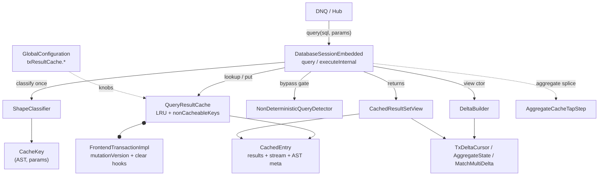

<!-- workflow-sha: e9377f7f133f5cd6ec3028936f28be2819e4ae96 -->
# YTDB-820 Transaction-scoped query result cache

## Design Document
[design.md](design.md)

## High-level plan

### Goals

Memoise idempotent `Database.query()` results within a single transaction so
duplicate-shape SELECT/MATCH queries — the dominant Hub/DNQ pattern, hundreds
to thousands per request — skip re-execution against storage. The cache lives
on `FrontendTransactionImpl`, is keyed by `(parsed AST, normalized params)`,
and is wiped on every transaction-end path. Each `query()` returns a view that
merges the cached storage rows with a frozen snapshot of in-transaction
mutations, so a cached read returns exactly what a fresh uncached execution
would return at that call moment (I10). The feature is opt-in behind
`youtrackdb.query.txResultCache.enabled`, disabled by default.

### Constraints

- **Transparency (I10).** Enabling the cache must change latency and memory,
  never result cardinality or order. This is the hard correctness floor: every
  cacheable shape's view output equals a parallel uncached `query()` at the
  same moment.
- **Single-thread tx model.** All cache mutation paths run under
  `FrontendTransactionImpl.assertOnOwningThread()`; only tx-end `clear()` is
  cross-thread (pool shutdown), inheriting the existing best-effort contract.
  No locking is added.
- **No core-executor changes for v1.** The cache attaches at
  `DatabaseSessionEmbedded.query()`/`executeInternal()` and via a local
  post-construction plan rewrite for the aggregate side-tap. The planner, the
  parser grammar, and the step classes are not modified (the aggregate tap is
  spliced by the cache, not emitted by the planner).
- **Schema immutable per tx (I8, enforced upstream).** `effectiveFromClasses`
  and every AST-derived entry field are computed once at entry construction and
  never recomputed.
- **Bounded per-tx memory.** Two knobs cap growth: `maxEntries` (LRU, default
  200) and `maxRecordsPerEntry` (default 10000). Pinned entries (live views)
  are exempt from eviction (I9).
- **Pre-merge validation gate (D13).** A Hub-replay of an anonymized ~1000-query
  DNQ sample must show ≥70% repeat-shape cacheable and view-output parity before
  merge. This is a measurement step, not implementation; it also gates every v2
  promotion candidate.

### Architecture Notes

#### Component Map

- **`DatabaseSessionEmbedded`** (modified) — the integration site. `query()`/
  `executeInternal()` gain the gate (idempotent + `instanceof SQLSelect|Match`
  + non-deterministic bypass + re-entrancy guard), the lookup/put, the view
  construction, and the bulk-DML `invalidateAll` branch.
- **`FrontendTransactionImpl`** (modified) — owns `queryResultCache` (lazy,
  enabled-gated), the monotonic `mutationVersion` counter bumped in
  `addRecordOperation`, the new `cacheCodeDepth` re-entrancy depth counter, and
  the `clear()` calls in `beginInternal` and `clearUnfinishedChanges` (the single
  tx-end sink).
- **`QueryResultCache`** (new) — the per-tx `LinkedHashMap` LRU with
  `accessOrder`, `nonCacheableKeys`, the lookup-level `inFlightLookup`
  re-entrancy flag (paired with the tx-level `cacheCodeDepth` depth counter per
  CR1 — two guards), view-pin-aware `removeEldestEntry`, and idempotent `clear()`.
- **`CachedEntry`** (new) — one cache slot: frozen `results`, paused
  `IdempotentExecutionStream`, and all AST-derived metadata (shape, WHERE,
  ORDER BY, `effectiveFromClasses`, `populateMutationVersion`, the shared
  delta-pair cache, view refcount).
- **`ShapeClassifier` / `NonDeterministicQueryDetector`** (new) — static
  AST analysis: classify into `CacheableShape`; bypass non-deterministic
  statements via a fail-open denylist + context-variable list + `noCache`.
- **`DeltaBuilder` + delta types** (new) — stateless builder that snapshots
  `recordOperations` once per view and produces a `TxDeltaCursor` (RECORD /
  MATCH-Etap-A), an `AggregateState` copy (AGGREGATE_*), or a `MatchMultiDelta`
  (MATCH_TUPLE_MULTI).
- **`CachedResultSetView`** (new) — the consumer `ResultSet`: sorted-merge
  (RECORD), direct scalar (aggregate), per-tuple skip (MATCH multi), or direct
  replay (K0_NONE).
- **`AggregateCacheTapStep`** (new, Track 2) — execution-plan step spliced
  upstream of `AggregateProjectionCalculationStep` to observe every contributing
  record before aggregation collapses it.

#### D1: Lazy merge-on-read, not eager invalidate-on-mutation

- **Alternatives considered**: K0 wipe-on-mutation (kills the cache after the
  first save); eager K1 sharp-merge mutating `entry.results` per mutation with a
  fail-fast on live views; lazy merge-on-read (chosen).
- **Rationale**: architecture-driven, not perf-driven. The entry is immutable
  from populate; the per-view delta is built from a `recordOperations` snapshot;
  `view.next()` is a sorted-merge. This eliminates `entry.version`, the
  fail-fast path, and the per-mutation `addRecordOperation` hook, and matches the
  existing `OrderByStep` blocking-materializer contract.
- **Risks/Caveats**: ~10-20× more raw ops than eager in read-mostly tx with
  writes (sub-ms, noise against HTTP latency); per-query WHERE re-eval. A >5%
  D13 regression promotes a v2 per-class index.
- **Implemented in**: Track 1 (RECORD reference), Track 2/3 (aggregate/MATCH).
- **Full design**: design.md §"Lazy merge-on-read".

#### D2: Cache key = (parsed `SQLStatement`, normalized params) with AST identity fast-path

- **Alternatives considered**: raw SQL-text hash; AST `toCanonicalString`;
  AST + params (chosen) with an `==` identity fast-path (D12) before deep equals.
- **Rationale**: `SQLStatement.equals()` is already structural, giving
  whitespace/alias-invariant keys for free, and the parser already runs on the
  hot path. `YqlStatementCache` returns the same instance for identical text, so
  `CacheKey.equals` short-circuits on `==`, collapsing thousands of duplicate-
  text DNQ lookups to a pointer compare.
- **Risks/Caveats**: deep-AST equality is new ground (`YqlStatementCache` keys by
  text). `SQLInputParameter` inherits `Object` identity-equals (confirmed: it
  extends `SimpleNode` with no override) — D22 adds field-based equals/hashCode
  so a re-parsed AST after `YqlStatementCache` eviction still hits.
- **Implemented in**: Track 1.
- **Full design**: design.md §"Cache key composition" (D2, D12, D22).

#### D3: Lookup gated on `instanceof SQLSelectStatement || SQLMatchStatement`

- **Alternatives considered**: cache all statements (DML is non-deterministic);
  gate on `isIdempotent()` alone (too wide — PROFILE/EXPLAIN/IF qualify); a
  narrow type check plus an explicit bulk-DML invalidation list (chosen).
- **Rationale**: PROFILE/EXPLAIN return per-call metadata; a direct type check
  keeps the gate obvious. `TRUNCATE CLASS` is the only mid-tx-runnable bulk op
  that invalidates; regular INSERT/UPDATE/DELETE flow through
  `addRecordOperation` and are picked up by the next query's delta build; schema
  DDL is excluded because I8 makes it unreachable mid-tx (guarded by a `Java
  assert` canary).
- **Risks/Caveats**: new idempotent statement types need explicit opt-in.
- **Implemented in**: Track 1.
- **Full design**: design.md §"Cache invalidation" (D3).

#### D4: Pause/resume via a shared `ExecutionStream` + per-view position counters

- **Alternatives considered**: force-exhaust on first hit (consumer-unfriendly);
  materialize-on-demand without resume (spec violation); shared-stream
  pause/resume (chosen).
- **Rationale**: the spec requires "continue iterating during the next execution
  of the same query". The entry holds the live stream; per-view counters make
  concurrent consumers safe under single-threaded tx; stream pulls append to the
  shared `results` so later consumers see the full ordered result.
- **Risks/Caveats**: longer-lived storage-cursor reference; no new failure mode
  beyond normal consumer-paced iteration. View pinning (I9) keeps a mid-iteration
  entry from LRU eviction.
- **Implemented in**: Track 1.
- **Full design**: design.md §"Pause/resume mechanics" (D4, D15).

#### D5: Populate-version stamping eliminates miss-path double-application

- **Alternatives considered**: per-RID dedupe via `cachedRids` on CREATED alone
  (fails on `RecordIteratorCollection.nextTxId`); a pre-tx-state execution mode
  (invasive); populate-version stamping with an `op.version >
  populateMutationVersion` filter (chosen).
- **Rationale**: the tx-aware executor already bakes pre-populate mutations into
  `entry.results`, so an unfiltered delta double-applies them. Each
  `RecordOperation` gains a `version: long` re-stamped on collapse; stamping
  `entry.populateMutationVersion` before the first `plan.start` and filtering
  `op.version >` it confines the delta to post-populate mutations.
- **Risks/Caveats**: the dispatch table's `cached_at_build` column stays
  load-bearing for the CREATE+UPDATE collapse case; the stamp must be captured
  before `plan.start`, and the stamp/increment pair rides the existing
  `addRecordOperation` rollback try.
- **Implemented in**: Track 1 (counter + filter), consumed by Tracks 2-3.
- **Full design**: design.md §"Lazy merge-on-read" → "TxDeltaCursor" (D21),
  §"Cross-view delta sharing via mutationVersion".

#### D6: Non-determinism via a fail-open denylist AST walk + reused `noCache` hint

- **Alternatives considered**: an `SQLFunction.isDeterministic()` SPI
  (co-location + UDF self-declaration, but a fail-open `default true` or a
  day-one over-bypass `default false`); denylist + opt-out (chosen).
- **Rationale**: the build-time function set is small and stable. One name
  walker (`sysdate`, zero-arg `date`, `uuid`, `eval`, `math_random`) covers both
  builtins and reflective `math_*`; the context-variable list covers per-row /
  per-MATCH bindings; `SQLSelectStatement.noCache` already parses and the cache
  becomes its first consumer.
- **Risks/Caveats**: the denylist is fail-open, so completeness is enforced by
  the I5 enumeration test across all three `SQLFunctionFactory` implementations;
  user-defined Java functions are trusted deterministic with `NOCACHE` as the
  documented escape valve; MATCH has no `NOCACHE` token (v2 grammar candidate).
- **Implemented in**: Track 1 (detector + I5 test), Track 3 (MATCH coverage).
- **Full design**: design.md §"Non-determinism handling" (D6, D9).

#### D7: K0-version-fallback caches unreconcilable shapes during pure-read fragments

- **Alternatives considered**: never cache NONE (loses 19/20 LDBC shapes even in
  pure-read tx); eager K0 (invalidate all on any mutation); a version-gate
  scoped to K0_NONE entries (chosen).
- **Rationale**: "cannot reconcile" is not "cannot cache" — reconciliation is
  unnecessary when no mutation has happened. Stamp `populateMutationVersion` at
  populate; at lookup an equal `tx.mutationVersion` is a hit, a diverged one
  invalidates and re-populates. Covers SKIP/LIMIT, GROUP BY, LET, subqueries,
  cross-alias-state MATCH.
- **Risks/Caveats**: coarse — any mutation invalidates every K0_NONE entry
  regardless of class. A 3-strike `nonCacheableKeys` route bounds churn;
  class-scoped invalidation and per-statement strike tracking are v2 levers.
- **Implemented in**: Track 1.
- **Full design**: design.md §"Cache invalidation" → "K0-version-fallback for
  NONE shapes" (D18).

#### D8: Per-tx memory bound — LRU at `maxEntries` plus per-entry `maxRecordsPerEntry`

- **Alternatives considered**: unbounded (OOM); time-based eviction (meaningless
  per-tx); LRU + per-entry cap (chosen).
- **Rationale**: a two-dimensional bound; LRU is standard for working-set
  workloads. Overflow removes the entry atomically and adds the key to
  `nonCacheableKeys` to prevent LRU-churn. Cache value type is `List<Result>`
  (D1), not `List<RecordAbstract>`, because projection queries wrap no record.
- **Risks/Caveats**: knobs are workload-dependent, hot-changeable;
  `nonCacheableKeys` is uncapped per-tx (v2 cap candidate).
- **Implemented in**: Track 1.
- **Full design**: design.md §"Memory bounds" (D7, D1).

#### D9: Idempotent close via an `IdempotentExecutionStream` wrapper

- **Alternatives considered**: rely on `ExecutionStream` implementations being
  idempotent (not contractually guaranteed); reference-count the stream; wrap
  every stored stream once at cache-put (chosen).
- **Rationale**: both the cache (`entry.close()` via `clear()`) and the paired
  `LocalResultSet` (via `closeActiveQueries()`) can close the same stream during
  pool shutdown. The wrapper, threaded into both slots, makes the underlying
  close fire exactly once.
- **Risks/Caveats**: the wrapper must be substituted into the `LocalResultSet`
  stream slot at cache-put time; `CachedEntry.close()` and `QueryResultCache.clear()`
  are independently idempotent by null-out (I6).
- **Implemented in**: Track 1.
- **Full design**: design.md §"Concurrency and lifecycle" → "Idempotent close
  requirement" (I6).

#### D10: Aggregate shapes via a side-tap + storage-parity replay

- **Alternatives considered**: cache the collapsed scalar only (no per-RID
  material to delta-build from); a side-tap step observing every contributor
  before collapse (chosen); pinned-return-type BigDecimal accumulator (diverges
  from storage on Double promotion — abandoned).
- **Rationale**: `AggregateCacheTapStep` spliced upstream of
  `AggregateProjectionCalculationStep` seeds `contributingValues`/`contributingRids`.
  SUM/AVG fold through `PropertyTypeInternal.increment` (D19) for bit-for-bit
  storage parity; `COUNT(DISTINCT prop)` uses per-value RID buckets (D20).
  Aggregate cache-miss eagerly drives the plan (the tap must observe every
  record), unlike RECORD's lazy pull.
- **Risks/Caveats**: splice failure falls back to uncached `LocalResultSet`
  (no cache); membership-based (not `op.type`) before-state dispatch is required
  for D21 collapse safety.
- **Implemented in**: Track 2.
- **Full design**: design.md §"Aggregate delta — AGGREGATE_* shapes",
  §"Aggregate side-tap" (D10, D19, D20).

#### D11: MATCH Etap A as RECORD composition; partial Etap B via reverseIndex + tombstone floor

- **Alternatives considered**: K0 for all MATCH; eager K1 per-tuple; Etap A as
  RECORD composition (chosen, single-alias); partial Etap B as
  `MATCH_TUPLE_MULTI` (chosen); full Etap B CREATE-discovery + incremental
  edge-DELETE (deferred to a separate ADR).
- **Rationale**: single-alias MATCH is `SELECT … FROM X` with a tuple RETURN,
  folding into `buildForRecord` via a stored `returnProjector`. Multi-alias
  reconciles vertex DELETE and pass→fail UPDATE incrementally via `reverseIndex`,
  and tombstones the entry on any CREATE, any edge-class DELETE, and any
  UPDATE-into-match. Traversal-edge classes fold into `effectiveFromClasses` so
  edge mutations trip the tombstone instead of being missed.
- **Risks/Caveats**: `MATCH_TUPLE_MULTI` carries no version backstop, so
  correctness rests entirely on the delta-build floor; `classify` must route
  cross-class-dereference WHEREs to K0_NONE; `returnProjector` must match the
  original projection (equivalence test).
- **Implemented in**: Track 3.
- **Full design**: design.md §"MATCH Etap A", §"MATCH multi-alias (partial Etap
  B in v1)" (D8-lazy, D11).

#### Invariants

- **I1 — Cache cleared on every tx-end path** (`clearUnfinishedChanges` →
  `clear()`). Test: commit, rollback, exception-during-iterate → `size()==0`.
- **I2 — Cache mutation paths owner-thread-only** (`assertOnOwningThread`);
  tx-end `clear()` is the documented cross-thread exception (I6).
- **I3 — Paused stream lifetime ≤ its `CachedEntry`** (closed on evict / tx-end).
- **I4 — View output ≡ fresh execution composed with the tx-delta snapshot**,
  per cacheable shape, across CREATED/UPDATED/DELETED and the four pre/post-
  populate mutation patterns; K0_NONE via D7's version-mismatch invalidation.
- **I5 — Cache only stores idempotent, deterministic statements**; completeness
  enforced by enumerating all three `SQLFunctionFactory` implementations.
- **I6 — Tx-end `clear()` idempotent and safe under cross-thread invocation**
  (D9 wrapper + null-out).
- **I7 — View delta immutable post-construction** (set + order frozen; record
  properties follow live YTDB reference semantics).
- **I8 — Schema immutable per tx** (enforced upstream; `effectiveFromClasses`
  stable for entry life).
- **I9 — View cardinality matches the uncached path under LRU pressure**
  (live-view pinning in `removeEldestEntry`).
- **I10 — Cache transparent to the user** (performance hint, not a semantic
  toggle); validated by a cache-on/cache-off test-corpus parity run.

Full statements and per-shape test matrices: design.md §"Invariants".

#### Integration Points

- `DatabaseSessionEmbedded.query()` / `executeInternal()` (lines 617 / 702) —
  lookup, put, view construction, bulk-DML `invalidateAll`.
- `FrontendTransactionImpl.addRecordOperation` (line 510) — `mutationVersion`
  bump + `RecordOperation.version` stamp; `beginInternal` (164) and
  `clearUnfinishedChanges` (≈998) — `clear()`.
- `AggregateProjectionCalculationStep` (≈121-137) — side-tap splice point
  (Track 2).
- `SQLStatement.isIdempotent()` (129); `SQLSelectStatement.noCache`;
  `SQLWhereClause.matchesFilters(Identifiable, CommandContext)` — delta-build WHERE re-eval (`RecordAbstract` binds via `Identifiable`).
- `GlobalConfiguration` — four new `youtrackdb.query.txResultCache.*` knobs.

#### Non-Goals

- Scripts (`computeScript`) and auto-commit (`FrontendTransactionNoTx`) — zero
  repeat-shape hit rate, cache field stays null.
- Full MATCH Etap B (constrained-pattern-walk CREATE discovery, incremental
  edge-DELETE) — separate ADR; v1 tombstones these cases.
- Sub-statement caching (LET sub-expression, `$matched` binding caches) —
  separate ADR.
- v2 hardening candidates gated on D13: MIN/MAX `TreeMap` sorted-value index
  (D14), per-RID WHERE memoization, class-scoped K0_NONE invalidation, bounded
  `nonCacheableKeys` / per-statement strike tracking, weight-aware LRU.
- `SQLFunction.isDeterministic()` SPI and MATCH `NOCACHE` grammar — v2.

## Checklist
- [x] Track 1: Cache foundation — infra, key, lifecycle, RECORD + K0_NONE shapes
  > Stands up the opt-in cache end-to-end for the two shapes that need no side-
  > tap: the `QueryResultCache` LRU on the transaction, the `(AST, params)`
  > `CacheKey` with the D22 `SQLInputParameter` fix, the `ShapeClassifier` and
  > `NonDeterministicQueryDetector` gates, the `mutationVersion`/populate-version
  > machinery, the RECORD-shape lazy merge-on-read (`DeltaBuilder.buildForRecord`
  > + `TxDeltaCursor` + `CachedResultSetView` sorted-merge + pause/resume), the
  > K0_NONE version-gate, lifecycle clears, memory bounds, and the config knobs.
  > This is the reference architecture every later shape builds on.
  >
  > **Track episode:**
  > Built the RECORD and K0_NONE cache path end to end: the off-by-default
  > config knobs, the `mutationVersion` / `RecordOperation.version` plumbing,
  > `CacheKey` over `(AST, normalized params)`, the static `ShapeClassifier`
  > and fail-open `NonDeterministicQueryDetector`, `CachedEntry` with
  > `IdempotentExecutionStream`, the `QueryResultCache` LRU with the two-guard
  > re-entrancy model (tx-level `cacheCodeDepth` plus lookup-level
  > `inFlightLookup`), `DeltaBuilder.buildForRecord` with `TxDeltaCursor`, the
  > `CachedResultSetView` sorted merge, the session and transaction wiring, and
  > the invariant plus cache-vs-fresh equivalence suite. Aggregate and MATCH
  > shapes bypass to Tracks 2 and 3.
  >
  > Phase C review found three correctness gaps the step tests missed, all
  > fixed (Review fix commits `4cf3ae0b08`, `5320761b42`, `a1b53d079a`): the
  > `maxRecordsPerEntry` cap was defined but never enforced, now enforced at
  > the single `CachedEntry.recordPulledRow` append point that evicts the
  > over-cap entry and routes its key non-cacheable while the in-flight
  > consumer still receives every row; the design-sanctioned cross-thread
  > tx-end `clear()` tripped `assertOnOwningThread`, now routed through
  > `exitCacheCodeUnchecked` so the assert stays on the synchronous path; and a
  > `TRUNCATE CLASS` inside a SQL script bypassed invalidation, now closed by a
  > per-statement bulk-DML hook in `SqlScriptExecutor`. Strengthening the
  > schema-stability test exposed that DDL is strictly non-transactional in
  > this engine (the prior test had swallowed the mid-tx `createClass`
  > rejection, making its assertion vacuous). A user review-mode round then
  > narrowed the delta snapshot to the entry's effective classes (Review fix
  > `991b89979a`); two further perf suggestions were examined and declined as a
  > false positive and an unsafe change against a tested key-equality invariant.
  >
  > Cross-track impact folded into the Track 2 and Track 3 entries: route row
  > appends through `recordPulledRow` for the cap, treat the `inFlightLookup`
  > guard as defense-in-depth that needs coverage only if a later track calls
  > `lookup` outside the `cacheCodeDepth` bracket, use `exitCacheCodeUnchecked`
  > for cross-thread releases, and wire the global `QUERY_CACHE_*_RATE` metrics
  > that Track 1 defines but never increments. The cumulative diff is large
  > (~5,928 changed lines across 29 files, generated excluded), past the soft
  > ~4,000-line review-capacity threshold; recorded as a planning-calibration
  > signal, not a defect. Eleven suggestion-severity findings remain deferred
  > (perf micro-optimizations, dead-API and comment cleanup, a few edge-case
  > tests).
  >
  > **Track file:** `plan/track-1.md` (7 steps, 0 failed)
  >
  > **Strategy refresh:** CONTINUE — Track 1's cross-track obligations
  > (recordPulledRow cap routing, QUERY_CACHE_*_RATE metric wiring,
  > inFlightLookup liveness, exitCacheCodeUnchecked) are already folded into the
  > Track 2 and Track 3 entries; no new downstream impact.

- [ ] Track 2: Aggregate shapes — side-tap, storage-parity replay, COUNT_DISTINCT
  > Adds the `AGGREGATE_*` family on top of Track 1's foundation: the
  > `AggregateCacheTapStep` spliced upstream of aggregation to seed per-RID
  > material, the `AggregateState` with `observe`/`applyMutation`/`copy`/`toResult`,
  > `DeltaBuilder.buildForAggregate`, and the classify branches. Carries D19
  > (SUM/AVG via `PropertyTypeInternal.increment` for storage parity), D20
  > (`COUNT(DISTINCT prop)` via per-value RID buckets), and the D21-collapse
  > membership-based dispatch. Aggregate cache-miss eagerly drives the plan.
  > **Scope:** ~8 files covering `AggregateState`, `AggregateCacheTapStep`,
  > `DeltaBuilder` (aggregate path), `ShapeClassifier`/`CachedResultSetView`
  > aggregate branches, splice + fallback in `DatabaseSessionEmbedded`, and the
  > per-aggregate-kind I4 + I5-enumeration tests.
  > **Depends on:** Track 1
  > **Carried from Track-1 Phase C review (corrected in Track 2 Phase A):** the
  > per-tx hit/miss/k0/overflow counters already exist in Track 1's
  > `QueryResultCache`; what remains is the new `incrementSpliceFailures` counter
  > plus the global `CoreMetrics.QUERY_CACHE_*_RATE` bridge (registered in Track 1
  > but never incremented) — finalize the global bridge where this track records
  > aggregate cache hits/misses. The "route every per-RID append through
  > `CachedEntry.recordPulledRow`" instruction does NOT apply to aggregates:
  > `recordPulledRow` bounds the single-scalar `results`, whereas aggregate
  > material lives in `AggregateState`; cap the `AggregateState` collections
  > instead and route the key non-cacheable on overflow (see track-2.md Plan of
  > Work step 1 and Decision Log). If the aggregate splice calls
  > `QueryResultCache.lookup` outside the `cacheCodeDepth` bracket, the
  > lookup-level `inFlightLookup` guard becomes reachable and needs end-to-end
  > coverage. Use `exitCacheCodeUnchecked` for any view-owned cross-thread guard
  > release.

- [ ] Track 3: MATCH shapes — Etap A composition, partial Etap B, tombstone floor
  > Adds MATCH caching: Etap A (single-alias) folds to RECORD shape via a stored
  > `returnProjector`; `MATCH_TUPLE_MULTI` carries per-tuple bookkeeping
  > (`aliasClasses`, `traversalEdgeClasses`, `contributingRids`, `reverseIndex`)
  > and the two-pass `DeltaBuilder.buildForMatchMulti` with the tombstone floor
  > (any CREATE, edge-class DELETE, UPDATE-into-match) plus incremental vertex-
  > DELETE and pass→fail UPDATE. Carries the MATCH `effectiveFromClasses` edge-
  > class folding and the lookup-time tombstone eviction.
  > **Scope:** ~9 files covering `MatchMultiDelta`, `DeltaBuilder` (match path),
  > `ShapeClassifier`/`CachedResultSetView`/`CachedEntry` MATCH branches,
  > tombstone handling in `QueryResultCache`, and the I4 MATCH test matrix
  > (vertex + edge CREATE/DELETE/UPDATE, update-into-match, cross-class deref).
  > **Depends on:** Track 1, Track 2
  > **Carried from Track-1 Phase C review:** the same `recordPulledRow`
  > cap-routing, `inFlightLookup`-liveness, and `exitCacheCodeUnchecked`
  > cautions as Track 2 apply to the MATCH view and cursor paths.

## Plan Review
- [x] Plan review (consistency + structural) — passed at iteration 1

**Auto-fixed (mechanical)**: CR2 — `STATEMENT_CACHE` renamed to `YqlStatementCache` in the plan and track-1 (the real Guava AST cache; D12 identity-fast-path behavior confirmed correct); CR3 — `SQLWhereClause.matchesFilters` signature corrected to `(Identifiable, CommandContext)` (a `RecordAbstract` binds via `Identifiable`) in the plan, track-1, track-3; CR4 — `beginInternal` line citation corrected 165 → 164 in the plan and track-1; S1 — trimmed the `FrontendTransactionImpl` Component-Map bullet to the ≤5-line budget.

**Escalated (design decisions)**: CR1 — the re-entrancy-guard model. `design.md` described it two inconsistent ways (a new `inFlightLookup` boolean vs a `cacheCodeDepth` counter framed as pre-existing SO5 infrastructure that does not exist in `core/src`). User chose **two guards**: a new tx-level `cacheCodeDepth` depth counter on `FrontendTransactionImpl` paired with the lookup-level `inFlightLookup` boolean on `QueryResultCache`, both created in Track 1. Recorded in the plan Component Map and track-1 (Context, Plan of Work steps 7+10, Interfaces).

**Deferred to Phase 4 (design.md frozen)**: the `design.md` halves of CR2/CR3/CR4 and the CR1 `cacheCodeDepth`/`inFlightLookup` internal inconsistency (and the stale "existing SO5" framing) are recorded findings reconciled in `design-final.md` against the as-built code.

## Final Artifacts
- [ ] Phase 4: Final artifacts (`design-final.md`, `adr.md`)
