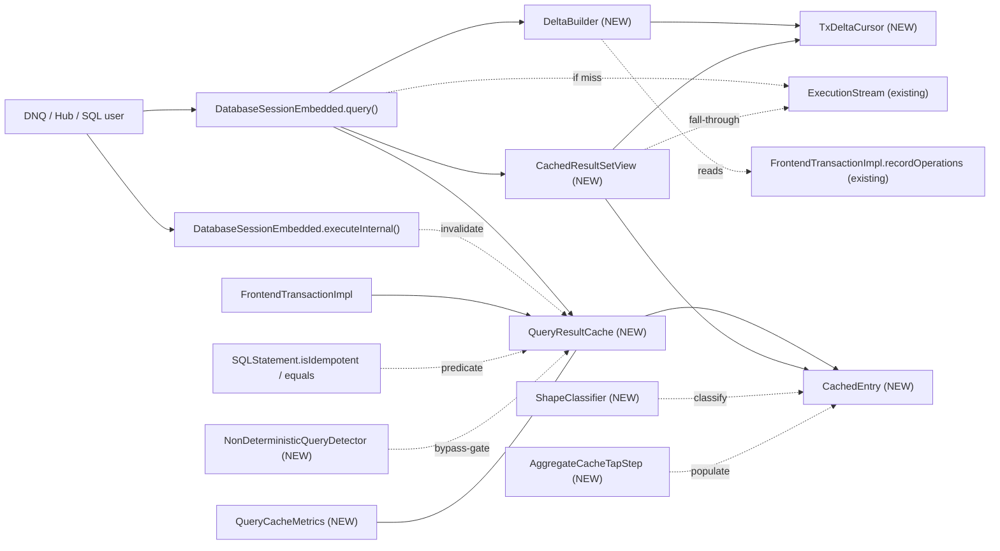

# YTDB-820 Transaction-scoped query result cache

## Design Document
[design.md](design.md)

## High-level plan

### Goals

Restore Xodus `EntityIterable`-style query result caching that DNQ-on-YTDB lost when Hub migrated off OrientDB. The cache is transaction-scoped, opt-in, and transparent — consumers see normal `ResultSet` semantics with a speedup on duplicate idempotent queries within one transaction. Target: Hub transactions issuing thousands of duplicate-shape SELECT/MATCH queries return their second-and-later executions from memory.

The v1 architecture is **lazy merge-on-read** — cached entries are immutable from populate time; intra-tx mutations are reconciled per-query at view-construction via a snapshot `TxDeltaCursor` (record/match shape) or a replayed `AggregateState` copy (aggregate shape). Mutations never touch the cache.

### Constraints

- **Opt-in.** Disabled by default via `youtrackdb.query.txResultCache.enabled`. Existing deployments must observe zero behavioral change unless the knob is flipped.
- **Transaction-scoped only.** Cache lives on `FrontendTransactionImpl` and is wiped on every tx-end path. No cross-tx leakage; no persistent or session-scoped variant in v1.
- **Idempotent queries only.** `SQLStatement.isIdempotent()` gates entry. DML statements bypass; `TRUNCATE CLASS` invalidates.
- **Thread-affine.** `FrontendTransactionImpl` is single-threaded by design (`assertOnOwningThread`); cache inherits this — no locks.
- **Memory bounded.** Two knobs (`maxEntries`, `maxRecordsPerEntry`) cap per-tx footprint to predictable limits.
- **Result semantics preserved.** Cached views must return results equivalent to a fresh execution at the same query-call moment: WHERE/ORDER BY/LIMIT honored against (cached + tx-delta) snapshot. Live views are immune to mid-iteration mutations (matches `OrderByStep` blocking-materializer contract).
- **Implementation in `core` module.** No changes required in `server`, `embedded`, or higher modules. Lucene module is excluded per project convention.

### Architecture Notes

#### Component Map

- **`DatabaseSessionEmbedded`** (modified) — `query()` overloads gain a cache lookup before `statement.execute()`; on hit or miss, after entry is populated (or already present), `DeltaBuilder` builds a `TxDeltaCursor` (or `AggregateState` copy) from current `recordOperations`, and the result is wrapped in a `CachedResultSetView`. `executeInternal()` calls `cache.invalidateAll()` for `SQLTruncateClassStatement`.
- **`FrontendTransactionImpl`** (modified) — owns a lazily-allocated `QueryResultCache`. Defensive clear in `beginInternal()`. Final clear in `clearUnfinishedChanges()`. **No `invalidateOnMutation` hook on `addRecordOperation`** — under lazy, mutations only grow `recordOperations`; the cache does not react. Gains `mutationVersion: long` counter incremented on every `addRecordOperation` call (whether new or type-change collapse); `DeltaBuilder` uses this as the version key for cross-view delta sharing per design.md § Cross-view delta sharing via mutationVersion.
- **`QueryResultCache` (new)** — LRU-bounded map keyed by `CacheKey`, value `CachedEntry`. Also holds `nonCacheableKeys: Set<CacheKey>` (short-circuits lookup after overflow per L7 fix) and a per-tx `inFlightLookup: boolean` flag (re-entrancy guard per L9 fix; nested `lookup` / `put` calls from UDFs in WHERE evaluation bypass the cache). Public API: `lookup`, `put`, `invalidateAll`, `clear`.
- **`CachedEntry` (new)** — one cache slot: `List<Result>` (immutable in content from populate time), `Set<RID> cachedRids` (diagnostic; the L1 fix made dispatch independent of this), paused `ExecutionStream`, exhaustion flag, AST metadata (`effectiveFromClasses`, `whereClause`, `orderBy`, `returnProjector`) for delta build. `aggregateState` for AGGREGATE_* shapes. For MATCH_TUPLE_MULTI shape: `aliasClasses: Map<String, Set<String>>`, `aliasWheres: Map<String, SQLWhereClause>`, `contributingRids: Map<Integer, Set<RID>>`, `reverseIndex: Map<RID, Set<Integer>>`, `tombstoned: boolean` (set at delta-build pre-scan when a CREATED hits a pattern class, forcing evict + miss). Holds the cached delta artifacts shared across views: `cachedSkipSet: Set<RID>`, `cachedInjectList: List<Result>`, `cachedDeltaVersion: long` — populated/replaced by `DeltaBuilder` when a new view's `tx.mutationVersion` doesn't match the cached value (per design.md § Cross-view delta sharing via mutationVersion).
- **`CachedResultSetView` (new)** — `ResultSet` implementation backed by a `CachedEntry` + a per-view delta object (either `TxDeltaCursor` for RECORD / MATCH-Etap-A, or `AggregateState` for AGGREGATE_*, or `MatchMultiDelta` for MATCH_TUPLE_MULTI). Owns its own `position` and `emitted`; falls through to `entry.stream` when local position outruns cached list. RECORD/MATCH-Etap-A: sorted-merge between cache and delta-cursor. MATCH_TUPLE_MULTI: per-tuple-index skip iteration with stream-pull RID-skip-set filter. AGGREGATE: single-row read of `deltaAggregateState.toResult()`.
- **`CacheKey` (new)** — record holding `(SQLStatement, normalizedParams)`; key type for `QueryResultCache`. Custom `equals` / `hashCode` per D16 — D12 identity fast-path then field-by-field structural walk that omits the `skip` field (SQLSelectStatement and SQLMatchStatement both have skip — both stripped). Defensive-copied normalized parameter map (`Map<Object, Object>` to hold the positional-Integer + named-String union).
- **`CacheableShape` (new enum)** — discriminator computed by `ShapeClassifier.classify(stmt)`: `RECORD | AGGREGATE_COUNT | AGGREGATE_SUM | AGGREGATE_AVG | AGGREGATE_MIN | AGGREGATE_MAX | MATCH_TUPLE_MULTI | NONE`. Drives `DeltaBuilder` dispatch. `NONE` entries are non-cacheable (cache.put skips them). MATCH_TUPLE_MULTI introduced for multi-alias MATCH (Etap B partial in v1 — see D8-lazy); supports DELETED + UPDATED via reverseIndex, tombstones on CREATED.
- **`AggregateState` (new)** — per-entry container for aggregate caches: `currentScalar`, `contributingRids`, `contributingValues`, `count` (AVG only), `extremumRid` (MIN/MAX only — `@Nullable RID` field; `was_extremum = rid.equals(extremumRid)` uses RID identity, NOT `Number.equals`, sidestepping the cross-`Number`-subtype hazard). Encapsulates `observe` (called by `AggregateCacheTapStep` during populate), `applyMutation` (called by `DeltaBuilder.buildForAggregate` during delta replay), and `copy` (for view-time snapshot). D14 sorted-value index (`TreeMap<BigDecimal, Set<RID>>`) for O(log n) extremum maintenance is v2-deferred per D14.
- **`TxDeltaCursor` (new)** — immutable per-view delta snapshot for RECORD / MATCH-Etap-A shape: `Set<RID> skipSet` (hide these RIDs from the cached cursor) + sorted `List<Result> injectList` (interleave these into the merge). Built once at view construction; never mutated.
- **`MatchMultiDelta` (new)** — immutable per-view delta snapshot for MATCH_TUPLE_MULTI shape: `Set<Integer> tupleSkipSet` (tuple-index skip — drop these existing tuples from the cache cursor) + `Set<RID> ridSkipSet` (RID skip — drop stream-pulled tuples whose ANY alias binding's RID is in this set). No injectList — partial Etap B does not discover new tuples on CREATED (tombstone path takes over). Built once at view construction.
- **`DeltaBuilder` (new utility)** — static methods `buildForRecord(entry, recordOps, ctx) → TxDeltaCursor`, `buildForAggregate(entry, recordOps, ctx) → AggregateState`, `buildForMatchMulti(entry, recordOps, ctx) → MatchMultiDelta` (or TOMBSTONE sentinel signaling cache-lookup to evict + miss). Iterates `tx.recordOperations.values()` once per call.
- **`ShapeClassifier` (new)** — static `classify(SQLStatement) → CacheableShape`; AST-only inspection (no execution) called once per entry at construction. Encodes cacheability + which delta-build path applies.
- **`AggregateCacheTapStep` (new)** — `AbstractExecutionStep` spliced upstream of `AggregateProjectionCalculationStep` during cache-miss execution. Observes each record before forwarding; populates `entry.aggregateState` for later view-time delta replay. Transparent to the downstream aggregate step.
- **`IdempotentExecutionStream` (new)** — wrapper around an `ExecutionStream` that makes `close(ctx)` idempotent (first call forwards to underlying, subsequent calls no-op). The cache substitutes this wrapper into both its own `CachedEntry.stream` field and the paired `LocalResultSet`'s stream slot at cache-put time, so cross-caller double-close (closeActiveQueries + cache.clear at tx-end) is safe regardless of underlying `ExecutionStream` impl behaviour. The `ExecutionStream` interface contract itself does NOT mandate idempotency, so the wrapper is the load-bearing safety net.
- **`NonDeterministicQueryDetector` (new)** — denylist AST walker for `sysdate`/`random`/`uuid`/`eval` function calls and `$now`/`$current`/`$thread`/etc identifier nodes. Single static `contains(SQLStatement)`; gates cache lookup (Track 7) and the deterministic-ORDER-BY admission gate (D9).
- **`QueryCacheMetrics` (new)** — operator telemetry: hit / miss / delta-build-cost / eviction counters owned by `QueryResultCache`. Surfaced via `FrontendTransactionImpl.getQueryCacheMetrics()`.
- **`SQLStatement.isIdempotent()` + `equals()` + `hashCode()`** (existing, reused) — DML predicate and cache-key primitive. No changes to existing override semantics.
- **`GlobalConfiguration`** (modified) — three new knobs: `QUERY_TX_RESULT_CACHE_ENABLED`, `QUERY_TX_RESULT_CACHE_MAX_ENTRIES`, `QUERY_TX_RESULT_CACHE_MAX_RECORDS_PER_ENTRY`.

#### D1: Cache value type is `List<Result>`, not `List<RecordAbstract>`

- **Alternatives considered**: literal `List<RecordAbstract>` per spec wording; `List<Result>` (chosen).
- **Rationale**: `ResultSet.next()` returns `Result`. SELECT queries with projections (`SELECT name, age+1 FROM …`) produce `Result`s that wrap computed properties, not records. Caching `RecordAbstract` would exclude all projection queries — half of DNQ's emission according to the issue context. `Result` is the type that crosses the API boundary.
- **Risks/Caveats**: `Result`s referencing the session must remain valid for replay — they don't carry session state directly, so safe.
- **Implemented in**: Track 2.

#### D2: Cache key = (parsed `SQLStatement`, normalized parameter map)

- **Alternatives considered**: raw SQL text hash; AST + params (chosen); AST with toCanonicalString output.
- **Rationale**: `SQLStatement.equals()` is structural (verified on `SQLSelectStatement:380`). Reusing it gives whitespace/alias-invariant keys for free. Parsing already runs on the hot path; we don't pay extra parse cost. Parameter map is `Map<Object, Object>` to hold the positional-Integer + named-String union per `SQLStatement.execute(...)` API (`SQLStatement.java:62/66/83/89`). Defensive-copied at lookup time.
- **Risks/Caveats**: AST equality is only as good as `equals()` overrides on every node type — bugs there give wrong cache hits. `STATEMENT_CACHE_SIZE` keys by **SQL text**, not AST, so `SQLStatement.equals()` on deep AST trees is effectively new ground; latent override bugs may surface. Track 2 hardening: per-node-type equality tests for every AST node touched by D2; plus a regression spy in the cache that, on every hit, optionally re-executes and compares result sets under a debug flag (`youtrackdb.query.txResultCache.verifyHits`). Verified pre-merge against the Hub-replay scenario in D13.
- **Implemented in**: Track 2.

#### D3: Cache lookup gated on `instanceof SQLSelectStatement || SQLMatchStatement`; bulk-bypass types invalidate

- **Alternatives considered**: cache all statements (wrong — DML is non-deterministic); cache via `isIdempotent()` predicate (too wide — PROFILE/EXPLAIN/IF also return true); narrow type check (chosen).
- **Rationale**: PROFILE and EXPLAIN return plan/timing metadata that changes per call. A direct `instanceof` check against the two cacheable statement types keeps the gate narrow and obvious. The DML invalidation path uses an explicit type list (`SQLTruncateClassStatement` only). Regular `INSERT`/`UPDATE`/`DELETE` flow through `addRecordOperation` per affected record — under lazy, the cache doesn't react per-mutation; each subsequent `query()` picks them up via fresh delta build. Schema DDL is excluded because I8 makes it unreachable mid-tx. Track 7 wires a `Java assert` that fires if a schema-DDL statement reaches the cache hook while a tx is active.
- **Risks/Caveats**: New idempotent statement types added in the future need explicit cache opt-in. If I8 is ever relaxed, the bulk-bypass list must be re-expanded; the Track 7 assert is the canary.
- **Implemented in**: Track 2 (cache-lookup gate), Track 7 (DML invalidation hook + assert).

#### D4: Pause/resume via shared `ExecutionStream` + per-view position counters

- **Alternatives considered**: force-exhaust on first hit (consumer-unfriendly); materialize-on-demand without resume (spec violation); pause/resume with shared stream (chosen).
- **Rationale**: spec requires "continue iterating during the next execution of the same query". Holding the live stream in the cache entry achieves this. Per-view position counters make multiple concurrent consumers safe (within the single-threaded tx). Pulls from stream append to the shared list, so later consumers see the full ordered result.
- **Risks/Caveats**: storage cursor lifetime across `next()` calls — already exercised by normal consumer-paced iteration. Cache holds longer-lived reference but no new failure mode.
- **Implemented in**: Track 3.
- **Full design**: design.md §"Pause/resume mechanics"

#### D5-lazy: Lazy merge-on-read via snapshot `TxDeltaCursor` at view construction

- **Alternatives considered**: K0 wipe-on-mutation baseline (kills cache after first save for Hub workload); eager K1 sharp-merge (mutates `entry.results` in place per mutation + fail-fast `IllegalStateException` on live views — supersedes prior D5 from the eager design); lazy merge-on-read (chosen, per @andrii0lomakin review on PR #1077).
- **Rationale**: choice is **architecture-driven, not perf-driven**. Cache entry is immutable from populate time. Each `query()` (hit or miss) builds a per-view `TxDeltaCursor` (record/match shape) or `AggregateState` copy (aggregate shape) from a snapshot of `tx.recordOperations` at view-construction. `view.next()` is a sorted-merge between the immutable cache list and the frozen delta cursor. Eliminates `entry.version`, `expectedEntryVersion`, fail-fast `IllegalStateException`, K1 sharp-merge dispatch in `invalidateOnMutation`. Aligns with `OrderByStep` blocking-materializer contract — caching no longer introduces a fail-fast path consumers must handle. Honors the "transparent cache invisible behind ResultSet API" promise from the design Overview. Same `WHERE.matchesFilters`, `ORDER BY` comparator, and `AggregateState.applyMutation` primitives as eager — driver changed, algorithms identical.
- **Risks/Caveats**: **lazy has measurably higher total work than eager in read-mostly transactions with any writes**. Per-mutation work drops to O(0), but per-query delta-build is O(N) on tx-mutation count (O(p) with v2 per-class index), and per-`next()` is O(log p) when delta is non-empty for this query's class. The "delta empty" common-case condition (`p = 0`) holds only when no tx-mutation has happened on a class in this query's `effectiveFromClasses` — true for pure read-only segments, false in Hub's typical DNQ "save then query same class" pattern (1-3 writes followed by 50-200 same-class reads). For Hub-shaped workloads lazy does ~10-20× more raw operations than eager; absolute magnitude is sub-millisecond per request (noise-floor against hundreds-of-ms HTTP response time). The perf hit is **accepted explicitly** in exchange for the architectural and behavioral wins above. WHERE re-evaluation per query per delta record amortizes worse than eager — measured under D13. UPDATED records lose their pre-mutation state, so ORDER-BY repositioning always uses skip+inject (no "key didn't change" optimization possible). If D13 Hub-replay shows >5% request-latency regression vs eager, the v2 per-class index activates as a hardening response rather than v2 work.
- **Implemented in**: Track 4 (RECORD shape), Track 5 (AGGREGATE shapes), Track 6 (MATCH Etap A).
- **Full design**: design.md §"Lazy merge-on-read"

#### D6: Non-determinism via denylist AST walk + reused `noCache` hint

- **Alternatives considered**: `SQLFunction.isDeterministic()` SPI (adds API surface); denylist + opt-out (chosen); ignore problem.
- **Rationale**: known set of non-deterministic primitives is small and stable. A single `NonDeterministicQueryDetector.contains(SQLStatement)` walker handles it. `SQLSelectStatement.noCache` Boolean already parses; we extend its semantics to "skip result cache" in addition to "skip execution-plan cache".
- **Risks/Caveats**: user-defined Java functions cannot be inspected — documented escape valve is `NOCACHE` hint. New non-deterministic stdlib functions need an entry in the detector; coupling localized.
- **Implemented in**: Track 7.
- **Full design**: design.md §"Non-determinism handling"

#### D7: Per-tx memory bound — LRU at `maxEntries` + per-entry `maxRecordsPerEntry`

- **Alternatives considered**: unbounded (OOM); time-based eviction (per-tx meaningless); LRU + per-entry cap (chosen).
- **Rationale**: two-dimensional bound. LRU eviction is standard for working-set workloads. Defaults (200 × 10000 = 2M refs) are pessimistic-but-safe for Hub.
- **Risks/Caveats**: knob tuning is workload-dependent. Hot-changeable per `GlobalConfiguration`.
- **Implemented in**: Track 1 (knobs + LRU map), Track 7 (per-entry overflow handling).

#### D8-lazy: MATCH Etap A as RECORD-shape composition; partial Etap B in v1; CREATED-discovery deferred to separate ADR

- **Alternatives considered**:
  - K0 for all MATCH (loses cache for any matching mutation — original baseline).
  - Eager K1 MATCH per-tuple with `reverseIndex` (the prior D8 from the eager design — superseded by lazy).
  - **MATCH Etap A as RECORD-shape composition (chosen)** for single-alias MATCH.
  - **Partial Etap B as MATCH_TUPLE_MULTI shape (chosen, in v1)** for multi-alias MATCH: DELETED + UPDATED handled via per-tuple `reverseIndex`-driven delta build; CREATED on a class in `effectiveFromClasses` tombstones the entry (force miss + re-execute).
  - Full Etap B (constrained-pattern-walk discovery of new tuples on CREATED via `MatchPrefetchStep` + edge-CREATED dispatch) — deferred to separate ADR.
- **Rationale (Etap A)**: Single-alias MATCH `MATCH {as:u, class:X WHERE ...} RETURN <projection of u>` is semantically equivalent to `SELECT <projection> FROM X WHERE ...` with a tuple-shaped RETURN projection. Under lazy, this folds cleanly into the RECORD-shape `DeltaBuilder.buildForRecord` path — same delta logic, the `returnProjector` (stored on `CachedEntry`) wraps each inject-list record into a single-binding tuple `Result`. No per-tuple `Set<RID>`, no `reverseIndex`, no per-alias maps.
- **Rationale (partial Etap B in v1)**: The eager design's `MergeKind.MATCH_TUPLE` already covered DELETED + UPDATED for multi-alias MATCH (with K0 wipe on CREATED). The lazy pivot dropped multi-alias MATCH entirely as a side-effect of architectural simplification — that was not an intentional cost-benefit decision. Restoring DELETED + UPDATED coverage reuses the eager design's bookkeeping (`reverseIndex`, `aliasClasses`, `aliasWheres`) in the lazy framework at modest implementation cost (~6-8 steps in Track 6). Hub uses multi-alias MATCH heavily for graph traversal (Issue↔Project, User↔Team, Comment↔Issue patterns); the "save then re-read" Hub pattern produces UPDATED + DELETED multi-alias scenarios on every list-view refresh after a mutation. Without partial Etap B, every such refresh is a cache miss + full re-execute.
- **Rationale (CREATED-discovery in separate ADR)**: Discovering new tuples that contain a CREATED record requires constrained pattern walk — pre-populate `ctx[PREFETCHED_MATCH_ALIAS_PREFIX + alias] = [rec]` and re-execute the cached `MatchExecutionPlan` for each alias the CREATED record could bind into. Plus edge-CREATED dispatch (a freshly-created vertex only appears in multi-alias tuples once its edges are created — edge records also flow through `addRecordOperation`). This is genuinely new infrastructure (constrained walker + edge dispatch); deserves its own ADR. The partial Etap B falls back to tombstone-on-CREATED for the multi-alias case, which restores eager-design parity (eager wiped on CREATED multi-alias).
- **Risks/Caveats**:
  - `returnProjector` correctness depends on the projection closure built at entry construction matching the original execution's projection semantics exactly. Track 6 step-g test validates equivalence vs fresh re-execution.
  - **MATCH_TUPLE_MULTI tombstone latency** — a CREATED on a multi-alias-pattern class tombstones the entry only at the NEXT lookup (when DeltaBuilder.buildForMatchMulti runs the tombstone pre-scan). Views constructed BEFORE that lookup continue iterating with their frozen `MatchMultiDelta` and won't see the new tuples — same I7 contract as RECORD shape views. Documented as expected; matches the `OrderByStep` blocking-materializer contract.
  - **`reverseIndex` memory** — `Map<RID, Set<Integer>>` per MATCH_TUPLE_MULTI entry. Bounded by `entry.results.size() × avg-aliases-per-tuple`. For Hub-typical 100-row × 3-alias tuples: ~300 entries per `reverseIndex`. Per-entry overhead ~20-50 KB.
  - **Self-join / self-loop patterns** (e.g., `MATCH {as:u, class:User}.out('reportsTo'){as:m, class:User}`) — a record can bind to BOTH alias `u` AND alias `m` in the same tuple. UPDATED dispatch iterates all aliases the record's class matches; if any alias's WHERE fails for the post-update record, the tuple is dropped. Multi-alias-same-class is correctly handled by the alias-iteration loop.
- **Implemented in**: Track 6 (Etap A + partial Etap B).
- **Full design**: design.md § MATCH Etap A — RECORD-shape composition AND § MATCH multi-alias (partial Etap B in v1)

#### D9: Deterministic ORDER BY admission (modifier-chain supported)

- **Alternatives considered**: plain-identifier-only ORDER BY (loses caching for `ORDER BY lower(name)`); allow any ORDER BY expression (would require grammar extension — current grammar accepts only `Identifier [Modifier]`); allow deterministic modifier-chain ORDER BY (chosen).
- **Rationale**: `SQLOrderByItem` carries an alias `String` plus an optional `SQLModifier` chain. Reusing `NonDeterministicQueryDetector` on each item's `modifier` gives a clean admission gate. The ORDER BY comparator runs at delta-build time (sorting inject_list) and at first-execution time (sorting fresh results from storage) — both must give consistent ranks across the entry's lifetime, hence the determinism gate.
- **Risks/Caveats**: per-comparator-call `modifier.execute(...)` adds CPU vs direct field lookup — bounded by inject_list size × log(inject_list size). Acceptable trade-off for the cache hits saved.
- **Implemented in**: Track 7 (classify-gate). `OrderByComparator` from Track 4 already delegates ranking to `SQLOrderByItem.compare`.

#### D10-lazy: Over-fetch for backfill within the per-entry cap

- **Alternatives considered**:
  - SKIP always NONE (loses cache for paginated queries — original eager baseline).
  - SKIP K1 with prefix cache of `skip + limit` records (prior lazy iteration — created the "short list after DELETE / UPDATED-out-of-WHERE" limitation, since deleting a record from the visible window left no source to backfill from).
  - **Over-fetch within the per-entry cap (chosen)**: when a query carries `LIMIT m` with `m <= maxRecordsPerEntry` (and optionally `SKIP n` with `n + m <= maxRecordsPerEntry`), the cache rewrites the plan's `SkipStep` and `LimitStep` at cache-miss so the executor produces up to `maxRecordsPerEntry` records; the view applies the original SKIP and LIMIT at iteration time. Queries with `LIMIT > maxRecordsPerEntry` or `SKIP + LIMIT > maxRecordsPerEntry` classify as NONE (cannot fit within the cap; truncating to the cap would silently shorten the user-visible result). Queries without LIMIT are not rewritten — they natural-stream up to the cap and overflow if storage produces more.
- **Rationale**: a DELETED or UPDATED-out-of-WHERE record in a `LIMIT m` cache entry must reveal the next-ranked record beyond `m`, otherwise the view returns `m - 1` rows where a fresh execution at the same moment would have returned `m`. Bounding the prefix at exactly `skip + limit` makes this impossible. Over-fetching to the existing per-entry memory cap (`maxRecordsPerEntry`) makes backfill always satisfied from the cache, bounded by the same ceiling that already protected memory under the prior scheme. The strict `m <= maxRecordsPerEntry` gate is correctness-preserving: a query with `LIMIT 50000` against `maxRecordsPerEntry=10000` cannot be served correctly from a 10000-record cache (user asked for 50000 rows). NONE in that case means bypass — the executor produces all 50000 rows uncached.
- **Risks/Caveats**:
  - **Plan rewrite shape risk** — the cache walks `SelectExecutionPlan.steps` and mutates `SkipStep` / `LimitStep` instances. If the planner emits a different shape (e.g., a fused `SkipLimitStep`), the rewrite fails and falls back to `statement.execute(...)` with no caching (same fallback as the aggregate side-tap). `QueryCacheMetrics.spliceFailures` counter exposes this; alarm if it grows.
  - **Per-(skip, limit) entry duplication** — `CacheKey.equals` still compares skip and limit, so `SELECT FROM Foo SKIP 0 LIMIT 10` and `SELECT FROM Foo SKIP 10 LIMIT 10` create distinct entries that both over-fetch the same storage region. Memory bound stays `maxEntries × maxRecordsPerEntry`. A canonical key that strips SKIP/LIMIT from the cache key is a v2 optimization, gated on D13 measurement of paginated-workload share.
  - **Over-fetch cost for one-off queries** — a query with `LIMIT 5` that never repeats now pulls up to `maxRecordsPerEntry` records from storage instead of 5. The cost is paid even when cache is never hit. Mitigated by: (a) cache is opt-in (default disabled), (b) cache only over-fetches when ShapeClassifier returns RECORD / MATCH-Etap-A and `cache.enabled == true`, (c) one-off-query workloads typically have non-determinism markers that already bypass the cache. For Hub-typical workloads where queries repeat, the amortization is favorable.
  - **Backfill capacity scales inversely with `LIMIT / maxRecordsPerEntry`** — for `LIMIT m` close to `maxRecordsPerEntry`, backfill capacity is `maxRecordsPerEntry - m` rows, which may be exhausted by enough mutations. For `LIMIT m << maxRecordsPerEntry`, backfill is generous. Operators tune `maxRecordsPerEntry` per workload expectations.
- **Implemented in**: Track 4 (plan rewrite at cache-miss for LIMIT-bounded queries, view-level SKIP/LIMIT application, NONE classification above cap).
- **Full design**: design.md § Over-fetch for backfill (SKIP and LIMIT handling)

#### D11: Pre-expand `fromClasses` to subclass closure at entry construction (`effectiveFromClasses`)

- **Alternatives considered**: per-mutation `isSubClassOf` loop over raw `fromClasses`; pre-expanded closure stored as `effectiveFromClasses` (chosen, justified by I8); cache `SchemaClass` references (no benefit).
- **Rationale**: I8 guarantees schema is immutable per tx, so the closure computed via `SchemaClass.getAllSubclasses()` at entry construction is stable for the entry's lifetime. The polymorphism gate at delta-build time becomes a single O(1) `Set<String>.contains(record.class.name)`. Field name makes "is a closure, not raw FROM names" self-documenting.
- **Risks/Caveats**: `SchemaClass.getAllSubclasses()` cost at construction is `O(subclass count)` — acceptable since it happens once per entry. If I8 is ever relaxed, the closure becomes stale; Track 7 assert is the canary.
- **Implemented in**: Track 4 step 1 (capture `effectiveFromClasses` via closure expansion).
- **Full design**: design.md §"Lazy merge-on-read" → TxDeltaCursor (step 1: Class filter)

#### D12: AST identity fast-path on cache lookup

- **Alternatives considered**: deep `SQLStatement.equals()` on every lookup (baseline); identity (`==`) fast-path before deep equals (chosen); pre-canonicalized text key (loses D2's whitespace/alias-invariance).
- **Rationale**: `SQLEngine.parse()` is backed by `STATEMENT_CACHE` (size-bounded LRU keyed by raw SQL text). Same text reissued returns the **same `SQLStatement` instance** — `==` identity. Cache-key comparison can short-circuit. For DNQ workloads with thousands of duplicate-text queries, collapses lookup cost from deep-AST-walk to a pointer compare plus parameter-map equality.
- **Risks/Caveats**: identity fast-path is purely an optimization — correctness fall-through to deep equals preserves D2's semantics. Risk localized to `CacheKey.equals` implementation: identity comparison must NOT replace deep equals, only precede it. Track 2 test verifies both paths.
- **Implemented in**: Track 2 (`CacheKey.equals(Object)` body).

#### D13: Hub-replay validation gate (pre-merge)

- **Alternatives considered**: ship on synthetic JMH alone (baseline); ship after Hub-workload replay validates lazy coverage (chosen, justified by D5-lazy K1-NONE-coverage shift).
- **Rationale**: Under lazy, the relevant coverage metric shifts from "what fraction of queries reach K1 sharp-merge" (eager) to "what fraction of queries classify as cacheable (not NONE)" (lazy). Before Hub deployment, Track 8 will record an anonymized DNQ-emission sample from a Hub staging environment (single tx, ~1000 queries) and replay against the cache; pass criteria: ≥70% of repeat-shape queries classify as cacheable (`ShapeClassifier.classify(stmt) != NONE`) AND view output matches fresh execution across the recorded mutation sites. Also measures: per-query delta-build cost (informs per-class-index v2 decision), WHERE re-evaluation hot RIDs (informs per-RID memoization v2 decision), MIN/MAX extremum-churn frequency (informs D14 sorted-value index v1.1/v2 decision), MATCH Etap B coverage (informs whether the separate Etap-B ADR is high-priority), paginated-workload share (informs canonical-CacheKey v2 decision).
- **Risks/Caveats**: replay requires DNQ-query-log capture from staging — coordinate with Hub team. If cacheable coverage falls below 70%, follow-up classify-relaxation work (e.g., LET support, multi-alias MATCH via Etap B) becomes higher priority.
- **Implemented in**: Track 8 (JMH harness extended with a `HubReplay` scenario).

#### D14: MIN/MAX sorted-value index — v2-deferred, gated on D13 measurement

- **Alternatives considered**:
  - **O(n) recompute when extremum leaves at delta-build time (chosen for v1)** — worst case O(`maxRecordsPerEntry`) = O(10000) when the cached extremum is removed / transitions out of WHERE / updated to a non-extremum value. `AggregateState` carries `extremumRid: @Nullable RID`; `was_extremum = rid.equals(extremumRid)` (RID identity, never `Number.equals`) sidesteps the cross-`Number`-subtype hazard at zero memory cost.
  - `TreeMap<BigDecimal, Set<RID>>` sorted index on `AggregateState` for MIN/MAX giving O(log n) per-op — v2 candidate, not v1.
- **Rationale (v1 baseline)**: under Hub-typical workloads the v1 baseline performance is fine in absolute terms. Cost-benefit analysis: 5-20 MIN/MAX queries per request × 100-1000 contributors × 1-5 mutations × ~1/n extremum-hit rate ≈ ~500 ops per request worst case (~5 μs at 10 ns/op). Sorted index would reduce to ~9 ops (~90 ns). Saved time per HTTP request: ~5 μs against typical hundreds-of-ms response. Memory cost: ~3× growth per MIN/MAX entry (TreeMap + per-value Set buckets + BigDecimal storage). Trade-off does not justify v1 promotion absent measurement showing pathological extremum churn.
- **Decision gate**: D13 Hub-replay measures extremum-churn frequency. Promote to v1.1 hardening if either (a) MIN/MAX recompute appears in >5% of delta-build cost histogram, or (b) churning-extremum workload (worker queue "next priority" patterns) is identified in DNQ emission. Otherwise stays v2.
- **Risks/Caveats (when promoted)**:
  - **Numeric coercion to `BigDecimal`** — `Long.valueOf(5L).equals(Integer.valueOf(5))` returns `false` in Java; mixing boxed `Number` subtypes corrupts the sorted index's key identity. Coerce via `new BigDecimal(value.toString())` at observe-time (string round-trip is the only path that preserves cross-subtype mathematical equality; `BigDecimal.valueOf(double)` rejects non-double inputs). Note: this hazard does NOT exist in the v1 baseline because the v1 design uses RID identity, not numeric equality, to track the extremum.
  - **~3× memory growth** for `AGGREGATE_MIN` / `AGGREGATE_MAX` entries (TreeMap + per-value `Set<RID>` buckets + per-RID `BigDecimal` instances). Hub typically has <50 MIN/MAX entries per tx; at the 10k contribution cap, growth is ~1.5 MB per entry vs ~700 KB baseline. Absolute cost is small but non-zero.
  - **`AggregateState.copy()` cost** — copying the TreeMap + each bucket Set is O(n log n). Replaces the O(n) shallow-copy of the prior `contributingValues` map. Net additional cost per view-construction is sub-millisecond at typical n; acceptable.
- **Implemented in**: deferred. Decision gate: D13 measurement; v1.1 if measurement justifies, else v2 candidate.

#### D15: `TxDeltaCursor` snapshot at view construction; not refreshed mid-iteration

- **Alternatives considered**: rebuild deltaCursor on every `view.next()` (consistent with live recordOperations but introduces moving-target semantics, mid-iteration mutations could cause duplicate/missing rows); snapshot at view construction (chosen).
- **Rationale**: Matches the existing `OrderByStep` blocking-materializer contract — materialized result sets don't reflect mid-iteration mutations. Eliminates "moving target under iterator" failure modes that the eager K1 sharp-merge design solved with fail-fast `IllegalStateException`. The natural refresh boundary is `query()` itself — every new `query()` call constructs a fresh view with a fresh delta snapshot. Application code that wants "read its own writes" after a mutation just issues a new `query()`, which is the same mental model as SQL-standard REPEATABLE READ.
- **Risks/Caveats**: views started before a mutation will not see that mutation. Documented behavior; same as uncached `OrderByStep` already does. No correctness hazard — consumers who want fresh state issue new query.
- **Implemented in**: Track 4 (`DeltaBuilder.buildForRecord` returns a snapshotted cursor; view holds the reference and never refreshes).
- **Full design**: design.md §"Pause/resume mechanics" → Mid-iteration mutation

#### D16: Canonical CacheKey — strip SKIP so paginated workloads share one entry

- **Alternatives considered**:
  - Strict `SQLStatement.equals` for `CacheKey.equals` (prior baseline) — different (SKIP, LIMIT) values create distinct entries; paginated UI scrolling through pages allocates one entry per page, each over-fetching to `maxRecordsPerEntry`. Pathological LRU churn when many pages are visited.
  - **Strip SKIP from CacheKey equals/hashCode (chosen)** — different SKIP values share one entry; the view applies SKIP at iteration time. Different LIMIT values still create distinct entries (correctness preservation — see Risks/Caveats below).
  - Strip both SKIP and LIMIT — would require tracking `entry.exhausted` at lookup time and falling back to miss when a higher-LIMIT (or no-LIMIT) query meets a capped entry. v2 candidate, gated on D13 paginated-workload measurement.
- **Rationale**: Hub list views are paginated; the typical sequence is `SELECT FROM Issue ORDER BY priority SKIP 0 LIMIT 20`, `SELECT FROM Issue ORDER BY priority SKIP 20 LIMIT 20`, `SELECT FROM Issue ORDER BY priority SKIP 40 LIMIT 20`, ... With strict equals, this allocates one entry per page. After 200 pages, the LRU cap is reached and unrelated cache entries get evicted to make room. With SKIP-stripped equals, one entry holds the full pre-cap prefix and all pages read from it. Memory drops from `pages × maxRecordsPerEntry` to `1 × maxRecordsPerEntry`. Implementation surface is small — one custom equals + hashCode in `CacheKey`. The over-fetch mechanism (D10-lazy) already rewrites the plan to ignore SKIP/LIMIT at storage-fetch time, so the cache entry has no SKIP-specific data baked in; stripping SKIP from the key is the natural completion of that design.
- **Risks/Caveats**:
  - **LIMIT NOT stripped** because doing so introduces a silent-short-list hazard: if storage has more matching rows than `maxRecordsPerEntry`, an entry built with `LIMIT m` (m ≤ cap) caps the executor at `maxRecordsPerEntry`; a subsequent no-LIMIT query against the same canonical key would return the cached `maxRecordsPerEntry` records, but the user wanted ALL. Different LIMIT → distinct entry preserves correctness.
  - **Implementation surface** — `CacheKey.equals` and `hashCode` diverge from `SQLStatement.equals` for the first time in the codebase. Hand-implemented field-by-field walk that skips `skip`. Maintenance burden: if SQLStatement gains a new field (rare), the cache-key equals must be updated. Track 2 step documents the field list explicitly.
  - **MATCH grammar accepts SKIP at the statement level** — symmetric handling. SQLMatchStatement's SKIP field is also stripped.
- **Implemented in**: Track 2 (`CacheKey.equals` / `hashCode` custom impl).
- **Full design**: design.md § Cache key composition → Canonical key for SKIP (D16)

### Invariants

- **I1** — Cache cleared on every tx-end path (commit, rollback, close). Enforced by single hook in `clearUnfinishedChanges()`. Test: T1.
- **I2** — Cache MUTATION paths (`lookup`, `put`, `invalidateAll`, begin-time `clear()`) accessed only by owning thread. Enforced via existing `assertOnOwningThread()` guards in `FrontendTransactionImpl` at lines 165 (`beginInternal`), 224 (`commitInternalImpl`), 250 (`getRecord`), 474 (`deleteRecord`), 511 (`addRecordOperation`). Tx-end `clear()` is the explicit exception, covered by I6. Test: T1.
- **I3** — Paused `ExecutionStream` in a `CachedEntry` is closed when the entry is evicted or the tx ends. Test: T3.
- **I4** — View output equals fresh-execution result composed with tx-delta-applied snapshot: WHERE / ORDER BY / LIMIT honored against (cached + tx-delta). Test: T4 (RECORD), T5 (AGGREGATE), T6 (MATCH Etap A).
- **I5** — Non-deterministic queries (denylist hit or `NOCACHE` hint) never produce a cache entry and never hit a cache entry. Test: T7.
- **I6** — Tx-end `clear()` is idempotent and safe under cross-thread invocation. `QueryResultCache.clear()` and `CachedEntry.close()` are idempotent by local null-out. The underlying `ExecutionStream.close(ctx)` may not be idempotent across all impls; the cache defends by wrapping every stream in `IdempotentExecutionStream` at cache-put time and threading the wrapper into both `entry.stream` and the paired `LocalResultSet`'s stream slot, so cross-caller double-close (closeActiveQueries + cache.clear at tx-end) reaches the wrapper and is safe regardless of underlying impl. Tests: T1 (cache.clear idempotency), T3e (single-caller entry.close idempotency), T3f (cross-caller closeActiveQueries + cache.clear with non-idempotent underlying mock).
- **I7** — View's `TxDeltaCursor` (or `deltaAggregateState`) is immutable post-construction. Guarantees the SET of RIDs emitted by the view and their relative order, NOT property-level snapshot isolation (cached `Result` wraps a record reference; mid-tx `save()` mutates the reference in place — both cache-cursor and stream-pull observe post-mutation property values). Stream-pull-append consults `deltaCursor.shouldSkip` so set+order remain correct under property mutation. Matches `OrderByStep` blocking-materializer contract. Test: T4i (mid-iteration mutation does not change the emitted RID set of the current view; fresh view's set reflects the mutation).
- **I8** — Schema is immutable for the lifetime of a transaction (ENFORCED upstream). `SchemaShared.saveInternal` (`SchemaShared.java:820-823`) throws `SchemaException` on every CREATE/DROP/ALTER CLASS|PROPERTY mid-tx; `IndexManagerEmbedded` (lines 307, 459) throws on index DDL mid-tx. `effectiveFromClasses` and other AST-derived metadata therefore do not require recomputation. Test: T1.

### Integration Points

- `DatabaseSessionEmbedded.query(...)` and `executeInternal(...)` — cache lookup / population / invalidation hooks; view construction with delta build.
- `FrontendTransactionImpl.beginInternal()` / `clearUnfinishedChanges()` — lifecycle hooks. `addRecordOperation()` is **not** hooked by cache.
- `FrontendTransactionImpl.recordOperations` — read by `DeltaBuilder` at view construction.
- `SQLStatement.isIdempotent()` and `equals()` — cache predicate and key.
- `SQLWhereClause.matchesFilters(Identifiable | Result, CommandContext)` — delta-build primitive.
- `SQLSelectStatement.noCache` — opt-out hint, semantics extended.

### Non-Goals

- Cross-transaction result sharing (between concurrent `FrontendTransaction` instances).
- Persistent / disk-backed cache.
- Cache for the `computeScript(...)` path or for Gremlin queries (separate engine in `embedded`).
- Server-mode propagation (remote storage). Cache lives in the embedded session.
- `FrontendTransactionNoTx` (auto-commit) support — single-statement tx have no replay potential.
- Eviction tuning beyond LRU + caps (e.g., size-aware eviction, TTL).
- Cache-aware query plans (planner reading the cache to pick join orders).
- Aggregate caching for shapes other than `COUNT(*)`, `SUM(prop)`, `AVG(prop)`, `MIN(prop)`, `MAX(prop)` over a plain property. `GROUP BY`, `HAVING`, expression-aggregates (`SUM(a+b)`), `COUNT(DISTINCT col)`, `MEDIAN`, `MODE`, `PERCENTILE` all classify as NONE (non-cacheable) in v1.
- MATCH `CREATED` **multi-alias** delta (Etap B) — constrained pattern walk on a single new record across edge traversals, plus dispatch on edge-CREATED. **Belongs in a separate ADR** (introduces a new shape `MATCH_TUPLE_MULTI`, a reverse index `Map<RID, Set<TupleIndex>>`, a new `DeltaBuilder.buildForMatchMulti` path that issues constrained pattern walks via `MatchPrefetchStep` + `PREFETCHED_MATCH_ALIAS_PREFIX`, and an edge-CREATED dispatch hook on `addRecordOperation` for edge records). Scope is comparable to the rest of YTDB-820; D13 replay measures multi-alias-MATCH-CREATED frequency to prioritise that ADR. Etap A — single-alias MATCH — IS in scope for v1 via the RECORD-shape composition with `returnProjector` (D8-lazy).
- LET-based unions (`SELECT EXPAND($u) LET ..., $u = unionall($a, $b)`) — NONE in v1.
- Per-entry per-RID WHERE-evaluation memoization — v2 optimization, gated on D13 measurement of WHERE re-evaluation cost.
- Per-class indexing of `recordOperations` for O(p) delta-build (vs O(N)) — v2 optimization, gated on D13.
- Canonical `CacheKey` that strips BOTH SKIP AND LIMIT to share one entry across paginated queries with varying page sizes — v2 optimization, gated on D13 paginated-workload share measurement. v1 strips SKIP only (D16); LIMIT-stripping would require entry.exhausted tracking at lookup-time to prevent silent short-list for no-LIMIT queries hitting capped LIMIT-built entries.
- **`NOCACHE` hint extension to MATCH** — the grammar accepts it only on SELECT (`YouTrackDBSql.jjt:1245` MATCH production lacks the token); MATCH's narrower non-determinism surface is fully covered by `NonDeterministicQueryDetector`'s built-in denylist. v2 candidate gated on D13 measurement. See design.md §"Non-determinism handling" → MATCH NOCACHE asymmetry for the full rationale.

## Checklist

- [ ] Track 1: Skeleton — knobs, data structures, lifecycle wiring
  > Lay down the foundational pieces with no behavioral change: three `GlobalConfiguration` knobs, new `QueryResultCache`, `CachedEntry`, `TxDeltaCursor` types (skeletons or no-op), `queryResultCache` field on `FrontendTransactionImpl`, and the begin/clear lifecycle hooks. After this track the cache exists, is allocated lazily when enabled, and is correctly wiped on every tx-end path — but no `query()` reads or writes it yet.
  > **Scope:** ~4-5 steps covering knob declarations, `QueryResultCache` + `CachedEntry` + `TxDeltaCursor` skeleton, `FrontendTransactionImpl` field wiring, lifecycle invariant tests.

- [ ] Track 2: Read path — cache key, lookup, population, `CachedResultSetView`
  > Wire the cache into `DatabaseSessionEmbedded.query()` idempotent SELECT/MATCH branch. Build the cache key from parsed AST + normalized parameters (with D12 identity fast-path); on miss, execute normally and wrap the result in a `CachedResultSetView` that incrementally populates the entry as the consumer iterates; on hit, return a view over the existing entry with an empty `TxDeltaCursor` (Track 4 fills the delta build). No delta logic yet — only populate-and-replay path within one consumer's lifetime.
  > **Scope:** ~5 steps covering `CacheKey`, empty `TxDeltaCursor` placeholder, `CachedResultSetView` sorted-merge skeleton (empty delta), lookup at all three `query()` overloads, behavioral tests for second-query hit, idempotent-only gate.
  > **Depends on:** Track 1

- [ ] Track 3: Pause/resume — shared stream + per-view position
  > Extend `CachedEntry` to hold the live `ExecutionStream` past the first consumer's iteration, and extend `CachedResultSetView` to fall through to it when the consumer outruns the cached list. Multiple `query()` calls within one tx return independent views sharing the same entry; the first view to pull a particular row is the one that pays the storage cost. Close the stream when exhausted, evicted, or invalidated.
  > **Scope:** ~4-5 steps covering stream-hold in `CachedEntry`, fall-through in `CachedResultSetView`, exhaustion flip, stream-lifecycle tests.
  > **Depends on:** Track 2

- [ ] Track 4: Lazy delta core + RECORD shape
  > Implement `ShapeClassifier` RECORD/NONE classify, `DeltaBuilder.buildForRecord` (class-filtered single-pass over `recordOperations` producing skip-set + sorted inject-list), and `CachedResultSetView` sorted-merge. SKIP/LIMIT, polymorphism (D11), and the dispatch table for `(op.type, cached, match_after)` all fold into the RECORD path. Detail in `plan/track-4.md`.
  > **Scope:** ~6 steps covering `ShapeClassifier` RECORD/NONE, `DeltaBuilder.buildForRecord`, `TxDeltaCursor` sorted-merge in `CachedResultSetView.next()`, polymorphism + SKIP/LIMIT integration, full test matrix (CREATED/UPDATED/DELETED × cached/not × match_after × ORDER BY × SKIP).
  > **Depends on:** Tracks 2, 3

- [ ] Track 5: Aggregate delta — AGGREGATE_* shapes
  > Extend `ShapeClassifier` to AGGREGATE_COUNT/SUM/AVG/MIN/MAX, splice `AggregateCacheTapStep` upstream of `AggregateProjectionCalculationStep` to populate `AggregateState`, and reuse the `DeltaBuilder` pattern for copy-and-replay of `applyMutation` at view construction. Detail in `plan/track-5.md`.
  > **Scope:** ~5 steps covering `AggregateState` with `copy`/`applyMutation`, `AggregateCacheTapStep`, plan-rewrite splice, `DeltaBuilder.buildForAggregate`, aggregate-shape view, full test matrix (COUNT/SUM/AVG/MIN/MAX × CREATED/UPDATED/DELETED × transition cases × MIN/MAX recompute).
  > **Depends on:** Track 4

- [ ] Track 6: MATCH delta — Etap A (single-alias as RECORD) + partial Etap B (MATCH_TUPLE_MULTI)
  > Extend `ShapeClassifier` to classify single-alias MATCH (Etap A) as RECORD with a `returnProjector` built from the RETURN clause at entry construction, AND multi-alias / pattern-with-edges MATCH as MATCH_TUPLE_MULTI with per-tuple `reverseIndex` + per-alias `aliasClasses` / `aliasWheres`. Implement `DeltaBuilder.buildForMatchMulti` covering DELETED (skip affected tuples) + UPDATED (re-eval alias WHEREs, skip on fail) + CREATED-on-pattern-class (tombstone entry → force re-execute). Patterns with classless nodes / cross-alias-state / subqueries in pattern WHEREs classify as NONE. Detail in `plan/track-6.md`.
  > **Scope:** ~10 steps covering Etap A classify + projector + tests, MATCH_TUPLE_MULTI classify rules + entry metadata, reverseIndex population during stream pull, `DeltaBuilder.buildForMatchMulti` (tombstone pre-scan + tupleSkipSet + ridSkipSet), `MatchMultiDelta` class, view branching for multi-shape, full test matrix (Etap A DELETE/UPDATE/CREATE; partial Etap B DELETE/UPDATE-pattern-WHERE-fail/UPDATE-pattern-WHERE-pass/CREATED-tombstone × self-loop/cross-class/cross-join × multi-alias-same-class; classify NONE for cross-alias-state / classless-node / pattern-WHERE-subquery).
  > **Depends on:** Track 4

- [ ] Track 7: Hardening — non-determinism, DML invalidation, memory bound
  > Production-readiness for correctness: AST denylist for non-deterministic functions/variables, `NOCACHE` hint extension, full-wipe on `SQLTruncateClassStatement` via `cache.invalidateAll()`, LRU enforcement at `maxEntries`, per-entry overflow handling at `maxRecordsPerEntry`, deterministic-ORDER-BY admission gate using `NonDeterministicQueryDetector` on each `SQLOrderByItem.modifier`. Java assert in the cache hook that fires if schema DDL reaches it (D3 canary).
  > **Scope:** ~5 steps covering `NonDeterministicQueryDetector` + wiring, `noCache` semantic extension, DML invalidation hook + assert, per-entry overflow handling, deterministic-ORDER-BY gate, integration tests across all surfaces.
  > **Depends on:** Tracks 1, 2, 3, 4

- [ ] Track 8: Observability + JMH — `QueryCacheMetrics` + benchmark + Hub replay
  > Add `QueryCacheMetrics` (hit/miss/eviction/delta-build counters), JMH cache-vs-baseline benchmarks, and the D13 Hub-replay validation gate (≥70% cacheable-coverage + view-output equivalence). Detail in `plan/track-8.md`.
  > **Scope:** ~4 steps covering `QueryCacheMetrics` class + accessor, counter increments at cache callsites, JMH scenarios (hit/miss/delta-build/aggregate-replay), Hub replay test + D13 pass criteria, integration counter assertions.
  > **Depends on:** Tracks 5, 6, 7

## Plan Review
- [x] Plan review (consistency + structural) — passed iteration 1 after lazy pivot rewrite (Mutation 11)

**Consistency review (CR1-CR9)**:
- CR1 (blocker, mechanical): grammar source citation `YouTrackDBSql.jjt:3726-3729` was TruncateClassStatement — fixed to `:3053 SQLOrderBy OrderBy()` in track-7.md.
- CR2 (mechanical): `getPrev()` does not exist on `AbstractExecutionStep` (public `prev` field at line 66) — fixed in design.md § Aggregate side-tap and plan/track-5.md.
- CR3 (mechanical): phantom invariant `I11` reference in track-4.md — replaced with I7 framing.
- CR4 (design-decision, accepted ścieżka A): MATCH grammar has never carried `NOCACHE` (pre-existing limitation `YouTrackDBSql.jjt:1245`); preserved deliberately and documented as Non-Goal with full rationale in design.md § Non-determinism handling → MATCH NOCACHE asymmetry. v2 candidate gated on D13.
- CR5 (mechanical): `SQLMatchStatement.returnItems` is `List<SQLExpression>`, not `List<SQLProjectionItem>` — fixed in plan/track-6.md.
- CR6 (mechanical): `SQLMatchFilter` has no direct `clazz` field; uses accessor `getClassName(ctx)` over internal items list — fixed in plan/track-6.md.
- CR7 (mechanical): `GlobalConfiguration` path corrected from `internal/core/config/` to `api/config/` in plan/track-1.md.
- CR8 (mechanical): `steps` field is on concrete `SelectExecutionPlan:54`, not `InternalExecutionPlan` interface — fixed in plan/track-5.md.
- CR9 (mechanical, regression of CR8 fix): `statement.execute(...)` returns `ResultSet` (LocalResultSet), not the plan; cache miss path must call `statement.createExecutionPlan(ctx, false)` instead — fixed in design.md § Aggregate side-tap and plan/track-5.md.

**Structural review (S1-S5)**:
- S1-S4 (mechanical): Track 4/5/6/8 intro paragraphs in plan-file checklist were 4-8 sentences each, exceeding 1-3 sentence cap — compressed to 1-3 sentences ending with "Detail in `plan/track-N.md`".
- S5 (mechanical): NOCACHE-for-MATCH Non-Goal bullet was ~12-sentence essay — compressed to one-paragraph cross-reference with full rationale moved to design.md § Non-determinism handling → MATCH NOCACHE asymmetry.

**Architecture honesty pass (Mutation 12, post-review)**: D5-lazy Risks/Caveats and design.md § Overview → "Why lazy merge-on-read" + § Lazy merge-on-read TL;DR were rewritten to honestly acknowledge the perf trade-off after user feedback that the reviewer's "p = 0 in common read-mostly case" framing is incorrect for Hub workloads with any writes. Decision now framed as architecture-driven (not perf-driven): lazy does ~10-20× more raw work than eager in Hub-shaped tx (1-3 writes + many same-class reads), but in absolute terms sub-millisecond per request. Trade-off accepted explicitly in exchange for elimination of K1 dispatch / version counters / fail-fast `IllegalStateException` and honored "transparent cache" promise.

**Architectural optimality pass (Mutation 16, non-typical review)**: a fifth-iteration review combined end-to-end logical walkthrough with architectural-optimality challenge. Verdict: ship after 5 tightening fixes. All applied:
- A1: track-7.md duplicate-8 numbering renumbered (full split into 7a/7b deferred — invasive).
- A2: cacheCodeDepth enumeration now explicitly brackets aggregate eager-drive (between cache.lookup and cache.put on AGGREGATE_* miss).
- A3: `entry.cachedDeltaVersion = -1L` sentinel pinned (avoids collision with mutationVersion=0).
- A4: design.md § TxDeltaCursor step ordering fixed — for MATCH Etap A, projector runs BEFORE sort.
- A5: mutationVersion increment at END of `addRecordOperation` (exception-safe semantics).

v2 candidates documented (deferred): remove diagnostic-only cachedRids, factor common helper across DeltaBuilder methods, AggregateEntry/RecordEntry subclasses, Track 7a/7b split.

**Tertiary-order pass (Mutation 15, post-re-re-review)**: a tertiary review surfaced 7 issues (T1-T7) — 1 blocker, 1 should-fix, 5 suggestions. All closed:
- T1 (blocker — CME): `DeltaBuilder.buildFor*` now snapshots `tx.recordOperations.values()` to ArrayList before iterating, preventing CME when WHERE-eval UDF calls save(). Test T4q.
- T2 (should-fix — nested begin): `mutationVersion = 0` reset gated on `txStartCounter == 0` (outermost begin only). Test T1f.
- T3 (suggestion): TxDeltaCursor consistently receives unmodifiable wrappers on both first-build and reuse paths.
- T4 (suggestion): `getMutationVersion()` declared public on concrete class, not on public interface.
- T5 (suggestion): self-healing stale-on-arrival invariant documented.
- T6 (suggestion): `clear()` owner-thread-only invariant documented (future cross-thread cleanup must null ref, not call clear()).
- T7 (suggestion): `cacheCodeDepth` increment-first-then-check ordering tightened; test T7n.

**Second-order pass (Mutation 14, post-re-review)**: a re-review after Mutation 13 surfaced 4 second-order issues (SO1, SO4, SO5, SO6) plus a cross-reference nit. All closed:
- SO1 (delta-cursor memory unbounded): adopted Option C — shared immutable `(skipSet, injectList)` pair per entry, keyed by `FrontendTransactionImpl.mutationVersion` counter (incremented on every `addRecordOperation` including type-collapse cases). Hub case: 1 shared pair per entry. Tests T4o (sharing via ref equality), T4p (UPDATE→DELETE collapse version sensitivity).
- SO4 (eager-drive exception safety): plan-drive inside try; `cache.put` only on success; throw leaves cache empty. Test T5l.
- SO5 (`inFlightLookup` scope): replaced boolean with `cacheCodeDepth: int` counter; incremented at every cache-mutating code path; re-entrant lookups bypass cache while depth > 0.
- SO6 (`nonCacheableKeys` lifecycle): `clear()` explicitly empties it; counter reset to 0.
- Cross-ref nit: D11's `Full design` link points to a real subsection heading.

**Logical correctness pass (Mutation 13)**: a deep logical review surfaced 12 findings (L1-L12), with L1+L2+L4+L12 sharing a common root cause — the design conflated "rows already pulled into entry.results" with "the cache's view of storage" under lazy stream-pull. Fix: stream-pull-append path now consults `deltaCursor.shouldSkip(rid)` just as the cache cursor does; the dispatch table's UPDATED/DELETED branches always add the RID to skip_set regardless of `cached_at_build`. Other findings closed:
- L3 (MIN/MAX empty-set semantics): explicit null/0 handling per SQL standard.
- L5 (MATCH returnProjector alias-binding): ctx.setVariable before SQLExpression.execute.
- L6 (splice failure fallback): re-route through statement.execute(...) on unexpected planner shape.
- L7 (overflow LRU churn): remove entry from map + per-tx nonCacheableKeys set.
- L8 (aggregate partial-populate hazard): eager drive plan on cache-put.
- L9 (re-entrant UDF query): inFlightLookup flag, nested calls bypass cache.
- L10 (SKIP empty-window): documented as matching fresh-execution behavior.
- L11 (I7 wording): tightened to specify set+order frozen, not property-level snapshot.

**Pre-existing structural debt observed (deferred)**:
- 26 should-fix `dsc-ai-tell` em-dash density / fragmented-header findings — pre-existing house-style debt, +7 since Mutation 10 baseline (Mutation 11+12+13 prose adds em-dashes). Deferred to Phase 4 global sweep per `house-style.md § Em-dash discipline`.

## Final Artifacts
- [ ] Phase 4: Final artifacts (`design-final.md`, `adr.md`)
