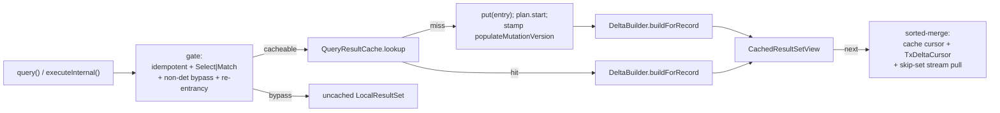

<!-- workflow-sha: e9377f7f133f5cd6ec3028936f28be2819e4ae96 -->
# Track 1: Cache foundation — infra, key, lifecycle, RECORD + K0_NONE shapes

## Purpose / Big Picture
After this track lands, `youtrackdb.query.txResultCache.enabled=true` makes
repeated idempotent SELECT queries within a transaction return cached results
merged with in-tx mutations, identical to a fresh uncached execution.

<!-- Reserved for Move 2 — ADDED/MODIFIED/REMOVED triad. Empty until Move 2 lands. -->

This track stands up the opt-in cache end-to-end for the two shapes that need no
execution-plan side-tap: RECORD (simple SELECT) and K0_NONE (everything
deterministically reproducible but not delta-reconcilable). It is the reference
architecture — the `QueryResultCache` LRU on the transaction, the `(AST, params)`
`CacheKey`, the `ShapeClassifier`/`NonDeterministicQueryDetector` gates, the
`mutationVersion`/populate-version machinery, the RECORD lazy merge-on-read, the
K0_NONE version-gate, lifecycle clears, memory bounds, and config knobs. Tracks 2
and 3 add shapes on top without changing this foundation.

## Progress
- [ ] Review + decomposition
- [ ] Step implementation
- [ ] Track-level code review
- [ ] Track completion

## Surprises & Discoveries
<!-- Continuous-log. Promoted by the orchestrator from per-step "What was
discovered" when the finding affects future steps or other tracks. Empty
at Phase 1. -->

## Decision Log
<!-- Continuous-log. Execution-time decisions: inline-replan choices,
scope-downs, dependency reveals, gate-override reasons. -->

<!-- Reserved for Move 1 — per-track inlined Decision Records. -->

## Outcomes & Retrospective
<!-- Continuous-log. Review iteration outcomes and the track-completion
summary at Phase C. -->

## Context and Orientation

The cache attaches to two existing classes and adds a new package.

- **`FrontendTransactionImpl`** (`internal/core/tx/`) holds the canonical
  mutation log `recordOperations` (a `HashMap<RecordIdInternal, RecordOperation>`,
  line 83), with collapse logic in `addRecordOperation` (line 510) that folds
  successive saves on one RID into a single op whose `type` reflects the FIRST
  status and whose later mutations the cache must still observe. `beginInternal`
  (line 164) and `clearUnfinishedChanges` (the single tx-end sink) are the
  lifecycle hooks. `assertOnOwningThread` (line 133) guards every mutation entry;
  `close()`/`rollbackInternal()` are the documented cross-thread exceptions. A
  new `cacheCodeDepth` depth counter is added here (CR1 resolution — two
  re-entrancy guards): the session increments it around the cache code path so a
  nested `query()` from a UDF-in-WHERE sees depth>0 and bypasses the cache. It is
  distinct from `QueryResultCache.inFlightLookup` (the lookup-level boolean) and
  does not exist in the codebase today.
- **`DatabaseSessionEmbedded`** (`internal/core/db/`) is the query entry. `query()`
  (line 617) parses via `SQLEngine.parse()` (backed by `YqlStatementCache`) then
  routes through `executeInternal` (line 702). `activeQueries` (line 238) is a
  `WeakValueHashMap` in embedded mode; `closeActiveQueries()` (line 3431) closes
  every live `ResultSet` on tx end, ordered before `clearUnfinishedChanges`.
- **`RecordOperation`** (`internal/core/tx/`) gains a `version: long` field
  stamped from `tx.mutationVersion` at each `addRecordOperation` (including the
  collapse path, which re-stamps so `op.version` always reflects the latest
  mutation).
- **`SQLInputParameter`** (`internal/core/sql/parser/`) extends `SimpleNode` with
  no `equals`/`hashCode` (confirmed) — it inherits `Object` identity, so a
  re-parsed AST after `YqlStatementCache` eviction would false-miss. D22 adds
  field-based `equals`/`hashCode`.
- **New package** (proposed `internal/core/sql/executor/cache/` or
  `internal/core/db/cache/`, decomposer to confirm the SPI-free location):
  `QueryResultCache`, `CacheKey`, `CachedEntry`, `CacheableShape`,
  `ShapeClassifier`, `NonDeterministicQueryDetector`, `TxDeltaCursor`,
  `DeltaBuilder`, `CachedResultSetView`, `IdempotentExecutionStream`,
  `QueryCacheMetrics`.

Non-obvious terminology: *cacheable shape* (static classification at first put),
*populate-version* (the `mutationVersion` stamp captured before the entry's first
`plan.start`), *delta-build* (the once-per-view snapshot of post-populate
mutations), *view pinning* (`liveViewCount` keeping a mid-iteration entry from
LRU eviction).

Concrete deliverables: a working RECORD + K0_NONE cache gated behind the config
flag, passing invariant tests I1-I3, I5 (partial), I6-I10, plus RECORD
equivalence (cache-miss vs cache-hit-with-delta across CREATED/UPDATED/DELETED ×
pre/post-populate) and K0_NONE version-gate tests.

## Plan of Work

Approximate sequence (decomposer sets final step boundaries):

1. **Config + metrics scaffolding.** Add the four `youtrackdb.query.txResultCache.*`
   knobs to `GlobalConfiguration` (`enabled` default false, `maxEntries` 200,
   `maxRecordsPerEntry` 10000, `k0NoneInvalidationThreshold` 3) and the
   `QueryCacheMetrics`/`CoreMetrics` counters (hits, misses, spliceFailures,
   k0Invalidations, overflows). No behavior yet.
2. **`mutationVersion` + `RecordOperation.version`.** Add the monotonic counter
   and `getMutationVersion()` to `FrontendTransactionImpl`; stamp `version` in
   `addRecordOperation` on both the new-op and collapse paths, inside the
   existing rollback try. Pure plumbing; assert the counter is monotonic.
3. **`CacheKey` + D22.** Add field-based `equals`/`hashCode` to
   `SQLInputParameter` (verify the subclass set; a regression test forces
   `YqlStatementCache` eviction + re-parse to prove the hit). Build `CacheKey`
   with the D12 identity fast-path before deep equals, defensive param-map copy.
4. **`CacheableShape` + `ShapeClassifier`.** Enum and the static classify that
   returns RECORD / K0_NONE here (AGGREGATE_*/MATCH_TUPLE_MULTI branches are
   stubbed to their final values but their delta paths land in Tracks 2-3).
   SKIP/LIMIT → K0_NONE check runs first.
5. **`NonDeterministicQueryDetector`.** Fail-open denylist (`sysdate`, zero-arg
   `date`, `uuid`, `eval`, `math_random`) + context-variable list + `noCache`;
   full-AST walk (WHERE, ORDER BY chains, RETURN, nested). The I5 enumeration
   completeness test lands in Track 2 with the aggregate functions but the
   detector and its denylist are authored here.
6. **`IdempotentExecutionStream` + `CachedEntry`.** The wrapper (D9) and the
   entry with idempotent `close()`, `effectiveFromClasses` closure (D11),
   `populateMutationVersion`, the shared delta-pair cache fields, `liveViewCount`.
7. **`QueryResultCache` + two-level re-entrancy guard (CR1).** The `accessOrder`
   `LinkedHashMap`, `nonCacheableKeys`, the lookup-level `inFlightLookup` boolean,
   view-pin-aware `removeEldestEntry`, snapshot-before-iterate in
   `invalidateAll`/`clear`, K0_NONE version-gate at `lookup`, idempotent
   `clear()`. Plus a new tx-level `cacheCodeDepth` counter on
   `FrontendTransactionImpl`: the session wraps the whole cache lookup-and-view
   scope in increment/decrement, so a UDF-in-WHERE re-entering `query()` sees
   depth>0 and bypasses; `inFlightLookup` guards the lookup call itself. Both are
   created here — neither exists in the codebase today.
8. **`DeltaBuilder.buildForRecord` + `TxDeltaCursor`.** The D21-filtered snapshot,
   the `(op.type, cached_at_build, match_after)` dispatch table, the ORDER BY
   sort, and the cross-view delta-pair sharing keyed on `mutationVersion`.
9. **`CachedResultSetView`.** The sorted-merge `next()` (record), the K0_NONE
   direct-replay path, the stream-pull-with-skip-set unification, `liveViewCount`
   inc/dec, idempotent `close()`.
10. **`DatabaseSessionEmbedded` + `FrontendTransactionImpl` wiring.** Lazy
    `getQueryResultCache()` gated on the flag; the `query()`/`executeInternal()`
    gate, lookup, put, view construction; the `cacheCodeDepth`
    increment/decrement bracketing the cache lookup-and-view scope (CR1) and the
    `cacheCodeDepth > 0` bypass for re-entrant `query()` (cacheable and K0_NONE
    alike); the bulk-DML `invalidateAll` branch (`TRUNCATE CLASS` only) with the
    schema-DDL `assert` canary; `clear()` in `beginInternal` and
    `clearUnfinishedChanges`.
11. **Invariant + equivalence tests.** I1-I3, I6-I10, K0_NONE version-gate,
    RECORD cache-vs-fresh equivalence across the four mutation patterns.

Ordering constraints: steps 1-3 are independent plumbing; step 7 depends on 6;
step 8 depends on 4 + 6; step 9 depends on 8; step 10 wires everything and must
land last before tests. Invariants to preserve: every tx-end path clears the
cache (I1); no mutation path runs off-thread (I2); a live view never sees its
entry evicted (I9); enabling the flag never changes result cardinality (I10).

## Concrete Steps
<!-- Phase A placeholder — decomposition writes a thin numbered roster here. -->

## Episodes
<!-- Continuous-log. Phase B sub-step 7 appends one block per completed step. -->

## Validation and Acceptance

- A repeated `SELECT FROM C WHERE p` within one tx executes storage once; the
  second `query()` returns from cache.
- A `save()` between two identical `query()` calls is reflected in the second
  view's output (CREATE adds, DELETE removes, UPDATE re-positions / drops on
  WHERE) — matching a parallel uncached `query()` (I4/I10).
- A view started before a mutation does not observe it; a fresh `query()` after
  does (I7).
- Commit, rollback, and exception-during-iterate each leave `cache.size()==0`
  (I1); a second `clear()` is a no-op (I6).
- `sysdate()`, `math_random()`, and `NOCACHE`-hinted queries create no entry (I5).
- Issuing ≥`maxEntries` distinct keys while a view iterates does not truncate
  that view's output (I9).
- A K0_NONE query (GROUP BY, SKIP/LIMIT, LET) hits on pure-read repeats and
  invalidates on the next lookup after any mutation; 3 strikes route the key to
  `nonCacheableKeys`.

<!-- Phase A placeholder for per-step EARS/Gherkin lines. -->

<!-- Reserved for Move 3 — EARS or Gherkin acceptance lines used verbatim as
test method names. -->

## Idempotence and Recovery
<!-- Phase A placeholder — names per-step idempotence and recovery paths once
steps are decomposed. -->

## Artifacts and Notes
<!-- Continuous-log (rare). Often empty. -->

## Interfaces and Dependencies

**In scope (new):** `QueryResultCache`, `CacheKey`, `CachedEntry`,
`CacheableShape`, `ShapeClassifier`, `NonDeterministicQueryDetector`,
`TxDeltaCursor`, `DeltaBuilder` (record path only), `CachedResultSetView`,
`IdempotentExecutionStream`, `QueryCacheMetrics`.

**In scope (modified):** `FrontendTransactionImpl` (cache field, `mutationVersion`,
`cacheCodeDepth` re-entrancy depth counter, `getQueryResultCache`, `clear` hooks),
`DatabaseSessionEmbedded` (gate/lookup/put/
view/bulk-invalidate), `RecordOperation` (`version` field), `SQLInputParameter`
(equals/hashCode), `GlobalConfiguration` (4 knobs), `CoreMetrics` (counters).

**Out of scope:** `AggregateState`, `AggregateCacheTapStep`, aggregate
`DeltaBuilder` path (Track 2); `MatchMultiDelta`, MATCH classify branches,
tombstone handling, MATCH delta path (Track 3); the parser grammar; the planner;
the I5 enumeration completeness test (Track 2). `ShapeClassifier` returns the
AGGREGATE_*/MATCH shape values but their delta-build and view paths are not wired
until later tracks — a cacheable-shape query of those kinds must bypass (return
uncached) until its track lands, so classify gates on a "shape implemented" check
or the session only routes RECORD/K0_NONE through the cache in this track.

**Compatibility:** behind a default-off flag; zero behavior change when disabled.
Single-thread tx invariants (I2) and the `OrderByStep` blocking-materializer
contract (I7) must be preserved.

**Downstream consumers:** Track 2 consumes `CachedEntry`, `DeltaBuilder`,
`CachedResultSetView`, the `mutationVersion`/populate-version filter, and the
`NonDeterministicQueryDetector`. Track 3 consumes the same plus the RECORD
delta-build (Etap A folds into it).

**Key signatures:**
- `FrontendTransactionImpl#getQueryResultCache(): QueryResultCache`,
  `#getMutationVersion(): long`
- `QueryResultCache#lookup(CacheKey): CachedEntry`, `#put(CacheKey, CachedEntry)`,
  `#invalidateAll()`, `#clear()`
- `ShapeClassifier#classify(SQLStatement): CacheableShape`
- `NonDeterministicQueryDetector#containsNonDeterministicReference(SQLStatement): boolean`
- `DeltaBuilder#buildForRecord(CachedEntry, FrontendTransactionImpl, CommandContext): TxDeltaCursor`
- `SQLWhereClause#matchesFilters(Identifiable, CommandContext): boolean` (existing, reused; `RecordAbstract` binds via `Identifiable`)
