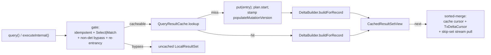

<!-- workflow-sha: e9377f7f133f5cd6ec3028936f28be2819e4ae96 -->
# Track 1: Cache foundation — infra, key, lifecycle, RECORD + K0_NONE shapes

## Purpose / Big Picture
After this track lands, `youtrackdb.query.txResultCache.enabled=true` makes
repeated idempotent SELECT queries within a transaction return cached results
merged with in-tx mutations, identical to a fresh uncached execution.

<!-- Reserved for Move 2 — ADDED/MODIFIED/REMOVED triad. Empty until Move 2 lands. -->

This track stands up the opt-in cache end-to-end for the two shapes that need no
execution-plan side-tap: RECORD (simple SELECT) and K0_NONE (everything
deterministically reproducible but not delta-reconcilable). It is the reference
architecture — the `QueryResultCache` LRU on the transaction, the `(AST, params)`
`CacheKey`, the `ShapeClassifier`/`NonDeterministicQueryDetector` gates, the
`mutationVersion`/populate-version machinery, the RECORD lazy merge-on-read, the
K0_NONE version-gate, lifecycle clears, memory bounds, and config knobs. Tracks 2
and 3 add shapes on top without changing this foundation.

## Progress
- [x] Review + decomposition
- [ ] Step implementation
- [ ] Track-level code review
- [ ] Track completion
- [x] 2026-06-09T17:47Z [ctx=safe] Review + decomposition complete
- [x] 2026-06-09T18:38Z [ctx=safe] Step 1 complete (commit 55d3af99a2)
- [x] 2026-06-09T19:15Z [ctx=safe] Step 2 complete (commit 75c8762273)
- [x] 2026-06-09T20:05Z [ctx=safe] Step 3 complete (commit 88cb09bc5a)
- [x] 2026-06-09T21:33Z [ctx=safe] Step 4 complete (commit 6edeb296a5, +1 review-fix iteration)

## Surprises & Discoveries
<!-- Continuous-log. Promoted by the orchestrator from per-step "What was
discovered" when the finding affects future steps or other tracks. Empty
at Phase 1. -->

- Phase A review (verified by direct source read; PSI timed out this session):
  - `design.md` still frames `cacheCodeDepth` as pre-existing "SO5" infrastructure.
    The CR1 resolution established it does NOT exist and is new in this track. The
    track file, not `design.md`'s stale wording, is authoritative for the implementer.
  - `SQLStatement.equals()` structurality (D2) lives only on `SQLSelectStatement`,
    not the base `SQLStatement`. Track 3 must re-verify `SQLMatchStatement.equals()`
    before relying on AST-equality for MATCH cache keys.
  - `DeltaBuilder` WHERE re-eval via `SQLWhereClause#matchesFilters(Identifiable,
    CommandContext)` must reuse the original query's `CommandContext` param bindings
    (step 8/9): a parameterized RECORD WHERE re-evaluated with a fresh ctx would
    diverge on `:param` values.

- Step 1 findings (See Episodes §Step 1):
  - D22 needs no parser-node edit: the base `SQLInputParameter` is never a returned
    parsed leaf (JavaCC scaffolding only), and the subclasses already carry field-based
    `equals`/`hashCode`. Track 3 must still re-verify `SQLMatchStatement.equals` before
    relying on AST-equality for MATCH keys.
  - `RecordOperation.version` is re-stamped to the latest `mutationVersion` on every
    collapse, so the Track 2/3 `DeltaBuilder` can rely on `op.version` reflecting the
    most recent change for a RID, never the first.
  - Surefire quirk for every later step's test run: in the core module, do not pass
    `-DfailIfNoTests=true` with a `-Dtest` filter — the sequential-tests execution
    matches nothing and fails the build; omit the flag.

- Step 2 findings (See Episodes §Step 2):
  - Track 2 (aggregate): count-distinct in this dialect is `count(distinct(prop))` (a
    nested `distinct(...)` function), not `count(distinct prop)` — aggregate delta tests
    must use that form. `ShapeClassifier` maps aggregates by outermost-call name only
    (no session/plan-shape gate), so an arithmetic-wrapped aggregate (`count(*)+1`) also
    matches; harmless here because aggregates are bypassed, but Track 2 should confirm
    the planner actually emits the aggregate step before relying on the classify value.
  - `SQLSelectStatement` is a hand-maintained JJTree node class (not regenerated) despite
    its "do not edit" header; adding accessors for existing fields is in-convention.

- Step 4 findings (See Episodes §Step 4):
  - `GLOBAL_METRICS` exact-set test: `PrefilterMetricsDefinitionTest` asserts the metric
    set EXACTLY. Step 1's five `QueryCache*` metrics broke it (only caught in a full
    build); fixed in Step 4. Tracks 2/3 must update this test in lockstep with any new
    `CoreMetrics` addition.
  - Cross-step invariant for cache-key changes: `DeltaBuilder`'s `(skipSet, injectList)`
    reuse fast path (`DeltaBuilder.java:112`) ignores `ctx` and is sound only because the
    Step 3 key is `(AST, normalized params)`. Any later track broadening the key must
    revisit it.
  - Test-harness fact: `Entity.setProperty` marks dirty but does NOT call
    `addRecordOperation`; tests staging post-populate ops must call
    `tx.addRecordOperation(record, type)` directly.

## Decision Log
<!-- Continuous-log. Execution-time decisions: inline-replan choices,
scope-downs, dependency reveals, gate-override reasons. -->

<!-- Reserved for Move 1 — per-track inlined Decision Records. -->

- Step 3 deferred review suggestions (carried to Phase C track review against the
  cumulative diff; not fixed at the step because they are suggestion-severity): BC1 —
  remove the now-dead `CachedEntry.k0InvalidationCount` field; BC2 — reconcile the
  `overflows` metric Javadoc with its actual LRU-eviction increment site. See Episodes
  §Step 3.
- Review-burden note: cumulative track diff crossed ~2600 lines after Step 3 (soft
  ~2000 flag) and ~3500 after Step 4, approaching the ~4000 reconsider mark. Decision:
  continue rather than inline-replan a split. Track 1 is the deliberately-sized
  foundation track (~20 files per the plan), and the three remaining steps (Step 5
  view, Step 6 wiring, Step 7 tests) are interdependent feature-completion work that a
  split cannot cleanly separate after 4/7 steps. Flagged for Phase C: the track-level
  review will run the full baseline over a >4000-line cumulative diff and treat the
  high-risk step ranges (Steps 3-6) as focal points; expect multiple review iterations.

## Outcomes & Retrospective
<!-- Continuous-log. Review iteration outcomes and the track-completion
summary at Phase C. -->

- [x] Technical: resolved at iteration 1 (4 findings: 1 blocker, 2 should-fix, 1
  suggestion; all applied). Blocker T1 (`RecordOperation` package) + T2/T3/T4
  fixed in Context/Plan/Surprises.
- [x] Risk: resolved at iteration 1 (6 findings: 0 blocker, 4 should-fix, 2
  suggestion; all applied). R1-R4 (RecordOperation, `query()` routing, clear sink,
  D22/parser-edit) fixed; R5/R6 noted.
- [x] Adversarial: resolved at iteration 1 (9 findings: 2 blocker, 5 should-fix, 2
  suggestion; all applied). Blockers A1 (begin-clear `txStartCounter==0` guard) +
  A6 (`ORDER BY`+LIMIT must classify K0_NONE first) fixed; A2/A3/A5/A7/A9 folded
  into Context/Validation/Surprises.
- Gate-check note: the formal gate-verification sub-agents were not spawned. PSI
  (`steroid_execute_code`) timed out for all three reviewers and would time out
  again, so every finding was independently verified by the orchestrator reading
  the actual source declarations (`RecordOperation` in `db/record/`, the two
  `query()` overloads at 617/652, `clear()` at 972, the 591-612 collapse switch,
  `SQLNamedParameter`/`SQLPositionalParameter` equals). Direct-read verification is
  stronger than a grep-fallback gate-verifier.

## Context and Orientation

The cache attaches to two existing classes and adds a new package.

- **`FrontendTransactionImpl`** (`internal/core/tx/`) holds the canonical
  mutation log `recordOperations` (a `HashMap<RecordIdInternal, RecordOperation>`,
  line 83), with collapse logic in `addRecordOperation` (line 510) that folds
  successive saves on one RID into a single op by mutating `txEntry.type` in place
  (lines 591-612): the collapsed `type` keeps the FIRST status EXCEPT that a later
  DELETE always wins (CREATE→UPDATE stays CREATED, but CREATE→DELETE and
  UPDATE→DELETE both become DELETED; an already-DELETED entry throws on any further
  op). The shared `txEntry.record` carries the latest content, so the cache
  observes later mutations through it. `beginInternal` (line 164) resets tx state
  only inside its `txStartCounter == 0` guard (line 174); `clear()` (line 972) is
  the tx-end sink and calls `closeActiveQueries()` (line 973) before
  `clearUnfinishedChanges()` (line 993). `assertOnOwningThread` (line 133) guards every mutation entry;
  `close()`/`rollbackInternal()` are the documented cross-thread exceptions. A
  new `cacheCodeDepth` depth counter is added here (CR1 resolution — two
  re-entrancy guards): the session increments it around the cache code path so a
  nested `query()` from a UDF-in-WHERE sees depth>0 and bypasses the cache. It is
  distinct from `QueryResultCache.inFlightLookup` (the lookup-level boolean) and
  does not exist in the codebase today.
- **`DatabaseSessionEmbedded`** (`internal/core/db/`) is the query entry. The two
  `query()` overloads — `query(String, Object...)` (line 617) and
  `query(String, boolean, Map)` (line 652, which `query(String, Map)` at 648
  delegates to) — each parse via `SQLEngine.parse()` (backed by `YqlStatementCache`),
  check `isIdempotent()`, run `statement.execute(this, args, true)`, and wrap the
  result in `queryStartedLifecycle()`. They do NOT route through `executeInternal`
  (line 702, which serves the non-`query` `execute()` command path), so the cache
  gate/lookup/put/view install at both `query()` overloads (or a shared helper they
  call), not at `executeInternal`. `activeQueries` (line 238) is a
  `WeakValueHashMap` in embedded mode; `closeActiveQueries()` (line 3431) closes
  every strongly-reachable live `ResultSet` inside `clear()` before
  `clearUnfinishedChanges()`. Because the map holds views weakly, a
  `CachedResultSetView` GC'd before tx-end is dropped silently — so the
  `CachedEntry`, not the view, must own the paused execution stream (load-bearing
  for I3).
- **`RecordOperation`** (`internal/core/db/record/` — the mutable
  `Comparable<RecordOperation>` with `public byte type` and the
  CREATED/UPDATED/DELETED constants, NOT the immutable `internal/core/tx/` `record`
  of the same name) gains a `version: long` field stamped from `tx.mutationVersion`
  at each `addRecordOperation`, re-stamped on the collapse path (after the
  591-612 type switch) so `op.version` always reflects the latest mutation.
- **`SQLInputParameter`** (`internal/core/sql/parser/`) extends `SimpleNode` with
  no `equals`/`hashCode`, so it inherits `Object` identity. But its two concrete
  subclasses — the actual parsed AST leaves `SQLNamedParameter` (equals line 85)
  and `SQLPositionalParameter` (equals line 74) — already carry field-based
  `equals`/`hashCode`. D22's base-class edit is needed only if `SQLInputParameter`
  itself is ever instantiated as a parsed leaf; step 3 verifies that before editing.
  If the subclasses cover every parsed case, no parser-node edit is required
  (sidestepping the generated-`parser/` edit-rule concern); the `CacheKey`
  regression test (force `YqlStatementCache` eviction + re-parse, assert a hit)
  proves correctness either way.
- **New package** `internal/core/sql/executor/cache/` (decomposer decision: the
  cache wraps query execution and Track 2's `AggregateCacheTapStep` is an
  execution-plan step, so the executor layer — home of `OrderByStep` and the step
  classes — is the cohesive SPI-free location; `db/cache/` was the alternative):
  `QueryResultCache`, `CacheKey`, `CachedEntry`, `CacheableShape`,
  `ShapeClassifier`, `NonDeterministicQueryDetector`, `TxDeltaCursor`,
  `DeltaBuilder`, `CachedResultSetView`, `IdempotentExecutionStream`,
  `QueryCacheMetrics`.

Non-obvious terminology: *cacheable shape* (static classification at first put),
*populate-version* (the `mutationVersion` stamp captured before the entry's first
`plan.start`), *delta-build* (the once-per-view snapshot of post-populate
mutations), *view pinning* (`liveViewCount` keeping a mid-iteration entry from
LRU eviction).

Concrete deliverables: a working RECORD + K0_NONE cache gated behind the config
flag, passing invariant tests I1-I3, I5 (partial), I6-I10, plus RECORD
equivalence (cache-miss vs cache-hit-with-delta across CREATED/UPDATED/DELETED ×
pre/post-populate) and K0_NONE version-gate tests.

### Clarifications

- **Unimplemented-shape bypass (v1).** This track routes only RECORD and K0_NONE
  through the cache. `ShapeClassifier` returns the final `AGGREGATE_*` /
  `MATCH_TUPLE_MULTI` values, but the session bypasses those shapes (uncached
  execution) without a separate "shape implemented" gate check — the simpler of
  the two wiring options the Interfaces section left open. The aggregate and
  MATCH delta paths land in Tracks 2 and 3.

## Plan of Work

Approximate sequence (decomposer sets final step boundaries):

1. **Config + metrics scaffolding.** Add the four `youtrackdb.query.txResultCache.*`
   knobs to `GlobalConfiguration` (`enabled` default false, `maxEntries` 200,
   `maxRecordsPerEntry` 10000, `k0NoneInvalidationThreshold` 3) and the
   `QueryCacheMetrics`/`CoreMetrics` counters (hits, misses, spliceFailures,
   k0Invalidations, overflows). No behavior yet.
2. **`mutationVersion` + `RecordOperation.version`.** Add the monotonic counter
   and `getMutationVersion()` to `FrontendTransactionImpl`; stamp `version` in
   `addRecordOperation` on both the new-op branch (after `recordOperations.put` at
   line 568) and the collapse branch (after the 591-612 type switch), inside the
   existing rollback try. An increment before an early throw is benign because
   rollback ends the tx and clears the cache. Pure plumbing; assert the counter is
   monotonic.
3. **`CacheKey` + D22.** First verify whether `SQLInputParameter` is ever a parsed
   AST leaf; its subclasses `SQLNamedParameter`/`SQLPositionalParameter` already
   have field-based `equals`/`hashCode`, so add the base-class pair ONLY if the
   base type itself appears in a parsed AST (otherwise skip the parser-node edit).
   A regression test forces `YqlStatementCache` eviction + re-parse to prove the
   hit regardless. Build `CacheKey` with the D12 identity fast-path before deep
   equals, defensive param-map copy.
4. **`CacheableShape` + `ShapeClassifier`.** Enum and the static classify that
   returns RECORD / K0_NONE here (AGGREGATE_*/MATCH_TUPLE_MULTI branches are
   stubbed to their final values but their delta paths land in Tracks 2-3).
   SKIP/LIMIT → K0_NONE check runs first.
5. **`NonDeterministicQueryDetector`.** Fail-open denylist (`sysdate`, zero-arg
   `date`, `uuid`, `eval`, `math_random`) + context-variable list + `noCache`;
   full-AST walk (WHERE, ORDER BY chains, RETURN, nested). The I5 enumeration
   completeness test lands in Track 2 with the aggregate functions but the
   detector and its denylist are authored here.
6. **`IdempotentExecutionStream` + `CachedEntry`.** The wrapper (D9) and the
   entry with idempotent `close()`, `effectiveFromClasses` closure (D11),
   `populateMutationVersion`, the shared delta-pair cache fields, `liveViewCount`.
7. **`QueryResultCache` + two-level re-entrancy guard (CR1).** The `accessOrder`
   `LinkedHashMap`, `nonCacheableKeys`, the lookup-level `inFlightLookup` boolean,
   view-pin-aware `removeEldestEntry`, snapshot-before-iterate in
   `invalidateAll`/`clear`, K0_NONE version-gate at `lookup`, idempotent
   `clear()`. Plus a new tx-level `cacheCodeDepth` counter on
   `FrontendTransactionImpl`: the session wraps the whole cache lookup-and-view
   scope in increment/decrement, so a UDF-in-WHERE re-entering `query()` sees
   depth>0 and bypasses; `inFlightLookup` guards the lookup call itself. Both are
   created here — neither exists in the codebase today.
8. **`DeltaBuilder.buildForRecord` + `TxDeltaCursor`.** The D21-filtered snapshot,
   the `(op.type, cached_at_build, match_after)` dispatch table, the ORDER BY
   sort, and the cross-view delta-pair sharing keyed on `mutationVersion`.
9. **`CachedResultSetView`.** The sorted-merge `next()` (record), the K0_NONE
   direct-replay path, the stream-pull-with-skip-set unification, `liveViewCount`
   inc/dec, idempotent `close()`.
10. **`DatabaseSessionEmbedded` + `FrontendTransactionImpl` wiring.** Lazy
    `getQueryResultCache()` gated on the flag; the gate, lookup, put, and view
    construction install at the two `query()` overloads (lines 617 and 652) — or a
    shared helper they both call — NOT at `executeInternal` (the `execute()` command
    path); the `cacheCodeDepth` increment/decrement bracketing the cache
    lookup-and-view scope (CR1) and the `cacheCodeDepth > 0` bypass for re-entrant
    `query()` (cacheable and K0_NONE alike); the bulk-DML `invalidateAll` branch
    (`TRUNCATE CLASS` only) with the schema-DDL `assert` canary; the cache `clear()`
    placed in `beginInternal` INSIDE the `txStartCounter == 0` guard (line 174,
    mirroring the existing reset so a nested `begin()` does not wipe a live cache)
    and in the tx-end `clear()` sink (which runs `closeActiveQueries()` before
    `clearUnfinishedChanges()`, so the cache hook relies on the D9 idempotent stream
    wrapper since views may already be closed).
11. **Invariant + equivalence tests.** I1-I3, I6-I10, K0_NONE version-gate,
    RECORD cache-vs-fresh equivalence across the four mutation patterns.

Ordering constraints: steps 1-3 are independent plumbing; step 7 depends on 6;
step 8 depends on 4 + 6; step 9 depends on 8; step 10 wires everything and must
land last before tests. Invariants to preserve: every tx-end path clears the
cache (I1); no mutation path runs off-thread (I2); a live view never sees its
entry evicted (I9); enabling the flag never changes result cardinality (I10).

## Concrete Steps

All new cache classes live in `internal/core/sql/executor/cache/`. Existing
classes verified by direct source read (PSI timed out this session): names and
line citations confirmed against `core/.../tx/FrontendTransactionImpl.java`,
`core/.../db/DatabaseSessionEmbedded.java`, `core/.../db/record/RecordOperation.java`,
`core/.../sql/parser/{SQLInputParameter,SQLNamedParameter,SQLPositionalParameter,SQLWhereClause,YqlStatementCache,SQLStatement,SQLSelectStatement}.java`,
`core/.../sql/executor/OrderByStep.java`, `api/config/GlobalConfiguration.java`,
`core/.../common/profiler/metrics/CoreMetrics.java`.

1. **Foundation: config knobs, metrics counters, `mutationVersion`, `RecordOperation.version`, `CacheKey` + D22.** Add the four `youtrackdb.query.txResultCache.*` knobs to `GlobalConfiguration` (additive enum values, off by default) and the `QueryCacheMetrics`/`CoreMetrics` counters (no increments yet). Add the monotonic `mutationVersion` counter + `getMutationVersion()` to `FrontendTransactionImpl` and the `version: long` field to `db/record/RecordOperation`, stamped in `addRecordOperation` on the new-op branch (after line 568) and the collapse branch (after the 591-612 switch). Build `CacheKey` (`(SQLStatement, normalized params)`, D12 identity fast-path before deep equals, defensive param-map copy); verify whether `SQLInputParameter` is ever a parsed leaf and add base-class `equals`/`hashCode` only if so (subclasses already have them). Regression test forces `YqlStatementCache` eviction + re-parse to prove the hit. — risk: medium (tx mutation-path plumbing + observability counters)  [x] commit: 55d3af99a2
2. **Static AST analysis + entry shapes: `CacheableShape`, `ShapeClassifier`, `NonDeterministicQueryDetector`, `CachedEntry`, `IdempotentExecutionStream`.** The `CacheableShape` enum and the static `ShapeClassifier.classify` (returns RECORD / K0_NONE here; AGGREGATE_*/MATCH values returned but the session bypasses them per the bypass clarification; SKIP/LIMIT → K0_NONE check runs first). The fail-open `NonDeterministicQueryDetector` (denylist `sysdate`/zero-arg `date`/`uuid`/`eval`/`math_random` + context-variable list + `noCache`; full-AST walk over WHERE, ORDER BY, RETURN, nested). The `IdempotentExecutionStream` wrapper (D9) and `CachedEntry` (idempotent `close()`, `effectiveFromClasses` closure D11, `populateMutationVersion`, shared delta-pair fields, `liveViewCount`). *(parallel with Step 1 once `getMutationVersion()` lands — Step 2 depends only on the Step 1 counter, not the key/config.)* — risk: medium (new classification + entry logic) — size: ~8 files; (a) the remaining track work is high-isolated (Steps 3-6) or the end-of-track test suite (Step 7), so no further low/medium work fits  [x] commit: 75c8762273
3. **`QueryResultCache` + two-level re-entrancy guard (CR1).** The `accessOrder` `LinkedHashMap` LRU, `nonCacheableKeys`, the lookup-level `inFlightLookup` boolean, view-pin-aware `removeEldestEntry` (pinned `liveViewCount` entries exempt, I9), snapshot-before-iterate in `invalidateAll`/`clear`, K0_NONE version-gate at `lookup`, idempotent `clear()`. Plus the tx-level `cacheCodeDepth` counter on `FrontendTransactionImpl`. — risk: high (cache lookup/eviction logic + re-entrancy guards)  [x] commit: 88cb09bc5a
4. **`DeltaBuilder.buildForRecord` + `TxDeltaCursor`.** The D21-filtered `recordOperations` snapshot, the `(op.type, cached_at_build, match_after)` dispatch table (correct for the verified collapse semantics: CREATE→DELETE and UPDATE→DELETE collapse to DELETED), the ORDER BY sort, and cross-view delta-pair sharing keyed on `mutationVersion`. WHERE re-eval via `SQLWhereClause#matchesFilters(Identifiable, CommandContext)` reuses the original query's `CommandContext` param bindings. — risk: high (merge-on-read correctness floor, I10)  [x] commit: 6edeb296a5
5. **`CachedResultSetView`.** The sorted-merge `next()` (record path), the K0_NONE direct-replay path, the stream-pull-with-skip-set unification, `liveViewCount` inc/dec, idempotent `close()`. — risk: high (I10 view output + I9 view pinning)  [ ]
6. **`DatabaseSessionEmbedded` + `FrontendTransactionImpl` wiring.** Lazy flag-gated `getQueryResultCache()`; the gate/lookup/put/view installed at the two `query()` overloads (lines 617, 652) via a shared helper, NOT at `executeInternal`; `cacheCodeDepth` increment/decrement bracketing the lookup-and-view scope (CR1) and the `cacheCodeDepth > 0` re-entrant bypass; the bulk-DML `invalidateAll` branch (`TRUNCATE CLASS` only) with the schema-DDL `assert` canary; cache `clear()` in `beginInternal` INSIDE the `txStartCounter == 0` guard (line 174) and in the tx-end `clear()` sink (relies on the D9 idempotent stream wrapper since `closeActiveQueries()` runs first). Only RECORD/K0_NONE route through the cache; other shapes bypass. — risk: high (cross-component wiring on the query entry + tx lifecycle + re-entrancy)  [ ]
7. **Invariant + equivalence test suite.** I1-I3, I6-I10, K0_NONE version-gate, RECORD cache-vs-fresh equivalence across CREATED/UPDATED/DELETED × pre/post-populate, the I1 eventual-clear (not clear-on-iterate-exception), and the `ORDER BY`+LIMIT-never-reaches-RECORD classify-ordering assertion. Tests run with `-ea` (I2/D3 enforcement is assert-based). — risk: medium (test-only, end-to-end feature) — size: ~6 files; (b) heavy-iteration equivalence suite kept separate from the Step 6 wiring so it can churn independently  [ ]

## Episodes
<!-- Continuous-log. Phase B sub-step 7 appends one block per completed step. -->

### Step 1 — commit 55d3af99a2, 2026-06-09T18:38Z [ctx=safe]

**What was done:** Added the four `youtrackdb.query.txResultCache.*` knobs to
`GlobalConfiguration` (`enabled=false`, `maxEntries=200`, `maxRecordsPerEntry=10000`,
`k0NoneInvalidationThreshold=3`, all runtime-changeable) and five no-increment rate
metric definitions to `CoreMetrics` plus the `QueryCacheMetrics` per-tx counter holder.
Added the monotonic `mutationVersion` counter and `getMutationVersion()` to
`FrontendTransactionImpl`, stamping `RecordOperation.version` on both the new-op branch
(after `recordOperations.put`) and the collapse branch (after the type switch), both
inside the existing rollback try. Built `CacheKey` with the D12 identity fast-path
before structural deep-equals, a defensive unmodifiable param-map copy, and
positional-to-index-keyed param normalisation. Tests: `CacheKeyTest` (7),
`TransactionMutationVersionTest` (3), `QueryCacheMetricsTest` (3) — 13/13 pass, 97.1%
line / 75.0% branch on changed lines.

**What was discovered:** D22 resolved on the skip-the-parser-edit branch the step
allowed. The base `SQLInputParameter` is created only as JavaCC node-stack scaffolding
inside the generated `InputParameter()` production, which always returns the
`SQLPositionalParameter` / `SQLNamedParameter` subclass; the base instance is never the
returned value nor stored in a typed AST field that `SQLSelectStatement.equals` walks,
so every parsed parameter leaf an AST-equality compare sees is a subclass, and the
subclasses already carry field-based `equals`/`hashCode`. No parser-node edit was
needed. This was verified by grep over the generated parser plus a direct read of the
generated `InputParameter()` body, not PSI find-usages (PSI timed out this session); the
`CacheKeyTest` eviction-and-re-parse regression proves `CacheKey` equality holds
regardless. `RecordOperation.version` is re-stamped to the latest `mutationVersion` on
every collapse, so the Track 2/3 `DeltaBuilder` can rely on `op.version` reflecting the
most recent change for a RID, never the first (consistent with D5/D21). Surefire quirk
for later steps: in the core module, do not pass `-DfailIfNoTests=true` with a `-Dtest`
filter — the sequential-tests execution matches nothing and fails the build; omit the
flag.

**What changed from the plan:** None.

**Key files:** `GlobalConfiguration`, `CoreMetrics`, `RecordOperation`,
`FrontendTransactionImpl` (modified); `CacheKey`, `QueryCacheMetrics` (new);
`CacheKeyTest`, `QueryCacheMetricsTest`, `TransactionMutationVersionTest` (new).

### Step 2 — commit 75c8762273, 2026-06-09T19:15Z [ctx=safe]

**What was done:** Added the five Step 2 cache classes under
`internal/core/sql/executor/cache/`. `CacheableShape` (9-value enum).
`ShapeClassifier.classify(SQLStatement)` is a session-free static classifier that
checks SKIP/LIMIT first (so an `ORDER BY` + `LIMIT` query can never reach RECORD),
routes GROUP BY / LET / UNWIND / subquery-target to K0_NONE, recognises single scalar
aggregates returning the final `AGGREGATE_*` values, and otherwise returns RECORD.
`NonDeterministicQueryDetector` is the fail-open denylist (`sysdate` / zero-arg `date` /
`uuid` / `eval` / `math_random`) plus `$`-prefixed context-variable detection plus the
`NOCACHE` hint, via a recursive JJTree `jjtGetChild` walk over the whole AST.
`IdempotentExecutionStream` is the close-once wrapper (D9). `CachedEntry` carries the
RECORD + K0_NONE fields with idempotent close, the `effectiveFromClasses` D11 closure,
`populateMutationVersion`, the shared delta-pair fields, `k0InvalidationCount`, and the
`liveViewCount` refcount. Added a `getNoCache()` accessor to `SQLSelectStatement`.
27/27 tests pass; 97.1% line / 75.0% branch on changed code.

**What was discovered:** This dialect parses count-distinct as `count(distinct(prop))`
(a nested `distinct(...)` function), not `count(distinct prop)`, and `ORDER BY` accepts
only an identifier plus a modifier chain (not a bare function call). Tests use the valid
forms; the LET-clause position covers the "walk reaches a non-top-level expression"
requirement. `SQLSelectStatement` carries a "Generated By:JJTree do not edit" header but
is a committed, hand-maintained node class (it already has `getProjection` / `setNoCache`
/ `equals`); JJTree does not regenerate an existing node file, so adding the one-line
`getNoCache()` getter for the pre-existing `noCache` field follows the file's convention
and does not violate the generated-parser edit rule. The JJTree-walk basis (children
populated by `openNodeScope` / `closeNodeScope`) was validated empirically by the passing
detector tests, since PSI timed out this session.

**What changed from the plan:** None.

**Key files:** `SQLSelectStatement` (modified, one-line getter); `CacheableShape`,
`ShapeClassifier`, `NonDeterministicQueryDetector`, `IdempotentExecutionStream`,
`CachedEntry` (new); `ShapeClassifierTest`, `NonDeterministicQueryDetectorTest`,
`CachedEntryTest` (new).

**Critical context:** `CachedEntry` deliberately omits the aggregate / MATCH-only fields
(`aggregateState`, `reverseIndex`, `aliasClasses`, `returnProjector`) — those land with
Tracks 2/3; the field list here is the RECORD + K0_NONE subset.

### Step 3 — commit 88cb09bc5a, 2026-06-09T20:05Z [ctx=safe]

**What was done:** Added `QueryResultCache`: the per-tx access-order `LinkedHashMap` LRU,
the `nonCacheableKeys` set, the lookup-level `inFlightLookup` re-entrancy boolean,
eldest-only pin-aware eviction (entries with `liveViewCount > 0` exempt, evicted keys
routed to `nonCacheableKeys`, stream closed, overflow counted), snapshot-before-iterate
`invalidateAll` and `clear`, the K0_NONE version-gate at `lookup` (equal-version hit,
diverged-version invalidate + strike, route to `nonCacheableKeys` after
`k0NoneInvalidationThreshold` strikes), and idempotent `clear` that closes every entry's
paused stream. Added the tx-level `cacheCodeDepth` counter plus
`enterCacheCode`/`exitCacheCode` (assert-on-owning-thread, floored decrement) and
`getCacheCodeDepth` to `FrontendTransactionImpl`. Two implementer commits landed for this
step (`6428b7a34e` implementation, `88cb09bc5a` counter-accessor test); the step diff and
review cover the full `fc5aec9cd5..88cb09bc5a` range. Step-level review (risk: high):
`review-bugs-concurrency` 0 blocker / 0 should-fix / 2 suggestions, `review-performance`
clean — gate passed at iteration 1.

**What was discovered:** Pin-aware eviction is eldest-only (design.md): inspect the single
LRU entry, evict if unpinned, else leave the map transiently over the bound. A first draft
scanned for the first unpinned entry and wrongly discarded the hot just-added entry when
the cold eldest was pinned; the corrected `evictEldestIfUnpinned` mirrors
`LinkedHashMap.removeEldestEntry`'s single-eldest decision (caught by a test). The
lookup-level `inFlightLookup` guard cannot be unit-tested in isolation (nothing inside
`lookup` re-enters the cache); its end-to-end exercise lands with Step 6's session
bracketing. K0_NONE strike count lives in a per-key map on the cache (`k0Strikes`), not on
`CachedEntry`, because invalidation removes the entry and an entry-local counter would be
lost. Deferred suggestions for the Phase C track review (cumulative diff): BC1 —
`CachedEntry.k0InvalidationCount` (added in Step 2) is now dead since strikes are tracked
in the cache's own map, remove it; BC2 — the `overflows` metric Javadoc describes the
per-entry record cap but its only increment site is LRU eviction, reconcile the wording.
Out-of-scope perf observation for the Step 6 review: `CacheKey.forArgs` (Step 1's file)
allocates a `HashMap` unconditionally on the no-arg path; confirm acceptable or use
`Collections.emptyMap()` when wiring per-query construction.

**What changed from the plan:** None. `lookup` takes the current `mutationVersion` as a
`long` parameter rather than referencing the transaction, keeping the cache decoupled from
`FrontendTransactionImpl` (within the plan's signature freedom); Step 6 supplies
`tx.getMutationVersion()` at the call site.

**Key files:** `FrontendTransactionImpl` (modified, `cacheCodeDepth` counter +
accessors); `QueryResultCache` (new); `QueryResultCacheTest`, `TransactionMutationVersionTest`
(new/modified tests).

### Step 4 — commit 6edeb296a5, 2026-06-09T21:33Z [ctx=safe]

**What was done:** Added `DeltaBuilder.buildForRecord(CachedEntry,
FrontendTransactionImpl, CommandContext)` and `TxDeltaCursor`. The builder snapshots
`tx.recordOperations` filtered by `op.version > entry.populateMutationVersion`, dispatches
each op on `(op.type, cached_at_build, match_after)` per the verified collapse-aware table
(CREATE→DELETE and UPDATE→DELETE collapse to DELETED → skip-only; cached CREATED/UPDATED
still matching → skip+reinject; true post-populate CREATE → inject-only), sorts the inject
list by the entry's ORDER BY via `SQLOrderBy.compare`, and promotes the immutable
`(skipSet, injectList)` pair onto the entry keyed by `mutationVersion` for cross-view
sharing. WHERE re-eval uses `SQLWhereClause.matchesFilters(Identifiable, ctx)` with the
original query's `CommandContext` so `:param` bindings resolve identically. `TxDeltaCursor`
wraps the shared pair plus a per-view `injectPosition` with `shouldSkip` / `peekInject` /
`advanceInject` for the Step 5 view. Step-level review (risk: high): `review-bugs-concurrency`
0 blocker / 1 should-fix / 2 suggestions, `review-performance` 0 blocker / 0 should-fix / 1
suggestion. The should-fix (BC1) was fixed in one iteration and the gate passed: added a
test that builds the entry through the production `CachedEntry.computeEffectiveFromClasses`
closure path to pin the `Entity.getSchemaClassName()` / `SchemaClass.getName()` name-form
equivalence; BC2 and PF1 applied as clarifying comments; BC3 correctly skipped (the `> 1`
sort guard was already correct).

**What was discovered:** Step 4 surfaced and fixed a real regression Step 1 introduced:
`PrefilterMetricsDefinitionTest.globalMetricsContainsExactlyExpectedMetrics` asserts
`GLOBAL_METRICS` as an EXACT set, and Step 1's five `QueryCache*` rate metrics broke it.
Step 1's targeted test run never executed this test, so the break only appears in a full
build — fixed by adding the five metrics to the expected set. Two test-harness facts for
later steps: (1) `Entity.setProperty` only marks a record dirty, it does NOT call
`addRecordOperation`, so tests must drive `tx.addRecordOperation(record, type)` directly to
stage a real post-populate op (a genuine UPDATED/DELETED op needs a record created in a
prior committed tx); (2) the `GLOBAL_METRICS` assertion is exact-set, so any later
`CoreMetrics` addition must update `PrefilterMetricsDefinitionTest` in lockstep.

**What changed from the plan:** None. Signatures and behaviour match the Interfaces section
and the design's build pseudocode.

**Critical context:** BC2 documented a cross-step invariant the delta-pair reuse fast path
relies on (`DeltaBuilder.java:112`): the `(skipSet, injectList)` reuse ignores `ctx` and is
sound only because a `CachedEntry` is keyed by `(AST, normalized params)` in the Step 3
keying layer, so co-reaching views share identical `:param` bindings. Any later track that
broadens the cache key must revisit this fast path.

**Key files:** `DeltaBuilder`, `TxDeltaCursor` (new); `DeltaBuilderTest` (new),
`PrefilterMetricsDefinitionTest` (modified, Step-1-regression fix).

## Validation and Acceptance

- A repeated `SELECT FROM C WHERE p` within one tx executes storage once; the
  second `query()` returns from cache.
- A `save()` between two identical `query()` calls is reflected in the second
  view's output (CREATE adds, DELETE removes, UPDATE re-positions / drops on
  WHERE) — matching a parallel uncached `query()` (I4/I10).
- A view started before a mutation does not observe it; a fresh `query()` after
  does (I7).
- Commit and rollback each leave `cache.size()==0` (I1); a second `clear()` is a
  no-op (I6). An exception thrown mid-iterate does not clear synchronously — the
  cache is wiped on the next tx-end path (`clear()`); the test asserts the
  eventual clear, not a clear-on-iterate-exception.
- `sysdate()`, `math_random()`, and `NOCACHE`-hinted queries create no entry (I5).
- Issuing ≥`maxEntries` distinct keys while a view iterates does not truncate
  that view's output (I9).
- A K0_NONE query (GROUP BY, SKIP/LIMIT, LET) hits on pure-read repeats and
  invalidates on the next lookup after any mutation; 3 strikes route the key to
  `nonCacheableKeys`.
- An `ORDER BY` + `LIMIT` query never reaches RECORD shape: the SKIP/LIMIT →
  K0_NONE classify check runs before RECORD detection (I10 depends on this, because
  `OrderByStep` + LIMIT is a bounded-heap materializer that discards rows past
  top-N, so an in-tx DELETE of a cached top-N row could not promote row N+1). A
  test asserts the classify ordering directly so a future reorder cannot silently
  break it.
- Enforcement caveat: I2 (owner-thread) rests on `assertOnOwningThread`, and the
  D3 schema-DDL canary is a Java `assert` — both disabled without `-ea`, so they
  protect tests, not production. Tests run with `-ea`.

<!-- Phase A placeholder for per-step EARS/Gherkin lines. -->

<!-- Reserved for Move 3 — EARS or Gherkin acceptance lines used verbatim as
test method names. -->

## Idempotence and Recovery

Every step is one commit; recovery is `git reset --hard HEAD` to the prior step's
commit (each step compiles + tests green standalone). Step-specific notes:

- Steps 1-2 are pure additions behind no behavior change (cache unwired, flag off),
  so a partial revert leaves the build green with the new classes simply unused.
- Step 3 (`QueryResultCache`) is instantiated only by Step 6's wiring, so it is
  dead code until then — reverting Step 6 disables the feature without touching
  Steps 1-5.
- Step 6 is the only step that changes runtime behavior, and only when
  `txResultCache.enabled=true`; default-off means a revert is behaviorally inert.
- The feature has no on-disk or WAL footprint (cache is transient per-tx state),
  so there is no migration or crash-recovery concern: a crash mid-tx discards the
  cache with the transaction.

## Artifacts and Notes
<!-- Continuous-log (rare). Often empty. -->

## Interfaces and Dependencies

**In scope (new):** `QueryResultCache`, `CacheKey`, `CachedEntry`,
`CacheableShape`, `ShapeClassifier`, `NonDeterministicQueryDetector`,
`TxDeltaCursor`, `DeltaBuilder` (record path only), `CachedResultSetView`,
`IdempotentExecutionStream`, `QueryCacheMetrics`.

**In scope (modified):** `FrontendTransactionImpl` (cache field, `mutationVersion`,
`cacheCodeDepth` re-entrancy depth counter, `getQueryResultCache`, `clear` hooks),
`DatabaseSessionEmbedded` (gate/lookup/put/
view/bulk-invalidate), `RecordOperation` (`version` field), `SQLInputParameter`
(equals/hashCode), `GlobalConfiguration` (4 knobs), `CoreMetrics` (counters).

**Out of scope:** `AggregateState`, `AggregateCacheTapStep`, aggregate
`DeltaBuilder` path (Track 2); `MatchMultiDelta`, MATCH classify branches,
tombstone handling, MATCH delta path (Track 3); the parser grammar; the planner;
the I5 enumeration completeness test (Track 2). `ShapeClassifier` returns the
AGGREGATE_*/MATCH shape values but their delta-build and view paths are not wired
until later tracks — a cacheable-shape query of those kinds must bypass (return
uncached) until its track lands, so classify gates on a "shape implemented" check
or the session only routes RECORD/K0_NONE through the cache in this track.

**Compatibility:** behind a default-off flag; zero behavior change when disabled.
Single-thread tx invariants (I2) and the `OrderByStep` blocking-materializer
contract (I7) must be preserved.

**Downstream consumers:** Track 2 consumes `CachedEntry`, `DeltaBuilder`,
`CachedResultSetView`, the `mutationVersion`/populate-version filter, and the
`NonDeterministicQueryDetector`. Track 3 consumes the same plus the RECORD
delta-build (Etap A folds into it).

**Key signatures:**
- `FrontendTransactionImpl#getQueryResultCache(): QueryResultCache`,
  `#getMutationVersion(): long`
- `QueryResultCache#lookup(CacheKey): CachedEntry`, `#put(CacheKey, CachedEntry)`,
  `#invalidateAll()`, `#clear()`
- `ShapeClassifier#classify(SQLStatement): CacheableShape`
- `NonDeterministicQueryDetector#containsNonDeterministicReference(SQLStatement): boolean`
- `DeltaBuilder#buildForRecord(CachedEntry, FrontendTransactionImpl, CommandContext): TxDeltaCursor`
- `SQLWhereClause#matchesFilters(Identifiable, CommandContext): boolean` (existing, reused; `RecordAbstract` binds via `Identifiable`)

## Base commit
f1cf786fbdc40e99c0a2c4b3f0ad2ab736d56eb7
