<!-- workflow-sha: e9377f7f133f5cd6ec3028936f28be2819e4ae96 -->
# Track 2: Aggregate shapes — side-tap, storage-parity replay, COUNT_DISTINCT

## Purpose / Big Picture
After this track lands, single-aggregate queries
(`SELECT COUNT(*)|SUM|AVG|MIN|MAX|COUNT(DISTINCT prop) FROM C [WHERE p]`) cache
their scalar and replay it correctly across in-tx mutations, matching fresh
execution bit-for-bit.

<!-- Reserved for Move 2 — ADDED/MODIFIED/REMOVED triad. Empty until Move 2 lands. -->

This track adds the `AGGREGATE_*` family on top of Track 1's foundation. The
collapsed `ResultSet` carries only the scalar, so a side-tap step observes every
contributing record before aggregation collapses it, seeding per-RID material.
`AggregateState` replays mutations on a copy at view-construction. SUM/AVG fold
through the same `PropertyTypeInternal.increment` storage uses (D19);
`COUNT(DISTINCT prop)` uses per-value RID buckets (D20). Aggregate cache-miss
eagerly drives the plan, unlike RECORD's lazy pull, because a partially-driven
tap would cache a structurally meaningless scalar.

## Progress
- [ ] Review + decomposition
- [ ] Step implementation
- [ ] Track-level code review
- [ ] Track completion

## Surprises & Discoveries
<!-- Continuous-log. Empty at Phase 1. -->

## Decision Log
<!-- Continuous-log. -->

<!-- Reserved for Move 1 — per-track inlined Decision Records. -->

## Outcomes & Retrospective
<!-- Continuous-log. -->

## Context and Orientation

Track 1 has shipped the cache infra, `CachedEntry`, `DeltaBuilder` (record path),
`CachedResultSetView`, the `mutationVersion`/populate-version filter, and
`NonDeterministicQueryDetector`. This track plugs the aggregate shape into those.

- **`AggregateProjectionCalculationStep`** (`internal/core/sql/executor/`,
  ≈121-137) runs the blocking aggregation loop: `prev.start(ctx)` then
  `while lastRs.hasNext: aggregate(lastRs.next, ...)`. The side-tap splices
  immediately upstream of it, observing each record before it collapses.
- **`SQLFunctionSum.sum` / `SQLFunctionAverage.sum`** call
  `PropertyTypeInternal.increment(current, value)` on every observed value;
  `AggregateState.observe` calls the identical primitive so cache replay matches
  storage across mixed-input promotion, Long overflow, and `2^53+1` precision
  loss (D19).
- **`SQLFunctionDistinct.getResult`** uses `LinkedHashSet<Object>` with raw
  `Object.equals`/`hashCode`, so `Long(5)` and `Integer(5)` are distinct;
  `distinctBuckets: Map<Object, Set<RID>>` mirrors that (D20).
- **Three `SQLFunctionFactory` implementations** (`DefaultSQLFunctionFactory`,
  `CustomSQLFunctionFactory` reflective `math_*`, `DatabaseFunctionFactory`
  stored) are the enumeration surface for the I5 completeness test.

Non-obvious terminology: *side-tap* (a transparent `ExecutionStream` wrapper that
observes-then-forwards), *eager drive* (forcing the plan to full drain at
cache-put so the tap sees every contributor), *membership-based dispatch*
(deriving before-state from `contributingValues.containsKey(rid)`, not `op.type`,
for D21 collapse safety).

```mermaid
flowchart LR
    Miss["aggregate cache-miss"] --> Plan["createExecutionPlan(ctx, false)"]
    Plan --> Splice["splice AggregateCacheTapStep\nupstream of AggregateProjectionCalculationStep"]
    Splice --> Drive["plan.start(ctx).next(ctx)\n(blocking full drain)"]
    Drive --> Obs["tap.observe(result)\nper contributing record"]
    Obs --> State["AggregateState\ncontributingValues / Rids / buckets"]
    State --> Entry["CachedEntry (immutable scalar)"]
    Entry -->|view ctor| Copy["buildForAggregate:\ncopy + replay applyMutation"]
    Copy --> View["CachedResultSetView\nreturns toResult()"]
```

Concrete deliverables: cacheable COUNT/SUM/AVG/MIN/MAX/COUNT_DISTINCT with
per-kind I4 equivalence tests (including the D21 collapse case: pre-populate
CREATE of the extremum holder + post-populate UPDATE breaking WHERE), the splice
+ fallback, and the I5 enumeration completeness test.

## Plan of Work

Approximate sequence (decomposer sets final boundaries):

1. **`AggregateState`.** Fields and the `observe`/`applyMutation`/`copy`/`toResult`
   methods for all six kinds. SUM/AVG via `PropertyTypeInternal.increment` with a
   full re-fold on T→T/T→F/F→T (no symmetric subtract). MIN/MAX with
   `extremumRid` RID-identity `was_extremum` and the O(n) recompute only on the
   two extremum-leaves transitions. COUNT_DISTINCT with `distinctBuckets` +
   bucket cleanup. All dispatch keys on the `(was_contributing → now_contributing)`
   transition derived from membership, never `op.type` (D21 collapse safety).
2. **`AggregateCacheTapStep`.** `extends AbstractExecutionStep`; `internalStart`
   calls `prev.start(ctx)` and wraps the stream so `next(ctx)` invokes
   `observe(result)` before forwarding unchanged.
3. **Splice + fallback in `DatabaseSessionEmbedded`.** Miss path builds the plan
   via `statement.createExecutionPlan(ctx, false)`, downcasts to
   `SelectExecutionPlan`, walks `steps`, finds `AggregateProjectionCalculationStep`,
   rewires its `prev` to the tap. On unexpected shape: close the plan, increment
   `spliceFailures`, fall back to `statement.execute(...)` returning a plain
   `LocalResultSet` (no cache), log the step types.
4. **Eager drive on cache-put.** Force `plan.start(ctx).next(ctx)` so the tap
   observes every record; hold the single-row scalar on the entry alongside the
   now-complete `AggregateState`. Wrap in try / put-on-success-only.
5. **`DeltaBuilder.buildForAggregate` + classify branch.** Copy + replay the
   populate-version-filtered ops; wire `ShapeClassifier` aggregate gates
   (single aggregate, no GROUP BY/HAVING, no expression arg, no SKIP/LIMIT;
   `COUNT(DISTINCT prop)` → AGGREGATE_COUNT_DISTINCT, expression-DISTINCT →
   K0_NONE). Wire the `CachedResultSetView` aggregate path (`toResult()`,
   `hasNext` true once).
6. **I4 per-kind + I5 enumeration tests.** Per aggregate kind, the four mutation
   patterns plus the collapse case. The I5 test walks all three factories and
   fails the build on an unclassified function.

Ordering: step 1 is standalone; steps 2-4 form the splice+drive path; step 5
depends on 1; tests last. Invariants to preserve: aggregate replay matches
storage bit-for-bit (D19); a never-iterated view must not cache a meaningless
scalar (eager drive); membership dispatch must survive the `addRecordOperation`
collapse.

## Concrete Steps
<!-- Phase A placeholder. -->

## Episodes
<!-- Continuous-log. -->

## Validation and Acceptance

- `SELECT COUNT(*) FROM C` cached, then a matching CREATE / a WHERE-breaking
  UPDATE / a DELETE between two `query()` calls → the second scalar matches a
  parallel uncached `query()` (per kind: COUNT, SUM, AVG, MIN, MAX,
  COUNT_DISTINCT).
- The D21 collapse case (pre-populate CREATE of the MIN/MAX holder + post-populate
  UPDATE that breaks WHERE; and one that drops the holder's value below a
  non-holder) → cached scalar matches fresh, with no stale contributor.
- SUM over mixed Long+Double input replays to the same Double fresh execution
  returns; Long overflow and `2^53+1` precision loss match by construction.
- `COUNT(DISTINCT prop)` with cross-subtype values (`Long(5)`, `Integer(5)`)
  keeps distinct buckets matching storage; `COUNT(DISTINCT a+b)` routes to K0_NONE.
- A planner shape with no `AggregateProjectionCalculationStep` falls back to an
  uncached `LocalResultSet` and increments `spliceFailures`; no exception leaks.
- The I5 enumeration test fails the build if a new non-deterministic function in
  any of the three factories lacks a denylist entry.

<!-- Phase A placeholder for per-step EARS/Gherkin lines. -->

<!-- Reserved for Move 3 — EARS/Gherkin acceptance lines. -->

## Idempotence and Recovery
<!-- Phase A placeholder. -->

## Artifacts and Notes
<!-- Continuous-log (rare). Often empty. -->

## Interfaces and Dependencies

**In scope (new):** `AggregateState`, `AggregateCacheTapStep`.

**In scope (modified):** `DeltaBuilder` (aggregate path), `ShapeClassifier`
(aggregate branches), `CachedResultSetView` (aggregate path),
`DatabaseSessionEmbedded` (splice + eager drive + fallback in the miss path),
`CachedEntry` (aggregateState field, if not already added in Track 1).

**Out of scope:** MATCH shapes and tombstone handling (Track 3); the D14 MIN/MAX
`TreeMap` sorted-value index (v2, deferred); the planner and parser.

**Compatibility:** aggregate cache-miss changes the miss path from
`statement.execute(...)` to `createExecutionPlan` + splice + eager drive; the
fallback must reproduce the exact uncached `LocalResultSet` behavior on any
unexpected plan shape. Eager drive matches the uncached aggregate latency profile
(every aggregate query blocks to produce its row anyway).

**Upstream dependency:** Track 1 (`CachedEntry`, `DeltaBuilder`,
`CachedResultSetView`, `mutationVersion`/populate-version filter,
`NonDeterministicQueryDetector`, config/metrics).

**Downstream consumers:** none mandatory; Track 3 is independent of aggregate
internals.

**Key signatures:**
- `AggregateState#observe(Result)`, `#applyMutation(RecordAbstract, byte status, boolean matchAfter)`,
  `#copy(): AggregateState`, `#toResult(): Result`
- `DeltaBuilder#buildForAggregate(CachedEntry, FrontendTransactionImpl, CommandContext): AggregateState`
- `AggregateCacheTapStep extends AbstractExecutionStep` — `internalStart(ctx): ExecutionStream`
- `PropertyTypeInternal#increment(Number current, Number value): Number` (existing, reused)
