<!-- workflow-sha: e9377f7f133f5cd6ec3028936f28be2819e4ae96 -->
# Track 2: Aggregate shapes — side-tap, storage-parity replay, COUNT_DISTINCT

## Purpose / Big Picture
After this track lands, single-aggregate queries
(`SELECT COUNT(*)|SUM|AVG|MIN|MAX|COUNT(DISTINCT prop) FROM C [WHERE p]`) cache
their scalar and replay it correctly across in-tx mutations, matching fresh
execution bit-for-bit.

<!-- Reserved for Move 2 — ADDED/MODIFIED/REMOVED triad. Empty until Move 2 lands. -->

This track adds the `AGGREGATE_*` family on top of Track 1's foundation. The
collapsed `ResultSet` carries only the scalar, so a side-tap step observes every
contributing record before aggregation collapses it, seeding per-RID material.
`AggregateState` replays mutations on a copy at view-construction. SUM/AVG fold
through the same `PropertyTypeInternal.increment` storage uses (D19);
`COUNT(DISTINCT prop)` uses per-value RID buckets (D20). Aggregate cache-miss
eagerly drives the plan, unlike RECORD's lazy pull, because a partially-driven
tap would cache a structurally meaningless scalar.

## Progress
- [x] Review + decomposition
- [ ] Step implementation
- [ ] Track-level code review
- [ ] Track completion

- [x] 2026-06-11T11:29Z [ctx=info] Review + decomposition complete

## Surprises & Discoveries
<!-- Continuous-log. Empty at Phase 1. -->

- **Phase A review (iter 1):** bare and single-field-indexed `COUNT(*)` are
  hardwired in `SelectExecutionPlanner` to `CountFromClassStep` before any
  `AggregateProjectionCalculationStep` exists, so the side-tap cannot reach them
  (A1/R1). The Phase 1 headline validation example `SELECT COUNT(*) FROM C` would
  have asserted the fallback path, not the cache.
- **Phase A review (iter 1):** Track 1 over-delivered the `ShapeClassifier`
  aggregate gates, including the COUNT(DISTINCT) nested-`distinct(...)` parse
  (R6) — step 5 is verify-and-tighten, not build.
- **Phase A review, rejected:** the adversarial "splice corrupts the shared
  cached plan" finding (A2) is a false positive —
  `YqlExecutionPlanCache.getInternal` returns `result.copy(ctx)`, so the caller
  always holds a private plan copy.
- **Phase A review (iter 1):** the ServiceLoader manifest registers four
  `SQLFunctionFactory` implementations, not three (R5 — `DynamicSQLElementFactory`
  was omitted from the Phase 1 description).

## Decision Log
<!-- Continuous-log. -->

<!-- Reserved for Move 1 — per-track inlined Decision Records. -->

- **Hardwired `COUNT(*)` → not cached (Phase A).** Bare and single-field-indexed
  `COUNT(*)` are excluded from the aggregate cache (ride the splice fallback or
  classify K0_NONE). They are already O(1) and tx-aware via `CountFromClassStep`,
  so caching adds complexity for no benefit and the side-tap cannot tap them.
  Refines design §AGGREGATE_* shape, which listed `COUNT(*)` as cacheable; flag
  for Phase 4 design-doc reconciliation.
- **Aggregate memory cap targets `AggregateState`, not `results` (Phase A).** The
  carried-from-Track-1 "route per-RID append through `recordPulledRow`"
  obligation is mis-applied to aggregates; the cap bounds the per-contributor
  collections instead. Overflow routes the key non-cacheable via the L7 path.
- **AVG finalizes via `computeAverage` (Phase A).** D19's `increment` covers the
  SUM accumulation only; AVG needs the contributor `total` and
  `SQLFunctionAverage.computeAverage`'s type-dispatched division for bit-for-bit
  parity.
- **`applyMutation` value-from-record (Phase A).** A T→T value-changing UPDATE
  reads the new value from the mutated `RecordAbstract`; `boolean matchAfter`
  carries WHERE-membership only. The existing signature is sufficient (rejects
  A6.2).

## Outcomes & Retrospective
<!-- Continuous-log. -->

- [x] Technical: PASS at iteration 2 (6 findings, 6 accepted)
- [x] Risk: PASS at iteration 2 (6 findings, 5 accepted; R6 was already implemented in Track 1)
- [x] Adversarial: PASS at iteration 2 (6 findings, 5 accepted; A2 rejected as a false positive — the plan is copied, not shared)

## Context and Orientation

Track 1 has shipped the cache infra, `CachedEntry`, `DeltaBuilder` (record path),
`CachedResultSetView`, the `mutationVersion`/populate-version filter, and
`NonDeterministicQueryDetector`. This track plugs the aggregate shape into those.

- **`AggregateProjectionCalculationStep`** (`internal/core/sql/executor/`,
  ≈121-137) runs the blocking aggregation loop: `prev.start(ctx)` then
  `while lastRs.hasNext: aggregate(lastRs.next, ...)`. The side-tap splices
  immediately upstream of it, observing each record before it collapses.
- **`SQLFunctionSum.sum` / `SQLFunctionAverage.sum`** call
  `PropertyTypeInternal.increment(current, value)` on every observed value;
  `AggregateState.observe` calls the identical primitive so cache replay matches
  storage across mixed-input promotion, Long overflow, and `2^53+1` precision
  loss (D19).
- **`SQLFunctionDistinct.getResult`** uses `LinkedHashSet<Object>` with raw
  `Object.equals`/`hashCode`, so `Long(5)` and `Integer(5)` are distinct;
  `distinctBuckets: Map<Object, Set<RID>>` mirrors that (D20).
- **Four `SQLFunctionFactory` implementations** (`DefaultSQLFunctionFactory`,
  `DynamicSQLElementFactory`, `CustomSQLFunctionFactory` reflective `math_*`,
  `DatabaseFunctionFactory` stored) are the enumeration surface for the I5
  completeness test. The ServiceLoader manifest registers all four; the Phase 1
  description named only three (it omitted `DynamicSQLElementFactory`).
- **Bare and single-field-indexed `COUNT(*)` are hardwired and untappable.**
  `SelectExecutionPlanner.handleHardwiredOptimizations` short-circuits
  `SELECT count(*) FROM C` (via `handleHardwiredCountOnClass`) and
  `SELECT count(*) FROM C WHERE indexedField = ?` (via
  `handleHardwiredCountOnClassUsingIndex`) to `CountFromClassStep` *before* any
  `AggregateProjectionCalculationStep` is built, so the side-tap finds nothing to
  splice. These shapes are already O(1) and tx-aware. `COUNT(*)` over a
  non-indexed WHERE, and SUM/AVG/MIN/MAX/COUNT(DISTINCT), do build the
  aggregation step and ARE tappable. See Plan of Work step 5 and Decision Log.

Non-obvious terminology: *side-tap* (a transparent `ExecutionStream` wrapper that
observes-then-forwards), *eager drive* (forcing the plan to full drain at
cache-put so the tap sees every contributor), *membership-based dispatch*
(deriving before-state from `contributingValues.containsKey(rid)`, not `op.type`,
for D21 collapse safety).

```mermaid
flowchart LR
    Miss["aggregate cache-miss"] --> Plan["createExecutionPlan(ctx, false)"]
    Plan --> Splice["splice AggregateCacheTapStep\nupstream of AggregateProjectionCalculationStep"]
    Splice --> Drive["plan.start(ctx) + drain\n(blocking full drain)"]
    Drive --> Obs["tap.observe(result)\nper contributing record"]
    Obs --> State["AggregateState\ncontributingValues / Rids / buckets"]
    State --> Entry["CachedEntry (immutable scalar)"]
    Entry -->|view ctor| Copy["buildForAggregate:\ncopy + replay applyMutation"]
    Copy --> View["CachedResultSetView\nreturns toResult()"]
```

Concrete deliverables: cacheable COUNT/SUM/AVG/MIN/MAX/COUNT_DISTINCT with
per-kind I4 equivalence tests (including the D21 collapse case: pre-populate
CREATE of the extremum holder + post-populate UPDATE breaking WHERE), the splice
+ fallback, and the I5 enumeration completeness test.

## Plan of Work

Approximate sequence (decomposer sets final boundaries):

1. **`AggregateState`.** Fields and the `observe`/`applyMutation`/`copy`/`toResult`
   methods for all six kinds.
   - **SUM/AVG storage parity (D19).** `observe` seeds the first contributing
     value verbatim, then folds each subsequent value via
     `PropertyTypeInternal.increment` (the primitive `SQLFunctionSum.sum` /
     `SQLFunctionAverage.sum` use); `applyMutation` does a full re-fold of
     `contributingValues.values()` on T→T/T→F/F→T (no symmetric subtract). On a
     T→T value-changing UPDATE the new value is read from the mutated
     `RecordAbstract` and written into `contributingValues[rid]` before the
     re-fold; the `boolean matchAfter` flag carries WHERE-membership only. SUM
     over an empty set is `0`, not null.
   - **AVG finalization.** AVG additionally tracks the contributor count
     (`total`) and finalizes through `SQLFunctionAverage.computeAverage`'s
     type-dispatched division (integer truncation for Integer/Long, BigDecimal
     `HALF_UP`), not a plain `sum/total`, so the cached scalar matches fresh
     execution bit-for-bit. `increment` alone (D19) covers only the SUM half.
   - **MIN/MAX** with `extremumRid` RID-identity `was_extremum` and the O(n)
     recompute only on the two extremum-leaves transitions.
   - **COUNT_DISTINCT** with `distinctBuckets` + bucket cleanup.
   - **Dispatch** keys on the `(was_contributing → now_contributing)` transition
     derived from membership (`contributingValues.containsKey(rid)` /
     `contributingRids.contains(rid)`); `status` is consulted only to fold
     `DELETED` into `now_contributing = false`, never as a stand-in for the
     before-state (D21 collapse safety — design.md's wording, not the looser
     "never op.type").
   - **Memory cap (aggregate-specific).** The carried-from-Track-1
     `recordPulledRow` cap bounds `results` (one scalar row for an aggregate) and
     does NOT bound the per-contributor material. Bound the `AggregateState`
     collections (`contributingValues` / `contributingRids` / `distinctBuckets`)
     against `maxRecordsPerEntry` instead; on overflow, route the key
     non-cacheable (the L7 path: remove the entry, add the key to
     `nonCacheableKeys`). High-cardinality COUNT(DISTINCT)/MIN/MAX is the real
     OOM vector, not `results`.
2. **`AggregateCacheTapStep`.** `extends AbstractExecutionStep`; `internalStart`
   calls `prev.start(ctx)` and wraps the stream so `next(ctx)` invokes
   `observe(result)` before forwarding unchanged.
3. **Splice + fallback in `DatabaseSessionEmbedded`.** Miss path builds the plan
   via `statement.createExecutionPlan(ctx, false)` (the returned plan is a
   per-execution `copy(ctx)` from `YqlExecutionPlanCache.getInternal`, or a fresh
   `SelectExecutionPlan` on a cache miss — never the shared cached instance, so
   rewiring `prev` cannot corrupt other callers' plans), downcasts to
   `SelectExecutionPlan`, walks `steps`, finds
   `AggregateProjectionCalculationStep`, rewires its `prev` to the tap. The
   aggregate miss path is a separate branch in the cache shape gate (the existing
   `serveThroughCache` RECORD/K0 gate), not folded into it, and preserves Track
   1's two-guard `viewOwnsGuard`/`cacheCodeDepth` contract. On unexpected shape
   (no `AggregateProjectionCalculationStep` found — e.g. a hardwired
   `CountFromClassStep`): close the plan, call `incrementSpliceFailures`, fall
   back to a plain uncached `LocalResultSet` that reproduces the exact uncached
   behavior, log the step types.
4. **Eager drive on cache-put.** Drive the plan to full drain via
   `plan.start(ctx)` then pull the resulting stream to exhaustion (the blocking
   `AggregateProjectionCalculationStep` produces its single row only after every
   contributor is observed) so the tap sees every record; hold the single-row
   scalar on the entry alongside the now-complete `AggregateState`. This is a
   parallel populate path that cannot reuse Track 1's `populateAndBuildView`, so
   it independently re-mirrors the three Track-1 populate contracts: stamp
   `populateMutationVersion` before driving, release the `cacheCodeDepth` guard on
   every exit (a leaked depth silently disables caching), and close the plan
   idempotently. Wrap in try / put-on-success-only.
5. **`DeltaBuilder.buildForAggregate` + classifier tightening.** Copy + replay
   the populate-version-filtered ops. The `ShapeClassifier` aggregate gates
   already exist in Track 1 (single aggregate, no GROUP BY/HAVING/SKIP/LIMIT,
   `count(distinct(prop))` → AGGREGATE_COUNT_DISTINCT, expression-DISTINCT →
   K0_NONE, including the nested-`distinct(...)` parse) — verify, do not rebuild
   them. Two tightenings ARE Track 2 work, because aggregates now actually cache:
   (a) an aggregate buried under arithmetic (`count(*) + 1`) must classify
   K0_NONE, not AGGREGATE_COUNT — Track 1's `topLevelFunctionCall` returns the
   inner call and its Javadoc flags this looser match as "harmless here" only
   while aggregates are uncached; (b) bare/indexed `COUNT(*)` (the hardwired
   shapes from Context & Orientation) gain no benefit from caching and cannot be
   tapped, so they either ride the splice fallback or classify K0_NONE — pick one
   explicitly and test it. Wire the `CachedResultSetView` aggregate path
   (`toResult()`, `hasNext` true once).
6. **I4 per-kind + I5 enumeration tests.** Per aggregate kind, the four mutation
   patterns plus the collapse case. I4 cache-hit cases must use a *tappable*
   shape — not bare `COUNT(*) FROM C` (hardwired, untappable; that test would
   assert the fallback path and prove nothing). Add a case asserting the hardwired
   `COUNT(*)` shapes take the fallback, and a memory-cap case that overflows
   `AggregateState` on a high-cardinality COUNT(DISTINCT) and confirms the key
   goes non-cacheable. The I5 test walks all four `SQLFunctionFactory`
   implementations and fails the build on an unclassified function.

Ordering: step 1 is standalone; steps 2-4 form the splice+drive path; step 5
depends on 1; tests last. Invariants to preserve: aggregate replay matches
storage bit-for-bit (D19); a never-iterated view must not cache a meaningless
scalar (eager drive); membership dispatch must survive the `addRecordOperation`
collapse.

## Concrete Steps

1. **AggregateState replay core.** New `AggregateState` (observe / applyMutation /
   copy / toResult for all six kinds: SUM/AVG storage parity via
   `PropertyTypeInternal.increment` with first-value seed and full re-fold; AVG
   `total` + `SQLFunctionAverage.computeAverage` finalization; MIN/MAX
   `extremumRid` transitions; COUNT_DISTINCT buckets; membership-derived dispatch
   with D21 collapse safety; aggregate-specific cap on the `AggregateState`
   collections that routes the key non-cacheable on overflow), plus
   `DeltaBuilder.buildForAggregate` (copy + replay populate-version-filtered ops),
   the `CachedResultSetView` aggregate path (`toResult()`, `hasNext` true once),
   and the `CachedEntry` `aggregateState` field. Unit-tested in isolation:
   per-kind observe/applyMutation, mixed-input/overflow/precision SUM parity, AVG
   integer-truncation and BigDecimal `HALF_UP`, the collapse case, cap overflow.
   *(parallel with Step 2)* — risk: high (performance hot path)  [ ]
2. **Classifier tightening + global metric bridge.** Tighten `ShapeClassifier` so
   an aggregate under arithmetic (`count(*) + 1`) classifies K0_NONE (not
   AGGREGATE_COUNT) and bare / single-field-indexed `COUNT(*)` rides the fallback
   or classifies K0_NONE (hardwired, untappable); the existing aggregate gates and
   the COUNT(DISTINCT) nested-`distinct(...)` parse are verified, not rebuilt.
   Wire the global `CoreMetrics.QUERY_CACHE_*_RATE` increments from the existing
   per-tx counters. Tested: classifier unit cases for both tightenings, the I5
   four-factory enumeration completeness test, and a metric-increment assertion.
   *(parallel with Step 1)* — risk: medium — size: ~3 files; (a) no mergeable
   low/medium work fits (rest of track is high-tagged or its own integration
   tests)  [ ]
3. **Tap + splice + eager drive + fallback.** New `AggregateCacheTapStep extends
   AbstractExecutionStep`; in `DatabaseSessionEmbedded` the aggregate miss path
   builds the plan via `createExecutionPlan` (a per-execution copy), splices the
   tap upstream of `AggregateProjectionCalculationStep` as a separate branch in
   the cache shape gate (preserving the two-guard `viewOwnsGuard` / `cacheCodeDepth`
   contract), eager-drives via `plan.start(ctx)` + drain while re-mirroring the
   three Track-1 populate contracts (stamp `populateMutationVersion` before
   driving, release the guard on every exit, idempotent close), and falls back to
   an uncached `LocalResultSet` + `incrementSpliceFailures` on any unexpected
   shape (e.g. a hardwired `CountFromClassStep`). End-to-end tested: per-kind
   cache-vs-fresh I4 equivalence over a tappable shape (COUNT/SUM/AVG/MIN/MAX/
   COUNT_DISTINCT) including the D21 collapse case, bare/indexed COUNT(*) takes the
   fallback, cap overflow routes the key non-cacheable, no exception leaks.
   Depends on Steps 1 and 2. — risk: high (architecture / cross-component
   coordination)  [ ]

## Episodes
<!-- Continuous-log. -->

## Validation and Acceptance

- A *tappable* aggregate (e.g. `SELECT SUM(price) FROM C WHERE active = true`, or
  `COUNT(*)` over a non-indexed predicate) cached, then a matching CREATE / a
  WHERE-breaking UPDATE / a DELETE between two `query()` calls → the second scalar
  matches a parallel uncached `query()` (per kind: COUNT, SUM, AVG, MIN, MAX,
  COUNT_DISTINCT). The per-kind cache-hit case must NOT use bare
  `COUNT(*) FROM C`, which is hardwired to `CountFromClassStep` and never reaches
  the side-tap.
- Bare `SELECT COUNT(*) FROM C` and indexed `COUNT(*) ... WHERE indexedField = ?`
  take the uncached fallback (or classify K0_NONE), `incrementSpliceFailures`
  fires on the fallback branch, and the scalar still matches fresh — caching them
  is neither attempted nor needed (already O(1)).
- `count(*) + 1` (aggregate under arithmetic) classifies K0_NONE and is served
  via the K0 version gate, not the aggregate cache.
- The D21 collapse case (pre-populate CREATE of the MIN/MAX holder + post-populate
  UPDATE that breaks WHERE; and one that drops the holder's value below a
  non-holder) → cached scalar matches fresh, with no stale contributor.
- SUM over mixed Long+Double input replays to the same Double fresh execution
  returns; Long overflow and `2^53+1` precision loss match by construction. AVG
  over Integer/Long input truncates exactly as `computeAverage` does (integer
  division), and BigDecimal AVG rounds `HALF_UP`, matching fresh.
- `COUNT(DISTINCT prop)` with cross-subtype values (`Long(5)`, `Integer(5)`)
  keeps distinct buckets matching storage; `COUNT(DISTINCT a+b)` routes to K0_NONE.
- A high-cardinality COUNT(DISTINCT) / MIN / MAX that overflows the
  `AggregateState` collection cap routes the key non-cacheable (no OOM, no stale
  cache).
- A planner shape with no `AggregateProjectionCalculationStep` falls back to an
  uncached `LocalResultSet` and `incrementSpliceFailures` fires; no exception
  leaks.
- The I5 enumeration test fails the build if a new non-deterministic function in
  any of the four factories lacks a denylist entry.

<!-- Phase A placeholder for per-step EARS/Gherkin lines. -->

<!-- Reserved for Move 3 — EARS/Gherkin acceptance lines. -->

## Idempotence and Recovery
<!-- Phase A placeholder. -->

## Artifacts and Notes
<!-- Continuous-log (rare). Often empty. -->

## Interfaces and Dependencies

**In scope (new):** `AggregateState`, `AggregateCacheTapStep`.

**In scope (modified):** `DeltaBuilder` (aggregate path), `ShapeClassifier`
(aggregate branches), `CachedResultSetView` (aggregate path),
`DatabaseSessionEmbedded` (splice + eager drive + fallback in the miss path),
`CachedEntry` (aggregateState field, if not already added in Track 1).

**Out of scope:** MATCH shapes and tombstone handling (Track 3); the D14 MIN/MAX
`TreeMap` sorted-value index (v2, deferred); the planner and parser.

**Compatibility:** aggregate cache-miss changes the miss path from
`statement.execute(...)` to `createExecutionPlan` + splice + eager drive; the
fallback must reproduce the exact uncached `LocalResultSet` behavior on any
unexpected plan shape. Eager drive matches the uncached aggregate latency profile
(every aggregate query blocks to produce its row anyway).

**Upstream dependency:** Track 1 (`CachedEntry`, `DeltaBuilder`,
`CachedResultSetView`, `mutationVersion`/populate-version filter,
`NonDeterministicQueryDetector`, config/metrics).

**Downstream consumers:** none mandatory; Track 3 is independent of aggregate
internals.

**Key signatures:**
- `AggregateState#observe(Result)`, `#applyMutation(RecordAbstract, byte status, boolean matchAfter)`
  (the new value for a T→T re-fold is read from the `RecordAbstract`; `matchAfter`
  carries WHERE-membership only), `#copy(): AggregateState`, `#toResult(): Result`
- AVG state carries a `total` contributor count and finalizes via
  `SQLFunctionAverage#computeAverage` (type-dispatched division), not `sum/total`
- `DeltaBuilder#buildForAggregate(CachedEntry, FrontendTransactionImpl, CommandContext): AggregateState`
- `AggregateCacheTapStep extends AbstractExecutionStep` — `internalStart(ctx): ExecutionStream`
- `PropertyTypeInternal#increment(Number current, Number value): Number` (existing, reused)
- `SQLFunctionAverage#computeAverage(...)` (existing, reused for AVG finalization)
- `QueryResultCache#incrementSpliceFailures()` (the only new per-tx metric;
  hit/miss/k0/overflow increments already exist in Track 1)

## Base commit
babd8d607687b284687b57ccb882cf838148055b
