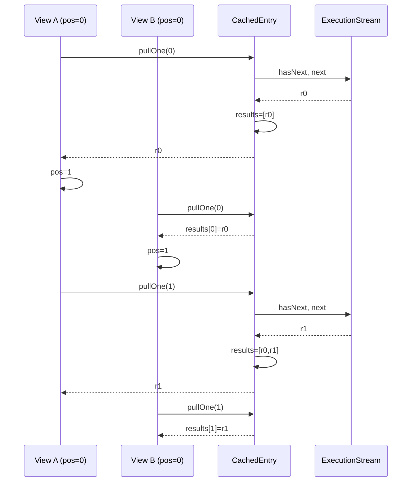

# Track 3: Pause/resume — shared stream + per-view position

## Purpose / Big Picture
After this track, a consumer who iterates only the first N of M results in a `query()` call can issue the same query again later and continue from where they left off — and a third consumer issuing the same query starts from row 0 sharing the cached prefix.

Extend `CachedEntry` to hold the live `ExecutionStream` past the first consumer's iteration, and extend `CachedResultSetView` to fall through to it when the consumer outruns the cached list. Multiple `query()` calls within one tx return independent views sharing the same entry; the first view to pull a particular row is the one that pays the storage cost. Close the stream when exhausted, evicted, or invalidated.

## Progress
- [ ] Review + decomposition
- [ ] Step implementation
- [ ] Track-level code review
- [ ] Track completion

## Surprises & Discoveries

## Decision Log

## Outcomes & Retrospective

## Context and Orientation

After Track 2, a single consumer iterating a fresh `query()` does the right thing — the entry's results list grows as the consumer pulls. The gap closing in Track 3 is: when the first consumer stops iterating mid-stream (e.g., `findFirst()` then drops the view), the entry has 1 result and a non-exhausted stream. A second consumer calling `query()` of the same key in Track 2 state would build a SECOND entry (wasteful) — actually no, Track 2 returns a view over the EXISTING entry on lookup hit. But Track 2's view always pulls from the embedded entry stream — and Track 2's view doesn't share the stream across views safely.

Specifically: in Track 2, the entry holds a stream, the view holds a position. When position == results.size() and stream has more, the view pulls. That works for one view at a time. For two views over the same entry, **both** are reading the same stream — but only one of them can validly call `stream.next()` at the same logical instant. Solution: serialize stream access through `CachedEntry.pullOne()` — a method that returns `entry.results.get(N)` for any N <= results.size, falling through to `stream.next()` (and appending) when N == size, while incrementing a single shared "highWaterMark" position. Each view requests its own position via `entry.pullOne(position)`; the entry decides whether to return a cached row or pull a new one.

`ExecutionStream` (core/src/main/java/com/jetbrains/youtrackdb/internal/core/sql/executor/resultset/ExecutionStream.java) is a pure pull iterator (`hasNext(ctx)`, `next(ctx)`, `close(ctx)`). The cache holds `entry.stream` + `entry.plan` + `entry.ctx` (the original `CommandContext` from the first execution). Subsequent views borrow this context for their stream pulls. The context contains parameter bindings; since parameters are part of the cache key, they're equal across all views of this entry, so context reuse is safe.

The interaction with `DatabaseSessionEmbedded.activeQueries` (line 238) is subtle. In Track 2, the first `query()` call creates a `LocalResultSet` (or wraps via `queryStartedLifecycle`) and registers it in `activeQueries`. The cache stores only the `ExecutionStream` (extracted from the `LocalResultSet`). When the original `LocalResultSet` is closed by its consumer, `closed=true`, and `closeActiveQueries()` finds nothing to do at tx end for THAT entry. But our cached stream is still open. Our cache's `clear()` (called from `clearUnfinishedChanges()`) is what closes those streams.

Capture: the `LocalResultSet` wrapping the stream is what consumers see — we don't expose the bare stream. So in Track 3, the first consumer's view holds a reference to the entry, the entry holds the stream, the consumer iterates via the view. Closing the consumer's view does NOT close the entry's stream. The stream is closed by entry close, which happens on (a) entry eviction, (b) entry invalidation/wipe, (c) entry exhaustion (stream reports no more rows), or (d) tx end via `cache.clear()`.

Concrete deliverables:
- `CachedEntry.pullOne(int position)` — shared-access method.
- `CachedResultSetView.next()` rewritten to use `entry.pullOne(position)`.
- Stream-close pathway: entry.close() closes stream; eviction via `removeEldestEntry` calls entry.close(); `invalidateAll`/`invalidateOnMutation` (stubbed for K0 here, K1 in Track 4) closes affected entries' streams.
- Tests: partial iteration → new query continues; exhaustion flips flag; eviction-mid-iteration; tx-end cleanup of held streams.

## Plan of Work

1. Extend `CachedEntry`: store `InternalExecutionPlan plan`, `CommandContext ctx`, the live `ExecutionStream stream`, and a boolean `exhausted`. Constructor takes all four. Method `pullOne(int requestedPosition)`: if `requestedPosition < results.size()`, return `results.get(requestedPosition)` (no stream interaction); else if `exhausted`, return null sentinel (caller treats as end-of-results); else call `stream.next(ctx)`, append to `results`, return it. When stream reports `!hasNext(ctx)`, flip `exhausted=true` and close the stream. Method must be safe to call from the single owning thread only — no locking, no concurrent calls.
2. Rewrite `CachedResultSetView`: own a `position` counter only. `hasNext()` returns true if `position < entry.results.size()` (cheap, no stream interaction) OR `!entry.exhausted && entry.stream.hasNext(entry.ctx)`. `next()` calls `entry.pullOne(position)`; if null (sentinel for end), throw `NoSuchElementException`; else increment position and return.
3. Track 2's `query()` miss path was constructing the entry with just stream and results-list; revisit to also capture `plan` and `ctx` from the post-`statement.execute()` result. The `LocalResultSet` returned by `statement.execute(...)` exposes `getExecutionPlan()` and (via the executionPlan's context) the `CommandContext`. Use `LocalResultSet` instanceof check to extract these; fallback for non-LocalResultSet implementations is to leave plan/ctx null and not support cross-query resume for that entry (mark entry `resumable=false`).
4. Wire stream-close into entry lifecycle. `CachedEntry.close()` (existing skeleton from Track 1): if `stream != null && !exhausted`, call `stream.close(ctx)`, then null out plan/ctx/stream. `QueryResultCache.clear()` already iterates entries and calls `entry.close()` (per Track 1 skeleton).
5. LRU eviction must trigger `evicted.close()`. In `LinkedHashMap.removeEldestEntry()`, override to: if `size() > maxEntries`, call `eldest.getValue().close()` first, then return true. This is the only eviction path until Track 5 adds mutation-driven invalidation.
6. Tests: (a) partial iteration → re-query: pull 5 of 100, drop view, query again same key, assert second view returns rows 1-100 correctly (rows 1-5 from cache, rows 6-100 from stream); (b) two interleaved consumers: view A pulls row 1, view B pulls row 1 (same row, cached), view A pulls row 2 (cached?-no, pulls from stream and appends), view B pulls row 2 (now cached); (c) exhaustion: pull all 100, assert `entry.exhausted == true` and `entry.stream == null` after the 100th pull; (d) eviction-while-stream-open: set `maxEntries=1`, do query A (live stream), do query B (different key — evicts A), assert A's stream was closed; (e) tx-end with held stream: query, pull 5 of 100, commit, assert stream closed; (f) **`ExecutionStream.close()` idempotency regression (I6)** — populate an entry, call `entry.close()` twice in a row, assert no exception thrown and stream's close is invoked at most once (or invoked twice but is itself idempotent — verify which guarantee the codebase provides; if `ExecutionStream` is not currently idempotent, add a guard in `CachedEntry.close()` via the null-out-on-first-call pattern and document the choice).

## Concrete Steps

## Episodes

## Validation and Acceptance

- Issuing the same query twice within a transaction, with the first consumer iterating only a prefix, returns the full ordered result on the second issue without re-executing the prefix against storage.
- A view never pulls a row out of order — `pullOne(N)` returns the same `Result` for the same N regardless of which view called first.
- An entry whose stream has been exhausted (`hasNext()==false`) has `stream == null` and `exhausted == true` and behaves identically to a list-only replay.
- LRU eviction closes the evicted entry's stream before drop.
- Transaction-end (commit, rollback, exception path) closes every held stream — verified by spying on `ExecutionStream.close(ctx)` calls.
- Test verifies invariant I3: closing a paused stream happens exactly once per entry, in the right circumstances.

## Idempotence and Recovery

## Artifacts and Notes

## Interfaces and Dependencies

**In scope:**
- `core/src/main/java/com/jetbrains/youtrackdb/internal/core/tx/CachedEntry.java` — add `plan`, `ctx`, `pullOne`, full `close` lifecycle.
- `core/src/main/java/com/jetbrains/youtrackdb/internal/core/tx/CachedResultSetView.java` — rewire to `entry.pullOne(position)`.
- `core/src/main/java/com/jetbrains/youtrackdb/internal/core/tx/QueryResultCache.java` — override `LinkedHashMap.removeEldestEntry`.
- `core/src/main/java/com/jetbrains/youtrackdb/internal/core/db/DatabaseSessionEmbedded.java` — capture `plan`/`ctx` when constructing the entry in the cache-miss path.
- Tests under `core/src/test/java/com/jetbrains/youtrackdb/internal/core/tx/`.

**Out of scope:**
- Dirty-merge — Track 4 (entries with non-null streams must handle mutation; placeholder in Track 3 just wipes / closes the entry).
- DML invalidation, non-determinism gate, observability — Track 5.

**Inter-track dependencies:**
- Depends on Track 2 (uses the entry shape and view-construction path).
- Track 4 builds on `pullOne` (its sharp-merge mutates `entry.results` while a view may have an active position).
- Track 5 builds on entry close (its `invalidateAll` closes every entry's stream).

**Library / function signatures introduced:**
- `CachedEntry.pullOne(int requestedPosition) → @Nullable Result`.
- `CachedEntry(InternalExecutionPlan plan, CommandContext ctx, ExecutionStream stream, /* ast metadata */)` constructor.
- `QueryResultCache.removeEldestEntry(Map.Entry<CacheKey, CachedEntry>)` override.

Diagram: two views share an entry's results list and stream. The first view to reach a new position pulls from the stream; the second view sees the cached row.
