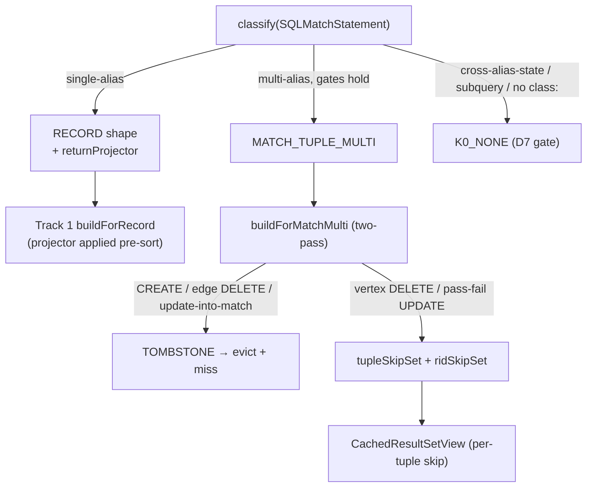

<!-- workflow-sha: e9377f7f133f5cd6ec3028936f28be2819e4ae96 -->
# Track 3: MATCH shapes — Etap A composition, partial Etap B, tombstone floor

## Purpose / Big Picture
After this track lands, MATCH queries cache: single-alias MATCH replays like a
RECORD query, and multi-alias / pattern-with-edges MATCH reconciles vertex
DELETE and pass→fail UPDATE incrementally while tombstoning the cases a skip-only
delta cannot handle — always matching fresh execution.

<!-- Reserved for Move 2 — ADDED/MODIFIED/REMOVED triad. Empty until Move 2 lands. -->

This track adds MATCH caching. Etap A (single-alias) folds to RECORD shape via a
stored `returnProjector` that wraps a record into the single-binding tuple the
executor produces, reusing Track 1's record delta path. `MATCH_TUPLE_MULTI`
carries per-tuple bookkeeping (`aliasClasses`, `traversalEdgeClasses`,
`contributingRids`, `reverseIndex`) and a two-pass `buildForMatchMulti` with a
tombstone floor: any CREATE, any edge-class DELETE, and any UPDATE-into-match
tombstone the entry; vertex DELETE and pass→fail UPDATE drop incrementally.
Correctness rests entirely on this delta-build because `MATCH_TUPLE_MULTI` has no
version backstop.

## Progress
- [ ] Review + decomposition
- [ ] Step implementation
- [ ] Track-level code review
- [ ] Track completion

## Surprises & Discoveries
<!-- Continuous-log. Empty at Phase 1. -->

## Decision Log
<!-- Continuous-log. -->

<!-- Reserved for Move 1 — per-track inlined Decision Records. -->

## Outcomes & Retrospective
<!-- Continuous-log. -->

## Context and Orientation

Track 1 shipped the RECORD delta path and `CachedResultSetView`; Etap A composes
directly onto it. `MATCH_TUPLE_MULTI` needs its own delta type and a tombstone
hook in the cache lookup.

- **`SQLMatchStatement`** (`internal/core/sql/parser/`) — the MATCH AST. Its
  grammar (`YouTrackDBSql.jjt:1245`) does not accept `NOCACHE` (asymmetry with
  SELECT, preserved deliberately; v2 candidate). `SQLMatchStatement.equals()`
  covers statement-level SKIP natively, so the cache key needs no special MATCH
  handling.
- **`SQLWhereClause.matchesFilters(Identifiable, CommandContext)`** — reused to re-evaluate each
  alias's pattern WHERE against a mutated record at delta-build.
- **`SchemaClass.getAllSubclasses()`** — the subclass-closure source for
  `aliasClasses` and `traversalEdgeClasses` (D11 symmetry with RECORD's
  `effectiveFromClasses`).
- **Traversal edges.** `.out/.in/.both(label)` steps name edge classes; folding
  their subclass closure into `effectiveFromClasses` is what lets an edge
  `RecordOperation` pass the class filter and trip the tombstone instead of being
  silently skipped — the gap the original edge-mutation bug slipped through.

Non-obvious terminology: *Etap A* (single-alias MATCH → RECORD composition),
*Etap B* (multi-alias; only the partial floor ships in v1), *tombstone* (mark the
entry un-replayable at delta-build, evict + miss at lookup), *reverseIndex*
(`Map<RID, Set<tupleIndex>>` for incremental tuple drops), *update-into-match*
(an UPDATE that flips a record into an alias WHERE it did not previously bind).

Concrete deliverables: cacheable single- and multi-alias MATCH with the I4 MATCH
test matrix — vertex + edge CREATE/DELETE/UPDATE, update-into-match, bound-edge
pass→fail, and a cross-class-dereference WHERE mutated on the dereferenced record.

## Plan of Work

Approximate sequence (decomposer sets final boundaries):

1. **MATCH classify branches.** Extend `ShapeClassifier`: single-alias →
   RECORD with a `returnProjector`; multi-alias (>1 node, or any node with edges,
   or cross-join) → `MATCH_TUPLE_MULTI` when every node has `class:`, no
   LET/UNWIND, no cross-alias-state WHEREs, no subqueries, and no WHERE that
   dereferences a link path into a class outside the read set; everything else →
   K0_NONE (Track 1's gate handles it).
2. **Etap A `returnProjector` + effectiveFromClasses.** Build the projector
   closure from the RETURN clause; set `whereClause`, `orderBy`,
   `effectiveFromClasses` = `{X} ∪ closure`. Reuse Track 1's `buildForRecord`,
   applying the projector to each inject-list entry before the ORDER BY sort
   (so a projected ORDER BY column resolves).
3. **MATCH multi-alias entry metadata.** Populate `aliasClasses`,
   `traversalEdgeClasses`, `aliasWheres`, and `effectiveFromClasses` (union of
   alias closures + traversal-edge closures) at entry construction; populate
   `contributingRids` + `reverseIndex` during stream-pull.
4. **`MatchMultiDelta` + `DeltaBuilder.buildForMatchMulti`.** The two-pass
   algorithm: a tombstone pre-scan (CREATE of any class in `effectiveFromClasses`,
   edge-class DELETE) returning TOMBSTONE, then the per-tuple `tupleSkipSet` +
   per-RID `ridSkipSet` build (vertex DELETE drops via reverseIndex; UPDATE checks
   update-into-match → tombstone, else pass→fail drop + ridSkipSet for stream-pull
   suppression).
5. **Tombstone handling in `QueryResultCache.lookup`.** For a
   `MATCH_TUPLE_MULTI` entry, invoke `buildForMatchMulti`; on TOMBSTONE remove the
   entry and return MISS; else cache the `MatchMultiDelta` (mutationVersion
   sharing) and return HIT. Tombstone is single-shot per mutationVersion.
6. **`CachedResultSetView` MATCH path.** Skip cached tuples in `tupleSkipSet`;
   on stream-pull, drop a tuple if any alias binding is in `ridSkipSet`, else
   append + extend reverseIndex/contributingRids.
7. **I4 MATCH test matrix.** Etap A equivalence (cache-miss vs hit+delta across
   CREATED/UPDATED/DELETED). Multi-alias: vertex DELETE, pass→fail UPDATE,
   bound-edge pass→fail, edge CREATE (tombstone), edge DELETE (tombstone),
   update-into-match (tombstone), cross-class-dereference WHERE mutated on the
   dereferenced record (routed to K0_NONE by classify).

Ordering: step 1 gates the rest; step 2 (Etap A) is independent of steps 3-6
(multi-alias); tests last. Invariants to preserve: every result-changing mutation
touches a class in `effectiveFromClasses` and is either reconciled or tombstoned
(the delta-build completeness floor); the I7 frozen-view contract holds for
tombstone latency (a tombstoned entry's live views keep their frozen snapshot,
re-execution happens on the next `query()`).

## Concrete Steps
<!-- Phase A placeholder. -->

## Episodes
<!-- Continuous-log. -->

## Validation and Acceptance

- Single-alias `MATCH {as:u, class:X WHERE p} RETURN u, u.name` cached, then
  CREATE/UPDATE/DELETE between two `query()` calls → the second view matches a
  parallel uncached MATCH (Etap A equivalence).
- Multi-alias `MATCH {as:i, class:Issue}.out('project'){as:p, class:Project}
  RETURN i, p`:
  - `delete(issue)` → all tuples holding that RID drop (incremental).
  - WHERE-breaking UPDATE on `i` → affected tuples drop (incremental).
  - bound-edge `where:(weight>5)` UPDATE that flips `e` out → pass→fail drop.
  - edge CREATE / edge DELETE / UPDATE-into-match → entry tombstoned, next
    `query()` re-executes fresh; output matches uncached.
- A pattern WHERE dereferencing a link into an out-of-pattern class
  (`where:(assignee.name = ?)`) classifies as K0_NONE and is correct under the
  version gate when the dereferenced record is mutated.
- Every scenario above matches a parallel uncached `query()` at the same moment
  (I4/I10).

<!-- Phase A placeholder for per-step EARS/Gherkin lines. -->

<!-- Reserved for Move 3 — EARS/Gherkin acceptance lines. -->

## Idempotence and Recovery
<!-- Phase A placeholder. -->

## Artifacts and Notes
<!-- Continuous-log (rare). Often empty. -->

## Interfaces and Dependencies

**In scope (new):** `MatchMultiDelta`.

**In scope (modified):** `ShapeClassifier` (MATCH branches + returnProjector
construction), `DeltaBuilder` (match path), `CachedResultSetView` (MATCH per-tuple
path), `CachedEntry` (MATCH metadata fields: `aliasClasses`,
`traversalEdgeClasses`, `aliasWheres`, `contributingRids`, `reverseIndex`,
`tombstoned`, `returnProjector`), `QueryResultCache` (tombstone-at-lookup).

**Out of scope (deferred to a separate ADR):** constrained-pattern-walk CREATE
discovery (`MatchPrefetchStep` + edge-CREATED dispatch hook), incremental
edge-DELETE (endpoint-content reverse index). Both are correctness-neutral
because the v1 floor tombstones the cases. Also out of scope: MATCH `NOCACHE`
grammar token (v2).

**Compatibility:** `MATCH_TUPLE_MULTI` carries no mutation-version backstop, so
the delta-build floor is the entire correctness story — the classify gates must
route every non-floor-handleable shape to K0_NONE. The tombstone path must honor
the I7 frozen-view contract (live views unaffected; re-execution on next query).

**Upstream dependency:** Track 1 (RECORD `buildForRecord` for Etap A,
`CachedResultSetView`, `CachedEntry`, `effectiveFromClasses` closure machinery,
classify scaffold, tombstone-capable `QueryResultCache.lookup` if not stubbed in
Track 1). Track 2 is a sequencing predecessor (stacked-diff order) but MATCH does
not consume aggregate internals.

**Downstream consumers:** none (final shape track).

**Key signatures:**
- `DeltaBuilder#buildForMatchMulti(CachedEntry, FrontendTransactionImpl, CommandContext): MatchMultiDelta` (or TOMBSTONE sentinel)
- `MatchMultiDelta#shouldSkipTuple(int): boolean`, `#shouldSkipRid(RID): boolean`
- `CachedEntry#returnProjector: Function<RecordAbstract, Result>` (Etap A)
- `SchemaClass#getAllSubclasses()` (existing, reused for closures)
- `SQLWhereClause#matchesFilters(Identifiable, CommandContext): boolean` (existing, reused per alias)
