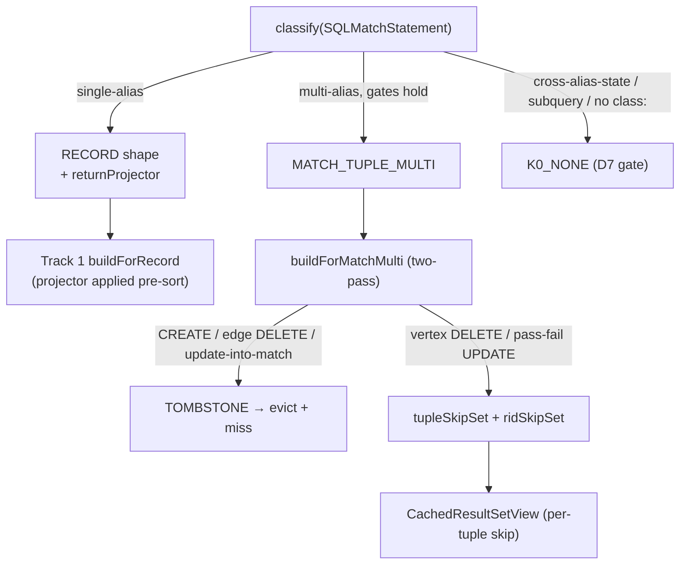

<!-- workflow-sha: e9377f7f133f5cd6ec3028936f28be2819e4ae96 -->
# Track 3: MATCH shapes — Etap A composition, partial Etap B, tombstone floor

## Purpose / Big Picture
After this track lands, MATCH queries cache: single-alias MATCH replays like a
RECORD query, and multi-alias / pattern-with-edges MATCH reconciles vertex
DELETE and pass→fail UPDATE incrementally while tombstoning the cases a skip-only
delta cannot handle — always matching fresh execution.

<!-- Reserved for Move 2 — ADDED/MODIFIED/REMOVED triad. Empty until Move 2 lands. -->

This track adds MATCH caching. Etap A (single-alias) folds to RECORD shape via a
stored `returnProjector` that wraps a record into the single-binding tuple the
executor produces, reusing Track 1's record delta path. `MATCH_TUPLE_MULTI`
carries per-tuple bookkeeping (`aliasClasses`, `traversalEdgeClasses`,
`contributingRids`, `reverseIndex`) and a two-pass `buildForMatchMulti` with a
tombstone floor: a CREATE of a class in `effectiveFromClasses`, any edge-class
DELETE, and any update-into-match tombstone the entry; vertex DELETE and pass→fail
UPDATE drop incrementally. (A CREATE of a class outside the pattern's read set does
not tombstone — it cannot add a tuple.) Correctness rests entirely on this
delta-build because `MATCH_TUPLE_MULTI` has no version backstop.

## Progress
- [x] Review + decomposition
- [x] Step implementation
- [x] Track-level code review
- [ ] Track completion

- [x] 2026-06-12T08:56Z [ctx=info] Review + decomposition complete
- [x] 2026-06-15T10:18Z [ctx=safe] Step 1 complete (commit 28fcf27642)
- [x] 2026-06-15T12:09Z [ctx=info] Step 2 complete (commit 28af616037)
- [x] 2026-06-16T10:05Z [ctx=info] Steps 3-5 complete via the model-C pivot
  (multi-alias MATCH served by a class-scoped version gate, not per-tuple
  reconciliation). See Episodes §Steps 3-5 (model C).
- [x] 2026-06-16T11:30Z [ctx=info] Track-level code review (11 dimensional
  reviewers): 1 blocker + several should-fix, all addressed. Blocker was a
  subclass-closure invalidation test gap; should-fix were further test gaps
  (edge DELETE, bare `.out()`->E, strike threshold, cross-join), the stale
  `ShapeClassifier` Javadoc, and a doubled `effectiveFromClasses` compute on the
  miss path. See Episodes §Steps 3-5 code-review fixes.

## Surprises & Discoveries
<!-- Continuous-log. Empty at Phase 1. -->
- 2026-06-15T10:18Z Step 1 discovered: the `n+m>maxRecordsPerEntry` cap cannot
  run in schema-free classify, so it defers to Step 3 entry construction;
  `while:` / `maxDepth:` / `optional:` MATCH are gated to `K0_NONE`
  conservatively, so Steps 4-5 must decide `reverseIndex` reconciliation before
  admitting them to the floor; the Interfaces "Key signatures"
  `getMatchPatternInvolvedAliases` entry is on `SQLBooleanExpression`, not
  `SQLWhereClause`. See Episodes §Step 1.
- 2026-06-15T12:09Z Step 2 established the Etap A addressing model that Steps
  3-5 should match: store raw RID-identifiable records, key the skip-set by RID,
  and project at the view emission boundary, so the single-alias RECORD fold and
  the multi-alias `MATCH_TUPLE_MULTI` path do not diverge. A record-attribute or
  `@rid` ORDER BY single-alias MATCH stays uncached `MATCH_TUPLE_MULTI` until a
  later step resolves the sort key on the underlying record. See Episodes §Step 2.
- 2026-06-16T10:05Z Steps 3-5 found the per-tuple `reverseIndex` floor is
  unbuildable for the common multi-alias RETURN shape, and pivoted the whole
  multi-alias path to a class-scoped version gate (model C). Root cause: the
  design populates `reverseIndex` by reading `getProperty(alias)` off each cached
  row, but a multi-alias RETURN that projects fields (`RETURN a.name as a, b.name
  as b`, the dominant shape, confirmed by `MatchStatementExecutionNewTest:2835`)
  carries only scalars under the projection keys, not the bound records, so no
  per-alias RID is recoverable and the skip-set cannot map a deleted or updated
  record to its tuples. A pre-projection side-tap could recover the bindings, but
  for the read-mostly target workload the per-tuple bookkeeping is built at
  populate and consulted only on an in-pattern mutation, while any CREATE, edge
  DELETE, or update-into-match tombstones the entry regardless. Model C instead
  freezes the projected tuples, folds the alias and edge classes into
  `effectiveFromClasses`, and at lookup invalidates the entry when a post-populate
  mutation touches a pattern class (else replays verbatim). It reads the mutation
  op's own class, never `getProperty(alias)`, so the field-projection shape is
  correct by construction. See Episodes §Steps 3-5 (model C) and the Decision Log.

## Decision Log
<!-- Continuous-log. -->
- 2026-06-15T10:18Z (scope-down) Step 1 deferred the `n+m>maxRecordsPerEntry`
  cap to Step 3 (schema-free classify cannot count records) and gated `while:` /
  `maxDepth:` / `optional:` MATCH to `K0_NONE` conservatively rather than
  reconciling them at the floor. See Episodes §Step 1.
- 2026-06-15T12:09Z (design-decision) Step 2 resolved a design under-specification
  (escalated, user-approved): the Etap A single-alias fold stores raw
  RID-identifiable records and applies the `returnProjector` at the view emission
  boundary (Alternative B), rather than storing the executor's non-identifiable
  projected tuples, which would have broken the I4 DELETE/UPDATE skip-set for
  multi-item RETURN. The fold is scoped to `shape==RECORD`; record-attribute
  ORDER BY is excluded. See Episodes §Step 2.
- 2026-06-16T10:05Z (design-decision, escalated, user-approved) Multi-alias MATCH
  ships as model C, a class-scoped version gate, not the design's per-tuple
  `reverseIndex` reconciliation (model B). The design's per-tuple population is
  unbuildable for a field-projection RETURN (no bound record on the projected
  row), and the alternative pre-projection side-tap is over-engineered for the
  read-mostly target: the bookkeeping is built every populate but pays off only on
  an in-pattern vertex-DELETE or pass-fail UPDATE, while CREATE / edge-DELETE /
  update-into-match tombstone the entry anyway. Model C freezes the projected
  tuples and at lookup invalidates the entry when a post-populate mutation touches
  any class in `effectiveFromClasses` (alias classes plus traversal-edge classes,
  with subclass closures), else replays verbatim. It is class-scoped, so it
  survives mutations to classes outside the pattern (a win over a global K0_NONE
  gate), and reads only the mutation op's class, so the field-projection shape is
  correct without ever recovering a bound record from a projected row. Trade-off
  accepted: a whole-entry re-execution on the first in-pattern mutation, with no
  incremental single-tuple drop. The Step-1 link-deref / cross-alias K0_NONE gates
  stay load-bearing: a mutation to an out-of-pattern dereferenced class is not in
  `effectiveFromClasses`, so such patterns must route to K0_NONE, which they
  already do.

<!-- Reserved for Move 1 — per-track inlined Decision Records. -->

## Outcomes & Retrospective
<!-- Continuous-log. -->

- [x] Technical: PASS at iteration 2 (6 findings, 6 accepted). Classify-gate completeness (T1), RETURN-mode gate (T2), `DatabaseSessionEmbedded` in-scope (T3), tombstone-build-in-`buildView` (T5) were should-fix; reuse-extraction (T4) and pass→fail null-guard (T6) suggestions — all folded into Plan of Work / Interfaces / Validation.
- [x] Risk: PASS at iteration 2 (7 findings, 7 accepted). One blocker (R1 edge-class extraction contract — the floor's whole edge-mutation story); should-fix R2-R5 (SELECT-only metadata helpers, tombstone-build site, `viewOwnsGuard` leak, CREATE-predicate scope); suggestions R6-R7 (endpoint-vertex co-UPDATE ordering, I4 corners).
- [x] Adversarial: PASS at iteration 2 (7 findings, 7 accepted). Two blockers (A1 SKIP/LIMIT/GROUP BY/RETURN DISTINCT gate gap; A2 edge-op-existence — resolved by confirming all edges are record-based, no lightweight mode); should-fix A3-A6 (link-deref detection mechanism, parameterized-label hazard, update-into-match definition, multi-class closure builder); suggestion A7 (tombstone-eviction pinned-entry discipline / I7).

## Context and Orientation

Track 1 shipped the RECORD delta path and `CachedResultSetView`; Etap A composes
directly onto it. `MATCH_TUPLE_MULTI` needs its own delta type and a tombstone
hook in the cache lookup.

- **`SQLMatchStatement`** (`internal/core/sql/parser/`) — the MATCH AST. Its
  grammar (`YouTrackDBSql.jjt:1245`) does not accept `NOCACHE` (asymmetry with
  SELECT, preserved deliberately; v2 candidate). `SQLMatchStatement.equals()`
  covers statement-level SKIP natively, so the cache key needs no special MATCH
  handling.
- **`SQLWhereClause.matchesFilters(Identifiable, CommandContext)`** — reused to re-evaluate each
  alias's pattern WHERE against a mutated record at delta-build.
- **`SchemaClass.getAllSubclasses()`** — the subclass-closure source for
  `aliasClasses` and `traversalEdgeClasses` (D11 symmetry with RECORD's
  `effectiveFromClasses`).
- **Traversal edges.** `.out/.in/.both(label)` steps name edge classes; folding
  their subclass closure into `effectiveFromClasses` is what lets an edge
  `RecordOperation` pass the class filter and trip the tombstone instead of being
  silently skipped — the gap the original edge-mutation bug slipped through. The
  edge class is the first param of a `SQLMethodCall` on `SQLMatchPathItem`
  (`SQLMatchPathItem.java:21-44`), not a bare field: the extractor must recognize
  every edge-binding method name (`out/in/both/outE/inE/bothE`), fold the parser's
  `null`→`"E"` default for a bare `out()` (base class `E`, whose closure is every
  edge class), handle multi-param steps (`out('E1','E2')`), and route a
  non-statically-resolvable label to K0_NONE. All edges are record-based in this
  engine (`DatabaseSessionEmbedded.addEdgeInternal:1563-1564`,
  `newEdgeInternal:1520`), so every edge CREATE/DELETE emits an edge-class
  `RecordOperation` — there is no lightweight-edge mode that skips the edge record,
  so the edge-closure route is sufficient (no endpoint-vertex-closure fallback
  needed). An edge CREATE also UPDATEs both endpoint vertices via `createLink`
  (lines 1571-1574); the pass-1 tombstone short-circuit must fire before pass 2
  processes those UPDATEs.

Non-obvious terminology: *Etap A* (single-alias MATCH → RECORD composition),
*Etap B* (multi-alias; only the partial floor ships in v1), *tombstone* (mark the
entry un-replayable at delta-build, evict + miss at lookup), *reverseIndex*
(`Map<RID, Set<tupleIndex>>` for incremental tuple drops), *update-into-match*
(an UPDATE that flips a record into an alias WHERE it did not previously bind).

Concrete deliverables: cacheable single- and multi-alias MATCH with the I4 MATCH
test matrix — vertex + edge CREATE/DELETE/UPDATE, update-into-match, bound-edge
pass→fail, and a cross-class-dereference WHERE mutated on the dereferenced record.

## Plan of Work

Approximate sequence (decomposer sets final boundaries). Phase A review
(technical / risk / adversarial, iteration 1) expanded steps 1-7 below — the
original sketch under-specified the K0_NONE gate, the tombstone-build site, the
MATCH-aware entry metadata, and `DatabaseSessionEmbedded`'s role; see
`## Outcomes & Retrospective` and `plan/track-3/reviews/` for the finding trail.

1. **MATCH classify branches — full K0_NONE gate.** Extend `ShapeClassifier.classify`
   for `SQLMatchStatement`, which today returns `MATCH_TUPLE_MULTI` unconditionally
   (`ShapeClassifier.java:137-142`). The gate mirrors `classifySelect`
   (`ShapeClassifier.java:148-170`); `classify` is schema-free (AST-only, no session),
   so anything needing schema resolution defers to entry construction (step 3). Route
   to **K0_NONE** when any of these holds, checked before the multi-alias / Etap-A
   split (the no-version-backstop `MATCH_TUPLE_MULTI` path makes a missed gate a
   silent stale-result bug):
   - **SKIP or LIMIT present** (first gate, as in `classifySelect`): a paginated cached
     prefix cannot be repaired incrementally — an in-window tuple drop emits the wrong
     cardinality.
   - **GROUP BY, UNWIND, RETURN DISTINCT, or NOT MATCH (`notMatchExpressions`)
     present**: a per-tuple skip/inject delta cannot reconcile any of these. All are
     real `SQLMatchStatement` fields (equals/hashCode lines 518-549).
   - **RETURN mode is not the alias-keyed form**: `returnsElements()` /
     `returnsPathElements()` (lines 266-296) flatten the row to one element with no
     alias keys, breaking the alias-keyed tuple assumption (`getProperty(alias)`,
     `reverseIndex`, the Etap-A `returnProjector`). Route to K0_NONE. (design.md's MATCH
     gate does not yet restrict RETURN mode — flag for Phase 4 design reconciliation.)
   - **LET binding or subquery WHERE target present.**
   - **Any pattern node lacks `class:`** (an unconstrained alias cannot seed a class
     filter).
   - **A cross-alias-state WHERE** — a predicate spanning two pattern aliases, detected
     via `SQLWhereClause.getMatchPatternInvolvedAliases` (`SQLWhereClause.java:811-844`).
   - **A link-path-dereference WHERE** (`where:(assignee.name = ?)`) — a dotted path
     whose head is a property/link rather than the bound alias, dereferencing into a
     class outside the pattern's read set. Structurally distinct from the cross-alias
     check and **not** covered by `getMatchPatternInvolvedAliases`: needs a dedicated
     walk of each alias WHERE for a path expression whose head is a property/link. A
     mutation of the dereferenced out-of-pattern record is otherwise dropped by the
     delta build's class filter.
   - **A non-statically-resolvable edge label or alias class** (parameterized
     `out(:edgeType)` / `class::param`, computed): the populate-time closure cannot be
     built from the AST alone, so route to K0_NONE rather than seed a wrong/empty
     closure.
   - **`n + m > maxRecordsPerEntry`** (design.md L506 cap).
   Everything else splits: single-alias → RECORD + `returnProjector` (step 2);
   multi-alias (>1 node, or any node with edges, or cross-join) → `MATCH_TUPLE_MULTI`
   (steps 3-6).

2. **Etap A `returnProjector` + MATCH-aware entry metadata.** Build the projector
   closure from the RETURN clause; the single-alias entry needs a **non-empty** class
   filter, its WHERE, and ORDER BY. The existing populate helpers `effectiveFromClasses`
   / `whereClauseOf` / `orderByOf` (`DatabaseSessionEmbedded.java:1134-1151`) are
   `instanceof SQLSelectStatement`-gated and return `Set.of()` / `null` for a MATCH — an
   entry built through them would have an empty filter, reconcile no mutation, and
   replay a stale frozen result. Extend the three helpers to handle `SQLMatchStatement`
   (single-alias: the one alias's class closure, its WHERE, the statement ORDER BY), or
   route Etap A through a dedicated MATCH populate path that sets them explicitly. Reuse
   Track 1's `buildForRecord`, applying the projector to each inject-list entry before
   the ORDER BY sort (so a projected ORDER BY column resolves). Assert the Etap-A
   entry's `effectiveFromClasses` is non-empty.

3. **MATCH multi-alias entry metadata + closure builder.** Populate `aliasClasses`,
   `traversalEdgeClasses`, `aliasWheres`, and `effectiveFromClasses` at **entry
   construction** (session/schema available — not in schema-free `classify`). The MATCH
   `effectiveFromClasses` is the union `{alias-class closures} ∪ {traversal-edge-class
   closures}`, which the existing single-`SchemaClass` `CachedEntry.computeEffectiveFromClasses`
   (`CachedEntry.java:147-157`) does not cover — add a multi-class closure builder
   (e.g. `computeMatchEffectiveFromClasses(aliasClasses, edgeClasses)`) calling
   `SchemaClass.getAllSubclasses()` per class and unioning. Reuse
   `SQLMatchStatement.buildPatterns` / `addAliases` (lines 211-340) for the alias→class
   and alias→where maps (`SQLMatchFilter.getClassName(CommandContext)` needs the
   context, line 107).
   **Edge-class extraction** is the new, correctness-critical work and the floor's
   whole edge-mutation story. All edges are record-based in this engine
   (`addEdgeInternal:1563-1564`; `newEdgeInternal:1520` always adds a CREATED edge-class
   `RecordOperation`), so an edge CREATE/DELETE always surfaces an edge-class op — there
   is **no lightweight-edge mode to guard**. Extract the edge class from
   `SQLMatchPathItem`'s `SQLMethodCall` (`SQLMatchPathItem.java:21-44`): direction is
   `method.methodName`, the edge class is the first param expression. Contract the
   extractor must honor, each silent if wrong:
   - Recognize every edge-binding traversal method: `out`, `in`, `both`, `outE`, `inE`,
     `bothE` (at minimum). Missing `outE`/`inE`/`bothE` drops the bound-edge shape the
     pass→fail branch relies on.
   - Fold the parser's `null`→`"E"` default (`SQLMatchPathItem.graphPath:32-36`): a bare
     `out()` names base class `E`, whose closure is every edge class (coarse but safe).
     Read the param as literal `"E"`; do not treat "no param" as "no edge class."
   - Handle multiple edge classes per step (`out('E1','E2')`) — each param contributes a
     closure.
   - A non-statically-resolvable label was already routed to K0_NONE in step 1.
   Populate `contributingRids` + `reverseIndex` during stream-pull.

4. **`MatchMultiDelta` + `DeltaBuilder.buildForMatchMulti`** (two-pass):
   - **Pass 1 — tombstone pre-scan.** Class-filter each op on `effectiveFromClasses`
     first, then return TOMBSTONE (short-circuiting the whole build) on: a **CREATE of a
     class in `effectiveFromClasses`** (the scoped predicate — an unrelated-class CREATE
     cannot add a tuple), an **edge-class DELETE**, or an **update-into-match**. The
     short-circuit must fire before pass 2 sees the endpoint-vertex UPDATEs an edge
     CREATE co-emits (`addEdgeInternal` → `createLink`, lines 1571-1574), so a correct
     edge-class fold (step 3) is what makes this case tombstone rather than
     mis-reconcile.
   - **update-into-match** (operational definition): any post-populate UPDATE on an
     alias-class record NOT in `contributingRids`, OR in `contributingRids` with a
     fail→pass WHERE-membership flip for some alias, tombstones. Accept the
     over-tombstone — the entry holds no before-state for records outside cached tuples.
   - **Pass 2 — per-tuple build.** `tupleSkipSet` (vertex DELETE drops every tuple
     holding that RID via `reverseIndex`) + per-RID `ridSkipSet` (pass→fail UPDATE: a
     bound record whose alias WHERE now fails). **Null-guard** the pass→fail check: a
     bound alias declared without a `where:` has a null `aliasWheres[alias]`; treat null
     as "always matches" (skip the check) rather than NPE.

5. **Tombstone build + evict — in `buildView`, not `lookup`.** Build
   `buildForMatchMulti` in `DatabaseSessionEmbedded.buildView`
   (`DatabaseSessionEmbedded.java:1105-1108`), where RECORD and aggregate already build
   their deltas — `lookup(CacheKey, long)` carries no `FrontendTransactionImpl` /
   `CommandContext` and does only the K0_NONE version gate, so building there would force
   a signature change and break the "lookup does no AST work" hit-path contract. On a
   TOMBSTONE result, call a new package-visible cache helper (e.g.
   `removeForTombstone(key)`) and return a fresh `executeUncached` instead of a view.
   - **`serveThroughCache` separate gate + `viewOwnsGuard` transfer** (Track 2
     carry-forward): add the MATCH branch as a separate gate alongside RECORD / K0_NONE /
     AGGREGATE_*, and set `viewOwnsGuard = result instanceof CachedResultSetView` (the
     `instanceof` test the RECORD/aggregate branches use, lines 809/824). A
     TOMBSTONE-driven uncached re-execution must leave `viewOwnsGuard == false` so the
     `finally` releases the depth bump — an unconditional `viewOwnsGuard = true` on a
     MATCH HIT would leak the guard for the rest of the transaction (every later
     `query()` would bypass the cache).
   - **Tombstone eviction discipline:** tombstone eviction is the one removal path that
     drops a *pinned* entry from the map, so it follows `overflowEntry`'s "remove from
     map, do NOT close the stream while a live view pins the entry" discipline
     (`QueryResultCache.java:177-182`), not `invalidate`'s immediate close (lines
     210-213). A live `CachedResultSetView` keeps its frozen snapshot (I7); re-execution
     is on the next `query()`. Tombstone is single-shot per mutationVersion.

6. **`CachedResultSetView` MATCH path.** Skip cached tuples in `tupleSkipSet`; on
   stream-pull, drop a tuple if any alias binding is in `ridSkipSet`, else append +
   extend `reverseIndex` / `contributingRids`. Cross-thread guard release stays on
   `exitCacheCodeUnchecked` via the view's `releasePin`.

7. **I4 MATCH test matrix.** Etap A equivalence (cache-miss vs hit+delta across
   CREATED/UPDATED/DELETED). Multi-alias incremental: vertex DELETE, pass→fail UPDATE,
   bound-edge pass→fail, no-WHERE-bound-alias UPDATE (the null-guard case). Tombstone:
   edge CREATE (incl. an edge whose endpoints are both already in cached tuples — the
   row that catches an edge-class-extraction miss end-to-end), edge DELETE,
   update-into-match (UPDATE a never-bound record so it now satisfies an alias). K0_NONE
   routing: MATCH + SKIP/LIMIT, MATCH + GROUP BY, MATCH RETURN DISTINCT, MATCH RETURN
   $elements, parameterized edge label; cross-class-dereference WHERE
   (`where:(assignee.name=?)`) asserting both K0_NONE classification AND correctness when
   the dereferenced record mutates, plus a negative row (`where:(i.title=?)` that does
   NOT route to K0_NONE) and an acceptance that an out-of-pattern-class CREATE does NOT
   tombstone. I7: open a live MATCH view, tombstone via a second `query()`, confirm the
   live view keeps its frozen tuples and the next `query()` re-executes fresh. Back the
   edge-class extraction with a direct unit test on `effectiveFromClasses` per
   method-name variant (`out/in/both/outE/inE/bothE`) and the unnamed-`out()`→`E` case,
   independent of the end-to-end matrix.

Ordering: step 1 gates the rest; step 2 (Etap A) is independent of steps 3-6
(multi-alias); tests last. Invariants to preserve: every result-changing mutation
touches a class in `effectiveFromClasses` and is either reconciled or tombstoned
(the delta-build completeness floor); the I7 frozen-view contract holds for
tombstone latency (a tombstoned entry's live views keep their frozen snapshot,
re-execution happens on the next `query()`).

## Concrete Steps

1. MATCH K0_NONE classify gate in `ShapeClassifier.classify` (Plan-of-Work step 1: SKIP/LIMIT first, then GROUP BY/UNWIND/RETURN DISTINCT/NOT MATCH, non-alias-keyed RETURN, LET/subquery, any node missing `class:`, cross-alias-state WHERE, link-path-deref WHERE via a new dedicated walk, non-statically-resolvable edge/class label, `n+m>maxRecordsPerEntry` → K0_NONE; non-gated MATCH stays `MATCH_TUPLE_MULTI`); `ShapeClassifierTest` routing assertions + the negative `where:(i.title=?)` row — risk: high (performance hot path: cache classify/lookup logic; the no-backstop floor's first gate — a missed shape silently serves stale results)  [x]  commit: 28fcf27642
2. Etap A single-alias MATCH → RECORD fold (Plan-of-Work step 2): `classify` single-alias→RECORD split, `CachedEntry.returnProjector`, MATCH-aware `effectiveFromClasses`/`whereClauseOf`/`orderByOf` (or a dedicated MATCH populate path) in `DatabaseSessionEmbedded`, and the `serveThroughCache`/`buildView` Etap-A branch reusing `buildForRecord` with the projector applied pre-sort; Etap A cache-miss-vs-hit equivalence tests across CREATE/UPDATE/DELETE + a non-empty-`effectiveFromClasses` assertion *(independent of steps 3-5)* — risk: high (performance hot path: cache lookup + view-build path; an empty `effectiveFromClasses` would serve stale)  [x]  commit: 28af616037
3. `MATCH_TUPLE_MULTI` entry metadata + `CachedEntry.computeMatchEffectiveFromClasses` + edge-class extraction (Plan-of-Work step 3): populate `aliasClasses`/`traversalEdgeClasses`/`aliasWheres`/`effectiveFromClasses` at entry construction (multi-class union closure), reuse `SQLMatchStatement.buildPatterns`/`addAliases` for the alias→class/where maps, and extract the edge class from `SQLMatchPathItem`'s `SQLMethodCall` recognizing `out/in/both/outE/inE/bothE`, folding the parser `null`→`E` default and multi-param; unit tests asserting `effectiveFromClasses` per method-name variant and the unnamed-`out()`→`E` base closure — risk: high (correctness floor: edge-class extraction is the entire edge-mutation tombstone story — R1 blocker)  [x] model C: only `CachedEntry.computeMatchEffectiveFromClasses` + edge-class extraction (in `DatabaseSessionEmbedded.matchMultiEffectiveFromClasses`) shipped; `aliasWheres` / per-tuple `contributingRids` / `reverseIndex` were dropped (the gate needs only the class closure). See Episodes §Steps 3-5.
4. `MatchMultiDelta` + `DeltaBuilder.buildForMatchMulti` two-pass (Plan-of-Work step 4): pass-1 tombstone pre-scan (scoped CREATE / edge-class DELETE / update-into-match → TOMBSTONE short-circuit) and pass-2 per-tuple build (`tupleSkipSet` via `reverseIndex` on vertex DELETE, `ridSkipSet` on pass→fail UPDATE with the null-`aliasWheres` "always matches" guard); delta-builder unit tests on a constructed entry + staged tx ops covering each TOMBSTONE trigger, the skip-sets, and the no-WHERE-bound-alias UPDATE no-NPE case — risk: high (the delta-build is the entire correctness story for the no-version-backstop shape)  [x] model C: no `MatchMultiDelta` / two-pass build; replaced by `DeltaBuilder.matchMultiStale` (a class-scoped post-populate-op scan returning a boolean). See Episodes §Steps 3-5.
5. Multi-alias session wiring + tombstone eviction + `CachedResultSetView` MATCH path + I4/I7 matrix (Plan-of-Work steps 5-7): `serveThroughCache` separate MATCH gate with the `viewOwnsGuard = result instanceof CachedResultSetView` transfer, `buildView` routing a TOMBSTONE through a new `QueryResultCache.removeForTombstone` (`overflowEntry` pinned-entry discipline) to `executeUncached`, and the `CachedResultSetView` MATCH per-tuple path (skip `tupleSkipSet`, drop on `ridSkipSet`, extend `reverseIndex`/`contributingRids` on stream-pull, cross-thread release via `exitCacheCodeUnchecked`); end-to-end MATCH equivalence matrix (vertex DELETE, pass→fail, bound-edge pass→fail, no-WHERE-alias UPDATE, tombstone on edge CREATE/DELETE/update-into-match, edge-between-already-cached-vertices, out-of-pattern-CREATE-does-not-tombstone) + a `viewOwnsGuard`-not-leaked regression + the I7 live-view-under-tombstone test — risk: high (concurrency: re-entrancy guard transfer + pinned-entry eviction; performance hot path: cache lookup/eviction + query-execution wiring)  [x] model C: no tombstone-evict or per-tuple view path; `serveThroughCache` adds a class-scoped hit-path gate (`matchMultiStale` -> `QueryResultCache.invalidateMatchMulti`) and routes a multi-alias miss to `populateAndBuildView`. The entry replays verbatim through the existing K0_NONE-style view path (delta == null), so `CachedResultSetView` / `buildView` needed no change. See Episodes §Steps 3-5.

## Episodes
<!-- Continuous-log. -->

### Step 1 — commit 28fcf27642, 2026-06-15T10:18Z [ctx=safe]
**What was done:** Extended the schema-free, AST-only `ShapeClassifier.classify`
to route a MATCH statement to `K0_NONE` on every shape the `MATCH_TUPLE_MULTI`
per-tuple delta floor cannot reconcile, via a new `classifyMatch` method plus
helpers. Gates, in order: SKIP/LIMIT; GROUP BY / UNWIND / RETURN DISTINCT / NOT
MATCH; non-alias-keyed RETURN (`$elements` / `$pathElements` / `$patterns` /
`$matches` / `$paths`); a subquery inside any pattern WHERE; a vertex node
missing `class:`; a non-statically-resolvable class or edge label; a
cross-alias-state WHERE (`$matched.alias`); a link-path-dereference WHERE; and
(added under review) any node carrying `while:` / `maxDepth:` or `optional:`. A
non-gated MATCH stays `MATCH_TUPLE_MULTI`. Added 21 `ShapeClassifierTest`
routing rows, including the required negative `where:(i.title=?)` row.

**What was discovered:** Four facts the later steps depend on. (1)
`getMatchPatternInvolvedAliases` is declared on `SQLBooleanExpression`, not on
`SQLWhereClause` as the Interfaces "Key signatures" entry states;
`SQLWhereClause.getBaseExpression()` reaches the root for a single-call alias
walk. (2) The MATCH grammar carries no LET clause, so the planned "LET binding
present" gate is structurally unreachable; the subquery-in-WHERE gate covers
the related case. (3) A literal-string edge label such as `out('member')`
renders with quotes, so static-label resolvability must accept a quoted string
literal, and the link-deref head check must skip literal leaves so a dot inside
a literal is not read as a path separator. (4) `while:` / `maxDepth:` /
`optional:` are exposed on `SQLMatchFilter` (the node `classifyMatch` already
inspects), so the variable-depth and optional gates fit `vertexNodeForcesK0None`
directly.

**What changed from the plan:** The plan's step-1 list ends with
`n+m>maxRecordsPerEntry → K0_NONE`, but that cap needs populate-time record
counts the schema-free classify cannot compute. Consistent with the plan's own
"classify is schema-free" clause and design L506, the cap defers to **Step 3**
(entry construction), which must enforce `n+m<=maxRecordsPerEntry`. Review also
added two gates the plan omitted: variable-depth (`while:` / `maxDepth:`) and
`optional:` MATCH route to `K0_NONE` conservatively, since a variable or null
alias binding has no stable RID for the `reverseIndex`. This affects **Steps
4-5**: admitting either shape to the floor later requires first deciding how its
binding reconciles against `reverseIndex`. Step 1 does not split single-alias
MATCH to RECORD; that is Step 2.

**Key files:**
- `ShapeClassifier.java` (modified)
- `ShapeClassifierTest.java` (modified)

### Step 2 — commit 28af616037, 2026-06-15T12:09Z [ctx=info]
**What was done:** Folded single-alias, edge-free MATCH with a record-local
ORDER BY onto the RECORD cache path (Etap A, Alternative B). The entry stores
raw RID-identifiable records (reusing Track 1's `buildForRecord` and its
RID-keyed skip-set and sorted-merge unchanged); a stored `returnProjector`
(`Function<Result, Result>`) is applied at the view emission boundary, and both
ORDER BY merge heads are projected before comparison (memoized per cursor
position so each cache row projects at most once per emission decision). The
populate path resolves the alias's class closure, pattern WHERE, and statement
ORDER BY through the three `DatabaseSessionEmbedded` populate helpers and maps
the executor's projected MATCH stream back to raw single-record rows. `classify`
splits a single-alias MATCH to RECORD only after the Step 1 K0_NONE gates;
multi-alias, edge-bearing, foreign-ORDER-BY, and record-attribute-ORDER-BY
patterns stay `MATCH_TUPLE_MULTI`. Added `MatchEtapAEquivalenceTest` (cache-off
vs cache-on row-sequence equivalence across CREATE / WHERE-break UPDATE / value
UPDATE / DELETE / no-mutation, including the multi-item `RETURN u, u.name` case
that exposed the gap).

**What was discovered:** A projected MATCH RETURN row carries the bound record
under the alias key (`getEntity(alias)`), but a raw cached or inject row carries
the record as its own identity (`asEntityOrNull`); the projector must read the
latter, not `getProperty(alias)`. The single-alias ORDER BY ranks the projected
tuple, so the projected-head comparison had to be added to both the inject-list
sort and the view merge.

**What changed from the plan:** The step resolved a plan and design
under-specification, escalated and user-approved as **Alternative B**. Design
D8-lazy commits to folding single-alias MATCH into `buildForRecord` via a stored
`returnProjector` but never stated the cache-cursor's identifiability, and a
literal "store the projected tuples" reading would have broken the I4
DELETE/UPDATE skip-set for any multi-item RETURN (those tuples are
non-RID-identifiable). B keeps the cache cursor RID-addressable and projects at
emit. The projector signature is `Function<Result, Result>` (the natural type at
the emit boundary), not the Interfaces' documented
`Function<RecordAbstract, Result>` — an internal field only, no external
contract. Review then scoped the fold to `shape==RECORD` only (a K0_NONE
single-alias MATCH must replay real RETURN tuples, not pick up the projector)
and excluded record-attribute ORDER BY (`@rid` / `@class`) from the RECORD fold
(it routes to `MATCH_TUPLE_MULTI`). Affects **Steps 3-5**: they should adopt the
same "store raw records, RID-key the skip-set, project at the boundary" model so
the two MATCH shapes do not diverge; a record-attribute or `@rid` ORDER BY
single-alias MATCH stays uncached `MATCH_TUPLE_MULTI` unless a later step
resolves the sort key on the underlying record. One optional left for later: the
`DeltaBuilder` inject-list-sort Schwartzian transform (the PF2 sort-side half).

**Key files:**
- `DatabaseSessionEmbedded.java` (modified)
- `CachedEntry.java` (modified)
- `DeltaBuilder.java` (modified)
- `CachedResultSetView.java` (modified)
- `QueryResultCache.java` (modified)
- `ShapeClassifier.java` (modified)
- `MatchEtapAEquivalenceTest.java` (new)
- `ShapeClassifierTest.java` (modified)

### Steps 3-5 (model C) — 2026-06-16T10:05Z [ctx=info]
**What was done:** Shipped the multi-alias MATCH (`MATCH_TUPLE_MULTI`) path as a
class-scoped version gate, not the design's per-tuple `reverseIndex`
reconciliation. Five changes, no new step class or view code:
- `CachedEntry.computeMatchEffectiveFromClasses(aliasClasses, edgeClasses)`: the
  union of every alias class and traversal-edge class with subclass closures.
- `DatabaseSessionEmbedded.effectiveFromClasses` gained a multi-alias branch
  (`matchMultiEffectiveFromClasses` + `addMatchNodeClass` / `addMatchEdgeClasses`
  / `stripLabelQuotes`): collects alias node classes (`getClassName(null)`) and
  traversal-edge labels (the step method's params, quotes stripped, `null`->`E`
  fold via the parser), resolves each against the schema snapshot.
- `DeltaBuilder.matchMultiStale(entry, tx)`: a boolean class-scoped scan. Fast
  path returns false when `tx.mutationVersion == populateMutationVersion`
  (read-mostly hit); otherwise any post-populate Entity op whose class is in
  `effectiveFromClasses` makes the entry stale.
- `QueryResultCache.invalidateMatchMulti(key)`: invalidate + strike + route
  non-cacheable after the threshold, reusing the K0_NONE strike machinery (a key
  has one fixed shape, so the two gates never collide on `k0Strikes`).
- `DatabaseSessionEmbedded.serveThroughCache`: the hit path runs the gate
  (`matchMultiStale` -> `invalidateMatchMulti`, then falls through to
  re-populate); the miss path routes a multi-alias MATCH to `populateAndBuildView`
  and refuses to cache one whose `effectiveFromClasses` is empty.

A multi-alias entry stores the executor's projected RETURN tuples and replays them
through the existing K0_NONE path (`buildView` yields `delta == null`), so
`CachedResultSetView` and `buildView` needed no change.

**What was discovered:** The field-projection RETURN shape (`RETURN a.name as a,
b.name as b`) carries scalars under the projection keys and no bound record under
`getProperty(alias)` (confirmed against `MatchStatementExecutionNewTest:2835`), so
the design's per-tuple population was structurally unbuildable for the dominant
shape (no bound record on the projected row to rebuild tuples from). The
class-scoped gate sidesteps it by reading the mutation
op's own class. The `String.valueOf(getProperty(...))` generic-overload trap (the
compiler infers `char[]` and inserts a bad cast) reappeared in the test snapshot
helper, fixed by binding to `Object` first.

**What changed from the plan:** The full model-B pivot to model C, escalated and
user-approved on the read-mostly cost argument. See the Decision Log
(2026-06-16T10:05Z) for the rationale and trade-off. The Step-1 K0_NONE gates stay
load-bearing: model C's class filter is complete only because link-deref /
cross-alias patterns already route to K0_NONE. Steps 3-5's model-B deliverables
(`MatchMultiDelta`, two-pass `buildForMatchMulti`, `reverseIndex` /
`contributingRids`, tombstone evict, the per-tuple view path) were not built.
**Phase 4 must reconcile `design.md` §"MATCH multi-alias (partial Etap B in v1)"
and `design-mechanics.md` §"MATCH multi-alias (partial Etap B in v1)"**: both describe the per-tuple
`reverseIndex` / two-pass tombstone design, which the as-built code replaces with
the class-scoped gate. The deferred-ADR note (full Etap B CREATE-discovery,
incremental edge-DELETE) still holds; model C is a coarser v1 floor than the
partial Etap B the design assumed.

**Key files:**
- `CachedEntry.java` (modified — `computeMatchEffectiveFromClasses`)
- `DatabaseSessionEmbedded.java` (modified — multi-alias `effectiveFromClasses`,
  `serveThroughCache` gate + populate routing)
- `DeltaBuilder.java` (modified — `matchMultiStale`)
- `QueryResultCache.java` (modified — `invalidateMatchMulti`)
- `MatchMultiAliasCacheTest.java` (new — 8 tests: field-projection replay,
  vertex/edge mutation invalidation equivalence, unrelated-class survival via
  metrics, vertex+edge closure folding)

### Steps 3-5 code-review fixes — 2026-06-16T11:30Z [ctx=info]
**What was done:** Addressed the track-level code review (11 dimensional
reviewers, one iteration; security / test-concurrency / context-budget clean).
- Blocker (test-completeness): added a subclass-closure invalidation test. The
  `getAllSubclasses()` expansion in `computeMatchEffectiveFromClasses` was
  exercised by no test, since every prior seed used direct `MmPerson` / `MmKnows`
  records. The new test creates `MmEmployee EXTENDS MmPerson`, binds an
  `MmEmployee` instance into the pattern, and asserts a mutation on it invalidates.
- Should-fix (test-completeness): added edge-DELETE, bare-`.out()`-to-`E`
  base-class-closure, strike-threshold-to-non-cacheable, and two-expression
  cross-join tests.
- Should-fix (test-behavior): the equivalence harness was one-directional (it
  caught stale replay but not a silently-disabled cache). `runScenario` now
  records the cache-on invalidation and hit deltas, and `assertEquivalent` asserts
  the expected invalidation count per mutation kind plus a true-hit check on the
  zero-invalidation cases. The standalone metrics test folded into this and was
  removed. Mutation builders moved from `Consumer<FrontendTransactionImpl>` to
  `Runnable` (the tx argument was always ignored); the closure-folding assertion
  tightened to exact-set equality; seed names promoted to constants.
- Should-fix (code-quality): updated the stale `ShapeClassifier` Javadoc (it still
  described the abandoned per-tuple delta floor) to the class-scoped gate, and
  cross-referenced the `stripLabelQuotes` / `STATIC_LABEL` rendered-form coupling.
- Should-fix (code-quality / performance): `effectiveFromClasses` was computed
  twice on a multi-alias MATCH miss; `serveThroughCache` now computes it once and
  threads it into `populateAndBuildView`.
- Suggestion (bugs-concurrency): a stale multi-alias hit was double-counted as
  hit + invalidation (the gate runs after `lookup` booked the hit, unlike the
  K0_NONE gate). `lookup` now defers the MATCH hit count to the caller, which
  records it via `QueryResultCache.recordHit` only on the served branch.

Deferred as won't-fix-now: renaming the shared `incrementK0Invalidations` /
`k0Strikes` to a gate-neutral name (touches the global metric bridge; the reuse is
documented and sound); decoding escaped edge labels in `stripLabelQuotes` (edge /
class names are bare identifiers, so a label needing unescaping is not a resolvable
class name and is dropped). The model-B narrative still in the plan's Plan-of-Work
and mermaid is Phase-4 reconciliation, not a code-review item.

**Key files:** `ShapeClassifier.java`, `DatabaseSessionEmbedded.java`,
`QueryResultCache.java` (all modified), `MatchMultiAliasCacheTest.java` (now 12
tests).

## Validation and Acceptance

- Single-alias `MATCH {as:u, class:X WHERE p} RETURN u, u.name` cached, then
  CREATE/UPDATE/DELETE between two `query()` calls → the second view matches a
  parallel uncached MATCH (Etap A equivalence). The Etap-A entry's
  `effectiveFromClasses` is non-empty.
- Multi-alias `MATCH {as:i, class:Issue}.out('project'){as:p, class:Project}
  RETURN i, p`:
  - `delete(issue)` → all tuples holding that RID drop (incremental).
  - WHERE-breaking UPDATE on `i` → affected tuples drop (incremental).
  - bound-edge `where:(weight>5)` UPDATE that flips `e` out → pass→fail drop.
  - UPDATE of a record bound by a no-`where:` alias (null `aliasWheres` entry) →
    no NPE; the alias never drives a pass→fail drop.
  - edge CREATE / edge DELETE / update-into-match → entry tombstoned, next
    `query()` re-executes fresh; output matches uncached.
  - edge CREATE whose endpoints are BOTH already in cached tuples → tombstoned
    (not reconciled via the endpoint-vertex UPDATEs); the row that catches an
    edge-class-extraction miss end-to-end.
  - CREATE of a class OUTSIDE the pattern's read set → does NOT tombstone; the
    entry still serves incrementally.
- **K0_NONE routing** (classify-assertion rows): MATCH + SKIP/LIMIT, MATCH + GROUP
  BY, MATCH RETURN DISTINCT, MATCH RETURN `$elements`, and a parameterized edge
  label (`out(:edgeType)`) each classify K0_NONE and serve correctly under the
  version gate after an in-scope mutation.
- A pattern WHERE dereferencing a link into an out-of-pattern class
  (`where:(assignee.name = ?)`) classifies as K0_NONE and is correct under the
  version gate when the dereferenced record is mutated. Negative row: a plain
  `where:(i.title = ?)` (no link-path deref) does NOT route to K0_NONE.
- **Edge-class extraction unit test** (independent of the end-to-end matrix): a
  direct `effectiveFromClasses` assertion per traversal method name
  (`out/in/both/outE/inE/bothE`) and the unnamed-`out()`→`E` base-closure case, so
  an extraction miss fails at the metadata layer rather than as a wrong query
  result.
- **I7 frozen-view under tombstone**: open a live MATCH view, tombstone the entry
  via a second `query()` after an edge CREATE, then continue draining the first
  view → it keeps its frozen tuples; the second `query()` re-executes fresh.
- Every scenario above matches a parallel uncached `query()` at the same moment
  (I4/I10).

<!-- Phase A placeholder for per-step EARS/Gherkin lines. -->

<!-- Reserved for Move 3 — EARS/Gherkin acceptance lines. -->

## Idempotence and Recovery
<!-- Phase A placeholder. -->

## Artifacts and Notes
<!-- Continuous-log (rare). Often empty. -->

## Interfaces and Dependencies

**In scope (new):** `MatchMultiDelta`.

**In scope (modified):** `ShapeClassifier` (the full MATCH K0_NONE gate + the
single/multi-alias split; schema-free), `DeltaBuilder` (match path —
`buildForMatchMulti`), `CachedResultSetView` (MATCH per-tuple path), `CachedEntry`
(MATCH metadata fields: `aliasClasses`, `traversalEdgeClasses`, `aliasWheres`,
`contributingRids`, `reverseIndex`, `tombstoned`, `returnProjector`; plus the new
multi-class closure builder `computeMatchEffectiveFromClasses`), `QueryResultCache`
(a package-visible `removeForTombstone(key)` helper following `overflowEntry`'s
pinned-entry discipline — NOT a tombstone build inside `lookup`), and
**`DatabaseSessionEmbedded`** — the SELECT-only view-building path needs five MATCH
edits: (1) `serveThroughCache` MATCH branch as a separate gate + the
`viewOwnsGuard = result instanceof CachedResultSetView` transfer (lines 809/824);
(2) `buildView` MATCH branch building `buildForMatchMulti` and handling the
TOMBSTONE-then-`executeUncached` outcome (lines 1105-1108); (3) `effectiveFromClasses`,
(4) `whereClauseOf`, (5) `orderByOf` extended for `SQLMatchStatement` (lines
1134-1151, currently `instanceof SQLSelectStatement`-gated), or a dedicated MATCH
populate path that sets the entry's filter/WHERE/ORDER BY explicitly.

**Out of scope (deferred to a separate ADR):** constrained-pattern-walk CREATE
discovery (`MatchPrefetchStep` + edge-CREATED dispatch hook), incremental
edge-DELETE (endpoint-content reverse index). Both are correctness-neutral
because the v1 floor tombstones the cases. Also out of scope: MATCH `NOCACHE`
grammar token (v2).

**Compatibility:** `MATCH_TUPLE_MULTI` carries no mutation-version backstop, so
the delta-build floor is the entire correctness story — the classify gates must
route every non-floor-handleable shape to K0_NONE. The tombstone path must honor
the I7 frozen-view contract (live views unaffected; re-execution on next query).

**Upstream dependency:** Track 1 (RECORD `buildForRecord` for Etap A,
`CachedResultSetView`, `CachedEntry`, the single-class `computeEffectiveFromClasses`
closure machinery, the classify scaffold, and the `serveThroughCache` / `buildView`
separated-gate pattern — the MATCH delta builds in `buildView` like RECORD/aggregate,
not in `lookup`). Track 2 is a sequencing predecessor (stacked-diff order) and the
source of the `serveThroughCache` separate-gate + `viewOwnsGuard`-transfer pattern;
MATCH does not consume aggregate internals.

## Base commit
6913778bbeeb02ce6711d2c1ec894bd27a39043d

**Downstream consumers:** none (final shape track).

**Key signatures:**
- `DeltaBuilder#buildForMatchMulti(CachedEntry, FrontendTransactionImpl, CommandContext): MatchMultiDelta` (or TOMBSTONE sentinel) — invoked from `DatabaseSessionEmbedded.buildView`, not `lookup`
- `MatchMultiDelta#shouldSkipTuple(int): boolean`, `#shouldSkipRid(RID): boolean`
- `CachedEntry#returnProjector: Function<RecordAbstract, Result>` (Etap A)
- `CachedEntry#computeMatchEffectiveFromClasses(Collection<SchemaClass> aliasClasses, Collection<SchemaClass> edgeClasses): Set<…>` (new multi-class closure builder)
- `QueryResultCache#removeForTombstone(CacheKey): void` (new; `overflowEntry` pinned-entry discipline)
- `SchemaClass#getAllSubclasses()` (existing, reused for closures)
- `SQLWhereClause#matchesFilters(Identifiable, CommandContext): boolean` (existing, reused per alias)
- `SQLWhereClause#getMatchPatternInvolvedAliases(...)` (existing; cross-alias-state gate only — does NOT detect link-path derefs)
