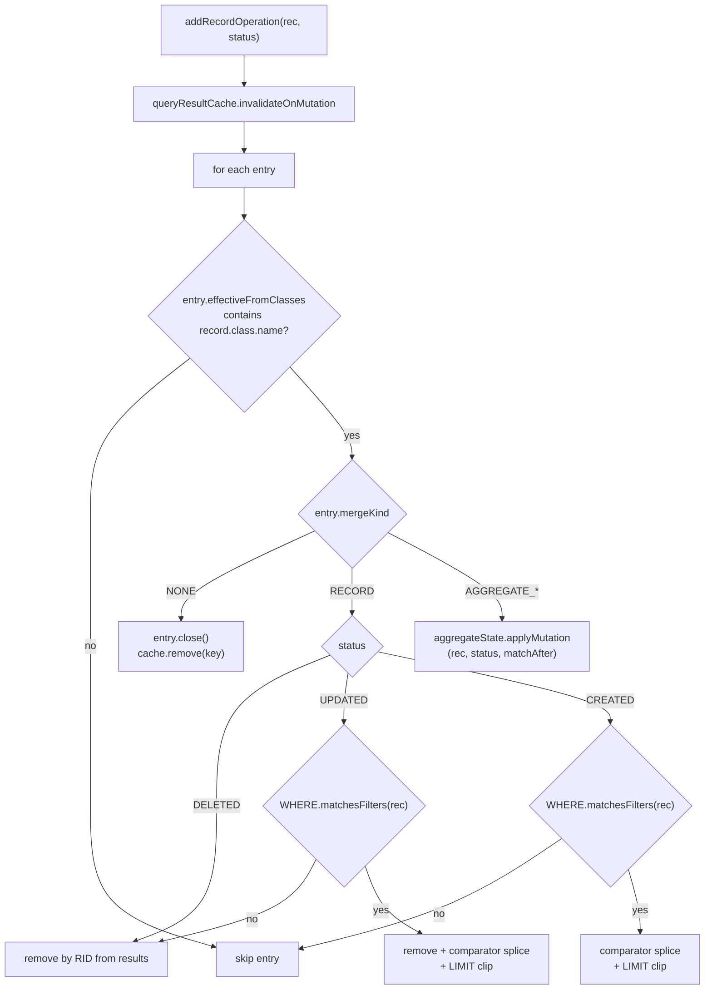

# Track 4: Dirty-state merge — K1 record + K1 aggregate + K0 fallback

## Purpose / Big Picture
After this track, a transaction that mixes reads and writes still benefits from the cache: simple-shape SELECTs are kept in sync via per-record splicing, single-aggregate SELECTs (COUNT/SUM/AVG/MIN/MAX) are kept in sync via incremental scalar update, and complex-shape queries fall back to a conservative wipe.

Hook `addRecordOperation()` to call `invalidateOnMutation`. Implement `SharpMergePredicate.classify(SQLStatement) → MergeKind` returning a discriminator (`RECORD | AGGREGATE_COUNT | AGGREGATE_SUM | AGGREGATE_AVG | AGGREGATE_MIN | AGGREGATE_MAX | NONE`), K1 sharp-merge for the record-returning case (UPDATED by-RID replace, DELETED by-RID remove, CREATED via `WHERE.matchesFilters` + `ORDER BY` splice + `LIMIT` re-clip), K1 sharp-merge for the five decomposable aggregates (incremental scalar update via `AggregateState`), and K0 wipe fallback for non-decomposable AST. Capture the AST metadata at entry creation in Track 2's path — minor revisit.

## Progress
- [ ] Review + decomposition
- [ ] Step implementation
- [ ] Track-level code review
- [ ] Track completion

## Surprises & Discoveries

## Decision Log

## Outcomes & Retrospective

## Context and Orientation

The dirty-tracking hook is `FrontendTransactionImpl.addRecordOperation(record, status)` (line 510). It's called from every write path: `deleteRecord` (line 481), record save (via `executeReadRecord` then dirty-flag propagation), DML executors. Adding a single line `if (queryResultCache != null) queryResultCache.invalidateOnMutation(record, status);` covers all paths.

`QueryResultCache.invalidateOnMutation(RecordAbstract, byte status)` iterates entries. For each entry: check if `entry.effectiveFromClasses` contains the record's class name (O(1) hash-set contains; the closure was precomputed at construction per D11). If no match, skip. If match, dispatch on `entry.mergeKind`:
- `RECORD` → K1 record sharp-merge (per-status walk over `entry.results`).
- `AGGREGATE_*` → K1 aggregate sharp-merge (delegate to `entry.aggregateState.applyMutation(record, status, matchAfter)`).
- `NONE` → K0 wipe (`entry.close()` + map.remove(key)).

The mergeKind is computed once at entry creation via `SharpMergePredicate.classify(stmt)` and snapshotted.

K1 record:
- **DELETED**: remove from `entry.results` by RID.
- **UPDATED**: if record no longer matches `entry.whereClause`, remove by RID. Otherwise remove by RID and re-splice via comparator, then re-clip to `limit`. Unconditional re-splice — no rank-change heuristic — keeps logic simple at O(limit) cost and avoids the bug where in-place replace leaves a stale rank.
- **CREATED**: if RID already in `entry.results` (defensive against duplicate signals from a re-create within the same tx), treat as UPDATED. Otherwise evaluate `entry.whereClause.matchesFilters(record, ctx)`; if matches, splice via comparator (or append if no `orderBy`); re-clip to `limit`.

K1 aggregate (full handling in `## Context and Orientation`'s "K1 aggregate sharp-merge" sub-section above):
- COUNT: `match_before → match_after` transitions adjust the count by ±1 or no-op.
- SUM/AVG: same transition matrix, scalar delta via `contributingValues.get(rid)`.
- MIN/MAX: same matrix; O(1) most cases; O(n) recompute when current extremum element leaves.

K0 wipe: `entry.close()` + remove from map. The view that already holds a reference continues operating over its (now frozen) list / aggregate.

`SharpMergePredicate.classify(SQLStatement) → MergeKind`:
- `NONE` for `SQLMatchStatement`.
- For `SQLSelectStatement`, all shapes share the gates: no `groupBy`, no `unwind`, no `letClause`, no `skip`, no subquery in `target`/`whereClause`, no LET references in WHERE.
- `RECORD` if projection is `*` or all-plain-property and `orderBy` is null-or-all-plain-property.
- `AGGREGATE_COUNT` if single projection is `COUNT(*)`, no HAVING, no ORDER BY restrictions (single scalar — order doesn't apply).
- `AGGREGATE_{SUM|AVG|MIN|MAX}` if single projection is the matching function over a plain property (not an expression), no HAVING.
- `NONE` otherwise.

Helper: `SQLOrderBy.toComparator(CommandContext)` — build a `Comparator<Result>` from the order-by clause. The existing `OrderByStep` does sort logic; we extract or mirror its comparison code. For sharp-merge, the order-by columns are all property references (filtered by `isSharpMergeable`), so comparator is straightforward.

Polymorphism: `effectiveFromClasses` drives the gate (per D11). Two-step computation: raw FROM names extracted from the AST per the shape rules below, then expanded into the subclass closure via `SchemaClass.getAllSubclasses()`. Per-shape raw extraction:
- **`RECORD` and `AGGREGATE_*` (simple SELECT)**: class names extracted from the top-level statement's `SQLFromClause.getItem()` (singular `SQLFromItem`). Plain `FROM Class` shape → `SQLFromItem.getIdentifier()` yields the one class name; rid-list shape (`FROM [#cls:0, #cls:1]`) → resolve cluster-owning classes from `SQLFromItem.getRids()`; FROM-subquery shape → recurse into the nested SELECT (covered by the `NONE` bullet below).
- **`SQLMatchStatement` (either `MATCH_TUPLE` or `NONE`)**: union of `class:` annotations across every pattern node — `MATCH {as:u, class:User}.out('memberOf'){as:g, class:Group} RETURN u` → `{User, Group}`. Scopes invalidation to mutations on classes the pattern actually references. Extraction is identical regardless of `classify` result.
- **`NONE` with subquery in `WHERE` or `target`**: recursive walk collects raw class names from every nested `SQLSelectStatement`. Without this, `SELECT FROM A WHERE id IN (SELECT id FROM B)` would survive mutations on B — correctness bug.
- **Fallback**: AST shape that defeats extraction (e.g., `FROM ($subqueryExpression)`) → `effectiveFromClasses = null`, treated by the gate as "matches everything", wiped on every mutation.

Polymorphism check on a dirty record: if `entry.effectiveFromClasses == null`, wipe unconditionally. Otherwise the gate first requires the record to be an `Entity` with a schema class — non-`Entity` records (raw byte records, blobs, any `RecordAbstract` subclass that doesn't implement `Entity`) and entities with `getSchemaClass() == null` skip the entry entirely (they cannot bind into a `SELECT FROM Class` result, so no cache state to invalidate). The full gate is `record instanceof Entity entity && entity.getSchemaClass() != null && entry.effectiveFromClasses.contains(entity.getSchemaClass().getName())` — a single O(1) hash-set lookup, since the closure has already absorbed the subclass walk at construction time. `Entity.getSchemaClass()` is declared on `Entity` (`Entity.java:289`) and implemented by `EntityImpl` / `EdgeEntityImpl`. The closure-construction call to `SchemaClass.isSubClassOf(String)` / `getAllSubclasses()` lives on the `SchemaClass` interface (`SchemaClass.java:135, 150`), delegated through `SchemaClassProxy`; concrete impl `SchemaClassImpl`. I8 guarantees the closure is stable for the entry's lifetime.

Concrete deliverables:
- `QueryResultCache.invalidateOnMutation(RecordAbstract, byte)` implementation with discriminator dispatch.
- `CachedEntry` field changes: `mergeKind: MergeKind` enum (replaces the prior `sharpMergeable: boolean`); `effectiveFromClasses` (subclass closure per D11 — replaces raw `fromClasses`), `whereClause`, `orderBy`, `limit` for record path; `aggregateState: AggregateState` for aggregate path. Populated at construction (revisits Track 2's entry-construction site).
- `SharpMergePredicate.classify(SQLStatement) → MergeKind` static helper.
- `OrderByComparator` extraction / utility for building the comparator.
- `AggregateState` class with five aggregate-flavor handlers + `observe(Result r)` tap callback (invoked by `AggregateCacheTapStep` for each record before forwarding to `AggregateProjectionCalculationStep`; see Plan-of-Work step 3 for the splice mechanism and failure fallback).
- Sharp-merge tests: per-mutation-type for both record and aggregate paths, polymorphism, LIMIT re-clip, WHERE-no-longer-matches drop, MIN/MAX recompute branch, aggregate transition matrix.
- K0 fallback tests: GROUP BY query mixed with mutation → entry wiped; expression-aggregate (`SUM(age+bonus)`) → K0.

## Plan of Work

1. Capture metadata. In `DatabaseSessionEmbedded.query()` miss path (where Track 2 creates the `CachedEntry`), classify the statement via `SharpMergePredicate.classify(stmt) → MergeKind` and:
   - For `RECORD`: extract raw `fromClasses` (resolve `SQLSelectStatement.target.getItem().getIdentifier()` for plain `FROM Class`, or walk `SQLFromItem.getRids()` for the rid-list shape), then **expand to subclass closure** via `SchemaClass.getAllSubclasses()` for each name → `effectiveFromClasses: Set<String>` (per D11). Also extract `whereClause`, `orderBy`, `limit` from the AST. Pass into the `CachedEntry` constructor.
   - For `AGGREGATE_*`: extract raw `fromClasses` and expand to `effectiveFromClasses` the same way, plus `whereClause`, the aggregated property name (from the single projection item), and the aggregate kind. Pass into the constructor; the constructor allocates an `AggregateState` initialized from the result set during first execution.
   - For `NONE`: regular cache entry with `mergeKind=NONE` — handled as K0 wipe target on any matching mutation.

2. Implement `SharpMergePredicate.classify(SQLStatement) → MergeKind`. AST inspection only — no execution. Returns `NONE` for `SQLMatchStatement`. For `SQLSelectStatement` checks the shared gates (no `groupBy`/`unwind`/`letClause`/`skip`, no subquery in `whereClause` or `target`) plus shape-specific gates:
   - `RECORD` if projection is `*` or all-plain-property and `orderBy` is null-or-all-plain-property.
   - `AGGREGATE_COUNT` if single projection is `COUNT(*)` (no `HAVING`).
   - `AGGREGATE_{SUM|AVG|MIN|MAX}` if single projection is the matching function over a plain property (not an expression; no `HAVING`).
   - Else `NONE`.
   AST walk recipe for the aggregate shape: `projection.items` size 1; the single item's `expression` resolves to a `SQLBaseExpression` carrying a `SQLFunctionCall`; the call's `getName().getValue()` (returns `SQLIdentifier`'s string) matched case-insensitively against `count`/`sum`/`avg`/`min`/`max`; `getParams()` must be either the `*` form (COUNT only) or a single plain-property `SQLExpression` (no arithmetic, no nested function, no field access on a sub-expression). Verified primitive classes: `SQLFunctionCount.NAME="count"`, `SQLFunctionSum.NAME="sum"`, `SQLFunctionAverage.NAME="avg"`, `SQLFunctionMin.NAME="min"`, `SQLFunctionMax.NAME="max"` — registered names match the AST tokens we compare against. Tests cover each branch and the boundary cases.

3. Implement `AggregateState` class + `AggregateCacheTapStep` plan-rewrite. Constructor of `AggregateState` takes the aggregate kind and the property name (null for COUNT). Fields: `currentScalar: Number`, `count: long` (AVG), `contributingRids: Set<RID>`, `contributingValues: Map<RID, Number>` (omitted for COUNT), and for MIN/MAX an additional `extremumRid: @Nullable RID`. Populated from the **inner record stream**, not from the user-visible `ResultSet`: the collapsed `ResultSet` carries only the final scalar and has no per-RID material.

   **Side-tap step.** New file `core/src/main/java/com/jetbrains/youtrackdb/internal/core/tx/AggregateCacheTapStep.java` — extends `AbstractExecutionStep`, holds an `AggregateState` reference, overrides `internalStart(CommandContext ctx) → ExecutionStream`. Body: obtain `upstream = getPrev().start(ctx)`; return a wrapping `ExecutionStream` whose `hasNext` / `close` delegate to `upstream` and whose `next(ctx)` does `var r = upstream.next(ctx); aggregateState.observe(r); return r;`. `AggregateState.observe(Result r)` reads `r.getRecord().getIdentity()` for the RID and applies the property extractor (or no-op for COUNT) before updating `currentScalar` / `count` / `extremumRid` incrementally.

   **Splice site.** In `DatabaseSessionEmbedded.query()` miss path, after `statement.execute(...)` returns the `LocalResultSet`, before the consumer's first `next()`: if `classify(stmt) ∈ AGGREGATE_*`, walk the constructed `InternalExecutionPlan.steps`, locate the `AggregateProjectionCalculationStep` instance (one and only one, by classify's gate — multi-aggregate / GROUP BY shapes fall to NONE), and rewire its `prev` field. The original upstream becomes `tapStep.prev`; `aggregateStep.prev = tapStep`. Use `Field.setAccessible(true)` on `AbstractExecutionStep.prev` if the field is private (read the existing field declaration before the implementation step picks the access route).

   **Failure fallback.** If the plan walk does not find exactly one `AggregateProjectionCalculationStep` (planner emitted a different shape than classify predicted — defensive against future planner changes), the cache code logs a `WARN` ("expected single aggregate step for cache splice; got <n>") and downgrades the entry to `mergeKind=NONE` (entry stays cacheable for replay but loses K1 sharp-merge — first mutation wipes it). No exception thrown.

   **Population timing.** `AggregateProjectionCalculationStep.executeAggregation` is blocking (`AggregateProjectionCalculationStep.java:121-137`): it consumes the entire upstream stream before producing any output. When the user calls `view.next()` on the aggregate result, the aggregate step pulls all records from the tap, the tap observes each, and `AggregateState` is fully populated by the time the user sees the scalar `Result`. No separate "drain" call needed on `AggregateState`.

   Method `applyMutation(RecordAbstract, byte status, boolean matchAfter)` dispatches on kind × transition per the table in `## Context and Orientation`; MIN/MAX uses `rid.equals(extremumRid)` to decide whether the mutation might dislodge the cached extremum. Method `toResult()` returns the cached `Result` view (a single-row `ResultInternal` with the aggregate scalar; for AVG computes `scalar / count` at read time).

4. Implement `QueryResultCache.invalidateOnMutation(RecordAbstract record, byte status)`. Iterate a **snapshot** of entries (`new ArrayList<>(entries.values())`) — required because (a) iteration would otherwise mutate accessOrder LinkedHashMap structure on each touch, and (b) K0 dispatch calls `cache.remove(key)` which would otherwise CME the iterator. For each entry: compute polymorphism check via the gate `record instanceof Entity entity && entity.getSchemaClass() != null && entry.effectiveFromClasses.contains(entity.getSchemaClass().getName())` (per D11 — single O(1) hash-set lookup; non-`Entity` records and entities with `getSchemaClass() == null` short-circuit to "skip entry"). If `effectiveFromClasses == null`, unconditional wipe. Otherwise, if no match, skip. Dispatch on `entry.mergeKind`:
   - `RECORD`: per-status walk over `entry.results` (DELETED remove, UPDATED re-evaluate, CREATED splice via comparator + LIMIT clip). **After any mutation to `entry.results`, increment `entry.version` (I7)** so live views fail fast on their next `next()` call.
   - `AGGREGATE_*`: compute `matchAfter = entry.whereClause==null || entry.whereClause.matchesFilters(record, ctx)`, then `entry.aggregateState.applyMutation(record, status, matchAfter)`. Do NOT bump `entry.version` — aggregate views return `aggregateState.toResult()` on every call with no positional invariant to invalidate.
   - `NONE`: `entry.close()` + remove from map. Do NOT bump `entry.version` — the entry is dropped from the cache; any live view continues over its frozen list (which K0 leaves untouched) and naturally exhausts when the position outruns the list (`NoSuchElementException`).

5. Build `OrderByComparator`. Walk `SQLOrderBy.items`, each item is a property reference (asc/desc); build a `Comparator<Result>` chaining property comparisons, respecting nulls-first/last (match existing `OrderByStep` semantics).

6. Hook `invalidateOnMutation` into `FrontendTransactionImpl.addRecordOperation`. One line, null-guarded for disabled cache. The hook fires after the operation is recorded (so `record.isDirty()` etc. reflect post-write state).

6b. Wire view fail-fast (I7). Extend `CachedResultSetView` (built in Track 2) with `expectedEntryVersion: long` — captured from `entry.version` in the constructor. In `next()`, check `if (entry.version != expectedEntryVersion) throw new IllegalStateException("Cache view invalidated by in-tx mutation; re-issue query()")` BEFORE reading `entry.results`. `hasNext()` may either propagate the same check or just delegate to position bounds — chosen path: check in `next()` only (allows consumers to detect end-of-iteration cleanly via `hasNext()==false` after a wipe). The version is bumped only on K1 RECORD and K1 MATCH_TUPLE branches; K1 AGGREGATE and K0 paths leave it unchanged.

7. Tests. **K1 record paths:** (a) `SELECT FROM User WHERE active=true ORDER BY name LIMIT 10`, insert user → entry re-clipped to 10; (b) update active=false → removed; (c) delete → removed; (d) polymorphism `SELECT FROM Person`, insert Employee → spliced. **K1 aggregate paths:** (e) `SELECT COUNT(*) FROM User WHERE active=true` + matrix of CREATED/UPDATED-(toMatch|fromMatch|stay)/DELETED; (f) `SELECT SUM(age) FROM User WHERE active=true` + same matrix, verify scalar delta; (g) `SELECT AVG(age) ...` + same; (h) `SELECT MIN(age) ...` triggers O(n) recompute when min element is deleted/transitions/becomes non-min; (i) `SELECT MAX(age) ...` same; (j) MIN/MAX where the mutation does NOT touch extremum — O(1) verified. **K0 fallbacks:** (k) `SELECT FROM User GROUP BY country`, any mutation → wiped; (l) `SELECT SUM(age + bonus) FROM User` → wiped (expression in arg); (m) `SELECT FROM User WHERE id IN (SELECT id FROM Active)` → wiped; (n) `SELECT FROM User SKIP 10 LIMIT 10` → wiped. **Edges:** (o) view holding entry that gets **K0 wiped mid-iteration** — view continues over frozen list (entry.version not bumped); (p) cascading mutations on the same entry stay consistent; (q) aggregate cache survives non-matching mutations (mutation on a class not in `effectiveFromClasses` → entry untouched); **(r) view holding entry that gets K1 RECORD merged mid-iteration (I7)** — open `view.next()` once (returns first result), trigger K1 merge via `tx.save(matchingRecord)`, call `view.next()` again → assert `IllegalStateException("Cache view invalidated by in-tx mutation; re-issue query()")`; **(s) K1 AGGREGATE view stays valid across mutations** — open a view of `SELECT COUNT(*) …`, get result, mutate a matching record, call `view.next()` again → does NOT throw, returns the merged aggregate scalar (aggregate views re-read `aggregateState.toResult()` on each call, no positional invariant); **(t) view fails fast only on K1 of THIS entry** — open view of entry A; mutate a record that triggers K1 merge on entry B (different `effectiveFromClasses`); call `view.next()` on A → does NOT throw (only entry B's version was bumped).

## Concrete Steps

## Episodes

## Validation and Acceptance

- Record sharp-merge correctness: for the simple SELECT shape, the cached results after one or more in-tx mutations match what a fresh re-execution against the current state would return (for every order, every WHERE branch, every LIMIT).
- Aggregate sharp-merge correctness: for `COUNT(*)/SUM(prop)/AVG(prop)/MIN(prop)/MAX(prop)` queries, the cached scalar after one or more in-tx mutations matches what a fresh re-execution would return. Transition matrix covered for every (CREATED|UPDATED|DELETED × matchBefore|matchAfter) combination.
- MIN/MAX O(n) recompute fires only when the extremum element is the one being moved/deleted; tests verify both the O(1) path (mutation away from extremum) and the O(n) path (mutation of the extremum element).
- K0 fallback: GROUP BY, HAVING, expression-aggregates, MEDIAN/MODE/PERCENTILE, COUNT(DISTINCT), LET, SKIP, expression-ORDER BY entries are all wiped on the first matching mutation.
- Polymorphism: `SELECT FROM SuperClass` (both record-returning and aggregate variants) sees mutations on `SubClass` records.
- LIMIT integrity (record path): the cached slice never exceeds the original LIMIT.
- Invariant I4 — post-merge entry observes same WHERE / ORDER BY / LIMIT / aggregate function — verified for at least the LIMIT and ORDER BY axes (record path) and the aggregate scalar correctness (aggregate path) per the tests above.

## Idempotence and Recovery

## Artifacts and Notes

## Interfaces and Dependencies

**In scope:**
- `core/src/main/java/com/jetbrains/youtrackdb/internal/core/tx/SharpMergePredicate.java` (NEW) — AST inspection, returns `MergeKind`.
- `core/src/main/java/com/jetbrains/youtrackdb/internal/core/tx/MergeKind.java` (NEW) — enum with seven values: `RECORD`, `AGGREGATE_COUNT`, `AGGREGATE_SUM`, `AGGREGATE_AVG`, `AGGREGATE_MIN`, `AGGREGATE_MAX`, `NONE`. Track 8 extends this enum with an eighth value `MATCH_TUPLE` for MATCH per-tuple sharp-merge.
- `core/src/main/java/com/jetbrains/youtrackdb/internal/core/tx/OrderByComparator.java` (NEW) — comparator builder, or extracted helper.
- `core/src/main/java/com/jetbrains/youtrackdb/internal/core/tx/AggregateState.java` (NEW) — `AggregateState` class with five flavor handlers + `observe(Result)` (called from `AggregateCacheTapStep` on each record passing through) + `applyMutation` + `toResult`.
- `core/src/main/java/com/jetbrains/youtrackdb/internal/core/tx/AggregateCacheTapStep.java` (NEW) — `AbstractExecutionStep` subclass; rewires the aggregate query's plan to tee each record into `AggregateState.observe(...)` before forwarding to `AggregateProjectionCalculationStep`.
- `core/src/main/java/com/jetbrains/youtrackdb/internal/core/tx/QueryResultCache.java` — `invalidateOnMutation` body with mergeKind dispatch.
- `core/src/main/java/com/jetbrains/youtrackdb/internal/core/tx/CachedEntry.java` — additional metadata fields (`mergeKind: MergeKind`, `aggregateState: @Nullable AggregateState`), constructor takes them.
- `core/src/main/java/com/jetbrains/youtrackdb/internal/core/tx/FrontendTransactionImpl.java` — `addRecordOperation` hook (one line).
- `core/src/main/java/com/jetbrains/youtrackdb/internal/core/db/DatabaseSessionEmbedded.java` — entry-construction site classifies via `SharpMergePredicate.classify(stmt)` and populates `AggregateState` for aggregate-kinds.
- Tests.

**Out of scope:**
- DML statement-level invalidation (e.g., `UPDATE Class SET ...`) — Track 5 (`invalidateAll`).
- Memory bound enforcement at per-entry level (`maxRecordsPerEntry`) — Track 5.
- Non-determinism gate — Track 5.

**Inter-track dependencies:**
- Depends on Tracks 1, 2 (cache and entry exist), Track 3 (entry close lifecycle — K0 path calls `entry.close()` whose `stream.close(ctx)` body is filled in Track 3).
- Track 5 builds on this — its `invalidateAll` and `NOCACHE` gating run in sequence after sharp-merge is in place.

**Library / function signatures introduced:**
- `MergeKind SharpMergePredicate.classify(SQLStatement)` returning `RECORD | AGGREGATE_COUNT | AGGREGATE_SUM | AGGREGATE_AVG | AGGREGATE_MIN | AGGREGATE_MAX | NONE`.
- `Comparator<Result> OrderByComparator.from(SQLOrderBy, CommandContext)`.
- `void QueryResultCache.invalidateOnMutation(RecordAbstract record, byte status)`.
- `AggregateState(MergeKind kind, String propertyName)` constructor + `observe(Result r)` (tap callback — extracts RID and property value, updates `contributingRids` / `contributingValues` / `currentScalar` / `count` / `extremumRid` incrementally) + `applyMutation(RecordAbstract, byte status, boolean matchAfter)` + `toResult() → Result`.
- `AggregateCacheTapStep(AbstractExecutionStep upstream, AggregateState state, CommandContext ctx)` constructor; `internalStart(ctx) → ExecutionStream` wraps `upstream.start(ctx)` with a tee that calls `state.observe(result)` on each pulled `Result`.

Diagram: invalidation dispatch — three branches by `entry.mergeKind` (RECORD splices, AGGREGATE_* delegates to `AggregateState`, NONE wipes).
