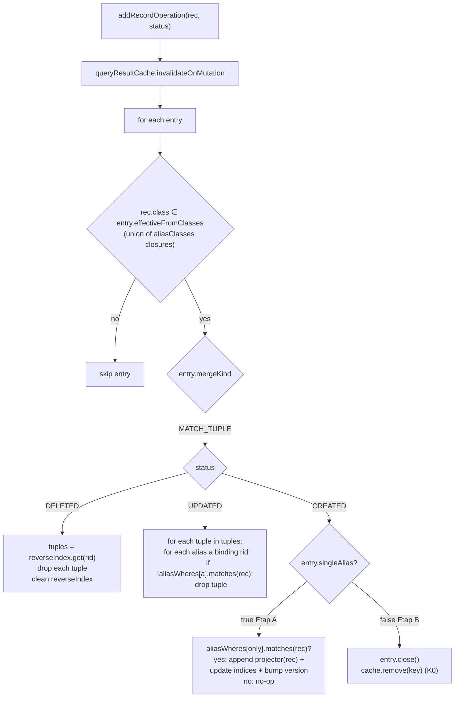

# Track 8: MATCH per-tuple merge — `MergeKind.MATCH_TUPLE`

## Purpose / Big Picture
After this track, MATCH statements within a transaction that mixes reads and writes survive `DELETED` and `UPDATED` mutations on classes in the pattern instead of being wiped on first mutation. **Single-alias MATCH** (`MATCH {as:u, class:User WHERE …} RETURN …` — one pattern node, no edge traversal) also survives `CREATED`, since the merge collapses to "WHERE-test the new record + append a single-binding tuple." Hub's graph-traversal MATCH queries — repeatedly issued within one tx — keep most of their cache hits across save/delete operations.

R-A extension: add `MATCH_TUPLE` to the `MergeKind` enum. `SharpMergePredicate.classify(SQLMatchStatement)` returns `MATCH_TUPLE` when every pattern node carries a `class:` annotation, no LET / UNWIND in scope, and no pattern-node WHERE references cross-alias state. Per-tuple `Set<RID>` tracking + reverse index enable targeted invalidation. CREATED on **multi-alias** MATCH still wipes the entry (incremental pattern-walker on a single record across edge traversals is v2 territory — Etap B).

## Progress
- [ ] Review + decomposition
- [ ] Step implementation
- [ ] Track-level code review
- [ ] Track completion

## Surprises & Discoveries

## Decision Log

## Outcomes & Retrospective

## Context and Orientation

`SharpMergePredicate.classify(SQLMatchStatement)` currently returns `NONE` (Track 4). The K0 wipe path uses `entry.effectiveFromClasses` for the polymorphism gate (Track 4 polymorphism extraction extended in iteration 3 to walk pattern nodes for MATCH; D11 added the subclass-closure expansion). This track replaces NONE for MATCH with a new `MATCH_TUPLE` discriminator and a new sharp-merge branch.

`SQLMatchStatement` AST shape (verified in iter-3 consistency review):
- `matchExpressions: List<SQLMatchExpression>` — each expression has an origin pattern node and a chain of subsequent `items`.
- `SQLMatchExpression.origin: SQLMatchFilter` — pattern node carrying `alias`, `className`, `where`, etc.
- `SQLMatchExpression.items: List<SQLMatchPathItem>` — each path item has `filter: SQLMatchFilter`.
- `SQLMatchFilter.getClassName(CommandContext)` — returns the class name attached to that pattern node.
- `SQLMatchFilter.getFilter()` (or similar) — returns the pattern node's WHERE clause.

The cache entry for MATCH_TUPLE carries:

- `results: List<Result>` — cached tuples in execution order.
- `contributingRids: Map<Integer, Set<RID>>` — per tuple-index, the set of RIDs across all alias bindings in that tuple. Populated during initial execution.
- `reverseIndex: Map<RID, Set<Integer>>` — inverted: for each RID, the set of tuple-indices that reference it.
- `aliasClasses: Map<String, Set<String>>` — per alias, the set of class names (and subclasses via `SchemaClass.isSubClassOf`). Used to figure out which alias a mutated record could bind to.
- `aliasWheres: Map<String, SQLWhereClause>` — per alias, the WHERE clause from the pattern node.

Polymorphism gate: `effectiveFromClasses` = union of all `aliasClasses` values (each `aliasClasses[a]` is already a subclass-closure per step 3 below; spec in design.md § Cache invalidation → effectiveFromClasses scope). A mutation on a class outside this set skips the entry. A mutation on a class inside this set fires the per-tuple branch below.

Per-mutation handling for a mutated record `rec` with RID `rid` and status `s`:

- **DELETED** (`s == RecordOperation.DELETED`):
  - Look up `tuples = reverseIndex.get(rid)` (may be empty).
  - For each tuple-index `i` in `tuples`: remove `results[i]`; for every other RID `r` in `contributingRids[i]`, remove `i` from `reverseIndex[r]`; clear `contributingRids[i]`.
  - Remove `rid` from `reverseIndex`.
  - All bookkeeping bounded by entry size.

- **UPDATED** (`s == RecordOperation.UPDATED`):
  - Look up `tuples = reverseIndex.get(rid)` (may be empty).
  - For each tuple-index `i` in `tuples`:
    - Find every alias `a` in `aliasClasses` where `rec.getSchemaClass().isSubClassOf(name)` for some `name in aliasClasses[a]`. Multi-alias-same-class patterns may yield multiple `a` values.
    - For each `a`: re-evaluate `aliasWheres[a].matchesFilters(rec, ctx)`. If the WHERE fails for any alias `a` that binds `rid` in this tuple, drop the tuple (same bookkeeping as DELETED).
  - If no alias binds the record, the entry must be untouched — but this shouldn't happen because the polymorphism gate already verified the record's class is in some alias's set.

- **CREATED** (`s == RecordOperation.CREATED`):
  - **Etap A — single-alias pattern** (`entry.singleAlias == true`, captured at construction; see "Single-alias detection" below): evaluate `aliasWheres[onlyAlias].matchesFilters(rec, ctx)`. If false, no-op (record doesn't qualify; entry untouched). If true: synthesize a single-binding `Result` matching the original RETURN-clause shape via `entry.returnProjector.apply(rec, ctx)` (captured at construction; see step 3), append it to `entry.results`, allocate a new tuple-index `i = results.size() - 1`, set `contributingRids[i] = {rec.rid}` and `reverseIndex[rec.rid] = (reverseIndex.getOrDefault(rec.rid, new HashSet<>())).add(i)`, bump `entry.version` (I7 — live views fail-fast on their next `next()` call). Cost: O(1) WHERE-eval + O(1) bookkeeping. Same complexity profile as K1 RECORD CREATED.
  - **Etap B — multi-alias pattern** (`entry.singleAlias == false`): K0 wipe of the entry. Discovering new tuples that pass through `rec` as an entry-node of a multi-node pattern requires running parts of the pattern walker on a single record across edge traversals — partial query re-execution. v2 candidate (separate ADR; needs constrained-pattern execution + edge-CREATED dispatch infrastructure not present in v1). The entry continues to use K0 here, identical to the v1 baseline before this Etap-A extension.

**Single-alias detection.** A `SQLMatchStatement` is single-alias when **exactly one** match-expression carries **zero** path items: `matchExpressions.size() == 1 && matchExpressions[0].items.isEmpty()`. Equivalent to a pattern with one labeled node, no edges. Cross-join MATCH (`MATCH {as:u, class:U}, {as:g, class:G} RETURN u, g` — multiple top-level match-expressions, semantically a Cartesian product) is NOT single-alias: it produces tuples bound across all expressions, and CREATED of a single record would require enumerating Cartesian products with existing matches in every other expression — same complexity class as Etap B. Cross-join falls into the multi-alias branch.

Classify rules for `SQLMatchStatement → MATCH_TUPLE`:
- Every pattern node (origin + every item's filter) returns a non-null `getClassName(ctx)`. A class-less pattern node defeats the polymorphism gate.
- No `LET` clause on the outer SELECT wrapping the MATCH (if any).
- No `UNWIND` in the outer SELECT.
- No pattern-node WHERE references cross-alias state. Detection: walk each `aliasWheres[a]`'s AST; if it contains `$current`, `$matched`, `$parent`, `$depth`, or `${someOtherAlias}.` references, return NONE.
- No pattern-node WHERE references non-deterministic functions (already covered by `NonDeterministicQueryDetector` at cache-lookup time, but classify can short-circuit).
- **No subquery (`SQLSelectStatement` nested) inside any pattern-node WHERE.** Symmetric with the K1 RECORD / K1 AGGREGATE gate ("no subquery in `target` or `whereClause`" — `implementation-plan.md` D5). Subqueries in pattern WHEREs would force `WHERE.matchesFilters` to re-execute the inner SELECT on every mutation eval — defeats the cost model of sharp-merge. Detection: walk each `aliasWheres[a]`'s AST for any `SQLSelectStatement` descendant (or `SQLFunctionCall` whose `getName()` resolves to a query-shape — defensive); if found, return NONE. Test: `MATCH {as:u, class:User WHERE id IN (SELECT id FROM Active)} RETURN u` → classify returns NONE; first matching mutation wipes the entry (K0).

Concrete deliverables:
- `MergeKind.MATCH_TUPLE` enum value (eighth discriminator).
- `SharpMergePredicate.classify(SQLMatchStatement)` implementation with the rules above, including the `singleAlias` flag computation.
- `CachedEntry` extensions for MATCH_TUPLE: `aliasClasses`, `aliasWheres`, `reverseIndex`, `contributingRids`, `singleAlias: boolean`, `returnProjector: @Nullable BiFunction<RecordAbstract, CommandContext, Result>` (non-null iff singleAlias). May share storage with `RECORD` entries' `results` list.
- During-population walker: iterate the result stream, for each tuple walk its alias bindings via the `Result.getProperty(alias)` API, collect RIDs into `contributingRids` and `reverseIndex`.
- `QueryResultCache.invalidateOnMutation` MATCH_TUPLE branch:
  - DELETED + UPDATED handlers (per-tuple drop via reverseIndex + WHERE re-eval).
  - **CREATED handler with Etap A**: `singleAlias ? matchesFilters + append + indices update + version bump : K0 wipe`.
- Tests across the matrix (DELETE/UPDATE × single-alias / multi-alias / self-loop / cross-class patterns + Etap A CREATED + Etap B CREATED-still-K0 + cross-join CREATED).

## Plan of Work

1. Add `MergeKind.MATCH_TUPLE` enum value. Update the `MergeKind` enum declaration in `MergeKind.java` (Track 4 deliverable). Update the dispatch switch in `QueryResultCache.invalidateOnMutation` to add a new branch (initially a no-op or delegate to existing K0 wipe; filled in step 5).

2. Implement `SharpMergePredicate.classify(SQLMatchStatement)`. AST inspection only — walk `matchExpressions[*].origin` and `matchExpressions[*].items[*].filter`, calling `getClassName(ctx)` on each filter. If any returns null, return NONE. Walk each pattern node's WHERE for cross-alias-state references (`$current`, `$matched`, `$parent`, `$depth`, any `$<alias>.field` reference where `<alias>` matches another pattern node's alias name); if found, return NONE. Otherwise return MATCH_TUPLE. **Single-alias flag**: in addition, compute `singleAlias = (matchExpressions.size() == 1 && matchExpressions[0].items.isEmpty())` — used by step 3 to capture on the entry. The flag is informational on the classify result; both single-alias and multi-alias share the `MATCH_TUPLE` discriminator and differ only in the CREATED branch of `invalidateOnMutation`.

3. Extract MATCH metadata during entry creation. In `DatabaseSessionEmbedded.query()` miss path (Track 2), when classify returns MATCH_TUPLE, build `aliasClasses` (per-alias class set including subclasses via `SchemaClass.getAllSubclasses()` — already exists or implementable in `SchemaClassImpl`) and `aliasWheres` (per-alias WHERE clause). Capture the `singleAlias: boolean` flag computed by classify (step 2). When `singleAlias == true`, additionally capture a `returnProjector: BiFunction<RecordAbstract, CommandContext, Result>` that mirrors the original RETURN clause's projection: for `RETURN u` it returns a one-property Result `{u: rec}`; for `RETURN u.name, u.age` it returns `{u.name: rec.field("name"), u.age: rec.field("age")}` — built by walking `SQLMatchStatement.returnItems` once at construction and binding each projection's expression evaluation to a single alias `u` ⟶ `rec`. The projector is invoked by the CREATED branch of the dispatch to build the synthetic single-binding Result. When `singleAlias == false`, the projector is null (not used; multi-alias CREATED falls to K0 wipe). Pass all of these into the `CachedEntry` constructor.

4. Populate `contributingRids` and `reverseIndex` during stream iteration. As `CachedResultSetView` pulls each `Result` from the live stream and appends to `results`, also walk the result's properties: for each alias in `aliasClasses.keySet()`, read the result's `Property(alias)` (the result of `RETURN u, g` is a tuple `Result` exposing each alias as a property). Collect the RIDs of the bound records into `contributingRids[currentTupleIndex]`; mirror to `reverseIndex`.

5. Implement `QueryResultCache.invalidateOnMutation` MATCH_TUPLE branch. Dispatch on status:
   - DELETED: per the spec in Context and Orientation — drop tuples in `reverseIndex.get(rid)`, update bookkeeping. Bump `entry.version`.
   - UPDATED: per the spec — find binding alias(es), re-evaluate `aliasWheres[a]`, drop tuple if any fails. Bump `entry.version` only if at least one tuple was dropped.
   - CREATED: branch on `entry.singleAlias`:
     - `true` (Etap A): per the CREATED spec in Context and Orientation — `aliasWheres[onlyAlias].matchesFilters(rec, ctx)` ? `entry.results.add(entry.returnProjector.apply(rec, ctx))` + update `contributingRids` + `reverseIndex` + bump `entry.version` : no-op (record doesn't qualify; entry untouched, version NOT bumped).
     - `false` (Etap B / multi-alias): delegate to existing K0 wipe path (`entry.close(); cache.remove(key)`). Version is irrelevant — the entry is dropped.

6. Tests across the dispatch matrix. Set up a MATCH pattern with multiple aliases:
   - (a) Single-alias `MATCH {as:u, class:User WHERE active=true} RETURN u`. Pre-populate 10 active users. Query (populates entry). DELETE one user → tuple removed, others stay. UPDATE one user to `active=false` → tuple removed, others stay. UPDATE one to `active=true` (no-op) → tuple stays.
   - (b) Two-alias `MATCH {as:u, class:User WHERE active=true}.out('memberOf'){as:g, class:Group WHERE name='admin'} RETURN u, g`. Pre-populate. DELETE a Group → tuples containing that group removed. UPDATE a User's `active` to false → tuples containing that user removed (regardless of which group). UPDATE a Group's `name` to 'guest' → tuples containing that group removed.
   - (c) Self-loop `MATCH {as:u, class:User}.out('reportsTo'){as:m, class:User} RETURN u, m`. Pre-populate. UPDATE a User: ensure both `u`-binding and `m`-binding tuples are re-evaluated.
   - (d) Multi-class polymorphism: `MATCH {as:p, class:Person WHERE active=true} RETURN p` where `Employee extends Person`. UPDATE an Employee's `active` to false → tuple removed (polymorphism gate accepts Employee as Person's subclass).
   - (e) Cross-alias-state pattern (`MATCH {as:u}.where("name = $matched.g.name").out('memberOf'){as:g, class:Group} RETURN u`) — classify returns NONE; mutations wipe.
   - (f) Pattern with class-less node (`MATCH {as:any}.out(){as:other, class:X} RETURN any, other`) — classify returns NONE.
   - **(g) Etap A — single-alias CREATED (WHERE pass)**: same shape as (a). After populating entry, `tx.save(new User(active=true))` → assert `entry.results.size()` grew by 1, the new tuple's binding has the new RID, `reverseIndex` covers it, and `entry.version` bumped. View opened before the CREATE throws `IllegalStateException` on next `next()` (I7).
   - **(h) Etap A — single-alias CREATED (WHERE fail)**: same shape as (a). `tx.save(new User(active=false))` → assert `entry.results.size()` unchanged, `reverseIndex` unchanged, **`entry.version` NOT bumped** (no observable change to the entry; views opened before the CREATE continue iterating without throwing).
   - **(i) Etap A — single-alias CREATED with polymorphism**: same shape as (d) (`RETURN p` over `Person`). `tx.save(new Employee(active=true))` → assert tuple appended (polymorphism gate via `effectiveFromClasses` admits Employee as Person subclass; Etap A's `aliasWheres[p].matchesFilters` evaluates on Employee correctly).
   - **(j) Etap B — multi-alias CREATED still K0**: shape from (b). `tx.save(new User(active=true))` → assert entry is wiped from `cache.entries.values()` (K0 wipe; deferred Etap B coverage). View opened before the CREATE continues over its frozen list (K0 does not bump version — same as v1 K0 wipe contract).
   - **(k) Cross-join (multi-expression) MATCH CREATED → K0**: `MATCH {as:u, class:User}, {as:g, class:Group} RETURN u, g` (two top-level match-expressions, no edges). Pre-populate. `tx.save(new User)` → entry wiped per multi-alias rule. Confirms cross-join classify path treats `matchExpressions.size() > 1` as multi-alias.

## Concrete Steps

## Episodes

## Validation and Acceptance

- MATCH_TUPLE merge correctness: for the simple MATCH shape, the cached tuples after one or more in-tx DELETE/UPDATE mutations match what a fresh re-execution against the current state would return for those tuples. New tuples that would emerge from CREATED records are not in the cache (correct — entry was wiped).
- Polymorphism: subclasses (e.g., `Employee extends Person`) trigger sharp-merge for pattern nodes that target the superclass.
- Multi-alias-same-class patterns (self-loops or User↔User edges): every relevant alias's WHERE is re-evaluated; a record losing one alias's WHERE drops the tuple even if it satisfies another.
- Classify rejections: patterns with class-less nodes, LET, UNWIND, or cross-alias-state WHEREs fall back to NONE; first matching mutation wipes the entry (existing K0 behavior).
- Memory overhead: per-tuple `Set<RID>` and `reverseIndex` add bounded bookkeeping; verify via JMH that MATCH entries' allocation footprint stays within ~10% of v1 baseline.
- Invariant I4 — post-merge entry observes same pattern WHERE / class constraint contract as fresh execution.

## Idempotence and Recovery

## Artifacts and Notes

## Interfaces and Dependencies

**In scope:**
- `core/src/main/java/com/jetbrains/youtrackdb/internal/core/tx/MergeKind.java` — add `MATCH_TUPLE`.
- `core/src/main/java/com/jetbrains/youtrackdb/internal/core/tx/SharpMergePredicate.java` — `classify(SQLMatchStatement)` body + cross-alias-state walker helper.
- `core/src/main/java/com/jetbrains/youtrackdb/internal/core/tx/CachedEntry.java` — MATCH_TUPLE-specific fields (`aliasClasses`, `aliasWheres`, `contributingRids`, `reverseIndex`).
- `core/src/main/java/com/jetbrains/youtrackdb/internal/core/tx/QueryResultCache.java` — `invalidateOnMutation` MATCH_TUPLE branch (DELETED + UPDATED handlers; CREATED → K0 wipe).
- `core/src/main/java/com/jetbrains/youtrackdb/internal/core/tx/CachedResultSetView.java` — incremental population of `contributingRids` / `reverseIndex` as tuples are pulled from the live stream.
- `core/src/main/java/com/jetbrains/youtrackdb/internal/core/db/DatabaseSessionEmbedded.java` — entry-construction site builds `aliasClasses` + `aliasWheres` from the parsed `SQLMatchStatement`.
- Tests under `core/src/test/java/com/jetbrains/youtrackdb/internal/core/tx/`.
- New JMH scenario in `core/src/jmh/.../QueryResultCacheBenchmark.java` (added in Track 6): `matchHit`, `matchDeleteMerge`, `matchUpdateMerge`, `matchCreateWipe`.

**Out of scope:**
- **MATCH CREATED Etap B** — multi-alias / cross-join / pattern-with-edges incremental tuple discovery. Requires constrained-pattern execution (synthesize `@rid = rec.rid` constraint on the binding alias, re-run scoped pattern walker) plus edge-CREATED dispatch (a new vertex with no edges yet won't appear in any multi-alias tuple until its edges are created, each going through their own `addRecordOperation`). Separate ADR / v2 candidate.
- LET in MATCH or surrounding SELECT — still K0.
- Cross-alias-state pattern WHEREs (`$matched.X`, `$current`) — still K0.
- Other graph-shape statements (`TRAVERSE`, gremlin-style `g.V()...`) — not in scope for YTDB-820.

**Inter-track dependencies:**
- Depends on Track 4 (uses `MergeKind` enum, `effectiveFromClasses` polymorphism gate per D11, `SchemaClass.isSubClassOf` / `getAllSubclasses` for the per-alias `aliasClasses` closure expansion, `WHERE.matchesFilters`, `invalidateOnMutation` dispatch infrastructure).
- Depends on Track 6 (Track 6's JMH baseline + this track's MATCH-specific JMH scenarios).

**Library / function signatures introduced:**
- `MergeKind.MATCH_TUPLE`.
- `MergeKind SharpMergePredicate.classify(SQLMatchStatement)` (plus an internal `boolean SharpMergePredicate.isSingleAlias(SQLMatchStatement)` helper exposing the Etap-A gate).
- `boolean SharpMergePredicate.referencesCrossAliasState(SQLWhereClause, Set<String> patternAliases)` helper.
- `BiFunction<RecordAbstract, CommandContext, Result> SharpMergePredicate.buildSingleAliasReturnProjector(SQLMatchStatement, String alias)` helper — invoked at entry construction when `singleAlias == true`; walks `SQLMatchStatement.returnItems` once to build a closure that maps `(rec, ctx)` to a single-binding `Result` matching the RETURN-clause shape.
- `CachedEntry` MATCH_TUPLE fields: `aliasClasses: Map<String, Set<String>>`, `aliasWheres: Map<String, SQLWhereClause>`, `contributingRids: Map<Integer, Set<RID>>`, `reverseIndex: Map<RID, Set<Integer>>`, `singleAlias: boolean`, `returnProjector: @Nullable BiFunction<RecordAbstract, CommandContext, Result>`.

Diagram: MATCH_TUPLE invalidation dispatch — DELETED removes tuples by reverse-index lookup; UPDATED re-evaluates per-alias WHEREs and drops tuples whose record no longer satisfies its binding; CREATED branches on `singleAlias`: Etap A appends a new single-binding tuple if the WHERE passes (O(1)), Etap B (multi-alias / cross-join / pattern-with-edges) wipes the entry (K0) — incremental multi-alias discovery deferred to v2.
