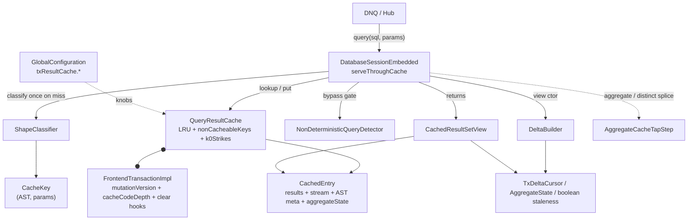

# Transaction-scoped query result cache — Architecture Decision Record

## Summary

YouTrackDB gains an opt-in per-transaction query result cache that memoises idempotent `Database.query()` results within a single transaction, gated behind `youtrackdb.query.txResultCache.enabled` and disabled by default. Without it, every `query()` re-executes against storage even when the same idempotent query ran moments earlier in the same transaction; Hub and YouTrack DNQ emit hundreds to thousands of duplicate-shape SELECT and MATCH queries per request, so the re-execution is a sustained per-request cost.

The cache lives on `FrontendTransactionImpl`, keyed by the parsed `SQLStatement` plus normalized parameters, and is wiped on every transaction-end path. Each `query()` returns a `CachedResultSetView` that merges the cached storage rows with a frozen snapshot of in-transaction mutations relevant to the query's class set, so a cached read returns exactly what a fresh uncached execution would return at that call moment. The implemented shapes are RECORD, the AGGREGATE_* family (COUNT/SUM/AVG/MIN/MAX), DISTINCT_VALUES, single-alias MATCH (folded onto RECORD), multi-alias MATCH (a class-scoped version gate), and K0_NONE (anything reproducible but not record-by-record reconcilable, cached under a mutation-version gate). The work touches no parser grammar, no planner, and no execution-step class except a local post-construction plan rewrite that splices a side-tap for the aggregate shapes.

## Goals

- Memoise idempotent SELECT and MATCH results within one transaction so duplicate-shape queries skip re-execution against storage.
- Stay transparent: with the flag on, every `query()` returns the same `Result` sequence a parallel uncached `query()` at the same moment would (Invariant 10). This is the hard correctness floor.
- Keep the feature opt-in and off by default, so a build that never sets the flag carries zero behavior change.
- Bound per-transaction memory with two knobs (`maxEntries`, `maxRecordsPerEntry`) and pin live views against eviction.
- Add no core-executor, planner, or grammar changes for v1.

A planning-time goal not pursued here: a pre-merge Hub-replay validation gate (D13) that would measure repeat-shape cacheability and view-output parity on an anonymized DNQ sample. It is a measurement step independent of the implementation and gates promotion of the deferred hardening candidates rather than this v1.

## Constraints

- Single-thread transaction model: every cache mutation path runs on the owning thread under the transaction's existing owner-thread assertions; only tx-end `clear()` is cross-thread (pool shutdown), inheriting the existing best-effort contract. No locking is added.
- Schema is immutable per transaction (enforced upstream): `effectiveFromClasses` and every AST-derived entry field are computed once at construction and never recomputed (Invariant 8).
- Memory is bounded per transaction by `maxEntries` (LRU, default 200) and `maxRecordsPerEntry` (default 10000); a live view pins its entry against eviction.

## Architecture Notes

### Component Map

- **`DatabaseSessionEmbedded`** (modified) — the integration site. Both `query()` overloads route through `serveThroughCache`, which gates on flag, re-entrancy depth, statement type, non-determinism, and shape; builds the view on a hit; and populates a fresh entry on a miss (with a separate eager-drive path for aggregate and DISTINCT_VALUES shapes). `invalidateCacheForBulkDml` sits on `executeInternal` for `TRUNCATE CLASS`.
- **`FrontendTransactionImpl`** (modified) — owns the lazy, flag-gated `queryResultCache`, the monotonic `mutationVersion` bumped in `addRecordOperation`, the `cacheCodeDepth` re-entrancy depth counter, and the `clear()` calls in `beginInternal` and the tx-end sink.
- **`QueryResultCache`** (new) — the per-transaction access-ordered `LinkedHashMap` LRU with `nonCacheableKeys`, the `k0Strikes` map, view-pin-aware removal (every map-removal path routes through `closeOrDefer`, deferring a pinned entry's close to the last pin release and parking it in `closePending`), and idempotent `clear()`.
- **`CachedEntry`** (new) — one cache slot: frozen `results`, paused `IdempotentExecutionStream`, AST-derived metadata (`effectiveFromClasses`, WHERE, ORDER BY, `returnProjector`, `populateMutationVersion`), an optional `aggregateState`, the cross-view delta-pair cache, and the view refcount.
- **`ShapeClassifier` / `NonDeterministicQueryDetector`** (new) — AST-only static analysis: classify into `CacheableShape`; bypass non-deterministic statements via a fail-open denylist plus a context-variable list plus the `noCache` hint.
- **`DeltaBuilder` + delta types** (new) — `buildForRecord` produces a `TxDeltaCursor`, `buildForAggregate` produces an `AggregateState` copy, `matchMultiStale` returns a boolean staleness verdict for the multi-alias MATCH gate.
- **`CachedResultSetView`** (new) — the consumer `ResultSet`: sorted-merge (RECORD / Etap-A MATCH), direct scalar (aggregate), distinct-value rows (DISTINCT_VALUES), or direct replay (K0_NONE / multi-alias MATCH).
- **`AggregateCacheTapStep`** (new) — an execution-plan step spliced upstream of the aggregation (or above the pre-distinct projection) to observe every contributing record before it collapses.

### Decision Records

The cache-package Javadoc cites the decision and invariant identifiers below. They are defined here so those citations resolve against this committed record.

**D1 — Cache value type is `List<Result>`, not `List<RecordAbstract>`.** Implemented as planned. A projection query produces a `Result` that wraps no record, so caching records would exclude every projection query; `Result` is the type that crosses the `ResultSet` boundary.

**D2 — Cache key is `(parsed SQLStatement, normalized params)` with an AST identity fast-path.** Implemented as planned. `CacheKey.equals` short-circuits on `statement == other.statement` (the same instance `YqlStatementCache` returns for identical text) before structural deep-equals. `SQLStatement.equals()` is structural, so the key is whitespace- and alias-invariant for free. The named-cache reference was corrected during planning from a placeholder to the real `YqlStatementCache`.

**D3 — Lookup gated on `SQLSelectStatement || SQLMatchStatement`; bulk-DML invalidates.** Implemented as planned. `TRUNCATE CLASS` is the only mid-tx-runnable bulk operation that invalidates (through `invalidateCacheForBulkDml` on both the command path and the script path); regular INSERT/UPDATE/DELETE flow through the mutation log and are picked up by the next query's delta build. Schema DDL is excluded under Invariant 8, guarded by a Java `assert` canary.

**D4 — Pause/resume via a shared `ExecutionStream` plus per-view position counters.** Implemented as planned. The `CachedEntry` holds the live stream; a view that outruns the cached list pulls one row, appends it, and returns it, so later views replay the full ordered result.

**D6 — Non-determinism via a fail-open denylist AST walk plus the `noCache` hint.** Implemented as planned. One name walker covers builtins and the reflective `math_*` family; the context-variable list covers per-row and per-MATCH bindings; `SQLSelectStatement.noCache` is the per-query opt-out. Completeness is enforced by `FunctionDeterminismEnumerationTest`, which walks all four `SQLFunctionFactory` implementations and fails the build on an unclassified function. The factory count was corrected during planning from three to four (`DynamicSQLElementFactory` had been omitted).

**D7 — Per-transaction memory bound: LRU at `maxEntries` plus per-entry `maxRecordsPerEntry`.** Implemented as planned, with one as-built refinement: for aggregate and DISTINCT_VALUES entries the per-entry cap bounds the `AggregateState` contributor collections rather than the single-scalar `results`, since high-cardinality COUNT(DISTINCT)/MIN/MAX is the real memory vector there. Overflow removes the entry and routes its key to `nonCacheableKeys`.

**D8 — MATCH Etap A as RECORD composition; multi-alias MATCH as a class-scoped version gate.** Modified during execution. Single-alias edge-free MATCH folds onto the RECORD path through a stored `returnProjector` applied at the view emit boundary (Etap A, as planned). Multi-alias MATCH ships as a class-scoped version gate, not the planned per-tuple reconciliation: it freezes the projected RETURN tuples and, at lookup, invalidates the whole entry when a post-populate mutation touches any class in `effectiveFromClasses` (the alias classes and traversal-edge classes, with subclass closures), else replays verbatim. The planned per-tuple model was structurally unbuildable for the dominant RETURN shape (see Key Discoveries). Full Etap B (incremental tuple discovery on CREATE, incremental edge-DELETE) remains deferred to a separate ADR; the class-scoped gate is a coarser v1 floor than the partial Etap B the original design assumed.

**D9 — Idempotent close via an `IdempotentExecutionStream` wrapper.** Implemented as planned. Both `CachedEntry.close()` and `QueryResultCache.clear()` can reach the same stream at tx end; the wrapper, threaded into both the entry's stream slot and the populating `LocalResultSet`'s slot, makes the underlying `close` fire exactly once.

**D11 — Pre-expand the read classes to their subclass closure at entry construction.** Implemented as planned, extended for MATCH. `CachedEntry.computeEffectiveFromClasses` builds the closure for a single SELECT FROM class; `CachedEntry.computeMatchEffectiveFromClasses` builds the union closure of every MATCH alias node class and traversal-edge class. The closure is stable for the entry's lifetime under Invariant 8 and is the O(1) class filter on every mutation.

**D18 — K0-version-fallback for NONE shapes.** Implemented as planned. A `K0_NONE` entry stamps `populateMutationVersion` at populate and serves a cached read only while the transaction's `mutationVersion` still equals it; a diverged version invalidates and re-executes. A per-key strike counter (`k0Strikes`, threshold default 3) routes a repeatedly-invalidated key to `nonCacheableKeys` to bound churn. The multi-alias MATCH gate reuses this same strike machinery through `invalidateMatchMulti`.

**D19 — SUM/AVG running total via `PropertyTypeInternal.increment`, matching storage.** Implemented as planned. `AggregateState` folds each value through the same `increment` call storage's SUM and AVG use, so cache replay matches fresh execution bit for bit across mixed-input promotion, Long overflow, and `2^53+1` precision loss. AVG additionally finalizes through the storage type-dispatched division (reproducing `SQLFunctionAverage.computeAverage`), since `increment` covers only the SUM half.

**D20 — `DISTINCT_VALUES` via per-value RID buckets; scalar `COUNT(DISTINCT prop)` stays `K0_NONE`.** Modified during execution. The original D20 targeted a cacheable scalar `COUNT(DISTINCT prop)` (AGGREGATE_COUNT_DISTINCT). This engine computes `count(distinct(prop))` as a plain row count, so a distinct-count replay would diverge from fresh execution; the scalar therefore routes to `K0_NONE`, where the version gate reproduces the engine's row count exactly. The per-value RID buckets instead back a new `DISTINCT_VALUES` shape — `SELECT distinct(prop)` / `SELECT DISTINCT prop` with a deterministic ORDER BY — whose view emits the bucket keys as rows. The distinct-count `AggregateState` machinery remains in the code, unreached in production, kept for a future engine with a native distinct count.

**D21 — Populate-version stamping eliminates miss-path double-application.** Implemented as planned. Each `RecordOperation` carries a `version: long` re-stamped on collapse; the delta builders consider only operations whose version exceeds the entry's `populateMutationVersion`, because every earlier mutation is already reflected in the cached output by the tx-aware executor. The dispatch table's `cached_at_build` column stays load-bearing for the CREATE+UPDATE collapse case.

**D22 — `SQLInputParameter` parsed-leaf audit before the AST key reads it.** Resolved on the no-edit branch. The base `SQLInputParameter` is never a returned parsed leaf; the parser always returns one of the two concrete subclasses, and both already carry field-based `equals`/`hashCode`. No parser-node edit was needed; a regression test forces a `YqlStatementCache` eviction and re-parse to prove the deep-equals path still hits.

**D-decisions deferred (not implemented in v1):** D13 (Hub-replay validation gate, a pre-merge measurement step), D14 (MIN/MAX sorted-value index for O(log n) extremum recompute), and the sub-statement caching family. These are recorded in § Non-Goals and are measurement-gated or separate-ADR candidates.

**Re-entrancy guard model (single guard as-built).** The cache code path is bracketed by one guard, new to the codebase: a transaction-level `cacheCodeDepth` counter on `FrontendTransactionImpl` brackets the whole lookup-and-build scope (and, per row during iteration, the lazy stream pull and delta merge through `CachedResultSetView.hasNext`). A `query()` issued from a UDF in a WHERE clause sees `cacheCodeDepth > 0` and bypasses the cache. The session releases the depth guard unconditionally in a finally after the synchronous scope; the view re-enters and exits it per row, so the guard is held only over the row-production windows and a `query()` issued by user code between two `next()` calls still uses the cache. The depth check sits ahead of `enterCacheCode()` in `serveThroughCache`, so a re-entrant `query()` rejects before `lookup` is reached and `lookup` never runs twice on the same thread; a lookup-level boolean considered during design (`inFlightLookup`) proved unreachable through every production path and was removed. An earlier framing of this guard as pre-existing infrastructure was wrong; it is new in this work.

### Invariants & Contracts

The cache-package Javadoc cites these invariant identifiers; they are defined here.

- **Invariant 1 (I1) — Cache cleared on every tx-end path.** The transaction-end clear sink calls `QueryResultCache.clear()`.
- **Invariant 2 (I2) — Cache mutation paths accessed only by the owning thread.** `lookup`, `put`, `invalidateAll`, `invalidateMatchMulti`, and begin-time `clear()` run under owner-thread-asserted call sites; tx-end `clear()` is the documented cross-thread exception.
- **Invariant 3 (I3) — Paused stream lives at most as long as its `CachedEntry`.** Eviction or transaction end closes the stream.
- **Invariant 4 (I4) — View output equals fresh execution composed with the tx-delta snapshot.** Holds per cacheable shape across CREATED/UPDATED/DELETED and the four pre/post-populate mutation patterns; for K0_NONE and multi-alias MATCH it holds through the version gate.
- **Invariant 5 (I5) — Cache only stores deterministic, idempotent statements.** Enforced by the detector plus the four-factory enumeration completeness test.
- **Invariant 6 (I6) — Tx-end `clear()` idempotent and safe under cross-thread invocation.** `clear()`, `CachedEntry.close()`, and `IdempotentExecutionStream.close()` are each idempotent.
- **Invariant 7 (I7) — View delta frozen post-construction.** The skip-set, inject-list, or replayed `AggregateState` is fixed at view construction; record-property mutations are still observed live, matching YouTrackDB reference semantics.
- **Invariant 8 (I8) — Schema immutable for the transaction's lifetime (enforced upstream).** Mid-tx schema DDL throws, so every AST-derived entry field is stable.
- **Invariant 9 (I9) — A mid-iteration view never loses rows to a cache removal.** `liveViewCount` pins a mid-iteration entry; every map-removal path (LRU eviction, K0_NONE / MATCH invalidate, `invalidateAll`, overflow) defers a pinned entry's stream close to the last pin release via `closeOrDefer` (`closePending` backstops an abandoned view at tx-end), and eviction skips a pinned eldest.
- **Invariant 10 (I10) — Cache transparent to the user.** A performance hint, not a semantic toggle; validated by a cache-on/cache-off test-corpus parity run.

### Integration Points

- `DatabaseSessionEmbedded.query()` (both overloads) → `serveThroughCache`: the lookup, the per-shape populate, and the view build.
- `FrontendTransactionImpl.addRecordOperation` → `mutationVersion` bump and `RecordOperation.version` stamp; `beginInternal` and the tx-end clear sink → `clear()`.
- `AggregateProjectionCalculationStep` (and the pre-distinct `ProjectionCalculationStep`) → the post-construction side-tap splice for aggregate and DISTINCT_VALUES shapes.
- `SqlScriptExecutor` → `invalidateCacheForBulkDml`, so a `TRUNCATE CLASS` inside a script invalidates a sibling query's entry.
- `SQLWhereClause.matchesFilters(Identifiable, CommandContext)` → the delta-build WHERE re-evaluation (a `RecordAbstract` binds via `Identifiable`).
- `GlobalConfiguration` → four `youtrackdb.query.txResultCache.*` knobs; `CoreMetrics` → six global `QUERY_CACHE_*_RATE` counters bridged from the per-transaction `QueryCacheMetrics`.

### Non-Goals

- Scripts (`computeScript`) and auto-commit (`FrontendTransactionNoTx`): zero repeat-shape hit rate, so the cache field stays null.
- Full MATCH Etap B (constrained-pattern-walk CREATE discovery, incremental edge-DELETE): a separate ADR. The v1 class-scoped gate invalidates these cases.
- Sub-statement caching (LET sub-expression cache, `$matched` binding cache): a separate ADR.
- Measurement-gated hardening: MIN/MAX sorted-value index (D14), per-RID WHERE memoization, class-scoped K0_NONE invalidation, a bound on `nonCacheableKeys` plus per-statement strike tracking, weight-aware LRU, and the `SQLFunction.isDeterministic()` SPI. All gate on a Hub-replay measurement (D13).

## Key Discoveries

**Multi-alias MATCH per-tuple reconciliation is unbuildable for the dominant RETURN shape.** The planned design populated a RID-to-tuple reverse index by reading each cached row's per-alias binding via `getProperty(alias)`. A field-projection RETURN (`RETURN a.name as a, b.name as b`, the dominant shape, confirmed against `MatchStatementExecutionNewTest`) carries scalars under the projection keys, not the bound records, so no per-alias RID is recoverable from a projected row to map a mutation back to its tuples. A pre-projection side-tap could recover the bindings, but for the read-mostly target workload the per-tuple bookkeeping would be built at every populate and pay off only on an in-pattern vertex DELETE or pass-fail UPDATE, while a CREATE, edge DELETE, or update-into-match invalidates regardless. The shipped class-scoped version gate reads the mutation operation's own class instead of a binding off a projected row, so the field-projection shape is correct by construction, and it is class-scoped so it survives mutations to classes outside the pattern (a win over a global mutation-version gate). The trade-off is a whole-entry re-execution on the first in-pattern mutation, with no single-tuple incremental drop. The classify K0_NONE gates (link-deref, cross-alias) stay load-bearing: such patterns can be affected by a mutation to a class outside the read closure, so they must route to K0_NONE, which they do. The model-B deliverables (`MatchMultiDelta`, a two-pass `buildForMatchMulti`, a reverse index, tombstone eviction, a per-tuple view path) were not built; the multi-alias entry replays through the same view path K0_NONE uses (the delta is null), so the view and the view-build dispatch needed no MATCH-specific branch. As-built symbols: `CachedEntry.computeMatchEffectiveFromClasses`, `DatabaseSessionEmbedded.matchMultiEffectiveFromClasses` plus the `serveThroughCache` hit-path gate, `DeltaBuilder.matchMultiStale`, `QueryResultCache.invalidateMatchMulti`.

**`count(distinct(prop))` is a row count in this engine, not a distinct count.** `SQLFunctionCount` counts every non-null argument and the nested `distinct(...)` does not dedup count's input, so `count(distinct(prop))` over five rows holding two distinct values returns 5, not 2. A true distinct count would need the subquery form `count(*) FROM (SELECT distinct(prop) ...)`. Caching a distinct-count scalar would diverge from fresh execution, so scalar `COUNT(DISTINCT prop)` routes to `K0_NONE` (the version gate reproduces the engine result). The per-value RID buckets instead back a new `DISTINCT_VALUES` shape for `SELECT distinct(prop)` / `SELECT DISTINCT prop` with an ORDER BY, which also closed a latent bug where a distinct projection fell through to RECORD and mis-reconciled (injecting raw records without deduping) under an in-tx mutation.

**Bare `COUNT(*)` never reaches the side-tap.** `SelectExecutionPlanner` hardwires bare `SELECT count(*) FROM C` and single-field-indexed `count(*) ... WHERE indexedField = ?` to a `CountFromClassStep` before any `AggregateProjectionCalculationStep` exists, so the side-tap finds nothing to splice. These shapes are already O(1) and tx-aware. Bare `COUNT(*)` (statically detectable from the AST) classifies `K0_NONE`; the indexed form cannot be detected without index metadata the AST-only classifier lacks, so it rides the splice fallback (`incrementSpliceFailures`) to an uncached `LocalResultSet`. `COUNT(*)` over a non-indexed WHERE does build the aggregation step and is cacheable.

**The aggregate side-tap must splice above the pre-aggregate projection.** `AggregateProjectionCalculationStep extends ProjectionCalculationStep`, so the pre-aggregate-projection detection must exclude the aggregation step itself. A value aggregate carries a plain `ProjectionCalculationStep` that strips record identity; `AggregateState.observe` needs a non-null RID, so the tap splices above that projection. The same applies to `DISTINCT_VALUES`, whose tap splices above the pre-distinct projection (an ORDER BY can insert an `OrderByStep` between the projection and the `DistinctExecutionStep`, so the two are found independently).

**Aggregate cache-miss must eager-drive the plan.** A RECORD entry stores per-row results, each independently correct, so a lazily-pulled partial entry is still valid. An aggregate stores a single scalar derived from observing every contributor, so a never-iterated view would leave the tap unfired and cache a structurally meaningless scalar. The aggregate miss therefore drives the plan to full drain at put time; its cost equals an uncached aggregate execution, which every aggregate query already pays. A splice failure (no aggregation step found) falls back to an uncached `LocalResultSet`.

**Membership-derived dispatch is required for D21 collapse safety.** `addRecordOperation` keeps a CREATE→UPDATE collapsed operation typed `CREATED` while re-stamping its version past the populate stamp, so a `CREATED` operation can carry a record already in the cache. The RECORD path distinguishes the two cases with a runtime `cached_at_build` probe; the aggregate path derives `was_contributing` from `contributingValues.containsKey(rid)`, never from `op.type`. Keying on the operation type alone would leave a stale contributor and a wrong scalar.

**`FunctionDeterminismEnumerationTest` is a build gate.** It walks all four `SQLFunctionFactory` implementations and fails the build whenever a registered function is neither in its curated deterministic/non-deterministic sets nor matched by the `math_` prefix rule. Any future change that registers a new SQL function trips it until the new name is classified. On its first run the test caught real allowlist drift (the average function registers as `avg`, not `average`), and the reflective `math_*` family is JDK-version-dependent, so it is classified by the `math_` prefix rather than an enumerated list.

**The cache-vs-fresh equivalence harness compares ordered field values, not RIDs.** A flag-off and flag-on run are independent executions that assign different physical RIDs to created rows, and the feature flag is a process-global with both halves sharing one database, so each run must rebuild a fixed committed seed (clearing with the flag forced off so the clearing DELETE never touches the cache under test). The observable Invariant 10 guarantee is cardinality, order, and content; RID-level skip/inject correctness is pinned separately by the delta-builder and view unit tests. Staging a genuine UPDATED/DELETED operation needs a record committed in a prior transaction, then `addRecordOperation(record, type)` called directly, because `Entity.setProperty` only marks dirty.

**Schema DDL is strictly non-transactional in this engine.** Strengthening the schema-stability test exposed that a prior test had swallowed a mid-tx `createClass` rejection, making its assertion vacuous. Both SQL DDL and the programmatic schema API throw with an active transaction, which is what makes `effectiveFromClasses` stable for an entry's life (Invariant 8) and what the bulk-DML hook's `assert` canary protects.

## Token usage telemetry

Skipped: Phase 4 ran from the main checkout, not a dedicated worktree.
Per-feature telemetry only applies when each plan is executed in its own worktree.
