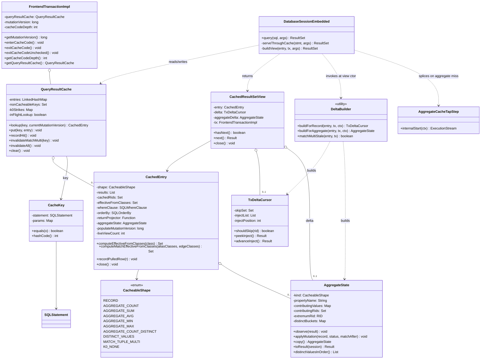

# YTDB-820 Transaction-scoped query result cache — Design

## Overview

YouTrackDB adds an opt-in transaction-scoped query result cache that memoises idempotent `Database.query()` results within a single transaction. It is gated behind `youtrackdb.query.txResultCache.enabled` and disabled by default, so a build that never sets the flag carries zero behavior change.

Without the cache, every `Database.query()` call re-executes against storage even when the same idempotent query ran moments earlier in the same transaction. Hub and YouTrack DNQ (the DSL-based query system YouTrack issues against the database) emit hundreds to thousands of duplicate-shape SELECT and MATCH queries per request; re-running each against storage is a sustained per-request cost the pre-migration Xodus `EntityIterable` cache used to absorb.

The cache lives on `FrontendTransactionImpl`, keyed by the parsed query AST plus its normalized parameters, and is wiped on every transaction-end path (commit, rollback, close). Each `query()` returns a `CachedResultSetView` over the cached storage rows merged with the in-transaction mutations relevant to the query's class set. The merge runs at iteration time, so the view returns the same sequence a fresh uncached execution would return at the call moment. Non-deterministic queries (`sysdate`, `math_random`, `uuid`, per-row context variables) bypass the cache through a denylist AST walk; the parsed `noCache` hint extends the opt-out to per-query granularity. Shapes the merge cannot reconcile incrementally (LET, GROUP BY, SKIP/LIMIT, multi-alias MATCH) cache under a mutation-version gate that serves repeated reads while no mutation has happened in the transaction and re-executes on the next call after any tx-write.

The load-bearing primitives already existed before this work: `SQLStatement.equals()` is structural, `SQLStatement.isIdempotent()` excludes mutating statements, `FrontendTransactionImpl`'s record-operation log is the canonical mutation record, the transaction-end sink is a single method, and `SQLWhereClause.matchesFilters(Identifiable, CommandContext)` evaluates a WHERE clause in memory. This design adds two monotonic version counters, a re-entrancy depth counter, and a self-contained cache package; it touches no parser grammar, no planner, and no execution-step class except by a local post-construction plan rewrite for the aggregate side-tap.

Two knobs bound per-transaction memory: `maxEntries` (LRU cap, default 200) and `maxRecordsPerEntry` (per-entry result-count cap, default 10000).

This design is for contributors who maintain the query-execution path (`DatabaseSessionEmbedded`, `FrontendTransactionImpl`, the `sql/executor` step classes) and assumes familiarity with the tx-aware executor's record-iteration semantics and the `ResultSet` / `ExecutionStream` contract. The rest of the document is structured as: Core Concepts, then Class Design and Workflow, then Part 1 (the read path: key, pause/resume, lazy merge, per-shape reconciliation), Part 2 (invalidation and the version gate), Part 3 (non-determinism, memory, concurrency, lifecycle), and finally invariants, known limitations, and deferred work.

## Core Concepts

Eight load-bearing terms recur throughout the design. Each entry pairs the term with what it replaces or how it relates to the baseline executor, then points at the section that elaborates it.

**Cacheable shape.** The static classification a query receives at its first cache put, computed by `ShapeClassifier.classify(SQLStatement)`. The values are `RECORD`, `AGGREGATE_COUNT`, `AGGREGATE_SUM`, `AGGREGATE_AVG`, `AGGREGATE_MIN`, `AGGREGATE_MAX`, `AGGREGATE_COUNT_DISTINCT`, `DISTINCT_VALUES`, `MATCH_TUPLE_MULTI`, and `K0_NONE`. The shape selects which reconciliation path runs and whether the entry replays incrementally, replays verbatim under a version gate, or invalidates. The baseline executor has no analogue: it caches nothing, so it classifies nothing. → Part 1 §"Per-shape classify".

**K0_NONE.** The shape for a query whose result is deterministically reproducible from storage plus the AST but cannot be reconciled record by record: SKIP/LIMIT, GROUP BY, LET, subqueries, expression-DISTINCT, scalar `COUNT(DISTINCT prop)`, cross-alias-state MATCH. A `K0_NONE` entry serves a cached read only while the transaction's mutation version has not moved since populate; the first lookup after any tx-write invalidates and re-executes. → Part 2 §"K0-version-fallback for NONE shapes".

**Etap A (single-alias MATCH).** A single-alias, edge-free MATCH (`MATCH {as:u, class:X WHERE p} RETURN <projection of u>`) folds onto the `RECORD` path. The entry stores raw, RID-identifiable records and a `returnProjector` closure that rebuilds the RETURN tuple at emit, so the RECORD skip-set and sorted merge stay RID-addressable. → Part 1 §"MATCH Etap A — RECORD-shape composition".

**MATCH_TUPLE_MULTI (class-scoped version gate).** A multi-alias, edge-bearing, or cross-join MATCH freezes its projected RETURN tuples and replays them verbatim while no mutation has touched a pattern class. At lookup the cache scans post-populate mutations: a single mutation to any class in the entry's read-class closure invalidates the whole entry, which then re-executes. Unlike `K0_NONE` the gate is class-scoped, so a mutation to a class outside the pattern leaves the entry serviceable. → Part 1 §"Replaying a frozen tuple set".

**`mutationVersion` and `populateMutationVersion`.** Two monotonic `long` counters. `FrontendTransactionImpl.mutationVersion` increments on every `addRecordOperation` call, including the collapse path that mutates an existing operation in place. Each `CachedEntry` stamps `populateMutationVersion` from the current `mutationVersion` at the moment the populating execution begins. The delta builder considers only operations whose `version` exceeds the entry's stamp, which suppresses double-application: the tx-aware executor already reflects every pre-populate mutation in the entry's cached rows. → Part 1 §"TxDeltaCursor — record shape".

**`effectiveFromClasses`.** A per-entry `Set<String>` carrying the full subclass closure of every class the query reads from: the SELECT FROM target, every MATCH pattern-node `class:`, and every edge class named by a `.out/.in/.both(label)` traversal. Computed once at entry construction and stable for the entry's lifetime because schema is immutable within a transaction. The reconciliation path uses it as an O(1) class filter on every mutation. → § Class Design.

**`TxDeltaCursor` and `DeltaBuilder`.** New types. `TxDeltaCursor` is a per-view snapshot pair `(skipSet, injectList)` the RECORD view consults at every cache-cursor advance and every stream-pull-append. `DeltaBuilder` is a stateless utility that walks the transaction's record operations once at view construction to produce the cursor (RECORD / Etap-A MATCH), an `AggregateState` copy (aggregate and DISTINCT_VALUES shapes), or a boolean staleness verdict (MATCH_TUPLE_MULTI). → § Class Design, Part 1.

**`AggregateState`.** The per-RID material an aggregate or DISTINCT_VALUES entry carries so its scalar (or distinct value set) can be replayed against tx mutations. The side-tap seeds it at populate; the view copies it and replays post-populate mutations onto the copy. SUM/AVG fold through the same `PropertyTypeInternal.increment` storage uses, so cache and fresh execution match bit for bit. → Part 1 §"Aggregate delta — AGGREGATE_* shapes".

## Class Design



**TL;DR.** The cache is `QueryResultCache`, a bounded LRU map on the transaction. A `CachedEntry` is one slot: frozen `results`, the paused stream, and the AST metadata the reconciliation needs. `TxDeltaCursor` is the RECORD/Etap-A per-view delta (a skip-set plus a sorted inject-list); `AggregateState` is the per-RID material for aggregate and DISTINCT_VALUES shapes. `DeltaBuilder` produces one of these (or a boolean staleness verdict for `MATCH_TUPLE_MULTI`) once per view. `CachedResultSetView` is the consumer `ResultSet`. Everything else is hooks on existing types: `FrontendTransactionImpl` owns the cache, the two version counters, and the `cacheCodeDepth` re-entrancy counter; `DatabaseSessionEmbedded.serveThroughCache` is the integration point; `addRecordOperation` carries no cache hook, only the version stamp.

The fields enumerated on `CachedEntry` are exactly the as-built set: a single `returnProjector` of type `Function<Result, Result>`, a nullable `aggregateState`, and the cross-view delta-pair cache. The earlier per-tuple MATCH fields (an alias-to-class map, a per-tuple RID map, a RID-to-tuple reverse index, a tombstone flag) are not present, because multi-alias MATCH ships as a class-scoped version gate rather than per-tuple reconciliation (Part 1 §"Replaying a frozen tuple set").

### Edge cases / Gotchas

- The cache value type is `List<Result>`, not `List<RecordAbstract>`. A projection query (`SELECT name, age+1 …`) produces a `Result` that wraps no record, so caching records would exclude every projection query. `Result` is the type that crosses the `ResultSet` boundary.
- `CachedEntry` carries no `version` field. The RECORD path reconciles through the per-view `TxDeltaCursor`, not an entry version; only `K0_NONE` and `MATCH_TUPLE_MULTI` compare `populateMutationVersion` against the transaction's current version.

### References

- D1: cache value type is `List<Result>` → Part 1 §"Frozen output, live record state".
- Invariant 1 (clear on every tx-end), Invariant 7 (view delta frozen post-construction) → § Invariants.

## Workflow

**TL;DR.** Every `query()`, hit or miss, ends by building a delta from the current record-operations snapshot and returning a fresh `CachedResultSetView`. A miss runs real execution and lazily populates the entry's `results` as the consumer iterates. A hit reuses the immutable entry. Each `view.next()` sorted-merges the cached cursor with the view's frozen delta-cursor (RECORD), or reads the replayed `AggregateState.toResult()` (aggregate), or replays verbatim (`K0_NONE` and `MATCH_TUPLE_MULTI`). Mutations land in the transaction's record-operation log without touching the cache; only the next `query()` sees them through a fresh delta. Transaction end clears the whole cache.

```mermaid
sequenceDiagram
    participant App as DNQ / Hub
    participant Sess as DatabaseSessionEmbedded
    participant Cache as QueryResultCache
    participant DB as DeltaBuilder
    participant View as CachedResultSetView
    participant Tx as FrontendTransactionImpl

    App->>Sess: query("SELECT FROM User WHERE active = ?", [true])
    Sess->>Sess: parse to SQLStatement, isIdempotent
    Sess->>Tx: enterCacheCode()
    Sess->>Cache: lookup(key, mutationVersion)
    alt Miss
        Cache-->>Sess: null
        Sess->>Sess: non-determinism walk + classify
        Sess->>Cache: put(key, entry); stamp populateMutationVersion
        Sess->>DB: buildForRecord(entry, tx, ctx)
        DB-->>Sess: TxDeltaCursor
        Sess-->>App: new CachedResultSetView
    else Hit
        Cache-->>Sess: existing entry
        Sess->>DB: buildForRecord(entry, tx, ctx)
        DB-->>Sess: TxDeltaCursor
        Sess-->>App: new CachedResultSetView
    end
    Sess->>Tx: exitCacheCode()

    loop App iterates
        App->>View: next()
        View->>Tx: enterCacheCode (per row)
        View->>View: sorted-merge cache cursor + delta cursor
        View->>Tx: exitCacheCode (per row)
        View-->>App: Result
    end

    App->>Tx: user.save()
    Tx->>Tx: addRecordOperation; ++mutationVersion
    Note over Cache: cache untouched; live views keep their frozen delta

    App->>Sess: query again
    Note over Sess,DB: fresh delta snapshot includes the user.save mutation

    App->>Tx: commit()
    Tx->>Cache: clear()
```

The diagram traces one transaction: a miss populating an entry, a save mid-transaction, a re-query that builds a fresh delta over the post-save state, and commit clearing the cache. The `enterCacheCode` / `exitCacheCode` bracket appears twice: once around the synchronous lookup-and-build scope, and once per row during view iteration. The per-row re-entry is what keeps the re-entrancy guard scoped to the row-production windows (lazy stream pull, delta merge, RETURN projection) and never held across the view's idle time.

### Edge cases / Gotchas

- A second consumer calling `query()` for the same key before the first finished iterating gets a separate view with its own delta snapshot. If a mutation happened between the two `query()` calls, the second view sees it and the first does not.
- If a consumer drops a view without exhausting it, the stream stays live in the entry until another consumer pulls it further, LRU evicts the entry, or the transaction ends.

### References

- D2: cache key composition → Part 1 §"Cache key composition".
- D4: pause/resume via shared stream → Part 1 §"Pause/resume mechanics".
- D5: lazy merge-on-read → Part 1 §"Lazy merge-on-read".
- D6: non-determinism bypass → Part 3 §"Non-determinism handling".

# Part 1 — Read path

This part covers how a query is keyed, how the cache pauses and resumes a storage stream, and how each cacheable shape reconciles its frozen output against in-transaction mutations. It is the bulk of the design.

## Cache key composition

**TL;DR.** A `CacheKey` pairs the parsed `SQLStatement` with its normalized parameters and delegates equality to `SQLStatement.equals()`, which is already structural over target, projection, WHERE, GROUP BY, ORDER BY, SKIP, LIMIT, and the rest of a statement's fields. `YqlStatementCache` returns the same `SQLStatement` instance for identical query text, so `CacheKey.equals` short-circuits on instance identity before any deep walk, collapsing thousands of duplicate-text DNQ lookups to a pointer compare.

The parser already runs on the hot path: `SQLEngine.parse()` fires on every `query()` call and its result is memoised by `YqlStatementCache` (the project's Guava-backed AST cache, keyed by query text). The result-cache lookup happens after parsing, so the AST is an input already in hand.

Parameter normalization converts the positional `Object[]` form to a map keyed by positional index and wraps the named `Map<String, Object>` form read-only; the stored type is `Map<Object, Object>` because positional params use `Integer` keys and named params use `String` keys. Equality is deep (`Objects.equals`; arrays through `Arrays.deepEquals`); records and identifiables compare by RID. The map is defensively copied at lookup so a caller mutating its parameter collection after `query()` returns cannot corrupt a live key.

`CacheKey.equals(o)` runs the identity fast-path first (`this.statement == other.statement && Objects.equals(params, other.params)`), then falls back to structural deep-equals. The deep-equals path matters when `YqlStatementCache` has evicted the text entry and a re-parse produces a fresh, structurally-equal AST instance: identity then fails but structural equality still hits.

### Edge cases / Gotchas

- `SQLInputParameter` inherits `Object` identity-equals, but it is never a returned parsed leaf: the parser always returns one of the two concrete subclasses (`SQLNamedParameter`, `SQLPositionalParameter`), and both already carry field-based `equals`/`hashCode`. No parser-node edit was needed; a regression test forces a `YqlStatementCache` eviction and re-parse and asserts the deep-equals path still hits.
- Two parameter maps differing only in iteration order compare equal — they are the same parameter set.
- MATCH accepts statement-level SKIP after RETURN; `SQLMatchStatement.equals()` covers it natively, so the key needs no MATCH-specific handling.

### References

- D2: cache key is `(parsed SQLStatement, normalized params)` with the identity fast-path → this section.
- D22: `SQLInputParameter` parsed-leaf audit → this section's Edge cases.

## Pause/resume mechanics

**TL;DR.** A `CachedEntry` keeps a strong reference to the live `ExecutionStream`, its plan, and its context. While the stream is not exhausted, a view that outruns the cached `results` list calls the stream once, appends the row to the shared list, records its RID, and returns it. When the stream drains, the entry flips `exhausted`, closes the stream, and nulls the reference; from then on every view is a pure list replay.

This makes repeated `query()` calls within a transaction idempotent in the consumer's view: whenever a consumer arrives and however far a prior consumer iterated, they all see the full ordered result. The first consumer to need a tail row pays its storage cost; later consumers pay nothing. The cached `results` list is append-only — never reordered or removed — so the per-view delta cursor is the only thing that reconciles mutations.

### Edge cases / Gotchas

- The session's active-query map is weak-valued in embedded mode, so a `CachedResultSetView` GC'd before tx-end is dropped silently. The `CachedEntry`, not the view, owns the paused stream, so the stream survives a dropped view (Invariant 3).
- The transaction-end clear closes paused streams; the consumer-facing view never closes the shared stream itself, because other views may still be reading it.
- A paused stream's underlying storage cursor stays alive between the originating and resuming pulls. YouTrackDB transactions are thread-affine, so no concurrent mutation can land on another thread mid-pause.

### References

- D4: pause/resume via a shared stream plus per-view position counters → this section.
- D15: the delta snapshot is taken at view construction and not refreshed mid-iteration → this section, § Workflow.
- Invariant 3 (paused-stream lifetime ≤ entry), Invariant 7 (view delta frozen) → § Invariants.

## Lazy merge-on-read

**TL;DR.** Every `CachedResultSetView` is built with a frozen snapshot of the transaction's post-populate mutations relevant to the entry's `effectiveFromClasses`. The snapshot — a `TxDeltaCursor` (RECORD / Etap-A MATCH) or an `AggregateState` copy with the delta replayed (aggregate / DISTINCT_VALUES) — is built once by `DeltaBuilder` and never refreshed mid-iteration. The cache itself is immutable from populate time; all "what does this query return given the cache plus the current tx state" logic lives in the delta build. The cache never reacts to an individual mutation; it snapshots the mutation log per view.

The cost shape: each delta build pays an O(N) scan of the transaction's mutation log plus an O(p log p) sort of the inject list. Per-`next()` cost is O(1) when the delta is empty (a read-only tx fragment) and O(log p) once a same-class write has landed. This is more raw work per read than an eager update-in-place scheme would pay, accepted in exchange for the entry being a frozen storage snapshot that matches the executor's blocking-materializer contract: every view sees a coherent snapshot from the moment its `query()` returned.

### Per-shape classify

At an entry's first put, `ShapeClassifier` decides which reconciliation path it takes from the AST alone (no session or schema access), returning one of the ten `CacheableShape` values. The `K0_NONE` bucket covers everything the per-record delta cannot reconcile but that storage plus the AST can deterministically reproduce.

The classify order is load-bearing: SKIP or LIMIT routes to `K0_NONE` before any shape-specific check, because a paginated cached prefix cannot be repaired incrementally (an in-window row drop would emit the wrong cardinality). The shapes:

- **RECORD** — a plain SELECT (`SELECT [projection] FROM Class [WHERE p] [ORDER BY ...]`) with no GROUP BY, aggregate, LET, subquery, SKIP, or LIMIT. A single-alias edge-free MATCH with a record-local ORDER BY also classifies RECORD, carrying a `returnProjector` (Etap A).
- **AGGREGATE_*** — a single-aggregate SELECT (`SELECT <COUNT(*)|SUM(prop)|AVG(prop)|MIN(prop)|MAX(prop)> FROM Class [WHERE p]`) with no GROUP BY, HAVING, expression argument, SKIP, or LIMIT.
- **DISTINCT_VALUES** — the distinct value set of a single bare property (`SELECT distinct(prop)` / `SELECT DISTINCT prop`) carrying a deterministic ORDER BY on that column. Reuses the `AGGREGATE_COUNT_DISTINCT` per-value RID buckets but emits the bucket keys as rows. A path or expression argument, multiple columns, or a missing/foreign ORDER BY routes to `K0_NONE`.
- **MATCH_TUPLE_MULTI** — a multi-alias, edge-bearing, or cross-join MATCH that passes the K0_NONE gate (every node has `class:`, no LET/UNWIND/GROUP BY/RETURN DISTINCT, no cross-alias-state or link-deref WHERE, statically resolvable labels).
- **K0_NONE** — SKIP/LIMIT; GROUP BY/HAVING; expression-aggregates; scalar `COUNT(DISTINCT prop)` (the engine computes it as a row count, see Part 1 §"Aggregate delta"); subqueries; LET; cross-alias-state or link-deref MATCH; any MATCH node lacking `class:`.

A non-deterministic statement never reaches classify: `NonDeterministicQueryDetector` intercepts it on the miss path before classification and routes it uncached (Part 3 §"Non-determinism handling").

### TxDeltaCursor — record shape

`DeltaBuilder.buildForRecord(entry, tx, ctx)` reconciles a RECORD entry's frozen rows against post-populate mutations. It first snapshots the relevant operations, applying both filters that depend only on the operation and the entry's frozen metadata: the populate-version filter (`op.version > entry.populateMutationVersion`) and the class-closure filter (the operation's record is an `Entity` whose schema class is in `effectiveFromClasses`). The snapshot is required because a WHERE re-evaluation may invoke a UDF that calls `save()`, which would structurally modify the mutation log mid-iteration; the snapshot also excludes any record such a UDF adds during the build, which becomes visible to the next view at the advanced version.

For each surviving operation the build computes two runtime facts: `cached_at_build` (is the RID already in `cachedRids`?) and `match_after` (does the post-mutation record still satisfy the WHERE clause, re-evaluated with the original query's context so `:param` bindings resolve identically?). It then dispatches on `(op.type, cached_at_build, match_after)`:

| op.type | cached_at_build | match_after | Action |
|---|---|---|---|
| CREATED | true | true | skip + inject (collapsed pre-populate create whose ORDER BY position may have shifted) |
| CREATED | true | false | skip (collapsed update drove WHERE false; drop the cached row) |
| CREATED | false | true | inject (true post-populate create, never in cache) |
| CREATED | false | false | no-op (true post-populate create that does not match) |
| UPDATED | true | true | skip + inject (re-position in case the ORDER BY key changed) |
| UPDATED | true | false | skip (no longer matches WHERE; remove from result) |
| UPDATED | false | true | skip + inject (inject post-mutation state, suppress a stale stream pull) |
| UPDATED | false | false | skip (suppress the stale stream pull) |
| DELETED | * | * | skip (suppress both the cache cursor and the stream pull) |

`cached_at_build` stays load-bearing under the version filter because `addRecordOperation` keeps a CREATE→UPDATE collapsed operation typed `CREATED` while re-stamping its version: a `CREATED` operation can be a true post-populate create (never in cache) or a pre-populate create a post-populate update re-stamped (in cache from populate). `cached_at_build` is the runtime distinguisher. CREATE→DELETE and UPDATE→DELETE both collapse to `DELETED`, which always skips.

The build sorts the inject list by the entry's ORDER BY, then promotes the `(skipSet, injectList)` pair onto the entry tagged by the transaction's mutation version. Two views on one entry at the same version reuse the shared immutable pair instead of re-walking the log; a view at a fresher version rebuilds and overwrites, while older views keep their own cursor reference to the prior pair. The reuse ignores the context safely because the entry is keyed by `(AST, normalized params)`, so every view reaching it carries identical `:param` bindings.

The view's `next()` sorted-merges the positional cache cursor against the delta cursor. It first drops any cache-head whose RID is in the skip-set, then materialises the next storage row from the stream (skip-set-filtered) when the cache is exhausted but the stream is not — load-bearing for sort correctness, since a delta inject whose ORDER BY key sorts after a not-yet-pulled storage row would otherwise emerge first. With both cursors carrying a head, the loop emits the smaller per ORDER BY, ties favouring the delta side so mutated rows land at or before equally-ranked cached rows. The full `view.next()` trace:

```
view.next():
  while true:
    cache_head = (position < entry.results.size()) ? entry.results[position] : null
    if cache_head != null and deltaCursor.shouldSkip(cache_head.rid):
      position++; continue
    if cache_head == null and not entry.exhausted:
      r = stream_pull_one()    // skip-set-filtered append; sets exhausted on drain
      if r != null: continue   // re-loop; cache_head becomes r at position
    delta_head = deltaCursor.peekInject()
    if cache_head == null and delta_head == null: end of results
    if cache_head == null: return deltaCursor.advanceInject()
    if delta_head == null: position++; return cache_head
    if cmp(delta_head, cache_head, orderBy) <= 0: return deltaCursor.advanceInject()
    position++; return cache_head
```

### Frozen output, live record state

A `TxDeltaCursor` is immutable after construction. The entry's `results` list and `cachedRids` set are still mutated by stream-pull-append during iteration (that is how the lazy path operates), but the set of records a built view emits and their relative order are fixed at construction (Invariant 7). The cached `Result` instances wrap record references; if a record's properties are mutated mid-iteration through `save()`, both the cache-cursor read and any later stream pull observe the post-mutation values. That matches standard YouTrackDB record-reference semantics, not property-level snapshot isolation.

### Aggregate delta — AGGREGATE_* shapes

An aggregate entry carries an `AggregateState` seeded at populate by the side-tap (Part 1 §"Aggregate side-tap"). At view construction `DeltaBuilder.buildForAggregate(entry, tx, ctx)` copies the seeded state (so the entry's populate-time state is never disturbed), replays the populate-version-filtered, class-filtered post-populate mutations onto the copy, and returns the copy. The view emits the copy's `toResult()` once; `hasNext()` is true exactly once.

`applyMutation` derives its transition from membership and `match_after`, never from `op.type`: `was_contributing` is `contributingValues.containsKey(rid)` (or `contributingRids.contains(rid)` for `COUNT(*)`), and `now_contributing` is `match_after` unless the status is DELETED (then false). This mirrors the RECORD path's `cached_at_build` and is required for the same collapse reason: a collapsed pre-populate CREATE the version filter admits is reconciled correctly. The membership test needs no stream-pull unification because the blocking side-tap observes every contributor at populate, so the seeded state is complete.

SUM and AVG fold each value through `PropertyTypeInternal.increment`, the same call `SQLFunctionSum.sum` and `SQLFunctionAverage.sum` make, so cache replay matches fresh execution bit for bit across mixed-input promotion (Long+Double→Double), Long overflow, and `2^53+1` precision loss. AVG additionally tracks the contributor count and finalizes through the storage type-dispatched division (integer truncation for Integer/Long, BigDecimal `HALF_UP`), reproducing `SQLFunctionAverage.computeAverage` exactly. MIN/MAX carry an `extremumRid` and key the extremum test on RID identity (`rid.equals(extremumRid)`), not `Number.equals`, to sidestep the cross-subtype hazard; only two of the nine transitions (the extremum holder leaving, or dropping out of extremum direction) trigger an O(n) recompute over the contributors, so per-mutation cost amortizes to O(1) for the stable-extremum case that dominates the Hub aggregate profile.

`COUNT(DISTINCT prop)` is not cached as an aggregate. This engine computes `count(distinct(prop))` as a plain row count: `SQLFunctionCount` counts every non-null argument and the nested `distinct(...)` does not dedup its input, so a distinct-count replay would diverge from fresh execution. It routes to `K0_NONE`, where the version gate reproduces the engine's row count exactly. The per-value RID buckets (`distinctBuckets: Map<Object, Set<RID>>`, keyed by raw `Object.equals` so `Long(5)` and `Integer(5)` stay distinct, mirroring `SQLFunctionDistinct`) instead back the `DISTINCT_VALUES` shape, whose view emits the bucket keys as rows sorted by the ORDER BY. The `AggregateState` machinery for the distinct count remains in the code but is unreached in production; it is kept for a future engine that grows a native distinct count.

### Aggregate side-tap

Seeding an `AggregateState` needs per-RID material, but the collapsed `ResultSet` carries only the scalar. `AggregateCacheTapStep`, an `AbstractExecutionStep`, recovers that material by observing every contributing record before the aggregation collapses them. The miss path builds the plan via `select.createExecutionPlan(ctx, false)`, downcasts to `SelectExecutionPlan`, finds the `AggregateProjectionCalculationStep`, and splices the tap upstream of it (above a pre-aggregate `ProjectionCalculationStep` when one is present, since that projection strips record identity and `observe` needs the RID). The tap's `internalStart` wraps the upstream stream so its `next` calls `aggregateState.observe(result)` before forwarding the unchanged row.

The aggregate miss eager-drives the plan to full drain before returning the view, unlike the RECORD lazy pull. The asymmetry is required, not an inconsistency: a RECORD entry stores per-row results, each independently correct, so a consumer that pulls three rows and abandons the view has cached three valid rows. An aggregate stores a single scalar derived from observing every contributor, so a never-iterated view would leave the tap unfired and the scalar meaningless. Eager drive forces full population at put time; its cost equals an uncached aggregate execution, which every aggregate query already pays.

If the planner emits an unexpected shape (no `AggregateProjectionCalculationStep`, for example a hardwired `CountFromClassStep`), the miss path closes the plan, counts a splice failure through `incrementSpliceFailures`, and falls back to a plain uncached `LocalResultSet`. `DISTINCT_VALUES` reuses this machinery through `populateAndBuildDistinctValuesView`, splicing the tap above the pre-distinct projection.

### MATCH Etap A — RECORD-shape composition

A single-alias, edge-free MATCH (`MATCH {as:u, class:X WHERE p} RETURN <projection of u>`) with a record-local ORDER BY folds onto the RECORD path. The entry stores raw, RID-identifiable records and a `returnProjector` (`Function<Result, Result>`) built from the RETURN clause. The projector is applied at the view's emit boundary and to both ORDER BY merge heads before comparison, so a projected ORDER BY column resolves. Storing raw records keeps the RECORD skip-set and sorted merge RID-addressable; projecting at emit is what lets a multi-item `RETURN u, u.name` work, since the executor's projected tuples are not RID-identifiable. The fold is scoped to `shape == RECORD`; a record-attribute ORDER BY (`@rid`, `@class`) keeps the statement on the `MATCH_TUPLE_MULTI` path.

The entry's `effectiveFromClasses` is the single alias's class closure, its `whereClause` the alias pattern WHERE, and its ORDER BY the statement ORDER BY. These come from MATCH-aware branches in the session's populate helpers, which would otherwise return an empty set for a MATCH and produce an entry that reconciles nothing.

### Replaying a frozen tuple set

A `MATCH_TUPLE_MULTI` pattern (more than one bound alias, any traversal edge, or a cross-join) stores its projected RETURN rows and serves them unchanged while no pattern read-class has been mutated. At lookup, `DeltaBuilder.matchMultiStale(entry, tx)` returns false immediately when the transaction's mutation version equals the entry's populate version (the read-mostly hit); otherwise it scans the post-populate operations and returns true on the first `Entity` operation whose schema class is in `effectiveFromClasses`. A stale verdict routes through `QueryResultCache.invalidateMatchMulti`, which drops the entry, counts an invalidation strike, and after the threshold routes the key non-cacheable; the query then re-executes on the miss path. The entry's `effectiveFromClasses` is the union of every alias node class and every traversal-edge class, each with its subclass closure (`CachedEntry.computeMatchEffectiveFromClasses`). A multi-alias MATCH whose closure resolves empty is refused (the gate could never fire), so it runs uncached.

This is a class-scoped version gate, not the per-tuple incremental reconciliation an earlier design assumed. The earlier design populated a RID-to-tuple reverse index by reading each cached row's per-alias binding, then dropped or kept individual tuples on a vertex DELETE or a WHERE-membership flip, and tombstoned the entry on any CREATE, edge DELETE, or update-into-match. That population is structurally unbuildable for the dominant RETURN shape: a field-projection RETURN (`RETURN a.name as a, b.name as b`) carries scalars under the projection keys, not the bound records, so no per-alias RID can be recovered from a projected row to map a mutation back to its tuples. A pre-projection side-tap could recover the bindings, but for the read-mostly target workload the per-tuple bookkeeping would be built at every populate and pay off only on an in-pattern vertex DELETE or pass-fail UPDATE, while a CREATE, edge DELETE, or update-into-match would invalidate regardless. The class-scoped gate reads the mutation operation's own class, never a binding off a projected row, so the field-projection shape is correct by construction; and being class-scoped it survives mutations to classes outside the pattern, which a global `K0_NONE` gate would not. The trade-off accepted: a whole-entry re-execution on the first in-pattern mutation, with no single-tuple incremental drop. The classify K0_NONE gates stay load-bearing — a link-deref or cross-alias pattern can be affected by a mutation to a class outside `effectiveFromClasses`, so those patterns must (and do) route to `K0_NONE` instead.

### Edge cases / Gotchas

- The pre-update value of an UPDATED record is gone (`RecordOperation.record` is the post-mutation state), so a cached-and-still-matching UPDATE always skips and re-injects rather than testing whether the ORDER BY key changed.
- A deterministic function in a WHERE clause (`WHERE lower(name) = ?`) re-evaluates correctly through `matchesFilters`; a non-deterministic one is excluded at entry creation.
- The MATCH grammar has no `NOCACHE` token, so a MATCH cannot opt out per-query; its non-determinism surface is structurally narrower than SELECT's and fully covered by the detector's denylist and context-variable list.
- A multi-alias MATCH entry stores the executor's projected tuples and replays them through the same view path `K0_NONE` uses (`delta == null`), so the view and `buildView` need no MATCH-specific branch.

### References

- D5: lazy merge-on-read via a snapshot `TxDeltaCursor` → this section.
- D8: MATCH Etap A as RECORD composition; multi-alias as a class-scoped version gate → this section.
- D11: pre-expand FROM classes to the subclass closure at construction → § Class Design, this section.
- D19: SUM/AVG via `PropertyTypeInternal.increment` → this section §"Aggregate delta".
- D20: `DISTINCT_VALUES` via per-value RID buckets; scalar `COUNT(DISTINCT prop)` stays `K0_NONE` → this section §"Aggregate delta".
- D21: populate-version stamping eliminates miss-path double-application → this section §"TxDeltaCursor".
- Invariant 4 (view output ≡ fresh execution), Invariant 7 (delta frozen) → § Invariants.

# Part 2 — Invalidation

The cache reacts to mutations in only two ways: a bulk-DML drop for `TRUNCATE CLASS`, and a per-entry version gate for the shapes the merge cannot reconcile. Everything else flows through the per-view delta in Part 1.

## Dropping entries on mutation

**TL;DR.** Three drop paths exist. First, `DatabaseSessionEmbedded.invalidateCacheForBulkDml` calls `invalidateAll()` for `SQLTruncateClassStatement`, the only bulk operation that legitimately runs mid-transaction; it is wired into both the command path (`executeInternal`) and the script path (`SqlScriptExecutor`), so a TRUNCATE inside a script invalidates a sibling query's entry. Second, the version gate at lookup drops a `K0_NONE` or `MATCH_TUPLE_MULTI` entry whose populate version no longer matches the transaction's. Third, `clear()` wipes the whole cache at transaction end.

There is no per-record hook on `addRecordOperation`. For RECORD, AGGREGATE_*, and DISTINCT_VALUES shapes the cache never reacts to an individual mutation; the mutation log grows as the transaction already records it, and each new `query()` snapshots it through the delta build. Regular INSERT/UPDATE/DELETE therefore needs no invalidation hook. Schema DDL is excluded because schema is immutable within a transaction (Invariant 8): the schema and index managers throw before any cache effect would matter, and a `Java assert` canary in `invalidateCacheForBulkDml` fires if a schema-DDL statement ever reaches the hook with an active transaction.

### K0-version-fallback for NONE shapes

**TL;DR.** A `K0_NONE` entry remains cacheable for the duration of a pure-read transaction fragment. `lookup` stamps `populateMutationVersion` at populate and, on each subsequent lookup, compares it against the transaction's current `mutationVersion`: equal is a hit (pure replay), diverged invalidates the entry and re-executes. For a pure-read transaction the version never moves, so every repeated query after the first is a hit; for a read-mostly transaction the entry hits until the first write, then re-populates.

The fallback is coarse by design: any mutation, on any class, moves `mutationVersion` and invalidates every `K0_NONE` entry, because a `K0_NONE` result cannot be reasoned about per-record (that is what made it `K0_NONE`). To bound churn in a write-heavy fragment, the cache counts invalidation strikes per key in `k0Strikes`; after `k0NoneInvalidationThreshold` strikes (default 3) the key joins `nonCacheableKeys` and bypasses the cache for the rest of the transaction. `MATCH_TUPLE_MULTI` reuses this same strike machinery through `invalidateMatchMulti` — a key has one fixed shape, so the two gates never collide on the same key.

### Edge cases / Gotchas

- The strike counter is per `(statement, params)`, not per statement, so a parameterized `K0_NONE` statement re-issued with rotating param values hands each combination a fresh strike budget and rarely short-circuits. The guard caps the repeated-same-key pathology, not the rotating-param one; per-statement strike tracking is deferred.
- A re-entrant `query()` under a WHERE evaluation sees `cacheCodeDepth > 0` and bypasses the cache, so a nested call cannot perturb the outer entry's version observation.
- Index DDL would change a query plan but not the cached results (the key is the AST, not the plan), so it does not strictly require invalidation; it is unreachable mid-tx anyway under Invariant 8.

### References

- D3: lookup gated on `SQLSelectStatement || SQLMatchStatement`; `TRUNCATE CLASS` invalidates → this section.
- D18: K0-version-fallback for NONE shapes → this section §"K0-version-fallback".

# Part 3 — Non-determinism, memory, and lifecycle

This part covers the three cross-cutting concerns that bound correctness and resource use: which statements the cache refuses to store, how per-transaction memory is capped, and how the cache behaves under re-entrancy and pool shutdown.

## Non-determinism handling

**TL;DR.** `NonDeterministicQueryDetector.containsNonDeterministicReference(statement)` walks the full AST and returns true if the statement references a denylisted function name (`sysdate`, zero-arg `date`, `uuid`, `eval`, `math_random`), a per-row context variable (`$now`, `$current`, `$currentMatch`, `$matched`, `$thread`, `$parent`, `$depth`), or the `noCache` hint. The miss path checks this before classify; a positive result routes the query uncached.

The denylist is fail-open: an unrecognised function defaults to deterministic, so a missed non-deterministic function would silently cache its populate-time value and replay it within the transaction. Completeness, not just auditability, is the property that must hold. One name list covers both build-time function sources (builtins and the reflectively-registered `math_*` family), and `FunctionDeterminismEnumerationTest` keeps it exhaustive by walking every registered function across all four `SQLFunctionFactory` implementations and failing the build on any function that is neither denylisted nor in the test's known-deterministic set. A future SQL-function addition trips this test until the new name is classified.

An `SQLFunction.isDeterministic()` SPI was weighed and deferred. It would co-locate the determinism decision on the function interface and let a stored `CREATE FUNCTION` declare its own flag, but it is strictly safer only if it defaults to non-deterministic — a `default true` shares the denylist's fail-open risk, and a `default false` over-bypasses every un-migrated deterministic builtin on day one. The denylist plus the enumeration test keeps the build-time set complete; stored UDFs fall under a trust-deterministic contract with `NOCACHE` as the documented escape valve.

### Edge cases / Gotchas

- `date(literal)` and `date(field)` are deterministic; only the zero-arg `date()` returns current time, so the denylist entry checks arity.
- User-defined Java functions cannot be inspected for determinism; they are trusted deterministic, and adding a non-deterministic UDF requires the `NOCACHE` hint (SELECT only; MATCH has no token).
- An ORDER BY modifier chain is admitted only when deterministic: the comparator runs at delta-build time to sort the inject list and must rank consistently across the entry's lifetime, so each ORDER BY item is checked through the same detector.

### References

- D6: non-determinism via a fail-open denylist AST walk plus the `noCache` hint → this section.
- D9: deterministic ORDER BY admission → this section §"Edge cases".
- Invariant 5 (cache only stores deterministic statements) → § Invariants.

## Memory bounds

**TL;DR.** Two knobs cap how much a transaction's cache can hold. `maxEntries` (default 200) is a soft LRU cap on the entry count; eviction closes the evicted entry's stream and routes its key non-cacheable to prevent re-population churn. `maxRecordsPerEntry` (default 10000) caps a single entry's row count; an entry whose populate crosses it removes itself from the cache and routes its key non-cacheable, while the live view still receives every row from the stream.

The LRU is an access-ordered `LinkedHashMap`; a live view pins its entry (`liveViewCount > 0`) and `evictEldestIfUnpinned` skips a pinned eldest, so the map may grow transiently above `maxEntries` under view-pinning pressure (Invariant 9). The aggregate path enforces the per-entry cap on the `AggregateState` contributor collections rather than on the single-scalar `results`, since high-cardinality COUNT(DISTINCT)/MIN/MAX is the real memory vector there; `installAggregateOverflowGuard` routes the key non-cacheable on overflow.

### Edge cases / Gotchas

- `nonCacheableKeys` is uncapped per transaction. It gains one permanent key per distinct overflowing or strike-exceeded `(statement, params)` combination and retains that key's copied param map and `SQLStatement` reference. Negligible for short request-scoped transactions; a cap is deferred.
- The eldest-only eviction never evicts a deeper hot entry to spare a cold pinned one — that would discard a fresher, more useful result.
- Default knobs are conservative; both are runtime-changeable via `GlobalConfiguration`.

### References

- D7: per-tx LRU at `maxEntries` plus per-entry `maxRecordsPerEntry` → this section.
- Invariant 9 (view cardinality under LRU pressure via live-view pinning) → § Invariants.

## Concurrency and lifecycle

**TL;DR.** Every cache mutation path (lookup, put, invalidate, LRU eviction, begin-clear) runs on the transaction's owning thread, guarded by the transaction's existing owner-thread assertions. The only cross-thread entry is `clear()` through the tx-end paths (`close`, `rollbackInternal`), which the transaction already exempts from the owner-thread assert to allow pool shutdown. The cache inherits that best-effort shutdown contract; no locking is added.

### Re-entrancy — two guards

A query issued from inside the cache's own lookup-and-view scope must not recursively consult the cache. Two complementary counters enforce that:

1. A transaction-level `cacheCodeDepth` counter on `FrontendTransactionImpl`. The session calls `enterCacheCode()` before the synchronous lookup-and-build scope and `exitCacheCode()` in a finally; the view re-enters the bracket per row in `hasNext()` around the lazy stream pull, delta merge, and RETURN projection. A `query()` issued while `cacheCodeDepth > 0` — a UDF in a WHERE evaluated during the build or during a lazy pull — sees the depth and bypasses the cache. The guard is held only over the row-production windows, so a `query()` issued by user code between two `next()` calls still uses the cache, and an abandoned view never silently disables it.
2. A lookup-level `inFlightLookup` boolean on `QueryResultCache`, guarding the bare `lookup` call. A re-entrant `lookup` sees the flag set and returns null so the caller falls back to uncached execution.

`exitCacheCode()` asserts the owning thread; `exitCacheCodeUnchecked()` is the cross-thread release primitive a pool-shutdown release uses. The counter is transient per-transaction state with no on-disk footprint and resets to zero at begin and at every tx-end path. This two-guard model is new in this work; neither guard existed in the codebase before.

### Close-once discipline for the shared stream

The consumer-facing `CachedResultSetView` does not own the entry's stream (the `CachedEntry` does), so a view never releases the stream itself. At transaction end both `CachedEntry.close()` and `QueryResultCache.clear()` can reach the same stream, so each is independently idempotent by null-out. Because the populating `LocalResultSet`'s stream slot and the entry both reference the stored stream, the cache wraps every stored stream in an `IdempotentExecutionStream` at put time: the wrapper forwards `hasNext`/`next` unconditionally and makes the underlying `close` fire exactly once regardless of which caller reaches it first.

### Edge cases / Gotchas

- The cache is created lazily on first `getQueryResultCache()` and only when the flag is set; it stays null for the whole transaction when the flag is off, the zero-behavior-change floor. A `cacheResolved` latch makes the disabled path cost one boolean read after the first access.
- Nested `beginInternal` (a reentrant begin) skips the cache reset; the cache is per-outermost-transaction.
- Auto-commit (`FrontendTransactionNoTx`) carries no cache: it begins and commits per command, so a tx-scoped cache would see no repeat shapes.
- During pool shutdown a consumer caught mid-iteration may receive an arbitrary exception (typically a closed-stream read), the same best-effort contract every other active query carries at that moment.

### References

- D9: idempotent close via the `IdempotentExecutionStream` wrapper → this section §"Close-once discipline for the shared stream".
- Invariant 2 (mutation paths owner-thread-only), Invariant 6 (idempotent tx-end clear) → § Invariants.

## Invariants

**TL;DR.** Ten properties the implementation holds. Each carries a test in the work that introduced the relevant primitive.

- **Invariant 1 — Cache cleared on every tx-end path.** The transaction-end clear sink calls `QueryResultCache.clear()`. Tested across commit, rollback, and exception-during-iterate.
- **Invariant 2 — Cache mutation paths accessed only by the owning thread.** `lookup`, `put`, `invalidateAll`, `invalidateMatchMulti`, and begin-time `clear()` are reached through owner-thread-asserted call sites; tx-end `clear()` is the documented exception (Invariant 6).
- **Invariant 3 — Paused stream lives at most as long as its `CachedEntry`.** Eviction or transaction end closes the stream.
- **Invariant 4 — View output equals fresh execution composed with the tx-delta snapshot.** For every cacheable shape (RECORD, the AGGREGATE_* family, DISTINCT_VALUES, MATCH Etap A, MATCH_TUPLE_MULTI) a view built at moment T returns the same sequence a fresh uncached execution at T would, across the four mid-tx mutation patterns (none, pre-populate only, post-populate only, both on the same RID through collapse) and CREATED/UPDATED/DELETED. For `K0_NONE` and `MATCH_TUPLE_MULTI` the equivalence holds through the version gate: a hit replays an entry whose populate version still matches, a miss re-executes.
- **Invariant 5 — Cache only stores deterministic, idempotent statements.** Enforced by the detector plus the four-factory enumeration completeness test.
- **Invariant 6 — Tx-end `clear()` idempotent and safe under cross-thread invocation.** `clear()`, `CachedEntry.close()`, and `IdempotentExecutionStream.close()` are each idempotent.
- **Invariant 7 — View delta frozen post-construction.** The skip-set, inject-list, or replayed `AggregateState` is fixed at view construction; later mutations on the owning thread do not change a live view's output set or order. Record-property mutations are still observed live, matching YouTrackDB reference semantics.
- **Invariant 8 — Schema immutable for the transaction's lifetime (enforced upstream).** The schema and index managers throw on any mid-tx schema DDL, so `effectiveFromClasses` and every AST-derived field are stable for an entry's life.
- **Invariant 9 — View cardinality matches the uncached path under LRU pressure.** `liveViewCount` pins a mid-iteration entry; `evictEldestIfUnpinned` skips a pinned eldest.
- **Invariant 10 — Cache transparent to the user.** With the flag on, every `query()` returns the same `Result` sequence a parallel uncached `query()` at the same moment would. The cache is a performance hint, not a semantic toggle, validated by a cache-on/cache-off test-corpus parity run.

### Edge cases / Gotchas

N/A — this is a contract list; failure modes live alongside the primitive each invariant guards.

### References

- D5, D18, D21 underpin Invariants 4 and 7 → Part 1, Part 2.
- D6 underpins Invariant 5 → Part 3 §"Non-determinism handling".

## Known limitations

**TL;DR.** Three correctness-bounded scope cuts. Pagination falls back to the version gate. Multi-alias MATCH ships as a coarse class-scoped gate rather than incremental tuple reconciliation, with CREATE-discovery and incremental edge-DELETE deferred to a separate ADR. MIN/MAX recompute is O(n) at delta-build time when the cached extremum element leaves.

A query with SKIP or LIMIT classifies `K0_NONE` and caches under the version gate: it serves hits while no mutation has happened and re-executes on the next lookup after any tx-write. The "scroll a list with no intervening writes" pattern is covered; "save then re-read the list" is not (the first read after the save misses).

Multi-alias MATCH ships as a class-scoped version gate (Part 1 §"Replaying a frozen tuple set"). A single mutation to any pattern class invalidates the whole entry — coarser than the incremental per-tuple drop an earlier design assumed, and coarser than the partial Etap B that design described. Two refinements are deferred to a separate ADR, both correctness-neutral because the gate already invalidates the cases: constrained-pattern-walk discovery of new tuples on CREATE, and incremental edge-DELETE that drops only the affected tuple.

MIN/MAX recompute is worst-case O(n) at delta-build time when the cached extremum element leaves (DELETED, transitions out of WHERE, or updated away from the extremum), bounded by `maxRecordsPerEntry`. A sorted-value index for O(log n) is deferred, gated on measurement of extremum-churn frequency.

### Edge cases / Gotchas

N/A — each limitation is itself a bounded scope cut; no second-order surprises live below them.

### References

- D14: MIN/MAX sorted-value index (deferred) → § Deferred work.
- D18: K0-version-fallback covers SKIP/LIMIT → Part 2.

## Deferred work

**TL;DR.** Measurement-gated hardening candidates and two separate ADRs. The hardening candidates: a MIN/MAX sorted-value index, per-entry per-RID WHERE memoization, class-scoped `K0_NONE` invalidation, a bound on `nonCacheableKeys` plus per-statement strike tracking, and weight-aware LRU eviction. The separate ADRs: full MATCH Etap B (multi-alias incremental tuple discovery on CREATE plus incremental edge-DELETE) and a sub-statement caching family (a LET sub-expression cache plus a `$matched` binding cache). A pre-merge Hub-replay validation step measures repeat-shape cacheability and view-output parity and informs which candidates promote.

The MATCH Etap B ADR carries the per-tuple reconciliation this v1 dropped: a constrained pattern walk that injects the tuples a vertex or edge CREATE should produce, and an endpoint-content reverse index that drops only the affected tuple on an unbound-traversal-edge DELETE. Both need net-new infrastructure (a prefetch step and an edge-CREATED dispatch hook for discovery; an endpoint index for incremental edge-DELETE) and are comparable in scope to YTDB-820 itself.

The sub-statement family reaches below the statement boundary the v1 cache keys on: a LET sub-expression cache that keys the synthesized standalone SELECT after binding substitution, and a `$matched` binding cache for sub-patterns referencing `$matched.<alias>.<field>`. Both hook executor steps rather than `DatabaseSessionEmbedded.query()`, so they share an integration layer and would land in one ADR.

### Edge cases / Gotchas

N/A — each item is itself a deferred concern.

### References

- D13: Hub-replay validation gate (pre-merge) → this section.
- D14: MIN/MAX sorted-value index → this section.
