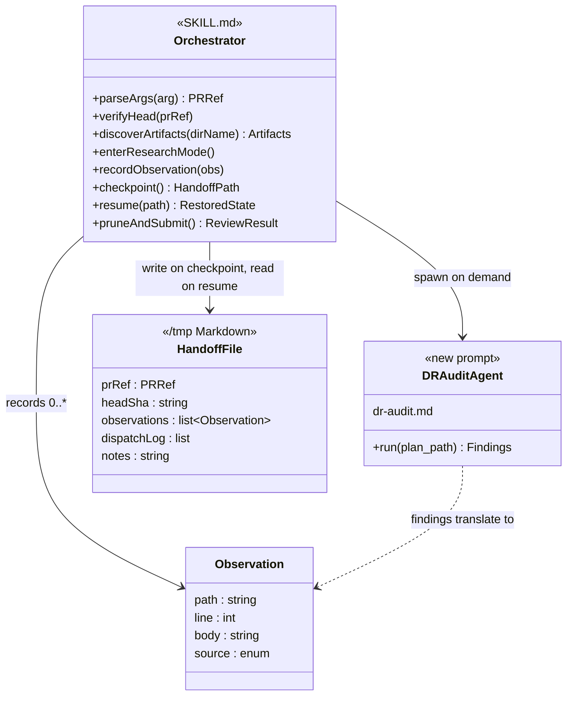
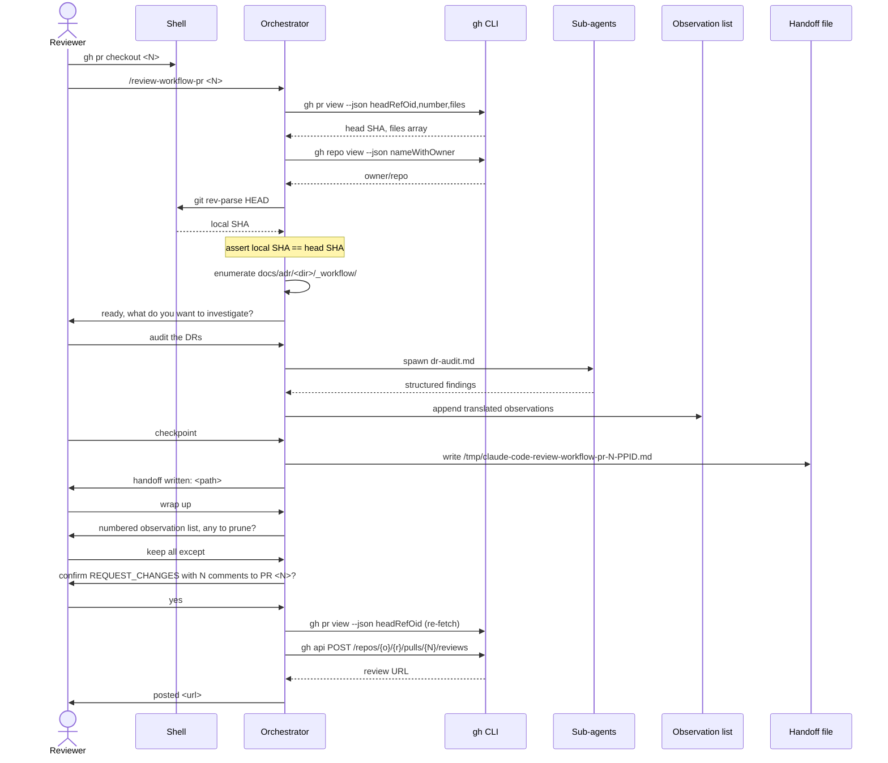

# review-workflow-pr — Design

## Overview

Today a reviewer reading a workflow-style PR opens the design document, the
implementation plan, and the track files one tab at a time, accumulates notes
in their own scratch space, and (if anything is worth flagging) posts comments
in the GitHub UI by clicking through each line. There is no machinery for
pointing the Decision Record format rules at the reviewer, no shared place to
collect observations during the session, and no one-shot submission that
bundles many line-anchored comments into a single approve-or-request-changes
review.

This design adds the `review-workflow-pr` skill: a `/review-workflow-pr <PR>`
command that loads the workflow review context, enters research mode, helps
the reviewer assess design soundness and the Decision Records, auto-records
observations into a single in-conversation list, and at the reviewer's signal
posts a bulk line-anchored review back to the PR through the GitHub REST API.

The enabling primitives are (a) a new focused DR-audit sub-agent prompt that
lives under the skill directory and (b) the
`POST /repos/{owner}/{repo}/pulls/{N}/reviews` REST endpoint accessed through
`gh api`, which is the only mechanism that lets one review carry many
file-and-line-anchored comments.

What else changes: nothing on the workflow-doc surface. Existing prompts and
rules stay where they are. The skill is purely additive under
`.claude/skills/review-workflow-pr/`.

The rest of the doc covers: Class Design (the skill's moving parts), Workflow
(the typical session), then five dedicated sections covering HEAD-SHA
verification, observation list lifecycle, DR-audit sub-agent and findings
translation, the gh-api submission payload, and the handoff-and-resume
mechanism.

## Class Design

**TL;DR.** The skill has two Markdown artifacts (the orchestrator `SKILL.md`
and the new `dr-audit.md` prompt), one in-conversation data type
(`Observation`), and one optional on-disk artifact (the handoff file under
`/tmp`). The orchestrator runs in the main session and owns all session-level
state. The DR-audit sub-agent prompt is stateless; each invocation returns a
structured findings block that the orchestrator parses and translates into
one `Observation` per finding. The handoff file is written only on explicit
reviewer checkpoint and reloaded on resume.

The orchestrator carries: the parsed PR reference, the verified head SHA, the
discovered artifact paths under `docs/adr/<dir>/_workflow/`, the running
observation list, and a record of whether the DR-audit sub-agent has already
been dispatched in the session. The sub-agent returns Markdown matching the
format documented in the prompt; the orchestrator extracts file paths and
line numbers from the cited quotes and prose to anchor each observation.

## Workflow

**TL;DR.** Reviewer checks out the PR and invokes the skill. The skill
verifies the local HEAD matches the PR head, enters research mode, and waits.
The reviewer drives the conversation. The DR-audit dispatch appends
translated observations to the list. The reviewer can ask the skill to
checkpoint at any time, which writes the observation list and dispatch log
to a Markdown file under `/tmp`. At wrap-up the reviewer prunes, the skill
re-fetches the head SHA so the JSON payload uses a fresh value, asks for one
confirmation, and POSTs the bulk review.

The flow has three deliberate gates: the HEAD verification at session start
(stops the reviewer working against a stale checkout), the prune step (lets
the reviewer remove anything they disagree with), and the one-line
confirmation immediately before the `gh api` POST (no submission without an
explicit yes).

## HEAD-SHA verification

**TL;DR.** Before the skill loads any artifact, it confirms the local working
tree is on the PR's head commit. If not, it stops and tells the reviewer how
to fix it. The check runs again just before submission so a mid-session push
does not cause the JSON payload to reference a stale commit.

The verification has two phases. At session start the skill calls
`gh pr view <ref> --json headRefOid -q .headRefOid`, then compares against
`git rev-parse HEAD`. A mismatch aborts with `gh pr checkout <ref>` as the
suggested remediation. At submission time, just before composing the JSON
payload, the skill re-fetches the head SHA the same way. If the head has
moved between session start and submission, the skill asks the reviewer
whether to (a) refresh and re-verify line numbers against the new content,
or (b) abort the submission and re-checkout. The default safe path is (b).

### Edge cases / Gotchas

- `gh pr checkout` typically creates a named local branch tracking the PR
  head, and uses a detached HEAD only with `--detach`. Either case is fine
  for the verification check: `git rev-parse HEAD` returns the head SHA
  regardless of branch shape.
- A reviewer who has cherry-picked or amended local commits on top of the
  PR checkout will fail verification. The skill's error message names both
  the expected head SHA and the local HEAD so the reviewer can decide
  whether to reset.
- The re-fetch at submission time uses a fresh `gh pr view` call rather
  than the cached value from session start.

### References

- D-records: D4
- Invariants: 1

## Observation list lifecycle

**TL;DR.** Observations live in the orchestrator's in-conversation state for
the duration of the session. Each carries a path, a line (or start/end line
for ranges), a body, and a source tag (dr-audit / skill-analysis /
reviewer). The reviewer reviews and prunes the list at wrap-up;
nothing reaches the PR before that confirmation.

Observations enter the list in three ways:

1. The skill auto-records when a sub-agent returns findings. One observation
   per finding, with the source tag set to the sub-agent name.
2. The skill auto-records when its own analysis surfaces an issue
   mid-conversation. For example, when the reviewer asks "is D3 well
   grounded?" and the skill identifies a gap, the gap becomes an observation
   tagged `skill-analysis`.
3. The reviewer asks the skill to record something directly ("flag the
   missing risk in D5"). Source tag is `reviewer`.

At wrap-up the skill displays the full list as a numbered table: index,
`path:line`, source, body. The reviewer can say "remove 3, 7" or "remove all
from dr-audit" or "keep all". The remaining items go into the JSON payload.

The list lives in-memory by default. A `/clear` mid-session loses it unless
the reviewer has asked the skill to checkpoint to `/tmp` via the handoff
mechanism (see §"Handoff and resume"); the skill warns at session start that
the list is in-memory only until checkpointed.

### Edge cases / Gotchas

- Two observations on the same `path:line` are not auto-merged. The reviewer
  may consolidate during prune by removing one and editing the other.
- An observation whose line number turns out to be stale (the file was
  modified during the session by some other process) is caught by the
  submission preflight that re-reads the file and checks each line falls
  within current bounds.
- Observations from a sub-agent that did not cite a specific line are
  anchored at the artifact's nearest section heading; the source tag still
  identifies the sub-agent so the reviewer can recognize the kind of finding.

### References

- D-records: D3, D5
- Invariants: 1, 3, 4

## DR-audit sub-agent and findings translation

**TL;DR.** One sub-agent prompt is wired into the skill: the DR-audit prompt
at `.claude/skills/review-workflow-pr/dr-audit.md`. It returns structured
findings in a documented Markdown format. The orchestrator translates each
finding into one observation by mapping the finding's cited quote back to a
`path:line` in `implementation-plan.md`.

**DR-audit spawn.** Inputs: `plan_path` =
`docs/adr/<dir>/_workflow/implementation-plan.md`. The new prompt instructs a
fresh sub-agent to:

1. Parse every `#### D<n>:` block in the plan.
2. For each, check the four-bullet form (`Alternatives considered`,
   `Rationale`, `Risks/Caveats`, `Implemented in`) is present and not stub
   content like "TODO" or "n/a".
3. Verify the `Implemented in: Track X` reference matches an existing track
   in the checklist.
4. Verify the optional `Full design: design.md §<section>` link resolves to
   a real `## <section>` heading in `design.md`.
5. Return a findings list with one entry per gap: the decision ID, what is
   missing, and a citation line in the plan.

**Translation.** For each finding, the orchestrator extracts the cited file
path and line number. When the finding quotes prose verbatim, the
orchestrator searches the artifact for the quoted string and uses the
matched line. The result becomes an observation `{path, line, body, source}`
appended to the list.

### Edge cases / Gotchas

- A finding without an explicit file citation is anchored to the artifact
  the sub-agent was reviewing, at the nearest `##` heading line.
- A finding that quotes prose verbatim but the prose has been edited since
  the sub-agent's read is logged as an observation but flagged for the
  reviewer to verify at prune time.
- A reviewer who wants a broader cold-read of the design itself invokes the
  existing cold-read flow as a separate skill in the same session; that
  output does not flow back into this skill's observation list
  automatically.

### References

- D-records: D2

## gh-api submission payload

**TL;DR.** The bulk review POSTs to
`/repos/{owner}/{repo}/pulls/{N}/reviews` with a JSON body containing
`commit_id` (the verified head SHA), `body` (an overall summary auto-composed
from observation count and source mix), `event` (`APPROVE` when the list is
empty, `REQUEST_CHANGES` when any observation remains), and `comments[]` (one
item per observation: `path`, `line`, `side=RIGHT`, `body`).

The skill builds the JSON in three steps. First, the overall `body` text is
composed: one paragraph naming the observation count and the source mix, for
example "8 observations recorded from DR audit. See inline comments below."
Second, each observation becomes
one element of `comments[]`. Third, the skill chooses `event` based on
observation count.

The POST is issued via
`gh api -X POST /repos/{owner}/{repo}/pulls/{N}/reviews --input -` with the
composed JSON on stdin. The skill prints the resulting review URL on success.

### Edge cases / Gotchas

- GitHub rejects a review if a comment's `path` is not in the PR's changed
  file set. The skill validates each observation's path against the `files`
  array of `gh pr view` (each element carries `path`, `additions`,
  `deletions`, `changeType`; the skill reads `.path`) before posting and
  reports any mismatch with the observation index so the reviewer can fix
  or remove it.
- GitHub rejects a review if a comment's `line` is outside the file's diff.
  For files newly added by the PR, `side=RIGHT` plus the file's current line
  numbers works without further translation. For files modified by the PR,
  only added or modified lines are valid comment targets; the skill enforces
  this by cross-checking each observation's line against `gh pr diff
  --name-only` plus a per-file diff hunk read.
- An empty observation list with `event=APPROVE` succeeds even with no
  `comments[]` array. The body in that case is a single line, for example
  "All workflow artifacts review clean."
- A network or rate-limit failure during submission leaves the observation
  list intact; the reviewer can retry.

### References

- D-records: D1
- Invariants: 1, 3

## Handoff and resume

**TL;DR.** Long review sessions accumulate expensive state: the observation
list, the sub-agent dispatch log, the verified head SHA, reviewer notes.
When the reviewer needs to clear context or pause for the day, they ask the
skill to checkpoint. The skill writes one Markdown file to
`/tmp/claude-code-review-workflow-pr-<N>-$PPID.md` and reports the path. On
resume, the skill globs `/tmp/claude-code-review-workflow-pr-<N>-*.md`,
re-verifies HEAD, reloads state, and re-presents the observation list.

The handoff is reviewer-driven, not automatic. The skill does not poll the
context monitor, does not write before each sub-agent dispatch, and does not
auto-checkpoint on submission failure. The reviewer carries the
responsibility for asking when they want a checkpoint.

The file structure carries six sections:

1. **PR context.** Number, owner/repo, head SHA at session start.
2. **Local checkout.** Path, HEAD at handoff time.
3. **Workflow directory.** `<dir>` resolved, artifact paths enumerated.
4. **Sub-agent dispatch log.** Which sub-agents have run and when, so resume
   does not re-spend on the same audit unless the reviewer asks.
5. **Observation list.** Each entry: index, `path:line`, source tag, body.
6. **Reviewer notes.** Free-form prose worth carrying over.

Discovery on resume globs `/tmp/claude-code-review-workflow-pr-<N>-*.md`:

- Zero matches: fresh session.
- One match: skill offers to resume; reviewer confirms or declines.
- Multiple matches: skill lists them with mtimes and asks the reviewer to
  pick. Rare; happens if a prior session crashed without cleanup.

HEAD verification at resume is strict by default. If the local HEAD does not
match the saved head SHA, the skill asks the reviewer to choose: refresh
observations (re-read files and revalidate line numbers; flag entries that no
longer apply), abort and re-checkout, or proceed without re-validation
(acknowledged risk).

The file is deleted automatically on successful submission. On any failure
path (submission rejected by GitHub, reviewer cancels at the confirmation
prompt, `/clear` without an explicit submit), the file persists until the
next successful submission or until the reviewer deletes it manually.

### Edge cases / Gotchas

- The `$PPID` shell variable is the parent shell's PID, not Claude's. If the
  reviewer opens a new terminal, the PPID changes; the PR-keyed glob still
  finds the file.
- A stale handoff file from a prior PR review that ended without submission
  stays in `/tmp` until the host reaps it (typically at reboot). The skill
  does not auto-delete on age.
- A handoff written mid-conversation that the reviewer then explicitly
  discards: the skill removes the file when the reviewer says so.
- If the submission step is in flight when the reviewer asks to checkpoint,
  the skill waits for the in-flight call to settle before writing.

### References

- D-records: D5
- Invariants: 1, 3, 4
