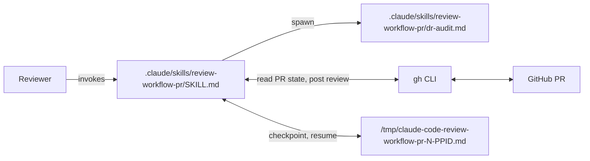

# review-workflow-pr

## Design Document
[design.md](design.md)

## High-level plan

### Goals

Deliver a new user-invocable skill named `review-workflow-pr` that helps a
human reviewer evaluate a workflow-style PR's design document, implementation
plan, and track files, and submit either an approval or a request-changes
review with line-anchored comments back to the PR. The skill enters research
mode on invocation (similar to `/create-plan`), free-form Q&A driven by the
reviewer, with the skill auto-recording observations during its own analysis
or when sub-agents return findings. At wrap-up the reviewer prunes the list,
the skill composes a single bulk review and posts it via `gh api`.

### Constraints

- The skill lives under `.claude/skills/review-workflow-pr/` so the harness
  auto-registers it. `user-invocable: true` is set in the frontmatter.
- The reviewer pre-checks-out the PR locally (`gh pr checkout <N>`). The skill
  verifies `HEAD` matches the PR head SHA before loading the artifacts.
- The skill is read-only with respect to the artifacts under review. It never
  edits `design.md`, `implementation-plan.md`, or any `plan/track-*.md` on the
  branch being reviewed.
- Line-anchored multi-comment review submission cannot use `gh pr review`
  (single body only). The skill posts via `gh api -X POST
  /repos/{owner}/{repo}/pulls/{N}/reviews` with a JSON payload that contains
  `event`, `body`, `commit_id`, and `comments[]`.
- House-style applies to the skill's own Markdown (SKILL.md, dr-audit.md) per
  `conventions.md` §1.5.

### Architecture Notes

#### Component Map

- **`SKILL.md`**: entry point for `/review-workflow-pr`. Owns argument
  parsing, PR resolution, HEAD verification, workflow-doc loading, artifact
  enumeration, research-mode Q&A, observation list state, and the
  end-of-session submission flow.
- **`dr-audit.md`**: new sub-agent prompt. Spawned on demand to audit each
  Decision Record in `implementation-plan.md` for real-alternative content,
  grounded rationale, named risks/caveats, and a track reference that
  resolves. Returns a structured findings list.
- **`gh` CLI**: used for PR metadata reads (`gh pr view`, `gh repo view`)
  and the bulk review POST (`gh api`).
- **GitHub PR**: destination for the submitted review.
- **Handoff file**: per-PR Markdown file under `/tmp` written on explicit
  reviewer checkpoint. Captures PR ref, head SHA, observation list,
  sub-agent dispatch log, and reviewer notes. Deleted on successful
  submission.

#### D1: Use `gh api` for line-anchored bulk review submission

- **Alternatives considered**: `gh pr review --request-changes --body` (single
  overall comment, no line anchors); a sequence of `gh pr comment` calls (one
  thread per observation, no unified review).
- **Rationale**: only `POST /repos/{owner}/{repo}/pulls/{N}/reviews` accepts a
  `comments[]` array of file/line-anchored items inside a single review
  object. That is the only mechanism that lets one approve-or-request-changes
  review carry many code-anchored comments.
- **Risks/Caveats**: the JSON payload must include `commit_id` equal to the
  current PR head SHA. If the head moves between fetch and submit the post
  fails. Mitigated by re-fetching the head SHA just before posting and
  failing closed when the head has moved.
- **Implemented in**: Track 2
- **Full design**: design.md §"gh-api submission payload"

#### D2: Author a new focused DR-audit sub-agent prompt

- **Alternatives considered**: embed Decision Record audit logic inline in
  SKILL.md; reuse `structural-review.md` or `technical-review.md` from
  `.claude/workflow/prompts/` wholesale; reuse `design-review.md` as a
  catch-all cold-read.
- **Rationale**: Decision Record criteria are scattered across
  `planning.md` and `structural-review.md` and do not extract cleanly, so a
  focused new prompt is simpler than carving them out. Cold-read of the
  design itself is intentionally outside this skill's scope; the reviewer
  can invoke the existing cold-read flow as a separate skill in the same
  session if they want one.
- **Risks/Caveats**: the new prompt is a small surface to maintain, but its
  output format must stay aligned with the orchestrator's findings-to-
  observation translation in SKILL.md.
- **Implemented in**: Track 2 (new DR-audit prompt and dispatch)
- **Full design**: design.md §"DR-audit sub-agent and findings translation"

#### D3: Free-form Q&A with auto-recorded observations; reviewer prunes at submit

- **Alternatives considered**: structured walkthrough (skill drives a fixed
  sequence through design then DRs then tracks); reactive-only (skill never
  auto-flags, only records when the reviewer explicitly says so).
- **Rationale**: matches the `/create-plan` research-mode pattern the
  reviewer already knows. Auto-record reduces friction during analysis. The
  end-of-session prune step keeps the reviewer in control of what reaches
  the PR.
- **Risks/Caveats**: the observation list can grow large during a long
  session. Mitigated by the explicit prune step at submission time, where
  the reviewer sees the full numbered list and can drop entries by index or
  by source tag.
- **Implemented in**: Track 1
- **Full design**: design.md §"Observation list lifecycle"

#### D4: Require PR pre-checkout; verify HEAD matches PR head SHA

- **Alternatives considered**: fetch artifacts via `gh api` without a local
  checkout; auto-detect both modes.
- **Rationale**: with files on disk, line numbers in observations map
  directly to file line numbers, which then go into the `gh api` payload as
  `line` + `side=RIGHT`. Without a checkout, mapping back to PR-diff
  positions is significantly more complex and brittle.
- **Risks/Caveats**: the reviewer must remember to run `gh pr checkout`
  first. Mitigated by the skill's preflight error message naming the exact
  `gh pr checkout <ref>` command to run.
- **Implemented in**: Track 1
- **Full design**: design.md §"HEAD-SHA verification"

#### D5: Reviewer-driven handoff in `/tmp` with PR + PID-glob resume

- **Alternatives considered**: user-global memory
  (`~/.claude/.../memory/`), which has wrong scope and pollutes the
  global memory index; in-workflow-dir handoff at
  `docs/adr/<dir>/_workflow/handoff-review-*.md`, which violates the
  skill's read-only invariant against artifacts under review;
  auto-triggers on context-pressure or pre-dispatch, which add polling
  and hidden writes; or no handoff at all, which loses expensive
  observation lists on `/clear`.
- **Rationale**: `/tmp` with `$PPID` suffix matches the project
  temp-file isolation rule. Reviewer-driven only keeps the skill
  simple: no polling, no hidden writes. PR-keyed glob (`...-<N>-*.md`)
  handles the new-shell case where `$PPID` changes but the PR number
  does not.
- **Risks/Caveats**: a `/clear` without an explicit checkpoint loses
  the observation list. The skill warns at session start that the
  reviewer is responsible for asking. `/tmp` lifetime: most systems
  clean `/tmp` on reboot.
- **Implemented in**: Track 3
- **Full design**: design.md §"Handoff and resume"

### Invariants

- Every observation in the submission payload has a `path` that is present
  in the PR's changed file set and a `line` that falls within the file's
  current content. Verified before composing the JSON payload.
- The skill never modifies the workflow artifacts on the branch under
  review. No `Edit`, `Write`, or `git commit` against those files.
- The PR submission step requires explicit user confirmation. No silent
  posting.
- The handoff file at `/tmp/claude-code-review-workflow-pr-<N>-$PPID.md`
  is written only when the reviewer explicitly asks. The skill never
  auto-writes on context-pressure, pre-dispatch, or submission-failure
  events.

### Integration Points

- `gh pr view <ref> --json headRefOid,number,files` reads PR metadata at
  session start and again at submission. `files`-element shape and the
  `.path` access pattern are documented in design.md §"gh-api submission
  payload".
- `gh repo view --json nameWithOwner` resolves owner/repo for the API path.
- `gh api -X POST /repos/{owner}/{repo}/pulls/{N}/reviews --input -` posts
  the bulk review with the composed JSON payload on stdin.
- Sub-agent spawn target: `.claude/skills/review-workflow-pr/dr-audit.md`
  (new).
- Filesystem path: `/tmp/claude-code-review-workflow-pr-<N>-$PPID.md`
  (handoff write target; PR-keyed glob `<N>-*.md` on resume).

### Non-Goals

- Reviewing track decomposition correctness (sizing, dependencies, scope
  indicators).
- House-style compliance review.
- Cross-artifact consistency review (plan / design / track-file name and
  reference alignment).
- Running the `design.md` mutation discipline (`edit-design`) as part of
  review.
- Supporting non-workflow PRs (the skill assumes `docs/adr/<dir>/_workflow/`
  exists in the checkout and aborts cleanly when it does not).
- Automatic handoff triggers (context-pressure polling, pre-dispatch
  checkpoints, submission-failure fallback). Handoff is reviewer-driven
  only.

## Checklist

- [x] Track 1: Skill scaffolding and research-mode runtime
  > Deliver a usable skill stub that resolves the PR identifier, verifies
  > the local checkout matches the PR head, loads the workflow review
  > context, discovers the workflow artifacts, and enters research-mode Q&A
  > with the reviewer. Observations detected during analysis are
  > auto-recorded into an in-conversation list. The end-of-session step is
  > stubbed for this track (prints the observation list as plain text
  > without PR posting), so the runtime can be exercised end-to-end before
  > Track 2 adds the DR-audit sub-agent and the `gh api` submission
  > machinery.
  >
  > **Track episode:**
  > Landed the user-invocable skill `.claude/skills/review-workflow-pr/SKILL.md` with frontmatter and five filled sections (Invocation contract, Preflight, Artifact discovery, Research mode, End-of-session stub) across five clean steps. Phase C surfaced one four-way-convergent blocker: the `## Invocation contract` section was an unfilled placeholder that no Phase A step owned (the decomposition assigned only "section-header outline" to Step 1 and four prose-fill steps to the other four sections, leaving the invocation contract orphaned). The fix landed inline in Phase C iteration 1 rather than spawning a new step or deferring to Tracks 2 / 3. Two `steroid_execute_code` hazards surfaced during implementation are durable for Tracks 2 and 3 skill-prose-injection spawns: triple-quoted Kotlin multi-line strings preserve code-side indentation in the written file (corrupts Markdown), and `findProjectFile(<absolute-path>)` returned null inside the open project's root on one spawn while `LocalFileSystem.getInstance().refreshAndFindFileByPath(<abs>)` worked on the same path. Use the joined-list form for multi-line Markdown injection and the `LocalFileSystem` path resolver. Phase C also tightened the `research.md` lazy-load discipline; the prior eager session-start load was replaced with an inline research-mode rubric so all four cited workflow docs now load lazily on their named triggers.
  >
  > **Track file:** `plan/track-1.md` (5 steps, 0 failed)
  >
  > **Strategy refresh:** CONTINUE — no downstream impact detected. Track 1's three durable discoveries (`.claude/skills/**` ephemeral-identifier scope, `steroid_execute_code` triple-quoted-string indentation hazard, `findProjectFile` null on in-project absolute paths) propagate to Track 2 via `prior_episodes`. Phase C deferrals (WP7 `dr-audit.md` directory pin, WI4 sub-agent source, WB4 body length cap, drop-by-source-tag numeric-name ambiguity, `path:line` table-escape) land naturally in Track 2's planned DR-audit prompt + observation validation + prune step.

- [ ] Track 2: DR-audit sub-agent and PR submission
  > Author the DR-focused sub-agent prompt under the skill directory and
  > add the gh-api submission machinery. The DR audit walks each Decision
  > Record in `implementation-plan.md` and surfaces gaps in alternatives,
  > rationale, risks, and track references. The submission step composes a
  > JSON payload for the `pulls/{N}/reviews` endpoint, asks the reviewer to
  > confirm once, and POSTs the review (approve when the observation list
  > is empty, request-changes otherwise).
  > **Scope:** ~3-4 steps covering DR-audit prompt authoring, observation
  > validation against the PR's changed-file set, JSON payload composition
  > and `gh api` invocation, and end-of-session confirmation flow with
  > approve/request-changes branching.
  > **Depends on:** Track 1

- [ ] Track 3: Handoff writer and resume path
  > Add the reviewer-driven handoff mechanism. The skill writes a Markdown
  > file under `/tmp/` when the reviewer asks to checkpoint. On
  > re-invocation against the same PR the skill discovers the handoff via
  > a PR-keyed glob and offers to resume; resume re-verifies HEAD against
  > the saved head SHA, reloads the observation list and the sub-agent
  > dispatch log, and re-presents the list to the reviewer. The file is
  > deleted on successful submission.
  > **Scope:** ~3 steps covering handoff file format and writer, PR-keyed
  > discovery glob on re-invocation, and resume-path HEAD re-verification
  > and state reload.
  > **Depends on:** Track 2

## Plan Review
- [x] Plan review (consistency + structural) — passed at iteration 2

**Auto-fixed (mechanical)**: CR1 (dropped invalid `baseRepository` field from `gh pr view --json` across plan, track-1, design.md sequenceDiagram; added separate `gh repo view --json nameWithOwner` call in design.md); CR2 (rewrote design.md `gh pr checkout` detached-HEAD claim to reflect default named-branch behavior); CR3 (rewrote track-2.md GitHub-required-fields paragraph to accurately separate GitHub's contract from what the skill sends); CR4 (clarified `files`-array element shape across plan and design.md); S2 (trimmed Integration Points first bullet from 4 lines to 3, deferred element-shape detail to design.md).

**Escalated (design decisions)**: S1 — Track 1 scope `~3-4 steps` mismatched its 5-step Plan of Work enumeration. User chose to bump scope to `~4-5 steps` and align the scope line with the five planned work items.

## Final Artifacts
- [ ] Phase 4: Final artifacts (`design-final.md`, `adr.md`)
