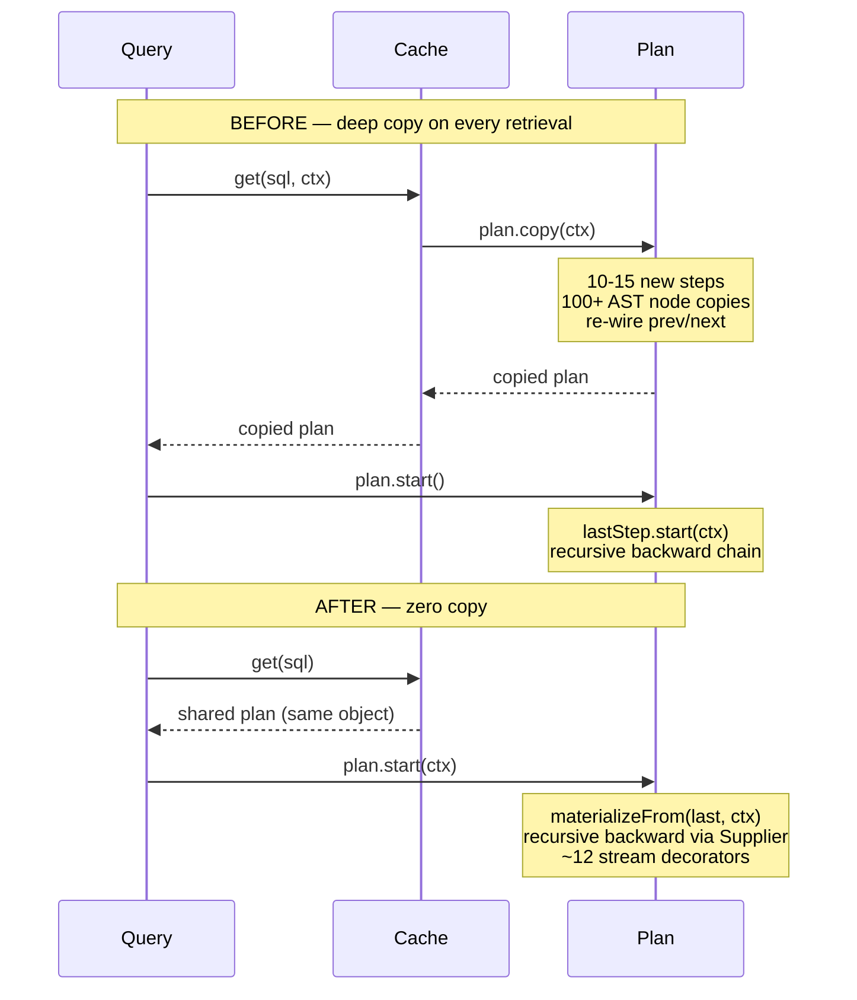
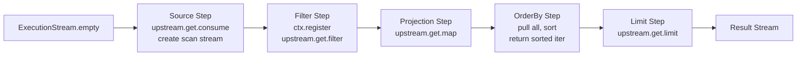
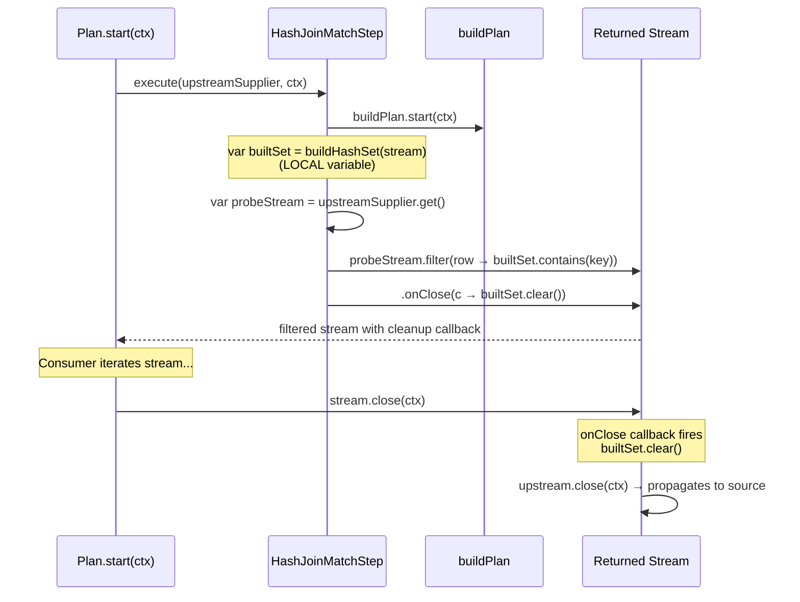
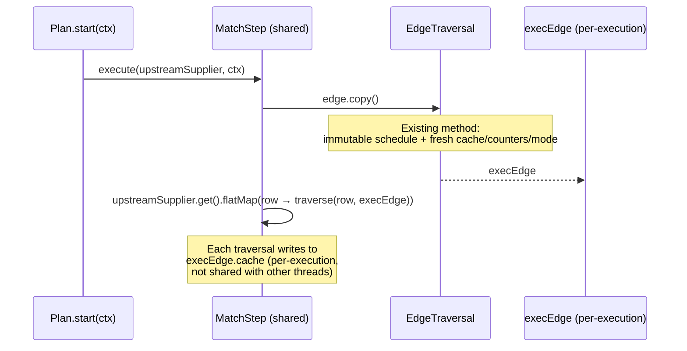

# Functional Execution Steps — Zero-Copy Plan Cache Design

## 1. Problem

CPU profiling of LDBC IS1 (8 threads, measured before #918/#946/#904 were
merged) shows ~6% of CPU spent on defensive deep-copying of cached SQL
execution plans. The hotspots are intrinsic to per-execution `copy()` and
`toGenericStatement()` — independent of which step subclasses populate
the plan — so the analysis carries forward unchanged across the merges of
the hash-join, back-ref hash-join, index-assisted-traversal, and prefilter
PRs. Re-profiling on a post-merge baseline is part of the rollout (see
§13 step 1).

| Hotspot | CPU % | What happens |
|---------|-------|-------------|
| `SimpleNode.toGenericStatement` | 3.6% | Full AST traversal generating an unused string — dead code |
| `SQLSuffixIdentifier.copy` | 1.5% | Recursive deep-copy of AST leaf nodes during plan cache retrieval |
| `SelectExecutionPlan.copyOn` | 1.0% | Orchestrates copying entire step chain + AST on every cache hit |

### Root cause

Execution steps embed per-execution mutable state (`ctx`, `prev`, `next`,
`alreadyClosed`) alongside immutable configuration (AST references, flags).
This makes plans non-shareable — every cache retrieval must deep-copy the
entire plan to avoid cross-execution state corruption.

```
Current flow (every query execution):
  cache.get("SELECT ...") → plan.copy(ctx)
    → allocate 10-15 new step instances
    → re-wire prev/next chain
    → deep-copy all AST nodes (100+ allocations, recursive tree walks)
    → return copied plan
  plan.start() → execute query
```

Additionally, `toGenericStatement()` is called on every `createExecutionPlan()`
— even on cache hits — producing a string stored in the plan but never read
by any production code. This accounts for the largest single hotspot.

## 2. Target model

Steps become pure functions, **shareable across plans and concurrent
executions**. The plan holds an immutable list of steps. The cache stores
plans directly and returns them with **zero copies**.

Dispatch direction stays **backward (pull)** — same as today. Each step's
`execute()` decides when to materialize upstream by calling
`upstream.get()`, so any `ctx` side effect that must happen before the
predecessor runs (today: `FilterStep.registerBooleanExpression()`) keeps
working bit-for-bit.

```java
// Step interface — a pure function, no instance state.
// upstream is lazy: the step decides when to materialize the predecessor.
interface ExecutionStep {
    ExecutionStream execute(Supplier<ExecutionStream> upstream, CommandContext ctx);
    boolean canBeCached();
    String prettyPrint(int depth, int indent);
}

// Plan execution — recursive backward descent (today's semantics, no chain wiring)
class SelectExecutionPlan {
    private final List<ExecutionStep> steps;

    public ExecutionStream start(CommandContext ctx) {
        return materializeFrom(steps.size() - 1, ctx);
    }

    private ExecutionStream materializeFrom(int idx, CommandContext ctx) {
        if (idx < 0) {
            return ExecutionStream.empty();
        }
        return steps.get(idx).execute(
            () -> materializeFrom(idx - 1, ctx),  // lazy upstream
            ctx);
    }
}

// Cache — no copy anywhere
class YqlExecutionPlanCache {
    void putInternal(String sql, ExecutionPlan plan, DatabaseSessionEmbedded db) {
        cache.put(sql, plan);             // store directly — plan is fully built and immutable
    }

    ExecutionPlan getInternal(String sql, ...) {
        return cache.getIfPresent(sql);   // return directly — zero copy
    }
}
```

```
New flow (every query execution):
  cache.get("SELECT ...") → plan  (same object, zero allocations)
  plan.start(ctx)
    → terminal step.execute(supplier, ctx)
       supplier.get() recurses one position back, lazily building the chain
    → returns ~12 stream decorators, same as today
```

**Why Supplier rather than eager upstream.** With an eager
`ExecutionStream` parameter, the plan would have to materialize the
predecessor before calling the current step's `execute()` — the same
forward-init semantics as a `for` loop. That breaks
`FilterStep.registerBooleanExpression()` and any other backward-order
`ctx` dependency. The lazy `Supplier` preserves today's order: a step's
`execute()` body runs to completion (registering, configuring,
short-circuiting) *before* the predecessor is invoked, exactly as
`prev.start(ctx)` works today.

The Supplier closure allocation (one per step per execution, ~10-15
per plan) is negligible compared to the ~120 allocations eliminated by
removing `copy()`.

### What goes away

| Component | Removed |
|-----------|---------|
| `prev`, `next`, `alreadyClosed`, `ctx` | Fields from `AbstractExecutionStep` |
| `copy(CommandContext)` | From all ~76 step classes |
| `copyOn()` | From `SelectExecutionPlan` |
| `copy()` in cache put/get | From `YqlExecutionPlanCache` |
| `genericStatement` field/getter/setter | From plan classes + 11 statement classes |
| `sendTimeout()` backward chain | From `AbstractExecutionStep` + all steps |
| `reset()` | From `ExecutionStepInternal` (see §9) |
| `setPrevious()` / `setNext()` | From `ExecutionStepInternal` |
| Instance fields in stateful steps | `hashSet`/`hashMap`, `neighborRids`, `reachableRids`, BackRefHashJoinStep's LRU `cache` + 7 per-binding/cost-model fields, MatchStep/IndexOrderedEdgeStep's `EdgeTraversal` per-execution fields (~15 — see §4.3) |

### New `ExecutionStep` interface

The current `ExecutionStepInternal` interface has ~20 methods, many of which
assume mutable state (`sendTimeout()`, `setPrevious()`, `setNext()`,
`close()`, `reset()`, `copy()`). The functional model replaces it with a
minimal interface:

```java
public interface ExecutionStep {
    /**
     * Transforms an upstream result stream, producing a new stream.
     *
     * <p>The {@code upstream} argument is a lazy supplier — the step
     * decides when to materialize the predecessor by calling
     * {@code upstream.get()}. This preserves today's backward-pull
     * semantics: any work the step needs to do <em>before</em> the
     * predecessor executes (e.g. registering an expression in {@code ctx}
     * so an upstream LET sees it) goes before that call.
     *
     * <p>Source steps drain upstream after materializing it (for setup
     * side effects) and return their own stream. Transformer steps
     * materialize upstream and wrap it with filtering, mapping, sorting.
     *
     * <p><b>Thread safety contract:</b> Per-execution state must live in
     * local variables or stream closures, never in instance fields. Steps
     * are shared across concurrent executions via the plan cache.
     */
    ExecutionStream execute(Supplier<ExecutionStream> upstream, CommandContext ctx);

    /** True if this step's configuration allows plan caching. */
    boolean canBeCached();

    /**
     * Human-readable representation for EXPLAIN / PROFILE output.
     *
     * <p>Takes a {@code CommandContext} because per-execution diagnostics
     * (prefilter counters on MatchStep, cost-model memos on
     * BackRefHashJoinStep) live on per-execution state objects that the
     * step published into {@code ctx} during {@code execute()} — see §5
     * "PROFILE output access". Static EXPLAIN (no preceding execute) is
     * supported by passing the ctx that was used for EXPLAIN itself; the
     * step's PROFILE code path treats a missing runtime as "no counters".
     */
    String prettyPrint(CommandContext ctx, int depth, int indent);

    /**
     * Cost in nanoseconds for profiling display. Reads {@code ctx.getStats(this)}
     * — each CommandContext owns its own IdentityHashMap keyed by step
     * instance, so concurrent executions over the same shared step write
     * to disjoint maps. Default returns 0 (no cost recorded).
     */
    default long getCost(CommandContext ctx) {
        var stats = ctx.getStats(this);
        return stats != null ? stats.getCost() : 0L;
    }

    /** Returns sub-execution plans for EXPLAIN display (immutable list). */
    default List<InternalExecutionPlan> getSubExecutionPlans() {
        return Collections.emptyList();
    }

    /** Serializes this step for persistent plan storage. */
    default Result serialize(DatabaseSessionEmbedded session) {
        return new ResultInternal(session);
    }
}
```

`prettyPrint` and `getCost` both take `CommandContext` so the shared-step
model has a single uniform way of locating per-execution state: through
`ctx`, never through `this`. There is no separate "profiling-aware"
sub-interface — profiling is just a default `getCost` returning 0 when no
stats were recorded.

Methods removed vs `ExecutionStepInternal`:
- `start(CommandContext)` → replaced by `execute(upstream, ctx)`
- `internalStart(CommandContext)` → replaced by `execute(upstream, ctx)`
- `close()` → handled by stream chain (§6)
- `sendTimeout()` → removed, dead signal (§7)
- `setPrevious()` / `setNext()` → no linked list
- `reset()` → removed, incompatible with immutability (§9)
- `copy(CommandContext)` → not needed, steps are shared
- `getSubSteps()` → returns `Collections.unmodifiableList()`
- `setProfilingEnabled()` → removed; profiling is decided per-execution by
  the plan, not stored on the step

Control-flow steps (IfStep, ForEachStep, RetryStep, ScriptLineStep) remain
on the old `ExecutionStepInternal` interface — they live in
`ScriptExecutionPlan`/`IfExecutionPlan` which have their own execution model
and are not cached.

## 3. Adjacent PRs and their impact

Several PRs touch the executor in ways that interact with this design.
Baseline: `origin/develop` at #1056 plus the four feature branches listed
below. Develop has since moved forward (#1057+ are tooling /
workflow-machinery commits, none of which touch the executor) — the
analysis below holds against current develop HEAD without changes.

- **Merged into develop**: #869 (YTDB-634 Lazy ExecutionStream), #918
  (YTDB-592 Hash join NOT/multi-branch MATCH), #946 (YTDB-650 Back-reference
  hash join), #904 (YTDB-644 Index-assisted edge-method MATCH), #923
  (YTDB-645 MATCH pre-filter test suite).
- **On feature branch, approved**: #973 (YTDB-651 Prefilter selectivity
  fix) — branch `prefilter-selectivity-fix`. This design doc treats that
  branch HEAD as the post-merge baseline; rebase before landing the
  functional migration so the prefilter-selectivity changes have already
  reached develop.
- **On feature branch, in review**: #880-equivalent (YTDB-635
  Index-ordered MATCH) on `index-ordered-match`.

The "Adjacent PRs" sub-headings below tag each as merged / open against
the branches above, not against an absolute develop SHA — so the section
stays accurate as develop advances on unrelated commits.

This section documents the impact of each on the functional migration.

### Lazy RID-only iteration for MATCH traversal steps (merged)

**Changes:** `MatchEdgeTraverser` lazily iterates LinkBag entries by RID via
`PreFilterableLinkBagIterable`, with pre-filter book-keeping
(`TraversalPreFilterHelper`, `PreFilterSkipReason`, mutable
`currentPreFilterRids` field on the traverser).

**Impact on functional model:**
- `MatchEdgeTraverser` is a per-execution object created inside
  `MatchStep.createTraverser()` — already per-execution, not shared. The new
  `currentPreFilterRids` field is per-execution mutable state, scoped to
  one traverser instance.
- No new step classes. No new mutable state on shared steps.
- **No design impact.** The traverser changes remain transparent to the
  functional step model — provided `MatchStep.createTraverser()` keeps
  allocating a fresh traverser per row (already true).

### Index-ordered MATCH — IndexOrderedEdgeStep (open, `index-ordered-match` branch)

**New classes:**
- **`IndexOrderedEdgeStep`** — MATCH step that scans a property index in
  ORDER BY direction, filtered by a RidSet from the source vertex's LinkBag.
  Has `canBeCached() = false` (holds live `Index` reference).
- **`RidFilteredIndexValuesStep`** — extends `FetchFromIndexValuesStep`,
  filters index scan by a pre-computed RidSet.
- **`IndexOrderedCostModel`** — pure static cost model (no state).

**Modified classes:**
- **`OrderByStep`** — gains `primaryKeySortedInput` (SQLOrderByItem) and
  `indexOrderedUpstream` (boolean) fields for early termination and
  pass-through when upstream is pre-sorted. Both are immutable config.
- **`FetchFromIndexStep`** — two methods changed from `private` to
  `protected` (`readResult`, `updateIndexStats`) for subclass access.

**Impact on functional model:**
- **`IndexOrderedEdgeStep`** — category 3.3 (stateful). Holds `Index`
  (immutable config) and `EdgeTraversal` (has mutable cache). In `execute()`,
  the EdgeTraversal cache must be per-execution via `edge.withFreshCache()`.
  The `Index` reference is immutable — safe to share.
  `canBeCached() = false` currently blocks plan caching entirely. In the
  functional model, the step becomes shareable (no mutable fields, edge cache
  isolated per-execution), so `canBeCached()` can return `true` — enabling
  plan caching for MATCH queries with index-ordered traversal.
- **`RidFilteredIndexValuesStep`** — category 3.2 (source step). Holds
  immutable `RidSet ridFilter` and `IndexSearchDescriptor`. No mutable state.
  Migration is mechanical.
- **`OrderByStep`** changes — new fields are immutable config. No impact on
  migration (already category 3.1 transformer).

### Hash join for NOT and multi-branch MATCH patterns (merged)

**New classes:**
- **`HashJoinMatchStep`** — STATEFUL. Holds mutable `hashSet`/`hashMap`
  fields written in `internalStart()`, nullified in `close()`. Also holds
  `buildPlan` (SelectExecutionPlan) for the build side. Has
  `canBeCached()` delegating to `buildPlan.canBeCached()`.
- **`CorrelatedOptionalHashJoinStep`** — STATEFUL. Holds mutable
  `neighborRids`/`lastCorrelatedRid` fields rebuilt per correlated alias.
  Has `canBeCached() = true`.
- **`InvertedWhileHashJoinStep`** — STATEFUL. Holds mutable `reachableRids`
  field built eagerly in `internalStart()`. Has `canBeCached() = true`.
- **`JoinKey`** / **`JoinMode`** — immutable value types.

**Impact on functional model:**
- All three stateful steps are covered in §4.3 with full before/after code
  examples. Their mutable fields move to local variables captured in stream
  closures.
- `HashJoinMatchStep.buildPlan` is immutable config — in the functional
  model, `buildPlan.start(ctx)` creates fresh streams per execution.
- `canBeCached()` for HashJoinMatchStep delegates to buildPlan — this works
  correctly in the functional model since the build plan is also shared.

### Back-reference hash join — BackRefHashJoinStep (merged, #946 / YTDB-650)

**New classes:**
- **`BackRefHashJoinStep`** — STATEFUL. Replaces a target `MatchStep` for
  three semi-join patterns (vertex back-ref equality, edge-chain with
  back-ref equality on the inner vertex, and `NOT IN` anti-semi-join).
  Holds an LRU `LinkedHashMap<RID, Object> cache` (256 entries, keyed by
  back-referenced binding RID) plus per-binding accumulators
  (`cachedIndexRidSet`, `indexRidSetResolved`, `accumulatedLinkBagTotal`,
  `backRefsContributedToAccumulator`) and adaptive cost-model memos
  (`cachedIndexLookupSelectivity`, `cachedLoadToScanRatio`,
  `indexLookupRejected`). All are mutable instance fields today.
- **`SemiJoinDescriptor`** (sealed interface) and three records:
  **`SingleEdgeSemiJoin`**, **`ChainSemiJoin`**, **`AntiSemiJoin`** —
  immutable value types describing the join pattern. Safe to share.

**Impact on functional model:**
- Category 3.3 (stateful) — the largest single migration target. The LRU
  `cache` is genuinely per-execution (cache hit rate depends on the order
  of upstream bindings, which differs across concurrent queries). All
  eight mutable fields must move to local variables / a per-execution
  state record captured in a stream closure.
- The cost-model memos (`cachedIndexLookupSelectivity`,
  `cachedLoadToScanRatio`, `indexLookupRejected`) currently amortize a
  decision across rows of the *same* execution. Preserve that scope by
  putting them on the per-execution state object; do not promote them to
  step-level (would cause cross-query leakage of selectivity decisions
  trained on a different data shape).
- `canBeCached()` currently returns true when the fallback edge build is
  cacheable. Functional-model migration keeps this delegation; the per-
  execution state object replaces the instance fields and lets the step
  itself be shared.

### Prefilter selectivity fix (#973 / YTDB-651, about to merge)

**Changes:**
- **`RidFilterDescriptor`** sealed hierarchy expanded to **four variants**
  (`DirectRid`, `EdgeRidLookup`, `IndexLookup`, `Composite`). New method
  `passesSelectivityCheck(resolvedSize, linkBagSize, ctx)` dispatches per
  type: `DirectRid` always passes, `EdgeRidLookup` uses per-vertex overlap
  ratio (`edgeLookupMaxRatio` default 0.8), `IndexLookup` uses class-level
  selectivity (`indexLookupMaxSelectivity` default 0.95), `Composite`
  passes if any child passes. All four are records or immutable structs.
- **`IndexSearchDescriptor.cacheFingerprint()`** — new method including
  `indexName`, `keyCondition`, `additionalRangeCondition`. Replaces the
  prior `index.getName()`-only `cacheKey` so two `IndexLookup`s on the
  same index but different conditions cannot alias inside `EdgeTraversal`'s
  per-execution cache.
- **`EdgeTraversal.checkIndexLookupAmortization()`** — adds a per-edge
  cost-model memoized `Mode` (UNDETERMINED → BUILD_EAGER /
  DEFERRED_WITH_NET) plus `accumulatedLinkBagTotal` running sum and a
  cached `loadToScanRatio` (default 100, override via
  `youtrackdb.query.prefilter.loadToScanRatio`). All three are
  per-execution mutable on the `EdgeTraversal` instance — already covered
  by §4.3's per-execution-via-`copy()` story.
- **`canCache(key)` helper + `BUILD_FAILED` skip reason** — the rescue
  path in `resolveWithCache` and the cold path of failed `desc.resolve()`
  both now store an explicit skip reason in `cachedSkipReasons`. Also
  per-execution `EdgeTraversal` state.
- **`PreFilterSkipReason`** enum gains `BUILD_NOT_AMORTIZED`,
  `OVERLAP_RATIO_TOO_HIGH`, `BUILD_FAILED`. Enum — immutable, safe.
- **`GlobalConfiguration`** gains five hot-reloadable keys
  (`QUERY_PREFILTER_*`). Read via `TraversalPreFilterHelper` accessors at
  execution time — static global state, no shared-step concern.
- **`MatchStep.appendPreFilterStats()`** — new PROFILE/EXPLAIN diagnostic
  reading per-edge counters from `EdgeTraversal`.
- **`BackRefHashJoinStep`** (+129 lines) — adopts the same amortization
  guard, contributes its `cachedLoadToScanRatio` /
  `cachedIndexLookupSelectivity` / `indexLookupRejected` memos.
- **Iterator infrastructure** — `EdgeFromLinkBagIterable`,
  `EdgeFromLinkBagIterator`, `VertexFromLinkBagIterable`,
  `VertexFromLinkBagIterator`, `PreFilterableLinkBagIterable`,
  `IteratorExecutionStream` gain prefilter book-keeping. All are
  per-iteration objects (one per upstream row), not shared step state.

**Impact on functional model:**
- **All new mutable state is per-execution.** Cost-model memos
  (`Mode`, `accumulatedLinkBagTotal`, `cachedLoadToScanRatio`),
  `cachedSkipReasons`, prefilter counters — every one lives on
  `EdgeTraversal`. The functional migration already isolates these via
  `edge.copy()` (§4.3); no new mechanism needed.
- **All new shared (config) state is immutable.** `RidFilterDescriptor`
  variants are records or final classes; `IndexSearchDescriptor` is
  immutable post-construction; `GlobalConfiguration` keys are read via
  static accessors. Nothing to add to §8's immutable-AST story.
- **`cacheFingerprint()` makes shared cache safe.** Without it, two
  shared `MatchStep`s with structurally distinct `IndexLookup`s could
  collide in `EdgeTraversal.cache`. The fingerprint includes the full
  search condition, eliminating the latent aliasing risk that the prior
  `index.getName()`-only key carried. **This is load-bearing for the
  shared-plan model** — without it, the zero-copy cache could produce
  wrong results when two MATCH queries differ only in index condition.
- **PROFILE output (`appendPreFilterStats`) reads per-execution
  counters.** Today on copied plans this works because `MatchStep`'s
  `edge` is the per-plan-copy `EdgeTraversal`. In the shared-step model,
  the counters live on the per-execution `edge.copy()` returned from
  `execute()`. PROFILE output is rendered after the stream is consumed,
  so the per-execution `EdgeTraversal` must be reachable at render time
  — see §5 "PROFILE output access" below.

### Summary: new step classification

| New step | Category | Mutable state | Migration |
|----------|----------|--------------|-----------|
| `IndexOrderedEdgeStep` (open #880) | 3.3 stateful | `EdgeTraversal.cache` | `edge.withFreshCache()` per execution |
| `RidFilteredIndexValuesStep` (open #880) | 3.2 source | None | Mechanical |
| `HashJoinMatchStep` (merged #918) | 3.3 stateful | `hashSet`, `hashMap`, `buildPlan` | Local vars + `onClose()` |
| `CorrelatedOptionalHashJoinStep` (merged #918) | 3.3 stateful | `neighborRids`, `lastCorrelatedRid` | Stateful closure |
| `InvertedWhileHashJoinStep` (merged #918) | 3.3 stateful | `reachableRids` | Local var |
| `BackRefHashJoinStep` (merged #946) | 3.3 stateful | LRU `cache` + 7 per-binding/cost-model fields | Per-execution state record in stream closure |

## 4. Step migration — four categories

### 4.1 Stream transformers (~45 classes) — mechanical rename

Steps that take upstream, transform it, return a new stream. The migration
is mechanical: `internalStart(ctx)` → `execute(upstream, ctx)`, replace
`prev.start(ctx)` with `upstream.get()`. Side-effect ordering (ctx
registration before predecessor materializes) carries over unchanged.

**FilterStep:**
```java
// BEFORE
protected ExecutionStream internalStart(CommandContext ctx) {
    ctx.registerBooleanExpression(whereClause.getBaseExpression());
    var resultSet = prev.start(ctx);
    resultSet = resultSet.filter(this::filterMap);
    if (timeoutMillis > 0) {
        resultSet = new ExpireResultSet(resultSet, timeoutMillis, this::sendTimeout);
    }
    return resultSet;
}

// AFTER — backward dispatch preserved via Supplier
public ExecutionStream execute(Supplier<ExecutionStream> upstream, CommandContext ctx) {
    // Register BEFORE materializing upstream — same as today
    ctx.registerBooleanExpression(whereClause.getBaseExpression());
    var resultSet = upstream.get().filter(
        (result, c) -> whereClause.matchesFilters(result, c));
    if (timeoutMillis > 0) {
        resultSet = new ExpireResultSet(resultSet, timeoutMillis,
            () -> { throw new TimeoutException("Timeout expired"); });
    }
    return resultSet;
}
```

**OrderByStep (materializing — pulls all upstream, sorts, returns):**

After PR #880, OrderByStep gains two new immutable config fields:
`primaryKeySortedInput` (SQLOrderByItem, enables early termination in bounded
heap) and `indexOrderedUpstream` (boolean, enables pass-through when upstream
is pre-sorted by IndexOrderedEdgeStep). Both are set at construction and
never mutated — they are safe to share.

```java
// BEFORE (after PR #880 merge)
protected ExecutionStream internalStart(CommandContext ctx) {
    if (prev == null) return ExecutionStream.empty();
    // Pass-through when upstream is pre-sorted (single-field ORDER BY)
    if (indexOrderedUpstream && primaryKeySortedInput == null
            && Boolean.TRUE.equals(
                ctx.getSystemVariable(CommandContext.VAR_INDEX_ORDERED_PRE_SORTED))) {
        return prev.start(ctx);
    }
    var results = init(prev, ctx);
    return ExecutionStream.resultIterator(results.iterator());
}

// AFTER
public ExecutionStream execute(Supplier<ExecutionStream> upstream, CommandContext ctx) {
    // Pass-through when upstream is pre-sorted (single-field ORDER BY)
    if (indexOrderedUpstream && primaryKeySortedInput == null
            && Boolean.TRUE.equals(
                ctx.getSystemVariable(CommandContext.VAR_INDEX_ORDERED_PRE_SORTED))) {
        return upstream.get();
    }
    var results = init(upstream.get(), ctx);
    return ExecutionStream.resultIterator(results.iterator());
}
```

**ProjectionCalculationStep:**
```java
// BEFORE
protected ExecutionStream internalStart(CommandContext ctx) {
    var parentRs = prev.start(ctx);
    return parentRs.map(this::mapResult);
}

// AFTER
public ExecutionStream execute(Supplier<ExecutionStream> upstream, CommandContext ctx) {
    return upstream.get().map(this::mapResult);
}
```

**Full list:** FilterStep, ProjectionCalculationStep,
AggregateProjectionCalculationStep, OrderByStep, LimitExecutionStep,
SkipExecutionStep, DistinctExecutionStep, UnwindStep, ExpandStep, BatchStep,
FilterByClassStep, CastToVertexStep, CastToEdgeStep, CheckClassTypeStep,
CheckRecordTypeStep, ConvertToResultInternalStep,
ConvertToUpdatableResultStep, CopyEntityStep,
CopyRecordContentBeforeUpdateStep, CountStep, DeleteStep,
GetValueFromIndexEntryStep, GuaranteeEmptyCountStep, InsertValuesStep,
RemoveEdgePointersStep, UnwrapPreviousValueStep, UpdateContentStep,
UpdateMergeStep, UpdateRemoveStep, UpdateSetStep, UpsertStep,
CheckSafeDeleteStep, TimeoutStep, AccumulatingTimeoutStep,
LetExpressionStep, GlobalLetExpressionStep,
RemoveEmptyOptionalsStep, ReturnMatchElementsStep,
ReturnMatchPathElementsStep, ReturnMatchPathsStep,
ReturnMatchPatternsStep, RidFilteredIndexValuesStep (PR #880).

### 4.2 Source steps (~20 classes) — drain upstream, create own stream

Steps that create a new stream from a data source (index scan, class scan,
RID list). They currently drain `prev` for side effects (setup steps like
`GlobalLetExpressionStep` store variables in ctx). In the functional model,
upstream is passed as a parameter and drained explicitly.

```java
// BEFORE
protected ExecutionStream internalStart(CommandContext ctx) {
    if (prev != null) {
        prev.start(ctx).close(ctx);   // drain predecessor for side effects
    }
    return createClassScanStream(ctx);
}

// AFTER
public ExecutionStream execute(Supplier<ExecutionStream> upstream, CommandContext ctx) {
    upstream.get().consume(ctx);       // materialize predecessor, drain, close
    return createClassScanStream(ctx);
}
```

`ExecutionStream.consume(ctx)` is a **new convenience method** added to the
`ExecutionStream` interface as a `default` method. It drains the stream for
side effects and closes it. `ExecutionStream.empty()` handles this correctly
(hasNext returns false immediately, close is a no-op).

```java
default void consume(CommandContext ctx) {
    try {
        while (hasNext(ctx)) { next(ctx); }
    } finally {
        close(ctx);
    }
}
```

CartesianProductStep and ParallelExecStep fit this category — they coordinate
multiple independent sub-plans but still accept and drain the upstream:

```java
// CartesianProductStep — source step with sub-plans
public ExecutionStream execute(Supplier<ExecutionStream> upstream, CommandContext ctx) {
    upstream.get().consume(ctx);  // drain (no-op if empty)
    return buildCrossJoinStream(ctx);  // from sub-plans
}
```

**Full list:** FetchFromClassExecutionStep, FetchFromIndexStep,
FetchFromCollectionExecutionStep, FetchFromRidsStep, FetchFromVariableStep,
FetchFromStorageMetadataStep, FetchFromDatabaseMetadataStep,
FetchFromIndexManagerStep, FetchFromIndexedFunctionStep, CountFromClassStep,
CountFromIndexStep, CountFromIndexWithKeyStep, EmptyStep,
EmptyDataGeneratorStep, ListSourceStep, CreateRecordStep, CreateEdgesStep,
FetchEdgesToVerticesStep, FetchEdgesFromToVerticesStep,
CartesianProductStep, ParallelExecStep.

### 4.3 Steps with per-execution state (6 classes) — state to closures

Steps that build per-execution data structures (hash sets, RID maps, caches)
and use them across the stream lifecycle. Instance fields are replaced by
local variables in `execute()`, captured in stream closures.

**IndexOrderedEdgeStep (PR #880) — EdgeTraversal cache + canBeCached:**

IndexOrderedEdgeStep replaces MatchStep for edges where an index scan in
ORDER BY direction is profitable. It holds an `EdgeTraversal` (mutable cache),
a live `Index` reference, and `SQLWhereClause targetFilter` (immutable AST).

Currently `canBeCached() = false` because the step holds a live `Index` object.
In the functional model, `Index` is immutable config (resolved at plan time,
invalidated on schema change via `MetadataUpdateListener`). The EdgeTraversal
cache is isolated per-execution via `withFreshCache()`. So `canBeCached()` can
return `true` — **enabling plan caching for MATCH queries with index-ordered
traversal** (currently skipped entirely).

```java
// BEFORE — canBeCached() = false, blocks plan caching
public boolean canBeCached() { return false; }

protected ExecutionStream internalStart(CommandContext ctx) {
    // ... builds RidSet from LinkBag, scans index filtered by RidSet
    // EdgeTraversal.cache written during traversal
}

// AFTER — shareable, canBeCached() = true
public ExecutionStream execute(Supplier<ExecutionStream> upstream, CommandContext ctx) {
    var execEdge = edge.copy();  // per-execution state (cache, mode, counters, ...)
    // ... same logic, materializing upstream.get() at the natural point
    // Index reference is immutable config — safe to share
}

public boolean canBeCached() { return true; }
```

**MatchStep — EdgeTraversal cache isolation:**

MatchStep holds an `EdgeTraversal` which has a mutable `HashMap cache` field
used for caching RID set lookups during edge traversal. This cache is
**per-execution state** — it must not be shared across concurrent executions.

```java
// BEFORE — shared EdgeTraversal with mutable cache
protected final EdgeTraversal edge;  // cache field written during execution

protected ExecutionStream internalStart(CommandContext ctx) {
    var resultSet = prev.start(ctx);
    return resultSet.flatMap(this::createNextResultSet);
}

// AFTER — create execution-scoped EdgeTraversal in execute()
public ExecutionStream execute(Supplier<ExecutionStream> upstream, CommandContext ctx) {
    // Per-execution EdgeTraversal: copies immutable schedule config,
    // leaves cache / counters / mode / cost-model memos at defaults.
    var execEdge = edge.copy();
    return upstream.get().flatMap(
        (row, c) -> createTraverser(row, execEdge).toStream(c));
}
```

**`EdgeTraversal.copy()` already implements per-execution isolation.** After
#918/#946/#904 and the prefilter machinery (#923), `EdgeTraversal` has ~15
mutable per-execution fields, not just one cache. Existing `copy()` already
partitions them correctly — it copies immutable schedule config and leaves
per-execution state at constructor defaults:

| Copied (immutable schedule / bind-independent) | Reset to default (per-execution) |
|----|----|
| `edge`, `out`, `leftClass`, `leftFilter`, `leftRid` (shared — see below) | `cache` (HashMap RidSet, cap 64) |
| `intersectionDescriptor`, `semiJoinDescriptor` | `cachedSkipReasons` (HashMap) |
| `acceptedCollectionIds` | `accumulatedLinkBagTotal` |
| `consumed`, `consumedPredecessor` | `indexLookupSelectivity` (NaN sentinel) |
| `forecastN` (depends on schema/schedule, not binding) | `mode` (Mode.UNDETERMINED) |
|  | `cachedEffectiveness` |
|  | `preFilterAppliedCount`, `preFilterSkippedCount` |
|  | `preFilterTotalProbed`, `preFilterTotalFiltered` |
|  | `preFilterBuildTimeNanos`, `preFilterRidSetSize` |
|  | `lastSkipReason` |

The functional model **reuses `EdgeTraversal.copy()` as the
"per-execution wrapper" factory** — no new `withFreshCache()` method
required. `MatchStep.execute()` calls `edge.copy()`; the resulting
instance is private to the current `execute()` invocation and the closures
it captures.

```java
// AFTER — call existing copy(), not a new withFreshCache()
public ExecutionStream execute(Supplier<ExecutionStream> upstream, CommandContext ctx) {
    var execEdge = edge.copy();  // existing method — fresh per-execution state
    return upstream.get().flatMap(
        (row, c) -> createTraverser(row, execEdge).toStream(c));
}
```

**Cost.** One `EdgeTraversal` shell allocation per
`MatchStep`/`IndexOrderedEdgeStep` per execution — orders of magnitude
cheaper than the current full plan deep-copy. **AST fragments
(`leftFilter`, `leftRid`) are shared across executions, not deep-copied.**
The current `EdgeTraversal.copy()` deep-copies them because today's full
plan deep-copy treats AST nodes as mutable; once §8's immutable-AST
contract is in place, `SQLWhereClause` / `SQLRid` and their sub-trees
are safe to share across threads. The functional migration drops the
AST deep-copy from `EdgeTraversal.copy()` in lockstep with the §8
changes — the shared-AST property is what makes this step's
per-execution wrapper a near-empty struct allocation, not a sub-tree
clone.

**Why none of EdgeTraversal's per-execution fields can be shared:**
1. `cache` and `cachedSkipReasons` are unsynchronized `HashMap`s — concurrent
   writes cause data races.
2. `cache` keys depend on `CommandContext` variables (`$parent`, `$matched`)
   which differ per execution — sharing produces incorrect cached results.
3. The prefilter counters (`preFilterAppliedCount`, `preFilterTotalProbed`,
   etc.) feed `flushEffectivenessMetric()` per-execution — cross-execution
   accumulation would skew metrics and adaptive decisions.
4. `mode`, `indexLookupSelectivity`, `accumulatedLinkBagTotal`,
   `cachedEffectiveness` drive adaptive cost-model decisions whose validity
   is scoped to the current query's data shape — sharing leaks decisions
   trained on a different binding into an unrelated query.
5. The current `EdgeTraversal.copy()` comment explicitly states: "Cache,
   cachedSkipReasons, accumulatedLinkBagTotal, indexLookupSelectivity,
   mode, metric references, and pre-filter counters are intentionally not
   copied — stale data from a previous execution must not leak into a new
   plan instance."

**HashJoinMatchStep — hash structures to local variables:**
```java
// BEFORE — mutable instance fields
@Nullable private Set<JoinKey> hashSet;
@Nullable private Map<JoinKey, List<Result>> hashMap;

protected ExecutionStream internalStart(CommandContext ctx) {
    if (joinType.isInner()) {
        hashMap = buildHashMap(ctx);
        if (hashMap == null) return nestedLoopFallback(ctx);
        var upstream = prev.start(ctx);
        return upstream.flatMap((row, c) -> mergeMatches(row, hashMap, c));
    } else {
        hashSet = buildHashSet(ctx);
        if (hashSet == null) return nestedLoopFallback(ctx);
        var upstream = prev.start(ctx);
        return upstream.filter((row, c) -> probeFilter(row, hashSet));
    }
}

public void close() {
    hashSet = null;
    hashMap = null;
    buildPlan.close();
    super.close();
}

// AFTER — local variables in closures, no instance state
public ExecutionStream execute(Supplier<ExecutionStream> upstream, CommandContext ctx) {
    if (joinType.isInner()) {
        var builtMap = buildHashMap(ctx);  // local variable
        var probeStream = upstream.get();
        if (builtMap == null) {
            return probeStream.flatMap((row, c) -> nestedLoopInnerJoin(row, c));
        }
        return probeStream
            .flatMap((row, c) -> mergeMatches(row, builtMap, c))
            .onClose(c -> builtMap.clear());
    } else {
        var builtSet = buildHashSet(ctx);  // local variable
        var probeStream = upstream.get();
        if (builtSet == null) {
            return probeStream.filter((row, c) -> nestedLoopProbe(row, c));
        }
        return probeStream
            .filter((row, c) -> probeFilter(row, builtSet))
            .onClose(c -> builtSet.clear());
    }
}
// No close() override. No instance fields.
// buildPlan is immutable config — buildPlan.start(ctx) creates fresh streams.
```

**InvertedWhileHashJoinStep:**
```java
// AFTER — reachableRids as local variable
public ExecutionStream execute(Supplier<ExecutionStream> upstream, CommandContext ctx) {
    var anchors = findAnchorVertices(ctx);
    if (anchors.isEmpty()) {
        return upstream.get().filter((row, c) -> null);  // reject all
    }
    var reachable = buildReachableSet(anchors, ctx);
    var ridToAnchor = buildRidToAnchorMap(anchors, reachable, ctx);
    return upstream.get().filter(
        (row, c) -> probeAndEnrich(row, reachable, ridToAnchor, c));
}
// No instance fields. No close() override.
```

**CorrelatedOptionalHashJoinStep:**
```java
// AFTER — per-row stateful closure (mutable state is per-stream, not per-step)
public ExecutionStream execute(Supplier<ExecutionStream> upstream, CommandContext ctx) {
    var state = new Object() {
        Set<RID> neighborRids = null;
        RID lastCorrelatedRid = null;
    };
    return upstream.get().map((row, c) -> {
        var currentRid = extractCorrelatedRid(row);
        if (state.neighborRids == null
                || !Objects.equals(currentRid, state.lastCorrelatedRid)) {
            state.neighborRids = buildNeighborSet(row, c.getDatabaseSession());
            state.lastCorrelatedRid = currentRid;
        }
        return enrichRow(row, state.neighborRids, c);
    });
}
// Mutable state captured in closure — scoped to this stream instance.
// Each plan.start(ctx) call creates a new closure with fresh state.
```

**BackRefHashJoinStep — per-execution state record:**

Eight mutable instance fields (LRU `cache`, `cachedIndexRidSet`,
`indexRidSetResolved`, `accumulatedLinkBagTotal`,
`backRefsContributedToAccumulator`, `cachedIndexLookupSelectivity`,
`cachedLoadToScanRatio`, `indexLookupRejected`) move to one mutable holder
allocated per `execute()` call and captured by the probe / build closures.
The probe path mutates the holder during a single execution; concurrent
executions see independent holders.

```java
// AFTER — per-execution state holder, no instance fields
private static final class ExecState {
  LinkedHashMap<RID, Object> cache;                // LRU, lazily created
  @Nullable RidSet cachedIndexRidSet;
  boolean indexRidSetResolved;
  long accumulatedLinkBagTotal;
  @Nullable HashSet<RID> backRefsContributedToAccumulator;
  double cachedIndexLookupSelectivity = Double.NaN;
  double cachedLoadToScanRatio = Double.NaN;
  boolean indexLookupRejected;
}

public ExecutionStream execute(Supplier<ExecutionStream> upstream, CommandContext ctx) {
  var state = new ExecState();
  return upstream.get()
      .flatMap((row, c) -> probe(row, state, c))
      .onClose(c -> {
        if (state.cache != null) state.cache.clear();
        state.cachedIndexRidSet = null;
        state.backRefsContributedToAccumulator = null;
      });
}
// build/probe helpers take ExecState as an explicit parameter
// instead of mutating `this`. The LRU semantics, cost-model memoization,
// and accumulator behavior are unchanged — only the holder moves.
```

The cost-model memos stay scoped to one execution (decisions trained on
the current data shape do not leak to a concurrent query). The
sentinel-based `BUILD_FAILED` cache entries continue to work; they live
in the same per-execution `cache`.

**MaterializedLetGroupStep — entryPlanCacheFlags:**

`MaterializedLetGroupStep` has a lazy `boolean[] entryPlanCacheFlags` field
computed once on first use. This moves to a local variable in `execute()`:

```java
public ExecutionStream execute(Supplier<ExecutionStream> upstream, CommandContext ctx) {
    upstream.get().consume(ctx);
    var cacheFlags = computeEntryPlanCacheFlags();  // local, computed once per execution
    var materializedBase = materializeBase(ctx);
    // ... use cacheFlags in per-entry execution
}
```

### 4.4 Control-flow steps (4 classes) — kept outside pipeline

Steps that implement scripting control flow. These operate at the
script/plan level, not the stream pipeline level. They remain on the old
`ExecutionStepInternal` interface within their respective plan types.

| Step | Used in | Why kept as-is |
|------|---------|----------------|
| IfStep | IfExecutionPlan | Evaluates condition, selects branch plan |
| ForEachStep | ScriptExecutionPlan | Iterates over expression values |
| RetryStep | ScriptExecutionPlan | Retry logic with exception handling |
| ScriptLineStep | ScriptExecutionPlan | Plan wrapper calling `executeInternal()` |

These plans are not cached in `YqlExecutionPlanCache` (`canBeCached()` is
typically false for script plans), so the zero-copy optimization does not
apply to them.

### Steps holding sub-plans

Several steps hold `InternalExecutionPlan` fields for sub-queries. These
fields are **immutable configuration** — sub-plans are started per-execution
via `subPlan.start(ctx)`, which creates fresh streams each time.

| Step | Sub-plan field | When started | Functional model |
|------|---------------|-------------|-----------------|
| SubQueryStep | `subExecutionPlan` | Once at start | `execute()`: start sub-plan, wrap results |
| GlobalLetQueryStep | `subExecutionPlan` | Once at start | `execute()`: start sub-plan, store result in ctx |
| LetQueryStep | `query` (SQLStatement), `previewPlan` (volatile, lazy EXPLAIN) | Per-row (fresh plan) | `execute()`: `query.createExecutionPlan()` in map closure |
| MaterializedLetGroupStep | `sharedInnerQuery` | Per-row | `execute()`: per-row plan from shared AST |
| MatchFirstStep | `executionPlan` | Once at start | `execute()`: start plan or use prefetched data |
| MatchPrefetchStep | `prefetchExecutionPlan` | Once (side effect) | `execute()`: materialize into ctx, return empty |
| FilterNotMatchPatternStep | `subSteps` | Per-row (temp plan) | `execute()`: per-row plan in filter closure |
| HashJoinMatchStep (merged #918) | `buildPlan` | Once (build phase) | `execute()`: `buildPlan.start(ctx)` in local scope |
| BackRefHashJoinStep (merged #946) | `fallbackEdge`, `consumedEdge` (EdgeTraversal) | Per-execution (fallback / chain probe path) | `execute()`: `fallbackEdge.copy()` / `consumedEdge.copy()` when fallback fires; per-execution `ExecState` holder for the LRU cache and cost-model memos |
| IndexOrderedEdgeStep (open #880) | `edge` (EdgeTraversal) | Per-execution cache | `execute()`: `edge.copy()` |

**MaterializedLetGroupStep and `replaceFirstStep()`:**

`MaterializedLetGroupStep` currently calls `SelectExecutionPlan.replaceFirstStep()`
to mutate a sub-plan at runtime. In the functional model, plans are immutable
— this becomes creating a new plan with a replaced step:

```java
public ExecutionStream execute(Supplier<ExecutionStream> upstream, CommandContext ctx) {
    upstream.get().consume(ctx);
    var materializedBase = materializeBase(ctx);
    for (var entry : entries) {
        var subPlan = entry.subPlan()
            .withFirstStepReplaced(new ListSourceStep(materializedBase));
        // execute sub-plan per entry...
    }
}
```

`withFirstStepReplaced()` is a **new method** (replacing the destructive
`replaceFirstStep()`). It returns a new `SelectExecutionPlan` with a copied
step list — an ephemeral per-execution derivative, not the cached plan. No
impact on cache correctness.

### Sub-plan migration dependency

Steps that hold sub-plans (`buildPlan` in HashJoinMatchStep, `subExecutionPlan`
in SubQueryStep, etc.) call `subPlan.start(ctx)` during execution. For this
to work correctly, the sub-plan's steps must also be functional. This creates
an ordering constraint: **sub-plans must be migrated before or together with
the steps that reference them.**

In practice, all sub-plans are `SelectExecutionPlan` instances whose steps
come from the same pool of step classes. The implementation order (§13)
handles this by migrating transformer steps first (which appear in most
sub-plans), then source steps, then stateful steps that reference sub-plans.

### Inherited mutable state

Some step classes inherit from parents that have mutable fields:
- `FetchFromIndexValuesStep` extends `FetchFromIndexStep` (has `desc` field
  with `reset()`)
- `RidFilteredIndexValuesStep` (PR #880) extends `FetchFromIndexValuesStep`

In the functional model, `reset()` is removed and `desc` becomes truly
`final` (declared `final`, set in the constructor, never written again).
This requires the deserializing-constructor pattern described in §9 —
without it, `desc` could only be "effectively final" by convention. With
both `reset()` gone and `deserialize()` replaced by a constructor, the
compiler enforces the immutability and the JVM provides the memory-ordering
guarantees needed for safe step sharing across threads. The inheritance
chain is safe because the mutable methods (`reset()`) are removed from
the interface.

## 5. SelectExecutionPlan changes

### Dispatch: backward (pull), via lazy Supplier

The current model uses recursive backward initialization: the terminal step
calls `prev.start(ctx)`, which calls its predecessor, all the way to the
source. **The functional model keeps backward dispatch** — but replaces the
`prev` field with a lazy `Supplier<ExecutionStream>` parameter on `execute()`,
so steps stay shareable and position-independent.

```java
public ExecutionStream start(CommandContext ctx) {
    return materializeFrom(steps.size() - 1, ctx);
}

private ExecutionStream materializeFrom(int idx, CommandContext ctx) {
    if (idx < 0) {
        return ExecutionStream.empty();
    }
    Supplier<ExecutionStream> upstreamSupplier = () -> materializeFrom(idx - 1, ctx);
    var step = steps.get(idx);
    if (profilingEnabled) {
        ctx.startProfiling(step);
        try {
            return step.execute(upstreamSupplier, ctx).profile(step);
        } finally {
            ctx.endProfiling(step);
        }
    }
    return step.execute(upstreamSupplier, ctx);
}
```

**Init order is preserved bit-for-bit.** The terminal step's `execute()`
runs first; if it calls `upstream.get()`, that recursively builds the rest
of the chain (terminal → ... → source). Any `ctx` side effect a step
performs *before* `upstream.get()` happens *before* the predecessor's
`execute()` runs — exactly like today's `prev.start(ctx)`.

```java
// FilterStep — registers expression BEFORE predecessor runs
public ExecutionStream execute(Supplier<ExecutionStream> upstream, CommandContext ctx) {
    ctx.registerBooleanExpression(whereClause.getBaseExpression());  // before materialize
    return upstream.get().filter(...);                                // materialize predecessor
}
```

Upstream steps (GlobalLetQueryStep, MatchPrefetchStep, etc.) see the
registered expression when they run inside `upstream.get()` — same as today.
No pre-registration phase, no global enumeration of backward-order
dependencies, no risk of silently missing one.

**Cost.** One `Supplier` allocation per step per execution
(10-15 closures total per plan). Each allocation is a small lambda
capture of `(idx, ctx)`. Negligible compared to the ~120 allocations
eliminated by removing `copy()`.

**Recursion depth.** Plan depth is typically 10-15 steps; max observed
in production is ~30. JVM default stack handles this with kilobytes to
spare.

**Other backward-order `ctx` dependencies are automatically safe.** Because
init order is preserved, the migration does **not** need to enumerate every
`ctx.set*` / `ctx.register*` site or audit them for ordering. Whatever
works today keeps working.

**GlobalLetExpressionStep.executed flag:** This step has a `boolean executed`
guard field that prevents double-evaluation. In the functional model,
`execute()` is called exactly once per plan execution, so the guard is
unnecessary and is removed. This also eliminates a per-execution mutable
field — the step becomes stateless.

### PROFILE output access (post-#973)

`MatchStep.appendPreFilterStats()` (added by #973) renders prefilter
counters (`preFilterAppliedCount`, `preFilterTotalProbed`,
`preFilterBuildTimeNanos`, `preFilterRidSetSize`, `lastSkipReason`, ...)
into PROFILE/EXPLAIN output. Today these counters live on the
`MatchStep.edge` field, which is a per-plan-copy `EdgeTraversal` — so
`prettyPrint()` reads instance state safely.

In the functional model `MatchStep` is shared and its `edge` is the
immutable schedule config (no counters). The per-execution `EdgeTraversal`
returned by `edge.copy()` inside `execute()` holds the counters — but
that local variable is gone by the time PROFILE renders.

**Resolution.** During `execute()`, MatchStep registers its per-execution
`EdgeTraversal` into the `CommandContext` under an identity-keyed slot
(`ctx.attachStepRuntime(this, execEdge)`). PROFILE rendering reads via
`ctx.getStepRuntime(this)` and casts back to `EdgeTraversal`. The slot
is an `IdentityHashMap<ExecutionStep, Object>` — same pattern as
`ctx.getStats(this)` already used for profiling timing.

**Lifecycle contract.**

- **Scope.** The runtime map lives on the `CommandContext` for the current
  query execution. A fresh `CommandContext` is created per `db.command()` /
  `db.query()` call (see `BasicCommandContext` construction in
  `LocalResultSet`), so the map starts empty for each external query and
  is GC'd when the result set closes.
- **Write semantics.** Each step's `execute()` overwrites its own slot
  unconditionally — re-execution within the same ctx (e.g., `SubQueryStep`
  re-invoking a sub-plan in a loop) replaces the prior runtime; the prior
  one is no longer reachable and is collected. PROFILE/EXPLAIN reflects
  the most recent execution, which matches today's mutate-this behaviour.
- **Identity-keyed disambiguation.** Two distinct `MatchStep` instances in
  the same plan get two distinct entries even if they hold structurally
  identical config. Equal `ExecutionStep` instances appearing twice in the
  step list (forbidden today, and forbidden by `SelectExecutionPlan`'s
  `List.copyOf` semantics on construction) would alias — `prettyPrint`
  for either would render the runtime of whichever step ran last.
  Mention this only as a constraint, not a defensive check: the planner
  always allocates fresh step instances.
- **Cleanup.** No explicit cleanup hook is needed. The map is on the ctx;
  the ctx is per-query; when the result stream is closed, the ctx is no
  longer referenced and the runtime objects (EdgeTraversal copies,
  BackRefHashJoinStep `ExecState`) are eligible for GC. Stateful steps
  that need eager cleanup of large structures (e.g., HashJoinMatchStep
  clearing its `builtMap`) still use `stream.onClose()` — the runtime
  slot is not the right hook for eager release because PROFILE may
  render *after* stream consumption.

```java
// MatchStep.execute() — register per-execution EdgeTraversal in ctx
public ExecutionStream execute(Supplier<ExecutionStream> upstream, CommandContext ctx) {
    var execEdge = edge.copy();
    ctx.attachStepRuntime(this, execEdge);  // for prettyPrint / PROFILE
    return upstream.get().flatMap(
        (row, c) -> createTraverser(row, execEdge).toStream(c));
}

// MatchStep.prettyPrint(ctx, depth, indent) — read from ctx, not instance
public String prettyPrint(CommandContext ctx, int depth, int indent) {
    var runtime = (EdgeTraversal) ctx.getStepRuntime(this);
    if (runtime == null) {
        // Plan was never executed (EXPLAIN without PROFILE) — no counters
        return staticPrettyPrint(depth, indent);
    }
    return staticPrettyPrint(depth, indent) + appendPreFilterStats(runtime);
}
```

The `prettyPrint()` signature gains a `CommandContext` parameter — this
also benefits `getCost()` (see "profilingEnabled and getCost() in
steps" below), which already needed `ctx` for the same reason.
BackRefHashJoinStep follows the same pattern for its
`cachedLoadToScanRatio` / `indexLookupRejected` PROFILE output.

### Plan construction: builder → immutable

The current planner builds plans incrementally via `chain(step)` calls. The
functional model needs an immutable plan. During migration, the planner uses
a builder list and creates the immutable plan at the end:

```java
// During planning (mutable builder phase):
var steps = new ArrayList<ExecutionStep>();
steps.add(new FetchFromClassExecutionStep(...));
steps.add(new FilterStep(...));
steps.add(new ProjectionCalculationStep(...));
// ...

// At the end of planning (freeze into immutable plan):
var plan = new SelectExecutionPlan(steps, statement.getOriginalStatement());
```

The existing `chain()` method is replaced by `steps.add()` during planning.
`prev/next` wiring is no longer needed.

### SelectExecutionPlan (immutable)

```java
public class SelectExecutionPlan implements InternalExecutionPlan {
    private final List<ExecutionStep> steps;
    private final String statement;
    private final boolean profilingEnabled;

    public SelectExecutionPlan(
            List<ExecutionStep> steps, String statement, boolean profilingEnabled) {
        this.steps = List.copyOf(steps);  // immutable copy
        this.statement = statement;
        this.profilingEnabled = profilingEnabled;
    }

    // Execution: backward dispatch via recursive descent with lazy supplier
    public ExecutionStream start(CommandContext ctx) {
        return materializeFrom(steps.size() - 1, ctx);
    }

    private ExecutionStream materializeFrom(int idx, CommandContext ctx) {
        if (idx < 0) {
            return ExecutionStream.empty();
        }
        Supplier<ExecutionStream> upstream = () -> materializeFrom(idx - 1, ctx);
        var step = steps.get(idx);
        if (profilingEnabled) {
            ctx.startProfiling(step);
            try {
                return step.execute(upstream, ctx).profile(step);
            } finally {
                ctx.endProfiling(step);
            }
        }
        return step.execute(upstream, ctx);
    }

    // Immutable plan derivation (for MaterializedLetGroupStep)
    public SelectExecutionPlan withFirstStepReplaced(ExecutionStep replacement) {
        var newSteps = new ArrayList<>(steps);
        newSteps.set(0, replacement);
        return new SelectExecutionPlan(newSteps, statement, profilingEnabled);
    }

    // Sub-plans for EXPLAIN display — unmodifiable
    public List<ExecutionStep> getSteps() {
        return steps;  // already immutable (List.copyOf)
    }

    public String getStatement() { return statement; }
    public boolean isProfilingEnabled() { return profilingEnabled; }

    // REMOVED: copy(), copyOn(), close(), setStatement(), ctx field,
    //          lastStep field, genericStatement field, prev/next wiring,
    //          chain(), setSteps(), replaceFirstStep() (replaced by
    //          withFirstStepReplaced)
}
```

### `profilingEnabled` and `getCost()` in steps

`profilingEnabled` remains as an immutable config field on steps that need
it for EXPLAIN display (e.g., `prettyPrint()` conditionally shows cost).
It is set at construction time and never changed — the `setProfilingEnabled()`
setter is removed.

`getCost()` currently reads `this.ctx.getStats(this)` to fetch profiling
stats. Since `ctx` is removed from steps, `getCost()` changes to accept a
`CommandContext` parameter:

```java
// BEFORE (AbstractExecutionStep line 174):
public long getCost() {
    var stats = this.ctx.getStats(this);
    return stats != null ? stats.getCost() : 0L;
}

// AFTER:
public long getCost(CommandContext ctx) {
    var stats = ctx.getStats(this);
    return stats != null ? stats.getCost() : 0L;
}
```

Callers of `getCost()` (prettyPrint, toResult) already have access to a
`CommandContext` — they pass it explicitly. The `profilingEnabled` field
determines whether to call `getCost()` at all.
```

**Profiling safety with shared steps:** Each `CommandContext` has its own
`IdentityHashMap<ExecutionStep, StepStats>`. Two threads sharing the same
step instance but with different `CommandContext` objects write to different
maps. No cross-execution interference.

**`profilingEnabled`** moves from a mutable field in each step to a decision
in `SelectExecutionPlan.start()`: call `start()` or `startWithProfiling()`
based on the profiling flag. The `setProfilingEnabled()` setter is removed —
the profiling decision is immutable per plan.

## 6. Plan close() lifecycle

### Current model (backward propagation through step chain)

```
LocalResultSet.close()
  → stream.close(ctx)       ← propagates through stream decorator chain
  → executionPlan.close()   ← triggers lastStep.close() → prev.close() → ...
```

### Functional model (stream-only closure)

```
LocalResultSet.close()
  → stream.close(ctx)       ← propagates through stream decorator chain
                              (filterStream → mapperStream → onCloseStream → sourceStream)
```

`executionPlan.close()` becomes a no-op — or the call is removed from
`LocalResultSet`. Stream closure propagates through all 16 stream wrapper
types in the codebase, reaching source streams that release resources
(index cursors, record iterators).

Stateful steps attach cleanup via `stream.onClose()`:
```
stream.close(ctx)
  → OnCloseExecutionStream.close(ctx)
    → cleanup callback: builtMap.clear(), builtSet.clear()
    → upstream.close(ctx)
      → ... (continues to source)
```

For BackRefHashJoinStep the cleanup payload is the per-execution `ExecState`
holder (LRU cache, prefilter accumulators, cost-model memos). The current
`close()` method (lines 817-827) sets all eight instance fields back to
defaults; in the functional model the same logic moves into the `onClose`
callback attached to the returned stream — same cleanup, no shared
instance state.

## 7. sendTimeout() removal

### Current mechanism

`sendTimeout()` propagates backward through the `prev` chain from the
terminal step to the source:

```
AccumulatingTimeoutStep.fail()
  → sendTimeout() → prev.sendTimeout() → prev.sendTimeout() → ... → source
```

Three steps override `sendTimeout()` as **no-op**: LimitExecutionStep,
SkipExecutionStep, DistinctExecutionStep — intentionally blocking backward
propagation.

### Analysis: sendTimeout() is a dead signal

1. **No step does anything useful in sendTimeout()** — the default
   implementation propagates backward, 3 overrides are explicit no-ops,
   no step releases resources or changes behavior in response.

2. **OrderByStep and AggregateProjectionCalculationStep call sendTimeout()
   inside accumulation loops** (OrderByStep lines 149/183,
   AggregateProjectionCalculationStep lines 133/143) **but do not break
   out of the loop afterward** — the signal is sent and execution continues
   to the next iteration.

3. **Actual timeout enforcement** works at the stream level, not the step
   level:
   - `TimeoutException` thrown by `AccumulatingTimeoutStep`/`TimeoutStep`
     — unwinds the call stack
   - `timedOut = true` flag in `ExpireResultSet`/`TimeoutResultSet`
     — `hasNext()` returns false, stopping iteration

4. The no-op overrides in Limit/Skip/Distinct block propagation of a signal
   that **already does nothing at any point in the chain**.

### Functional model: no replacement needed

- Timeout enforcement via `TimeoutException` and stream-level `timedOut`
  flags continues to work unchanged in the functional model.
- `OrderByStep.execute()` checks `System.currentTimeMillis()` in its
  accumulation loop — the `sendTimeout()` call is simply removed (it was
  a no-op in effect).
- The no-op semantics of Limit/Skip/Distinct are preserved automatically
  — there is no backward chain, so there is nothing to block.

## 8. AST thread safety: precompute on steps, not on AST

Steps in the functional model have no mutable state. The AST that steps
reference has **lazy-initialized cache fields** today (`SQLWhereClause.flattened`,
`SQLProjectionItem.aggregate`, etc.) — written on first access during
execution. Once plans are shared across threads, those writes become
data races without proper memory ordering.

### The problem

Several AST classes use lazy initialization without synchronization:

```java
// SQLProjectionItem — lazy cache, written per-row
public boolean isAggregate(DatabaseSessionEmbedded session) {
    if (aggregate != null) return aggregate;
    aggregate = computeAggregate(session);  // WRITE — data race if shared
    return aggregate;
}
```

On x86, this typically works (stronger memory model). On ARM, the write
by thread A may not be visible to thread B — a real, silent bug.

### Solution: move the cache to the step that consumes it

Each lazy AST cache field is **deleted from the AST** and reborn as a
`final` field on the step that reads it, computed once in the step's
constructor. The AST exposes only the underlying computation method
(`computeAggregate(session)`, `flatten(ctx, schemaClass)`, etc.) with no
caching layer. After this change, AST nodes are **immutable after parse** —
no lazy fields, no `volatile`, no benign races.

The precedent already exists in the codebase: `ProjectionCalculationStep`
(lines 49–57) stores `final boolean expanded` set at construction from
`projection.isExpand()`, so per-row projection never calls `isExpand()`
again. §8 generalizes this pattern to every lazy AST cache field instead
of mirroring it onto the AST.

| Field today | Owner today | Runtime consumer | New location |
|-------------|-------------|------------------|--------------|
| `cachedIsAll` | SQLProjectionItem | planner only (no per-row use) | drop the cache; planner calls `computeIsAll()` once during plan build |
| `aggregate` | SQLProjectionItem | `AggregateProjectionCalculationStep` (per-row, lines 182/191) | `final boolean[] aggregateMask` on `AggregateProjectionCalculationStep`, computed in constructor |
| `excludes` | SQLProjection | planner only | drop the cache; planner reads once |
| `cachedIsExpand` | SQLProjection | `ProjectionCalculationStep` (already step-cached as `final boolean expanded`) | already done — confirms the pattern |
| `flattened` | SQLWhereClause | planner only (`SelectExecutionPlanner` line 841, `UpsertStep.execute` local var) | drop the cache; callers either compute once locally (`UpsertStep`) or rely on the planner-time `QueryPlanningInfo.flattenedWhereClause` |
| `collateStrategy` | SQLOrderByItem | `OrderByStep` (per-comparison) | per-execution state on `OrderByStep` (§4.3) — built once per `execute()` from session locale, never shared across executions |
| `stringCollator` | SQLOrderByItem | `OrderByStep` (per-comparison) | same as above |

The two session-dependent fields (`collateStrategy`, `stringCollator`)
cannot be plan-time `final` — they depend on per-execution session locale.
They follow the §4.3 pattern: built inside the step's per-execution state
record at the top of `execute()`, lifetime of one execution, no sharing.
This also closes a latent bug: today's AST-level cache silently reuses
the first session's collator across later sessions with different locales.

### What this buys

- **No `volatile` on AST.** Every lazy field above goes away or moves to a
  step's `final` field. SimpleNode's contract becomes a hard "immutable
  after parse", not "benign races allowed on these specific fields".
- **No `precomputeLazyCaches()` two-phase build.** Each step's constructor
  takes `session`/`ctx` and computes what it needs into `final` fields.
  Plan construction is a single phase; the cache stores a fully-initialized
  plan.
- **The analyzed-tree refactor lands cleanly.** When the future work
  (analyzed/normalized tree between AST and physical plan) moves rewrites
  off `SQLBooleanExpression` and friends, the AST is already a pure parse
  artifact — there is no "remove the cache from AST" sub-task to do first.

### Step-level lazy fields

One step has a lazy-initialized field beyond AST nodes:

- **`LetQueryStep.previewPlan`** — lazily created for EXPLAIN display
  (`prettyPrint()`). Must be `volatile` because two threads may call
  `prettyPrint()` concurrently on a shared cached step. Scoped exception:
  EXPLAIN-only path, idempotent computation, no execution-path impact.
  Acceptable narrow `volatile` use because the value depends on
  `prettyPrint`'s arguments and is not worth pre-computing eagerly.

### Pre-filter machinery — no new shared lazy fields

The MATCH pre-filter (`TraversalPreFilterHelper`, `PreFilterSkipReason`,
`PreFilterableLinkBagIterable`, the counters on `EdgeTraversal`, and
`MatchEdgeTraverser.currentPreFilterRids`) introduces a lot of mutable
state, but **none of it lives on shared step instances**:

- All prefilter counters (`preFilterAppliedCount`, `preFilterSkippedCount`,
  `preFilterTotalProbed`, `preFilterTotalFiltered`,
  `preFilterBuildTimeNanos`, `preFilterRidSetSize`, `lastSkipReason`),
  the `cachedSkipReasons` map, and the LRU `cache` itself live on
  `EdgeTraversal` — and in the functional model `MatchStep.execute()`
  calls `edge.copy()` to get a per-execution instance (§4.3).
- `MatchEdgeTraverser.currentPreFilterRids` is on the traverser, which
  `MatchStep.createTraverser()` allocates per upstream row.
- `TraversalPreFilterHelper` is a stateless utility (only thresholds).

So the prefilter merge does not expand the set of step-level precomputed
fields in §8 — the per-execution isolation in §4.3 already covers them.

### Literal-value deep copy (already in develop)

`SQLExpression.deepCopyLiteralValue()` (lines 616-639) already
deep-copies mutable literal values (`byte[]`, `List`, `Map`, `Set`,
`Date`) on AST construction to prevent cached-plan corruption — this
ground was prepared in advance and supports the functional model's
shared-AST assumption without further work.

### Javadoc contract on SimpleNode

```java
/**
 * Base class for all SQL AST nodes.
 *
 * <p><b>Thread safety contract:</b> AST nodes are immutable after parse.
 * No field is written during execution. All cached/derived data
 * (DNF flattening, aggregate detection, collator selection, etc.) lives
 * on the step or per-execution state that consumes it — never on the AST
 * itself. Sharing AST sub-trees across concurrent plan executions is safe
 * by construction, not by memory-barrier discipline.
 */
public abstract class SimpleNode implements Node { ... }
```

### Cache put

**Current put flow (broken for zero-copy):**
```java
// SelectExecutionPlanner (line 289):
YqlExecutionPlanCache.put(cacheKey, result, session);  // stores a COPY
return result;                                          // returns ORIGINAL

// SQLSelectStatement (line 338-339) — AFTER put:
result.setStatement(this.originalStatement);    // mutates ORIGINAL (safe: cache has copy)
result.setGenericStatement(this.toGenericStatement());  // dead code
```

In the current model, `putInternal()` deep-copies the plan before storing,
so the caller's mutations to the original plan don't affect the cached copy.
In the functional model with zero-copy, the cache stores the same object the
caller holds — `setStatement()` after put would mutate the cached plan.

**Solution:** Move `setStatement()` into the planner, before cache put.
Remove `setGenericStatement()` (dead code). Make `statement` a constructor
parameter of `SelectExecutionPlan` so the plan is immutable from creation.
Each step's constructor takes `session`/`ctx` and computes its precomputed
`final` fields inline (no separate "precompute" phase on the plan):

```java
// SelectExecutionPlanner — single-phase construction:
var steps = buildSteps(session, ctx, ...);  // step ctors precompute their own caches
var result = new SelectExecutionPlan(steps, statement.getOriginalStatement());
YqlExecutionPlanCache.put(cacheKey, result, session);
return result;  // same object — immutable, safe to share

// SQLSelectStatement — no longer mutates the plan:
var result = planner.createExecutionPlan(ctx, enableProfiling, true);
// setStatement() — REMOVED (moved to planner)
// setGenericStatement() — REMOVED (dead code)
return result;
```

All 11 statement classes that call `setStatement()` / `setGenericStatement()`
after `createExecutionPlan()` are updated to remove these calls. The
`statement` field becomes a final constructor parameter.

**New cache flow:**
```java
// YqlExecutionPlanCache.putInternal():
public void putInternal(String sql, ExecutionPlan plan, DatabaseSessionEmbedded db) {
    cache.put(sql, (InternalExecutionPlan) plan);  // store directly — no copy
    // No copy(), no close(), no precompute — plan is immutable and fully built
}

// YqlExecutionPlanCache.getInternal():
public ExecutionPlan getInternal(String sql, CommandContext ctx, DatabaseSessionEmbedded db) {
    return cache.getIfPresent(sql);     // return directly — zero copy
    // Caller calls plan.start(ctx) — creates independent stream chain
}
```

**Why this is safe:**
- Plans are immutable after construction (no setters, no mutable fields)
- `plan.start(ctx)` creates independent stream chains per execution
- Steps are pure functions — no shared mutable state
- AST is immutable after parse — no writes during execution, no `volatile`
- Guava Cache's `ConcurrentHashMap` provides happens-before between put/get

## 9. Removed infrastructure: reset(), serialization, prev/next

### `reset()` removal

`reset()` exists on `ExecutionStepInternal` (default no-op) and is propagated
by `SelectExecutionPlan.reset(ctx)` to all steps. Three steps override it:

| Step | What reset() does | Risk for functional model |
|------|------------------|--------------------------|
| `FetchFromIndexStep` | Nullifies `desc` field | Would cause NPE on shared step |
| `MatchPrefetchStep` | Calls `prefetchExecutionPlan.reset(ctx)` | Would corrupt shared sub-plan |
| `MatchFirstStep` | Calls `executionPlan.reset(ctx)` | Would corrupt shared sub-plan |

**Analysis of callers — `reset()` is never called on cached plans:**

`SelectExecutionPlan.reset(ctx)` (which propagates to steps) is called from:
- `InsertExecutionPlan.reset()` — INSERT plans have `canBeCached() = false`
- `UpdateExecutionPlan.reset()` — UPDATE plans have `canBeCached() = false`
- `GqlExecutionPlan.reset()` — **zero callers** in the entire codebase (dead code)

No production code path calls `reset()` on a `SelectExecutionPlan` that is
stored in `YqlExecutionPlanCache`. INSERT and UPDATE plans are never cached.
MATCH plans (which contain MatchPrefetchStep/MatchFirstStep) are cached but
`reset()` is never called on them — only `plan.start()` and `plan.close()`.

**In the functional model:** `reset()` is removed from the `ExecutionStep`
interface entirely. The method remains on `InsertExecutionPlan` and
`UpdateExecutionPlan` (which keep the old execution model and are not cached).
If a cached plan needs "re-execution", `plan.start(ctx)` creates a fresh
stream chain — no reset needed.

### Serialization and deserialization

`serialize()` remains an instance method — each step produces its own
`Result` from its config. **`deserialize()` changes from instance method
to a deserializing constructor**, because `final` fields can only be
assigned at construction time.

#### Pattern shift

```java
// BEFORE — mutate-this pattern (every concrete step today):
class FetchFromIndexStep extends AbstractExecutionStep {
    protected IndexSearchDescriptor desc;  // not final — written by deserialize()
    private boolean orderAsc;              // not final — written by deserialize()

    @Override
    public void deserialize(Result fromResult, DatabaseSessionEmbedded session) {
        ExecutionStepInternal.basicDeserialize(fromResult, this, session);
        String indexName = fromResult.getProperty("indexName");
        // ... read properties from fromResult ...
        desc = new IndexSearchDescriptor(index, condition, additionalRangeCondition, null);
        orderAsc = fromResult.getProperty("orderAsc");
    }
}

// AFTER — deserializing constructor:
class FetchFromIndexStep implements ExecutionStep {
    private final IndexSearchDescriptor desc;   // final
    private final boolean orderAsc;             // final
    private final List<ExecutionStep> subSteps; // final

    /** Normal construction during planning. */
    public FetchFromIndexStep(IndexSearchDescriptor desc, boolean orderAsc, ...) {
        this.desc = desc;
        this.orderAsc = orderAsc;
        this.subSteps = List.of();
    }

    /** Deserializing constructor — replaces deserialize(). */
    public FetchFromIndexStep(Result fromResult, DatabaseSessionEmbedded session) {
        this.subSteps = ExecutionStepInternal.readSubSteps(fromResult, session);
        var index = session.getSharedContext().getIndexManager()
            .getIndex(fromResult.getProperty("indexName"));
        // ... read remaining properties from fromResult ...
        this.desc = new IndexSearchDescriptor(
            index, condition, additionalRangeCondition, null);
        this.orderAsc = fromResult.getProperty("orderAsc");
    }
}
```

#### Interface changes

```java
// REMOVE from ExecutionStep / ExecutionStepInternal:
default void deserialize(Result fromResult, DatabaseSessionEmbedded session);

// REPLACE basicDeserialize (mutates a step) with read helpers (return lists):
//   REMOVE: static void basicDeserialize(Result, ExecutionStepInternal, session)
//   ADD:    static List<ExecutionStep> readSubSteps(Result, session)
//   ADD:    static List<InternalExecutionPlan> readSubPlans(Result, session)
```

The new helpers reconstruct sub-steps/sub-plans by reflecting on the stored
class name and invoking the deserializing constructor — same dispatch
mechanism as before, just a different constructor signature.

#### Reflection call-site changes

```java
// BEFORE — SelectExecutionPlan.deserialize l. 224-227,
// ExecutionStepInternal.basicDeserialize l. 227-230:
var step = (ExecutionStepInternal) Class.forName(className).newInstance();
step.deserialize(serializedStep, session);

// AFTER:
var ctor = Class.forName(className).getConstructor(
    Result.class, DatabaseSessionEmbedded.class);
var step = (ExecutionStep) ctor.newInstance(serializedStep, session);
```

The reflection mechanism is unchanged in shape — only the constructor
signature differs. No registry, no SPI, no static-factory dispatch.

#### Affected classes

Ten concrete step classes implement `deserialize()` today and must each
add a deserializing constructor (the existing `deserialize()` instance
method is removed):

| Step | Module |
|------|--------|
| `FetchFromIndexStep` | core/.../sql/executor |
| `FetchFromClassExecutionStep` | core/.../sql/executor |
| `FetchFromRidsStep` | core/.../sql/executor |
| `FetchFromCollectionExecutionStep` | core/.../sql/executor |
| `FetchFromVariableStep` | core/.../sql/executor |
| `FetchFromIndexedFunctionStep` | core/.../sql/executor |
| `FilterStep` | core/.../sql/executor |
| `FilterByClassStep` | core/.../sql/executor |
| `LetExpressionStep` | core/.../sql/executor |
| (any further step that gains `deserialize()` post-PR-#880) | — |

Plus two plan classes (`SelectExecutionPlan`, `ScriptExecutionPlan`) whose
own `deserialize()` follows the same shift, and the
`InternalExecutionPlan.deserialize()` interface default.

#### Why constructor and not static factory

Constructor pattern preserves the existing reflection-based dispatch (just
a different signature) and lets every field be declared `final`. A static
factory would require a separate dispatch mechanism (registry or
named-method reflection) and offers no advantage for a 10-class set with
stable signatures. The cost is one extra constructor per class —
mechanical to add, easy to review.

#### Implication for `desc` and §4 "Inherited mutable state"

After this change, `desc` in `FetchFromIndexStep` (and inherited by
`FetchFromIndexValuesStep` / `RidFilteredIndexValuesStep`) becomes
**truly `final`** — not just "effectively final". With `reset()` removed
(see above) and `deserialize()` replaced by a constructor, no code path
writes to `desc` after construction. This is the foundation that lets
§8's immutable-AST and shared-step promises actually hold for index-based
steps without informal "we promise nobody writes here" caveats.

#### Other notes

`getSubSteps()` and `getSubExecutionPlans()` return
`Collections.unmodifiableList()` to prevent serialization code from
accidentally mutating shared collections.

## 10. Dead code removal: genericStatement

`result.setGenericStatement(this.toGenericStatement())` is called in every
statement class's `createExecutionPlan()` method — **including on cache hits**
— recursively walking the entire AST to produce a parameterized string.

This string is **never read**:
- `getGenericStatement()` has zero callers in production code
- Cache key uses `statement.getOriginalStatement()`, not `genericStatement`
- `copyOn()` does not copy the `genericStatement` field between plans

Removing this call alone eliminates the largest profiling hotspot (~3.6% CPU).

**Changes:**
- Remove `setGenericStatement(this.toGenericStatement())` from all 11
  statement classes
- Remove `genericStatement` field, `getGenericStatement()`, and
  `setGenericStatement()` from `SelectExecutionPlan`, `ScriptExecutionPlan`,
  and `InternalExecutionPlan`

## 11. Workflow diagrams

### Cache lifecycle (before vs after)



### Step execution (functional model)



The chain is *built* backward (terminal calls Supplier → Limit → OrderBy →
Projection → Filter → Source) but *data flows* forward (Source produces →
all decorators pull lazily upward) — same as today.

### Stateful step lifecycle (HashJoinMatchStep)



### MatchStep with EdgeTraversal cache isolation



## 12. Impact summary

### Allocations per cached plan execution

| Component | Before | After |
|-----------|--------|-------|
| `toGenericStatement` string building | 1 full AST traversal | **0** (removed) |
| Step instances (copy) | 10-15 | **0** (shared) |
| AST node deep copies | 100+ | **0** (shared) |
| EdgeTraversal per MatchStep/IndexOrderedEdgeStep | 0 (was part of step copy) | 1-2 lightweight wrappers |
| Stream decorators | 10-15 | 10-15 (unchanged) |
| **Total** | **~130** | **~13** |

### Files changed

| Category | Count | Change |
|----------|-------|--------|
| `SimpleNode` | 1 | Javadoc thread-safety contract (immutable after parse) |
| AST nodes with lazy fields | 4 | Remove lazy cache fields (`flattened`, `aggregate`, `cachedIsAll`, `excludes`, `cachedIsExpand`, `collateStrategy`, `stringCollator`); keep underlying `compute*()` methods |
| Step constructors that precompute | ~5 | Add `final` precomputed fields populated in constructor (matches existing `ProjectionCalculationStep.expanded` pattern) |
| `ExecutionStep` interface | 1 | New interface with `execute()` |
| Stream transformer steps | ~45 | `internalStart` → `execute`; `prettyPrint(int,int)` → `prettyPrint(CommandContext,int,int)`; remove `copy()` |
| Source steps | ~20 | `internalStart` → `execute` + `upstream.consume()`; `prettyPrint` signature shift; remove `copy()` |
| Stateful steps | 8 | Move fields to closures / per-execution state record; call existing `EdgeTraversal.copy()` per execute; `prettyPrint` signature shift; remove `copy()` |
| Control-flow steps | 4 | Keep current model |
| `AbstractExecutionStep` | 1 | Remove or strip to utility base |
| `EdgeTraversal` | 0 | Reuse existing `copy()` — already isolates per-execution state |
| `SelectExecutionPlan` | 1 | Recursive backward dispatch via `materializeFrom`; remove copy/copyOn/close; add withFirstStepReplaced |
| `CommandContext` | 1 | Add `attachStepRuntime(step, value)` / `getStepRuntime(step)` (IdentityHashMap slot) for PROFILE access to per-execution state |
| `MatchStep` / `BackRefHashJoinStep` | 2 | `prettyPrint()` reads per-execution `EdgeTraversal` / `ExecState` from ctx, not instance |
| `YqlExecutionPlanCache` | 1 | Remove copy() calls |
| Statement classes | 11 | Remove `setGenericStatement` calls |
| `LocalResultSet` | 1 | Remove `plan.close()` call |
| `ExecutionStream` | 1 | Add `consume()` convenience method |
| Steps with `deserialize()` | ~10 | Remove instance `deserialize()`, add deserializing constructor (§9) |
| `ExecutionStepInternal` | 1 | Remove `deserialize()` default + `basicDeserialize()`; add `readSubSteps()` / `readSubPlans()` |
| `InternalExecutionPlan` | 1 | Same shift on plan-level `deserialize()` |
| Reflection call sites (`SelectExecutionPlan`, helpers) | 2 | `newInstance()` + `deserialize()` → ctor reflection |
| **Total** | **~123 files** | |

## 13. Implementation order

The migration is designed for incremental delivery — each phase compiles
and passes tests independently.

1. **Dead code + infrastructure** — Remove `genericStatement` from 11
   statement classes + plan classes. Introduce `ExecutionStep` interface
   with `execute(Supplier<ExecutionStream>, CommandContext)` (default
   delegating to `internalStart()` for unmigrated steps). Update
   `SelectExecutionPlan.start()` to dispatch via recursive descent
   through `materializeFrom(idx, ctx)` — the Supplier closures hand a
   lazy upstream to each step, preserving today's init order. Update
   `YqlExecutionPlanCache` to skip `copy()` for plans where all steps
   override `execute()`.

2. **Stream transformer steps** — Migrate ~45 stateless transformer steps.
   Mechanical: `internalStart(ctx)` → `execute(upstream, ctx)`; replace
   `prev.start(ctx)` with `upstream.get()` at the corresponding point
   (preserves any `ctx` side effects that today run before the
   predecessor); remove `copy()`.

3. **Source + sub-plan steps** — Migrate ~20 source steps and steps with
   sub-plans. Adapt `replaceFirstStep()` to `withFirstStepReplaced()`.

4. **Stateful steps** — Migrate HashJoinMatchStep,
   InvertedWhileHashJoinStep, CorrelatedOptionalHashJoinStep,
   BackRefHashJoinStep (per-execution state record holding the LRU cache
   plus cost-model memos). Move mutable fields to local variables / state
   records. Switch MatchStep/OptionalMatchStep/IndexOrderedEdgeStep/
   BackRefHashJoinStep fallbacks to `edge.copy()` per `execute()` (existing
   method — already isolates the prefilter counters, mode, LRU cache,
   cachedSkipReasons, cost-model memos). Migrate MaterializedLetGroupStep
   (entryPlanCacheFlags to local).

5. **Cleanup + AST safety** — Remove `AbstractExecutionStep` (or strip to
   utility). Remove `sendTimeout()`, `reset()`, `setPrevious()`/`setNext()`
   from interface. Strip lazy cache fields from AST nodes (`SQLWhereClause`,
   `SQLProjection`, `SQLProjectionItem`, `SQLOrderByItem`); migrate each
   consumer to a step-level `final` precomputed field or per-execution
   state (§8). Make step fields `final`. Remove `setProfilingEnabled()`.
   Make `getSubSteps()`/`getSubExecutionPlans()` return unmodifiable lists.
   Run full test suite.
