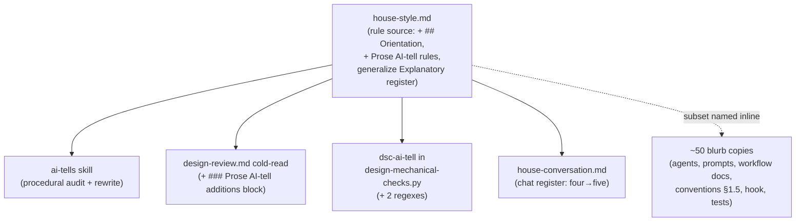
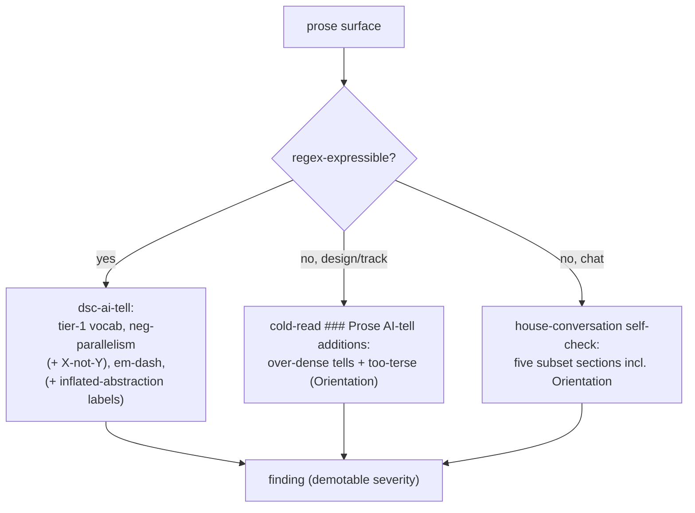

<!-- workflow-sha: 872c8336f7c7c16c66da548efab2540b3c2a296d -->
# Explanation-style enforcement — Design

## Overview

The house style (`.claude/output-styles/house-style.md`, the single declarative
source for the repo's writing rules) has two prose-quality gaps that no enforcer
closes today. The sentence-level over-dense AI-tells — run-on mechanism traces,
lists spliced into one sentence, inflated-abstraction labels — fall between the
design cold-read (which checks comprehension and document shape) and the
`dsc-ai-tell` mechanical check (a narrow regex set in
`design-mechanical-checks.py`), so they pass clean. And there is no always-on
rule against the opposite failure: prose too terse to follow without opening the
code.

This design closes both. It adds a top-level `## Orientation` rule to the house
style (the too-terse floor) and a `### Prose AI-tell additions` reviewer block to
the design cold-read (the over-dense enforcer), backed by two new regexes in
`dsc-ai-tell`. The orientation rule joins the **always-on AI-tell subset** — the
set of house-style sections that apply at chat scale and at code-comment scale —
so the canonical four-name subset becomes five.

The enabling primitives are the `## Orientation` rule text (which encodes a
register distinction, not "write more") and a new `§1.7` opt-out marker that lets
this branch edit the workflow rules **live** and have them self-apply, instead of
staging them away until merge. Two existing things are restructured to fit: the
design-only `### Explanatory register` rule generalizes up into `## Orientation`,
and the three Phase-3A review prompts gain a marker condition so a live-edit
prose branch still gets prose-criteria reviews. The reader is a maintainer of the
`.claude/` workflow machinery.

The rest of this document is structured as: Core Concepts → Enforcement surface
map → How a prose finding is produced → then four topic sections, one per
decision cluster (the Orientation rule, over-dense enforcement, the ~50-site
subset sync, and the `§1.7` opt-out).

## Core Concepts

This design turns on five load-bearing ideas. Each is named here and used
without re-definition below.

**AI-tell subset.** The set of house-style sections that apply not only to full
Markdown but also at chat scale (terminal replies) and code-comment scale
(Javadoc rationale). Today it is four sections (`## Banned vocabulary`,
`## Banned sentence patterns`, `## Banned analysis patterns`,
`### Em-dash discipline`); this change makes it five. Replaces the implicit
"these four move together" with an explicit five. → The §1.7 opt-out, Subset sync.

**The two prose-failure axes.** Over-dense prose (too much scaffolding: run-on
traces, inflated labels) and too-terse prose (too little orientation: bare
symbols, no gloss). They are opposite failures on one axis. YTDB-1084 enforces
the first; YTDB-1106 adds the floor for the second. Replaces today's one-sided
enforcement (only padding is checked). → The Orientation rule, Over-dense
prose enforcement.

**Orientation register vs registry-terse.** A surface a human reads cold (chat,
issue bodies, design mechanism sections) carries its orientation in the text —
gloss each entity, linearize each causal chain. A registry surface (a decision
log, a research log) stays terse by design and pushes recurring entities into a
shared vocabulary block. The Orientation rule describes this relationship rather
than forcing every surface to expand. Replaces the absent floor with one that
does not contradict the bias-toward-less-text rule. → The Orientation rule.

**The §1.7 prose-rule opt-out marker.** A `### Constraints` marker, distinct from
the existing workflow-modifying marker, that lets a plan editing only
judgment-layer workflow prose skip the `§1.7` staging mechanism and edit live, so
the rules self-apply during the branch. Replaces the all-or-nothing "stage every
workflow edit" rule with a scoped opt-out. → The §1.7 opt-out.

**The marker's two roles.** The existing workflow-modifying marker switches on
both the staging mechanism (where edits land) and the reviewer-criteria
re-pointing (whether Phase-3A reviews read prose references as paths/anchors or as
Java symbols). The opt-out must disable the first and keep the second.
→ The §1.7 opt-out.

## Enforcement surface map

**TL;DR.** `house-style.md` is the one rule source; four readers consume it
without restating the rules, plus ~50 files restate the AI-tell subset's section
names inline. This change touches the rule source and every consumer that names
the subset as a closed set.

The rule source gains the new section and rule text; the four named readers each
adopt the fifth subset member in their own form; the ~50 inline copies take the
canonical reworded blurb (Subset sync). The dashed edge marks restatement, not
consumption — the duplication the Subset sync section confronts.

### Edge cases / Gotchas

- The four named readers are not symmetric: the cold-read gets a new judgment
  block, `dsc-ai-tell` gets regexes, the chat register gets a list item, the
  `ai-tells` skill gets a catalogue row.

### Decisions & invariants

- D-records: D1 (Subset sync), D2 (Orientation tiers), D3 (Explanatory-register
  generalization), D4 (cold-read block).

## How a prose finding is produced

**TL;DR.** A prose surface is checked by whichever enforcer covers it: the
mechanical regex catches the regex-expressible tells, the cold-read judges the
rest at design/track creation and review, and the chat self-check covers terminal
replies. Over-dense and too-terse are both in scope after this change.

The mechanical path stays regex-only and demotable. The cold-read path is the
judgment layer for both failure axes. The chat path is self-applied per the
house-conversation register.

### Edge cases / Gotchas

- A registry surface (decision log, research log) is terse by design; the
  Orientation rule's anti-padding clause and shared-vocabulary escape keep it
  from being flagged for terseness.

### Decisions & invariants

- D-records: D2 (Orientation tiers), D4 (cold-read block, both targets).

## The Orientation rule

**TL;DR.** A new top-level `## Orientation` section in `house-style.md` sets the
floor the cut-rules cut to: prose a reader cannot follow without opening the code
is too terse, a finding the same as padding. It joins the always-on AI-tell
subset and generalizes the existing design-only `### Explanatory register`.

The rule text follows YTDB-1106's proposal: the reader is the house-style
`§ Voice and tone` reader (general Java/DB assumed, everything YouTrackDB-specific
glossed); three moves (lead with the plain claim, gloss each project-specific
entity once at first use, linearize a causal chain one link per sentence); and an
anti-padding clause — the added words must be a definition the reader needs or a
causal link they would otherwise reconstruct from code, never a hedge or
restatement. The YTDB-1106 worked exemplar (the F84 decision-log re-explanation)
is the rule's positive model.

The rule encodes a **register distinction** (Core Concepts): orientation register
for cold-read surfaces, registry-terse for decision/research logs that define
recurring entities once in a shared vocabulary block. Without this the rule would
read as "write more" and contradict `§ Voice and tone`'s bias toward less text.

**Two-tier membership (D2).** The rule joins both surfaces the subset governs:
chat-scale prose (the chat blurbs + `house-conversation.md`) and `*.java`/`*.kt`
code comments (the `conventions.md §1.5` Tier-B row + the
`house-style-write-reminder.sh` hook). A Javadoc reader has the code open by
definition, so the literal "open the code" test does not transfer; the
code-comment surface gets a restated criterion — rationale comments must not
assume context **outside the file** (distant call-site behavior, issue history,
reviewer-thread knowledge) and must gloss the project-specific entity the
rationale turns on.

**Generalization (D3).** `## Orientation` becomes the single always-on statement;
`### Explanatory register` (today under `## Document-shape rules`, design/ADR
only) reduces to a design-specific specialization that cross-links up, keeping
only its mechanism-overview-section nuance and the mid-level-reader completeness
bar. Three reconciliations make the file self-consistent: rewrite the line-379
scoping sentence so `## Orientation` is not excluded from issue/PR/status prose;
give `## Orientation` its own finding category (the current rule cites
`§ Why-before-what`, a design-only section); and move the Self-check entry out of
item 8's "design/ADR only" bracket into an always-on item.

### Edge cases / Gotchas

- The anti-padding clause is load-bearing: without it the rule is abusable as
  license to pad, which `§ Voice and tone` forbids.
- The code-comment restatement must not read as "add tutorial comments" — it
  bans out-of-file assumptions, not in-file terseness.

### Decisions & invariants

- D-records: D2 (two-tier membership + code-comment restatement), D3 (generalize
  `### Explanatory register`, the three-edit reconciliation set).
- Full design: research-log D2, D3.

## Over-dense prose enforcement

**TL;DR.** Two additions enforce the over-dense AI-tells YTDB-1084 names: a
judgment-layer `### Prose AI-tell additions` block in the design cold-read, and
two regex additions to `dsc-ai-tell` for the cleanly-detectable cases. Both ship
at demotable severity.

The cold-read block (`prompts/design-review.md`) sits sibling to
`### Human-reader cold-read additions` and instructs the reviewer to scan the
changed sections against `§ Banned analysis patterns`, `§ Mechanism traces and
inline citations`, lists-disguised-as-sentences, and inflated-abstraction labels
— the judgment cases regex cannot catch. It also scans the too-terse direction
(the Orientation rule), so one block covers both axes.

**Both cold-read targets (D4).** The block runs for `target=design` (the
phase1-creation / phase4-creation / design-sync cold-reads) **and**
`target=tracks` (the Step-4b track cold-read), at creation and review. Its
claim is bounded to **creation-time** prose: the track cold-read runs once,
before Phase-3 decision-log findings accrue, so the Phase-3 exemplar surface is
held by the always-on subset wiring on the writers, not by this block. The block
needs its **own** applies-to line covering both targets — it cannot copy the
sibling Human-reader block's design-kinds-only line.

**Regex additions (YTDB-1084 scope; severity per D5's A9 clause).** `dsc-ai-tell`
gains the inflated-abstraction labels ("the enabling primitive", "the key
abstraction", "the underlying mechanism", and the participle-plus-category-noun
shape) and the "X, not Y" faux-symmetry variant of negative parallelism. These
two regexes are YTDB-1084's deliverable; D5 governs only their **severity** — both
ship at the rule's documented demotable severity. The "X, not Y" pattern risks
firing on legitimate contrastive "A, not B" prose, so the false-positive count
observed on this branch's own Phase-4 `design-final.md` authoring (where the live
regex self-applies) is the calibration point.

### Edge cases / Gotchas

- The `### Prose AI-tell additions` block syncs the design-review TOC row and the
  `§ Tone and depth` "five Human-reader rules" count, and adds a row to the
  `readability-feedback` Rule sync map's design-review entry.
- `## Orientation` is judgment-layer only — no `dsc-ai-tell` change is needed for
  the too-terse direction.
- The inflated-abstraction-label regex collides with the design-doc Overview
  template, which prescribes naming "the enabling primitive(s)"
  (`design-document-rules.md § Overview`). The regex must target the
  subject-slot inflated label, not the Overview's sanctioned enumeration element,
  or every conforming design Overview self-flags — another reason the pattern
  ships demotable and is calibrated against this branch's own authoring.

### Decisions & invariants

- D-records: D4 (cold-read block, both targets, applies-to asymmetry); D5's A9
  clause (new-regex demotable severity — the regexes themselves are YTDB-1084
  scope).
- Full design: research-log D4, D5 (A9 clause).

## Subset sync across ~50 sites

**TL;DR.** Making the subset five means editing ~50 files that enumerate the
four-name set; the count bump is semantic, not numeric, and it must land
atomically so the branch's own consistency review does not flag a four-vs-five
window.

The inventory is pinned (research-log S1): 50 files name the subset sections; 30
carry the "four banned-section heading slugs" blurb; 11 carry the chat
"AI-tell subset of" blurb; the rest are the three canonical sites
(`house-style.md`, `house-conversation.md`, `conventions.md §1.5`), the hook, two
tests, and three governance/routing sites (the two `grep -rn` audit commands at
`readability-feedback/SKILL.md:54` and `conventions.md:570`, and the `ai-tells`
catalogue table).

**Semantic count bump (D1).** "Five banned-section slugs" is **false** —
`## Orientation` is a positive floor, not a ban. The 30-site blurb is reworded
once, canonically, and pasted byte-identically: *"the five AI-tell subset section
slugs to apply are `## Banned vocabulary`, `## Banned sentence patterns`,
`## Banned analysis patterns`, `### Em-dash discipline`, and `## Orientation`."*
The 11-site chat blurb takes a find/replace pair (not a pure append, which would
double the "and"), and the two governance greps gain `Orientation` so future
audits enumerate the fifth section.

**Atomic sync (D1).** The ~50 edits land as one commit, or at minimum inside a
single track with the four-vs-five window closed before that track's Phase C —
otherwise `review-workflow-consistency` (which reads cross-file, beyond the diff)
flags the inconsistency the branch created deliberately. Faithful full sync beats
centralizing the enumeration: the inline copies exist for per-spawn
self-containedness (a sub-agent reads its blurb without opening another file), so
centralizing trades that for a per-spawn file read.

### Edge cases / Gotchas

- One chat-blurb site (`review-workflow-pr/SKILL.md:44-45`) hard-wraps the find
  string across a line break; match modulo line-wrap or hand-edit that site.
- `test_house_style_hook.py` pins the subset section-name list, so it gates the
  sync's correctness for the hook.

### Decisions & invariants

- D-records: D1 (faithful full sync, atomic, the canonical reworded blurb).
- Full design: research-log D1, S1.

## The §1.7 opt-out

**TL;DR.** The branch edits the workflow rules **live** (no staging) so they
self-apply, authorized by a new `§1.7` opt-out clause this branch carries. The
opt-out disables only the staging mechanism, keeps reviewer-criteria re-pointing
on, and is bounded to judgment-layer edits with a mandatory stamp-advance.

**Why live-edit, not staging (D5).** This change alters prose rules, prompt text,
one reviewer block, and one regex — it changes no `_workflow/**` artifact schema,
so the destabilize-the-branch's-own-machinery hazard `§1.7` staging guards
against does not exist. The largest surfaces (`house-style.md`,
`house-conversation.md`, `design-mechanical-checks.py`) sit outside `§1.7`'s
covered prefixes already, so partial staging buys neither isolation nor
self-application. Self-application is the goal: the branch's own design, tracks,
and chat are held to the new rules during the branch.

**The opt-out clause (D6).** The current `§1.7(b)`/`(h)` bind this branch to
stage; the legitimacy comes from amending `§1.7`, not from claiming an opt-out
that does not exist. The amendment, chosen for the lowest surface: the plan
carries a **distinct opt-out marker** (not the workflow-modifying marker), so
every staging-mechanism consumer defaults to live with no edits and no bootstrap
deadlock. The only rewiring is extending the **three** Phase-3A criteria-switch
blocks (`technical-review.md`, `risk-review.md`, `adversarial-review.md`) to fire
on the opt-out marker too, keeping prose-criteria reviews on for this all-prose
branch (`track-code-review.md` is staging-delta prep, inert without the marker;
Phase-C dimensional coverage is diff-keyed via `review-agent-selection.md`). The
opt-out covers only **judgment-layer** edits (style rules, review criteria,
prompt blurbs, reviewer blocks); execution-procedure files stay staged. It
records a **mandatory stamp-advance** (run `/migrate-workflow` after the last
workflow-editing commit) so the drift gate re-arms for real develop drift instead
of being suppressed every session.

**Landing order and in-plan re-pointing (D6).** The amendment and the three
criteria-switch extensions land in the branch's first workflow-editing commit
(the conventions track ordered first). The conventions track's own Phase-A review
trio runs before that commit lands, so the load-bearing instruction also lives in
the plan's `### Constraints` opt-out note, which every reviewer reads: it
acknowledges the staging deviation and re-points the review criteria in-plan
(treat references as workflow paths/anchors, apply the five prose criteria). The
prompt-file extensions then serve future opt-out branches.

### Edge cases / Gotchas

- Until the amendment lands, the `### Constraints` note is self-justifying
  (cites the in-flight amendment) so a reviewer reading unamended `§1.7` sees an
  acknowledged deviation, not a phantom reference.
- The opt-out clause self-applies once its first commit lands, since the branch
  reads its own amended `§1.7` thereafter.

### Decisions & invariants

- D-records: D5 (live-edit substance, stamp-advance, demotable regex), D6 (the
  `§1.7` opt-out marker shape, three criteria-switch extensions, consumer-class
  criterion, landing order, in-plan re-pointing).
- Full design: research-log D5, D6.
