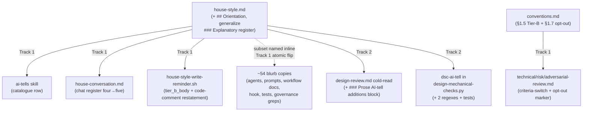

<!-- workflow-sha: 26f990ed824d113fdb5fcb930361e69378f0f12a -->
# Explanation-style enforcement

## Design Document
[design.md](design.md)

## High-level plan

**Change tier:** full — matched categories: Workflow machinery

### Goals

Close the two prose-quality gaps in the house style (`.claude/output-styles/house-style.md`, the single declarative source for the repo's writing rules) that no enforcer covers today.

- **Over-dense prose (YTDB-1084).** Sentence-level AI-tells — run-on mechanism traces, lists spliced into one sentence, inflated-abstraction labels — fall between the design cold-read (which checks comprehension and document shape) and the `dsc-ai-tell` mechanical check (a narrow regex set in `design-mechanical-checks.py`), so they pass clean. Add a judgment-layer `### Prose AI-tell additions` block to the design cold-read and two regexes to `dsc-ai-tell` for the regex-expressible cases.
- **Too-terse prose (YTDB-1106).** There is no always-on rule against the opposite failure: prose too terse to follow without opening the code. Add a top-level `## Orientation` rule to the house style as the floor the cut-rules cut to, and make it the fifth member of the always-on AI-tell subset.
- **Self-application.** Sanction this branch editing the workflow rules **live** (no staging) via a new `§1.7` opt-out, so the new rules apply to the branch's own design, tracks, and chat while the branch runs.

### Constraints

- **Workflow-modifying branch on the `§1.7` opt-out (D6).** Every edit (`.claude/workflow/**`, `.claude/skills/**`, `.claude/agents/**`, `.claude/output-styles/**`, `.claude/scripts/**`) lands on live paths and self-applies; nothing is staged. The change alters prose rules, prompt text, one reviewer block, and one regex set — it changes no `_workflow/**` artifact schema — so the destabilize-the-branch's-own-machinery hazard `§1.7` staging guards against does not arise.
- **Atomic subset flip (D1).** The ~54 sites that enumerate the AI-tell subset as a closed set move four→five in one commit, or at minimum inside Track 1 with the four-vs-five window closed before Track 1's Phase C — otherwise `review-workflow-consistency` (which reads cross-file, beyond the diff) flags the inconsistency the branch creates deliberately.
- **Demotable new regexes (D5/A9).** The two `dsc-ai-tell` additions ship at the rule's documented demotable severity, calibrated against the false-positive count observed on this branch's own Phase-4 `design-final.md` authoring (where the live regexes self-apply).
- **Mandatory stamp-advance (D5/D6).** Committing live `.claude/workflow|skills|agents` edits advances HEAD past the artifacts' stamp base, so the startup drift gate fires every subsequent session. Suppress is the interim answer; after the last workflow-editing commit, run `/migrate-workflow` (a no-op replay over prose-only commits that advances every artifact stamp to HEAD), re-arming the gate for real develop-side drift.

> **`§1.7` opt-out note — load-bearing for every reviewer of this plan (D6, A14).**
> This plan takes the `§1.7` prose-rule self-application opt-out instead of the
> workflow-modifying staging marker. Two consequences every Phase-2 and Phase-3A
> reviewer must apply from Phase A onward:
>
> 1. **Acknowledged staging deviation, not a phantom reference.** This branch edits
>    `.claude/workflow|skills|agents` live rather than under `_workflow/staged-workflow/`.
>    The legitimacy is D6's `§1.7` opt-out amendment, which Track 1 lands in its first
>    workflow-editing commit. A reviewer reading unamended `§1.7` (or the Phase-2
>    consistency review resolving the opt-out-clause reference) sees an acknowledged,
>    in-flight deviation here — not a missing marker to flag.
> 2. **Treat this plan as workflow-modifying for review-criteria purposes.** Verify
>    every reference the tracks make to a workflow file as a path/anchor into the
>    live `.claude/**` tree (not under a staged subtree), and apply the prose criteria
>    — the five AI-tell subset sections and the cold-read judgment — not the Java
>    FQN / WAL / crash-safety / hot-caller lenses. The three Phase-3A criteria-switch
>    prompt blocks gain an opt-out-marker trigger in Track 1's first commit, but
>    Track 1's own Phase-A review trio runs **before** that commit lands, so this note
>    is what re-points criteria for the branch's own largest prose track.

### Architecture Notes

#### Component Map

`house-style.md` is the one rule source. Four readers consume it without restating the rules; ~54 files restate the AI-tell subset's section names inline for per-spawn self-containedness. This change touches the rule source, every reader, and every site that names the subset as a closed set, split across two tracks.

- **`house-style.md` (rule source, Track 1).** Gains `## Orientation` (top-level, always-on floor); `### Explanatory register` reduces to a design-specific specialization that links up. Three reconciliation edits keep the file self-consistent (line-379 scoping, Orientation's own finding category, Self-check entry placement).
- **`conventions.md` (Track 1).** `§1.5` Tier-B row joins the atomic flip + gains the code-comment restatement; `§1.7` gains the opt-out clause and the distinct opt-out marker.
- **The four readers (Track 1 + Track 2).** `ai-tells` skill, `house-conversation.md`, and `house-style-write-reminder.sh` adopt the fifth subset member (Track 1); the `design-review.md` cold-read gains the new judgment block and `dsc-ai-tell` gains the regexes (Track 2).
- **The three Phase-3A criteria-switch prompts (Track 1).** `technical-review.md`, `risk-review.md`, `adversarial-review.md` gain an opt-out-marker trigger so prose-criteria reviews stay on for this all-prose branch.
- **The ~54 inline copies (Track 1, atomic).** 30 "banned-section heading slugs" blurbs, 11 chat blurbs, two closed-set enumerations the narrow grep misses (`commit-conventions.md`, `implementer-rules.md`), two governance greps, the hook, two tests, the `ai-tells` catalogue, the `readability-feedback` grep — all flip four→five together.

#### D1: Faithful full sync of the ~54-site subset enumeration

- **Alternatives considered**: (A) faithful full sync — every site becomes five (chosen); (B) centralize-then-add — replace the ~54 duplicated enumerations with one pointer; (C) issue-literal — update only the ~10 sites the issues named.
- **Rationale**: matches the project's "the canonical subset must move together" discipline. The count bump is **semantic, not numeric** — `## Orientation` is a positive floor, not a ban, so the 30-site "four banned-section slugs" blurb is reworded once canonically and pasted byte-identically. (B) is scope expansion that trades the ~54 inline copies' per-spawn self-containedness for a per-spawn file read; (C) leaves ~40 sites at four-of-five, which `review-workflow-consistency` and the governance greps flag as drift.
- **Risks/Caveats**: ~54 hand edits, no generator. Three sites escape the narrow `banned-section heading slugs` grep and need hand-edits: `review-workflow-pr/SKILL.md` hard-wraps the find string across a line break, and `commit-conventions.md` and `implementer-rules.md` are closed-set enumerations in differing surrounding sentences. `test_house_style_hook.py` gates the hook's subset list.
- **Implemented in**: Track 1 (atomic flip)
- **Full design**: design.md §"Subset sync across ~50 sites"

#### D2: Orientation joins both subset tiers (chat + code-comment)

- **Alternatives considered**: chat-only membership; chat + `*.java`/`*.kt` code-comment membership (chosen).
- **Rationale**: the issues scope Orientation to "chat and every prose surface." A Javadoc reader has the code open by definition, so YTDB-1106's literal "too terse to follow without opening the code" test does not transfer — the code-comment surface gets a **restated criterion** (rationale comments must not assume context *outside the file* and must gloss the project-specific entity the rationale turns on). A deliberate tier difference recorded once in the `§1.5` table is a documented scope split, not the four-vs-five enumeration drift D1 forbids.
- **Risks/Caveats**: the restatement must not read as "add tutorial comments" — it bans out-of-file assumptions, not in-file terseness.
- **Implemented in**: Track 1 (`§1.5` Tier-B row + the hook `tier_b_body`)
- **Full design**: design.md §"The Orientation rule"

#### D3: Generalize § Explanatory register into ## Orientation

- **Alternatives considered**: leave both (the duplication the issue flags); cross-link only without generalizing (still two full statements); generalize into one top-level rule plus a design-specific specialization (chosen).
- **Rationale**: one general always-on rule plus one specialization that points at it is maintainable; two parallel statements drift. Generalizing forces a three-edit reconciliation or the file contradicts itself: rewrite `house-style.md:379` so Orientation is not excluded from issue/PR/status prose; give `## Orientation` its own finding category (the current rule cites the design-only `§ Why-before-what`); move the Self-check entry out of item 8's "design/ADR only" bracket into an always-on item.
- **Risks/Caveats**: the anti-padding clause is load-bearing — without it the rule is abusable as license to pad, which `§ Voice and tone` forbids.
- **Implemented in**: Track 1 (`house-style.md`)
- **Full design**: design.md §"The Orientation rule"

#### D4: New cold-read block runs for design AND tracks

- **Alternatives considered**: design-only (leaves creation-time track prose unchecked); both `target=design` and `target=tracks` (chosen).
- **Rationale**: track prose carries the same over-dense / too-terse failure as design prose at **creation time**, so scanning only `design.md` leaves the plan-at-start track sections unchecked. The claim is bounded to creation-time prose — the `target=tracks` cold-read runs once, before Phase-3 decision-log findings accrue, so the Phase-3 exemplar surface is held by the always-on subset wiring (D1/D2) on the writers, not by this block. The block needs its **own** applies-to line covering both targets; it cannot copy the sibling Human-reader block's design-kinds-only line.
- **Risks/Caveats**: syncs three sites — the design-review TOC row, the `§ Tone and depth` "five Human-reader rules" count, and the `readability-feedback` Rule sync map's design-review row.
- **Implemented in**: Track 2 (`design-review.md`)
- **Full design**: design.md §"Over-dense prose enforcement"

#### D5: No staging — live-edit all surfaces

- **Alternatives considered**: full staging (defers all self-application to post-merge); hybrid stage-covered-only; user-waiver without amending `§1.7`; live-edit sanctioned by a `§1.7` amendment (chosen).
- **Rationale**: the change touches no `_workflow/**` artifact schema, so the staging hazard does not exist; the largest surfaces (`house-style.md`, `house-conversation.md`, `design-mechanical-checks.py`) sit outside `§1.7`'s covered prefixes already, so partial staging buys neither isolation nor self-application. Self-application is the goal. The legitimacy comes from amending `§1.7` (D6), since unamended `§1.7(b)` calls marker-omission *forfeiture*, not an opt-out. New regexes ship demotable (A9). Drift handled by stamp-advance, not habituated Suppress (A2).
- **Risks/Caveats**: until the amendment lands, the plan's `### Constraints` opt-out note is the self-justifying carrier; a blocker-severity regex false positive during Phase-4 self-application would exit 1 and block the loop, hence demotable.
- **Implemented in**: Track 1 (lands with the `§1.7` opt-out)
- **Full design**: design.md §"The §1.7 opt-out"

#### D6: Amend §1.7 with a prose-rule self-application opt-out

- **Alternatives considered**: shape (i) keep-marker-plus-rider (needs a bootstrap fix and edits to execution-procedure files that criterion (2) says must stay staged); user-waiver-only (one-off, not reusable); leaving `§1.7` unchanged and omitting the marker (the A1 violation, and it silently disables the reviewer-criteria switch); shape (ii) distinct opt-out marker (chosen).
- **Rationale**: the marker has **two roles** — the staging mechanism and the reviewer-criteria re-pointing. Shape (ii) carries a **distinct opt-out marker** in `### Constraints` (not the workflow-modifying marker), so every staging consumer already defaults to live with no edits and no bootstrap deadlock. The only rewiring is extending the **three** Phase-3A criteria-switch blocks to fire on the workflow-modifying marker OR the opt-out marker. Opt-out criteria are **consumer class, not intent**: (1) no `_workflow/**` schema change AND (2) every edited file's in-branch consumer is judgment-layer (style rules, review criteria, prompt blurbs, reviewer blocks). This branch's edits all qualify.
- **Risks/Caveats**: Track 1's own Phase-A review trio runs before the criteria-switch extensions land, so the in-plan `### Constraints` note (above) re-points criteria for this branch; the prompt-file extensions serve future opt-out branches.
- **Implemented in**: Track 1, ordered first (`§1.5` sync + `§1.7` opt-out + the three criteria-switch extensions land together)
- **Full design**: design.md §"The §1.7 opt-out"

#### Invariants

- **Subset enumeration is uniform after Track 1.** No site enumerates the AI-tell subset as four-of-five after Track 1's Phase C; the four→five flip is window-closed (D1). Testable via the two governance greps and `test_house_style_hook.py`.
- **`## Orientation` exists before any enumeration names it.** The rule text lands with or before the subset flip, so no enumeration points at a missing section.
- **The opt-out disables staging only.** Reviewer-criteria re-pointing stays on (the three criteria-switch blocks fire on the opt-out marker); staged-read precedence and the Phase-4 promotion guard correctly find no staged subtree and skip.

#### Integration Points

- The four readers consume `house-style.md` by section name: `ai-tells` skill (catalogue), `design-review.md` cold-read (verification by reference), `dsc-ai-tell` (regex), `house-conversation.md` (chat register).
- The three Phase-3A criteria-switch blocks read the plan's `### Constraints` marker: `technical-review.md:113`, `risk-review.md:110`, `adversarial-review.md:282`.
- The hook `house-style-write-reminder.sh` holds the only programmatic copy of the subset section names (`tier_b_body`).

#### Non-Goals

- **Centralizing the ~54-site enumeration** (D1 alternative B) — fixes the duplication root cause but is scope expansion beyond the two issues; a possible follow-up that must start from the per-spawn-self-containedness fork, not just "out of scope."
- **Any `_workflow/**` artifact schema change** — no track-file section, resume-state field, drift-gate format, or stamp format moves (the opt-out's criterion (1)).
- **Re-running a cold-read on Phase-3 live prose** — the `target=tracks` block is creation-time only; live decision-log / episode prose is held by the always-on subset wiring, not a re-run reviewer.

## Checklist

- [ ] Track 1: Conventions opt-out, Orientation rule, and the atomic subset sync
  > Lands the `§1.7` prose-rule opt-out and the three Phase-3A criteria-switch extensions first (so the branch's own live edits are sanctioned), adds the always-on `## Orientation` rule to `house-style.md` and generalizes `### Explanatory register`, then flips the AI-tell subset four→five across the ~54 sites that name it as a closed set. The subset flip is atomic — the four-vs-five window closes before this track's Phase C (D1).
  > **Scope:** ~54 files covering the `§1.7` opt-out amendment + three criteria-switch prompts, the `## Orientation` rule + generalization + three reconciliation edits in `house-style.md`, `house-conversation.md` + `conventions.md §1.5` + the hook code-comment restatement, and the ~54-site four→five enumeration flip (30 blurbs, 11 chat blurbs, two closed-set enumerations the narrow grep misses (`commit-conventions.md`, `implementer-rules.md`), two governance greps, two tests, the `ai-tells` catalogue, the `readability-feedback` grep).

- [ ] Track 2: Over-dense prose enforcement (cold-read block + dsc-ai-tell regexes)
  > Adds the YTDB-1084 over-dense enforcement that does not enumerate the subset: a judgment-layer `### Prose AI-tell additions` block in the `design-review.md` cold-read running for both `target=design` and `target=tracks`, plus two `dsc-ai-tell` regexes (inflated-abstraction labels and the "X, not Y" faux-symmetry) with tests. Ships demotable, calibrated against this branch's own authoring.
  > **Scope:** ~4 files covering the `design-review.md` cold-read block + TOC/count sync, the `readability-feedback` Rule sync map design-review row, two regexes in `design-mechanical-checks.py`, and `test_dsc_ai_tell.py`.
  > **Depends on:** Track 1

## Plan Review
- [x] Plan review (consistency + structural) — passed at iteration 1

**Auto-fixed (mechanical)**: CR1 — corrected the subset-naming-site inventory undercount (governance grep returns 54, not ~50) across `implementation-plan.md` and `plan/track-1.md`, and named the two four-name closed-set flip sites the narrow `banned-section heading slugs` grep misses (`commit-conventions.md:191-194`, line-wrapped; `implementer-rules.md:1102-1105`, variant phrasing) in Track 1's in-scope roster, `## Context and Orientation` inventory, `## Plan of Work` step 4, and D1 risks. Broadened Track 1's acceptance check from the narrow grep (returns 30, silently misses both) to the governance grep + an Orientation-presence check on every closed-set enumeration.

**Escalated (design decisions)**: none.

**Recorded for Phase 4 (`design.md` frozen — not mutated)**: the inventory count reaches `design.md §"Subset sync across ~50 sites"`, which still reads `~50`. Surfaced by both CR1 (consistency, design-side half) and S1 (structural, suggestion). The Phase-4 `design-final.md` reconciliation updates the as-built inventory to 54. The two `**Full design**: design.md §"Subset sync across ~50 sites"` anchors in the plan and `track-1.md` are left verbatim so they keep matching the frozen section title.

## Final Artifacts
- [ ] Phase 4: Final artifacts (`design-final.md`, `adr.md`)
