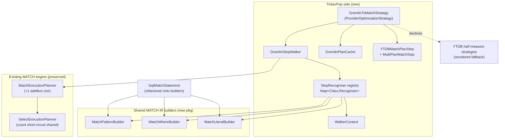

<!-- workflow-sha: d2dfcc2d44fabd3ac76c5fd7620f1e6013675ad9 -->
# Gremlin-to-MATCH Translator

## Design Document
[design.md](design.md)

## High-level plan

### Goals

Run the pattern-matching subset of TinkerPop traversals through the existing
cost-based `MatchExecutionPlanner` instead of the native left-to-right Gremlin
pipeline, so recognized queries gain MATCH's optimizations — cost-based start
selection, index lookups, prefetch, hash anti-joins — without any SQL text
round-trip.

- Translate a recognized Gremlin step list into the same in-memory IR the SQL
  `MATCH` parser produces (`Pattern` + alias maps + projection metadata,
  packaged as a new `MatchPlanInputs` record) and feed it to the planner via a
  single **additive** constructor (D2). No SQL is generated.
- Stay strictly additive: any unrecognized step declines the **whole**
  traversal to the unchanged native pipeline (D3), so no existing query
  regresses. Coverage grows track by track.
- Factor MATCH IR construction into a shared `match/builder/` package consumed
  by both the translator and the GQL front-end; GQL's observable behavior is
  unchanged (D6).
- Cache plans across queries, keyed on value-independent traversal shape, with
  predicate values bound as positional parameters (D5).
- Unify the exact `count(*)` fast path inside the MATCH engine so SQL, GQL, and
  translated Gremlin class-counts share one snapshot-isolated short-circuit
  (see design §"Aggregation barrier semantics").

### Constraints

- **Multiset equality is the contract.** Translator-on and translator-off must
  return the same elements the same number of times for every recognized shape.
  Element order is explicitly **not** pinned — MATCH's planner reorders, and
  pinning order would erase the optimization. The ~1900-scenario TinkerPop
  Cucumber suite must stay green.
- **Engine surface is preserved.** The only addition to the MATCH execution
  surface is one new public `MatchExecutionPlanner(MatchPlanInputs)` constructor
  (D2). Existing constructors, the IR classes, the execution steps, the grammar,
  and the evaluators are not modified — except the two new string-predicate AST
  nodes in D-TEXT-OPS and the count short-circuit refactor.
- **Recognizers see post-fold shapes.** The strategy runs after TinkerPop's
  structural folders (`IncidentToAdjacentStrategy`, `ConnectiveStrategy`,
  `LazyBarrierStrategy`), so `outE(L).inV()` arrives folded to `out(L)`,
  `and(P,P)` arrives as `AndStep`, and injected `NoOpBarrierStep`s appear
  between recognized steps.
- **Absent vs null-valued properties must stay distinct.** YTDB's record layer
  separates *absent* from *present-with-null*; the query-layer accessor
  collapses them. Filter (`IS DEFINED`) and projection (`hasProperty`) paths
  must compensate to match native Gremlin set membership (design §"Track 5
  commitment", §"Phase 1 dependency").
- **Custom TinkerPop fork** under the `io.youtrackdb` group ID shadows upstream
  `org.apache.tinkerpop` symbols — recognizers key on the fork's `Step`
  classes.
- 85% line / 70% branch coverage on changed code; JDK 21; `./mvnw` build.

### Architecture Notes

#### Component Map

- **GremlinToMatchStrategy** — entry point; idempotent; walks the step list,
  decides yes/no for the whole traversal (D3), and on yes replaces every step
  with one boundary step. Registered before the three half-measure strategies
  via their `applyPrior()` (D4).
- **GremlinStepWalker + StepRecogniser registry** — index-driven walk;
  `Map<Class<? extends Step>, StepRecogniser>` keyed on the step's runtime
  class (D9). A recognizer may consume N steps in one claim (D10).
- **WalkerContext** — per-walk accumulator: pattern builder, alias maps,
  anonymous-alias generators, bound-parameter map, return/order/limit metadata,
  boundary output type.
- **Shared MATCH IR builders** — language-agnostic IR assembly; both the
  translator and the refactored `GqlMatchStatement` consume them (D6).
- **YTDBMatchPlanStep / MultiPlanMatchStep** — the boundary bridging YTDB's
  `ExecutionStream` back to TinkerPop traversers; `MultiPlanMatchStep`
  concatenates N plans for `union` (D8).
- **Existing engine** — preserved; reached through one additive constructor
  (D2). The count short-circuit is factored to a shared helper the planner
  invokes (design §"Aggregation barrier semantics").

#### D1: Integration via `ProviderOptimizationStrategy`
- **Alternatives considered**: a custom `GraphTraversalSource` step; rewriting
  the Gremlin compiler; intercepting at `GraphStep` only.
- **Rationale**: a `ProviderOptimizationStrategy` is TinkerPop's sanctioned
  provider hook — it runs after structural folding, sees the whole step list,
  and can replace it wholesale. It composes with the existing YTDB strategies
  via the standard `applyPrior()`/`applyPost()` ordering contract.
- **Risks/Caveats**: ordering relative to the half-measure strategies and the
  structural folders must be explicit; mis-ordering changes what shapes the
  recognizers see. Handled by D4.
- **Implemented in**: Track 2

#### D2: Planner entry via additive `(MatchPlanInputs)` ctor; planner owns the projection block
- **Alternatives considered**: generate SQL `MATCH` text and re-parse;
  call `SelectExecutionPlanner.handleProjectionsBlock` from the strategy.
- **Rationale**: building the IR directly skips a parse round-trip and keeps the
  translator type-safe. The planner already calls `handleProjectionsBlock`
  internally inside `createExecutionPlan`; the strategy must **not** call it too
  (the consistency review caught a double-append). One additive constructor
  leaves the three existing ones untouched.
- **Risks/Caveats**: `MatchPlanInputs` must carry every field the planner reads
  post-parse; a missing field surfaces as a planning-time gap. Mitigated by the
  reused-steps audit (design §"Reused execution steps").
- **Implemented in**: Track 2
- **Full design**: design.md §"Overview", §"Workflow"

#### D3: All-or-nothing translation, no hybrid prefix
- **Alternatives considered**: hybrid — translate the longest recognized prefix
  and let an unrecognized suffix run natively over the boundary's output.
- **Rationale**: the hybrid required cross-boundary output-type negotiation,
  cross-boundary label propagation, and special-casing `path()` — each a bag of
  edge cases with no proportional benefit at Phase 1's small recognized set.
  All-or-nothing removes the boundary as a splice point: one unrecognized step
  declines the whole traversal and the native pipeline handles it verbatim.
- **Risks/Caveats**: a single unsupported step forfeits MATCH for the whole
  query. Accepted — coverage grows track by track; every declined shape is at
  least as well-served as before.
- **Implemented in**: Track 2 (decline logic); enforced by every recognizer
- **Full design**: design.md §"Overview"

#### D4: Strategy ordering — translator first, half-measure strategies as fallback
- **Alternatives considered**: remove the three half-measure strategies;
  declare ordering with `applyPost()` on the translator.
- **Rationale**: each half-measure strategy lists `GremlinToMatchStrategy` in
  its own `applyPrior()`, so TinkerPop's topological sort runs the translator
  first; the translator declares empty prior/post. On decline the original step
  list is preserved verbatim and the half-measures see it next, keeping today's
  behavior for shapes the translator does not yet cover.
- **Risks/Caveats**: `YTDBGraphCountStrategy` must stay (reordered, not removed)
  to serve multi-label and non-polymorphic counts the short-circuit declines.
- **Implemented in**: Track 2

#### D5: Plan cache in Phase 1, keyed on traversal shape, values bound at execution
- **Alternatives considered**: no cache in Phase 1; cache keyed on full
  bytecode including predicate values.
- **Rationale**: predicate values are bound as `SQLPositionalParameter` slots
  and elided from the key (mirroring YQL's `?` handling), so one plan serves
  every parameter value without cache thrash. The key is the value-independent
  generic-statement fingerprint; the cache spares only the expensive planner
  pass.
- **Risks/Caveats**: structural-vs-value classification must be correct — a
  value leaking into the key thrashes the cache; a structural token bound as a
  param serves a wrong plan. Schema changes reuse the YQL invalidation hook.
- **Implemented in**: Track 4
- **Full design**: design.md §"Parameter binding"

#### D6: Shared MATCH IR builder package; GQL refactor in Phase 1
- **Alternatives considered**: translator-private IR helpers; defer the GQL
  refactor to a later phase.
- **Rationale**: one builder package (`match/builder/`) serves both front-ends
  from day one, so the IR-construction contract is exercised by GQL's existing
  tests immediately. The GQL refactor is strictly behavior-preserving — its
  public API and test assertions are unchanged.
- **Risks/Caveats**: a behavior drift in the GQL refactor would surface as a GQL
  test failure; the builders must cover both today's GQL needs and the
  translator's full needs (chains, edges, predicates).
- **Implemented in**: Track 1
- **Full design**: design.md §"GQL refactor and shared builders evolution"

#### D7: Strategy idempotency
- **Alternatives considered**: rely on TinkerPop to apply strategies once; a
  per-traversal "translated" flag.
- **Rationale**: strategy chains can re-apply (clone for sub-traversal reuse,
  test harness re-application, lazy first-iteration apply). A single early scan
  of the whole step list for any `YTDBMatchPlanStep` returns immediately if
  found — O(N) over a single-digit step count, negligible cost, absolute safety.
- **Risks/Caveats**: the scan must cover the entire list, not just the start
  step, because a wrapping source can place steps before a translated boundary.
- **Implemented in**: Track 2

#### D8: Union enters the recognized set; `optional` deferred to Phase 2
- **Alternatives considered**: translate `union` via MATCH
  `splitDisjointPatterns` (cartesian product); ship `optional` in Phase 1.
- **Rationale**: MATCH's disjoint-pattern join is a cartesian product, not
  concatenation, so `union` is translated by building one `SelectExecutionPlan`
  per child and concatenating their streams in `MultiPlanMatchStep`. `optional`
  is deferred: Gremlin drops the row on an empty sub-traversal while MATCH emits
  it with the inner alias null — the outputs differ exactly on the case
  `optional` expresses.
- **Risks/Caveats**: all union children must agree on output type, else the
  union declines whole. Changing union to cartesian would silently alter result
  semantics and break the green-suite invariant.
- **Implemented in**: Track 6
- **Full design**: design.md §"Union semantics divergence"

#### D9: Type-keyed recognizer dispatch via `Map<Class<? extends Step>, StepRecogniser>`
- **Alternatives considered**: an ordered `instanceof` chain of recognizers.
- **Rationale**: `map.get(step.getClass())` on the concrete runtime class gives
  O(1) dispatch and **safe failure** on unknown subclasses — a future
  `BespokeHasStep extends HasStep` returns `null` and declines cleanly rather
  than misrouting through a parent recognizer. One map entry per `Step` class;
  each recognizer handles every variant internally (so `NotStep` is one
  recognizer branching on `hasEdgeHops`). Parallel tracks register disjoint keys
  and cannot collide; a duplicate-key assertion catches the rare clash.
- **Risks/Caveats**: a registered recognizer that branches internally still
  needs the no-mutation-on-decline discipline (per-recognizer unit invariant).
- **Implemented in**: Track 2 (walker + registry); per-class entries added by
  Tracks 2–6
- **Full design**: design.md §"Recogniser dispatch"

#### D10: Walker supports multi-step claims via index-driven iteration
- **Alternatives considered**: single-step-per-recognizer for-each loop with a
  look-back buffer.
- **Rationale**: non-adjacent edge filtering (`outE(L).has(...).inV()`) needs a
  recognizer to consume several steps in one claim. The walker loop is
  index-driven (`ctx.stepIndex`), so a recognizer advances the index by N
  instead of the default `++`. This is the first multi-step claim; it lands when
  edge filtering does.
- **Risks/Caveats**: a recognizer that mis-counts consumed steps corrupts the
  walk; the no-mutation-on-decline contract bounds the blast radius.
- **Implemented in**: Track 3
- **Full design**: design.md §"Edge filtering in non-adjacent chains"

#### D11: Unify the exact class-`count(*)` fast path in the MATCH engine
- **Alternatives considered**: keep declining class-count to the
  `YTDBGraphCountStrategy` front-end strategy (the earlier approach,
  motivated by preserving an O(1) non-snapshot-isolated count);
  per-front-end count optimizers (SQL / GQL / Gremlin each own one).
- **Rationale**: since YTDB-609 (#791) the class-count fast path stopped
  being O(1) / non-SI — `countClass(name, true)` is now a snapshot-isolated
  per-record-visibility scan, so the original "declining preserves O(1)"
  rationale no longer holds. Factoring `handleHardwiredCountOnClass*` out of
  `SelectExecutionPlanner` into a shared helper the `MatchExecutionPlanner`
  also invokes gives SQL, GQL, and translated Gremlin one exact SI count
  path; the dedicated `CountFromClassStep` / `CountFromIndexWithKeyStep` still
  win a constant factor (no record-body deserialization). This is the one
  engine-surface change beyond the additive ctor (D2).
- **Risks/Caveats**: `CountFromClassStep.canBeCached()==false`, so these MATCH
  plans are not cached (SELECT already behaves so). Multi-label and
  non-polymorphic counts decline to the reordered `YTDBGraphCountStrategy`
  fallback (D4). The genuine O(1) `approximateCountClass` stays detached —
  an opt-in count mode is Phase 2.
- **Implemented in**: Track 5
- **Full design**: design.md §"Aggregation barrier semantics"

#### D-IS-DEFINED: Adopt existing YTDB SQL `IS DEFINED` / `IS NOT DEFINED` operators
- **Alternatives considered**: map `has(key)`/`hasNot(key)` to `IS NULL`/`IS NOT
  NULL`; add new presence operators from scratch (the earlier design draft).
- **Rationale**: `IS NULL` over-matches — TP `hasNot(key)` is false for a
  property stored with literal `null` (the wrapper reports `isPresent()==true`),
  while `IS NULL` matches it. The grammar already has
  `SQLIsDefinedCondition`/`SQLIsNotDefinedCondition` (audit during PR #1038),
  routing through the `isDefinedFor` entity-presence primitive. Phase 1 only
  adds `MatchWhereBuilder.isDefined`/`isNotDefined` factories wrapping the
  existing AST nodes — no grammar, AST, or evaluator change.
- **Risks/Caveats**: presence predicates are not index-aware
  (`isIndexAware()==false`) — full-scan filters, as documented.
- **Implemented in**: Track 1
- **Full design**: design.md §"Phase 1 dependency: `IS DEFINED` / `IS NOT DEFINED` operators"

#### D-TEXT-OPS: Phase 1 string predicates — range prefix, collation-aware suffix/substring, case-sensitive regex
- **Alternatives considered**: `SQLLikeOperator` for prefix/suffix; decline all
  string predicates to native.
- **Rationale**: `LIKE` is unconditionally case-insensitive, rewrites literal
  `%`/`?` into wildcards, and is never index-aware — wrong on three axes.
  `startingWith` becomes the half-open range `field >= p AND field < p⁺` (index-
  aware, collation-respecting); `endingWith` needs a new `SQLEndsWithCondition`
  AST node; `regex` needs a find-mode flag on `SQLMatchesCondition`. Declining
  any one string predicate would decline the whole traversal under D3, so all
  translate.
- **Risks/Caveats**: suffix/substring/regex are full-scan (`isIndexAware()==
  false`); `regex` stays case-sensitive because collate-transforming a pattern
  changes its meaning. Adding the collate transform to `SQLContainsTextCondition`
  also makes SQL `CONTAINSTEXT` collation-aware (no-op on `default`).
- **Implemented in**: Track 4
- **Full design**: design.md §"Predicate translation"

### Invariants
- A recognized traversal contains exactly one `YTDBMatchPlanStep` after
  `applyStrategies()`; a declined traversal preserves the original step list
  verbatim. (Boundary-step engagement assertion — Tracks 2–6 tests.)
- No-mutation-on-decline: a recognizer that returns `false` leaves
  `WalkerContext` unmutated (per-recognizer unit invariant).
- The strategy is idempotent: re-applying on a traversal already containing
  `YTDBMatchPlanStep` is a no-op.
- Translator-on and translator-off produce equal result multisets for every
  `RECOGNIZED` shape (`EdgeTraversalEquivalenceTest`).
- `GqlMatchStatement` observable behavior is unchanged after the builder
  refactor (its existing tests pass with the same assertions).

### Integration Points
- `GremlinToMatchStrategy` registered in the provider optimization chain; named
  in each half-measure strategy's `applyPrior()` (D4).
- `MatchExecutionPlanner(MatchPlanInputs)` additive ctor → existing
  `createExecutionPlan` pipeline (D2).
- Shared count short-circuit factored from
  `SelectExecutionPlanner.handleHardwiredCountOnClass*`, invoked by
  `MatchExecutionPlanner` after `buildPatterns`.
- `GremlinPlanCache` reuses the YQL plan-cache schema-change invalidation hook.

### Non-Goals
Phase 2+ (the translator declines these under D3; native pipeline handles them):
`optional(...)`; OR over edge-bearing sub-traversals; variable-depth
`repeat()/times()`; stateful side-effects (`sack`/`store`/`aggregate`); lambda
steps; `subgraph`; path manipulation (`simplePath`/`cyclicPath`/advanced
`path()`); `choose()`; custom DSL steps; edge-returning terminals and
user-facing edge aliases; edge property extraction; multi-label edges
(`out("a","b")`); mid-traversal list-shaping; singleton-collection equality on
schema-less fields; `profile()`. Full table: design.md §"Out of scope (Phase 2+)".

## Checklist

- [x] Track 1: Shared MATCH IR builders + GQL adoption + `IS DEFINED` / `IS NOT DEFINED` builder factories
  > Foundation track: creates the shared `match/builder/` package consumed by
  > both GQL and the upcoming Gremlin translator, and exposes
  > `MatchWhereBuilder.isDefined` / `isNotDefined` factories wrapping the
  > pre-existing `SQLIsDefinedCondition` / `SQLIsNotDefinedCondition` AST nodes
  > (D-IS-DEFINED) — wiring only, no grammar / parser / evaluator changes.
  > **Scope:** ~9 files covering three builder classes, `GqlMatchPatternAssembler`,
  > the behavior-preserving GQL refactor, the two presence-operator factories,
  > builder unit tests, and prettyPrint plan regression tests.
  > **Size:** ~7 in-scope files — below the ~12-file floor, kept standalone by
  > justification: the `match/builder/` package is foundational and is adopted
  > by GQL independently of the translator, so it stands alone as an
  > independently reviewable, independently mergeable PR.

- [x] Track 2: Strategy skeleton + boundary step + minimal `g.V()` / `g.V(ids)` translation
  > Wires `GremlinToMatchStrategy` into the optimization chain and establishes
  > the end-to-end pipeline with the simplest recognized traversal. Lands the
  > cross-cutting scaffolding every later track extends: the `MatchPlanInputs`
  > record + the single additive `MatchExecutionPlanner` ctor (D2), the
  > `GremlinStepWalker` + `WalkerContext` + `StepRecogniser` registry (D9) +
  > `StartStepRecogniser`, idempotency (D7), the
  > anonymous-alias generator, and the `YTDBMatchPlanStep` boundary; registers
  > the strategy and reorders the three half-measure strategies' `applyPrior()`
  > (D4).
  > **Scope:** ~19 files covering the record + planner ctor, strategy skeleton
  > with structural gating + ordering + idempotency, walker + context +
  > recogniser registry + start recogniser, anon-alias generator,
  > boundary step, registration + half-measure edits, minimal `g.V()` /
  > `g.V(ids)` translator, and strategy / boundary tests + a Cucumber
  > smoke check.
  > **Depends on:** Track 1.
  >
  > **Strategy refresh:** CONTINUE — Track 2's discoveries are absorbed by
  > Track 3's plan with no scope, dependency, or ordering change to Tracks 3–6:
  > `useCache=false` binds the shared planner ctor, `WalkerContext.polymorphic`
  > now exists so Track 3 only adds the chain-target read, the throw-safety net
  > rethrows `Error`/`AssertionError`, `clone()` isolation already covers
  > multi-node patterns, and the anon-alias generator deferred from Track 2
  > lands here. (Phase A reviews then corrected two plan premises — see the
  > Track 3 entry below and `plan/track-3.md` `## Surprises & Discoveries`:
  > chain-target `@class` narrowing is dropped entirely because even
  > `polymorphic=false`-gating replays BC2, and edge filtering needs an
  > edge-as-node builder extension the plan had assumed away.)

- [x] Track 3: Edge traversal — `out` / `in` / `both`, folded `outE.inV` etc., plus non-adjacent edge filtering
  > Extends the recognized set with edge-traversal patterns and non-adjacent
  > edge filtering (`outE(L).has(...).inV()`). The walker gained multi-step
  > recognition through a walker-owned step cursor (D10). Bare chain-hop
  > targets root at `V` polymorphically — no `@class` narrowing (BC2). Edge
  > filtering uses the edge-as-node form (`outE(L){as $e, where}.inV()`) via a
  > new builder/assembler capability (the executor already supports it;
  > `MatchPatternBuilder.addEdge` cannot filter edges). `WalkerContext.polymorphic`
  > and the `ELEMENT` boundary already landed in Track 2; Track 3 re-pins the
  > boundary to the last hop's target and builds the anonymous-alias generator
  > + reserved-`$` scan deferred from Track 2.
  >
  > **Track episode:** Edge traversal on a walker-owned step-cursor
  > architecture; completed as-is over an unreviewed 14-commit post-review
  > rework — see `plan/track-3.md` `## Episodes` § Track completion. (3 steps, 0 failed)
  >
  > **Track file:** `plan/track-3.md`
  >
  > **Strategy refresh:** ADJUST — Track 4's track file reconciled to Track 3's
  > post-review rework before decomposition: folded-`hasLabel` narrowing via
  > `MatchWhereBuilder.classEquals` (`MatchClassFilters` deleted), the
  > already-landed absent-property `neq` semantics (`k IS DEFINED AND k <> v`),
  > the `Outcome recognize(StepCursor, RecognitionContext)` recogniser contract,
  > and the new `WalkerContext` shape. Scope, dependencies, and ordering for
  > Tracks 4–6 unchanged.

- [ ] Track 4: Filtering — predicates + logical filters (`has`/`hasLabel`/`hasId`, `P`/`Text`/`TextP`, `and`/`or`/`not`/`where`)
  > Merges predicate translation and the step-level logical filters
  > (`and` / `or` / `not` / `where`) into one reviewable filtering diff.
  > Covers the full `P` / `Text` / `TextP` predicate algebra (string
  > operators per D-TEXT-OPS), `has` / `hasLabel` / `hasId`, the bare
  > presence forms `has(key)` / `hasNot(key)` (`IS DEFINED` / `IS NOT
  > DEFINED`, D-IS-DEFINED), and the asymmetric `AndStep` / `OrStep` /
  > `NotStep` sub-walker rules (D9), and the `GremlinPlanCache` (D5) — predicates
  > are the first steps carrying literal values, so they bind as positional
  > parameters and one cached plan serves every value. Detail in plan/track-4.md.
  > **Scope:** ~20 files covering the predicate adapter (full `P` set),
  > `HasStep` / `HasLabelStep` / `HasIdStep` + presence-form recognisers, the
  > two new SQL operators plus the `SQLContainsTextCondition` collate change,
  > `And` / `Or` / `Not` / `WhereTraversal` / `WherePredicate` recognisers,
  > `SubTraversalPredicateAdapter`, and predicate-equivalence + NULL/Collection-eq
  > + logical-combinator equivalence tests.
  > **Depends on:** Track 3 (predicate-adapter skeleton) and Track 1
  > (`isDefined` / `isNotDefined` factories).

- [ ] Track 5: Result shaping — labels + dedup, projections, order/pagination, aggregations
  > Merges the four result-producing step families. Adds `as(label)`
  > propagation and `DedupStep` recognition; `GremlinProjectionAssembler` for
  > `select` / `values` / `valueMap` / `elementMap` / `project`, using
  > `EntityImpl.hasProperty(key)` to distinguish absent from null-valued (the
  > load-bearing "Track 5 commitment"); `OrderGlobalStep` + `RangeGlobalStep`;
  > and aggregation recognition (`count` / `sum` / `min` / `max` / `mean` /
  > `group` / `groupCount`) mapped to `SQLProjection` aggregates + `SQLGroupBy`,
  > with the count short-circuit factored out of `SelectExecutionPlanner` and the
  > `dropNullRows` / `dropOnAbsent` flags for empty-input and absent-vs-null
  > semantics. Pins the boundary output type per terminal step. Shares the
  > by-modulator translator across order/select/dedup/group/project.
  > **Scope:** ~20 files covering as-label + dedup walker extensions,
  > `GremlinProjectionAssembler` + projection recognisers, the shared
  > `ByModulatorTranslator`, `Order` / `Range` recognisers, aggregate
  > recognisers + the shared count short-circuit helper (`MatchExecutionPlanner`
  > + `SelectExecutionPlanner` edits), and parity / projection / absent-vs-null /
  > aggregate-equivalence / empty-result tests.
  > **Depends on:** Track 4 + Track 1 (`hasProperty` primitive / presence check).

- [ ] Track 6: Advanced patterns + hardening — union, list-shaping terminators, Cucumber green + perf baseline
  > Completes the recognized set and hardens the whole feature:
  > `union(...)` via `MultiPlanMatchStep` (D8) and the four list-shaping
  > terminators (`fold` / `unfold` / `reverse` / `tail`) as last-step
  > recognisers (mid-traversal use declines under D3). Final hardening
  > runs the full TinkerPop Cucumber suite green with the strategy
  > registered and adds a Gremlin-on-vs-off JMH baseline mirroring the
  > LDBC SQL benchmarks. Detail in plan/track-6.md.
  > **Scope:** ~20 files covering the `UnionStep` handler + `MultiPlanMatchStep`,
  > the four list-terminator recognisers + `BoundaryOutputType.LIST` +
  > post-processor flags, the mirrored Gremlin JMH benchmark classes + on/off
  > harness, type-compatibility + terminator-composition tests, and the Cucumber
  > re-run + fixes.
  > **Depends on:** Track 5.

## Implementation state

Tracks 1–2 are executed and complete; Tracks 3–6 are not started. Track 1 delivered the shared `match/builder/` package, the behavior-preserving `GqlMatchStatement` refactor (via `GqlMatchPatternAssembler`), and the `IS DEFINED` / `IS NOT DEFINED` presence factories, verified green by the builder and GQL test suites. Track 2 delivered the `GremlinToMatchStrategy` (a translator-first `ProviderOptimizationStrategy` with a kill-switch and a throw-safety net), the `GremlinStepWalker` + `StepRecogniser` registry with `StartStepRecogniser`, and the `YTDBMatchPlanStep` boundary step — translating `g.V()` / `g.V(id)` / `g.V(ids)` into a MATCH plan and surfacing it in `explain()`. Edge traversal, filtering, result shaping, and advanced patterns land in Tracks 3–6; plan caching (D5) is reassigned to Track 4.

| Track | Code | Notes |
|---|---|---|
| 1 | done | shared builders + GQL adoption + `IS DEFINED` / `IS NOT DEFINED` factories |
| 2 | done | strategy + walker / registry + boundary step + `g.V()` / `g.V(ids)` translation |
| 3 | not started | edge traversal — direction handlers, folded edge chains, non-adjacent edge filtering |
| 4 | not started | full `P` / `Text` / `TextP` algebra incl. D-TEXT-OPS, logical filters, presence forms |
| 5 | not started | result shaping — labels / dedup, projections, order / pagination, aggregations |
| 6 | not started | union, list-shaping terminators, Cucumber re-run, JMH baseline |

Decision conformance: D6 (one shared builder package serving both front-ends) and D-IS-DEFINED (the presence-operator factories) are satisfied by Track 1; the decisions tagged *Implemented in: Track 2* above (all-or-nothing decline, class-keyed dispatch, the boundary-step lifecycle, strategy idempotency, and translator-first ordering) are satisfied by Track 2. The decisions assigned to Tracks 3–6 — and plan cache (D5), reassigned to Track 4 — are not yet implemented.

Track 1 deferral: `MatchWhereBuilder.endsWith` / `matchesRegex` are not built in this track. Their AST backing (`SQLEndsWithCondition`, `SQLMatchesCondition` find-mode) is introduced by Track 4's D-TEXT-OPS work; the baseline-backed `containsText` (`SQLContainsTextCondition`) and `startsWith` (half-open range) ship in Track 1. See plan/track-1.md § Decision Log.
