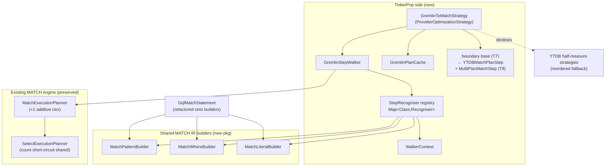

<!-- workflow-sha: d2dfcc2d44fabd3ac76c5fd7620f1e6013675ad9 -->
# Gremlin-to-MATCH Translator

## Design Document
[design.md](design.md)

## High-level plan

### Goals

Run the pattern-matching subset of TinkerPop traversals through the existing
cost-based `MatchExecutionPlanner` instead of the native left-to-right Gremlin
pipeline, so recognized queries gain MATCH's optimizations — cost-based start
selection, index lookups, prefetch, hash anti-joins — without any SQL text
round-trip.

- Translate a recognized Gremlin step list into the same in-memory IR the SQL
  `MATCH` parser produces (`Pattern` + alias maps + projection metadata,
  packaged as a new `MatchPlanInputs` record) and feed it to the planner via a
  single **additive** constructor (D2). No SQL is generated.
- Stay strictly additive: any unrecognized step declines the **whole**
  traversal to the unchanged native pipeline (D3), so no existing query
  regresses. Coverage grows track by track.
- Factor MATCH IR construction into a shared `match/builder/` package consumed
  by both the translator and the GQL front-end; GQL's observable behavior is
  unchanged (D6).
- Cache plans across queries, keyed on value-independent traversal shape, with
  predicate values bound as positional parameters (D5).
- Unify the exact `count(*)` fast path inside the MATCH engine so SQL, GQL, and
  translated Gremlin class-counts share one snapshot-isolated short-circuit
  (see design §"Aggregation barrier semantics").

### Constraints

- **Multiset equality is the contract.** Translator-on and translator-off must
  return the same elements the same number of times for every recognized shape.
  Element order is explicitly **not** pinned — MATCH's planner reorders, and
  pinning order would erase the optimization. The ~1900-scenario TinkerPop
  Cucumber suite must stay green.
- **Engine surface is preserved.** The only addition to the MATCH execution
  surface is one new public `MatchExecutionPlanner(MatchPlanInputs)` constructor
  (D2). Existing constructors, the IR classes, the execution steps, the grammar,
  and the evaluators are not modified — except the two new string-predicate AST
  nodes in D-TEXT-OPS and the count short-circuit refactor.
- **Recognizers see post-fold shapes.** The strategy runs after TinkerPop's
  structural folders (`IncidentToAdjacentStrategy`, `ConnectiveStrategy`,
  `LazyBarrierStrategy`), so `outE(L).inV()` arrives folded to `out(L)`,
  `and(P,P)` arrives as `AndStep`, and injected `NoOpBarrierStep`s appear
  between recognized steps.
- **Absent vs null-valued properties must stay distinct.** YTDB's record layer
  separates *absent* from *present-with-null*; the query-layer accessor
  collapses them. Filter (`IS DEFINED`) and projection (`hasProperty`) paths
  must compensate to match native Gremlin set membership (design §"Track 5
  commitment", §"Phase 1 dependency").
- **Custom TinkerPop fork** under the `io.youtrackdb` group ID shadows upstream
  `org.apache.tinkerpop` symbols — recognizers key on the fork's `Step`
  classes.
- 85% line / 70% branch coverage on changed code; JDK 21; `./mvnw` build.

### Architecture Notes

#### Component Map

```mermaid
flowchart TB
    subgraph TPside["TinkerPop side (new)"]
        Strat["GremlinToMatchStrategy\n(ProviderOptimizationStrategy)"]
        Walker["GremlinStepWalker"]
        Reg["StepRecogniser registry\nMap&lt;Class,Recogniser&gt;"]
        Ctx["WalkerContext"]
        Cache["GremlinPlanCache"]
        Boundary["boundary base (T7)\n← YTDBMatchPlanStep\n+ MultiPlanMatchStep (T8)"]
    end
    subgraph Builders["Shared MATCH IR builders (new pkg)"]
        PB["MatchPatternBuilder"]
        WB["MatchWhereBuilder"]
        LB["MatchLiteralBuilder"]
    end
    subgraph Engine["Existing MATCH engine (preserved)"]
        MEP["MatchExecutionPlanner\n(+1 additive ctor)"]
        SEP["SelectExecutionPlanner\n(count short-circuit shared)"]
    end
    Half["YTDB half-measure strategies\n(reordered fallback)"]
    GQL["GqlMatchStatement\n(refactored onto builders)"]

    Strat --> Walker --> Reg --> Ctx
    Strat --> Cache
    Reg --> PB & WB & LB
    Walker --> MEP
    MEP --> SEP
    Strat --> Boundary
    Strat -. declines .-> Half
    GQL --> PB & WB & LB
```

- **GremlinToMatchStrategy** — entry point; idempotent; walks the step list,
  decides yes/no for the whole traversal (D3), and on yes replaces every step
  with one boundary step. Registered before the three half-measure strategies
  via their `applyPrior()` (D4).
- **GremlinStepWalker + StepRecogniser registry** — index-driven walk;
  `Map<Class<? extends Step>, StepRecogniser>` keyed on the step's runtime
  class (D9). A recognizer may consume N steps in one claim (D10).
- **WalkerContext** — per-walk accumulator: pattern builder, alias maps,
  anonymous-alias generators, bound-parameter map, return/order/limit metadata,
  boundary output type.
- **Shared MATCH IR builders** — language-agnostic IR assembly; both the
  translator and the refactored `GqlMatchStatement` consume them (D6).
- **Boundary base / YTDBMatchPlanStep / MultiPlanMatchStep** — a shared boundary
  base extracted in Track 7 carries the row-projection + `ResultShaping`
  machinery bridging YTDB's `ExecutionStream` back to TinkerPop traversers; the
  single-plan `YTDBMatchPlanStep` and the N-plan `MultiPlanMatchStep` (Track 8,
  `union`, D8) both reuse it, plus an ordered list-shaping post-process that
  Track 9's terminators drive. Mechanism detail in `plan/track-7.md`
  `## Context and Orientation`.
- **Existing engine** — preserved; reached through one additive constructor
  (D2). The count short-circuit is factored to a shared helper the planner
  invokes (design §"Aggregation barrier semantics").

#### D1: Integration via `ProviderOptimizationStrategy`
- **Alternatives considered**: a custom `GraphTraversalSource` step; rewriting
  the Gremlin compiler; intercepting at `GraphStep` only.
- **Rationale**: a `ProviderOptimizationStrategy` is TinkerPop's sanctioned
  provider hook — it runs after structural folding, sees the whole step list,
  and can replace it wholesale. It composes with the existing YTDB strategies
  via the standard `applyPrior()`/`applyPost()` ordering contract.
- **Risks/Caveats**: ordering relative to the half-measure strategies and the
  structural folders must be explicit; mis-ordering changes what shapes the
  recognizers see. Handled by D4.
- **Implemented in**: Track 2

#### D2: Planner entry via additive `(MatchPlanInputs)` ctor; planner owns the projection block
- **Alternatives considered**: generate SQL `MATCH` text and re-parse;
  call `SelectExecutionPlanner.handleProjectionsBlock` from the strategy.
- **Rationale**: building the IR directly skips a parse round-trip and keeps the
  translator type-safe. The planner already calls `handleProjectionsBlock`
  internally inside `createExecutionPlan`; the strategy must **not** call it too
  (the consistency review caught a double-append). One additive constructor
  leaves the three existing ones untouched.
- **Risks/Caveats**: `MatchPlanInputs` must carry every field the planner reads
  post-parse; a missing field surfaces as a planning-time gap. Mitigated by the
  reused-steps audit (design §"Reused execution steps").
- **Implemented in**: Track 2
- **Full design**: design.md §"Overview", §"Workflow"

#### D3: All-or-nothing translation, no hybrid prefix
- **Alternatives considered**: hybrid — translate the longest recognized prefix
  and let an unrecognized suffix run natively over the boundary's output.
- **Rationale**: the hybrid required cross-boundary output-type negotiation,
  cross-boundary label propagation, and special-casing `path()` — each a bag of
  edge cases with no proportional benefit at Phase 1's small recognized set.
  All-or-nothing removes the boundary as a splice point: one unrecognized step
  declines the whole traversal and the native pipeline handles it verbatim.
- **Risks/Caveats**: a single unsupported step forfeits MATCH for the whole
  query. Accepted — coverage grows track by track; every declined shape is at
  least as well-served as before.
- **Implemented in**: Track 2 (decline logic); enforced by every recognizer
- **Full design**: design.md §"Overview"

#### D4: Strategy ordering — translator first, half-measure strategies as fallback
- **Alternatives considered**: remove the three half-measure strategies;
  declare ordering with `applyPost()` on the translator.
- **Rationale**: each half-measure strategy lists `GremlinToMatchStrategy` in
  its own `applyPrior()`, so TinkerPop's topological sort runs the translator
  first; the translator declares empty prior/post. On decline the original step
  list is preserved verbatim and the half-measures see it next, keeping today's
  behavior for shapes the translator does not yet cover.
- **Risks/Caveats**: `YTDBGraphCountStrategy` must stay (reordered, not removed)
  to serve multi-label and non-polymorphic counts the short-circuit declines.
- **Implemented in**: Track 2

#### D5: Plan cache in Phase 1, keyed on traversal shape, values bound at execution
- **Alternatives considered**: no cache in Phase 1; cache keyed on full
  bytecode including predicate values.
- **Rationale**: predicate values are bound as `SQLPositionalParameter` slots
  and elided from the key (mirroring YQL's `?` handling), so one plan serves
  every parameter value without cache thrash. The key is the value-independent
  generic-statement fingerprint; the cache spares only the expensive planner
  pass.
- **Risks/Caveats**: structural-vs-value classification must be correct — a
  value leaking into the key thrashes the cache; a structural token bound as a
  param serves a wrong plan. Schema changes reuse the YQL invalidation hook.
- **Implemented in**: Track 5
- **Full design**: design.md §"Parameter binding"

#### D6: Shared MATCH IR builder package; GQL refactor in Phase 1
- **Alternatives considered**: translator-private IR helpers; defer the GQL
  refactor to a later phase.
- **Rationale**: one builder package (`match/builder/`) serves both front-ends
  from day one, so the IR-construction contract is exercised by GQL's existing
  tests immediately. The GQL refactor is strictly behavior-preserving — its
  public API and test assertions are unchanged.
- **Risks/Caveats**: a behavior drift in the GQL refactor would surface as a GQL
  test failure; the builders must cover both today's GQL needs and the
  translator's full needs (chains, edges, predicates).
- **Implemented in**: Track 1
- **Full design**: design.md §"GQL refactor and shared builders evolution"

#### D7: Strategy idempotency
- **Alternatives considered**: rely on TinkerPop to apply strategies once; a
  per-traversal "translated" flag.
- **Rationale**: strategy chains can re-apply (clone for sub-traversal reuse,
  test harness re-application, lazy first-iteration apply). A single early scan
  of the whole step list for any boundary step returns immediately if found —
  O(N) over a single-digit step count, negligible cost, absolute safety. The
  scan keys on the Track 7 boundary base (D8 revised) so it detects both
  `YTDBMatchPlanStep` and the `union` `MultiPlanMatchStep`.
- **Risks/Caveats**: the scan must cover the entire list, not just the start
  step, because a wrapping source can place steps before a translated boundary.
- **Implemented in**: Track 2 (against `YTDBMatchPlanStep`); broadened to the
  boundary base in Track 8 when `MultiPlanMatchStep` lands.

#### D8: Union enters the recognized set; `optional` deferred to Phase 2 (revised after Track 6)
- **Original decision**: translate `union` by building one `SelectExecutionPlan`
  per child and concatenating their streams in a `MultiPlanMatchStep` that
  `extends YTDBMatchPlanStep`; all children must agree on output type or the
  union declines whole; `optional` deferred to Phase 2. Alternatives at the
  time: MATCH `splitDisjointPatterns` cartesian product (wrong semantics);
  ship `optional` in Phase 1.
- **What changed**: Track 7 Phase A reviews (technical / risk / adversarial,
  iter 1) found two realization gaps. (1) `YTDBMatchPlanStep` is a
  `public final class` with private lifecycle and projection machinery, so
  `MultiPlanMatchStep extends YTDBMatchPlanStep` cannot compile, and even
  de-finalized a subclass would inherit nothing reusable (constructors are not
  inherited). (2) The strategy declines any traversal whose start step is not a
  vertex `GraphStep` (`hasVertexGraphStart`), so start-position `union` declines;
  mid-traversal union children are prefix-relative sub-traversals that carry an
  `EndStep`, and the planned "sub-walk each child against the registry → one
  `SelectExecutionPlan`" accounted for neither, nor for a child→full-plan path
  (the existing `walkChild` yields a WHERE-predicate adapter, not a plan).
- **Revised decision**: the concatenation semantics and the all-children-agree-
  on-output-type decline gate are unchanged. The realization splits into two
  tracks. Track 7 (foundation) extracts a shared **boundary base** — an abstract
  superclass or a composed row-projector — from `YTDBMatchPlanStep` so both the
  single-plan step and a new `MultiPlanMatchStep` reuse projection + shaping.
  Track 8 (union) forks the traversal prefix into each child, strips the child
  `EndStep`, and builds one full `SelectExecutionPlan` per child;
  `MultiPlanMatchStep` iterates them with one live stream at a time, closing all
  child plans (including un-run ones) and cloning each against an isolated
  context, and stops advancing on the first child exception.
- **Alternatives considered**: de-finalize `YTDBMatchPlanStep` and subclass it
  directly (rejected — private machinery leaves the subclass nothing reusable
  and constructors are not inherited); keep the merged single-track plan
  (rejected — the base refactor plus prefix-forking union pushes the footprint
  past the split ceiling, user-approved split 2026-07-27).
- **Rationale**: only the realization is corrected, to compile and to handle the
  prefix / `EndStep` reality; the user-visible union semantics are untouched.
- **Risks/Caveats**: the base extraction touches a class every prior track's
  boundary depends on — a behavior-neutral refactor guarded by the projection /
  aggregate / equivalence suites and the full Cucumber re-run in Track 9. Union
  cache policy (single-plan cache value today) must be pinned in Track 8.
- **Implemented in**: Track 7 (boundary base), Track 8 (union) — revised from the
  original single Track 7.
- **Full design**: design.md §"Union semantics divergence"

#### D9: Type-keyed recognizer dispatch via `Map<Class<? extends Step>, StepRecogniser>`
- **Alternatives considered**: an ordered `instanceof` chain of recognizers.
- **Rationale**: `map.get(step.getClass())` on the concrete runtime class gives
  O(1) dispatch and **safe failure** on unknown subclasses — a future
  `BespokeHasStep extends HasStep` returns `null` and declines cleanly rather
  than misrouting through a parent recognizer. One map entry per `Step` class;
  each recognizer handles every variant internally (so `NotStep` is one
  recognizer branching on `hasEdgeHops`). Parallel tracks register disjoint keys
  and cannot collide; a duplicate-key assertion catches the rare clash.
- **Risks/Caveats**: a registered recognizer that branches internally still
  needs the no-mutation-on-decline discipline (per-recognizer unit invariant).
- **Implemented in**: Track 2 (walker + registry); per-class entries added by
  Tracks 2–7
- **Full design**: design.md §"Recogniser dispatch"

#### D10: Walker supports multi-step claims via index-driven iteration
- **Alternatives considered**: single-step-per-recognizer for-each loop with a
  look-back buffer.
- **Rationale**: non-adjacent edge filtering (`outE(L).has(...).inV()`) needs a
  recognizer to consume several steps in one claim. The walker loop is
  index-driven (`ctx.stepIndex`), so a recognizer advances the index by N
  instead of the default `++`. This is the first multi-step claim; it lands when
  edge filtering does.
- **Risks/Caveats**: a recognizer that mis-counts consumed steps corrupts the
  walk; the no-mutation-on-decline contract bounds the blast radius.
- **Implemented in**: Track 3
- **Full design**: design.md §"Edge filtering in non-adjacent chains"

#### D11: Unify the exact class-`count(*)` fast path in the MATCH engine
- **Alternatives considered**: keep declining class-count to the
  `YTDBGraphCountStrategy` front-end strategy (the earlier approach,
  motivated by preserving an O(1) non-snapshot-isolated count);
  per-front-end count optimizers (SQL / GQL / Gremlin each own one).
- **Rationale**: since YTDB-609 (#791) the class-count fast path stopped
  being O(1) / non-SI — `countClass(name, true)` is now a snapshot-isolated
  per-record-visibility scan, so the original "declining preserves O(1)"
  rationale no longer holds. Factoring `handleHardwiredCountOnClass*` out of
  `SelectExecutionPlanner` into a shared helper the `MatchExecutionPlanner`
  also invokes gives SQL, GQL, and translated Gremlin one exact SI count
  path; the dedicated `CountFromClassStep` / `CountFromIndexWithKeyStep` still
  win a constant factor (no record-body deserialization). This is the one
  engine-surface change beyond the additive ctor (D2).
- **Risks/Caveats**: `CountFromClassStep.canBeCached()==false`, so these MATCH
  plans are not cached (SELECT already behaves so). Multi-label and
  non-polymorphic counts decline to the reordered `YTDBGraphCountStrategy`
  fallback (D4). The genuine O(1) `approximateCountClass` stays detached —
  an opt-in count mode is Phase 2.
- **Implemented in**: Track 6
- **Full design**: design.md §"Aggregation barrier semantics"

#### D-IS-DEFINED: Adopt existing YTDB SQL `IS DEFINED` / `IS NOT DEFINED` operators
- **Alternatives considered**: map `has(key)`/`hasNot(key)` to `IS NULL`/`IS NOT
  NULL`; add new presence operators from scratch (the earlier design draft).
- **Rationale**: `IS NULL` over-matches — TP `hasNot(key)` is false for a
  property stored with literal `null` (the wrapper reports `isPresent()==true`),
  while `IS NULL` matches it. The grammar already has
  `SQLIsDefinedCondition`/`SQLIsNotDefinedCondition` (audit during PR #1038),
  routing through the `isDefinedFor` entity-presence primitive. Phase 1 only
  adds `MatchWhereBuilder.isDefined`/`isNotDefined` factories wrapping the
  existing AST nodes — no grammar, AST, or evaluator change.
- **Risks/Caveats**: presence predicates are not index-aware
  (`isIndexAware()==false`) — full-scan filters, as documented.
- **Implemented in**: Track 1
- **Full design**: design.md §"Phase 1 dependency: `IS DEFINED` / `IS NOT DEFINED` operators"

#### D-TEXT-OPS: Phase 1 string predicates — range prefix, collation-aware suffix/substring, case-sensitive regex
- **Alternatives considered**: `SQLLikeOperator` for prefix/suffix; decline all
  string predicates to native.
- **Rationale**: `LIKE` is unconditionally case-insensitive, rewrites literal
  `%`/`?` into wildcards, and is never index-aware — wrong on three axes.
  `startingWith` becomes the half-open range `field >= p AND field < p⁺` (index-
  aware, collation-respecting); `endingWith` needs a new `SQLEndsWithCondition`
  AST node; `regex` needs a find-mode flag on `SQLMatchesCondition`. Declining
  any one string predicate would decline the whole traversal under D3, so all
  translate.
- **Risks/Caveats**: suffix/substring/regex are full-scan (`isIndexAware()==
  false`); `regex` stays case-sensitive because collate-transforming a pattern
  changes its meaning. Adding the collate transform to `SQLContainsTextCondition`
  also makes SQL `CONTAINSTEXT` collation-aware (no-op on `default`).
- **Implemented in**: Track 4
- **Full design**: design.md §"Predicate translation"

### Invariants
- A recognized traversal contains exactly one boundary step —
  `YTDBMatchPlanStep` (single-plan) or `MultiPlanMatchStep` (union, its sibling
  under the Track 7 boundary base, D8) — after `applyStrategies()`; a declined
  traversal preserves the original step list verbatim. (Boundary-step engagement
  assertion — Tracks 2–9 tests.)
- No-mutation-on-decline: a recognizer that returns `false` leaves
  `WalkerContext` unmutated (per-recognizer unit invariant).
- The strategy is idempotent: re-applying on a traversal already containing a
  boundary step (`YTDBMatchPlanStep` or `MultiPlanMatchStep`) is a no-op.
- Translator-on and translator-off produce equal result multisets for every
  `RECOGNIZED` shape (`EdgeTraversalEquivalenceTest`).
- `GqlMatchStatement` observable behavior is unchanged after the builder
  refactor (its existing tests pass with the same assertions).

### Integration Points
- `GremlinToMatchStrategy` registered in the provider optimization chain; named
  in each half-measure strategy's `applyPrior()` (D4).
- `MatchExecutionPlanner(MatchPlanInputs)` additive ctor → existing
  `createExecutionPlan` pipeline (D2).
- Shared count short-circuit factored from
  `SelectExecutionPlanner.handleHardwiredCountOnClass*`, invoked by
  `MatchExecutionPlanner` after `buildPatterns`.
- `GremlinPlanCache` reuses the YQL plan-cache schema-change invalidation hook.

### Non-Goals
Phase 2+ (the translator declines these under D3; native pipeline handles them):
`optional(...)`; OR over edge-bearing sub-traversals; variable-depth
`repeat()/times()`; stateful side-effects (`sack`/`store`/`aggregate`); lambda
steps; `subgraph`; path manipulation (`simplePath`/`cyclicPath`/advanced
`path()`); `choose()`; custom DSL steps; edge-returning terminals and
user-facing edge aliases; edge property extraction; multi-label edges
(`out("a","b")`); mid-traversal list-shaping; singleton-collection equality on
schema-less fields; `profile()`. Full table: design.md §"Out of scope (Phase 2+)".

## Checklist

- [x] Track 1: Shared MATCH IR builders + GQL adoption + `IS DEFINED` / `IS NOT DEFINED` builder factories
  > Foundation track: creates the shared `match/builder/` package consumed by
  > both GQL and the upcoming Gremlin translator, and exposes
  > `MatchWhereBuilder.isDefined` / `isNotDefined` factories wrapping the
  > pre-existing `SQLIsDefinedCondition` / `SQLIsNotDefinedCondition` AST nodes
  > (D-IS-DEFINED) — wiring only, no grammar / parser / evaluator changes.
  > **Scope:** ~9 files covering three builder classes, `GqlMatchPatternAssembler`,
  > the behavior-preserving GQL refactor, the two presence-operator factories,
  > builder unit tests, and prettyPrint plan regression tests.
  > **Size:** ~7 in-scope files — below the ~12-file floor, kept standalone by
  > justification: the `match/builder/` package is foundational and is adopted
  > by GQL independently of the translator, so it stands alone as an
  > independently reviewable, independently mergeable PR.

- [x] Track 2: Strategy skeleton + boundary step + minimal `g.V()` / `g.V(ids)` translation
  > Wires `GremlinToMatchStrategy` into the optimization chain and establishes
  > the end-to-end pipeline with the simplest recognized traversal. Lands the
  > cross-cutting scaffolding every later track extends: the `MatchPlanInputs`
  > record + the single additive `MatchExecutionPlanner` ctor (D2), the
  > `GremlinStepWalker` + `WalkerContext` + `StepRecogniser` registry (D9) +
  > `StartStepRecogniser`, idempotency (D7), the
  > anonymous-alias generator, and the `YTDBMatchPlanStep` boundary; registers
  > the strategy and reorders the three half-measure strategies' `applyPrior()`
  > (D4).
  > **Scope:** ~19 files covering the record + planner ctor, strategy skeleton
  > with structural gating + ordering + idempotency, walker + context +
  > recogniser registry + start recogniser, anon-alias generator,
  > boundary step, registration + half-measure edits, minimal `g.V()` /
  > `g.V(ids)` translator, and strategy / boundary tests + a Cucumber
  > smoke check.
  > **Depends on:** Track 1.
  >
  > **Strategy refresh:** CONTINUE — Track 2's discoveries are absorbed by
  > Track 3's plan with no scope, dependency, or ordering change to Tracks 3–6:
  > `useCache=false` binds the shared planner ctor, `WalkerContext.polymorphic`
  > now exists so Track 3 only adds the chain-target read, the throw-safety net
  > rethrows `Error`/`AssertionError`, `clone()` isolation already covers
  > multi-node patterns, and the anon-alias generator deferred from Track 2
  > lands here. (Phase A reviews then corrected two plan premises — see the
  > Track 3 entry below and `plan/track-3.md` `## Surprises & Discoveries`:
  > chain-target `@class` narrowing is dropped entirely because even
  > `polymorphic=false`-gating replays BC2, and edge filtering needs an
  > edge-as-node builder extension the plan had assumed away.)

- [x] Track 3: Edge traversal — `out` / `in` / `both`, folded `outE.inV` etc., plus non-adjacent edge filtering
  > Extends the recognized set with edge-traversal patterns and non-adjacent
  > edge filtering (`outE(L).has(...).inV()`). The walker gained multi-step
  > recognition through a walker-owned step cursor (D10). Bare chain-hop
  > targets root at `V` polymorphically — no `@class` narrowing (BC2). Edge
  > filtering uses the edge-as-node form (`outE(L){as $e, where}.inV()`) via a
  > new builder/assembler capability (the executor already supports it;
  > `MatchPatternBuilder.addEdge` cannot filter edges). `WalkerContext.polymorphic`
  > and the `ELEMENT` boundary already landed in Track 2; Track 3 re-pins the
  > boundary to the last hop's target and builds the anonymous-alias generator
  > + reserved-`$` scan deferred from Track 2.
  >
  > **Track episode:** Edge traversal on a walker-owned step-cursor
  > architecture; completed as-is over an unreviewed 14-commit post-review
  > rework — see `plan/track-3.md` `## Episodes` § Track completion. (3 steps, 0 failed)
  >
  > **Track file:** `plan/track-3.md`
  >
  > **Strategy refresh:** ADJUST — Track 4's track file reconciled to Track 3's
  > post-review rework before decomposition: folded-`hasLabel` narrowing via
  > `MatchWhereBuilder.classEquals` (`MatchClassFilters` deleted), the
  > already-landed absent-property `neq` semantics (`k IS DEFINED AND k <> v`),
  > the `Outcome recognize(StepCursor, RecognitionContext)` recogniser contract,
  > and the new `WalkerContext` shape. Scope, dependencies, and ordering for
  > Tracks 4–6 unchanged.

- [x] Track 4: Filtering — predicates (`has` / `hasLabel` / `hasId`, `P` / `Text` / `TextP`)
  > Translates the Gremlin predicate surface into MATCH WHERE clauses: the
  > full `P` / `Text` / `TextP` predicate algebra (string operators per
  > D-TEXT-OPS), `has` / `hasLabel` / `hasId`, and the bare presence form
  > `has(key)` (`IS DEFINED`, D-IS-DEFINED). Comparison values render as
  > inline literals here; Track 5 flips them to positional parameters when it
  > lands the plan cache. The logical filters and the cache split off to
  > Track 5 (adversarial A1). Detail in plan/track-4.md.
  >
  > **Track episode:** Full predicate adapter, HasStep / presence recognisers,
  > D-TEXT-OPS SQL layer; Phase C A1 pin reversed `eq(null)` to bare `IS NULL`
  > — see `plan/track-4.md` `## Episodes` § Track completion. (3 steps, 0 failed)
  >
  > **Track file:** `plan/track-4.md`

- [x] Track 5: Logical filters + plan cache — `and` / `or` / `not` / `where`, sub-walker, `GremlinPlanCache` (D5)
  > Splits off from Track 4 at decomposition (adversarial A1: the merged
  > predicate + logical surface realized past the ~25-file split ceiling with
  > a clean seam, user-approved 2026-07-15). Adds the step-level logical
  > filters (`and` / `or` / `not` / `where`) and the `hasNot(key)` negation,
  > each composed by a sub-walker (`SubTraversalPredicateAdapter`) that runs
  > the child sub-traversal against the same registry; a single `NotStep`
  > recogniser owns `NotStep.class` (A2). Lands the `GremlinPlanCache` (D5):
  > predicate values bind as positional parameters so one plan serves every
  > value, keyed on the post-walk generic-statement fingerprint (A3), with
  > RID-bearing shapes bypassing the cache (R3). Detail in plan/track-5.md.
  >
  > **Track episode:** Sub-walker seam, combinator recognisers, D5 plan cache
  > with positional parameters; Phase C PASS (0 blockers). See
  > `plan/track-5.md` `## Episodes` § Track completion. (5 steps + 2
  > post-step refactors, 0 failed)
  >
  > **Track file:** `plan/track-5.md`

- [x] Track 6: Result shaping — labels + dedup, projections, order/pagination, aggregations
  > Merges the four result-producing step families — labels + dedup,
  > projections, order / pagination, and aggregations — pinning the boundary
  > output type per terminal step. The load-bearing cases are absent-vs-null
  > (`EntityImpl.hasProperty(key)`) and the empty-input aggregate divergence,
  > handled by the `dropOnAbsent` / `dropNullRows` boundary flags, with a shared
  > `ByModulatorTranslator` serving the `by(...)` modulator across the families.
  > Detail in plan/track-6.md.
  > **Scope:** ~20 files covering as-label + dedup walker extensions,
  > `GremlinProjectionAssembler` + projection recognisers, the shared
  > `ByModulatorTranslator`, `Order` / `Range` recognisers, aggregate
  > recognisers + the shared count short-circuit helper (`MatchExecutionPlanner`
  > + `SelectExecutionPlanner` edits), and parity / projection / absent-vs-null /
  > aggregate-equivalence / empty-result tests.
  > **Depends on:** Track 4, new Track 5 (the sub-walker its `by`-value
  > accumulators reuse), and Track 1 (`hasProperty` primitive / presence check).
  >
  > **Track episode:** Four result-producing step families on per-terminal
  > boundary output types; shared `ByModulatorTranslator`, count short-circuit
  > to `CountFromClassStep`, absent-vs-null via `dropOnAbsent` / `dropNullRows`.
  > Phase C deeper re-audit plus two further re-review passes fixed a plan-cache
  > count disclosure, dedup-after-projection, aggregate-clause-order, and
  > concurrent-DDL cache staleness; the seven shaping flags folded into
  > `ResultShaping`. See `plan/track-6.md` `## Episodes`. (7 steps + 6b +
  > post-completion tail, 0 failed)
  >
  > **Track file:** `plan/track-6.md`
  >
  > **Strategy refresh:** ADJUST — Track 7's three list-shaping post-process
  > flags (`unfoldOutput` / `reverseOutput` / `tailLimit`) re-pointed to Track 6's
  > `ResultShaping` record (extend the record via `withX` rather than adding
  > individual `WalkerContext` fields), and `MultiPlanMatchStep` inherits the
  > post-refactor single-`ResultShaping` `YTDBMatchPlanStep` constructor. Scope,
  > dependencies, and ordering unchanged; applied in the Phase A track-file write.
  > (Both premises were overturned by the 2026-07-27 split — see D8 and Tracks
  > 7/8/9: `MultiPlanMatchStep` extends the shared boundary base Track 7
  > extracts, not `YTDBMatchPlanStep`, and the list-shaping post-process is an
  > ordered `List` because order-less flags cannot encode `reverse().unfold()`
  > vs `unfold().reverse()`.)

- [x] Track 7: Boundary base extraction + ordered list-shaping infrastructure
  > Foundation refactor for the last feature slice: the original Track 7's Phase
  > A reviews found `MultiPlanMatchStep extends YTDBMatchPlanStep` does not
  > compile (`YTDBMatchPlanStep` is `final` with private machinery), so this
  > track extracts a shared boundary base — abstract superclass or composed
  > row-projector — from `YTDBMatchPlanStep` that both the single-plan step and
  > the upcoming `MultiPlanMatchStep` (Track 8) reuse for row projection +
  > `ResultShaping` (D8 revised). It also introduces the ordered list-shaping
  > post-process (declared-order fold / unfold / reverse / tail — order-less
  > flags cannot encode `reverse().unfold()` vs `unfold().reverse()`) that
  > Track 9 drives, all behavior-neutral. Detail in plan/track-7.md.
  >
  > **Track episode:** Extracted the `AbstractMatchPlanStep` base and added the
  > `ListShapingOp` ordered list-shaping carrier — behavior-neutral
  > infrastructure for Track 8 (multi-plan advance-on-drain over the base) and
  > Track 9 (fold/tail ops registered into the carrier) — see `plan/track-7.md`
  > `## Episodes` § Track completion. (2 steps, 0 failed)
  >
  > **Track file:** `plan/track-7.md`
  >
  > **Strategy refresh:** CONTINUE — Track 7 delivered the `AbstractMatchPlanStep`
  > base (four plan-seam hooks + `resetLifecycleForClone()`) that Track 8's
  > `MultiPlanMatchStep` extends, and already retargeted the D7 idempotency
  > `instanceof` scan to the base. Track 8's `## Interfaces and Dependencies`
  > "broaden the scan" sub-item is therefore a no-op the decomposer drops,
  > keeping only union-recogniser registration on `GremlinToMatchStrategy`. No
  > scope, dependency, or ordering change to Tracks 8–9.

- [ ] Track 8: Union via `MultiPlanMatchStep`
  > Adds `union(...)` (D8): a `UnionStepRecogniser` that forks the traversal
  > prefix into each global child, strips the child `EndStep`, and builds one
  > full `SelectExecutionPlan` per child; and a `MultiPlanMatchStep` (subclass of
  > the Track 7 boundary base) that concatenates the plans with one live
  > `ExecutionStream` at a time, closes every child plan including un-run ones,
  > clones each against an isolated context, and stops advancing on the first
  > child exception. All children must agree on output type or the union declines
  > whole; start-position union declines under the vertex-`GraphStep` start gate.
  > Pins the union plan-cache policy. Detail in plan/track-8.md.
  > **Scope:** ~10–14 files covering `UnionStepRecogniser`, `MultiPlanMatchStep`,
  > the prefix-fork + `EndStep`-strip + child→`SelectExecutionPlan` path in the
  > walker / translator, the cache-policy pin, and concatenation / lifecycle /
  > leak / exception-stops-advance tests.
  > **Depends on:** Track 7.

- [ ] Track 10: Query-metrics regression remediation — restore a green `core` unit-test run
  > **Runs before Track 9** despite the higher number (inline replan, 2026-08-01).
  > Four `YTDBQueryMetricsStrategyTest` scenarios have failed since 2026-07-16;
  > `./mvnw -pl core test` has been red on this branch for 117 commits, hidden
  > because PR #1038 is a draft and every CI check reports `skipping`. Two
  > culprits: `6e657ce2b1` (Track 4 era) removed `YTDBGraphStep` from translated
  > traversals, which is the only step `YTDBQueryMetricsStep.capturedExecutionPlan()`
  > read; Track 8's `3d476357cc` then repaired three scenarios and broke a fourth.
  > **Scope:** settle the `AbstractMatchPlanStep.reset()`-from-`CLOSED` contract
  > (the one genuine product defect — re-iteration yields `[]` where native
  > re-executes), settle the `g.V(rid)` plan-capture contract, decide the
  > `MatchFirstStep` introspection question **after** establishing whether the
  > index is still used at all, and close the detection hole.
  > **Depends on:** Track 8.
  > **Why a separate track:** the root cause spans Track 4 and Track 8, so
  > folding it into Track 8's Phase C would attribute Track 4's defect to Track
  > 8's diff. Numbering kept at 10 rather than renumbering Track 9, because Track
  > 8's file, DR-U4, and its cross-track hints all name "Track 9" for the
  > list-shaping terminators.

- [ ] Track 9: List-shaping terminators + hardening — Cucumber green + JMH baseline
  > Completes and validates the feature. Adds the four list-shaping terminators
  > (`fold` / `unfold` / `reverse` / `tail`) as last-step recognisers driving the
  > Track 7 ordered post-process: `fold` → `BoundaryOutputType.LIST` (with the
  > exhaustive `projectOrSkip` switch extended and a drain / ring-buffer stage),
  > `tail(n)` matched on the `TailGlobalStepContract` interface so the
  > `TailGlobalStepPlaceholder` form is not silently declined (`n=0` emits
  > nothing, `n<0` declines), mid-traversal use declines under D3. Then the full
  > TinkerPop Cucumber suite green with the strategy registered (the first
  > whole-feature gate over all six tracks' recognisers) and a Gremlin-on-vs-off
  > JMH baseline pinned to verified-recognised shapes. Detail in plan/track-9.md.
  > **Scope:** ~14–20 files covering the four terminator recognisers +
  > `BoundaryOutputType.LIST` + drain / ring-buffer, terminator-composition +
  > `tail` boundary tests, the mirrored Gremlin JMH benchmark classes + on/off
  > harness, the per-step scenario catalogue, and the Cucumber re-run + any
  > cross-track mistranslation fixes (triage bucket unsized until the first run).
  > **Depends on:** Tracks 7 and 8.

## Implementation state

Tracks 1–7 are executed and complete; Track 8 Phase B is complete (Phase C pending); Track 9 is not started. Track 1 delivered the shared `match/builder/` package, the behavior-preserving `GqlMatchStatement` refactor (via `GqlMatchPatternAssembler`), and the `IS DEFINED` / `IS NOT DEFINED` presence factories. Track 2 delivered the `GremlinToMatchStrategy`, `GremlinStepWalker` + `StepRecogniser` registry, and `YTDBMatchPlanStep`. Track 3 delivered edge traversal. Track 4 delivered the predicate surface. Track 5 delivered logical filters, the sub-walker, and `GremlinPlanCache` (D5). Track 6 delivered result shaping. Track 7 extracted `AbstractMatchPlanStep` and the ordered list-shaping post-process carrier. Track 8 Phase B delivered `MultiPlanMatchStep`, multi-plan `TranslationResult` + strategy splice, `UnionStepRecogniser` behind `UnionForkHost`, and union `cacheEligible=false` (D8 code path). Track 9 still owns list-shaping terminators + Cucumber green + JMH baseline (D3).

| Track | Code | Notes |
|---|---|---|
| 1 | done | shared builders + GQL adoption + `IS DEFINED` / `IS NOT DEFINED` factories |
| 2 | done | strategy + walker / registry + boundary step + `g.V()` / `g.V(ids)` translation |
| 3 | done | edge traversal — direction handlers, folded edge chains, non-adjacent edge filtering |
| 4 | done | predicate surface — full `P` / `Text` / `TextP` algebra incl. D-TEXT-OPS, `has` / `hasLabel` / `hasId`, `has(key)` presence |
| 5 | done | logical filters (`and` / `or` / `not` / `where`) + `hasNot(key)` + sub-walker + `GremlinPlanCache` (D5) |
| 6 | done | result shaping — labels / dedup, projections, order / pagination, aggregations; shared `ByModulatorTranslator` + count short-circuit |
| 7 | done | `AbstractMatchPlanStep` + ordered list-shaping post-process carrier |
| 8 | Phase B done | `MultiPlanMatchStep` + multi-plan carrier/splice + `UnionStepRecogniser` / `UnionForkHost`; Phase C pending |
| 9 | not started | list-shaping terminators (`fold`/`unfold`/`reverse`/`tail`) + `BoundaryOutputType.LIST` + Cucumber green + JMH baseline |

Decision conformance: D6 and D-IS-DEFINED are satisfied by Track 1; Track 2 decisions (decline, class-keyed dispatch, boundary lifecycle, idempotency, translator-first) by Track 2; D10 by Track 3; D5 by Track 5; D11 by Track 6. D8 (union via `MultiPlanMatchStep`) is implemented in code across Tracks 7–8; Track 8 Phase C still open. D3 (list-shaping terminators) lands in Track 9.

Track 1 deferral: `MatchWhereBuilder.endsWith` / `matchesRegex` are not built in this track. Their AST backing (`SQLEndsWithCondition`, `SQLMatchesCondition` find-mode) is introduced by Track 4's D-TEXT-OPS work; the baseline-backed `containsText` (`SQLContainsTextCondition`) and `startsWith` (half-open range) ship in Track 1. See plan/track-1.md § Decision Log.
