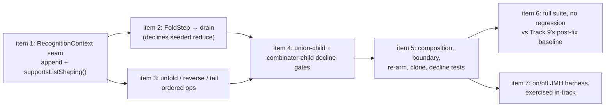

<!-- workflow-sha: d2dfcc2d44fabd3ac76c5fd7620f1e6013675ad9 -->
# Track 11: List-shaping terminators + JMH harness

## Purpose / Big Picture
After this track the four list-shaping terminators (`fold` / `unfold` / `reverse` / `tail`) translate as last steps through Track 7's ordered post-process carrier, every shape that must decline does so rather than answering wrongly, the full TinkerPop Cucumber suite shows no regression against Track 9's recorded baseline, and a Gremlin-on-vs-off JMH harness runs end to end in-track. This completes the Phase 1 recognised set and validates the whole feature across every prior track.

<!-- Reserved for Move 2 — ADDED/MODIFIED/REMOVED triad. Empty until Move 2 lands. -->

Second half of the split final track (inline replan, 2026-08-03 — see `plan/track-9.md` `## Decision Log` DR-S1). **Runs after Track 9**, which delivers a feature suite that completes and a post-fix baseline this track's regression claim is measured against.

## Progress
- [ ] Review + decomposition
- [ ] Step implementation
- [ ] Track-level code review
- [ ] Track completion

## Surprises & Discoveries
<!-- Continuous-log. Empty at Phase 1. -->

## Decision Log
<!-- Continuous-log. -->

- **DR-T1 — the terminators ride `ListShapingOp`; no `BoundaryOutputType` constant is added.** The pre-split plan called for `fold()` → `BoundaryOutputType.LIST` plus a `projectOrSkip` `LIST` arm. Phase A's technical review established that this is the wrong mechanism, not merely a heavier one. `projectOrSkip` is a per-row projector — one MATCH row in, one traverser payload or the `SKIP` sentinel out — so an N→1 drain has no expressible arm there. Worse, `outputType` is the one thing that tells the boundary how to project each element, so re-pinning it to `LIST` would erase exactly what the drain needs to build the list's contents: `g.V().fold()` needs `ELEMENT` per row, `g.V().values("name").fold()` needs `SINGLE_VALUE`, `g.V().valueMap().fold()` needs `MAP`. All four terminators are barrier / flat-map / window / value transforms riding Track 7's ordered `ListShapingOp` carrier through `AbstractMatchPlanStep.applyListShaping`. Nor do they belong beside the group `accumulateMap` branch: that selects a *source* in `openShapedPayloads`, outside `applyListShaping`, and could not order `reverse().unfold()` against `unfold().reverse()` — the reason Track 7 built an ordered carrier at all. `BoundaryOutputType` keeps its four constants (`ELEMENT`, `MAP`, `SINGLE_VALUE`, `SCALAR`).
- **DR-T2 — the append seam carries a decline channel, not just a mutator.** The recognisers must *append* to `ResultShaping.listShapingOps()` and today cannot read what is there, so a naive `setResultShaping(NONE.with…)` would wipe a sibling recogniser's flags and two ops could never compose. That much needs an append method. But `subWalk` drives `and` / `or` / `not` / `where` / `filter` children through **the same recogniser map**, and a `void` append has no way to tell a recogniser the context refused — so a combinator child's trailing `fold()` gets claimed with no way to back out. Both in-repo templates are wrong for this: copying `SubTraversalPredicateAdapter`'s swallow of `setResultShaping` turns `g.V().and(__.out().fold())` into an existence filter (native is always true, because a dry upstream still emits one empty list) and rows silently disappear; copying `appendPostConcatOp` throws `UnsupportedOperationException` out of `TraversalStrategy.apply()`, breaking the all-or-nothing contract loudly. The seam therefore pairs a query with the mutator — `supportsListShaping()`, overridden `false` on the adapter — and each recogniser declines when it reads false. These shapes are only safe today because `FoldStep` is unregistered; this track's own registration is what opens the path.
- **DR-T3 — the union-child gate is deliberately blanket.** `union(__.out().fold(), __.in().fold())` must decline: native produces one list per child, translation would produce one list over the concatenation. Today the only thing preventing that silent wrong answer is lambda reference identity, since `UnionStepRecogniser` compares `!agreedShaping.equals(childResult.shaping())` and `ResultShaping` is a record whose `equals` compares `listShapingOps` element-wise — per-call `new` instances decline by accident, record singletons (this codebase's house style, see `PostConcatOp.Count.INSTANCE`) compare equal and ship the wrong answer. Only `fold` and `tail` actually diverge; `unfold` and `reverse` are per-payload, so once-over-the-concatenation and once-per-child coincide. The gate is nonetheless blanket over all four, because `ListShapingOp` carries no op-type discriminator and adding one is not work this track claims. `union(__.unfold(), __.unfold())` declines as collateral: coverage lost, no correctness risk, no worse than today. It stays a Phase 2 shape.
- **The baseline this track reads is Track 9's last measurement, not its first and not its post-item-2 one.** Track 9's dropped-filter fix moves a large minority of the Cucumber result set in both directions, and its triage item fixes more on top, so a regression claim measured against anything earlier is meaningless. Track 9 re-runs both runners after its final fix and publishes that artifact explicitly for this purpose.

## Outcomes & Retrospective
<!-- Continuous-log. Empty at Phase 1. -->

## Context and Orientation

The four list-shaping terminators are accepted only as the **last** step (D3). `fold()` registers a `ListShapingOp` that drains the upstream payload iterator into one `List` and emits it as a single payload; a dry upstream still emits one empty list. `unfold()` flat-maps per emission. `reverse()` is a per-traverser **value** transform mirroring `ReverseStep.map`, not a stream-order reverse. `tail(n)` keeps the last `n` in arrival order via a bounded `ArrayDeque` ring buffer (`n=0` emits nothing, `n<0` declines). They register ordered ops into the Track 7 post-process carrier, so `reverse().unfold()` and `unfold().reverse()` are both accepted with declared order preserved, while `fold().unfold()`, `fold().tail(3)`, and any mid-traversal list-shaper decline.

**`FoldStep` is two steps wearing one class.** `javap` on the resolved fork jar shows `FoldStep(Traversal.Admin)` for the list fold and `FoldStep(Traversal.Admin, Supplier, BiFunction)` for the seeded reduce that `fold(seed, operator)` compiles to, distinguished by a `listFold` boolean behind `isListFold()`. D9 keys the registry on the concrete runtime class, so one entry claims both forms; mapping both to a list drain would turn `g.V().values("age").fold(0, Operator.sum)` from one summed scalar into a list of ages, translated rather than declined and therefore silent.

**`UnfoldStep.flatMap` dispatches five ways, not one.** `Iterator` returned as-is; `Iterable` via `.iterator()`; **`Map` via `.entrySet().iterator()`**; array per-element (`handleArrays`, both `Object[]` and primitive arrays by reflection); anything else via a one-element `IteratorUtils.of(value)`. The `Map` arm is load-bearing because `MAP` is a live boundary output type — `group()`, `groupCount()`, `valueMap()`, `elementMap()`, `project()`, and multi-alias `select()` all pin it, and `AbstractMatchPlanStep.projectMap` / `accumulatedGroupMapSource` emit `LinkedHashMap` payloads — so `g.V().groupCount().unfold()` and `g.V().valueMap().unfold()` are ordinary idioms present in the Cucumber suite. The one-element arm matters too: `g.V().unfold()` over `ELEMENT` payloads passes each vertex through unchanged rather than dropping it.

**`tail(n)` arrives in two forms and reading its limit has a side effect.** Both `TailGlobalStep` and `TailGlobalStepPlaceholder` implement `TailGlobalStepContract.getLimit()`, and `TailGlobalStepContract.CONCRETE_STEPS` is `List.of(TailGlobalStep.class, TailGlobalStepPlaceholder.class)` — the registration source of truth rather than two hand-written literals that could drift. `TailGlobalStepPlaceholder.getLimit()` is not a pure read: it checks `GValue.isVariable()` and, when true, calls `traversal.getGValueManager().pinVariable(name)` before returning the concrete `Long`, so reading the limit and then declining on `n<0` leaves the manager mutated and a parameterised `tail(n)` stripped of its variable status. This is precedent-consistent — `RangeGlobalStepPlaceholder.getLowRange()` has byte-identical pinning and `RangeGlobalStepRecogniser.normalize` reads it before its own decline branches, and the mutation lands on TinkerPop's GValue manager rather than on `WalkerContext`, so D9's no-mutation-on-decline discipline is not literally violated. The choice is deliberate either way.

**The boundary base carries seven lifecycle states and shares op instances.** `AbstractMatchPlanStep.State` now holds `NEW`, `OPEN`, `DRAINED`, `REARMED`, `CLOSED`, plus Track 10's `CLOSED_UNSTARTED` and `REARMED_AFTER_CLOSE`. A `fold` drain lands cleanly on `OPEN → DRAINED` and on the failure path, so the lifecycle itself is fine — but two op properties are not free. `applyListShaping` calls `op.apply(...)` afresh on every open, and there are three open routes (`NEW`, `REARMED`, `REARMED_AFTER_CLOSE`), so an op allocating its buffer once outside the returned iterator replays the first pass's payloads on the second. And `AbstractStep.clone()` copies `shaping` by reference while `resetLifecycleForClone()` deliberately does not touch it, so two concurrent clones share the *same* `ListShapingOp` instances — a stateful `fold` or `tail` op is then a data race, and the ops most likely to be written as shared singletons are exactly the two that need buffers.

**One in-repo javadoc contradicts the union behaviour this track relies on.** `MultiPlanMatchStep.startPlanStream()` returns one `MultipleExecutionStream` over a lazy per-child producer, the base's `openShapedPayloads()` runs once per arming over that single stream, and `MultiPlanMatchStep`'s class javadoc says so outright. `ListShapingOp`'s javadoc says the opposite — that the base rebuilds its shaped iterator "once per child plan for a multi-plan boundary" — which is false and would lead an implementer to expect one list per child.

### Clarifications
- **Reference accuracy in this track file is file-and-grep-based, not PSI.** mcp-steroid is reachable but `steroid_execute_code` times out on this repository (cold kotlinc exceeds the MCP call limit). Declaration-level reads and `javap` on the resolved fork jar are reliable; "no other caller" negatives are not established. Re-verify through PSI at decomposition if the IDE recovers.
- **The project uses its own TinkerPop fork under group id `io.youtrackdb`, not upstream `org.apache.tinkerpop`.** Every `FoldStep` / `UnfoldStep` / `ReverseStep` / `TailGlobalStep` semantic above was read from the resolved fork jar, and any re-verification must resolve against the same jar.
- **CI covers both Cucumber runners from Track 9's repeat fix onward, on the translator-on arm only.** PR #1038 is a draft, so most checks report `skipping`, and before the fix the pipeline was useless here: runs at `96c37d3e74` and `5bc12478d6` both hung at `CountTest$Traversals` and died before the Cucumber executions, leaving `YouTrackDB Embedded ... SKIPPED`. At `b35ac67d2f` the whole reactor passes (CI runs with `-Dmaven.test.failure.ignore=true`), and eight platform legs report `core`'s `gremlin-feature-compliance-tests` at 1930 / 41 failures / 14 skipped in 16.09 s and `embedded`'s `EmbeddedGraphFeatureTest` at 1931 / 41 / 14 in 14.57 s. **CI never sets the kill-switch**, so it supplies one arm of any A/B and never the control; anything this track gates on an on-vs-off comparison is still verified locally. The pipeline also uploads `**/target/deadlock-report.txt`, which names a stalled scenario without needing a local run.
- **A bare `./mvnw -pl core test` may not reach the Cucumber execution.** It stops at `gremlin-process-compliance-tests` while any deferred failure stands; the CI reactor summary above is the worked example. Use `-Dmaven.test.failure.ignore=true` for full-suite gates, and `./mvnw -pl core test-compile surefire:test@gremlin-feature-compliance-tests` (~20 s) for the iteration loop. The `test-compile` is load-bearing rather than tidy: `surefire:test@<id>` invokes the mojo directly, runs no lifecycle phase, and therefore measures whatever was last compiled, which republishes a stale number as a fresh one (`plan/track-9.md` § Decision Log, T22). Add `-Dyoutrackdb.test.deadlock.timeout.minutes=1` so a stall names its own scenario in `core/target/deadlock-report.txt` within a minute instead of hanging until killed by hand.
- **The `embedded` half of item 6 runs as two commands, not one.** `./mvnw -pl core -am install -DskipTests` first, then `./mvnw -pl embedded test`. Repeat the install after every code change the re-run is meant to measure — this track's whole deliverable is new `core` code, so a run against a stale jar exercises none of it and still reports no regression. The resolution mechanism is in `plan/track-9.md` § Clarifications.

## Plan of Work
1. **Add the `RecognitionContext` seam, with its decline channel, before any recogniser.** Add `void appendListShapingOp(@Nonnull ListShapingOp op)` and `default boolean supportsListShaping() { return true; }` to `RecognitionContext`. Implement the append on `WalkerContext` as `withListShapingOps(existing + op)` — `ResultShaping.withListShapingOps(@Nonnull List<ListShapingOp>)` exists at `ResultShaping.java:106`, replaces the list wholesale, and has no production caller yet. Override `supportsListShaping()` to `false` on `SubTraversalPredicateAdapter`; its answer is **decline**, specifically neither swallow nor throw (DR-T2 records why each is wrong). Update the `setResultShaping` javadoc's "calls this once" clause in the same commit, and write down the two limits: `setResultShaping` remains a full replace of the whole record including `listShapingOps`, so the append's no-clobber guarantee covers only recognisers that use the new method, and what keeps the two from colliding is D3's last-step rule plus `UnionStepRecogniser` calling `setResultShaping(agreedShaping)` before any suffix op appends.
2. **`FoldStep` recogniser** registering a drain `ListShapingOp` that folds the upstream payload iterator into one `List` payload; a dry upstream emits one empty list. `outputType` stays where the preceding step pinned it — no enum constant, no `projectOrSkip` arm (DR-T1). Declines when `!step.isListFold()`, and declines when `supportsListShaping()` is false.
3. **`UnfoldStep` / `ReverseStep` / `TailGlobalStep` recognisers** registering ordered ops into the same carrier: `unfold` flat-map honouring all five `flatMap` arms with a cross-call pending-emission buffer; `reverse` per-value transform; `tail` bounded ring buffer registered from `TailGlobalStepContract.CONCRETE_STEPS`, `n=0` → nothing, `n<0` → decline. Decide the `getLimit()` GValue question deliberately — read `getLimitAsGValue()` and decline on `isVariable()` before touching `getLimit()`, or match the Track 6 precedent and record why. Mid-traversal use declines (D3). Correct `ListShapingOp`'s one-line `unfold` description, which today says only "expands a list payload into its elements".
4. **Close both child holes and relax the post-union suffix allow-list.** **Two hard constraints landed under this item from Track 9 step 7 (`plan/track-9.md` `## Episodes` §Step 7), and one of them is now a build failure rather than a review catch.** The allow-list gained a second axis: `StepRecogniser.selectsPositionally(Step)`, safe-defaulting to `false`, with a unit test over `POST_UNION_RECOGNISERS` that **fails the build** if a member inherits the default. A `tail` recogniser must therefore answer **`true`** — `tail(n)` selects from the end of the concatenation, the position the two arrival orders disagree about hardest — which leaves it translatable only ahead of an immediate `count()`. And **`fold` cannot be a bare post-union suffix at all**: the folded result is a one-element multiset whose member is a `List`, and `List.equals` is order-sensitive, so the same ordering non-determinism that took `range` off the list takes `fold` off it. Both re-read against `2def4d43f0`, which changed the union surface under this item. Then add the four terminator recognisers to `GremlinStepWalker.POST_UNION_RECOGNISERS` (today `count` / `range` / `dedup`, Track 8 DR-U4); both readers are the walker's own — `dispatchAll`'s fail-closed gate and `postUnionSuffixTranslatable`'s look-ahead — so the one field covers both paths. Then gate the two child paths, which are different methods and need separate work: **union children** (`walkFork`) decline when any child's `shaping().listShapingOps()` is non-empty, checked before and independently of the `agreedShaping.equals` comparison (DR-T3); **combinator children** (`walkChild`, driving `AndStep` / `OrStep` / `NotStep` / `TraversalFilterStep` / `WhereTraversalStep`) decline through the item-1 seam. The union *suffix* path is unaffected and still folds once over the whole concatenation — 4's child gate inspects `childResult.shaping()` inside the child loop while a suffix op appends onto `agreedShaping` afterward, so the two are disjoint by construction. Fix `ListShapingOp`'s false "once per child plan for a multi-plan boundary" javadoc clause in the same item; the surrounding advice — allocate the buffer inside the returned iterator, hold no state across calls — stays correct for the reset-and-reopen case.
5. **Tests.** Composition and boundary: `tail` `n=0` / `n<0`, empty-input `fold`, `reverse` value-transform-not-reorder, `unfold` buffer, declared-order combinations, placeholder-form `tail`. Decline cases, each a silent wrong answer if missed: `fold(seed, operator)`; `union(__.out().fold(), __.in().fold())` and `union(__.out().tail(1), __.in().tail(1))`; `g.V().and(__.out().fold())` and `g.V().where(__.out().tail(1))`. `unfold` payload shapes: at minimum `groupCount().unfold()` and `valueMap().unfold()` against native, plus an array and a scalar payload. Re-arm: `fold()` and `tail(n)` return identical results across `toList(); reset(); toList()` from both the `DRAINED` and `CLOSED` (`REARMED_AFTER_CLOSE`) routes. Clone: two concurrently-iterated clones of a `fold()` boundary each see their own full result — `MultiPlanMatchStepTest` already has the clone-isolation idiom to copy.
6. **Re-run the full Cucumber suite — both runners — and show both green** (Track 9 DR-S8, superseding "no regression against Track 9's post-fix baseline"). The criterion is absolute: **0 failures and 14 skips on each runner**, with a named and frozen exclusion list for anything that reproduces on `develop`. Track 9 fixes its whole residue under DR-S2, so the baseline it would have handed over is zero, and comparing against zero is just being green — which needs no artifact, no SHA stamp, no ancestry check and no re-trigger rule. Removing the comparison removes the stale-baseline failure mode that cost Track 10 a wrong artifact at close. **Green is the acceptance gate, not the correctness gate:** Track 9 found repeatedly that silent wrong answers on recognised shapes are invisible to this suite, so every shape this track touches also needs a measured translator-on / translator-off equivalence check. The suite runs from `YTDBGraphFeatureTest` under `core`'s `gremlin-feature-compliance-tests` execution and from `EmbeddedGraphFeatureTest` in the `embedded` module; Track 9's baseline records both and this re-run reads both. Add the per-step scenario catalogue. The baseline is the artifact Track 9 publishes after its **last** fix — its triage item re-measures on top of the filter fix — not Track 9's first measurement and not Track 10's dispositions file, whose table has no `gremlin-feature-compliance-tests` row at all.
7. **Implemented out of band on branch `t11-item7-jmh` (commit `06caa2f962`, based on Track 9's `ffb57fe5cf`) — not merged, not pushed.** Three files in `jmh-ldbc`, no existing file modified, as specified: `GremlinTraversalShapes` (the four shapes plus `requireTranslated` / `requireNotTranslated`, both throwing `IllegalStateException` rather than using a Java `assert`), `LdbcGremlinTranslatorBenchmark` (the A/B axis is `@Param({"true","false"})` on a nested state flipped in-process through `GlobalConfiguration`, never `-DargLine=`), and `LdbcGremlinShapeTranslationTest`. It **executes**: `./mvnw -pl jmh-ldbc -o test` gives 43 tests, and `LdbcQueryExplainTest` 6/6 plus `LdbcQueryCorrectnessTest` 33/33 still pass. Three of the four shapes are green on both arms — `g.V(rid)`, the `KNOWS` walk under `values`, and under `count`, each 1 boundary step on and 0 off with matching results. **`fold` fails, and correctly so:** `GremlinStepWalker` has no `FoldStep` registry entry at that base, which is items 2–3's own deliverable, so the walk declines all-or-nothing and `FoldStep` survives as a native step. The assertion was left intact rather than weakened to keep the build green, so **this item's criterion closes only after item 3 lands** — re-run `-Dtest=LdbcGremlinShapeTranslationTest` then. Two notes: the vacuous-acceptance guard is real (each test runs the on-arm first, so `requireTranslated` throws before the off-arm is reached, `requireNotTranslated` rejects an empty step list, both arms compare to hand-computed values, and Bob's edge to Dave makes an over-emitting plan return three names where two are expected); and one deviation from the text below — the RID pool uses `isPersonId` only, `ic1PersonId` is unused, one Person-id feed being sufficient. The Hetzner baseline for the four `@Benchmark` bodies is still owed and stays Hetzner-scoped. Original specification follows. **Add a Gremlin JMH benchmark over the LDBC schema and drive its shapes in-track on both kill-switch arms.** Three new files in `jmh-ldbc`, no existing file modified: static traversal builders and one `@Benchmark` class in `src/main`, one JUnit 4 test in `src/test`. Drop "mirrored" (A7) — the repository holds no Gremlin JMH benchmark to adapt, and the twenty LDBC queries are SQL MATCH text with `LET` and correlated subqueries that no Phase 1 recognised shape reproduces, so the new class measures its own named shapes and its numbers are a translator-on-vs-off A/B on those, never a comparison against the existing IC / IS figures. A7 priced a faithful mirror at fifteen files by counting the five `Ldbc*BenchmarkBase` classes and their ten concrete subclasses; that split exists only to vary `@Threads` and fork counts per latency tier, which an on/off axis does not need, so three is the count this item adopts.

    The shapes, all over the schema `ldbc-schema.sql` already creates: `g.V(rid)` by id; `g.V().hasLabel("Person").has("id", n).out("KNOWS").values("firstName")`; that walk under `count()`; and that walk under `fold()`, this track's own deliverable and the reason the harness lands here. The by-id shape is the load-bearing one — a RID-bearing walk sets `cacheEligible=false` (`GremlinToMatchTranslator:87`), so it compiles an uncached MATCH plan where the native path ran no query, and it remains the one shape where translator-on can be strictly slower than translator-off; Track 10's promotion fix landed, the per-call recompile did not. It needs a RID while `curatedParams` holds LDBC `id` longs, so the benchmark state resolves a RID pool once at trial setup through the public `isPersonId` / `ic1PersonId` accessors. `LdbcBenchmarkState` is then left untouched and `curatedParams` stays private (T5).

    **The in-track drive targets the builders, not `LdbcBenchmarkState.executeSql`** (A2). That entry point takes a YQL string and routes through `ytg.yql(...)` to one `CallStep` and the SQL MATCH planner, so no boundary step appears on either arm and the assertion this item used to specify was vacuous. The test instead builds the fixture the way `LdbcQueryCorrectnessTest` does — temp dir, `DatabaseType.MEMORY`, `openTraversal`, then `LdbcBenchmarkState.loadSqlStatements("/ldbc-schema.sql")`, a package-private static the test reaches from the same package — adds a handful of `Person` rows and `KNOWS` edges, and calls each builder twice, kill-switch on and off, asserting `AbstractMatchPlanStep` is present in the strategy-applied step list on the first call and absent on the second. That class is production code and reachable from `jmh-ldbc`; `core`'s `countBoundarySteps` helper is not, because `jmh-ldbc/pom.xml` declares no `core` test-jar, so the six-line check is rewritten locally. Flip through `GlobalConfiguration.QUERY_GREMLIN_TO_MATCH_TRANSLATOR_ENABLED.setValue(...)`: the read is per traversal and falls back to the live global, and a session-local override that shadowed the flip would fail the presence check rather than mismeasure silently.

    What stays out of reach in-track is the `@Benchmark` bodies and the curated-parameter feed, both dataset-bound. `./mvnw -pl jmh-ldbc test` still runs them through the JMH annotation processor, so a broken signature fails an ordinary build, but an empty parameter pool surfaces only on the first Hetzner run. **The installation check therefore repeats in the benchmark's own `@Setup(Level.Trial)`, against a throwaway strategy-applied traversal, and it throws.** A Java `assert` there is a no-op: the launcher at `jmh-ldbc/pom.xml:145` runs `java` with no `-ea` and no `@Fork(jvmArgsAppend=…)` adds one, while surefire's `argLine` (`:220`) does carry `-ea` — exactly the asymmetry that would let the mistake pass in-track and disappear under measurement. Note for the orchestrator: `implementation-plan.md`'s Track 11 Scope line still reads "the mirrored JMH classes" and needs that word dropped, the three-file count folded in, and its `~14–20 files` bound re-checked (A7).

8. **Bind `as()` labels on edge steps, so an edge alias is addressable by the name the user gave it.** `EdgeHopRecogniser` never calls `bindStepLabels`. The edge alias itself already exists — `nextEdgeAlias()` mints it at `EdgeHopRecogniser:128` and `GremlinPatternAssembler.appendEdgeAsNode` emits it into the pattern as a full node — so the gap is only that nothing registers it under the user label. The two existing bind sites are `StartStepRecogniser:141` (start step → `BOUNDARY_ALIAS`) and `GremlinPatternAssembler.claimFoldedHop:75` (folded vertex hop → target alias); this item adds the third, symmetric with both. `MatchPatternBuilder.registerUserLabel` is a plain internal-alias → user-labels map with no vertex/edge distinction, so nothing downstream changes. **This is a capability gap, not a correctness defect, and the distinction decides where it belongs.** Every site that reads a label resolves-or-declines — `SelectStepRecogniser:51`, `SelectOneStepRecogniser`, `GremlinProjectionAssembler`, `DedupGlobalStepRecogniser`, `WherePredicateStepRecogniser` — so an unbound label produces a decline, the traversal runs natively, and the answer is correct. Track 9's item-4 rule, which forbids deferring a silent wrong answer on a recognised shape, therefore does not reach it, which is why it is not a Track 9 step. **Provenance:** measured by item 7's harness on branch `t11-item7-jmh` (commit `b1fc04a030`) while probing LDBC coverage — IS3 is rejected because `{as: k}` on the edge step of a folded `outE(L)…inV()` hop does not bind. Closing this is what makes IS3 available as a benchmark shape, so item 7 is the direct consumer. **One adjacent claim from the same probe is NOT confirmed and must be measured before it is planned against:** the harness also reported that a user `as()` on the *start* step does not resolve, which the code contradicts — `StartStepRecogniser:141` binds it. The likelier mechanism is that the label sits on a `has()` step which `YTDBGraphStepStrategy` folds into the `GraphStep`, and the fold drops labels instead of carrying them over (`TraversalHelper.copyLabels`). One probe settles it. If it holds, the fix is a second, separate site and this item grows; if it does not, IS1's rejection has another cause and stays open. **Tests:** `outE(L).as(e)…inV()` then `select(e)` against native on both arms, and the same shape under `dedup(e)` and `where(...)` by-label, each watched to fail before the bind lands — the decline path means a test written after the fix passes for the wrong reason.
9. **Route the translator's remaining hand-built MATCH AST nodes through the shared `match/builder/` package, or justify each one at its site.** Track 1 created `match/builder/` (`MatchPatternBuilder`, `MatchWhereBuilder`, `MatchProjectionBuilder`, `MatchLiteralBuilder`, `ByModulatorTranslator`) as the one construction surface shared by GQL and the Gremlin translator; every node built outside it is a place where the two can drift apart, which is the coupling Track 1 exists to prevent. **First, what is not wrong, so the audit does not start from a false number.** The translator builds **no SQL text at all** — the only two `StringBuilder`s in the package are `GremlinPlanFingerprint`'s plan-cache key and one debug shape rendering in `GremlinToMatchStrategy`, and there is no parser call, no string concatenation of clauses, and no `.yql(` anywhere. A raw grep for `new SQL` returns 23 hits, but five are `toArray(new SQLBooleanExpression[0])` at `GremlinPredicateAdapter:259` and `:555`, `HasStepRecogniser:168`, `ConnectiveStepSupport:119` and `EdgeHopRecogniser:136` — Java array idiom inside calls that *are* using the builder (`WHERE.and`, `WHERE.or`, `WHERE.andOptional`). **The real figure is 18 hand-built nodes, and they cluster by clause rather than scattering.** Pattern and `WHERE` construction already routes through the builders; what does not is the statement tail and the operator layer: RETURN projection at `WalkerContext:538`, `:539`, `:577` and `GremlinProjectionAssembler:54`, `:103`, `:147` (all `new SQLExpression(new SQLIdentifier(…))`, while `MatchProjectionBuilder` exists for exactly this); `ORDER BY` at `OrderGlobalStepRecogniser:73`; `GROUP BY` at `GremlinAggregateAssembler:198` and `:227`; comparison and expression nodes at `GremlinPredicateAdapter:407`, `:439`, `:441`; an alias rewrite at `UnionStepRecogniser:169`; and the `@rid IN [...]` clause at `StartStepRecogniser:258`, `:260`, `:284`, `:291`, `:301`. **The deliverable is a decision per site, not a mechanical rewrite.** Each one ends as a builder call, or as a builder call the item adds a factory for, or as a hand-built node carrying a comment saying why the builder cannot express it. A site with no verdict is the failure mode this item exists to remove. **One site is already justified and must not be mechanically converted:** `StartStepRecogniser` builds its `@rid IN [...]` clause rather than parsing it precisely so the clause carries none of the `OrBlock` / `AndBlock` wrapping the grammar adds, because `SQLWhereClause.findRidInList()` has to see through it for `promoteStaticRidsFromFilters` to turn the alias fetch into `SELECT FROM [#X:Y, …]` instead of a class scan with an `@rid` post-filter. Wrapping it in a generic builder call would silently cost that promotion. If a builder factory is added for this shape it must preserve the unwrapped form, and the test that pins the promotion runs as a watched-to-fail witness. **Tests:** the GQL prettyPrint plan regression tests are the drift net — a builder change that alters node shape shows there first — plus `HashJoinPlannerIntegrationTest` and `MatchStatementExecutionTest` for the SQL `MATCH` side. Any site converted to a builder call gets its plan compared before and after, since a node built two ways can differ in wrapping without differing in meaning until the cost model reads it. **Provenance:** raised 2026-08-03 while auditing whether the translator emits SQL text (it does not); the user's requirement was that this come out clean rather than partially done.
10. **Consolidate the six copies of the translator equivalence harness, and carry the declined-path non-empty pin across all of them.** `private enum Recognition` now stands in five classes under `core/.../gremlin/translator/strategy/` and `private void setTranslatorEnabled` in six, each carrying its own near-verbatim `assertEquivalent` — roughly 95 duplicated lines per class. A package-private `TranslatorEquivalenceSupport`, or a shared base class, retires all of them. **The second half is the part that matters and must not be dropped if the first is descoped.** Track 9 step 13 added a non-emptiness pin on `assertEquivalent`'s **declined** path, because without it a decline case whose traversal returns nothing on both arms compares two empty multisets and passes vacuously; the step's MUT-5 mutation proof reddened exactly that case and nothing else. The five sibling copies still lack the pin. Whoever consolidates carries it across **and checks that every existing decline case in those classes genuinely returns rows before making the pin unconditional** — switching it on over a case that was silently vacuous turns a green suite red, which is the correct outcome but wants to be a deliberate one. The bespoke `hasSize(6)` inside `notWithCrossTypeRangeComparison_declinesAndAgreesWithNative` is worth re-examining in the same pass. **Provenance:** Track 9 step 13's test-structure review (TS31, should-fix), skipped there on the explicit ground that extracting the shared members touches six classes concurrent steps were landing on; the finding's own fallback was to record it as backlog. This is that record. **Ordering:** runs after Track 9's steps settle, or the extraction races the same files again. **This is the branch's fourteenth vacuous-acceptance instance and the second with a mechanical defence** — the pin is the defence, and it is only worth what its coverage is. **A second, wider sweep belongs in the same pass, and it is mechanical enough to run as a grep.** Any test that forces the translator on and then asserts only result values, with no `countBoundarySteps` assertion in the same block, cannot tell a translated answer from a native one wherever the two happen to agree — so it silently stops testing the translator the moment the shape declines. Track 9 step 13 hit exactly this inside the pin it had just added to prevent vacuity (its fifteenth instance): the folded native graph step returns the same rows as the SQL comparator for both comparands, so the test stayed green at 1/1 under a mutation that stopped the shape translating. The check is `withTranslator(true, …)`, or any equivalent flag toggle, with no boundary-step assertion beside it. This net is wider than the declined-path pin above and catches a different failure, so run both.
> **DR-S1's file-disjointness premise no longer holds — read this before Phase A decomposition (recorded 2026-08-03).** Track 9's DR-S1 split the two tracks partly on the ground that they "share no file": Track 9 on `MatchPatternBuilder` / `MatchExecutionPlanner` / `GqlMatchPatternAssembler`, Track 11 on `RecognitionContext` / `WalkerContext` / `UnionStepRecogniser` / `ListShapingOp` and the walker registry. **That was true when it was written and is now false.** Track 9's steps 10 and 11 edited `RecognitionContext`, `WalkerContext` and `GremlinStepWalker` substantially, and its final step adds `GremlinPredicateAdapter` and `MatchWhereBuilder` — between them, most of this track's stated surface. Four consequences for planning. Item 1's seam lands in two files Track 9 rewrote, so its `setResultShaping` no-clobber analysis must be re-read against the post-Track-9 shape rather than the shape the item describes. Items 2 through 4 register in a walker registry that gained a fold latch. Item 9's audit of hand-built AST nodes counted 18 sites at a commit that predates Track 9's guard, **which adds one**, so the count is stale and the audit must re-enumerate rather than work from the figure. And item 10's harness consolidation touches six equivalence classes Track 9 edited in four separate commits. None of this changes the decision to split — the split bought a reviewable correctness fix, which it delivered — but a Phase A that plans against the disjointness claim will size every one of these items wrong.

## Concrete Steps
<!-- Phase A placeholder. -->

## Episodes
<!-- Continuous-log. Empty at Phase 1. -->

## Validation and Acceptance
- `fold()` drains the whole payload stream into one `List` payload (empty input → one empty list) with no `BoundaryOutputType` constant added; `unfold()` flat-maps across all five `UnfoldStep.flatMap` arms, `Map → entrySet()` and scalar → one-element included; `reverse()` transforms the per-traverser value without reordering the stream; `tail(n)` keeps the last `n` in arrival order (`n=0` → nothing, `n<0` → decline; the `TailGlobalStepPlaceholder` form is recognised). All match native.
- `reverse().unfold()` / `unfold().reverse()` translate with declared order preserved; `fold().unfold()`, `fold().tail(3)`, and any mid-traversal list-shaper decline.
- The seeded reduce declines: `g.V().values("age").fold(0, Operator.sum)` produces native's summed scalar, not a list of ages.
- A union **child** carrying a list-shaping op declines — `union(__.out().fold(), __.in().fold())` and `union(__.out().tail(1), __.in().tail(1))` — witnessed by the explicit non-empty-`listShapingOps` gate rather than inferred from op reference identity.
- A **combinator** child carrying a list-shaping op declines: `g.V().and(__.out().fold())` and `g.V().where(__.out().tail(1))` return native's multiset. Neither silently becomes an existence filter, and neither throws out of `TraversalStrategy.apply()`.
- A union **suffix** still folds once: `union(...).fold()` / `.unfold()` / `.reverse()` / `.tail(n)` translate and match native as multisets, and `fold()` after a union yields one list over the concatenated child streams, not one per child.
- Terminator ops survive re-arm and clone: identical results across `toList(); reset(); toList()` from both the `DRAINED` and `CLOSED` routes, and two concurrently-iterated clones of a `fold()` boundary each see their own full result.
- **Order scope for the positional terminators.** `tail(n)` selects by position and `fold()`'s list order is observable, while the branch's equivalence standard is multiset equality (`implementation-plan.md:365`). The two agree only where translated arrival order matches native traversal order, and nothing pins that — `OrderTest` is among Track 10's deferred failures, recorded as "Ordering divergence, expected `[josh]` got `[marko]`". So translated `tail(n)` and `fold()` are validated element-for-element against native for **ordered** inputs (an `order().by(…)` preceding the terminator, which `OrderGlobalStepRecogniser` already translates into a MATCH `ORDER BY`) and as unordered multisets otherwise. A Cucumber scenario asserting a positional result on an unordered input goes to triage rather than being read as a terminator defect.
- The full TinkerPop Cucumber suite completes and shows **no regression against the artifact Track 9 publishes after its last fix** — union and all prior tracks included.
- The Gremlin-on-vs-off JMH harness is **executed in-track**, not merely compiled: a JUnit test over an in-memory LDBC-schema fixture calls each of the four benchmark traversal builders — `g.V(rid)`, and the `KNOWS` walk under `values`, under `count`, and under `fold` — with the kill-switch on and off, asserting `AbstractMatchPlanStep` is present in the strategy-applied step list on the on-arm and absent on the off-arm, via a check that throws rather than a Java `assert`. The `@Benchmark` bodies compile in an ordinary build and run only on Hetzner; baseline numbers stay Hetzner-scoped.

<!-- Phase A placeholder for per-step EARS/Gherkin lines. -->

<!-- Reserved for Move 3 — acceptance lines. -->

## Idempotence and Recovery
<!-- Phase A placeholder. -->

## Artifacts and Notes
- The Phase A reviews that produced this track's shape ran against the **pre-split** Track 9 and live under `plan/track-9/reviews/`: `technical-iter1.md` (T1–T11), `technical-gate-verification-iter2.md` (T12–T16), `technical-gate-verification-iter3.md` (T17–T18, PASS), `risk-iter1.md` (R1–R7). The terminator-facing findings are T1–T7, T9–T16, T18, R2, and R7; they are folded into the prose above. Their PASS verdict does **not** carry over — this is a new track and Phase A runs its own panel.

## Interfaces and Dependencies
**In scope (new):** `FoldStep` / `UnfoldStep` / `ReverseStep` / `TailGlobalStep` recognisers; the four `ListShapingOp` implementations (drain / flat-map / value-transform / ring-buffer); the `RecognitionContext.appendListShapingOp` + `supportsListShaping()` seam; three new `jmh-ldbc` files — the Gremlin traversal builders, the on/off `@Benchmark` class over them, and the in-track `src/test` execution test; terminator-composition, boundary, decline, re-arm, and clone tests; the per-step scenario catalogue.
**In scope (modified):** `RecognitionContext` (the seam) + `WalkerContext` (its implementation) + `SubTraversalPredicateAdapter` (the `false` override); `UnionStepRecogniser` (the non-empty-`listShapingOps` child gate); `GremlinStepWalker` — the `POST_UNION_RECOGNISERS` allow-list plus the new registry entries; the `walkChild` combinator path (declared on `RecognitionContext`), gated through the `SubTraversalPredicateAdapter` override above; `ListShapingOp` (the false once-per-child javadoc clause and `unfold`'s one-line description); the Track 7 boundary base if the ordered post-process application needs extension; four stale javadoc sites the track is already opening — `UnionStepRecogniser`'s "the list-shaping terminators are not translated yet" class comment, the "seven flags" wording on `RecognitionContext.setResultShaping` and on `WalkerContext.shaping` (whose "a terminator replaces it through `setResultShaping`" clause becomes wrong once the append path lands), and `BoundaryOutputType`'s class-javadoc opening sentence naming only `YTDBMatchPlanStep`. `AbstractMatchPlanStep.shaping`'s javadoc is already current and needs no edit.
**Out of scope:** the Cucumber suite non-completion diagnosis, the dropped per-alias filter, and the baseline artifact — all Track 9; the boundary base extraction and ordered post-process carrier (Track 7); the union recogniser and `MultiPlanMatchStep` internals (Track 8) — the `POST_UNION_RECOGNISERS` allow-list and the child gate are in scope here; an op-type discriminator on `ListShapingOp` (DR-T3 declines it); the LDBC SF 1 baseline numbers (Hetzner-scoped); edge-bearing OR, `optional`, variable-depth `repeat`, approximate count (Phase 2).
**Inter-track dependencies:** depends on Track 7 (all four terminators ride the boundary base's ordered `ListShapingOp` carrier through `applyListShaping`), Track 8 (the union machinery the child and suffix gates sit on), and **Track 9** (a feature suite that completes, and the post-fix baseline item 6's no-regression claim is measured against). Last Phase 1 track; validates every prior track through the full Cucumber re-run.
**Signatures:** `RecognitionContext.setResultShaping` (full replace, unchanged) and the new `appendListShapingOp` / `supportsListShaping`; `ResultShaping.withListShapingOps(@Nonnull List<ListShapingOp>)` at `ResultShaping.java:106`; `WalkerContext.shaping()` (package-private reader); `SubTraversalPredicateAdapter` (`:89` shared-registry comment, `:397` `setResultShaping` swallow); `RecognitionContext.appendPostConcatOp` (the throwing precedent, `:286`); `GremlinStepWalker.POST_UNION_RECOGNISERS`, `dispatchAll`, `postUnionSuffixTranslatable`, `subWalk` (`:399-411`); `UnionForkHost.walkFork` (`:40`) / `UnionForkHostImpl.walkFork` (`:74`); `RecognitionContext.walkChild` (`:333`), implemented on `WalkerContext` (`:598`) and `SubTraversalPredicateAdapter` (`:413`); `AbstractMatchPlanStep.applyListShaping` / `openShapedPayloads` / `projectOrSkip` (four arms) / the private seven-constant `State` enum; `AbstractStep.clone()` + `resetLifecycleForClone()`; `ListShapingOp`; `UnionStepRecogniser`'s `agreedShaping.equals(childResult.shaping())`; `FoldStep.isListFold()`; `TailGlobalStepContract.getLimit()` + `CONCRETE_STEPS`; `UnfoldStep.flatMap` / `ReverseStep.map` (fork jar); `MultiPlanMatchStep.startPlanStream()` / `MultipleExecutionStream`; `YTDBGraphFeatureTest` (core) and `EmbeddedGraphFeatureTest` (embedded), the two Cucumber runners; `LdbcQueryCorrectnessTest` (in-memory fixture) and `LdbcBenchmarkState` (dataset-bound); `GlobalConfiguration.QUERY_GREMLIN_TO_MATCH_TRANSLATOR_ENABLED`.

## Invariants & Constraints
<!-- Combined per-track invariants + constraints (conventions-execution.md §2.1 §14).
Strategic invariants/constraints remain in implementation-plan.md § High-level plan
(Architecture Notes) and this track's ## Decision Log. -->

## Base commit
<!-- Phase B records the HEAD SHA here at session start; Phase C reads it to compute the
cumulative track diff (conventions-execution.md §2.1 §15). -->
