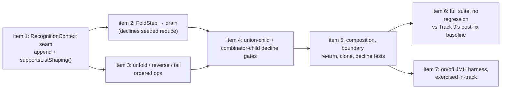

<!-- workflow-sha: d2dfcc2d44fabd3ac76c5fd7620f1e6013675ad9 -->
# Track 11: List-shaping terminators + JMH harness

## Purpose / Big Picture
After this track the four list-shaping terminators (`fold` / `unfold` / `reverse` / `tail`) translate as last steps through Track 7's ordered post-process carrier, every shape that must decline does so rather than answering wrongly, the full TinkerPop Cucumber suite shows no regression against Track 9's recorded baseline, and a Gremlin-on-vs-off JMH harness runs end to end in-track. This completes the Phase 1 recognised set and validates the whole feature across every prior track.

<!-- Reserved for Move 2 — ADDED/MODIFIED/REMOVED triad. Empty until Move 2 lands. -->

Second half of the split final track (inline replan, 2026-08-03 — see `plan/track-9.md` `## Decision Log` DR-S1). **Runs after Track 9**, which delivers a feature suite that completes and a post-fix baseline this track's regression claim is measured against.

## Progress
- [x] Review + decomposition
- [x] 2026-08-04T13:16Z [ctx=info] Review + decomposition complete. Predicted complexity tag `high` (the Architecture / cross-component trigger fires centrally: a new `RecognitionContext` contract every recogniser and both context implementations depend on, a walker dispatch gate, the boundary base's op carrier, and the union child and suffix gates). `max(step tags)` over the twelve-step roster is also `high` — steps 1, 2 and 5 carry it — so the reconciliation finds **no divergence** and no missed strategic reviewer is owed. All three panel reviews ran as full re-reviews at iteration 2 rather than gate checks, because iteration 1 read the tree at `54cc0a708f` and Track 9's landing rewrote most of this track's surface: 24 findings total (4 blockers), all accepted and applied. Step order carries one review-imposed constraint: item 10's shared-harness extraction is step 6, ahead of item 5's terminator tests at step 7, per adversarial condition A12(1).
- [ ] Step implementation
- [ ] Track-level code review
- [ ] Track completion
- [x] 2026-08-16T12:22Z [ctx=safe] Step 1 complete (commit `52c21476ae`). The list-shaping seam plus its decline channel; the step-level loop ran `bugs` and `test-structure`, eight findings and no blockers, all eight VERIFIED at gate-check iteration 2. BG1's track-file half landed as an orchestrator correction (`3514bddb93`): the combinator witness is now `g.V().not(__.out().fold())`, because the planned `and` / `where` spellings decline at the pre-existing edge-bearing-child gate under either design.

## Surprises & Discoveries
<!-- Continuous-log. Empty at Phase 1. -->

- 2026-08-16T12:22Z Step 1 discovered: the `and` / `where` combinator spellings decline at the pre-existing edge-bearing-child gate under the swallow alternative too, so `g.V().not(__.out().fold())` is the only combinator witness that discriminates, and the failure direction flips per combinator — rows lost under `and` / `where`, gained under `not`. Steps 5 and 7 build their witnesses from this. See Episodes §Step 1.

- 2026-08-16T12:22Z Step 1 discovered: a union arm answers `supportsListShaping()` true today, because `UnionForkHostImpl.walkFork` walks the arm through a fresh `WalkerContext`; only per-call lambda identity keeps `agreedShaping.equals(...)` from agreeing, so step 5's explicit non-empty-`listShapingOps` gate is load-bearing before any op becomes a singleton. See Episodes §Step 1.

- **Item 7's harness has two failing assertions at HEAD, not one, and the second was declined out from under it by Track 9 (orchestrator measurement, 2026-08-04).** The two out-of-band commits were cherry-picked onto this branch at the user's direction to end their local-only exposure (R14), then reverted because Phase A must not edit test code; both stay reachable at `43907ff312` and `deb8e72ee9`, and item 7's Phase B step re-applies them. `./mvnw -pl core,jmh-ldbc -am -o test -Dtest=LdbcGremlinShapeTranslationTest` gives **17 tests, 0 failures, 2 errors**. The first is the documented one: `…out(KNOWS).values(firstName).fold()` finds 0 boundary steps because `FoldStep` has no registry entry, and the step list shows `FoldStep` surviving natively — items 2–3's own deliverable, exactly as item 7 predicted. **The second is not predicted anywhere:** `…out(KNOWS).order().by(firstName).range(1, 3).values(firstName)` also finds 0, with the step list ending `OrderGlobalStep, RangeGlobalStep, PropertiesStep`. The harness was written on `ffb57fe5cf`, which is mid-Track-9, and Track 9's later steps widened a slice-after-sort decline underneath it. So item 7's claim that three of its four shapes are green on both arms is stale, and its assertion set must be re-derived against the final tree rather than trusted — which is the concrete form of the warning DR-S1 gave this track about planning against a moved surface.

- **A live vacuous-acceptance suspect that this track should settle rather than inherit, and it sits under a conclusion Track 9 already drew.** Track 9's step 10 retired harness divergence (b) — the claim that a projection followed by `order()` mistranslates when composed with `range` / `limit` — on the ground that "both arms return `[Alice, Bob]`" and that "bare `order()` and `order().by(k).range(1,3).values(k)` also agree". The measurement above shows the `order().by(…).range(…).values(…)` family **declining** translator-on in the `jmh-ldbc` fixture, and where a shape declines, both arms run the native pipeline and agree by construction, so a result comparison over it cannot discriminate. Whether Track 9's own `core`-harness spelling declined too is **not established here** — its fixture and root differ, and it may well have translated. What is established is that the question is open and one check settles it: did step 10's comparison assert a boundary step was present on the on-arm? If it did not, (b)'s retirement rests on a comparison that could not fail, and this is the seventeenth recorded instance of the branch's dominant test defect. This is exactly the net item 10's second sweep specifies — `withTranslator(true, …)` with no `countBoundarySteps` assertion beside it — so it belongs to that sweep, with item 7 re-verifying its own four shapes independently.

## Decision Log
<!-- Continuous-log. -->

- **DR-T1 — the terminators ride `ListShapingOp`; no `BoundaryOutputType` constant is added.** The pre-split plan called for `fold()` → `BoundaryOutputType.LIST` plus a `projectOrSkip` `LIST` arm. Phase A's technical review established that this is the wrong mechanism, not merely a heavier one. `projectOrSkip` is a per-row projector — one MATCH row in, one traverser payload or the `SKIP` sentinel out — so an N→1 drain has no expressible arm there. Worse, `outputType` is the one thing that tells the boundary how to project each element, so re-pinning it to `LIST` would erase exactly what the drain needs to build the list's contents: `g.V().fold()` needs `ELEMENT` per row, `g.V().values("name").fold()` needs `SINGLE_VALUE`, `g.V().valueMap().fold()` needs `MAP`. All four terminators are barrier / flat-map / window / value transforms riding Track 7's ordered `ListShapingOp` carrier through `AbstractMatchPlanStep.applyListShaping`. Nor do they belong beside the group `accumulateMap` branch: that selects a *source* in `openShapedPayloads`, outside `applyListShaping`, and could not order `reverse().unfold()` against `unfold().reverse()` — the reason Track 7 built an ordered carrier at all. `BoundaryOutputType` keeps its four constants (`ELEMENT`, `MAP`, `SINGLE_VALUE`, `SCALAR`).
- **DR-T2 — the append seam carries a decline channel, not just a mutator.** The recognisers must *append* to `ResultShaping.listShapingOps()` and today cannot read what is there, so a naive `setResultShaping(NONE.with…)` would wipe a sibling recogniser's flags and two ops could never compose. That much needs an append method. But `subWalk` drives `and` / `or` / `not` / `where` / `filter` children through **the same recogniser map**, and a `void` append has no way to tell a recogniser the context refused — so a combinator child's trailing `fold()` gets claimed with no way to back out. **Amended 2026-08-04 (T9, iteration 2) — a third in-repo template exists and is the right one.** `RecognitionContext.dropsRowsOnAbsentProperty()` is a non-default boolean query, `false` on the adapter and not delegated to the parent, that `RangeGlobalStepRecogniser` reads and declines on. So the query-plus-mutator pairing below is precedent rather than invention, and item 1 copies that member. The two templates this record originally enumerated are still the wrong ones, and the reasoning about why stands: copying `SubTraversalPredicateAdapter`'s swallow of `setResultShaping` turns `g.V().and(__.out().fold())` into an existence filter (native is always true, because a dry upstream still emits one empty list) and rows silently disappear; copying `appendPostConcatOp` throws `UnsupportedOperationException` out of `TraversalStrategy.apply()`, breaking the all-or-nothing contract loudly. **[Corrected 2026-08-04 by A16 — the throw is not loud.** `GremlinToMatchStrategy`'s throw-safety net catches `RuntimeException` and declines to the native pipeline, so `UnsupportedOperationException` degrades to a **silent** decline rather than escaping `apply()`. That makes the throw template worse than this record originally argued, not better: it produces the same outcome as the swallow, with no diagnostic. Only `Error` and `AssertionError` propagate. The conclusion — pair a query with the mutator — is unaffected.**] The seam therefore pairs a query with the mutator — `supportsListShaping()`, overridden `false` on the adapter — and each recogniser declines when it reads false. These shapes are only safe today because `FoldStep` is unregistered; this track's own registration is what opens the path. **[Corrected 2026-08-16 by BG1 (step 1 review, iteration 1) — the worked example above cannot reach the failure it names.** `g.V().and(__.out().fold())` declines at the pre-existing edge-bearing-child gate (`ConnectiveStepSupport.anyEdgeBearing`, reading the `hasEdges` flag `__.out()` sets) under the swallow template too, so the two designs answer that spelling identically. The reachable witness is `g.V().not(__.out().fold())`, which `NotStepRecogniser` accepts as a detached anti-join: native returns nothing, a swallowed append returns every sink vertex. The direction is per-combinator as well — a swallow loses rows under `and` / `where` and gains them under `not` — so `RecognitionContext#supportsListShaping()`'s javadoc is the canonical statement of both and this record defers to it. The conclusion — pair a query with the mutator — is unaffected.]**
- **DR-T3 — the union-child gate is deliberately blanket.** `union(__.out().fold(), __.in().fold())` must decline: native produces one list per child, translation would produce one list over the concatenation. Today the only thing preventing that silent wrong answer is lambda reference identity, since `UnionStepRecogniser` compares `!agreedShaping.equals(childResult.shaping())` and `ResultShaping` is a record whose `equals` compares `listShapingOps` element-wise — per-call `new` instances decline by accident, record singletons (this codebase's house style, see `PostConcatOp.Count.INSTANCE`) compare equal and ship the wrong answer. Only `fold` and `tail` actually diverge; `unfold` and `reverse` are per-payload, so once-over-the-concatenation and once-per-child coincide. The gate is nonetheless blanket over all four, because `ListShapingOp` carries no op-type discriminator and adding one is not work this track claims. `union(__.unfold(), __.unfold())` declines as collateral: coverage lost, no correctness risk, no worse than today. It stays a Phase 2 shape.
- **DR-T4 — the technical review closes at iteration 2 with no third-iteration gate check, and it ran as the orchestrator rather than as a sub-agent (orchestrator decision, 2026-08-04).** Two sub-agent attempts died mid-stream at the point of writing the review file, both after completing their verification; the user directed the review inline rather than re-spending on the same shape. Two consequences, stated rather than hidden. The pass is **narrower than iteration 1** — twelve certificates against twenty-seven, prioritised on the premises whose failure would mis-size decomposition, and items 2, 3 and 5's fork-jar step semantics were not re-derived because iteration 1 verified them by `javap` and nothing in Track 9's landing touches the fork. And the fixes were applied by their own author, so the independent re-check a gate iteration buys did not happen. What makes that acceptable here rather than a shortcut: no finding is a blocker, and all four are text corrections whose correctness is a `grep` — a gate-check sub-agent would re-run the same greps against the same commit. `review-iteration.md` §Limits escalates only if blockers persist, and none do. The same reasoning Track 9 recorded as DR-S22. The residual risk is that the narrowed scope missed something iteration 1's breadth would have caught; Phase C's track-level review reads the realised diff and is uncapped at complexity `high`, which is where that risk lands.
- **The baseline this track reads is Track 9's last measurement, not its first and not its post-item-2 one.** Track 9's dropped-filter fix moves a large minority of the Cucumber result set in both directions, and its triage item fixes more on top, so a regression claim measured against anything earlier is meaningless. Track 9 re-runs both runners after its final fix and publishes that artifact explicitly for this purpose.

## Outcomes & Retrospective
<!-- Continuous-log. Empty at Phase 1. -->

- [x] Adversarial: PASS at iteration 2 (9 findings, 9 accepted — 1 blocker, 6 should-fix, 2 suggestions). Narrowed to track realization per D9; spawned on Fable 5 because the ledger carries `tier=full` and no `design_gate` field, which is the gap iteration 1's A9 named. A10 (blocker) rewrote the union-suffix acceptance bullet, which the pre-flight and risk rounds both left encoding the pre-step-7 world: it required `union(...).fold()` and `.tail(n)` to translate, while item 4's own constraints and the shipped walker decline both, so Phase B would have hit a hard fork between the gate and item 4. **A13 caught a false claim in the technical round's own applied fix** — declaring `supportsListShaping()` non-default does not stop a Mockito mock answering `false`, so T4's positive control is mandatory rather than belt-and-braces; items 1 and 5 are reconciled. A12 delivered the delegated split-or-keep call as **keep one track under four conditions**, after refuting both prongs of the justification written earlier the same day. A11 added a named bounded exception to the plan's multiset-equality constraint for spellings whose native answer is wrong on `develop`. A16 corrected DR-T2's claim that the throw template fails loudly — the strategy's net degrades it to a silent decline. A14, A15 and A17 removed three non-discriminating test witnesses. See `plan/track-11/reviews/adversarial-iter2.md`.
- [x] Risk: PASS at iteration 2 (11 findings, 11 accepted — 3 blockers, 6 should-fix, 2 suggestions). All three blockers are fixed in the plan text rather than deferred: R10 added item 4a's walker-level last-step gate (modelled on `capturedCardinalityClause`, the idiom iteration 1's R2 said did not exist) plus 4b's may-follow rule, R11 added 4c's requirement that `fold`'s `selectsPositionally` answer be stated because the build gate checks only that the method is declared, and R12 added item 6's three disposition rules for a track with no successor. Two findings contradicted claims in the file, one of them written earlier the same day: R13 refuted item 6's premise that CI's platform legs omit `-Dmaven.test.failure.ignore=true` (every leg passes it, so a green leg carried 41 `embedded` failures), and R14 found item 7's deliverable unpushed on both branches. See `plan/track-11/reviews/risk-iter2.md`.
- [x] Technical: PASS at iteration 2 (4 findings, 4 accepted — 3 should-fix, 1 suggestion, 0 blockers). Iteration 1 (T1–T8, 2026-08-03) read the tree at `54cc0a708f` and every code premise in it predates Track 9's landing, so iteration 2 ran as a **full re-review** rather than a gate check, per `review-iteration.md` §Iteration flow. Its four findings drove the item 1 seam rewrite (copy `dropsRowsOnAbsentProperty`, declare `supportsListShaping()` non-default), the item 10 re-enumeration order, the § Signatures line-number strip, and two count corrections in the plan. See `plan/track-11/reviews/technical-iter2.md`.

## Context and Orientation

The four list-shaping terminators are accepted only as the **last** step (D3). `fold()` registers a `ListShapingOp` that drains the upstream payload iterator into one `List` and emits it as a single payload; a dry upstream still emits one empty list. `unfold()` flat-maps per emission. `reverse()` is a per-traverser **value** transform mirroring `ReverseStep.map`, not a stream-order reverse. `tail(n)` keeps the last `n` in arrival order via a bounded `ArrayDeque` ring buffer (`n=0` emits nothing, `n<0` declines). They register ordered ops into the Track 7 post-process carrier, so `reverse().unfold()` and `unfold().reverse()` are both accepted with declared order preserved, while `fold().unfold()`, `fold().tail(3)`, and any mid-traversal list-shaper decline.

**Every gate in this track keys on a step's position, and the step list it keys on is a rewritten tree.** Track 9 recorded five occasions where a TinkerPop `OptimizationStrategy` invalidated an assumption about where a step sits. `InlineFilterStrategy` rewrites `where(__.has(...))`, `filter(__.has(...))` and all-filter `and(...)` into a top-level `HasStep`. `FilterRankingStrategy` hoists a `has` above an `order()` and relocates an `as()` label off the `GraphStep` onto the following `HasStep` — item 8's own mechanism, and the reason three of four label spellings fail. Both sit in the `OptimizationStrategy` category, which runs before the translator's `ProviderOptimizationStrategy`. The walker's own cursor also disagrees with `rebuildTraversal` about `NoOpBarrierStep`, treating it as transparent where `rebuildTraversal` closes a fold on it. So the last-step rule gating all four terminators is a claim about the **post-strategy** list, and every test asserting that a terminator is or is not in last position must pin the post-strategy step list rather than the authored traversal (`plan/track-9.md` `## Surprises & Discoveries`, the five-instance entry).

**`FoldStep` is two steps wearing one class.** `javap` on the resolved fork jar shows `FoldStep(Traversal.Admin)` for the list fold and `FoldStep(Traversal.Admin, Supplier, BiFunction)` for the seeded reduce that `fold(seed, operator)` compiles to, distinguished by a `listFold` boolean behind `isListFold()`. D9 keys the registry on the concrete runtime class, so one entry claims both forms; mapping both to a list drain would turn `g.V().values("age").fold(0, Operator.sum)` from one summed scalar into a list of ages, translated rather than declined and therefore silent.

**`UnfoldStep.flatMap` dispatches five ways, not one.** `Iterator` returned as-is; `Iterable` via `.iterator()`; **`Map` via `.entrySet().iterator()`**; array per-element (`handleArrays`, both `Object[]` and primitive arrays by reflection); anything else via a one-element `IteratorUtils.of(value)`. The `Map` arm is load-bearing because `MAP` is a live boundary output type — `group()`, `groupCount()`, `valueMap()`, `elementMap()`, `project()`, and multi-alias `select()` all pin it, and `AbstractMatchPlanStep.projectMap` / `accumulatedGroupMapSource` emit `LinkedHashMap` payloads — so `g.V().groupCount().unfold()` and `g.V().valueMap().unfold()` are ordinary idioms present in the Cucumber suite. The one-element arm matters too: `g.V().unfold()` over `ELEMENT` payloads passes each vertex through unchanged rather than dropping it.

**`tail(n)` arrives in two forms and reading its limit has a side effect.** Both `TailGlobalStep` and `TailGlobalStepPlaceholder` implement `TailGlobalStepContract.getLimit()`, and `TailGlobalStepContract.CONCRETE_STEPS` is `List.of(TailGlobalStep.class, TailGlobalStepPlaceholder.class)` — the registration source of truth rather than two hand-written literals that could drift. `TailGlobalStepPlaceholder.getLimit()` is not a pure read: it checks `GValue.isVariable()` and, when true, calls `traversal.getGValueManager().pinVariable(name)` before returning the concrete `Long`, so reading the limit and then declining on `n<0` leaves the manager mutated and a parameterised `tail(n)` stripped of its variable status. This is precedent-consistent — `RangeGlobalStepPlaceholder.getLowRange()` has byte-identical pinning and `RangeGlobalStepRecogniser.normalize` reads it before its own decline branches, and the mutation lands on TinkerPop's GValue manager rather than on `WalkerContext`, so D9's no-mutation-on-decline discipline is not literally violated. The choice is deliberate either way.

**The boundary base carries seven lifecycle states and shares op instances.** `AbstractMatchPlanStep.State` now holds `NEW`, `OPEN`, `DRAINED`, `REARMED`, `CLOSED`, plus Track 10's `CLOSED_UNSTARTED` and `REARMED_AFTER_CLOSE`. A `fold` drain lands cleanly on `OPEN → DRAINED` and on the failure path, so the lifecycle itself is fine — but two op properties are not free. `applyListShaping` calls `op.apply(...)` afresh on every open, and there are three open routes (`NEW`, `REARMED`, `REARMED_AFTER_CLOSE`), so an op allocating its buffer once outside the returned iterator replays the first pass's payloads on the second. And `AbstractStep.clone()` copies `shaping` by reference while `resetLifecycleForClone()` deliberately does not touch it, so two concurrent clones share the *same* `ListShapingOp` instances — a stateful `fold` or `tail` op is then a data race, and the ops most likely to be written as shared singletons are exactly the two that need buffers.

**One in-repo javadoc contradicts the union behaviour this track relies on.** `MultiPlanMatchStep.startPlanStream()` returns one `MultipleExecutionStream` over a lazy per-child producer, the base's `openShapedPayloads()` runs once per arming over that single stream, and `MultiPlanMatchStep`'s class javadoc says so outright. `ListShapingOp`'s javadoc says the opposite — that the base rebuilds its shaped iterator "once per child plan for a multi-plan boundary" — which is false and would lead an implementer to expect one list per child.

### Clarifications
- **Reference accuracy in this track file is file-and-grep-based, not PSI.** mcp-steroid is reachable but `steroid_execute_code` times out on this repository (cold kotlinc exceeds the MCP call limit). Declaration-level reads and `javap` on the resolved fork jar are reliable; "no other caller" negatives are not established. Re-verify through PSI at decomposition if the IDE recovers.
- **The project uses its own TinkerPop fork under group id `io.youtrackdb`, not upstream `org.apache.tinkerpop`.** Every `FoldStep` / `UnfoldStep` / `ReverseStep` / `TailGlobalStep` semantic above was read from the resolved fork jar, and any re-verification must resolve against the same jar.
- **CI covers both Cucumber runners from Track 9's repeat fix onward, on the translator-on arm only.** PR #1038 is a draft, so most checks report `skipping`, and before the fix the pipeline was useless here: runs at `96c37d3e74` and `5bc12478d6` both hung at `CountTest$Traversals` and died before the Cucumber executions, leaving `YouTrackDB Embedded ... SKIPPED`. At `b35ac67d2f` the whole reactor passes (CI runs with `-Dmaven.test.failure.ignore=true`), and eight platform legs report `core`'s `gremlin-feature-compliance-tests` at 1930 / 41 failures / 14 skipped in 16.09 s and `embedded`'s `EmbeddedGraphFeatureTest` at 1931 / 41 / 14 in 14.57 s. **CI never sets the kill-switch**, so it supplies one arm of any A/B and never the control; anything this track gates on an on-vs-off comparison is still verified locally. The pipeline also uploads `**/target/deadlock-report.txt`, which names a stalled scenario without needing a local run.
- **A bare `./mvnw -pl core test` may not reach the Cucumber execution.** It stops at `gremlin-process-compliance-tests` while any deferred failure stands; the CI reactor summary above is the worked example. Use `-Dmaven.test.failure.ignore=true` for full-suite gates, and `./mvnw -pl core test-compile surefire:test@gremlin-feature-compliance-tests` (~20 s) for the iteration loop. The `test-compile` is load-bearing rather than tidy: `surefire:test@<id>` invokes the mojo directly, runs no lifecycle phase, and therefore measures whatever was last compiled, which republishes a stale number as a fresh one (`plan/track-9.md` § Decision Log, T22). Add `-Dyoutrackdb.test.deadlock.timeout.minutes=1` so a stall names its own scenario in `core/target/deadlock-report.txt` within a minute instead of hanging until killed by hand.
- **If item 6 elects the optional local `embedded` re-measurement, it runs as two commands, not one.** `./mvnw -pl core -am install -DskipTests` first, then `./mvnw -pl embedded test`. Repeat the install after every code change the re-run is meant to measure — this track's whole deliverable is new `core` code, so a run against a stale jar exercises none of it and still reports no regression. The resolution mechanism is in `plan/track-9.md` § Clarifications.

## Plan of Work
1. **Add the `RecognitionContext` seam, with its decline channel, before any recogniser.** Add `void appendListShapingOp(@Nonnull ListShapingOp op)` and `boolean supportsListShaping()` to `RecognitionContext`. **Copy `dropsRowsOnAbsentProperty` rather than inventing a shape (T9, iteration 2).** That member is the same seam already in production: a **non-default** boolean on `RecognitionContext`, implemented on `WalkerContext`, overridden `false` on `SubTraversalPredicateAdapter` under a javadoc explaining why the answer is not delegated to the parent, and read-and-declined-on by `RangeGlobalStepRecogniser` (whose class javadoc describes the mechanism as "declines once … the guard reads one boolean"). Declare `supportsListShaping()` **non-default**, matching that precedent, so both implementers must state an answer rather than inheriting one. **Corrected 2026-08-04 by adversarial finding A13 — non-default does *not* close T4's hole, and the earlier wording here claimed it did.** Mockito answers `false` for any unstubbed `boolean` method whether or not the interface declares a default, because the mock replaces the whole interface, defaults included. So a mocked `RecognitionContext` still reports "list shaping unsupported" and every combinator-child decline assertion can still pass without exercising the decline. **T4's positive control is therefore required, not belt-and-braces:** each decline test pairs with a translating control on the same fixture, per item 5. Non-default remains worth doing for consistency with `dropsRowsOnAbsentProperty` and because it forces a deliberate answer at every implementation site; it buys nothing against the mock. Implement the append on `WalkerContext` as `withListShapingOps(existing + op)` — `ResultShaping.withListShapingOps(@Nonnull List<ListShapingOp>)` exists at `ResultShaping.java:106` (verified at `f2b1230db0`), replaces the list wholesale, and its only callers are in `YTDBMatchPlanStepTest`. Override `supportsListShaping()` to `false` on `SubTraversalPredicateAdapter`; its answer is **decline**, specifically neither swallow nor throw (DR-T2 records why each is wrong). Update the `setResultShaping` javadoc's "calls this once" clause in the same commit, and write down the two limits: `setResultShaping` remains a full replace of the whole record including `listShapingOps`, so the append's no-clobber guarantee covers only recognisers that use the new method, and what keeps the two from colliding is D3's last-step rule plus `UnionStepRecogniser` calling `setResultShaping(agreedShaping)` before any suffix op appends.
2. **`FoldStep` recogniser** registering a drain `ListShapingOp` that folds the upstream payload iterator into one `List` payload; a dry upstream emits one empty list. `outputType` stays where the preceding step pinned it — no enum constant, no `projectOrSkip` arm (DR-T1). Declines when `!step.isListFold()`, when `supportsListShaping()` is false, and — **the branch R10 found missing from this enumeration** — when the fold is not the last step, through item 4a's walker gate rather than a check written here. This item spells out its decline branches exhaustively, so a position check absent from the list means an implementer working from item 2 alone ships `fold` with no last-step gate at all.
3. **`UnfoldStep` / `ReverseStep` / `TailGlobalStep` recognisers** registering ordered ops into the same carrier: `unfold` flat-map honouring all five `flatMap` arms with a cross-call pending-emission buffer; `reverse` per-value transform; `tail` bounded ring buffer registered from `TailGlobalStepContract.CONCRETE_STEPS`, `n=0` → nothing, `n<0` → decline. Decide the `getLimit()` GValue question deliberately — read `getLimitAsGValue()` and decline on `isVariable()` before touching `getLimit()`, or match the Track 6 precedent and record why. Mid-traversal use declines (D3) — **enforced by item 4a's walker gate, not by four recognisers each remembering to check** (R10). Correct `ListShapingOp`'s one-line `unfold` description, which today says only "expands a list payload into its elements".
4. **Close both child holes and relax the post-union suffix allow-list.** **Two hard constraints landed under this item from Track 9 step 7 (`plan/track-9.md` `## Episodes` §Step 7), and one of them is now a build failure rather than a review catch.** The allow-list gained a second axis: `StepRecogniser.selectsPositionally(Step)`, safe-defaulting to `false`, with a unit test over `POST_UNION_RECOGNISERS` that **fails the build** if a member inherits the default. A `tail` recogniser must therefore answer **`true`** — `tail(n)` selects from the end of the concatenation, the position the two arrival orders disagree about hardest — which leaves it translatable only ahead of an immediate `count()`. And **`fold` cannot be a bare post-union suffix at all**: the folded result is a one-element multiset whose member is a `List`, and `List.equals` is order-sensitive, so the same ordering non-determinism that took `range` off the list takes `fold` off it. Both re-read against `2def4d43f0`, which changed the union surface under this item. Then add the four terminator recognisers to `GremlinStepWalker.POST_UNION_RECOGNISERS` (today `count` / `range` / `dedup`, Track 8 DR-U4); both readers are the walker's own — `dispatchAll`'s fail-closed gate and `postUnionSuffixTranslatable`'s look-ahead — so the one field covers both paths. Then gate the two child paths, which are different methods and need separate work: **union children** (`walkFork`) decline when any child's `shaping().listShapingOps()` is non-empty, checked before and independently of the `agreedShaping.equals` comparison (DR-T3); **combinator children** (`walkChild`, driving `AndStep` / `OrStep` / `NotStep` / `TraversalFilterStep` / `WhereTraversalStep`) decline through the item-1 seam. The union *suffix* path is unaffected and still folds once over the whole concatenation — 4's child gate inspects `childResult.shaping()` inside the child loop while a suffix op appends onto `agreedShaping` afterward, so the two are disjoint by construction. Fix `ListShapingOp`'s false "once per child plan for a multi-plan boundary" javadoc clause in the same item; the surrounding advice — allocate the buffer inside the returned iterator, hold no state across calls — stays correct for the reset-and-reopen case.

    **4a. Add the walker's third in-loop gate — the last-step rule must be the loop's job, not each recogniser's (R10, blocker, iteration 2).** The walker carries two in-loop fail-closed captured-state gates and neither reads `listShapingOps()`, so once a terminator appends an op on the single-plan path, dispatch keeps claiming steps with nothing checking the op was last. The wrong answers are ordinary shapes: `g.V().values("name").fold().limit(2)` compiles `LIMIT 2` into the statement and then folds two rows into a list of two, where native folds first and keeps the one list it made; `.fold().order()`, `.unfold().dedup()` and `.fold().count()` are the same defect, because row-level clauses land in the SQL statement while `applyListShaping` runs strictly after the projection source is built. The switch defaults on and no track follows this one. **Copy `capturedCardinalityClause` plus `POST_CARDINALITY_RECOGNISERS`** — a boolean read off the context in `dispatchAll`, an allow-list of the recognisers whose contribution survives it, and a javadoc arguing each membership on "can this recogniser change the row set, its order, or its multiplicity". R2 reported no such idiom existed; it does now. Make the gate the loop's for the reason that javadoc already gives: a recogniser added later inherits it without being told, whereas item 3's four words ("Mid-traversal use declines (D3)") put the obligation on four recognisers written this track and on every one written after.

    **4b. Write down which terminators may follow another, since the file only implies it.** `fold` and `tail` are drains and windows, so they must be last; `unfold` and `reverse` are per-payload, so they may follow. That is the rule this file's own examples already assume — `reverse().unfold()` accepted, `fold().unfold()` declined — and it is stated nowhere. It is also the allow-list 4a needs. **Corrected 2026-08-16 by BG1 (step 2 review, iteration 1) — the rule has three rows, not two, and one allow-list cannot hold them.** "Drains and windows must be last" constrains only what may follow a drain, so a drain may itself follow a per-payload stage: `reverse().fold()` and `unfold().fold()` translate, while `fold().unfold()` and `fold().tail(3)` decline. Step 2 shipped the rule as two package-private sets on `GremlinStepWalker` (`LIST_SHAPING_PER_PAYLOAD_RECOGNISERS`, `LIST_SHAPING_DRAIN_RECOGNISERS`, both empty until step 4 populates them), with the drain latch reading the per-payload set negatively so a recogniser on neither set is treated as a drain. Membership carries a second condition: a member contributes through `appendListShapingOp` alone, because any `setResultShaping` call erases the stage the gate admitted it behind. No acceptance criterion moves — neither `## Context and Orientation` nor `## Validation and Acceptance` ever required a drain behind a per-payload stage to decline — but step 7's composition set gains `reverse().fold()` as a positive witness rather than a decline case.

    **4c. State `fold`'s `selectsPositionally` answer; the build gate cannot infer it (R11, blocker, iteration 2).** Item 4 says "add the four terminator recognisers to `POST_UNION_RECOGNISERS`" and, two sentences earlier, that `fold` "cannot be a bare post-union suffix at all". The reflective test cannot tell those apart: it asserts only that the class *declares* `selectsPositionally`, never what it returns. So `FoldStepRecogniser` with `selectsPositionally → false` satisfies the test and the literal instruction, and ships `union(__.out(), __.in()).fold()` — a one-element multiset whose member is a `List` over a child-ordered concatenation, compared by order-sensitive `List.equals` against native's interleaved order. `tail` is safe only because item 4 names its answer outright. **Decide between the two available answers and record which:** `selectsPositionally → true` for `fold`, reusing the existing rule and leaving `union(...).fold().count()` translatable (both arms give 1); or keep `fold` out of `POST_UNION_RECOGNISERS` entirely, the plainer reading of "cannot be a bare post-union suffix", at the cost of that one shape. Either way the item stops saying "add the four" unqualified. **Corrected 2026-08-16 by BG4 (step 2 review, iteration 1) — after step 2's gate the two answers have no observable difference.** A post-union drain needs whatever follows it to claim a step behind a captured list-shaping stage, and step 2's gate declines exactly that however `POST_UNION_RECOGNISERS` is populated, so `union(...).fold().count()` and `union(...).tail(1).count()` both decline. Widening either allow-list to admit `count` behind a stage would ship a `count(*)` over the concatenation's pre-stage rows — the divergence A1 closed. The decision therefore costs nothing either way and the plainer reading (keep `fold` out of `POST_UNION_RECOGNISERS`) is free; step 5 still owns the choice and the write-down.
5. **Tests.** Composition and boundary: `tail` `n=0` / `n<0`, empty-input `fold`, `reverse` value-transform-not-reorder, `unfold` buffer, declared-order combinations, placeholder-form `tail`. Decline cases, each a silent wrong answer if missed: `fold(seed, operator)`; `union(__.out().fold(), __.in().fold())` and `union(__.out().tail(1), __.in().tail(1))`; `g.V().not(__.out().fold())` (**combinator witness corrected 2026-08-16 by BG1, step 1 review iteration 1** — the roster named `g.V().and(__.out().fold())` and `g.V().where(__.out().tail(1))`, and both decline at the pre-existing edge-bearing-child gate under the swallow alternative too, so a result comparison over either passes under the bug it was cited for; `NotStepRecogniser` accepts an edge-bearing child as a detached anti-join, so `not` is the one combinator spelling whose swallowed and correct answers differ). `unfold` payload shapes: at minimum `groupCount().unfold()` and `valueMap().unfold()` against native, plus an array and a scalar payload. Re-arm: `fold()` and `tail(n)` return identical results across `toList(); reset(); toList()` from both the `DRAINED` and `CLOSED` (`REARMED_AFTER_CLOSE`) routes. Clone: two concurrently-iterated clones of a `fold()` boundary each see their own full result — `MultiPlanMatchStepTest` already has the clone-isolation idiom to copy.

    **Three witnesses in this set do not discriminate, and a positive control does not fix them (A14, A15, A17 — iteration 2 adversarial).** A control proves the fixture was alive; it cannot prove the case would fail under the bug it names. (a) `g.V().where(__.out().tail(1))` is specified as the combinator-swallow witness, but a swallowed `setResultShaping` yields an existence filter whose answer **equals** the correct answer on every graph, since a dry upstream still emits one empty list — so the case passes under the bug. Replace it with a spelling whose swallowed and declined answers differ, or drop the claim that item 5 witnesses the swallow and pin it white-box on the adapter's `supportsListShaping()` returning false. **Extended 2026-08-16 by BG1 (step 1 review, iteration 1) — the `and(__.out().fold())` twin fails the same way, for a second reason.** `AndStepRecogniser` declines through `ConnectiveStepSupport.anyEdgeBearing` before the child's `fold()` can matter, and `or` / `where` / `filter` decline the same way through `commitPositiveFilterChild`, so both spellings are over-determined declines under either design. Both remedies are now taken: item 5's roster names `g.V().not(__.out().fold())`, whose swallowed answer (the sink vertices) differs from native's (nothing), and step 1 shipped the white-box pin. (b) The union-child criterion says the decline must be "witnessed by the explicit non-empty-`listShapingOps` gate", which no black-box result test can establish: fresh per-recognition op instances make the pre-existing `agreedShaping.equals` comparison decline first, so every observable decline is over-determined. Only a white-box test constructing two `equals`-equal ops isolates the new gate, and no item specifies one — either add it or weaken the criterion to "declines", dropping the claim about which gate did it. (c) The placeholder-form `tail` case still names no construction path: `graph.traversal().V().tail(1)` yields `TailGlobalStep`, never `TailGlobalStepPlaceholder`, so the case is unreachable through the fluent API as written. Name the construction path or drop the case, and settle the `getLimitAsGValue` question in item 3 rather than leaving it to the implementer of the branch's last track.

    **Four cases added by iteration 2's risk review, each a silent wrong answer the existing set cannot witness.** From R10: `g.V().values("name").fold().limit(2)` and `g.V().valueMap().unfold().dedup()` — mid-traversal list-shapers whose row-level suffix lands in the SQL statement while the op runs after projection. From R11: `union(__.out(), __.in()).fold()`, which the build-time allow-list gate cannot witness because that test checks only that `selectsPositionally` is declared, not what it answers. From R18: **clone isolation for `tail(n)`, not only for `fold()`.** `tail` is the other buffered op and shares the same by-reference `shaping` copy — `resetLifecycleForClone` sets `openStream`, `armingGraph`, `shapedPayloads` and `state` and deliberately does not touch `shaping` — and a shared `ArrayDeque` is the worse failure of the two, because two concurrent clones each get a window of the right size with the wrong contents, which no size assertion catches.

    **Every decline case here needs a positive control of the same shape, measured (added 2026-08-04 by the Pre-Flight gate).** A decline assertion's expected value is "nothing happened", which a misconfigured fixture also produces — the branch's vacuous-acceptance family, at sixteen recorded instances plus three more Track 9's Phase C found by mutation. Two of its shapes bite this item directly. A Mockito mock of `RecognitionContext` answers `false` for `supportsListShaping()`, so every combinator-child decline assertion can pass without exercising the decline (technical finding T4). **Item 1 declares that method non-default and this does not change the hazard (A13):** Mockito answers `false` for any unstubbed `boolean`, defaults included, because the mock replaces the whole interface. The positive control below is the only defence, so it is mandatory rather than advisory. A decline test whose context is a mock must stub `supportsListShaping()` explicitly or use a real `WalkerContext`. And a decline case whose traversal returns nothing on both arms compares two empty multisets and passes vacuously, which is what Track 9's declined-path non-emptiness pin exists to catch. So each decline case pins a non-empty native answer, and each pairs with a translating control on the same fixture that proves the fixture is alive — the shape Track 9 named as the one to hunt, an opt-out with nothing establishing liveness.
6. **Re-run the `core` Cucumber suite on both kill-switch arms and show it green** (Track 9 DR-S8, superseding "no regression against Track 9's post-fix baseline"). The criterion is absolute — **1930 scenarios, 0 failures, 14 skipped**, with a named and frozen exclusion list for anything that reproduces on `develop`. Track 9 fixed its whole residue under DR-S2, so there is nothing left to compare against and green is the entire criterion: no artifact, no SHA stamp, no ancestry check, no re-trigger rule. Removing the comparison removes the stale-baseline failure mode that cost Track 10 a wrong artifact at close. **Amended 2026-08-04 by the Track 11 Pre-Flight gate — the reference is `core`-only and no baseline artifact was ever published.** Track 9's acceptance was measured at its final tree (`215aad384f`) on `core` alone: 1930 / 0 / 14 on **both** arms, translator on and translator off, with the extraction scoped to the single `TEST-_.xml` after deleting `core/target/surefire-reports`. `embedded` was not re-measured, by user decision, on the ground that CI covers it. **Corrected 2026-08-04 by R13 — the reason originally given here was false, and a green CI leg is not a pass.** Every platform leg passes `-Dmaven.test.failure.ignore=true` (Linux through `matrix.mvn_opts` at `maven-pipeline.yml:173` and `:185`, Windows inline at `:334`, macOS inline at `:410`), which this file's own `### Clarifications` states correctly and the sentence here contradicted. The worked example is in that same bullet: at `b35ac67d2f` the whole reactor passed *while* `EmbeddedGraphFeatureTest` reported 1931 / 41 / 14. So reading `embedded`'s on arm from CI means reading the counts out of the check annotations or the uploaded surefire reports, never the leg's colour, and **the number it must show is 1931 / 0 / 14** — the same 1930 scenarios plus one JUnit method, since `ShadedJarSmokeTest` folds into the same surefire test set (Track 9 step 2). The run also cannot be required to sit on "this track's final tree", which is unsatisfiable because the completion episode is itself a commit; use Track 9's R8 form instead — the run's SHA is an ancestor of HEAD and `git log <sha>..HEAD -- core embedded jmh-ldbc` is empty. If PR #1038's legs report `skipping`, the local two-command re-measurement in `### Clarifications` stops being optional. Meanwhile `embedded`'s **off** arm is verified by nobody and rests on step 2's two-runner finding plus `core`'s green off arm. So this item gates on the `core` two-arm A/B measured in-track, reads `embedded`'s on arm from a CI run that completed on this track's final tree, and states the off-arm inference rather than claiming a measurement. Re-measuring `embedded` locally is optional and costs the two-command install-first sequence in § Clarifications; decomposition decides whether to spend it. **Green is the acceptance gate, not the correctness gate:** Track 9 found repeatedly that silent wrong answers on recognised shapes are invisible to this suite, so every shape this track touches also needs a measured translator-on / translator-off equivalence check. The suite runs from `YTDBGraphFeatureTest` under `core`'s `gremlin-feature-compliance-tests` execution; `EmbeddedGraphFeatureTest` in the `embedded` module is the same 1930-scenario surface plus one JUnit method, and Track 9 step 2 established that the two runners fail the identical set. Add the per-step scenario catalogue.

    **What to do with what the gate finds — three rules this item lacked (R12, blocker, iteration 2).** Track 9's `## Plan of Work` item 4 carried a fix-vs-defer bound, a destination for everything else, and a no-deferral clause; this item said what must be true and nothing about the consequences, and a grep over this file for the whole disposition vocabulary returned one hit, in DR-T4, about review iterations. Track 9 could name "a later track inherits it" as a destination because this track followed it. Nothing follows this one.
    1. **Both directions are recorded, only one is a defect.** Registering four terminators moves scenarios both ways, and the direction Track 9 never faced is a scenario green today *because the shape declines to the native pipeline* and red tomorrow because the translator now claims it — `groupCount().unfold()` and `valueMap().unfold()` are called ordinary suite idioms in `## Context and Orientation` above. Scenarios that start passing are recorded; scenarios that start failing are defects. The one relief clause this item already carries, "a named and frozen exclusion list for anything that reproduces on `develop`", cannot reach a newly-claimed shape by construction, since those shapes do not exist on `develop`.
    2. **The decline exit is the default, in writing.** A newly-claimed shape that disagrees with native gets its recogniser's decline branch widened until it agrees. That restores translator-on-equals-translator-off by construction and costs one condition; repairing the projection instead is the exception and needs a written reason. Track 9 closed three of its four silent-wrong-answer defects exactly this way and recorded the decline as the cheaper exit.
    3. **Two destinations remain, and no deferral.** Anything not fixed here and not declined here becomes a YouTrack issue or a plan `### Non-Goals` amendment — "deferred" with no owner is not a disposition, and Track 9's escape hatch of handing it to a later track does not exist. Carry Track 9's no-deferral clause verbatim minus that escape: the kill-switch is true by default, so anything the control run attributes to the translator ships live at merge. ESCALATE to inline replanning when the gate's residue cannot be closed under these three rules — the absolute criterion has no other valve, and R16 names a live reason it might be needed: Track 9 recorded TinkerPop's unstable strategy sort as "a lead, not a closed question" behind a ~1200-scenario flip, and under an absolute gate a single flipped scenario is a hard failure. Bound the second obligation too: "every shape this track touches needs a measured on/off equivalence check" is unbounded as written, so it reads against the per-step scenario catalogue this item already owes rather than against an open-ended set.
7. **The deliverable exists on one machine's disk and must be secured before this item is planned against (R14, should-fix, iteration 2).** `git ls-remote --heads origin` returns neither `t11-item7-jmh` nor the item-8 probe branch, although both carry `branch.<name>.merge` config pointing at `origin/`, so local tooling reports them as tracked against a remote that has no such ref. `git ls-tree -r HEAD jmh-ldbc` shows none of the three files on this branch either. The workflow tracks `_workflow/` in the PR precisely so a local-disk loss never destroys planning work (`CLAUDE.md` § Workflow Artifacts); three files of production and test code plus item 8's evidence commit `158a87871c` sit outside that guarantee. **Resolved 2026-08-04: the two commits were cherry-picked onto this branch and then reverted, so they are reachable in its history at `43907ff312` (the harness) and `deb8e72ee9` (the LDBC-shaped extension) — in that order. **They are still local-only until this branch is pushed (A18): `origin` is at `f2b1230db0`, so the loss exposure R14 raised is reduced to one ref rather than removed. Pushing this branch is a precondition for decomposition closing.** The files left the tree because the run below found two failing assertions and Phase A may not edit test code. This item's Phase B step re-applies both commits (`git cherry-pick 43907ff312 deb8e72ee9`, or revert `edcf10dfa6`) and **repairs the assertion set before committing**: 17 tests, 0 failures, 2 errors at HEAD. `…values(firstName).fold()` declines because `FoldStep` is unregistered, which items 2–3 fix; `…order().by(firstName).range(1, 3).values(firstName)` also declines, which nothing in this track fixes, because Track 9 widened a slice-after-sort decline after the harness was written on `ffb57fe5cf`. See `## Surprises & Discoveries`. Re-derive all four shapes' expected arms against the final tree rather than trusting the recorded three-of-four-green claim. Two gaps follow from landing out of band. **Which commit is in scope is unstated:** this item names `06caa2f962` (three files, four named shapes) while item 8's provenance names `b1fc04a030`, the follow-on that adds eight translating and five declining shapes including the `is1FullProfile` whose decline assertion item 8 says must flip — different footprints, different obligations. **And the re-run invocation is wrong for its own purpose:** under `-pl jmh-ldbc`, `jmh-ldbc/pom.xml:20-23` resolves `youtrackdb-core` from the local repository, so `./mvnw -pl jmh-ldbc -o test` measures the installed jar rather than item 3's code. Add the install-first sequence to `### Clarifications` beside the `embedded` one, or use `./mvnw -pl core,jmh-ldbc test -Dtest=LdbcGremlinShapeTranslationTest` so both modules share a reactor. R5's other half is discharged and worth keeping: the harness's `fold` shape is a Track-11-only recogniser, so a stale `core` jar makes the on-arm assertion fail loudly instead of passing against a Track 2 boundary step.

    **The `g.V(rid)` slowdown this item measures needs a destination (R17, should-fix).** A RID-bearing walk sets `cacheEligible=false`, so it compiles an uncached MATCH plan where the native path ran no query, and it stays the one shape where translator-on can be strictly slower than translator-off. Item 7 measures that and names none of Track 9's three permitted destinations. Under item 6's rule 3 as amended, a measured regression with no owner is not a disposition: it lands as a YouTrack issue or a plan `### Non-Goals` entry before this track closes.

    **Implemented out of band on branch `t11-item7-jmh` (commit `06caa2f962`, based on Track 9's `ffb57fe5cf`) — not merged, not pushed.** Three files in `jmh-ldbc`, no existing file modified, as specified: `GremlinTraversalShapes` (the four shapes plus `requireTranslated` / `requireNotTranslated`, both throwing `IllegalStateException` rather than using a Java `assert`), `LdbcGremlinTranslatorBenchmark` (the A/B axis is `@Param({"true","false"})` on a nested state flipped in-process through `GlobalConfiguration`, never `-DargLine=`), and `LdbcGremlinShapeTranslationTest`. It **executes**: `./mvnw -pl jmh-ldbc -o test` gives 43 tests, and `LdbcQueryExplainTest` 6/6 plus `LdbcQueryCorrectnessTest` 33/33 still pass. Three of the four shapes are green on both arms — `g.V(rid)`, the `KNOWS` walk under `values`, and under `count`, each 1 boundary step on and 0 off with matching results. **`fold` fails, and correctly so:** `GremlinStepWalker` has no `FoldStep` registry entry at that base, which is items 2–3's own deliverable, so the walk declines all-or-nothing and `FoldStep` survives as a native step. The assertion was left intact rather than weakened to keep the build green, so **this item's criterion closes only after item 3 lands** — re-run `-Dtest=LdbcGremlinShapeTranslationTest` then. Two notes: the vacuous-acceptance guard is real (each test runs the on-arm first, so `requireTranslated` throws before the off-arm is reached, `requireNotTranslated` rejects an empty step list, both arms compare to hand-computed values, and Bob's edge to Dave makes an over-emitting plan return three names where two are expected); and one deviation from the text below — the RID pool uses `isPersonId` only, `ic1PersonId` is unused, one Person-id feed being sufficient. The Hetzner baseline for the four `@Benchmark` bodies is still owed and stays Hetzner-scoped. Original specification follows. **Add a Gremlin JMH benchmark over the LDBC schema and drive its shapes in-track on both kill-switch arms.** Three new files in `jmh-ldbc`, no existing file modified: static traversal builders and one `@Benchmark` class in `src/main`, one JUnit 4 test in `src/test`. Drop "mirrored" (A7) — the repository holds no Gremlin JMH benchmark to adapt, and the twenty LDBC queries are SQL MATCH text with `LET` and correlated subqueries that no Phase 1 recognised shape reproduces, so the new class measures its own named shapes and its numbers are a translator-on-vs-off A/B on those, never a comparison against the existing IC / IS figures. A7 priced a faithful mirror at fifteen files by counting the five `Ldbc*BenchmarkBase` classes and their ten concrete subclasses; that split exists only to vary `@Threads` and fork counts per latency tier, which an on/off axis does not need, so three is the count this item adopts.

    The shapes, all over the schema `ldbc-schema.sql` already creates: `g.V(rid)` by id; `g.V().hasLabel("Person").has("id", n).out("KNOWS").values("firstName")`; that walk under `count()`; and that walk under `fold()`, this track's own deliverable and the reason the harness lands here. The by-id shape is the load-bearing one — a RID-bearing walk sets `cacheEligible=false` (`GremlinToMatchTranslator:87`), so it compiles an uncached MATCH plan where the native path ran no query, and it remains the one shape where translator-on can be strictly slower than translator-off; Track 10's promotion fix landed, the per-call recompile did not. It needs a RID while `curatedParams` holds LDBC `id` longs, so the benchmark state resolves a RID pool once at trial setup through the public `isPersonId` / `ic1PersonId` accessors. `LdbcBenchmarkState` is then left untouched and `curatedParams` stays private (T5).

    **The in-track drive targets the builders, not `LdbcBenchmarkState.executeSql`** (A2). That entry point takes a YQL string and routes through `ytg.yql(...)` to one `CallStep` and the SQL MATCH planner, so no boundary step appears on either arm and the assertion this item used to specify was vacuous. The test instead builds the fixture the way `LdbcQueryCorrectnessTest` does — temp dir, `DatabaseType.MEMORY`, `openTraversal`, then `LdbcBenchmarkState.loadSqlStatements("/ldbc-schema.sql")`, a package-private static the test reaches from the same package — adds a handful of `Person` rows and `KNOWS` edges, and calls each builder twice, kill-switch on and off, asserting `AbstractMatchPlanStep` is present in the strategy-applied step list on the first call and absent on the second. That class is production code and reachable from `jmh-ldbc`; `core`'s `countBoundarySteps` helper is not, because `jmh-ldbc/pom.xml` declares no `core` test-jar, so the six-line check is rewritten locally. Flip through `GlobalConfiguration.QUERY_GREMLIN_TO_MATCH_TRANSLATOR_ENABLED.setValue(...)`: the read is per traversal and falls back to the live global, and a session-local override that shadowed the flip would fail the presence check rather than mismeasure silently.

    What stays out of reach in-track is the `@Benchmark` bodies and the curated-parameter feed, both dataset-bound. `./mvnw -pl jmh-ldbc test` still runs them through the JMH annotation processor, so a broken signature fails an ordinary build, but an empty parameter pool surfaces only on the first Hetzner run. **The installation check therefore repeats in the benchmark's own `@Setup(Level.Trial)`, against a throwaway strategy-applied traversal, and it throws.** A Java `assert` there is a no-op: the launcher at `jmh-ldbc/pom.xml:145` runs `java` with no `-ea` and no `@Fork(jvmArgsAppend=…)` adds one, while surefire's `argLine` (`:220`) does carry `-ea` — exactly the asymmetry that would let the mistake pass in-track and disappear under measurement. Note for the orchestrator: `implementation-plan.md`'s Track 11 Scope line still reads "the mirrored JMH classes" and needs that word dropped, the three-file count folded in, and its `~14–20 files` bound re-checked (A7).

8. **Bind `as()` labels on edge steps, so an edge alias is addressable by the name the user gave it.** `EdgeHopRecogniser` never calls `bindStepLabels`. The edge alias itself already exists — `nextEdgeAlias()` mints it at `EdgeHopRecogniser:128` and `GremlinPatternAssembler.appendEdgeAsNode` emits it into the pattern as a full node — so the gap is only that nothing registers it under the user label. The two existing bind sites are `StartStepRecogniser:141` (start step → `BOUNDARY_ALIAS`) and `GremlinPatternAssembler.claimFoldedHop:75` (folded vertex hop → target alias); this item adds the third, symmetric with both. `MatchPatternBuilder.registerUserLabel` is a plain internal-alias → user-labels map with no vertex/edge distinction, so nothing downstream changes. **This is a capability gap, not a correctness defect, and the distinction decides where it belongs.** Every site that reads a label resolves-or-declines — `SelectStepRecogniser:51`, `SelectOneStepRecogniser`, `GremlinProjectionAssembler`, `DedupGlobalStepRecogniser`, `WherePredicateStepRecogniser` — so an unbound label produces a decline, the traversal runs natively, and the answer is correct. Track 9's item-4 rule, which forbids deferring a silent wrong answer on a recognised shape, therefore does not reach it, which is why it is not a Track 9 step. **Provenance:** measured by item 7's harness on branch `t11-item7-jmh` (commit `b1fc04a030`) while probing LDBC coverage — IS3 is rejected because `{as: k}` on the edge step of a folded `outE(L)…inV()` hop does not bind. Closing this is what makes IS3 available as a benchmark shape, so item 7 is the direct consumer. **MEASURED 2026-08-03 — the adjacent claim below is REFUTED, and the second fix site is real but at a different address (`plan/track-11/item8-label-probe.md`, commit `158a87871c`).** A start-step `as()` label **does** resolve: `g.V().as("a").select("a")` engages, and falsification confirms it — commenting out `StartStepRecogniser:141` drops it to engaged=0. The hypothesised mechanism is refuted twice over: `YTDBGraphStepStrategy` runs **after** the translator (`applyPrior()`), and its fold branch copies labels anyway (`:131`, measured; the native path ends as `YTDBGraphStep[a]`). **The real mechanism is `FilterRankingStrategy`, which relocates the label off the `GraphStep` onto the following `HasStep`** — measured by removing that one strategy and watching `GraphStep[a] -> HasStep` become `GraphStep -> HasStep[a]` — and `HasStepRecogniser` never calls `bindStepLabels`. The decisive spelling is `g.V().as("a").has(k,v).select("a")`: the user writes the label on the start step and it still fails, because the strategy moved it. Three of four spellings fail on that one missing bind; all four return identical rows on both arms, so engagement is the only discriminator. **Revised second site: one `bindStepLabels`-or-decline call in `HasStepRecogniser.recognize` — no start-step change.** The probe prototyped it and all three failing spellings plus both IS1 variants flipped to engaged=1 with row parity intact, then reverted. **IS1's rejection was never about start steps:** the harness's `is1FullProfile` writes `as("p")` on the `has("id", …)` step and its Javadoc misattributes it, so item 7's decline assertion for that shape will flip and must move to the translating group when this lands. Superseded text follows. **One adjacent claim from the same probe is NOT confirmed and must be measured before it is planned against:** the harness also reported that a user `as()` on the *start* step does not resolve, which the code contradicts — `StartStepRecogniser:141` binds it. The likelier mechanism is that the label sits on a `has()` step which `YTDBGraphStepStrategy` folds into the `GraphStep`, and the fold drops labels instead of carrying them over (`TraversalHelper.copyLabels`). One probe settles it. If it holds, the fix is a second, separate site and this item grows; if it does not, IS1's rejection has another cause and stays open. **The bind makes the two arms diverge on a shape where native is the wrong one, so "compare against native" is not a usable criterion for part of this item (R15, should-fix, iteration 2).** Track 9 recorded a pre-existing `develop` defect with nothing to do with the translator: `YTDBGraphStepStrategy.rebuildTraversal`'s `else` branch inserts a `YTDBHasLabelStep` and drops the original `HasStep`'s labels with no `copyLabels` call, so `g.V().out("knows").hasLabel("Person").as("a").select("a")` returns `[]` on the **native** pipeline where the oracle returns two vertices. Once `HasStepRecogniser` binds labels, the translated arm answers that spelling *correctly* — and therefore differently from native. The probe's four parity measurements all avoid the intervening-hop spelling that triggers it, which is why the divergence did not surface there. Two consequences for this item's tests: any spelling that routes through `rebuildTraversal`'s `else` branch is asserted against a **hand-computed oracle**, not against the native arm, with the reason named at the assertion; and the equivalence-harness comparison for those spellings is expected to disagree, so it must not be added to a driver that treats disagreement as failure.

**Tests:** `outE(L).as(e)…inV()` then `select(e)` against native on both arms, and the same shape under `dedup(e)` and `where(...)` by-label, each watched to fail before the bind lands — the decline path means a test written after the fix passes for the wrong reason.
9. **Route the translator's remaining hand-built MATCH AST nodes through the shared `match/builder/` package, or justify each one at its site.** Track 1 created `match/builder/` (`MatchPatternBuilder`, `MatchWhereBuilder`, `MatchProjectionBuilder`, `MatchLiteralBuilder`, `ByModulatorTranslator`) as the one construction surface shared by GQL and the Gremlin translator; every node built outside it is a place where the two can drift apart, which is the coupling Track 1 exists to prevent. **First, what is not wrong, so the audit does not start from a false number.** The translator builds **no SQL text at all** — the only two `StringBuilder`s in the package are `GremlinPlanFingerprint`'s plan-cache key and one debug shape rendering in `GremlinToMatchStrategy`, and there is no parser call, no string concatenation of clauses, and no `.yql(` anywhere. A raw grep for `new SQL` returns 23 hits, but five are `toArray(new SQLBooleanExpression[0])` at `GremlinPredicateAdapter:259` and `:555`, `HasStepRecogniser:168`, `ConnectiveStepSupport:119` and `EdgeHopRecogniser:136` — Java array idiom inside calls that *are* using the builder (`WHERE.and`, `WHERE.or`, `WHERE.andOptional`). **The real figure is 18 hand-built nodes, and they cluster by clause rather than scattering.** Pattern and `WHERE` construction already routes through the builders; what does not is the statement tail and the operator layer: RETURN projection at `WalkerContext:538`, `:539`, `:577` and `GremlinProjectionAssembler:54`, `:103`, `:147` (all `new SQLExpression(new SQLIdentifier(…))`, while `MatchProjectionBuilder` exists for exactly this); `ORDER BY` at `OrderGlobalStepRecogniser:73`; `GROUP BY` at `GremlinAggregateAssembler:198` and `:227`; comparison and expression nodes at `GremlinPredicateAdapter:407`, `:439`, `:441`; an alias rewrite at `UnionStepRecogniser:169`; and the `@rid IN [...]` clause at `StartStepRecogniser:258`, `:260`, `:284`, `:291`, `:301`. **The deliverable is a decision per site, not a mechanical rewrite.** Each one ends as a builder call, or as a builder call the item adds a factory for, or as a hand-built node carrying a comment saying why the builder cannot express it. A site with no verdict is the failure mode this item exists to remove. **One site is already justified and must not be mechanically converted:** `StartStepRecogniser` builds its `@rid IN [...]` clause rather than parsing it precisely so the clause carries none of the `OrBlock` / `AndBlock` wrapping the grammar adds, because `SQLWhereClause.findRidInList()` has to see through it for `promoteStaticRidsFromFilters` to turn the alias fetch into `SELECT FROM [#X:Y, …]` instead of a class scan with an `@rid` post-filter. Wrapping it in a generic builder call would silently cost that promotion. If a builder factory is added for this shape it must preserve the unwrapped form, and the test that pins the promotion runs as a watched-to-fail witness. **Tests:** the GQL prettyPrint plan regression tests are the drift net — a builder change that alters node shape shows there first — plus `HashJoinPlannerIntegrationTest` and `MatchStatementExecutionTest` for the SQL `MATCH` side. Any site converted to a builder call gets its plan compared before and after, since a node built two ways can differ in wrapping without differing in meaning until the cost model reads it. **Provenance:** raised 2026-08-03 while auditing whether the translator emits SQL text (it does not); the user's requirement was that this come out clean rather than partially done.
10. **Consolidate the six copies of the translator equivalence harness, and carry the declined-path non-empty pin across all of them.** `private enum Recognition` now stands in five classes under `core/.../gremlin/translator/strategy/` and `private void setTranslatorEnabled` in six, each carrying its own near-verbatim `assertEquivalent` — roughly 95 duplicated lines per class. A package-private `TranslatorEquivalenceSupport`, or a shared base class, retires all of them. **The second half is the part that matters and must not be dropped if the first is descoped.** Track 9 step 13 added a non-emptiness pin on `assertEquivalent`'s **declined** path, because without it a decline case whose traversal returns nothing on both arms compares two empty multisets and passes vacuously; the step's MUT-5 mutation proof reddened exactly that case and nothing else. The five sibling copies still lack the pin. Whoever consolidates carries it across **and checks that every existing decline case in those classes genuinely returns rows before making the pin unconditional** — switching it on over a case that was silently vacuous turns a green suite red, which is the correct outcome but wants to be a deliberate one. The bespoke `hasSize(6)` inside `notWithCrossTypeRangeComparison_declinesAndAgreesWithNative` is worth re-examining in the same pass. **Provenance:** Track 9 step 13's test-structure review (TS31, should-fix), skipped there on the explicit ground that extracting the shared members touches six classes concurrent steps were landing on; the finding's own fallback was to record it as backlog. This is that record. **Ordering:** runs after Track 9's steps settle, or the extraction races the same files again. **This is the branch's fourteenth vacuous-acceptance instance and the second with a mechanical defence** — the pin is the defence, and it is only worth what its coverage is. **A second, wider sweep belongs in the same pass, and it is mechanical enough to run as a grep.** Any test that forces the translator on and then asserts only result values, with no `countBoundarySteps` assertion in the same block, cannot tell a translated answer from a native one wherever the two happen to agree — so it silently stops testing the translator the moment the shape declines. Track 9 step 13 hit exactly this inside the pin it had just added to prevent vacuity (its fifteenth instance): the folded native graph step returns the same rows as the SQL comparator for both comparands, so the test stayed green at 1/1 under a mutation that stopped the shape translating. The check is `withTranslator(true, …)`, or any equivalent flag toggle, with no boundary-step assertion beside it. This net is wider than the declined-path pin above and catches a different failure, so run both.

    **Amended 2026-08-04 by Track 9 Phase C — the pin half is done, the consolidation half is not, and its scale is now measured.** Phase C's iteration 4 carried the declined-path non-emptiness pin across all four assertion drivers, so the second half of this item is discharged and must not be re-planned: there are **76** declining call sites, not the 73 the finding estimated (22 union / 39 projection / 9 predicate / 6 edge), of which 71 now assert a non-empty native answer and 5 opt out as empty by design. Three sites failed the pin on first run and all three were legitimate empties; **one of them is worth carrying** — `hasLabel("Missing")` had no substitute pin at all, so "both arms empty" was indistinguishable from "the fixture seeded nothing", and it now runs a translating `hasLabel("Person")` control on the same fixture before opting out. That is the shape to look for elsewhere: not a missing pin, but an opt-out with nothing proving the fixture was alive.

    The consolidation half grew rather than shrank, and the numbers were measured exact rather than approximate: **nine** hand-rolled copies of the translator toggle under **five** different helper names, **eleven** copies of `countBoundarySteps`, **five** of `assertEquivalent` plus its recognition enum, and `GremlinStepWalker`'s private `TRANSPARENT_STEPS` mirrored by hand in **sixteen** test classes, one of which has diverged to a bare `Set.of()`. **Every one of those five figures is unreliable one day later, and the last one is refuted — re-enumerate before sizing this item (T10, iteration 2, measured at `f2b1230db0`).** `TRANSPARENT_STEPS` occurs three times in the whole repository, all in production (`GremlinStepWalker` declares it private and reads it twice), and zero times under `core/src/test`, so there are no sixteen mirrors to retire — either Track 9's Phase C already did it, the way it made `POST_UNION_RECOGNISERS` package-private with a reflective test, or the mirrors never carried that identifier. The other four disagree with HEAD by file count (toggle helper 10, `countBoundarySteps` 10, recognition or cardinality enum 5, `assertEquivalent` 10); file counts and copy counts are different measures, so those four are a signal to re-derive rather than a contradiction. Re-enumerating is the first act of this item, and the plan's Scope line is re-checked in the same pass because today's re-pricing leaned on these numbers. Phase C's own iteration 4 added the **sixth** copy of the recognition enum — `PredicateTraversalEquivalenceTest` gained its own `Cardinality` enum and overload — under instruction to use the opt-in escape rather than leave the guard out of the helper, so this item's own count moved while it sat in the backlog. Two structural seams are already visible for whoever takes it: `ModernGraphFixture` shows the extraction pattern the package accepts (five callers), and the same range made `POST_UNION_RECOGNISERS` package-private with a reflective test pinning it, which is the precedent for retiring the sixteen mirrored transparency sets.
> **DR-S1's file-disjointness premise no longer holds — read this before Phase A decomposition (recorded 2026-08-03).** Track 9's DR-S1 split the two tracks partly on the ground that they "share no file": Track 9 on `MatchPatternBuilder` / `MatchExecutionPlanner` / `GqlMatchPatternAssembler`, Track 11 on `RecognitionContext` / `WalkerContext` / `UnionStepRecogniser` / `ListShapingOp` and the walker registry. **That was true when it was written and is now false.** Track 9's steps 10 and 11 edited `RecognitionContext`, `WalkerContext` and `GremlinStepWalker` substantially, and its final step adds `GremlinPredicateAdapter` and `MatchWhereBuilder` — between them, most of this track's stated surface. Four consequences for planning. Item 1's seam lands in two files Track 9 rewrote, so its `setResultShaping` no-clobber analysis must be re-read against the post-Track-9 shape rather than the shape the item describes. Items 2 through 4 register in a walker registry that gained a fold latch. Item 9's audit of hand-built AST nodes counted 18 sites at a commit that predates Track 9's guard, **which adds one**, so the count is stale and the audit must re-enumerate rather than work from the figure. [Corrected 2026-08-04 by technical finding T12: re-measured at `f2b1230db0`, the raw `new SQL` total did move 23 → 24, but the added site is the `toArray(new SQLBooleanExpression[0])` array idiom, not a hand-built node. Item 9's 18 sites across seven files still holds, in exactly its enumerated distribution. Re-enumerating remains good practice; expecting a nineteenth site does not.] And item 10's harness consolidation touches six equivalence classes Track 9 edited in four separate commits. None of this changes the decision to split — the split bought a reviewable correctness fix, which it delivered — but a Phase A that plans against the disjointness claim will size every one of these items wrong.

## Concrete Steps

1. Add the `RecognitionContext` list-shaping seam — `appendListShapingOp` plus a **non-default** `supportsListShaping()`, copying `dropsRowsOnAbsentProperty`'s query-plus-decline shape; implement on `WalkerContext` over `ResultShaping.withListShapingOps`, override `false` on `SubTraversalPredicateAdapter` with its rationale javadoc, and correct the stale "seven flags" / "a terminator replaces it through `setResultShaping`" wording on `RecognitionContext.setResultShaping` and `WalkerContext.shaping` (item 1) — risk: high (architecture / cross-component coordination: an interface contract both context implementations and all four later recognisers depend on, and the decline channel every subsequent step reads)  [x]  commit: 52c21476ae
2. Add the walker-level last-step gate — a `capturedListShapingOp` in-loop fail-closed check in `GremlinStepWalker.dispatchAll` modelled on `capturedCardinalityClause`, with the may-follow allow-list (per-payload ops may follow a shaper, drains and windows must be last) and a javadoc arguing each membership on whether the recogniser can change the row set, its order, or its multiplicity (items 4a, 4b) — risk: high (architecture / cross-component coordination: a dispatch gate every future recogniser inherits silently; a wrong membership is a silent wrong multiset under a default-on switch)  [ ]
3. Add the `FoldStep` recogniser and its drain op, declining `!isListFold()` (the seeded reduce), a `false` `supportsListShaping()`, and any non-last position through step 2's gate rather than a local check (item 2) — risk: medium (new recogniser changing observable behavior of the translator component; no HIGH trigger once the gate and seam are in place)  [ ]
4. Add the `unfold` / `reverse` / `tail` recognisers and their three ops — `unfold` honouring all five `UnfoldStep.flatMap` arms with a cross-call pending buffer, `reverse` as a per-value transform mirroring `ReverseStep.map`, `tail` registered from `TailGlobalStepContract.CONCRETE_STEPS` with `n=0` emitting nothing and `n<0` declining; settle the `getLimitAsGValue` / `isVariable()` pinning question here rather than deferring it (items 3, A17) — risk: medium (three new recognisers plus ops in one module; no HIGH trigger)  [ ]
5. Close the union and combinator paths — state and implement `fold`'s `selectsPositionally` answer, add the terminator recognisers to `POST_UNION_RECOGNISERS` per that decision, gate union children on non-empty `listShapingOps` in `walkFork` before the `agreedShaping.equals` comparison, gate combinator children through the item 1 seam, and fix `ListShapingOp`'s false "once per child plan" clause and thin `unfold` description (items 4, 4c) — risk: high (architecture / cross-component coordination: the union and combinator boundary, where a wrong `selectsPositionally` answer re-ships A1's measured multiset divergence)  [ ]
6. Re-enumerate item 10's five duplication counts against this step's own base, then extract the shared equivalence harness — a package-private `TranslatorEquivalenceSupport` (or shared base) carrying the translator toggle, `countBoundarySteps`, `assertEquivalent` with its declined-path non-empty pin, and the recognition enum — following `ModernGraphFixture`'s extraction pattern. **Ordered ahead of step 7 per adversarial condition A12(1)** so the terminator tests consume the shared harness instead of adding to the duplication this step retires (item 10, first half) — risk: medium (tests-only, but shared test infrastructure across roughly a dozen classes)  [ ]
7. Add the terminator tests on the shared harness — composition and boundary (`tail` `n=0` / `n<0`, empty-input `fold`, `reverse` as value transform not reorder, `unfold` buffer, declared-order combinations), the four cases R10 and R11 added, clone isolation for `tail` as well as `fold`, re-arm from both the `DRAINED` and `REARMED_AFTER_CLOSE` routes, and a positive control beside every decline case; replace the three non-discriminating witnesses A14, A15 and A17 named (item 5) — risk: medium (tests-only on shared fixtures)  [ ]
8. Run item 10's second sweep — every `withTranslator(true, …)` with no boundary-step assertion beside it — and settle whether Track 9 step 10's retirement of harness divergence (b) rested on a comparison that could not discriminate, per `## Surprises & Discoveries` (item 10, second half) — risk: medium (tests-only on shared infrastructure, and it carries an open correctness question rather than a cleanup)  [ ]
9. Bind `as()` labels in `HasStepRecogniser` (bind-or-decline), asserting the spellings that route through `YTDBGraphStepStrategy.rebuildTraversal`'s label-dropping `else` branch against a hand-computed oracle rather than against the native arm, under the plan's newly bounded multiset-equality exception; flip item 7's `is1FullProfile` decline assertion to the translating group (items 8, R15, A11) — risk: medium (a recogniser behavior change in one module, with a documented arms-diverge-by-design surface)  [ ]
10. Re-apply the JMH harness commits `43907ff312` then `deb8e72ee9` and repair their assertion set — the `fold` shape now translates once steps 3–5 land, and the `order().by(…).range(…).values(…)` shape must be re-derived against the final tree because Track 9 widened a slice-after-sort decline underneath it; add the install-first or shared-reactor invocation so the re-run measures this branch's `core` rather than an installed jar (items 7, R14) — risk: medium (new benchmark and test code in `jmh-ldbc`; no `core` production change)  [ ]
11. Audit the 18 hand-built MATCH AST sites across seven files and record a verdict per site — a builder call, a builder call this step adds a factory for, or a hand-built node carrying a comment saying why the builder cannot express it; `StartStepRecogniser`'s unwrapped `@rid IN [...]` clause stays hand-built so `SQLWhereClause.findRidInList` can still see through it for RID promotion, with the promotion test as a watched-to-fail witness (item 9) — risk: medium (behavior-preserving by intent, but logic edits across seven production files in one module)  [ ]
12. Run the `core` Cucumber gate on both kill-switch arms to 1930 / 0 / 14, read `embedded`'s on arm out of a qualifying CI run's counts rather than its leg colour, publish the per-step scenario catalogue, and disposition the residue under item 6's three rules — both directions recorded, the decline exit as default, and a YouTrack issue or `### Non-Goals` amendment for anything neither fixed nor declined, including item 10's `g.V(rid)` slowdown (items 6, 7's regression destination) — risk: medium (measurement and disposition step; any production decline-widening it triggers lands as its own follow-on step so it stays reviewable)  [ ]

## Episodes
<!-- Continuous-log. Empty at Phase 1. -->

### Step 1 — commit 52c21476ae, 2026-08-16T12:22Z [ctx=safe]
**What was done:** The seam landed as `0eaf97ad07`: `appendListShapingOp` plus a
non-default `supportsListShaping()` on `RecognitionContext`, implemented on
`WalkerContext` over `ResultShaping.withListShapingOps` and overridden `false` on
`SubTraversalPredicateAdapter`, with the stale `setResultShaping` / `WalkerContext.shaping`
wording corrected. 728/728 `core` tests green, 86.9% line and 72.8% branch coverage on the
cumulative branch diff. The step-level review loop ran two dimensions (`review-bugs` as the
baseline, `review-test-structure` because the changed tests lean on Mockito parent-context
fixtures) and produced eight findings, no blockers. `52c21476ae` fixed all eight: the
decline-channel rationale is now stated once on `RecognitionContext#supportsListShaping()`
and linked from the three other sites, the worked example is the reachable
`g.V().not(__.out().fold())`, `setResultShaping`'s last-step rule reads as the constraint
the terminators are being built under rather than an enforced guarantee, the union fork is
named as a third true-answering context, the adapter test carries a third layer divider and
class-javadoc entry for the list-shaping tests, `WalkerContextResultShapingTest` pins the
production `true` itself, and the order assertion's two ops carry distinguishing
`toString`s. Gate check at iteration 2: eight VERIFIED, both dimensions PASS.

**What was discovered:** The `and` / `where` combinator spellings this track planned to use
as swallow witnesses are over-determined declines. `AndStepRecogniser` declines through
`ConnectiveStepSupport.anyEdgeBearing` before a child's `fold()` can matter, and `or` /
`where` / `filter` decline the same way through `commitPositiveFilterChild`, so both the
seam and the swallow alternative answer them identically — a result comparison over either
passes under the bug it was cited for. `NotStepRecogniser` (lines 85-116) accepts an
edge-bearing child as a detached anti-join, which makes `g.V().not(__.out().fold())` the one
combinator spelling whose answers differ: native returns nothing, a swallowed append returns
every sink vertex. The failure direction therefore flips per combinator — a missed decline
loses rows under `and` / `where` and gains them under `not` — so step 7's witnesses cannot
share one "fewer rows" assertion shape. Two facts for step 5: `UnionForkHostImpl.walkFork`
builds a fresh `WalkerContext` through `GremlinStepWalker.production().walk(...)`, so a union
arm answers `supportsListShaping()` true today, and only per-call lambda identity keeps
`agreedShaping.equals(...)` from agreeing — the explicit non-empty-`listShapingOps` gate is
load-bearing before any op becomes a singleton. No cross-track impact: Track 11 is the last
track, and every observation lands on steps 3, 5 and 7 of this track.

**What changed from the plan:** BG1's second half was a track-file correction the
implementer may not make, so the orchestrator applied it as `3514bddb93`. Item 5's decline
roster and the `## Validation and Acceptance` combinator bullet now name
`g.V().not(__.out().fold())` and demote the `and` / `where` pair to coverage; the A14 note's
item (a) covers the `and(__.out().fold())` twin alongside the `where(__.out().tail(1))` one
it already named; and DR-T2 carries a dated bracketed correction deferring to the interface
javadoc for both the example and the direction. Affected future steps: step 5 (the union and
combinator gates) and step 7 (the terminator tests, which build their witnesses from this
roster).

**Key files:**
- `core/src/main/java/com/jetbrains/youtrackdb/internal/core/gremlin/translator/strategy/RecognitionContext.java` (modified)
- `core/src/main/java/com/jetbrains/youtrackdb/internal/core/gremlin/translator/strategy/SubTraversalPredicateAdapter.java` (modified)
- `core/src/main/java/com/jetbrains/youtrackdb/internal/core/gremlin/translator/strategy/WalkerContext.java` (modified)
- `core/src/test/java/com/jetbrains/youtrackdb/internal/core/gremlin/translator/strategy/SubTraversalPredicateAdapterTest.java` (modified)
- `core/src/test/java/com/jetbrains/youtrackdb/internal/core/gremlin/translator/strategy/WalkerContextResultShapingTest.java` (modified)

**Critical context:** Both review agents fell back to grep because `steroid_execute_code`
times out in this repo, and `review-bugs` ran no tests, so every reference-accuracy claim
above rests on grep plus direct source reads. The fix implementer re-verified BG1's and
BG2's control-flow claims against the source before acting on them.

## Validation and Acceptance
- `fold()` drains the whole payload stream into one `List` payload (empty input → one empty list) with no `BoundaryOutputType` constant added; `unfold()` flat-maps across all five `UnfoldStep.flatMap` arms, `Map → entrySet()` and scalar → one-element included; `reverse()` transforms the per-traverser value without reordering the stream; `tail(n)` keeps the last `n` in arrival order (`n=0` → nothing, `n<0` → decline; the `TailGlobalStepPlaceholder` form is recognised). All match native.
- `reverse().unfold()` / `unfold().reverse()` translate with declared order preserved; `fold().unfold()`, `fold().tail(3)`, and any mid-traversal list-shaper decline.
- The seeded reduce declines: `g.V().values("age").fold(0, Operator.sum)` produces native's summed scalar, not a list of ages.
- A union **child** carrying a list-shaping op declines — `union(__.out().fold(), __.in().fold())` and `union(__.out().tail(1), __.in().tail(1))` — witnessed by the explicit non-empty-`listShapingOps` gate rather than inferred from op reference identity.
- A **combinator** child carrying a list-shaping op declines: `g.V().not(__.out().fold())` returns native's multiset — nothing, since the child always produces one list — rather than the sink vertices a swallowed append would return, and does not throw out of `TraversalStrategy.apply()`. **Witness corrected 2026-08-16 by BG1 (step 1 review, iteration 1).** The `and` / `where` spellings this bullet used to name (`g.V().and(__.out().fold())`, `g.V().where(__.out().tail(1))`) do decline, but at the pre-existing edge-bearing-child gate under the swallow alternative too, so they are coverage rather than witnesses; the seam's witness is step 1's white-box pin on `SubTraversalPredicateAdapter.supportsListShaping()`.
- A union **suffix** behaves per item 4's two constraints, which is narrower than this bullet used to claim (**rewritten 2026-08-04 by A10, blocker — the old wording was unsatisfiable against the track's own item 4 and the walker Track 9 step 7 shipped**). `union(...).unfold()` and `union(...).reverse()` translate and match native as multisets, both being per-payload ops. Bare `union(...).tail(n)` **declines**, because `tail` answers `selectsPositionally` true and `postUnionSuffixTranslatable` admits a positional member only when an immediate `count()` follows. Bare `union(...).fold()` **declines** under either answer 4c picks. `union(...).tail(n).count()` and `union(...).fold().count()` both **decline** (**corrected 2026-08-16 by BG4, step 2 review iteration 1** — step 2's last-step gate refuses any step claimed behind a captured list-shaping stage, and the trailing `count` is such a step, so both decline whatever 4c answers; admitting `count` there would ship a `count(*)` over the concatenation's pre-stage rows). The old bullet could only pass by answering false for both, which re-ships the measured multiset divergence A1 closed — `fold`'s one-element multiset compares by order-sensitive `List.equals` over a reordered concatenation. The "one list over the concatenation, not one per child" property moves to whichever fold spelling stays translatable, or to item 5 as a drain-mechanics unit test if none does.
- Terminator ops survive re-arm and clone: identical results across `toList(); reset(); toList()` from both the `DRAINED` and `CLOSED` routes, and two concurrently-iterated clones of a `fold()` boundary each see their own full result.
- **Order scope for the positional terminators.** `tail(n)` selects by position and `fold()`'s list order is observable, while the branch's equivalence standard is multiset equality (`implementation-plan.md:365`). The two agree only where translated arrival order matches native traversal order, and nothing pins that — `OrderTest` is among Track 10's deferred failures, recorded as "Ordering divergence, expected `[josh]` got `[marko]`". So translated `tail(n)` and `fold()` are validated element-for-element against native for **ordered** inputs (an `order().by(…)` preceding the terminator, which `OrderGlobalStepRecogniser` already translates into a MATCH `ORDER BY`) and as unordered multisets otherwise. A Cucumber scenario asserting a positional result on an unordered input goes to triage rather than being read as a terminator defect.
- The `core` TinkerPop Cucumber suite answers **1930 scenarios / 0 failures / 14 skipped on both kill-switch arms**, matching Track 9's final-tree figure — union and all prior tracks included. There is no baseline artifact to compare against (amended 2026-08-04 by the Pre-Flight gate): Track 9 fixed its whole residue, so the reference is the figure in its completion episode and the criterion is absolute. `embedded`'s on arm is read from a CI run that completed on this track's final tree; its off arm stays inference from Track 9 step 2's two-runner finding, stated as such rather than claimed as measured.
- The Gremlin-on-vs-off JMH harness is **executed in-track**, not merely compiled: a JUnit test over an in-memory LDBC-schema fixture calls each of the four benchmark traversal builders — `g.V(rid)`, and the `KNOWS` walk under `values`, under `count`, and under `fold` — with the kill-switch on and off, asserting `AbstractMatchPlanStep` is present in the strategy-applied step list on the on-arm and absent on the off-arm, via a check that throws rather than a Java `assert`. The `@Benchmark` bodies compile in an ordinary build and run only on Hetzner; baseline numbers stay Hetzner-scoped.

<!-- Phase A placeholder for per-step EARS/Gherkin lines. -->

<!-- Reserved for Move 3 — acceptance lines. -->

## Idempotence and Recovery
<!-- Phase A placeholder. -->

## Artifacts and Notes
- **This track's completion is the last checkpoint before the Phase-4 cleanup commit deletes `_workflow/`, and five unowned defects live only inside it (R20, iteration 2).** Track 9 recorded each with an explicit carry obligation: three transaction-result-cache defects (the `refoldSum` cast, the all-null-contributor row suppression, and the single-alias aggregate misclassification DR-S6 named as its own reason for choosing the uncached shape), `PropertyTypeInternal.castComparableNumber`'s missing `Long` case under its `BigDecimal` branch, and the native `YTDBGraphStepStrategy` label drop that item 8 above now has to work around. All five are pre-existing on `develop` and none is this branch's doing, which is exactly why nothing else in the repository points at them. Reaching `design-final.md` or a YouTrack issue is Phase 4's obligation, but this track closing is the last moment a human reads these files, so surface the list at track completion rather than assuming Phase 4 rediscovers it.
- The Phase A reviews that produced this track's shape ran against the **pre-split** Track 9 and live under `plan/track-9/reviews/`: `technical-iter1.md` (T1–T11), `technical-gate-verification-iter2.md` (T12–T16), `technical-gate-verification-iter3.md` (T17–T18, PASS), `risk-iter1.md` (R1–R7). The terminator-facing findings are T1–T7, T9–T16, T18, R2, and R7; they are folded into the prose above. Their PASS verdict does **not** carry over — this is a new track and Phase A runs its own panel.

## Interfaces and Dependencies
**In scope (new):** `FoldStep` / `UnfoldStep` / `ReverseStep` / `TailGlobalStep` recognisers; the four `ListShapingOp` implementations (drain / flat-map / value-transform / ring-buffer); the `RecognitionContext.appendListShapingOp` + `supportsListShaping()` seam; three new `jmh-ldbc` files — the Gremlin traversal builders, the on/off `@Benchmark` class over them, and the in-track `src/test` execution test; terminator-composition, boundary, decline, re-arm, and clone tests; the per-step scenario catalogue.
**In scope (modified):** `RecognitionContext` (the seam) + `WalkerContext` (its implementation) + `SubTraversalPredicateAdapter` (the `false` override); `UnionStepRecogniser` (the non-empty-`listShapingOps` child gate); `GremlinStepWalker` — the `POST_UNION_RECOGNISERS` allow-list plus the new registry entries; the `walkChild` combinator path (declared on `RecognitionContext`), gated through the `SubTraversalPredicateAdapter` override above; `ListShapingOp` (the false once-per-child javadoc clause and `unfold`'s one-line description); the Track 7 boundary base if the ordered post-process application needs extension; four stale javadoc sites the track is already opening — `UnionStepRecogniser`'s "the list-shaping terminators are not translated yet" class comment, the "seven flags" wording on `RecognitionContext.setResultShaping` and on `WalkerContext.shaping` (whose "a terminator replaces it through `setResultShaping`" clause becomes wrong once the append path lands), and `BoundaryOutputType`'s class-javadoc opening sentence naming only `YTDBMatchPlanStep`. `AbstractMatchPlanStep.shaping`'s javadoc is already current and needs no edit.
**Out of scope:** the Cucumber suite non-completion diagnosis, the dropped per-alias filter, and the baseline artifact — all Track 9; the boundary base extraction and ordered post-process carrier (Track 7); the union recogniser and `MultiPlanMatchStep` internals (Track 8) — the `POST_UNION_RECOGNISERS` allow-list and the child gate are in scope here; an op-type discriminator on `ListShapingOp` (DR-T3 declines it); the LDBC SF 1 baseline numbers (Hetzner-scoped); edge-bearing OR, `optional`, variable-depth `repeat`, approximate count (Phase 2).
**Inter-track dependencies:** depends on Track 7 (all four terminators ride the boundary base's ordered `ListShapingOp` carrier through `applyListShaping`), Track 8 (the union machinery the child and suffix gates sit on), and **Track 9** (a feature suite that completes, and the post-fix baseline item 6's no-regression claim is measured against). Last Phase 1 track; validates every prior track through the full Cucumber re-run.
**Signatures.** **Line numbers are deliberately absent (T11, iteration 2).** Every citation this block carried drifted when Track 9's steps 10 and 11 grew these files — `appendPostConcatOp` `:286`→`:373`, `walkChild` `:333`→`:433`, and the adapter's three sites `:89`/`:397`/`:413`→`:106`/`:460`/`:488` — while two others still held, which is what made the block dangerous: a reader who spot-checks one correct number trusts the rest. Symbol names are unambiguous and grep-resolvable; a number in a file three tracks have edited is rot with no compensating benefit. Where a step genuinely needs one, derive it in-step and record the commit it was read at.

`RecognitionContext.setResultShaping` (full replace, unchanged) and the new `appendListShapingOp` / `supportsListShaping`; `RecognitionContext.dropsRowsOnAbsentProperty` (the non-default query-plus-decline precedent item 1 copies, with `RangeGlobalStepRecogniser` as its reader); `ResultShaping.withListShapingOps(@Nonnull List<ListShapingOp>)` — at `ResultShaping.java:106`, the one citation re-verified at `f2b1230db0`; `WalkerContext.shaping()` (package-private reader); `SubTraversalPredicateAdapter`'s shared-registry comment and its `setResultShaping` swallow; `RecognitionContext.appendPostConcatOp` (the throwing precedent); `GremlinStepWalker.POST_UNION_RECOGNISERS`, `dispatchAll`, `postUnionSuffixTranslatable`, `subWalk`; `UnionForkHost.walkFork` / `UnionForkHostImpl.walkFork`; `RecognitionContext.walkChild`, implemented on `WalkerContext` and `SubTraversalPredicateAdapter`; `AbstractMatchPlanStep.applyListShaping` / `openShapedPayloads` / `projectOrSkip` (four arms, `Result` in and one payload or `SKIP` out) / the private seven-constant `State` enum; `AbstractStep.clone()` + `resetLifecycleForClone()` (which touches `openStream`, `armingGraph`, `shapedPayloads` and `state`, and **not** `shaping`); `ListShapingOp`; `UnionStepRecogniser`'s `agreedShaping.equals(childResult.shaping())`; `FoldStep.isListFold()`; `TailGlobalStepContract.getLimit()` + `CONCRETE_STEPS`; `UnfoldStep.flatMap` / `ReverseStep.map` (fork jar); `MultiPlanMatchStep.startPlanStream()` / `MultipleExecutionStream`; `YTDBGraphFeatureTest` (core) and `EmbeddedGraphFeatureTest` (embedded), the two Cucumber runners; `LdbcQueryCorrectnessTest` (in-memory fixture) and `LdbcBenchmarkState` with its public `isPersonId` / `ic1PersonId` accessors over a private `curatedParams`; `GlobalConfiguration.QUERY_GREMLIN_TO_MATCH_TRANSLATOR_ENABLED`.

## Invariants & Constraints
<!-- Combined per-track invariants + constraints (conventions-execution.md §2.1 §14).
Strategic invariants/constraints remain in implementation-plan.md § High-level plan
(Architecture Notes) and this track's ## Decision Log. -->

## Base commit
<!-- Phase B records the HEAD SHA here at session start; Phase C reads it to compute the
cumulative track diff (conventions-execution.md §2.1 §15). -->

f5dbfd55711bfc5ab5a838519c3fd55f35f71ca6
