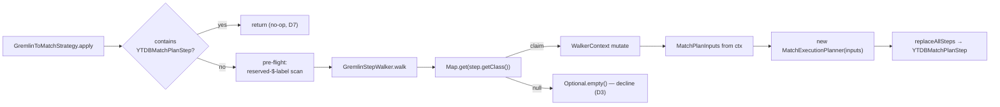

<!-- workflow-sha: d2dfcc2d44fabd3ac76c5fd7620f1e6013675ad9 -->
# Track 2: Strategy skeleton + boundary step + minimal `g.V()` / `g.V(ids)` translation

## Purpose / Big Picture
After this track, the simplest Gremlin source traversals (`g.V()`, `g.V(id)`, `g.V(id1, id2, …)`) run through the MATCH planner end to end, and the cross-cutting scaffolding every later track extends is in place.

<!-- Reserved for Move 2 — ADDED/MODIFIED/REMOVED triad. Empty until Move 2 lands. -->

Wires `GremlinToMatchStrategy` into the optimization chain and establishes the end-to-end pipeline with the simplest recognized traversal. Lands the cross-cutting scaffolding every later track extends: the `MatchPlanInputs` record + the single additive `MatchExecutionPlanner` ctor (D2), the `GremlinStepWalker` + `WalkerContext` + `StepRecogniser` registry (D9) + `StartStepRecogniser`, strategy idempotency (D7), `GremlinPlanCache` (D5), the anonymous-alias generator, and the `YTDBMatchPlanStep` boundary. Registers the strategy and reorders the three half-measure strategies' `applyPrior()` so the translator runs first and the half-measures become the decline fallback (D4).

## Progress
- [x] Review + decomposition
- [ ] Step implementation
- [ ] Track-level code review
- [ ] Track completion

- [x] 2026-07-01T14:11Z [ctx=safe] Step 1 complete (commit 0da2d3753e)
- [x] 2026-07-01T15:27Z [ctx=safe] Step 2 complete (commit e121bb25f6) — bugs-concurrency review iter 1: 4 findings fixed, gate-check PASS
- [x] 2026-07-01T21:46Z [ctx=info] Step 3 complete (commit 999cea5dfe) — bugs-concurrency (BC1/BC2 fixed) + performance (0 findings), gate-check PASS
- [x] 2026-07-01T22:53Z [ctx=info] Step 4 complete (commit 0a8d0e8044) — bugs-concurrency iter 1: 3 CONFIRMED multiset/reflection findings fixed, gate-check PASS

## Surprises & Discoveries
<!-- Continuous-log. Empty at Phase 1. -->
- 2026-07-01T14:11Z Step 1: callers of the new
  `MatchExecutionPlanner(MatchPlanInputs)` ctor must pass `useCache=false` —
  the null inherited `statement` NPEs the cache path (R2). Binds Steps 3–5 and
  every later track that plans through this ctor. See Episodes §Step 1.
- 2026-07-01T14:11Z Step 1: the origin/develop-scoped coverage gate cannot pass
  on a per-step single-test-class run (it needs a full-suite report). Later
  production-code steps in this track hit the same artifact; run one full `core`
  coverage build at the track's final verification. See Episodes §Step 1.
- 2026-07-01T15:27Z Step 2: `YTDBMatchPlanStep.clone()` isolates per-execution
  state via a child `CommandContext` parented to the original plus an
  `everStarted`-gated `plan.reset` — correct for later shapes that write context
  variables (`$matched`, multi-alias joins), not only the single-node `g.V()`.
  Later tracks adding multi-alias plans or new `BoundaryOutputType` cases inherit
  it. See Episodes §Step 2.
- 2026-07-01T21:46Z Step 3: the strategy's throw-safety net rethrows `Error` /
  `AssertionError` and declines only on `Exception`. When Step 4 wires the walker
  under the net, an `-ea` invariant violation in the walk propagates instead of
  silently declining — Step-4 tests must not expect a swallow-everything net. The
  translator `Function` seam and plan-builder `BiFunction` seam are the Step-4
  injection points; registration + the three half-measure `applyPrior` edits land
  in Step 5 (`YTDBGraphImplAbstract.registerOptimizationStrategies`). See
  Episodes §Step 3.
- 2026-07-01T21:46Z Step 3: cumulative track diff (production + tests, generated
  excluded) is ~2,850 lines after three steps; Steps 4–5 (walker + registry +
  registration + smoke tests) will likely push it past ~4,000. Flag for Phase C
  to review in focal chunks per the medium/high step ranges, not one pass.
- 2026-07-01T22:53Z Step 4: bare `g.V()` must never narrow by class — the only
  place `@class` narrowing legitimately reappears is Track 4's folded `hasLabel`.
  Any later recogniser that adds a class filter on the bare vertex source
  reintroduces the BC2 subclass-undercount bug. See Episodes §Step 4.
- 2026-07-01T22:53Z Step 4: cumulative track diff is ~3,960 lines (generated +
  `_workflow` excluded) after four steps; Step 5 crosses ~4,000. Phase C should
  review by focal step range (Steps 2–4 high), not one pass. See Episodes §Step 4.
- 2026-07-01T22:53Z Step 5 pre-work note (registration ordering trap): D4 requires
  translator-first ordering, which is why Step 4 keys the recogniser on the plain
  `GraphStep` — a translator that ran **after** `YTDBGraphStepStrategy` would
  instead have to key on `YTDBGraphStep`. Step 5 must enforce translator-first with
  three `applyPrior` edits (T2): **create** `applyPrior()` on `YTDBGraphStepStrategy`
  (it has none) returning `{GremlinToMatchStrategy.class}`, and **widen**
  `YTDBGraphCountStrategy.applyPrior()` (~line 114) and
  `YTDBGraphMatchStepStrategy.applyPrior()` (~line 147) to add it; leave the
  translator's own prior/post empty. Verify with a test: a real `g.V()` after
  `applyStrategies()` holds exactly one `YTDBMatchPlanStep` (fails under the
  opposite, translator-last ordering).

## Decision Log
<!-- Continuous-log. Execution-time decisions: inline-replan choices,
scope-downs, dependency reveals, gate-override reasons. -->

- **scope-down** — `AnonAliasGenerator` is not built as a dedicated class here.
  Phase 1's only recognized shape (`g.V()` / `g.V(ids)`) yields a single-node
  pattern with exactly one alias, so the anonymous-alias namespace collapses to
  one constant (`$g2m_v0`) held in `StartStepRecogniser`. The generator and its
  reserved-`$`-label collision pre-flight land with the first multi-alias shape
  (Track 3 edge chains). See Episodes §Step 4.
- **scope-down** — `GremlinPlanCache` (D5) is deferred. The additive
  `MatchExecutionPlanner(MatchPlanInputs)` ctor leaves the inherited `statement`
  field null, so the planner runs with `useCache=false` and has no SQL-text
  cache key to build on. Every translated traversal re-plans in Phase 1; a
  traversal-shape-keyed cache is a later-phase addition. See Episodes §Step 1
  and §Step 5.
- **review-resolution (T1 / A1, blocker)** — the recogniser gates and the D9
  registry key on the plain TinkerPop `GraphStep`, not `YTDBGraphStep`. Under D4
  the translator runs before `YTDBGraphStepStrategy` — the sole producer of
  `YTDBGraphStep` (`YTDBGraphStepStrategy.java:114`) — so at translator time the
  start step is a plain `GraphStep`; keying on `YTDBGraphStep` would decline
  every recognized shape and the track would translate nothing. Gating on
  `GraphStep` is also ordering-robust (a `YTDBGraphStep` is a `GraphStep`). D4's
  translator-first ordering is unchanged. The Step 5 smoke tests verify the
  fix empirically.
- **review-resolution (R1)** — `YTDBMatchPlanStep.clone()` copies its plan
  (`plan.copy(ctx)`, mirroring `HashJoinMatchStep`) rather than sharing one
  `SelectExecutionPlan` across original and clone, per the plan's per-execution
  thread-safety contract. The design's "a fresh stream makes sharing safe" note
  is corrected in Phase 4.
- **review-sequencing (R3)** — the strategy's throw-safety net lands in Step 3
  with the skeleton, not Step 5: the walker runs under the strategy from Step 4,
  so a recogniser throw must never break native Gremlin before the net exists.
- **scope-down (Step 4)** — `g.V(id1, id2, …)` with a **duplicate** id declines
  to native. `@rid IN [...]` has set semantics (one emit per distinct rid) while
  native `g.V(ids)` emits once per list entry, so a repeated id breaks multiset
  equality. All-or-nothing (D3): the translator claims only distinct-id vertex
  sources; duplicate-id shapes fall through to the native pipeline. See
  Episodes §Step 4.
- **exec-note / plan drift (Step 4)** — the Plan of Work Step-3 line and the
  design say the recogniser "pins `WalkerContext.polymorphic`", but `WalkerContext`
  has no `polymorphic` field: the flag is resolved locally in `StartStepRecogniser`.
  After the BC2 fix (bare `g.V()` no longer narrows by class) the flag gates no
  class filter for Track 2's shapes and remains only for the null-decline check.
  Reconcile the design/plan wording in Phase 4; a `WalkerContext.polymorphic`
  carrier, if a later track needs one, is additive. See Episodes §Step 4.
- **exec-refinement (R1, Step 2)** — the R1 clone-copy copies against an
  **isolated child** `CommandContext` parented to the original plan's context
  (`setParentWithoutOverridingChild`, mirroring `HashJoinMatchStep`), not the
  shared `plan.getContext()`; sharing the context would leave independent
  executions writing the same per-run variable maps. `reset()` stays plan-free
  and the `plan.reset` rewind moved into `createIterator()` behind an
  `everStarted` flag, because `AbstractStep.clone()` calls `reset()` on the clone
  while its `plan` still aliases the original — an eager rewind there would
  corrupt the original's live plan. The bare `plan.copy(ctx)` phrasing in the
  Concrete Step and in R1 above is the shape; the isolated-child context is the
  correct `ctx`. See Episodes §Step 2. (Reconcile the design's clone note in
  Phase 4.)
- **analysis / no-change (query metrics, pre-Step-5)** — the design is silent on
  `QueryMetricsListener`, and it stays intact by construction: `QueryDetails` has
  a single producer (`YTDBQueryMetricsStep`), and both its fields are decoupled
  from the step-list swap — `getQuerySummary()` reads the `querySummary`
  `OptionsStrategy` config (a traversal-level strategy, not a step), and
  `getQuery()` renders `traversal.getBytecode()` (fixed at construction, not the
  post-strategy step list). `YTDBQueryMetricsStrategy` is a `FinalizationStrategy`,
  so it appends its step *after* `GremlinToMatchStrategy` (a
  `ProviderOptimizationStrategy`) has run `replaceAllSteps`; both are idempotent
  on re-apply. The SQL/MATCH execution path builds no `QueryDetails`, so a
  translated query is measured exactly once — no double-count, no summary built
  from the null `statement`. **Do not** refactor this ordering or move summary
  derivation onto the step list. Step 5 adds the empirical proof (a
  metrics-under-translation smoke test). Track 3+ note: the MATCH path's only
  counter touchpoint is `CoreMetrics.PREFILTER_EFFECTIVENESS` (`EdgeTraversal`),
  which translated edge shapes will begin feeding once Track 3 lands — a metric
  *attribution* shift, unrelated to `QueryDetails`.

<!-- Reserved for Move 1 — per-track inlined Decision Records. -->

## Outcomes & Retrospective
- Phase A technical review: iteration 1 ITERATE → iteration 2 PASS. 4 findings
  (1 blocker, 3 should-fix). Blocker T1 — `StartStepRecogniser` gated on
  `YTDBGraphStep`, which under D4 does not exist at translator time — resolved by
  gating on the plain `GraphStep`; the three should-fix (registration edit count,
  null `isPolymorphic`, ctor mutable-copy) fold into the decomposition
  (`plan/track-2/reviews/technical-iter1.md`).
- Phase A risk review: PASS at iteration 1. 6 findings (0 blocker, 3 should-fix,
  3 suggestions). The strategy runs on the every-traversal critical path, so the
  throw-safety net moved into Step 3 (R3); `clone()` copies the plan per
  execution rather than sharing it (R1); the null-`statement` ctor path is
  guarded by `useCache=false` (R2). Suggestions accepted or deferred
  (`plan/track-2/reviews/risk-iter1.md`).
- Phase A adversarial review: iteration 1 FAIL → iteration 2 PASS. 5 findings
  (1 blocker, 2 should-fix, 2 suggestions). Blocker A1 independently confirmed T1
  and resolved the same way; A5's boundary-scope contradiction reconciled — Track
  2 wires the `ELEMENT` boundary and returns results end to end
  (`plan/track-2/reviews/adversarial-iter1.md`).
- Review gate verification (iteration 2): PASS. Both blockers VERIFIED resolved,
  all should-fix VERIFIED incorporated, suggestions deferred-accepted, no new
  findings (`plan/track-2/reviews/gate-verification-iter2.md`). The T1/A1 fix is
  verified empirically by the Step 5 smoke tests in Phase B.

## Context and Orientation
Three YTDB half-measure `ProviderOptimizationStrategy` implementations already optimize Gremlin today: `YTDBGraphStepStrategy` (folds `hasLabel` into the start step), `YTDBGraphCountStrategy` (class-count fast path), `YTDBGraphMatchStepStrategy`. They run inside TinkerPop's optimization phase, after the structural folders (`IncidentToAdjacentStrategy`, `ConnectiveStrategy`, `LazyBarrierStrategy`). `MatchExecutionPlanner` already turns parsed MATCH IR into a `SelectExecutionPlan` via `createExecutionPlan`, which internally calls `SelectExecutionPlanner.handleProjectionsBlock`. The `Pattern` single-RID fast path resolves `aliasRids[a]` to `SELECT FROM #X:Y`.

This track is where the translator becomes real end to end. It adds the strategy, the walker, the recogniser registry, the per-walk context, and the boundary step — one recogniser (`StartStepRecogniser`) and one output type (`ELEMENT`). Track 2 wires the boundary end to end: a recognized `g.V()` runs through the planner and the boundary emits vertices, so translator-on and translator-off return the same multiset (this is why the Validation section asserts translate-and-return parity). The plan cache (D5) and the anonymous-alias generator are deferred (see Decision Log). The minimal translation covers the vertex source: `g.V()` → single-node `Pattern` with default class `V`; `g.V(id)` → + `aliasRids[boundary] = SQLRid(id)`; `g.V(id1, id2, …)` → + `aliasFilters[boundary] = WHERE @rid IN [...]`.

## Plan of Work
1. **`MatchPlanInputs` record** carrying every post-parse field the planner reads (pattern, `aliasClasses`, `aliasFilters`, `aliasRids`, match/notMatch expressions, return items/aliases/nested projections, groupBy, orderBy, unwind, limit, skip, returnDistinct, returnElements/Paths/Patterns/PathElements). Add the single additive `MatchExecutionPlanner(MatchPlanInputs)` ctor (D2) that routes the record through the existing `createExecutionPlan`. Leave the three existing ctors untouched.
2. **`GremlinStepWalker` + `WalkerContext` + `StepRecogniser` registry** (D9): the walker stores `Map<Class<? extends Step>, StepRecogniser>` and for each step calls `map.get(step.getClass())`; non-null claims, null declines the whole traversal (D3). A duplicate-key assertion guards same-class double registration. `WalkerContext` holds the pattern builder, alias maps, the anonymous-alias generators, the bound-param map, return metadata, `boundaryAlias`, `outputType`, and `stepIndex`.
3. **`StartStepRecogniser`** translating `g.V()` / `g.V(ids)` and pinning `WalkerContext.polymorphic` once (via `YTDBStrategyUtil.isPolymorphic`).
4. **`AnonAliasGenerator`** producing `$g2m_anon_N` under the reserved `$g2m_anon_` prefix, with `isReserved(String)`; the walker's pre-flight scans every step's `getLabels()` once and declines if any user label starts with `$` (collision policy, design §"Anonymous alias generation").
5. **`GremlinToMatchStrategy`** with the early idempotency scan (D7), the pre-flight, the walk, and on full recognition `replaceAllSteps` with the boundary step; empty `applyPrior()`/`applyPost()`. Register it and add it to each half-measure strategy's `applyPrior()` (D4).
6. **`GremlinPlanCache`** (D5): key on the value-independent generic-statement fingerprint; bind predicate values as `SQLPositionalParameter` slots in `WalkerContext.bindParam`; the boundary step installs the per-walk param map via `ctx.setInputParameters(map)`. Reuse the YQL plan-cache schema-change invalidation hook.
7. **`YTDBMatchPlanStep`** boundary holding one `SelectExecutionPlan` + a `BoundaryOutputType`; lazy `ExecutionStream` open on first `processNextStart`; `AutoCloseable` close on exhaustion / `Traversal.close()` / exception; `clone()` shares the plan and resets `started`.

## Concrete Steps

1. Add `MatchPlanInputs` record + additive `MatchExecutionPlanner(MatchPlanInputs)` ctor — mutable defensive copies of `aliasFilters` (the planner mutates it via `detectNotInAntiJoin`), `aliasRids`, and `aliasClasses`, the final `groupBy` / `orderBy` / `unwind` fields assigned, and a `useCache=false` path so the null inherited `statement` never reaches the cache (D2; T4, R2) — `risk: medium`  [x]  commit: 0da2d3753e
2. Add `YTDBMatchPlanStep` boundary step (extends `GraphStep`) + `BoundaryOutputType` enum — lazy stream open, `AutoCloseable` close on exhaustion / exception / abandonment, and `clone()` that copies the plan per execution (`plan.copy(ctx)`, not a shared instance — `SelectExecutionPlan` thread-safety contract; R1) — `risk: high`  [x]  commit: e121bb25f6
3. Add `GremlinToMatchStrategy` skeleton with its throw-safety net in place from the start (a recogniser throw must not break native Gremlin; R3): idempotency scan (D7), D4 translator-first ordering (empty `applyPrior` / `applyPost` on the translator), structural gating cascade, kill-switch knob, and a `GremlinToMatchTranslator` facade that declines every shape — `risk: high`  [x]  commit: 999cea5dfe
4. Add the walker + recogniser registry — `GremlinStepWalker` + `WalkerContext` + `StepRecogniser` interface + `StartStepRecogniser` gating and keying on the plain TinkerPop `GraphStep` (not `YTDBGraphStep`, which `YTDBGraphStepStrategy` produces only after the translator runs; T1, A1), declining on a null `isPolymorphic`, translating `g.V()` / `g.V(ids)` into `MatchPlanInputs` (D9) — `risk: high`  [x]  commit: 0a8d0e8044
5. Register `GremlinToMatchStrategy` in `registerOptimizationStrategies` and wire D4 ordering as three distinct edits — create an `applyPrior` on `YTDBGraphStepStrategy` (it has none), widen `YTDBGraphCountStrategy`'s and `YTDBGraphMatchStepStrategy`'s (T2) — add the minimal-prefix (size-1) gate, and end-to-end smoke tests including a translator-on-vs-off parity and timing check, plus a **query-metrics-under-translation** check: with query monitoring on and `querySummary` set via `with(...)`, a translated `g.V()` records exactly one `QueryDetails` whose `getQuerySummary()` returns the config value, whose `getQuery()` renders the original Gremlin (proving `getBytecode()` survives the boundary splice), with a non-zero duration and the correct count — `risk: high`  [ ]

## Episodes
<!-- Continuous-log. Empty at Phase 1. -->

### Step 1 — commit 0da2d3753e30c744a54bb9e70678a2c555ad58b2, 2026-07-01T14:11Z [ctx=safe]
**What was done:** Added the `MatchPlanInputs` record and the single additive
`MatchExecutionPlanner(MatchPlanInputs)` constructor (D2). The record carries
every post-parse field the planner reads: pattern, `aliasClasses` /
`aliasFilters` / `aliasRids`, match / notMatch expressions, return items /
aliases / nested projections, `groupBy`, `orderBy`, `unwind`, `limit`, `skip`,
`returnDistinct`, and the return-mode flags. The constructor defensive-copies the
three working maps and shallow-copies the AST lists, so a caller's `aliasFilters`
survives the planner's in-place `detectNotInAntiJoin` mutation (T4). The three
existing constructors are unchanged. 14 tests cover null normalisation,
null-input rejection, per-map copy independence, and field propagation.

**What was discovered:** `MatchExecutionPlanner` needed no reconciliation — its
post-parse field set matched the record's fields exactly, and the final `groupBy` /
`orderBy` / `unwind` fields are assignable in the new constructor because every
existing constructor already assigns them.

**Key files:**
- `core/.../sql/executor/match/MatchPlanInputs.java` (new)
- `core/.../sql/executor/match/MatchExecutionPlanner.java` (modified)
- `core/.../sql/executor/match/MatchExecutionPlannerInputsTest.java` (new)

**Critical context:** Callers of the new constructor must plan with
`createExecutionPlan(ctx, profiling, useCache=false)`. The inherited `statement`
field stays null and NPEs the cache lookup on the `useCache=true` path (R2, D5
cache deferral); this is documented on the constructor Javadoc and enforced by
convention, not a runtime guard, so it binds Steps 3–5 and every later track that
builds a plan through this constructor. A full-suite coverage report is deferred
to the track's final verification: a single-test-class run cannot satisfy the
origin/develop-scoped gate, but this step's changed lines are 100% line and
branch by direct JaCoCo inspection.

### Step 2 — commit e121bb25f60a87d389bd6a72fbc1880b8dc0646c, 2026-07-01T15:27Z [ctx=safe]
**What was done:** Added `YTDBMatchPlanStep` (extends `GraphStep`) and the
`BoundaryOutputType` enum, with only the `ELEMENT` case wired for Track 2. The
step lazily opens the plan's `ExecutionStream` on first `createIterator`,
projects each `Result` row to a `YTDBVertexImpl` under the boundary alias, and
closes stream-then-plan on exhaustion, explicit termination, and any open or
hook-install failure. `clone()` copies the plan per execution against an isolated
child `CommandContext` (R1), so parallel executions share no per-run state. 24
unit tests cover ctor guards, iteration/projection, close ordering and
idempotency, the failure-path closes, the single-shot guard, and clone/reset
independence.

**What was discovered:** The design's clone note shares one `SelectExecutionPlan`
across original and clone, guarded only by a `started` flag — a direct R1
violation. The step-level bugs-concurrency review surfaced four findings, all
fixed: the shared-context copy (BC1), an unsafe reflective write to a `final`
field (BC2), `reset()` leaving `started=true` and breaking re-iteration (BC3),
and the drained-plan clone (BC4). Fixing BC3 exposed a latent bug —
`AbstractStep.clone()` calls `reset()` on the clone while `cloned.plan` still
aliases the original, so an eager `plan.reset()` in `reset()` would rewind the
original's live plan mid-iteration. Resolved by moving the rewind into
`createIterator()` gated on an `everStarted` flag and keeping `reset()`
plan-free; pinned by `clone_afterOriginalStarted_doesNotResetOriginalsPlan`. The
gate-check verified all four VERIFIED/MOOT (PSI was down — grep + `javap`
bytecode fallback).

**What changed from the plan:** The Plan of Work step-7 wording ("`clone()`
shares the plan and resets `started`") is superseded by Decision Log R1 (copy
per execution); the implementation follows R1. No new step impact.

**Key files:**
- `core/.../gremlin/translator/step/YTDBMatchPlanStep.java` (new)
- `core/.../gremlin/translator/step/BoundaryOutputType.java` (new)
- `core/.../gremlin/translator/step/YTDBMatchPlanStepTest.java` (new)

**Critical context:** The clone's isolated-child `CommandContext` plus the
`everStarted`-gated `plan.reset` make the boundary correct for later shapes that
write context variables (`$matched`, multi-alias joins), not just the
single-node `g.V()` shape whose collision state is empty today. Later tracks that
add multi-alias plans or new `BoundaryOutputType` cases inherit the corrected
isolation with no further work. Callers still plan with `useCache=false`
(Step 1).

### Step 3 — commit 999cea5dfe1c4848d6dbc8aa9dc1955082620afb, 2026-07-01T21:46Z [ctx=info]
**What was done:** Added the `GremlinToMatchStrategy` skeleton
(`ProviderOptimizationStrategy`), the declining `GremlinToMatchTranslator`
facade, and the `QUERY_GREMLIN_TO_MATCH_TRANSLATOR_ENABLED` kill-switch in
`GlobalConfiguration`. `apply()` runs the gating cascade — per-session kill-switch
resolution, whole-list idempotency scan (D7), plain-`GraphStep` vertex-start gate
(T1/A1) — then delegates to the facade, which declines every shape, so the
strategy is a structural no-op end to end. The whole body runs inside the
throw-safety net (R3): a `catch (Error)` arm rethrows fatal and `-ea` invariant
failures, and a `catch (Exception)` arm declines with the native step list left
verbatim. The translator declares empty `applyPrior` / `applyPost`; the
`replaceAllSteps` splice path is implemented but unreachable through the
production facade. 16 tests.

**What was discovered:** An earlier prefix / hybrid model — non-empty `applyPrior`
/ `applyPost` on the translator plus a `prefixStepCount` — is incompatible with the
current design (D3 all-or-nothing, D4 empty ordering with the half-measures naming
the translator, `replaceAllSteps`), so the implementation follows the design and
track; `TranslationResult` is a four-field record with no `prefixStepCount`. Two package-private seams (a
translator `Function` and a plan-builder `BiFunction`) let the unreachable splice
path be unit-tested with stubs without standing up the real planner over a
schema. Cross-step note for Step 4: with the corrected net an `Error` or
`AssertionError` thrown inside the walker now propagates rather than declining, so
any Step-4 test expecting the old swallow-everything behavior needs updating; the
decline-on-`Exception` contract for the walker seam is unchanged. The
bugs-concurrency review found both the `catch (Throwable)` Error-swallow (BC1) and
a `@Nullable` `getConfiguration()` NPE risk (BC2); both fixed and gate-verified.
Performance review returned zero findings (decline-only skeleton).

**What changed from the plan:** The earlier prefix model's `prefixStepCount` is
obsolete under D3 (all-or-nothing replaces the whole step list, not a prefix), so
`TranslationResult` carries only inputs / boundaryAlias / outputType / returnClass.
Registration and the half-measure `applyPrior` edits remain Step 5, as planned.

**Key files:**
- `core/.../gremlin/translator/strategy/GremlinToMatchStrategy.java` (new)
- `core/.../gremlin/translator/strategy/GremlinToMatchTranslator.java` (new)
- `core/.../api/config/GlobalConfiguration.java` (modified — kill-switch knob)
- `core/.../gremlin/translator/strategy/GremlinToMatchStrategyTest.java` (new)

**Critical context:** The translator seam (`Function` → `Optional<TranslationResult>`)
and the plan-builder seam (`BiFunction`) are the Step-4 injection points — the
walker supplies the real translator. Registration wires into `YTDBGraphImplAbstract`
(`registerOptimizationStrategies`) plus the three half-measure `applyPrior` edits
in Step 5. Ephemeral-identifier gate: decision-record IDs (D1, D3, …) and
risk-finding IDs (R3, …) are forbidden in durable Java source and Javadoc until
restated in `adr.md` (Phase 4) — keep source comments self-contained; this binds
every later source-touching step.

### Step 4 — commit 0a8d0e804499120b19d6201335d423918612cf7e, 2026-07-01T22:53Z [ctx=info]
**What was done:** Added the walker layer — `GremlinStepWalker` (index-driven
walk, all-or-nothing decline per D3), `WalkerContext`, the `StepRecogniser`
interface, and `StartStepRecogniser` — and wired the production walker into
`GremlinToMatchTranslator.translate`, replacing the Step-3 declining facade.
`StartStepRecogniser` gates and keys on the plain TinkerPop `GraphStep` (T1/A1),
declines on a null `isPolymorphic`, and translates `g.V()` → single-node
`$g2m_v0` pattern rooted at class `V` (polymorphic scan), `g.V(id)` → RID on
`aliasRids`, `g.V(id1, id2, …)` → `@rid IN [...]` on `aliasFilters`. The registry
is the class-keyed `Map<Class<? extends Step>, StepRecogniser>` (D9) with one entry
(`GraphStep` → `StartStepRecogniser`); the single alias is a `$g2m_v0` constant (no
`AnonAliasGenerator`). The strategy
stays unregistered (dormant) — Step 5 registers it. 13 walker tests + 19 strategy
tests.

**What was discovered:** Gating `StartStepRecogniser` on `YTDBGraphStep` would
decline every shape under the current D4 ordering (translator runs before
`YTDBGraphStepStrategy`), so the recogniser gates on the plain `GraphStep`
instead, with a regression guard that fails if the gate keys on `YTDBGraphStep`
and an ordering-robustness test (a `YTDBGraphStep` is-a `GraphStep`, still
recognized). The bugs-concurrency review then found three
CONFIRMED multiset-equality issues, all fixed: `g.V(id, id)` with a repeated id
emitted the vertex once vs native's once-per-entry (BC1 — now declines
duplicate-id shapes to native per D3, value-keyed on collection id + position so
RID-string and Vertex-handle forms collapse); non-polymorphic bare `g.V()`
narrowed to exact `@class = 'V'`, excluding subclass instances native returns
(BC2 — narrowing removed; the scan roots at `V` polymorphically via
`aliasClasses`); and the `@rid IN` clause set the operator via unnecessary
reflection with a false "no public setter" Javadoc (BC3 — replaced with the
public `setOperator`, dead helpers removed). The `null isPolymorphic` branch is
reachable only via a genuinely graph-less traversal; the throwing `EmptyGraph`
case is caught by the strategy's session-resolution gate before the walker runs.

**What changed from the plan:** The plan's Step-3 wording "pins
`WalkerContext.polymorphic`" is imprecise — `WalkerContext` has no `polymorphic`
field; the flag is resolved locally in `StartStepRecogniser` and, after the BC2
fix, no longer gates any class filter for Track 2's shapes (it stays resolved
only for the null-decline check). The recognized set now excludes duplicate-id
`g.V(ids)` (declines to native).

**Key files:**
- `core/.../gremlin/translator/strategy/GremlinStepWalker.java` (new)
- `core/.../gremlin/translator/strategy/WalkerContext.java` (new)
- `core/.../gremlin/translator/strategy/StepRecogniser.java` (new)
- `core/.../gremlin/translator/strategy/StartStepRecogniser.java` (new)
- `core/.../gremlin/translator/strategy/GremlinToMatchStrategy.java` (modified)
- `core/.../gremlin/translator/strategy/GremlinToMatchTranslator.java` (modified)

**Critical context:** Bare `g.V()` must NEVER narrow by class — the only place
`@class` narrowing legitimately reappears is Track 4's folded `hasLabel`. The
walker's `MatchPlanInputs` populates `returnItems` / `returnAliases` /
`returnNestedProjections` in parallel (one entry, `$g2m_v0 AS $g2m_v0`) so the
planner takes its custom-RETURN branch; later tracks adding return modes or
aggregations must keep this contract or set the corresponding flag. Step 5
registration makes the strategy live; its smoke tests verify the T1/A1 fix and
the multiset fixes end to end (auto-strategy-chain parity variant, plus the
duplicate-id-declines and non-polymorphic-subclass cases).

## Validation and Acceptance
- `g.V()`, `g.V(id)`, `g.V(id1, id2, …)` translate and return the same multiset as the native pipeline (translator-on vs translator-off).
- A traversal containing any unrecognized step declines: original step list preserved verbatim, no `YTDBMatchPlanStep` present (engagement assertion).
- Re-applying the strategy on an already-translated traversal is a no-op (idempotency, D7).
- A user label starting with `$` declines the whole traversal (collision pre-flight).
- The plan cache serves one plan for the same shape across distinct parameter values; a schema change invalidates it.
- The three half-measure strategies still serve their shapes on decline.
- Query monitoring survives translation: a translated `g.V()` run with monitoring
  enabled records exactly one `QueryDetails` — `getQuerySummary()` = the
  `with(querySummary, …)` config value, `getQuery()` = the original Gremlin
  string, non-zero duration, correct count (Step 5 smoke test).

<!-- Phase A placeholder for per-step EARS/Gherkin lines. -->

<!-- Reserved for Move 3 — acceptance lines. -->

## Idempotence and Recovery
<!-- Phase A placeholder. -->

## Artifacts and Notes
<!-- Continuous-log (rare). Often empty. -->

## Interfaces and Dependencies
**In scope (new):** `MatchPlanInputs` record; `GremlinToMatchStrategy`; `GremlinStepWalker`; `WalkerContext`; `StepRecogniser` interface; `StartStepRecogniser`; `AnonAliasGenerator`; `GremlinPlanCache`; `YTDBMatchPlanStep`; strategy registration wiring; the new `MatchExecutionPlanner(MatchPlanInputs)` ctor (additive edit to an existing class); strategy / cache / boundary unit tests + a Cucumber smoke check.
**In scope (modified):** `MatchExecutionPlanner` (one additive ctor only); `YTDBGraphStepStrategy` / `YTDBGraphCountStrategy` / `YTDBGraphMatchStepStrategy` (add `GremlinToMatchStrategy` to each `applyPrior()`); the strategy-registration site.
**Out of scope:** every recogniser past `StartStepRecogniser` (Tracks 3–6); edge / filter / projection / aggregate / union translation; the existing MATCH execution steps and IR classes (consumed unchanged).
**Inter-track dependencies:** depends on Track 1 (`MatchPatternBuilder`). Supplies the walker, registry, context, boundary, cache, and anon-alias generator to every later track. Track 3 adds the `polymorphic` flag's chain-target use and the first boundary output type.
**Signatures:** `ProviderOptimizationStrategy.apply / applyPrior / applyPost`; `MatchExecutionPlanner.createExecutionPlan(ctx, prof, useCache)`; `SQLPositionalParameter.getValue(params)`; `YTDBStrategyUtil.isPolymorphic(traversal)`.

## Invariants & Constraints
<!-- Combined per-track invariants + constraints (conventions-execution.md §2.1 §14).
Added by workflow migration (#1145). Strategic invariants/constraints for this track remain
in implementation-plan.md § High-level plan (Architecture Notes) and this track's ## Decision
Log — the conservative migration retained the plan Architecture Notes rather than folding them here. -->

## Base commit
<!-- Phase B records the HEAD SHA here at session start; Phase C reads it to compute the
cumulative track diff (conventions-execution.md §2.1 §15). Added by workflow migration (#1145). -->
b29d564ef8b9672dbe30998d8a3b6aaafcd3c973
