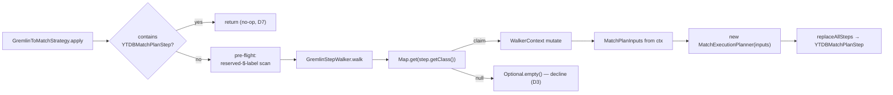

<!-- workflow-sha: e9377f7f133f5cd6ec3028936f28be2819e4ae96 -->
# Track 2: Strategy skeleton + boundary step + minimal `g.V()` / `g.V(ids)` translation

## Purpose / Big Picture
After this track, the simplest Gremlin source traversals (`g.V()`, `g.V(id)`, `g.V(id1, id2, …)`) run through the MATCH planner end to end, and the cross-cutting scaffolding every later track extends is in place.

<!-- Reserved for Move 2 — ADDED/MODIFIED/REMOVED triad. Empty until Move 2 lands. -->

Wires `GremlinToMatchStrategy` into the optimization chain and establishes the end-to-end pipeline with the simplest recognized traversal. Lands the cross-cutting scaffolding every later track extends: the `MatchPlanInputs` record + the single additive `MatchExecutionPlanner` ctor (D2), the `GremlinStepWalker` + `WalkerContext` + `StepRecogniser` registry (D9) + `StartStepRecogniser`, strategy idempotency (D7), `GremlinPlanCache` (D5), the anonymous-alias generator, and the `YTDBMatchPlanStep` boundary. Registers the strategy and reorders the three half-measure strategies' `applyPrior()` so the translator runs first and the half-measures become the decline fallback (D4).

## Progress
- [ ] Review + decomposition
- [ ] Step implementation
- [ ] Track-level code review
- [ ] Track completion

## Surprises & Discoveries
<!-- Continuous-log. Empty at Phase 1. -->

## Decision Log
<!-- Continuous-log. -->

<!-- Reserved for Move 1 — per-track inlined Decision Records. -->

## Outcomes & Retrospective
<!-- Continuous-log. -->

## Context and Orientation
Three YTDB half-measure `ProviderOptimizationStrategy` implementations already optimize Gremlin today: `YTDBGraphStepStrategy` (folds `hasLabel` into the start step), `YTDBGraphCountStrategy` (class-count fast path), `YTDBGraphMatchStepStrategy`. They run inside TinkerPop's optimization phase, after the structural folders (`IncidentToAdjacentStrategy`, `ConnectiveStrategy`, `LazyBarrierStrategy`). `MatchExecutionPlanner` already turns parsed MATCH IR into a `SelectExecutionPlan` via `createExecutionPlan`, which internally calls `SelectExecutionPlanner.handleProjectionsBlock`. The `Pattern` single-RID fast path resolves `aliasRids[a]` to `SELECT FROM #X:Y`.

This track is where the translator becomes real end to end. It adds the strategy, the walker, the recogniser registry, the per-walk context, the boundary step, and the plan cache — but only one recogniser (`StartStepRecogniser`) and one output type (`ELEMENT` is wired in Track 3; Track 2's `g.V()` translation produces a vertex-source pattern that Track 3's boundary later emits). The minimal translation covers the vertex source: `g.V()` → single-node `Pattern` with default class `V`; `g.V(id)` → + `aliasRids[boundary] = SQLRid(id)`; `g.V(id1, id2, …)` → + `aliasFilters[boundary] = WHERE @rid IN [...]`.

## Plan of Work
1. **`MatchPlanInputs` record** carrying every post-parse field the planner reads (pattern, `aliasClasses`, `aliasFilters`, `aliasRids`, match/notMatch expressions, return items/aliases/nested projections, groupBy, orderBy, unwind, limit, skip, returnDistinct, returnElements/Paths/Patterns/PathElements). Add the single additive `MatchExecutionPlanner(MatchPlanInputs)` ctor (D2) that routes the record through the existing `createExecutionPlan`. Leave the three existing ctors untouched.
2. **`GremlinStepWalker` + `WalkerContext` + `StepRecogniser` registry** (D9): the walker stores `Map<Class<? extends Step>, StepRecogniser>` and for each step calls `map.get(step.getClass())`; non-null claims, null declines the whole traversal (D3). A duplicate-key assertion guards same-class double registration. `WalkerContext` holds the pattern builder, alias maps, the anonymous-alias generators, the bound-param map, return metadata, `boundaryAlias`, `outputType`, and `stepIndex`.
3. **`StartStepRecogniser`** translating `g.V()` / `g.V(ids)` and pinning `WalkerContext.polymorphic` once (via `YTDBStrategyUtil.isPolymorphic`).
4. **`AnonAliasGenerator`** producing `$g2m_anon_N` under the reserved `$g2m_anon_` prefix, with `isReserved(String)`; the walker's pre-flight scans every step's `getLabels()` once and declines if any user label starts with `$` (collision policy, design §"Anonymous alias generation").
5. **`GremlinToMatchStrategy`** with the early idempotency scan (D7), the pre-flight, the walk, and on full recognition `replaceAllSteps` with the boundary step; empty `applyPrior()`/`applyPost()`. Register it and add it to each half-measure strategy's `applyPrior()` (D4).
6. **`GremlinPlanCache`** (D5): key on the value-independent generic-statement fingerprint; bind predicate values as `SQLPositionalParameter` slots in `WalkerContext.bindParam`; the boundary step installs the per-walk param map via `ctx.setInputParameters(map)`. Reuse the YQL plan-cache schema-change invalidation hook.
7. **`YTDBMatchPlanStep`** boundary holding one `SelectExecutionPlan` + a `BoundaryOutputType`; lazy `ExecutionStream` open on first `processNextStart`; `AutoCloseable` close on exhaustion / `Traversal.close()` / exception; `clone()` shares the plan and resets `started`.

## Concrete Steps
<!-- Phase A placeholder. -->

## Episodes
<!-- Continuous-log. Empty at Phase 1. -->

## Validation and Acceptance
- `g.V()`, `g.V(id)`, `g.V(id1, id2, …)` translate and return the same multiset as the native pipeline (translator-on vs translator-off).
- A traversal containing any unrecognized step declines: original step list preserved verbatim, no `YTDBMatchPlanStep` present (engagement assertion).
- Re-applying the strategy on an already-translated traversal is a no-op (idempotency, D7).
- A user label starting with `$` declines the whole traversal (collision pre-flight).
- The plan cache serves one plan for the same shape across distinct parameter values; a schema change invalidates it.
- The three half-measure strategies still serve their shapes on decline.

<!-- Phase A placeholder for per-step EARS/Gherkin lines. -->

<!-- Reserved for Move 3 — acceptance lines. -->

## Idempotence and Recovery
<!-- Phase A placeholder. -->

## Artifacts and Notes
<!-- Continuous-log (rare). Often empty. -->

## Interfaces and Dependencies
**In scope (new):** `MatchPlanInputs` record; `GremlinToMatchStrategy`; `GremlinStepWalker`; `WalkerContext`; `StepRecogniser` interface; `StartStepRecogniser`; `AnonAliasGenerator`; `GremlinPlanCache`; `YTDBMatchPlanStep`; strategy registration wiring; the new `MatchExecutionPlanner(MatchPlanInputs)` ctor (additive edit to an existing class); strategy / cache / boundary unit tests + a Cucumber smoke check.
**In scope (modified):** `MatchExecutionPlanner` (one additive ctor only); `YTDBGraphStepStrategy` / `YTDBGraphCountStrategy` / `YTDBGraphMatchStepStrategy` (add `GremlinToMatchStrategy` to each `applyPrior()`); the strategy-registration site.
**Out of scope:** every recogniser past `StartStepRecogniser` (Tracks 3–6); edge / filter / projection / aggregate / union translation; the existing MATCH execution steps and IR classes (consumed unchanged).
**Inter-track dependencies:** depends on Track 1 (`MatchPatternBuilder`). Supplies the walker, registry, context, boundary, cache, and anon-alias generator to every later track. Track 3 adds the `polymorphic` flag's chain-target use and the first boundary output type.
**Signatures:** `ProviderOptimizationStrategy.apply / applyPrior / applyPost`; `MatchExecutionPlanner.createExecutionPlan(ctx, prof, useCache)`; `SQLPositionalParameter.getValue(params)`; `YTDBStrategyUtil.isPolymorphic(traversal)`.
