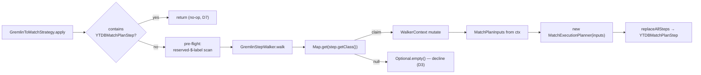

<!-- workflow-sha: e9377f7f133f5cd6ec3028936f28be2819e4ae96 -->
# Track 2: Strategy skeleton + boundary step + minimal `g.V()` / `g.V(ids)` translation

## Purpose / Big Picture
After this track, the simplest Gremlin source traversals (`g.V()`, `g.V(id)`, `g.V(id1, id2, …)`) run through the MATCH planner end to end, and the cross-cutting scaffolding every later track extends is in place.

<!-- Reserved for Move 2 — ADDED/MODIFIED/REMOVED triad. Empty until Move 2 lands. -->

Wires `GremlinToMatchStrategy` into the optimization chain and establishes the end-to-end pipeline with the simplest recognized traversal. Lands the cross-cutting scaffolding every later track extends: the `MatchPlanInputs` record + the single additive `MatchExecutionPlanner` ctor (D2), the `GremlinStepWalker` + `WalkerContext` + `StepRecogniser` registry (D9) + `StartStepRecogniser`, strategy idempotency (D7), `GremlinPlanCache` (D5), the anonymous-alias generator, and the `YTDBMatchPlanStep` boundary. Registers the strategy and reorders the three half-measure strategies' `applyPrior()` so the translator runs first and the half-measures become the decline fallback (D4).

## Progress
- [x] Review + decomposition
- [ ] Step implementation
- [ ] Track-level code review
- [ ] Track completion

## Surprises & Discoveries
<!-- Continuous-log. Empty at Phase 1. -->

## Decision Log
<!-- Continuous-log. Execution-time decisions: inline-replan choices,
scope-downs, dependency reveals, gate-override reasons. -->

- **scope-down** — `AnonAliasGenerator` is not built as a dedicated class here.
  Phase 1's only recognized shape (`g.V()` / `g.V(ids)`) yields a single-node
  pattern with exactly one alias, so the anonymous-alias namespace collapses to
  one constant (`$g2m_v0`) held in `StartStepRecogniser`. The generator and its
  reserved-`$`-label collision pre-flight land with the first multi-alias shape
  (Track 3 edge chains). See Episodes §Step 4.
- **scope-down** — `GremlinPlanCache` (D5) is deferred. The additive
  `MatchExecutionPlanner(MatchPlanInputs)` ctor leaves the inherited `statement`
  field null, so the planner runs with `useCache=false` and has no SQL-text
  cache key to build on. Every translated traversal re-plans in Phase 1; a
  traversal-shape-keyed cache is a later-phase addition. See Episodes §Step 1
  and §Step 5.
- **simplification** — the recogniser registry is an ordered `StepRecogniser`
  list, not the `Map<Class<? extends Step>, StepRecogniser>` of D9. Phase 1 has
  one recogniser, so class-keyed O(1) dispatch buys nothing yet; `StartStep`
  gates on `stepIndex == 0 && step instanceof GraphStep`. The class-keyed map
  lands in Track 3, where multiple recognisers make dispatch cost real. See
  Episodes §Step 4.
- **review-resolution (T1 / A1, blocker)** — the recogniser gates and the D9
  registry key on the plain TinkerPop `GraphStep`, not `YTDBGraphStep`. Under D4
  the translator runs before `YTDBGraphStepStrategy` — the sole producer of
  `YTDBGraphStep` (`YTDBGraphStepStrategy.java:114`) — so at translator time the
  start step is a plain `GraphStep`; keying on `YTDBGraphStep` would decline
  every recognized shape and the track would translate nothing. Gating on
  `GraphStep` is also ordering-robust (a `YTDBGraphStep` is a `GraphStep`). D4's
  translator-first ordering is unchanged. The Step 5 smoke tests verify the
  fix empirically.
- **review-resolution (R1)** — `YTDBMatchPlanStep.clone()` copies its plan
  (`plan.copy(ctx)`, mirroring `HashJoinMatchStep`) rather than sharing one
  `SelectExecutionPlan` across original and clone, per the plan's per-execution
  thread-safety contract. The design's "a fresh stream makes sharing safe" note
  is corrected in Phase 4.
- **review-sequencing (R3)** — the strategy's throw-safety net lands in Step 3
  with the skeleton, not Step 5: the walker runs under the strategy from Step 4,
  so a recogniser throw must never break native Gremlin before the net exists.

<!-- Reserved for Move 1 — per-track inlined Decision Records. -->

## Outcomes & Retrospective
- Phase A technical review: iteration 1 ITERATE → iteration 2 PASS. 4 findings
  (1 blocker, 3 should-fix). Blocker T1 — `StartStepRecogniser` gated on
  `YTDBGraphStep`, which under D4 does not exist at translator time — resolved by
  gating on the plain `GraphStep`; the three should-fix (registration edit count,
  null `isPolymorphic`, ctor mutable-copy) fold into the decomposition
  (`plan/track-2/reviews/technical-iter1.md`).
- Phase A risk review: PASS at iteration 1. 6 findings (0 blocker, 3 should-fix,
  3 suggestions). The strategy runs on the every-traversal critical path, so the
  throw-safety net moved into Step 3 (R3); `clone()` copies the plan per
  execution rather than sharing it (R1); the null-`statement` ctor path is
  guarded by `useCache=false` (R2). Suggestions accepted or deferred
  (`plan/track-2/reviews/risk-iter1.md`).
- Phase A adversarial review: iteration 1 FAIL → iteration 2 PASS. 5 findings
  (1 blocker, 2 should-fix, 2 suggestions). Blocker A1 independently confirmed T1
  and resolved the same way; A5's boundary-scope contradiction reconciled — Track
  2 wires the `ELEMENT` boundary and returns results end to end
  (`plan/track-2/reviews/adversarial-iter1.md`).
- Review gate verification (iteration 2): PASS. Both blockers VERIFIED resolved,
  all should-fix VERIFIED incorporated, suggestions deferred-accepted, no new
  findings (`plan/track-2/reviews/gate-verification-iter2.md`). The T1/A1 fix is
  verified empirically by the Step 5 smoke tests in Phase B.
- Deferred to Phase 4 (documentation): D9 names Track 2 as the class-keyed
  `Map<Class, StepRecogniser>` home, but the track ships the ordered
  `StepRecogniser` list with the map deferred to Track 3; the Plan of Work prose
  and diagram keep the original plan wording. The Decision Log and Concrete Steps
  carry the authoritative deferrals.

## Context and Orientation
Three YTDB half-measure `ProviderOptimizationStrategy` implementations already optimize Gremlin today: `YTDBGraphStepStrategy` (folds `hasLabel` into the start step), `YTDBGraphCountStrategy` (class-count fast path), `YTDBGraphMatchStepStrategy`. They run inside TinkerPop's optimization phase, after the structural folders (`IncidentToAdjacentStrategy`, `ConnectiveStrategy`, `LazyBarrierStrategy`). `MatchExecutionPlanner` already turns parsed MATCH IR into a `SelectExecutionPlan` via `createExecutionPlan`, which internally calls `SelectExecutionPlanner.handleProjectionsBlock`. The `Pattern` single-RID fast path resolves `aliasRids[a]` to `SELECT FROM #X:Y`.

This track is where the translator becomes real end to end. It adds the strategy, the walker, the recogniser registry, the per-walk context, and the boundary step — one recogniser (`StartStepRecogniser`) and one output type (`ELEMENT`). Track 2 wires the boundary end to end: a recognized `g.V()` runs through the planner and the boundary emits vertices, so translator-on and translator-off return the same multiset (this is why the Validation section asserts translate-and-return parity). The plan cache (D5) and the anonymous-alias generator are deferred (see Decision Log). The minimal translation covers the vertex source: `g.V()` → single-node `Pattern` with default class `V`; `g.V(id)` → + `aliasRids[boundary] = SQLRid(id)`; `g.V(id1, id2, …)` → + `aliasFilters[boundary] = WHERE @rid IN [...]`.

## Plan of Work
1. **`MatchPlanInputs` record** carrying every post-parse field the planner reads (pattern, `aliasClasses`, `aliasFilters`, `aliasRids`, match/notMatch expressions, return items/aliases/nested projections, groupBy, orderBy, unwind, limit, skip, returnDistinct, returnElements/Paths/Patterns/PathElements). Add the single additive `MatchExecutionPlanner(MatchPlanInputs)` ctor (D2) that routes the record through the existing `createExecutionPlan`. Leave the three existing ctors untouched.
2. **`GremlinStepWalker` + `WalkerContext` + `StepRecogniser` registry** (D9): the walker stores `Map<Class<? extends Step>, StepRecogniser>` and for each step calls `map.get(step.getClass())`; non-null claims, null declines the whole traversal (D3). A duplicate-key assertion guards same-class double registration. `WalkerContext` holds the pattern builder, alias maps, the anonymous-alias generators, the bound-param map, return metadata, `boundaryAlias`, `outputType`, and `stepIndex`.
3. **`StartStepRecogniser`** translating `g.V()` / `g.V(ids)` and pinning `WalkerContext.polymorphic` once (via `YTDBStrategyUtil.isPolymorphic`).
4. **`AnonAliasGenerator`** producing `$g2m_anon_N` under the reserved `$g2m_anon_` prefix, with `isReserved(String)`; the walker's pre-flight scans every step's `getLabels()` once and declines if any user label starts with `$` (collision policy, design §"Anonymous alias generation").
5. **`GremlinToMatchStrategy`** with the early idempotency scan (D7), the pre-flight, the walk, and on full recognition `replaceAllSteps` with the boundary step; empty `applyPrior()`/`applyPost()`. Register it and add it to each half-measure strategy's `applyPrior()` (D4).
6. **`GremlinPlanCache`** (D5): key on the value-independent generic-statement fingerprint; bind predicate values as `SQLPositionalParameter` slots in `WalkerContext.bindParam`; the boundary step installs the per-walk param map via `ctx.setInputParameters(map)`. Reuse the YQL plan-cache schema-change invalidation hook.
7. **`YTDBMatchPlanStep`** boundary holding one `SelectExecutionPlan` + a `BoundaryOutputType`; lazy `ExecutionStream` open on first `processNextStart`; `AutoCloseable` close on exhaustion / `Traversal.close()` / exception; `clone()` shares the plan and resets `started`.

## Concrete Steps

1. Add `MatchPlanInputs` record + additive `MatchExecutionPlanner(MatchPlanInputs)` ctor — mutable defensive copies of `aliasFilters` (the planner mutates it via `detectNotInAntiJoin`), `aliasRids`, and `aliasClasses`, the final `groupBy` / `orderBy` / `unwind` fields assigned, and a `useCache=false` path so the null inherited `statement` never reaches the cache (D2; T4, R2) — `risk: medium`  [ ]
2. Add `YTDBMatchPlanStep` boundary step (extends `GraphStep`) + `BoundaryOutputType` enum — lazy stream open, `AutoCloseable` close on exhaustion / exception / abandonment, and `clone()` that copies the plan per execution (`plan.copy(ctx)`, not a shared instance — `SelectExecutionPlan` thread-safety contract; R1) — `risk: high`  [ ]
3. Add `GremlinToMatchStrategy` skeleton with its throw-safety net in place from the start (a recogniser throw must not break native Gremlin; R3): idempotency scan (D7), D4 translator-first ordering (empty `applyPrior` / `applyPost` on the translator), structural gating cascade, kill-switch knob, and a `GremlinToMatchTranslator` facade that declines every shape — `risk: high`  [ ]
4. Add the walker + recogniser registry — `GremlinStepWalker` + `WalkerContext` + `StepRecogniser` interface + `StartStepRecogniser` gating and keying on the plain TinkerPop `GraphStep` (not `YTDBGraphStep`, which `YTDBGraphStepStrategy` produces only after the translator runs; T1, A1), declining on a null `isPolymorphic`, translating `g.V()` / `g.V(ids)` into `MatchPlanInputs` (D9) — `risk: high`  [ ]
5. Register `GremlinToMatchStrategy` in `registerOptimizationStrategies` and wire D4 ordering as three distinct edits — create an `applyPrior` on `YTDBGraphStepStrategy` (it has none), widen `YTDBGraphCountStrategy`'s and `YTDBGraphMatchStepStrategy`'s (T2) — add the minimal-prefix (size-1) gate, and end-to-end smoke tests including a translator-on-vs-off parity and timing check — `risk: high`  [ ]

## Episodes
<!-- Continuous-log. Empty at Phase 1. -->

## Validation and Acceptance
- `g.V()`, `g.V(id)`, `g.V(id1, id2, …)` translate and return the same multiset as the native pipeline (translator-on vs translator-off).
- A traversal containing any unrecognized step declines: original step list preserved verbatim, no `YTDBMatchPlanStep` present (engagement assertion).
- Re-applying the strategy on an already-translated traversal is a no-op (idempotency, D7).
- A user label starting with `$` declines the whole traversal (collision pre-flight).
- The plan cache serves one plan for the same shape across distinct parameter values; a schema change invalidates it.
- The three half-measure strategies still serve their shapes on decline.

<!-- Phase A placeholder for per-step EARS/Gherkin lines. -->

<!-- Reserved for Move 3 — acceptance lines. -->

## Idempotence and Recovery
<!-- Phase A placeholder. -->

## Artifacts and Notes
<!-- Continuous-log (rare). Often empty. -->

## Interfaces and Dependencies
**In scope (new):** `MatchPlanInputs` record; `GremlinToMatchStrategy`; `GremlinStepWalker`; `WalkerContext`; `StepRecogniser` interface; `StartStepRecogniser`; `AnonAliasGenerator`; `GremlinPlanCache`; `YTDBMatchPlanStep`; strategy registration wiring; the new `MatchExecutionPlanner(MatchPlanInputs)` ctor (additive edit to an existing class); strategy / cache / boundary unit tests + a Cucumber smoke check.
**In scope (modified):** `MatchExecutionPlanner` (one additive ctor only); `YTDBGraphStepStrategy` / `YTDBGraphCountStrategy` / `YTDBGraphMatchStepStrategy` (add `GremlinToMatchStrategy` to each `applyPrior()`); the strategy-registration site.
**Out of scope:** every recogniser past `StartStepRecogniser` (Tracks 3–6); edge / filter / projection / aggregate / union translation; the existing MATCH execution steps and IR classes (consumed unchanged).
**Inter-track dependencies:** depends on Track 1 (`MatchPatternBuilder`). Supplies the walker, registry, context, boundary, cache, and anon-alias generator to every later track. Track 3 adds the `polymorphic` flag's chain-target use and the first boundary output type.
**Signatures:** `ProviderOptimizationStrategy.apply / applyPrior / applyPost`; `MatchExecutionPlanner.createExecutionPlan(ctx, prof, useCache)`; `SQLPositionalParameter.getValue(params)`; `YTDBStrategyUtil.isPolymorphic(traversal)`.
