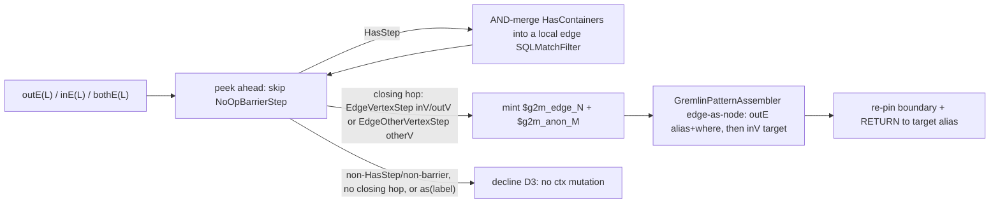

<!-- workflow-sha: d2dfcc2d44fabd3ac76c5fd7620f1e6013675ad9 -->
# Track 3: Edge traversal — `out` / `in` / `both`, folded `outE.inV` etc., plus non-adjacent edge filtering

## Purpose / Big Picture
After this track, multi-hop vertex traversals (`g.V().out("knows")`, `g.V().outE("knows").has(...).inV()`, and the `in` / `both` analogues) translate to MATCH patterns and emit `Vertex` traversers through the boundary step.

<!-- Reserved for Move 2 — ADDED/MODIFIED/REMOVED triad. Empty until Move 2 lands. -->

Extends the recognized set with edge-traversal patterns and non-adjacent edge filtering (`outE(L).has(...).inV()`). The walker switches from for-each to index-driven iteration to support the first multi-step recogniser (D10). Bare chain-hop targets root at the generic `V` class polymorphically like the start node — a bare `out(L)` target is **not** `@class`-narrowed (BC2). `WalkerContext` reads its existing `polymorphic` field and gains new fields: the edge-filter map (`edgeFilters`) and anonymous-alias counters. Track 3 builds the anonymous-alias generator and the reserved-`$` user-label pre-flight scan deferred from Track 2, and re-pins the boundary alias / RETURN projection to the last hop's target. The `ELEMENT` boundary output type already landed in Track 2.

## Progress
- [x] Review + decomposition
- [ ] Step implementation
- [ ] Track-level code review
- [ ] Track completion

- [x] 2026-07-08T12:30Z [ctx=info] Review + decomposition complete
- [x] 2026-07-08T14:02Z [ctx=safe] Step 1 complete (commit eb6b03e18c99a0409e998f0899b97464082011bb)

## Surprises & Discoveries
<!-- Continuous-log. Empty at Phase 1. -->
- 2026-07-08 Phase A review: the design's edge-filter mechanism is wrong and needs
  Phase-4 reconciliation. `design.md` §"Edge filtering in non-adjacent chains"
  (≈1217-1221) says the builder parks the edge alias + filter on
  `SQLMatchPathItem.filter` and "the IR already supports edge-side filters", but
  that slot is the hop's *target-vertex* `SQLMatchFilter` — a single `out(L)` path
  item cannot filter edge properties. The working IR form is the edge-as-node
  two-path-item `outE(L){as: $e, where}.inV()` (executor-supported per
  `MatchEdgeMethod*Test`; builder extension is Track-3 scope). Reconcile the design
  narrative in Phase 4. (Technical T1 / Adversarial A1 / Risk R1.)
- 2026-07-08 Phase A review: `design.md` §"Schema polymorphism" (≈1570-1583)
  instructs `@class` narrowing on each `out(label)`/`in(label)` chain target under
  `polymorphic=false`. That reintroduces the BC2 subclass undercount — native
  `out()` never class-filters its target, and a bare hop target roots at the
  generic `V`. Track 3 narrows only explicit user classes (Track 4 `hasLabel`);
  reconcile the design in Phase 4. (Technical T3 / Adversarial A2 / Risk R2.)
- 2026-07-08 Phase B Step 1: dispatch-class and null-label facts the Step 2–3
  recognisers depend on. Post-`applyStrategies()`, `out`/`in`/`both` and the
  adjacent folded `outE.inV`/`bothE.otherV` collapse to a single `VertexStep`;
  the non-adjacent `outE(L).has(...).inV()` stays unfolded as `VertexStep`
  (`returnsEdge() == true`) + `HasStep` + `EdgeVertexStep`, the `both` analogue
  closing on `EdgeOtherVertexStep`; no `VertexStepPlaceholder` for a literal
  label. A step label can be null (`as((String) null)`), so a label scan must
  null-guard and decline-not-throw. `FoldedEdgeStepDispatchClassTest` pins the
  registry keys and fails loudly if the fold behaviour shifts. See Episodes §Step 1.

## Decision Log
<!-- Continuous-log. -->

<!-- Reserved for Move 1 — per-track inlined Decision Records. -->

## Outcomes & Retrospective
<!-- Continuous-log. -->
- [x] Technical: PASS at iteration 3 (10 findings, 10 accepted). T1 blocker — the headline edge-filter mechanism (`addEdge`/`SQLMatchPathItem.filter`) does not exist; reframed to the edge-as-node `outE(L){as,where}.inV()` builder extension. Iter-3 cleared the residual mermaid-diagram node.
- [x] Risk: PASS at iteration 2 (9 findings, 9 accepted). Drove the edge-as-node reframe (R1), the no-narrowing bare-hop rule (R2), the boundary re-pin (R3), the consumed-count walker contract (R4), and the anon-alias/reserved-`$` scope (R5).
- [x] Adversarial: PASS at iteration 3 (9 findings incl. 2 blockers, all accepted). Blockers A1 (edge-filter mechanism) and A2 (chain-target narrowing = BC2) match the technical/risk blockers. Iter-3 cleared A1's diagram residual and applied A10 (plan-blurb sync) + A11 (`WalkerContext.polymorphic` Javadoc-correction note).

## Context and Orientation
TinkerPop's `IncidentToAdjacentStrategy` folds the adjacent `outE(L).inV()` / `inE(L).outV()` / `bothE(L).otherV()` shapes to `out(L)` / `in(L)` / `both(L)` before our strategy fires, so the recogniser sees the folded step — a `VertexStep`, or a `VertexStepPlaceholder` when `GValue` reduction is deferred; the exact post-`applyStrategies()` class is confirmed empirically at decomposition (see Plan of Work). Insert a `has(...)` between the edge step and its closing vertex hop and the fold does not fire — the traversal arrives as separate steps (`VertexStep(outE,L)`, `HasStep`, `EdgeVertexStep(inV)`). This non-adjacent shape is common: LDBC IC2 filters knows-edges by creation date.

**Edge filtering is translator-side, but not free on the builder.** `MatchPatternBuilder.addEdge`'s `edgeFilter` argument is attached to the hop's *target vertex* (`SQLMatchPathItem.filter` is the target-node `SQLMatchFilter`), so a single `out(L)` path item cannot filter edge properties — it would filter the wrong element. The MATCH IR expresses an edge filter only by node-izing the edge: the two-path-item `outE(L){as: $e, where: <edge WHERE>}.inV()` form. The *executor* already runs this (`SQLMethodCall` supports `outE`/`inE`/`bothE`/`inV`/`outV`/`bothV`; `MatchEdgeMethod*Test` proves edge-side filtering works engine-side), so no executor change is needed — but the *builder* cannot emit the edge-as-node form today, so Track 3 adds that assembler capability (Plan of Work items 2, 4). The earlier "`addEdge` output unchanged / IR already supports edge-side filters" framing was wrong; `design.md` §"Edge filtering in non-adjacent chains" (≈1217-1221) and §"Schema polymorphism" (≈1570-1583) carry the same error and are flagged for Phase-4 reconciliation (see `## Surprises & Discoveries`).

This is the first track with a multi-step claim, so the walker loop moves from for-each to index-driven (D10 — raising `MAX_RECOGNISED_STEPS` and adding a consumed-step count to the recognise contract). The boundary `ELEMENT` output type and `WalkerContext.polymorphic` already landed in Track 2; Track 3 re-pins the boundary alias to the last hop's target and reads `polymorphic` for narrowing decisions.

## Plan of Work
1. **`VertexStepRecogniser`** for the folded `out(L)` / `in(L)` / `both(L)` shapes: the real 7-arg `addEdge(from, $g2m_anon_M, OUT/IN/BOTH, label, null, null, null)` (no edge filter for the folded case) + `addNode($g2m_anon_M, "V", null, false)`, then re-pin the boundary to the new target (item 8). **No `@class` narrowing on the bare hop target.** A bare `out(L)`/`in(L)`/`both(L)` target roots at the generic `V` class polymorphically, exactly like the start node after the BC2 fix: `StartStepRecogniser` emits no class filter (`@class = 'V'` would exclude subclass instances), and native `out()` never class-filters its target, so narrowing a bare hop target would undercount — regardless of `WalkerContext.polymorphic`. `@class` narrowing reappears only for an explicit user-named class (Track 4's folded `hasLabel`), produced via the shared `MatchClassFilters` helper. Also correct the landed `WalkerContext.polymorphic` Javadoc, which currently instructs chain-hop recognisers to `@class`-narrow when the flag is false — the BC2-wrong guidance this item removes.
2. **`EdgeStepRecogniser`** with peek-ahead (D10) for non-adjacent edge filtering. The Track-1 builder cannot express an edge-property filter — `addEdge`'s `edgeFilter` lands on the target vertex's `SQLMatchFilter`, and there is no edge slot to hijack (see `## Context and Orientation`). The IR expresses an edge filter only by node-izing the edge: the two-path-item `outE(L){as: $g2m_edge_N, where: <edge WHERE>}.inV(){as: $g2m_anon_M}` form, which the executor already runs but the builder cannot yet emit. So this recogniser mints `$g2m_edge_N`, peeks successive `HasStep`s and AND-merges their `HasContainer`s through the predicate adapter into an edge `SQLMatchFilter`, skips any interleaved `NoOpBarrierStep`, consumes the closing hop (`EdgeVertexStep` for `inV`/`outV`, `EdgeOtherVertexStep` for `otherV` — both distinct from `VertexStep`) minting `$g2m_anon_M`, emits the edge-as-node pattern via item 4's assembler capability, and advances `ctx.stepIndex` past every consumed step. **No-mutation-on-decline:** it does not mint aliases or touch `ctx` until the closing hop is confirmed. Declines on a non-`HasStep`/non-barrier between edge and closing hop, on no closing hop (edge-returning terminal — out of scope), or on an `as(label)` on the edge step.
3. **`NoOpBarrierRecogniser`** — claims a top-level `NoOpBarrierStep` (injected by `LazyBarrierStrategy`) without mutating context, so it does not break multi-hop recognition. Adversarial review bytecode-confirmed `LazyBarrierStrategy`'s `returnsEdge()` carve-out keeps a barrier out of the `outE…inV` window, so item 2's inline barrier-skip is belt-and-suspenders; a decompose-time test confirms whether this recogniser is reachable at all.
4. **`MatchClassFilters`** shared helper producing the `@class` narrowing AST **for explicit user classes only** (Track 4 `hasLabel`); **`GremlinPatternAssembler`** factoring node assembly and the new **edge-as-node** assembly (two `SQLMatchPathItem`s: an `outE`-method item carrying the edge-alias `SQLMatchFilter`, then the `inV` target item) the recognisers call. Confirm `MatchExecutionPlanner` plans a pattern with an edge-aliased *intermediate* node before relying on it (premise test); if the planner does not handle the edge-node form, edge filtering is descoped to a later track.
5. **Predicate-adapter skeleton** (`GremlinPredicateAdapter`) — the chokepoint Track 4 fills out; Track 3 needs only enough of it to translate the `has(...)` inside an edge-filter chain.
6. **Walker refactor** to index-driven iteration (D10): raise/remove `MAX_RECOGNISED_STEPS` (currently `1`, which declines every ≥2-step traversal before any recogniser runs); convert the `for (Step …)` loop to `while (i < steps.size())`; change the `StepRecogniser.recognize` contract to report a **consumed-step count** (recognisers advance `ctx.stepIndex`; the walker drops its unconditional `++`), and update `StartStepRecogniser` (single-step) to match. Add the **reserved-`$` user-label pre-flight scan**: before recogniser dispatch, scan every step's `getLabels()` and decline (not throw) the whole traversal if any user label starts with `$`, protecting the minted `$g2m_` namespace. Preserve all-or-nothing decline and no-mutation-on-decline across the rewrite.
7. **Anonymous-alias generator** (vertex `$g2m_anon_M` + edge `$g2m_edge_N`), deferred from Track 2 — build it here as new `WalkerContext` state (`edgeFilters` map + anon-alias counters). `WalkerContext.polymorphic` already exists (Track 2); Track 3 only reads it.
8. **Boundary / RETURN re-pin** — a chain hop makes the *target* the result, so each terminator-advancing recogniser **replaces** the single return item (and re-pins `boundaryAlias`) to name its new target alias, leaving exactly one RETURN column keyed on the final hop's alias. `StartStepRecogniser` currently pins `$g2m_v0` and appends one return item; a naive append would emit two columns or return the start vertex.
9. **`EdgeTraversalEquivalenceTest`** — the parameterised translator-on / translator-off fixture, seeded with a Person/Place (Person subclass of `V`) + Knows/Likes/Follows (with edge subclasses and parallel edges) graph; each case carries a `RECOGNIZED` / `DECLINED` marker and asserts (a) result-multiset equality, (b) boundary-step engagement. Cases must include: `polymorphic=false` over the subclassed vertex schema (BC2 pin — no chain-target undercount), `outE(L).has(edgeProp).inV()` edge-filter equivalence, `both()`/self-loop/parallel-edge multiplicity, and an interleaved `NoOpBarrierStep`.

**Decomposition-time verification (D9 dispatch class).** `IncidentToAdjacentStrategy` folds `outE(L).inV()` to a `VertexStepPlaceholder`, and `out(L)`/`outE(L)` may share the concrete `VertexStep` class at provider-strategy time. Before registering recognisers, empirically print the post-`applyStrategies()` step classes for `g.V().out(L)`, `g.V().outE(L).has(...).inV()`, and `g.V().bothE(L).otherV()` against a real graph, and register under the observed classes — a single recogniser branching on `VertexStep.returnsEdge()` if `out` and `outE` collide on one class; defensively also handle `VertexStepPlaceholder`, or add `ProviderGValueReductionStrategy` to `GremlinToMatchStrategy.applyPrior()`. Pin with a regression test that fails if the registry key stops matching the real folded class.

## Concrete Steps
1. Walker multi-step infrastructure: convert `GremlinStepWalker` to index-driven iteration, raise `MAX_RECOGNISED_STEPS`, change `StepRecogniser.recognize` to a consumed-step-count contract (recognisers advance `ctx.stepIndex`; walker drops its unconditional `++`), update `StartStepRecogniser` to the new contract, add the reserved-`$` user-label pre-flight decline scan, add the anonymous-alias generator + new `WalkerContext` fields (`edgeFilters` map, alias counters), and empirically record the post-`applyStrategies()` dispatch step-classes for the target shapes; regression: `g.V()`/`g.V(ids)` still translate; preserve all-or-nothing + no-mutation-on-decline. — risk: high (architecture: load-bearing walker iteration model + `StepRecogniser` contract change)  [x]  commit: eb6b03e18c
2. `VertexStepRecogniser` for the folded `out(L)`/`in(L)`/`both(L)` shapes: real 7-arg `addEdge(from, target, dir, label, null, null, null)` + `addNode(target, "V", null, false)` with NO `@class` narrowing on the bare hop target (BC2), the boundary/RETURN re-pin (replace the single return item + re-pin `boundaryAlias` to the target alias), and the `MatchClassFilters` helper (explicit user classes only); stand up `EdgeTraversalEquivalenceTest` with folded cases + a subclassed-schema `polymorphic=false` BC2 pin + `both`/self-loop/parallel-edge multiplicity. — risk: medium — size: ~6 files; rest of track is high (Steps 1, 3), no mergeable low/medium work  [ ]
3. `EdgeStepRecogniser` for non-adjacent edge filtering: add the edge-as-node builder/assembler capability (`GremlinPatternAssembler` emitting the two-path-item `outE(L){as $g2m_edge_N, where <edge filter>}.inV()` form; extend `MatchPatternBuilder` if the assembler needs it), the `GremlinPredicateAdapter` skeleton, `NoOpBarrierRecogniser`, and the peek-ahead recogniser (skip `NoOpBarrierStep`, AND-merge `HasStep`s into a local edge `SQLMatchFilter`, close on `EdgeVertexStep`/`EdgeOtherVertexStep`, decline with no ctx mutation), confirm `MatchExecutionPlanner` plans an edge-aliased intermediate node (premise test; descope edge filtering if unsupported), and extend `EdgeTraversalEquivalenceTest` with `outE(L).has(edgeProp).inV()` equivalence + interleaved-barrier cases. — risk: high (architecture: new `GremlinPredicateAdapter` seam + edge-as-node builder extension; headline correctness-critical feature)  [ ]

## Episodes
<!-- Continuous-log. Empty at Phase 1. -->

### Step 1 — commit eb6b03e18c99a0409e998f0899b97464082011bb, 2026-07-08T14:02Z [ctx=safe]
**What was done:** Converted `GremlinStepWalker` from a for-each loop to index-driven iteration over `WalkerContext.stepIndex`, so one recogniser can claim several steps in a single call: each iteration dispatches `steps.get(cursor)`, the claiming recogniser advances the cursor past every step it consumed, and the walker no longer does an unconditional `++`. A cursor-advance guard (assert plus a defensive decline) turns a recogniser that returns `true` without advancing — an otherwise silent infinite loop — into a loud `AssertionError` under `-ea`. Removed the `MAX_RECOGNISED_STEPS` upper-bound gate (kept the empty-traversal gate). Added the infrastructure the edge recognisers build on: the reserved-prefix pre-flight scan (declines any traversal carrying a `$`-prefixed user label), the anonymous-alias generator on `WalkerContext` (`$g2m_anon_`/`$g2m_edge_` counters and the `edgeFilters` map), and the cursor-advancing `StartStepRecogniser`. A follow-up `Review fix:` commit (8a43f9bd) null-guarded the reserved-prefix scan: a null step label is reachable through `as((String) null)` (`AbstractStep.addLabel` stores it unguarded) and previously made `startsWith` throw an NPE that the strategy's exception net masked to a native decline; the scan now skips a null label so it declines rather than throws, with a regression test. All exercised core tests pass and changed lines clear the coverage thresholds.
**What was discovered:** The post-`applyStrategies()` dispatch classes (translator disabled, the native folded shape the recognisers will see): `out(L)`/`in(L)`/`both(L)` and the adjacent folded `outE.inV`/`bothE.otherV` all collapse to a single `VertexStep`; the non-adjacent `outE(L).has(...).inV()` arrives unfolded as `VertexStep` (the edge step, `returnsEdge() == true`) plus `HasStep` plus `EdgeVertexStep`, and the `both` analogue closes on `EdgeOtherVertexStep`. No `VertexStepPlaceholder` appears for a literal string label — a parameterised label may still produce one. So a single `VertexStep` recogniser branching on `returnsEdge()` covers bare hops, folded adjacent chains, and the non-adjacent edge step, as the plan anticipated. A step label can be null, so the Step 2–3 recognisers that read `getLabels()` (`as()` projection, hop targets) must null-guard and prefer decline-not-throw. The registry keys for Steps 2–3 are ready: `VertexStep.class` (branch on `returnsEdge()`), `HasStep.class`, `EdgeVertexStep.class`, `EdgeOtherVertexStep.class`; `WalkerContext.edgeFilters` and `nextAnonVertexAlias()`/`nextEdgeAlias()` are wired for the edge recogniser. `FoldedEdgeStepDispatchClassTest` fails loudly if TinkerPop's fold behaviour changes any of those keys.
**What changed from the plan:** The concrete step said "raise `MAX_RECOGNISED_STEPS`"; I removed the upper-bound step-count decline instead, which Plan of Work item 6 sanctions ("raise/remove"). A finite step cap becomes wrong once multi-step recognisers land, because a long but fully recognised `out()`-chain would decline at the cap. The empty-traversal gate stays, and all-or-nothing decline plus the new cursor-advance guard preserve the invariants the cap defended. The `StepRecogniser` contract kept its boolean return: the consumed-step count is expressed by the recogniser advancing `ctx.stepIndex`, not by a new return type.
**Key files:** `GremlinStepWalker.java`, `StartStepRecogniser.java`, `StepRecogniser.java`, `WalkerContext.java`; tests `GremlinStepWalkerTest.java`, `GremlinToMatchSmokeTest.java`, and new `FoldedEdgeStepDispatchClassTest.java`.
**Critical context:** The consumed-step-count contract lives in `ctx.stepIndex`, not a return type. Every recogniser Steps 2–3 add must advance `ctx.stepIndex` by the number of steps it consumed (≥ 1) on a `true` return and must not touch it on decline, or it trips the walker's cursor-advance guard. The reserved-`$` scan, the anon-alias generator, and the `edgeFilters` map are in place and unit-tested but stay unpopulated until the edge recognisers use them.

## Validation and Acceptance
- `out(L)` / `in(L)` / `both(L)` and the folded `outE(L).inV()` analogues translate and return the same multiset as native; the boundary emits `Vertex` from the *last hop's target* alias.
- `outE(L).has(filter).inV()` (and `in` / `both` analogues) translate via the edge-as-node form (edge filter on the edge's own `SQLMatchFilter`, not the target vertex); LDBC-IC2-style edge-date filtering returns the same multiset as native.
- A `has(...)` after the closing `inV()` filters the target vertex (claimed by the regular node-side path, not the edge recogniser).
- `polymorphic=false` over a subclassed vertex schema (e.g. Person extends `V`) returns the same multiset as native for a bare `out(L)` chain — the chain target is **not** `@class`-narrowed (BC2: no subclass undercount).
- `both()`, self-loops, and parallel edges preserve native multiplicity; edge-subclass labels behave as native `out()`.
- Decline cases leave `WalkerContext` unmutated (no-mutation-on-decline): non-`HasStep`/non-barrier mid-chain, edge-returning terminal, `as(label)` on the edge, any user label starting with `$`.

<!-- Phase A placeholder for per-step EARS/Gherkin lines. -->

<!-- Reserved for Move 3 — acceptance lines. -->

## Idempotence and Recovery
<!-- Phase A placeholder. -->

## Artifacts and Notes
<!-- Continuous-log (rare). Often empty. -->

## Interfaces and Dependencies
**In scope (new):** `VertexStepRecogniser`, `EdgeStepRecogniser`, `NoOpBarrierRecogniser`, `MatchClassFilters`, `GremlinPatternAssembler` (incl. the edge-as-node assembly), `GremlinPredicateAdapter` skeleton, the anonymous-alias generator + reserved-`$` pre-flight (in the walker), `EdgeTraversalEquivalenceTest` + recogniser unit tests.
**In scope (modified):** `GremlinStepWalker` (for-each → index-driven loop, raise `MAX_RECOGNISED_STEPS`, reserved-`$` scan), `WalkerContext` (new `edgeFilters` map + anon-alias counters; `polymorphic` already exists — read only), `StepRecogniser` (consumed-count contract), `StartStepRecogniser` (new contract + boundary/RETURN re-pin). `YTDBMatchPlanStep` `ELEMENT` projection already landed in Track 2 — no change unless the re-pin needs it.
**Out of scope:** node-side `has` / predicates beyond the edge-filter minimum (Track 4 owns the full predicate adapter); projections, order, aggregates, union (Tracks 5–6); multi-label edges, user-facing edge aliases, edge-returning terminals (Phase 2 — design §"Out of scope").
**Inter-track dependencies:** depends on Track 2 (walker, registry, boundary step) and Track 1 (`MatchPatternBuilder` — the folded-hop `addEdge`; the edge-as-node assembly is a Track-3 builder/assembler extension). Supplies the predicate-adapter skeleton and `GremlinPatternAssembler` to Track 4, and the `EdgeTraversalEquivalenceTest` fixture that Tracks 4–6 extend.
**Signatures:** `MatchPatternBuilder.addEdge(fromAlias, toAlias, dir, edgeLabel, edgeFilter, whileCondition, maxDepth)` — 7-arg, `edgeFilter` attaches to the *target vertex*, no `edgeAlias`; the edge-as-node form is a new assembler capability (two `SQLMatchPathItem`s); `SQLMatchPathItem.filter` (target-node `SQLMatchFilter`); `StepRecogniser.recognize(Step, WalkerContext)` → consumed-count (new); `IncidentToAdjacentStrategy` fold contract.

## Invariants & Constraints
<!-- Combined per-track invariants + constraints (conventions-execution.md §2.1 §14).
Added by workflow migration (#1145). Strategic invariants/constraints for this track remain
in implementation-plan.md § High-level plan (Architecture Notes) and this track's ## Decision
Log — the conservative migration retained the plan Architecture Notes rather than folding them here. -->

## Base commit
<!-- Phase B records the HEAD SHA here at session start; Phase C reads it to compute the
cumulative track diff (conventions-execution.md §2.1 §15). Added by workflow migration (#1145). -->
239792aef800de12a0e2cd6dde6bd48d3431b28f
