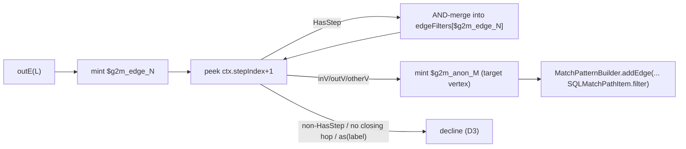

<!-- workflow-sha: d2dfcc2d44fabd3ac76c5fd7620f1e6013675ad9 -->
# Track 3: Edge traversal — `out` / `in` / `both`, folded `outE.inV` etc., plus non-adjacent edge filtering

## Purpose / Big Picture
After this track, multi-hop vertex traversals (`g.V().out("knows")`, `g.V().outE("knows").has(...).inV()`, and the `in` / `both` analogues) translate to MATCH patterns and emit `Vertex` traversers through the boundary step.

<!-- Reserved for Move 2 — ADDED/MODIFIED/REMOVED triad. Empty until Move 2 lands. -->

Extends the recognized set with edge-traversal patterns including chain-target polymorphism, and non-adjacent edge filtering (`outE(L).has(...).inV()`). The walker switches from for-each to index-driven iteration to support the first multi-step recogniser (D10); `WalkerContext` gains the `polymorphic` flag's chain-target use, the edge-filter map, and an anonymous edge-alias generator. Track 3 is the first track that wires a boundary step output type at all (`ELEMENT`).

## Progress
- [ ] Review + decomposition
- [ ] Step implementation
- [ ] Track-level code review
- [ ] Track completion

## Surprises & Discoveries
<!-- Continuous-log. Empty at Phase 1. -->

## Decision Log
<!-- Continuous-log. -->

<!-- Reserved for Move 1 — per-track inlined Decision Records. -->

## Outcomes & Retrospective
<!-- Continuous-log. -->

## Context and Orientation
TinkerPop's `IncidentToAdjacentStrategy` folds the adjacent `outE(L).inV()` / `inE(L).outV()` / `bothE(L).otherV()` shapes to `out(L)` / `in(L)` / `both(L)` before our strategy fires, so the recogniser sees the folded `VertexStep`. Insert a `has(...)` between the edge step and its closing vertex hop and the fold does not fire — the traversal arrives as separate steps (`VertexStep(outE,L)`, `HasStep`, `EdgeVertexStep(inV)`). This non-adjacent shape is common: LDBC IC2 filters knows-edges by creation date.

The MATCH IR already supports edge-side filters via `SQLMatchPathItem.filter`, so edge filtering needs no executor or planner change — only translator-side peek-ahead. `MatchExecutionPlanner` consumes `addEdge(from, to, dir, label, edgeAlias, edgeFilter, …)` output unchanged.

This is the first track with a multi-step claim, so the walker loop moves from for-each to index-driven (`ctx.stepIndex += N`, D10), and the first track that wires the boundary `ELEMENT` output type (vertex hops emit TinkerPop `Vertex`).

## Plan of Work
1. **`VertexStepRecogniser`** for the folded `out(L)` / `in(L)` / `both(L)` shapes: `addEdge(from, $g2m_anon_M, OUT/IN/BOTH, label)` + `addNode($g2m_anon_M, "V", null, false)`. Reads `WalkerContext.polymorphic` and applies the same `@class = '<className>'` / `@class IN [...]` narrowing as the start recogniser via the shared `MatchClassFilters` helper, so chain targets inherit non-polymorphic narrowing (design §"Schema polymorphism").
2. **`EdgeStepRecogniser`** with peek-ahead (D10): on `outE(L)` / `inE(L)` / `bothE(L)` it mints `$g2m_edge_N`, peeks successive `HasStep`s and AND-merges their `HasContainer`s through the predicate adapter into `ctx.edgeFilters[$g2m_edge_N]`, consumes the closing `EdgeVertexStep` / `otherV`-form `VertexStep` (minting `$g2m_anon_M`), calls `addEdge(... edgeAlias, accumulatedEdgeFilter)`, and advances `ctx.stepIndex` past every consumed step. Declines on a non-`HasStep` between edge and closing hop, on no closing hop (edge-returning terminal — out of scope), or on an `as(label)` on the edge step.
3. **`NoOpBarrierRecogniser`** — claims `NoOpBarrierStep` (injected by `LazyBarrierStrategy`) without mutating context, so it does not break multi-hop recognition.
4. **`MatchClassFilters`** shared helper producing the `@class` narrowing AST; **`GremlinPatternAssembler`** factoring the node+edge assembly the recognisers call.
5. **Predicate-adapter skeleton** (`GremlinPredicateAdapter`) — the chokepoint Track 4 fills out; Track 3 needs only enough of it to translate the `has(...)` inside an edge-filter chain.
6. **Walker refactor** to index-driven iteration + the new `WalkerContext` fields (`polymorphic`, `edgeFilters`, `anonEdgeAliasGenerator`).
7. **`EdgeTraversalEquivalenceTest`** — the parameterised translator-on / translator-off fixture, seeded with a small Person/Place + Knows/Likes/Follows graph; each case carries a `RECOGNIZED` / `DECLINED` marker and asserts (a) result-multiset equality, (b) boundary-step engagement.

## Concrete Steps
<!-- Phase A placeholder. -->

## Episodes
<!-- Continuous-log. Empty at Phase 1. -->

## Validation and Acceptance
- `out(L)` / `in(L)` / `both(L)` and the folded `outE(L).inV()` analogues translate and return the same multiset as native; the boundary emits `Vertex`.
- `outE(L).has(filter).inV()` (and `in` / `both` analogues) translate with the edge filter on `SQLMatchPathItem.filter`; LDBC-IC2-style edge-date filtering returns the same multiset as native.
- A `has(...)` after the closing `inV()` filters the target vertex (claimed by the regular node-side path, not the edge recogniser).
- `polymorphic=false` narrows chain-target nodes, not just the start node (no result-set discrepancy versus native).
- Decline cases leave `WalkerContext` unmutated (no-mutation-on-decline): non-`HasStep` mid-chain, edge-returning terminal, `as(label)` on the edge.

<!-- Phase A placeholder for per-step EARS/Gherkin lines. -->

<!-- Reserved for Move 3 — acceptance lines. -->

## Idempotence and Recovery
<!-- Phase A placeholder. -->

## Artifacts and Notes
<!-- Continuous-log (rare). Often empty. -->

## Interfaces and Dependencies
**In scope (new):** `VertexStepRecogniser`, `EdgeStepRecogniser`, `NoOpBarrierRecogniser`, `MatchClassFilters`, `GremlinPatternAssembler`, `GremlinPredicateAdapter` skeleton, `EdgeTraversalEquivalenceTest` + recogniser unit tests.
**In scope (modified):** `GremlinStepWalker` (for-each → index-driven loop), `WalkerContext` (`polymorphic`, `edgeFilters`, `anonEdgeAliasGenerator`), `YTDBMatchPlanStep` (wire `ELEMENT` projection of `Result` → `Vertex`).
**Out of scope:** node-side `has` / predicates beyond the edge-filter minimum (Track 4 owns the full predicate adapter); projections, order, aggregates, union (Tracks 5–6); multi-label edges, user-facing edge aliases, edge-returning terminals (Phase 2 — design §"Out of scope").
**Inter-track dependencies:** depends on Track 2 (walker, registry, boundary, anon-alias generator) and Track 1 (`MatchPatternBuilder.addEdge`). Supplies the predicate-adapter skeleton and `GremlinPatternAssembler` to Track 4, and the `EdgeTraversalEquivalenceTest` fixture that Tracks 4–6 extend.
**Signatures:** `MatchPatternBuilder.addEdge(from, to, dir, label, edgeAlias, edgeFilter, while_, maxDepth)`; `SQLMatchPathItem.filter`; `IncidentToAdjacentStrategy` fold contract.

## Invariants & Constraints
<!-- Combined per-track invariants + constraints (conventions-execution.md §2.1 §14).
Added by workflow migration (#1145). Strategic invariants/constraints for this track remain
in implementation-plan.md § High-level plan (Architecture Notes) and this track's ## Decision
Log — the conservative migration retained the plan Architecture Notes rather than folding them here. -->

## Base commit
<!-- Phase B records the HEAD SHA here at session start; Phase C reads it to compute the
cumulative track diff (conventions-execution.md §2.1 §15). Added by workflow migration (#1145). -->
