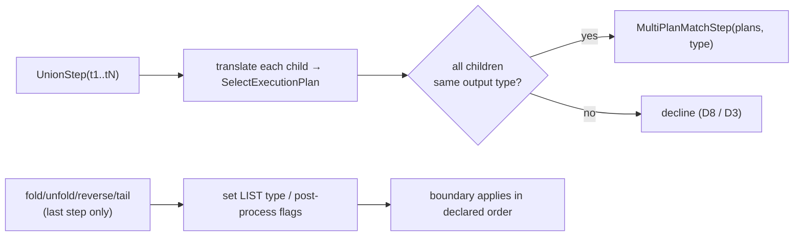

<!-- workflow-sha: d2dfcc2d44fabd3ac76c5fd7620f1e6013675ad9 -->
# Track 6: Advanced patterns + hardening — union, list-shaping terminators, Cucumber green + perf baseline

## Purpose / Big Picture
After this track, `union(...)` and the four list-shaping terminators (`fold` / `unfold` / `reverse` / `tail`) translate, the full TinkerPop Cucumber suite is green with the strategy registered, and a Gremlin-on-vs-off JMH baseline measures the translator's value.

<!-- Reserved for Move 2 — ADDED/MODIFIED/REMOVED triad. Empty until Move 2 lands. -->

Completes the recognized set and validates the whole feature. Handles `UnionStep` with N global children via `MultiPlanMatchStep` when all children share a boundary output type, declining on divergence (D8). Adds the four list-shaping terminators as last-step recognisers, introducing `BoundaryOutputType.LIST` plus the `unfoldOutput` / `reverseOutput` / `tailLimit` post-processor flags (mid-traversal use declines under D3). Final hardening: the full Cucumber suite green, a per-step scenario catalogue, and a JMH suite mirroring the LDBC SQL benchmarks.

## Progress
- [ ] Review + decomposition
- [ ] Step implementation
- [ ] Track-level code review
- [ ] Track completion

## Surprises & Discoveries
<!-- Continuous-log. Empty at Phase 1. -->

## Decision Log
<!-- Continuous-log. -->

<!-- Reserved for Move 1 — per-track inlined Decision Records. -->

## Outcomes & Retrospective
<!-- Continuous-log. -->

## Context and Orientation
MATCH's `splitDisjointPatterns` joins disconnected patterns by cartesian product, which is **not** `union`'s concatenation semantics. So `union(t1, t2, …)` is translated by building one `SelectExecutionPlan` per child and concatenating their streams in `MultiPlanMatchStep` — a `YTDBMatchPlanStep` subclass holding a `List<SelectExecutionPlan>` and iterating them in order (plan N+1 starts only after plan N drains; one live `ExecutionStream` at a time). All children must agree on output type, else the union is unrecognized and the traversal declines (D8). Changing union to cartesian would silently alter results and break the green-suite invariant.

The four list-shaping terminators are accepted only as the **last** step (the boundary is the only step in a translated traversal under D3): `fold()` → `BoundaryOutputType.LIST` (drain stream → one `List<E>` traverser; empty input → empty list); `unfold()` → `unfoldOutput` flag (per-emission flat-map mirroring `UnfoldStep.flatMap`); `reverse()` → `reverseOutput` flag (per-traverser value transform mirroring `ReverseStep.map`, NOT stream-order reverse); `tail(n)` → `tailLimit` (bounded `ArrayDeque` ring buffer keeping the last `n` in arrival order; `n=0` emits nothing, `n<0` declines). Composition rules and the declared-order application are in design §"List-shaping terminators".

This is also the hardening track: the ~1900-scenario TinkerPop Cucumber suite (`YTDBGraphFeatureTest` in `core`, `EmbeddedGraphFeatureTest` in `embedded`) must be green with the strategy registered — the regression bar is that every previously-passing scenario still passes. A Gremlin-on-vs-off JMH suite mirroring the existing LDBC SQL benchmarks is the load-bearing measurement of the translator's value with the plan cache enabled.

## Plan of Work
1. **`UnionStepRecogniser`** (D8): sub-walk each child against the registry, build one `SelectExecutionPlan` per child, verify all children agree on output type, and emit `MultiPlanMatchStep`; decline if any child fails to translate or disagrees on type.
2. **`MultiPlanMatchStep`** extending `YTDBMatchPlanStep`: `List<SelectExecutionPlan>` + a plan index; first `processNextStart` opens `plans[0].start()`, advances to the next plan on exhaustion; one live stream at a time; exception in `plans[N]` closes the current stream and re-throws without starting `plans[N+1..]`; one shared `BoundaryOutputType`.
3. **List-shaping terminators:** `FoldStep` recogniser → `BoundaryOutputType.LIST`; `UnfoldStep` / `ReverseStep` / `TailGlobalStep` recognisers → `unfoldOutput` / `reverseOutput` / `tailLimit` flags. Boundary-step `processNextStart` gains the `LIST` materialization, the `unfold` flat-map helper, the `reverse` value-transform helper, and the `tail` ring buffer, applied in declared order. Each terminator declines mid-traversal (not the last step). Composition: `reverse().unfold()` / `unfold().reverse()` accepted (both flags); `fold().unfold()` and `fold().tail(3)` declined (two terminators / two-phase boundary not implemented in Phase 1).
4. **`BoundaryOutputType.LIST`** + the three post-process flags on the boundary step; flags compose with `dropNullRows` / `dropOnAbsent` from Track 5.
5. **Hardening:** run the full Cucumber suite with the strategy registered and fix any cross-track regression; add a per-step scenario catalogue; add the mirrored Gremlin JMH benchmark classes + on/off harness and capture a baseline.

## Concrete Steps
<!-- Phase A placeholder. -->

## Episodes
<!-- Continuous-log. Empty at Phase 1. -->

## Validation and Acceptance
- `union(t1, t2, …)` with children agreeing on output type translates to the concatenated multiset (not cartesian); a child that declines or disagrees on type declines the whole union (D8).
- `MultiPlanMatchStep` iterates plans in order with one live stream; an exception in plan N does not start plan N+1.
- `fold()` materializes the whole stream into one list traverser (empty input → empty list); `unfold()` flat-maps per emission; `reverse()` transforms the per-traverser value (string/collection) without reordering the stream; `tail(n)` keeps the last `n` in arrival order (`n=0` → nothing, `n<0` → decline). All match native.
- `reverse().unfold()` / `unfold().reverse()` translate; `fold().unfold()`, `fold().tail(3)`, and any mid-traversal list-shaper decline.
- The full TinkerPop Cucumber suite is green with the strategy registered (no previously-passing scenario regresses).
- The Gremlin-on-vs-off JMH suite runs and produces a baseline comparison with the plan cache enabled.

<!-- Phase A placeholder for per-step EARS/Gherkin lines. -->

<!-- Reserved for Move 3 — acceptance lines. -->

## Idempotence and Recovery
<!-- Phase A placeholder. -->

## Artifacts and Notes
<!-- Continuous-log (rare). Often empty. -->

## Interfaces and Dependencies
**In scope (new):** `UnionStepRecogniser`; `MultiPlanMatchStep`; `FoldStep` / `UnfoldStep` / `ReverseStep` / `TailGlobalStep` recognisers; `BoundaryOutputType.LIST` + `unfoldOutput` / `reverseOutput` / `tailLimit` flags; the mirrored Gremlin JMH benchmark classes + on/off harness; type-compatibility + terminator-composition tests; the per-step scenario catalogue.
**In scope (modified):** `YTDBMatchPlanStep` (`LIST` materialization, post-process helpers + flags, declared-order application); `WalkerContext` (post-process flags); `BoundaryOutputType` enum (`LIST`); Cucumber fixes if any scenario regresses.
**Out of scope:** edge-bearing OR, `optional`, variable-depth `repeat`, and the rest of the Phase 2 long tail (design §"Out of scope"); the approximate-count mode (Phase 2).
**Inter-track dependencies:** depends on Track 5 (all five upstream output types and the projection logic the terminators post-process). This is the last Phase 1 track; it validates every prior track via the full Cucumber re-run and the JMH baseline.
**Signatures:** `SelectExecutionPlan.start()` (fresh `ExecutionStream` per call); `UnfoldStep.flatMap` / `ReverseStep.map` / `TailGlobalStep` (TP reference semantics); `YTDBGraphFeatureTest` / `EmbeddedGraphFeatureTest` (Cucumber runners).

## Invariants & Constraints
<!-- Combined per-track invariants + constraints (conventions-execution.md §2.1 §14).
Added by workflow migration (#1145). Strategic invariants/constraints for this track remain
in implementation-plan.md § High-level plan (Architecture Notes) and this track's ## Decision
Log — the conservative migration retained the plan Architecture Notes rather than folding them here. -->

## Base commit
<!-- Phase B records the HEAD SHA here at session start; Phase C reads it to compute the
cumulative track diff (conventions-execution.md §2.1 §15). Added by workflow migration (#1145). -->
