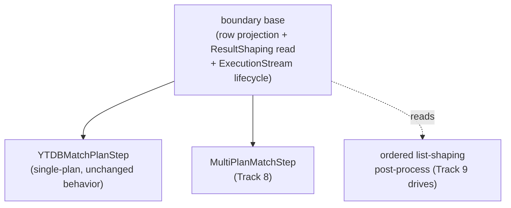

<!-- workflow-sha: d2dfcc2d44fabd3ac76c5fd7620f1e6013675ad9 -->
# Track 7: Boundary base extraction + ordered list-shaping infrastructure

## Purpose / Big Picture
After this track a shared **boundary base** carries the row-projection + `ResultShaping` machinery, so both the single-plan `YTDBMatchPlanStep` and the upcoming multi-plan `MultiPlanMatchStep` (Track 8) reuse it, and an **ordered list-shaping post-process** (fold / unfold / reverse / tail applied in declared order) is in place for Track 9's terminators. The track is behavior-neutral: every traversal the translator recognises today produces the exact same result multiset and output type afterward.

<!-- Reserved for Move 2 — ADDED/MODIFIED/REMOVED triad. Empty until Move 2 lands. -->

This is the foundation slice of the split final track (the original Track 7 was split at its Phase A review on 2026-07-27 — see plan D8 and the pre-split reviews under `reviews/pre-split/`). It fixes the structural premise those reviews falsified — `MultiPlanMatchStep extends YTDBMatchPlanStep` cannot compile — before Track 8 builds union on top.

## Progress
- [ ] Review + decomposition
- [ ] Step implementation
- [ ] Track-level code review
- [ ] Track completion

## Surprises & Discoveries
<!-- Continuous-log. Empty at Phase 1. -->

## Decision Log
<!-- Continuous-log. -->
The canonical decision is plan D8 (revised after Track 6): the `extends YTDBMatchPlanStep` premise is dropped for a shared boundary base. Two realization choices are left to this track's decomposition:
- **Base shape** — abstract superclass vs composed row-projector. Driven by what Track 8's `MultiPlanMatchStep` must reuse (projection, `ResultShaping` read, and the `ExecutionStream` lifecycle). Prefer the smallest surface that lets both boundary steps share projection + shaping without exposing mutable lifecycle state.
- **Ordered post-process carrier** — an ordered `List` of list-shaping ops applied in declared order, either as a new field on `ResultShaping` or an adjacent immutable type. Order-less booleans cannot encode `reverse().unfold()` vs `unfold().reverse()`, which are both accepted and observably differ (pre-split adversarial A2).

<!-- Reserved for Move 1 — per-track inlined Decision Records. -->

## Outcomes & Retrospective
<!-- Continuous-log. -->

## Context and Orientation
`YTDBMatchPlanStep` is today `public final class YTDBMatchPlanStep<S, E extends Element> extends AbstractStep<S, E> implements AutoCloseable` (`YTDBMatchPlanStep.java:88`), with a private lifecycle (the `plan` field, lazily-`start()`ed `ExecutionStream`, a private `State` enum) and a private projection surface (the compile-exhaustive `projectOrSkip` switch that reads the single `ResultShaping` field Track 6's tail introduced). Because the class is `final` with private machinery, a `MultiPlanMatchStep` cannot extend it, and de-finalizing would not help — a subclass inherits none of the private machinery and Java constructors are not inherited. So the reusable part (row projection + `ResultShaping` read + the `ExecutionStream` open/drain/close lifecycle) is extracted into a shared base that both the single-plan step and Track 8's multi-plan step build on.

Separately, Track 9's list-shaping terminators need declared-order application. `fold` / `unfold` / `reverse` / `tail` compose (`reverse().unfold()` and `unfold().reverse()` are both accepted) and produce different results depending on declared order, so three order-less `ResultShaping` booleans cannot represent them. This track adds an ordered post-process carrier — a `List` of list-shaping ops applied in the order they were declared — wired through the boundary base's projection, empty for every traversal that exists today.

**Reference-accuracy note.** The class-shape facts above (the `final` modifier, the private lifecycle/projection members, the single `ResultShaping` field) are direct source reads, cross-confirmed by all three pre-split Phase A reviews and re-read at escalation time. PSI was unavailable in those review sessions (cold kotlinc index tripped the MCP timeout), so the *enumeration of construction sites* to rewire (`GremlinToMatchTranslator`, `GremlinStepWalker`, `GremlinToMatchStrategy`) rests on grep/read and must be re-verified via PSI find-usages at this track's decomposition (`## Concrete Steps` pre-write rule).

## Plan of Work
1. **Extract the shared boundary base** from `YTDBMatchPlanStep`: move the row projection, the `ResultShaping` read, and the `ExecutionStream` open/drain/close lifecycle into an abstract superclass (or a composed row-projector), leaving `YTDBMatchPlanStep` as the single-plan concrete form with byte-for-byte identical projection output. Pick abstract-base vs composition at decomposition, sized by what Track 8's `MultiPlanMatchStep` must reuse.
2. **Rewire the single-plan construction sites** — `GremlinToMatchTranslator`, `GremlinStepWalker.buildResult`, `GremlinToMatchStrategy` — onto the extracted base with no behavior change. PSI-verify each site during decomposition before it lands in `## Concrete Steps`.
3. **Introduce the ordered list-shaping post-process carrier** — a `List` of list-shaping ops applied in declared order — alongside `ResultShaping`, read by the boundary base's projection. No terminator recognisers here (Track 9 registers ops); this track lands only the carrier and its declared-order application, empty for every current traversal.
4. **Prove behavior-neutrality** with equivalence tests over the element / MAP / SINGLE_VALUE / SCALAR paths, keeping the existing projection / aggregate / equivalence suites green.

## Concrete Steps
<!-- Phase A placeholder. -->

## Episodes
<!-- Continuous-log. Empty at Phase 1. -->

## Validation and Acceptance
- Every traversal the translator recognises today yields the identical result multiset and boundary output type after the refactor — the existing projection / aggregate / equivalence suites stay green with no assertion changes.
- The shared boundary base exposes the row-projection + `ResultShaping` machinery for reuse by a second boundary step; `YTDBMatchPlanStep` is the single-plan concrete form over it.
- The ordered list-shaping post-process carrier applies its ops in declared order (unit-tested that `reverse`-then-`unfold` and `unfold`-then-`reverse` orderings resolve to distinct application sequences) and is a no-op when the op list is empty.

<!-- Phase A placeholder for per-step EARS/Gherkin lines. -->

<!-- Reserved for Move 3 — acceptance lines. -->

## Idempotence and Recovery
<!-- Phase A placeholder. -->

## Artifacts and Notes
<!-- Continuous-log (rare). Often empty. -->

## Interfaces and Dependencies
**In scope (new):** the shared boundary base (abstract superclass or composed row-projector extracted from `YTDBMatchPlanStep`); the ordered list-shaping post-process carrier; base-extraction equivalence tests.
**In scope (modified):** `YTDBMatchPlanStep` (becomes the single-plan concrete form over the base); `GremlinToMatchTranslator`, `GremlinStepWalker`, `GremlinToMatchStrategy` (construction rewired onto the base); `ResultShaping` or an adjacent immutable type (carries / composes with the ordered post-process).
**Out of scope:** `union` and `MultiPlanMatchStep` (Track 8); the four terminator recognisers and `BoundaryOutputType.LIST` (Track 9); any user-visible behavior change; Cucumber / JMH hardening (Track 9).
**Inter-track dependencies:** depends on Track 6 (the `ResultShaping` record and boundary step this refactor reshapes). Supplies the boundary base that Track 8's `MultiPlanMatchStep` extends and the ordered post-process carrier that Track 9's terminators register into.
**Signatures:** `YTDBMatchPlanStep` (`public final class … extends AbstractStep implements AutoCloseable`, single `ResultShaping` field, private `projectOrSkip`); `ResultShaping` (7-flag immutable record with `withX` builders + `NONE`); `AbstractStep` (TinkerPop base).

## Invariants & Constraints
<!-- Combined per-track invariants + constraints (conventions-execution.md §2.1 §14).
Added by workflow migration (#1145). Strategic invariants/constraints for this track remain
in implementation-plan.md § High-level plan (Architecture Notes) and this track's ## Decision
Log — the conservative migration retained the plan Architecture Notes rather than folding them here. -->

## Base commit
<!-- Phase B records the HEAD SHA here at session start; Phase C reads it to compute the
cumulative track diff (conventions-execution.md §2.1 §15). Added by workflow migration (#1145). -->
