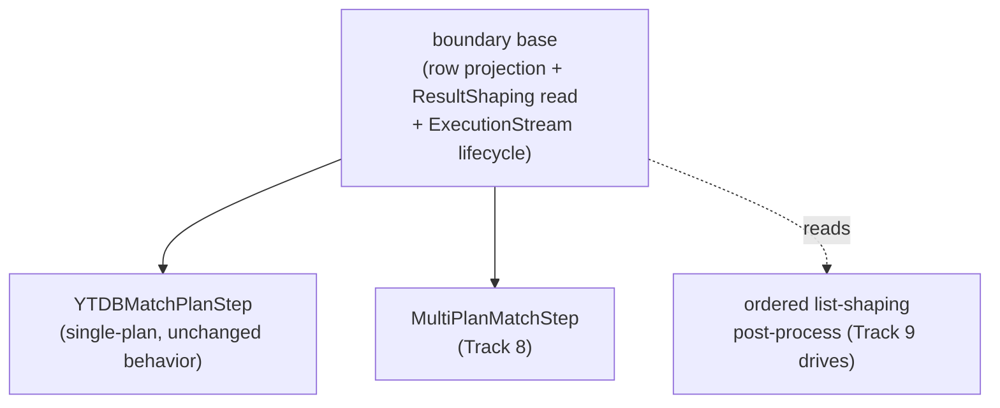

<!-- workflow-sha: d2dfcc2d44fabd3ac76c5fd7620f1e6013675ad9 -->
# Track 7: Boundary base extraction + ordered list-shaping infrastructure

## Purpose / Big Picture
After this track a shared **boundary base** carries the row-projection + `ResultShaping` machinery, so both the single-plan `YTDBMatchPlanStep` and the upcoming multi-plan `MultiPlanMatchStep` (Track 8) reuse it, and an **ordered list-shaping post-process** (fold / unfold / reverse / tail applied in declared order) is in place for Track 9's terminators. The track is behavior-neutral: every traversal the translator recognises today produces the exact same result multiset and output type afterward.

<!-- Reserved for Move 2 — ADDED/MODIFIED/REMOVED triad. Empty until Move 2 lands. -->

This is the foundation slice of the split final track (the original Track 7 was split at its Phase A review on 2026-07-27 — see plan D8 and the pre-split reviews under `track-7/reviews/pre-split/`). It fixes the structural premise those reviews falsified — `MultiPlanMatchStep extends YTDBMatchPlanStep` cannot compile — before Track 8 builds union on top.

## Progress
- [x] Review + decomposition
- [ ] Step implementation
- [ ] Track-level code review
- [ ] Track completion
- [x] 2026-07-27T20:15Z [ctx=safe] Review + decomposition complete (strategic trio: Technical PASS iter1, Risk PASS iter1, Adversarial PASS iter1; 12 findings all accepted; 2 steps, reconciled tag `high`)
- [x] 2026-07-27T21:44Z [ctx=safe] Step 1 complete (commit 16e93feb): AbstractMatchPlanStep base extracted; step-level review (bugs + performance) PASS iter1, 0 findings

## Surprises & Discoveries
<!-- Continuous-log. Empty at Phase 1. -->

- **Track 8 advance-on-drain seam (Step 1).** `AbstractMatchPlanStep` drives exactly one live `ExecutionStream`: `processNextStart` throws `FastNoSuchElement` on drain after releasing the stream and setting `state = DRAINED`. The four plan-seam hooks (`planContext` / `rewindPlan` / `startPlanStream` / `closePlan`) plus `resetLifecycleForClone()` give Track 8's `MultiPlanMatchStep` everything it needs to extend the base, and the idempotency scan already keys on `AbstractMatchPlanStep`, so no strategy change is needed. The one seam the base does not yet provide is N-plan iteration: advancing to the next child plan when the current stream drains. Track 8 must add that path (override `processNextStart` or introduce an advance hook) on top of the four hooks. See Episodes §Step 1.

## Decision Log
<!-- Continuous-log. -->
The canonical decision is plan D8 (revised after Track 6): the `extends YTDBMatchPlanStep` premise is dropped for a shared boundary base. The two realization choices the split left open were resolved by this track's Phase A reviews (technical / risk / adversarial, iter 1):

- **Base shape — abstract superclass (resolved).** A composed row-projector cannot own the per-stream `State` machine and clone-isolation the boundary step needs (technical T1), so the base is an abstract superclass. It owns the single-`ExecutionStream` open/drain/close primitives, row projection, the `ResultShaping` read, and `AutoCloseable`; single-vs-N-plan orchestration stays in the concrete subclasses (`YTDBMatchPlanStep` single-plan, Track 8's `MultiPlanMatchStep` multi-plan), so Track 8 does not re-implement the lifecycle and re-open the pre-split R3 leak / double-close hazards (risk R2). Row projection reads the mutable per-arming `armingGraph` field (set on arming, nulled on release / clone), so the base takes the graph by per-arming injection rather than capturing it at construction — a projector holding a construction-time graph would see null or the wrong clone's graph (adversarial A1).
- **Ordered post-process carrier — cardinality-changing stream-stage (resolved).** The carrier is an ordered `List` of ops applied in declared order (order-less booleans cannot encode `reverse().unfold()` vs `unfold().reverse()`, both accepted and observably distinct — pre-split adversarial A2). The op contract is a **stream-stage**, not a row-mapper: Track 9's four ops span three iteration-cardinality classes (1→1 map `reverse`, 1→N flat-map `unfold`, N→1 / window drain `fold` / `tail`), so verifying the framework with parameterless no-op markers would freeze a row-mapper contract that cannot express them (adversarial A2, risk R3). Application happens at a single shared stage reachable from both the per-row projection loop and the group-barrier `emitAccumulatedGroupMap` path (which returns before `projectOrSkip`), or Track 9's ops silently no-op after `group` / `groupCount` (technical T2, pre-split A5). The stage preserves per-row laziness via a structural bypass when the op list is empty — an eager collect-apply-emit stage would pass every behavior-neutral acceptance line while destroying first-result latency and bounded memory (adversarial A3). The carrier is a new field on `ResultShaping` by default; only the adjacent-immutable-type alternative forces rewiring the `TranslationResult` producers (`GremlinToMatchTranslator` / `GremlinStepWalker.buildResult`), and that trigger is the carrier-type choice, not the base shape (technical T3).
- **Carrier + framework land in this track, not Track 9 (adversarial A5).** Track 9 is at its file ceiling and a late retrofit would edit three emission loops across two shipped tracks; the framework half belongs to this foundation slice.
- **The ordered carrier is plan-cache-fingerprint-exempt (adversarial A4).** `GremlinPlanFingerprint` covers `MatchPlanInputs` only; the walker re-runs on every cache hit and the boundary is rebuilt fresh from `translation.shaping()`, so the carrier needs no fingerprint key. Recorded so Track 9 neither over- nor under-keys the cache.

<!-- Reserved for Move 1 — per-track inlined Decision Records. -->

## Outcomes & Retrospective
<!-- Continuous-log. -->
**Phase A (2026-07-27, iter1).** Strategic trio against the post-split foundation track (predicted tag `high` → Technical + Risk + Adversarial). mcp-steroid was reachable but PSI (`steroid_execute_code`) timed out on every call (cold kotlinc compile > ~60s MCP HTTP limit); symbol audits used grep + declaration reads with reference-accuracy caveats (see `### Clarifications`). No blockers; all 12 findings accepted and folded into the Decision Log, Plan of Work, Validation, and the two-step decomposition.
- [x] Technical: PASS at iteration 1 (4 findings: 3 should-fix, 1 suggestion; 4 accepted)
- [x] Risk: PASS at iteration 1 (3 findings: 2 should-fix, 1 suggestion; 3 accepted)
- [x] Adversarial: PASS at iteration 1 (5 findings: 3 should-fix, 2 suggestion; 5 accepted)

**Gate verdict iteration 1: PASS.** Reconciled track tag: `high` (max of two `high` step tags = predicted `high`, no divergence). Two steps, strictly ordered 1→2 (Step 2 depends on Step 1's base).

## Context and Orientation
`YTDBMatchPlanStep` is today `public final class YTDBMatchPlanStep<S, E extends Element> extends AbstractStep<S, E> implements AutoCloseable` (`YTDBMatchPlanStep.java:88`), with a private lifecycle (the `plan` field, lazily-`start()`ed `ExecutionStream`, a private `State` enum) and a private projection surface (the compile-exhaustive `projectOrSkip` switch that reads the single `ResultShaping` field Track 6's tail introduced). Because the class is `final` with private machinery, a `MultiPlanMatchStep` cannot extend it, and de-finalizing would not help — a subclass inherits none of the private machinery and Java constructors are not inherited. So the reusable part (row projection + `ResultShaping` read + the `ExecutionStream` open/drain/close lifecycle) is extracted into a shared base that both the single-plan step and Track 8's multi-plan step build on.

Separately, Track 9's list-shaping terminators need declared-order application. `fold` / `unfold` / `reverse` / `tail` compose (`reverse().unfold()` and `unfold().reverse()` are both accepted) and produce different results depending on declared order, so three order-less `ResultShaping` booleans cannot represent them. This track adds an ordered post-process carrier — a `List` of list-shaping ops applied in the order they were declared — wired through the boundary base's projection, empty for every traversal that exists today.

**Reference-accuracy note.** The class-shape facts above (the `final` modifier, the private lifecycle / projection members, the single `ResultShaping` field) are direct source reads, cross-confirmed by all three pre-split Phase A reviews and by this track's Phase A technical review. mcp-steroid PSI stayed non-functional at this track's decomposition too — `steroid_execute_code` times out on every call because the cold kotlinc compile cycle exceeds the ~60s MCP HTTP limit — so the enumeration of sites to rewire onto the base (the sole construction site `GremlinToMatchStrategy.replaceAllStepsWithBoundary`, the `:343` `instanceof` scan, and the upstream `TranslationResult` producers `GremlinToMatchTranslator` / `GremlinStepWalker.buildResult`, whose rewire is triggered by the carrier-type choice not the base shape — technical T3) rests on full textual enumeration + declaration reads, not PSI find-usages. See `### Clarifications` for the residual caveat.

### Clarifications
- **PSI non-functional this session (reference-accuracy caveat).** mcp-steroid was reachable but `steroid_execute_code` timed out on every call (cold kotlinc compile > ~60s MCP HTTP limit), so every symbol fact in this track file rests on grep + declaration reads, not PSI find-usages. The load-bearing "sole `YTDBMatchPlanStep` construction site" claim is mitigated by a full textual enumeration of the class's constructor uses plus a reflective-construction check (technical certificate C3, risk E2), but carries the residual caveat: a construction site hidden behind reflection or a non-obvious factory would be missed. Phase B decomposition and implementation should re-confirm the construction sites via PSI find-usages if mcp-steroid recovers.

## Plan of Work
1. **Extract the shared boundary base** from `YTDBMatchPlanStep`: move the row projection, the `ResultShaping` read, and the `ExecutionStream` open/drain/close lifecycle into an abstract superclass (or a composed row-projector), leaving `YTDBMatchPlanStep` as the single-plan concrete form with byte-for-byte identical projection output. Pick abstract-base vs composition at decomposition, sized by what Track 8's `MultiPlanMatchStep` must reuse.
2. **Rewire the single-plan boundary construction** onto the extracted base with no behavior change: `GremlinToMatchStrategy.replaceAllStepsWithBoundary` is the sole construction site of `YTDBMatchPlanStep`, and the `GremlinToMatchStrategy` `:343` `instanceof` scan is the only other production reach — both re-point at the base type where appropriate. The upstream `TranslationResult` producers (`GremlinToMatchTranslator`, `GremlinStepWalker.buildResult`) are rewired only if step 3's ordered carrier is an adjacent immutable type rather than a new `ResultShaping` field (technical T3) — the base shape never touches them. Confirm each site during decomposition (PSI find-usages when reachable; full grep / read enumeration otherwise — see `### Clarifications`).
3. **Introduce the ordered list-shaping post-process carrier** — a `List` of ops applied in declared order, on `ResultShaping` (or an adjacent immutable type), read by the boundary base's projection. The op contract is a cardinality-changing **stream-stage** (1→1 map, 1→N flat-map, N→1 / window drain), not a row-mapper, so it can carry Track 9's `reverse` / `unfold` / `fold` / `tail`. Wire the application as a single shared stage reachable from both the per-row projection loop and the group-barrier `emitAccumulatedGroupMap` path (technical T2), preserving per-row laziness via a structural bypass when the op list is empty (adversarial A3). This track lands only the carrier and its declared-order application framework, verified with a parameter-bearing, cardinality-changing placeholder op (adversarial A2, risk R3); the concrete transform stages (the `unfold` flat-map, the `tail` ring buffer, the `fold` `LIST` drain) and the terminator recognisers that register real ops are Track 9's. Empty for every traversal that exists today.
4. **Prove behavior-neutrality** with equivalence tests over the element / MAP / SINGLE_VALUE / SCALAR paths, keeping the existing projection / aggregate / equivalence suites green.

## Concrete Steps
1. Extract the abstract boundary base from `YTDBMatchPlanStep` (package `...translator.step`) — the base owns the single-`ExecutionStream` open / drain / close primitives, row projection with the graph injected per arming (not captured at construction, adversarial A1), the `ResultShaping` read, and `AutoCloseable`; single-vs-N-plan orchestration stays in the concrete subclasses. `YTDBMatchPlanStep` becomes the single-plan concrete form over the base with byte-for-byte identical projection output and its two public constructors preserved. Rewire the sole construction site `GremlinToMatchStrategy.replaceAllStepsWithBoundary` and the `:343` `instanceof` scan onto the base type, and update the enumerated tests that key on now-moved declared members (`YTDBMatchPlanStepTest` `getDeclaredField("plan")` at `:854`, package-private `projectElement` callers). Behavior-neutral; ships with the element / MAP / SINGLE_VALUE / SCALAR equivalence suite green. — risk: high (Architecture / cross-component coordination — moves a load-bearing abstraction; base extraction over a `final` boundary step consumed by Track 8)  [x]  commit: 16e93feb
2. Introduce the ordered list-shaping post-process carrier on `ResultShaping` (or an adjacent immutable type — the latter also rewires the `TranslationResult` producers `GremlinToMatchTranslator` / `GremlinStepWalker.buildResult`, technical T3) as a cardinality-changing stream-stage op contract (1→1 map, 1→N flat-map, N→1 / window drain), applied at a single shared stage reachable from both the per-row projection loop and the group-barrier `emitAccumulatedGroupMap` path (technical T2), preserving per-row laziness via a structural bypass when the op list is empty (adversarial A3). Empty for every traversal today. Verify with a parameter-bearing, cardinality-changing placeholder op (adversarial A2, risk R3) plus a first-result-latency / pull-count laziness pin. — risk: high (Architecture / cross-component coordination + Performance hot path — new op-stage abstraction wired through the boundary projection inner loop) *(depends on Step 1)*  [ ]

## Episodes
<!-- Continuous-log. Empty at Phase 1. -->

### Step 1 — commit 16e93feb908fe95b3a5da180971b2babdcc9116d, 2026-07-27T21:44Z [ctx=safe]
**What was done:** Extracted an abstract `AbstractMatchPlanStep` (same `...gremlin.translator.step` package) owning the single-`ExecutionStream` open / drain / close primitives, the `State` machine, per-arming row projection, the `ResultShaping` read, and `AutoCloseable`. `YTDBMatchPlanStep` became the single-plan concrete form over the base: it keeps the non-final `plan` field, both public constructors, `getPlan()`, and `clone()`, and feeds the plan to the base through four protected hooks (`planContext` / `rewindPlan` / `startPlanStream` / `closePlan`) plus a protected `resetLifecycleForClone()` the base provides so `clone()` never touches the base's private lifecycle fields or the `State` enum. Row projection reads the mutable `armingGraph` field injected per arming (set on arming, nulled on release / clone), so no projector captures a construction-time graph (Phase A finding A1). Retargeted `GremlinToMatchStrategy`'s idempotency `instanceof` scan and its Javadoc from the concrete step to `AbstractMatchPlanStep`. Behavior-neutral: 447/447 translator and gremlin-strategy tests green, coverage above the gate.
**What was discovered:** The R1 test edits the step anticipated (`YTDBMatchPlanStepTest.getDeclaredField("plan")` at :854, package-private `projectElement` callers) were unnecessary — zero test files changed. Keeping `plan` on the concrete subclass leaves `getDeclaredField("plan")` valid (it does not resolve an inherited field), and putting the base in the same package keeps package-private `projectElement` reachable by inheritance from the same-package test. Every existing assertion (`instanceof YTDBMatchPlanStep`, `.class` equality, `new YTDBMatchPlanStep`, `explain().contains(...)`) stays valid because the concrete class name and both constructors are preserved. PSI stayed unavailable this session, so the extract-superclass move used grep plus declaration reads; a full core main+test compile passing independently confirms every reference site still resolves. Track 8's reuse surface is confirmed in place — see Surprises & Discoveries.
**What changed from the plan:** No scope, dependency, or ordering change. The one divergence from the step text: the R1 test edits were unnecessary rather than applied (above). Track 8 and Track 9 are unaffected.
**Key files:** `AbstractMatchPlanStep.java` (new, 716 lines); `YTDBMatchPlanStep.java`, `GremlinToMatchStrategy.java` (modified).
**Critical context:** The base's `processNextStart` drives exactly ONE live stream (on drain: `state = DRAINED`, release the stream, throw `FastNoSuchElement`). Cross-plan advancing is not a base seam — Track 8's `MultiPlanMatchStep` must add the "advance to the next child on drain" path on top of the four plan-seam hooks.

## Validation and Acceptance
- Every traversal the translator recognises today yields the identical result multiset and boundary output type after the refactor. The existing projection / aggregate / equivalence suites stay green; the tests that key on `YTDBMatchPlanStep`'s now-moved declared members are the one exception — `YTDBMatchPlanStepTest` reflectively reads `getDeclaredField("plan")` (`:854`), which does not see an inherited field, and package-private `projectElement` pins the base to the `...translator.step` package. Enumerate those tests and carve them out of the no-assertion-change claim; every other suite stays untouched (risk R1).
- The shared boundary base is an abstract superclass exposing the single-`ExecutionStream` open / drain / close primitives + row projection (graph injected per arming) + `ResultShaping` read + `AutoCloseable` for reuse by a second boundary step; `YTDBMatchPlanStep` is the single-plan concrete form over it, keeping its two public constructors.
- The ordered list-shaping post-process carrier applies its ops in declared order (unit-tested that `reverse`-then-`unfold` and `unfold`-then-`reverse` orderings resolve to distinct application sequences) and is a structural no-op when the op list is empty — a first-result-latency / pull-count assertion pins that the empty case does not eagerly drain the stream (adversarial A3), and a parameter-bearing, cardinality-changing placeholder op pins that the framework carries a stream-stage contract, not a row-mapper (adversarial A2).

<!-- Phase A placeholder for per-step EARS/Gherkin lines. -->

<!-- Reserved for Move 3 — acceptance lines. -->

## Idempotence and Recovery
<!-- Phase A placeholder. -->

## Artifacts and Notes
<!-- Continuous-log (rare). Often empty. -->

## Interfaces and Dependencies
**In scope (new):** the shared boundary base (an abstract superclass extracted from `YTDBMatchPlanStep` — the composed-row-projector alternative was dropped, technical T1 / risk R2); the ordered list-shaping post-process carrier + its stream-stage op contract; base-extraction equivalence tests + the placeholder-op / laziness pins.
**In scope (modified):** `YTDBMatchPlanStep` (becomes the single-plan concrete form over the base); `GremlinToMatchStrategy` (the sole boundary-step construction site `replaceAllStepsWithBoundary` plus the `:343` `instanceof` scan, rewired onto the base); `GremlinToMatchTranslator`, `GremlinStepWalker` (upstream `TranslationResult` producers — rewired only if the ordered carrier is an adjacent immutable type, not a new `ResultShaping` field — technical T3); `ResultShaping` or an adjacent immutable type (carries / composes with the ordered post-process); `YTDBMatchPlanStepTest` and the boundary tests that key on now-moved declared members (risk R1).
**Out of scope:** `union` and `MultiPlanMatchStep` (Track 8); the four terminator recognisers and `BoundaryOutputType.LIST` (Track 9); any user-visible behavior change; Cucumber / JMH hardening (Track 9).
**Inter-track dependencies:** depends on Track 6 (the `ResultShaping` record and boundary step this refactor reshapes). Supplies the boundary base that Track 8's `MultiPlanMatchStep` extends and the ordered post-process carrier that Track 9's terminators register into.
**Signatures:** `YTDBMatchPlanStep` (`public final class … extends AbstractStep implements AutoCloseable`, single `ResultShaping` field, private `projectOrSkip`); `ResultShaping` (7-flag immutable record with `withX` builders + `NONE`); `AbstractStep` (TinkerPop base).

## Invariants & Constraints
<!-- Combined per-track invariants + constraints (conventions-execution.md §2.1 §14).
Added by workflow migration (#1145). Strategic invariants/constraints for this track remain
in implementation-plan.md § High-level plan (Architecture Notes) and this track's ## Decision
Log — the conservative migration retained the plan Architecture Notes rather than folding them here. -->

## Base commit
<!-- Phase B records the HEAD SHA here at session start; Phase C reads it to compute the
cumulative track diff (conventions-execution.md §2.1 §15). Added by workflow migration (#1145). -->
c564ad091023112767c68a7191beb9d9c130176d
