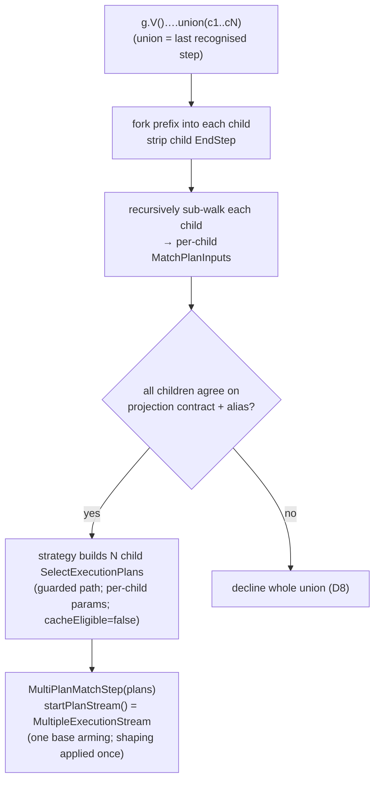

<!-- workflow-sha: d2dfcc2d44fabd3ac76c5fd7620f1e6013675ad9 -->
# Track 8: Union via `MultiPlanMatchStep`

## Purpose / Big Picture
After this track, `g.V()….union(c1, …, cN)` translates to the **concatenated** result multiset (not a cartesian product): each child sub-walks to its own full `SelectExecutionPlan`, and a `MultiPlanMatchStep` — subclassing the Track 7 boundary base — concatenates the child streams through one `MultipleExecutionStream` supplied to the base's `startPlanStream()` hook, so the base's row projection and ordered list-shaping apply once over the whole union. Union recognises only when it is the last recognised step and every child agrees on the full projection contract (`BoundaryOutputType` + return class + `ResultShaping`) under one canonical boundary alias; any disagreement, a declining child, a start-position `union` (no vertex `GraphStep` prefix), or a nested union inside a child declines the whole union (D8).

<!-- Reserved for Move 2 — ADDED/MODIFIED/REMOVED triad. Empty until Move 2 lands. -->

Second slice of the split final track (see plan D8, revised after Track 6). Depends on the boundary base Track 7 extracts — it is what `MultiPlanMatchStep` reuses for projection + shaping.

## Progress
- [x] Review + decomposition
- [ ] Step implementation
- [ ] Track-level code review
- [ ] Track completion
- [x] 2026-07-28T12:13Z [ctx=info] Review + decomposition complete (strategic trio: Technical PASS gate-iter2, Risk PASS gate-iter2, Adversarial PASS gate-iter2; 16 findings — 3 blocker / 8 should-fix / 5 suggestion — all accepted; 3 steps, reconciled tag `high`)

## Surprises & Discoveries
<!-- Continuous-log. Empty at Phase 1. -->

- **Phase A (2026-07-28, iter1) — realization re-pointed off the Track 7 episode hand-off (adversarial A3).** Track 7's episode prescribed advancing across child plans by reopening a fresh stream per child through the base's NEW/REARMED branch. Adversarial review found that rebuilds `shapedPayloads` per child, so Track 9's design-sanctioned `union().fold()` would fold each child separately (a multiset violation), and the base exposes no advance seam (its lifecycle is private). Re-pointed to a `MultipleExecutionStream` supplied through the existing `startPlanStream()` hook (DR-U1): one base arming spans all N plans, shaping applies once, exception-never-opens-N+1 and close-all fall out of the concatenator, and no base advance mechanism is needed.
- **Agreement gate is the full projection contract, not the output-type enum (adversarial A2).** The base holds one `ResultShaping` + one boundary alias for every row of every plan, so `union(values("name"), values("age"))` (same enum, different presence key) and `union(out(), in().in())` (different hop counts → different boundary alias) both mistranslate under enum-only agreement. Widened to record-equal `ResultShaping` + return class + a canonical alias rewritten onto every child (DR-U3).
- **Union is the last recognised step in Track 8 (adversarial A1).** The walker keeps dispatching after the union claim and the count/dedup/order/range recognisers are registered; none distribute over concatenation. The recogniser now declines a non-exhausted cursor after the union; Track 9 relaxes this for the list-shaping terminators only (DR-U4).
- **Concurrency category confirmed for the `MultiPlanMatchStep` step (risk R2).** Union adds the multi-alias clone surface Track 7 explicitly left without a concurrency reviewer; the step carrying `MultiPlanMatchStep.clone()` takes the `concurrency` code-review category at Phase C, filling that deferral.
- **Modified-scope corrected (adversarial A4 / technical T2, T4).** Recognisers register in `GremlinStepWalker`, not the strategy; the D7 idempotency scan is already base-keyed (a no-op, dropped); the substantive strategy edits are the `buildPlan` / `replaceAllStepsWithBoundary` / `applyTranslation` multi-plan branch.

## Decision Log
<!-- Continuous-log. -->
Canonical decision is plan D8 (revised after Track 6). Phase A (2026-07-28, iter1) resolved the pre-split open realization choices from the strategic-trio findings (Technical T1–T5, Risk R1–R6, Adversarial A1–A5; all under `plan/track-8/reviews/`):

- **DR-U1 — Advance realization (adversarial A3, resolving technical T1 / risk R1).** `MultiPlanMatchStep` realizes the base's `startPlanStream()` hook as a `MultipleExecutionStream` over an `ExecutionStreamProducer` that lazily opens each child plan against its own isolated, session-rebound context. Chosen over the per-plan NEW/REARMED reopen the Track 7 episode prescribed: reopen rebuilds `shapedPayloads` per child, so Track 9's `union().fold()` would fold each child separately, and the base's advance machinery (`state`, `openArming`, `shapedPayloads`) is private with no advance seam. One base arming spans all N plans, so projection + list-shaping apply once over the concatenation. `MultipleExecutionStream` is the production concatenator already used by `ParallelExecStep` / `FetchFromIndexStep` (`sql/executor/resultset/MultipleExecutionStream.java`).
- **DR-U2 — Child→plan seam (technical T2 / adversarial A4).** The recogniser forks the prefix, strips the child `EndStep`, and recursively walks each child via `GremlinStepWalker.production().walk(...)` to a per-child `MatchPlanInputs`; a multi-plan `TranslationResult` (field or sibling `UnionTranslationResult` — decomposition pins which) carries the ordered child inputs; `GremlinToMatchStrategy.buildPlan` builds each child `SelectExecutionPlan` inside the concurrent-DDL-guarded path and installs each child's positional parameters into its own child context (technical T3 — the base takes an empty `inputParameters` map).
- **DR-U3 — Agreement gate (adversarial A2).** The decline gate is full projection-contract agreement — equal `BoundaryOutputType`, equal return class, equal `ResultShaping` (record equality) — plus one canonical boundary alias rewritten onto every child's RETURN at translation time. Enum-only agreement silently drops or nulls rows.
- **DR-U4 — Suffix / nesting policy (adversarial A1 / A5).** In Track 8 the union claim is the last recognised step: after consuming the `UnionStep` the recogniser declines unless the cursor is exhausted (Track 9 relaxes this only for the sanctioned list-shaping terminators). A child whose sub-walk hits a nested `UnionStep` declines the whole union (flattening is a Phase 2 option).
- **DR-U5 — Cache policy (risk R3 / technical T5).** Union sets `cacheEligible = false` (default non-caching, mirroring the RID-bypass path). The single-plan cache value/fingerprint does not fit N plans; per-child caching or a multi-input fingerprint is deferred unless a later need justifies designing plus collision-testing it.

<!-- Reserved for Move 1 — per-track inlined Decision Records. -->

## Outcomes & Retrospective
<!-- Continuous-log. -->

**Phase A (2026-07-28, iter1 → gate iter2).** Predicted complexity tag `high` (Architecture / cross-component coordination + Performance hot path + Concurrency triggers over the planned work) → strategic trio.
- [x] Technical: PASS at gate iteration 2 (5 findings — 0 blocker / 3 should-fix / 2 suggestion; all 5 accepted and folded).
- [x] Risk: PASS at gate iteration 2 (6 findings — 0 blocker / 4 should-fix / 2 suggestion; all 6 accepted and folded).
- [x] Adversarial: PASS at gate iteration 2 (5 findings — 3 blocker / 1 should-fix / 1 suggestion; all 5 accepted and folded).

**Gate verdict: PASS.** The three adversarial blockers reshaped the realization off the Track 7 episode's per-plan-reopen hand-off — A1 (union is the last recognised step), A2 (agreement is the full projection contract, not the output-type enum), A3 (`MultipleExecutionStream` through `startPlanStream()`, not per-plan reopen). All 16 findings verified VERIFIED at gate iteration 2; reviews and verdicts under `plan/track-8/reviews/`. PSI timed out this session, so symbol facts rest on grep + declaration reads with caveats (see the `## Context and Orientation` reference-accuracy note).

**Reconciled track tag: `high`** — `max(step tags)` over the three `high` steps equals the predicted `high`; no upward divergence, no missed-reviewer pass. `high` governs Phase C.

## Context and Orientation
The translator is single-plan end to end today: `TranslationResult` holds one `MatchPlanInputs`; `buildResult` / `buildPlan` are single-plan; and `walkChild` returns a WHERE-predicate adapter rather than a full per-child translation (pre-split R2). Union cannot ride MATCH's `splitDisjointPatterns`, which joins disconnected patterns by **cartesian product** — the opposite of union's concatenation — so translating union that way would silently alter results and break the green-suite invariant. Instead union builds one full `SelectExecutionPlan` per child and concatenates their streams.

Two structural realities the original plan missed (pre-split A3/R2): (1) `GremlinToMatchStrategy` declines any traversal whose start step is not a vertex `GraphStep` (`hasVertexGraphStart`), so start-position `g.union(...)` declines — only `g.V()….union(…)` reaches translation; (2) mid-traversal union children (`g.V().union(out(), in())`) are prefix-relative sub-traversals that carry an `EndStep`. So union recognition forks the traversal prefix into each global child, strips the child `EndStep`, and sub-walks the forked child to a full plan.

`MultiPlanMatchStep` (subclass of the Track 7 boundary base) holds the ordered `List<SelectExecutionPlan>` and realizes the base's `startPlanStream()` hook as one `MultipleExecutionStream` over a producer that opens each child plan lazily against its own isolated, session-rebound context. `MultipleExecutionStream` keeps exactly one live child `ExecutionStream` at a time — closing the drained child before opening the next — so an exception in `plans[N]` never opens `plans[N+1..]` and the base's terminal-failure release (move to CLOSED, close every child including un-run ones, keep the iteration exception primary) runs unchanged. Because one base arming spans all N plans, row projection and the ordered list-shaping post-process apply once over the concatenation — Track 9's `union().fold()` folds the whole union, not each child (adversarial A3). `clone()` isolates each child plan against its own child context: union's multi-alias children make context bleed a real hazard, so the single-plan clone template is applied per child (risk R2). Every child agrees on the full projection contract (output type + return class + `ResultShaping`) under one canonical boundary alias reused from the base (adversarial A2).

**Reference-accuracy note.** Phase A (2026-07-28) verified the load-bearing facts by grep + declaration reads (mcp-steroid reachable but PSI `steroid_execute_code` times out in this repo): `SelectExecutionPlan.start()` returns a fresh `ExecutionStream` per call; `BranchStep.getGlobalChildren()` plus the child `EndStep` (`ComputerAwareStep$EndStep`, appended in `BranchStep.addChildOption`); the `hasVertexGraphStart` start gate; `walkChild` yields only a predicate adapter; `MultipleExecutionStream` is a lazy one-live-stream concatenator (`sql/executor/resultset/`); and `splitDisjointPatterns` joins by `CartesianProductStep` (so union must not ride it). Symbol-dependent claims carry the usual grep residual; implementation should re-confirm via PSI if it recovers — especially unstarted-plan `close()` null-safety across the child step chain (risk R4) and whether the composite realization needs a small `AbstractMatchPlanStep` edit for per-child context threading (`openArming` rebinds the session once and `rowProjectionSource` captures the ctx once — technical T1 / risk R1).

## Plan of Work
1. **`MultiPlanMatchStep`** (extends the Track 7 `AbstractMatchPlanStep`): realize `startPlanStream()` as one `MultipleExecutionStream` over an `ExecutionStreamProducer` that opens each child plan lazily against its own isolated, session-rebound context (DR-U1); `closePlan()` closes every child including un-run `plans[N+1..]` (risk R4); `clone()` isolates each child against its own child context (risk R2). Decomposition confirms whether the composite needs a small `AbstractMatchPlanStep` edit for per-child context threading or whether pre-binding each child stream via `childPlan.start(childCtx)` suffices (technical T1 / risk R1), and names the base in scope accordingly.
2. **Multi-plan translation carrier + strategy build/splice** (DR-U2): a multi-plan `TranslationResult` (field or `UnionTranslationResult`) carrying the ordered child `MatchPlanInputs`; `GremlinToMatchStrategy.buildPlan` / `replaceAllStepsWithBoundary` / `applyTranslation` gain a multi-plan branch that builds each child `SelectExecutionPlan` inside the concurrent-DDL-guarded path, installs each child's positional parameters into its own context (base takes an empty map — technical T3), closes already-built plans on a mid-build throw (risk R4), splices a `MultiPlanMatchStep`, and sets `cacheEligible = false` for union (DR-U5). The D7 idempotency scan already keys on `AbstractMatchPlanStep` — no change (technical T4).
3. **`UnionStepRecogniser`** registered in `GremlinStepWalker.PRODUCTION_RECOGNISERS` (not the strategy — adversarial A4): claim a `UnionStep` (`BranchStep`, N global children via `getGlobalChildren()`); fork the prefix, strip each child `EndStep`, recursively walk each child via `GremlinStepWalker.production().walk(...)` to a per-child `MatchPlanInputs`; enforce the full-projection-contract + canonical-alias agreement gate (DR-U3); decline the whole union on any disagreement, a declining child, a start-position union (no vertex prefix), a nested union inside a child (DR-U4), or a non-exhausted cursor after the union (union is the last recognised step — DR-U4).
4. **Tests** (see Validation): concatenation-multiset parity vs native plus the anti-cartesian `|c1|+|c2|` ≠ `|c1|·|c2|` case (risk R5); projection-contract-mismatch decline and canonical-alias parity (adversarial A2); start-position / suffix / nested-union declines (DR-U4); N-plan one-live-stream lifecycle; close-all-including-un-run and build-time partial-build leak (risk R4); exception-stops-advance asserting N+1 never started, all closed, and the original exception primary (risk R6); concurrent clone-isolation across multi-alias children (risk R2); per-child positional-parameter correctness (technical T3); a union with one RID-bearing child bypasses the cache and still returns the correct multiset (DR-U5).

## Concrete Steps

1. **`MultiPlanMatchStep`** over the Track 7 `AbstractMatchPlanStep`: realize `startPlanStream()` as one `MultipleExecutionStream` over an `ExecutionStreamProducer` that lazily opens each child plan against its own isolated, session-rebound context; `closePlan()` closes every child including un-run `plans[N+1..]`; `clone()` isolates each child against its own child context. Add the per-child-context-threading seam to `AbstractMatchPlanStep` only if the composite needs it (behavior-neutral for the single-plan path; re-run the Track 7 equivalence suite). Unit tests over synthetic child plans: concatenation multiset, one live stream, close-all-including-un-run, build-time partial-build leak, exception-stops-advance (N+1 never started / all closed / original exception primary), concurrent clone-isolation across multi-alias children, per-child positional-parameter correctness. — risk: high (concurrency, architecture, performance)  [ ]
2. **Multi-plan translation carrier + strategy build/splice** (DR-U2): a multi-plan `TranslationResult` (field or sibling `UnionTranslationResult`) carrying the ordered child `MatchPlanInputs`; `GremlinToMatchStrategy` `applyTranslation` / `buildPlan` / `replaceAllStepsWithBoundary` gain a multi-plan branch that builds each child `SelectExecutionPlan` inside the concurrent-DDL-guarded path, installs each child's positional parameters into its own context (base takes an empty map), closes already-built plans on a mid-build throw, and splices a `MultiPlanMatchStep`; the translator sets `cacheEligible=false` for union (DR-U5). Tests: N isolated guarded child plans built and spliced; a mid-build throw on child k closes children 0..k-1; a union bypasses the cache. — risk: high (architecture)  *(depends on Step 1)*  [ ]
3. **`UnionStepRecogniser`** registered in `GremlinStepWalker.PRODUCTION_RECOGNISERS`: claim a `UnionStep` (N global children via `getGlobalChildren()`); fork the prefix, strip each child `EndStep`, recursively walk each child via `GremlinStepWalker.production().walk(...)` to a per-child `MatchPlanInputs`; enforce the full-projection-contract + canonical-alias agreement gate (DR-U3); decline the whole union on any disagreement, a declining child, a start-position union, a nested union inside a child, or a non-exhausted cursor after the union (DR-U4). End-to-end tests: concatenation-multiset parity vs native, anti-cartesian `|c1|+|c2|` ≠ product, all decline cases, canonical-alias parity. — risk: high (architecture)  *(depends on Step 2)*  [ ]

## Episodes
<!-- Continuous-log. Empty at Phase 1. -->

## Validation and Acceptance
- `g.V()….union(t1, t2, …)` with children agreeing on the full projection contract translates to the concatenated multiset; the anti-cartesian case (children whose product ≠ sum) returns `|c1| + |c2|`, not the product (risk R5).
- A child that declines, a projection-contract or alias disagreement, a start-position `g.union(...)`, a nested union inside a child, or any non-list-shaping step after the union declines the whole union (D8; adversarial A1/A2/A5). `g.V().union(out(), in()).count()` and a `dedup` variant decline.
- `MultiPlanMatchStep` keeps one live child stream; an exception in plan N never starts plan N+1, every child including un-run ones is closed, and the original iteration exception is thrown (not masked by a close failure — risk R6). A mid-build throw on child k closes children 0..k-1 (risk R4).
- Two union children with different `?`-slot values return the correct per-child multiset (technical T3). Two concurrent clones of a multi-alias union show no cross-clone/parent variable bleed (risk R2).
- `union().fold()` (Track 9) folds the whole union into one list, not one per child — pinned by the single-base-arming realization (adversarial A3; Track 9 adds the terminator).
- Union sets `cacheEligible = false`; a union with one RID-bearing child still returns the correct multiset (DR-U5).

<!-- Phase A placeholder for per-step EARS/Gherkin lines. -->

<!-- Reserved for Move 3 — acceptance lines. -->

## Idempotence and Recovery
<!-- Phase A placeholder. -->

## Artifacts and Notes
<!-- Continuous-log (rare). Often empty. -->

## Interfaces and Dependencies
**In scope (new):** `UnionStepRecogniser` (registered in `GremlinStepWalker.PRODUCTION_RECOGNISERS`); `MultiPlanMatchStep` (subclass of `AbstractMatchPlanStep`, `startPlanStream()` = `MultipleExecutionStream`); the union `ExecutionStreamProducer`; the prefix-fork + `EndStep`-strip + recursive child→`MatchPlanInputs` sub-walk; the multi-plan translation carrier; concatenation / decline / lifecycle / leak / exception / concurrent-clone / per-child-param tests.
**In scope (modified):** `GremlinStepWalker` (register the union recogniser; the fork/strip/recursive-sub-walk path); `GremlinToMatchTranslator` / `TranslationResult` (multi-plan carrier — field or sibling `UnionTranslationResult`; set `cacheEligible=false` for union); `GremlinToMatchStrategy` (`applyTranslation` / `buildPlan` / `replaceAllStepsWithBoundary` gain a multi-plan branch that builds N guarded child plans, installs per-child params, and splices a `MultiPlanMatchStep`); `AbstractMatchPlanStep` **only if** decomposition finds the composite realization needs a per-child-context-threading seam (technical T1 / risk R1). The D7 idempotency scan already keys on `AbstractMatchPlanStep` — no edit needed (technical T4; drops the pre-review "broaden the scan" sub-item).
**Out of scope:** the boundary base extraction and ordered post-process carrier (Track 7); list-shaping terminators + `BoundaryOutputType.LIST` (Track 9); a multi-plan cache value / union fingerprint (deferred under DR-U5); `optional`, edge-bearing OR, variable-depth `repeat`, nested-union flattening (Phase 2 — design §"Out of scope").
**Inter-track dependencies:** depends on Track 7 (the `AbstractMatchPlanStep` base `MultiPlanMatchStep` extends). Track 9's full Cucumber re-run validates union end to end, and its `union().fold()` relies on the single-base-arming realization pinned here (DR-U1).
**Signatures:** `SelectExecutionPlan.start()` (fresh `ExecutionStream` per call); `BranchStep.getGlobalChildren()`; `UnionStep` (TP fork class); `hasVertexGraphStart` (`GremlinToMatchStrategy` start gate); `MultipleExecutionStream(ExecutionStreamProducer)` + `ExecutionStreamProducer` (lazy one-live-stream concatenator, `sql/executor/resultset/`); `AbstractMatchPlanStep` (four protected plan-seam hooks `planContext` / `rewindPlan` / `startPlanStream` / `closePlan` + `resetLifecycleForClone()`, one `ResultShaping` + one boundary alias, private per-arming lifecycle).

## Invariants & Constraints
<!-- Combined per-track invariants + constraints (conventions-execution.md §2.1 §14).
Added by workflow migration (#1145). Strategic invariants/constraints for this track remain
in implementation-plan.md § High-level plan (Architecture Notes) and this track's ## Decision
Log — the conservative migration retained the plan Architecture Notes rather than folding them here. -->

## Base commit
<!-- Phase B records the HEAD SHA here at session start; Phase C reads it to compute the
cumulative track diff (conventions-execution.md §2.1 §15). Added by workflow migration (#1145). -->
