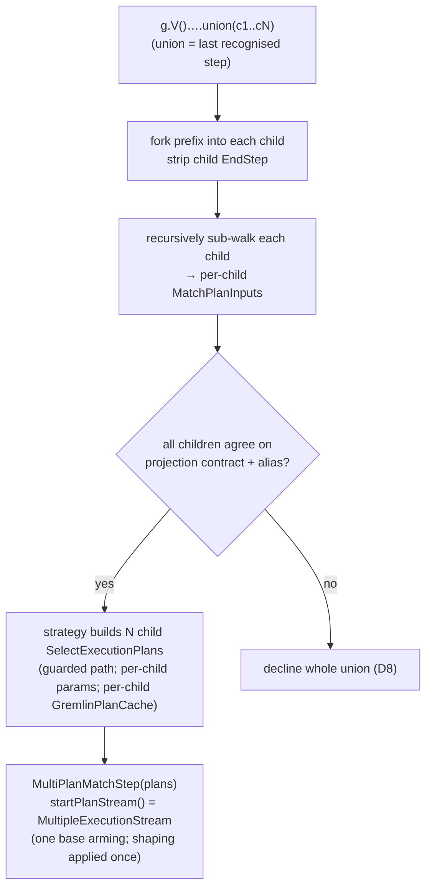

<!-- workflow-sha: d2dfcc2d44fabd3ac76c5fd7620f1e6013675ad9 -->
# Track 8: Union via `MultiPlanMatchStep`

## Purpose / Big Picture
After this track, `g.V()….union(c1, …, cN)` translates to the **concatenated** result multiset (not a cartesian product): each child sub-walks to its own full `SelectExecutionPlan`, and a `MultiPlanMatchStep` — subclassing the Track 7 boundary base — concatenates the child streams through one `MultipleExecutionStream` supplied to the base's `startPlanStream()` hook, so the base's row projection and ordered list-shaping apply once over the whole union. Union recognises only when it is the last recognised step and every child agrees on the full projection contract (`BoundaryOutputType` + return class + `ResultShaping`) under one canonical boundary alias; any disagreement, a declining child, a start-position `union` (no vertex `GraphStep` prefix), or a nested union inside a child declines the whole union (D8).

<!-- Reserved for Move 2 — ADDED/MODIFIED/REMOVED triad. Empty until Move 2 lands. -->

Second slice of the split final track (see plan D8, revised after Track 6). Depends on the boundary base Track 7 extracts — it is what `MultiPlanMatchStep` reuses for projection + shaping.

## Progress
- [x] Review + decomposition
- [x] Step implementation
- [x] Track-level code review
- [x] Track completion
- [x] 2026-07-28T12:13Z [ctx=info] Review + decomposition complete (strategic trio: Technical PASS gate-iter2, Risk PASS gate-iter2, Adversarial PASS gate-iter2; 16 findings — 3 blocker / 8 should-fix / 5 suggestion — all accepted; 3 steps, reconciled tag `high`)
- [x] 2026-07-28T13:57Z [ctx=critical] Step 1 complete (commit 8fa280b898); dim-review PASS (CN1/TX1/TX2 all VERIFIED, gate-check iter 1)
- [!] 2026-07-30T10:42Z [ctx=unknown] Step 2 failed — see Episodes §Step 2 (FAILED); recovered via Steps 2a / 2b
- [x] 2026-07-30T11:21Z [ctx=unknown] ESCALATE replan accepted — insert Step 2a (GraphApiTest rollback/count fix) before retrying Step 2
- [x] 2026-07-30T11:31Z [ctx=unknown] Step 2a complete (commit e3d460ef49)
- [x] 2026-07-30T13:30Z [ctx=unknown] Step 2b complete (commit 660b3be634); dim-review PASS (in-session, 2026-07-30T13:55Z)
- [x] 2026-07-30T14:25Z [ctx=unknown] Step 3 complete (commit d65317f54f); UnionStepRecogniser + UnionForkHost
- [x] 2026-07-30T14:30Z [ctx=unknown] Phase B complete — all roster steps `[x]`/`[!]`; hand off to Phase C
- [x] 2026-07-30T15:00Z [ctx=unknown] Follow-up: per-child `GremlinPlanCache` for union (DR-U5); carrier stays uncached
- [x] 2026-07-31T11:55Z [ctx=unknown] Follow-up: post-concat pipeline (`count` push-down+sum, `limit`/`range` early-stop, `dedup`); `order` still declines; list-shaping remains Track 9
- [x] 2026-08-01T02:06Z [ctx=safe] Track-level code review iteration 1 complete (commit 880af2d09c; 8 of 41 findings — BG1/BG2 blockers, BG3/CQ2/TX3/TC1 should-fix, BG4/BG5 suggestion; all confirmed real, none a misread)
- [x] 2026-08-01T03:44Z [ctx=info] Gate check iteration 1: Bugs PASS (BG1–BG5 VERIFIED); CQ2/CQ6/TC1/TX3 VERIFIED; PF2 REGRESSION (allow-list gate placed after the child fork); new TC9. 9 cleared, 33 open, 0 blockers
- [x] 2026-08-01T03:44Z [ctx=info] Track-level code review iteration 2 complete (commit 1499aced6d; PF2 repaired via pre-fork look-ahead, plus PF3/CQ9/TC9/TB2/TC8/TC5; PF4 documented not fixed — see DR-U7)
- [x] 2026-08-01T04:05Z [ctx=info] Gate check iteration 2: Bugs PASS (BG1–BG5 re-verified after the gate moved); PF2 VERIFIED (regression cleared), PF3 VERIFIED, PF4 REJECTED (DR-U7 upheld), CQ9/TB2/TC5/TC8/TC9 VERIFIED; concurrency regression sweep clean. 17 of 42 cleared, 25 open (12 should-fix, 13 suggestion), 0 blockers
- [x] 2026-08-01T04:51Z [ctx=info] Track-level code review iteration 3 complete (commit 877dc1f4cd; all 12 remaining should-fix — CQ1/CQ3/CQ4/CQ5/CQ7/TB1/TB3/TC3/TC4/TX4/PF1/CN1 — plus CQ11 opportunistically; `PostConcatStreams` extracted, `MultiPlanMatchStep` 564→465 lines). 4 `YTDBQueryMetricsStrategyTest` failures reported as pre-existing at track base — independent verification returned BRANCH-REGRESSION, see Surprises
- [x] 2026-08-01T05:20Z [ctx=info] Gate check iteration 3: bugs / code-quality / performance / test-quality all PASS; CN1 and TX4 VERIFIED. 30 of 42 cleared, 12 open (all suggestion), 0 blockers, 0 should-fix — review loop terminates
- [x] 2026-08-01T05:20Z [ctx=info] Track complete

## Surprises & Discoveries
<!-- Continuous-log. Empty at Phase 1. -->

- **Phase A (2026-07-28, iter1) — realization re-pointed off the Track 7 episode hand-off (adversarial A3).** Track 7's episode prescribed advancing across child plans by reopening a fresh stream per child through the base's NEW/REARMED branch. Adversarial review found that rebuilds `shapedPayloads` per child, so Track 9's design-sanctioned `union().fold()` would fold each child separately (a multiset violation), and the base exposes no advance seam (its lifecycle is private). Re-pointed to a `MultipleExecutionStream` supplied through the existing `startPlanStream()` hook (DR-U1): one base arming spans all N plans, shaping applies once, exception-never-opens-N+1 and close-all fall out of the concatenator, and no base advance mechanism is needed.
- **Agreement gate is the full projection contract, not the output-type enum (adversarial A2).** The base holds one `ResultShaping` + one boundary alias for every row of every plan, so `union(values("name"), values("age"))` (same enum, different presence key) and `union(out(), in().in())` (different hop counts → different boundary alias) both mistranslate under enum-only agreement. Widened to record-equal `ResultShaping` + return class + a canonical alias rewritten onto every child (DR-U3).
- **Union is the last recognised step in Track 8 (adversarial A1).** The walker keeps dispatching after the union claim and the count/dedup/order/range recognisers are registered; none distribute over concatenation. The recogniser now declines a non-exhausted cursor after the union; Track 9 relaxes this for the list-shaping terminators only (DR-U4).
- **Concurrency category confirmed for the `MultiPlanMatchStep` step (risk R2).** Union adds the multi-alias clone surface Track 7 explicitly left without a concurrency reviewer; the step carrying `MultiPlanMatchStep.clone()` takes the `concurrency` code-review category at Phase C, filling that deferral.
- **Modified-scope corrected (adversarial A4 / technical T2, T4).** Recognisers register in `GremlinStepWalker`, not the strategy; the D7 idempotency scan is already base-keyed (a no-op, dropped); the substantive strategy edits are the `buildPlan` / `replaceAllStepsWithBoundary` / `applyTranslation` multi-plan branch.
- **Phase B (2026-07-28, Step 1) — `ChildContextStream` is the per-child-context seam; no `AbstractMatchPlanStep` edit.** Per-child session isolation comes from iterating and closing each child stream against its own context (`LoaderExecutionStream` reads session at iteration time, `FetchFromClassExecutionStep` at `start()`). `ParallelExecStep` shares one context and is not a precedent for union's isolation. See Episodes §Step 1.
- **Phase B (2026-07-30, Step 2) — branch-wide `GraphApiTest` rollback/count regression blocks Step 2.** Mandatory `core` verification fails on six rollback tests: after a rolled-back `addV`, `g.V().has(...).count().next()` throws `NoSuchElementException` instead of returning `0`. Present on HEAD and predates Step 2 (also fails at Track 8 base and Track 7 completion); `develop` passes. Escalated — see Episodes §Step 2 (FAILED).
- **Phase B (2026-07-30, ESCALATE) — root cause of rollback/count.** `MatchExecutionPlanner` short-circuits to `EmptyStep` when any non-optional alias has `estimatedRootEntries == 0`, and returns before `handleProjectionsBlock` can attach `GuaranteeEmptyCountStep`. Filtered `RETURN count(*)` on an empty-but-existing class therefore emits zero rows instead of `{count: 0}`. After a rolled-back `addV("Person")` the class exists with 0 records, so the Gremlin translator's MATCH count path hits this hole; commit paths (class has ≥1 row) and `develop` (no translator) stay green.
- **Phase C (2026-08-01) — `./mvnw -pl core test` has been red on this branch for 117 commits, and CI never said so.** Iteration 3 reported four `YTDBQueryMetricsStrategyTest` failures as "pre-existing at the track base, not caused by this iteration". Independent verification in a separate worktree returned **`BRANCH-REGRESSION`**: `origin/develop` is green, the branch has been red since 2026-07-16. Two culprits — `6e657ce2b1` ("Translate has/hasLabel/hasId and has(key) to MATCH", Track 4 era) broke five tests by removing `YTDBGraphStep` from translated traversals, which is the only step `YTDBQueryMetricsStep.capturedExecutionPlan()` read; then Track 8's own `3d476357cc` ("Surface MATCH plans to query metrics") repaired three and broke `byIdLookupSurfacesNullPlan`, which **passes at the Track 8 base**. The track base actually carries six problems, not four, and a different set — the matching count was a coincidence. One failure is a genuine product defect: after `toList()` closes a translated traversal, `AbstractMatchPlanStep` reaches `CLOSED`, `reset()` re-arms only from `OPEN`/`DRAINED`, and re-iteration yields `[]` where the native path re-executes correctly. Two more are introspection artefacts with a real consequence — `MatchFirstStep` overrides neither `getSubSteps()` nor `getSubExecutionPlans()`, so `containsStepOfType` can never find a fetch step inside a MATCH plan, and whether the index is still *used* was not established. The class is `@Category(SequentialTest)` and `core/pom.xml` binds `sequential-tests` to the `test` phase, so a plain core unit-test run fails; PR #1038 is a draft and every CI check reports `skipping`, so the gate that would have caught this never ran. Track 2's Step 5 record shows why it slipped: metrics were verified by a *new* smoke test covering `getQuerySummary` / `getQuery` / count, never `getExecutionPlan()`, and the existing class was skipped as "cannot run standalone". Second instance of the DR-U6 pattern on this branch — "reproduces at the track base" has now twice meant "branch-introduced, further upstream than you looked".
- **Phase B (2026-07-30, Step 3) — `UnionForkHost` keeps parent `Traversal.Admin` off the recogniser.** An early WIP exposed `parentTraversal` on `WalkerContext`. That broke the StepCursor / RecognitionContext minimal-access contract. The walker owns a `UnionForkHost` instead; the recogniser only calls `recognisedPrefixSteps()`, `walkFork(suffix)`, and `stashAcceptedChildren(...)`. See Episodes §Step 3.

## Decision Log
<!-- Continuous-log. -->
Canonical decision is plan D8 (revised after Track 6). Phase A (2026-07-28, iter1) resolved the pre-split open realization choices from the strategic-trio findings (Technical T1–T5, Risk R1–R6, Adversarial A1–A5; all under `plan/track-8/reviews/`):

- **DR-U1 — Advance realization (adversarial A3, resolving technical T1 / risk R1).** `MultiPlanMatchStep` realizes the base's `startPlanStream()` hook as a `MultipleExecutionStream` over an `ExecutionStreamProducer` that lazily opens each child plan against its own isolated, session-rebound context. Chosen over the per-plan NEW/REARMED reopen the Track 7 episode prescribed: reopen rebuilds `shapedPayloads` per child, so Track 9's `union().fold()` would fold each child separately, and the base's advance machinery (`state`, `openArming`, `shapedPayloads`) is private with no advance seam. One base arming spans all N plans, so projection + list-shaping apply once over the concatenation. `MultipleExecutionStream` is the production concatenator already used by `ParallelExecStep` / `FetchFromIndexStep` (`sql/executor/resultset/MultipleExecutionStream.java`).
- **DR-U2 — Child→plan seam (technical T2 / adversarial A4).** The recogniser forks the prefix, strips the child `EndStep`, and recursively walks each child via `GremlinStepWalker.production().walk(...)` to a per-child `MatchPlanInputs`; a multi-plan `TranslationResult` (field or sibling `UnionTranslationResult` — decomposition pins which) carries the ordered child inputs; `GremlinToMatchStrategy.buildPlan` builds each child `SelectExecutionPlan` inside the concurrent-DDL-guarded path and installs each child's positional parameters into its own child context (technical T3 — the base takes an empty `inputParameters` map).
- **DR-U3 — Agreement gate (adversarial A2).** The decline gate is full projection-contract agreement — equal `BoundaryOutputType`, equal return class, equal `ResultShaping` (record equality) — plus one canonical boundary alias rewritten onto every child's RETURN at translation time. Enum-only agreement silently drops or nulls rows.
- **DR-U4 — Suffix / nesting policy.** After a recognised union the walker may continue for post-concat barriers: `count` (push-down + sum when alone), `limit`/`range`/`skip` (early-stop on the concatenator), `dedup` (global identity set). `order()` after union still declines. List-shaping terminators (`fold`/…) remain Track 9. A child whose sub-walk hits a nested `UnionStep` declines the whole union (flattening is Phase 2).
- **DR-U5 — Cache policy (risk R3 / technical T5).** The multi-plan carrier sets `cacheEligible = false` (never one `GremlinPlanCache` entry for the N-plan union). Each child is a single-plan translation and uses the existing fingerprint/get/put path when that child's walk is cache-eligible; RID-bearing children still bypass. A dedicated multi-input fingerprint / multi-plan cache *value* stays deferred unless a later need justifies designing plus collision-testing it.
- **DR-U1 / T1 / R1 resolved (Phase B, Step 1) — no `AbstractMatchPlanStep` edit.** The decomposition's open base-edit question resolves to no-edit: the single `startPlanStream()` seam plus a `ChildContextStream` wrapper suffices for per-child context isolation, so the base stays untouched. See Episodes §Step 1.
- **DR-U6 (ESCALATE 2026-07-30) — fix MATCH empty-class filtered count before retrying Step 2.** Insert Step 2a: skip the `EmptyStep` zero-estimate short-circuit when RETURN is bare `count(*)` without GROUP BY, so `SelectExecutionPlanner.handleProjectionsBlock` can attach `GuaranteeEmptyCountStep` (same SQL empty-count semantics as SELECT). Then retry Step 2 unchanged.
- **DR-U2 pin (Phase B, Steps 2b / 3) — multi-plan carrier is `TranslationResult` fields + `UnionForkHost`.** Chose fields (`childInputs` / `childInputParameters` / `multiPlan` factory) over a sibling `UnionTranslationResult` type. Child→plan re-walk goes through `UnionForkHost` (walker-private parent Admin), not a recogniser-visible `Traversal.Admin`. See Episodes §Step 2b and §Step 3.

- **DR-U7 (Phase C, iteration 2) — non-polymorphic bare `count()` stays on the MATCH path; the cost is recorded, not removed (performance PF4).** Review found that `0f7ecbb94c` makes non-polymorphic bare counts pre-empt the single-step native fast path with a MATCH plan `GremlinPlanCache` always rejects, so every execution re-fingerprints and re-plans. Two closures were available: narrow the decline back to the two shapes `YTDBGraphCountStrategy` serves, or accept the constant-factor cost as the price of a single count owner. **Chose the second.** Narrowing would undo behaviour the last Phase B commit deliberately established and pinned (`GraphCountStrategyTest.shouldUseExactClassCount_nonPolymorphicHasLabel` asserts the start step is the MATCH boundary, not `YTDBClassCountStep`), would route identical query shapes through different planners depending on a session flag, and would leave the wider non-polymorphic shapes (`hasLabel(L).has(k, v).count()`) with no owner at all. The residual cost is now an `@implNote` on `configureCount` naming it exactly — fingerprint, always-missing cache probe (`CountFromClassStep` is not cacheable), plan build, plan copy — so the "MATCH is free because both sides are O(1)" assumption no longer stands unstated. Revisit if a benchmark shows the per-compilation constant matters on a hot count path.

<!-- Reserved for Move 1 — per-track inlined Decision Records. -->

## Outcomes & Retrospective
<!-- Continuous-log. -->

**Phase A (2026-07-28, iter1 → gate iter2).** Predicted complexity tag `high` (Architecture / cross-component coordination + Performance hot path + Concurrency triggers over the planned work) → strategic trio.
- [x] Technical: PASS at gate iteration 2 (5 findings — 0 blocker / 3 should-fix / 2 suggestion; all 5 accepted and folded).
- [x] Risk: PASS at gate iteration 2 (6 findings — 0 blocker / 4 should-fix / 2 suggestion; all 6 accepted and folded).
- [x] Adversarial: PASS at gate iteration 2 (5 findings — 3 blocker / 1 should-fix / 1 suggestion; all 5 accepted and folded).

**Gate verdict: PASS.** The three adversarial blockers reshaped the realization off the Track 7 episode's per-plan-reopen hand-off — A1 (union is the last recognised step), A2 (agreement is the full projection contract, not the output-type enum), A3 (`MultipleExecutionStream` through `startPlanStream()`, not per-plan reopen). All 16 findings verified VERIFIED at gate iteration 2; reviews and verdicts under `plan/track-8/reviews/`. PSI timed out this session, so symbol facts rest on grep + declaration reads with caveats (see the `## Context and Orientation` reference-accuracy note).

**Reconciled track tag: `high`** — `max(step tags)` over the three `high` steps equals the predicted `high`; no upward divergence, no missed-reviewer pass. `high` governs Phase C.

**Phase B (2026-07-30).** Roster complete: Steps 1, 2a, 2b, 3 `[x]`; Step 2 remains `[!]` (failed attempt, recovered by 2a/2b). Delivered `MultiPlanMatchStep`, multi-plan `TranslationResult` + strategy splice, `UnionStepRecogniser` behind `UnionForkHost`, and union `cacheEligible=false`. GraphApiTest green after 2a. Step 2b dim-review PASS in-session; Step 3 dim-review deferred to Phase C (usage-limit agents failed mid-session). Next: Phase C track-level code review.

**Track episode (2026-08-01).** `g.V()….union(c1,…,cN)` now translates to the concatenated multiset. Each child sub-walks to its own `SelectExecutionPlan`; `MultiPlanMatchStep` concatenates them through one `MultipleExecutionStream` supplied to the Track 7 base's `startPlanStream()` hook, so row projection and ordered list-shaping apply once over the whole union. Also landed: `UnionStepRecogniser` behind the `UnionForkHost` seam, the multi-plan `TranslationResult` carrier, per-child `GremlinPlanCache` reuse with the carrier itself uncached (DR-U5), and a post-concatenation pipeline for `count` / `limit` / `dedup` extracted into `PostConcatStreams`. Final cumulative diff: 38 files, 5,814 insertions.

The review burden crossed the ~4,000-line soft threshold at Phase C entry (4,214 changed code lines, generated excluded), recorded here per the flag-only rule as a retroactive-split signal for future planning. The track is a candidate for splitting in hindsight — the diff had already landed, so it could not be split then.

*Phase C outcome.* Three iterations over 42 findings from six dimensional reviewers: 30 cleared, zero blockers and zero should-fix remaining, twelve suggestions carried to the plan. Iteration 1 (`880af2d09c`) cleared both blockers. Iteration 2 (`1499aced6d`) repaired the regression iteration 1 introduced. Iteration 3 (`877dc1f4cd`) cleared every remaining should-fix and extracted `PostConcatStreams`.

*What the review found that Phase B did not.* Both blockers came from the three follow-up commits that landed after the Phase B completion marker as `## Progress` lines rather than roster steps — unrostered work gets no risk tag and no step-level review, and it produced every blocker in this track. First: post-union suffix steps outside `{count, range, dedup}` were accepted by their own recognisers and then silently discarded by the multi-plan `buildResult`, so `g.V().union(out(),in()).out()` returned wrong rows with no error — DR-U4's structural gate had been replaced by per-recogniser opt-in covering four of twenty-nine registry entries. Second: the lone-count push-down nulled each child's `LIMIT` / `SKIP` / `DISTINCT`, over-counting exactly the shapes the single-plan path already declines.

*A correctness fix that cost performance, then paid it back.* The first blocker's fix placed the allow-list gate inside `dispatchAll`, after the union recogniser had already forked and re-walked all N children — so twenty-five registry entries began paying for forks they discarded on every traversal compilation. The gate check caught this as a regression. The repair moved the check ahead of the fork through the `UnionForkHost` seam, leaving one allow-list field with two readers; the decline path now costs a single map lookup, better than the pre-fix state. `order()` left the allow-list in the process, which changed its meaning from "this recogniser knows about the carrier" to "the concatenation can absorb this" — the extension point a later list-shaping track edits.

*Deliberate non-fixes.* DR-U7 records the accepted constant-factor cost on non-polymorphic bare `count()`: narrowing the decline would undo a pinned Phase B behaviour, route identical shapes to different planners by session flag, and orphan `hasLabel(L).has(k,v).count()`. An independent reviewer verified the cost statement against the code and upheld it. TX4's eight-thread cache test was dropped as unwritable — `GremlinPlanCache.get` dereferences the session on the calling thread, so the interleaving needs a per-thread-session fixture the class lacks; `GremlinPlanCacheTest`'s own Javadoc already records the same constraint.

*Unverified gate.* The coverage gate was not run in any of the three iterations. The reasoning is sound — `coverage-gate.py` compares against `origin/develop`, so a partial exec file misreports every other changed file on the branch as uncovered, and this branch has a history of implementers stalling inside the full profile build — but the 85% / 70% thresholds are therefore unmeasured for this track's code. Each iteration instead recorded which targeted test drives each changed production line.

*Plan correction.* Independent verification of four `YTDBQueryMetricsStrategyTest` failures — reported by iteration 3 as pre-existing — returned `BRANCH-REGRESSION`: `origin/develop` is green and `./mvnw -pl core test` has been red on this branch for 117 commits, hidden because PR #1038 is a draft and every CI check reports `skipping`. One of the four was broken by this track's own `3d476357cc`. Remediation is inserted as Track 10, running before Track 9; see `## Surprises & Discoveries` for the full evidence.

## Context and Orientation
Union is live on this branch: `UnionStepRecogniser` (via `UnionForkHost`) forks the prefix into each global child, strips `ComputerAwareStep.EndStep`, and re-walks each fork to a full `MatchPlanInputs`; a multi-plan `TranslationResult` carries the ordered children plus per-child `cacheEligible` flags; `GremlinToMatchStrategy.buildChildPlans` builds each `SelectExecutionPlan` through the single-plan path (eligible children hit `GremlinPlanCache`) and splices `MultiPlanMatchStep`. The multi-plan carrier itself stays `cacheEligible=false`. Single-plan walks still use one `MatchPlanInputs` / `YTDBMatchPlanStep`. `walkChild` remains a WHERE-predicate adapter for logical filters — not a full child→plan path (that path is union-only through `UnionForkHost.walkFork`).

Union cannot ride MATCH's `splitDisjointPatterns`, which joins disconnected patterns by **cartesian product** — the opposite of union's concatenation. Start-position `g.union(...)` declines (`hasVertexGraphStart` + empty-prefix gate). Mid-traversal children are prefix-relative and carry an `EndStep`.

`MultiPlanMatchStep` holds the ordered `List<SelectExecutionPlan>` and realizes `startPlanStream()` as one `MultipleExecutionStream` over a producer that opens each child lazily against its own isolated, session-rebound context. One live child stream at a time; exception in `plans[N]` never opens `plans[N+1..]`; close-all including un-run; `clone()` isolates each child. One base arming spans all N plans so list-shaping (Track 9 `union().fold()`) applies once over the concatenation. Every child agrees on the full projection contract under one canonical boundary alias (DR-U3).

**Reference-accuracy note.** Phase A (2026-07-28) verified the load-bearing facts by grep + declaration reads (mcp-steroid reachable but PSI `steroid_execute_code` timed out): `SelectExecutionPlan.start()` returns a fresh `ExecutionStream` per call; `BranchStep.getGlobalChildren()` plus the child `EndStep`; the `hasVertexGraphStart` start gate; `walkChild` yields only a predicate adapter; `MultipleExecutionStream` is a lazy one-live-stream concatenator; `splitDisjointPatterns` joins by `CartesianProductStep`. Phase B confirmed no `AbstractMatchPlanStep` edit is required (`ChildContextStream` suffices).

## Plan of Work
1. **`MultiPlanMatchStep`** (extends the Track 7 `AbstractMatchPlanStep`): realize `startPlanStream()` as one `MultipleExecutionStream` over an `ExecutionStreamProducer` that opens each child plan lazily against its own isolated, session-rebound context (DR-U1); `closePlan()` closes every child including un-run `plans[N+1..]` (risk R4); `clone()` isolates each child against its own child context (risk R2). Decomposition confirms whether the composite needs a small `AbstractMatchPlanStep` edit for per-child context threading or whether pre-binding each child stream via `childPlan.start(childCtx)` suffices (technical T1 / risk R1), and names the base in scope accordingly.
2. **Multi-plan translation carrier + strategy build/splice** (DR-U2): a multi-plan `TranslationResult` (field or `UnionTranslationResult`) carrying the ordered child `MatchPlanInputs`; `GremlinToMatchStrategy.buildPlan` / `replaceAllStepsWithBoundary` / `applyTranslation` gain a multi-plan branch that builds each child `SelectExecutionPlan` inside the concurrent-DDL-guarded path, installs each child's positional parameters into its own context (base takes an empty map — technical T3), closes already-built plans on a mid-build throw (risk R4), splices a `MultiPlanMatchStep`, and sets `cacheEligible = false` for union (DR-U5). The D7 idempotency scan already keys on `AbstractMatchPlanStep` — no change (technical T4).
3. **`UnionStepRecogniser`** registered in `GremlinStepWalker.PRODUCTION_RECOGNISERS` (not the strategy — adversarial A4): claim a `UnionStep`; fork the prefix and re-walk each global child through `UnionForkHost` (walker-private parent Admin — no recogniser-visible `Traversal.Admin`); strip each child `EndStep`; enforce the full-projection-contract + canonical-alias agreement gate (DR-U3); decline on disagreement, declining child, start-position union, nested union (DR-U4), or non-exhausted cursor after the union.
4. **Tests** (see Validation): concatenation-multiset parity vs native plus the anti-cartesian `|c1|+|c2|` ≠ `|c1|·|c2|` case (risk R5); projection-contract-mismatch decline and canonical-alias parity (adversarial A2); start-position / suffix / nested-union declines (DR-U4); N-plan one-live-stream lifecycle; close-all-including-un-run and build-time partial-build leak (risk R4); exception-stops-advance asserting N+1 never started, all closed, and the original exception primary (risk R6); concurrent clone-isolation across multi-alias children (risk R2); per-child positional-parameter correctness (technical T3); a union with one RID-bearing child bypasses the cache and still returns the correct multiset (DR-U5).

## Concrete Steps

1. **`MultiPlanMatchStep`** over the Track 7 `AbstractMatchPlanStep`: realize `startPlanStream()` as one `MultipleExecutionStream` over an `ExecutionStreamProducer` that lazily opens each child plan against its own isolated, session-rebound context; `closePlan()` closes every child including un-run `plans[N+1..]`; `clone()` isolates each child against its own child context. Add the per-child-context-threading seam to `AbstractMatchPlanStep` only if the composite needs it (behavior-neutral for the single-plan path; re-run the Track 7 equivalence suite). Unit tests over synthetic child plans: concatenation multiset, one live stream, close-all-including-un-run, build-time partial-build leak, exception-stops-advance (N+1 never started / all closed / original exception primary), concurrent clone-isolation across multi-alias children, per-child positional-parameter correctness. — risk: high (concurrency, architecture, performance)  [x]  commit: 8fa280b898
2. **Multi-plan translation carrier + strategy build/splice** (DR-U2): a multi-plan `TranslationResult` (field or sibling `UnionTranslationResult`) carrying the ordered child `MatchPlanInputs`; `GremlinToMatchStrategy` `applyTranslation` / `buildPlan` / `replaceAllStepsWithBoundary` gain a multi-plan branch that builds each child `SelectExecutionPlan` inside the concurrent-DDL-guarded path, installs each child's positional parameters into its own context (base takes an empty map), closes already-built plans on a mid-build throw, and splices a `MultiPlanMatchStep`; the translator sets `cacheEligible=false` for union (DR-U5). Tests: N isolated guarded child plans built and spliced; a mid-build throw on child k closes children 0..k-1; a union bypasses the cache. — risk: high (architecture)  *(depends on Step 1)*  [!] commit: (failed; recovered by Steps 2a / 2b)
2a. **Fix MATCH empty-class filtered `count(*)` (DR-U6):** skip the `EmptyStep` zero-estimate short-circuit in `MatchExecutionPlanner` when RETURN is bare `count(*)` without GROUP BY, so `GuaranteeEmptyCountStep` can emit `0`. Regression: MATCH SQL filtered count on an empty class + `GraphApiTest` rollback/count suite. — risk: medium (architecture)  [x]  commit: e3d460ef49
2b. **Multi-plan translation carrier + strategy build/splice (retry after 2a):** same scope as Step 2; landed as `TranslationResult` fields (not a sibling type). — risk: high (architecture)  *(depends on Step 2a)*  [x]  commit: 660b3be634
3. **`UnionStepRecogniser`** via `UnionForkHost`: claim a `UnionStep` (N global children); fork the prefix, strip each child `EndStep`, re-walk each fork through the host to a per-child `MatchPlanInputs`; enforce the full-projection-contract + canonical-alias agreement gate (DR-U3); decline on disagreement, declining child, start-position union, nested union, or non-exhausted cursor (DR-U4). End-to-end tests: concatenation-multiset parity vs native, anti-cartesian, declines, canonical-alias parity. — risk: high (architecture)  *(depends on Step 2b)*  [x]  commit: d65317f54f

## Episodes
<!-- Continuous-log. Empty at Phase 1. -->

### Step 1 — commit 8fa280b898, 2026-07-28T13:57Z [ctx=critical]

**What was done:** Added `MultiPlanMatchStep`, the concrete N-plan boundary step over the Track 7 `AbstractMatchPlanStep`. It realizes the base's single `startPlanStream()` seam as one `MultipleExecutionStream` over a lazy `ExecutionStreamProducer` that opens each child plan one at a time — child i+1 opens only after child i drains — so an exception in a child never opens the children after it, and the base's projection plus list-shaping apply once over the whole concatenation. `closePlan()` closes every child including un-run ones (first close failure primary, rest `addSuppressed`); `rewindPlan()` resets every child; `clone()` deep-copies each child against its own isolated child context and hands the clone a fresh coordinator context. Implemented at `e7995680` (18 tests); a review fix at `8fa280b898` hardened clone isolation and test falsifiability (21 tests, 100% of changed production lines). Two new files: `MultiPlanMatchStep.java`, `MultiPlanMatchStepTest.java`.

**What was discovered:** The decomposition's open question — a base edit for per-child context threading versus "pre-binding each child suffices" — resolves to no base edit. `LoaderExecutionStream` reads the session from the context passed at iteration time, while `FetchFromClassExecutionStep` captures it at `start()` from the plan's own context; for the single-plan step both are the same context, so each union child stream must be iterated and closed against its own context. A `ChildContextStream` wrapper does exactly this; the base's single `planContext()` acts only as a coordinator carrying the iteration-thread session from `openArming()`'s rebind down to the producer, which rebinds each child's own context before `start()`. `ParallelExecStep` is the existing `MultipleExecutionStream`-over-child-plans precedent, but its sub-plans deliberately share one context, so it does not cover union's per-child isolation. Dimensional review (concurrency + test-concurrency) confirmed the clone-isolation invariant and drove the review fix. See Surprises §Step 1 and Decision Log §Step 1.

**What changed from the plan:** No edit to `AbstractMatchPlanStep` — the plan left it optional ("only if the composite needs it"), and it is not needed: the base is untouched and the Track 7 equivalence suite did not need re-running. The two constructors are `(traversal, returnClass, plans, boundaryAlias, outputType)` and the same plus a `ResultShaping`; the step forces the base's positional-parameter map to empty, enforcing DR-U2 (per-child params live on per-child contexts) at the type level.

**Critical context:** `ChildContextStream` is the load-bearing seam — a future refactor that drops it and threads the coordinator context to the child streams would split each child's session / `$current` / `$matched` reads across two contexts and could reintroduce `SessionNotActivatedException` or wrong-context variable reads. The field-modifier test locks `plans` and `coordinatorContext` non-final for the JMM clone-publication reason (mirrors `YTDBMatchPlanStep.plan`). The review fix added a fail-fast `assert` in `clone()` that rejects a child template context carrying per-run state (`getVariables` / `$current` / `$matched`), matching the `setVariable` / `setSystemVariable` up-propagation that is the real cross-clone race. For Step 2: construct `MultiPlanMatchStep` with child `SelectExecutionPlan`s already built and install each child's positional parameters on that child's own context — the step assumes plans are built and does not guard; the concurrent-DDL guard and mid-build cleanup (close children 0..k-1 on a throw at child k) are Step 2's responsibility.

### Step 2 — FAILED, 2026-07-30T10:42Z [ctx=unknown]

**What was attempted:** Implementer spawned for Track 8 Step 2 (multi-plan translation carrier + `GremlinToMatchStrategy` build/splice branch). Work included `GremlinToMatchTranslator`, `GremlinToMatchStrategy`, `GremlinStepWalker`, and focused tests in `GremlinToMatchStrategyTest`. Focused strategy/cache tests passed; mandatory broader `./mvnw -pl core clean test -P coverage` and isolated `GraphApiTest` were then run.

**Why it failed:** Branch-wide verification failed outside the narrow Step 2 union path. Six `GraphApiTest` rollback scenarios (`testExecuteInTxRollbackGraph`, `testExecuteInTxRollbackTraversal`, `testAutoExecuteInTxRollbackGraph`, `testAutoExecuteInTxRollbackTraversal`, `testComputeInTxAndRollbackGraph`, `testComputeInTxAndRollbackTraversal`) all throw `NoSuchElementException` from `g.V().has("Person", "name", "Constantin").count().next()` on the third `executeInTx` call after a rolled-back write — the traversal emits no row where count `0` is expected. Reproduced on current HEAD, at Track 8 base (`8ce646b15cc`), and at Track 7 completion (`4e598447d4`); `develop` and the branch seed (`7ba35456f0`) pass. Implementer reverted uncommitted Step 2 changes; working tree is clean at `1c539163e7`.

**Impact on remaining steps:** Step 2 is unlanded. Step 3 depends on Step 2's carrier/build-splice seam. The regression is a branch-health blocker for any Step 2 commit under the rulebook (tests must pass). Retry or split of Step 2 alone cannot clear it — the failure predates this step's code path.

**Key files:** `core/src/test/java/com/jetbrains/youtrackdb/internal/core/gremlin/GraphApiTest.java` (failing assertions); likely translator surface `GremlinToMatchStrategy`, `AbstractMatchPlanStep` / `YTDBMatchPlanStep` (count-after-rollback lifecycle); `CountGlobalStepRecogniser` / `BoundaryOutputType.SCALAR` (count projection).

### Step 2a — commit e3d460ef49, 2026-07-30T11:31Z [ctx=unknown]

**What was done:** Skipped the `EmptyStep` zero-estimate short-circuit in `MatchExecutionPlanner` when RETURN is bare `count(*)` without GROUP BY (`isBareCountStarWithoutGroupBy`), so planning continues into `handleProjectionsBlock` and `GuaranteeEmptyCountStep` emits `{count: 0}`. Added `MatchStatementExecutionTest.testFilteredCountOnEmptyClassReturnsZeroRow`. `GraphApiTest` (14/14) and the new MATCH test pass.

**What was discovered:** The hole is in MATCH planning, not in the Gremlin boundary step. Filtered `RETURN count(*)` never hits `tryHardwiredMatchCount` (alias filters present); with `estimatedRootEntries == 0` the planner returned `EmptyStep` alone and never attached the empty-count guarantee SELECT already has. A rolled-back `addV("Person")` leaves the class with 0 records, which is exactly that estimate.

**What changed from the plan:** ESCALATE inserted this step (DR-U6) ahead of the Step 2 retry; scope is MATCH planner only — no translator or `MultiPlanMatchStep` edits.

**Critical context:** Do not reintroduce an unconditional zero-estimate `EmptyStep` return for count(*) shapes. Property aggregates (`sum`/`min`/`max`/`mean`) still want empty → no row under Gremlin `dropNullRows`; only bare `count(*)` without GROUP BY skips the short-circuit.

### Step 2b — commit 660b3be634, 2026-07-30T13:30Z [ctx=unknown]

**What was done:** Extended `TranslationResult` with `childInputs` + `childInputParameters`, a `multiPlan` factory, and XOR validation so a union carrier is distinct from a single-plan one. `GremlinToMatchStrategy.applyTranslation` now branches: `buildChildPlans` builds each child under the injected plan builder (`cacheEligible` forced false), installs per-child params on that child's context, closes children 0..k-1 on a mid-build throw (close failures suppressed), and splices `MultiPlanMatchStep`. Walker single-plan construction passes empty child lists. Tests cover N-child splice + params, mid-build cleanup, close-failure suppression, carrier validation, `cacheEligible=false`, and production-builder cache bypass. `GraphApiTest` 14/14 green after Step 2a.

**What was discovered:** Multi-plan build never calls the parent cache path — children are always built with `cacheEligible=false` via `buildChildPlans`, so union cache bypass is structural, not only a flag on the carrier. `requireInputs`' null throw after assert is unreachable under `-ea` (test/CI default).

**What changed from the plan:** None. Used `TranslationResult` fields (not a sibling `UnionTranslationResult` type), matching DR-U2's "field or sibling" option and the prior Step 2 exploration.

**Critical context:** Construct `MultiPlanMatchStep` only with already-built child plans; per-child params live on child contexts (base map empty). Step 3's `UnionStepRecogniser` should call `TranslationResult.multiPlan(..., cacheEligible=false, ...)` and must not put params on the base map.

**Dim-review (in-session, 2026-07-30T13:55Z — usage-limit agents failed):** PASS. Diff `e441e218dd..660b3be634` reviewed for bugs + architecture.

- No blockers. Mid-build `closePlans` suppresses close failures onto the primary; multi-plan XOR validation rejects empty/both/mismatched param lists; base `inputParameters` forced empty for multi-plan; `buildChildPlans` always forces `cacheEligible=false` per child (structural bypass, matches DR-U5).
- Suggestion (not blocking): `TranslationResult.multiPlan(..., cacheEligible, ...)` still accepts a `true` flag that the multi-plan strategy path ignores — document or force `false` in the factory when Step 3 lands.
- Tests cover N-child splice, mid-build cleanup, close-failure suppression, carrier validation, cache bypass.

### Step 3 — commit d65317f54f, 2026-07-30T14:25Z [ctx=unknown]

**What was done:** Registered `UnionStepRecogniser` for mid-traversal `union(c1,…,cN)`. Forks the recognised prefix into each global child (strips `ComputerAwareStep.EndStep`), re-walks each fork to a single-plan `TranslationResult`, enforces full projection-contract agreement under one canonical RETURN alias, and stashes children for `buildResult` → `TranslationResult.multiPlan(..., cacheEligible=false)`. Decline paths: empty/start-position prefix, nested union, suffix after union, child decline, contract mismatch. Equivalence suite pins concatenation vs native, anti-cartesian sum≠product, and declines.

**What was discovered:** An early WIP hung the parent `Traversal.Admin` on `WalkerContext` for the recogniser to read — that violated the StepCursor / RecognitionContext minimal-access contract. Replaced with `UnionForkHost`: walker keeps the parent Admin private; the recogniser only sees `recognisedPrefixSteps()`, `walkFork(suffix)`, and `stashAcceptedChildren(...)`.

**What changed from the plan:** Fork host seam (not named in the roster) — same fork+`walk` behavior as DR-U2, narrower recogniser surface.

**Critical context:** Do not re-expose `Traversal.Admin` to recognisers. Nested union flattening remains Phase 2 (DR-U4). Track 9 may relax the “union is last step” rule for list-shaping terminators only.

## Validation and Acceptance
- `g.V()….union(t1, t2, …)` with children agreeing on the full projection contract translates to the concatenated multiset; the anti-cartesian case (children whose product ≠ sum) returns `|c1| + |c2|`, not the product (risk R5).
- A child that declines, a projection-contract or alias disagreement, a start-position `g.union(...)`, a nested union inside a child, or any non-list-shaping step after the union declines the whole union (D8; adversarial A1/A2/A5). `g.V().union(out(), in()).count()` and a `dedup` variant decline.
- `MultiPlanMatchStep` keeps one live child stream; an exception in plan N never starts plan N+1, every child including un-run ones is closed, and the original iteration exception is thrown (not masked by a close failure — risk R6). A mid-build throw on child k closes children 0..k-1 (risk R4).
- Two union children with different `?`-slot values return the correct per-child multiset (technical T3). Two concurrent clones of a multi-alias union show no cross-clone/parent variable bleed (risk R2).
- `union().fold()` (Track 9) folds the whole union into one list, not one per child — pinned by the single-base-arming realization (adversarial A3; Track 9 adds the terminator).
- The multi-plan carrier sets `cacheEligible = false`; each eligible child hits `GremlinPlanCache` under its own fingerprint; a RID-bearing child bypasses and still returns the correct multiset (DR-U5).

<!-- Phase A placeholder for per-step EARS/Gherkin lines. -->

<!-- Reserved for Move 3 — acceptance lines. -->

## Idempotence and Recovery
<!-- Phase A placeholder. -->

## Artifacts and Notes
<!-- Continuous-log (rare). Often empty. -->

## Interfaces and Dependencies
**In scope (new):** `UnionStepRecogniser`; `UnionForkHost` / `UnionForkHostImpl` (walker-private parent Admin + prefix snapshot + `walkFork`); `MultiPlanMatchStep`; multi-plan fields on `TranslationResult` (`childInputs` / `childInputParameters` / `multiPlan`); concatenation / decline / lifecycle / leak / exception / concurrent-clone / per-child-param / equivalence tests.
**In scope (modified):** `GremlinStepWalker` (register union; `UnionForkHost` install; multi-plan `buildResult`); `GremlinToMatchTranslator.TranslationResult`; `GremlinToMatchStrategy` (multi-plan `applyTranslation` / `buildChildPlans` / splice); `RecognitionContext` (`unionForkHost()` default); `WalkerContext` (union carrier stash). `AbstractMatchPlanStep` **unchanged** (DR-U1 / Step 1).
**Out of scope:** Track 7 boundary base / list-shaping carrier; list-shaping terminators (Track 11 after the 2026-08-03 split; the planned `BoundaryOutputType.LIST` constant was dropped as the wrong mechanism — see `plan/track-11.md` DR-T1); multi-plan cache *value* / multi-input fingerprint (carrier stays uncached under DR-U5; per-child single-plan cache is in); `optional`, edge-bearing OR, nested-union flattening (Phase 2).
**Inter-track dependencies:** depends on Track 7. Track 9's Cucumber re-run validates union end to end; `union().fold()` relies on single-base-arming (DR-U1).
**Signatures:** `SelectExecutionPlan.start()`; `BranchStep.getGlobalChildren()`; `UnionStep`; `ComputerAwareStep.EndStep`; `hasVertexGraphStart`; `MultipleExecutionStream` + `ExecutionStreamProducer`; `AbstractMatchPlanStep` plan-seam hooks; `UnionForkHost`.

## Invariants & Constraints
<!-- Combined per-track invariants + constraints (conventions-execution.md §2.1 §14).
Added by workflow migration (#1145). Strategic invariants/constraints for this track remain
in implementation-plan.md § High-level plan (Architecture Notes) and this track's ## Decision
Log — the conservative migration retained the plan Architecture Notes rather than folding them here. -->

## Base commit
<!-- Phase B records the HEAD SHA here at session start; Phase C reads it to compute the
cumulative track diff (conventions-execution.md §2.1 §15). Added by workflow migration (#1145). -->
8ce646b15cc219e812a0dffafb704b0377677e3a
