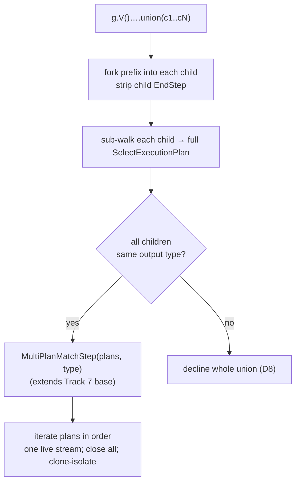

<!-- workflow-sha: d2dfcc2d44fabd3ac76c5fd7620f1e6013675ad9 -->
# Track 8: Union via `MultiPlanMatchStep`

## Purpose / Big Picture
After this track, `union(...)` translates to the **concatenated** result multiset (not a cartesian product) via a `MultiPlanMatchStep` that subclasses the Track 7 boundary base. Children that all agree on boundary output type translate; a child that declines or disagrees on output type declines the whole union (D8). Start-position `union` (no vertex `GraphStep` prefix) declines cleanly.

<!-- Reserved for Move 2 — ADDED/MODIFIED/REMOVED triad. Empty until Move 2 lands. -->

Second slice of the split final track (see plan D8, revised after Track 6). Depends on the boundary base Track 7 extracts — it is what `MultiPlanMatchStep` reuses for projection + shaping.

## Progress
- [ ] Review + decomposition
- [ ] Step implementation
- [ ] Track-level code review
- [ ] Track completion

## Surprises & Discoveries
<!-- Continuous-log. Empty at Phase 1. -->

## Decision Log
<!-- Continuous-log. -->
Canonical decision is plan D8 (revised after Track 6). Open realization choices for this track's decomposition:
- **Child→plan path.** The existing `walkChild` yields a WHERE-predicate adapter, not a full plan (pre-split R2/T4). Union needs each child sub-walked to a full `SelectExecutionPlan`, so the walker/translator gains a child-to-full-translation path distinct from the predicate-adapter sub-walk.
- **Union cache policy.** The plan cache holds a single-plan value today; decide whether a union plan caches and, if so, how the fingerprint keys on the child shapes (RID-bearing shapes bypass the cache per Track 5 R3).

<!-- Reserved for Move 1 — per-track inlined Decision Records. -->

## Outcomes & Retrospective
<!-- Continuous-log. -->

## Context and Orientation
The translator is single-plan end to end today: `TranslationResult` holds one `MatchPlanInputs`; `buildResult` / `buildPlan` are single-plan; and `walkChild` returns a WHERE-predicate adapter rather than a full per-child translation (pre-split R2). Union cannot ride MATCH's `splitDisjointPatterns`, which joins disconnected patterns by **cartesian product** — the opposite of union's concatenation — so translating union that way would silently alter results and break the green-suite invariant. Instead union builds one full `SelectExecutionPlan` per child and concatenates their streams.

Two structural realities the original plan missed (pre-split A3/R2): (1) `GremlinToMatchStrategy` declines any traversal whose start step is not a vertex `GraphStep` (`hasVertexGraphStart`), so start-position `g.union(...)` declines — only `g.V()….union(…)` reaches translation; (2) mid-traversal union children (`g.V().union(out(), in())`) are prefix-relative sub-traversals that carry an `EndStep`. So union recognition forks the traversal prefix into each global child, strips the child `EndStep`, and sub-walks the forked child to a full plan.

`MultiPlanMatchStep` (subclass of the Track 7 boundary base) holds a `List<SelectExecutionPlan>` and a plan index: the first `processNextStart` opens `plans[0].start()`, advances to the next plan only after the current one drains, and keeps exactly one live `ExecutionStream` at a time. An exception in `plans[N]` closes the current stream and re-throws **without** opening `plans[N+1..]`; `close()` closes every child plan including un-run ones; each child runs against an isolated cloned context (union's multi-alias children make context bleed a real hazard — pre-split T5/R3). All children share one `BoundaryOutputType` reused from the base.

**Reference-accuracy note.** The single-plan-pipeline shape, the `hasVertexGraphStart` start gate, and the child-`EndStep` presence rest on the pre-split Phase A reviews (`track-7/reviews/pre-split/`), which read source + grep/javap; PSI was unavailable then. Re-verify the child-traversal `EndStep` presence, `SelectExecutionPlan.start()` fresh-stream semantics, and `BranchStep.getGlobalChildren()` via PSI at this track's decomposition.

## Plan of Work
1. **`UnionStepRecogniser`** (D8): claim a `UnionStep` (a `BranchStep` exposing N global children via `getGlobalChildren()`); for each child, fork the current traversal prefix, strip the child `EndStep`, and sub-walk the forked child against the registry to a full `SelectExecutionPlan`; verify all children agree on output type; decline if any child fails to translate, disagrees on type, or if union is the start step (no vertex prefix).
2. **`MultiPlanMatchStep`** extending the Track 7 boundary base: `List<SelectExecutionPlan>` + plan index; open `plans[0]` lazily; advance on drain; one live stream; exception in `plans[N]` closes the current stream and re-throws without opening `plans[N+1..]`; `close()` closes all child plans incl. un-run; clone/reset isolates each child's context; one shared `BoundaryOutputType` from the base.
3. **Child→full-plan path** in the walker / translator (beyond today's predicate-adapter `walkChild`), reconciling per-child positional parameters and boundary aliases into `MultiPlanMatchStep`.
4. **Union plan-cache policy**: pin whether/how a union plan caches — the fingerprint must key on the child shapes; RID-bearing shapes bypass (Track 5 R3).
5. **Tests**: concatenation-multiset parity vs native; output-type-disagreement decline; start-position decline; N-plan stream lifecycle (one live stream); leak test (all plans closed incl. un-run); exception-stops-advance; clone-isolation across multi-alias children.

## Concrete Steps
<!-- Phase A placeholder. -->

## Episodes
<!-- Continuous-log. Empty at Phase 1. -->

## Validation and Acceptance
- `union(t1, t2, …)` with children agreeing on output type translates to the concatenated multiset (not cartesian); a child that declines or disagrees on type declines the whole union (D8).
- Start-position `g.union(...)` declines (no vertex `GraphStep` start); mid-traversal `g.V()….union(...)` translates.
- `MultiPlanMatchStep` iterates plans in order with one live stream; an exception in plan N does not start plan N+1; `close()` closes every child plan including un-run ones; each child runs against an isolated cloned context.
- The union plan-cache policy is pinned and tested — no cross-shape fingerprint collision; RID-bearing shapes bypass the cache.

<!-- Phase A placeholder for per-step EARS/Gherkin lines. -->

<!-- Reserved for Move 3 — acceptance lines. -->

## Idempotence and Recovery
<!-- Phase A placeholder. -->

## Artifacts and Notes
<!-- Continuous-log (rare). Often empty. -->

## Interfaces and Dependencies
**In scope (new):** `UnionStepRecogniser`; `MultiPlanMatchStep` (subclass of the Track 7 boundary base); the prefix-fork + `EndStep`-strip + child→`SelectExecutionPlan` path; the union cache-policy pin; concatenation / lifecycle / leak / exception / clone-isolation tests.
**In scope (modified):** the walker / translator child-walk (`walkChild` gains a full-plan path); `TranslationResult` / the multi-plan carrier; `GremlinPlanCache` (union keying); `GremlinToMatchStrategy` (register the union recogniser, and broaden the D7 idempotency scan from `YTDBMatchPlanStep` to the Track 7 boundary base so a re-applied strategy detects a `MultiPlanMatchStep` union boundary and does not re-translate).
**Out of scope:** the boundary base extraction and ordered post-process carrier (Track 7); list-shaping terminators + `BoundaryOutputType.LIST` (Track 9); `optional`, edge-bearing OR, variable-depth `repeat` (Phase 2 — design §"Out of scope").
**Inter-track dependencies:** depends on Track 7 (the boundary base `MultiPlanMatchStep` extends). Track 9's full Cucumber re-run validates union end to end.
**Signatures:** `SelectExecutionPlan.start()` (fresh `ExecutionStream` per call); `BranchStep.getGlobalChildren()`; `UnionStep` (TP fork class); `hasVertexGraphStart` (`GremlinToMatchStrategy` start gate); the Track 7 boundary base (projection + `ResultShaping` + `ExecutionStream` lifecycle).

## Invariants & Constraints
<!-- Combined per-track invariants + constraints (conventions-execution.md §2.1 §14).
Added by workflow migration (#1145). Strategic invariants/constraints for this track remain
in implementation-plan.md § High-level plan (Architecture Notes) and this track's ## Decision
Log — the conservative migration retained the plan Architecture Notes rather than folding them here. -->

## Base commit
<!-- Phase B records the HEAD SHA here at session start; Phase C reads it to compute the
cumulative track diff (conventions-execution.md §2.1 §15). Added by workflow migration (#1145). -->
