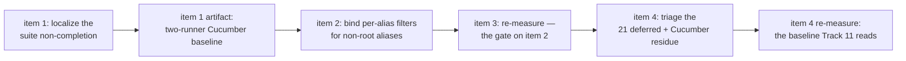

<!-- workflow-sha: d2dfcc2d44fabd3ac76c5fd7620f1e6013675ad9 -->
# Track 9: Cucumber suite completion + the dropped per-alias filter

## Purpose / Big Picture
After this track both TinkerPop feature runners — `core`'s `YTDBGraphFeatureTest` and the `embedded` module's `EmbeddedGraphFeatureTest` — complete with the translator on, each runner's failure set is a committed artifact rather than a promise, and the dropped per-alias filter that silently mistranslates every multi-hop traversal is fixed. Today none of that holds: the `core` suite does not terminate with the strategy enabled, the `embedded` runner has never been measured on this branch at all, and a filter on a non-root alias is discarded without declining, so the wrong answer ships silently.

**Under item 1's escalation branch the completion half of that promise is deferred, not dropped (T32).** If the single-fork stall is not localized within the trigger's budget, each runner's baseline is published per partition instead, the filter fix and the committed failure sets still land, and single-fork completion moves to a follow-up carrying the diagnostic artifact. The escalation branch in `## Plan of Work` item 1 lists every document that must be amended when that happens.

<!-- Reserved for Move 2 — ADDED/MODIFIED/REMOVED triad. Empty until Move 2 lands. -->

First half of the split final track (inline replan, 2026-08-03 — see `## Decision Log` DR-S1). The list-shaping terminators, the `RecognitionContext` seam, and the JMH harness moved to **Track 11**, which runs after this one and depends on the baseline this track produces.

## Progress
- [x] Review + decomposition
- [ ] Step implementation
- [ ] Track-level code review
- [ ] Track completion
- [x] 2026-08-03T02:57Z [ctx=info] Review + decomposition complete. Predicted complexity tag `high`; `max(step tags)` over the six-step roster is also `high`, so the reconciliation finds no divergence and no missed strategic reviewer is owed.

## Surprises & Discoveries
<!-- Continuous-log. Empty at Phase 1. -->

- **A live multiset divergence on union suffixes, found while reviewing a different track (Track 11 adversarial A1, cert V1 CONSTRUCTIBLE).** `union(...).range(2,5)` and `union(...).limit(3)` already return a different multiset translator-on than translator-off at `54cc0a708f`. The reviewer measured it rather than deriving it. This is not Track 11's defect to introduce — it exists now, in Track 8's union-suffix surface, and `QUERY_GREMLIN_TO_MATCH_TRANSLATOR_ENABLED` defaults to true, so it ships at merge. **Step 5 owns it under the rule already written into `## Plan of Work` item 4:** a translator-caused silent-wrong-multiset defect on a recognised shape takes the fix exit or the decline exit before track completion, or the track records an explicit user-approved waiver. It is not deferrable with a named destination the way a crash-shaped defect is. Two consequences beyond step 5: the finding was reached through `GremlinStepWalker.java:206`, so step 5's diagnosis starts from the post-union suffix allow-list rather than from the per-alias filter family; and Track 11 item 4 proposes widening that same allow-list with `tail` and `fold`, which would extend a surface that is wrong today.
- **The parallel Phase A panel for Track 11 caught a fourth vacuous-acceptance shape** (technical T4): `supportsListShaping()` defaults to `true`, which inverts to `false` under a Mockito mock, so every combinator-child decline assertion in Track 11's item 5 can pass without exercising the decline. Phase A on this track caught two such shapes and this track's own step-1 review caught a third. Four instances across one branch is a pattern rather than a run of bad luck, and the common factor is an acceptance criterion whose expected value is "nothing happened" — which any misconfigured fixture also produces. Whatever Track 11's Phase A does with T4, the durable lesson belongs in the final design: a decline assertion needs a positive control of the same shape, measured, not derived.

## Decision Log
<!-- Continuous-log. -->

- **DR-S1 — the final track splits, and the correctness fix goes first.** Phase A's risk review found that the track's headline gate could not be evaluated at all (the feature suite does not complete with the translator on) and that the resulting track carried an unsized engine-level diagnosis in front of a shared-planner correctness fix in front of a four-recogniser feature. The split boundary was already drawn in the file: this track's work shares **no file** with the terminator work — it touches `MatchPatternBuilder` / `MatchExecutionPlanner` / `GqlMatchPatternAssembler` and the equivalence suites, while Track 11 touches `RecognitionContext` / `WalkerContext` / `UnionStepRecogniser` / `ListShapingOp` and the walker registry. Coupling runs one way, Track 11 wanting a base where this track has landed, which is what a stacked-diff series is for. What the split costs is one extra PR boundary and a second full-suite run; what it buys is that a correctness fix on the shared MATCH planner path is reviewed on its own merits rather than arriving in the same diff as four new recognisers. It also keeps this branch off a run of over-threshold tracks. **Two figures, and the distinction is load-bearing (R15, R19).** Track 8 was past the ~4,000-line review-burden threshold on **code alone** (38 files / 5,814 insertions, against 20 / 3,466 under `docs/adr`). Track 10 was past it on the **full non-generated figure** — 5,168 insertions over 36 files as step 9 measures it, not the 5,331 unfiltered count, because three of its files are hand-written code living under the excluded `internal/core/sql/parser/` path (`SQLSuffixIdentifier.java`, `SQLWhereClause.java`, `SQLSuffixIdentifierTest.java`) — while its code half was 2,718 against 2,613 of `_workflow/` prose. A combined Track 9 would have been past it on both. The code-only figure is the right *comparison* number for the question DR-S1 answers: whether a correctness fix on the shared MATCH planner is reviewable on its own merits. The plan's `~8–14 files` Scope line is a different quantity again — a file count covering the code plus the one baseline artifact — so it corroborates the expectation without being either line figure. It is **not** what the gate reads: `track-code-review.md` step 9's `--shortstat` excludes only generated sources and the generated parser, so `docs/adr/**` and test code both count. This track therefore expects a small code half against a `_workflow/` half sized like its predecessors, and the Phase C burden check will read their sum. Track 10's `plan/track-10/reviews/` alone totals 3,154 lines, and this track's Phase A output already stands past 1,700 with no step file, episode, or baseline artifact yet written.
- **Recompute the measured baseline whenever anything moves the measured behaviour.** Track 10's central discovery, generalized here because this track is where it bites. Track 10's step-1 inventory ran before the 2026-08-02 rebase; the rebase restored three TinkerPop compliance executions the branch had never run, and a Phase C handoff then read HEAD against that stale list and concluded the track had introduced 22 failures, where a control at the post-rebase base measured 300 against 21 at the tip. The rule Track 10 wrote states the trigger as a rebase. The trigger is broader: **this track's own item 2 moves the measured behaviour too.** A Cucumber baseline taken before the filter fix is not comparable to one taken after, so item 3 re-measures immediately after item 2 lands. Item 4 moves the measured behaviour again — it fixes what belongs to this track — so the rule applies to it too: **the number handed to Track 11 is item 4's, taken after this track's last fix.** Item 3's measurement is the gate on item 2, not the handoff.
- **Enumerate before declaring green.** Inherited from Track 10's acceptance criterion, which is the clause that let it close honestly after its title became unreachable. This track never declares a suite green on an unenumerated run; every criterion below reads against a recorded artifact.
- **A published number records its SHA and comes from an invocation that compiled.** Added by Phase A's post-split technical review (T22). The recompute rule above watches for a rebase and for this track's own fixes; it does not watch for a gate that cannot see either. `./mvnw surefire:test@<id>` invokes the mojo directly, runs no lifecycle phase, and therefore measures whatever was last compiled — which would have made items 3 and 4 publish two copies of the pre-fix number while looking like a before/after pair. Every baseline this track publishes names the commit SHA it was taken at and comes from a command that compiled in the same run.
- **The trigger list runs to track completion, not to the end of the Plan of Work (R8).** The complement to the rule above. Any **qualifying** commit landing after a baseline run and before track completion re-triggers that run — qualifying meaning one that `git log <sha>..HEAD -- core embedded` reports, which is the path-prefix form the acceptance criterion states and the clause that makes the rule terminate (A4). Phase C review fixes qualify, and they are the ones that historically slipped past; the `docs/adr/**` commits that record the artifact and the episode do not, or the rule would re-trigger on its own output. Track 10's stale dispositions artifact is the worked example (see `## Validation and Acceptance`). The recovery is the re-run itself, recorded in `## Idempotence and Recovery`. Track 11 inherits the reciprocal obligation: before reading the baseline it confirms the recorded SHA is an ancestor of its own base with no intervening `core` commit, and re-takes the measurement otherwise.
- **The bisect is delta-debugging over subsets, and the budget is sized for it (R14).** Every one of the seven upstream directories completes alone, so the minimal stalling set has at least two members. A growing-prefix scan answers "how many directories" and not "which ones", and isolating a non-adjacent interacting pair from a stalling prefix runs on the order of twenty attempts, each costing a kill timeout of 7–15 minutes. A six-attempt budget would have selected escalation almost regardless of how the search went, turning the exception path into the expected one while its document amendments stayed written as an exception. The choice recorded here is to size the budget to the search rather than to redefine escalation as the plan: **two working days, or twenty bisect runs.** Item 1 states the search shape to match.
- **The kill-switch is set as a plain `-D` property, never inside `-DargLine=` (R9).** The two runners answer the same technique differently. `core/pom.xml` declares `<argLine>` in `<properties>` (`:36-73`) where a CLI `-DargLine=` **replaces** the whole block — `-ea`, the 4 GB heap, the storage tuning, and fourteen `--add-opens` / `--add-exports` — so the A/B stops being one flag apart. `embedded/pom.xml` declares `<argLine>` inline in the surefire `<configuration>` (`:419-444`), where plugin configuration beats the user property and a CLI `-DargLine=` is **inert**, so anything smuggled inside it never reaches the fork and the off-arm silently runs with the translator on. `core` is protected by accident — 1930 green in 17 s is a loud signal the off-arm really was off — and `embedded`, the half with no known-good number, is not. The pre-split risk review already hit this: its run 3 set the switch through `-DargLine=` and run 4 through a plain `-D`, and only run 4's number was kept.

## Outcomes & Retrospective
<!-- Continuous-log. Empty at Phase 1. -->

- [x] Technical: PASS at iteration 3 (18 findings T19–T36, 18 accepted, 0 rejected). Post-split panel; files `technical-iter4.md`, `technical-gate-verification-iter5.md`, `technical-gate-verification-iter6.md`. Iteration 2 returned FAIL with three REGRESSION verdicts, all from fixes that traded one wrong statement for another. Three findings changed the track's substance rather than its prose: T21 established that GQL builds node-only patterns and never exhibited the defect, retiring the GQL witness deliverable; T29 established that `MatchPatternBuilder.aliasFilters` is GQL-only and that the translated path's per-alias `WHERE` does not exist until after `build()`, which disqualified two of the three candidate fix sites as originally written; T22 established that the pinned `surefire:test@<id>` gate compiles nothing, which would have made items 3 and 4 publish the pre-fix number twice. **Reference-accuracy caveat:** PSI was unavailable for all three iterations — `steroid_execute_code` timed out on kotlinc cold-start in iterations 1 and 2, and in iteration 3 `steroid_list_projects` showed the IDE open on a different project than this working tree. Every symbol result is grep plus an end-to-end read of each returned site; "no other caller" negatives are bounded, not established.
- [x] Risk: PASS at iteration 3 (18 findings R8–R25, 18 accepted, 0 rejected). Post-split panel; files `risk-iter2.md`, `risk-gate-verification-iter3.md`, `risk-gate-verification-iter4.md`. Iteration 4 closed at the cap with no blocker outstanding; the five residual items — R23, R24, R25, R20's direction word, and **R17's unqualified re-trigger wording in `## Decision Log` and `## Idempotence and Recovery`** (which the cap-close first left standing and the adversarial pass then caught as A4) — were applied without a further reviewer pass, which the cap-3 rule permits and which is recorded here rather than left implicit. Three findings changed the track's substance: R9 found that `core` takes its fork JVM from an `<argLine>` **property** a CLI `-DargLine=` replaces wholesale while `embedded` declares it **inline** where a CLI property is inert, so the same A/B technique mangles one runner's JVM and silently leaves the translator on in the other — and `embedded` is the half with no known-good number to expose it; R8 found that the handoff baseline goes stale by construction because Phase C review fixes land after the last Plan-of-Work item, with Track 10's `a0b3e96e15` → `5db5b41a3d` → `7c77a4544f` sequence as the worked example; R13 found that `mergedTargetFilter`'s dead class branch is a live class-drop on every translated `not()` under polymorphic mode, which this track now fixes in the same step. Two decisions the orchestrator made where the reviewer offered a choice: **size the bisect budget to a subset search** (twenty runs) rather than accept escalation as the planned path, and **fix** the NOT-path class drop rather than disposition it out of scope. Same PSI caveat as the technical panel.
- [x] Adversarial: PASS at iteration 3 (7 findings A1–A7, 7 accepted, 0 rejected). Narrowed to track realization per D9; files `adversarial-iter1.md`, `adversarial-gate-verification-iter2.md`, `adversarial-gate-verification-iter3.md`. Model pinned to Fable 5 per D14 (`design_gate=yes`). Closed at the cap with no blocker outstanding; A7 was applied without a further pass. **A1 was the blocker and it changed the track's shape:** the split had moved the sizing problem into item 4 rather than solving it — "fix what belongs to this track" over 21 deferred failures plus unknown residue, with no rule, no bound and no valve, which is the same open bucket that made Track 10 the branch's largest track at 483 repairs. Item 4 now leads with dispositioning, carries an explicit fix-vs-defer rule, and has an ESCALATE trigger symmetric with item 1's. A2 found the deferral path would ship live invariant violations: the kill-switch defaults on, no track follows this one, and Track 10's dispositions record translator-on runs only, so nobody could attribute the twelve non-dropped-filter defects — item 4 now runs an off-arm control and every disposition names a destination. A3 found option 3's SQL-safety claim holds in only one of two loop orderings. Cross-track-episode reality held on every particular checked, and the plan-cache and kill-switch violation scenarios came back infeasible. **Two acceptance shapes were caught passing vacuously** — the `not()` shape (R16) and the `where()` fragment twice over (A6, then A7) — the second time only because the reviewer built a scratch harness and measured rather than deriving from planner arithmetic. That is the recurring failure mode of this Phase A: reasoning about root selection from source is unreliable, and the watch-it-fail gate is what catches it. Same PSI caveat as the other two panels.

## Context and Orientation

**The feature suite does not complete with the translator on, and the strategy is the cause.** Measured at `3148ac14e1`, same command, one flag apart:

| Run | Result |
|---|---|
| `./mvnw -pl core -o surefire:test@gremlin-feature-compliance-tests` (branch default, translator on) | no result — killed at 15 min, 7 min, and 15 min across three attempts; zero scenarios reported, no per-feature progress output |
| the same plus `-Dyoutrackdb.query.gremlin.toMatchTranslator.enabled=false` | **1930 scenarios, 0 failures, 14 skipped, 17.1 s** (20.5 s wall), BUILD SUCCESS |

Two independent artifacts corroborate the on-side. Track 10's three full-suite runs reached this execution (they carried `-Dmaven.test.failure.ignore=true`) and each recorded `Tests run: 0` followed by `The forked VM terminated without properly saying goodbye. VM crash or System.exit called?` — at Track 10's base `f007749249` and at its tip. In `/tmp/track10-final-verify.log:4713-4748` the run reaches `[INFO] Running GQL Match Support` and dies there after 31:35. That execution has **no row** in `plan/track-10/core-compliance-failure-dispositions.md`'s per-execution table, so Track 10 closed on a `BUILD FAILURE` nobody read. The feature files, the runner, and the glue are byte-identical to `develop` — no branch commit touches them — so the kill-switch A/B is the whole explanation.

**The `Running GQL Match Support` line marks no stall position (T19).** Both observed stalls print exactly one `[INFO] Running` line — `GQL Match Support` — before going silent, and the **successful** translator-off run prints the identical line at the same position before reporting `Tests run: 1930` 17 s later. The JUnit47 provider emits one `Running <name>` per JUnit test class and cucumber-junit exposes the whole suite as one class, so the line carries no positional information. Neither stall has been located. The second half of the discarded hypothesis is measured and green too: the local feature directory alone, translator **on**, reports 42 scenarios / 0 failures in 5.4 s. `GQL Match Support` under the translator is not the stall.

**The suite is measurable in pieces, and the pieces sum exactly.** Run per upstream feature directory with the translator **on**, every directory completes in seconds: 1888 upstream scenarios, 42 failures (`filter` 10, `integrated` 7, `map` 22, `sideEffect` 3), plus 42 local scenarios green, summed wall time under 75 s including seven Maven starts. 1888 + 42 = 1930 with the same 14 skips (6 in `map`, 8 in `sideEffect`) the single-fork translator-off run reports. No scenario hangs in isolation, so the failure is a property of running them in one JVM — accumulated state, a leak, or a deadlock across scenarios. The real question is what accumulates inside one fork, and localizing it is this track's first job. The per-directory table is the `core` half of the baseline artifact everything downstream reads.

**The dropped per-alias filter.** On the translated path a per-alias `WHERE` reaches only the alias the planner selects as root; every other alias's filter has no consumer and is silently discarded. Measured on the four-vertex modern graph (marko -knows-> vadas, josh; -created-> lop) with the strategy on: `g.V(marko).out().hasId(vadas)`, `g.V(marko).out().has(name, vadas)`, `g.V(marko).out().hasLabel(software)`, and `g.V().has(name, marko).out().has(name, vadas)` each return 3 rows where native returns 1. `g.V().out().hasId(vadas)` and `g.V(marko, josh).out().hasId(vadas)` return the correct single row by accident: a pinned RID collapses the target alias's estimate, so that alias wins root selection and `addPrefetchSteps` / `createSelectStatement` read its filter straight from `aliasFilters`. All six translate — exactly one boundary step, no decline — so the wrong answers are silent.

Mechanism, verified against live code by Phase A's technical review (pre-split certificate C11, re-verified post-split as C34/C39/C48): `MatchEdgeTraverser` reads the target constraint from the pattern item's AST rather than from `aliasFilters`, through **three** reads — `item.getFilter().getFilter()` (`:476`), `.getClassName()` (`:481`), and `.getRid()` (`:486`, whose `matchesRid` result is one of three conjuncts in the accept test). Positive path items are built with neither a `WHERE` nor a class at **two** sites: `MatchPatternBuilder.addEdge`'s `toFilter` (`SQLMatchFilter.fromAliasAndClass(toAlias, null)`, `:148`) and `MatchEdgePathItems.vertexMethodItem` (`:84`, same alias-only filter, a different file in `sql/parser`). `EdgeHopRecogniser` routes every `outE(L)[.has(…)].inV()` shape through `addEdgeAsNode`, which uses the second site, so a fix confined to the first leaves the whole edge-as-node family unbound (T24). The one routine that would populate the slots, `rebindFilters`, walks `matchExpressions`, which is empty on the additive translator path because the pattern arrives pre-built.

The RID slot needs no population (T27): the translator lowers `hasId` into an `@rid` / `@rid IN` term in `aliasFilters`, and `promoteStaticRidsFromFilters` leaves that term in place while copying it into `aliasPinnedRids`. `SQLMatchFilter.fromAliasAndClass` never populates `rid`, so it stays null and `matchesRid` passes. Binding the `WHERE` and the class is sufficient.

**The two candidate fix sites differ by an entire query language.** Three entry points construct the planner: `SQLMatchStatement:191,201` (SQL `MATCH`), `GremlinToMatchStrategy:486` (the translator), and `GqlMatchStatement:88` (GQL). Only the last two use `MatchPatternBuilder` — a repository-wide grep over `core/src/main/java` returns eleven consumers and `SQLMatchStatement` is not among them. So a builder-side fix at `MatchPatternBuilder` moves Gremlin and GQL. A planner-side fix at `rebindFilters` — a private method of `MatchExecutionPlanner` — additionally moves SQL `MATCH`.

Two corrections to that blast-radius picture, both from the post-split technical review (T23). First, `rebindFilters` has two call sites but only one is shared: `:2064` inside `createPlanForPattern` is reached by all three front-ends, while `:5677` is the last statement of `buildPatterns`, which returns early whenever `this.pattern != null` — precisely the pre-built-pattern condition both additive paths set — so `:5677` is SQL-`MATCH`-only. Second, `SQLMatchStatement` declares its **own** `private void rebindFilters(Map<String, SQLWhereClause>)` at `:232`, called from its `buildPatterns()` at `:226`, walking the statement's own `matchExpressions` before the planner is constructed. An implementer grepping the name gets two declarations across two files; this track touches neither the SQL declaration nor `:5677`.

The planner-side option is what keeps `rebindFilters`' original purpose intact, since its `:2064` call site exists to push `detectNotInAntiJoin()`'s stripped `NOT IN` conditions back into the item AST and a build-time pre-population on the empty-`matchExpressions` path would leave that push-back still never running. The choice is a blast-radius decision, not only a purity one, and `## Plan of Work` item 2 makes it explicitly.

**GQL does not exhibit this defect and cannot witness the fix (T21).** `GqlMatchVisitor extends GQLBaseVisitor<Void>` and overrides exactly one rule, `visitNode_pattern` (`:50`), accumulating a flat list of node filters; the grammar carries `edge_pattern` alternatives but nothing consumes them. `GqlMatchPatternAssembler.add` calls `builder.addNode(…)` and nothing else (`:39`) — no `addEdge`, no `addEdgeAsNode`. A pattern with nodes and no edges reaches the planner as N disconnected components, which it splits into sub-patterns and combines by Cartesian product; every alias is its own root, every root's filter is read from `aliasFilters`, and the path-item filter this defect drops never exists. GQL stays in scope as a **guard on the shared mutators**, and not because any of item 2's three sites changes its IR (T31). None of them does: GQL calls only `addNode` and `build()`, so a construction-site change is unreachable from it; its `Pattern` holds nodes and zero edges, so an edge-item merge inside `build()` iterates an empty collection and returns the same deep copy; `mergedTargetFilter`'s only caller is `buildNotExpression`, which GQL never invokes; and `rebindFilters` is a no-op for GQL because the 3-arg constructor sets `matchExpressions` to an empty list. What GQL *does* share is `SQLMatchFilter.setFilter` and `fromAliasAndClass`, which `GqlMatchVisitor` builds through and which item 2 lists in "Signatures" — a fix that changes those mutators' semantics rather than its own call site would reach GQL. The prettyPrint pin exists to catch that, and under all three enumerated sites it is expected to pass as a no-op. (Separately, `MATCH (a:Person)->(b:Post)` currently parses and silently yields a Cartesian product — a pre-existing GQL gap this track does not own.)

**What Track 10 hands over.** Not a green `core` run — an enumerated one. 21 `gremlin-process-compliance-tests` failures survive, each failing byte-identically at Track 10's base, all deferred here with per-class dispositions in `plan/track-10/core-compliance-failure-dispositions.md`. Nine carry the dropped-filter signature (`HasTest` ×5, `AndTest` ×2, `WhereTest`, `SelectTest`); the other twelve are separate defects — `ValueMapTest` ×2 and `PropertiesTest` ×2 (`ClassCast` on boundary value shaping), `MeanTest` / `SumTest` / `GroupCountTest` (numeric conversion and an NPE), `GroupTest` / `ElementMapTest` (cardinality), `OrderTest` (ordering divergence), `PartitionStrategyProcessTest`, `SubgraphStrategyProcessTest`. The dispositions file supersedes Track 10's step-0 `core-test-failure-inventory.md`, which measured a pre-rebase suite set and says so itself.

### Clarifications
- **Reference accuracy in this track file is file-and-grep-based, not PSI.** mcp-steroid is reachable and its open project matches this working tree, but `steroid_execute_code` times out on this repository (cold kotlinc exceeds the MCP call limit), verified repeatedly. Declaration-level reads are reliable; "no other caller" / "only reader" negatives are not established. Re-verify through PSI at decomposition if the IDE recovers.
- **A Pre-Flight clarification written earlier the same day was wrong and is withdrawn.** It retired Track 10's "`core`'s Cucumber runner is inert" discovery on the grounds that develop's `9b9dfa20fd` gave the runner its own unfiltered surefire execution. The wiring claim is correct — `gremlin-feature-compliance-tests` runs `YTDBGraphFeatureTest` in the `gremlin-compliance-suites` profile (activated on `!test`) with `failIfNoTests=true` and no group filter, while `sequential-tests` excludes `**/gremlintest/**` — but the conclusion drawn from it was not. The runner reports zero scenarios for a different reason than Track 10 diagnosed, and the refuting evidence was already on disk when the clarification was written.
- **No CI signal backs any gate here.** Track 10's `[run-ci]` draft-PR token was reverted with its withdrawn Plan-of-Work item 4, so PR #1038 still reports `skipping` on every check. Every gate is verified locally, on one machine.
- **The `embedded` runner cannot be measured with a bare `./mvnw -pl embedded test`.** `-pl embedded` leaves `core` out of the reactor, so `youtrackdb-core:0.5.0-SNAPSHOT` resolves from the local repository — on the branch machine a jar installed 2026-07-02, predating Tracks 7, 8 and 10 and item 2's filter fix. The `core` **test**-jar is equally load-bearing: `EmbeddedGraphFeatureTest` reads its feature files and `GraphFeatureWorld` from `classpath:/com/jetbrains/youtrackdb/internal/core/gremlin/gremlintest/features`, so a stale install also means stale local features, including the `GQL Match Support` feature where the `core` runner stalls. A future reader must not mistake a run against an installed jar for a run against the branch.
- **`MatchStatementExecutionTest` is the SQL `MATCH` regression net and costs about 32 minutes for 159 test methods.** It is unowned since Track 10's item 4 was withdrawn. If item 2 takes the planner-side fix, that cost becomes a gate rather than incidental.

## Plan of Work
1. **Localize the suite non-completion and record the baseline.** Reproduce the A/B above, then find why the single-fork run does not terminate while every per-directory run does. The per-directory identity (1888 + 42 = 1930, same 14 skips) rules out any single pathological scenario, so the diagnostic **bisects by fork content, not by feature**, and it searches **subsets rather than a growing prefix** (R14): every directory completes alone, so the minimal stalling set has at least two members among seven, and a prefix scan tells you how many it takes without telling you which. Run `-Dcucumber.features=` over subsets, delta-debugging down from a stalling set rather than up from an empty one. Capture `jcmd <pid> Thread.print` and `jcmd <pid> GC.class_histogram` from the stalled fork **before** killing it — a thread dump discriminates deadlock from leak, and neither is distinguishable from the outside. Two instrumentation options exist and neither is unconditional, so pick per run rather than adding both by default (R10, R22). A surefire `forkedProcessExitTimeoutInSeconds` / `forkedProcessTimeoutInSeconds` bound makes a stall self-terminating, but it also kills the fork this sentence says to attach `jcmd` to — use it on unattended bisect runs and **not** on the run intended to yield the diagnostic. `-XX:+HeapDumpOnOutOfMemoryError` with an explicit `-XX:HeapDumpPath` costs nothing to carry, but it cannot fire on the shape this track actually diagnoses: `grep -c OutOfMemoryError` over Track 10's three logs returns zero, so a live-but-unresponsive fork produces no dump. Its value is bounding the *other* hypothesis, not capturing this one. Record the per-directory table as a committed artifact under `plan/track-9/`, carrying the excerpts the claims above rest on (the `Running` / `Tests run:` / fork-death lines from both runners, each per-directory count with its source command) so no criterion depends on a `/tmp` log that a reboot destroys (T28). Do the same for the second runner: `EmbeddedGraphFeatureTest` in the `embedded` module gets its own translator-on/off A/B, its own completion check, and its own failure set, landing in the same artifact as a clearly labelled second half. The `embedded` half is **unsized** — no measured A/B exists for it and the `core` numbers above do not transfer — so size it in the step that first runs it. The two halves together are the baseline items 3 and 4 read and the one Track 11 inherits.

   **ESCALATE trigger, with a boundary (T26).** Escalate rather than absorbing an undiagnosed engine-level fault — a suite that cannot complete is not a hardening problem, and Track 10's risk review produced exactly this shape for exactly this reason. The trigger fires when the bisect has not narrowed the stall to a fixable defect within **two working days or twenty bisect runs**, whichever comes first (the budget is sized to a subset search — see `## Decision Log`), **and** the committed artifact carries either a thread dump and heap histogram from a stalled fork, or a recorded account of what was attempted and why it returned nothing.

   **The evidence conjunct is satisfiable-or-waived, deliberately (R10).** Requiring the diagnostic outright would let the trigger be blocked by its own precondition, leaving no exit from exactly the unbounded cost it exists to bound. Three failure modes are live, none hypothetical: `jcmd` needs a pid, and Track 10's forks *died* (`Tests run: 0`, then `The forked VM terminated without properly saying goodbye` after 31:35) rather than hanging and waiting; `Thread.print` needs the target to reach a safepoint, so a thread spinning without safepoint polls or an already-stuck VMThread leaves `jcmd` hanging with no output and no error; and `GC.class_histogram` forces a full GC, which on a 4 GB fork in a collection spiral either takes minutes or clears the accumulation being measured. A waived diagnostic still escalates, provided the attempt and its failure are recorded. Machine context for whoever inherits this: the host has 62 GB with 45 available against a 4 GB fork heap, and `grep -c OutOfMemoryError` over Track 10's three logs returns zero, so an OS OOM-kill is not the explanation and a live-but-unresponsive fork is the likely shape — which is the shape `jcmd` handles worst. The same boundary applies to the `embedded` half.

   **The escalation branch (T26).** If item 1 escalates, the track does not stall: the seven-invocation per-directory run becomes `core`'s published baseline, and `embedded`'s fallback is whatever partition item 1 finds it runs in. Items 3 and 4 re-measure in those shapes and acceptance criteria 1 and 2 relax to "completes per partition with the recorded failure set". The single-fork completion goal moves to a follow-up with the diagnostic artifact attached.

   **What the escalation branch costs Track 11, stated rather than discovered (R11).** Seven Maven starts is seven fresh JVMs, so a partitioned baseline observes **no cross-scenario accumulation** — and that is precisely the defect class Track 11's `ListShapingOp` buffers can introduce. Its own `## Context and Orientation` records two mechanisms: `applyListShaping` calls `op.apply(…)` afresh on every open across three routes, so an op allocating its buffer outside the returned iterator replays the first pass's payloads on the second; and `AbstractStep.clone()` copies `shaping` by reference while `resetLifecycleForClone()` deliberately does not touch it, so two clones share the same op instances. Both live in `fold` and `tail`, the two ops that need buffers, and both need many scenarios in one fork to surface. Track 11's item-5 re-arm and clone unit tests are the first net; the in-fork Cucumber run is the net that catches what those tests did not anticipate, and escalation removes it. The compensating gate Track 11 inherits: **one single-fork run of the largest partition (`map`, 811 scenarios) with the translator on**, alongside the item-5 tests. This clause joins the must-amend list below.

   **What the branch must amend, and what already tolerates it (T32).** Track 9's `## Interfaces and Dependencies` dependency line and `implementation-plan.md`'s Track 11 entry both say "Track 9's post-fix baseline", which a per-directory artifact satisfies with no edit. Three documents hard-code completion and **must** be amended when the branch is taken: this track's `## Purpose / Big Picture` (see its escalation clause), the acceptance criterion "**Both Cucumber runners are in scope, not just `core`'s**" below (named rather than numbered — R13's inserted criterion already shifted the ordinals once, R20), and `plan/track-11.md` at lines 5, 9, **52**, **69**, 87 and 104 — its Purpose, its Track 9 dependency sentence, its track diagram's item-6 node, its Plan-of-Work item 6, its headline acceptance criterion ("the full TinkerPop Cucumber suite **completes** and shows no regression"), and its `## Interfaces and Dependencies` line. Line 69 is the one that matters most and the one the first draft of this list missed (T35): it is the item that *performs* the run, and it names the single-fork `gremlin-feature-compliance-tests` execution, which under escalation is exactly the invocation that does not terminate — it must be replaced by the partition shape item 1 published. The other five are statements about the run. Left unamended, Track 11's headline criterion becomes unmeetable with nothing pointing at the relaxation. (Unconditionally, and independent of this branch: `plan/track-11.md:60` pins a bare `surefire:test@gremlin-feature-compliance-tests` for its iteration loop, which the `## Decision Log` compile-in-the-same-run rule above rejects. That belongs to Track 11's own Phase A panel; it is recorded here so the panel inherits it.)
2. **Bind per-alias filters for non-root aliases.** Fix the defect above. **Name the site and its blast radius explicitly** before writing code — and note up front that the blast radius is the *second* constraint on the choice, not the first: two of the three sites the previous round listed do not have the per-alias `WHERE` available where they run (T29, below). Of the sites that do, the walker-side one is translator-only and the planner-side one (`rebindFilters` at `:2064` — not `:5677`, which the pre-built-pattern early return skips) additionally moves SQL `MATCH`.

   **Where the data is, and where it is not (T29).** This constrains the site choice more than the blast radius does. `MatchPatternBuilder.aliasFilters` is written in exactly one place — `addNode`, and only when the caller passes a non-null `where` (`:110-112`). Every translator caller passes null: `WalkerContext.addNode` is `patternBuilder.addNode(alias, className, null, false)` (`:411`), `SubTraversalPredicateAdapter.addNode` the same (`:247`), and `appendFrom` copies an already-empty map. The one non-null-`where` caller in `core/src/main/java` is `GqlMatchPatternAssembler:39` — the front-end with no edges and no defect. **The builder's `aliasFilters` is GQL-only.** On the translated path the post-hop predicate lands in `WalkerContext.aliasFilters` through `ctx.putAliasFilter` (`HasStepRecogniser:167-169`) and reaches a map anyone can read only at `GremlinStepWalker.buildResult:471-477`, which merges it into `finalAliasFilters` **after** `ctx.patternBuilder.build()` has already run at `:469`. So a merge inside `build()` would see null for every alias and — under the skip rule below — silently change nothing, and a merge at construction time runs before the `has()` step has been walked at all.

   The class half is the opposite case: `WalkerContext.addNode` does forward `className` and `HasStepRecogniser:162` re-types the boundary through it, so `aliasClasses` is populated inside the builder and available at `build()`. Only the `WHERE` forces the choice of site.

   **The binding is a merge, not a rebind (T20).** `rebindFilters`' current body is an unconditional overwrite (`item.getFilter().setFilter(aliasFilters.get(alias))`), and `SQLMatchFilter.setFilter(null)` *clears* an existing clause rather than leaving it alone. That is safe on the SQL path, where `aliasFilters` was built from those very expressions, and unsafe on the additive path: walking the `Pattern`'s edge items visits **edge** path items too, `MatchEdgePathItems.edgeMethodItem` puts the edge `WHERE` on the edge alias's filter, and that clause lives nowhere else — `EdgeHopRecogniser` records it through `putEdgeFilter` into `WalkerContext.edgeFilters`, which is observability-only and never reaches `MatchPlanInputs.aliasFilters`. A naive rebind would null every `outE(L).has(p, v).inV()` predicate and reintroduce this track's own defect class on a different filter. Whichever site is chosen must therefore: bind **class and `WHERE`**, AND-compose with whatever the item already carries, and skip any item whose alias has no entry in the map being bound from.

   `MatchPatternBuilder.mergedTargetFilter` (`:377-402`) is the right template for the `WHERE` merge and for copy-not-replace, and **not** for the class (T30). It reads `aliasClasses` at `:381` but consumes the value only inside the `else` branch, at `:386`; every positive path item on the additive path already carries a filter (`addEdge:161`, `MatchEdgePathItems:84`), so the `existingItemFilter.copy()` branch always wins and the class is never bound. Reusing it unchanged produces exactly the `WHERE`-only outcome the previous paragraph forbids. The chosen site must set the class on the copied filter too. This is load-bearing rather than cosmetic: `HasStepRecogniser:160-165` adds a `@class = 'L'` term to the `WHERE` **only** when `!ctx.polymorphic()`, so under polymorphic mode the class *is* the whole constraint and a `WHERE`-only fix loses `g.V(marko).out().hasLabel(software)` completely.

   **The three candidate sites, re-cast against T29.** Two of the three the earlier round listed do not have the data at the site; the enumeration is corrected rather than dropped, because the implementer needs to know why:

   1. **A merge inside `MatchPatternBuilder.build()` over the assembled `Pattern`'s edge items** — viable only if the merged map is threaded in explicitly (a `build(Map<String, SQLWhereClause>)` overload). As stated in the previous round it binds nothing.
   2. **A post-`build()` pass in `GremlinStepWalker.buildResult`** over `ir.pattern()`'s edge items, using `finalAliasFilters` and `ir.aliasClasses()` — the first point at which both maps exist. Confined to the translator; does not move GQL or SQL `MATCH`.
   3. **The planner-side site, `MatchExecutionPlanner.rebindFilters` at `:2064`** — already has both maps (`MatchPlanInputs.aliasFilters()` is `finalAliasFilters` post-merge) and is reached by all three front-ends. Both facts are about the **call site**, not the loop body: `rebindFilters` iterates `matchExpressions`, which `MatchPlanInputs`' compact constructor normalises to an empty list on both additive paths, so its existing loop runs zero times there (T34). A planner-side fix must therefore walk `pattern`'s edge items in a **second** loop at the same call site rather than extend the existing one. That sharpens the trade-off: a separate pattern walk touches SQL `MATCH` only by proximity, while editing the existing loop touches it for real and carries the `MatchStatementExecutionTest` gate cost. **The proximity claim holds in only one of two orderings, so the walk must be gated (A3):** on the SQL path `aliasFilters` is non-empty and the pattern's items are the statement AST, so a second walk running *after* the existing `rebindFilters` composes the consolidated clause onto the one the overwrite just installed and leaves every filtered SQL alias as `w AND w` — evaluated twice per row, with drifted prettyPrint text and no benefit. The existing loop tolerates double execution because overwrite is idempotent; the mandated merge is not. Gate the new walk on the additive-path condition (`matchExpressions.isEmpty()`, the same fact T34 established), or order it explicitly before the existing rebind.

   **Option 2 is the default; departing from it needs a written reason (R12).** The three are not equals and the list should not read as one. Option 2 is a single file, translator-only, and the one thing that could have sunk it is confirmed absent — `Pattern.copy()` shares its `SQLMatchPathItem` nodes rather than duplicating them and the planner takes the pattern by reference, so a post-`build()` mutation reaches the objects `MatchEdgeTraverser` reads. Option 1 widens a builder consumed by eleven `core` files and buys nothing option 2 lacks. Option 3 needs a second loop anyway, exposes SQL `MATCH`, and books `MatchStatementExecutionTest` — 159 methods, ~32 minutes — as a gate paid on every re-run. An implementer who departs from option 2 records the reason in `## Decision Log`.

   **Write the rollback note before the code lands, not with it (R12).** Item 4 then stacks triage fixes on top of item 2 inside the same track, and item 4's re-measure is the published handoff, so reverting item 2 afterwards is a multi-step unwind whose completion signal has moved twice — the item-3 number is post-item-2 and the item-4 number is post-triage, and neither survives the revert. The note states the revert order (item 4's triage fixes first, then item 2) and names **item 1's pre-fix per-runner artifact** as the signal that the revert is complete, since it is the only recorded number that outlives both.

   **`mergedTargetFilter` is NOT-path-only, and its dead class branch is a live defect there (R13).** Its sole caller is `buildNotExpression` (`:344-375`), which every translated `not(…)` sub-traversal goes through. `buildNotExpression` copies the edge item at `:363` and passes `item.getFilter()` as `existingItemFilter`; those items come from the same two factories, so the copy branch always wins there too and the class is never bound. Under polymorphic mode, where `HasStepRecogniser:163-164` puts the class nowhere else, `not(__.out().hasLabel(software))` **drops its class constraint today** — the class half of this track's own defect, on a second path. **This track fixes it**, in the same step as item 2: it is the same defect class, one branch in a method item 2 is already reading, and leaving it would have item 4's triage rediscover it in the Cucumber set with no diagnosis prepared. Two consequences for the implementer: the acceptance set gains a `not()` shape on the class-binding side, and an implementer who reaches `mergedTargetFilter` from the "set the class on the copied filter" sentence must know that the edit lands on the NOT path rather than on the four named shapes — those need whichever of the three sites item 2 chose.

   A fix confined to the two construction sites (`MatchPatternBuilder.addEdge:148` and `MatchEdgePathItems.vertexMethodItem:84`) is **not** on this list: besides running before the predicate exists, it would need both sites covered, since `EdgeHopRecogniser` routes every `outE(L)[.has(…)].inV()` shape through `addEdgeAsNode` and the second site, and a fix covering only the first leaves that whole family unbound with residue visible only in the Cucumber set (T24).

   **The `NOT IN` question, narrowed (T25).** The post-optimization strip is a SQL-`MATCH` concern, not a translated-path one: `detectNotInAntiJoin` fires inside `createPlanForPattern`'s optimize stage and its push-back rides the `:2064` rebind over `matchExpressions`, which is empty on both additive paths, and nothing in the translator produces the back-ref `NOT IN` shape the detector looks for (`GremlinPredicateAdapter.without` emits a value-list form instead). So the obligation is "does the chosen site change what `:2064` pushes on the SQL path", answered against named witnesses rather than reasoning.

3. **Re-measure immediately after item 2.** Item 2 changes the result of every translated multi-hop traversal, so item 1's baseline stops being comparable the moment it lands. The drift is not marginal: 28 of the 42 upstream Cucumber failures report a count comparison and 25 of those are over-emission (`expected:<2> but was:<3>`, `expected:<2> but was:<10>`, `expected:<1> but was:<6>`) — the dropped-filter signature. Scenarios failing today should pass; any scenario passing today only because a filter was dropped will start failing. Both directions are expected and both are recorded. The re-measurement covers both runners, matching item 1's artifact shape — `core` and `embedded` each get a post-fix number, because item 2's builder-side or planner-side fix moves whichever paths each runner exercises. **Every measurement compiles in the same invocation** (`test-compile` before the surefire goal — see `## Validation and Acceptance`); a bare `surefire:test@<id>` reads the previously compiled classes and would republish the pre-fix number as the post-fix one (T22).
4. **Triage the residue and record dispositions.** Read the 21 deferred process-compliance failures and the post-item-2 Cucumber residue against the item-3 baseline. Record a disposition for each, in the shape `plan/track-10/core-compliance-failure-dispositions.md` established.

   **What belongs to this track, stated as a rule (A1).** "Fix what belongs" with no rule is how Track 10's identical bucket became 483 repairs and the branch's largest track. In-track fixes are limited to **the dropped-filter family** (expected to pass via item 2) **plus defects whose diagnosis lands on files already in this track's scope**. Everything else is dispositioned, not fixed — the twelve non-dropped-filter defects sit in Track 6's result-shaping and ordering surface (`ClassCast String → Property`, group cardinality, order divergence), and fixing them here would rebuild the oversized track DR-S1 just split. **ESCALATE trigger, symmetric with item 1's:** if the residue triage exceeds **two working days**, the surplus moves to a named follow-up rather than growing the track.

   **Attribute before dispositioning (A2).** Run one translator-**off** control of `gremlin-process-compliance-tests` at the item-3 SHA, under the same compile-in-the-same-run and plain-`-D` discipline, and record it in the baseline artifact. Track 10's dispositions file records translator-on runs only — "fails byte-identically at the track base", and the base default is on — so today nobody knows which of the twelve fail natively too. Item 4's own method everywhere else in this track is the A/B; dropping it exactly where attribution decides ownership is the gap.

   **Every disposition names a destination (A2).** One of: **fixed here**, **shape declined here** (the D3 decline machinery is cheap and restores the invariant by construction), or **a named follow-up** — a YouTrack issue or a plan `### Non-Goals` amendment. "Deferred" with no owner is not a disposition. Track 10's format cannot be reused verbatim because all of its pointers said "Track 9", and after this track there is no later track that inherits them: Track 11 owns terminators and reads this track's baseline as the *expected* failure set, which normalizes whatever is left.

   **A translator-caused silent-wrong-multiset defect cannot simply be deferred (A2).** `QUERY_GREMLIN_TO_MATCH_TRANSLATOR_ENABLED` is true by default (`GlobalConfiguration:1019`), so anything the control run attributes to the translator ships live at merge. `GroupTest` over-emission (4→5), `ElementMapTest` under-emission (4→2) and `OrderTest` divergence are silent wrong answers on recognised shapes, which is a direct violation of the plan's translator-on-equals-translator-off invariant — not a Phase 2 decline. Each such defect takes the fix exit or the decline exit before track completion, or the track records an explicit user-approved waiver. Leaving one live under a default-on switch is not a call an implementer makes silently. Crash-shaped defects (`ClassCast`, NPE) may defer with a named destination. The twelve non-dropped-filter defects (`ClassCast`, NPE, cardinality, ordering) are diagnosed here even if their fixes defer — an undiagnosed failure cannot be dispositioned honestly. **Re-run both runners once more at the end of this item and publish that artifact as Track 11's baseline.** Fixing here moves the measured behaviour exactly as item 2 did, so the item-3 number stops being the handoff the moment a triage fix lands. The re-run is unconditional: production code is not the only thing that moves what these runners measure — a change to the Cucumber glue or a local feature file moves it too, and the `core` test-jar carries both — so no exemption is worth the risk of republishing a stale number. It compiles in the same invocation for the same reason item 3 does (T22).

## Concrete Steps

1. Localize the `core` single-fork stall: subset bisect over `-Dcucumber.features=` directories (not a growing prefix), capturing `jcmd Thread.print` and `GC.class_histogram` from each stalled fork, and land whatever fix the diagnosis implies. Runs under item 1's ESCALATE trigger — twenty bisect runs or two working days, evidence satisfiable-or-waived. Unsized by construction: the fix site is unknown until the cause is. — risk: high (architecture / cross-component coordination — the fault is a cross-scenario interaction inside one JVM and the fix site is unbounded) — size: heavy-iteration carve-out; kept small on purpose because iteration count, not edited-file count, is the cost driver here  [ ]
2. Publish the **pre-fix** two-runner baseline artifact under `plan/track-9/`: `core`'s per-directory table and its single-fork result in whichever shape step 1 established, plus `embedded`'s first translator-on/off A/B on this branch (`EmbeddedGraphFeatureTest`, preceded by `./mvnw -pl core -am install -DskipTests`, off-arm self-witnessed by asserting the boundary step is absent from one recognised traversal's plan). Kill-switch set as a plain `-D`, never inside `-DargLine=`. Artifact carries the excerpts the track file's claims cite so nothing load-bearing points at `/tmp`. — risk: medium (test infrastructure + measurement discipline; the `embedded` half is unsized until first run and inherits step 1's ESCALATE trigger) — size: ~2 files; no mergeable `low`/`medium` work fits — the steps either side are `high`  [ ]
3. Bind per-alias filters for non-root aliases at item 2's chosen site (default: the post-`build()` pass in `GremlinStepWalker.buildResult`; departing needs a written reason in `## Decision Log`). Merge, never overwrite: bind class **and** `WHERE`, AND-compose with what the item carries, skip aliases absent from the map, preserve edge-alias `WHERE`s. Includes the second edit at the second site — `MatchPatternBuilder.mergedTargetFilter`'s class branch for the NOT path. Write the rollback note **before** the code. Add every acceptance shape to `EdgeTraversalEquivalenceTest` / `PredicateTraversalEquivalenceTest` and a class assertion to `NotStepRecogniserTest`, each watched to fail first; run `GqlMatchStatementPlanPrettyPrintTest` / `GqlMatchStatementTest` as the no-op mutator guard, and `HashJoinPlannerIntegrationTest` (plus `MatchStatementExecutionTest` if the planner-side site is taken) as the SQL `MATCH` net. — risk: high (architecture / cross-component coordination on the shared MATCH planner path; silent-wrong-results defect class)  [ ]
4. Re-measure both runners immediately after step 3 and record both directions of drift against step 2's baseline — scenarios that start passing, and any that were passing only because a filter was dropped. Compiles in the same invocation; records its SHA. This is the gate on step 3, not the handoff. — risk: low (measurement and artifact update, no production code) — size: ~2 files; no mergeable `low`/`medium` work fits — the steps either side are `high`  [ ]
5. Triage the residue: one translator-**off** control run of `gremlin-process-compliance-tests` at step 4's SHA to attribute the 21 deferred failures plus post-fix Cucumber residue, then a disposition for each naming a destination (fixed here / shape declined here / named follow-up). In-track fixes bounded by item 4's rule — the dropped-filter family plus defects whose diagnosis lands on files already in scope; the twelve Track-6-surface defects are dispositioned, not fixed. A translator-caused silent-wrong-multiset defect takes the fix or decline exit, or carries a recorded waiver. Own ESCALATE trigger at two working days. — risk: high (fixes translator defects on recognised shapes; the decline exits touch the D3 machinery, and the waiver path is a user gate)  [ ]
6. Publish the handoff baseline: final re-run of both runners at the track's final code state, SHA-stamped, named as the number Track 11 reads. Docs-only so the commit cannot invalidate its own measurement; re-triggered by any later qualifying commit (`git log <sha>..HEAD -- core embedded` non-empty), Phase C review fixes included. — risk: low (measurement and artifact publication, no production code) — size: ~2 files; no mergeable `low`/`medium` work fits — it is the end of the track  [ ]

## Episodes
<!-- Continuous-log. Empty at Phase 1. -->

## Validation and Acceptance
- `./mvnw -pl core -o test-compile surefire:test@gremlin-feature-compliance-tests` completes in a single fork with the translator on — no `Tests run: 0`, no `forked VM terminated without properly saying goodbye`, and a scenario count in the same range as the translator-off run's 1930. **Under item 1's escalation branch this criterion relaxes** to "completes per directory with the recorded failure set" (T26).
- `./mvnw -pl core -am install -DskipTests` followed by `./mvnw -pl embedded test` completes with the translator on, under the same three conditions, with its scenario count in the same range as its own translator-off run. That run has never been measured on this branch, so item 1 establishes the off-side number before this criterion can be read. The install step is not optional and is repeated before every `embedded` measurement, including item 3's gate re-run and item 4's published handoff re-run — see § Clarifications for why. The same escalation-branch relaxation applies. **The `embedded` off-arm is self-witnessing before its number is published (R9):** assert the boundary step is absent from one recognised traversal's plan under the off-arm, the same check `plan/track-11.md` item 7 specifies for the JMH harness. Without it there is no signal that the off-arm was actually off — `embedded` has no known-good scenario count to expose a mis-set switch, and `-DargLine=` is inert against its inline surefire configuration.
- Each runner's Cucumber failure set is recorded as a committed artifact before any fix lands — `core`'s per-directory and single-fork sets, and `embedded`'s in whatever shape item 1 finds it runs in — and every criterion below reads against that artifact rather than against an unenumerated run.
- A filter on a post-hop alias returns the native multiset with the strategy on. At minimum `g.V(marko).out().hasId(vadas)`, `g.V(marko).out().has(name, vadas)`, and `g.V().has(name, marko).out().has(name, vadas)` each return one row on the `WHERE`-binding side, and `g.V(marko).out().hasLabel(software)` returns one row on the **class**-binding side — it is called out separately because a `WHERE`-only fix leaves it at three rows (T20). Each of the four **fails before the fix**. The branch's equivalence suites do not currently witness this — `EdgeTraversalEquivalenceTest` and `PredicateTraversalEquivalenceTest` are both green while those four return three rows — so the shape is added and watched to fail before production code changes.
- **A `not()` sub-traversal keeps its class constraint (R13, R16).** On the six-vertex modern graph, `g.V().not(__.out().hasLabel(person))` returns five vertices under polymorphic mode; the class-dropped translation returns three. It **fails before the fix** — `mergedTargetFilter`'s copy branch never binds the class on the NOT path. The fixture property is what makes the shape discriminating, so state it rather than the traversal alone: **the graph must contain a vertex with at least one out-edge and no out-edge to the filtered class.** The track's usual four-vertex fixture does not (marko is its only vertex with out-edges and one of them lands on `software`), so `not(out().hasLabel(software))` there is indistinguishable from `not(out())` and would pass the watch-it-fail gate vacuously. `NotStepRecogniserTest` is not a net for this as it stands — all ten of its tests assert structure (origin alias, item count, `notMatchExpressions` size, leaf `WHERE` text) and none reads a class off a NOT item; it gains one assertion that does.
- **A union child and a `where()` fragment carry their post-hop filters too (A5, A6).** `g.V(marko).union(__.out().hasId(vadas), __.out())` returns the native multiset (4 rows; the dropped-filter translation returns 6), and on the six-vertex modern graph `g.V(marko, josh).where(__.out().has(name, vadas))` returns `[marko]` where the dropped-filter translation returns `[marko ×3, josh ×2]`. Each **fails before the fix**, under both polymorphism modes — measured by the Phase A adversarial pass on a scratch harness, not derived (A7).

  The `where()` shape needs a **pinned** origin, and getting there took two wrong guesses worth recording (A6, A7). Root selection decides whether the fragment's filter is the dropped one: `estimateRootEntries` scores an unfiltered origin at `classCount + 1`, while a filtered target scores `SQLWhereClause.estimate`'s sub-threshold heuristic of `classCount / 2` = 3 here. So a bare `g.V().where(…)` hands root to the fragment target, whose filter *is* honoured today, and the shape passes vacuously. Labelling the origin does not fix it either: under the default polymorphic mode `hasLabel` re-types without filtering, so the origin still scores `count(person) + 1` = 5 against the target's 3 and loses again. Only pinning the origin below 3 puts the fragment's filter on the dropped side. Josh is the discriminating vertex — out-edges, none to vadas — and two RIDs rather than three because the three-RID form ties 3-against-3 and passes only by tie-break. The expected value is stated as a multiset because the equivalence suites compare multisets. A labelled-origin witness is valid only mode-qualified: under non-polymorphic mode `g.V().hasLabel(person).where(…)` measures 6 rows against 1. Both families are mechanically covered by an option-2 pass — union children re-walk through the single-plan `buildResult`, and `where()` / `and()` fragments commit captured filters into the parent through `ctx.putAliasFilter` — but nothing witnesses them today, and `rewriteReturnAlias` sits between a child's fix site and the executed plan as one more moving part. Track 8's review is the precedent: post-union suffix steps were accepted by their own recognisers and then silently discarded by the multi-plan `buildResult`, returning wrong rows with no error.
- **Edge-alias path items keep their own `WHERE` (T20).** `g.V().outE(knows).has(weight, 0.5).inV()` returns the native multiset both before and after the fix. This is the regression the merge-not-overwrite requirement exists to prevent: the edge predicate lives only on the edge path item, so an overwriting rebind would null it silently.
- A multi-node GQL `MATCH` with inline property filters produces the same rows and the same `prettyPrint` plan text before and after the fix, witnessed by `GqlMatchStatementPlanPrettyPrintTest` and `GqlMatchStatementTest`. This is a **regression** criterion, not a fix witness: GQL builds node-only patterns (see § Context and Orientation), so it has no non-root alias to filter and never exhibited the defect (T21). The pin guards the shared `SQLMatchFilter` mutators, not GQL's own IR, and is expected to pass as a no-op under all three enumerated fix sites (T31). A failure means the fix changed mutator semantics rather than its own call site.
- **SQL `MATCH`'s `NOT IN` push-back does not regress (T25).** `HashJoinPlannerIntegrationTest` passes unconditionally (it carries anti-join regressions that reference `detectNotInAntiJoin` by name at `:1197` and `:2505`); `MatchStatementExecutionTest` passes in addition when the planner-side site is chosen. The criterion is scoped to SQL `MATCH` because the translated path produces no back-ref `NOT IN` shape for the detector to strip.
- If item 2 takes the planner-side site, `MatchStatementExecutionTest` passes in full for the step that lands it, and the ~32-minute cost is booked as gate cost.
- The nine dropped-filter-signature compliance failures (`HasTest` ×5, `AndTest` ×2, `WhereTest`, `SelectTest`) pass; the remaining twelve are each diagnosed and dispositioned.
- **The baseline handed to Track 11 names a SHA, and that SHA is the track's final HEAD (R8).** Pinning it to "the end of item 4" is not enough: the track continues past the last Plan-of-Work item through Phase C and completion, and Track 10 is the worked example — it committed its dispositions artifact at `a0b3e96e15`, then landed `5db5b41a3d` (a Phase C review fix touching `MatchExecutionPlanner.java` and `AbstractMatchPlanStep.java`, 8 files / 219 insertions), then marked itself complete. Its published artifact was stale at close, by its own rule, because the rule's trigger list stopped at the Plan of Work. So the rule is stated in the form that can actually hold (R17): both runners re-run and recorded with their SHA, and at track completion **the recorded SHA is an ancestor of HEAD and `git log <sha>..HEAD -- core embedded` is empty**. The filter is stated as path prefixes rather than as a file kind on purpose (R24): "production or test sources" would exclude the Cucumber `.feature` resources that item 4 names as measurement-movers, and both POMs, whose surefire configuration the `argLine` Decision Log bullet makes load-bearing for the fork the number was taken in. Path prefixes cover sources, resources and POMs with no judgment call, and they still exclude the `docs/adr/**` commits — episode, artifact, completion marker — that necessarily land after the run, which is the clause that makes the rule terminate. "Equal to HEAD" is unsatisfiable — recording the artifact is itself a commit, and the episode commit lands after any possible re-run. Any qualifying commit landing after the run — Phase C review fixes included — re-triggers it. No artifact stamped item-3 is ever the handoff.
- **Both Cucumber runners are in scope, not just `core`'s** (pre-split structural review S1 — distinct from `DR-S1` in `## Decision Log`). The suite runs from two places: `YTDBGraphFeatureTest` under `core`'s `gremlin-feature-compliance-tests` execution, and `EmbeddedGraphFeatureTest` in the `embedded` module, which `CLAUDE.md` routes to its own run and which Track 10 recorded as the executing runner at that time. The completion gate and the baseline artifact cover **both**; a suite that meets the completion gate in `core` and hangs in `embedded` has not met this track's Purpose. Under item 1's escalation branch this criterion reads against the relaxed per-partition gate in criteria 1 and 2 rather than against unqualified single-fork completion (T32) — the two-runner coverage requirement itself does not relax. Track 11's no-regression re-run reads both halves of the recorded baseline, in whichever shape was published.
- **Verification commands are pinned, not implied (R6), and they compile (T22).** `core/pom.xml` binds five surefire executions to `test` in order — `default-test`, `sequential-tests`, `gremlin-process-compliance-tests`, `gremlin-structure-compliance-tests`, `gremlin-feature-compliance-tests` — so a bare `./mvnw -pl core test` **stops at the third** while any of the 21 deferred process-compliance failures stands and never reaches the Cucumber execution at all (`/tmp/core-final2-track10.log:4624` is exactly that abort; item 1's artifact carries the excerpt). Every full-suite gate here therefore runs with `-Dmaven.test.failure.ignore=true`, and the Cucumber iteration loop uses the targeted `./mvnw -pl core -o test-compile surefire:test@gremlin-feature-compliance-tests` (versus ~31 min for the full suite), with `-Dcucumber.features=` for per-directory runs. The `test-compile` prefix is **not optional**: the surefire `test` mojo declares `<phase>test</phase>` with no `executePhase`, so a direct goal invocation runs that mojo alone and reads `core/target/classes` as it stood before the last edit. The ~20 s the bare goal costs is exactly the saving of skipping compilation, which is why items 3 and 4 would otherwise publish two copies of the pre-fix number. The kill-switch is always set as a plain `-Dyoutrackdb.query.gremlin.toMatchTranslator.enabled=false`, **never** inside `-DargLine=` — on `core` a CLI `argLine` replaces the POM's `-ea` / heap / `--add-opens` block wholesale, and on `embedded` it is ignored entirely, so the same mistake produces two different wrong measurements (R9; full mechanism in `## Decision Log`). A future reader must not mistake the early abort for a pass, a stale-classes run for a post-fix measurement, or an `argLine`-smuggled switch for a controlled A/B.

<!-- Phase A placeholder for per-step EARS/Gherkin lines. -->

<!-- Reserved for Move 3 — acceptance lines. -->

## Idempotence and Recovery

- **A stale published baseline recovers by re-running, not by annotating (R8).** Every measurement in this track is idempotent — same SHA, same compiled classes, same command yields the same number — so the recovery for any invalidation is to take it again. Invalidators: a rebase, an item-2 or item-4 fix, a Phase C review fix, and any other **qualifying** commit landing between the run and track completion — qualifying in the path-prefix sense the acceptance criterion defines (`git log <sha>..HEAD -- core embedded` non-empty), not any commit at all (A4). The published artifact carries the SHA precisely so the check is a one-line `git merge-base --is-ancestor` rather than a judgment call.
- **Item 2 reverts in the reverse of the order it was built (R12).** Item 4's triage fixes first, then item 2's filter binding. The completion signal is item 1's pre-fix per-runner artifact, the only recorded number that survives both reverts; the item-3 and item-4 numbers are post-fix by construction and cannot witness a revert.
- **A killed diagnostic run leaves no state to clean up.** The bisect runs are read-only against the working tree, so an interrupted attempt is re-runnable as-is. What does not survive is an uncaptured thread dump — see item 1's waiver clause for the recorded-attempt path when `jcmd` returns nothing.

## Artifacts and Notes
- **Review-file naming.** The post-split Phase A panel continues the pre-split sequence rather than overwriting it: `technical-iter4.md`, `risk-iter2.md`, `adversarial-iter1.md`, with finding IDs continuing cumulatively from **T19**, **R8**, and **A1**. The pre-split files keep their names because six places across this file, `plan/track-11.md`, and the plan-scoped consistency reviews cite them by path and by finding ID.
- **Banked CI figures, pinned to `b35ac67d2f` (orchestrator-recorded, not the step-2 artifact).** From `b35ac67d2f` — step 1's first commit — CI exercises both Cucumber runners, so step 2 can read its on-arm from a pipeline run instead of measuring it by hand. **These figures describe that SHA and no later one.** Step 1's `Review fix:` commits touch `core`, so under R8 they supersede the numbers below the moment they land, and step 2 reads whichever pipeline run sits at Track 9's final code state. That refresh costs nothing to obtain — every push re-runs the pipeline — but it is not automatic in this note, and a step 2 that quotes the figures below without checking the SHA republishes a stale number, which is the exact failure Track 10 shipped. Run `30787491550` reaches `BUILD SUCCESS` across the whole reactor on eight platform legs, because the pipeline passes `-Dmaven.test.failure.ignore=true`. `core`'s `gremlin-feature-compliance-tests` reports **1930 scenarios / 41 failures / 0 errors / 14 skipped in 16.09 s**, and the `embedded` module's `EmbeddedGraphFeatureTest` reports **1931 / 41 / 0 / 14 in 14.57 s** (Linux arm JDK 21, job `91604128756`); the aggregate for that leg is 25,629 tests, 24,889 passed, 675 skipped, 59 failed, 6 errors over 1,616 suites (check run `91608394374`). The orchestrator reproduced `core`'s figure locally at the same SHA: 1930 / 41 / 14, single fork, translator on. Three qualifications, each load-bearing. **CI never sets the kill-switch**, so every figure here is the on-arm and step 2 still owes both off-arm runs plus the boundary-step witness. **Actions logs expire**, so step 2's artifact carries the excerpts rather than these run IDs. And **`embedded` reports one scenario more than `core`** (1931 against 1930) on identical failure and skip counts — unexplained, and worth one line in the artifact rather than silent rounding.
- **What the pre-fix runs establish, and what they retire.** Runs at `96c37d3e74` and `5bc12478d6` both hung at `CountTest$Traversals` on every platform leg; the second sat silent for 61 minutes until the `JUnitTestListener` watchdog halted it, and both died before the Cucumber executions with the reactor reporting `YouTrackDB Embedded ... SKIPPED`. That is the cross-platform, pre-fix half of step 2's evidence, already recorded. It also retires the **42** upstream-failure figure the per-directory sum produces: the completing run reports **41**, so any comparison step 3 or step 5 draws reads 41 as the pre-triage number.
- Phase A reviews for the **pre-split** scope are under `plan/track-9/reviews/`: `technical-iter1.md` (T1–T11), `technical-gate-verification-iter2.md` (T12–T16), `technical-gate-verification-iter3.md` (T17–T18, PASS), and `risk-iter1.md` (R1–R7). They reviewed a track that carried both halves. Their terminator-facing findings (T1–T7, T9–T16, T18, R2, R7) moved to `plan/track-11.md`; the findings that shaped this track are R1, R3, R4, R5, R6, and T8. T17 (a stale plan-file file-count pair) was retired by the split's rewritten Scope lines. The technical review's PASS verdict does **not** carry over — this track's scope changed, so Phase A re-runs its panel against the revised description.

## Interfaces and Dependencies
**In scope (new):** the Cucumber baseline artifact under `plan/track-9/`, one file carrying a labelled half per runner (`core` per-directory and single-fork, `embedded` in its own shape) plus the excerpted evidence the track file's claims cite; the post-hop-alias filter shapes added to `EdgeTraversalEquivalenceTest` / `PredicateTraversalEquivalenceTest`, including the class-binding shape and the edge-alias `WHERE`-preservation shape.
**In scope (modified):** whatever the item-1 diagnosis turns out to touch (unsized until localized — this is the ESCALATE-gated part of the track); the per-alias filter binding for non-root aliases, at one of the three sites item 2 enumerates — a `build(Map<String, SQLWhereClause>)` overload on `MatchPatternBuilder`, a post-`build()` pass in `GremlinStepWalker.buildResult` over `ir.pattern()`'s edge items, or `MatchExecutionPlanner.rebindFilters` at its shared `:2064` call site — plus `SQLMatchFilter` if the merge needs a class-setting helper the copy path lacks; and, as a **second edit at a second site** (R21), `MatchPatternBuilder.mergedTargetFilter`'s class branch for the NOT path, which item 2 folds into the same step but which none of the three fix sites reaches on its own, with `NotStepRecogniserTest` gaining a class-reading assertion.
**Read and re-verified, not modified:** `GqlMatchPatternAssembler` (no fix site is reachable from it — T31); the Track 1 GQL prettyPrint regression tests are run as a no-op guard on the shared `SQLMatchFilter` mutators and change only if that guard fires.
**Out of scope:** the four list-shaping terminators, the `RecognitionContext` append seam, the union and combinator decline gates, and the JMH harness — all Track 11; the boundary base extraction and ordered post-process carrier (Track 7); the union recogniser and `MultiPlanMatchStep` internals (Track 8); edge-bearing OR, `optional`, variable-depth `repeat`, approximate count (Phase 2); `MatchExecutionPlanner.rebindFilters`' `:5677` call site and `SQLMatchStatement`'s same-named private `rebindFilters` (`:232`), neither of which the additive paths reach; the pre-existing GQL edge-pattern gap (`MATCH (a)->(b)` yielding a Cartesian product).
**Inter-track dependencies:** depends on Track 10 for the enumerated process-compliance baseline and its disposition record — Track 10 does **not** hand over a green `core` run, and its `gremlin-feature-compliance-tests` execution was a `BUILD FAILURE` its dispositions table never covered. **Track 11 depends on this track** for a completing feature suite and a post-fix baseline; that dependency is the reason for the split order. Under item 1's escalation branch that dependency restates against the per-directory baseline rather than a single-fork one (T26), in this section and in the plan file's Track 11 entry.
**Signatures:** `MatchPatternBuilder.addEdge` / `addEdgeAsNode` / `build` / `mergedTargetFilter` / `buildNotExpression`; `MatchEdgePathItems.vertexMethodItem` (`:84`) and `edgeMethodItem` (`:62-67`); `SQLMatchFilter.fromAliasAndClass` / `setFilter` / `mergeWhere`; `MatchExecutionPlanner.rebindFilters` (private; `:2064` shared by all three front-ends, `:5677` SQL-only behind `buildPatterns`' pre-built-pattern early return) and the three planner entry points (`SQLMatchStatement:191,201`, `GremlinToMatchStrategy:486`, `GqlMatchStatement:88`); `SQLMatchStatement.rebindFilters` (private, `:232` — a same-named SQL-path method this track does not touch); `MatchEdgeTraverser`'s three item-AST target reads, `getFilter()` (`:476`), `.getClassName()` (`:481`), `.getRid()` (`:486`); `promoteStaticRidsFromFilters`; `MatchPatternBuilder.addNode` (`:93-114`, writes `aliasFilters` only under a non-null `where`) and its callers `WalkerContext.addNode` (`:410-412`, passes null), `SubTraversalPredicateAdapter.addNode` (`:247`, passes null) and `GqlMatchPatternAssembler` (`:39`, the only non-null caller); `WalkerContext.putAliasFilter` / `HasStepRecogniser:156-171` and `GremlinStepWalker.buildResult` (`:457-509`, where `finalAliasFilters` is merged at `:471-477`, after `build()` at `:469`); `WalkerContext.edgeFilters` (observability-only) and `RecognitionContext.putEdgeFilter` (`:160`), implemented on `WalkerContext` (`:452`) and `SubTraversalPredicateAdapter` (`:290`), called from `EdgeHopRecogniser` (`:139`) — the second implementation carries the captured-fragment path's own copy (T33); `GqlMatchVisitor.visitNode_pattern`; `detectNotInAntiJoin`; `GlobalConfiguration.QUERY_GREMLIN_TO_MATCH_TRANSLATOR_ENABLED` (read by `GremlinToMatchStrategy:338`); `YTDBGraphFeatureTest` under the `gremlin-feature-compliance-tests` execution, and `EmbeddedGraphFeatureTest` in the `embedded` module.

## Invariants & Constraints
<!-- Combined per-track invariants + constraints (conventions-execution.md §2.1 §14).
Added by workflow migration (#1145). Strategic invariants/constraints for this track remain
in implementation-plan.md § High-level plan (Architecture Notes) and this track's ## Decision
Log — the conservative migration retained the plan Architecture Notes rather than folding them here. -->

## Base commit
<!-- Phase B records the HEAD SHA here at session start; Phase C reads it to compute the
cumulative track diff (conventions-execution.md §2.1 §15). Added by workflow migration (#1145). -->

5bc12478d618ef5f1813ff8a6289ce576f7e8bb2
