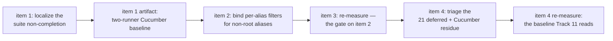

<!-- workflow-sha: d2dfcc2d44fabd3ac76c5fd7620f1e6013675ad9 -->
# Track 9: Cucumber suite completion + the dropped per-alias filter

## Purpose / Big Picture
After this track both TinkerPop feature runners — `core`'s `YTDBGraphFeatureTest` and the `embedded` module's `EmbeddedGraphFeatureTest` — complete with the translator on, each runner's failure set is a committed artifact rather than a promise, and the dropped per-alias filter that silently mistranslates every multi-hop traversal is fixed. Today none of that holds: the `core` suite does not terminate with the strategy enabled, the `embedded` runner has never been measured on this branch at all, and a filter on a non-root alias is discarded without declining, so the wrong answer ships silently.

**Under item 1's escalation branch the completion half of that promise is deferred, not dropped (T32).** If the single-fork stall is not localized within the trigger's budget, each runner's baseline is published per partition instead, the filter fix and the committed failure sets still land, and single-fork completion moves to a follow-up carrying the diagnostic artifact. The escalation branch in `## Plan of Work` item 1 lists every document that must be amended when that happens.

<!-- Reserved for Move 2 — ADDED/MODIFIED/REMOVED triad. Empty until Move 2 lands. -->

First half of the split final track (inline replan, 2026-08-03 — see `## Decision Log` DR-S1). The list-shaping terminators, the `RecognitionContext` seam, and the JMH harness moved to **Track 11**, which runs after this one and depends on the baseline this track produces.

## Progress
- [x] Review + decomposition
- [x] Step implementation
- [x] Track-level code review
- [x] 2026-08-04T06:40Z [ctx=info] Step 10 complete (commit `0f8e5284e6`). BG3's slice defect plus DR-S19's fold latch and DR-S18's per-record type guard, over four commits and three review iterations. Two dimensions, 24 findings, 1 blocker (BG29, the guard's own plan-cache key erasing its type-name list, measured 5 rows against native's 4). Bugs PASS at iteration 2, test-structure PASS at iteration 3. Guard made fail-closed for production by user decision (DR-S21). TS44–TS48 recorded as residuals; coverage gate not run — Phase C owns it.
- [x] 2026-08-04T06:40Z [ctx=info] Step 11 complete (commit `b7cc89b371`). Edge-bearing `where(...)` over-emission closed as one fix across three recognisers, plus the BG9 anti-join leak the same review found. Discovered that `WhereTraversalStepRecogniser` is unreachable from any traversal today. Review loop closed: bugs PASS, all test-structure findings VERIFIED, TS38 fixed with mutation proofs.
- [x] 2026-08-04T06:40Z [ctx=info] Step 13 complete (commit `c4a512756f`). The `not()` range-comparison decline landed and was then **deleted** by step 10's guard under DR-S20; what survives is the diagnosis, the engine-inconsistency pin and the hardened test record. Roster row held `[ ]` until the replacing guard's review closed. Gate-check finding renumbered twice, finally BG34.
- [x] 2026-08-04T01:55Z [ctx=warning] Step 9 complete (commit `d6e0920e5c`). Fail-closed chain-termination gate after three attempts; two prior attempts failed on incomplete successor enumeration, the second regressing a working shape. Step-level review ran 2 dimensions over 5 iterations (3 past the cap, DR-S11/DR-S12): test-structure PASS at iteration 2, bugs VERIFIED at iteration 5. BG7 and BG8 routed out to step 10 as pre-existing. Suite unmoved at 1930 / 5 / 14 across four closed divergences. Coverage gate not run — Phase C owns it.
- [ ] Track completion
- [x] 2026-08-03T17:14Z [ctx=info] Step 5 complete (commit `c5f299e2fa`). Feature suite 1930 / 7 / 14, translator on, down from 27; 20 scenarios moved on four root causes. Step-level review ran 3 dimensions, 19 findings, 0 blockers as graded with 4 orchestrator-upgraded (all four measured on/off divergences invisible to the compliance suite), all upgrades and all should-fixes closed, 4 skipped with reasons, PF1 deferred as executor work. Coverage gate not run — Phase C owns it.
- [x] 2026-08-03T13:46Z [ctx=safe] Step 2 complete (commit `055ebfdac5`). Four-arm baseline published at `plan/track-9/cucumber-baseline.md`, all at `fe4b5cc95d`: both runners 1930 / 27 / 14 on and 1930 / 0 / 14 off. `embedded`'s off arm self-witnessed by a new permanent test. `risk: medium`, so no step-level dimensional review.
- [x] 2026-08-03T13:20Z [ctx=safe] Step 3 complete (commit `c4d9d67ae7`). Feature suite 1930 / 27 / 14, translator on, down from 42; off arm still 0. Step-level review ran 3 dimensions, 13 findings, 0 blockers as graded with 2 orchestrator-upgraded, 1 skipped with a reason.
- [x] 2026-08-03T13:20Z [ctx=safe] Step 7 complete (commit `001ea7921c`). Union positional suffixes decline; the gate keys on `StepRecogniser.selectsPositionally`. Step-level review ran 3 dimensions, 12 findings, 0 blockers as graded, BG3 excluded from the respawn.
- [x] 2026-08-03T13:20Z [ctx=safe] Step 8 complete (commit `55da40dcdd`). Repeat veto marker moved to `getSideEffects()`; the translator-off arm is byte-identical to `develop` again. No step-level review, by user decision — see `## Decision Log` DR-S4.
- [x] 2026-08-03T11:23Z [ctx=info] Step 1 complete (commit `107de3ef34`). Feature suite completes single-fork: 1930 / 42 / 14. Step-level review ran 5 dimensions, 17 findings, 15 fixed, 2 recorded as skipped.
- [x] 2026-08-03T02:57Z [ctx=info] Review + decomposition complete. Predicted complexity tag `high`; `max(step tags)` over the six-step roster is also `high`, so the reconciliation finds no divergence and no missed strategic reviewer is owed.
- [x] 2026-08-04T08:16Z [ctx=safe] Track-level code review iteration 1 complete (commit `ee8ae3620b`). Seven dimensions, 53 findings, no blockers as graded with 2 upgraded on the severity backstop — both silent wrong answers on a recognised shape, closed by declining exactly the defective suffix. Eight findings in scope this iteration, all eight fixed with mutation proofs on the three vacuous tests. Gate checks on all three touched dimensions returned PASS, eight of eight VERIFIED.
- [x] 2026-08-04T09:42Z [ctx=info] Track-level code review iteration 2 complete (commit `78f42d8367`). Seven findings, all applied: the `mean()` function's untested `MathContext`, two comments crediting mechanisms the code lacks, the missing YQL reference entry, two uncovered by-modulator surfaces, and a new `AGGREGATE_MEAN` cache shape so `SELECT mean(prop)` reconciles per record. Reversed DR-S6's sizing on measurement. The iteration also refuted its own finding's premise — the Gremlin surface never classified as `AGGREGATE_AVG`, so nothing regressed there; DR-S6 and the step-5 episode are amended above.
- [x] 2026-08-04T11:08Z [ctx=warning] Track-level code review iteration 4 complete (commit `215aad384f`), and the loop closes here by user decision — remaining suggestions surface as residuals rather than driving an iteration 5. All six remaining should-fix cleared: the range type guard hoisted to one conjunct per eligible `AndP`, the ORDER-BY decline documented rather than narrowed, two Javadoc repairs, a two-step-prefix union case, and the declined-path non-emptiness pin carried across all four assertion drivers. Gate checks narrowed to two dimensions and both PASS — performance verified the hoist semantically exact, and a bugs regression net over the commit returned zero findings after checking four named failure modes. `CQ1`, `CQ15`, `TS49` and `TC5` did not get a gate check; each rests on the implementer's own measured or mutation-proven evidence, recorded here so the narrowing is not silent.
- [x] 2026-08-04T10:14Z [ctx=info] Track-level code review iteration 3 complete (commit `22b4c68951`). A partial revert by user decision: iteration 2's `AGGREGATE_MEAN` cache shape is withdrawn, its comment, documentation and translator-side test work kept. A bugs read of the cache package — spawned outside the selection rules, because no gate check covers a dimension that had no findings — found that the new shape threw `ClassCastException` out of the cached view on the first execution of `mean` over a String-valued or list-valued property. DR-S6's original decision stands and its amendment is itself withdrawn. The implementer was stopped mid-flight after finishing the edits, so the orchestrator verified and committed them directly; 148 cache and mean tests plus 75 translator tests pass.

## Surprises & Discoveries
<!-- Continuous-log. Empty at Phase 1. -->

- **Three unowned defects in the transaction result cache, pre-existing on `develop` and latent behind a disabled-by-default flag — CARRY THESE INTO `design-final.md` OR AN ISSUE.** All three were found by Phase C dimensional reviewers reading the cache package, none is this branch's doing, and all three are reachable only with `youtrackdb.query.txResultCache.enabled=true` (default `false`), which is what keeps them latent rather than shipping. **(a)** `AggregateState.refoldSum` casts every `contributingValues` value to `Number`, while `observe` admits any non-null value and `ShapeClassifier.singleAggregateShape` applies no type gate — no schema-type check exists anywhere in the cache package. So with the cache on, `SELECT sum(strProp) FROM C WHERE p` throws `ClassCastException` out of `CachedResultSetView` on its **first** execution, where `SQLFunctionSum.execute` ignores the non-`Number` param and `getResult` returns `0`; `avg` diverges identically because `SQLFunctionAverage.execute` skips non-`Number` the same way. Settled from code, no run needed. **(b)** `AggregateState.emitsNoRow` returns `contributingValues.isEmpty()` for `AGGREGATE_SUM`/`AVG`/`MIN`/`MAX`, and `observe` drops a null property value before `addContributor`, so a match set whose aggregated property is null on **every** record leaves the map empty and the cached view suppresses the row — where an uncached run emits one row (`SUM` returns `0`; the other three a null scalar). The fix shape is to track the matched-record count separately from the non-null contributor count. **(c)** A single-alias MATCH whose RETURN carries an aggregate passes `isSingleAliasRecordFold` — that predicate has no aggregate gate — and so classifies as `RECORD`, feeding a RID-less scalar row to the per-record delta builder. This is precisely the hazard `## Decision Log` DR-S6 named as the thing `K0_NONE` was chosen to avoid, so the decision log knew about it and the path is still reachable. **Why this track is not fixing them:** all three sit in a package this track touched only to classify one function name, two of them are byte-identical on `origin/develop`, and (b) would mean changing four aggregate shapes this track never scoped. This branch's own brush with the family is the cautionary part — Phase C briefly added an `AGGREGATE_MEAN` shape and (a)'s cast immediately made `mean(strProp)` throw, which is why the shape was reverted (DR-S6, two amendments).

- **The `IS DEFINED` estimator gap is confirmed a third time, from a third direction (Phase C performance review, `PF6`).** `SQLWhereClause.estimate` has no arm for `IS DEFINED`, so every presence conjunct this track newly emits pins its alias at `classCount / 2` and can steal the root slot, scheduling the pattern backwards. This is the same defect DR-S6 deferred to the executor as `PF1` and step 3 deferred as `PF2`; three independent reviews on three different steps have now reached it. **A correction to how it was scoped:** Phase C's `PF5` was assumed blocked by this gap, and it is not — the ORDER-BY slice decline cannot be narrowed by fixing the estimator, because its tie group is manufactured by a post-sort hop fanning one sorted root row into several result rows, so a correct carve-out needs a unique-index lookup the recogniser cannot reach **and** a no-fan-out condition after the sort. The estimator gap and the slice decline are two separate pieces of executor work, not one.

- **The track's acceptance measurement is `core`-only, by user decision on 2026-08-04, and Track 11 must read it that way.** DR-S8's criterion is 1930 / 0 / 14 on both runners; measured at the final tree (`215aad384f`), `core` answers exactly that on **both** arms — translator on and translator off, 1930 scenarios, 0 failures, 0 errors, 14 skipped, with the extraction scoped to the single `TEST-_.xml` after deleting `core/target/surefire-reports`. `embedded` was **not** re-measured: the user stopped the run on the ground that CI covers it. That is right for `embedded`'s **on** arm — the Linux and macOS platform jobs invoke `./mvnw clean package -B` with no `-Dmaven.test.failure.ignore=true` and `embedded` carries the feature suite — but CI runs the kill-switch at its default, so the **off** arm is covered by nobody, which is the exact gap step 2 existed to close. It rests on inference rather than measurement: step 2 established the two runners fail the identical set and the shaded packaging contributes no failure of its own, step 8 restored the off arm's byte-identity with `develop`, and `core` off is green at the final tree. **The consequence for the next reader: the no-regression reference number Track 11 inherits is `core`-only**, where the plan's Track 11 entry still describes a two-runner baseline.

- **A pre-existing silent wrong answer on `develop`, found incidentally, translator-independent — CARRY THIS INTO `design-final.md`, it is the only route out of `_workflow/`.** The `else` branch of `YTDBGraphStepStrategy.rebuildTraversal` inserts a `YTDBHasLabelStep` and drops the original `HasStep`'s labels, with no `copyLabels` call. Measured: `g.V().out("knows").hasLabel("Person").as("a").select("a")` returns `[]` on the **native** pipeline where the oracle returns two vertices. The code is identical on `origin/develop` and the defect has nothing to do with the translator — it ships today. Found by the Track 11 item-8 label probe (`plan/track-11/item8-label-probe.md`, commit `158a87871c`) while measuring a different claim. **The user's call was to record it here rather than open an issue or fix it on this branch**, on the ground that it is unrelated to the translator and would widen an already-oversized track. The recording obligation therefore falls on Phase 4: `_workflow/` is deleted in the Phase-4 cleanup commit, so a defect that lives only in this file and a probe artifact disappears from the repository at merge. It must reach `design-final.md`, or an issue, before that commit lands.

- **A second confirmed-and-unowned engine defect, this one in numeric comparison — CARRY THIS INTO `design-final.md` OR AN ISSUE.** `PropertyTypeInternal.castComparableNumber` has no `max instanceof Long` case under its `context instanceof BigDecimal` branch (lines 2058-2074) and casts a `Long` to `BigDecimal` at line 2072. Measured on the **unguarded** translated path while mutating step 10's iteration-3 fixture: `between(0L, 10_000_000_000L)` with the connective recursion disabled threw `ClassCastException: Long cannot be cast to BigDecimal` from `SQLGeOperator.execute`. The guarded path with the same literal was green and stored-BigDecimal-against-Long comparisons elsewhere in the suite pass, so nothing reachable through the shipped guard trips it — this is a lead, not a confirmed production bug, and no record was identified as producing the pair. Nobody owns it; `_workflow/` is deleted in the Phase 4 cleanup commit (step 10, see `## Episodes` §Step 10).

- **Alias filters now keep inline literals in the plan-cache key, for every Gremlin-translated shape rather than only guarded ones (step 10, see `## Episodes` §Step 10).** BG29's fix renders them with `toString(NO_PARAMS, …)` instead of `toGenericStatement`. Production binds every comparison value through `ParamSink`, so the key stays value-independent and plan reuse is unaffected; `WHERE.classEquals` is the one other inline-literal producer on that path and its literal is a class name, so splitting on it is correct rather than wasteful. **A future emitter that writes an inline *value* into an alias filter would silently cost plan reuse.** The fingerprint's Javadoc says so.

- **Any re-entrant walk over a synthesised step list must pass its own child-scope boundary, or it reintroduces BG30 (step 10, see `## Episodes` §Step 10).** `UnionForkHostImpl.walkFork` hands the walker `prefix ++ childSuffix`, and the fold latch read a union arm's `has` as folded because the prefix counted as top level — six translated against zero native. `GremlinStepWalker.walk` now has a boundary-carrying overload, and the one-argument form is the assertion "this list really is top level", not a convenience. A second fork host, a rewritten union path, anything that flattens a child traversal into a top-level list inherits this obligation.

- **Two ways to observe that a connective survived inlining, and they are not interchangeable (step 11, see `## Episodes` §Step 11).** In a graph-backed test, `applyStrategies()` with the translator off gives the real optimised step list. In a plain unit test the traversal is anonymous, `applyStrategies()` is effectively a no-op, and `InlineFilterStrategy` must be applied by hand through `TraversalHelper.applyTraversalRecursively`. **A test using the first form outside a graph passes while checking nothing** — the first version of step 11's sibling-minting assertion did exactly that and stayed green under its own mutation, which is how it was caught. It would have shipped as the eighteenth could-not-fail test in the commit fixing the seventeenth.

- **`WhereTraversalStepRecogniser` has no reachable path from any traversal today (step 11, see `## Episodes` §Step 11).** TinkerPop builds a `WhereTraversalStep` only when the child carries a scope label and always inserts a scope step for one, so every such child fails the sub-walk before the recogniser can classify it — both its accept path and its edge-bearing gate are dead code. The class is kept because the binding is resolvable in principle. **A track that wants the labelled `where(__.as(a)…)` family back needs Gremlin-scope-label-to-internal-alias resolution first**; the recogniser and its gates are already in place for it.

- **Five times on this branch a TinkerPop `OptimizationStrategy` has invalidated an assumption about where a step sits, and the translator keeps paying for it.** `InlineFilterStrategy` rewrites `where(__.has(...))`, `filter(__.has(...))` and all-filter `and(...)` into a top-level `HasStep`; `FilterRankingStrategy` hoists a `has` above an `order()` and **relocates an `as()` label off the `GraphStep` onto the following `HasStep`**. Both sit in the `OptimizationStrategy` category, which runs **before** the translator's `ProviderOptimizationStrategy`. The five: it refuted DR-S16's fold-boundary design, which had been read off `rebuildTraversal` alone; it silently re-pointed two of step 11's new tests at a different code path while they looked correct, forcing the `.barrier()` idiom and an assertion that observes it; it made `and(__.not(__.out("a")), __.not(__.out("b")))` not the shape its Javadoc claimed; it is the real mechanism behind Track 11 item 8's start-step label claim, where the user's label never reaches the step the user wrote it on; and the walker's own cursor disagreed with `rebuildTraversal` about `NoOpBarrierStep`, which the cursor treats as transparent and never dispatches while `rebuildTraversal` treats it as an ordinary step that closes the fold — `g.V().barrier().has("name", gt(27))` is user-writable and answers one row native against six unguarded (step 10, see `## Episodes` §Step 10). **The generalisation worth keeping: the traversal the translator sees is not the traversal the user wrote, and every recogniser that keys on a step's position or on which step carries a label is reasoning about a rewritten tree.** A recogniser making either kind of assumption needs a test that pins the post-strategy step list, not the authored one.

- **The coverage gate runs in CI and passes, so Phase C need not rebuild it locally (orchestrator observation, 2026-08-03, run `30863465080` at `965363e025`).** The handoff records that the coverage gate has never run on any step of this track — steps 5, 9, 10, 11 and 13 all skipped it by orchestrator instruction, because it is the full `clean package -P coverage` build and implementers on this branch have repeatedly burned hours inside it — and assigns it to Phase C as an obligation Phase C must not skip. **It has been running in CI the whole time.** The first Java CI pipeline run to complete on this branch in thirteen pushes reports `Coverage Gate (New Code): success` alongside `Test Count Gate: success` and all eight platform jobs green. Phase C therefore discharges the coverage obligation by reading a completed CI run rather than by spending hours on a local build, which removes the single most expensive item on its list. **Two conditions on that, and neither is optional.** The run must be on the track's **final** tree: `965363e025` predates step 11's BG9 fix, step 13's two review fixes and every part of step 10's remaining work, so it is a checkpoint and not the answer. And a run only completes if nothing pushes over it — the twelve runs before this one were all `cancelled` by the next push, which is why the gate looked like it had never run. **A collateral fact worth keeping:** the Linux and macOS matrix jobs invoke `./mvnw clean package -B` with no `-Dmaven.test.failure.ignore=true` (`maven-pipeline.yml:200`; only the Windows job is lenient), and `gremlin-process-compliance-tests` is third of five surefire executions bound to `test`, so those jobs going green is itself the proof that the process-compliance suite has no survivors — the measurement DR-S17 dropped step 14 in favour of.

- **The merged tree reaches 1930 / 0 / 14, and the three fixes overlapped rather than added (orchestrator measurement, 2026-08-03, at `24fe041832`).** Steps 10, 11 and 13 each moved the `core` figure to a different place measured alone — step 11 to 1 failure, step 13 and step 10's BG8 each to 4 — and the arithmetic 5 − 4 − 1 − 1 never resolved, because step 10 flagged that its moving scenario is a labelled `where` most likely identical to the one step 11 cleared. Merged, the suite answers **1930 scenarios / 0 failures / 14 skipped in 19 s, translator on**, which is DR-S8's absolute criterion on the `core` runner. The overlap reading was right and the additive reading was wrong. Extraction was scoped by deleting `core/target/surefire-reports` before the run, so the single `TEST-_.xml` the Cucumber suite writes is the only report the figure comes from — the contamination trap recorded below, avoided rather than re-paid. **This is a checkpoint, not the handoff baseline:** review fixes for steps 10, 11 and 13 are still to land, and step 15 changes the main `has` path, so every one of them is a qualifying commit under R8 and re-triggers the measurement. `embedded` is unmeasured at this SHA; step 2 established that the two runners fail the identical set, so the checkpoint is read as `core`-only until track completion takes the four-arm baseline.

- **Four connective surfaces now agree on one rule: a hop inside a boolean filter stays native (step 11, `7c8f694cde`).** `where`, `filter` and `and` decline an edge-bearing child as of step 11; `or` already declined it for an unrelated reason (an OR arm must reduce to a single boolean operand); and **`not` was claimed as a deliberate exception** on the grounds that an anti-join emits its input at most once and so cannot over-emit. **That exemption is REFUTED — see BG9 below.** The framing is still worth keeping, because anything that later teaches the translator a positive existence quantifier has to re-open all four surfaces together and a change that re-opens one will look locally correct; but the `not` arm of it is not established and must not be relied on.

- **BG9 [blocker, CONFIRMED cert C1] — the `not` exemption is unsound in composition (step 11 bugs review, `bugs-step11-iter1.md`).** An edge-bearing `not()` inside an OR arm leaks its anti-join past the capture boundary and lands as a plan-level conjunct: `g.V().or(not(out(a)).has(name, x), has(age, 30))` returns `[x]` against native's `[x, y]`, measured, at one boundary step. The single-`not` reasoning is correct in isolation and wrong under composition, which is exactly the failure shape a stated invariant is supposed to prevent and did not. Open, unfixed, and owned by whoever resumes Track 9 Phase B. Two further confirmed findings from the same review: **BG11** — the pure-filter arm mis-keys a path-scoped `where` onto the current boundary, so `g.V().as(a).out(knows).where(as(a).has(age, 30))` returns `[]` against native's `[Bob]`, and the step's new test picks the one scope-label spelling where boundary and scope key coincide; and **BG10** — removing `commitEdgeBearingChild` left `RecognitionContext.appendPattern` with zero production callers, so the `hasEdges` flip that two test Javadocs name as the mechanism making the nested AND decline is unreachable and the claimed regression guard does not exist.

- **Fixtures that agreed under both readings, and the guard that stops them coming back (step 11).** Several existing cases could not have witnessed BG2 at all: `seedDualLabeledOutEdges` gave the hub one `a` edge and one `b` edge, and `whereOutKnows` gave alice a single `knows` edge — with no fan-out the filter reading and the join reading produce the same rows, so those cases would have stayed green with the over-emitting hop re-appended. Both fixtures now fan out, and a new `assertNativeFanOut` helper compares the case's own native row count against the count the join reading would produce and **fails when they are equal**. **Qualified by the step's own test-structure review (TS13, suggestion):** the helper's fan-out check compares two literals passed at the call site rather than anything derived from the fixture, so the discrimination is really done by the `hasSize` pins beside it and the helper's Javadoc credits the wrong line. The protection is therefore weaker than first recorded here — real, but assertion-shaped rather than structural, and it will not by itself catch a later fixture edit that flattens the fan-out unless the literals are updated too. Worth strengthening into the guard it was described as, rather than copying as-is. Step 11's third mutation proof exercised exactly that — production restored but the extra edges removed — and all three guards fired, which is what shows the fixtures rather than the assertions are doing the discriminating. This is the twelfth recorded vacuous-acceptance instance on the branch and the first with a mechanical defence against recurrence.

- **Every Cucumber comparison on this track has to scope its extraction to one report file, or it reads stale unit-test results (step 10, `7dcf8d906e`).** `surefire:test@gremlin-feature-compliance-tests` does **not** clean `core/target/surefire-reports`, so a glob over `TEST-*.xml` picks up whatever earlier unit-test runs left behind. Step 10 hit this concretely: its first before-and-after comparison came back dirty, and the dirt was two deliberately-red tests from the mutation run it had done minutes earlier — not a scenario regression at all. The Cucumber suite writes **one file**, `TEST-_.xml`, holding all 1930 cases, so scoping the extraction to that single file is what makes the comparison trustworthy; `rm -rf core/target/surefire-reports` before the run is the equivalent belt. **This reaches further than one step.** DR-S7 moves the four-arm baseline to track completion and DR-S8 makes the criterion absolute at 0 failures and 14 skips on both runners, so the number that closes this track and the number Track 11 reads are both produced by exactly this extraction. A stale-report contamination there would either invent a failure that does not exist or, worse, survive as a recorded figure nobody can reproduce. Whoever takes the completion baseline scopes to `TEST-_.xml` or cleans first, and says which in the artifact.

- **`returnDistinct` carries BG3's defect shape, and it is measured, unowned, and not step 10's (step 10, `e9a7d4c529`).** `g.V().in(k).dedup().out(k)` returns `[Shared, Leaf]` translated against `[Shared, Shared, Leaf]` native, because `RETURN DISTINCT` — like the slice clauses — applies after the pattern rather than at the position Gremlin applies it. `GremlinAggregateAssembler.hasPreAggregateCardinalityClause` already treats the slice clauses and `returnDistinct` as one family, so the kinship is recognised in the code, not inferred here. Closing it is **one extra disjunct** in step 10's `capturedSinglePlanSlice`, and step 10 deliberately did not add it: the decline surface is much wider than the slice's, because it would also withdraw `dedup().values(k)` — where SQL `DISTINCT` collapses two distinct vertices sharing a name and Gremlin does not — with unmeasured Cucumber impact. Under item 4 this is a silent wrong-multiset defect on a recognised shape, so it wants a disposition rather than silence: fix, decline, or a recorded user waiver. It needs its own step with its own Cucumber measurement, and it has no owner as of step 10's close.

- **Two further live divergences, measured out of band by the Track 11 item-7 JMH harness (branch `t11-item7-jmh`, commit `b1fc04a030`, worktree `.claude/worktrees/t11-jmh`).** Neither was found by the compliance suite, which is the sixth and seventh instance of this branch's recorded pattern that the suite is not a net for this defect family. **(a) `where()` over a hop-bearing child fans out instead of filtering.** `g.V().hasLabel(Person).has(id, 1L).out(KNOWS).where(__.out(KNOWS)).values(firstName)` returns `[Bob, Bob, Carol]` translator-on against `[Bob, Carol]` native; on a two-hop prefix the on-arm returns six rows against native's two. The row count equals the sub-traversal's total fan-out, so the `where` child's hop joins the pattern as a productive hop rather than as an existence test. `where(__.has(...))` with no hop inside is correct. This is independent confirmation of step 3's BG2 from a different measurement path, and it is **step 11's** to close — a fifth witness on top of the four Cucumber scenarios BG2 already owns. **(b) A projection followed by `order()` mistranslates when composed with `range` / `limit`.** `…out(KNOWS).values(firstName).order().limit(2)` returns `[Carol, Dave]` translator-on against `[Alice, Bob]` native, and with `.range(1,3)` returns `[Alice, Carol]` against `[Bob, Carol]`. `order()` alone after `values` is correct, and `order().by(key).range(1,3).values(key)` is correct on both arms. The slice is landing in the wrong place relative to the sort in the generated statement, which is the same family as BG3's statement-level `SKIP` / `LIMIT` placement even though the shape differs — BG3 slices a hop's output, this one slices before the sort it should follow. Handed to **step 10** as a lead, not as scope. **Correction, 2026-08-03 — (b) does not reproduce at this branch's HEAD and the entry above stands only as the harness's own measurement.** Step 10 ran the exact reported spelling in the `core` harness on a fixture whose insertion order is reverse-alphabetical, so RID order and sorted order disagree: both arms return `[Alice, Bob]`, and the `.range(1,3)` variant returns `[Bob, Carol]` on both — the figures the harness reported as *native*. Bare `order()` and `order().by(k).range(1,3).values(k)` also agree. Two theories were ruled out rather than assumed: a plan-cache entry keyed without the slice (re-run with bare `order()` executed first, still equal), and a stale base (`de6c8b402b`, the `lastPropertyProjection` fix that is exactly the "emitted names in RID order and called it sorted" defect, is an ancestor of the harness commit `b1fc04a030`). Confirming or retiring (b) needs the harness's own LDBC fixture, whose indexed `Person.id` roots the plan differently. It is not BG3's root cause and it is not step 10's.

- **A live multiset divergence on union suffixes, found while reviewing a different track (Track 11 adversarial A1, cert V1 CONSTRUCTIBLE).** `union(...).range(2,5)` and `union(...).limit(3)` already return a different multiset translator-on than translator-off at `54cc0a708f`. The reviewer measured it rather than deriving it. This is not Track 11's defect to introduce — it exists now, in Track 8's union-suffix surface, and `QUERY_GREMLIN_TO_MATCH_TRANSLATOR_ENABLED` defaults to true, so it ships at merge. **Step 5 owns it under the rule already written into `## Plan of Work` item 4:** a translator-caused silent-wrong-multiset defect on a recognised shape takes the fix exit or the decline exit before track completion, or the track records an explicit user-approved waiver. It is not deferrable with a named destination the way a crash-shaped defect is. Two consequences beyond step 5: the finding was reached through `GremlinStepWalker.java:206`, so step 5's diagnosis starts from the post-union suffix allow-list rather than from the per-alias filter family; and Track 11 item 4 proposes widening that same allow-list with `tail` and `fold`, which would extend a surface that is wrong today.
- **A second live silent-wrong-answer defect, on the single-plan path this time (step 7 review, `bugs-step7-iter1.md` `### BG3 `, cert C7 CONFIRMED).** A slice followed by a hop compiles to a statement-level SQL `SKIP` / `LIMIT`, so `g.V().limit(2).out()` slices the **hop's output** instead of its input. It predates step 7, sits outside the union path, and is unrelated to A1's ordering cause — this one is about where the slice lands in the generated statement. It is in the same mandatory-handling category as A1 under `## Plan of Work` item 4: the switch defaults on, so a wrong answer here ships at merge, and the defect takes the fix exit, the decline exit, or a recorded user-approved waiver. Deliberately excluded from step 7's fix respawn, because folding a pre-existing defect on a different path into a step's review-fix loop is how a step stops being reviewable. **Owner not yet assigned** — step 5 inherits it unless the user directs a step of its own, as they did for A1.
- **The parallel Phase A panel for Track 11 caught a fourth vacuous-acceptance shape** (technical T4): `supportsListShaping()` defaults to `true`, which inverts to `false` under a Mockito mock, so every combinator-child decline assertion in Track 11's item 5 can pass without exercising the decline. Phase A on this track caught two such shapes and this track's own step-1 review caught a third. Four instances across one branch is a pattern rather than a run of bad luck, and the common factor is an acceptance criterion whose expected value is "nothing happened" — which any misconfigured fixture also produces. Whatever Track 11's Phase A does with T4, the durable lesson belongs in the final design: a decline assertion needs a positive control of the same shape, measured, not derived.
- **A1 is closed, by declining rather than by fixing** (step 7 — see `## Episodes` §Step 7). A positional suffix after a union now withdraws the whole walk from MATCH, and the cost is stated where a reader of the code will meet it: `RangeGlobalStepRecogniser`'s Javadoc records that an all-or-nothing walk withdrawing the slice **withdraws the prefix from MATCH too**. Post-concat `order()` is the recovery path. Two constraints fall out of this onto Track 11 item 4, which proposes widening the same allow-list: `tail` must answer `selectsPositionally` true, and `fold` cannot be a bare post-union suffix at all because `List.equals` is order-sensitive over the folded one-element multiset.
- **The edge-bearing `where(...)` over-emission has one fix site and three callers** (step 3 review BG2 — see `## Episodes` §Step 3). `ConnectiveStepSupport.commitEdgeBearingChild` is reached from `WhereTraversalStep` and `TraversalFilterStep` through `commitPositiveFilterChild`, and from `AndStepRecogniser` directly. A decline exit covers all three or leaves the defect live on two, so step 5 sizes it as one fix across three recognisers rather than one per symptom. The alternative exit, `returnDistinct`, is wrong in general — it collapses path multiplicity native Gremlin legitimately produces. Pinned test-side today by `whereFragmentWithSeveralMatchingTargets_translatedPlanOverEmits`; the production exit is unspent.
- **The two runners are one failure surface, not two** (step 2 — see `## Episodes` §Step 2). `core` and `embedded` fail the identical 27 scenarios with the translator on and are both green with it off; the set difference in either direction is empty. Step 5 therefore sizes the triage once. The shaded packaging `embedded` adds contributes no failure of its own, which retires the standing worry that the two runners might diverge and need separate dispositions.
- **The Cucumber suite is not a net for this defect family** (step 5 — see `## Episodes` §Step 5). All four blockers the step-level review upgraded were measured translator-on against translator-off, and the residue is byte-identical at 1930 / 7 / 14 before and after they were fixed. The suite exercises none of `withStrategies(ProductiveByStrategy)`, `values(key).count()`, `values(k).group()`, or `group()` / `groupCount()` after a grouping terminator. Two consequences. A scenario count is a **lower bound** on this family's correctness, never a clearance — steps 9 and 11 should gate on the equivalence classes rather than on the suite going green. And step 6's handoff baseline, which Track 11 reads as its no-regression reference, inherits the same blind spot: a translated shape absent from the suite is absent from the number.
- **`embedded`'s 1931 was never an extra scenario** (step 2). `ShadedJarSmokeTest` folds into the same surefire test set as the Cucumber suite, so the set count is 1930 scenarios plus one JUnit method, and `TEST-_.xml` shows the 1931st `<testcase>` carrying `ShadedJarSmokeTest`'s classname. The same folding explains CI's 1931 at `b35ac67d2f`. `## Artifacts and Notes` recorded the gap as unexplained; it is now closed, and any future reader comparing runner counts should compare 1930 to 1930.

## Decision Log
<!-- Continuous-log. -->

- **DR-S21 — the type guard's default goes fail-closed, and the review's caller count was half wrong (user decision, 2026-08-04).** The guard shipped opt-in through a fourth `toFilter` parameter, with the one-, two- and three-argument overloads defaulting it **off**, so a recogniser added later that emitted a range comparison in an unfolded position and forgot the flag would inherit the divergence rather than a compile error. Every other decline mechanism on this branch is fail-closed, and this was the implementer's own critical-context note rather than a review finding. The user chose fail-closed. BG32 offered the cheap route — delete two overloads it reported as callerless — but **only the three-argument form was actually callerless**; the two-argument form has ten live callers in `GremlinPredicateAdapterTest`, and the spawn was instructed not to force a deletion against a live caller. Deleting the three-argument form alone still delivers the decision in full: it was the only overload carrying a `paramSink` and defaulting the guard, so every parameter-binding call — i.e. every production call — must now state its fold position or fail to compile, and the surviving forms pass `null` for the sink, which makes them structurally unit-test-only. The `bugs` gate check re-audited the call sites and withdrew its own count. Reference-accuracy caveat: PSI is unusable in this repository (`steroid_execute_code` exceeds the 60 s MCP timeout on a cold index), so the audit was a paren-matching arity scan over every `toFilter(` call site in `core/src/{main,test}` plus a grep for `{@link}` forms; `toFilter` is package-private on a package-private final singleton, which bounds the risk. See `## Episodes` §Step 10.

- **DR-S22 — step 10's test-structure loop closes at the iteration cap without a fourth gate check (orchestrator decision, 2026-08-04).** Three iterations ran: two full reviews (the second because DR-S19's latch and guard were ground no reviewer had read) and one gate check, which returned `FAIL` on TS41 plus a new TS49. Iteration 3's fix settled both by measurement. The cap in `review-iteration.md` §Limits escalates only **if blockers persist**, and none do — BG29 is closed and verified, the `bugs` dimension is at PASS, and TS41 and TS49 are should-fixes answered with shown mutation output. The residual risk is real and named rather than dismissed: this is the **third** wording of the connective-recursion Javadocs and the two earlier ones were wrong in opposite directions, the first over-claiming that a leaf-only guard would answer differently and the second over-claiming that no `between` case could witness the recursion. Verification is deferred to Phase C's track-level test-structure pass, which reads both files against the cumulative diff and is uncapped at complexity `high` — buying the same read there costs nothing, where an out-of-cap iteration now would. The `bugs` PASS was measured at `1bedb9f9af` and `0f8e5284e6` landed after it; that commit is test-only and adds a strictly stronger witness, so `bugs` was not re-run. See `## Episodes` §Step 10.

- **DR-S1 — the final track splits, and the correctness fix goes first.** Phase A's risk review found that the track's headline gate could not be evaluated at all (the feature suite does not complete with the translator on) and that the resulting track carried an unsized engine-level diagnosis in front of a shared-planner correctness fix in front of a four-recogniser feature. The split boundary was already drawn in the file: this track's work shares **no file** with the terminator work — it touches `MatchPatternBuilder` / `MatchExecutionPlanner` / `GqlMatchPatternAssembler` and the equivalence suites, while Track 11 touches `RecognitionContext` / `WalkerContext` / `UnionStepRecogniser` / `ListShapingOp` and the walker registry. Coupling runs one way, Track 11 wanting a base where this track has landed, which is what a stacked-diff series is for. What the split costs is one extra PR boundary and a second full-suite run; what it buys is that a correctness fix on the shared MATCH planner path is reviewed on its own merits rather than arriving in the same diff as four new recognisers. It also keeps this branch off a run of over-threshold tracks. **Two figures, and the distinction is load-bearing (R15, R19).** Track 8 was past the ~4,000-line review-burden threshold on **code alone** (38 files / 5,814 insertions, against 20 / 3,466 under `docs/adr`). Track 10 was past it on the **full non-generated figure** — 5,168 insertions over 36 files as step 9 measures it, not the 5,331 unfiltered count, because three of its files are hand-written code living under the excluded `internal/core/sql/parser/` path (`SQLSuffixIdentifier.java`, `SQLWhereClause.java`, `SQLSuffixIdentifierTest.java`) — while its code half was 2,718 against 2,613 of `_workflow/` prose. A combined Track 9 would have been past it on both. The code-only figure is the right *comparison* number for the question DR-S1 answers: whether a correctness fix on the shared MATCH planner is reviewable on its own merits. The plan's `~8–14 files` Scope line is a different quantity again — a file count covering the code plus the one baseline artifact — so it corroborates the expectation without being either line figure. It is **not** what the gate reads: `track-code-review.md` step 9's `--shortstat` excludes only generated sources and the generated parser, so `docs/adr/**` and test code both count. This track therefore expects a small code half against a `_workflow/` half sized like its predecessors, and the Phase C burden check will read their sum. Track 10's `plan/track-10/reviews/` alone totals 3,154 lines, and this track's Phase A output already stands past 1,700 with no step file, episode, or baseline artifact yet written.
- **DR-S2 — the branch merges green, so step 5's fix budget covers the whole Cucumber residue (user decision, 2026-08-03).** Measured at `55da40dcdd`, one flag apart: translator **off** is 1930 scenarios / **0 failures** / 14 skipped; translator **on** is 1930 / **42** / 14. Every failure in the compliance suite is therefore introduced by this branch, not inherited, and `QUERY_GREMLIN_TO_MATCH_TRANSLATOR_ENABLED` defaults to true, so merging ships all forty-two. Item 4's rule — fix the dropped-filter family plus whatever lands on files already in scope, disposition the rest — was written for a residue of *inherited* failures and does not fit a residue of regressions. Dispositioning a regression with a named follow-up still leaves a green suite red at merge. **Step 5 now fixes the whole residue**, the twelve Track-6-surface defects (`ClassCast String → Property`, group cardinality, order divergence) included. The user was offered the alternative of flipping the kill-switch default to `false`, which would have made the branch green by construction and turned every remaining defect into an entry condition for a later flip; they chose to fix instead. What this costs, stated rather than discovered: the track grows past the size DR-S1 split it to avoid, and Phase C reads a larger diff, so the review-burden check at step 9 of `track-code-review.md` is expected to trip and will need a judgement rather than a reflex. What it buys is a branch that merges without a waiver and without a red compliance suite. The ESCALATE trigger on item 4 stays at two working days and now guards a larger scope, so it is more likely to fire; if it does, the fallback is the kill-switch flip above rather than a follow-up issue.
- **DR-S3 — the three measurement steps collapse into one, because two of them have already been paid (user decision, 2026-08-03).** Step 2 shrinks to `embedded`'s off-arm run plus writing the baseline artifact from figures already taken; step 4 drops into step 6; step 6 is unchanged and remains the single final two-runner A/B. Three of step 2's four deliverables are spent or void. **`core`'s two-arm A/B exists and is orchestrator-verified** at `55da40dcdd` — 1930 / 42 / 14 on, 1930 / 0 / 14 off — which was step 2's core deliverable. **The per-directory table lost its reason:** it was the baseline shape for item 1's escalation branch, taken only if the single fork never completed, and step 1 completed it, so step 2's own wording ("whichever shape step 1 established") resolves to single-fork. **Step 4's job is done** — its deliverable was recording drift after the filter fix, the drift is 42 → 27, and step 3's episode records it; the only residue is that 27 is implementer-measured where 42 and 0 are orchestrator-verified, which is a two-minute re-check rather than a step. What genuinely remains unmeasured is **`embedded`'s off arm**: CI supplies the on arm (1931 / 41 / 14 at `b35ac67d2f`) and nothing anywhere supplies the off arm, and under DR-S2 that number decides whether `embedded`'s 41 are also this branch's regressions. Step 6 stays because R8 invalidates any baseline taken on a qualifying commit, and step 7's fix plus all of step 5 land after any number step 2 could take — so the final A/B has to be re-taken at the track's last commit regardless. That is the number Track 11 reads. The artifact is owed either way: the `core` figures live in commit messages and a session transcript today, not in a file under `plan/track-9/`.
- **DR-S4 — two calls at the Phase B resume of 2026-08-03 (user decisions).** **BG3 goes to step 5**, not to a step of its own and not to a named follow-up. The single-plan slice-then-hop defect — `g.V().limit(2).out()` slicing the hop's output instead of its input — sits in the same mandatory-handling category as A1 under `## Plan of Work` item 4, and DR-S2 already puts the whole residue in step 5's scope, so it takes the fix exit, the decline exit, or a recorded waiver there. The cost is that step 5's scope grows once more on top of DR-S2's expansion, which makes item 4's two-working-day ESCALATE trigger likelier to fire; the fallback stays the kill-switch flip. **Step 8 ships without a step-level dimensional review** despite being tagged `risk: high`. Its code merged before the pause, its three named channel hazards — `profile()` / `cap()` exposure, side-effect clone and merge semantics, sibling leakage — are each covered by `RepeatDeclineStrategyTest`, and the diff is three files inside one strategy. Phase C's track-level review reads it in the cumulative diff and treats the range as a focal point. What this costs, stated rather than discovered: step 8 is the only `high` step on this track with one net instead of two.
- **DR-S5 — step 5 decomposes into five bounded steps, because a `FAILED` return would have discarded the code (user decision, 2026-08-03).** DR-S2 knowingly oversized step 5, and DR-S4 then added BG3 to it. The implementer spawn was instructed to return `FAILED` with a proposed split if the scope proved unfinishable — which was the wrong instruction: `implementer-rules.md` §"Detection rules — return early without committing" requires a full revert before any early return, and `handle_failure`'s `content` path assumes a clean tree at `step_base_commit`. A split return would therefore have thrown away every landed fix and kept only the prose diagnosis. The decomposition was issued to the running spawn instead. Step 5 keeps the 19 result-shaping scenarios (Track 6's surface — `ClassCast String → Property`, group cardinality, order divergence); step 9 takes the remaining eight, unsized until step 5 reports the seam; step 10 takes BG3; step 11 takes BG2 across its three recognisers; step 12 takes the process-compliance control run and its dispositions. **DR-S2 is unchanged** — the whole Cucumber residue is still fixed in this track and nothing is dispositioned out of it. What this costs: four more step boundaries, four more episodes, and a larger Phase C diff than DR-S1 aimed at, which DR-S2 already predicted would trip the review-burden check. What it buys is that a two-hour fix session ends in a commit rather than a revert, and that the four defect families are reviewable apart — the same argument DR-S1 made for splitting the track. Step 6 still runs last; the roster numbering is append-only so earlier commit annotations stay valid.
- **DR-S6 — two step-5 review dispositions that reach outside this track.** **`mean` is modelled in `ShapeClassifier` as `K0_NONE` rather than borrowing `AGGREGATE_AVG`,** and the same branch takes the five names the classifier's own Javadoc already listed as unmodelled — `median`, `mode`, `variance`, `stddev`, `percentile`. Borrowing `AGGREGATE_AVG` was not available: `AggregateState` replays that arm through `computeAverage`, whose integer division is the entire reason `mean` exists. Adding an `AGGREGATE_MEAN` kind with its own replay arm is a larger change than the finding carries, and once the recognised-but-unreplayable mechanism exists, applying it to the new name alone would be arbitrary. `K0_NONE` is the conservative direction — re-execute on any mutation — against a `RECORD` fallback that hands a RID-less scalar row to the per-record delta builder. **The cross-track cost, stated:** any work measuring tx-result-cache hit rates on hand-written SQL over those six names will see those queries leave the per-record delta path. They were never correctly reconcilable there, so this is a correctness move, but it is visible cache behaviour outside the Gremlin surface. **PF1 is deferred to the executor, not fixed here.** The `IS DEFINED` conjunct defeats the MATCH cost model — `SQLWhereClause.estimate` has no estimator for it and falls back to `classCount / 2`, so a presence-only alias scores as a 2× narrowing against an unfiltered alias's `classCount + 1` and can take the root slot, scheduling the pattern backwards. The conjunct is correct and must stay; the defect is the estimator, which is the same bucket as step 3's deferred PF2. The narrow fix is teaching `estimateFilterSelectivity` and `SQLWhereClause.estimate` to read `SQLIsDefinedCondition` as a near-1.0-selectivity presence predicate. An `@implNote` on `ByModulatorPresence.contribute` records the interaction at the site that writes the conjunct, so the next reader does not rediscover it. **Amended 2026-08-04 by Phase C iteration 2 — the `mean` half of this record is superseded, and one figure in it was wrong.** `AGGREGATE_MEAN` now exists: it reuses `AGGREGATE_AVG`'s fold across the three contributor arms and `emitsNoRow`, and finalises through `SQLFunctionMean.computeMean`, so `mean` reconciles per record rather than re-executing. The decision above sized "adding an `AGGREGATE_MEAN` kind with its own replay arm" as larger than the finding carried; measured, it was 13 lines in `CacheableShape` plus a finalise arm, and the arbitrariness objection dissolves because `mean` is the one name of the six with a running-scalar formulation already implemented in the tree. The five remaining names stay `K0_NONE`, so **the cross-track cost above reads five names, not six** — that arithmetic was wrong when written, independently of this amendment. The reasoning that `variance` and `stddev` have no running-scalar form was also wrong; both are standard streaming aggregates and what they actually lack is a replay arm, which is the corrected comment now in `ShapeClassifier`. **Re-amended the same day — the amendment above is itself withdrawn, and DR-S6's original decision stands.** `AGGREGATE_MEAN` was reverted by user decision within the same Phase C. Two reasons, and the second is the decisive one. The finding that asked for the shape was refuted by its own author: `classifyMatch` never returns an `AGGREGATE_*` kind and `aggregateShapeForCall` is reachable only from the `classifySelect` path, so the Gremlin surface never held a replayable aggregate shape and nothing had regressed there — the beneficiary was hand-written `SELECT mean(prop)`, which is the surface this record already accounted for as a stated cross-track cost rather than a debt. And the shape regressed a path that worked: `AggregateState.refoldSum` casts every observed value to `Number` while `SQLFunctionMean.sum` skips non-`Number` values and expands `MultiValue` element-wise, with no type gate between them, so `mean` over a String-valued or list-valued property threw `ClassCastException` out of `CachedResultSetView` on its **first** execution, where `K0_NONE` had returned the engine's answer. Measured: the same query with the cache off returns normally, so the defect was the shape and not the function. **So the cache-cost figure in this record reads six names again, not five** — the "five" correction was a consequence of the withdrawn shape. What survives of the reversal is the sizing lesson in the opposite direction: adding the shape was indeed only thirteen lines plus a finalise arm, and that cheapness is exactly what made it look safe. The cost was never the line count; it was the missing type gate that no one costed at all.
- **DR-S7 — the two measurement steps collapse into one early probe plus a track-completion obligation (user decision, 2026-08-03).** Steps 6 and 12 are dropped as Phase B steps and step 13 replaces them. **Step 12's shape was wrong for this track.** "Record a disposition for each of the 21 deferred process-compliance failures" belongs to a track that dispositions; this one fixes causes in the translator, so that suite falls as a side effect of steps 3, 5 and 9. Its 21 is a Track 10 figure nothing has re-measured since step 1, and this track's own acceptance criterion predicts step 3 alone clears nine of them, so planning fix work against 21 would have sized the step against a number we have reason to believe is stale. **Step 6 was right but misplaced.** It ran before Phase C while R8 makes Phase C review fixes qualifying commits that re-trigger the measurement, so it was near-guaranteed to run twice — precisely the failure R8 was written about, with Track 10 as the worked example. **What is kept, and why it is not optional.** The final four-arm baseline is a written acceptance criterion of this track ("the baseline handed to Track 11 names a SHA, and that SHA is the track's final HEAD") and a stated dependency of Track 11, whose Purpose reads no-regression against it. Step 2's artifact cannot serve: it says so itself, and step 5 has since moved the residue from 27 to 7, so its figures are already wrong. That obligation therefore moves to **track completion**, after Phase C's fixes land, where R8 can no longer invalidate it. **The one thing the probe decides that nobody has decided yet:** whether a process-compliance failure that is also broken on `develop` gets fixed here. Fixing it is consistent with resolving every failure in this track; leaving it out keeps the track on its subject and off work unrelated to the translator. The probe's arm split is what makes that a real question with a known size rather than a guess, and it is a user call when the number is in hand.
- **DR-S8 — the handoff becomes "both runners green", not "no regression against a number" (user decision, 2026-08-03).** Track 11's item 6 read "show no regression against Track 9's post-fix baseline". Under DR-S2 this track fixes the whole residue, so that baseline is zero, and "no regression against zero" is just "green" — stated absolutely it needs no artifact, no SHA stamp, no `git merge-base --is-ancestor` check, no `git log <sha>..HEAD -- core embedded` emptiness test and no re-trigger rule. **The whole R8 apparatus exists only because the criterion was comparative.** It has already cost Track 10 a stale artifact at close and forced DR-S7's restructure here, so removing the comparison removes the failure mode rather than managing it. The criterion is **0 failures and 14 skips on both runners**, with a named and frozen exclusion list for anything that reproduces on `develop`. Three things this depends on, stated so a later reader can check them rather than assume: the residue must actually reach 0 (it is 5 at `c252146ba5`, owned by steps 11 and 13); **no waiver may be taken**, since a waiver leaves a red scenario and makes the absolute criterion unreachable — the decline exit does not, because a declined traversal runs natively and passes; and the process-compliance survivors must be fixed or named in the exclusion list. **One limit worth keeping in view:** green is not the same as correct. Step 5's four blockers and step 9's `group().by(properties(k))` bucket-merge were all invisible to the suite and were caught only by translator-on / translator-off comparison. The absolute criterion is the acceptance gate; the equivalence tests remain the correctness gate. That was equally true of the comparative form, so it argues for keeping both rather than against the simplification.
- **DR-S9 — step 10 runs concurrently with step 9's fix respawn (user decision, 2026-08-03).** The Step Completion Gate forbids spawning step N+1 before step N's episode is written, and this is a deliberate, recorded departure from it rather than a slip. The gate's three stated benefits are early defect containment, episodes that inform later steps, and cross-track checks before assumptions compound; step 10 is insulated from all three. Its file set (`RangeGlobalStepRecogniser`) is disjoint from step 9's five files, so nothing propagates between them and the merge cannot conflict; and BG3's slice-then-hop mechanism is orthogonal to the properties and by-modulator surfaces step 9 works on, so step 9's episode carries no finding step 10 would need. The track already has the precedent and the shape: steps 3, 5 and 7 ran concurrently in separate worktrees under an explicit `**Ordering:**` roster note, which is the form used here. **Steps 11 and 13 are deliberately excluded.** Step 11's scope was measured *at* step 9's commit `c252146ba5` and the respawn was told to record any BG2 residue it closes, so step 9's outcome can still move step 11's ground; step 13's `not()` decline touches the same D3 decline machinery as step 9's BG1. **What this costs, stated rather than discovered:** both steps are `risk: high`, so each fires its own step-level dimensional review that the orchestrator processes serially in one context. Two concurrent streams is the ceiling this decision accepts — a third would queue three review backlogs onto the context budget that produced the 2026-08-03T19:05Z handoff.
- **DR-S10 — `returnDistinct` takes the decline exit inside step 10's integration, not a step of its own (user decision, 2026-08-03).** Step 10 measured `g.V().in(k).dedup().out(k)` returning `[Shared, Leaf]` translated against `[Shared, Shared, Leaf]` native and recommended a step with its own Cucumber measurement. **What made that unnecessary is that the measurement was already scheduled:** the orchestrator runs the feature suite when it integrates `ytdb-558-t9-step10` onto HEAD, so the one input step 10 lacked costs nothing extra here. The fix is the single disjunct step 10 named in `capturedSinglePlanSlice`, which makes this a one-line change plus a measurement rather than a step, an episode and a dimensional review. **Why it could not simply be deferred, which is the part worth keeping:** this is not the same shape as the `as()` gap routed to Track 11 item 8. There, an unbound label produces a decline, the traversal runs natively, and the answer is correct — fail-closed. Here the translation succeeds and returns a wrong multiset silently, and `QUERY_GREMLIN_TO_MATCH_TRANSLATOR_ENABLED` defaults to `true`, so merging Track 9 would ship it. That is DR-S2's argument verbatim, applied to a defect DR-S2's residue-scoped wording does not reach because the compliance suite has no witness for it. **The cost, stated rather than discovered:** the decline surface is wider than the slice's — `dedup()` stops translating before anything, `dedup().values(k)` included, where SQL `DISTINCT` collapses two distinct vertices sharing a name and Gremlin does not. That is lost surface, not a defect, and the fix exit stays available to a later track that wants the surface back. **The one condition on this decision:** if the integration measurement shows the decline moves scenarios out of the passing set, the orchestrator returns to the user rather than committing — a decline that costs green scenarios is a different trade from the one approved here.
- **DR-S11 — step 9's review loop takes a fourth iteration past the cap, and BG7 waits on a measurement rather than a verdict (user decision, 2026-08-03).** `review-iteration.md` §Limits caps a Phase-3B step review at three iterations and then escalates; iteration 3 returned a REGRESSION on BG2 and a new should-fix BG7, so the escalation fired. **On BG2 the user chose the reviewer's narrow fix** — restrict PRESERVED to a `dedup()` that ends the child — over the wider fail-closed option that would have declined every chain the two measured shapes do not cover. The orchestrator's stated concern was that the same method had now failed twice for the same reason, an incomplete enumeration of chain shapes: attempt one assumed `count()` was the only successor, attempt two assumed the chain had length one. **What makes the third attempt structurally different, and the condition it is granted under:** the narrow fix must be implemented as a *chain-termination test* — the projection's remaining chain ends here — not as a widened successor list. A termination test is a positional fact the recogniser can read directly and cannot be incomplete; a successor list is the construct that failed twice. If the implementer finds it cannot be expressed that way, it returns `DESIGN_DECISION_NEEDED` rather than enumerating a third time. **On BG7 the user chose to wait for step 10's own measurement.** BG7 is pre-existing, sits on the main line, and its claim — that `dropOnAbsent` applies after the plan's `LIMIT` where Gremlin applies the drop before it — is the exact inverse of the premise step 10's `POST_SLICE_RECOGNISERS` allow-list rests on. Step 10's implementer built this track's only scan-order-independent fixtures and is closer to the code than the reviewer, so it reproduces or refutes BG7 first and recommends what the allow-list should become. Nothing on branch `ytdb-558-t9-step10` commits until that returns, the `returnDistinct` disjunct of DR-S10 included — sound on its own, but not worth committing into a gate whose membership rule may be about to change.
- **DR-S12 — BG2 reverses to the fail-closed fix, because the orchestrator mispriced the option it offered (user decision, 2026-08-03, superseding DR-S11's BG2 half).** DR-S11 recorded the narrow fix — PRESERVED restricted to a `dedup()` ending the child — chosen against a fail-closed alternative the orchestrator priced as "loses the `dedup`-in-sub-walk surface iteration 2 just gained". **That price was wrong, and the error was the orchestrator's, not the user's.** The sub-walks in question are existence tests rather than projections: `SubTraversalPredicateAdapter.projectsReturnedPayload()` returns `false` unconditionally and the payload is never read, so the combinator asks only whether any traverser survived. `values(k)` emits one traverser per value and `dedup()` collapses duplicates, and non-emptiness is identical either way — so an unscoped `dedup()` in that position is **semantically inert**, and the surface the fail-closed option gives up is a set of shapes in which the user wrote a redundant `dedup`. Presented with that, the user reversed. **The rule that lands:** exactly two chain shapes translate — the projection ends the child (conjunct), and the projection followed by a `count()` that ends the child (no conjunct). Every other chain declines regardless of length or membership, which removes the PRESERVED-for-`dedup` arm entirely and with it the enumeration that failed twice. DR-S11's implementation condition survives the reversal and is now trivially satisfied: the rule is a chain-termination test read off the cursor, with nothing left to enumerate. **Second obligation attached to the same decision:** scoped `dedup(labels…)` deduplicates by path label rather than by projected value — `DedupGlobalStepRecogniser` reads `scopeKeys` through `resolveUserLabel` — so the inertness argument above does **not** extend to it. The fail-closed rule declines it by construction, and the implementer confirms that by measurement rather than by reading, and reports whether a scoped `dedup` reaches any other position on this path where it could still contribute a wrong answer. Anything it finds there is recorded, not fixed. **The inertness claim itself is reasoning from code structure and is verified as part of the same spawn**, so that a wrong premise surfaces before the change lands rather than after.
- **DR-S13 — BG7 takes the symmetric decline inside step 10, and the reviewer's cross-step inference was retired by measurement (user decision, 2026-08-03).** Iteration 3's bugs gate check raised BG7 — main-line `dropOnAbsent` applied after the plan's `LIMIT`, so `g.V().values(age).limit(1)` returns `[]` against native's `[44]` — and drew a cross-step consequence: that step 10's `POST_SLICE_RECOGNISERS` allow-list rested on the inverse premise and was therefore unsound. **The finding holds; the inference does not.** Step 10 measured both orderings on one deterministic fixture (five vertices, `age` on the one that scans last, both arms first confirmed to enumerate identically): projection-then-slice diverges (`values(age).limit(1)` ON `[]` / OFF `[44]`, and the mirror `skip(1)` ON `[44]` / OFF `[]`), while slice-then-projection — the allow-list's own ordering — agrees (`limit(1).values(age)` `[]`/`[]`, `limit(5).values(age)` `[44]`/`[44]`). Native's `limit(k)` counts rows that survived the drop and the statement's `LIMIT k` counts rows before it, so a slice placed first has both arms take `k` then drop. `ProjectionEquivalenceTest.orderLimit_matchNative` was rebuilt with the property-less vertex the reviewer's hypothesis needs and still agrees on both arms, for a structural reason: the `by(name)` modulator contributes `name IS DEFINED` into the pattern, so the row is gone before the slice and the shaping is a no-op. **BG7 is BG3 with the two steps swapped** — the same statement collision in the opposite ordering — so it takes the same containment: `RangeGlobalStepRecogniser` declines when the context already carries a drop-on-absent shaping, via a new `dropsRowsOnAbsentProperty()` accessor on `RecognitionContext`. **The cost, accepted:** the `values(k).limit(n)` surface goes, LDBC-shaped spellings included. **The alternative not taken, and why it stays available:** making main-line `values(k)` contribute the presence conjunct into the pattern is the correct fix and preserves the surface — `GremlinAggregateAssembler` already does exactly that at three sites, which is why `values(age).count()` is right today where `values(age).limit(1)` is wrong — but it changes every `values(k)` plan and perturbs the MATCH cost model, since `SQLWhereClause.estimate` has no estimator for `IS DEFINED`. That is root selection on a hot shared path and needs its own measurement, so it is a later track's work, not a fast close.
- **One defect with three faces: statement-level clauses versus Gremlin's positional steps (step 10's generalisation, adopted).** Every clause the translator captures at statement level — `SKIP`, `LIMIT`, `RETURN DISTINCT` — is applied by MATCH at a fixed point in the statement, while Gremlin applies the corresponding step wherever the user wrote it. So whenever two Gremlin spellings differ only in where such a step sits, they compile to the **same statement**, and that statement can mean only one of them. BG3 (`limit(2).out()` versus `out().limit(2)`), BG7 (`values(k).limit(n)` versus `limit(n).values(k)`) and the `returnDistinct` sibling (`dedup().out()`) are three faces of it, not three defects. **The prediction this buys:** any future recogniser writing into a statement-level slot rather than into the pattern inherits the same hazard, and the fail-closed allow-list is what keeps checking that prediction cheap. A correction to an earlier note in this file belongs here too: `hasPreAggregateCardinalityClause` is not a second route to the allow-list's property — it holds out a call site that would otherwise be **safe**, because the aggregate path puts the drop in the pattern, while the unguarded projection path is the one that is wrong.
- **DR-S14 — BG8 lands in step 10 rather than a new step or Track 11 (user decision, 2026-08-04).** Step 9's final gate check closed BG2 and raised BG8 as a blocker: `WhereStartStep` and `WhereEndStep` sit in `GremlinStepWalker`'s `TRANSPARENT_STEPS`, so a `where(__.as(a)…as(b))` child's end-label comparison is skipped and the shape translates without it — divergent in both directions (`g.V().as(a).out().as(b).where(__.as(a).out().as(b))` returns `[]` against one native row; `g.V().as(a).where(__.as(a).out().as(a))` returns one row against native's `[]`). **The reviewer routed it out of step 9 itself**, on evidence rather than convention: it is pre-existing at step 9's diff base, sits in a file step 9 never touched, neither witness contains a `PropertiesStep`, and step 9's commit *reduced* the divergence set on that surface from six to four. Step 10 owns `GremlinStepWalker` and has the deepest context on its step registries, so it takes the fix — drop both from `TRANSPARENT_STEPS` and decline any child carrying one — under the same before-and-after Cucumber gate that held for the `returnDistinct` disjunct and the BG7 mirror. **A false generalisation to head off, because step 10's diff now looks like four unrelated defects:** BG3, BG7 and `returnDistinct` are three faces of the statement-clause collision recorded above — MATCH applies a captured clause at a fixed point while Gremlin applies the step where it was written. **BG8 is not.** It is an omitted label comparison, and it shares only the file and the `where` syntax. A Phase C reviewer reading step 10's diff should expect two distinct defect families in it, not one over-general rule.
- **DR-S15 — step 13's decline narrows by extending the existing type gate, and the roster's premise for the blanket decline was inaccurate (user decision, 2026-08-04).** Item 13's text says the static-type-mismatch gate is unreachable because `g.V()`'s boundary class is the generic `V` and `boundaryClassName()` is null. **It is not null.** `WalkerContext.boundaryClassName()` reads `patternBuilder.registeredAliasClasses()`, and `StartStepRecogniser` registers the boundary under `VERTEX_ROOT_CLASS` — `"V"`. The gate answers `false` for a bare `g.V()` because class `V` declares no such property, not because no class is available, and the distinction matters: `HasStepRecogniser` **re-types the boundary** on a `hasLabel(L)` narrowing, so `g.V().hasLabel(Person).not(has(age, gt(30)))` does have a resolvable class where bare `g.V()` does not. Step 13's blanket decline therefore withdraws shapes whose types are known and same-typed, which is surface given up for nothing. **The machinery to narrow it already exists and solved the sibling problem.** `RecognitionContext.isDeclaredStringProperty(className, key)` — the `PropertyTypeGate`, consumed at `HasStepRecogniser:130`, `EdgeHopRecogniser:113` and `WherePredicateStepRecogniser:47` — is the schema lookup that reconciled `startingWith` against SQL prefix semantics, with the same conservative-on-unknown shape this needs. **What it cannot do unextended:** it returns one bit tuned to its own question, so `false` means both "declared numeric, and therefore same-typed and safe against `gt(27)`" and "unknown, and therefore unsafe". The narrowing adds a `declaredPropertyType(className, key)` accessor beside it; `WalkerContext.isDeclaredStringProperty` already performs the whole lookup (`schema.getClass` → `getProperty` → `getType`) and only narrows the result at the last line, so the widening is small and reuses the path rather than adding a second one. The decline then stands only where the type is genuinely unknown or genuinely mixed. **Sequencing:** step 13's two dimensional reviews were already in flight against its committed diff when this was decided, so the narrowing is folded into a single respawn together with their findings rather than issued immediately — reviewing superseded code and then re-reviewing costs a round for nothing.
- **DR-S16 — the negated range comparison is translated rather than declined, in a new step 15 that also closes BG20 (user decision, 2026-08-03).** Step 13's commit message argues that "making the translator type-aware would fix the negated form and break the unnegated one". **That is true only of a position-blind type gate.** The fold is position-scoped, and `YTDBGraphStepStrategy.rebuildTraversal` fixes the boundary exactly: a `HasStep` folds into `YTDBGraphStep` only while `isTraversalStart` holds — the maximal run of `has` steps directly after the root `GraphStep`, at the top level. The loop advances through `getNextStep()` and never descends into a `TraversalParent`, so no `has` inside `not()` / `where()` / `and()` is folded and neither is a `has` after a hop. **Two positions carry two native semantics.** In the folded run native answers through YouTrackDB's comparator, which ranks a String above an Integer, and the SQL comparison agrees — today's translation is already correct there. In every unfolded position native runs TinkerPop's rule and a cross-type comparison matches nothing, where the translator emits the SQL comparison and answers the opposite. **The fix is therefore to make an unfolded range comparison match nothing when the declared property type is known and cross-type against the literal**, which returns `g.V().not(has(name, gt(27)))` to native's six rows and simultaneously takes BG20's `g.V().out().has("name", gt(27))` from 6-translated-against-0-native to 0 against 0. One mechanism, two defects. **DR-S15's accessor is the discriminator and the widening is small:** `WalkerContext.isDeclaredStringProperty` already walks `schema.getClass` → `getProperty` → `getType` and narrows to a boolean only on its last line, and position is derivable because `boundaryAlias` advances per hop while child-traversal context is known by construction. **Where it does not reach, and what survives of the decline:** an unknown or genuinely mixed type — schema-less, `ANY`, or a class that does not constrain its stored values — leaves the comparison per-record, which no static gate answers, so that case keeps the decline. It keeps it only in unfolded positions, which is far narrower than step 13's blanket rule. **Sequencing, and what it supersedes.** Step 13's decline stays in place until step 15 replaces it, and step 13's respawn is scoped to its own review findings alone: DR-S15's plan to fold the narrowing into that respawn is **withdrawn**, because step 15 needs `declaredPropertyType` anyway and narrowing the decline twice is work done to be thrown away. **The cost, stated rather than discovered.** Step 15 is larger than a decline and it changes the main `has` path rather than only the `not()` path, so every test pinning today's translated answer for a post-hop range comparison flips. It also makes the translator deliberately mirror an inconsistency in the native engine, which needs a test pinning the fold's own behaviour — otherwise a later change making `YTDBGraphStep` type-aware breaks the mirror silently and in the opposite direction.
- **DR-S16 is refuted in its premise and its sizing by step 15's measurement probe (`plan/track-9/step15-measurement.md`, commit `1c205fa8e9`).** The record above stands as the decision that was taken; this entry records what measurement then showed, and nothing below should be read without it. **The fold boundary is not what DR-S16 says.** Reading `YTDBGraphStepStrategy.rebuildTraversal` alone was the error: TinkerPop's own `InlineFilterStrategy` rewrites `where(__.has(...))`, `filter(__.has(...))` and an all-filter `and(...)` into a top-level `HasStep`, and `FilterRankingStrategy` hoists a `has` above an `order()`. Both sit in the `OptimizationStrategy` category, which runs **before** the translator's `ProviderOptimizationStrategy`, so those shapes are already top-level by the time the fold walk sees them. Measured over 18 shapes: **folded** are the bare root run, `hasLabel(L).has(...)`, `where`, `filter`, all-filter `and`, and `order().by()`; **unfolded** are any hop, `limit()`, `not`, `or`, and an `and` carrying a non-filter arm. Two smaller corrections travel with it — `PropertyType` has no `ANY` member, so that decline branch does not exist, and `boundaryAlias` is necessary but not sufficient for position, because `limit()` breaks the fold without advancing the alias. The computable predicate is instead a latch: **a `HasStep` is folded iff it is dispatched from the top-level walk and every step consumed at top level since the most recent `GraphStep` was itself a `HasStep`** — `rebuildTraversal`'s `isTraversalStart`, mirrored including its restart on any `GraphStep`. **The divergence is one-sided, so a symmetric fix is wrong.** Only a String-valued property against a numeric literal under `gt` / `gte` diverges (translated 4, native 0); the reverse direction agrees, by accident of the comparator, so treating "cross-type" symmetrically would break four answers that are correct today. **The headline defect is already closed.** Every `not(...)` form agrees at HEAD via step 13's decline, so DR-S16's motivating example describes the pre-step-13 world. What remains live is five measured shapes: post-hop `has` (BG20), `or` at the root, `or` after a hop, post-hop `where`, and `out().hasLabel(L).has(...)`. Three of them are unreachable from `NotStepRecogniser`, where the current gate lives. **The reach is inverted.** `HasStepRecogniser` keys its type gate on the step's own `~label` container (`HasStepRecogniser.java:128-130`) and never on `boundaryClassName()`, so the declared type resolves in exactly **one** unfolded shape; every other shape falls to the decline, flipping ten green `EdgeTraversalEquivalenceTest` methods and dropping 24 Cucumber scenarios to native execution. Nine to twelve production files and five test files — two to three steps' work, whose main effect is a decline widening rather than the translation DR-S16 scoped. **Two findings that survive and improve the ground.** A declared type is a **sound** static fact, because writes coerce or reject (an Integer `5` into a declared `STRING` stores `"5"`), so DR-S16's mixed-mode worry applies only to *undeclared* keys. And YouTrackDB SQL carries a per-record type accessor, `SQLMethodType` (`NAME = "type"`), which could reproduce TinkerPop's rule per record with no static gate, no decline, and no dependence on class-context propagation — reaching undeclared properties and keeping the whole surface translating. It needs its own measurement: the category mapping against `GremlinValueComparator`, and what the extra conjunct costs index selection.
- **DR-S20 — the latch and the guard land in one respawn after all, superseding DR-S19's serialisation clause (user decision, 2026-08-03).** DR-S19 split the mechanism by file ownership, which put a step boundary in the middle of it and produced a three-hop chain: step 11, then step 10's latch, then step 13's guard, because the guard cannot be written before the predicate that tells it when to fire. **Splitting by ownership cost more than it bought.** As its own step, step 15 would have carried both halves and waited only on step 11. So once step 11 integrates, a **single respawn** takes step 10's five held findings (TS16, TS19, BG23, BG27, BG28), the fold latch, and the guard together, and **one full dimensional review** reads the whole mechanism at once. Two hops instead of three. **What this costs, stated rather than discovered:** attribution blurs — step 13's decline is deleted inside a respawn attributed to step 10, so step 10's episode describes changes to `GremlinPredicateAdapter` and `NotStepRecogniser`, which are step 13's files, and step 13's episode has to point at it. That is a bookkeeping cost paid for a real gain: the mechanism is reviewed whole rather than as two halves neither reviewer sees together, which is what it wanted from the start and what DR-S19's split gave up.
- **DR-S19 — step 15 is dropped and its mechanism folds into steps 10 and 13 (user decision, 2026-08-03).** The design is unchanged — DR-S18's measured shape is what gets built — and only its packaging moves. **The split follows the file rule rather than overriding it.** The fold latch lands in **step 10** (`GremlinStepWalker`, `WalkerContext`), which owns both files, and it is plausibly the direct fix for step 10's own BG25: that finding says the drop-on-absent carve-out and its test credit a position predicate the code never reads, and the latch is that predicate. The guard lands in **step 13** (`GremlinPredicateAdapter`, deleting `NotStepRecogniser`'s gate, plus the new `ProjectionExpressionFactories` and `MatchWhereBuilder` edits), which owns the first two, and retiring step 13's decline is a change to that step's own deliverable answering that step's own finding BG22. **What compensates for the lost step-level review, and why it is not a formality.** `ProjectionExpressionFactories` and `MatchWhereBuilder` are ground no reviewer on this track has read, and the second is Track 1's shared GQL-and-Gremlin construction surface — the place where the two engines drift apart unobserved. Step 13's guard commit therefore takes a **full dimensional review** (`review-bugs` plus `review-test-structure` on the fix commit), not the verdict-only gate check a `FIX_REVIEW_FINDINGS` respawn normally gets. That is the same review a step would have run, minus the episode, the roster row and the extra loop. **Two costs, stated rather than discovered.** The guard reads the latch, so step 13's respawn must follow step 10's integration — serialising two respawns that would otherwise run in parallel, for one extra round-trip. And step 13's review loop is at iteration 2, so folding a new mechanism in carries it past `review-iteration.md` §Limits' three-iteration cap; DR-S11 set the precedent by granting step 9 a fourth iteration on a user decision, and this is the same kind of deliberate departure rather than a drift. **TS37's own verification folds into that dimensional review** instead of spending a separate gate-check round, since the fix is test-only and its mutation proof already demonstrates the discrimination: with the boundary assertions present the mutation reddens the test, and with them stripped the same mutation leaves it green at 1/1.
- **DR-S18 — step 15 takes the per-record type guard, not the static one, and it stays its own step (user decision, 2026-08-03).** The second measurement probe (`plan/track-9/step15-measurement.md` § The per-record `.type()` route, commit `35c5df6862`) priced `SQLMethodType` and returned **viable with conditions**. The design is now measured rather than argued. **What the measurement settled.** The fork's comparator decides scalar comparability by `ft == st` over a 16-member type enum and returns `false` rather than throwing, and numeric widening — the case most likely to defeat a type-name guard — does not defeat it, because `Type.Number` is a bare `Number.isInstance` with no whitelist, so seven numeric names cover the whole block. Ten of ten measured combinations match the guard's prediction, and plain SQL is wrong in eight of them. Three plausible failure modes close: NaN is admitted by the guard and excluded by IEEE on both arms; a `java.time` value types as `null` and is excluded, which is the answer TinkerPop gives; and element operands are genuinely inexpressible, because comparability there depends on the id value rather than its type. On planning, the guard survives as a post-filter with the index still used (`FETCH FROM INDEX`), reproduced deliberately on a 604-row class chosen to clear `estimateFilterSelectivity`'s `THRESHOLD = 100` early bail. **The fold latch is necessary, measured rather than assumed:** applying the guard in folded positions breaks eight shapes that agree today. **Why this beats DR-S16's static design on every axis.** All five live divergences close; both same-type controls stay correct; `outE(link).has(since, lt(2025)).inV()` — the undeclared-property shape standing in for the ten `EdgeTraversalEquivalenceTest` methods DR-S16 would have flipped — keeps translating. **The guard subsumes step 13's gate outright**, including `hasLabel(Loose).not(has(name, gt(27)))`, the mixed schema-less case no static gate could answer. Seven production files and no existing test flips, against DR-S16's nine to twelve files, ten flipped tests and 24 Cucumber scenarios dropped to native. **DR-S15's `declaredPropertyType` accessor is therefore not needed at all**, and the class-context propagation change goes with it. **Why it stays a step rather than folding into steps 10 and 13 (user question, answered by the file rule).** The criterion applied was reach, not cost: fold a fix into an open step when it lands in files that step already owns and closes findings that step's own review raised; give it a step when it lands where no reviewer has looked. This work spans `GremlinStepWalker` / `WalkerContext` (step 10's), `GremlinPredicateAdapter` / `NotStepRecogniser` (step 13's), **and** `ProjectionExpressionFactories` and `MatchWhereBuilder`, which no step on this track has touched. The first must live in the parser package because `SQLMethodCall.methodName` and `SQLModifier.methodCall` are package-private; the second is Track 1's shared GQL-and-Gremlin construction surface, which is precisely where the two engines drift apart unimpeded if no review reads the change. Splitting one mechanism across two fix respawns would leave it half-reviewed in two places, which is worse than the step boundary it saves — a step boundary here costs an episode and two review agents running in parallel.
- **DR-S17 — step 14 is dropped, because CI already supplies both arms (user decision, 2026-08-03).** The probe existed to split the process-compliance survivors by arm, since only the off arm separates a failure this branch introduced from one already broken on `develop`, and only the first group is unambiguously this track's to fix. **`develop`'s own Java CI pipeline is that off arm.** It is green across its last six runs, including `c2f43f01ec`, this branch's merge-base, and it runs continuously at no cost to this track. A green control at the merge-base makes every process-compliance failure here branch-introduced by construction, so DR-S8's frozen exclusion list for anything reproducing on `develop` is **empty** and there is nothing for the probe to name. The survivor list, if the suite is red at all, falls out of this branch's own CI run. **A second rationale had already expired.** DR-S7 justified running the probe early on the grounds that its result would size steps 10 and 11; both are implemented and in review, so that half of its purpose is spent. **What is given up, stated rather than discovered:** the translator-**off** arm on this branch. CI establishes that a failure is ours but not that the translator specifically caused it rather than some other branch change — a thin distinction under DR-S2, where the branch is essentially all translator, and a two-command diagnosis if a failure ever appears. The probe therefore becomes a contingency rather than a scheduled step. **The obligation that survives, and where it lands:** no Java CI run has completed on this branch in its last twelve pushes — every one was cancelled by the next push — so "CI runs the tests" is a promise until one run finishes on a tree nobody pushes over. **One completed green CI run on the track's final tree is track-completion work**, and it now carries the process-compliance obligation that step 14 used to hold. `core/pom.xml` binds `gremlin-process-compliance-tests` third of five surefire executions and the Cucumber execution fifth, so a red process-compliance suite aborts the run before the feature suite executes at all — which is why this obligation cannot be quietly dropped along with the step.
- **Recompute the measured baseline whenever anything moves the measured behaviour.** Track 10's central discovery, generalized here because this track is where it bites. Track 10's step-1 inventory ran before the 2026-08-02 rebase; the rebase restored three TinkerPop compliance executions the branch had never run, and a Phase C handoff then read HEAD against that stale list and concluded the track had introduced 22 failures, where a control at the post-rebase base measured 300 against 21 at the tip. The rule Track 10 wrote states the trigger as a rebase. The trigger is broader: **this track's own item 2 moves the measured behaviour too.** A Cucumber baseline taken before the filter fix is not comparable to one taken after, so item 3 re-measures immediately after item 2 lands. Item 4 moves the measured behaviour again — it fixes what belongs to this track — so the rule applies to it too: **the number handed to Track 11 is item 4's, taken after this track's last fix.** Item 3's measurement is the gate on item 2, not the handoff.
- **Enumerate before declaring green.** Inherited from Track 10's acceptance criterion, which is the clause that let it close honestly after its title became unreachable. This track never declares a suite green on an unenumerated run; every criterion below reads against a recorded artifact.
- **A published number records its SHA and comes from an invocation that compiled.** Added by Phase A's post-split technical review (T22). The recompute rule above watches for a rebase and for this track's own fixes; it does not watch for a gate that cannot see either. `./mvnw surefire:test@<id>` invokes the mojo directly, runs no lifecycle phase, and therefore measures whatever was last compiled — which would have made items 3 and 4 publish two copies of the pre-fix number while looking like a before/after pair. Every baseline this track publishes names the commit SHA it was taken at and comes from a command that compiled in the same run.
- **The trigger list runs to track completion, not to the end of the Plan of Work (R8).** The complement to the rule above. Any **qualifying** commit landing after a baseline run and before track completion re-triggers that run — qualifying meaning one that `git log <sha>..HEAD -- core embedded` reports, which is the path-prefix form the acceptance criterion states and the clause that makes the rule terminate (A4). Phase C review fixes qualify, and they are the ones that historically slipped past; the `docs/adr/**` commits that record the artifact and the episode do not, or the rule would re-trigger on its own output. Track 10's stale dispositions artifact is the worked example (see `## Validation and Acceptance`). The recovery is the re-run itself, recorded in `## Idempotence and Recovery`. Track 11 inherits the reciprocal obligation: before reading the baseline it confirms the recorded SHA is an ancestor of its own base with no intervening `core` commit, and re-takes the measurement otherwise.
- **The bisect is delta-debugging over subsets, and the budget is sized for it (R14).** Every one of the seven upstream directories completes alone, so the minimal stalling set has at least two members. A growing-prefix scan answers "how many directories" and not "which ones", and isolating a non-adjacent interacting pair from a stalling prefix runs on the order of twenty attempts, each costing a kill timeout of 7–15 minutes. A six-attempt budget would have selected escalation almost regardless of how the search went, turning the exception path into the expected one while its document amendments stayed written as an exception. The choice recorded here is to size the budget to the search rather than to redefine escalation as the plan: **two working days, or twenty bisect runs.** Item 1 states the search shape to match.
- **The kill-switch is set as a plain `-D` property, never inside `-DargLine=` (R9).** The two runners answer the same technique differently. `core/pom.xml` declares `<argLine>` in `<properties>` (`:36-73`) where a CLI `-DargLine=` **replaces** the whole block — `-ea`, the 4 GB heap, the storage tuning, and fourteen `--add-opens` / `--add-exports` — so the A/B stops being one flag apart. `embedded/pom.xml` declares `<argLine>` inline in the surefire `<configuration>` (`:419-444`), where plugin configuration beats the user property and a CLI `-DargLine=` is **inert**, so anything smuggled inside it never reaches the fork and the off-arm silently runs with the translator on. `core` is protected by accident — 1930 green in 17 s is a loud signal the off-arm really was off — and `embedded`, the half with no known-good number, is not. The pre-split risk review already hit this: its run 3 set the switch through `-DargLine=` and run 4 through a plain `-D`, and only run 4's number was kept.

## Outcomes & Retrospective
<!-- Continuous-log. Empty at Phase 1. -->

- [x] Technical: PASS at iteration 3 (18 findings T19–T36, 18 accepted, 0 rejected). Post-split panel; files `technical-iter4.md`, `technical-gate-verification-iter5.md`, `technical-gate-verification-iter6.md`. Iteration 2 returned FAIL with three REGRESSION verdicts, all from fixes that traded one wrong statement for another. Three findings changed the track's substance rather than its prose: T21 established that GQL builds node-only patterns and never exhibited the defect, retiring the GQL witness deliverable; T29 established that `MatchPatternBuilder.aliasFilters` is GQL-only and that the translated path's per-alias `WHERE` does not exist until after `build()`, which disqualified two of the three candidate fix sites as originally written; T22 established that the pinned `surefire:test@<id>` gate compiles nothing, which would have made items 3 and 4 publish the pre-fix number twice. **Reference-accuracy caveat:** PSI was unavailable for all three iterations — `steroid_execute_code` timed out on kotlinc cold-start in iterations 1 and 2, and in iteration 3 `steroid_list_projects` showed the IDE open on a different project than this working tree. Every symbol result is grep plus an end-to-end read of each returned site; "no other caller" negatives are bounded, not established.
- [x] Risk: PASS at iteration 3 (18 findings R8–R25, 18 accepted, 0 rejected). Post-split panel; files `risk-iter2.md`, `risk-gate-verification-iter3.md`, `risk-gate-verification-iter4.md`. Iteration 4 closed at the cap with no blocker outstanding; the five residual items — R23, R24, R25, R20's direction word, and **R17's unqualified re-trigger wording in `## Decision Log` and `## Idempotence and Recovery`** (which the cap-close first left standing and the adversarial pass then caught as A4) — were applied without a further reviewer pass, which the cap-3 rule permits and which is recorded here rather than left implicit. Three findings changed the track's substance: R9 found that `core` takes its fork JVM from an `<argLine>` **property** a CLI `-DargLine=` replaces wholesale while `embedded` declares it **inline** where a CLI property is inert, so the same A/B technique mangles one runner's JVM and silently leaves the translator on in the other — and `embedded` is the half with no known-good number to expose it; R8 found that the handoff baseline goes stale by construction because Phase C review fixes land after the last Plan-of-Work item, with Track 10's `a0b3e96e15` → `5db5b41a3d` → `7c77a4544f` sequence as the worked example; R13 found that `mergedTargetFilter`'s dead class branch is a live class-drop on every translated `not()` under polymorphic mode, which this track now fixes in the same step. Two decisions the orchestrator made where the reviewer offered a choice: **size the bisect budget to a subset search** (twenty runs) rather than accept escalation as the planned path, and **fix** the NOT-path class drop rather than disposition it out of scope. Same PSI caveat as the technical panel.
- [x] Adversarial: PASS at iteration 3 (7 findings A1–A7, 7 accepted, 0 rejected). Narrowed to track realization per D9; files `adversarial-iter1.md`, `adversarial-gate-verification-iter2.md`, `adversarial-gate-verification-iter3.md`. Model pinned to Fable 5 per D14 (`design_gate=yes`). Closed at the cap with no blocker outstanding; A7 was applied without a further pass. **A1 was the blocker and it changed the track's shape:** the split had moved the sizing problem into item 4 rather than solving it — "fix what belongs to this track" over 21 deferred failures plus unknown residue, with no rule, no bound and no valve, which is the same open bucket that made Track 10 the branch's largest track at 483 repairs. Item 4 now leads with dispositioning, carries an explicit fix-vs-defer rule, and has an ESCALATE trigger symmetric with item 1's. A2 found the deferral path would ship live invariant violations: the kill-switch defaults on, no track follows this one, and Track 10's dispositions record translator-on runs only, so nobody could attribute the twelve non-dropped-filter defects — item 4 now runs an off-arm control and every disposition names a destination. A3 found option 3's SQL-safety claim holds in only one of two loop orderings. Cross-track-episode reality held on every particular checked, and the plan-cache and kill-switch violation scenarios came back infeasible. **Two acceptance shapes were caught passing vacuously** — the `not()` shape (R16) and the `where()` fragment twice over (A6, then A7) — the second time only because the reviewer built a scratch harness and measured rather than deriving from planner arithmetic. That is the recurring failure mode of this Phase A: reasoning about root selection from source is unreliable, and the watch-it-fail gate is what catches it. Same PSI caveat as the other two panels.

## Context and Orientation

**The feature suite does not complete with the translator on, and the strategy is the cause.** Measured at `3148ac14e1`, same command, one flag apart:

| Run | Result |
|---|---|
| `./mvnw -pl core -o surefire:test@gremlin-feature-compliance-tests` (branch default, translator on) | no result — killed at 15 min, 7 min, and 15 min across three attempts; zero scenarios reported, no per-feature progress output |
| the same plus `-Dyoutrackdb.query.gremlin.toMatchTranslator.enabled=false` | **1930 scenarios, 0 failures, 14 skipped, 17.1 s** (20.5 s wall), BUILD SUCCESS |

Two independent artifacts corroborate the on-side. Track 10's three full-suite runs reached this execution (they carried `-Dmaven.test.failure.ignore=true`) and each recorded `Tests run: 0` followed by `The forked VM terminated without properly saying goodbye. VM crash or System.exit called?` — at Track 10's base `f007749249` and at its tip. In `/tmp/track10-final-verify.log:4713-4748` the run reaches `[INFO] Running GQL Match Support` and dies there after 31:35. That execution has **no row** in `plan/track-10/core-compliance-failure-dispositions.md`'s per-execution table, so Track 10 closed on a `BUILD FAILURE` nobody read. The feature files, the runner, and the glue are byte-identical to `develop` — no branch commit touches them — so the kill-switch A/B is the whole explanation.

**The `Running GQL Match Support` line marks no stall position (T19).** Both observed stalls print exactly one `[INFO] Running` line — `GQL Match Support` — before going silent, and the **successful** translator-off run prints the identical line at the same position before reporting `Tests run: 1930` 17 s later. The JUnit47 provider emits one `Running <name>` per JUnit test class and cucumber-junit exposes the whole suite as one class, so the line carries no positional information. Neither stall has been located. The second half of the discarded hypothesis is measured and green too: the local feature directory alone, translator **on**, reports 42 scenarios / 0 failures in 5.4 s. `GQL Match Support` under the translator is not the stall.

**The suite is measurable in pieces, and the pieces sum exactly.** Run per upstream feature directory with the translator **on**, every directory completes in seconds: 1888 upstream scenarios, 42 failures (`filter` 10, `integrated` 7, `map` 22, `sideEffect` 3), plus 42 local scenarios green, summed wall time under 75 s including seven Maven starts. 1888 + 42 = 1930 with the same 14 skips (6 in `map`, 8 in `sideEffect`) the single-fork translator-off run reports. No scenario hangs in isolation, so the failure is a property of running them in one JVM — accumulated state, a leak, or a deadlock across scenarios. The real question is what accumulates inside one fork, and localizing it is this track's first job. The per-directory table is the `core` half of the baseline artifact everything downstream reads.

**The dropped per-alias filter.** On the translated path a per-alias `WHERE` reaches only the alias the planner selects as root; every other alias's filter has no consumer and is silently discarded. Measured on the four-vertex modern graph (marko -knows-> vadas, josh; -created-> lop) with the strategy on: `g.V(marko).out().hasId(vadas)`, `g.V(marko).out().has(name, vadas)`, `g.V(marko).out().hasLabel(software)`, and `g.V().has(name, marko).out().has(name, vadas)` each return 3 rows where native returns 1. `g.V().out().hasId(vadas)` and `g.V(marko, josh).out().hasId(vadas)` return the correct single row by accident: a pinned RID collapses the target alias's estimate, so that alias wins root selection and `addPrefetchSteps` / `createSelectStatement` read its filter straight from `aliasFilters`. All six translate — exactly one boundary step, no decline — so the wrong answers are silent.

Mechanism, verified against live code by Phase A's technical review (pre-split certificate C11, re-verified post-split as C34/C39/C48): `MatchEdgeTraverser` reads the target constraint from the pattern item's AST rather than from `aliasFilters`, through **three** reads — `item.getFilter().getFilter()` (`:476`), `.getClassName()` (`:481`), and `.getRid()` (`:486`, whose `matchesRid` result is one of three conjuncts in the accept test). Positive path items are built with neither a `WHERE` nor a class at **two** sites: `MatchPatternBuilder.addEdge`'s `toFilter` (`SQLMatchFilter.fromAliasAndClass(toAlias, null)`, `:148`) and `MatchEdgePathItems.vertexMethodItem` (`:84`, same alias-only filter, a different file in `sql/parser`). `EdgeHopRecogniser` routes every `outE(L)[.has(…)].inV()` shape through `addEdgeAsNode`, which uses the second site, so a fix confined to the first leaves the whole edge-as-node family unbound (T24). The one routine that would populate the slots, `rebindFilters`, walks `matchExpressions`, which is empty on the additive translator path because the pattern arrives pre-built.

The RID slot needs no population (T27): the translator lowers `hasId` into an `@rid` / `@rid IN` term in `aliasFilters`, and `promoteStaticRidsFromFilters` leaves that term in place while copying it into `aliasPinnedRids`. `SQLMatchFilter.fromAliasAndClass` never populates `rid`, so it stays null and `matchesRid` passes. Binding the `WHERE` and the class is sufficient.

**The two candidate fix sites differ by an entire query language.** Three entry points construct the planner: `SQLMatchStatement:191,201` (SQL `MATCH`), `GremlinToMatchStrategy:486` (the translator), and `GqlMatchStatement:88` (GQL). Only the last two use `MatchPatternBuilder` — a repository-wide grep over `core/src/main/java` returns eleven consumers and `SQLMatchStatement` is not among them. So a builder-side fix at `MatchPatternBuilder` moves Gremlin and GQL. A planner-side fix at `rebindFilters` — a private method of `MatchExecutionPlanner` — additionally moves SQL `MATCH`.

Two corrections to that blast-radius picture, both from the post-split technical review (T23). First, `rebindFilters` has two call sites but only one is shared: `:2064` inside `createPlanForPattern` is reached by all three front-ends, while `:5677` is the last statement of `buildPatterns`, which returns early whenever `this.pattern != null` — precisely the pre-built-pattern condition both additive paths set — so `:5677` is SQL-`MATCH`-only. Second, `SQLMatchStatement` declares its **own** `private void rebindFilters(Map<String, SQLWhereClause>)` at `:232`, called from its `buildPatterns()` at `:226`, walking the statement's own `matchExpressions` before the planner is constructed. An implementer grepping the name gets two declarations across two files; this track touches neither the SQL declaration nor `:5677`.

The planner-side option is what keeps `rebindFilters`' original purpose intact, since its `:2064` call site exists to push `detectNotInAntiJoin()`'s stripped `NOT IN` conditions back into the item AST and a build-time pre-population on the empty-`matchExpressions` path would leave that push-back still never running. The choice is a blast-radius decision, not only a purity one, and `## Plan of Work` item 2 makes it explicitly.

**GQL does not exhibit this defect and cannot witness the fix (T21).** `GqlMatchVisitor extends GQLBaseVisitor<Void>` and overrides exactly one rule, `visitNode_pattern` (`:50`), accumulating a flat list of node filters; the grammar carries `edge_pattern` alternatives but nothing consumes them. `GqlMatchPatternAssembler.add` calls `builder.addNode(…)` and nothing else (`:39`) — no `addEdge`, no `addEdgeAsNode`. A pattern with nodes and no edges reaches the planner as N disconnected components, which it splits into sub-patterns and combines by Cartesian product; every alias is its own root, every root's filter is read from `aliasFilters`, and the path-item filter this defect drops never exists. GQL stays in scope as a **guard on the shared mutators**, and not because any of item 2's three sites changes its IR (T31). None of them does: GQL calls only `addNode` and `build()`, so a construction-site change is unreachable from it; its `Pattern` holds nodes and zero edges, so an edge-item merge inside `build()` iterates an empty collection and returns the same deep copy; `mergedTargetFilter`'s only caller is `buildNotExpression`, which GQL never invokes; and `rebindFilters` is a no-op for GQL because the 3-arg constructor sets `matchExpressions` to an empty list. What GQL *does* share is `SQLMatchFilter.setFilter` and `fromAliasAndClass`, which `GqlMatchVisitor` builds through and which item 2 lists in "Signatures" — a fix that changes those mutators' semantics rather than its own call site would reach GQL. The prettyPrint pin exists to catch that, and under all three enumerated sites it is expected to pass as a no-op. (Separately, `MATCH (a:Person)->(b:Post)` currently parses and silently yields a Cartesian product — a pre-existing GQL gap this track does not own.)

**What Track 10 hands over.** Not a green `core` run — an enumerated one. 21 `gremlin-process-compliance-tests` failures survive, each failing byte-identically at Track 10's base, all deferred here with per-class dispositions in `plan/track-10/core-compliance-failure-dispositions.md`. Nine carry the dropped-filter signature (`HasTest` ×5, `AndTest` ×2, `WhereTest`, `SelectTest`); the other twelve are separate defects — `ValueMapTest` ×2 and `PropertiesTest` ×2 (`ClassCast` on boundary value shaping), `MeanTest` / `SumTest` / `GroupCountTest` (numeric conversion and an NPE), `GroupTest` / `ElementMapTest` (cardinality), `OrderTest` (ordering divergence), `PartitionStrategyProcessTest`, `SubgraphStrategyProcessTest`. The dispositions file supersedes Track 10's step-0 `core-test-failure-inventory.md`, which measured a pre-rebase suite set and says so itself.

### Clarifications
- **Reference accuracy in this track file is file-and-grep-based, not PSI.** mcp-steroid is reachable and its open project matches this working tree, but `steroid_execute_code` times out on this repository (cold kotlinc exceeds the MCP call limit), verified repeatedly. Declaration-level reads are reliable; "no other caller" / "only reader" negatives are not established. Re-verify through PSI at decomposition if the IDE recovers.
- **A Pre-Flight clarification written earlier the same day was wrong and is withdrawn.** It retired Track 10's "`core`'s Cucumber runner is inert" discovery on the grounds that develop's `9b9dfa20fd` gave the runner its own unfiltered surefire execution. The wiring claim is correct — `gremlin-feature-compliance-tests` runs `YTDBGraphFeatureTest` in the `gremlin-compliance-suites` profile (activated on `!test`) with `failIfNoTests=true` and no group filter, while `sequential-tests` excludes `**/gremlintest/**` — but the conclusion drawn from it was not. The runner reports zero scenarios for a different reason than Track 10 diagnosed, and the refuting evidence was already on disk when the clarification was written.
- **No CI signal backs any gate here.** Track 10's `[run-ci]` draft-PR token was reverted with its withdrawn Plan-of-Work item 4, so PR #1038 still reports `skipping` on every check. Every gate is verified locally, on one machine.
- **The `embedded` runner cannot be measured with a bare `./mvnw -pl embedded test`.** `-pl embedded` leaves `core` out of the reactor, so `youtrackdb-core:0.5.0-SNAPSHOT` resolves from the local repository — on the branch machine a jar installed 2026-07-02, predating Tracks 7, 8 and 10 and item 2's filter fix. The `core` **test**-jar is equally load-bearing: `EmbeddedGraphFeatureTest` reads its feature files and `GraphFeatureWorld` from `classpath:/com/jetbrains/youtrackdb/internal/core/gremlin/gremlintest/features`, so a stale install also means stale local features, including the `GQL Match Support` feature where the `core` runner stalls. A future reader must not mistake a run against an installed jar for a run against the branch.
- **`MatchStatementExecutionTest` is the SQL `MATCH` regression net and costs about 32 minutes for 159 test methods.** It is unowned since Track 10's item 4 was withdrawn. If item 2 takes the planner-side fix, that cost becomes a gate rather than incidental.

## Plan of Work
1. **Localize the suite non-completion and record the baseline.** Reproduce the A/B above, then find why the single-fork run does not terminate while every per-directory run does. The per-directory identity (1888 + 42 = 1930, same 14 skips) rules out any single pathological scenario, so the diagnostic **bisects by fork content, not by feature**, and it searches **subsets rather than a growing prefix** (R14): every directory completes alone, so the minimal stalling set has at least two members among seven, and a prefix scan tells you how many it takes without telling you which. Run `-Dcucumber.features=` over subsets, delta-debugging down from a stalling set rather than up from an empty one. Capture `jcmd <pid> Thread.print` and `jcmd <pid> GC.class_histogram` from the stalled fork **before** killing it — a thread dump discriminates deadlock from leak, and neither is distinguishable from the outside. Two instrumentation options exist and neither is unconditional, so pick per run rather than adding both by default (R10, R22). A surefire `forkedProcessExitTimeoutInSeconds` / `forkedProcessTimeoutInSeconds` bound makes a stall self-terminating, but it also kills the fork this sentence says to attach `jcmd` to — use it on unattended bisect runs and **not** on the run intended to yield the diagnostic. `-XX:+HeapDumpOnOutOfMemoryError` with an explicit `-XX:HeapDumpPath` costs nothing to carry, but it cannot fire on the shape this track actually diagnoses: `grep -c OutOfMemoryError` over Track 10's three logs returns zero, so a live-but-unresponsive fork produces no dump. Its value is bounding the *other* hypothesis, not capturing this one. Record the per-directory table as a committed artifact under `plan/track-9/`, carrying the excerpts the claims above rest on (the `Running` / `Tests run:` / fork-death lines from both runners, each per-directory count with its source command) so no criterion depends on a `/tmp` log that a reboot destroys (T28). Do the same for the second runner: `EmbeddedGraphFeatureTest` in the `embedded` module gets its own translator-on/off A/B, its own completion check, and its own failure set, landing in the same artifact as a clearly labelled second half. The `embedded` half is **unsized** — no measured A/B exists for it and the `core` numbers above do not transfer — so size it in the step that first runs it. The two halves together are the baseline items 3 and 4 read and the one Track 11 inherits.

   **ESCALATE trigger, with a boundary (T26).** Escalate rather than absorbing an undiagnosed engine-level fault — a suite that cannot complete is not a hardening problem, and Track 10's risk review produced exactly this shape for exactly this reason. The trigger fires when the bisect has not narrowed the stall to a fixable defect within **two working days or twenty bisect runs**, whichever comes first (the budget is sized to a subset search — see `## Decision Log`), **and** the committed artifact carries either a thread dump and heap histogram from a stalled fork, or a recorded account of what was attempted and why it returned nothing.

   **The evidence conjunct is satisfiable-or-waived, deliberately (R10).** Requiring the diagnostic outright would let the trigger be blocked by its own precondition, leaving no exit from exactly the unbounded cost it exists to bound. Three failure modes are live, none hypothetical: `jcmd` needs a pid, and Track 10's forks *died* (`Tests run: 0`, then `The forked VM terminated without properly saying goodbye` after 31:35) rather than hanging and waiting; `Thread.print` needs the target to reach a safepoint, so a thread spinning without safepoint polls or an already-stuck VMThread leaves `jcmd` hanging with no output and no error; and `GC.class_histogram` forces a full GC, which on a 4 GB fork in a collection spiral either takes minutes or clears the accumulation being measured. A waived diagnostic still escalates, provided the attempt and its failure are recorded. Machine context for whoever inherits this: the host has 62 GB with 45 available against a 4 GB fork heap, and `grep -c OutOfMemoryError` over Track 10's three logs returns zero, so an OS OOM-kill is not the explanation and a live-but-unresponsive fork is the likely shape — which is the shape `jcmd` handles worst. The same boundary applies to the `embedded` half.

   **The escalation branch (T26).** If item 1 escalates, the track does not stall: the seven-invocation per-directory run becomes `core`'s published baseline, and `embedded`'s fallback is whatever partition item 1 finds it runs in. Items 3 and 4 re-measure in those shapes and acceptance criteria 1 and 2 relax to "completes per partition with the recorded failure set". The single-fork completion goal moves to a follow-up with the diagnostic artifact attached.

   **What the escalation branch costs Track 11, stated rather than discovered (R11).** Seven Maven starts is seven fresh JVMs, so a partitioned baseline observes **no cross-scenario accumulation** — and that is precisely the defect class Track 11's `ListShapingOp` buffers can introduce. Its own `## Context and Orientation` records two mechanisms: `applyListShaping` calls `op.apply(…)` afresh on every open across three routes, so an op allocating its buffer outside the returned iterator replays the first pass's payloads on the second; and `AbstractStep.clone()` copies `shaping` by reference while `resetLifecycleForClone()` deliberately does not touch it, so two clones share the same op instances. Both live in `fold` and `tail`, the two ops that need buffers, and both need many scenarios in one fork to surface. Track 11's item-5 re-arm and clone unit tests are the first net; the in-fork Cucumber run is the net that catches what those tests did not anticipate, and escalation removes it. The compensating gate Track 11 inherits: **one single-fork run of the largest partition (`map`, 811 scenarios) with the translator on**, alongside the item-5 tests. This clause joins the must-amend list below.

   **What the branch must amend, and what already tolerates it (T32).** Track 9's `## Interfaces and Dependencies` dependency line and `implementation-plan.md`'s Track 11 entry both say "Track 9's post-fix baseline", which a per-directory artifact satisfies with no edit. Three documents hard-code completion and **must** be amended when the branch is taken: this track's `## Purpose / Big Picture` (see its escalation clause), the acceptance criterion "**Both Cucumber runners are in scope, not just `core`'s**" below (named rather than numbered — R13's inserted criterion already shifted the ordinals once, R20), and `plan/track-11.md` at lines 5, 9, **52**, **69**, 87 and 104 — its Purpose, its Track 9 dependency sentence, its track diagram's item-6 node, its Plan-of-Work item 6, its headline acceptance criterion ("the full TinkerPop Cucumber suite **completes** and shows no regression"), and its `## Interfaces and Dependencies` line. Line 69 is the one that matters most and the one the first draft of this list missed (T35): it is the item that *performs* the run, and it names the single-fork `gremlin-feature-compliance-tests` execution, which under escalation is exactly the invocation that does not terminate — it must be replaced by the partition shape item 1 published. The other five are statements about the run. Left unamended, Track 11's headline criterion becomes unmeetable with nothing pointing at the relaxation. (Unconditionally, and independent of this branch: `plan/track-11.md:60` pins a bare `surefire:test@gremlin-feature-compliance-tests` for its iteration loop, which the `## Decision Log` compile-in-the-same-run rule above rejects. That belongs to Track 11's own Phase A panel; it is recorded here so the panel inherits it.)
2. **Bind per-alias filters for non-root aliases.** Fix the defect above. **Name the site and its blast radius explicitly** before writing code — and note up front that the blast radius is the *second* constraint on the choice, not the first: two of the three sites the previous round listed do not have the per-alias `WHERE` available where they run (T29, below). Of the sites that do, the walker-side one is translator-only and the planner-side one (`rebindFilters` at `:2064` — not `:5677`, which the pre-built-pattern early return skips) additionally moves SQL `MATCH`.

   **Where the data is, and where it is not (T29).** This constrains the site choice more than the blast radius does. `MatchPatternBuilder.aliasFilters` is written in exactly one place — `addNode`, and only when the caller passes a non-null `where` (`:110-112`). Every translator caller passes null: `WalkerContext.addNode` is `patternBuilder.addNode(alias, className, null, false)` (`:411`), `SubTraversalPredicateAdapter.addNode` the same (`:247`), and `appendFrom` copies an already-empty map. The one non-null-`where` caller in `core/src/main/java` is `GqlMatchPatternAssembler:39` — the front-end with no edges and no defect. **The builder's `aliasFilters` is GQL-only.** On the translated path the post-hop predicate lands in `WalkerContext.aliasFilters` through `ctx.putAliasFilter` (`HasStepRecogniser:167-169`) and reaches a map anyone can read only at `GremlinStepWalker.buildResult:471-477`, which merges it into `finalAliasFilters` **after** `ctx.patternBuilder.build()` has already run at `:469`. So a merge inside `build()` would see null for every alias and — under the skip rule below — silently change nothing, and a merge at construction time runs before the `has()` step has been walked at all.

   The class half is the opposite case: `WalkerContext.addNode` does forward `className` and `HasStepRecogniser:162` re-types the boundary through it, so `aliasClasses` is populated inside the builder and available at `build()`. Only the `WHERE` forces the choice of site.

   **The binding is a merge, not a rebind (T20).** `rebindFilters`' current body is an unconditional overwrite (`item.getFilter().setFilter(aliasFilters.get(alias))`), and `SQLMatchFilter.setFilter(null)` *clears* an existing clause rather than leaving it alone. That is safe on the SQL path, where `aliasFilters` was built from those very expressions, and unsafe on the additive path: walking the `Pattern`'s edge items visits **edge** path items too, `MatchEdgePathItems.edgeMethodItem` puts the edge `WHERE` on the edge alias's filter, and that clause lives nowhere else — `EdgeHopRecogniser` records it through `putEdgeFilter` into `WalkerContext.edgeFilters`, which is observability-only and never reaches `MatchPlanInputs.aliasFilters`. A naive rebind would null every `outE(L).has(p, v).inV()` predicate and reintroduce this track's own defect class on a different filter. Whichever site is chosen must therefore: bind **class and `WHERE`**, AND-compose with whatever the item already carries, and skip any item whose alias has no entry in the map being bound from.

   `MatchPatternBuilder.mergedTargetFilter` (`:377-402`) is the right template for the `WHERE` merge and for copy-not-replace, and **not** for the class (T30). It reads `aliasClasses` at `:381` but consumes the value only inside the `else` branch, at `:386`; every positive path item on the additive path already carries a filter (`addEdge:161`, `MatchEdgePathItems:84`), so the `existingItemFilter.copy()` branch always wins and the class is never bound. Reusing it unchanged produces exactly the `WHERE`-only outcome the previous paragraph forbids. The chosen site must set the class on the copied filter too. This is load-bearing rather than cosmetic: `HasStepRecogniser:160-165` adds a `@class = 'L'` term to the `WHERE` **only** when `!ctx.polymorphic()`, so under polymorphic mode the class *is* the whole constraint and a `WHERE`-only fix loses `g.V(marko).out().hasLabel(software)` completely.

   **The three candidate sites, re-cast against T29.** Two of the three the earlier round listed do not have the data at the site; the enumeration is corrected rather than dropped, because the implementer needs to know why:

   1. **A merge inside `MatchPatternBuilder.build()` over the assembled `Pattern`'s edge items** — viable only if the merged map is threaded in explicitly (a `build(Map<String, SQLWhereClause>)` overload). As stated in the previous round it binds nothing.
   2. **A post-`build()` pass in `GremlinStepWalker.buildResult`** over `ir.pattern()`'s edge items, using `finalAliasFilters` and `ir.aliasClasses()` — the first point at which both maps exist. Confined to the translator; does not move GQL or SQL `MATCH`.
   3. **The planner-side site, `MatchExecutionPlanner.rebindFilters` at `:2064`** — already has both maps (`MatchPlanInputs.aliasFilters()` is `finalAliasFilters` post-merge) and is reached by all three front-ends. Both facts are about the **call site**, not the loop body: `rebindFilters` iterates `matchExpressions`, which `MatchPlanInputs`' compact constructor normalises to an empty list on both additive paths, so its existing loop runs zero times there (T34). A planner-side fix must therefore walk `pattern`'s edge items in a **second** loop at the same call site rather than extend the existing one. That sharpens the trade-off: a separate pattern walk touches SQL `MATCH` only by proximity, while editing the existing loop touches it for real and carries the `MatchStatementExecutionTest` gate cost. **The proximity claim holds in only one of two orderings, so the walk must be gated (A3):** on the SQL path `aliasFilters` is non-empty and the pattern's items are the statement AST, so a second walk running *after* the existing `rebindFilters` composes the consolidated clause onto the one the overwrite just installed and leaves every filtered SQL alias as `w AND w` — evaluated twice per row, with drifted prettyPrint text and no benefit. The existing loop tolerates double execution because overwrite is idempotent; the mandated merge is not. Gate the new walk on the additive-path condition (`matchExpressions.isEmpty()`, the same fact T34 established), or order it explicitly before the existing rebind.

   **Option 2 is the default; departing from it needs a written reason (R12).** The three are not equals and the list should not read as one. Option 2 is a single file, translator-only, and the one thing that could have sunk it is confirmed absent — `Pattern.copy()` shares its `SQLMatchPathItem` nodes rather than duplicating them and the planner takes the pattern by reference, so a post-`build()` mutation reaches the objects `MatchEdgeTraverser` reads. Option 1 widens a builder consumed by eleven `core` files and buys nothing option 2 lacks. Option 3 needs a second loop anyway, exposes SQL `MATCH`, and books `MatchStatementExecutionTest` — 159 methods, ~32 minutes — as a gate paid on every re-run. An implementer who departs from option 2 records the reason in `## Decision Log`.

   **Write the rollback note before the code lands, not with it (R12).** Item 4 then stacks triage fixes on top of item 2 inside the same track, and item 4's re-measure is the published handoff, so reverting item 2 afterwards is a multi-step unwind whose completion signal has moved twice — the item-3 number is post-item-2 and the item-4 number is post-triage, and neither survives the revert. The note states the revert order (item 4's triage fixes first, then item 2) and names **item 1's pre-fix per-runner artifact** as the signal that the revert is complete, since it is the only recorded number that outlives both.

   **`mergedTargetFilter` is NOT-path-only, and its dead class branch is a live defect there (R13).** Its sole caller is `buildNotExpression` (`:344-375`), which every translated `not(…)` sub-traversal goes through. `buildNotExpression` copies the edge item at `:363` and passes `item.getFilter()` as `existingItemFilter`; those items come from the same two factories, so the copy branch always wins there too and the class is never bound. Under polymorphic mode, where `HasStepRecogniser:163-164` puts the class nowhere else, `not(__.out().hasLabel(software))` **drops its class constraint today** — the class half of this track's own defect, on a second path. **This track fixes it**, in the same step as item 2: it is the same defect class, one branch in a method item 2 is already reading, and leaving it would have item 4's triage rediscover it in the Cucumber set with no diagnosis prepared. Two consequences for the implementer: the acceptance set gains a `not()` shape on the class-binding side, and an implementer who reaches `mergedTargetFilter` from the "set the class on the copied filter" sentence must know that the edit lands on the NOT path rather than on the four named shapes — those need whichever of the three sites item 2 chose.

   A fix confined to the two construction sites (`MatchPatternBuilder.addEdge:148` and `MatchEdgePathItems.vertexMethodItem:84`) is **not** on this list: besides running before the predicate exists, it would need both sites covered, since `EdgeHopRecogniser` routes every `outE(L)[.has(…)].inV()` shape through `addEdgeAsNode` and the second site, and a fix covering only the first leaves that whole family unbound with residue visible only in the Cucumber set (T24).

   **The `NOT IN` question, narrowed (T25).** The post-optimization strip is a SQL-`MATCH` concern, not a translated-path one: `detectNotInAntiJoin` fires inside `createPlanForPattern`'s optimize stage and its push-back rides the `:2064` rebind over `matchExpressions`, which is empty on both additive paths, and nothing in the translator produces the back-ref `NOT IN` shape the detector looks for (`GremlinPredicateAdapter.without` emits a value-list form instead). So the obligation is "does the chosen site change what `:2064` pushes on the SQL path", answered against named witnesses rather than reasoning.

3. **Re-measure immediately after item 2.** Item 2 changes the result of every translated multi-hop traversal, so item 1's baseline stops being comparable the moment it lands. The drift is not marginal: 28 of the 42 upstream Cucumber failures report a count comparison and 25 of those are over-emission (`expected:<2> but was:<3>`, `expected:<2> but was:<10>`, `expected:<1> but was:<6>`) — the dropped-filter signature. Scenarios failing today should pass; any scenario passing today only because a filter was dropped will start failing. Both directions are expected and both are recorded. The re-measurement covers both runners, matching item 1's artifact shape — `core` and `embedded` each get a post-fix number, because item 2's builder-side or planner-side fix moves whichever paths each runner exercises. **Every measurement compiles in the same invocation** (`test-compile` before the surefire goal — see `## Validation and Acceptance`); a bare `surefire:test@<id>` reads the previously compiled classes and would republish the pre-fix number as the post-fix one (T22).
4. **Triage the residue and record dispositions.** Read the 21 deferred process-compliance failures and the post-item-2 Cucumber residue against the item-3 baseline. Record a disposition for each, in the shape `plan/track-10/core-compliance-failure-dispositions.md` established.

   **What belongs to this track, stated as a rule (A1).** "Fix what belongs" with no rule is how Track 10's identical bucket became 483 repairs and the branch's largest track. In-track fixes are limited to **the dropped-filter family** (expected to pass via item 2) **plus defects whose diagnosis lands on files already in this track's scope**. Everything else is dispositioned, not fixed — the twelve non-dropped-filter defects sit in Track 6's result-shaping and ordering surface (`ClassCast String → Property`, group cardinality, order divergence), and fixing them here would rebuild the oversized track DR-S1 just split. **ESCALATE trigger, symmetric with item 1's:** if the residue triage exceeds **two working days**, the surplus moves to a named follow-up rather than growing the track.

   **Attribute before dispositioning (A2).** Run one translator-**off** control of `gremlin-process-compliance-tests` at the item-3 SHA, under the same compile-in-the-same-run and plain-`-D` discipline, and record it in the baseline artifact. Track 10's dispositions file records translator-on runs only — "fails byte-identically at the track base", and the base default is on — so today nobody knows which of the twelve fail natively too. Item 4's own method everywhere else in this track is the A/B; dropping it exactly where attribution decides ownership is the gap.

   **Every disposition names a destination (A2).** One of: **fixed here**, **shape declined here** (the D3 decline machinery is cheap and restores the invariant by construction), or **a named follow-up** — a YouTrack issue or a plan `### Non-Goals` amendment. "Deferred" with no owner is not a disposition. Track 10's format cannot be reused verbatim because all of its pointers said "Track 9", and after this track there is no later track that inherits them: Track 11 owns terminators and reads this track's baseline as the *expected* failure set, which normalizes whatever is left.

   **A translator-caused silent-wrong-multiset defect cannot simply be deferred (A2).** `QUERY_GREMLIN_TO_MATCH_TRANSLATOR_ENABLED` is true by default (`GlobalConfiguration:1019`), so anything the control run attributes to the translator ships live at merge. `GroupTest` over-emission (4→5), `ElementMapTest` under-emission (4→2) and `OrderTest` divergence are silent wrong answers on recognised shapes, which is a direct violation of the plan's translator-on-equals-translator-off invariant — not a Phase 2 decline. Each such defect takes the fix exit or the decline exit before track completion, or the track records an explicit user-approved waiver. Leaving one live under a default-on switch is not a call an implementer makes silently. Crash-shaped defects (`ClassCast`, NPE) may defer with a named destination. The twelve non-dropped-filter defects (`ClassCast`, NPE, cardinality, ordering) are diagnosed here even if their fixes defer — an undiagnosed failure cannot be dispositioned honestly. **Re-run both runners once more at the end of this item and publish that artifact as Track 11's baseline.** Fixing here moves the measured behaviour exactly as item 2 did, so the item-3 number stops being the handoff the moment a triage fix lands. The re-run is unconditional: production code is not the only thing that moves what these runners measure — a change to the Cucumber glue or a local feature file moves it too, and the `core` test-jar carries both — so no exemption is worth the risk of republishing a stale number. It compiles in the same invocation for the same reason item 3 does (T22).

## Concrete Steps

1. Localize the `core` single-fork stall: subset bisect over `-Dcucumber.features=` directories (not a growing prefix), capturing `jcmd Thread.print` and `GC.class_histogram` from each stalled fork, and land whatever fix the diagnosis implies. Runs under item 1's ESCALATE trigger — twenty bisect runs or two working days, evidence satisfiable-or-waived. Unsized by construction: the fix site is unknown until the cause is. — risk: high (architecture / cross-component coordination — the fault is a cross-scenario interaction inside one JVM and the fix site is unbounded) — size: heavy-iteration carve-out; kept small on purpose because iteration count, not edited-file count, is the cost driver here — commit: 107de3ef34  [x]
2. **Amended by DR-S3 — measure `embedded`'s off arm and write the baseline artifact; `core` is already measured.** Run `EmbeddedGraphFeatureTest` translator-**off** on this branch, preceded by `./mvnw -pl core -am install -DskipTests`, with the off arm self-witnessed by asserting the boundary step is absent from one recognised traversal's plan — CI supplies the on arm and nothing supplies the off arm, and under DR-S2 that number decides whether `embedded`'s 41 are this branch's regressions too. Then publish the baseline artifact under `plan/track-9/` from figures already taken: `core`'s single-fork two-arm A/B, orchestrator-verified at `55da40dcdd` (1930 / 42 / 14 on, 1930 / 0 / 14 off) and again at `c4d9d67ae7` (27 on, implementer-measured), plus `embedded`'s pair. Kill-switch set as a plain `-D`, never inside `-DargLine=`. Artifact carries the excerpts the track file's claims cite so nothing load-bearing points at `/tmp`. The `core` per-directory table is **dropped** — it was item 1's escalation-branch baseline shape and that branch was not taken. **Measurement step: stop every other stream before running it, and take the `install` only with nothing else touching `core`.** — risk: medium (test infrastructure + measurement discipline; the `embedded` half is unsized until first run and inherits step 1's ESCALATE trigger) — size: ~2 files; no mergeable `low`/`medium` work fits — the steps either side are `high` — commit: 055ebfdac5  [x]
3. Bind per-alias filters for non-root aliases at item 2's chosen site (default: the post-`build()` pass in `GremlinStepWalker.buildResult`; departing needs a written reason in `## Decision Log`). Merge, never overwrite: bind class **and** `WHERE`, AND-compose with what the item carries, skip aliases absent from the map, preserve edge-alias `WHERE`s. Includes the second edit at the second site — `MatchPatternBuilder.mergedTargetFilter`'s class branch for the NOT path. Write the rollback note **before** the code. Add every acceptance shape to `EdgeTraversalEquivalenceTest` / `PredicateTraversalEquivalenceTest` and a class assertion to `NotStepRecogniserTest`, each watched to fail first; run `GqlMatchStatementPlanPrettyPrintTest` / `GqlMatchStatementTest` as the no-op mutator guard, and `HashJoinPlannerIntegrationTest` (plus `MatchStatementExecutionTest` if the planner-side site is taken) as the SQL `MATCH` net. — risk: high (architecture / cross-component coordination on the shared MATCH planner path; silent-wrong-results defect class) — commit: c4d9d67ae7  [x]
4. **Dropped into step 6 by DR-S3.** Its deliverable was recording both directions of drift after step 3's filter fix; the drift is 42 → 27 and step 3's episode records it. The one residue — that 27 is implementer-measured where 42 and 0 are orchestrator-verified — is a re-check step 6 absorbs, not a step. — risk: low (measurement and artifact update, no production code) — size: dropped  [~]
5. **Narrowed to the result-shaping family by DR-S5.** Fix the 19 result-shaping scenarios of the 27-scenario Cucumber residue: 6 `valueMap`, 3 `count`, 2 `groupCount`, 2 `select`, 2 `order`, 1 `group`, 1 `elementMap`, 1 `mean`, 1 `sum`. This is Track 6's surface and DR-S2 names its defect shapes — `ClassCast String → Property`, group cardinality, order divergence. Named scenario by scenario in `plan/track-9/cucumber-baseline.md`. The residue is the same 27 on both runners (step 2's baseline; the set difference in either direction is empty), so the fix is written once and `embedded` follows. Expect the suite count to move in either direction, and record any scenario that a fix moves from passing into failure. Steps 9–12 carry the rest; DR-S2 is unchanged — the whole residue is still fixed in this track. Own ESCALATE trigger at two working days. — risk: high (fixes translator defects on recognised shapes; the decline exits touch the D3 machinery, and the waiver path is a user gate) — commit: c5f299e2fa  [x]
6. **Dropped as a Phase B step by DR-S7; the measurement moves to track completion.** In this position it ran before Phase C, and R8 makes Phase C review fixes qualifying commits that re-trigger it — so it was near-guaranteed to measure twice, which is Track 10's exact failure. The obligation itself is unchanged and is now discharged at track completion: publish the handoff baseline: final re-run of both runners at the track's final code state, SHA-stamped, named as the number Track 11 reads. Docs-only so the commit cannot invalidate its own measurement; re-triggered by any later qualifying commit (`git log <sha>..HEAD -- core embedded` non-empty), Phase C review fixes included. **Absorbs step 4 under DR-S3:** the drift record against step 2's baseline is written here in both directions — scenarios that start passing, and any that were passing only because a filter was dropped — and this run is what promotes step 3's implementer-measured 27 to an orchestrator-verified figure. Compiles in the same invocation. **Measurement step: stop every other stream before running it.** — risk: low (measurement and artifact publication, no production code) — size: dropped as a step; the measurement is track-completion work  [~]
7. Fix the union-suffix multiset divergence recorded in `## Surprises & Discoveries` (Track 11 adversarial A1): `union(...).range(2,5)` and `union(...).limit(3)` return a different multiset translator-on than translator-off at `54cc0a708f`. Diagnose from the post-union suffix allow-list at `GremlinStepWalker:206` and `postUnionSuffixTranslatable`, then take the fix exit or the decline exit — item 4's rule forbids deferring a silent-wrong-multiset defect on a recognised shape, and the user directed it fixed in this track rather than dispositioned. Unsized: the reviewer measured the symptom and named the entry point but did not diagnose the cause. Added after decomposition, so it carries no Phase A panel of its own; the step-level dimensional review is its only pre-Phase-C gate. **Ordering:** runs concurrently with steps 3–5 in a separate worktree and must land before step 6's measurement, or step 6 re-runs under the qualifying-commit rule. — risk: high (silent-wrong-results defect class on the shared union path, unsized diagnosis) — commit: 001ea7921c  [x]
8. Move the repeat veto marker off the traversal's strategy list. Step 1 stores a `RepeatDeclineStrategy.Veto` marker by cloning the strategy list and adding to it, which forces a topological re-sort and is the sole reason the translator-off arm is no longer byte-identical to `develop` (see step 1's episode, `**Critical context:**`). The strategy list was the right home when the mechanism was *removing* the translator; once it became a presence marker it is an arbitrary and expensive place for one boolean. Carry the marker on a channel that takes no part in strategy ordering — `getSideEffects()` is the candidate and `YTDBGraphStepStrategy` is the in-package precedent — so marking stays unconditional (no kill-switch read, so CN1's race cannot re-form) while costing no clone and no re-sort (so `off` returns to `develop`). Verify before committing to the channel: side-effect keys can surface through `profile()` / `cap()`, and side-effects have their own clone and merge semantics across child traversals, so the marker must be read on the traversal that wrote it and must not leak to siblings. If the channel does not hold, keep step 1's trade and record why rather than forcing it. — risk: high (a marker that fails to survive re-translates an unrolled repeat and reinstates the non-terminating MATCH) — commit: 55da40dcdd  [x]
9. **Descoped from step 5 by DR-S5; resized from 8 to 7 after step 5 measured.** Fix the seven surviving Cucumber scenarios: 2 `and`, 1 `not`, 1 `where`, 2 `addV`, and the one `AdjacentToIncidentStrategy` scenario. `merge` is **no longer in scope** — step 5's by-modulator work carried it, so 20 scenarios moved where 19 were scoped, and no scenario regressed into failure. Two leads from step 5 worth starting from: `DedupGlobalStepRecogniser` and `ProjectStepRecogniser` also take key-side modulators and were deliberately left alone because neither appeared in the measured residue, so both are candidates for the same `ByModulatorPresence` `IS DEFINED` conjunct if any survivor traces to a by-modulator; and `ProductiveByStrategy` inverts the `by(key)` rule, which the translator must answer for itself because it folds the modulator into the plan before that strategy can wrap anything. Each takes the fix exit, the decline exit, or a recorded user waiver, on item 4's rule. — risk: high (translator defects on recognised shapes; the two `addV` scenarios touch mutation rather than read paths, which no earlier step on this track has) — commit: d6e0920e5c  [x]
10. **Descoped from step 5 by DR-S5 (originally DR-S4's assignment).** Fix or decline BG3: a single-plan slice followed by a hop compiles to a statement-level SQL `SKIP` / `LIMIT`, so `g.V().limit(2).out()` slices the **hop's output** instead of its input. Pre-existing, outside the union path, unrelated to A1's ordering cause — this one is about where the slice lands in the generated statement. Diagnosis starts at `RangeGlobalStepRecogniser:67` and `bugs-step7-iter1.md` `### BG3 ` (cert C7, CONFIRMED). Verified unaffected by step 7, whose decline covers only the post-union path. Takes the fix exit, the decline exit, or a recorded user waiver — item 4 forbids deferring a silent-wrong-multiset defect on a recognised shape. **Ordering:** runs concurrently with step 9's fix respawn in a separate worktree (`t9-step10`), on DR-S9. The file sets are disjoint — step 9 holds `PropertiesStepRecogniser`, `ByModulatorTranslator`, `GremlinProjectionAssembler` and two test classes; this step holds `RangeGlobalStepRecogniser`. — risk: high (silent-wrong-results defect class on the shared single-plan path) **Scope added by DR-S19/DR-S20 — this step is not `[x]` until both land.** (a) The **fold latch**: a `HasStep` is folded iff dispatched from the top-level walk and every step consumed at top level since the most recent `GraphStep` was itself a `HasStep` (`GremlinStepWalker`, `WalkerContext`), plus two pinning tests — one on the fold's answer, one on `InlineFilterStrategy` inlining `where` / `filter` / all-filter `and` into it. (b) The **per-record type guard** of DR-S18, emitted only in unfolded positions: `ProjectionExpressionFactories` (parser package, forced by package-private `SQLMethodCall.methodName` / `SQLModifier.methodCall`), `MatchWhereBuilder`, `GremlinPredicateAdapter`, and deleting `NotStepRecogniser`'s gate. Full measured design in `## Decision Log` DR-S18; evidence in `plan/track-9/step15-measurement.md`. — commit: 0f8e5284e6  [x]
11. **Descoped from step 5 by DR-S5 (step 3's review, BG2).** Close the edge-bearing `where(...)` over-emission as **one fix across three recognisers**, not one per symptom. `ConnectiveStepSupport.commitEdgeBearingChild` is reached from `WhereTraversalStep` and `TraversalFilterStep` through `commitPositiveFilterChild`, and from `AndStepRecogniser` directly, so a decline covers all three or leaves the defect live on two. `returnDistinct` is the wrong exit in general — it collapses path multiplicity native Gremlin legitimately produces, since `g.V().out()` returns a target once per in-path. Pinned test-side today by `whereFragmentWithSeveralMatchingTargets_translatedPlanOverEmits`; the production exit is unspent. **BG2 owns four of the five surviving Cucumber scenarios, measured at `c252146ba5`** (step 9): `and` 3-against-2 and 6-against-1, `where` 10-against-2, and `AdjacentToIncidentStrategy` 6-against-3 — the last exactly the out-edge count. All four reach `ConnectiveStepSupport.commitEdgeBearingChild`, which appends the child's hop fragment to the positive pattern and turns an existence test into a product. **Correction to an earlier note in this file:** step 5 withdrew two `valueMap` witnesses (`g_V_hasLabelXpersonX_filterXoutEXcreatedXX_valueMapXtrueX` and its `withXtokensX` twin, which pass now only because the keyless-`valueMap` decline withdraws the walk before the over-emitting filter is translated), and that was wrongly generalised here to "the suite no longer sees it". The suite witnesses BG2 four times over. A step that believes it has no witness will not gate on one. **The decline exit is not free:** `PredicateTraversalEquivalenceTest` currently pins `g.V(marko, josh).where(__.out().has(name, vadas))` as RECOGNIZED and `whereFragmentWithSeveralMatchingTargets_translatedPlanOverEmits` pins the over-emission as expected, so declining flips both and retires two of step 3's watch-it-fail witnesses. Note also that `withStrategies(AdjacentToIncidentStrategy)` is a **no-op** — the strategy is a TinkerPop default, so that scenario is an ordinary `where(__.out())` witness despite its name. — risk: high (a decline exit on three recognisers at once; the wrong exit silently collapses legitimate multiplicity; the decline retires two existing witnesses) — commit: b7cc89b371  [x]
12. **Dropped by DR-S7 and replaced by step 13.** Its shape was "triage the 21 deferred process-compliance failures and record a disposition for each", which contradicts what this track actually does — we fix causes in the translator, so the process-compliance suite falls as a side effect of steps 3, 5 and 9 rather than needing its own triage. Its 21 is also a Track 10 figure that nothing has re-measured since step 1, and the track's own acceptance criterion predicts step 3 alone clears nine of them. What survives is the measurement, which step 13 carries. — risk: medium — size: dropped  [~]
13. **Close the `not()` range-comparison divergence (found by step 9, the fifth surviving scenario).** `g.V().not(has("name", gt(27)))` returns 0 rows translated against 6 native. Measured mechanism: the root-level `g.V().has("name", gt(27))` returns 6 on **both** arms, because YouTrackDB folds it into `YTDBGraphStep` whose comparator ranks the String above the Integer, where TinkerPop's ternary logic makes a cross-type comparison unknown and drops the row. Inside `not(...)` the child is not folded, so native runs TinkerPop's semantics and answers 6 while the translator lowers the child to SQL `NOT(name > 27)` and answers 0. **The native engine is internally inconsistent here**, so the translator can match its folded `has` or its unfolded `not` child, not both — making the translator type-aware fixes `not()` and breaks the bare `has` that agrees today. **Default exit: decline range comparisons (`gt` / `gte` / `lt` / `lte`) inside a `not()` sub-traversal.** It is correctness-safe, it turns the scenario green because a decline runs natively, and it gives up a common surface, which is the stated cost. The static-type-mismatch gate is not reachable here — `g.V()`'s boundary class is the generic `V` and `boundaryClassName()` is null, so no schema type is available. A waiver remains a user gate under item 4 and is not the implementer's call. — risk: high (silent wrong results on a recognised shape; the decline touches the D3 machinery) **DR-S20: the guard that retires this decline lands in step 10's final respawn, not here.** This row stays `[ ]` until that respawn lands and its dimensional review closes; the decline stands until the guard replaces it. Review loop otherwise closed — every finding VERIFIED or routed out (TS31 to Track 11 item 10; BG20 and BG22 to the guard). — commit: c4a512756f  [x]
14. **Dropped by DR-S17 — CI supplies both arms.** The probe's deliverable was an arm split separating a process-compliance failure this branch introduced from one already broken on `develop`. `develop`'s own Java CI pipeline is that control, it is green across its last six runs including this branch's merge-base `c2f43f01ec`, and it is maintained continuously at no cost to this track — so the exclusion list DR-S8 asks for is empty by construction and the survivor list, if any, falls out of this branch's own CI run. Original text follows. **The control probe (DR-S7).** One translator-**off** control run of `gremlin-process-compliance-tests`, plus the on-arm at the same SHA, recorded with that SHA. Purpose is sizing, not paperwork: the off arm is what separates a failure this branch introduced from one already broken on `develop`, and only the first group is unambiguously this track's to fix. Report the surviving count and split it by arm; name each survivor. **This probe writes no baseline artifact** — the durable four-arm baseline is track-completion work under DR-S7. If every survivor is translator-caused, the fix work is added as a further step sized against the real list rather than against the inherited 21; if nothing survives, the acceptance criterion is met and the probe is the whole step. Run it early — its result sizes steps 10 and 11's neighbourhood. **Measurement step: stop every other stream before running it.** — risk: low (measurement only; no production code, and the fix path is a separate step if the probe opens one)  [~]
15. **Dropped by DR-S19 — the mechanism folds into steps 10 and 13, which own its files.** The measured design stands exactly as DR-S18 records it; only its packaging changed. The fold latch goes to **step 10** (`GremlinStepWalker`, `WalkerContext` — its own files, and the position predicate its own finding BG25 says the drop-on-absent carve-out credits but never reads); the guard goes to **step 13** (`GremlinPredicateAdapter`, deleting `NotStepRecogniser`'s gate, plus `ProjectionExpressionFactories` and `MatchWhereBuilder` — retiring step 13's own decline is a change to its own deliverable, and BG22 is its own finding). Step 13's fix commit takes a **full dimensional review**, not a verdict-only gate check, because the two new files are ground no reviewer has read. — risk: high  [~]

## Episodes

### Step 10 — commit 0f8e5284e6, 2026-08-04T06:40Z [ctx=info]
**What was done:** BG3's slice defect, DR-S19's fold latch and DR-S18's per-record type guard all landed here, over four commits and three review iterations. `RangeGlobalStepRecogniser` now ends the translator walk at a captured slice, so `g.V().limit(2).out()` no longer compiles to a statement-level SQL `SKIP` / `LIMIT` that slices the hop's output instead of its input. `WalkerContext` carries one boolean mirroring `YTDBGraphStepStrategy.rebuildTraversal`'s `isTraversalStart`; in unfolded positions `GremlinPredicateAdapter` emits `key.type() IN [<the literal's comparability block>]` beside a `gt` / `gte` / `lt` / `lte` comparison, built through a new `ProjectionExpressionFactories.propertyMethodCall` (parser package, forced by package-private `SQLMethodCall.methodName` and `SQLModifier.methodCall`) and `MatchWhereBuilder.typeIn`. `NotStepRecogniser`'s range-comparison gate and the three helpers behind it are deleted — the guard replaces step 13's decline rather than sitting beside it. The review loop closed 24 findings across two dimensions: bugs reached PASS at iteration 2, test-structure at iteration 3.

**What was discovered:** Five things, four of them measured against native.

The fold latch as the measurement specified it is not implementable. "One boolean, cleared by the first non-`HasStep` consumed at top level" fails because the walker's cursor treats `NoOpBarrierStep` as transparent and never dispatches it, while `rebuildTraversal` treats it as an ordinary step that closes the fold. `g.V().barrier().has("name", gt(27))` is a user-writable shape where the two disagree — native answers one row, an unguarded translation six. The dispatch loop now reads `cursor.position()` before and after `peek()` and closes the latch when the cursor swallowed a transparent step.

The guard's own plan-cache key erased what the guard depends on (BG29, blocker). `GremlinPlanFingerprint.appendAliasFilters` rendered alias filters through `toGenericStatement`, which drops the comparability block's type names, so a later query carrying a different literal type was served the earlier query's guard. Measured five rows against native's four. The fix renders with `toString(NO_PARAMS, …)`; production binds every comparison value through `ParamSink`, so the key stays value-independent and plan reuse is unaffected.

The union fork defeated the latch (BG30). `UnionForkHostImpl.walkFork` hands the walker a synthesised list of `prefix ++ childSuffix`, and the latch read a union arm's `has` as folded because the prefix's steps counted as top-level. Measured six translated against zero native. `GremlinStepWalker.walk` gained a child-scope-boundary overload and the latch now ANDs in `cursor.position() < boundary`.

`AndP` recursion had no row-level witness anywhere in the suite — before iteration 3 it was pinned only at render level in `GremlinPredicateAdapterTest`. It has one now, because `SQLBinaryCompareOperator.doCompare` converts the literal into the stored value's class rather than ranking classes, and `DATETIME` reads a `Number` as epoch millis, so a bounded numeric range still admits a stored `Date`.

`PropertyTypeInternal.castComparableNumber` has no `Long` case under its `context instanceof BigDecimal` branch and casts a `Long` to `BigDecimal` at line 2072. Surfaced only on the *unguarded* translated path while mutating iteration 3's fixture; the guarded path with the same literal was green, so nothing reachable through the shipped guard trips it. Recorded as a lead, not a confirmed production defect.

**What changed from the plan:** Three `NotStepRecogniserTest` cases flipped from `DECLINED` to `RECOGNIZED`, against the step-15 measurement's claim that no existing test flips. They were the deleted gate's own decline assertions, so deleting the gate necessarily flips them; rows are unchanged on all three and only the boundary count moves 0 → 1, which the same measurement's `.type()` table predicts. They were re-pinned with rewritten Javadocs rather than edited silently. `MatchPatternBuilder.appendFrom` and `edgeCount()` were **not** deleted despite having no production caller after step 11 retired the sub-walk merge path — both are public methods on Track 1's shared surface, no PSI was available to establish the negative outside `core`, and both Javadocs now say no production caller remains. A standalone deletion pass is a clean Track 1 or Phase C item. BG32 is partially declined per DR-S21.

**Key files:**
- `GremlinStepWalker.java` (modified)
- `WalkerContext.java` (modified)
- `RecognitionContext.java` (modified)
- `GremlinPredicateAdapter.java` (modified)
- `GremlinPlanFingerprint.java` (modified)
- `UnionForkHostImpl.java` (modified)
- `RangeGlobalStepRecogniser.java` (modified)
- `EdgeHopRecogniser.java` (modified)
- `HasStepRecogniser.java` (modified)
- `NotStepRecogniser.java` (modified)
- `SubTraversalPredicateAdapter.java` (modified)
- `MatchWhereBuilder.java` (modified)
- `MatchPatternBuilder.java` (modified)
- `ProjectionExpressionFactories.java` (modified)
- `RangeTypeGuardEquivalenceTest.java` (new)
- `GremlinPlanCacheTest.java` (modified)
- `UnionTraversalEquivalenceTest.java` (modified)
- `GremlinStepWalkerTest.java` (modified)
- `NotStepRecogniserTest.java` (modified)
- `GremlinPredicateAdapterTest.java` (modified)
- `WherePredicateStepRecogniserTest.java` (modified)
- `WhereTraversalStepRecogniserTest.java` (modified)
- `MatchWhereBuilderTest.java` (modified)
- `ProjectionExpressionFactoriesTest.java` (modified)

**Critical context:** Four things a later reader needs.

The guard is fail-closed for production, and that took a decision plus a correction — see `## Decision Log` DR-S21. Every parameter-binding call must now state its fold position or fail to compile.

Any future re-entrant walk over a synthesised step list must pass its own child-scope boundary. A second fork host, a rewritten union path, anything that flattens a child traversal into a top-level list reintroduces BG30 otherwise. The one-argument `walk` overload is now the assertion "this list really is top level", not a convenience.

Alias filters keep inline literals in the plan-cache key. `WHERE.classEquals` is the one other inline-literal producer on that path and its literal is a class name, so splitting on it is correct. A future emitter that writes an inline *value* into an alias filter would silently cost plan reuse; the fingerprint's Javadoc says so.

Two residuals. TS44 through TS48 (five test-structure suggestions) were routed out of scope and remain unfixed. The third rewrite of the connective-recursion Javadocs is unverified — the loop closed at the iteration cap with no blocker open, and Phase C's track-level test-structure pass reads those two files against the cumulative diff, uncapped at `high`. Two earlier brandings of that same claim were wrong in opposite directions, so the third deserves the read.

### Step 11 — commit b7cc89b371, 2026-08-04T06:40Z [ctx=info]
**What was done:** Closed the edge-bearing `where(...)` over-emission as one fix across three recognisers, and closed the `not()` anti-join leak (BG9) that the same review surfaced. `SubTraversalPredicateAdapter` now captures detached NOT expressions instead of forwarding them to the parent, and each connective decides what to do with them: `commitPureFilterChild` forwards (AND and the positive filters are conjunctive, matching how the planner reads the plan-level sink), while `collectOrExpressions` and `NotStepRecogniser` decline. The dead `RecognitionContext.appendPattern` surface went with its `WalkerContext` and adapter implementations. Seven new tests; the deleted `appendPattern` unit test was replaced by two pinning the new capture and forward.

**What was discovered:** `WhereTraversalStepRecogniser` has no reachable path from any traversal today. TinkerPop builds a `WhereTraversalStep` only when the child carries a scope label and always inserts a scope step for one, so every `WhereTraversalStep` child fails the sub-walk before the recogniser can classify it — both its accept path and its edge-bearing gate are dead. The class is kept because the binding is resolvable in principle, with the situation stated in its Javadoc and the measured shape pinned as an equivalence case so a later transparency edit cannot reopen it silently.

BG9 also reproduces under three compositions the review did not list: a leaking OR nested in an AND (`ON=[]` against `OFF=[y]`), nested in another OR, and with a trailing filter step. One fix closes all four.

The narrower alternative — declining every edge-bearing `not()` child — was priced by measurement and rejected: it costs eight shapes that answer correctly today, including top-level `not(out(a))`, `where(not(out(a)))`, `filter(not(out(a)))` and `and(not(out(a)), has(age, 1))`.

Observing that a connective survived inlining takes two different techniques that are not interchangeable, and the difference produced a would-be eighteenth could-not-fail test inside the commit fixing the seventeenth. In a graph-backed test, `applyStrategies()` with the translator off gives the real optimised step list. In a plain unit test the traversal is anonymous, `applyStrategies()` is effectively a no-op, and `InlineFilterStrategy` has to be applied by hand through `TraversalHelper.applyTraversalRecursively`. The first version of the sibling-minting assertion used the graph-backed form outside a graph and stayed green under the barrier-removal mutation — the failed mutation proof is what caught it.

**Key files:**
- `WhereTraversalStepRecogniser.java` (modified)
- `ConnectiveStepSupport.java` (modified)
- `AndStepRecogniser.java` (modified)
- `NotStepRecogniser.java` (modified)
- `SubTraversalPredicateAdapter.java` (modified)
- `RecognitionContext.java` (modified)
- `WalkerContext.java` (modified)
- `PredicateTraversalEquivalenceTest.java` (modified)
- `SubTraversalPredicateAdapterTest.java` (modified)
- `AndStepRecogniserTest.java` (modified)
- `EdgeTraversalEquivalenceTest.java` (modified)
- `WhereTraversalStepRecogniserTest.java` (modified)

**Critical context:** Three adapter channels still write straight through to the parent — `bindParam`, `markRidBearing`, and the two alias minters. All three are walk-global (a parameter slot, a plan-cache flag, one alias sequence), so a discarded child leaves at most an unused slot or a gap in the sequence. Any future channel that is *per-connective* must be captured rather than forwarded, or it repeats BG9. The rule is written into `SubTraversalPredicateAdapter`'s class Javadoc.

Two changes carry no mutation proof, deliberately: the boundary assert in `commitPureFilterChild` (no shape reaches a non-boundary re-type on that path — that is the invariant it states) and the supertype widening of `countBoundarySteps` (no AND shape produces a `MultiPlanMatchStep` to discriminate against).

### Step 13 — commit c4a512756f, 2026-08-04T06:40Z [ctx=info]
**What was done:** The `not()` range-comparison divergence was closed by declining range comparisons inside a `not()` sub-traversal, then the review pass hardened the decline's test record without touching the trigger condition. `traversalHasRangeComparison` got an honest Javadoc: it reaches a predicate only through `HasContainerHolder`, so a `WherePredicateStep`'s `P` is invisible to it and `where(P.gt("a"))` under a negated sub-traversal passes the gate — benign, because both arms order by RID. The engine-assumption pin became its own test, `crossTypeRangeComparison_sqlRanksStringAboveInteger`, with a Javadoc that tells a future maintainer to re-evaluate the decline rather than retune the counts. `assertEquivalent` now pins non-emptiness on the declined path as well as the translated one.

**What was discovered:** The native engine is internally inconsistent on this shape, which is what forced a decline rather than a fix. `g.V().has("name", gt(27))` returns six rows on both arms because YouTrackDB folds it into `YTDBGraphStep`, whose comparator ranks the String above the Integer; TinkerPop's ternary logic makes the same cross-type comparison unknown and drops the row. Inside `not(...)` the child is not folded, so native runs TinkerPop's semantics and answers six while the translator lowered the child to SQL `NOT(name > 27)` and answered zero. A translator can match the folded `has` or the unfolded `not` child, not both.

Error Prone's `RemoveUnusedImports` is an errors-level check in this module, so a mutation that orphans an import fails compilation rather than the test. Mutation proofs on this branch need swaps that keep every import live, or `-Dspotless.check.skip=true` on the mutation run with the final verification run enforced.

**What changed from the plan:** This step's own deliverable was **deleted** by step 10. DR-S20 put the type guard that retires this decline in step 10's final respawn, and `c1415a70c5` removed `NotStepRecogniser`'s range-comparison gate together with the three helpers behind it. What survives from step 13 is the diagnosis, the engine-inconsistency pin, and the test-record hardening; the decline itself stood only between `f96bcfc6ee` and `c1415a70c5`. The step's roster row was held `[ ]` until the replacing guard's review closed, which is why its episode is written now rather than at `c4a512756f`.

**Key files:**
- `GremlinPredicateAdapter.java` (modified)
- `GremlinPredicateAdapterTest.java` (modified)
- `NotStepRecogniserTest.java` (modified)

**Critical context:** Two findings were left unfixed on purpose and both were later answered by step 10's guard. BG22 (the gate is type-unaware and withdraws negated range comparisons whose arms already agree) was the problem step 15 existed to solve. BG20 (the same divergence runs unnegated after any hop, measured six translated against zero native for `g.V().out().has("name", gt(27))`) was routed out by the reviewer itself. Both point at the position-aware translation the fold latch now provides.

The widening half of BG21 was deliberately not done: teaching `traversalHasRangeComparison` to see a `WherePredicateStep` would decline shapes that translate correctly today, which is a change to the trigger condition the spawn scope forbade. That gap is moot now that the gate is gone, but `WherePredicateStepRecogniser.toMatchedLabelFilter` remains unguarded for a different reason — it compares two aliases rather than a field against a literal, so no comparability block can be named. Recorded as a residual, not closed.

This step's gate-check finding is **BG34**. Two renumberings were needed: the reviewer issued it as BG23, which step 10's iteration-1 review already owned on disk, and the handoff's proposed correction to BG29 was itself taken by step 10's iteration-2 review. The cause was handing the same per-track high-water mark to parallel agents; the mark must be bumped per fan-out, not per dimension.

### Step 9 — commit d6e0920e5c, 2026-08-04T01:55Z [ctx=warning]

**What was done:** Fixed the seven surviving Cucumber scenarios descoped from step 5, landing as
`c252146ba5` plus three `Review fix:` commits (`a5f38f1cc9`, `02325d1fcd`, `d6e0920e5c`). The
substance is a gate on when a captured `values(key)` in a combinator sub-walk contributes its
`IS DEFINED` presence conjunct. The final rule is **fail-closed on chain shape**: the conjunct is
contributed when the projection ends the child, withheld when a `count()` that ends the child
follows it, and every other remaining chain declines the walk regardless of length or membership.

**What was discovered:** The gate took three attempts and the first two failed the same way — an
incomplete *enumeration* of successor shapes. Attempt one assumed `count()` was the only successor
the recogniser accepts; attempt two widened the set correctly but assumed the chain had length one,
which regressed `and(values(age).dedup().count())` from agreeing to 2-against-native-3. What
finally worked was replacing the enumeration with a **chain-termination test** read off the cursor,
a positional fact that cannot be incomplete. DR-S11 and DR-S12 record the reasoning and the
reversal.

Three findings that reach past this step. `dedup()` inside a combinator child is **semantically
inert**, because the sub-walk is an existence test — `SubTraversalPredicateAdapter.projectsReturnedPayload()`
returns `false` unconditionally — so the withdrawn surface is a set of shapes carrying a redundant
`dedup`; verified on a fixture where two vertices share an age, which the pre-existing fixture could
not have discriminated. A **scoped** `dedup("a")` is the same `DedupGlobalStep` class (scope keys are
a field, not a subclass), so it reached the old PRESERVED arm and translated, agreeing with native
only by luck. And the `count` arm needed its own termination clause, pinned by
`and(values(age).count().limit(0))`: native returns nothing because `limit(0)` discards the count,
while the child's `limit` is swallowed by the adapter.

**What changed from the plan:** The step's mandate offered a fix exit, a decline exit or a waiver
per item 4. The landed change takes **both**, split by successor rather than blanket, with the
reason stated per arm in the classifier's Javadoc. Slice and `order()` are left unclassified
deliberately: a slice selects by position, so `limit(0)` and `skip(n)` empty a stream the drop would
have kept, and reading those bounds here would restate `RangeGlobalStepRecogniser`'s normalisation
in a second place.

**Key files:** `PropertiesStepRecogniser`, `GremlinProjectionAssembler`, `ByModulatorTranslator`,
`RecognitionContext`, `SubTraversalPredicateAdapter`, `WalkerContext`; tests in
`ProjectionEquivalenceTest`, `ByModulatorTranslatorTest`, `GremlinProjectionRecogniserTest`.

**Critical context:** Two dimensional reviews ran across five iterations — three past the normal cap
under DR-S11 and DR-S12. Test-structure PASSED at iteration 2 with all five verdicts VERIFIED; bugs
closed BG2 at iteration 5 after one STILL OPEN and one REGRESSION, with twenty further fail-closed
probes and `projectsReturnedPayload()` confirmed to have exactly two implementations. **Two findings
were routed out of this step rather than fixed here.** BG7 (main-line `dropOnAbsent` applied after
the plan's `LIMIT`) went to step 10, which contained it symmetrically; BG8 (`WhereStartStep` /
`WhereEndStep` transparency) also went to step 10 under DR-S14. Both were pre-existing, in files this
step never touched. **The coverage gate did not run** — Phase C owns it. `review-performance` was
deliberately not run at step level; see the handoff for why it is deferred to the cumulative diff.

The suite moved not at all: 1930 / 5 / 14 before and after, across four measured row-set divergences
closed. This is the branch's recorded pattern — the compliance suite is not a net for this defect
family, and every claim above rests on translator-on / translator-off measurement instead.

<!-- Continuous-log. Empty at Phase 1. -->

### Step 1 — commit 107de3ef34, 2026-08-03T11:23Z [ctx=info]

**What was done:** The `core` TinkerPop feature suite now completes in a single fork with the translator on — 1930 scenarios, 42 failures, 14 skipped, ~17 s, where it previously never terminated. One scenario accounted for the whole stall: `g.V().repeat(__.out()).times(8).count()` on the grateful-dead graph, whose 2,505,037,961,767,380 paths a MATCH plan enumerates one row at a time. `RepeatUnrollStrategy` rewrites `times(n)` into n chained hops separated by `NoOpBarrierStep`, the walker treats that barrier as transparent, and the unrolled form is therefore indistinguishable from a hand-written n-hop chain, so the translator folded it into one pattern. Strategy categories apply in fixed order and the unroll always precedes the translator, so the translator cannot see the `RepeatStep` unaided. The fix is `RepeatDeclineStrategy`, a provider decoration strategy that marks a repeat-bearing traversal with a `Veto` on a clone of its own strategy list; `GremlinToMatchStrategy` reads the marker and declines. Two commits: `b35ac67d2f` and the review fix `107de3ef34`.

**What was discovered:** The mechanism the user selected could not be built as specified, and the reason was measured rather than argued. Removing `RepeatUnrollStrategy` from the traversal raises `ConcurrentModificationException` when called from inside a strategy, because `applyStrategies` iterates the live set; clone-then-`setStrategies` avoids the exception but cannot affect the pass in flight, since the iterator captured the old set first. Removing the unroll would also have been the wrong lever — its barriers are what hold the native answer to eight passes over the edge set, so dropping it relocates the non-termination into the Gremlin pipeline. The implemented variant stays inside the chosen option's family (per-traversal, no global mutation) but removes the translator rather than the unroll. Marking by presence rather than by absence came later, from review: absence cannot distinguish a vetoed traversal from an ordinary child, which is what made the first commit decline every sub-traversal.

Three findings the reviews could not have anticipated. **`Bytecode.convertArgument` rejects a child traversal spawned from the traversal source before any strategy runs**, so the source-bound nesting that finding BG1 described is unbuildable; the reachable variant starts at its own mid-traversal `V()`, which is what the committed test pins. **Child translation is real and union children are not the way to see it** — `map` and `local` children translate, `where` and `filter` children fold into the root's pattern, and union children never translate because they carry an `EndStep` no recogniser accepts. **TinkerPop's strategy sort is not order-stable for unconstrained pairs**, and `RepeatUnrollStrategy` declares no ordering constraints at all, so whether `AdjacentToIncidentStrategy` rewrites the last hop of an unrolled count form — and with it whether that shape is a translation candidate — varies by fork composition. That is the leading explanation for the fork-position-dependent translation recorded during diagnosis, and it supersedes the plan-cache and statistics-refresh hypotheses. It is a lead, not a closed question: it accounts for variation between forks but has not been shown to account for the ~1200-scenario correlation specifically.

**What changed from the plan:** Item 1's escalation branch is **not** taken — the single-fork criterion is met as written, so the T32 must-amend list (this track's Purpose, the two-runner acceptance criterion, and `plan/track-11.md` lines 5, 9, 52, 69, 87, 104) needs no amendment. The `core` upstream failure figure went 42 → 41 → 42; see `## Artifacts and Notes` for why the middle number was an artifact rather than an improvement. A new **step 7** was added to the roster during this step, for a union-suffix multiset divergence that a Track 11 reviewer measured on the current branch; it is recorded in `## Surprises & Discoveries` and the user directed it fixed in this track.

Two findings were not fixed. **TS8** (a fifth hand-rolled copy of the translator test harness, across five classes) was scoped out by its own reviewer and is carried to the residual list. **PF1's code half** was skipped by orchestrator instruction: a deep hand-written chain still translates and still pays the path enumeration, and bounding it by depth or fan-out would remove translation from the shapes the plan exists to serve, so it is a design decision rather than a review fix. Only the false Javadoc claim was corrected.

**Key files:** `RepeatDeclineStrategy.java` (new), `RepeatDeclineStrategyTest.java` (new, 13 cases), `GremlinToMatchStrategy.java`, `GremlinStepWalker.java`, `YTDBGraphImplAbstract.java`.

**Critical context:** **The translator-off arm is no longer byte-identical to `develop`.** With the switch off, a repeat-bearing traversal still gets a marker added to a clone of its strategy list and pays the re-sort. Results and the native step list are unaffected in everything the tests and the suite exercise, but strategy order among unconstrained optimizations can differ from an unmarked traversal's. This was the price of closing CN1, a confirmed race where a concurrent off→on flip between two separate kill-switch reads let the unrolled repeat translate and reinstated the hang; the alternative was keeping the second read. The off arm is this track's measurement control, so steps 2, 4 and 6 measure against a control that differs from `develop` in this one respect, and the difference is documented rather than silent. Separately, any later test asserting whether a specific shape translates must remove `AdjacentToIncidentStrategy` from the traversal under test, or the assertion depends on an unconstrained strategy sort; count-terminated shapes are the known trap.

### Step 5 — commit c5f299e2fa, 2026-08-03T17:14Z [ctx=info]

**What was done:** The `core` feature suite drops from 27 failures to 7 at 1930 scenarios and 14 skips, translator on. All 19 result-shaping scenarios DR-S5 scoped now pass and the `merge` scenario came with them, so 20 moved. **Four root causes, not nineteen fixes.** First, `by(key)` filters in Gremlin and not in SQL: a modulator is a traversal, so an element without the property yields nothing and its traverser is dropped, where `ORDER BY` / `GROUP BY` keep the row as null — a new `ByModulatorPresence` contributes the implied `IS DEFINED` conjunct and order / select / selectOne / group / groupCount / property-aggregate all route through it. Second, `valueMap` was classified as `elementMap` whenever tokens were requested, which both skipped the all-properties decline and dropped `valueMap`'s singleton-list wrapping; the step now states which one it is rather than inferring from token bits. Third, three terminators read the element where a preceding `values(key)` had already projected a value — bare `order()` sorted RIDs, bare `groupCount()` keyed on vertices, and `count()` after `group()` nulled the `GROUP BY`. Fourth, `mean()` mapped to SQL `avg()`, which divides integers in integer arithmetic. Two commits: `de6c8b402b` and the review fix `c5f299e2fa`.

**What was discovered:** **Every one of the four blockers was invisible to the compliance suite.** The step-level review measured them translator-on against translator-off; the Cucumber residue is byte-identical at 1930 / 7 / 14 before and after the fix iteration. The suite never exercised `withStrategies(ProductiveByStrategy)`, `values(key).count()`, `values(k).group()`, or `group()` / `groupCount()` after a grouping terminator. That is the argument for keeping the equivalence class rather than the scenario count as this family's gate, and it is why the 27 → 7 drop was never the whole picture.

The step's own new gate was inverted. `WalkerContext.byModulatorIsProductive` read `ProductiveByStrategy`'s `productiveKeys` backwards — TinkerPop wraps exactly the keys **not** in a non-empty set — so a listed key kept a null bucket native drops and an unlisted key lost one native keeps. Both arms measured.

`mean()` needed an engine function rather than the decline exit, on DR-S2's standing direction to fix rather than narrow. `SQLFunctionAverage.computeAverage` truncates for `Integer` and `Long`, so `avg(age)` answers 30 where Gremlin answers 30.75; changing `avg` would move results under existing SQL queries, so a separate `mean` aggregate landed instead. The mismatch had never been observable — `MeanGlobalStep` appears nowhere in `core/src/main` outside this translator, and the older Gremlin-to-SQL path compiles only the source/scan half, so reducing terminators always reduced in Java.

`ProductiveByStrategy` inverts the whole `by(key)` rule and the translator has to answer for it itself: the translator runs first and folds the `by(...)` into the MATCH plan, so by the time the strategy looks for `ByModulating` steps to wrap there are none left. Three scenarios that passed at the step base started failing once the presence conjunct went in unconditionally, which is how this surfaced.

`GqlStructureTest` fails 17 of 37 and it is **inherited from `develop`, now measured rather than assumed**. A stash to the step base proved nothing, since the step base already carries the branch; running it in the `bench-base-develop` worktree reproduces 17/37, and `GQL.g4`, the test and both fixtures are byte-identical across develop, that worktree and HEAD.

**What changed from the plan:** The step was re-scoped mid-flight by DR-S5, which landed as `1b447c5a2b` while the spawn was running; the diff matches the narrowed scope. Two of the six `valueMap` scenarios were **BG2 symptoms rather than result-shaping defects** — they pass now only because the keyless `valueMap` decline withdraws the walk before the over-emitting filter is translated, so BG2 is untouched and has merely lost two witnesses (recorded on step 11's roster line). Step 9 drops from 8 survivors to 7. `MatchProjectionBuilder` had no `list(<expression>)` factory, so one was added down through `ProjectionExpressionFactories`, pinned against the parser like every sibling.

**Two process deviations, both recorded rather than silent.** The original commit `de6c8b402b` is the **orchestrator's, not the implementer's**: the spawn was stopped before it emitted a `RESULT` block, and the tree was verified independently (compile, Spotless, 76/76 targeted tests, the Cucumber measurement) and committed under the `handle_result_missing` commit-as-is path. The implementer later resumed and confirmed the committed content byte-identical to what it had staged. Separately, the **full coverage gate was not run** in either iteration, by orchestrator instruction — it is the whole `clean package -P coverage` build, which is where implementers on this branch have repeatedly burned hours. Phase C owns it.

**Key files:** `ByModulatorPresence.java` (new), `SQLFunctionMean.java` (new), `GremlinProjectionAssembler.java`, `GremlinAggregateAssembler.java`, `PropertyMapStepRecogniser.java`, `ElementMapStepRecogniser.java`, `SelectStepRecogniser.java`, `SelectOneStepRecogniser.java`, `OrderGlobalStepRecogniser.java`, `PropertyAggregateStepRecogniser.java`, `GremlinStepWalker.java`, `RecognitionContext.java`, `WalkerContext.java`, `SubTraversalPredicateAdapter.java`, `ByModulatorTranslator.java`, `DefaultSQLFunctionFactory.java`, `ShapeClassifier.java`, `MatchProjectionBuilder.java`, `ProjectionExpressionFactories.java`, plus `ProjectionEquivalenceTest`, `GremlinAggregateRecogniserTest`, `GremlinProjectionRecogniserTest`, `WalkerContextResultShapingTest`, `ShapeClassifierTest`, `MatchProjectionBuilderTest`, `SQLFunctionMeanTest` (new), `FunctionDeterminismEnumerationTest`, `DefaultSQLFunctionFactoryTest`.

**Critical context:** **`mean` is a new user-visible name in the SQL function surface** — additive, `avg` untouched, and worth a line in `design-final.md`. **`ShapeClassifier` now routes six aggregate names to `K0_NONE`** that previously fell through to `RECORD`: `mean` plus the five its own Javadoc already named unmodelled (`median`, `mode`, `variance`, `stddev`, `percentile`). Any work measuring tx-result-cache hit rates on hand-written SQL over those names will see those queries stop taking the per-record delta path. **Touched twice on 2026-08-04 and ends where it started: six names is correct.** Phase C iteration 2 briefly routed `mean` to a new `AGGREGATE_MEAN` shape, which would have made it five, and iteration 3 reverted that shape after it was found to throw `ClassCastException` on a String-valued or list-valued property. `mean` is `K0_NONE` again, so this claim needs no correction; see `## Decision Log` DR-S6 and its two amendments for why the shape was added and then withdrawn. They were never correctly reconcilable there, so this is a correctness move, but it is a visible cache-behaviour change **outside the Gremlin surface**. Two by-modulator consumers were left alone deliberately — `DedupGlobalStepRecogniser` and `ProjectStepRecogniser` take key-side modulators and neither appears in the measured residue; both are `IS DEFINED` candidates for step 9.

### Step 2 — commit 055ebfdac5, 2026-08-03T13:46Z [ctx=safe]

**What was done:** Both feature runners now have a committed, SHA-stamped baseline on both kill-switch arms, at `plan/track-9/cucumber-baseline.md`. Four arms at one commit (`fe4b5cc95d`), each with its verbatim surefire line inline so no claim points at a `/tmp` log: `core` 1930 / 27 / 14 on and 1930 / 0 / 14 off, `embedded` the same two figures. `embedded`'s off arm — the one number nothing on the branch supplied — is self-witnessed by a new `EmbeddedTranslatorKillSwitchWitnessTest` that runs in the same fork as the scenarios and asserts a bare `g.V()` carries an `AbstractMatchPlanStep` exactly when the fork's kill-switch property is unset or true. The kill-switch was a plain `-D` on every run and every run compiled in the same invocation.

**What was discovered:** Two open questions in this file closed, and one of them resizes step 5.

**The two runners fail the identical 27 scenarios** — a set difference in either direction over the two on-arm reports is empty. `embedded` is not a second failure surface; the shaded packaging adds nothing to the residue, so step 5 sizes the triage once and covers both.

**The 1931-against-1930 discrepancy is a surefire accounting artifact, not an extra scenario.** `ShadedJarSmokeTest` folds into the same test set as the Cucumber suite, so `embedded`'s set count is 1930 scenarios plus one JUnit method; `TEST-_.xml` holds 1931 `<testcase>` elements, one of them `ShadedJarSmokeTest`. The same folding explains CI's 1931 at `b35ac67d2f`. `## Artifacts and Notes` flagged this as unexplained and worth one line in the artifact; it now has a cause.

**`embedded`'s off arm is 0.** Under DR-S2 that makes the whole `embedded` residue this branch's regressions on the same terms as `core`'s, which is what CI's on-arm-only 41 could not decide.

**What changed from the plan:** Both departures widen the evidence rather than the scope. **`core`'s pair was re-measured** instead of published from recorded figures: DR-S3 called `core` already measured, but its run logs were session-scoped `/tmp` files that no longer exist, and the deliverable requires inline excerpts. Two targeted runs cost about 40 seconds each. The artifact still records the `55da40dcdd` and `c4d9d67ae7` figures with their provenance, marked as carrying no excerpt. **`embedded`'s on arm was measured too**, so the artifact carries a pair at one SHA rather than an off arm at HEAD against a CI on arm five commits back — which is what exposed the identical-27 finding. Re-taking `core`'s on arm also reproduced 27 at `fe4b5cc95d`, so the re-check DR-S3 left to step 6 is already paid: 27 is no longer implementer-measured at a single commit.

**Key files:** `plan/track-9/cucumber-baseline.md` (new), `EmbeddedTranslatorKillSwitchWitnessTest.java` (new).

**Critical context:** The witness test is a permanent gate on both arms, not a one-off probe. It asserts the coupling between the fork's kill-switch property and the plan's boundary-step count, so the default (on) build asserts presence and any off-arm run asserts absence. Every future `embedded` measurement inherits R9's self-witness requirement for free, and a switch that fails to reach the fork now fails a test instead of silently publishing the on-arm number twice. Step 6 is unaffected and still owed: this commit adds a file under `embedded/`, so the artifact invalidates itself under R8 the moment it lands, which the artifact states.

### Step 3 — commit c4d9d67ae7, 2026-08-03T13:20Z [ctx=safe]

**What was done:** A filter on a non-root alias now reaches the executed plan, and the `core` feature suite dropped from 42 failures to 27 at the same 1930 scenarios / 14 skips, translator on. The fix took item 2's default site: a post-`build()` pass in `GremlinStepWalker.buildResult` that merges `finalAliasFilters` into the pattern's path items, binding class **and** `WHERE`, AND-composing with whatever the item already carries, skipping aliases absent from the map, and leaving edge-alias `WHERE`s intact. The second edit at the second site landed in the same step — `MatchPatternBuilder.mergedTargetFilter`'s class branch for the NOT path, which none of the three enumerated fix sites reaches on its own. `SQLMatchFilter` gained `setClassName` for the rewrite the merge needs. Two commits: `89b8bc4f47` and the review fix `c4d9d67ae7`. The step-level dimensional review ran three dimensions and returned 13 findings, 0 blockers as graded; the orchestrator upgraded two to blocker (BG1 and PF1, the same site) and the respawn closed them.

**What was discovered:** BG1's worse branch never materialised, and the reason changes what the fix is worth. With the resolver mutated back to the raw label, `g.V().as("a").out().where(P.neq("a"))` engages zero boundary steps: the plan build fails on the unknown `$matched.a` alias and the strategy's throw-safety net degrades the traversal to native. The reviewer predicted under-emission; the measured behaviour is an accidental decline. The fix still earns its place — it turns that accident into a correct translation and makes the unresolvable case an explicit decline.

BG2 was fixed test-side only, and the reason bounds step 5. The over-emission is real and now pinned by `whereFragmentWithSeveralMatchingTargets_translatedPlanOverEmits`. The production exit was left untaken because `ConnectiveStepSupport.commitEdgeBearingChild` is reached from **three** recognisers — `WhereTraversalStep` and `TraversalFilterStep` through `commitPositiveFilterChild`, and `AndStepRecogniser` directly — so a decline covers all three or leaves the defect live on two. The other candidate exit, `returnDistinct`, is wrong in general: it collapses path multiplicity native Gremlin legitimately produces, since `g.V().out()` returns a target once per in-path.

`MatchPatternBuilder.buildNotExpression` is now three-argument with **no** two-argument overload, deliberately. A future front end has to state which of its registered classes is generic, which is what stops the two binding sites drifting apart again.

**What changed from the plan:** **Step 5 should size BG2 as one fix across three recognisers**, and expect the suite count to move in either direction depending on which exit it takes. PF2 was skipped with a recorded reason — the per-row `SQLIdentifier` allocation in `MatchEdgeTraverser.targetClassName` is executor work warranting its own issue, not a review fix on this step. Two ephemeral-identifier leaks were cleaned up in passing.

**Key files:** `GremlinStepWalker.java`, `MatchPatternBuilder.java`, `SQLMatchFilter.java`, `GremlinPredicateAdapter.java`, `NotStepRecogniser.java`, `WherePredicateStepRecogniser.java`, `EdgeTraversalEquivalenceTest.java`, `PredicateTraversalEquivalenceTest.java`, `GremlinStepWalkerTest.java`, `NotStepRecogniserTest.java`, `MatchPatternBuilderTest.java`, `WherePredicateStepRecogniserTest.java`, `ProjectionEquivalenceTest.java`, `UnionTraversalEquivalenceTest.java`, `SQLMatchFilterTest.java` (new), `ModernGraphFixture.java` (new).

**Critical context:** **The 42 → 27 drop landed here, not in step 4.** That is the drop the dropped-filter family was expected to produce, now measured rather than predicted. The off arm is still 0 at the same commit, so **27 regressions remain**, and DR-S2 puts all of them in step 5's scope. The 27 figure is implementer-measured where 42 and 0 are orchestrator-verified.

### Step 7 — commit 001ea7921c, 2026-08-03T13:20Z [ctx=safe]

**What was done:** `union(...).range(2,5)` and `union(...).limit(3)` no longer return a different multiset translator-on than translator-off. The step took the **decline** exit rather than the fix exit: a positional suffix after a union withdraws the whole walk from MATCH, because the two arrival orders the concatenation can produce disagree about which rows sit at positions 2 through 5. Two commits: `2def4d43f0` and the review fix `001ea7921c`. The step-level dimensional review ran three dimensions and returned 12 findings, 0 blockers as graded.

The review fix re-keyed the gate off recogniser identity and onto a property: `StepRecogniser.selectsPositionally(Step)` with a safe `false` default, each allow-list member stating its own answer, and a unit test over `POST_UNION_RECOGNISERS` that **fails the build** if a future member inherits the default.

**What was discovered:** `skip(n)` and `range(n, -1)` compile to the identical `RangeGlobalStep(n, -1)`, so TS2's supposedly unpinned shape was already covered by the existing `skip(1)` guard. The guard was added anyway, so the block reads as guarded without a reader having to know that equivalence.

The decline's real cost is recorded in `RangeGlobalStepRecogniser`'s Javadoc rather than here: because the walk is all-or-nothing, withdrawing the post-union slice **withdraws the prefix from MATCH too**. Post-concat `order()` is the recovery path and should be sequenced ahead of other post-concat work if union paging matters to consumers.

BG3 was left untouched as instructed and verified unaffected — the single-plan branch and `GremlinPatternAssembler.claimFoldedHop` are byte-identical, and the `g.V().limit(2).out()` repro behaves exactly as at `2def4d43f0`.

**What changed from the plan:** **Two hard constraints now bind Track 11 item 4**, which proposes adding all four list-shaping terminators to `POST_UNION_RECOGNISERS`. A `tail` recogniser must answer `selectsPositionally` **true** — `tail(n)` selects from the end of the concatenation, the position the two arrival orders disagree about hardest — and will then translate only ahead of an immediate `count()`. `fold()` cannot be a bare post-union suffix either: the folded result is a one-element multiset whose member is a `List`, and `List.equals` is order-sensitive. The `selectsPositionally` default test turns both into build failures rather than review catches. Recorded into `plan/track-11.md` item 4 as a cross-track impact note.

**Key files:** `RangeGlobalStepRecogniser.java`, `GremlinStepWalker.java`, `StepRecogniser.java`, `CountGlobalStepRecogniser.java`, `DedupGlobalStepRecogniser.java`, `PostConcatOp.java`, `GremlinStepWalkerTest.java`, `OrderRangeStepRecogniserTest.java`, `UnionTraversalEquivalenceTest.java`.

### Step 8 — commit 55da40dcdd, 2026-08-03T13:20Z [ctx=safe]

**What was done:** The repeat veto marker moved off the traversal's strategy list and onto `getSideEffects()`, so the translator-off arm returns to byte-identity with `develop`. Step 1 stored the marker by cloning the strategy list and adding to it, which forced a topological re-sort on every repeat-bearing traversal whether the kill-switch was on or off — the sole reason the off arm had stopped being a clean control. `getSideEffects()` takes no part in strategy ordering, so marking stays unconditional (no kill-switch read, so CN1's race cannot re-form) at no clone and no re-sort. `YTDBGraphStepStrategy` is the in-package precedent.

**What was discovered:** The channel held under all three hazards the step named as blockers. Side-effect keys can surface through `profile()` / `cap()`, side-effects carry their own clone and merge semantics across child traversals, and the marker must be read on the traversal that wrote it without leaking to siblings. `RepeatDeclineStrategyTest` grew to cover each; none forced the fallback of keeping step 1's trade.

**What changed from the plan:** No step-level dimensional review ran, by user decision at the Phase B resume of 2026-08-03 — see `## Decision Log` DR-S4. Phase C's track-level review covers step 8 in the cumulative diff and treats its range as a focal point.

**Key files:** `RepeatDeclineStrategy.java`, `GremlinToMatchStrategy.java`, `RepeatDeclineStrategyTest.java`.

**Critical context:** This retires step 1's `**Critical context:**` caveat. Steps 2 and 6 now measure their off arm against a control that **is** `develop`, so the one documented divergence in the branch's measurement baseline is gone. Step 1's episode stands as written — the caveat was true when it was written and this episode supersedes it rather than editing it.

## Validation and Acceptance
- `./mvnw -pl core -o test-compile surefire:test@gremlin-feature-compliance-tests` completes in a single fork with the translator on — no `Tests run: 0`, no `forked VM terminated without properly saying goodbye`, and a scenario count in the same range as the translator-off run's 1930. **Under item 1's escalation branch this criterion relaxes** to "completes per directory with the recorded failure set" (T26).
- `./mvnw -pl core -am install -DskipTests` followed by `./mvnw -pl embedded test` completes with the translator on, under the same three conditions, with its scenario count in the same range as its own translator-off run. That run has never been measured on this branch, so item 1 establishes the off-side number before this criterion can be read. The install step is not optional and is repeated before every `embedded` measurement, including item 3's gate re-run and item 4's published handoff re-run — see § Clarifications for why. The same escalation-branch relaxation applies. **The `embedded` off-arm is self-witnessing before its number is published (R9):** assert the boundary step is absent from one recognised traversal's plan under the off-arm, the same check `plan/track-11.md` item 7 specifies for the JMH harness. Without it there is no signal that the off-arm was actually off — `embedded` has no known-good scenario count to expose a mis-set switch, and `-DargLine=` is inert against its inline surefire configuration.
- Each runner's Cucumber failure set is recorded as a committed artifact before any fix lands — `core`'s per-directory and single-fork sets, and `embedded`'s in whatever shape item 1 finds it runs in — and every criterion below reads against that artifact rather than against an unenumerated run.
- A filter on a post-hop alias returns the native multiset with the strategy on. At minimum `g.V(marko).out().hasId(vadas)`, `g.V(marko).out().has(name, vadas)`, and `g.V().has(name, marko).out().has(name, vadas)` each return one row on the `WHERE`-binding side, and `g.V(marko).out().hasLabel(software)` returns one row on the **class**-binding side — it is called out separately because a `WHERE`-only fix leaves it at three rows (T20). Each of the four **fails before the fix**. The branch's equivalence suites do not currently witness this — `EdgeTraversalEquivalenceTest` and `PredicateTraversalEquivalenceTest` are both green while those four return three rows — so the shape is added and watched to fail before production code changes.
- **A `not()` sub-traversal keeps its class constraint (R13, R16).** On the six-vertex modern graph, `g.V().not(__.out().hasLabel(person))` returns five vertices under polymorphic mode; the class-dropped translation returns three. It **fails before the fix** — `mergedTargetFilter`'s copy branch never binds the class on the NOT path. The fixture property is what makes the shape discriminating, so state it rather than the traversal alone: **the graph must contain a vertex with at least one out-edge and no out-edge to the filtered class.** The track's usual four-vertex fixture does not (marko is its only vertex with out-edges and one of them lands on `software`), so `not(out().hasLabel(software))` there is indistinguishable from `not(out())` and would pass the watch-it-fail gate vacuously. `NotStepRecogniserTest` is not a net for this as it stands — all ten of its tests assert structure (origin alias, item count, `notMatchExpressions` size, leaf `WHERE` text) and none reads a class off a NOT item; it gains one assertion that does.
- **A union child and a `where()` fragment carry their post-hop filters too (A5, A6).** `g.V(marko).union(__.out().hasId(vadas), __.out())` returns the native multiset (4 rows; the dropped-filter translation returns 6), and on the six-vertex modern graph `g.V(marko, josh).where(__.out().has(name, vadas))` returns `[marko]` where the dropped-filter translation returns `[marko ×3, josh ×2]`. Each **fails before the fix**, under both polymorphism modes — measured by the Phase A adversarial pass on a scratch harness, not derived (A7).

  The `where()` shape needs a **pinned** origin, and getting there took two wrong guesses worth recording (A6, A7). Root selection decides whether the fragment's filter is the dropped one: `estimateRootEntries` scores an unfiltered origin at `classCount + 1`, while a filtered target scores `SQLWhereClause.estimate`'s sub-threshold heuristic of `classCount / 2` = 3 here. So a bare `g.V().where(…)` hands root to the fragment target, whose filter *is* honoured today, and the shape passes vacuously. Labelling the origin does not fix it either: under the default polymorphic mode `hasLabel` re-types without filtering, so the origin still scores `count(person) + 1` = 5 against the target's 3 and loses again. Only pinning the origin below 3 puts the fragment's filter on the dropped side. Josh is the discriminating vertex — out-edges, none to vadas — and two RIDs rather than three because the three-RID form ties 3-against-3 and passes only by tie-break. The expected value is stated as a multiset because the equivalence suites compare multisets. A labelled-origin witness is valid only mode-qualified: under non-polymorphic mode `g.V().hasLabel(person).where(…)` measures 6 rows against 1. Both families are mechanically covered by an option-2 pass — union children re-walk through the single-plan `buildResult`, and `where()` / `and()` fragments commit captured filters into the parent through `ctx.putAliasFilter` — but nothing witnesses them today, and `rewriteReturnAlias` sits between a child's fix site and the executed plan as one more moving part. Track 8's review is the precedent: post-union suffix steps were accepted by their own recognisers and then silently discarded by the multi-plan `buildResult`, returning wrong rows with no error.
- **Edge-alias path items keep their own `WHERE` (T20).** `g.V().outE(knows).has(weight, 0.5).inV()` returns the native multiset both before and after the fix. This is the regression the merge-not-overwrite requirement exists to prevent: the edge predicate lives only on the edge path item, so an overwriting rebind would null it silently.
- A multi-node GQL `MATCH` with inline property filters produces the same rows and the same `prettyPrint` plan text before and after the fix, witnessed by `GqlMatchStatementPlanPrettyPrintTest` and `GqlMatchStatementTest`. This is a **regression** criterion, not a fix witness: GQL builds node-only patterns (see § Context and Orientation), so it has no non-root alias to filter and never exhibited the defect (T21). The pin guards the shared `SQLMatchFilter` mutators, not GQL's own IR, and is expected to pass as a no-op under all three enumerated fix sites (T31). A failure means the fix changed mutator semantics rather than its own call site.
- **SQL `MATCH`'s `NOT IN` push-back does not regress (T25).** `HashJoinPlannerIntegrationTest` passes unconditionally (it carries anti-join regressions that reference `detectNotInAntiJoin` by name at `:1197` and `:2505`); `MatchStatementExecutionTest` passes in addition when the planner-side site is chosen. The criterion is scoped to SQL `MATCH` because the translated path produces no back-ref `NOT IN` shape for the detector to strip.
- If item 2 takes the planner-side site, `MatchStatementExecutionTest` passes in full for the step that lands it, and the ~32-minute cost is booked as gate cost.
- The nine dropped-filter-signature compliance failures (`HasTest` ×5, `AndTest` ×2, `WhereTest`, `SelectTest`) pass; the remaining twelve are each diagnosed and dispositioned.
- **The baseline handed to Track 11 names a SHA, and that SHA is the track's final HEAD (R8).** Pinning it to "the end of item 4" is not enough: the track continues past the last Plan-of-Work item through Phase C and completion, and Track 10 is the worked example — it committed its dispositions artifact at `a0b3e96e15`, then landed `5db5b41a3d` (a Phase C review fix touching `MatchExecutionPlanner.java` and `AbstractMatchPlanStep.java`, 8 files / 219 insertions), then marked itself complete. Its published artifact was stale at close, by its own rule, because the rule's trigger list stopped at the Plan of Work. So the rule is stated in the form that can actually hold (R17): both runners re-run and recorded with their SHA, and at track completion **the recorded SHA is an ancestor of HEAD and `git log <sha>..HEAD -- core embedded` is empty**. The filter is stated as path prefixes rather than as a file kind on purpose (R24): "production or test sources" would exclude the Cucumber `.feature` resources that item 4 names as measurement-movers, and both POMs, whose surefire configuration the `argLine` Decision Log bullet makes load-bearing for the fork the number was taken in. Path prefixes cover sources, resources and POMs with no judgment call, and they still exclude the `docs/adr/**` commits — episode, artifact, completion marker — that necessarily land after the run, which is the clause that makes the rule terminate. "Equal to HEAD" is unsatisfiable — recording the artifact is itself a commit, and the episode commit lands after any possible re-run. Any qualifying commit landing after the run — Phase C review fixes included — re-triggers it. No artifact stamped item-3 is ever the handoff.
- **Both Cucumber runners are in scope, not just `core`'s** (pre-split structural review S1 — distinct from `DR-S1` in `## Decision Log`). The suite runs from two places: `YTDBGraphFeatureTest` under `core`'s `gremlin-feature-compliance-tests` execution, and `EmbeddedGraphFeatureTest` in the `embedded` module, which `CLAUDE.md` routes to its own run and which Track 10 recorded as the executing runner at that time. The completion gate and the baseline artifact cover **both**; a suite that meets the completion gate in `core` and hangs in `embedded` has not met this track's Purpose. Under item 1's escalation branch this criterion reads against the relaxed per-partition gate in criteria 1 and 2 rather than against unqualified single-fork completion (T32) — the two-runner coverage requirement itself does not relax. Track 11's no-regression re-run reads both halves of the recorded baseline, in whichever shape was published.
- **Verification commands are pinned, not implied (R6), and they compile (T22).** `core/pom.xml` binds five surefire executions to `test` in order — `default-test`, `sequential-tests`, `gremlin-process-compliance-tests`, `gremlin-structure-compliance-tests`, `gremlin-feature-compliance-tests` — so a bare `./mvnw -pl core test` **stops at the third** while any of the 21 deferred process-compliance failures stands and never reaches the Cucumber execution at all (`/tmp/core-final2-track10.log:4624` is exactly that abort; item 1's artifact carries the excerpt). Every full-suite gate here therefore runs with `-Dmaven.test.failure.ignore=true`, and the Cucumber iteration loop uses the targeted `./mvnw -pl core -o test-compile surefire:test@gremlin-feature-compliance-tests` (versus ~31 min for the full suite), with `-Dcucumber.features=` for per-directory runs. The `test-compile` prefix is **not optional**: the surefire `test` mojo declares `<phase>test</phase>` with no `executePhase`, so a direct goal invocation runs that mojo alone and reads `core/target/classes` as it stood before the last edit. The ~20 s the bare goal costs is exactly the saving of skipping compilation, which is why items 3 and 4 would otherwise publish two copies of the pre-fix number. The kill-switch is always set as a plain `-Dyoutrackdb.query.gremlin.toMatchTranslator.enabled=false`, **never** inside `-DargLine=` — on `core` a CLI `argLine` replaces the POM's `-ea` / heap / `--add-opens` block wholesale, and on `embedded` it is ignored entirely, so the same mistake produces two different wrong measurements (R9; full mechanism in `## Decision Log`). A future reader must not mistake the early abort for a pass, a stale-classes run for a post-fix measurement, or an `argLine`-smuggled switch for a controlled A/B.

<!-- Phase A placeholder for per-step EARS/Gherkin lines. -->

<!-- Reserved for Move 3 — acceptance lines. -->

## Idempotence and Recovery

- **A stale published baseline recovers by re-running, not by annotating (R8).** Every measurement in this track is idempotent — same SHA, same compiled classes, same command yields the same number — so the recovery for any invalidation is to take it again. Invalidators: a rebase, an item-2 or item-4 fix, a Phase C review fix, and any other **qualifying** commit landing between the run and track completion — qualifying in the path-prefix sense the acceptance criterion defines (`git log <sha>..HEAD -- core embedded` non-empty), not any commit at all (A4). The published artifact carries the SHA precisely so the check is a one-line `git merge-base --is-ancestor` rather than a judgment call.
- **Item 2 reverts in the reverse of the order it was built (R12).** Item 4's triage fixes first, then item 2's filter binding. The completion signal is item 1's pre-fix per-runner artifact, the only recorded number that survives both reverts; the item-3 and item-4 numbers are post-fix by construction and cannot witness a revert.
- **A killed diagnostic run leaves no state to clean up.** The bisect runs are read-only against the working tree, so an interrupted attempt is re-runnable as-is. What does not survive is an uncaptured thread dump — see item 1's waiver clause for the recorded-attempt path when `jcmd` returns nothing.

## Artifacts and Notes
- **Review-file naming.** The post-split Phase A panel continues the pre-split sequence rather than overwriting it: `technical-iter4.md`, `risk-iter2.md`, `adversarial-iter1.md`, with finding IDs continuing cumulatively from **T19**, **R8**, and **A1**. The pre-split files keep their names because six places across this file, `plan/track-11.md`, and the plan-scoped consistency reviews cite them by path and by finding ID.
- **Banked CI figures, pinned to `b35ac67d2f` (orchestrator-recorded, not the step-2 artifact).** From `b35ac67d2f` — step 1's first commit — CI exercises both Cucumber runners, so step 2 can read its on-arm from a pipeline run instead of measuring it by hand. **These figures describe that SHA and no later one.** Step 1's `Review fix:` commits touch `core`, so under R8 they supersede the numbers below the moment they land, and step 2 reads whichever pipeline run sits at Track 9's final code state. That refresh costs nothing to obtain — every push re-runs the pipeline — but it is not automatic in this note, and a step 2 that quotes the figures below without checking the SHA republishes a stale number, which is the exact failure Track 10 shipped. Run `30787491550` reaches `BUILD SUCCESS` across the whole reactor on eight platform legs, because the pipeline passes `-Dmaven.test.failure.ignore=true`. `core`'s `gremlin-feature-compliance-tests` reports **1930 scenarios / 41 failures / 0 errors / 14 skipped in 16.09 s**, and the `embedded` module's `EmbeddedGraphFeatureTest` reports **1931 / 41 / 0 / 14 in 14.57 s** (Linux arm JDK 21, job `91604128756`); the aggregate for that leg is 25,629 tests, 24,889 passed, 675 skipped, 59 failed, 6 errors over 1,616 suites (check run `91608394374`). The orchestrator reproduced `core`'s figure locally at the same SHA: 1930 / 41 / 14, single fork, translator on. Three qualifications, each load-bearing. **CI never sets the kill-switch**, so every figure here is the on-arm and step 2 still owes both off-arm runs plus the boundary-step witness. **Actions logs expire**, so step 2's artifact carries the excerpts rather than these run IDs. And **`embedded` reports one scenario more than `core`** (1931 against 1930) on identical failure and skip counts — unexplained, and worth one line in the artifact rather than silent rounding.
- **What the pre-fix runs establish, and what they retire.** Runs at `96c37d3e74` and `5bc12478d6` both hung at `CountTest$Traversals` on every platform leg; the second sat silent for 61 minutes until the `JUnitTestListener` watchdog halted it, and both died before the Cucumber executions with the reactor reporting `YouTrackDB Embedded ... SKIPPED`. That is the cross-platform, pre-fix half of step 2's evidence, already recorded. The upstream-failure figure went 42 → 41 → 42 across step 1 and is now back at **42**, which is also what the per-directory sum always said. The dip to 41 was not a fix: step 1's first commit accidentally made the translator root-only for every traversal (review findings PF2 and BG3), which withdrew translation from child sub-traversals starting at a mid-traversal `V()` and took `g_V_hasXname_markoX_elementMap_mergeXV_hasXname_lopX_elementMapX` out of the failing set. The review fix restored child translation and the scenario with it. Orchestrator-verified at `107de3ef34`: 1930 / 42 / 14. **42 is the pre-triage number** steps 3, 5 and 7 compare against, and the reason it is worth stating is that a later reader finding 41 in a CI run at `b35ac67d2f` would otherwise read the regression backwards.
- Phase A reviews for the **pre-split** scope are under `plan/track-9/reviews/`: `technical-iter1.md` (T1–T11), `technical-gate-verification-iter2.md` (T12–T16), `technical-gate-verification-iter3.md` (T17–T18, PASS), and `risk-iter1.md` (R1–R7). They reviewed a track that carried both halves. Their terminator-facing findings (T1–T7, T9–T16, T18, R2, R7) moved to `plan/track-11.md`; the findings that shaped this track are R1, R3, R4, R5, R6, and T8. T17 (a stale plan-file file-count pair) was retired by the split's rewritten Scope lines. The technical review's PASS verdict does **not** carry over — this track's scope changed, so Phase A re-runs its panel against the revised description.

## Interfaces and Dependencies
**In scope (new):** the Cucumber baseline artifact under `plan/track-9/`, one file carrying a labelled half per runner (`core` per-directory and single-fork, `embedded` in its own shape) plus the excerpted evidence the track file's claims cite; the post-hop-alias filter shapes added to `EdgeTraversalEquivalenceTest` / `PredicateTraversalEquivalenceTest`, including the class-binding shape and the edge-alias `WHERE`-preservation shape.
**In scope (modified):** whatever the item-1 diagnosis turns out to touch (unsized until localized — this is the ESCALATE-gated part of the track); the per-alias filter binding for non-root aliases, at one of the three sites item 2 enumerates — a `build(Map<String, SQLWhereClause>)` overload on `MatchPatternBuilder`, a post-`build()` pass in `GremlinStepWalker.buildResult` over `ir.pattern()`'s edge items, or `MatchExecutionPlanner.rebindFilters` at its shared `:2064` call site — plus `SQLMatchFilter` if the merge needs a class-setting helper the copy path lacks; and, as a **second edit at a second site** (R21), `MatchPatternBuilder.mergedTargetFilter`'s class branch for the NOT path, which item 2 folds into the same step but which none of the three fix sites reaches on its own, with `NotStepRecogniserTest` gaining a class-reading assertion.
**Read and re-verified, not modified:** `GqlMatchPatternAssembler` (no fix site is reachable from it — T31); the Track 1 GQL prettyPrint regression tests are run as a no-op guard on the shared `SQLMatchFilter` mutators and change only if that guard fires.
**Out of scope:** the four list-shaping terminators, the `RecognitionContext` append seam, the union and combinator decline gates, and the JMH harness — all Track 11; the boundary base extraction and ordered post-process carrier (Track 7); the union recogniser and `MultiPlanMatchStep` internals (Track 8); edge-bearing OR, `optional`, variable-depth `repeat`, approximate count (Phase 2); `MatchExecutionPlanner.rebindFilters`' `:5677` call site and `SQLMatchStatement`'s same-named private `rebindFilters` (`:232`), neither of which the additive paths reach; the pre-existing GQL edge-pattern gap (`MATCH (a)->(b)` yielding a Cartesian product).
**Inter-track dependencies:** depends on Track 10 for the enumerated process-compliance baseline and its disposition record — Track 10 does **not** hand over a green `core` run, and its `gremlin-feature-compliance-tests` execution was a `BUILD FAILURE` its dispositions table never covered. **Track 11 depends on this track** for a completing feature suite and a post-fix baseline; that dependency is the reason for the split order. Under item 1's escalation branch that dependency restates against the per-directory baseline rather than a single-fork one (T26), in this section and in the plan file's Track 11 entry.
**Signatures:** `MatchPatternBuilder.addEdge` / `addEdgeAsNode` / `build` / `mergedTargetFilter` / `buildNotExpression`; `MatchEdgePathItems.vertexMethodItem` (`:84`) and `edgeMethodItem` (`:62-67`); `SQLMatchFilter.fromAliasAndClass` / `setFilter` / `mergeWhere`; `MatchExecutionPlanner.rebindFilters` (private; `:2064` shared by all three front-ends, `:5677` SQL-only behind `buildPatterns`' pre-built-pattern early return) and the three planner entry points (`SQLMatchStatement:191,201`, `GremlinToMatchStrategy:486`, `GqlMatchStatement:88`); `SQLMatchStatement.rebindFilters` (private, `:232` — a same-named SQL-path method this track does not touch); `MatchEdgeTraverser`'s three item-AST target reads, `getFilter()` (`:476`), `.getClassName()` (`:481`), `.getRid()` (`:486`); `promoteStaticRidsFromFilters`; `MatchPatternBuilder.addNode` (`:93-114`, writes `aliasFilters` only under a non-null `where`) and its callers `WalkerContext.addNode` (`:410-412`, passes null), `SubTraversalPredicateAdapter.addNode` (`:247`, passes null) and `GqlMatchPatternAssembler` (`:39`, the only non-null caller); `WalkerContext.putAliasFilter` / `HasStepRecogniser:156-171` and `GremlinStepWalker.buildResult` (`:457-509`, where `finalAliasFilters` is merged at `:471-477`, after `build()` at `:469`); `WalkerContext.edgeFilters` (observability-only) and `RecognitionContext.putEdgeFilter` (`:160`), implemented on `WalkerContext` (`:452`) and `SubTraversalPredicateAdapter` (`:290`), called from `EdgeHopRecogniser` (`:139`) — the second implementation carries the captured-fragment path's own copy (T33); `GqlMatchVisitor.visitNode_pattern`; `detectNotInAntiJoin`; `GlobalConfiguration.QUERY_GREMLIN_TO_MATCH_TRANSLATOR_ENABLED` (read by `GremlinToMatchStrategy:338`); `YTDBGraphFeatureTest` under the `gremlin-feature-compliance-tests` execution, and `EmbeddedGraphFeatureTest` in the `embedded` module.

## Invariants & Constraints
<!-- Combined per-track invariants + constraints (conventions-execution.md §2.1 §14).
Added by workflow migration (#1145). Strategic invariants/constraints for this track remain
in implementation-plan.md § High-level plan (Architecture Notes) and this track's ## Decision
Log — the conservative migration retained the plan Architecture Notes rather than folding them here. -->

## Base commit
<!-- Phase B records the HEAD SHA here at session start; Phase C reads it to compute the
cumulative track diff (conventions-execution.md §2.1 §15). Added by workflow migration (#1145). -->

5bc12478d618ef5f1813ff8a6289ce576f7e8bb2
