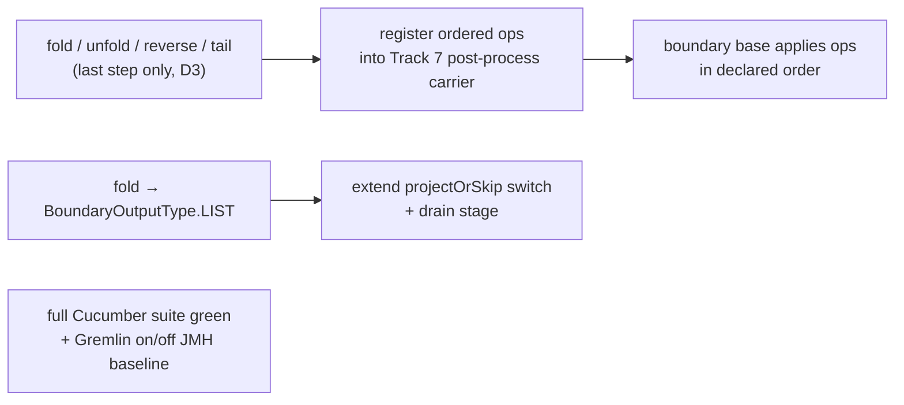

<!-- workflow-sha: d2dfcc2d44fabd3ac76c5fd7620f1e6013675ad9 -->
# Track 9: List-shaping terminators + hardening — Cucumber green + JMH baseline

## Purpose / Big Picture
After this track the four list-shaping terminators (`fold` / `unfold` / `reverse` / `tail`) translate as last steps, the full TinkerPop Cucumber suite is green with the strategy registered, and a Gremlin-on-vs-off JMH baseline measures the translator's value with the plan cache enabled. This is the last Phase 1 track — it completes the recognised set and validates the whole feature across all prior tracks.

<!-- Reserved for Move 2 — ADDED/MODIFIED/REMOVED triad. Empty until Move 2 lands. -->

Third slice of the split final track (see plan D8 / D3 and the pre-split reviews under `track-7/reviews/pre-split/`). The terminators register ordered ops into the post-process carrier Track 7 built; the Cucumber gate also exercises Track 8's union.

## Progress
- [ ] Review + decomposition
- [ ] Step implementation
- [ ] Track-level code review
- [ ] Track completion

## Surprises & Discoveries
<!-- Continuous-log. Empty at Phase 1. -->

## Decision Log
<!-- Continuous-log. -->
Canonical decisions are plan D3 (last-step boundary) and the ordered post-process carrier from Track 7. Open realization notes for decomposition:
- **Run Cucumber before adding terminators.** The strategy has been on by default since Track 2, but the full ~1900-scenario suite has never been a per-track gate, so this track's first run is the first whole-feature check. Run it up front to separate pre-existing cross-track mistranslations from regressions this track introduces (pre-split R4).
- **JMH must pin recognised shapes.** A wholesale LDBC-SQL mirror mostly measures Phase-2 non-goal shapes that decline on *and* off (null delta); the harness pins verified-recognised Gremlin shapes and asserts the boundary step is installed (pre-split R5/A7).

<!-- Reserved for Move 1 — per-track inlined Decision Records. -->

## Outcomes & Retrospective
<!-- Continuous-log. -->

## Context and Orientation
The four list-shaping terminators are accepted only as the **last** step (D3): `fold()` → `BoundaryOutputType.LIST` (drain the stream into one `List` traverser; empty input → empty list); `unfold()` flat-maps per emission (needs a cross-call pending-emission buffer, not just a flag); `reverse()` is a per-traverser **value** transform mirroring `ReverseStep.map` (NOT a stream-order reverse); `tail(n)` keeps the last `n` in arrival order via a bounded `ArrayDeque` ring buffer (`n=0` emits nothing, `n<0` declines). They register ordered ops into the Track 7 post-process carrier, so `reverse().unfold()` and `unfold().reverse()` are both accepted with declared order preserved, while `fold().unfold()`, `fold().tail(3)`, and any mid-traversal list-shaper decline.

Two traps the pre-split reviews flagged: (1) adding `BoundaryOutputType.LIST` breaks the compile-exhaustive `projectOrSkip` switch, which must gain a `LIST` case, and `fold`/`unfold`/`tail` are barrier / flat-map / window transforms that need a drain / flat-map / ring-buffer stage (like the existing group `accumulateMap` branch), not per-row `projectOrSkip` cases (pre-split T3/A5). (2) `tail(n)` arrives as either `TailGlobalStep` or `TailGlobalStepPlaceholder`, both implementing `TailGlobalStepContract.getLimit()`, so the recogniser must key on the Contract interface (register both classes) or the placeholder / `GValue` form silently declines — Track 6 already solved the identical shape for `range` by registering `RangeGlobalStep` and its placeholder (pre-split T2/A6).

Hardening: the ~1900-scenario TinkerPop Cucumber suite (`YTDBGraphFeatureTest` in `core`, `EmbeddedGraphFeatureTest` in `embedded`) must be green with the strategy registered (on by default since Track 2 via `QUERY_GREMLIN_TO_MATCH_TRANSLATOR_ENABLED`). This is the first whole-feature gate over all recognisers — union included — so cross-track mistranslations surface here and the triage bucket is unsized until the first run. The Gremlin-on-vs-off JMH suite mirrors the LDBC SQL benchmarks but pins verified-recognised shapes and asserts boundary-step installation.

**Reference-accuracy note.** The `projectOrSkip`-exhaustiveness, `TailGlobalStepContract`/placeholder, and Cucumber-runner facts rest on the pre-split Phase A reviews (grep / read / `javap` on the resolved fork jar; PSI unavailable). Re-verify the `projectOrSkip` switch shape, the `TailGlobalStepContract` interface and placeholder class, and `UnfoldStep`/`ReverseStep`/`FoldStep` mappings via PSI at this track's decomposition.

## Plan of Work
1. **Run the full Cucumber suite early** (strategy on) to establish the pre-terminator green baseline and size the cross-track triage bucket; fix any pre-existing cross-track mistranslation before adding new recognisers.
2. **`FoldStep` recogniser** → `BoundaryOutputType.LIST`; extend the exhaustive `projectOrSkip` switch with a `LIST` case + a drain stage.
3. **`UnfoldStep` / `ReverseStep` / `TailGlobalStep` recognisers** registering ordered ops into the Track 7 post-process carrier: `unfold` flat-map with a pending-emission buffer; `reverse` per-value transform; `tail` bounded ring buffer keyed on `TailGlobalStepContract` (register both `TailGlobalStep` and its placeholder), `n=0` → nothing, `n<0` → decline. Mid-traversal use declines (D3). Composition: `reverse().unfold()` / `unfold().reverse()` accepted (order preserved); `fold().unfold()` / `fold().tail(3)` decline.
4. **Relax the post-union suffix allow-list** — `GremlinStepWalker.POST_UNION_RECOGNISERS`, today `count` / `range` / `dedup` — to admit the four list-shaping terminator recognisers (Track 8 DR-U4). Both readers of the set are the walker's own (`dispatchAll`'s fail-closed gate and `postUnionSuffixTranslatable`'s look-ahead, the latter letting `UnionStepRecogniser` decline before forking), so adding the recognisers to the one field covers both paths. `MultipleExecutionStream` (DR-U1) already concatenates the child plans into one stream, so `union(...).fold()` folds the concatenation once rather than per child; the terminators register into the same post-process carrier they use off a non-union boundary.
5. **Terminator-composition + boundary tests**: `tail` `n=0`/`n<0`, empty-input `fold`, `reverse` value-transform-not-reorder, `unfold` buffer, declared-order combinations, placeholder-form `tail`.
6. **Re-run the full Cucumber suite green** with terminators registered; add the per-step scenario catalogue. Read Track 10's step-0 failure-list artifact rather than re-deriving the baseline — that run already enumerated the full `core` failure set, including the Cucumber runner, and recorded which failures were deferred as pre-existing branch debt.
7. **Add the mirrored Gremlin JMH benchmark classes + on/off harness** pinned to verified-recognised shapes, asserting boundary-step installation; capture a baseline with the plan cache enabled. Include a `g.V(rid)` by-id shape: RID-bearing walks set `cacheEligible=false`, so a by-id lookup compiles an uncached MATCH plan where the native path ran no query at all, and that is the one shape where translator-on can be strictly slower than translator-off (Track 10 R2).

## Concrete Steps
<!-- Phase A placeholder. -->

## Episodes
<!-- Continuous-log. Empty at Phase 1. -->

## Validation and Acceptance
- `fold()` materializes the whole stream into one list traverser (empty input → empty list); `unfold()` flat-maps per emission; `reverse()` transforms the per-traverser value without reordering the stream; `tail(n)` keeps the last `n` in arrival order (`n=0` → nothing, `n<0` → decline; the `TailGlobalStepPlaceholder` form is recognised). All match native.
- `reverse().unfold()` / `unfold().reverse()` translate with declared order preserved; `fold().unfold()`, `fold().tail(3)`, and any mid-traversal list-shaper decline.
- `union(...).fold()` / `union(...).unfold()` / `union(...).reverse()` / `union(...).tail(n)` translate and match native as multisets; `fold()` after a union yields one list over the concatenated child streams, not one list per child.
- The full TinkerPop Cucumber suite is green with the strategy registered — no previously-passing scenario regresses (union and all prior tracks included).
- The Gremlin-on-vs-off JMH suite runs on verified-recognised shapes, asserts the boundary step is installed, and produces a baseline comparison with the plan cache enabled.

<!-- Phase A placeholder for per-step EARS/Gherkin lines. -->

<!-- Reserved for Move 3 — acceptance lines. -->

## Idempotence and Recovery
<!-- Phase A placeholder. -->

## Artifacts and Notes
<!-- Continuous-log (rare). Often empty. -->

## Interfaces and Dependencies
**In scope (new):** `FoldStep` / `UnfoldStep` / `ReverseStep` / `TailGlobalStep` recognisers; `BoundaryOutputType.LIST` + the `projectOrSkip` case + drain / flat-map / ring-buffer stages; the mirrored Gremlin JMH benchmark classes + on/off harness; terminator-composition + `tail`-boundary tests; the per-step scenario catalogue.
**In scope (modified):** the Track 7 boundary base (`LIST` materialization + ordered post-process op application); `BoundaryOutputType` enum (`LIST`); `GremlinStepWalker` — the `POST_UNION_RECOGNISERS` allow-list (DR-U4 — admit the four terminators) plus the new recogniser registry entries; Cucumber fixes if any scenario regresses.
**Out of scope:** the boundary base extraction + ordered post-process carrier (Track 7); the union recogniser and `MultiPlanMatchStep` internals (Track 8) — `GremlinStepWalker`'s `POST_UNION_RECOGNISERS` allow-list is in scope here (DR-U4); edge-bearing OR, `optional`, variable-depth `repeat`, approximate count (Phase 2).
**Inter-track dependencies:** depends on Track 7 (`LIST` rides the boundary base + the ordered post-process carrier), Track 8 (the full Cucumber gate validates union too), and Track 10, which restores a green `core` unit-test run — Track 9's Cucumber and JMH gates read a red baseline as noise. Last Phase 1 track; validates every prior track via the full Cucumber re-run and the JMH baseline.
**Signatures:** `GremlinStepWalker.POST_UNION_RECOGNISERS` (currently `CountGlobalStepRecogniser` / `RangeGlobalStepRecogniser` / `DedupGlobalStepRecogniser`), read by `dispatchAll` and `postUnionSuffixTranslatable`; `TailGlobalStepContract.getLimit()` (+ `TailGlobalStep` / `TailGlobalStepPlaceholder`); `UnfoldStep.flatMap` / `ReverseStep.map` / `FoldStep` (TP reference semantics); `YTDBGraphFeatureTest` / `EmbeddedGraphFeatureTest` (Cucumber runners); the `jmh-ldbc` module (benchmark mirror template); the Track 7 boundary base + ordered post-process carrier.

## Invariants & Constraints
<!-- Combined per-track invariants + constraints (conventions-execution.md §2.1 §14).
Added by workflow migration (#1145). Strategic invariants/constraints for this track remain
in implementation-plan.md § High-level plan (Architecture Notes) and this track's ## Decision
Log — the conservative migration retained the plan Architecture Notes rather than folding them here. -->

## Base commit
<!-- Phase B records the HEAD SHA here at session start; Phase C reads it to compute the
cumulative track diff (conventions-execution.md §2.1 §15). Added by workflow migration (#1145). -->
