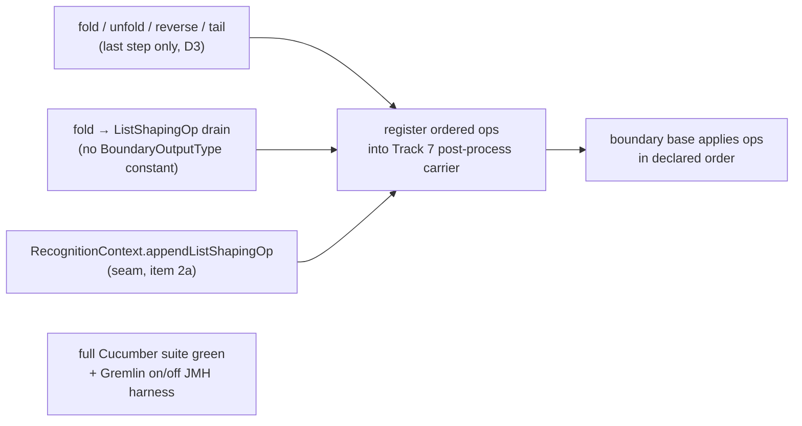

<!-- workflow-sha: d2dfcc2d44fabd3ac76c5fd7620f1e6013675ad9 -->
# Track 9: List-shaping terminators + hardening — Cucumber green + JMH harness

## Purpose / Big Picture
After this track the four list-shaping terminators (`fold` / `unfold` / `reverse` / `tail`) translate as last steps, the full TinkerPop Cucumber suite is green with the strategy registered, and a Gremlin-on-vs-off JMH harness lands and compiles with the plan cache enabled. The baseline **numbers** are captured out of track on Hetzner: `jmh-ldbc` has no self-contained fixture graph, so nothing is measurable locally (T9/T12). This is the last Phase 1 track — it completes the recognised set and validates the whole feature across all prior tracks.

<!-- Reserved for Move 2 — ADDED/MODIFIED/REMOVED triad. Empty until Move 2 lands. -->

Third slice of the split final track (see plan D8 / D3 and the pre-split reviews under `track-7/reviews/pre-split/`). The terminators register ordered ops into the post-process carrier Track 7 built; the Cucumber gate also exercises Track 8's union.

## Progress
- [ ] Review + decomposition
- [ ] Step implementation
- [ ] Track-level code review
- [ ] Track completion

## Surprises & Discoveries
<!-- Continuous-log. Empty at Phase 1. -->

## Decision Log
<!-- Continuous-log. -->
Canonical decisions are plan D3 (last-step boundary) and the ordered post-process carrier from Track 7. Open realization notes for decomposition:
- **Run Cucumber before adding terminators.** The strategy has been on by default since Track 2, but the full ~1900-scenario suite has never been a per-track gate, so this track's first run is the first whole-feature check. Run it up front to separate pre-existing cross-track mistranslations from regressions this track introduces (pre-split R4).
- **JMH must pin recognised shapes.** A wholesale LDBC-SQL mirror mostly measures Phase-2 non-goal shapes that decline on *and* off (null delta); the harness pins verified-recognised Gremlin shapes and asserts the boundary step is installed (pre-split R5/A7).
- **Recompute the failure inventory whenever the base SHA is recomputed.** Track 10's central discovery, and load-bearing here because this track establishes a baseline in item 1 and reads it again in item 6. Track 10's step-1 inventory ran before the 2026-08-02 rebase; the rebase restored three TinkerPop compliance executions the branch had never run, so the command the inventory described stopped being the command the criterion read. A Phase C handoff then compared HEAD against that stale list and concluded the track had introduced 22 failures, where a control run at the post-rebase base measured 300 there against 21 at the tip. A failure inventory is valid only against the commit it was taken at, and a rebase invalidates it exactly as it invalidates a recorded base SHA — recompute both together (DR-U6 addition, recorded in `plan/track-10/core-compliance-failure-dispositions.md` § Why the original inventory does not answer this).

<!-- Reserved for Move 1 — per-track inlined Decision Records. -->

## Outcomes & Retrospective
<!-- Continuous-log. -->

- **Predicted complexity tag: `high`** (derived at Phase A, not at Phase 1 — this track file predates the per-track complexity tag format, so no prediction was on disk). Two of the seven HIGH triggers fire centrally over `## Plan of Work` + `## Interfaces and Dependencies`: **Architecture / cross-component coordination** (item 1a lands on the shared MATCH planner filter-binding path that GQL and SQL MATCH both use, plus the `RecognitionContext` seam and the union-suffix allow-list) and **Performance hot path** (`aliasFilters` interacts with pre-filter descriptors, hash-join branches, and `$matched` back-refs; the track also carries a benchmark harness). Panel: Technical + Risk + Adversarial. A predicted `high` track cannot diverge upward, so no missed-reviewer reconciliation pass applies.
- [x] Technical: PASS at iteration 3 (18 findings, 18 accepted). Two blockers reshaped the track's mechanism. T1 killed `BoundaryOutputType.LIST`: `projectOrSkip` is a per-row projector, so an N→1 drain has no expressible arm, and re-pinning `outputType` to `LIST` would erase the per-element projection mode the drain needs to build the list's contents — all four terminators ride Track 7's ordered `ListShapingOp` carrier instead, so the track adds no enum constant and no switch arm. T2 found the recognisers have no way to *read* `ResultShaping.listShapingOps()`, so `values("name").fold()` would silently wipe `PropertiesStepRecogniser`'s presence keys and `reverse().unfold()` could not compose; the fix adds a `RecognitionContext.appendListShapingOp` seam, promoted to item 2a ahead of the fold recogniser. Six should-fix findings closed silent-wrong-answer paths the plan had not seen: `FoldStep` is two steps in one class and the seeded `fold(seed, operator)` must decline (T4); `UnfoldStep.flatMap` dispatches five ways, and its `Map → entrySet()` arm carries `groupCount().unfold()` and `valueMap().unfold()` (T5); a union *child* carrying a `fold`/`tail` op is gated only by lambda reference identity today and needs an explicit decline (T3); item 1a's blast radius reaches GQL and must not defeat `rebindFilters`' post-optimization strip (T8); `ListShapingOp`'s javadoc asserts a once-per-child rebuild that does not happen (T6); re-arm and clone share op instances and had no acceptance line (T7). T9 split the JMH deliverable — `jmh-ldbc` has no self-contained fixture graph, so no baseline is capturable locally, and the installation check must throw rather than `assert`, which JMH forks disable. The gate check corrected two of the review's own errors (T15) and one of mine (T10: `BoundaryOutputType` has four constants, not the three this Pre-Flight recorded). Sizing moved from ~18–26 to ~22–30 files, above the ~20–25 split-candidate bound — carried into the adversarial pass rather than acted on here.

## Context and Orientation
The four list-shaping terminators are accepted only as the **last** step (D3): `fold()` registers a `ListShapingOp` that drains the upstream payload iterator into one `List` and emits it as a single payload (a dry upstream still emits one empty list), leaving `outputType` at whatever the preceding step pinned — no `BoundaryOutputType` constant is added (T1); `unfold()` flat-maps per emission (needs a cross-call pending-emission buffer, not just a flag); `reverse()` is a per-traverser **value** transform mirroring `ReverseStep.map` (NOT a stream-order reverse); `tail(n)` keeps the last `n` in arrival order via a bounded `ArrayDeque` ring buffer (`n=0` emits nothing, `n<0` declines). They register ordered ops into the Track 7 post-process carrier, so `reverse().unfold()` and `unfold().reverse()` are both accepted with declared order preserved, while `fold().unfold()`, `fold().tail(3)`, and any mid-traversal list-shaper decline.

Two traps the pre-split reviews flagged, the first of them inverted by this track's Phase A technical review: (1) a `BoundaryOutputType.LIST` constant is the wrong mechanism and is **not** added. `projectOrSkip` is a per-row projector — one MATCH row in, one traverser payload or the `SKIP` sentinel out — so an N→1 drain has no expressible arm there. Worse, `outputType` is the one thing that tells the boundary how to project each element, so re-pinning it to `LIST` would erase exactly what the drain needs to build the list's contents: `g.V().fold()` needs `ELEMENT` per row, `g.V().values("name").fold()` needs `SINGLE_VALUE`, `g.V().valueMap().fold()` needs `MAP`. All four terminators are barrier / flat-map / window / value transforms riding Track 7's ordered `ListShapingOp` carrier through `AbstractMatchPlanStep.applyListShaping`. Nor do they belong "alongside the existing group `accumulateMap` branch": `accumulateMap` selects a *source* in `openShapedPayloads`, which sits outside `applyListShaping` and could not order `reverse().unfold()` against `unfold().reverse()` — the reason Track 7 built an ordered carrier at all (T1). (2) `tail(n)` arrives as either `TailGlobalStep` or `TailGlobalStepPlaceholder`, both implementing `TailGlobalStepContract.getLimit()`, so the recogniser must key on the Contract interface (register both classes) or the placeholder / `GValue` form silently declines — Track 6 already solved the identical shape for `range` by registering `RangeGlobalStep` and its placeholder (pre-split T2/A6).

Hardening: the ~1900-scenario TinkerPop Cucumber suite (`YTDBGraphFeatureTest` in `core`, `EmbeddedGraphFeatureTest` in `embedded`) must be green with the strategy registered (on by default since Track 2 via `QUERY_GREMLIN_TO_MATCH_TRANSLATOR_ENABLED`). This is the first whole-feature gate over all recognisers — union included — so cross-track mistranslations surface here; the Cucumber half of the triage bucket is unsized until the first run, while its process-compliance half arrives enumerated from Track 10 (Plan of Work item 1). The Gremlin-on-vs-off JMH suite mirrors the LDBC SQL benchmarks but pins verified-recognised shapes and asserts boundary-step installation.

**The boundary base's lifecycle grew during Track 10.** `AbstractMatchPlanStep.State` now carries seven constants — `NEW`, `OPEN`, `DRAINED`, `REARMED`, `CLOSED`, plus Track 10's `CLOSED_UNSTARTED` and `REARMED_AFTER_CLOSE`. `NEW` now means "this step's plan has never been touched" and holds a real invariant: every route that closes or otherwise consumes the plan must record a state, because `AbstractExecutionStep`'s close guard is sticky and a plan left `NEW` after closing makes the next open start a dead chain that yields no rows. Three sites read `NEW` as pristine — the rewind skip in `openArming()`, `close()`'s mapping to `CLOSED_UNSTARTED`, and `reset()`'s `CLOSED_UNSTARTED`-to-`NEW` edge. The enum is `private`, so the base class is the only thing that switches on it, and the base class is exactly where this track's drain / flat-map / value-transform / ring-buffer `ListShapingOp`s are applied. Any stage added there that releases the plan records a state.

**Reference-accuracy note.** The `projectOrSkip`-exhaustiveness, `TailGlobalStepContract`/placeholder, and Cucumber-runner facts rest on the pre-split Phase A reviews (grep / read / `javap` on the resolved fork jar; PSI unavailable). Re-verify the `projectOrSkip` switch shape, the `TailGlobalStepContract` interface and placeholder class, and `UnfoldStep`/`ReverseStep`/`FoldStep` mappings via PSI at this track's decomposition.

### Clarifications
- **Reference accuracy at this Pre-Flight is file-and-grep-based, not PSI.** mcp-steroid is reachable and its open project matches this working tree, but `steroid_execute_code` times out on this repository (cold kotlinc exceeds the MCP call limit), so the pre-flight verifications behind the amendments above — the `AbstractMatchPlanStep.State` constant list, `BoundaryOutputType`'s four existing constants (`ELEMENT` / `MAP` / `SINGLE_VALUE` / `SCALAR` — this bullet first recorded three, missing `SCALAR`, which Track 6's aggregations added; corrected by technical-review finding T10), and the `core/pom.xml` surefire execution shape — were read directly from the files rather than resolved through PSI. They are literal-text reads of declarations, so the confidence is high, but the "no other reader" and "no other caller" class of claim is not established here. The existing reference-accuracy note above still applies, and its re-verification list stands.
- **Track 10's episode says the boundary base reached six lifecycle states; the enum holds seven.** The pre-existing set was five and Track 10 added two. The amendment above records seven.
- **Track 10's "`core`'s Cucumber runner is inert" discovery no longer holds.** It was measured before the 2026-08-02 rebase and instructed this Pre-Flight to correct the runner list in `## Context and Orientation`. Read at HEAD instead: develop's `9b9dfa20fd` gives `YTDBGraphFeatureTest` its own `gremlin-feature-compliance-tests` surefire execution inside the `gremlin-compliance-suites` profile (activated on `!test`), with `<failIfNoTests>true</failIfNoTests>` and no group filter, while `sequential-tests` excludes `**/gremlintest/**`. The core Cucumber runner executes under `./mvnw -pl core test`. The runner list above is correct as written; item 6's baseline claim was the part that needed correcting, and that is where the amendment landed.
- **No CI signal backs the green claim.** Track 10's `[run-ci]` draft-PR token was reverted with its withdrawn Plan-of-Work item 4, so PR #1038 still reports `skipping` on every check and the CI-detection hole is open. Every gate in this track is verified locally.
- **`MatchStatementExecutionTest` is unowned and costs about 32 minutes for 156 tests.** It was parked on Track 10's withdrawn item 4. This track pays it on every full `core` run; folding its 1000-transaction fixture is not claimed here.

## Plan of Work
1. **Run the full Cucumber suite early** (strategy on) to establish the pre-terminator green baseline and size the cross-track triage bucket; fix any pre-existing cross-track mistranslation before adding new recognisers. The bucket's process-compliance half already arrives enumerated: 21 `gremlin-process-compliance-tests` failures survive Track 10, each failing byte-identically at its base, all deferred here with per-class dispositions in `plan/track-10/core-compliance-failure-dispositions.md`. Nine carry item 1a's dropped-filter signature (`HasTest` ×5, `AndTest` ×2, `WhereTest`, `SelectTest`); the other twelve are separate defects — `ValueMapTest` ×2 and `PropertiesTest` ×2 (`ClassCast` on boundary value shaping), `MeanTest` / `SumTest` / `GroupCountTest` (numeric conversion and an NPE), `GroupTest` / `ElementMapTest` (cardinality), `OrderTest` (ordering divergence), `PartitionStrategyProcessTest`, and `SubgraphStrategyProcessTest`. Only the Cucumber half is unsized.
   1a. **Fix the dropped per-alias filter first.** Track 10's Phase C localized a translator defect that this item inherits, so the triage bucket starts with a known member rather than an empty list. On the translated path a per-alias `WHERE` reaches only the alias the planner selects as root; every other alias's filter has no consumer and is silently discarded. Measured on the four-vertex modern graph (marko -knows-> vadas, josh; -created-> lop) with the strategy on: `g.V(marko).out().hasId(vadas)`, `g.V(marko).out().has(name, vadas)`, `g.V(marko).out().hasLabel(software)`, and `g.V().has(name, marko).out().has(name, vadas)` each return 3 rows where native returns 1. `g.V().out().hasId(vadas)` and `g.V(marko, josh).out().hasId(vadas)` return the correct single row, but by accident: a pinned RID collapses the target alias's estimate, so that alias wins root selection and `addPrefetchSteps` / `createSelectStatement` read its filter straight from `aliasFilters`. All six translate — exactly one boundary step, no decline — so the wrong answers are silent. Mechanism: `MatchEdgeTraverser` reads the target constraint from the pattern item's AST (`item.getFilter().getFilter()` and `.getClassName()`) rather than from `aliasFilters`, and `MatchPatternBuilder` builds positive path items through `SQLMatchFilter.fromAliasAndClass(toAlias, null)` with neither a `WHERE` nor a class. The one routine that would populate them, `rebindFilters`, walks `matchExpressions`, which is empty on the additive translator path because the pattern arrives pre-built. `MatchPatternBuilder.mergedTargetFilter` already performs this merge for NOT expressions and is the natural extension point. Fixing this before the terminators keeps the Cucumber baseline from attributing multi-hop mistranslation to the new recognisers. Every claim in this paragraph was verified against live code by the Phase A technical review (certificate C11). Two additions it required (T8). **The blast radius reaches GQL.** `GqlMatchStatement` enters the planner through `new MatchExecutionPlanner(ir.pattern(), ir.aliasClasses(), ir.aliasFilters())` — the same pattern-plus-alias-maps entry the translator uses, with `matchExpressions` left empty — and `GqlMatchPatternAssembler` builds `ir` through the same shared `MatchPatternBuilder` (D6). GQL therefore satisfies both preconditions of the defect, so any fix inside `MatchPatternBuilder` moves GQL's IR with it. Add a GQL witness: one GQL `MATCH` with a filter on a non-root alias, asserted before and after. **The fix site must answer `rebindFilters`' original purpose.** That routine exists to push *post-optimization* filters back into the item AST — its call site at `MatchExecutionPlanner:2064` carries the comment that `detectNotInAntiJoin()` may have stripped NOT IN conditions from `aliasFilters`, and without the push-back the MatchStep would evaluate the original un-stripped filter. A fix that pre-populates item filters at build time while `matchExpressions` stays empty leaves that push-back still never running, so a stripped `NOT IN` would be left standing in the item AST. Name the chosen site explicitly and say how the strip is preserved on the empty-`matchExpressions` path; rebinding over the `Pattern`'s edge items rather than `matchExpressions` is the option that keeps `rebindFilters`' purpose intact, since `MatchPatternBuilder.buildNotExpression` shows the pattern's edges hold the very `SQLMatchPathItem` objects the traverser reads.
2. **The `RecognitionContext` append seam, then the `FoldStep` recogniser.** The seam lands first because the fold recogniser cannot be built without it — 2b's own `g.V().values("name").fold()` case is 2a's motivating example, so reading order and dependency order have to agree (T13).

   **2a. Add the append seam to `RecognitionContext` (T2 — blocker).** All four recognisers must *append* to `ResultShaping.listShapingOps()`, and today they cannot read what is there. `RecognitionContext` exposes only `void setResultShaping(@Nonnull ResultShaping shaping)`, whose javadoc pins the contract as "a terminator builds the exact combination from `ResultShaping#NONE` plus its overrides and calls this once". Two of this track's own accepted shapes break that contract: `g.V().values("name").fold()`, where `PropertiesStepRecogniser` has already pinned `dropOnAbsent` plus the presence keys that a `NONE`-based rebuild would silently wipe; and `reverse().unfold()` / `unfold().reverse()`, where two ops must land in one ordered list and the second recogniser cannot see the first one's op. `WalkerContext` holds the field and a package-private `shaping()` reader, but neither is on the interface the recognisers see. Add `void appendListShapingOp(@Nonnull ListShapingOp op)` to `RecognitionContext` and implement it on `WalkerContext` as `withListShapingOps(existing + op)` — `ResultShaping.withListShapingOps(@Nonnull List<ListShapingOp>)` exists and replaces the list wholesale, with no production caller yet. Update the `setResultShaping` javadoc's "calls this once" clause in the same commit. Two limits to write down where the seam is specified rather than rediscover later (T13): `setResultShaping` **remains a full replace** of the whole record including `listShapingOps`, so the append's no-clobber guarantee covers only recognisers that use the new method, and what keeps the two from colliding is D3's last-step rule plus the fact that `UnionStepRecogniser`'s `setResultShaping(agreedShaping)` runs before any suffix op appends. Decide `SubTraversalPredicateAdapter` explicitly — it swallows `setResultShaping` outright today, and a swallowed *append* inside a combinator child means the child silently loses a list-shaper it appeared to accept, so declining is the safer answer.

   **2b. `FoldStep` recogniser** registering a `ListShapingOp` that drains the upstream payload iterator into one `List` and emits it as a single payload; a dry upstream still emits one empty list. `outputType` stays at whatever the preceding step pinned, so no `BoundaryOutputType` constant and no `projectOrSkip` arm is added (T1). The recogniser **declines when `!step.isListFold()`**. `FoldStep` is two steps wearing one class: `javap` on the resolved fork jar shows `FoldStep(Traversal.Admin)` for the list fold and `FoldStep(Traversal.Admin, Supplier, BiFunction)` for the seeded reduce that `fold(seed, operator)` compiles to, distinguished by a `listFold` boolean behind `isListFold()`. D9 keys the registry on the concrete runtime class, so one entry claims both forms, and mapping both to a list drain would turn `g.V().values("age").fold(0, Operator.sum)` from one summed scalar into a list of ages — translated rather than declined, so silent, the same failure mode as item 1a (T4).
3. **`UnfoldStep` / `ReverseStep` / `TailGlobalStep` recognisers** registering ordered ops into the Track 7 post-process carrier: `unfold` flat-map with a pending-emission buffer; `reverse` per-value transform; `tail` bounded ring buffer keyed on `TailGlobalStepContract` (register both `TailGlobalStep` and its placeholder — `TailGlobalStepContract.CONCRETE_STEPS` is `List.of(TailGlobalStep.class, TailGlobalStepPlaceholder.class)` and is the registration source of truth rather than two hand-written literals), `n=0` → nothing, `n<0` → decline. Mid-traversal use declines (D3). Composition: `reverse().unfold()` / `unfold().reverse()` accepted (order preserved); `fold().unfold()` / `fold().tail(3)` decline.

   **3a. Pin `unfold`'s full five-way contract (T5).** `UnfoldStep.flatMap`'s bytecode dispatches on the traverser value five ways, not one: `Iterator` returned as-is; `Iterable` via `.iterator()`; **`Map` via `.entrySet().iterator()`**; array per-element (`handleArrays`, both `Object[]` and primitive arrays by reflection); anything else via a one-element `IteratorUtils.of(value)`. The `Map` arm is load-bearing here because `MAP` is a live boundary output type — `group()`, `groupCount()`, `valueMap()`, `elementMap()`, `project()`, and multi-alias `select()` all pin it, and `AbstractMatchPlanStep.projectMap` / `accumulatedGroupMapSource` emit `LinkedHashMap` payloads — so `g.V().groupCount().unfold()` and `g.V().valueMap().unfold()` are ordinary idioms present in the Cucumber suite this track must turn green. The one-element arm matters too: `g.V().unfold()` over `ELEMENT` payloads passes each vertex through unchanged rather than dropping it. Correct `ListShapingOp`'s one-line `unfold` description, which today says only "expands a list payload into its elements".

   **3b. Read the limit without pinning the GValue (T11).** `TailGlobalStepPlaceholder.getLimit()` is not a pure read: it checks `GValue.isVariable()` and, when true, calls `traversal.getGValueManager().pinVariable(name)` before returning the concrete `Long`. So reading the limit and then declining on `n<0` leaves the traversal's GValue manager mutated and a parameterised `tail(n)` stripped of its variable status at strategy time. This is precedent-consistent — `RangeGlobalStepPlaceholder.getLowRange()` has byte-identical pinning and `RangeGlobalStepRecogniser.normalize` reads it before its own decline branches, and the mutation lands on TinkerPop's GValue manager rather than on `WalkerContext`, so D9's no-mutation-on-decline discipline is not literally violated. Choose deliberately: read `getLimitAsGValue()` and decline on `isVariable()` before touching `getLimit()`, or match the Track 6 precedent and record why.
4. **Relax the post-union suffix allow-list** — `GremlinStepWalker.POST_UNION_RECOGNISERS`, today `count` / `range` / `dedup` — to admit the four list-shaping terminator recognisers (Track 8 DR-U4). Both readers of the set are the walker's own (`dispatchAll`'s fail-closed gate and `postUnionSuffixTranslatable`'s look-ahead, the latter letting `UnionStepRecogniser` decline before forking), so adding the recognisers to the one field covers both paths. `MultipleExecutionStream` (DR-U1) already concatenates the child plans into one stream, so `union(...).fold()` folds the concatenation once rather than per child; the terminators register into the same post-process carrier they use off a non-union boundary. The technical review confirmed the concatenation claim against code — `MultiPlanMatchStep.startPlanStream()` returns one `MultipleExecutionStream` and the base's `openShapedPayloads()` runs once per arming over it — and turned up two things this item must also carry.

   **4a. Gate a union *child* that carries a list-shaping op (T3).** `union(__.out().fold(), __.in().fold())` must decline; native produces one list per child, and translating it would produce one list over the concatenation. Today the only thing standing between the track and that silent wrong answer is lambda reference identity: `UnionStepRecogniser` walks each child to a full single-plan translation and then compares `!agreedShaping.equals(childResult.shaping())`, and `ResultShaping` is a record whose `equals` compares `listShapingOps` element-wise. Per-call `new` instances happen to compare unequal and decline by accident; record singletons — this codebase's own house style for such ops, see `PostConcatOp.Count.INSTANCE` / `PostConcatOp.Dedup.INSTANCE`, and the natural shape for a parameterised `tail` is `record TailOp(long n)` — compare equal, the union accepts, and the wrong answer ships. Nothing in the child walk tells the fork it is a union child, so D3's last-step rule does not stop it: from the child's point of view the `fold()` *is* the last step. Add an explicit decline when any child's `shaping().listShapingOps()` is non-empty, checked before and independently of the `agreedShaping.equals` comparison. `unfold` and `reverse` are unaffected in principle — both are per-payload, so once-over-the-concatenation and once-per-child coincide; only the two window drains, `fold` and `tail`, diverge. The gate is nonetheless **deliberately blanket rather than fold/tail-only** (T14), because `ListShapingOp` carries no op-type discriminator and adding one — a `sealed` hierarchy or a type tag — is not work this track claims. `union(__.unfold(), __.unfold())` therefore declines as collateral: coverage lost, no correctness risk, and no worse than today, where an unrecognised `UnfoldStep` inside a child declines the fork anyway. It stays a Phase 2 shape. This gate and the union *suffix* path are disjoint by construction: 4a inspects `childResult.shaping()` inside the child loop, while a suffix op appends onto `agreedShaping` after `setResultShaping`, and the base applies it once over the `MultipleExecutionStream`.

   **4b. Correct `ListShapingOp`'s javadoc, which contradicts this item (T6).** It says the boundary base rebuilds its shaped iterator "once per child plan for a multi-plan boundary". That clause is false — nothing in `AbstractMatchPlanStep` or `MultiPlanMatchStep` rebuilds per child, and `MultiPlanMatchStep`'s own class javadoc states the opposite outright. An implementer taking it at face value would conclude `union(...).fold()` yields one list per child, the exact outcome `## Validation and Acceptance` forbids. Replace the parenthetical with the multi-plan reality (one arming spans the whole concatenation; a re-arm rebuilds). The surrounding advice in that paragraph — allocate the buffer inside the returned iterator, hold no state across calls — stays correct for the reset-and-reopen case.
5. **Terminator-composition + boundary tests**: `tail` `n=0`/`n<0`, empty-input `fold`, `reverse` value-transform-not-reorder, `unfold` buffer, declared-order combinations, placeholder-form `tail`. Four groups the technical review added. **Decline cases** (each translated-but-wrong today if missed): `fold(seed, operator)` (T4), `union(__.out().fold(), __.in().fold())` and `union(__.out().tail(1), __.in().tail(1))` (T3). **`unfold` payload shapes**: at minimum `groupCount().unfold()` and `valueMap().unfold()` matched against native, plus an array and a scalar payload (T5). **Re-arm**: a `fold()` and a `tail(n)` boundary produce identical results across `toList(); reset(); toList()`, exercised from both `DRAINED` (reset before close) and `CLOSED` (reset after close, the `REARMED_AFTER_CLOSE` route). `applyListShaping` calls `op.apply(...)` afresh on every open, so an op that allocates its buffer once outside the returned iterator replays the first pass's payloads on the second (T7). **Clone**: two clones of a `fold()` boundary iterated concurrently each see their own full result. `AbstractStep.clone()` copies `shaping` by reference and `resetLifecycleForClone()` deliberately does not touch it, so two concurrent clones share the same `ListShapingOp` instances — a stateful `fold` or `tail` op is then a data race, not merely a re-arm bug, and the ops most likely to be written as shared singletons (4a) are exactly the two that need buffers. `MultiPlanMatchStepTest` already has the clone-isolation idiom to copy (T7).
6. **Re-run the full Cucumber suite green** with terminators registered; add the per-step scenario catalogue. The baseline this reads is `plan/track-10/core-compliance-failure-dispositions.md`, **not** Track 10's step-0 `core-test-failure-inventory.md` — the dispositions file supersedes the inventory, which measured a pre-rebase suite set and says so itself. Neither artifact holds a Cucumber baseline: the dispositions table carries rows for `default-test`, `sequential-tests`, `gremlin-process-compliance-tests`, and `gremlin-structure-compliance-tests`, and none for `gremlin-feature-compliance-tests`. So item 1's run derives the first Cucumber baseline this branch has; there is nothing to read for that half.
7. **Add the mirrored Gremlin JMH benchmark classes + on/off harness** pinned to verified-recognised shapes, asserting boundary-step installation. Include a `g.V(rid)` by-id shape: RID-bearing walks set `cacheEligible=false`, so a by-id lookup compiles an uncached MATCH plan where the native path ran no query at all, and that is the one shape where translator-on can be strictly slower than translator-off (Track 10 R2, still the pathological case after Track 10's promotion fix — the per-call recompile is unfixed).

   **7a. The deliverable splits, because the baseline is not capturable locally (T9).** `LdbcBenchmarkState` is `jmh-ldbc`'s only `@State` and it reuses a pre-built database or loads one from the LDBC CSV dataset — a ~21-minute SF 1 load, or a pre-built archive fetched from Hetzner Object Storage. No dataset, no run, and the module has no self-contained fixture graph, so "capture a baseline" and this track's every-gate-verified-locally clarification cannot both hold. The module can still host the work: `LdbcBenchmarkState` already carries a `YTDBGraphTraversalSource traversal` field and the benchmark-base/`@State` split gives the on/off harness a template. **In-track:** the mirrored classes plus the on/off harness land and compile, and the boundary-installation check is exercised by a plain JUnit test in `jmh-ldbc/src/test` (where `LdbcQueryCorrectnessTest` already lives). **Out-of-track / explicitly Hetzner-scoped:** the baseline numbers, captured per the `run-jmh-benchmarks-hetzner` skill. **The installation check must throw, not `assert`.** JMH forks run with assertions disabled by default, so a bare Java `assert` would make the harness's central guarantee a no-op in every measured fork; use an explicit `instanceof AbstractMatchPlanStep` check that throws. `GlobalConfiguration.QUERY_GREMLIN_TO_MATCH_TRANSLATOR_ENABLED` exists and is read by `GremlinToMatchStrategy:338`, so the on/off axis itself is real.

## Concrete Steps
<!-- Phase A placeholder. -->

## Episodes
<!-- Continuous-log. Empty at Phase 1. -->

## Validation and Acceptance
- `fold()` drains the whole payload stream into one `List` payload (empty input → one empty list) without adding a `BoundaryOutputType` constant; `unfold()` flat-maps per emission across all five `UnfoldStep.flatMap` arms, `Map` → `entrySet()` and scalar → one-element included; `reverse()` transforms the per-traverser value without reordering the stream; `tail(n)` keeps the last `n` in arrival order (`n=0` → nothing, `n<0` → decline; the `TailGlobalStepPlaceholder` form is recognised). All match native.
- The seeded reduce declines: `g.V().values("age").fold(0, Operator.sum)` produces native's summed scalar, not a list of ages — the `FoldStep` recogniser gates on `isListFold()`.
- A union child carrying a list-shaping op declines: `union(__.out().fold(), __.in().fold())` and `union(__.out().tail(1), __.in().tail(1))` are not translated, and the decline is witnessed by an explicit non-empty-`listShapingOps` gate rather than inferred from op reference identity.
- Terminator ops survive re-arm and clone: a `fold()` and a `tail(n)` boundary return identical results across `toList(); reset(); toList()` from both the `DRAINED` and `CLOSED` routes, and two concurrently-iterated clones of a `fold()` boundary each see their own full result.
- **Order scope for the positional terminators (T16).** `tail(n)` selects by position and `fold()`'s list order is observable, while the branch's equivalence standard is multiset equality (`implementation-plan.md` § "Translator-on and translator-off produce equal result multisets for every `RECOGNIZED` shape"). The two agree only where translated arrival order matches native traversal order, and nothing pins that today — the branch has direct evidence they can diverge, since `OrderTest` is one of the 21 deferred failures, recorded as "Ordering divergence, expected `[josh]` got `[marko]`". So: translated `tail(n)` and `fold()` are validated against native element-for-element for **ordered** inputs (an `order().by(…)` preceding the terminator, which `OrderGlobalStepRecogniser` already translates into a MATCH `ORDER BY`) and as unordered multisets otherwise. A Cucumber scenario asserting a positional result on an unordered input goes to item 1's triage bucket rather than being read as a terminator defect. If item 1's first Cucumber run shows the unordered scenarios passing anyway, downgrade this line to a Decision Log note.
- `reverse().unfold()` / `unfold().reverse()` translate with declared order preserved; `fold().unfold()`, `fold().tail(3)`, and any mid-traversal list-shaper decline.
- `union(...).fold()` / `union(...).unfold()` / `union(...).reverse()` / `union(...).tail(n)` translate and match native as multisets; `fold()` after a union yields one list over the concatenated child streams, not one list per child.
- A filter on a post-hop alias returns the native multiset with the strategy on. At minimum `g.V(marko).out().hasId(vadas)`, `g.V(marko).out().has(name, vadas)`, `g.V(marko).out().hasLabel(software)`, and `g.V().has(name, marko).out().has(name, vadas)` each return one row, and each fails before the item-1a fix. The equivalence suites do not currently witness this: `EdgeTraversalEquivalenceTest` and `PredicateTraversalEquivalenceTest` are both green while those four return three rows, so neither covers a filter on a post-hop alias. Add the shape and watch it fail before changing production code — TS10's pattern at branch scale, where a test names a guarantee no assertion holds.
- The full TinkerPop Cucumber suite is green with the strategy registered — no previously-passing scenario regresses (union and all prior tracks included).
- The Gremlin-on-vs-off JMH suite compiles and runs on verified-recognised shapes, and its boundary-step installation check throws rather than using a Java `assert` (JMH forks disable assertions) and is exercised by a JUnit test in `jmh-ldbc/src/test`. The baseline **numbers** are Hetzner-scoped and not a gate on this track — `jmh-ldbc` has no self-contained fixture graph, so no baseline is capturable locally.
- A GQL `MATCH` with a filter on a non-root alias returns the same rows before and after item 1a's fix, or the changed rows are the corrected ones. GQL reaches the planner through the same `MatchExecutionPlanner(pattern, aliasClasses, aliasFilters)` entry with empty `matchExpressions` and builds its IR through the same `MatchPatternBuilder`, so it satisfies both preconditions of the defect and any builder-level fix moves it too.
- A post-optimization `NOT IN` strip still reaches the item AST after item 1a's fix. `rebindFilters` exists to push `detectNotInAntiJoin()`'s stripped conditions back into the items; a fix that pre-populates item filters at build time while `matchExpressions` stays empty must not leave the un-stripped filter standing.

<!-- Phase A placeholder for per-step EARS/Gherkin lines. -->

<!-- Reserved for Move 3 — acceptance lines. -->

## Idempotence and Recovery
<!-- Phase A placeholder. -->

## Artifacts and Notes
<!-- Continuous-log (rare). Often empty. -->

## Interfaces and Dependencies
**In scope (new):** `FoldStep` / `UnfoldStep` / `ReverseStep` / `TailGlobalStep` recognisers; the four `ListShapingOp` implementations (drain / flat-map / value-transform / ring-buffer) — **no** `BoundaryOutputType` constant and no `projectOrSkip` arm (T1); the `RecognitionContext.appendListShapingOp` seam (T2); the mirrored Gremlin JMH benchmark classes + on/off harness and its `jmh-ldbc/src/test` installation check; terminator-composition + `tail`-boundary + re-arm + clone tests; the per-step scenario catalogue.
**In scope (modified):** `RecognitionContext` (the append seam) + `WalkerContext` (its implementation) + `SubTraversalPredicateAdapter` (the swallow-versus-decline decision) — T2; `UnionStepRecogniser` (the non-empty-`listShapingOps` child gate) — T3; `ListShapingOp` (the false once-per-child javadoc clause, and `unfold`'s one-line description) — T5/T6; `GremlinStepWalker` — the `POST_UNION_RECOGNISERS` allow-list (DR-U4 — admit the four terminators) plus the new recogniser registry entries; four stale sibling javadoc sites the track is already opening (`UnionStepRecogniser`'s "not translated yet" class comment, the "seven flags" wording on `RecognitionContext.setResultShaping` and on `WalkerContext.shaping` — whose "a terminator replaces it through `setResultShaping`" clause becomes actively wrong once 2a adds the append path, while `AbstractMatchPlanStep.shaping` is already current and needs no edit (T15 corrects T10 here) — and `BoundaryOutputType`'s class-javadoc opening sentence naming only `YTDBMatchPlanStep`) — T10; `GqlMatchPatternAssembler` and the Track 1 GQL prettyPrint regression tests, if item 1a's fix lands in the shared builder — T8; Cucumber fixes if any scenario regresses; the per-alias filter binding for non-root aliases (item 1a) — `MatchPatternBuilder`'s positive-path-item construction and its `mergedTargetFilter` merge, plus whichever of `MatchEdgeTraverser`'s AST reads or `rebindFilters`' `matchExpressions` walk the chosen fix touches.
**Out of scope:** the boundary base extraction + ordered post-process carrier (Track 7); the union recogniser and `MultiPlanMatchStep` internals (Track 8) — `GremlinStepWalker`'s `POST_UNION_RECOGNISERS` allow-list is in scope here (DR-U4); edge-bearing OR, `optional`, variable-depth `repeat`, approximate count (Phase 2).
**Inter-track dependencies:** depends on Track 7 (all four terminators ride the boundary base's ordered `ListShapingOp` carrier through `applyListShaping`), Track 8 (the full Cucumber gate validates union too), and Track 10. Last Phase 1 track. The Track 10 dependency is narrower than Phase 1 assumed: Track 10 does **not** hand over a green `core` run. The 2026-08-02 rebase onto `develop` pulled in commit `9b9dfa20fd`, which restored three TinkerPop compliance surefire executions this branch had never run, and 21 pre-existing translator failures survive in `gremlin-process-compliance-tests` after Track 10 closes. What Track 10 does hand over is a measured, enumerated baseline — 300 failing methods at its base `f007749249`, 21 at its tip, each with a recorded disposition — so Track 9's Cucumber and JMH gates compare against a known list instead of reading noise as regression. Read that list before triaging any Cucumber failure. Validates every prior track via the full Cucumber re-run; the JMH harness lands in-track and its numbers are captured out of track.
**Signatures:** `GremlinStepWalker.POST_UNION_RECOGNISERS` (currently `CountGlobalStepRecogniser` / `RangeGlobalStepRecogniser` / `DedupGlobalStepRecogniser`), read by `dispatchAll` and `postUnionSuffixTranslatable` — membership and both readers confirmed by the Phase A technical review; `RecognitionContext.setResultShaping` (today's only shaping mutator) and `WalkerContext.shaping()` (package-private reader); `AbstractMatchPlanStep.applyListShaping` + `openShapedPayloads` + `projectOrSkip` (per-row projector, four arms) + the private seven-constant `State` enum; `ListShapingOp`; `UnionStepRecogniser`'s `agreedShaping.equals(childResult.shaping())` child-agreement check; `FoldStep.isListFold()` (list fold versus seeded reduce); `TailGlobalStepContract.getLimit()` and `CONCRETE_STEPS` (+ `TailGlobalStep` / `TailGlobalStepPlaceholder`); `UnfoldStep.flatMap` / `ReverseStep.map` / `FoldStep` (TP reference semantics); `YTDBGraphFeatureTest` / `EmbeddedGraphFeatureTest` (Cucumber runners); the `jmh-ldbc` module (benchmark mirror template); the Track 7 boundary base + ordered post-process carrier.

## Invariants & Constraints
<!-- Combined per-track invariants + constraints (conventions-execution.md §2.1 §14).
Added by workflow migration (#1145). Strategic invariants/constraints for this track remain
in implementation-plan.md § High-level plan (Architecture Notes) and this track's ## Decision
Log — the conservative migration retained the plan Architecture Notes rather than folding them here. -->

## Base commit
<!-- Phase B records the HEAD SHA here at session start; Phase C reads it to compute the
cumulative track diff (conventions-execution.md §2.1 §15). Added by workflow migration (#1145). -->
