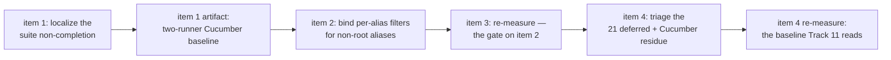

<!-- workflow-sha: d2dfcc2d44fabd3ac76c5fd7620f1e6013675ad9 -->
# Track 9: Cucumber suite completion + the dropped per-alias filter

## Purpose / Big Picture
After this track both TinkerPop feature runners — `core`'s `YTDBGraphFeatureTest` and the `embedded` module's `EmbeddedGraphFeatureTest` — complete with the translator on, each runner's failure set is a committed artifact rather than a promise, and the dropped per-alias filter that silently mistranslates every multi-hop traversal is fixed. Today none of that holds: the `core` suite does not terminate with the strategy enabled, the `embedded` runner has never been measured on this branch at all, and a filter on a non-root alias is discarded without declining, so the wrong answer ships silently.

<!-- Reserved for Move 2 — ADDED/MODIFIED/REMOVED triad. Empty until Move 2 lands. -->

First half of the split final track (inline replan, 2026-08-03 — see `## Decision Log` DR-S1). The list-shaping terminators, the `RecognitionContext` seam, and the JMH harness moved to **Track 11**, which runs after this one and depends on the baseline this track produces.

## Progress
- [ ] Review + decomposition
- [ ] Step implementation
- [ ] Track-level code review
- [ ] Track completion

## Surprises & Discoveries
<!-- Continuous-log. Empty at Phase 1. -->

## Decision Log
<!-- Continuous-log. -->

- **DR-S1 — the final track splits, and the correctness fix goes first.** Phase A's risk review found that the track's headline gate could not be evaluated at all (the feature suite does not complete with the translator on) and that the resulting track carried an unsized engine-level diagnosis in front of a shared-planner correctness fix in front of a four-recogniser feature. The split boundary was already drawn in the file: this track's work shares **no file** with the terminator work — it touches `MatchPatternBuilder` / `MatchExecutionPlanner` / `GqlMatchPatternAssembler` and the equivalence suites, while Track 11 touches `RecognitionContext` / `WalkerContext` / `UnionStepRecogniser` / `ListShapingOp` and the walker registry. Coupling runs one way, Track 11 wanting a base where this track has landed, which is what a stacked-diff series is for. What the split costs is one extra PR boundary and a second full-suite run; what it buys is that a correctness fix on the shared MATCH planner path is reviewed on its own merits rather than arriving in the same diff as four new recognisers. It also keeps this branch off a third consecutive track past the ~4,000-line review-burden threshold (Track 8: 38 files / 5,814 insertions; Track 10: 39 files / 5,331, of which 24 files / 2,718 are code).
- **Recompute the measured baseline whenever anything moves the measured behaviour.** Track 10's central discovery, generalized here because this track is where it bites. Track 10's step-1 inventory ran before the 2026-08-02 rebase; the rebase restored three TinkerPop compliance executions the branch had never run, and a Phase C handoff then read HEAD against that stale list and concluded the track had introduced 22 failures, where a control at the post-rebase base measured 300 against 21 at the tip. The rule Track 10 wrote states the trigger as a rebase. The trigger is broader: **this track's own item 2 moves the measured behaviour too.** A Cucumber baseline taken before the filter fix is not comparable to one taken after, so item 3 re-measures immediately after item 2 lands. Item 4 moves the measured behaviour again — it fixes what belongs to this track — so the rule applies to it too: **the number handed to Track 11 is item 4's, taken after this track's last fix.** Item 3's measurement is the gate on item 2, not the handoff.
- **Enumerate before declaring green.** Inherited from Track 10's acceptance criterion, which is the clause that let it close honestly after its title became unreachable. This track never declares a suite green on an unenumerated run; every criterion below reads against a recorded artifact.

## Outcomes & Retrospective
<!-- Continuous-log. Empty at Phase 1. -->

## Context and Orientation

**The feature suite does not complete with the translator on, and the strategy is the cause.** Measured at `3148ac14e1`, same command, one flag apart:

| Run | Result |
|---|---|
| `./mvnw -pl core -o surefire:test@gremlin-feature-compliance-tests` (branch default, translator on) | no result — killed at 15 min, 7 min, and 15 min across three attempts; zero scenarios reported, no per-feature progress output |
| the same plus `-Dyoutrackdb.query.gremlin.toMatchTranslator.enabled=false` | **1930 scenarios, 0 failures, 14 skipped, 17.1 s** (20.5 s wall), BUILD SUCCESS |

Two independent artifacts corroborate the on-side. Track 10's three full-suite runs reached this execution (they carried `-Dmaven.test.failure.ignore=true`) and each recorded `Tests run: 0` followed by `The forked VM terminated without properly saying goodbye. VM crash or System.exit called?` — at Track 10's base `f007749249` and at its tip. In `/tmp/track10-final-verify.log:4713-4748` the run reaches `[INFO] Running GQL Match Support` and dies there after 31:35. That execution has **no row** in `plan/track-10/core-compliance-failure-dispositions.md`'s per-execution table, so Track 10 closed on a `BUILD FAILURE` nobody read. The feature files, the runner, and the glue are byte-identical to `develop` — no branch commit touches them — so the kill-switch A/B is the whole explanation.

**Both observed stalls stop at the same feature.** A 15-minute run at `3148ac14e1` printed exactly one `[INFO] Running` line — `GQL Match Support` — and then produced no further output until `timeout` killed it; the log froze at 1915 bytes. Track 10's `/tmp/track10-final-verify.log` reached the same feature and died there after 31:35. `GQL Match Support` is a **local** feature, not an upstream TinkerPop one, and the per-directory runs that all completed covered the upstream directories. So the first thing item 1 should test is whether the stall is the GQL feature itself under the translator, or that feature running after the upstream ones have accumulated state. This is a much narrower starting point than "somewhere in the suite".

**The suite is measurable in pieces.** Run per upstream feature directory with the translator **on**, every directory completes in seconds: 1888 upstream scenarios, 42 failures (`filter` 10, `integrated` 7, `map` 22, `sideEffect` 3), plus 42 local scenarios green, summed wall time under 75 s including seven Maven starts. So the whole-suite non-completion is a cumulative or cross-scenario interaction — accumulated state, a leak, a deadlock across scenarios — not one pathological scenario. Localizing it is this track's first job, and the per-directory table is the `core` half of the baseline artifact everything downstream reads.

**The dropped per-alias filter.** On the translated path a per-alias `WHERE` reaches only the alias the planner selects as root; every other alias's filter has no consumer and is silently discarded. Measured on the four-vertex modern graph (marko -knows-> vadas, josh; -created-> lop) with the strategy on: `g.V(marko).out().hasId(vadas)`, `g.V(marko).out().has(name, vadas)`, `g.V(marko).out().hasLabel(software)`, and `g.V().has(name, marko).out().has(name, vadas)` each return 3 rows where native returns 1. `g.V().out().hasId(vadas)` and `g.V(marko, josh).out().hasId(vadas)` return the correct single row by accident: a pinned RID collapses the target alias's estimate, so that alias wins root selection and `addPrefetchSteps` / `createSelectStatement` read its filter straight from `aliasFilters`. All six translate — exactly one boundary step, no decline — so the wrong answers are silent.

Mechanism, verified against live code by Phase A's technical review (certificate C11): `MatchEdgeTraverser` reads the target constraint from the pattern item's AST (`item.getFilter().getFilter()` and `.getClassName()`) rather than from `aliasFilters`, and `MatchPatternBuilder` builds positive path items through `SQLMatchFilter.fromAliasAndClass(toAlias, null)` with neither a `WHERE` nor a class. The one routine that would populate them, `rebindFilters`, walks `matchExpressions`, which is empty on the additive translator path because the pattern arrives pre-built.

**The two candidate fix sites differ by an entire query language.** Three entry points construct the planner: `SQLMatchStatement:191,201` (SQL `MATCH`), `GremlinToMatchStrategy:486` (the translator), and `GqlMatchStatement:88` (GQL). Only the last two use `MatchPatternBuilder` — a repository-wide grep over `core/src/main/java` returns eleven consumers and `SQLMatchStatement` is not among them. So a builder-side fix at `MatchPatternBuilder.mergedTargetFilter` moves Gremlin and GQL. A planner-side fix at `rebindFilters` — a private method of `MatchExecutionPlanner` called from `:2064` and `:5677`, both on the common path — additionally moves SQL `MATCH`. The planner-side option is what keeps `rebindFilters`' original purpose intact, since its `:2064` call site exists to push `detectNotInAntiJoin()`'s stripped `NOT IN` conditions back into the item AST and a build-time pre-population on the empty-`matchExpressions` path would leave that push-back still never running. The choice is a blast-radius decision, not only a purity one, and `## Plan of Work` item 2 makes it explicitly.

**What Track 10 hands over.** Not a green `core` run — an enumerated one. 21 `gremlin-process-compliance-tests` failures survive, each failing byte-identically at Track 10's base, all deferred here with per-class dispositions in `plan/track-10/core-compliance-failure-dispositions.md`. Nine carry the dropped-filter signature (`HasTest` ×5, `AndTest` ×2, `WhereTest`, `SelectTest`); the other twelve are separate defects — `ValueMapTest` ×2 and `PropertiesTest` ×2 (`ClassCast` on boundary value shaping), `MeanTest` / `SumTest` / `GroupCountTest` (numeric conversion and an NPE), `GroupTest` / `ElementMapTest` (cardinality), `OrderTest` (ordering divergence), `PartitionStrategyProcessTest`, `SubgraphStrategyProcessTest`. The dispositions file supersedes Track 10's step-0 `core-test-failure-inventory.md`, which measured a pre-rebase suite set and says so itself.

### Clarifications
- **Reference accuracy in this track file is file-and-grep-based, not PSI.** mcp-steroid is reachable and its open project matches this working tree, but `steroid_execute_code` times out on this repository (cold kotlinc exceeds the MCP call limit), verified repeatedly. Declaration-level reads are reliable; "no other caller" / "only reader" negatives are not established. Re-verify through PSI at decomposition if the IDE recovers.
- **A Pre-Flight clarification written earlier the same day was wrong and is withdrawn.** It retired Track 10's "`core`'s Cucumber runner is inert" discovery on the grounds that develop's `9b9dfa20fd` gave the runner its own unfiltered surefire execution. The wiring claim is correct — `gremlin-feature-compliance-tests` runs `YTDBGraphFeatureTest` in the `gremlin-compliance-suites` profile (activated on `!test`) with `failIfNoTests=true` and no group filter, while `sequential-tests` excludes `**/gremlintest/**` — but the conclusion drawn from it was not. The runner reports zero scenarios for a different reason than Track 10 diagnosed, and the refuting evidence was already on disk when the clarification was written.
- **No CI signal backs any gate here.** Track 10's `[run-ci]` draft-PR token was reverted with its withdrawn Plan-of-Work item 4, so PR #1038 still reports `skipping` on every check. Every gate is verified locally, on one machine.
- **The `embedded` runner cannot be measured with a bare `./mvnw -pl embedded test`.** `-pl embedded` leaves `core` out of the reactor, so `youtrackdb-core:0.5.0-SNAPSHOT` resolves from the local repository — on the branch machine a jar installed 2026-07-02, predating Tracks 7, 8 and 10 and item 2's filter fix. The `core` **test**-jar is equally load-bearing: `EmbeddedGraphFeatureTest` reads its feature files and `GraphFeatureWorld` from `classpath:/com/jetbrains/youtrackdb/internal/core/gremlin/gremlintest/features`, so a stale install also means stale local features, including the `GQL Match Support` feature where the `core` runner stalls. A future reader must not mistake a run against an installed jar for a run against the branch.
- **`MatchStatementExecutionTest` is the SQL `MATCH` regression net and costs about 32 minutes for 159 test methods.** It is unowned since Track 10's item 4 was withdrawn. If item 2 takes the planner-side fix, that cost becomes a gate rather than incidental.

## Plan of Work
1. **Localize the suite non-completion and record the baseline.** Reproduce the A/B above, then find why the single-fork run does not terminate while every per-directory run does. Record the per-directory table (1888 upstream scenarios, 42 failures, plus the 42 local scenarios) as a committed artifact under `plan/track-9/`. Do the same for the second runner: `EmbeddedGraphFeatureTest` in the `embedded` module gets its own translator-on/off A/B, its own completion check, and its own failure set, landing in the same artifact as a clearly labelled second half. The `embedded` half is **unsized** — no measured A/B exists for it and the `core` numbers above do not transfer — so size it in the step that first runs it, and apply the same ESCALATE trigger if it fails to complete for a cause this track cannot localize. The two halves together are the baseline items 3 and 4 read and the one Track 11 inherits. **ESCALATE trigger:** if the cause is not localized to a fixable defect within this step, escalate rather than absorbing an undiagnosed engine-level fault — a suite that cannot complete is not a hardening problem, and Track 10's risk review produced exactly this shape for exactly this reason.
2. **Bind per-alias filters for non-root aliases.** Fix the defect above. **Name the site and its blast radius explicitly** before writing code: builder-side (`MatchPatternBuilder.mergedTargetFilter`, which already performs this merge for NOT expressions) moves Gremlin and GQL; planner-side (`rebindFilters`) additionally moves SQL `MATCH`. Whichever is chosen must answer how a post-optimization `NOT IN` strip still reaches the item AST on the empty-`matchExpressions` path — rebinding over the `Pattern`'s edge items rather than `matchExpressions` is the option that keeps that intact, since `MatchPatternBuilder.buildNotExpression` shows the pattern's edges hold the very `SQLMatchPathItem` objects the traverser reads. Record the rollback story in the same step: which files revert, and what signal says the revert is complete.
3. **Re-measure immediately after item 2.** Item 2 changes the result of every translated multi-hop traversal, so item 1's baseline stops being comparable the moment it lands. The drift is not marginal: 28 of the 42 upstream Cucumber failures report a count comparison and 25 of those are over-emission (`expected:<2> but was:<3>`, `expected:<2> but was:<10>`, `expected:<1> but was:<6>`) — the dropped-filter signature. Scenarios failing today should pass; any scenario passing today only because a filter was dropped will start failing. Both directions are expected and both are recorded. The re-measurement covers both runners, matching item 1's artifact shape — `core` and `embedded` each get a post-fix number, because item 2's builder-side or planner-side fix moves whichever paths each runner exercises.
4. **Triage the residue and record dispositions.** Read the 21 deferred process-compliance failures and the post-item-2 Cucumber residue against the item-3 baseline. Fix what belongs to this track; record a disposition for everything else, in the shape `plan/track-10/core-compliance-failure-dispositions.md` established. The twelve non-dropped-filter defects (`ClassCast`, NPE, cardinality, ordering) are diagnosed here even if their fixes defer — an undiagnosed failure cannot be dispositioned honestly. **Re-run both runners once more at the end of this item and publish that artifact as Track 11's baseline.** Fixing here moves the measured behaviour exactly as item 2 did, so the item-3 number stops being the handoff the moment a triage fix lands. The re-run is unconditional: production code is not the only thing that moves what these runners measure — a change to the Cucumber glue or a local feature file moves it too, and the `core` test-jar carries both — so no exemption is worth the risk of republishing a stale number.

## Concrete Steps
<!-- Phase A placeholder. -->

## Episodes
<!-- Continuous-log. Empty at Phase 1. -->

## Validation and Acceptance
- `./mvnw -pl core -o surefire:test@gremlin-feature-compliance-tests` completes in a single fork with the translator on — no `Tests run: 0`, no `forked VM terminated without properly saying goodbye`, and a scenario count in the same range as the translator-off run's 1930.
- `./mvnw -pl core -am install -DskipTests` followed by `./mvnw -pl embedded test` completes with the translator on, under the same three conditions, with its scenario count in the same range as its own translator-off run. That run has never been measured on this branch, so item 1 establishes the off-side number before this criterion can be read. The install step is not optional and is repeated before every `embedded` measurement, including item 3's gate re-run and item 4's published handoff re-run — see § Clarifications for why.
- Each runner's Cucumber failure set is recorded as a committed artifact before any fix lands — `core`'s per-directory and single-fork sets, and `embedded`'s in whatever shape item 1 finds it runs in — and every criterion below reads against that artifact rather than against an unenumerated run.
- A filter on a post-hop alias returns the native multiset with the strategy on. At minimum `g.V(marko).out().hasId(vadas)`, `g.V(marko).out().has(name, vadas)`, `g.V(marko).out().hasLabel(software)`, and `g.V().has(name, marko).out().has(name, vadas)` each return one row, and **each fails before the fix**. The branch's equivalence suites do not currently witness this — `EdgeTraversalEquivalenceTest` and `PredicateTraversalEquivalenceTest` are both green while those four return three rows — so the shape is added and watched to fail before production code changes.
- A GQL `MATCH` with a filter on a non-root alias returns the corrected rows. GQL reaches the planner through the same `MatchExecutionPlanner(pattern, aliasClasses, aliasFilters)` entry with empty `matchExpressions` and builds its IR through the same `MatchPatternBuilder`, so any builder-level fix moves it too.
- A post-optimization `NOT IN` strip still reaches the item AST after the fix — `detectNotInAntiJoin()`'s stripped conditions are not left un-stripped in the items the traverser evaluates.
- If item 2 takes the planner-side site, `MatchStatementExecutionTest` passes in full for the step that lands it, and the ~32-minute cost is booked as gate cost.
- The nine dropped-filter-signature compliance failures (`HasTest` ×5, `AndTest` ×2, `WhereTest`, `SelectTest`) pass; the remaining twelve are each diagnosed and dispositioned.
- The baseline handed to Track 11 is measured at the end of item 4, not after item 2 — both runners re-run, recorded, and named as the number Track 11 reads. The re-run is unconditional, so no artifact stamped item-3 is ever the handoff.
- **Both Cucumber runners are in scope, not just `core`'s (S1).** The suite runs from two places: `YTDBGraphFeatureTest` under `core`'s `gremlin-feature-compliance-tests` execution, and `EmbeddedGraphFeatureTest` in the `embedded` module, which `CLAUDE.md` routes to its own run and which Track 10 recorded as the executing runner at that time. The completion gate and the baseline artifact cover **both**; a suite that completes in `core` and hangs in `embedded` has not met this track's Purpose. Track 11's no-regression re-run reads both halves of the recorded baseline.
- **Verification commands are pinned, not implied (R6).** `core/pom.xml` binds five surefire executions to `test` in order — `default-test`, `sequential-tests`, `gremlin-process-compliance-tests`, `gremlin-structure-compliance-tests`, `gremlin-feature-compliance-tests` — so a bare `./mvnw -pl core test` **stops at the third** while any of the 21 deferred process-compliance failures stands and never reaches the Cucumber execution at all (`/tmp/core-final2-track10.log:4624` is exactly that abort). Every full-suite gate here therefore runs with `-Dmaven.test.failure.ignore=true`, and the Cucumber iteration loop uses the targeted `./mvnw -pl core -o surefire:test@gremlin-feature-compliance-tests` (20 s, versus ~31 min for the full suite), with `-Dcucumber.features=` for per-directory runs. A future reader must not mistake the early abort for a pass.

<!-- Phase A placeholder for per-step EARS/Gherkin lines. -->

<!-- Reserved for Move 3 — acceptance lines. -->

## Idempotence and Recovery
<!-- Phase A placeholder. -->

## Artifacts and Notes
- Phase A reviews for the **pre-split** scope are under `plan/track-9/reviews/`: `technical-iter1.md` (T1–T11), `technical-gate-verification-iter2.md` (T12–T16), `technical-gate-verification-iter3.md` (T17–T18, PASS), and `risk-iter1.md` (R1–R7). They reviewed a track that carried both halves. Their terminator-facing findings (T1–T7, T9–T16, T18, R2, R7) moved to `plan/track-11.md`; the findings that shaped this track are R1, R3, R4, R5, R6, and T8. T17 (a stale plan-file file-count pair) was retired by the split's rewritten Scope lines. The technical review's PASS verdict does **not** carry over — this track's scope changed, so Phase A re-runs its panel against the revised description.

## Interfaces and Dependencies
**In scope (new):** the Cucumber baseline artifact under `plan/track-9/`, one file carrying a labelled half per runner (`core` per-directory and single-fork, `embedded` in its own shape); the post-hop-alias filter shapes added to `EdgeTraversalEquivalenceTest` / `PredicateTraversalEquivalenceTest`; a GQL non-root-alias witness.
**In scope (modified):** whatever the item-1 diagnosis turns out to touch (unsized until localized — this is the ESCALATE-gated part of the track); the per-alias filter binding for non-root aliases — `MatchPatternBuilder`'s positive-path-item construction and its `mergedTargetFilter` merge, or `MatchExecutionPlanner.rebindFilters` and its two call sites, per item 2's explicit choice; `GqlMatchPatternAssembler` and the Track 1 GQL prettyPrint regression tests if the fix lands in the shared builder.
**Out of scope:** the four list-shaping terminators, the `RecognitionContext` append seam, the union and combinator decline gates, and the JMH harness — all Track 11; the boundary base extraction and ordered post-process carrier (Track 7); the union recogniser and `MultiPlanMatchStep` internals (Track 8); edge-bearing OR, `optional`, variable-depth `repeat`, approximate count (Phase 2).
**Inter-track dependencies:** depends on Track 10 for the enumerated process-compliance baseline and its disposition record — Track 10 does **not** hand over a green `core` run, and its `gremlin-feature-compliance-tests` execution was a `BUILD FAILURE` its dispositions table never covered. **Track 11 depends on this track** for a completing feature suite and a post-fix baseline; that dependency is the reason for the split order.
**Signatures:** `MatchPatternBuilder.mergedTargetFilter` / `buildNotExpression`; `SQLMatchFilter.fromAliasAndClass`; `MatchExecutionPlanner.rebindFilters` (private, called from `:2064` and `:5677`) and the three planner entry points (`SQLMatchStatement:191,201`, `GremlinToMatchStrategy:486`, `GqlMatchStatement:88`); `MatchEdgeTraverser`'s `item.getFilter().getFilter()` / `.getClassName()` reads; `detectNotInAntiJoin`; `GlobalConfiguration.QUERY_GREMLIN_TO_MATCH_TRANSLATOR_ENABLED` (read by `GremlinToMatchStrategy:338`); `YTDBGraphFeatureTest` under the `gremlin-feature-compliance-tests` execution, and `EmbeddedGraphFeatureTest` in the `embedded` module.

## Invariants & Constraints
<!-- Combined per-track invariants + constraints (conventions-execution.md §2.1 §14).
Added by workflow migration (#1145). Strategic invariants/constraints for this track remain
in implementation-plan.md § High-level plan (Architecture Notes) and this track's ## Decision
Log — the conservative migration retained the plan Architecture Notes rather than folding them here. -->

## Base commit
<!-- Phase B records the HEAD SHA here at session start; Phase C reads it to compute the
cumulative track diff (conventions-execution.md §2.1 §15). Added by workflow migration (#1145). -->
