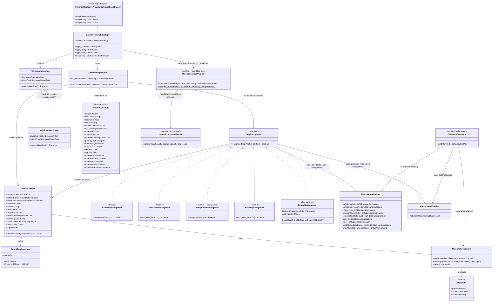
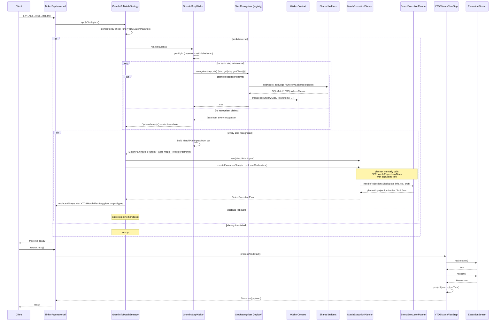

# Gremlin-to-MATCH Translator — Design

## Overview

The translator turns the pattern-matching subset of a TinkerPop traversal
into the same in-memory IR that the YouTrackDB SQL parser produces for `MATCH`
statements (`Pattern` + `aliasClasses` + `aliasFilters` + projection
metadata, packaged into a new `MatchPlanInputs` record) and feeds it
directly to the existing `MatchExecutionPlanner` via a new **additive**
constructor `MatchExecutionPlanner(MatchPlanInputs)`. No SQL text is
generated, and the planner's existing `createExecutionPlan` pipeline runs
unmodified — it internally appends the projection / order / limit chain via
`SelectExecutionPlanner.handleProjectionsBlock`. The translator is wired in
as a TinkerPop `ProviderOptimizationStrategy` that walks the entire step
list of a traversal. If every step is in the recognised set the strategy
replaces the whole step list with a single terminating boundary step
(`YTDBMatchPlanStep`); if **any** step is unrecognised the strategy
declines the whole traversal and the native TinkerPop pipeline keeps
handling it unmodified (D3 all-or-nothing).

A **hybrid** alternative — translating only the longest contiguous prefix
of recognised steps and letting an unrecognised suffix continue natively
over the boundary's emitted traversers — was considered and rejected. It
required cross-boundary output-type negotiation (every native step that
could follow the prefix expects a different payload shape), cross-boundary
label propagation (`as("a")` inside the prefix has to remain reachable for
a downstream `select("a")`), and special-case handling for `path()` —
each surface introducing its own bag of edge cases without proportional
benefit at Phase 1's small recognised set. The all-or-nothing rule
forecloses every one of those problems by removing the boundary as a
splice point; broader Gremlin coverage instead lands incrementally as
later phases extend the recognised set track by track.

The IR construction is factored into a new shared package
(`internal/core/sql/executor/match/builder/`) consumed by both the new translator and
the existing GQL front-end. GQL is migrated onto the shared builders in the
same Phase 1; its observable behavior is unchanged.

The design has four moving parts:

1. **Strategy** — the entry point. Idempotent. Runs **before** both
   pre-existing YTDB strategies (`YTDBGraphStepStrategy`,
   `YTDBGraphCountStrategy`) — `applyPrior()` advertises them so the
   TinkerPop strategy framework guarantees this order. It still runs
   **after** TinkerPop's structural folders (`IncidentToAdjacentStrategy`,
   `ConnectiveStrategy`, `LazyBarrierStrategy`) so the recognisers see
   the post-fold shapes the table below describes. Walks the step list,
   decides yes/no for the whole traversal, and on yes replaces the
   entire step list with `YTDBMatchPlanStep`. **The old half-measure
   strategies become a fallback path**: when the Gremlin-to-MATCH
   strategy declines, the original step list is preserved verbatim and
   `YTDBGraphStepStrategy` / `YTDBGraphCountStrategy` see it next — they
   keep delivering today's behaviour for queries the new translator does
   not yet cover. The new strategy is therefore additive: every recognised
   shape gains MATCH's planner; every unrecognised shape is at least as
   well-served as before.
2. **Translator** — a `GremlinStepWalker` that iterates
   `Traversal.getSteps()` and, for each step, looks up its runtime
   class in a `Map<Class<? extends Step>, StepRecogniser>` registry.
   The matching recogniser (or none, declining the whole traversal)
   contributes to a shared `WalkerContext` accumulator (pattern builder,
   alias maps, return-projection lists, boundary metadata, anonymous-alias
   generator). Concrete recognisers ship per-track: `StartStepRecogniser`
   (Track 2), `VertexStepRecogniser` and `NoOpBarrierRecogniser` (Track 3),
   `HasStepRecogniser` family (Track 4), and so on through Track 10. The
   walker is recogniser-agnostic — adding a track is "register one more
   recogniser", with no change to the walker, the strategy, or the boundary
   step.
3. **Shared MATCH IR builders** — `MatchPatternBuilder`, `MatchWhereBuilder`,
   `MatchLiteralBuilder`. Pure helpers around the existing IR classes that
   recognisers call to assemble their contribution. The same builders
   replace inline IR construction in `GqlMatchStatement.buildPlan`,
   `GqlMatchStatement.buildWhereClause` (the static helper called by
   `GqlMatchVisitor`), and `GqlMatchStatement.toLiteral`.
4. **Boundary step** — `YTDBMatchPlanStep`, plus the `MultiPlanMatchStep`
   subclass for `union(...)` concatenation (Track 10). Each holds one or
   N `SelectExecutionPlan`s and a configured output type. Emits TinkerPop
   `Traverser`s by iterating the plan(s) `ExecutionStream` (via
   `hasNext(ctx)` / `next(ctx)`) and projecting each `Result` into the
   configured payload type.

## Scope: recognised step set

The translator recognises the pattern-matching subset of Gremlin shown
in the table below. Any step not in the recognised set causes the
strategy to decline the entire traversal under D3 all-or-nothing —
the native TinkerPop pipeline keeps handling it unmodified. The
"Implemented in" column points at the implementation track that adds
each row's recogniser; until that track lands, the corresponding
shape declines along with anything else unrecognised.

| Category | Gremlin step | MATCH IR target | Implemented in |
|---|---|---|---|
| Vertex source | `g.V()` | `Pattern` with single node, default class `V` | Track 2 |
| Vertex source | `g.V(id)` | as above + `aliasRids[boundary] = SQLRid(id)` | Track 2 |
| Vertex source | `g.V(id1, id2, …)` | as above + `aliasFilters[boundary] = WHERE @rid IN [...]` | Track 2 |
| Edge traversal | `out(label)` / `in(label)` | `addEdge(from, to, OUT/IN, label)` + `addNode(to, "V", null, false)` | Track 3 |
| Edge traversal | `both(label)` | `addEdge(..., BOTH, label)` | Track 3 |
| Edge traversal | `outE(L).inV()` / `inE(L).outV()` | folded by TinkerPop's `IncidentToAdjacentStrategy` to `out(L)` / `in(L)` before our strategy fires; recogniser sees the folded shape | Track 3 |
| Edge traversal | `bothE(L).otherV()` | folded by `IncidentToAdjacentStrategy` to `both(L)` | Track 3 |
| Filtering | `has(key, value)` | `aliasFilters` `key = value` | Track 4 |
| Filtering | `has(key, predicate)` | `aliasFilters` predicate (per "Predicate translation" below) | Track 4 |
| Filtering | `has(label, key, value)` | `aliasClasses[a] = label` + `aliasFilters` `key = value` | Track 4 |
| Filtering | `hasLabel(label)` | folded by `YTDBGraphStepStrategy` into start-step `hasContainers`; `aliasClasses[a] = label` | Track 4 |
| Filtering | `hasId(id)` (single) | `aliasRids[a] = SQLRid(id)` | Track 4 |
| Filtering | `hasId(id1, id2, …)` (multi) | `aliasFilters[a] = WHERE @rid IN [...]` | Track 4 |
| Filtering | `hasNot(key)` | `aliasFilters[a]` `key IS NULL` | Track 4 |
| Predicate ops | `Compare.eq` / `neq` / `gt` / `gte` / `lt` / `lte` | `SQLBinaryCondition` + corresponding operator | Track 4 |
| Predicate ops | `Contains.within` / `Contains.without` | `SQLInCondition` / `SQLNotInCondition` | Track 4 |
| Predicate ops | `P.between(lo, hi)` | `SQLBetweenCondition` (or `AND(>=lo, <hi)`) | Track 4 |
| Predicate ops | `P.inside(lo, hi)` | `AND(GT lo, LT hi)` | Track 4 |
| Predicate ops | `P.outside(lo, hi)` | `OR(LT lo, GT hi)` | Track 4 |
| Predicate ops | `Text.containing` / `notContaining` | `SQLContainsTextCondition` / `NOT(...)` | Track 4 |
| Predicate ops | `Text.startingWith` / `endingWith` | `startsWith` / `endsWith` operator | Track 4 |
| Logical filters | `AndStep` / `OrStep` (`ConnectiveStrategy` form) | recursive `MatchWhereBuilder.and(...)` / `or(...)` over per-child sub-trees | Track 5 |
| Logical filters | `NotStep` (one recogniser, branches by sub-traversal shape) | pure-filter sub-traversal → `MatchWhereBuilder.not(...)` merged into current node `where`; edge-bearing sub-traversal → new `SQLMatchExpression` added to `notMatchExpressions` | Track 5 |
| Logical filters | `WhereTraversalStep` (pure filter / edge pattern) | inline filter on `where` / extra `SQLMatchExpression` | Track 5 |
| Logical filters | `WherePredicateStep` (`where(P.eq("a"))`) | `WHERE` referencing `$matched.<label>` | Track 5 |
| Step labels | `as(label)` | propagated to most recent `SQLMatchFilter.alias` via `MatchPatternBuilder.alias(...)` | Track 6 |
| Dedup | `dedup()` (no labels) | `info.distinct = true` → `DistinctExecutionStep` | Track 6 |
| Dedup | `dedup(labels...)` | projection over labels + DISTINCT | Track 6 |
| Projection | `select(label)` | `$matched.<label>` projection (single column) | Track 7 |
| Projection | `select(l1, l2, …)` | multi-column `$matched.*` projection | Track 7 |
| Projection | `values(keys...)` | property-extraction projection on current alias | Track 7 |
| Projection | `valueMap(keys...)` | nested-map projection | Track 7 |
| Projection | `elementMap()` | full schema-driven property map | Track 7 |
| Projection | `project(keys...).by(...)` | composite map with by-modulators | Track 7 |
| Order | `order().by(key, Order.asc/desc)` | `SQLOrderBy` (`Order.shuffle` declines) | Track 8 |
| Pagination | `limit(n)` | `SQLLimit(n)` | Track 8 |
| Pagination | `skip(n)` | `SQLSkip(n)` | Track 8 |
| Pagination | `range(low, high)` | `SQLSkip(low) + SQLLimit(high - low)` | Track 8 |
| Aggregation | `count()` | `RETURN count(*)` (output type `SCALAR`) | Track 9 |
| Aggregation | `sum/min/max/mean(field)` | `RETURN sum(field)` etc. (output type `SCALAR`) | Track 9 |
| Aggregation | `group()` / `group().by(key)` | `GROUP BY` + projection (output type `MAP`) | Track 9 |
| Aggregation | `groupCount()` | `GROUP BY` + `count(*)` | Track 9 |
| Union | `union(traversal...)` (children agree on output type) | one `SelectExecutionPlan` per child, concatenated by `MultiPlanMatchStep` | Track 10 |

**Always-transparent steps** that TinkerPop's optimization phase injects
between recognised steps without changing semantics — currently
`NoOpBarrierStep` from `LazyBarrierStrategy` — are also recognised
("claim without context mutation") so they don't break multi-hop
recognition.

## Class Design

The diagram shows three layers:

- **Strategy + translator** (`GremlinToMatchStrategy`, `GremlinStepWalker`,
  `WalkerContext`, and the registry of `StepRecogniser` implementations) —
  TinkerPop side, owns the step iteration and decision-making.
- **Shared MATCH IR builders** (`MatchPatternBuilder`, `MatchWhereBuilder`,
  `MatchLiteralBuilder`) — language-agnostic IR construction. Both the new
  translator and the refactored `GqlMatchStatement` consume them.
- **Existing engine** (`MatchExecutionPlanner`, `SelectExecutionPlanner`,
  the IR classes themselves) — preserved. The only modification is
  **one** new public constructor `MatchExecutionPlanner(MatchPlanInputs)`
  (additive — does not alter the two existing constructors). The
  `handleProjectionsBlock` static helper is invoked by the planner
  internally; the translator does not call it directly.

`PatternIR` is a small value class returned by `MatchPatternBuilder.build()`
encapsulating the three IR pieces the planner expects, so callers don't have
to assemble them from separate getters.

### Recogniser dispatch: `Map<Class<? extends Step>, StepRecogniser>` from day one

The walker stores recognisers in a
`Map<Class<? extends Step>, StepRecogniser>` keyed on the step's runtime
class. For each step the walker calls `map.get(step.getClass())`; if
the result is non-null, the recogniser owns the step. If the lookup
returns `null` — i.e. TinkerPop handed us a `Step` subclass nobody
registered for — the walker treats it as unrecognised and declines the
whole traversal under D3.

**Safe failure on unknown subclasses.** `step.getClass()` returns the
**concrete** runtime class, not any superclass. A future TinkerPop
release introducing `BespokeHasStep extends HasStep` would yield
`map.get(BespokeHasStep.class) → null` and decline cleanly, instead of
silently routing through the generic `HasStep` recogniser via an
`instanceof` near-miss. The decline is the **safe** outcome — the
native TinkerPop pipeline takes over and behaviour is preserved; a
quiet acceptance via the parent recogniser would risk wrong IR for a
step shape we never validated. The same property covers YTDB-specific
subclasses we maintain in-tree, e.g. `YTDBHasLabelStep extends HasStep`:
its concrete `getClass()` routes it to `HasLabelStepRecogniser`
deterministically, without an ordering invariant between the two
recognisers.

**One map entry per Step class — variants handled inside the
recogniser.** Each recogniser is responsible for every variant of its
step class internally. `VertexStepRecogniser` covers OUT / IN / BOTH;
`HasStepRecogniser` unpacks `HasContainer`s for the property /
predicate shapes; **`NotStepRecogniser` branches by sub-traversal
shape** (`hasEdgeHops(subTraversal)`) — pure-filter form folds into
`aliasFilters[boundaryAlias]` via `WHERE NOT (...)`; edge-bearing form
appends a `SQLMatchExpression` to `notMatchExpressions` for the planner
to execute as an anti-join. The branch lives in one place; the two
variants share the sub-traversal shape detector and the no-mutation
discipline below. Two tracks attempting to register two recognisers
for the same Step class is caught at registration time by a
duplicate-key assertion.

**No-mutation-on-decline discipline.** Every recogniser follows
validate-then-commit: cheap rejection checks first
(`instanceof`, precondition), then compute the translation as a pure
function over `ctx`, only then mutate `ctx` and return `true`. This
keeps internal branches (e.g. `NotStepRecogniser`'s filter-vs-pattern
fork) and shared adapters (e.g. `SubTraversalPredicateAdapter` used
inside the filter branch) free of partial-write hazards. The map
dispatch does not strictly require this discipline at the walker
level — `map.get` returns one recogniser and the walker never tries a
sibling on the same step — but a recogniser that branches internally
still needs it, so the contract stays as a per-recogniser
unit-test invariant
(`SubTraversalPredicateAdapterTest.decline_doesNotCommitPartialStateToOuterContext`
is the canonical example).

**Parallel-track ergonomics.** Each track's PR adds one map entry
under a freshly-imported `Step` subclass — there is no shared key
space to coordinate, so two tracks landing in parallel cannot
conflict by definition (different classes → different keys). The
duplicate-key assertion catches the rare same-class-different-recogniser
case at unit-test time.

`YTDBMatchPlanStep` is the boundary that bridges the YTDB execution stream
back to TinkerPop's traverser-driven model. It carries the configured
output type because the original traversal's terminal step dictates what
TinkerPop's downstream consumers (`.toList()`, `.iterate()`, …) expect.

## Workflow

The `applyStrategies` phase happens once per traversal lifecycle (defensive
re-entry handled via idempotency). Translation is a pure function from a
TinkerPop step list to a `MatchPlanInputs` record, which feeds the new
additive `MatchExecutionPlanner(MatchPlanInputs)` constructor (D2). The
planner's existing `createExecutionPlan` then runs unchanged — it
internally invokes `SelectExecutionPlanner.handleProjectionsBlock` (the
`MatchExecutionPlanner.java:624` call site) with the fully populated info,
producing the projection / order / limit / skip / group-by / distinct
chain. The strategy does **not** call `handleProjectionsBlock` separately;
doing so would double-append projection steps (the consistency review
caught this). Under D3 all-or-nothing the translated traversal contains
exactly one step — `YTDBMatchPlanStep` — that terminates the chain. If
any step in the original traversal is unrecognised, the strategy declines
and the original step list is preserved verbatim for the native pipeline.

The execution phase is straightforward: TinkerPop iterates as usual; the
boundary step pulls one row at a time from `ExecutionStream`, projects
into the configured TinkerPop payload type (Vertex, Edge, Map, value, scalar),
and emits a `Traverser` to whichever caller drives `.toList()` /
`.iterate()` / etc. There are no native steps after the boundary —
`YTDBMatchPlanStep` is the only step in a translated traversal.

## Boundary step output types

Under D3 all-or-nothing the boundary step is the only step in a translated
traversal — it terminates the chain. The TinkerPop payload it emits is
determined by the original traversal's terminal step (the last step in the
input list). The translator pins this on construction via a
`BoundaryOutputType` enum that the boundary step reads at
`processNextStart` time:

| Terminal step                          | `BoundaryOutputType` | Boundary emits |
|---|---|---|
| `g.V()` / vertex hop (Tracks 2–3)      | `ELEMENT`            | TinkerPop `Vertex` |
| `select(label)` / `select(l1, l2, …)` / `valueMap(…)` / `elementMap(…)` / `project(…)` (Track 7) | `MAP` | `Map<String, Object>` |
| `values(key)` single-key (Track 7)     | `SINGLE_VALUE`       | property value |
| `count` / `sum` / `min` / `max` / `mean` (Track 9) | `SCALAR`     | aggregate value |
| `group` / `groupCount` (Track 9)       | `MAP`                | aggregated `Map<K, V>` |

Phase 1 ships all four output types — `ELEMENT` from Track 3 (vertex
hops), `MAP` and `SINGLE_VALUE` from Track 7 (projections), and `SCALAR`
plus `MAP` from Track 9 (aggregations). Each track pins the output type
for the terminal step it adds to the recognised set. Track 3 is the
first track that wires a boundary step at all — so the temporal
sequencing is "Track 3 lands `ELEMENT`; subsequent tracks add their
variants" — but every output type is part of Phase 1. The boundary
step's `processNextStart` switches on the `BoundaryOutputType` and
projects each `Result` row accordingly.

There is no cross-boundary output-type negotiation — under all-or-nothing
no native step consumes the boundary's output, so the boundary picks its
payload type from the original traversal's terminal step alone. There is
also no cross-boundary label propagation: TinkerPop `as("a")` labels are
captured as `SQLMatchFilter.alias` inside the MATCH execution, are
projected into the result row when a terminator step (`select`, `project`,
…) references them explicitly, and have no other consumer because no
native step exists past the boundary.

**`path()` is unrecognised in Phase 1.** TinkerPop's `path()` requires
per-step traverser history — every traverser carries a `Path` accumulating
bindings at each visited step. MATCH produces final result rows, not path
histories. Reconstructing a `Path` in the boundary step would materialise
records the user did not ask for; under D3 all-or-nothing any traversal
containing `path()` is unrecognised and runs natively unmodified. Precise
translation of `path()` is Phase 2 territory.

## Predicate translation

`GremlinPredicateAdapter` is the chokepoint between TinkerPop's predicate
algebra and `SQLBooleanExpression`. The mapping is mostly mechanical, but
several edge cases require care.

**`has` step variants.** Gremlin has multiple `has*` step shapes; the
recogniser unpacks each `HasContainer` (the per-key predicate carrier
inside a `HasStep`) and routes:

- `has(key, value)` → `HasContainer{key, P.eq(value)}` → `aliasFilters[a]`
  with `WHERE a.key = value`.
- `has(key, P.gt(10))` → `HasContainer{key, P}` → predicate adapter
  produces the `SQLBinaryCondition(a.key, GT, 10)`.
- `has(label, key, value)` → two `HasContainer`s (`T.label = label` plus
  the property predicate) → class lands on `aliasClasses[a]`, predicate
  on `aliasFilters[a]`.
- `hasLabel(label)` → `HasContainer{T.label, label}`. In practice
  `YTDBGraphStepStrategy` folds adjacent `hasLabel(...)` into the start
  step's `hasContainers` before our strategy fires; the start-step
  recogniser sees it there and pins `aliasClasses[a] = label`. A
  non-folded `hasLabel` step elsewhere routes through the same
  `aliasClasses[a]` slot.
- `hasId(id)` (single) → `HasContainer{T.id, id}` → `aliasRids[a]` (the
  planner's single-RID fast path that resolves to `SELECT FROM #X:Y`).
- `hasId(id1, id2, …)` (multi) → `aliasFilters[a]` `WHERE @rid IN [...]`
  (same routing the start step uses for `g.V(id1, id2, …)` because
  `aliasRids` is single-RID-per-alias by SQL grammar).
- `hasNot(key)` → `key IS NULL` predicate (see below).

Multiple HasContainers on the same `HasStep` AND together via
`MatchWhereBuilder.and(...)` before merging into the alias's
`aliasFilters` slot.

**Compare predicates** (`Compare.eq/neq/gt/gte/lt/lte`) map 1:1 to YTDB
operators:

| TinkerPop | YTDB |
|---|---|
| `Compare.eq` | `SQLEqualsOperator` |
| `Compare.neq` | `SQLNeOperator` |
| `Compare.gt` | `SQLGtOperator` |
| `Compare.gte` | `SQLGeOperator` |
| `Compare.lt` | `SQLLtOperator` |
| `Compare.lte` | `SQLLeOperator` |

**Contains predicates**: `Contains.within` → `SQLInCondition` with the
`SQLCollection` populated from the predicate's value (which is always a
`Collection`); `Contains.without` → `SQLNotInCondition`.

**Composite `P` instances** (`P.and(p1, p2)`, `P.or(p1, p2)`, `P.not(p)`)
recurse: each child predicate is translated independently, then composed
via `MatchWhereBuilder.and/or/not`. This makes `P.between`, `P.inside`,
`P.outside` straightforward — they're typically implemented as `P.and(gte, lt)`
or `P.or(lt, gt)` in TinkerPop, and recursion handles them. We override the
common cases for cleaner output (`between` becomes a single
`SQLBetweenCondition` if YTDB has one, else the AND form).

**Text predicates** (`Text.containing`, `Text.startingWith`, `Text.endingWith`,
`Text.notContaining`, etc.) map to `SQLContainsTextCondition` for the
positive forms and a NOT-wrapped variant for the negatives. YTDB's
`SQLContainsTextCondition` is a String-only operator; if the predicate is
applied to a non-String field the recogniser declines, and under D3
all-or-nothing the entire traversal declines with it.

**Custom user predicates** — TinkerPop allows users to extend `P<T>` with
their own `BiPredicate`. We cannot translate arbitrary code. Detection: if
`P.getBiPredicate()` is not an instance of `Compare`, `Contains`, `Text`, or
a recognized YTDB-side predicate, decline.

**`hasNot(key)`**: maps to `key IS NULL` semantically. YTDB's WHERE supports
`field is null` via `SQLBaseExpression` plus an equality / null-check; we
build it via `MatchWhereBuilder.not(...)` over a "field exists" check.
Equivalently the `SQLBinaryCondition` can compare against a null literal —
which one to use is settled in Track 4.

## Parameter binding

Gremlin lets users parameterise traversals two ways:

1. **Inline literal** — `g.V().has("age", P.gt(30))`. The literal `30`
   sits inside the `P` instance attached to the `HasContainer`. The
   recogniser walks the `P` tree, calls
   `MatchLiteralBuilder.toLiteral(30)`, and embeds the resulting
   `SQLExpression` directly into the AST node.
2. **Bindings** — `g.with("threshold", 30).V().has("age", P.gt("threshold"))`.
   TinkerPop carries the binding via `Bindings` / `OptionsStrategy`; the
   `P` instance receives the *resolved* value (`30`) by the time
   `applyStrategies()` runs, not the binding key. The recogniser is
   agnostic — it sees a `P.gt(30)` and translates exactly as in form (1).

Both forms produce **a fully-bound MATCH IR with the parameter value
inlined as an `SQLExpression` literal**. There is no SQL `:param` slot
because the translator runs at strategy-application time, not at
plan-execution time. The resulting `SelectExecutionPlan` is specific to
the parameter value.

**Implication for plan caching.** Disabling the plan cache is not an
option — JetBrains client applications rely on cached plans, and
shipping without cache would cause a measurable regression. Phase 1
therefore wires `GremlinPlanCache` from day one, keyed on **traversal
bytecode fingerprint plus the resolved parameter values inlined into
the IR**. The composite key prevents a plan compiled for one parameter
value from serving a query carrying a different one, which is the same
constraint YQL parameter caching already enforces. The shared-builder
layer feeds the parameter-value list into the key automatically because
every literal is funnelled through `MatchLiteralBuilder.toLiteral`. Cache
invalidation on schema change reuses the existing YQL plan-cache
invalidation hook so a `CREATE CLASS` / `CREATE INDEX` does not leave
stale Gremlin plans behind.

**Custom Bindings instances.** TinkerPop allows users to attach a
custom `Bindings` resolver. By the time the strategy fires, the
resolver has already been consulted by the traversal source — the
recogniser sees only resolved values. If a user wires a resolver that
returns non-literal objects (e.g. lazy `Supplier`s), `MatchLiteralBuilder`
declines on the `default ->` branch in its type switch, and the entire
traversal declines under D3 all-or-nothing.

## Union semantics divergence

**`optional(traversal)` is deferred to Phase 2.** TinkerPop and MATCH
disagree on the empty-sub-traversal case in a way that flips result-set
membership, not just ordering: when the sub-traversal yields zero
results, Gremlin's `OptionalStep.processNextStart()` returns the original
input traverser unchanged — its path carries the outer label but not the
inner one — and a downstream `select("a","b")` calls
`Scoping.getScopeValue("b", ...)` which fails on the missing key, so
`SelectStep` returns `EmptyTraverser.instance()` and **the row is
dropped**. MATCH's `OptionalMatchEdgeTraverser` plus
`RemoveEmptyOptionalsStep` instead **emit the row with `b: null`**. The
two outputs differ exactly on the case `optional` exists to express.
Phase 2 will design the alignment (a boundary-step filter that drops
rows whose inner alias is null, or a MATCH-level alternative pattern,
or both) and ship the recogniser then. Phase 1 declines every traversal
containing `OptionalStep` under D3 all-or-nothing, and the native
TinkerPop pipeline handles it unchanged.

**`union(traversals…)`.** TinkerPop semantics: for each input traverser,
concatenate the outputs of all child traversals. MATCH `splitDisjointPatterns`
joins disconnected patterns via **cartesian product** — not the same.
We translate union by treating each child as a standalone translation
target: build an independent `SelectExecutionPlan` per child, place all
plans into a `MultiPlanMatchStep` (a variant of `YTDBMatchPlanStep` that
holds N plans and iterates them in order), and emit the concatenation. All
children must agree on output type; if any child fails to translate or
disagrees on type, the union step is unrecognised and under D3
all-or-nothing the entire enclosing traversal declines.

The decision to keep union as concatenation rather than cartesian is
strict: violating it would silently change result semantics, and that
violates the "Cucumber suite stays green" invariant.

## Logical filter steps with sub-traversals

TinkerPop has barrier-style filter steps that wrap entire traversals:
`AndStep` / `OrStep` (the `ConnectiveStrategy` form), `NotStep`,
`WhereTraversalStep`, and `WherePredicateStep`. These are distinct from
the `P<T>`-level boolean composition handled by the predicate adapter —
they describe filtering at the **step** layer, where each child carries
its own sub-traversal of arbitrary recognised filter steps.

**`AndStep` / `OrStep`** wrap N sub-traversals; each sub-traversal is a
sequence of filter steps applied to the current traverser. The translator
walks each child as if it were a `HasStep` chain on the current alias,
produces a `SQLBooleanExpression` per child, then composes them via
`MatchWhereBuilder.and(...)` / `or(...)`. The composed result merges into
the current node's `where` slot in `aliasFilters`.

**`NotStep` — one recogniser, two sub-traversal shapes.** TinkerPop
emits a single `NotStep` class for every `not(...)`; the recogniser
inspects the wrapped sub-traversal once and routes to the appropriate
MATCH IR slot:

- *Pure-filter sub-traversal* (no edge hops — `not(__.has(...))`,
  `not(__.hasLabel(...))`, `hasNot(key)` after TinkerPop's desugar to
  `NotStep(__.values(key))`): translated to a `SQLBooleanExpression`,
  wrapped in `MatchWhereBuilder.not(...)`, and AND-merged into the
  current node's `where` slot in `aliasFilters`.
- *Edge-bearing sub-traversal* (`not(__.out("knows"))`,
  `not(__.out("knows").has("city","NY"))`): translated to a fresh
  `SQLMatchExpression` and appended to
  `MatchPlanInputs.notMatchExpressions`. The first alias of the NOT
  pattern must already exist in the positive pattern (planner
  constraint — see `MatchExecutionPlanner.manageNotPatterns`); the
  recogniser pre-validates this against `ctx.boundaryAlias` and
  declines under D3 if the precondition fails, surfacing the
  precondition as a translation-time decline rather than a runtime
  exception inside the planner.

The shape predicate is `hasEdgeHops(subTraversal)` — a structural walk
that returns true on the first `VertexStep` encountered. Both branches
share the recogniser's no-mutation-on-decline contract: the sub-traversal
is translated through a pure function first, then merged into `ctx`
only when the translation succeeds.

**`WhereTraversalStep`** is the positive counterpart of `NotStep`: a
sub-traversal that must yield ≥1 result for the current row to pass.
Pure-filter sub-traversals merge into the current node's `where`;
edge-bearing sub-traversals join the positive pattern as additional
`SQLMatchExpression` linked to existing aliases.

**`WherePredicateStep`** (`where(P.eq("a"))` style) compares two
step-labels. Translates to a `where` clause referencing
`$matched.<label>` accessors — the same accessor MATCH uses internally
for cross-alias references.

A sub-traversal that contains a step outside the recognised set declines
the enclosing logical-filter step, which under D3 all-or-nothing declines
the entire enclosing traversal — there is no "partial sub-traversal" form.

## Strategy idempotency

A traversal's strategy chain may be applied more than once during a session:
TinkerPop clones traversals for sub-traversal reuse, test harnesses
sometimes re-apply strategies for verification, and certain traversal
sources lazily apply on first iteration.

If `GremlinToMatchStrategy` re-translates a traversal that already contains
`YTDBMatchPlanStep`, two things go wrong: the existing plan is discarded
and a new one is built (wasted work), or the strategy fails to recognize
the boundary step as a "translatable start" and produces incorrect output.

The defense is a single early check at the top of `apply`: scan the step
list once for any `YTDBMatchPlanStep` instance. If found, return
immediately. The scan is O(N) where N is the step count — typically
single digits. The cost is negligible, the safety is absolute.

The check must scan the **entire** list, not just the start step, because
a wrapping traversal source or test harness could place additional
ordinary steps in front of a previously-translated traversal.

## Schema polymorphism

YTDB's `polymorphicQuery` flag (`OptionsStrategy` config) controls whether
class-based scans see subclasses. When `polymorphic=true`, `g.V().hasLabel("Person")`
returns instances of `Person` and all subclasses. When `polymorphic=false`,
only direct `Person` instances.

MATCH is polymorphic by default — `MATCH {class: Person, as: p}` matches
all instances of `Person` and subclasses. To express non-polymorphic, the
filter must add a `class IN [Person, ...not subclasses]` predicate, OR the
underlying engine must respect a non-polymorphic flag.

The translator reads the flag via `YTDBStrategyUtil.isPolymorphic(traversal)`
once per `apply()` call (in {@link StartStepRecogniser}, the first
recogniser to claim) and pins it on `WalkerContext.polymorphic` so every
subsequent recogniser that introduces a node alias honours the same
setting. For `polymorphic=true` (default), the translator sets
`aliasClasses[alias] = "Person"` and is done. For `polymorphic=false`,
the translator augments the alias's `where` with a `@class = '<className>'`
equality predicate (single-class shapes, e.g. bare `g.V()` or
`g.V().hasLabel("Person")`) or a `@class IN [c1, c2, …]` predicate
(multi-class shapes, e.g. `g.V().hasLabel("Person", "Place")` from Track 4
onwards) — the same pattern `YTDBGraphStep` uses today for non-polymorphic
root scans.

**Chain-target nodes inherit the same narrowing.** When a recogniser
introduces a new node alias on a multi-hop chain — `VertexStepRecogniser`
(Track 3) on each `out(label)` / `in(label)` hop, and the `hasLabel`
recognisers (Track 4) when they class-narrow an existing alias — the
recogniser reads `WalkerContext.polymorphic` and applies the same
`@class = '<className>'` augmentation as the start-step recogniser does.
Without this, a translation of `g.V().out("knows")` under
`polymorphic=false` would silently fall back to MATCH's
polymorphic-by-default behaviour on the chain target while honouring
non-polymorphic on the start node — a result-set discrepancy versus the
native pipeline. The shared
{@link com.jetbrains.youtrackdb.internal.core.gremlin.translator.strategy.MatchClassFilters}
helper produces the AST shape; every chain-introducing recogniser uses
it.

**Schema-less graphs.** The translator must support the same surface
MATCH supports today, which includes schema-less graphs — every vertex
is class `V`, every edge is class `E`, and links are polymorphic. In
that regime, `g.V()` translates to a pattern node with `aliasClasses[a]
= "V"` (the default), `out(label)` adds an edge with the literal label
as its `directionLabel` and does not touch `aliasClasses`, and
`hasLabel(label)` declines only when a user-supplied label cannot be
resolved to a real class in a partially-typed graph (mixed mode). The
non-polymorphic narrowing described above is skipped for schema-less
traversals because there is no class hierarchy to narrow against.

If schema enumeration is unavailable for a class the user explicitly
named (a `hasLabel("Person")` against a graph where `Person` does not
exist), the recogniser declines and under D3 all-or-nothing the entire
traversal declines. The graph step strategy still handles the root scan
natively in that case.

## Anonymous alias generation

Multi-hop traversals introduce intermediate vertex nodes that do not
carry user-supplied `as(label)` names. The translator mints aliases for
these via a per-walk counter producing `$g2m_anon_0`, `$g2m_anon_1`, …
under the reserved prefix `$g2m_anon_`. The prefix is distinct from
GQL's `$c` and from the planner's package-private
`MatchExecutionPlanner.DEFAULT_ALIAS_PREFIX` so generator-minted aliases
cannot collide with either front-end's namespace.

A pre-flight scan in the walker iterates every step's `Step.getLabels()`
once before dispatching to recognisers and declines the entire traversal
if any user-supplied label starts with `$g2m_anon_`. Without this guard,
a user explicitly aliasing a step under the translator's private prefix
would collide with a generator-minted alias inside `aliasClasses` /
`aliasFilters`, producing silently-merged predicates and incorrect query
results. The pre-flight is purely lexical (no graph access) so it is
safe to run before any recogniser-specific gate, including those that
depend on the session being resolved.

The counter is per-`WalkerContext` and resets for each new walk so the
alias sequence is deterministic per query rather than monotonic across
the JVM lifetime.

## Order, pagination, and dedup

Three terminal-row operators with straightforward MATCH equivalents:

**Order** — `OrderGlobalStep` with `by(key, Order.asc/desc)` modulators
produces a `SQLOrderBy` where each `by(...)` becomes one entry.
`Order.asc` / `Order.desc` map directly. `Order.shuffle` has no MATCH
equivalent → the recogniser declines → under D3 all-or-nothing the
entire traversal declines. Multiple `by(...)` modulators produce a
multi-key sort.

**Pagination** — `RangeGlobalStep(low, high)` is the modern TinkerPop
representation of both `limit(n)` and `skip(n)`. Translation is a
single rule: `SQLSkip(low) + SQLLimit(high - low)` when `low ≥ 0` and
`high > 0`. `limit(n)` arrives as `RangeGlobalStep(0, n)`; `skip(n)` as
`RangeGlobalStep(n, Long.MAX_VALUE)` and the recogniser drops the
`SQLLimit` part for the unbounded high.

**Dedup** — `DedupGlobalStep` has two recognised forms:
- `dedup()` (no labels) → `info.distinct = true` on the
  `QueryPlanningInfo`; the planner materialises this as a
  `DistinctExecutionStep` after projection.
- `dedup(labels...)` → projection over the named labels followed by
  `DISTINCT`. If any of the named labels is not surfaced by the
  traversal's projection (`select`), the recogniser declines because
  the result wouldn't be addressable — under D3 the entire traversal
  declines.

## GQL refactor and shared builders evolution

The shared MATCH IR builder package
(`internal/core/sql/executor/match/builder/`) is consumed by two front-ends from
day 1: the new Gremlin translator and `GqlMatchStatement`. The refactor of
`GqlMatchStatement` happens in Track 1 and is strictly behavior-preserving.

Today `GqlMatchStatement.buildPlan` does three things:

1. For each `SQLMatchFilter`, creates a `PatternNode`, sets its alias,
   adds it to `Pattern.aliasToNode`, populates `aliasClasses`,
   conditionally populates `aliasFilters` from the filter's inline `where`.
2. Helper `buildWhereClause(Map<String,Object>)` builds an AND-block of
   equality conditions for inline property filters.
3. Helper `toLiteral(Object)` converts Java values to `SQLExpression`.

After refactor:

1. The `for` loop calls `MatchPatternBuilder.addNode(alias, className, where, false)`.
   Edge construction (zero today in GQL, but inevitable later) is a
   one-line `addEdge(...)` per hop.
2. `buildWhereClause` is replaced by a chain of
   `MatchWhereBuilder.eq(field, MatchLiteralBuilder.toLiteral(value))`
   followed by `whereBuilder.and(...).wrap()`.
3. `toLiteral` becomes a one-line delegate: `return MatchLiteralBuilder.toLiteral(value);`.

Functional changes: zero. `GqlMatchStatement`'s public API is unchanged.
Its tests must pass with the same assertions.

The shared builders are designed for both today's GQL needs (single-node
patterns, equality-only filters) and the translator's full needs (chains,
edges, full predicate algebra, optional, NOT). The API contracts are
captured in the builder Javadoc; implementations are pure functions over
the IR classes; new operations can be added without breaking existing
callers.

When GQL eventually adds edges, predicates, or projections, the shared
builders will already support them — no further refactor of the shared
layer needed.

## Aggregation barrier semantics

TinkerPop aggregates (`count`, `sum`, `min`, `max`, `mean`, `group`,
`groupCount`) are **barrier steps**: they consume the entire upstream
traverser stream and emit one (or in `group`, one keyed) result. MATCH
aggregates over a `SQLProjection` with `SQLGroupBy` in the
`QueryPlanningInfo`. The shapes differ in two ways.

**Single aggregate (`count`, `sum`, etc.) without group.** TinkerPop emits
exactly one traverser carrying the aggregate value. We translate to
`info.projection = SQLProjection([count(*) | sum(field) | …])`,
`info.groupBy = null`, and the boundary output type is `SCALAR`. The
boundary step pulls exactly one `Result` from the plan and emits one
`Traverser` carrying its scalar value.

**Empty input.** TinkerPop's `count` of an empty stream emits `0L` (a
single traverser); `sum`/`min`/`max`/`mean` of an empty stream emit
**nothing** in modern TinkerPop. MATCH's behaviour is the same for
`count` (returns one row with `0`) but emits a row with a **null** cell
for the other aggregates. The two are observably different on the empty
case: a Gremlin consumer that calls `.tryNext()` expects `Optional.empty()`,
while a translated traversal would hand it a traverser carrying `null`.

The boundary step closes the gap. For `BoundaryOutputType.SCALAR`,
`processNextStart` drops a `Result` whose aggregate column is `null` for
`sum`/`min`/`max`/`mean` (and any aggregate other than `count`) instead
of emitting a traverser. The null→empty conversion is per-aggregate (a
small enum lookup); `count` and any user-defined Gremlin aggregate that
defines an empty-input result still emit. For
`BoundaryOutputType.ELEMENT` / `MAP`, MATCH null cells in the row remain
null — they reach the consumer through `valueMap` / `select` exactly as
they would under native Gremlin. We verify in tests that empty-input
behaviour matches per-aggregate.

**Group with `by(key)`.** TinkerPop emits one map keyed by group keys.
We translate to `info.groupBy = SQLGroupBy(currentAlias.key)`,
`info.projection = SQLProjection([currentAlias.key, list(currentAlias) |
count(*) | …])`. The boundary output type is `MAP`. The boundary step
pulls all `Result` rows, accumulates them into one `LinkedHashMap`, and
emits one `Traverser`.

**Aggregates referring to property-extraction steps**
(`g.V().values("age").mean()` style): the prior `values("age")` step
must be visible to the aggregator. We resolve this during walker
post-processing: when the walker sees an aggregate step, it checks
whether the immediately preceding step was a `PropertiesStep` and
re-points the aggregate at the property's IR field-access expression
rather than the bare current alias. If the preceding step is anything
else, the aggregate works on the full element identity (TinkerPop
default behavior — typically only meaningful for `count` and `group`).

## Boundary-step lifecycle

`YTDBMatchPlanStep` (and its `MultiPlanMatchStep` subclass for `union`)
holds a compiled `SelectExecutionPlan` and lazily drives an
`ExecutionStream` per traversal iteration. Because the boundary step is
the only step in a translated traversal, its lifetime equals the
traversal's lifetime — opening and closing happens at well-defined
moments.

**Stream open.** The `ExecutionStream` is started lazily on the first
`processNextStart()` call (i.e. the first time the client asks for a
traverser). Strategy compilation (`apply()`) builds the plan but does
not start its execution stream. This matches TinkerPop's lazy-traversal
contract — `g.V().out("knows")` does not query the database until
`.toList()` / `.iterator()` / `.hasNext()` is called.

**Stream close.** The boundary step is `AutoCloseable` and closes its
stream when:
1. **The stream is exhausted** — `stream.hasNext(ctx)` returns false;
   the boundary calls `stream.close()` immediately.
2. **The traversal is closed** — TinkerPop calls `Traversal.close()`,
   which propagates `close()` to every step including the boundary;
   the boundary closes the stream and the plan.
3. **A `RuntimeException` propagates from the stream** — the boundary
   wraps the iteration in try-with-resources semantics; any exception
   triggers stream close before re-throwing.

A traversal abandoned mid-iteration (the client never calls `.next()`
again, never calls `.close()`) is the only path that leaks the stream.
TinkerPop's standard usage drives `close()` via `try-with-resources`
around `Traversal`, so this is rare; the boundary step's resource hold
matches `MatchExecutionPlanStep`'s today (the SQL `MATCH` runtime has
the same risk class).

**Plan reuse on `clone()`.** TinkerPop clones traversals for
sub-traversal reuse and parallel execution. The boundary step's
`clone()` returns a copy that **shares the compiled plan** but resets
its `started` flag and supplies a fresh `ExecutionStream` on first
`processNextStart`. Original and clone iterate independently through
the same plan, each with their own stream. This is safe because
`SelectExecutionPlan.start()` returns a fresh `ExecutionStream`
on every call.

### `MultiPlanMatchStep` (union concatenation)

`MultiPlanMatchStep` extends `YTDBMatchPlanStep` for `union(t1, t2, …)`.
It holds a `List<SelectExecutionPlan>` instead of one plan, plus an
index into the list:

- **Plan iteration.** The first `processNextStart` opens
  `plans[0].start()`; subsequent calls drive that stream until exhausted,
  then advance to `plans[1].start()`, and so on. Plan N+1 is only
  started after plan N is fully drained — never both alive simultaneously.
- **Memory.** Only the *currently-iterating* `ExecutionStream` is alive;
  the list of compiled plans (one per child traversal) is alive for the
  boundary step's lifetime. Memory cost = number of compiled plans, not
  number of in-flight streams.
- **Exception propagation.** If `plans[N]` throws mid-iteration, the
  current stream closes, the boundary re-throws, and `plans[N+1..]` are
  never started. The native fallback was already foregone at translation
  time (translation succeeded for every child or the union step was
  declined whole), so the caller sees the runtime error directly.
- **Output type.** All children must agree on output type at translation
  time; `MultiPlanMatchStep` carries one shared `BoundaryOutputType`.
  Mismatched types make the union unrecognised → traversal declines
  under D3 all-or-nothing.

## Observable behaviour changes

The translator preserves Gremlin's **multiset-equality** semantics —
the same elements appear the same number of times in the result — but
the user can observe two changes that don't break the contract:

**Result ordering may change.** Native Gremlin executes left-to-right:
the first `g.V()` step iterates the cluster scan in storage order, then
each subsequent step processes traversers in the order they arrive.
MATCH's cost-based planner picks the most selective alias as the
starting node and topologically sorts the rest. For a chain like
`g.V().has("name", "Alice").out("knows")`, native Gremlin scans every
vertex then filters; MATCH (with an index on `name`) starts from the
single Alice node and walks her edges. Same result set, completely
different traversal order.

If a user relied on the natively-determined order, the translated
result will differ. The fix is to add an explicit `order().by(...)` —
which was always the right approach if order mattered. We pin
multiset equivalence with `EdgeTraversalEquivalenceTest`, but we do
not pin element order; pinning order would force MATCH's planner into
the native walking strategy and erase the optimisation we are trying
to win.

**`.explain()` output looks different.** Calling
`traversal.explain()` on a translated traversal returns
`YTDBMatchPlanStep`'s view of its underlying plan — the
`SelectExecutionPlan.prettyPrint(0, 2)` output, which is the YQL
`MATCH` execution plan tree (`MatchFirstStep`, `MatchStep`, `Prefetch`
boxes, etc.). Operators reading EXPLAIN expecting TinkerPop-style step
boxes (one box per Gremlin step) will see the MATCH plan instead.
This is a visible diagnostic change but not a behaviour change; a
single explanatory sentence in the EXPLAIN header would help operators
orient. Phase 1 keeps it as-is.

**Profiling (`profile()`) declines.** TinkerPop's `profile()` step is
unrecognised in Phase 1 — any traversal containing it declines and runs
natively. Users profiling Gremlin queries see the native pipeline as
they do today. Profiling translated traversals (i.e. profiling MATCH
plan execution) requires either Phase 2 `profile()` recognition or
falls under YQL's existing EXPLAIN/profile tooling.

## Test strategy

Two complementary test patterns verify correctness, applied at every
recogniser-adding track (Tracks 2-10):

**Translator-on / translator-off equivalence.** A parameterised JUnit
fixture (`EdgeTraversalEquivalenceTest`, born in Track 3 Step 3) runs
each Gremlin shape twice — once with
`QUERY_GREMLIN_TO_MATCH_TRANSLATOR_ENABLED=false` (native pipeline)
and once with `=true` (translated). Each case carries a `RECOGNIZED`
or `DECLINED` marker. Two assertions per case:

1. **Result-multiset equality** — the two runs return the same elements
   the same number of times, regardless of order. Translation is
   semantics-preserving by construction; this is the load-bearing
   correctness check.
2. **Boundary-step engagement** — `RECOGNIZED` cases must contain a
   `YTDBMatchPlanStep` after `applyStrategies()`; `DECLINED` cases must
   not. Without this assertion, a regression that silently declined
   every shape would still pass the equality check (via native fallback
   on both sides) — the engagement assertion is what surfaces "we
   stopped translating but tests pretend we still are".

The fixture is parameterised so each track adds rows for its shapes
without rewriting the harness; the fixture seeds a small graph
(Person/Place vertices, Knows/Likes/Follows edges) that exercises
multi-hop chains, multi-edge cardinality, and multi-label decline.

**TinkerPop Cucumber feature suite.** ~1900 scenarios from upstream
TinkerPop, run via `YTDBGraphFeatureTest` (in `core`) and
`EmbeddedGraphFeatureTest` (in `embedded`). Each track must keep this
suite green. Track 12 runs the full suite at the end of Phase 1 to
catch any cross-track regression that slipped past per-track checks.

**Recogniser unit tests.** Each recogniser ships its own focused unit
tests covering the decline cascade (every gate fires and returns false
without mutating context) and the successful-claim mutation pattern
(context fields populated correctly). These run in milliseconds and
catch regressions before the slower equivalence tests.

## Reused execution steps

The translator produces input that the existing `MatchExecutionPlanner`
turns into a `SelectExecutionPlan` over the same set of execution steps
that today runs SQL `MATCH` queries. None of these classes is modified —
the entire MATCH execution surface is consumed unchanged:

| Class | Role |
|---|---|
| `MatchFirstStep` | Initialises the first alias's binding |
| `MatchStep` | Traverses one edge (one path-item hop) |
| `OptionalMatchStep` | Optional edge traversal (alias may be null) |
| `FilterNotMatchPatternStep` | NOT MATCH filter (anti-join) |
| `CartesianProductStep` | Joins disjoint patterns |
| `ReturnMatchElementsStep` | Returns matched elements (`returnElements`) |
| `ReturnMatchPathsStep` | Returns paths (`returnPaths`) |
| `ReturnMatchPatternsStep` | Returns patterns (`returnPatterns`) |
| `ReturnMatchPathElementsStep` | Returns path elements (`returnPathElements`) |
| `ProjectionCalculationStep` | Evaluates RETURN projections |
| `DistinctExecutionStep` | DISTINCT |
| `OrderByStep` | ORDER BY |
| `SkipExecutionStep` | SKIP |
| `LimitExecutionStep` | LIMIT |

The single addition to the MATCH surface is one new public constructor
`MatchExecutionPlanner(MatchPlanInputs)` (D2) that takes a record of
post-parse fields the translator builds, and routes them through the
existing `createExecutionPlan` pipeline. The three pre-existing
constructors stay unchanged. The `Pattern` / `PatternNode` /
`PatternEdge` classes plus the parser-level AST classes
(`SQLMatchExpression`, `SQLMatchPathItem`, `SQLMatchFilter`,
`SQLMatchFilterItem`, the boolean expression hierarchy) are constructed
programmatically by the shared builders, but the classes themselves are
not modified.

## Out of scope (Phase 2+)

The translator declines (under D3 all-or-nothing) any traversal that
contains a step from the categories below. These were deliberately
carved out of Phase 1 either because the step has no MATCH equivalent,
requires execution-model changes, or warrants a dedicated design effort.

| Category | Steps | Why out | Phase 2 path |
|---|---|---|---|
| Optional sub-traversal | `optional(traversal)` | Gremlin drops the row when the sub-traversal yields nothing; MATCH emits the row with the inner alias `null`. The two outputs differ on the case `optional` exists to express. | Drop-on-null filter at the boundary step, or a MATCH-level alternative pattern, or both — designed in Phase 2 |
| Variable-depth traversal | `repeat().until(...)`, `repeat().times(n)` | MATCH `WHILE` / `maxDepth` requires careful translation of the loop condition + termination semantics | Map `until` → `whileCondition`, `times` → `maxDepth` on `SQLMatchPathItem` |
| Stateful side-effects | `sack()`, `store()`, `aggregate()` | TinkerPop traverser-state-machine has no MATCH analogue | Likely never; stay native |
| Lambda steps | TinkerPop lambda steps (`map(λ)`, `filter(λ)`, `sideEffect(λ)`, …) | Arbitrary user code is untranslatable | Stay native; potentially inline simple Gremlin expression lambdas later |
| Subgraph extraction | `subgraph(label)` | Not a pattern match | Stay native |
| Path manipulation | `simplePath()`, `cyclicPath()`, advanced `path()` | Per-traverser path history isn't materialised by MATCH | `returnPaths = true` / `returnPathElements = true` on `MatchPlanInputs` covers basic `path()`; `simplePath` / `cyclicPath` need extra checks |
| Imperative branching | `choose(traversal).option(...)` | Branch-on-traverser has no MATCH equivalent | Stay native or future per-row branch construct |
| Custom DSL steps | `executeInTx()`, `computeInTx()` | Execution-model concerns, not a query shape | Stay native |
| Edge-returning terminals | `outE(L)` / `inE(L)` / `bothE(L)` (without paired vertex hop, or after `as(label)` that prevents folding) | `BoundaryOutputType` would need an `EDGE` variant; `PatternEdge` doesn't carry an alias today | Add `EDGE` output type and an edge-alias slot in the shared builder |
| Multi-label edges | `out("a", "b")` | `MatchPatternBuilder.addEdge` accepts a single edge-label string; an edge-label `IN [...]` filter slot doesn't exist yet | Variadic `SQLMethodCall.params` retrofit on the shared builder |

**Type-keyed recogniser dispatch ships in Phase 1** (see "Recogniser
dispatch" in Class Design). No follow-up migration is queued for
Phase 2.

**Cross-query plan caching is Phase 1**, not Phase 2. The cache keys
on traversal bytecode fingerprint plus resolved parameter values (see
"Parameter binding"), so the cache survives parameter variation without
serving stale plans. Track 12 measures end-to-end perf with cache
enabled.

**Phase 2 step-list audit.** Phase 2 opens with a sweep of the full
TinkerPop step reference (https://tinkerpop.apache.org/docs/current/reference/),
classifying every step into one of: *(a)* candidate for translation
(produce a recogniser), *(b)* permanent decline (stays native — lambda
steps, sack(), store(), subgraph(), …), *(c)* needs design effort
(optional, path manipulation, repeat(), choose()). The table above
captures the Phase 1 decisions; the audit fills in the long tail
before any Phase 2 implementation track lands.
