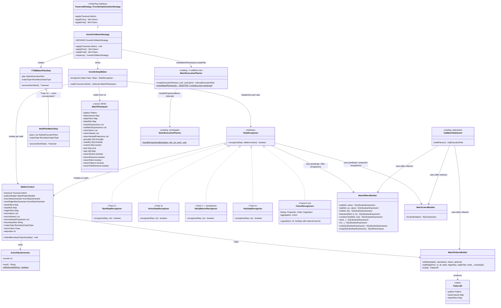

# Gremlin-to-MATCH Translator — Design

## Overview

The translator turns the pattern-matching subset of a TinkerPop traversal
into the same in-memory IR that the YouTrackDB SQL parser produces for `MATCH`
statements (`Pattern` + `aliasClasses` + `aliasFilters` + projection
metadata, packaged into a new `MatchPlanInputs` record) and feeds it
directly to the existing `MatchExecutionPlanner` via a new **additive**
constructor `MatchExecutionPlanner(MatchPlanInputs)`. No SQL text is
generated, and the planner's existing `createExecutionPlan` pipeline runs
unmodified — it internally appends the projection / order / limit chain via
`SelectExecutionPlanner.handleProjectionsBlock`. The translator is wired in
as a TinkerPop `ProviderOptimizationStrategy` that walks the entire step
list of a traversal. If every step is in the recognized set the strategy
replaces the whole step list with a single terminating boundary step
(`YTDBMatchPlanStep`); if **any** step is unrecognized the strategy
declines the whole traversal and the native TinkerPop pipeline keeps
handling it unmodified (D3 all-or-nothing).

A **hybrid** alternative — translating only the longest contiguous prefix
of recognized steps and letting an unrecognized suffix continue natively
over the boundary's emitted traversers — was considered and rejected. It
required cross-boundary output-type negotiation (every native step that
could follow the prefix expects a different payload shape), cross-boundary
label propagation (`as("a")` inside the prefix has to remain reachable for
a downstream `select("a")`), and special-case handling for `path()` —
each surface introducing its own bag of edge cases without proportional
benefit at Phase 1's small recognized set. The all-or-nothing rule
forecloses every one of those problems by removing the boundary as a
splice point; broader Gremlin coverage instead lands incrementally as
later phases extend the recognized set track by track.

The IR construction is factored into a new shared package
(`internal/core/sql/executor/match/builder/`) consumed by both the new translator and
the existing GQL front-end. GQL is migrated onto the shared builders in the
same Phase 1; its observable behavior is unchanged.

The design has four moving parts:

1. **Strategy** — the entry point. Idempotent. Runs **before** both
   pre-existing YTDB strategies (`YTDBGraphStepStrategy`,
   `YTDBGraphCountStrategy`) — `applyPrior()` advertises them so the
   TinkerPop strategy framework guarantees this order. It still runs
   **after** TinkerPop's structural folders (`IncidentToAdjacentStrategy`,
   `ConnectiveStrategy`, `LazyBarrierStrategy`) so the recognizers see
   the post-fold shapes the table below describes. Walks the step list,
   decides yes/no for the whole traversal, and on yes replaces the
   entire step list with `YTDBMatchPlanStep`. **The old half-measure
   strategies become a fallback path**: when the Gremlin-to-MATCH
   strategy declines, the original step list is preserved verbatim and
   `YTDBGraphStepStrategy` / `YTDBGraphCountStrategy` see it next — they
   keep delivering today's behavior for queries the new translator does
   not yet cover. The new strategy is therefore additive: every recognized
   shape gains MATCH's planner; every unrecognized shape is at least as
   well-served as before.
2. **Translator** — a `GremlinStepWalker` that iterates
   `Traversal.getSteps()` and, for each step, looks up its runtime
   class in a `Map<Class<? extends Step>, StepRecogniser>` registry.
   The matching recognizer (or none, declining the whole traversal)
   contributes to a shared `WalkerContext` accumulator (pattern builder,
   alias maps, return-projection lists, boundary metadata, anonymous-alias
   generator). Concrete recognizers ship per-track: `StartStepRecogniser`
   (Track 2), `VertexStepRecogniser` and `NoOpBarrierRecogniser` (Track 3),
   `HasStepRecogniser` family (Track 4), and so on through Track 10. The
   walker is recognizer-agnostic — adding a track is "register one more
   recognizer", with no change to the walker, the strategy, or the boundary
   step.
3. **Shared MATCH IR builders** — `MatchPatternBuilder`, `MatchWhereBuilder`,
   `MatchLiteralBuilder`. Pure helpers around the existing IR classes that
   recognizers call to assemble their contribution. The same builders
   replace inline IR construction in `GqlMatchStatement.buildPlan`,
   `GqlMatchStatement.buildWhereClause` (the static helper called by
   `GqlMatchVisitor`), and `GqlMatchStatement.toLiteral`.
4. **Boundary step** — `YTDBMatchPlanStep`, plus the `MultiPlanMatchStep`
   subclass for `union(...)` concatenation (Track 10). Each holds one or
   N `SelectExecutionPlan`s and a configured output type. Emits TinkerPop
   `Traverser`s by iterating the plan(s) `ExecutionStream` (via
   `hasNext(ctx)` / `next(ctx)`) and projecting each `Result` into the
   configured payload type.

## Scope: recognized step set

The translator recognizes the pattern-matching subset of Gremlin shown
in the table below. Any step not in the recognized set causes the
strategy to decline the entire traversal under D3 all-or-nothing —
the native TinkerPop pipeline keeps handling it unmodified. The
"Implemented in" column points at the implementation track that adds
each row's recognizer; until that track lands, the corresponding
shape declines along with anything else unrecognized.

| Category | Gremlin step | MATCH IR target | Implemented in |
|---|---|---|---|
| Vertex source | `g.V()` | `Pattern` with single node, default class `V` | Track 2 |
| Vertex source | `g.V(id)` | as above + `aliasRids[boundary] = SQLRid(id)` | Track 2 |
| Vertex source | `g.V(id1, id2, …)` | as above + `aliasFilters[boundary] = WHERE @rid IN [...]` | Track 2 |
| Edge traversal | `out(label)` / `in(label)` | `addEdge(from, to, OUT/IN, label)` + `addNode(to, "V", null, false)` | Track 3 |
| Edge traversal | `both(label)` | `addEdge(..., BOTH, label)` | Track 3 |
| Edge traversal | `outE(L).inV()` / `inE(L).outV()` (adjacent) | folded by TinkerPop's `IncidentToAdjacentStrategy` to `out(L)` / `in(L)` before our strategy fires; recognizer sees the folded shape | Track 3 |
| Edge traversal | `bothE(L).otherV()` (adjacent) | folded by `IncidentToAdjacentStrategy` to `both(L)` | Track 3 |
| Edge filtering | `outE(L).has(filter)*.inV()` / `inE(L).has(filter)*.outV()` / `bothE(L).has(filter)*.otherV()` (one or more `has(...)` between the edge step and its paired vertex hop) | `EdgeStepRecogniser` peek-ahead collects every adjacent `HasStep` into the edge's filter slot via `SQLMatchPathItem.filter`; the edge gets a translator-minted anonymous alias (`$g2m_edge_N`). Predicates inside the `has(...)` chain follow the same translation table as node-side filters. | Track 3 |
| Filtering | `has(key)` (presence) | `aliasFilters` `key IS NOT NULL` (query layer flattens record-layer absent into null via `Result.getProperty`'s null-on-absent contract — see "Predicate translation" caveat under `hasNot`) | Track 4 |
| Filtering | `has(key, value)` | `aliasFilters` `key = value` | Track 4 |
| Filtering | `has(key, predicate)` | `aliasFilters` predicate (per "Predicate translation" below) | Track 4 |
| Filtering | `has(label, key, value)` | `aliasClasses[a] = label` + `aliasFilters` `key = value` | Track 4 |
| Filtering | `hasLabel(label)` | folded by `YTDBGraphStepStrategy` into start-step `hasContainers`; `aliasClasses[a] = label` | Track 4 |
| Filtering | `hasId(id)` (single) | `aliasRids[a] = SQLRid(id)` | Track 4 |
| Filtering | `hasId(id1, id2, …)` (multi) | `aliasFilters[a] = WHERE @rid IN [...]` | Track 4 |
| Filtering | `hasNot(key)` | `aliasFilters[a]` `key IS NULL` (see caveat under "Predicate translation": YTDB's record layer treats `absent` and `null` as distinct, so the Phase 1 mapping holds only while `MATCH` itself treats both as `IS NULL`; if the engine grows a separate "absent" predicate we re-route there) | Track 4 |
| Predicate ops | `Compare.eq` / `neq` / `gt` / `gte` / `lt` / `lte` | `SQLBinaryCondition` + corresponding operator | Track 4 |
| Predicate ops | `Contains.within` / `Contains.without` | `SQLInCondition` / `SQLNotInCondition` | Track 4 |
| Predicate ops | `P.between(lo, hi)` | `AND(>=lo, <hi)` — Gremlin's `between` is right-exclusive `[lo, hi)`; YTDB's `SQLBetweenCondition` is closed `[lo, hi]`, so we cannot use it directly | Track 4 |
| Predicate ops | `P.inside(lo, hi)` | `AND(GT lo, LT hi)` | Track 4 |
| Predicate ops | `P.outside(lo, hi)` | `OR(LT lo, GT hi)` | Track 4 |
| Predicate ops | `Text.containing` / `notContaining` (and the equivalent `TextP.containing` / `TextP.notContaining`) | `SQLContainsTextCondition` / `NOT(...)` | Track 4 |
| Logical filters | `AndStep` (`ConnectiveStrategy` form) | per-child sub-walker; pure-filter children → AND-composed `SQLBooleanExpression` in WHERE; edge-bearing children → pattern fragments appended to positive pattern (MATCH IR composes them by AND naturally); mixed children supported | Track 5 |
| Logical filters | `OrStep` (`ConnectiveStrategy` form) | all children must be pure-filter (sub-walker contributes no pattern fragments / NOT expressions); booleans OR-composed via `MatchWhereBuilder.or(...)`; declines on any edge-bearing child because MATCH IR has no OR at the pattern-fragment level (Phase 2 path: union-of-plans via `MultiPlanMatchStep`) | Track 5 |
| Logical filters | `NotStep` (one recognizer, branches by sub-traversal shape) | pure-filter sub-traversal → `MatchWhereBuilder.not(...)` merged into current node `where`; edge-bearing sub-traversal → new `SQLMatchExpression` added to `notMatchExpressions` | Track 5 |
| Logical filters | `WhereTraversalStep` (pure filter / edge pattern) | inline filter on `where` / extra `SQLMatchExpression` | Track 5 |
| Logical filters | `WherePredicateStep` (`where(P.eq("a"))`) | `WHERE` referencing `$matched.<label>` | Track 5 |
| Step labels | `as(label)` | propagated to most recent `SQLMatchFilter.alias` via `MatchPatternBuilder.alias(...)` | Track 6 |
| Dedup | `dedup()` (no labels) | `info.distinct = true` → `DistinctExecutionStep` | Track 6 |
| Dedup | `dedup(labels...)` | projection over labels + DISTINCT | Track 6 |
| Dedup | `dedup(labels...).by(<recognized by-shape>)` | per-label dedup key extracted via the by-modulator (see "by-modulator translation" below) | Track 6 |
| Projection | `select(label)` | `$matched.<label>` projection (single column) | Track 7 |
| Projection | `select(l1, l2, …)` | multi-column `$matched.*` projection | Track 7 |
| Projection | `select(labels...).by(<recognized by-shape>)` | per-label by-modulator applied to the projected value (one `by(...)` per label, applied in order) | Track 7 |
| Projection | `values(keys...)` | property-extraction projection on current alias | Track 7 |
| Projection | `valueMap(keys...)` | nested-map projection | Track 7 |
| Projection | `elementMap()` | full schema-driven property map | Track 7 |
| Projection | `project(keys...).by(<recognized by-shape>)` | composite map; one `by(...)` per key, applied positionally (TinkerPop semantics) | Track 7 |
| Order | `order().by(key, Order.asc/desc)` | `SQLOrderBy` (`Order.shuffle` declines) | Track 8 |
| Order | `order().by(<recognized by-shape>, Order.asc/desc)` | by-modulator unwrapped to a field/identity reference, then `SQLOrderBy` | Track 8 |
| Pagination | `limit(n)` | `SQLLimit(n)` | Track 8 |
| Pagination | `skip(n)` | `SQLSkip(n)` | Track 8 |
| Pagination | `range(low, high)` | `SQLSkip(low) + SQLLimit(high - low)` | Track 8 |
| Aggregation | `count()` | `RETURN count(*)` (output type `SCALAR`) | Track 9 |
| Aggregation | `sum/min/max/mean(field)` | `RETURN sum(field)` etc. (output type `SCALAR`) | Track 9 |
| Aggregation | `group()` / `group().by(<recognized by-shape>)` (key only) | `GROUP BY` + projection of element-identity list (output type `MAP`) | Track 9 |
| Aggregation | `group().by(<key>).by(<recognized value-side by-shape>)` | second `by(...)` is the value-side accumulator — `__.count()` → `count(*)`, `__.fold()` → `list($currentMatch)`, `__.values(k).count()` → `count(currentAlias.k)`; anything else declines | Track 9 |
| Aggregation | `groupCount()` | `GROUP BY` + `count(*)` (shorthand for `group().by(...).by(__.count())`) | Track 9 |
| Union | `union(traversal...)` (children agree on output type) | one `SelectExecutionPlan` per child, concatenated by `MultiPlanMatchStep` | Track 10 |
| List shaping | `fold()` (terminator) | materialize entire result stream into a single `List<E>`; boundary output type `LIST` (see "List-shaping terminators") | Track 11 |
| List shaping | `unfold()` (terminator after a list-projecting step) | per-`Result` flat-map: if the boundary's projected value is `Iterator`/`Iterable`/`Map`/array, emit one traverser per element; else emit the value unchanged (TP `UnfoldStep.flatMap` semantics) | Track 11 |
| List shaping | `reverse()` (terminator) | per-traverser value transform: `String` → `StringBuilder.reverse().toString()`; `Iterable`/`Iterator`/array → `IteratorUtils.asList` + `Collections.reverse`; else unchanged (TP 3.8 `ReverseStep.map` semantics — NOT stream-order reverse) | Track 11 |
| Pagination | `tail(n)` (terminator) | bounded ring buffer in boundary step: drains the entire input stream keeping the last `n` rows in arrival order, then emits them in arrival order (matches TP `TailGlobalStep` — distinct from `ORDER BY ... LIMIT`, which uses value order) | Track 11 |

**Always-transparent steps** that TinkerPop's optimization phase injects
between recognized steps without changing semantics — currently
`NoOpBarrierStep` from `LazyBarrierStrategy` — are also recognized
("claim without context mutation") so they don't break multi-hop
recognition.

## Class Design



The diagram shows three layers:

- **Strategy + translator** (`GremlinToMatchStrategy`, `GremlinStepWalker`,
  `WalkerContext`, and the registry of `StepRecogniser` implementations) —
  TinkerPop side, owns the step iteration and decision-making.
- **Shared MATCH IR builders** (`MatchPatternBuilder`, `MatchWhereBuilder`,
  `MatchLiteralBuilder`) — language-agnostic IR construction. Both the new
  translator and the refactored `GqlMatchStatement` consume them.
- **Existing engine** (`MatchExecutionPlanner`, `SelectExecutionPlanner`,
  the IR classes themselves) — preserved. The only modification is
  **one** new public constructor `MatchExecutionPlanner(MatchPlanInputs)`
  (additive — does not alter the two existing constructors). The
  `handleProjectionsBlock` static helper is invoked by the planner
  internally; the translator does not call it directly.

`PatternIR` is a small value class returned by `MatchPatternBuilder.build()`
encapsulating the three IR pieces the planner expects, so callers don't have
to assemble them from separate getters.

### Recogniser dispatch: `Map<Class<? extends Step>, StepRecogniser>` from day one

The walker stores recognizers in a
`Map<Class<? extends Step>, StepRecogniser>` keyed on the step's runtime
class. For each step the walker calls `map.get(step.getClass())`; if
the result is non-null, the recognizer owns the step. If the lookup
returns `null` — i.e. TinkerPop handed us a `Step` subclass nobody
registered for — the walker treats it as unrecognized and declines the
whole traversal under D3.

**Safe failure on unknown subclasses.** `step.getClass()` returns the
**concrete** runtime class, not any superclass. A future TinkerPop
release introducing `BespokeHasStep extends HasStep` would yield
`map.get(BespokeHasStep.class) → null` and decline cleanly, instead of
silently routing through the generic `HasStep` recognizer via an
`instanceof` near-miss. The decline is the **safe** outcome — the
native TinkerPop pipeline takes over and behavior is preserved; a
quiet acceptance via the parent recognizer would risk wrong IR for a
step shape we never validated. The same property covers YTDB-specific
subclasses we maintain in-tree, e.g. `YTDBHasLabelStep extends HasStep`:
its concrete `getClass()` routes it to `HasLabelStepRecogniser`
deterministically, without an ordering invariant between the two
recognizers.

**One map entry per Step class — variants handled inside the
recognizer.** Each recognizer is responsible for every variant of its
step class internally. `VertexStepRecogniser` covers OUT / IN / BOTH;
`HasStepRecogniser` unpacks `HasContainer`s for the property /
predicate shapes; **`NotStepRecogniser` branches by sub-traversal
shape** (`hasEdgeHops(subTraversal)`) — pure-filter form folds into
`aliasFilters[boundaryAlias]` via `WHERE NOT (...)`; edge-bearing form
appends a `SQLMatchExpression` to `notMatchExpressions` for the planner
to execute as an anti-join. The branch lives in one place; the two
variants share the sub-traversal shape detector and the no-mutation
discipline below. Two tracks attempting to register two recognizers
for the same Step class is caught at registration time by a
duplicate-key assertion.

**No-mutation-on-decline discipline.** Every recognizer follows
validate-then-commit: cheap rejection checks first
(`instanceof`, precondition), then compute the translation as a pure
function over `ctx`, only then mutate `ctx` and return `true`. This
keeps internal branches (e.g. `NotStepRecogniser`'s filter-vs-pattern
fork) and shared adapters (e.g. `SubTraversalPredicateAdapter` used
inside the filter branch) free of partial-write hazards. The map
dispatch does not strictly require this discipline at the walker
level — `map.get` returns one recognizer and the walker never tries a
sibling on the same step — but a recognizer that branches internally
still needs it, so the contract stays as a per-recognizer
unit-test invariant
(`SubTraversalPredicateAdapterTest.decline_doesNotCommitPartialStateToOuterContext`
is the canonical example).

**Parallel-track ergonomics.** Each track's PR adds one map entry
under a freshly-imported `Step` subclass — there is no shared key
space to coordinate, so two tracks landing in parallel cannot
conflict by definition (different classes → different keys). The
duplicate-key assertion catches the rare same-class-different-recognizer
case at unit-test time.

`YTDBMatchPlanStep` is the boundary that bridges the YTDB execution stream
back to TinkerPop's traverser-driven model. It carries the configured
output type because the original traversal's terminal step dictates what
TinkerPop's downstream consumers (`.toList()`, `.iterate()`, …) expect.

## Workflow


The `applyStrategies` phase happens once per traversal lifecycle (defensive
re-entry handled via idempotency). Translation is a pure function from a
TinkerPop step list to a `MatchPlanInputs` record, which feeds the new
additive `MatchExecutionPlanner(MatchPlanInputs)` constructor (D2). The
planner's existing `createExecutionPlan` then runs unchanged — it
internally invokes `SelectExecutionPlanner.handleProjectionsBlock` (the
call site is inside `MatchExecutionPlanner.createExecutionPlan`, right
after the pattern is finalized) with the fully populated info,
producing the projection / order / limit / skip / group-by / distinct
chain. The strategy does **not** call `handleProjectionsBlock` separately;
doing so would double-append projection steps (the consistency review
caught this). Under D3 all-or-nothing the translated traversal contains
exactly one step — `YTDBMatchPlanStep` — that terminates the chain. If
any step in the original traversal is unrecognized, the strategy declines
and the original step list is preserved verbatim for the native pipeline.

The execution phase is straightforward: TinkerPop iterates as usual; the
boundary step pulls one row at a time from `ExecutionStream`, projects
into the configured TinkerPop payload type (Vertex, Edge, Map, value, scalar),
and emits a `Traverser` to whichever caller drives `.toList()` /
`.iterate()` / etc. There are no native steps after the boundary —
`YTDBMatchPlanStep` is the only step in a translated traversal.

## Boundary step output types

Under D3 all-or-nothing the boundary step is the only step in a translated
traversal — it terminates the chain. The TinkerPop payload it emits is
determined by the original traversal's terminal step (the last step in the
input list). The translator pins this on construction via a
`BoundaryOutputType` enum that the boundary step reads at
`processNextStart` time:

| Terminal step                          | `BoundaryOutputType` | Boundary emits |
|---|---|---|
| `g.V()` / vertex hop (Tracks 2–3)      | `ELEMENT`            | TinkerPop `Vertex` |
| `select(label)` / `select(l1, l2, …)` / `valueMap(…)` / `elementMap(…)` / `project(…)` (Track 7) | `MAP` | `Map<String, Object>` |
| `values(key)` single-key (Track 7)     | `SINGLE_VALUE`       | property value |
| `count` / `sum` / `min` / `max` / `mean` (Track 9) | `SCALAR`     | aggregate value |
| `group` / `groupCount` (Track 9)       | `MAP`                | aggregated `Map<K, V>` |
| `fold` (Track 11)                      | `LIST`               | single traverser carrying `List<E>` materialized from the entire result stream |

`unfold`, `reverse`, and `tail` (Track 11) do **not** introduce new
`BoundaryOutputType` values — they post-process whatever upstream
output type the boundary already carries. `unfold` flat-maps each
emitted traverser's projected value; `reverse` per-traverser-transforms
the projected value; `tail` ring-buffers the upstream stream and
re-emits the last `n` rows. Each post-processor is recogniser-pinned
at translation time and the boundary step selects it via a small set
of post-process flags (`unfoldOutput`, `reverseOutput`,
`tailLimit: int?`) — distinct from `dropNullRows`, which is row-level
filtering rather than re-shaping.

Phase 1 ships all four output types — `ELEMENT` from Track 3 (vertex
hops), `MAP` and `SINGLE_VALUE` from Track 7 (projections), and `SCALAR`
plus `MAP` from Track 9 (aggregations). Each track pins the output type
for the terminal step it adds to the recognized set. Track 3 is the
first track that wires a boundary step at all — so the temporal
sequencing is "Track 3 lands `ELEMENT`; subsequent tracks add their
variants" — but every output type is part of Phase 1. The boundary
step's `processNextStart` switches on the `BoundaryOutputType` and
projects each `Result` row accordingly.

There is no cross-boundary output-type negotiation — under all-or-nothing
no native step consumes the boundary's output, so the boundary picks its
payload type from the original traversal's terminal step alone. There is
also no cross-boundary label propagation: TinkerPop `as("a")` labels are
captured as `SQLMatchFilter.alias` inside the MATCH execution, are
projected into the result row when a terminator step (`select`, `project`,
…) references them explicitly, and have no other consumer because no
native step exists past the boundary.

**`path()` is unrecognized in Phase 1.** TinkerPop's `path()` requires
per-step traverser history — every traverser carries a `Path` accumulating
bindings at each visited step. MATCH produces final result rows, not path
histories. Reconstructing a `Path` in the boundary step would materialize
records the user did not ask for; under D3 all-or-nothing any traversal
containing `path()` is unrecognized and runs natively unmodified. Precise
translation of `path()` is Phase 2 territory.

## List-shaping terminators (Track 11)

`fold`, `unfold`, `reverse`, and `tail` are list-shaping terminators
that the boundary step handles directly. They are accepted only when
they appear as the **last** step of the traversal — mid-traversal use
(e.g. `g.V().fold().unfold().has(...)`) declines under D3 all-or-
nothing because the boundary step is the only step in a translated
traversal. The recogniser walks back from the terminator: a list-
shaping step may follow any other recognised terminator (vertex hop,
projection, aggregate, group) or sit on its own at the end of the
chain. The recogniser pins both the upstream boundary configuration
(output type + dropNullRows + Track 7 value-level omission rule) and
the post-process flags introduced by the list-shaping step.

**`fold()` — `BoundaryOutputType.LIST`.** TinkerPop semantics
(`FoldStep`): drain the upstream stream, collect every traverser's
value into a `List<E>`, emit a single traverser carrying that list.
Translation: the recogniser sets `outputType = LIST` on the boundary
step; `processNextStart` pulls all upstream `Result` rows, projects
each one through the existing per-output-type logic (vertex /
property / map), appends to an internal `ArrayList`, and on stream
exhaustion emits one traverser carrying the list. Empty input yields
a single traverser carrying an empty list — matching `FoldStep`'s
empty-input behavior (NOT TP's modern `sum`/`min`/`mean` "no
traverser" rule; `fold` always emits exactly one traverser, even on
empty input). The `dropNullRows` flag composes naturally: a `fold`
applied after an aggregate with `dropNullRows = true` first drops
null cells (per Track 9 aggregate semantics), then folds the
remaining values; if all aggregates drop the row, the fold emits an
empty list. Streaming → batch is intentional: TinkerPop's `fold` has
the same characteristic, so this matches semantics, not just shape.

**`unfold()` — flat-map post-processor.** TinkerPop semantics
(`UnfoldStep.flatMap`): for each input traverser, if the carried
value is `Iterator` → return it; `Iterable` → return `.iterator()`;
`Map` → return `entrySet().iterator()`; array → return its element
iterator; otherwise return `Collections.singletonList(value)
.iterator()` (no-op). Translation: the recogniser sets
`unfoldOutput = true` on the boundary step; `processNextStart`
intercepts each upstream emission, calls a small `unfold(value)`
helper that mirrors `UnfoldStep.flatMap`, and emits one traverser per
returned element. The upstream output type is preserved (the boundary
still carries `ELEMENT` / `MAP` / `SINGLE_VALUE` / `LIST`); `unfold`
only expands per-emission cardinality. Common Phase 1 use case:
`g.V().values("phones").unfold()` against a multi-valued `phones`
property — the `SINGLE_VALUE` projection emits a `List<String>` per
vertex; `unfold` expands each list into one traverser per phone
number.

**`reverse()` — per-traverser value transform.** TinkerPop semantics
(`ReverseStep.map` in TP 3.7+): operates on the value inside the
**current traverser**, NOT on stream order. `String` → reversed
string via `new StringBuilder(s).reverse().toString()`;
`Iterable` / `Iterator` / array → `IteratorUtils.asList(o)` then
`Collections.reverse(list)`, return list; otherwise unchanged.
Translation: the recogniser sets `reverseOutput = true` on the
boundary step; `processNextStart` applies a `reverse(value)` helper
mirroring `ReverseStep.map` to the projected value before emitting
the traverser. Stream order is untouched. Common Phase 1 use:
`g.V().values("name").reverse()` (reverse each name string).
`reverse` composes with `unfold`: applying `reverse` after `unfold`
reverses each unfolded value (probably a no-op for scalar values);
applying `unfold` after `reverse` unfolds the reversed list. The
recogniser preserves the declared order — there is no automatic
re-ordering.

**`tail(n)` — bounded ring buffer.** TinkerPop semantics
(`TailGlobalStep`): keep the **last `n`** traversers in arrival order,
drop the rest. Distinct from `ORDER BY … LIMIT`: tail uses arrival
order, not value order, so a `tail(3)` on a stream where the last
three rows arrived "X", "Y", "Z" emits exactly those three in that
order — independent of how X/Y/Z compare under any sort key.
Translation: the recogniser sets `tailLimit = n` on the boundary
step; `processNextStart` drains the entire upstream stream into a
bounded `ArrayDeque<E>` of capacity `n` (`pollFirst` on overflow),
then emits the deque's contents in `pollFirst` order on stream
exhaustion. Streaming → batch is unavoidable: `tail` cannot know the
last `n` rows without seeing all of them. `n = 0` emits nothing
(matches TP); `n < 0` declines (matches TP's
`IllegalArgumentException` contract — under D3 we decline rather
than throw to preserve the native fallback). `tail` composes with
`fold` only if `tail` is upstream of `fold` (semantic order: keep
last n then fold) — since both are terminators, this composition is
**not** expressible in Phase 1 (only one terminator per translated
traversal). Mid-stream `tail` (e.g. `g.V().tail(3).out()`) declines
under D3 all-or-nothing.

**Phase 1 composition rules.** At most one list-shaping step appears
in a translated traversal, immediately after the prior terminator
(vertex hop / projection / aggregate / group / union). Two list-
shaping steps in sequence are accepted only when the composition
preserves single-terminator-with-post-processing semantics:
`fold().unfold()` is a no-op (collect then expand) but is rejected
because two terminators violate the single-boundary rule;
`reverse().unfold()` and `unfold().reverse()` are accepted as
post-processor chains and the recogniser sets both flags. The
boundary step applies post-processors in **declared order**: tail →
fold/unfold/reverse in their original order. There is no automatic
re-ordering; the recogniser fails the composition if the declared
order cannot be reproduced (e.g. `fold().tail(3)` would require a
two-phase boundary which Phase 1 does not implement — Phase 1
declines this shape).

**Track 7 commitment: absent vs null-valued properties in `MAP` /
`SINGLE_VALUE` output.** Native TinkerPop's `Property` API does not
permit null property values: `vertex.property(key)` returns
`VertexProperty.empty()` both for absent properties and for properties
whose record-layer value is null, so `valueMap(keys…)` /
`elementMap(…)` / `values(key)` collapse the two cases by omitting the
key (for `valueMap`/`elementMap`) or emitting no traverser (for
`values`). YTDB MATCH projects `alias.key` through `Result.getProperty`,
which by contract returns `null` for both absent and null-valued
properties (see "Predicate translation" `hasNot` caveat for the record-
layer distinction); the row therefore carries a `null` cell in both
cases. Native and MATCH agree on the set of *which rows* are produced
but can disagree on *what each row contains*:

- `valueMap(keys…)` / `elementMap(…)`: native omits the key entirely
  when the property is absent / null-valued; MATCH would emit the key
  with value `null` unless the boundary step filters it. **Track 7
  MUST omit null-valued entries** from the projected `Map<String,
  Object>` so the boundary's `MAP` output matches TinkerPop's
  `valueMap` / `elementMap` set membership exactly. Track 7's
  regression-test suite MUST pin: (a) a vertex with property `foo`
  set to null surfaces as a map without the `foo` key, and (b) a
  vertex with `foo` absent surfaces the same way (both engines treat
  them identically through this output path).
- `values(key)` (single-key): native emits no traverser when the
  property is absent or null; the `SINGLE_VALUE` output already
  reuses the boundary's `dropNullRows = true` configuration for this
  shape, so a `null` projected value is filtered before reaching the
  consumer. Track 7 MUST set `dropNullRows = true` for `values(key)`
  and pin the behavior in a regression test.
- `select(label)` / `select(labels…).by("key")` /
  `project(keys…).by("key")`: native `Scoping.getScopeValue` throws on
  a missing key (drops the row via `EmptyTraverser`), but a present-
  with-null binding is delivered to the consumer as the literal `null`.
  Phase 1 only emits `select`/`project` against aliases the recogniser
  binds during translation, so the "missing key" failure mode does
  not arise — every selected label resolves to an alias that the
  MATCH plan projects. Null-valued *property* by-modulators
  (`by("foo")` against an absent / null-valued `foo`) follow the same
  rule as `values(key)`: Track 7's `MAP` output omits the entry,
  matching native's by-modulator semantics. The `optional`-induced
  missing-label case is already deferred to Phase 2 (`OptionalStep`
  declines under D3).

The distinction matters even though `hasNot` ↔ `IS NULL` is correct in
Phase 1: the equivalence holds at the *filter* layer where rows are
kept or dropped, but the *projection* layer separately decides what
each kept row exposes to the consumer. Without the Track 7 omission
rule, a query like `g.V().has("name", "Alice").valueMap()` would emit
`{name: "Alice", age: null}` from MATCH against a vertex with `age`
absent, where native TinkerPop emits `{name: ["Alice"]}` (no `age`
key). The omission rule closes the divergence; the regression tests
ensure no future refactor reintroduces it.

## Predicate translation

`GremlinPredicateAdapter` is the chokepoint between TinkerPop's predicate
algebra and `SQLBooleanExpression`. The mapping is mostly mechanical, but
several edge cases require care.

**`has` step variants.** Gremlin has multiple `has*` step shapes; the
recognizer unpacks each `HasContainer` (the per-key predicate carrier
inside a `HasStep`) and routes:

- `has(key, value)` → `HasContainer{key, P.eq(value)}` → `aliasFilters[a]`
  with `WHERE a.key = value`.
- `has(key, P.gt(10))` → `HasContainer{key, P}` → predicate adapter
  produces the `SQLBinaryCondition(a.key, GT, 10)`.
- `has(label, key, value)` → two `HasContainer`s (`T.label = label` plus
  the property predicate) → class lands on `aliasClasses[a]`, predicate
  on `aliasFilters[a]`.
- `hasLabel(label)` → `HasContainer{T.label, label}`. In practice
  `YTDBGraphStepStrategy` folds adjacent `hasLabel(...)` into the start
  step's `hasContainers` before our strategy fires; the start-step
  recognizer sees it there and pins `aliasClasses[a] = label`. A
  non-folded `hasLabel` step elsewhere routes through the same
  `aliasClasses[a]` slot.
- `hasId(id)` (single) → `HasContainer{T.id, id}` → `aliasRids[a]` (the
  planner's single-RID fast path that resolves to `SELECT FROM #X:Y`).
- `hasId(id1, id2, …)` (multi) → `aliasFilters[a]` `WHERE @rid IN [...]`
  (same routing the start step uses for `g.V(id1, id2, …)` because
  `aliasRids` is single-RID-per-alias by SQL grammar).
- `hasNot(key)` → `key IS NULL` predicate (see below).

Multiple HasContainers on the same `HasStep` AND together via
`MatchWhereBuilder.and(...)` before merging into the alias's
`aliasFilters` slot.

**Compare predicates** (`Compare.eq/neq/gt/gte/lt/lte`) map 1:1 to YTDB
operators:

| TinkerPop | YTDB |
|---|---|
| `Compare.eq` | `SQLEqualsOperator` |
| `Compare.neq` | `SQLNeOperator` |
| `Compare.gt` | `SQLGtOperator` |
| `Compare.gte` | `SQLGeOperator` |
| `Compare.lt` | `SQLLtOperator` |
| `Compare.lte` | `SQLLeOperator` |

**NULL and collection comparison semantics.** TinkerPop and YTDB diverge
on a few corner cases that the recognizer must intercept. The truth
table below was verified against `gremlin-core-3.8.1` (which routes
`Compare.eq` through `GremlinValueComparator.COMPARABILITY.equals` —
classifies operands by `Type` priority enum so `Number` and `List` are
incomparable) and against
`core/.../sql/operator/QueryOperatorEquals.java` (lines 63-69 auto-unbox
a singleton collection against a scalar; lines 71-73 short-circuit
`null` operands to `false`). `SQLNeOperator` is defined as
`!QueryOperatorEquals.equals(...)`, which inverts the null result and
keeps the singleton-unbox path.

| Predicate | Field value | TinkerPop | YTDB raw | Diverges? |
|---|---|---|---|---|
| `P.eq(null)` | `null` | TRUE | FALSE | **yes** — TP keeps, YTDB drops |
| `P.eq(null)` | non-null | FALSE | FALSE | no |
| `P.neq(null)` | `null` | FALSE | TRUE | **yes** — TP drops, YTDB keeps |
| `P.neq(null)` | non-null | TRUE | TRUE | no |
| `P.eq([a])` (size 1) | scalar `a` | FALSE (type mismatch) | TRUE (singleton unboxed) | **yes** |
| `P.eq([a])` (size 1) | list `[a]` | TRUE | TRUE | no |
| `P.eq([a, b])` (size ≥2) | any | structural | structural | no |
| `P.eq([])` (size 0) | any | typically FALSE | typically FALSE | no |
| `P.neq([a])` (size 1) | scalar `a` | TRUE | FALSE | **yes** |
| `Contains.within([a])` | scalar `a` | TRUE | TRUE | no |

The auto-unbox branch in `QueryOperatorEquals.equals` (lines 63-69) is
guarded by `col.size() == 1` AND `the other operand is not a
Collection` — so it fires only for the **singleton-collection-vs-scalar**
shape. Non-singleton collection literals (`[a, b]`, `[]`) fall through
to `iLeft.equals(right)` which is Java `List.equals` — structural and
order-sensitive, matching `COMPARABILITY.contentsComparable` on the
TinkerPop side. Both engines agree on every non-singleton row above.

Recognizer rules that close the divergence:

- **`P.eq(null)` / `P.neq(null)`**: rewrite to `field IS NULL` /
  `field IS NOT NULL`. The `IS NULL` predicate is a three-valued check
  that returns the boolean Gremlin expects: TRUE when the field is null
  (for `eq`) or non-null (for `neq`), FALSE otherwise. Without the
  rewrite, `field = null` and `field != null` would route through
  `QueryOperatorEquals.equals(..., null, ...)` which returns FALSE for
  both branches, producing the wrong boolean in exactly one subcase per
  predicate (rows with `field = null`).
- **`P.eq(Collection)` / `P.neq(Collection)`** — **narrow decline by
  collection size** (Phase 1):
  - `coll.size() == 1` (singleton literal): **decline under D3
    all-or-nothing**. This is the only configuration where the auto-
    unbox in `QueryOperatorEquals.java:63-69` fires, and we cannot
    distinguish at translation time whether the field will be scalar
    or collection-typed at runtime (schema-less / mixed-mode classes
    can hold either). Native TinkerPop evaluates the predicate
    against the in-memory traverser and gets the right answer.
  - `coll.size() != 1` (empty literal or multi-element literal):
    translate normally to `field = listLiteral` / `field != listLiteral`.
    Both engines fall through to `iLeft.equals(right)` / Java
    `List.equals` (YTDB) and `COMPARABILITY.contentsComparable` (TP),
    which are both structural and order-sensitive — same result.
  - Phase 2 narrows the decline further with **schema-aware rewrite**
    when the field's `PropertyType` is statically known:
    - `STRING` / `INTEGER` / `LONG` / `DOUBLE` / ... (scalar types) +
      `P.eq([a])` → emit literal `false` (TP returns FALSE for
      scalar-vs-list, so the predicate is a known-false filter).
    - `STRING` / scalar + `P.neq([a])` → emit literal `true`.
    - `EMBEDDEDLIST` / `LINKLIST` / `EMBEDDEDSET` / `LINKSET` (collection
      types) + `P.eq([a])` → emit `field = listLiteral` (both engines
      structural, no unbox).
    - Schema-less (no `PropertyType` on the property) → fall back to
      Phase 1 decline.
    The schema-aware rewrite hooks the same path Phase 2 will need
    for other type-aware optimizations (typed index lookup, RID
    range narrowing for collection-typed properties), so it lands
    naturally with that work — not as a one-off.
  This rule applies whether the value comes from `P.eq(coll)` directly
  or from a one-element argument list — the BiPredicate is still
  `Compare.eq`.
- **`Contains.within(coll)` / `Contains.without(coll)`**: keep the
  current translation to `SQLInCondition` / `SQLNotInCondition`.
  `Contains.within.test(a, [a])` checks membership (`a in [a]` →
  TRUE), and YTDB's `SQLInCondition` also tests membership — same
  semantics, no auto-unbox path involved. Single-element collection
  arguments are handled correctly without rewrite.

A Phase 1 regression-test pin in Track 4 (Cucumber feature or unit
test on the recogniser) MUST cover:
- `eq(null)` and `neq(null)` against a null-valued property — assert
  the translated MATCH returns the same multiset as native.
- `eq([a])` and `neq([a])` (size-1 literal) against a scalar property
  equal to `a` — assert the recogniser declines and Phase 1 falls back
  to native.
- `eq([a, b])` (size-2 literal) against a list-typed property equal to
  `[a, b]` — assert the translated MATCH returns the same multiset
  (translation path, not decline).
- `eq([])` (empty literal) against any property — assert the translated
  MATCH returns the same multiset (translation path, not decline).

Phase 2 adds schema-aware rewrite tests for the typed-property
configurations once the schema-aware rewrite path lands.

**Contains predicates**: `Contains.within` → `SQLInCondition` with the
`SQLCollection` populated from the predicate's value (which is always a
`Collection`); `Contains.without` → `SQLNotInCondition`.

**Composite `P` instances** (`P.and(p1, p2)`, `P.or(p1, p2)`, `P.not(p)`)
recurse: each child predicate is translated independently, then composed
via `MatchWhereBuilder.and/or/not`. This makes `P.inside` and `P.outside`
straightforward — they translate to `AND(>lo, <hi)` and `OR(<lo, >hi)`
respectively (note both are strict on both ends — Gremlin's `inside`
and `outside` are open intervals).

`P.between(lo, hi)` is the one composite where naïve composition would
go wrong: Gremlin's `between` is **right-exclusive** `[lo, hi)`
(matches `x >= lo AND x < hi`), but YTDB's `SQLBetweenCondition` is the
SQL-standard **closed** interval `[lo, hi]` (matches `x >= lo AND x <= hi`).
A direct translation to `SQLBetweenCondition` would over-match by one
boundary value on the high end, returning a different multiset from
the native pipeline. The recognizer therefore translates `P.between`
to `AND(>=lo, <hi)` — two `SQLBinaryCondition`s composed by
`MatchWhereBuilder.and(...)` — and **never** emits a
`SQLBetweenCondition`. The `MatchWhereBuilder.between(...)` factory
is reserved for callers (GQL) that already enforce the closed-interval
semantics; the Gremlin path does not call it.

**`TextP` predicates** (the modern TinkerPop entry point for string
predicates — `TextP.containing`, `TextP.startingWith`, `TextP.endingWith`,
their `not*` variants, plus `TextP.regex` / `TextP.notRegex` on newer
TinkerPop). Only `containing` / `notContaining` translate in Phase 1:

| Predicate | YTDB target |
|---|---|
| `TextP.containing(sub)` | `SQLContainsTextCondition(field, sub)` |
| `TextP.notContaining(sub)` | `NOT(SQLContainsTextCondition(field, sub))` |

`SQLContainsTextCondition` evaluates via `String.indexOf(sub) > -1` —
case-sensitive substring search, matching TinkerPop's `TextP.containing`
exactly. It is a String-only operator; if the predicate is applied to a
non-String field the recognizer declines and under D3 all-or-nothing
the entire traversal declines. The legacy `Text` algebra (pre-TextP)
routes through the same translation by sharing the same `BiPredicate`
instances inside `P`.

**`TextP.startingWith` / `endingWith` / `regex` decline under D3.** We
considered translating them via `SQLLikeOperator` (for the prefix /
suffix forms) and `SQLMatchesCondition` (for regex), but both diverge
semantically from TinkerPop:

- `SQLLikeOperator`'s engine (`QueryHelper.like`) lowercases both
  operands before matching, so it is **case-insensitive**. TinkerPop's
  `TextP.startingWith("Al")` is case-sensitive — it matches `"Alice"`
  but not `"alice"`. Translating through LIKE would return a different
  multiset on case-mixed data. `QueryHelper.like` also has no escape
  mechanism for its `%` / `?` wildcards, so a user-supplied prefix
  containing `%` (e.g. `"50%"`) silently turns into a wildcard pattern.
- `SQLMatchesCondition` calls `Pattern.matcher(value).matches()`, which
  requires the **entire** string to match the regex. TinkerPop's
  `TextP.regex` uses `find()` — partial match anywhere in the string.
  Wrapping the user's pattern in `.*pattern.*` to convert `find` →
  `matches` semantics breaks user-supplied patterns that already use
  anchors (`^...$`) or that contain backreferences whose meaning shifts
  with extra wrapping.

Rather than ship a translation with documented divergence, the
recognizer declines under D3 and the native TinkerPop pipeline handles
these predicates exactly as it does today. Phase 2 can revisit if YTDB
gains a case-sensitive prefix/suffix operator and a `find`-semantic
regex operator.

**Custom user predicates** — TinkerPop allows users to extend `P<T>` with
their own `BiPredicate`. We cannot translate arbitrary code. Detection: if
`P.getBiPredicate()` is not an instance of `Compare`, `Contains`, `Text`, or
a recognized YTDB-side predicate, decline.

**`hasNot(key)`**: maps to `key IS NULL` semantically. YTDB's WHERE supports
`field is null` via `SQLBaseExpression` plus an equality / null-check; we
build it via `MatchWhereBuilder.not(...)` over a "field exists" check.
Equivalently the `SQLBinaryCondition` can compare against a null literal —
which one to use is settled in Track 4.

## by-modulator translation

`by(...)` is TinkerPop's uniform modulator — the same modulator attaches
to `order()`, `select(...)`, `dedup(...)`, `group()`, and `project(...)`.
Each modulator slot independently accepts one of several argument
shapes; the translator recognizes a fixed set of those shapes
(call them **recognized by-shapes**) and reuses the same unwrap logic
across every modulator-bearing step. Shapes the translator cannot map
to a field / identity / accumulator reference decline under D3.

**Key-side by-shapes (used by `order`, `select`, `dedup`, `group` key,
`project`).** These resolve to either a property reference or an
element-identity token on the currently-bound alias:

| Shape | Translation | Notes |
|---|---|---|
| `by("propertyKey")` | `currentAlias.propertyKey` | string-key form, simplest |
| `by(T.id)` | `currentAlias.@rid` | element ID |
| `by(T.label)` | `currentAlias.@class` | element class |
| `by(__.values("propertyKey"))` | unwrapped to `currentAlias.propertyKey` | same target as the string-key form |
| `by(__.id())` | unwrapped to `currentAlias.@rid` | same target as `T.id` |
| `by(__.label())` | unwrapped to `currentAlias.@class` | same target as `T.label` |
| `by(Order.asc / Order.desc)` | sort direction on `order()` only | comparator modulator, not a key |
| `by(__.values(k).count())`, `by(__.out(L).count())`, anything carrying edges or aggregates | decline under D3 | requires nested sub-query support — Phase 2 |
| `by(lambda)` / `by(<custom Comparator>)` | decline under D3 | arbitrary user code, untranslatable |
| `by(Order.shuffle)` | decline under D3 | no MATCH equivalent |

**Value-side by-shapes (used by `group().by(<key>).by(<value>)` only).**
TinkerPop's two-arity `group().by(<key>).by(<value>)` form lets the
second modulator name the accumulator. Recognized accumulators are:

| Shape | Translation |
|---|---|
| `by(__.count())` | `count(*)` over the group |
| `by(__.fold())` | `list($currentMatch)` — list of elements in the group (matches the no-by `group()` default) |
| `by(__.values(k).count())` | `count(currentAlias.k)` |
| `by(__.values(k).sum())` / `min` / `max` / `mean` | `sum(currentAlias.k)` / `min` / `max` / `mean(currentAlias.k)` — same drop-on-null-row policy as the boundary's scalar aggregates (see "Aggregation barrier semantics") |
| anything else (lambdas, nested groups, custom accumulators) | decline under D3 |

**Recognition flow.** A modulator-bearing recognizer (`OrderGlobalStep`,
`SelectStep`, `DedupGlobalStep`, `GroupStep`, `ProjectStep`) walks each
`by(...)` slot in order, calls the shared `ByModulatorTranslator` helper
to resolve the shape to either a field-access AST or a decline
sentinel, and merges the result into its step-specific output
(`SQLOrderBy` entry, `SQLProjectionItem`, group-key expression, …).
The helper lives in the shared `match.builder/` package so all five
modulator-bearing recognizers reuse the same dispatch — adding a new
recognized shape lands in one file, not five.

**Edge cases.**

- *No-by form*. `order()` without `by` sorts by element identity
  (`@rid`); `group()` without `by` groups by element identity and
  accumulates with `__.fold()`; `dedup()` without `by` and without
  labels dedups full rows. These match the existing per-step
  default-handling rules and need no by-modulator support.
- *Per-label by-count mismatch*. TinkerPop allows fewer `by(...)`
  modulators than labels — extras cycle. The translator declines on
  cycle: each label must have its own explicit `by(...)` slot. This is
  a deliberate Phase 1 restriction; equivalence is tested per-label.
- *Sub-traversal carrying side-effects*. Any `by(__.aggregate(...))`,
  `by(__.sack(...))`, or `by(...)` whose sub-traversal contains a
  side-effect step declines whole — side effects have no MATCH
  analogue.

## Edge filtering in non-adjacent chains

TinkerPop's `IncidentToAdjacentStrategy` only folds the adjacent
`outE(L).inV()` (and analogue) shape. Insert anything between the edge
step and its paired vertex hop — most commonly a `has(...)` filtering
the edge itself — and the fold does not fire; the traversal arrives at
our strategy as three or more separate steps:

```
g.V("p:1").outE("KNOWS").has("creationDate", P.lte(maxDate)).inV()
//
//  After IncidentToAdjacentStrategy (no fold):
//    [GraphStep, VertexStep(outE, KNOWS), HasStep(creationDate), EdgeVertexStep(inV)]
```

The `outE(L)`/`inE(L)`/`bothE(L)` step survives, the `has(...)` filters
the **edge** (not the current alias), and the closing `inV()`/`outV()`/
`otherV()` step jumps to the target vertex. This shape is common — LDBC
IC2 ("most recent messages of friends") uses it to filter knows-edges
by creation date.

**`EdgeStepRecogniser` handles this with peek-ahead.** When the walker
reaches an `outE(L)` (or `inE(L)`/`bothE(L)`), the recognizer:

1. Mints an anonymous edge alias `$g2m_edge_N` from the per-walk
   counter. The alias is internal — Phase 1 never exposes it to the
   user, and the `$` prefix is already reserved (see "Anonymous alias
   generation"), so no collision with user labels.
2. Peeks at successive steps from `ctx.stepIndex + 1`. For each
   adjacent `HasStep`, translates its `HasContainer`s through the same
   predicate adapter that handles node-side filters and AND-merges the
   result into `ctx.edgeFilters[$g2m_edge_N]`.
3. Stops peeking when it sees `EdgeVertexStep(inV/outV)` (closing the
   `out`/`in` shape) or the `VertexStep(otherV)` form (closing the
   `both` shape). Consumes that closing step too, minting a fresh
   anonymous **vertex** alias `$g2m_anon_M` for the target.
4. Calls `MatchPatternBuilder.addEdge(fromAlias, $g2m_anon_M,
   direction, L, $g2m_edge_N, accumulatedEdgeFilter)`. The builder
   parks the edge alias and filter on the `SQLMatchPathItem.filter`
   slot — **the IR already supports edge-side filters**, so no
   executor or planner change is needed.
5. Advances `ctx.stepIndex` past every consumed step (the edge step,
   the chain of `has` steps, the closing vertex step) so the walker's
   outer loop resumes at the next step beyond the chain.

The peek terminates and the recognizer declines if it encounters:

- A non-`HasStep` between the edge step and the closing vertex step
  (e.g. `outE(L).order().by(...)` — an order modulator on edges).
- No closing `EdgeVertexStep` / `otherV`-form `VertexStep` at all
  (the edge step is a terminal — that case falls under
  "Edge-returning terminals" in Out-of-scope; D3 declines the whole
  traversal).
- An `as(label)` on the edge step (the user-facing edge alias case —
  Out-of-scope until Track 6 grows an edge-side label propagation).

`HasStep`s that filter the **target vertex** (after the closing
`inV()`/`outV()`/`otherV()`) are not consumed by the edge recognizer —
the walker continues, the next step is a `HasStep` against the new
boundary alias ($g2m_anon_M), and the regular `HasStepRecogniser`
claims it as a node-side filter. This is the same separation TinkerPop
makes: pre-`inV` `has` → edge filter, post-`inV` `has` → target-vertex
filter.

Walker mechanics: peek-ahead is the first multi-step claim in the
recogniser registry; the walker loop is index-driven so a recognizer
can consume N steps in one call (`ctx.stepIndex += N` instead of the
single-step default `++`). See D10 in the implementation plan for the
mechanic.

## Parameter binding

Gremlin lets users parameterise traversals two ways:

1. **Inline literal** — `g.V().has("age", P.gt(30))`. The literal `30`
   sits inside the `P` instance attached to the `HasContainer`. The
   recognizer walks the `P` tree, calls
   `MatchLiteralBuilder.toLiteral(30)`, and embeds the resulting
   `SQLExpression` directly into the AST node.
2. **Bindings** — `g.with("threshold", 30).V().has("age", P.gt("threshold"))`.
   TinkerPop carries the binding via `Bindings` / `OptionsStrategy`; the
   `P` instance receives the *resolved* value (`30`) by the time
   `applyStrategies()` runs, not the binding key. The recognizer is
   agnostic — it sees a `P.gt(30)` and translates exactly as in form (1).

Both forms produce **a fully-bound MATCH IR with the parameter value
inlined as an `SQLExpression` literal**. There is no SQL `:param` slot
because the translator runs at strategy-application time, not at
plan-execution time. The resulting `SelectExecutionPlan` is specific to
the parameter value.

**Implication for plan caching.** Disabling the plan cache is not an
option — JetBrains client applications rely on cached plans, and
shipping without cache would cause a measurable regression. Phase 1
therefore wires `GremlinPlanCache` from day one, keyed on **traversal
bytecode fingerprint plus the resolved parameter values inlined into
the IR**. The composite key prevents a plan compiled for one parameter
value from serving a query carrying a different one, which is the same
constraint YQL parameter caching already enforces. The shared-builder
layer feeds the parameter-value list into the key automatically because
every literal is funnelled through `MatchLiteralBuilder.toLiteral`. Cache
invalidation on schema change reuses the existing YQL plan-cache
invalidation hook so a `CREATE CLASS` / `CREATE INDEX` does not leave
stale Gremlin plans behind.

**Custom Bindings instances.** TinkerPop allows users to attach a
custom `Bindings` resolver. By the time the strategy fires, the
resolver has already been consulted by the traversal source — the
recognizer sees only resolved values. If a user wires a resolver that
returns non-literal objects (e.g. lazy `Supplier`s), `MatchLiteralBuilder`
declines on the `default ->` branch in its type switch, and the entire
traversal declines under D3 all-or-nothing.

## Union semantics divergence

**`optional(traversal)` is deferred to Phase 2.** TinkerPop and MATCH
disagree on the empty-sub-traversal case in a way that flips result-set
membership, not just ordering: when the sub-traversal yields zero
results, Gremlin's `OptionalStep.processNextStart()` returns the original
input traverser unchanged — its path carries the outer label but not the
inner one — and a downstream `select("a","b")` calls
`Scoping.getScopeValue("b", ...)` which fails on the missing key, so
`SelectStep` returns `EmptyTraverser.instance()` and **the row is
dropped**. MATCH's `OptionalMatchEdgeTraverser` plus
`RemoveEmptyOptionalsStep` instead **emit the row with `b: null`**. The
two outputs differ exactly on the case `optional` exists to express.
Phase 2 will design the alignment (a boundary-step filter that drops
rows whose inner alias is null, or a MATCH-level alternative pattern,
or both) and ship the recognizer then. Phase 1 declines every traversal
containing `OptionalStep` under D3 all-or-nothing, and the native
TinkerPop pipeline handles it unchanged.

**`union(traversals…)`.** TinkerPop semantics: for each input traverser,
concatenate the outputs of all child traversals. MATCH `splitDisjointPatterns`
joins disconnected patterns via **cartesian product** — not the same.
We translate union by treating each child as a standalone translation
target: build an independent `SelectExecutionPlan` per child, place all
plans into a `MultiPlanMatchStep` (a variant of `YTDBMatchPlanStep` that
holds N plans and iterates them in order), and emit the concatenation. All
children must agree on output type; if any child fails to translate or
disagrees on type, the union step is unrecognized and under D3
all-or-nothing the entire enclosing traversal declines.

The decision to keep union as concatenation rather than cartesian is
strict: violating it would silently change result semantics, and that
violates the "Cucumber suite stays green" invariant.

## Logical filter steps with sub-traversals

TinkerPop has barrier-style filter steps that wrap entire traversals:
`AndStep` / `OrStep` (the `ConnectiveStrategy` form), `NotStep`,
`WhereTraversalStep`, and `WherePredicateStep`. These are distinct from
the `P<T>`-level boolean composition handled by the predicate adapter —
they describe filtering at the **step** layer, where each child carries
its own sub-traversal of arbitrary recognized filter steps.

**`AndStep` / `OrStep` — sub-walker dispatch with asymmetric child
support.** Both steps wrap N sub-traversals. TinkerPop's
`ConnectiveStrategy` rewrites the boolean-flat form (`and(P, P)`) into
this step form, so what the recognizer sees is the step-level shape.
Sub-traversals are **not** restricted to `HasStep` chains — any
combination of recognized filter / predicate / edge steps is allowed
inside each child, as long as every step in every child is itself in
the recognized set.

For every child the translator runs a **sub-walker** against the same
recognizer registry the top-level walker uses, with a fresh
`SubWalkerContext` that inherits the parent's `boundaryAlias` (so the
child's filters apply to the right alias) but accumulates its own
pattern fragments, alias filters, and NOT expressions. The sub-walker
classifies its output:

- **Pure-filter child** — produced one `SQLBooleanExpression` and
  contributed nothing to pattern fragments or NOT expressions.
- **Edge-bearing child** — added one or more `SQLMatchExpression`
  entries (positive pattern fragments) and/or `notMatchExpressions`.

`AndStep` and `OrStep` then diverge in how they combine these
classifications, because MATCH IR composes pattern fragments by AND
(implicit) and has no OR construct at the pattern-fragment level:

### `AndStep` — supports both pure-filter and edge-bearing children

AND distributes naturally over MATCH IR:

- Pure-filter children → `SQLBooleanExpression`s AND-composed via
  `MatchWhereBuilder.and(...)`, merged into the boundary alias's
  `where` slot in `aliasFilters`.
- Edge-bearing children → their pattern fragments and NOT expressions
  are appended to the parent's `MatchPlanInputs`. MATCH IR composes
  multiple `SQLMatchExpression` entries by AND (cartesian-product /
  join), so the parent pattern naturally absorbs the children's
  fragments.
- Mixed children — apply both rules per child class. A single AndStep
  can contribute both extra pattern fragments and extra WHERE
  conjuncts.

### `OrStep` — pure-filter children only

YTDB IR has full OR support **inside WHERE expressions** —
`SQLOrBlock` composes `SQLBooleanExpression` trees, which is exactly
what `MatchWhereBuilder.or(...)` produces. What it does **not** have
is OR between pattern fragments inside a single MATCH statement:
multiple `SQLMatchExpression` entries separated by `,` are always
AND-composed (cartesian-product / join) — there is no MATCH-level
`P1 OR P2` syntax in the grammar.

So `OrStep` with pure-filter children translates cleanly through
WHERE-side OR composition. `OrStep` with at least one **edge-bearing**
child cannot be expressed as a single MATCH statement because the
edge-bearing child contributes a pattern fragment (not a
`SQLBooleanExpression`), and there is no in-statement way to OR a
pattern fragment with a WHERE conjunct or with another pattern
fragment.

The translator therefore restricts `OrStep` to **all-children-pure-filter**
shapes in Phase 1:

- All children must produce only `SQLBooleanExpression` (no pattern
  fragments, no NOT expressions in the sub-walker output).
- The N booleans compose via `MatchWhereBuilder.or(...)` and merge
  into the boundary alias's `where`.
- If **any** child carries edges (or contains a nested AndStep / OrStep
  / NotStep / WhereTraversalStep that itself carries edges — the
  `hasEdges` flag propagates recursively up sub-walker results), the
  `OrStep` is unrecognized and under D3 the enclosing traversal
  declines. The native pipeline handles it correctly via TinkerPop's
  step-level OR evaluation.

The asymmetry is load-bearing: AND distributes, OR does not. Track 5
ships `AndStepRecogniser` and `OrStepRecogniser` as two separate
recognizer files so the asymmetry is visible in code, not buried in
shared branching.

### Phase 2 paths for edge-bearing `OrStep`

If `or(__.outE(...), filter)` shapes come up as a real need, three
Phase 2 paths exist. The trade-offs differ — which one fits depends
on the actual use case:

1. **Union-of-plans.** Emit each OR child as its own
   `SelectExecutionPlan`, concatenate the result streams through
   `MultiPlanMatchStep` (the same boundary primitive that backs
   `union()` from Track 10), and dedup on the parent's boundary alias
   to preserve OR's set semantics. Clean composition; cost is the
   per-child planning overhead and the boundary-side dedup. Best fit
   when children have very different selectivities.
2. **Subquery in WHERE.** Wrap each edge-bearing child as a
   correlated subquery —
   `(SELECT count(*) FROM (MATCH child-pattern WHERE x = a) LIMIT 1) > 0` —
   and OR it with the filter-only children via `SQLOrBlock`. Reuses
   the existing WHERE OR mechanism inside a single plan; cost is
   per-row subquery evaluation unless the planner has correlated
   subquery rewriting. Best fit when children share most of their
   sub-pattern with the main pattern.
3. **Optional pattern + null check.** Emit each edge-bearing child as
   an `optional: true` path-item and OR the alias-not-null checks in
   WHERE. Requires the Phase 2 `optional` recognizer to land first
   (see Out-of-scope row "Optional sub-traversal"). Best fit if the
   `optional` mechanism is going to ship anyway for `optional(...)`
   support.

Phase 1 declines and the native pipeline keeps working — zero
regression.

### Unrecognized step inside any child

For both `AndStep` and `OrStep`: a child that contains a step outside
the recognized set makes the sub-walker decline. The enclosing
`AndStep` / `OrStep` is then unrecognized and under D3 the entire
top-level traversal declines.

**`NotStep` — one recognizer, two sub-traversal shapes.** TinkerPop
emits a single `NotStep` class for every `not(...)`; the recognizer
inspects the wrapped sub-traversal once and routes to the appropriate
MATCH IR slot:

- *Pure-filter sub-traversal* (no edge hops — `not(__.has(...))`,
  `not(__.hasLabel(...))`, `hasNot(key)` after TinkerPop's desugar to
  `NotStep(__.values(key))`): translated to a `SQLBooleanExpression`,
  wrapped in `MatchWhereBuilder.not(...)`, and AND-merged into the
  current node's `where` slot in `aliasFilters`.
- *Edge-bearing sub-traversal* (`not(__.out("knows"))`,
  `not(__.out("knows").has("city","NY"))`): translated to a fresh
  `SQLMatchExpression` and appended to
  `MatchPlanInputs.notMatchExpressions`. The first alias of the NOT
  pattern must already exist in the positive pattern (planner
  constraint — see `MatchExecutionPlanner.manageNotPatterns`); the
  recognizer pre-validates this against `ctx.boundaryAlias` and
  declines under D3 if the precondition fails, surfacing the
  precondition as a translation-time decline rather than a runtime
  exception inside the planner.

The shape predicate is `hasEdgeHops(subTraversal)` — a structural walk
that returns true on the first `VertexStep` encountered. Both branches
share the recognizer's no-mutation-on-decline contract: the sub-traversal
is translated through a pure function first, then merged into `ctx`
only when the translation succeeds.

**`WhereTraversalStep`** is the positive counterpart of `NotStep`: a
sub-traversal that must yield ≥1 result for the current row to pass.
Pure-filter sub-traversals merge into the current node's `where`;
edge-bearing sub-traversals join the positive pattern as additional
`SQLMatchExpression` linked to existing aliases.

**`WherePredicateStep`** (`where(P.eq("a"))` style) compares two
step-labels. Translates to a `where` clause referencing
`$matched.<label>` accessors — the same accessor MATCH uses internally
for cross-alias references.

A sub-traversal that contains a step outside the recognized set declines
the enclosing logical-filter step, which under D3 all-or-nothing declines
the entire enclosing traversal — there is no "partial sub-traversal" form.

## Strategy idempotency

A traversal's strategy chain may be applied more than once during a session:
TinkerPop clones traversals for sub-traversal reuse, test harnesses
sometimes re-apply strategies for verification, and certain traversal
sources lazily apply on first iteration.

If `GremlinToMatchStrategy` re-translates a traversal that already contains
`YTDBMatchPlanStep`, two things go wrong: the existing plan is discarded
and a new one is built (wasted work), or the strategy fails to recognize
the boundary step as a "translatable start" and produces incorrect output.

The defense is a single early check at the top of `apply`: scan the step
list once for any `YTDBMatchPlanStep` instance. If found, return
immediately. The scan is O(N) where N is the step count — typically
single digits. The cost is negligible, the safety is absolute.

The check must scan the **entire** list, not just the start step, because
a wrapping traversal source or test harness could place additional
ordinary steps in front of a previously-translated traversal.

## Schema polymorphism

YTDB's `polymorphicQuery` flag (`OptionsStrategy` config) controls whether
class-based scans see subclasses. When `polymorphic=true`, `g.V().hasLabel("Person")`
returns instances of `Person` and all subclasses. When `polymorphic=false`,
only direct `Person` instances.

MATCH is polymorphic by default — `MATCH {class: Person, as: p}` matches
all instances of `Person` and subclasses. To express non-polymorphic, the
filter must add a `class IN [Person, ...not subclasses]` predicate, OR the
underlying engine must respect a non-polymorphic flag.

The translator reads the flag via `YTDBStrategyUtil.isPolymorphic(traversal)`
once per `apply()` call (in {@link StartStepRecogniser}, the first
recognizer to claim) and pins it on `WalkerContext.polymorphic` so every
subsequent recognizer that introduces a node alias honours the same
setting. For `polymorphic=true` (default), the translator sets
`aliasClasses[alias] = "Person"` and is done. For `polymorphic=false`,
the translator augments the alias's `where` with a `@class = '<className>'`
equality predicate (single-class shapes, e.g. bare `g.V()` or
`g.V().hasLabel("Person")`) or a `@class IN [c1, c2, …]` predicate
(multi-class shapes, e.g. `g.V().hasLabel("Person", "Place")` from Track 4
onwards) — the same pattern `YTDBGraphStep` uses today for non-polymorphic
root scans.

**Chain-target nodes inherit the same narrowing.** When a recognizer
introduces a new node alias on a multi-hop chain — `VertexStepRecogniser`
(Track 3) on each `out(label)` / `in(label)` hop, and the `hasLabel`
recognizers (Track 4) when they class-narrow an existing alias — the
recognizer reads `WalkerContext.polymorphic` and applies the same
`@class = '<className>'` augmentation as the start-step recognizer does.
Without this, a translation of `g.V().out("knows")` under
`polymorphic=false` would silently fall back to MATCH's
polymorphic-by-default behavior on the chain target while honouring
non-polymorphic on the start node — a result-set discrepancy versus the
native pipeline. The shared
{@link com.jetbrains.youtrackdb.internal.core.gremlin.translator.strategy.MatchClassFilters}
helper produces the AST shape; every chain-introducing recognizer uses
it.

**Schema-less graphs.** The translator must support the same surface
MATCH supports today, which includes schema-less graphs — every vertex
is class `V`, every edge is class `E`, and links are polymorphic. In
that regime, `g.V()` translates to a pattern node with `aliasClasses[a]
= "V"` (the default), `out(label)` adds an edge with the literal label
as its `directionLabel` and does not touch `aliasClasses`, and
`hasLabel(label)` declines only when a user-supplied label cannot be
resolved to a real class in a partially-typed graph (mixed mode). The
non-polymorphic narrowing described above is skipped for schema-less
traversals because there is no class hierarchy to narrow against.

If schema enumeration is unavailable for a class the user explicitly
named (a `hasLabel("Person")` against a graph where `Person` does not
exist), the recognizer declines and under D3 all-or-nothing the entire
traversal declines. The graph step strategy still handles the root scan
natively in that case.

## Anonymous alias generation

Multi-hop traversals introduce intermediate vertex nodes that do not
carry user-supplied `as(label)` names. The translator mints aliases for
these via a per-walk counter producing `$g2m_anon_0`, `$g2m_anon_1`, …
under the reserved prefix `$g2m_anon_`. The prefix is distinct from
GQL's `$c` and from the planner's package-private
`MatchExecutionPlanner.DEFAULT_ALIAS_PREFIX` so generator-minted aliases
cannot collide with either front-end's namespace.

**Collision policy: forbid the `$` prefix in user aliases.** We chose
the strict variant over the "generate-then-rename-on-collision" variant
because (a) the `$`-prefix space is already reserved by YTDB MATCH for
engine-internal aliases (`$matched`, `$currentMatch`, …) so a Gremlin
user who picks one is already on shaky ground, and (b) the strict rule
is one cheap lexical check at walk-time, whereas the rename-on-collision
variant requires the walker to track every user alias before minting any
anonymous one, then re-rename downstream references when a collision is
detected — additional state and a bigger surface for subtle bugs.

A pre-flight scan in the walker iterates every step's `Step.getLabels()`
once before dispatching to recognizers and declines the entire traversal
if any user-supplied label starts with `$`. Declining (rather than
throwing) preserves the D3 fallback: the native TinkerPop pipeline keeps
handling such a traversal exactly as it does today, so a user with a
pre-existing `as("$foo")` query sees no behavior change. The pre-flight
is purely lexical (no graph access) so it is safe to run before any
recognizer-specific gate, including those that depend on the session
being resolved.

The counter is per-`WalkerContext` and resets for each new walk so the
alias sequence is deterministic per query rather than monotonic across
the JVM lifetime.

## Order, pagination, and dedup

Three terminal-row operators with straightforward MATCH equivalents:

**Order** — `OrderGlobalStep` with `by(key, Order.asc/desc)` modulators
produces a `SQLOrderBy` where each `by(...)` becomes one entry.
`Order.asc` / `Order.desc` map directly. `Order.shuffle` has no MATCH
equivalent → the recognizer declines → under D3 all-or-nothing the
entire traversal declines. Multiple `by(...)` modulators produce a
multi-key sort.

**Pagination** — `RangeGlobalStep(low, high)` is the modern TinkerPop
representation of both `limit(n)` and `skip(n)`. Translation is a
single rule: `SQLSkip(low) + SQLLimit(high - low)` when `low ≥ 0` and
`high > 0`. `limit(n)` arrives as `RangeGlobalStep(0, n)`; `skip(n)` as
`RangeGlobalStep(n, Long.MAX_VALUE)` and the recognizer drops the
`SQLLimit` part for the unbounded high.

**Dedup** — `DedupGlobalStep` has two recognized forms:
- `dedup()` (no labels) → `info.distinct = true` on the
  `QueryPlanningInfo`; the planner materializes this as a
  `DistinctExecutionStep` after projection.
- `dedup(labels...)` → projection over the named labels followed by
  `DISTINCT`. If any of the named labels is not surfaced by the
  traversal's projection (`select`), the recognizer declines because
  the result wouldn't be addressable — under D3 the entire traversal
  declines.

## GQL refactor and shared builders evolution

The shared MATCH IR builder package
(`internal/core/sql/executor/match/builder/`) is consumed by two front-ends from
day 1: the new Gremlin translator and `GqlMatchStatement`. The refactor of
`GqlMatchStatement` happens in Track 1 and is strictly behavior-preserving.

Today `GqlMatchStatement.buildPlan` does three things:

1. For each `SQLMatchFilter`, creates a `PatternNode`, sets its alias,
   adds it to `Pattern.aliasToNode`, populates `aliasClasses`,
   conditionally populates `aliasFilters` from the filter's inline `where`.
2. Helper `buildWhereClause(Map<String,Object>)` builds an AND-block of
   equality conditions for inline property filters.
3. Helper `toLiteral(Object)` converts Java values to `SQLExpression`.

After refactor:

1. The `for` loop calls `MatchPatternBuilder.addNode(alias, className, where, false)`.
   Edge construction (zero today in GQL, but inevitable later) is a
   one-line `addEdge(...)` per hop.
2. `buildWhereClause` is replaced by a chain of
   `MatchWhereBuilder.eq(field, MatchLiteralBuilder.toLiteral(value))`
   followed by `whereBuilder.and(...).wrap()`.
3. `toLiteral` becomes a one-line delegate: `return MatchLiteralBuilder.toLiteral(value);`.

Functional changes: zero. `GqlMatchStatement`'s public API is unchanged.
Its tests must pass with the same assertions.

The shared builders are designed for both today's GQL needs (single-node
patterns, equality-only filters) and the translator's full needs (chains,
edges, full predicate algebra, optional, NOT). The API contracts are
captured in the builder Javadoc; implementations are pure functions over
the IR classes; new operations can be added without breaking existing
callers.

When GQL eventually adds edges, predicates, or projections, the shared
builders will already support them — no further refactor of the shared
layer needed.

## Aggregation barrier semantics

TinkerPop aggregates (`count`, `sum`, `min`, `max`, `mean`, `group`,
`groupCount`) are **barrier steps**: they consume the entire upstream
traverser stream and emit one (or in `group`, one keyed) result. MATCH
aggregates over a `SQLProjection` with `SQLGroupBy` in the
`QueryPlanningInfo`. The shapes differ in two ways.

**Single aggregate (`count`, `sum`, etc.) without group.** TinkerPop emits
exactly one traverser carrying the aggregate value. We translate to
`info.projection = SQLProjection([count(*) | sum(field) | …])`,
`info.groupBy = null`, and the boundary output type is `SCALAR`. The
boundary step pulls exactly one `Result` from the plan and emits one
`Traverser` carrying its scalar value.

**Empty input.** TinkerPop's `count` of an empty stream emits `0L` (a
single traverser); `sum`/`min`/`max`/`mean` of an empty stream emit
**nothing** in modern TinkerPop. MATCH's behavior is the same for
`count` (returns one row with `0`) but emits a row with a **null** cell
for the other aggregates. The two are observably different on the empty
case: a Gremlin consumer that calls `.tryNext()` expects `Optional.empty()`,
while a translated traversal would hand it a traverser carrying `null`.

The boundary step closes the gap with a single `dropNullRows` flag set
by the recognizer at translation time. The flag is a recognizer-side
decision per output type and terminal step:

- `sum`/`min`/`max`/`mean` (Track 9 `SCALAR`) → `true`
- `values(key)` single-key (Track 7 `SINGLE_VALUE`) → `true` (matches
  native `values`, which emits no traverser for absent / null-valued
  properties)
- `count`, `group`, `groupCount`, `ELEMENT`, `MAP` → `false`

The boundary step itself does not know aggregate names — it only knows
"drop rows whose primary value is null". `processNextStart` loops over
the stream, skipping a `Result` whose `boundaryAlias`-keyed value is
`null` when `dropNullRows` is set, and returns the next non-null row
(or signals exhaustion if the stream drains). `dropNullRows = false`
for `MAP` does **not** mean MATCH null cells reach the consumer
verbatim — `dropNullRows` is a *row-level* drop (skip the entire
`Result`), while *value-level* null filtering (omitting null-valued
entries from a projected map) happens inside Track 7's `MAP` /
`SINGLE_VALUE` projection logic per the "Track 7 commitment" section
above. The two layers compose: Track 9 aggregates emit one
`Result` per row and use `dropNullRows` to drop empty-input rows;
Track 7 projections emit one `Result` per matched row and use the
value-level omission rule to make their `Map<String, Object>` payload
match native `valueMap` / `elementMap` set membership. We verify in
tests that both layers behave per-aggregate / per-projection.

A single boolean is enough for Phase 1's four drop-on-null aggregates;
if Phase 2 introduces custom aggregates with finer-grained empty-input
policies (e.g. an aggregate that returns a sentinel value), the flag
evolves into a small enum or a `Predicate<Result> skipRow` without
touching the boundary's iteration logic — only the recognizer-side
configuration changes.

**Group with `by(key)`.** TinkerPop emits one map keyed by group keys.
We translate to `info.groupBy = SQLGroupBy(currentAlias.key)`,
`info.projection = SQLProjection([currentAlias.key, list(currentAlias) |
count(*) | …])`. The boundary output type is `MAP`. The boundary step
pulls all `Result` rows, accumulates them into one `LinkedHashMap`, and
emits one `Traverser`.

**Aggregates referring to property-extraction steps**
(`g.V().values("age").mean()` style): the prior `values("age")` step
must be visible to the aggregator. We resolve this during walker
post-processing: when the walker sees an aggregate step, it checks
whether the immediately preceding step was a `PropertiesStep` and
re-points the aggregate at the property's IR field-access expression
rather than the bare current alias. If the preceding step is anything
else, the aggregate works on the full element identity (TinkerPop
default behavior — typically only meaningful for `count` and `group`).

## Boundary-step lifecycle

`YTDBMatchPlanStep` (and its `MultiPlanMatchStep` subclass for `union`)
holds a compiled `SelectExecutionPlan` and lazily drives an
`ExecutionStream` per traversal iteration. Because the boundary step is
the only step in a translated traversal, its lifetime equals the
traversal's lifetime — opening and closing happens at well-defined
moments.

**Stream open.** The `ExecutionStream` is started lazily on the first
`processNextStart()` call (i.e. the first time the client asks for a
traverser). Strategy compilation (`apply()`) builds the plan but does
not start its execution stream. This matches TinkerPop's lazy-traversal
contract — `g.V().out("knows")` does not query the database until
`.toList()` / `.iterator()` / `.hasNext()` is called.

**Stream close.** The boundary step is `AutoCloseable` and closes its
stream when:
1. **The stream is exhausted** — `stream.hasNext(ctx)` returns false;
   the boundary calls `stream.close()` immediately.
2. **The traversal is closed** — TinkerPop calls `Traversal.close()`,
   which propagates `close()` to every step including the boundary;
   the boundary closes the stream and the plan.
3. **A `RuntimeException` propagates from the stream** — the boundary
   wraps the iteration in try-with-resources semantics; any exception
   triggers stream close before re-throwing.

A traversal abandoned mid-iteration (the client never calls `.next()`
again, never calls `.close()`) is the only path that leaks the stream.
TinkerPop's standard usage drives `close()` via `try-with-resources`
around `Traversal`, so this is rare; the boundary step's resource hold
matches `MatchExecutionPlanStep`'s today (the SQL `MATCH` runtime has
the same risk class).

**Plan reuse on `clone()`.** TinkerPop clones traversals for
sub-traversal reuse and parallel execution. The boundary step's
`clone()` returns a copy that **shares the compiled plan** but resets
its `started` flag and supplies a fresh `ExecutionStream` on first
`processNextStart`. Original and clone iterate independently through
the same plan, each with their own stream. This is safe because
`SelectExecutionPlan.start()` returns a fresh `ExecutionStream`
on every call.

### `MultiPlanMatchStep` (union concatenation)

`MultiPlanMatchStep` extends `YTDBMatchPlanStep` for `union(t1, t2, …)`.
It holds a `List<SelectExecutionPlan>` instead of one plan, plus an
index into the list:

- **Plan iteration.** The first `processNextStart` opens
  `plans[0].start()`; subsequent calls drive that stream until exhausted,
  then advance to `plans[1].start()`, and so on. Plan N+1 is only
  started after plan N is fully drained — never both alive simultaneously.
- **Memory.** Only the *currently-iterating* `ExecutionStream` is alive;
  the list of compiled plans (one per child traversal) is alive for the
  boundary step's lifetime. Memory cost = number of compiled plans, not
  number of in-flight streams.
- **Exception propagation.** If `plans[N]` throws mid-iteration, the
  current stream closes, the boundary re-throws, and `plans[N+1..]` are
  never started. The native fallback was already foregone at translation
  time (translation succeeded for every child or the union step was
  declined whole), so the caller sees the runtime error directly.
- **Output type.** All children must agree on output type at translation
  time; `MultiPlanMatchStep` carries one shared `BoundaryOutputType`.
  Mismatched types make the union unrecognized → traversal declines
  under D3 all-or-nothing.

## Observable behavior changes

The translator preserves Gremlin's **multiset-equality** semantics —
the same elements appear the same number of times in the result — but
the user can observe two changes that don't break the contract:

**Result ordering may change.** Native Gremlin executes left-to-right:
the first `g.V()` step iterates the cluster scan in storage order, then
each subsequent step processes traversers in the order they arrive.
MATCH's cost-based planner picks the most selective alias as the
starting node and topologically sorts the rest. For a chain like
`g.V().has("name", "Alice").out("knows")`, native Gremlin scans every
vertex then filters; MATCH (with an index on `name`) starts from the
single Alice node and walks her edges. Same result set, completely
different traversal order.

If a user relied on the natively-determined order, the translated
result will differ. The fix is to add an explicit `order().by(...)` —
which was always the right approach if order mattered. We pin
multiset equivalence with `EdgeTraversalEquivalenceTest`, but we do
not pin element order; pinning order would force MATCH's planner into
the native walking strategy and erase the optimization we are trying
to win.

**`.explain()` output looks different.** Calling
`traversal.explain()` on a translated traversal returns
`YTDBMatchPlanStep`'s view of its underlying plan — the
`SelectExecutionPlan.prettyPrint(0, 2)` output, which is the YQL
`MATCH` execution plan tree (`MatchFirstStep`, `MatchStep`, `Prefetch`
boxes, etc.). Operators reading EXPLAIN expecting TinkerPop-style step
boxes (one box per Gremlin step) will see the MATCH plan instead.
This is a visible diagnostic change but not a behavior change; a
single explanatory sentence in the EXPLAIN header would help operators
orient. Phase 1 keeps it as-is.

**Profiling (`profile()`) declines.** TinkerPop's `profile()` step is
unrecognized in Phase 1 — any traversal containing it declines and runs
natively. Users profiling Gremlin queries see the native pipeline as
they do today. Profiling translated traversals (i.e. profiling MATCH
plan execution) requires either Phase 2 `profile()` recognition or
falls under YQL's existing EXPLAIN/profile tooling.

## Test strategy

Two complementary test patterns verify correctness, applied at every
recognizer-adding track (Tracks 2-10):

**Translator-on / translator-off equivalence.** A parameterised JUnit
fixture (`EdgeTraversalEquivalenceTest`, born in Track 3 Step 3) runs
each Gremlin shape twice — once with
`QUERY_GREMLIN_TO_MATCH_TRANSLATOR_ENABLED=false` (native pipeline)
and once with `=true` (translated). Each case carries a `RECOGNIZED`
or `DECLINED` marker. Two assertions per case:

1. **Result-multiset equality** — the two runs return the same elements
   the same number of times, regardless of order. Translation is
   semantics-preserving by construction; this is the load-bearing
   correctness check.
2. **Boundary-step engagement** — `RECOGNIZED` cases must contain a
   `YTDBMatchPlanStep` after `applyStrategies()`; `DECLINED` cases must
   not. Without this assertion, a regression that silently declined
   every shape would still pass the equality check (via native fallback
   on both sides) — the engagement assertion is what surfaces "we
   stopped translating but tests pretend we still are".

The fixture is parameterised so each track adds rows for its shapes
without rewriting the harness; the fixture seeds a small graph
(Person/Place vertices, Knows/Likes/Follows edges) that exercises
multi-hop chains, multi-edge cardinality, and multi-label decline.

**TinkerPop Cucumber feature suite.** ~1900 scenarios from upstream
TinkerPop, run via `YTDBGraphFeatureTest` (in `core`) and
`EmbeddedGraphFeatureTest` (in `embedded`). Each track must keep this
suite green. Track 12 runs the full suite at the end of Phase 1 to
catch any cross-track regression that slipped past per-track checks.

**Recogniser unit tests.** Each recognizer ships its own focused unit
tests covering the decline cascade (every gate fires and returns false
without mutating context) and the successful-claim mutation pattern
(context fields populated correctly). These run in milliseconds and
catch regressions before the slower equivalence tests.

## Reused execution steps

The translator produces input that the existing `MatchExecutionPlanner`
turns into a `SelectExecutionPlan` over the same set of execution steps
that today runs SQL `MATCH` queries. None of these classes is modified —
the entire MATCH execution surface is consumed unchanged:

| Class | Role |
|---|---|
| `MatchFirstStep` | Initialises the first alias's binding |
| `MatchStep` | Traverses one edge (one path-item hop) |
| `OptionalMatchStep` | Optional edge traversal (alias may be null) |
| `FilterNotMatchPatternStep` | NOT MATCH filter (anti-join) |
| `CartesianProductStep` | Joins disjoint patterns |
| `ReturnMatchElementsStep` | Returns matched elements (`returnElements`) |
| `ReturnMatchPathsStep` | Returns paths (`returnPaths`) |
| `ReturnMatchPatternsStep` | Returns patterns (`returnPatterns`) |
| `ReturnMatchPathElementsStep` | Returns path elements (`returnPathElements`) |
| `ProjectionCalculationStep` | Evaluates RETURN projections |
| `DistinctExecutionStep` | DISTINCT |
| `OrderByStep` | ORDER BY |
| `SkipExecutionStep` | SKIP |
| `LimitExecutionStep` | LIMIT |

The single addition to the MATCH surface is one new public constructor
`MatchExecutionPlanner(MatchPlanInputs)` (D2) that takes a record of
post-parse fields the translator builds, and routes them through the
existing `createExecutionPlan` pipeline. The three pre-existing
constructors stay unchanged. The `Pattern` / `PatternNode` /
`PatternEdge` classes plus the parser-level AST classes
(`SQLMatchExpression`, `SQLMatchPathItem`, `SQLMatchFilter`,
`SQLMatchFilterItem`, the boolean expression hierarchy) are constructed
programmatically by the shared builders, but the classes themselves are
not modified.

## Out of scope (Phase 2+)

The translator declines (under D3 all-or-nothing) any traversal that
contains a step from the categories below. These were deliberately
carved out of Phase 1 either because the step has no MATCH equivalent,
requires execution-model changes, or warrants a dedicated design effort.

| Category | Steps | Why out | Phase 2 path |
|---|---|---|---|
| Optional sub-traversal | `optional(traversal)` | Gremlin drops the row when the sub-traversal yields nothing; MATCH emits the row with the inner alias `null`. The two outputs differ on the case `optional` exists to express. | Drop-on-null filter at the boundary step, or a MATCH-level alternative pattern, or both — designed in Phase 2 |
| OR over edge-bearing sub-traversals | `or(__.out(L), __.has(...))` and any `OrStep` whose sub-traversal (transitively) carries a vertex hop or NOT-pattern | YTDB IR has full OR inside WHERE (`SQLOrBlock`), but no OR between pattern fragments inside a single MATCH — fragments are always AND-composed. Edge-bearing OR children produce pattern fragments, not boolean expressions, so a single MATCH cannot express their OR. Phase 1 declines and the native TinkerPop pipeline handles it. | Three Phase 2 paths exist: union-of-plans via `MultiPlanMatchStep` + boundary dedup; correlated subquery in WHERE via `SQLBaseExpression.extractSubQueries`; optional-pattern with WHERE null-check (needs Phase 2 `optional` first) |
| Variable-depth traversal | `repeat().until(...)`, `repeat().times(n)` | MATCH `WHILE` / `maxDepth` requires careful translation of the loop condition + termination semantics | Map `until` → `whileCondition`, `times` → `maxDepth` on `SQLMatchPathItem` |
| Stateful side-effects | `sack()`, `store()`, `aggregate()` | TinkerPop traverser-state-machine has no MATCH analogue | Likely never; stay native |
| Lambda steps | TinkerPop lambda steps (`map(λ)`, `filter(λ)`, `sideEffect(λ)`, …) | Arbitrary user code is untranslatable | Stay native; potentially inline simple Gremlin expression lambdas later |
| Subgraph extraction | `subgraph(label)` | Not a pattern match | Stay native |
| Path manipulation | `simplePath()`, `cyclicPath()`, advanced `path()` | Per-traverser path history isn't materialized by MATCH | `returnPaths = true` / `returnPathElements = true` on `MatchPlanInputs` covers basic `path()`; `simplePath` / `cyclicPath` need extra checks |
| Imperative branching | `choose(traversal).option(...)` | Branch-on-traverser has no MATCH equivalent | Stay native or future per-row branch construct |
| Custom DSL steps | `executeInTx()`, `computeInTx()` | Execution-model concerns, not a query shape | Stay native |
| Edge-returning terminals | `outE(L)` / `inE(L)` / `bothE(L)` (without paired vertex hop) | `BoundaryOutputType` would need an `EDGE` variant; the boundary step would have to project `TinkerPop.Edge` traversers instead of `Vertex` ones | Add `EDGE` output type + edge-projection logic in the boundary step |
| User-facing edge alias | `outE(L).as("e").inV()` (or any explicit `as(label)` on an edge step) | Phase 1 mints anonymous edge aliases (`$g2m_edge_N`) internally for `outE(L).has(...).inV()` shapes, but user-supplied edge labels need propagation into `WalkerContext.userLabelToAlias` with an edge-vs-node disambiguator | Extend the label-propagation helper (Track 6) with an edge-side branch |
| Edge property extraction | `outE(L).values("date")`, `outE(L).valueMap()`, `outE(L).elementMap()`, `outE(L).has(...).values(...)` and analogues (any property-extraction step that follows an `outE`/`inE`/`bothE` without a closing vertex hop first) | The boundary step would have to project edge properties (not vertex properties), and `GremlinProjectionAssembler` would need to know "current alias is an edge, route property access through the edge alias slot" — both depend on the edge-as-terminator infrastructure above | Lands together with the edge-returning-terminals fix in Phase 2; once `EDGE` output type and edge-alias-aware projection exist, `values`/`valueMap`/`elementMap` recognisers extend naturally |
| Multi-label edges | `out("a", "b")` | `MatchPatternBuilder.addEdge` accepts a single edge-label string; an edge-label `IN [...]` filter slot doesn't exist yet | Variadic `SQLMethodCall.params` retrofit on the shared builder |
| Mid-traversal list-shaping | `fold().unfold().has(...)` and any `fold` / `unfold` / `reverse` / `tail` step not appearing as the terminal step | These steps are accepted only as terminators (see "List-shaping terminators" — Track 11) because the boundary step is the only step in a translated traversal under D3 all-or-nothing; a list-shape step mid-traversal would have to hand its output back to a native step, which D3 explicitly disallows | Phase 2 path: relax D3 to a per-step recognise-or-decline gate that lets recognised list-shapers slot in mid-chain, with the boundary step splitting into prefix/suffix sub-plans |
| Case-sensitive string predicates | `TextP.startingWith` / `endingWith` / `notStartingWith` / `notEndingWith` / `regex` / `notRegex` (and the equivalent `Text.*` legacy forms) | `SQLLikeOperator` is case-insensitive (`QueryHelper.like` lowercases both operands) so it would return a different multiset from TinkerPop's case-sensitive `startingWith` / `endingWith`; `SQLMatchesCondition` uses `Pattern.matches()` (whole-string) where TinkerPop uses `find()` (partial). Phase 1 declines and lets the native pipeline handle it correctly. | Phase 2: add a case-sensitive prefix/suffix operator (or expose a case-sensitivity flag on LIKE) and a `find`-semantic regex operator on the YTDB side |
| Singleton-collection equality | `P.eq([a])` / `P.neq([a])` (size-1 collection literal) when the field's `PropertyType` is not in the schema | `QueryOperatorEquals.equals` auto-unboxes a singleton `Collection` against a scalar (`QueryOperatorEquals.java:63-69`), diverging from TinkerPop's structural-equality semantics under `COMPARABILITY`. Phase 1 declines for the size-1 case because the field cardinality cannot be inferred at translation time in schema-less / mixed-mode classes. Multi-element and empty collection literals (`size != 1`) translate normally — they bypass the unbox branch. | Phase 2: schema-aware rewrite — when the field's `PropertyType` is statically known, route scalar-typed fields with `eq([a])` to the constant `false` filter and collection-typed fields with `eq([a])` to a normal `field = listLit` translation. Schema-less remains declined. The infrastructure required (per-property `PropertyType` lookup at translation time) is shared with other Phase 2 type-aware optimizations (typed index lookup, RID-range narrowing for collection-typed properties), so it lands as part of that work, not as a one-off. |

**Type-keyed recognizer dispatch ships in Phase 1** (see "Recogniser
dispatch" in Class Design). No follow-up migration is queued for
Phase 2.

**Cross-query plan caching is Phase 1**, not Phase 2. The cache keys
on traversal bytecode fingerprint plus resolved parameter values (see
"Parameter binding"), so the cache survives parameter variation without
serving stale plans. Track 12 measures end-to-end perf with cache
enabled.

**Phase 2 step-list audit.** Phase 2 opens with a sweep of the full
TinkerPop step reference (https://tinkerpop.apache.org/docs/current/reference/),
classifying every step into one of: *(a)* candidate for translation
(produce a recognizer), *(b)* permanent decline (stays native — lambda
steps, sack(), store(), subgraph(), …), *(c)* needs design effort
(optional, path manipulation, repeat(), choose()). The table above
captures the Phase 1 decisions; the audit fills in the long tail
before any Phase 2 implementation track lands.
