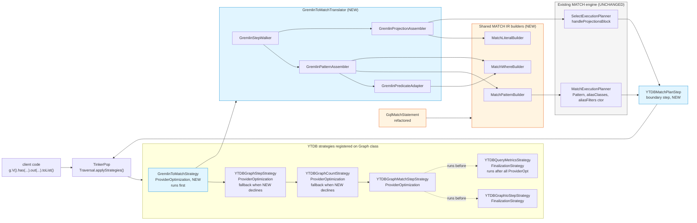

# Gremlin-to-MATCH Translator

## Design Document
[design.md](design.md)

## High-level plan

### Goals

Translate the pattern-matching subset of Gremlin traversals (`g.V()…`) into
YouTrackDB's existing MATCH IR (`Pattern` + alias maps + projection/order/limit
metadata) and feed that IR directly to `MatchExecutionPlanner`. Produce no
intermediate text; reuse the optimizer (cost estimation, prefetch, topological
scheduling, hash anti-joins) already built for SQL `MATCH`.

The translator is wired in as a TinkerPop `ProviderOptimizationStrategy`. When
applied to a traversal, it walks the **entire** step list. If every step is in
the recognized set, the translator converts the whole traversal into MATCH IR
via shared builders, runs `MatchExecutionPlanner` to obtain a
`SelectExecutionPlan`, and replaces the traversal with a single
`YTDBMatchPlanStep` that terminates the chain — emitting TinkerPop traversers of
the negotiated output type. If **any** step is unrecognized (`repeat`, lambdas,
`simplePath`, `choose`, `sack`, custom DSL, …), the strategy declines the
traversal and leaves it on the native TinkerPop pipeline unmodified
(all-or-nothing — see D3).

A second goal is to introduce a **shared MATCH IR builder package**
(`internal/core/sql/executor/match/builder/`) that both the new Gremlin translator and
the existing GQL front-end (`GqlMatchStatement`) consume. The builders own the
mechanical IR construction (Pattern/PatternNode/PatternEdge assembly, AND/OR/NOT
composition, Java-value → `SQLExpression` conversion). GQL is refactored onto
this shared layer in the same Phase 1 with no behavior change.

### Constraints

- **Full TinkerPop Cucumber suite (~1900 scenarios) must remain green** with
  the strategy enabled. Any traversal that contains at least one unrecognized
  step is declined whole and runs natively unmodified; the translator never
  causes a regression on a previously-passing scenario.
- **`MatchExecutionPlanner` is not modified.** Its public surface — including
  the `(Pattern, aliasClasses, aliasFilters)` constructor introduced for non-SQL
  front-ends — is consumed as-is. Any planner change found necessary must
  escalate (track-level discussion).
- **YTDB SQL grammar gets one additive edit** (Track 1, D-IS-DEFINED):
  the `IS DEFINED` / `IS NOT DEFINED` productions are added alongside
  the existing `IS NULL` / `IS NOT NULL` ones in
  `core/src/main/grammar/YouTrackDBSql.jjt`. The parser regenerates
  via `javacc-maven-plugin`; no other grammar changes are in scope.
  Existing GQL / SQL queries are unaffected (purely additive new
  tokens). Required by Track 4 (`has`/`hasNot` filter mapping) and
  Track 7 (projection presence classification) for TP-equivalent
  semantics on null-valued properties.
- **GQL refactor is behavior-preserving.** All existing GQL tests must pass
  unchanged after `GqlMatchStatement` is migrated onto the shared builders.
- **`polymorphicQuery` config is honored.** Translator reads
  `YTDBStrategyUtil.isPolymorphic(traversal)` and conveys polymorphism into
  the IR via class-IN constructs when necessary. Default = polymorphic.
- **Plan caching is on in Phase 1.** The boundary step requests
  `MatchExecutionPlanner.createExecutionPlan(ctx, profiling, /*useCache=*/true)`,
  and `GremlinPlanCache` keys on traversal bytecode fingerprint plus
  resolved parameter values inlined into the IR (see design.md §
  "Parameter binding"). Disabling cache would regress JetBrains client
  applications, so Phase 1 carries the cache and Track 12 measures the
  end-to-end cost.
- **Gremlin steps marked out-of-scope in the spec stay native** (`repeat`,
  `until`, `times`, `sack`, `store`, `aggregate`, lambdas, `subgraph`,
  `simplePath`, `cyclicPath`, advanced `path()`, `choose`, `option`,
  `executeInTx`, `computeInTx`).
- **JDK 21+, build via `./mvnw`.** Existing project-wide formatting
  (Spotless / Eclipse formatter) and the 2-space indent / 100-col width style
  apply. Runs under the existing `core` module test JVM args.
- **Strategy must be idempotent.** Re-applying it to a traversal that already
  contains the boundary step is a no-op — TinkerPop applies the strategy chain
  on every `applyStrategies()` call.

### Architecture Notes

#### Component Map



What changes:

- **`GremlinToMatchStrategy` (new, `internal/core/gremlin/translator/strategy/`)** —
  a `ProviderOptimizationStrategy` registered alongside the three existing
  `ProviderOptimizationStrategy` instances on `YTDBGraphImplAbstract`
  (`YTDBGraphStepStrategy`, `YTDBGraphCountStrategy`,
  `YTDBGraphMatchStepStrategy`). Two further strategies registered on the
  same Graph class, `YTDBGraphIoStepStrategy` and `YTDBQueryMetricsStrategy`,
  are `FinalizationStrategy` instances and run after all `ProviderOpt`
  strategies — unaffected by our ordering. Walks the entire step list; if
  every step is in the recognized set, invokes the translator and replaces
  the whole step list with a single terminating `YTDBMatchPlanStep`.
  Otherwise declines the traversal whole (D3 all-or-nothing).
- **`GremlinToMatchTranslator` package
  (`internal/core/gremlin/translator/`)** — orchestrates the translation. Has
  four collaborators:
  - `GremlinStepWalker` — iterates `Traversal.getSteps()`, keeps a
    current "node-under-construction" context, dispatches each step
    via `Map<Class<? extends Step>, StepRecogniser>.get(step.getClass())`
    (D9). Each recognizer claims a single Step class and handles every
    variant of that class internally (e.g. `NotStepRecogniser` branches
    on `hasEdgeHops(subTraversal)`); an unrecognized class yields
    `null` → traversal declines under D3.
  - `GremlinPredicateAdapter` — translates TinkerPop `P<T>` (predicate algebra)
    and `HasContainer` instances into `SQLBinaryCondition`/`SQLInCondition`/
    `SQLContainsTextCondition`.
  - `GremlinPatternAssembler` — drives `MatchPatternBuilder` to construct
    `Pattern` + alias maps; handles `as()`, edge methods, NOT
    expressions. (`optional()` is deferred to Phase 2 — D8.)
  - `GremlinProjectionAssembler` — drives `MatchLiteralBuilder` and direct
    construction of `SQLProjection`/`SQLOrderBy`/`SQLLimit`/`SQLSkip`/
    `SQLGroupBy` to populate a `QueryPlanningInfo` for
    `handleProjectionsBlock`.
- **Shared MATCH IR builder package
  (`internal/core/sql/executor/match/builder/`, new)** — three classes:
  - `MatchPatternBuilder` — `addNode(alias, className, where, optional)`,
    `addEdge(fromAlias, toAlias, direction, edgeLabel, edgeAlias,
    edgeFilter, whileCondition, maxDepth)` — `edgeAlias` and
    `edgeFilter` are optional (null for the no-edge-filter shape; GQL
    keeps using the no-edge-filter form unchanged), `build()` returning
    `(Pattern, aliasClasses, aliasFilters, edgeFilters)`.
  - `MatchWhereBuilder` — `eq`, `op`, `in`, `notIn`, `between`,
    `containsText`, `isDefined`, `isNotDefined`, `and`, `or`, `not`
    returning `SQLBooleanExpression`; `wrap()` to a `SQLWhereClause`.
    (`isDefined` / `isNotDefined` wrap the new
    `SQLIsDefinedCondition` / `SQLIsNotDefinedCondition` AST nodes
    landed in Track 1 — see D-IS-DEFINED. No `startsWith` / `endsWith`
    factories — those TinkerPop predicates decline under D3; see
    design.md § Predicate translation.)
  - `MatchLiteralBuilder` — `toLiteral(Object) → SQLExpression`, extracted
    verbatim from `GqlMatchStatement.toLiteral`.
- **`YTDBMatchPlanStep` (new,
  `internal/core/gremlin/translator/step/`)** — TinkerPop `AbstractStep` that
  wraps a `SelectExecutionPlan`. On `processNextStart()` it pulls one row from
  the plan's stream, projects the configured boundary output type
  (Vertex/Edge/Map/property-value/scalar), and emits a `Traverser`.
- **`GqlMatchStatement` (refactored)** — its inline IR construction is replaced
  by calls into the shared builders. Public API unchanged. Tests must pass.
- **`YTDBGraphImplAbstract.registerOptimizationStrategies` (1-line change)** —
  `GremlinToMatchStrategy.instance()` added to the strategy list. Position
  in the addition order is informational; actual strategy execution order
  is enforced by `applyPrior()` + `applyPost()` declarations on the new
  strategy class itself (see D4 — Ordering mechanism).

#### D1: Integration via `ProviderOptimizationStrategy`

- **Alternatives considered**: (a) Explicit entry point on
  `YTDBGraphTraversalSourceDSL` (e.g. `g.matchPattern(…)`); (b) Modify
  `YTDBGraphTraversalDSL` to route certain shapes through translator at DSL
  build time; (c) Strategy.
- **Rationale**: Strategy is the canonical TinkerPop extension point for
  vendor-specific traversal optimization. The four existing
  `ProviderOptimizationStrategy` instances on `YTDBGraphImplAbstract` use
  the same mechanism, and the Cucumber suite exercises traversals built
  through the standard `g.V()…` API — only a strategy reaches them.
  Explicit entry point would not capture pre-existing client code and
  would force a user-visible API addition.
- **Risks/Caveats**: Strategy must be idempotent (TinkerPop may invoke
  `applyStrategies()` more than once during a session); handled by detecting
  an already-installed `YTDBMatchPlanStep` and short-circuiting. Strategy
  ordering vs the four existing strategies is significant — see D4.
- **Implemented in**: Track 2.

#### D2: Planner entry via new **additive** `(MatchPlanInputs)` ctor; planner handles projection block internally

- **Alternatives considered**: (a) Existing minimal
  `(Pattern, aliasClasses, aliasFilters)` ctor + external
  `SelectExecutionPlanner.handleProjectionsBlock` — rejected: planner
  already calls `handleProjectionsBlock` internally
  (`MatchExecutionPlanner.java:624`) so a second external call would
  double-append projection / order / limit steps. (b) Existing
  `(SQLMatchStatement)` ctor — semantic mismatch (not parsing SQL) and
  the AST class is JJTree-generated, awkward to construct manually.
  (c) Public setters mutating planner state between construction and
  `createExecutionPlan` — opaque API.
- **Rationale**: Add one new additive constructor
  `MatchExecutionPlanner(MatchPlanInputs)` where `MatchPlanInputs` is a
  record holding all post-parse fields (full field list: design.md
  `MatchPlanInputs` class entry). The translator builds the record;
  `createExecutionPlan` runs unchanged and its internal
  `handleProjectionsBlock` sees populated info. **No external
  `handleProjectionsBlock` call.** The three existing constructors stay
  unchanged — new ctor is purely additive.
- **Risks/Caveats**: The new ctor is the **only** modification to
  `MatchExecutionPlanner` in Phase 1. Implementation = public record +
  delegating ctor body that defensive-copies fields, mirroring the
  existing `(SQLMatchStatement)` ctor's pattern. Resolves CR1
  (`notMatchExpressions`) and Track 4's `aliasRids` gap together.
- **Implemented in**: Track 2 (record + ctor + minimal-V wiring); Tracks
  4 / 5 / 7–9 / 11 (consumers).

#### D3: All-or-nothing translation, no hybrid prefix

- **Alternatives considered**: (a) hybrid prefix (translate the longest
  contiguous prefix of recognized steps and let the suffix continue
  natively); (b) hybrid subgraph (translate any contiguous segment); (c)
  all-or-nothing (chosen); (d) hybrid prefix kept but gated to a large
  recognized set via a config knob.
- **Rationale**: simpler walker (one yes/no decision, no prefix-cut
  bookkeeping), fewer edge cases (no output-type negotiation across
  a mid-traversal boundary, no label propagation, no `path()`-interaction
  subtleties), and the Phase 2 cache work is unaffected — the cache key
  shape is the same. Native fallback is preserved at traversal granularity
  rather than step granularity, which matches how operators reason about
  "this query did or did not benefit from MATCH". Phase 1's minimal scope
  is `g.V()` / `g.V(ids)` only; the hybrid mechanism only pays off if the
  recognized set is large enough that mid-traversal cuts produce useful
  plans. Phase 2 will introduce the full caching and recognized-set
  expansion — there is no value in growing the hybrid mechanism in Phase 1
  only to retire or rework it later.
- **Risks/Caveats**: the recognized step set grows track by track; until
  it covers the LDBC-relevant shapes, most production traversals will
  decline. Track 12's perf baseline must measure against the recognized
  set as it stands at end of Phase 1, not against the full LDBC suite.
- **Implemented in**: Track 2 (size-1 gate enforces all-or-nothing for
  the minimal recognized set), Tracks 3-10 (extend the recognized set;
  walker classifies each step as recognized/unrecognized and declines the
  whole traversal on the first unrecognized step). Track 11 is retired
  (`[~]`) — boundary refinement is subsumed: output-type negotiation
  merges into Tracks 7/8/9 where the relevant terminal steps are
  introduced; cross-boundary label propagation and `path()` interaction
  are no-ops under all-or-nothing.

#### D4: Strategy ordering — `GremlinToMatchStrategy` runs first; YTDB half-measure strategies are the fallback path

- **Alternatives considered**: (a) Run after `YTDBGraphStepStrategy` and
  `YTDBGraphCountStrategy` so the translator sees `YTDBGraphStep` with
  absorbed has-containers (original draft) — rejected after review: the
  half-measure strategies mutate the step list before the translator
  ever sees it, so a translator that later declines leaves a partially
  optimized step list to the native pipeline, mixing two optimization
  paths in one query; (b) Replace `YTDBGraphMatchStepStrategy`
  entirely — rejected because its label-folding still has value as the
  decline-path fallback; (c) Run **first** and own the start-step
  absorption logic ourselves, leaving the YTDB half-measure strategies
  to handle traversals the translator declines (chosen).
- **Rationale**: The new strategy is the primary path. When it
  recognizes the traversal, every step including the start step is
  translated to MATCH IR and the cost-based planner takes over —
  `YTDBGraphStepStrategy`'s has-container folding and
  `YTDBGraphCountStrategy`'s class-count shortcut are no longer needed
  on that traversal because the planner now owns selectivity and
  aggregation decisions end-to-end. When the new strategy **declines**,
  the original step list is preserved verbatim and the two YTDB
  half-measure strategies see it next — exactly as they would in a
  world without the translator. Net effect: every recognized shape
  gains the planner; every unrecognized shape is at least as well
  served as before the translator existed.
- **Step-by-step composition** (not peek-ahead absorption). Running
  first means `StartStepRecogniser` cannot rely on `YTDBGraphStep`
  having absorbed adjacent `HasStep`s via `YTDBGraphStepStrategy` —
  but that is **not a problem to solve** at the start-step recognizer
  level. The walker iterates the step list step by step:
  `StartStepRecogniser` claims the bare `GraphStep` (pins the boundary
  alias, optionally inlines RIDs from `g.V(ids)`), the next
  `HasStep` claims through `HasStepRecogniser` (Track 4) and AND-merges
  its predicate into `aliasFilters[boundaryAlias]`. The resulting IR
  is identical to what the old `YTDBGraphStepStrategy` fold produced —
  a node alias with a `where` clause — but composed from two
  recognizer claims instead of a pre-folded single step. The walker
  iteration **is** the absorption; no peek-ahead in the start-step
  recognizer is needed.
- **Half-measure idempotency when the translator succeeds.** When
  `GremlinToMatchStrategy` recognizes the traversal and replaces the
  step list with a single `YTDBMatchPlanStep`, the three half-measure
  strategies still run because TinkerPop's strategy chain invokes
  every registered strategy in the resolved order. They no-op: each
  one introspects the step list looking for `GraphStep` (or
  `MatchStep` for `YTDBGraphMatchStepStrategy`), finds none (only
  `YTDBMatchPlanStep`), and returns without mutating anything. This
  is **part of the contract**, not an accident — Phase 1 ships a
  guard test (`HalfMeasuresAreNoOpOnTranslatedTraversalTest`) that
  pins it.
- **Ordering mechanism**: `GremlinToMatchStrategy.applyPrior()` returns
  `{YTDBGraphStepStrategy.class, YTDBGraphCountStrategy.class, YTDBGraphMatchStepStrategy.class}` —
  declaring that all three run **after** it. `applyPost()` returns
  the TinkerPop structural folders the translator depends on
  (`IncidentToAdjacentStrategy.class`, `ConnectiveStrategy.class`,
  `LazyBarrierStrategy.class`) so the new strategy sees the post-fold
  shapes the recognizer table describes. No edit to existing
  strategies is required.
- **Risks/Caveats**:
  - Tests that exercise the YTDB half-measure strategies must still
    pass when they run on declined traversals.
  - The `applyPost` set references TinkerPop internal classes. If
    upstream renames or restructures these classes (TinkerPop
    major-version bump), the `applyPost` declaration silently
    misfires — the strategies still run, but no longer guaranteed in
    the order the translator depends on. Mitigation: a defensive
    unit test asserts that every class named in `applyPost` is
    present on the classpath at the expected fully-qualified name;
    a TinkerPop upgrade then surfaces here as a failed test rather
    than a runtime drift.
  - The ordering is verified by a unit test that builds a
    `TraversalStrategies` set and asserts iteration order rather than
    relying on `applyPrior` / `applyPost` declarations alone, plus
    **two** end-to-end assertions:
    1. A declined traversal (e.g. `g.V().has("name","Alice").map(...)`
       with a lambda) ends up with `YTDBGraphStep` after applying
       all strategies — proves the half-measure fallback path fires.
    2. A recognized traversal (e.g. `g.V().has("name","Alice")`)
       ends up with **exactly one** step in the chain
       (`YTDBMatchPlanStep`) — proves the half-measures no-op'd and
       did not interfere with the translation. Without this dual
       assertion, a regression where a half-measure starts mutating
       a translated step list stays undetected.
- **Implemented in**: Track 2.

#### D5: Plan cache lands in Phase 1 keyed on (traversal-fingerprint × parameter values)

- **Alternatives considered**: (a) ship Phase 1 with cache disabled and
  measure the cost first (original draft) — rejected: JetBrains client
  applications rely on cached plans and a cache-disabled rollout would
  cause a measurable regression that we cannot ship past code review;
  (b) reuse `YqlExecutionPlanCache` with a synthetic
  `"GREMLIN_BC:" + normalized-bytecode + ':' + parameter-hash` key —
  rejected because invalidation hooks differ subtly between YQL and
  Gremlin and the cross-front-end coupling would leak; (c) ship a
  dedicated `GremlinPlanCache` modeled on `GqlExecutionPlanCache`, keyed
  on traversal bytecode fingerprint plus the resolved parameter values
  that the translator inlines into the IR (chosen).
- **Rationale**: The `GremlinPlanCache` key already has both halves
  available at strategy time — bytecode comes from
  `Bytecode.fromTraversal(traversal)` (or equivalent) and the resolved
  parameter list falls out of `MatchLiteralBuilder.toLiteral`
  invocations, so capturing them costs one extra list per walk. Cache
  invalidation on schema change piggybacks on the YQL plan-cache
  invalidation hook so `CREATE CLASS` / `CREATE INDEX` flushes Gremlin
  plans alongside SQL plans.
- **Risks/Caveats**: Parameter-hash collisions (different parameter
  values with the same hash) would serve stale plans — we therefore
  use the parameter list, not just a hash, as part of the cache-key
  equality check. Cache-key memory grows with parameter-value size; the
  cache has the same eviction policy as `GqlExecutionPlanCache` and the
  same memory ceiling.
- **Implemented in**: Track 12 (cache plumbing + perf measurement).

#### D6: Shared MATCH IR builder package; GQL refactor in Phase 1

- **Alternatives considered**: (a) Translator owns its private builders,
  shared layer extracted post-Phase-1; (b) Builders shared from day 1,
  GQL adopts in same Phase 1; (c) No extraction, translator copies what
  it needs from `GqlMatchStatement`.
- **Rationale**: The shareable parts (Pattern construction primitives,
  AND/OR/NOT composition, `toLiteral`) are thin wrappers over already-stable
  IR classes — not speculative abstractions. Extracting them now means
  one consistent IR construction surface from day 1; future GQL extensions
  (edges, predicates, projections) reuse the same plumbing. The cost is
  a small GQL refactor (~30 LOC diff in `GqlMatchStatement`) that is
  behavior-preserving and validated by GQL tests.
- **Risks/Caveats**: GQL test suite must remain green after refactor — a
  blocker if not. The shared API must accommodate both today's GQL needs
  (single-node patterns) and the translator's full needs (chains, edges,
  optional, NOT) without baking in either's specifics.
- **Implemented in**: Track 1.

#### D7: Strategy idempotency

- **Alternatives considered**: (a) Always re-translate — costly and
  potentially incorrect if `YTDBMatchPlanStep` is in the chain; (b)
  Detect `YTDBMatchPlanStep` and short-circuit; (c) Rely on TinkerPop
  to apply strategies once per traversal — fragile assumption.
- **Rationale**: TinkerPop's `Traversal.applyStrategies()` is invoked at
  least once but may be invoked more than once in cloned traversals, in
  remote execution prep, in test harnesses, etc. An idempotent strategy
  is robust regardless of caller. Detection is cheap — first step
  inspection.
- **Risks/Caveats**: If `YTDBMatchPlanStep` is somewhere other than
  position 0 (because user wrapped it), naïve detection fails. Detector
  must scan the entire step list, not just the start step.
- **Implemented in**: Track 2.

#### D8: Union enters the recognized set; `optional` is deferred to Phase 2

- **Alternatives considered**: (a) translate the well-formed `optional`
  shape inline (terminal optional with downstream `select`) — rejected
  because TinkerPop's `OptionalStep` drops rows whose sub-traversal yields
  nothing while MATCH `{optional:true}` emits them with null alias, and
  the divergence flips result-set membership on the case `optional` is
  used for; (b) recognize only the well-formed shapes for both `optional`
  and `union` — incompatible with the divergence above; (c) recognize
  `union` (concatenation maps onto sequenced plans cleanly) and defer
  `optional` to Phase 2 along with the alignment design (chosen).
- **Rationale**: `union(...)` is concatenation of result streams; we
  implement it as a sequence of independent translated plans whose
  result streams are concatenated by the boundary step. All children
  must agree on `BoundaryOutputType`, otherwise the union step is
  unrecognized and under D3 the entire enclosing traversal declines.
  `optional`, by contrast, requires either a drop-on-null filter at the
  boundary step (mirroring `SelectStep`'s `EmptyTraverser` behavior) or
  a MATCH-level alternative pattern. Phase 2 owns that design.
- **Risks/Caveats**: Phase 2's `optional` design must enumerate the
  empty-sub-traversal, nested-optional, and mid-chain-optional cases
  and pin their multiset semantics against TinkerPop's actual runtime,
  not the table-level approximation.
- **Implemented in**: Track 10 (union recognition + multi-plan boundary
  step). `optional` is intentionally absent from Phase 1.

#### D9: Type-keyed recognizer dispatch via `Map<Class<? extends Step>, StepRecogniser>`

- **Alternatives considered**: (a) `List<StepRecogniser>` with linear
  first-match-wins dispatch — rejected because `instanceof`-based claim
  silently sweeps unknown `HasStep` subclasses into the parent
  recognizer's path; (b) `Map<Class, List<StepRecogniser>>` hybrid —
  rejected as essentially "map keyed on class, list inside" which adds
  a layer without removing the partial-write hazard the per-recognizer
  no-mutation contract is meant to address; (c) `Map<Class<? extends
  Step>, StepRecogniser>` keyed on `step.getClass()`, with multi-shape
  steps (NotStep) handled by a single recognizer that branches
  internally on the sub-traversal shape (chosen).
- **Rationale**: `getClass()` returns the concrete runtime class, so
  YTDB-specific subclasses (`YTDBHasLabelStep extends HasStep`) route
  to their own entries without an ordering invariant. A future
  TinkerPop subclass nobody registered for yields `map.get → null` and
  declines the whole traversal under D3 — the "safe failure" outcome
  lpld asked for in the review. `NotStep` is the one Phase 1 step
  class with two MATCH IR slots (`aliasFilters` for filter sub-trees,
  `notMatchExpressions` for edge sub-patterns); the `NotStepRecogniser`
  inspects `hasEdgeHops(subTraversal)` once and routes accordingly,
  sharing the same sub-traversal shape detector and the no-mutation
  discipline both branches need.
- **Migration vs the in-flight implementation**: the
  `gremlin-to-match-translator` branch currently uses
  `List<StepRecogniser>` with two separate recognizers
  (`NotFilterStepRecogniser`, `NotPatternStepRecogniser`). The
  switch-over collapses those into one `NotStepRecogniser` with
  internal branching and replaces the linear walker dispatch with
  `map.get(step.getClass())`. `RecogniserDispatchOrderTest` collapses
  into a duplicate-key-assertion check (key → expected recognizer
  class) — the bulk of its matrix becomes vacuous once the map is the
  dispatcher.
- **Risks/Caveats**: the no-mutation-on-decline contract stays as a
  per-recognizer unit-test invariant for the recognizers that branch
  internally (NotStep, SubTraversalPredicateAdapter callers); without
  the map dispatch it was load-bearing for the whole registry, with
  the map it survives only inside the recognizers that need it.
- **Implemented in**: Track 2 (initial map dispatch when the walker
  lands), and a refactor step in Track 5 (combining the two NotStep
  recognizers into one).

#### D10: Walker supports multi-step claims via index-driven iteration

- **Alternatives considered**: (a) keep the walker's for-each loop and
  require every recognizer to claim exactly one step (original
  design) — rejected because the non-adjacent edge-filtering shape
  (`outE(L).has(...).inV()`) inherently spans 3+ steps that collapse
  into one `SQLMatchPathItem` in MATCH IR; modelling it as three
  separate single-step claims would require either per-recogniser
  state-machine plumbing or a second pre-pass; (b) split the
  multi-step shape across two recognizers (one for `outE`, one for the
  closing vertex step) with cross-recogniser state in `WalkerContext`
  to remember "we're inside an open edge chain" — rejected because
  the open-state would leak into every other recogniser that fires in
  between (e.g. `HasStepRecogniser` would need to know "the next has
  is an edge filter, not a node filter"); (c) index-driven walker loop
  with a recogniser-side `ctx.stepIndex` advance for multi-step claims
  (chosen).
- **Rationale**: A recogniser that claims `outE(L)` and peeks ahead
  through `HasStep`s up to the closing `EdgeVertexStep` knows exactly
  how many steps it consumed and can advance `ctx.stepIndex` past all
  of them in one call. The walker switches from a for-each loop to
  `while (ctx.stepIndex < steps.size()) { ... }` and treats any
  recogniser-driven advance as "I consumed multiple steps"; if the
  recogniser did not move the index, the walker falls back to the
  default `++`. Single-step recogniser implementations are unchanged.
- **Risks/Caveats**: Forgetting to advance `ctx.stepIndex` in a
  multi-step recogniser would deadlock the walker (infinite loop on
  the same step). The walker has a safety assertion (`stepIndex` is
  strictly increasing after each successful recognise) that catches
  the bug in unit tests rather than at runtime. Multi-step recognisers
  must also publish `consumedSteps` for the dispatch-order test so the
  cross-product matrix exercises both the single-step and multi-step
  paths.
- **Implemented in**: Track 3 (`EdgeStepRecogniser` is the first
  multi-step recogniser; walker refactor lands with it).

#### D-IS-DEFINED: Add YTDB SQL `IS DEFINED` / `IS NOT DEFINED` operators in Track 1

- **Alternatives considered**: (a) Map `has(key) → IS NOT NULL` and
  `hasNot(key) → IS NULL` (the original design) — rejected after PR
  #1038 review (lpld line=95, andrii0lomakin confirming the team's
  "do not unify absent vs null" stance): YTDB's TP wrapper exposes
  null-valued properties as `Property.isPresent() == true`
  (`YTDBElementImpl.readFromEntity` returns a non-empty `YTDBProperty`
  carrying `value=null`, since `EntityImpl.getPropertyAndChooseReturnValue`
  at lines 488-497 only returns `null` for *absent* entries, not for
  `entry.value == null`). `IS NULL` would over-match such properties
  where TP `hasNot` would not. (b) Decline `has(key)` / `hasNot(key)`
  in Phase 1 — rejected: presence filtering is one of the most-used
  Gremlin filter shapes; losing it would shrink the recognised set
  significantly. (c) Accept the divergence as a known issue — rejected:
  the divergence is silent (no error, just wrong result multisets on
  data with null-valued properties), exactly the failure mode the D3
  all-or-nothing rule is designed to prevent. (d) Add the two new
  YTDB SQL operators (chosen) — lpld's suggestion in the same review
  thread.
- **Rationale**: `IS DEFINED` / `IS NOT DEFINED` are entity-presence
  predicates that ask `EntityImpl.hasProperty(key)` directly, bypassing
  the value-flattening that `IS NULL` / `IS NOT NULL` inherit from
  `Result.getProperty`'s null-on-absent contract. The two operators
  give the Gremlin translator the exact semantics TP's `has` / `hasNot`
  requires, with zero hidden divergence. The same presence check
  underpins Track 7's `valueMap` / `values` / `select.by` projection
  classification (see design.md "Track 7 commitment"), so the helper
  is shared between Tracks 1 (operator) and 7 (projection) — no
  duplicate code path. Index integration returns `Operation.None`
  (presence predicates can't use value-keyed indexes), so the planner
  side is a no-op.
- **Risks/Caveats**: The operator addition modifies
  `core/src/main/grammar/YouTrackDBSql.jjt` (the only Phase 1 grammar
  edit). The parser regenerates automatically via the existing
  `javacc-maven-plugin` configuration — no manual edits to generated
  files. GQL's user-facing MATCH grammar does **not** expose these
  operators in Phase 1; the addition is internal-facing (`MatchWhereBuilder`
  factories for the Gremlin translator). Exposing them in GQL syntax
  is a separate decision out of scope here. Risk that index work
  in Phase 2+ accidentally tries to route these through value-keyed
  indexes — Javadoc on both AST classes documents the `Operation.None`
  decision to deter that.
- **Implemented in**: Track 1 (grammar + AST + evaluator + tests +
  `MatchWhereBuilder.isDefined`/`isNotDefined` factories). Consumed
  in Track 4 (`has` / `hasNot` filter mapping) and Track 7 (projection
  presence classification — same `hasProperty` primitive, no
  additional SQL surface needed there).

### Invariants

- `MatchExecutionPlanner` existing public method signatures are unchanged
  after Phase 1. Phase 1 adds **one** new public ctor
  `MatchExecutionPlanner(MatchPlanInputs)` (D2) — a purely additive
  change. No existing ctor or method is altered (verified by reading the
  file's public method list before/after).
- `GqlMatchStatement` produces a **structurally equivalent** plan tree
  (same step types in the same order, same alias bindings, equivalent
  `prettyPrint(0,2)` output) before and after the shared-builder migration
  for all existing GQL test inputs. Verified by the existing GQL test
  suite passing 1:1, plus golden-string regression tests over
  `prettyPrint(0,2)` for representative queries (single-node anonymous,
  multi-property AND filter, multi-filter map). "Byte-identical" was
  rejected as too strict — construction-order differences through the
  builder API may produce semantically equivalent but not byte-identical
  field-level state.
- For any traversal whose start step is not a translatable
  `g.V()`/`g.E()`, the strategy is a no-op — the traversal is unmodified.
- For any traversal that contains at least one unrecognized step, the
  strategy declines the whole traversal: no IR is constructed, no
  boundary step is inserted, and the step list is preserved verbatim
  (D3 all-or-nothing).
- Re-applying the strategy to a traversal that already contains
  `YTDBMatchPlanStep` is a no-op (verified by a unit test that calls
  `apply()` twice and asserts step list equality).
- **Polymorphism uniformity**: the `polymorphicQuery` flag pinned by the
  start-step recognizer at first claim applies to **every** node alias
  the walk introduces — start node and chain targets alike. Recognisers
  that add chain-target nodes (`VertexStepRecogniser` from Track 3,
  `hasLabel` recognizers from Track 4) read `WalkerContext.polymorphic`
  and apply the same `@class = '<className>'` (or `@class IN [...]`)
  narrowing the start-step recognizer does. Verified by parameterised
  tests of `g.V().out(label)` under both polymorphic settings against
  a graph with subclass instances; the translated and native pipelines
  must agree on which subclass instances appear.
- Cucumber suite test count: count after Phase 1 ≥ count before Phase 1.
  The PR title carries `[no-test-number-check]` only if intentional
  test consolidation was done (it is not expected here).

### Integration Points

- **Strategy registration**: `YTDBGraphImplAbstract.registerOptimizationStrategies(Class)`,
  one new line adding `GremlinToMatchStrategy.instance()`. Insertion
  order is informational — the runtime order is fixed by
  `applyPrior()` / `applyPost()` declarations on the new strategy
  itself, which place it before all three YTDB half-measure strategies
  (see D4).
- **Polymorphism flag**: Translator reads
  `YTDBStrategyUtil.isPolymorphic(traversal)` and conveys polymorphism into
  the IR (e.g. `SQLMatchFilter.className` for the polymorphic case is
  set to the parent class; for non-polymorphic, the filter is augmented
  with a `class IN [...]` constraint or a flag).
- **Boundary step output**: `YTDBMatchPlanStep` extends
  `org.apache.tinkerpop.gremlin.process.traversal.step.map.GraphStep`,
  emits `Traverser`s whose payload types are negotiated by the
  traversal's terminal step (Vertex, Edge, `Map<String,Object>`,
  property value, scalar). Under D3 all-or-nothing the boundary step
  terminates a fully-translated traversal — there is no native suffix
  consuming its output.
- **Shared builder package**: `internal/core/sql/executor/match/builder/` —
  `MatchPatternBuilder`, `MatchWhereBuilder`, `MatchLiteralBuilder`.
  Consumed by both the new translator and refactored
  `GqlMatchStatement`.
- **Cucumber feature suite**: `core` module's `YTDBGraphFeatureTest` and
  `embedded` module's `EmbeddedGraphFeatureTest` exercise the strategy
  end-to-end with no test changes. Strategy is registered through
  `YTDBGraphEmbedded`'s static initializer.

### Non-Goals

- **`repeat().until()/times()`** — variable-depth traversal. Could map to
  MATCH `WHILE`/`maxDepth` but that's its own design effort. Phase 2.
- **`sack()`, `store()`, `aggregate()`** — stateful traverser side-effects
  with no MATCH equivalent. Likely never supported; stay native.
- **Lambda steps** — arbitrary code, untranslatable. Stay native.
- **`subgraph()`** — subgraph extraction, not a pattern match. Out of scope.
- **`simplePath()`, `cyclicPath()`, advanced `path()` manipulation** —
  partial support possible later. Phase 2.
- **`choose().option()`** — imperative branching. Phase 2.
- **`executeInTx()`, `computeInTx()`** — execution model concerns, not
  pattern matching. Stay native.
- **Optional sub-traversal (`optional(traversal)`)** — Gremlin and MATCH
  disagree on the empty-sub-traversal case (Gremlin drops the row,
  MATCH null-fills the alias). Phase 2 owns the alignment design.

## Checklist

- [ ] Track 1: Shared MATCH IR builders + GQL adoption + `IS DEFINED` / `IS NOT DEFINED` operators
  > Establishes the foundation that the rest of Phase 1 builds on. Creates a
  > new package `internal/core/sql/executor/match/builder/` with three
  > classes — `MatchLiteralBuilder`, `MatchWhereBuilder`, `MatchPatternBuilder` —
  > and refactors `GqlMatchStatement` onto them so GQL today and the upcoming
  > Gremlin translator share one MATCH IR construction surface.
  >
  > **Also adds two new YTDB SQL operators** (D-IS-DEFINED): `IS DEFINED`
  > and `IS NOT DEFINED` — entity-presence predicates, distinct from
  > `IS NULL` / `IS NOT NULL` (which check the projected value). Track 4
  > and Track 7 depend on these for the correct `has`/`hasNot` filter
  > mapping and the `valueMap`/`values` projection presence classification
  > (see design.md "Phase 1 dependency: `IS DEFINED` / `IS NOT DEFINED`
  > operators" and "Track 7 commitment"). Grammar edit in
  > `core/src/main/grammar/YouTrackDBSql.jjt`, two new AST classes
  > (`SQLIsDefinedCondition`, `SQLIsNotDefinedCondition`) with evaluator
  > backed by `EntityImpl.hasProperty(key)`. `IndexFinder` integration
  > returns `Operation.None` (presence predicates can't use value-keyed
  > indexes). `MatchWhereBuilder` exposes `isDefined(...)` /
  > `isNotDefined(...)` factories.
  >
  > **Scope:** ~6 steps covering the three builder classes, the GQL
  > refactor, golden-string regression tests over `prettyPrint(0,2)`,
  > the grammar + AST + evaluator for the new operators, and parser /
  > evaluator / integration tests for them.

- [ ] Track 2: Strategy skeleton + boundary step + minimal `g.V()`/`g.V(ids)` translation
  > Wires the new strategy into the optimization chain and establishes the
  > end-to-end pipeline with the simplest possible recognized traversal.
  > Introduces **`MatchPlanInputs`** (record in
  > `internal/core/sql/executor/match/`, new) holding `Pattern`,
  > `aliasClasses`, `aliasFilters`, `aliasRids`, `matchExpressions`,
  > `notMatchExpressions`, `returnItems`, `returnAliases`,
  > `returnNestedProjections`, `groupBy`, `orderBy`, `unwind`, `limit`,
  > `skip`, `returnDistinct`, and the four return-flags
  > (`returnElements`/`returnPaths`/`returnPatterns`/`returnPathElements`).
  > Adds the corresponding additive constructor
  > `MatchExecutionPlanner(MatchPlanInputs)` that field-by-field defensive-
  > copies the inputs (mirroring the existing `(SQLMatchStatement)` ctor's
  > pattern). The three existing constructors stay untouched. This is the
  > **only** modification to `MatchExecutionPlanner` planned for Phase 1
  > (D2).
  >
  > Creates **`GremlinToMatchStrategy`** (`internal/core/gremlin/translator/strategy/`)
  > as a `ProviderOptimizationStrategy` singleton. Its `apply(Traversal.Admin)`
  > method walks the entire step list under D3 (all-or-nothing):
  > 1. Returns immediately if the traversal contains `YTDBMatchPlanStep`
  >    anywhere (idempotency, D7).
  > 2. Returns immediately if the start step is not a `GraphStep`/
  >    `YTDBGraphStep` (D1: only translate traversals starting with `g.V()` /
  >    `g.E()`).
  > 3. Walks every step in the traversal. Phase 1's recognized set is
  >    exactly `{ YTDBGraphStep with optional ID list }` — i.e. the start
  >    step alone. If any step beyond the start is present, it is
  >    unrecognized and the strategy declines the entire traversal.
  > 4. If the whole traversal is recognized, invokes the translator to
  >    construct a `MatchPlanInputs` (Pattern + alias maps +
  >    return/order/limit metadata) via the shared builders and obtains a
  >    `SelectExecutionPlan` from `new MatchExecutionPlanner(inputs)
  >    .createExecutionPlan(ctx, profiling, /*useCache=*/true)` (D5).
  >    Step dispatch inside the walker uses
  >    `map.get(step.getClass())` against the type-keyed registry
  >    (D9) — Track 2 lands the map skeleton with one entry
  >    (`YTDBGraphStep.class → StartStepRecogniser`); subsequent tracks
  >    add their map entries without touching the walker.
  > 5. Replaces the entire step list with one `YTDBMatchPlanStep` that
  >    terminates the traversal — emitting TinkerPop traversers of the
  >    negotiated output type for `.toList()` / `.iterate()` / etc.
  >
  > Creates **`YTDBMatchPlanStep`** (`internal/core/gremlin/translator/step/`),
  > extending `GraphStep<Object, E>`. Holds an `InternalExecutionPlan` and
  > a configured **boundary output type** (initially `Vertex`). On
  > iterator exhaustion, drives the plan's `ExecutionStream`, pulls one
  > `Result` per `next`, projects it to the configured output type, and
  > emits a `Traverser`. Closes the stream and the plan on traversal close.
  >
  > Registers the strategy in
  > `YTDBGraphImplAbstract.registerOptimizationStrategies` (insertion
  > order is informational; runtime order is fixed by `applyPrior()`
  > placing `GremlinToMatchStrategy` before the three YTDB half-measure
  > strategies — D4). The new strategy is the primary path; old
  > strategies are the fallback when this one declines.
  >
  > Verifies via integration test that `g.V().toList()` produces the same
  > vertices as the un-translated path (acts as a strategy-engagement
  > smoke test). Verifies `g.V(ids).toList()` returns the same vertices
  > as RID-driven SQL `MATCH`. Cucumber suite must pass — the very
  > minimal recognized set means most scenarios decline the whole traversal
  > and run native unmodified (D3 all-or-nothing), validating that the
  > native-fallback contract preserves all current behavior.
  >
  > Track-internal flow:
  >
  > ```mermaid
  > flowchart LR
  >     T[Traversal] --> S[GremlinToMatchStrategy.apply]
  >     S --> ID[idempotency check]
  >     ID -->|already translated| END1[no-op]
  >     ID -->|fresh| W[walk full step list]
  >     W --> P[entire traversal recognized?]
  >     P -->|no| END2[decline whole traversal — leave native]
  >     P -->|yes| TR[translator → IR]
  >     TR --> MEP[MatchExecutionPlanner]
  >     MEP --> PLAN[SelectExecutionPlan]
  >     PLAN --> RPL[replace whole step list with YTDBMatchPlanStep]
  > ```
  >
  > **Scope:** ~5 steps covering `MatchPlanInputs` record + additive ctor,
  > `GremlinToMatchStrategy` skeleton with structural gating + ordering,
  > `YTDBMatchPlanStep` boundary step, minimal `g.V()` / `g.V(ids)`
  > translator, registration + Cucumber smoke.

- [ ] Track 3: Edge traversal — `out`, `in`, `both`, `outE.inV`, `inE.outV`, `bothE.otherV`, plus non-adjacent edge filtering
  > Extends the recognized step set with edge-traversal patterns. Adds
  > handlers in `GremlinStepWalker` for:
  > - `VertexStep` with direction OUT/IN/BOTH and edge labels — produces
  >   a `SQLMatchPathItem` via `SQLMatchPathItem.outPath/inPath/bothPath`
  >   helpers wrapped by `MatchPatternBuilder.addEdge`.
  > - `EdgeVertexStep` (the `inV()`/`outV()` after an `outE(label)` /
  >   `inE(label)`) — composes with the preceding `VertexStep` of `Edge`
  >   class to form one `SQLMatchPathItem` with edge alias plus terminal
  >   vertex alias. Requires walker to peek ahead and pair the two steps.
  > - `bothE(label).otherV()` — handled like the directional `bothE.inV`
  >   chain but with bidirectional edge.
  > - Multiple edge labels (`out("knows", "follows")`) → MATCH path-item
  >   with `IN [...]` edge filter; MATCH supports edge-label `IN` lists
  >   via the path-item filter mechanism.
  > - Anonymous intermediate vertex aliases — generated by the translator
  >   under a private prefix (e.g. `$g2m_anon_N`) chosen to be unique within
  >   the produced pattern. The existing
  >   `MatchExecutionPlanner.DEFAULT_ALIAS_PREFIX` convention is
  >   intentionally not reused: it is package-private to
  >   `internal/core/sql/executor/match` and the
  >   `MatchExecutionPlanner.assignDefaultAliases` re-assignment never runs
  >   on the translator's path (consistency review CR4 — `buildPatterns`
  >   short-circuits when `pattern != null`, which is always the case for
  >   the `MatchPlanInputs` ctor). The translator's anonymous aliases only
  >   need to be locally unique and not collide with user-provided labels.
  > - **Chain-target polymorphism**: the recognizer reads
  >   `WalkerContext.polymorphic` (pinned by `StartStepRecogniser` at first
  >   claim) and, when non-polymorphic, augments each chain-target alias's
  >   `aliasFilters` with `@class = 'V'` via the shared
  >   `MatchClassFilters.classEq` helper. Without this the chain target
  >   would silently fall back to MATCH's polymorphic-by-default behavior
  >   while the start node honours the flag — a result-set discrepancy
  >   versus the native pipeline. The `MatchClassFilters` helper is
  >   extracted in this track from the duplicated `buildClassEqExpression`
  >   logic in `StartStepRecogniser`; Track 4's `hasLabel` recognizer
  >   reuses it as the third call site.
  > - **Non-adjacent edge filtering** (`outE(L).has(...).inV()` and
  >   analogues): `EdgeStepRecogniser` claims the edge step and
  >   peek-ahead-consumes every `HasStep` between it and the closing
  >   `EdgeVertexStep` / `otherV`-form `VertexStep`. Edge filters are
  >   AND-merged into `ctx.edgeFilters[$g2m_edge_N]` (translator-minted
  >   anonymous edge alias from `anonEdgeAliasGenerator`); the merged
  >   filter lands on `SQLMatchPathItem.filter` — the IR already
  >   supports edge filters, no executor / planner change needed. Bare
  >   `outE(L)` (without closing vertex hop) and user-facing
  >   `outE(L).as("e")` stay out-of-scope (see design.md Out-of-scope
  >   table). Walker mechanic: this is the first multi-step recognizer
  >   in the registry, so the walker switches from for-each iteration
  >   to index-driven iteration (`while (ctx.stepIndex < steps.size())`)
  >   with a recogniser-side `ctx.stepIndex += consumedSteps` (D10).
  >
  > Verification: end-to-end tests for one-hop, two-hop, three-hop
  > patterns; mixed direction (out then in); multi-label edge; anonymous
  > intermediate node; polymorphic-vs-non-polymorphic cardinality on a
  > graph with subclass instances. Cross-checked against equivalent SQL
  > `MATCH` queries to confirm identical result sets and identical
  > execution plan structure (same step types in the same order,
  > regardless of parameter values).
  >
  > **Gate replacement** (carryover from Track 2's initial D3
  > implementation): Track 2's strategy declines any traversal whose
  > `getSteps().size() > 1`. As this track's recognized step set lands,
  > that hard-decline gate must be replaced with a step-recognition
  > walker that classifies each step as recognized/unrecognized and
  > declines the entire traversal only when at least one unrecognized
  > step is present (D3 all-or-nothing). The walker becomes the load-
  > bearing entry point for Tracks 4-10 as well.
  > **Scope:** ~7 steps covering simple direction handlers, outE+inV
  > pairing (adjacent — already folded by IncidentToAdjacentStrategy),
  > non-adjacent edge filtering via `EdgeStepRecogniser` with
  > peek-ahead, walker refactor to index-driven iteration (D10),
  > multi-label edge, anonymous-alias generation (both vertex and
  > edge sides), correctness tests vs SQL equivalent including
  > edge-side filter shapes.
  > **Depends on:** Track 2.

- [ ] Track 4: Filtering + predicates
  > Extends Track 3's `GremlinPredicateAdapter` skeleton with the
  > remaining `P` variants (the Track 3 skeleton already covers
  > `Compare.eq/neq/gt/gte/lt/lte`, `Contains.within/without`, and
  > `P.between` because `EdgeStepRecogniser` needs them for edge-side
  > `has(...)` translation). This track adds the four `has*` step
  > handlers (`HasStepRecogniser`, `HasLabelStepRecogniser`,
  > `HasIdStepRecogniser`, `hasNot` desugar) and the `Text`/`TextP`
  > predicate translations on top of the same adapter.
  >
  > **`GremlinPredicateAdapter` (full set)** translates TinkerPop
  > `P<T>` instances into `SQLBooleanExpression` subtrees, using
  > `MatchWhereBuilder`:
  > - `Compare.eq` → `op(field, EQ, lit)`; `neq` → `NE`; `gt`, `gte`, `lt`,
  >   `lte` → corresponding operator. *(Track 3 skeleton.)*
  > - `Contains.within` → `in(field, list)`; `Contains.without` →
  >   `notIn(field, list)`.
  > - `P.between(lo, hi)` → `between(field, lo, hi)`.
  > - `P.inside(lo, hi)` → `and(op(field, GT, lo), op(field, LT, hi))`.
  > - `P.outside(lo, hi)` → `or(op(field, LT, lo), op(field, GT, hi))`.
  > - `Text.containing` (and `TextP.containing`) →
  >   `containsText(field, substring)`.
  > - `Text.startingWith` / `endingWith` (and equivalent `TextP.*` plus
  >   `TextP.regex`) → recognizer declines; native TinkerPop pipeline
  >   handles them. See design.md § Predicate translation for the
  >   case-sensitivity / `matches`-vs-`find` divergence rationale.
  > - `P.and(...)` / `P.or(...)` / `P.not(...)` → recursive composition
  >   via `MatchWhereBuilder.and/or/not`.
  >
  > **Step handlers** in `GremlinStepWalker`:
  > - `HasStep` — for each `HasContainer` invokes the predicate adapter,
  >   ANDs all containers, attaches the result as the `where` of the
  >   current `SQLMatchFilter` via `MatchPatternBuilder`.
  > - `HasStep` with a `T.label` container that's not yet folded into
  >   the graph step (rare after `YTDBGraphStepStrategy`) — translates to
  >   a class constraint on the current node.
  > - `YTDBHasLabelStep` — consumed similarly; class names go into
  >   `aliasClasses`. `polymorphicQuery=false` adds the `class IN [...]`
  >   refinement.
  > - `HasStep` with `hasId(...)` (key = `T.id`) — translates to RID
  >   constraint on `SQLMatchFilter`. **Single-ID** routes through
  >   `MatchPlanInputs.aliasRids` (one `SQLRid` per alias → planner's
  >   `SELECT FROM #X:Y` fast path). **Multi-ID** routes through
  >   `aliasFilters` with a hand-built `WHERE @rid IN [...]` clause
  >   because `aliasRids` is single-RID-per-alias by the MATCH SQL
  >   grammar — same routing the prior track's `g.V(ids)` path
  >   discovered. `@rid` is `SQLRecordAttribute`, not `SQLIdentifier`,
  >   so the IN AST is built by hand (the shared `MatchWhereBuilder.in`
  >   helper hard-codes its LEFT side to `SQLIdentifier`). The
  >   prior track cached `SQLInCondition.operator` reflection at
  >   class-load time; the multi-ID `hasId` site becomes the third
  >   call site for that helper — lift the cached field into a shared
  >   helper in `match.builder/` rather than duplicating it again.
  > - `HasStep` with `hasNot(key)` — translates to `field IS NOT DEFINED`
  >   via `MatchWhereBuilder.isNotDefined(field)` using the new operator
  >   landed in Track 1 (see plan D-IS-DEFINED and design.md "Phase 1
  >   dependency: `IS DEFINED` / `IS NOT DEFINED` operators"). Symmetric:
  >   `has(key)` → `MatchWhereBuilder.isDefined(field)` (`field IS DEFINED`).
  >   **Not** `IS NULL` / `IS NOT NULL` — those over-match against
  >   properties stored with literal `null` value, which TP `hasNot`
  >   would not match.
  >
  > Verification: parameterized tests covering each predicate; equivalence
  > vs SQL `MATCH` with explicit `WHERE`. Tests for combinations
  > (`has(a, gt(1)).has(b, lt(10))` → AND of two conditions on same node).
  > **Scope:** ~6 steps covering predicate adapter (including all
  > `P` variants), `HasStep`, `HasLabelStep`, `HasIdStep`, `HasNotStep`,
  > comprehensive predicate-equivalence tests.
  > **Depends on:** Track 3.

- [ ] Track 5: Logical filters — `and`, `or`, `not`, `where`
  > Implements TinkerPop's logical filter steps (which contain
  > sub-traversals) by descending into their global children.
  >
  > Behavior:
  > - **`AndStep` / `OrStep` (the `ConnectiveStrategy` form)** —
  >   barrier-style steps with N sub-traversals; each child runs through
  >   a sub-walker against the same recognizer registry as the top-level
  >   walk (fresh `SubWalkerContext` inheriting the parent's
  >   `boundaryAlias`). The two recognizers diverge on what they accept
  >   because MATCH IR composes pattern fragments by AND only:
  >   - **`AndStepRecogniser`** accepts any mix of pure-filter and
  >     edge-bearing children. Pure-filter children become
  >     `SQLBooleanExpression`s AND-composed into the boundary alias's
  >     WHERE; edge-bearing children contribute pattern fragments that
  >     append to the parent's `MatchPlanInputs` (MATCH IR composes them
  >     by implicit AND).
  >   - **`OrStepRecogniser`** requires all children to be pure-filter.
  >     If any child (transitively, including nested AndStep / NotStep)
  >     carries edges, the OR is unrecognized and declines under D3 —
  >     no MATCH IR OR exists at the pattern-fragment level. Phase 2
  >     path: union-of-plans via `MultiPlanMatchStep` from Track 10 +
  >     boundary-level dedup on the parent boundary alias.
  >   The two recognizers ship as separate files so the asymmetry is
  >   visible in code, not buried in shared branching.
  > - **`NotStep`** (single `NotStepRecogniser` registered under
  >   `NotStep.class` — internal branch on
  >   `hasEdgeHops(subTraversal)`):
  >   - *Edge-bearing sub-traversal* (`not(__.out("knows"))`,
  >     `not(__.out("knows").has("city","NY"))`) — translates to a new
  >     `SQLMatchExpression` added to
  >     `MatchPlanInputs.notMatchExpressions` (consistency review CR1;
  >     routed through the new ctor introduced in Track 2). The first
  >     alias of the NOT pattern must already exist in the positive
  >     pattern (planner constraint, see
  >     `MatchExecutionPlanner.manageNotPatterns`); the recognizer
  >     pre-validates the precondition against `ctx.boundaryAlias` and
  >     declines under D3 if it fails.
  >   - *Pure-filter sub-traversal* (`not(__.has(...))`,
  >     `hasNot(key)` desugar) — translates inline to
  >     `MatchWhereBuilder.not(...)` on the current node's `where`.
  >   Both branches share the no-mutation-on-decline contract — the
  >   sub-traversal is translated to a `SQLBooleanExpression` /
  >   `SQLMatchExpression` as a pure function first; `ctx` is mutated
  >   only on a successful translation.
  > - **`WhereTraversalStep`** — same as `NotStep` but positive: a
  >   sub-traversal that must yield ≥1 result for the current row to
  >   pass. Translated as either an inline filter (when the sub-traversal
  >   is pure filter) or as an additional `SQLMatchExpression` linked
  >   to existing aliases.
  > - **`WherePredicateStep`** — `where(P.eq("a"))` style; compares two
  >   step-labels. Translates to a `where` clause referencing
  >   `$matched.a` accessors.
  >
  > Verification: tests for each combinator, including negated edge
  > patterns (`not(out("knows"))`) and where-with-step-label
  > (`where("a", P.eq("b"))`).
  > **Scope:** ~4 steps covering and/or, single `NotStepRecogniser`
  > (both filter and pattern branches), where-traversal, where-predicate,
  > equivalence tests. Drops one recognizer file vs the original split
  > (`NotFilterStepRecogniser` + `NotPatternStepRecogniser` collapse
  > into `NotStepRecogniser` with internal `hasEdgeHops` dispatch — D9).
  > **Depends on:** Track 4.

- [ ] Track 6: Step labels + dedup
  > Adds the recognized-step set: `as(label)`,
  > `dedup()`/`dedup(labels...)`.
  >
  > - **`as(label)`** — the walker reads the `Step.getLabels()` of every
  >   step it visits and propagates the label to the most recent
  >   `SQLMatchFilter` via `MatchPatternBuilder.alias(...)` updates.
  >   Default aliases (when a node has none) are generated under the
  >   translator's own private prefix (e.g. `$g2m_anon_N`) — see Track 3
  >   for the rationale (consistency review CR4: planner's
  >   `assignDefaultAliases` does not run on our path, so we do not need
  >   to share the executor's package-private
  >   `MatchExecutionPlanner.DEFAULT_ALIAS_PREFIX`).
  > - **`OptionalStep`** — deferred to Phase 2 (D8). The Gremlin /
  >   MATCH divergence on empty sub-traversal flips result-set
  >   membership, so any traversal containing `OptionalStep` declines
  >   under D3 in Phase 1.
  > - **`DedupStep` (no labels)** — translates to `info.distinct = true`
  >   on the `QueryPlanningInfo`, materialized as a `DistinctExecutionStep`
  >   by `handleProjectionsBlock`.
  > - **`DedupStep(labels...)`** — translates to a projection over those
  >   labels followed by `DISTINCT`. Declines (and the whole traversal
  >   declines under D3) if the labels reference step labels not surfaced
  >   by the traversal's projection (`select`).
  >
  > Verification: `as` labels survive through the boundary and downstream
  > `select` works; dedup over (a) full row, (b) a single label, (c)
  > multiple labels; traversals containing `OptionalStep` decline
  > (verified by boundary-step engagement assertion).
  > **Scope:** ~3 steps covering as-label propagation, dedup, parity
  > tests with SQL.
  > **Depends on:** Track 5.

- [ ] Track 7: Projections — `select`, `values`, `valueMap`, `elementMap`, `project`
  > Implements `GremlinProjectionAssembler` to populate the
  > `QueryPlanningInfo.projection` slot.
  >
  > - **`SelectStep(label1, label2, ...)`** — produces a `SQLProjection`
  >   whose `SQLProjectionItem`s reference `$matched.<label>` accessors.
  >   `SelectOneStep(label)` is the single-label form. Output type:
  >   `Map<String,Object>` for multi-label, single value for single-label.
  > - **`PropertiesStep` / `PropertyMapStep` (`values(keys...)`,
  >   `valueMap(keys...)`)** — projection over property names of the
  >   currently-bound node. `values(name)` projects `currentAlias.name`.
  >   `valueMap(name1, name2)` projects a sub-map.
  > - **`ElementMapStep`** — projection over all properties of the bound
  >   element (the schema-driven map form). Mapped to `SELECT * FROM ...`
  >   semantics in MATCH.
  > - **`ProjectStep(keys...).by(...)`** — composite map projection.
  >   Each `by(...)` modulator is a sub-traversal evaluated in the context
  >   of the current binding. Translated to one `SQLProjectionItem` per
  >   key, with the modulator's value computed by recursing into the
  >   sub-traversal (only if the sub-traversal is a pure filter/property
  >   chain — otherwise decline).
  >
  > Boundary step output type is set per the traversal's terminal step:
  > `Map` for `select`/`project`/`valueMap`/`elementMap`, value type for
  > `values(singleKey)`, full record for no-projection traversals.
  >
  > Verification: equivalence tests vs explicit SQL `RETURN`. Edge case:
  > `select` over a label that's not in the IR (should decline).
  > **Scope:** ~5 steps covering ProjectionAssembler skeleton, select,
  > values/valueMap, elementMap, project-by, equivalence tests.
  > **Depends on:** Track 6.

- [ ] Track 8: Order + pagination — `order().by`, `limit`, `skip`, `range`
  > Adds `OrderGlobalStep`, `RangeGlobalStep` recognition plus their
  > by-modulators.
  >
  > - **`OrderGlobalStep` with `by(key, Order.asc/desc)`** — produces a
  >   `SQLOrderBy` with one entry per `by` modulator. `Order.asc` /
  >   `Order.desc` map directly. `Order.shuffle` declines (no MATCH
  >   equivalent — fall back to native `OrderGlobalStep` post-boundary).
  >   Multiple `by(...)` modulators produce a multi-key sort.
  > - **`RangeGlobalStep(low, high)`** with `low ≥ 0`, `high > 0` —
  >   `SQLSkip(low)` + `SQLLimit(high - low)`. Half-open intervals
  >   handled via the convention used in MATCH.
  > - **`limit(n)`** and **`skip(n)`** are `RangeGlobalStep` variants in
  >   modern TinkerPop — handled by the same path.
  >
  > Verification: ordering equivalence vs SQL `ORDER BY`; pagination
  > equivalence; ordering on multiple keys; ordering by a property that
  > requires projection (verify `handleProjectionsBeforeOrderBy`
  > behavior).
  > **Scope:** ~3 steps covering order, range/limit/skip, equivalence
  > tests including multi-key.
  > **Depends on:** Track 7.

- [ ] Track 9: Aggregations — `count`, `sum`, `min`, `max`, `mean`, `group`, `groupCount`
  > Adds aggregation step recognition. Each maps to a combination of
  > `SQLProjection` aggregate items + `SQLGroupBy`.
  >
  > - **`CountGlobalStep`** — `RETURN count(*)` with empty group-by.
  >   Output type: scalar `Long`.
  > - **`SumGlobalStep` / `MinGlobalStep` / `MaxGlobalStep` / `MeanGlobalStep`** —
  >   require the prior step to be a property-extraction step (`values(key)`)
  >   so we know which field to aggregate. Translates to
  >   `RETURN sum(currentAlias.key)` etc. with empty group-by.
  > - **`GroupStep` (= `group()`)** — without `by`, produces
  >   `Map<element, list-of-elements>`; the no-by form mirrors
  >   `group().by(__.identity()).by(__.fold())`. Translates to
  >   `GROUP BY currentAlias` + `RETURN currentAlias, list($currentMatch)`
  >   (element-identity accumulator — `collect(*)` would gather all
  >   projected fields rather than the element itself).
  > - **`GroupStep.by(key)`** — `GROUP BY currentAlias.key` + accumulator.
  > - **`GroupCountStep`** — `GROUP BY` + `RETURN count(*)`.
  >
  > Boundary output type is the aggregate result type (scalar for
  > count/sum/min/max/mean; `Map` for group/groupCount).
  >
  > Verification: aggregate equivalence tests vs SQL; group-by equivalence;
  > empty result handling (count of empty match → 0, not absence).
  > **Scope:** ~5 steps covering count/sum/min/max/mean, group, groupCount,
  > aggregate equivalence tests, empty-result tests.
  > **Depends on:** Track 8.

- [ ] Track 10: Union — concatenation of multiple translated patterns
  > Handles `UnionStep` with N global child traversals.
  >
  > Approach: each child sub-traversal is independently inspected. If all
  > children are fully translatable as standalone pattern matches that
  > produce the same boundary output type, the strategy translates each
  > child to its own `SelectExecutionPlan` and the boundary step
  > **concatenates** their result streams (Gremlin union semantics).
  > Implementation: a `MultiPlanMatchStep` variant of `YTDBMatchPlanStep`
  > that holds N plans and iterates them in order. If any child fails to
  > translate fully, the `UnionStep` is unrecognized and under D3
  > all-or-nothing the entire enclosing traversal declines (D8).
  >
  > Type-check before concatenation: all children must agree on output
  > type. `union(__.values("a"), __.out("knows"))` mixes `String` and
  > `Vertex` — types diverge — decline.
  >
  > Verification: union of two pattern matches returns the concatenation;
  > union of three; union with one declined child stays native (test the
  > fallback explicitly).
  > **Scope:** ~3 steps covering UnionStep handler, MultiPlanMatchStep,
  > type compatibility check + fallback test.
  > **Depends on:** Track 9.

- [~] Track 11: Hybrid boundary refinement — output type negotiation, label propagation
  > Hardens the boundary step against edge cases that earlier tracks
  > deferred.
  >
  > **Skipped:** Subsumed by D3 all-or-nothing translation. The
  > boundary step is a pure terminator — output type is determined by
  > the (fully-recognized) terminal step, and there is no
  > cross-boundary label reference because no native step crosses the
  > boundary. The output-type negotiation table merges into Tracks
  > 7/8/9 where the relevant terminal steps are introduced (each track
  > pins the boundary output type for its own terminal). Cross-boundary
  > label propagation and `path()` interaction are no-ops under
  > all-or-nothing — `path()` is unrecognized in Phase 1, so any
  > traversal that contains it declines whole and runs natively. Track
  > deferred to Phase 2 if a hybrid path() / cross-boundary label
  > strategy ever returns.

- [ ] Track 12: Cucumber green + perf baseline
  > Final hardening and measurement.
  >
  > - Run the full TinkerPop Cucumber feature suite (`YTDBGraphFeatureTest`
  >   in `core` and `EmbeddedGraphFeatureTest` in `embedded`) end-to-end
  >   with the strategy registered. All scenarios that passed before must
  >   pass after. Investigate and fix any new failure with track-level
  >   review.
  > - Document, per spec category, the test scenarios that exercise
  >   each translated step. This is a regression-prevention catalogue,
  >   not a marketing list.
  > - Run the existing SQL LDBC SNB JMH benchmarks (`jmh-ldbc/`) on
  >   `develop` (HEAD before branch) and the branch HEAD as a sanity
  >   check that the additive `MatchPlanInputs` ctor does not regress
  >   the SQL `MATCH` path. Capture the delta in a benchmark report on
  >   the branch (worktree only — do not commit). The aim is **a
  >   measured number, not a pass/fail gate**: cache is on (D5), so this
  >   is the steady-state regression budget the Phase 1 implementation
  >   must fit inside.
  > - **Gremlin-equivalent JMH benchmark suite.** Port each LDBC SNB
  >   read query (IS1–IS7, IC1–IC13) to its Gremlin form alongside the
  >   existing SQL benchmark in `jmh-ldbc/`. Single-threaded and
  >   multi-threaded suites mirror the SQL ones (`LdbcSingleThreadIC*`,
  >   `LdbcMultiThreadIC*`, `LdbcSingleThreadIS*`, `LdbcMultiThreadIS*`
  >   — Gremlin variants get a `Gremlin` suffix). Each benchmark runs
  >   the Gremlin traversal twice — once with
  >   `QUERY_GREMLIN_TO_MATCH_TRANSLATOR_ENABLED=false` (native
  >   TinkerPop pipeline) and once with `=true` (translated through the
  >   strategy) — and the JMH report compares per-query mean times for
  >   both modes plus the SQL baseline. This is the load-bearing
  >   measurement of the translator's value: it shows how much each
  >   pattern shape gains from cost-based MATCH planning vs. left-to-right
  >   native Gremlin execution. Queries whose Gremlin shape contains
  >   anything outside the recognized set decline the strategy and run
  >   natively in both modes — those rows in the report show "no
  >   translation" and serve as a sanity check on the recognizer
  >   coverage at end of Phase 1.
  > - If the Gremlin-on / Gremlin-off comparison shows large wins,
  >   document which queries benefited and why (likely candidates:
  >   queries with multi-hop patterns where MATCH's cost-based
  >   scheduler picks better starting points than TinkerPop's
  >   left-to-right execution).
  > - If the comparison shows acceptable performance overall, finalize.
  > - If the comparison shows unacceptable regressions on representative
  >   queries (translator slower than native), ESCALATE: pull Phase 2
  >   cache (`GremlinPlanCache`) into Phase 1.
  >
  > Under D3 all-or-nothing, the Cucumber pass rate measures the
  > strategy's recognize-and-decline correctness (every traversal whose
  > step set isn't fully recognized must run natively unmodified); the
  > Gremlin benchmark on/off delta measures the strategy's
  > recognize-and-translate value on the subset that does fully translate.
  >
  > **Scope:** ~4 steps covering full Cucumber re-run + fix, scenario
  > catalogue, Gremlin LDBC benchmark suite + on/off harness, baseline
  > report.
  > **Depends on:** Track 10 (Track 11 retired as `[~]` under D3
  > all-or-nothing).

## Final Artifacts

- [ ] Phase 4: Final artifacts (`design-final.md`, `adr.md`)
