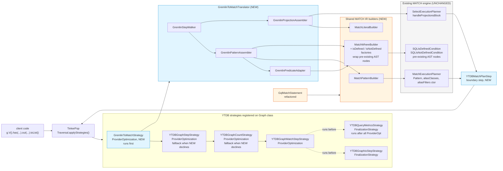

# Gremlin-to-MATCH Translator

## Design Document
[design.md](design.md)

## High-level plan

### Goals

Translate the pattern-matching subset of Gremlin traversals (`g.V()…`) into
YouTrackDB's existing MATCH IR (`Pattern` + alias maps + projection/order/limit
metadata) and feed that IR directly to `MatchExecutionPlanner`. Produce no
intermediate text; reuse the optimizer (cost estimation, prefetch, topological
scheduling, hash anti-joins) already built for SQL `MATCH`.

The translator is wired in as a TinkerPop `ProviderOptimizationStrategy`. When
applied to a traversal, it walks the **entire** step list. If every step is in
the recognized set, the translator converts the whole traversal into MATCH IR
via shared builders, runs `MatchExecutionPlanner` to obtain a
`SelectExecutionPlan`, and replaces the traversal with a single
`YTDBMatchPlanStep` that terminates the chain — emitting TinkerPop traversers of
the negotiated output type. If **any** step is unrecognized (`repeat`, lambdas,
`simplePath`, `choose`, `sack`, custom DSL, …), the strategy declines the
traversal and leaves it on the native TinkerPop pipeline unmodified
(all-or-nothing — see D3).

A second goal is to introduce a **shared MATCH IR builder package**
(`internal/core/sql/executor/match/builder/`) that both the new Gremlin translator and
the existing GQL front-end (`GqlMatchStatement`) consume. The builders own the
mechanical IR construction (Pattern/PatternNode/PatternEdge assembly, AND/OR/NOT
composition, Java-value → `SQLExpression` conversion). GQL is refactored onto
this shared layer in the same Phase 1 with no behavior change.

### Constraints

- **Full TinkerPop Cucumber suite (~1900 scenarios) must remain green** with
  the strategy enabled. Any traversal that contains at least one unrecognized
  step is declined whole and runs natively unmodified; the translator never
  causes a regression on a previously-passing scenario.
- **`MatchExecutionPlanner` is not modified.** Its public surface — including
  the `(Pattern, aliasClasses, aliasFilters)` constructor introduced for non-SQL
  front-ends — is consumed as-is. Any planner change found necessary must
  escalate (track-level discussion).
- **YTDB SQL grammar is not modified.** `IS DEFINED` / `IS NOT DEFINED`
  productions already exist in `core/src/main/grammar/YouTrackDBSql.jjt`
  (lines 2900-2913, `IsDefinedCondition` / `IsNotDefinedCondition`),
  with matching AST classes `SQLIsDefinedCondition` /
  `SQLIsNotDefinedCondition`. Track 1 (D-IS-DEFINED) only adds two
  `MatchWhereBuilder` factory methods wrapping those nodes — no
  grammar / parser / evaluator changes.
- **GQL refactor is behavior-preserving.** All existing GQL tests must pass
  unchanged after `GqlMatchStatement` is migrated onto the shared builders.
- **`polymorphicQuery` config is honored.** Translator reads
  `YTDBStrategyUtil.isPolymorphic(traversal)` and conveys polymorphism into
  the IR via class-IN constructs when necessary. Default = polymorphic.
- **Plan caching is on in Phase 1.** The boundary step requests
  `MatchExecutionPlanner.createExecutionPlan(ctx, profiling, /*useCache=*/true)`,
  and `GremlinPlanCache` keys on traversal bytecode fingerprint plus
  resolved parameter values inlined into the IR (see design.md §
  "Parameter binding"). Disabling cache would regress JetBrains client
  applications, so Phase 1 carries the cache and Track 12 measures the
  end-to-end cost.
- **Gremlin steps marked out-of-scope in the spec stay native** (`repeat`,
  `until`, `times`, `sack`, `store`, `aggregate`, lambdas, `subgraph`,
  `simplePath`, `cyclicPath`, advanced `path()`, `choose`, `option`,
  `executeInTx`, `computeInTx`).
- **JDK 21+, build via `./mvnw`.** Existing project-wide formatting
  (Spotless / Eclipse formatter) and the 2-space indent / 100-col width style
  apply. Runs under the existing `core` module test JVM args.
- **Strategy must be idempotent.** Re-applying it to a traversal that already
  contains the boundary step is a no-op — TinkerPop applies the strategy chain
  on every `applyStrategies()` call.

### Architecture Notes

#### Component Map

What changes:

- **`GremlinToMatchStrategy` (new, `internal/core/gremlin/translator/strategy/`)** —
  a `ProviderOptimizationStrategy` registered alongside the three existing
  `ProviderOptimizationStrategy` instances on `YTDBGraphImplAbstract`
  (`YTDBGraphStepStrategy`, `YTDBGraphCountStrategy`,
  `YTDBGraphMatchStepStrategy`). Two further strategies registered on the
  same Graph class, `YTDBGraphIoStepStrategy` and `YTDBQueryMetricsStrategy`,
  are `FinalizationStrategy` instances and run after all `ProviderOpt`
  strategies — unaffected by our ordering. Walks the entire step list; if
  every step is in the recognized set, invokes the translator and replaces
  the whole step list with a single terminating `YTDBMatchPlanStep`.
  Otherwise declines the traversal whole (D3 all-or-nothing).
- **`GremlinToMatchTranslator` package
  (`internal/core/gremlin/translator/`)** — orchestrates the translation. Has
  four collaborators:
  - `GremlinStepWalker` — iterates `Traversal.getSteps()`, keeps a
    current "node-under-construction" context, dispatches each step
    via `Map<Class<? extends Step>, StepRecogniser>.get(step.getClass())`
    (D9). Each recognizer claims a single Step class and handles every
    variant of that class internally (e.g. `NotStepRecogniser` branches
    on `hasEdgeHops(subTraversal)`); an unrecognized class yields
    `null` → traversal declines under D3.
  - `GremlinPredicateAdapter` — translates TinkerPop `P<T>` (predicate algebra)
    and `HasContainer` instances into `SQLBinaryCondition`/`SQLInCondition`/
    `SQLContainsTextCondition`.
  - `GremlinPatternAssembler` — drives `MatchPatternBuilder` to construct
    `Pattern` + alias maps; handles `as()`, edge methods, NOT
    expressions. (`optional()` is deferred to Phase 2 — D8.)
  - `GremlinProjectionAssembler` — drives `MatchLiteralBuilder` and direct
    construction of `SQLProjection`/`SQLOrderBy`/`SQLLimit`/`SQLSkip`/
    `SQLGroupBy` to populate a `QueryPlanningInfo` for
    `handleProjectionsBlock`.
- **Shared MATCH IR builder package
  (`internal/core/sql/executor/match/builder/`, new)** — three classes:
  - `MatchPatternBuilder` — `addNode(alias, className, where, optional)`,
    `addEdge(fromAlias, toAlias, direction, edgeLabel, edgeAlias,
    edgeFilter, whileCondition, maxDepth)` — `edgeAlias` and
    `edgeFilter` are optional (null for the no-edge-filter shape; GQL
    keeps using the no-edge-filter form unchanged), `build()` returning
    `(Pattern, aliasClasses, aliasFilters, edgeFilters)`.
  - `MatchWhereBuilder` — `eq`, `op`, `in`, `notIn`, `between`,
    `containsText`, `isDefined`, `isNotDefined`, `and`, `or`, `not`
    returning `SQLBooleanExpression`; `wrap()` to a `SQLWhereClause`.
    (`isDefined` / `isNotDefined` wrap the **pre-existing**
    `SQLIsDefinedCondition` / `SQLIsNotDefinedCondition` AST nodes
    already in `core/.../sql/parser/` — see D-IS-DEFINED. No `startsWith`
    / `endsWith` factories — those TinkerPop predicates decline under
    D3; see design.md § Predicate translation.)
  - `MatchLiteralBuilder` — `toLiteral(Object) → SQLExpression`, extracted
    verbatim from `GqlMatchStatement.toLiteral`.
- **`YTDBMatchPlanStep` (new,
  `internal/core/gremlin/translator/step/`)** — TinkerPop `AbstractStep` that
  wraps a `SelectExecutionPlan`. On `processNextStart()` it pulls one row from
  the plan's stream, projects the configured boundary output type
  (`ELEMENT` / `MAP` / `SINGLE_VALUE` / `SCALAR` / `LIST`), and emits a
  `Traverser`. Holds three Track 11 post-processor flags
  (`unfoldOutput: bool`, `reverseOutput: bool`, `tailLimit: int?`) for
  `unfold` / `reverse` / `tail` terminators that re-shape the projected
  value without changing the output type; `LIST` is the dedicated output
  type for `fold` materialization. Track 7 sets a `dropOnAbsent` flag
  (queries `EntityImpl.hasProperty(key)` to drop only absent-property
  rows from `values(key)` output, distinct from `dropNullRows` which
  drops on projected-value-null).
- **`GqlMatchStatement` (refactored)** — its inline IR construction is replaced
  by calls into the shared builders. Public API unchanged. Tests must pass.
- **`YTDBGraphImplAbstract.registerOptimizationStrategies` (1-line change)** —
  `GremlinToMatchStrategy.instance()` added to the strategy list. Position
  in the addition order is informational; actual strategy execution order
  is enforced by `applyPrior()` + `applyPost()` declarations on the new
  strategy class itself (see D4 — Ordering mechanism).

#### D1: Integration via `ProviderOptimizationStrategy`

- **Alternatives considered**: (a) Explicit entry point on
  `YTDBGraphTraversalSourceDSL` (e.g. `g.matchPattern(…)`); (b) Modify
  `YTDBGraphTraversalDSL` to route certain shapes through translator at DSL
  build time; (c) Strategy.
- **Rationale**: Strategy is the canonical TinkerPop extension point for
  vendor-specific traversal optimization. The four existing
  `ProviderOptimizationStrategy` instances on `YTDBGraphImplAbstract` use
  the same mechanism, and the Cucumber suite exercises traversals built
  through the standard `g.V()…` API — only a strategy reaches them.
  Explicit entry point would not capture pre-existing client code and
  would force a user-visible API addition.
- **Risks/Caveats**: Strategy must be idempotent (TinkerPop may invoke
  `applyStrategies()` more than once during a session); handled by detecting
  an already-installed `YTDBMatchPlanStep` and short-circuiting. Strategy
  ordering vs the four existing strategies is significant — see D4.
- **Implemented in**: Track 2.

#### D2: Planner entry via new **additive** `(MatchPlanInputs)` ctor; planner handles projection block internally

- **Alternatives considered**: (a) Existing minimal
  `(Pattern, aliasClasses, aliasFilters)` ctor + external
  `SelectExecutionPlanner.handleProjectionsBlock` — rejected: planner
  already calls `handleProjectionsBlock` internally
  (`MatchExecutionPlanner.java:623`) so a second external call would
  double-append projection / order / limit steps. (b) Existing
  `(SQLMatchStatement)` ctor — semantic mismatch (not parsing SQL) and
  the AST class is JJTree-generated, awkward to construct manually.
  (c) Public setters mutating planner state between construction and
  `createExecutionPlan` — opaque API.
- **Rationale**: Add one new additive constructor
  `MatchExecutionPlanner(MatchPlanInputs)` where `MatchPlanInputs` is a
  record holding all post-parse fields (full field list: design.md
  `MatchPlanInputs` class entry). The translator builds the record;
  `createExecutionPlan` runs unchanged and its internal
  `handleProjectionsBlock` sees populated info. **No external
  `handleProjectionsBlock` call.** The three existing constructors stay
  unchanged — new ctor is purely additive.
- **Risks/Caveats**: The new ctor is the **only** modification to
  `MatchExecutionPlanner` in Phase 1. Implementation = public record +
  delegating ctor body that defensive-copies fields, mirroring the
  existing `(SQLMatchStatement)` ctor's pattern. Resolves CR1
  (`notMatchExpressions`) and Track 4's `aliasRids` gap together.
- **Implemented in**: Track 2 (record + ctor + minimal-V wiring); Tracks
  4 / 5 / 7–9 / 11 (consumers).

#### D3: All-or-nothing translation, no hybrid prefix

- **Alternatives considered**: (a) hybrid prefix (translate the longest
  contiguous prefix of recognized steps and let the suffix continue
  natively); (b) hybrid subgraph (translate any contiguous segment); (c)
  all-or-nothing (chosen); (d) hybrid prefix kept but gated to a large
  recognized set via a config knob.
- **Rationale**: simpler walker (one yes/no decision, no prefix-cut
  bookkeeping), fewer edge cases (no output-type negotiation across
  a mid-traversal boundary, no label propagation, no `path()`-interaction
  subtleties), and the Phase 2 cache work is unaffected — the cache key
  shape is the same. Native fallback is preserved at traversal granularity
  rather than step granularity, which matches how operators reason about
  "this query did or did not benefit from MATCH". Phase 1's minimal scope
  is `g.V()` / `g.V(ids)` only; the hybrid mechanism only pays off if the
  recognized set is large enough that mid-traversal cuts produce useful
  plans. Phase 2 will introduce the full caching and recognized-set
  expansion — there is no value in growing the hybrid mechanism in Phase 1
  only to retire or rework it later.
- **Risks/Caveats**: the recognized step set grows track by track; until
  it covers the LDBC-relevant shapes, most production traversals will
  decline. Track 12's perf baseline must measure against the recognized
  set as it stands at end of Phase 1, not against the full LDBC suite.
- **Implemented in**: Track 2 (size-1 gate enforces all-or-nothing for
  the minimal recognized set), Tracks 3-11 (extend the recognized set;
  walker classifies each step as recognized/unrecognized and declines
  the whole traversal on the first unrecognized step). Track 11 owns
  the list-shaping terminators (`fold`/`unfold`/`reverse`/`tail`) —
  originally retired as "Hybrid boundary refinement" because output-
  type negotiation merged into Tracks 7/8/9, reopened after PR #1038
  review to bring fold/unfold/reverse/tail into Phase 1. Cross-
  boundary label propagation and `path()` interaction remain no-ops
  under all-or-nothing — `path()` stays unrecognized in Phase 1, so
  any traversal containing it declines whole.

#### D4: Strategy ordering — `GremlinToMatchStrategy` runs first; YTDB half-measure strategies are the fallback path

- **Alternatives considered**: (a) Run after `YTDBGraphStepStrategy` and
  `YTDBGraphCountStrategy` so the translator sees `YTDBGraphStep` with
  absorbed has-containers — rejected: half-measures mutate the step
  list before the translator sees it, so a later decline mixes two
  optimization paths in one query; (b) Replace `YTDBGraphMatchStepStrategy`
  entirely — rejected because label-folding still has value as the
  decline-path fallback; (c) Run **first** and own start-step
  absorption ourselves, leaving the YTDB half-measure strategies for
  declined traversals (chosen).
- **Rationale**: New strategy is the primary path; recognized traversals
  go through the cost-based planner end-to-end. Declined traversals
  see the half-measure strategies next — exactly as they would in a
  world without the translator. Every recognized shape gains the
  planner; every unrecognized shape is at least as well served as
  before. **Full design** (step-by-step composition + half-measure
  idempotency when the translator succeeds + the
  `HalfMeasuresAreNoOpOnTranslatedTraversalTest` guard): see design.md
  § "Strategy ordering".
- **Risks/Caveats**: Half-measure tests must still pass on declined
  traversals. `applyPost` set references TinkerPop internal classes —
  major-version bumps may silently misfire ordering; mitigation is a
  defensive unit test asserting `applyPost` class presence at FQN.
  Ordering verified by a dual end-to-end assertion: (1) a declined
  traversal ends up with `YTDBGraphStep` after all strategies (proves
  fallback fires); (2) a recognised traversal ends up with exactly
  one `YTDBMatchPlanStep` (proves half-measures no-op'd cleanly).
- **Ordering mechanism**: `applyPrior()` returns the three half-measure
  strategies (they run **after** us). `applyPost()` returns the
  TinkerPop structural folders the recognizer table depends on
  (`IncidentToAdjacentStrategy`, `ConnectiveStrategy`,
  `LazyBarrierStrategy`).
- **Implemented in**: Track 2.

#### D5: Plan cache lands in Phase 1 keyed on (traversal-fingerprint × parameter values)

- **Alternatives considered**: (a) ship Phase 1 with cache disabled and
  measure the cost first (original draft) — rejected: JetBrains client
  applications rely on cached plans and a cache-disabled rollout would
  cause a measurable regression that we cannot ship past code review;
  (b) reuse `YqlExecutionPlanCache` with a synthetic
  `"GREMLIN_BC:" + normalized-bytecode + ':' + parameter-hash` key —
  rejected because invalidation hooks differ subtly between YQL and
  Gremlin and the cross-front-end coupling would leak; (c) ship a
  dedicated `GremlinPlanCache` modeled on `GqlExecutionPlanCache`, keyed
  on traversal bytecode fingerprint plus the resolved parameter values
  that the translator inlines into the IR (chosen).
- **Rationale**: The `GremlinPlanCache` key already has both halves
  available at strategy time — bytecode comes from
  `Bytecode.fromTraversal(traversal)` (or equivalent) and the resolved
  parameter list falls out of `MatchLiteralBuilder.toLiteral`
  invocations, so capturing them costs one extra list per walk. Cache
  invalidation on schema change piggybacks on the YQL plan-cache
  invalidation hook so `CREATE CLASS` / `CREATE INDEX` flushes Gremlin
  plans alongside SQL plans.
- **Risks/Caveats**: Parameter-hash collisions (different parameter
  values with the same hash) would serve stale plans — we therefore
  use the parameter list, not just a hash, as part of the cache-key
  equality check. Cache-key memory grows with parameter-value size; the
  cache has the same eviction policy as `GqlExecutionPlanCache` and the
  same memory ceiling.
- **Implemented in**: Track 12 (cache plumbing + perf measurement).

#### D6: Shared MATCH IR builder package; GQL refactor in Phase 1

- **Alternatives considered**: (a) Translator owns its private builders,
  shared layer extracted post-Phase-1; (b) Builders shared from day 1,
  GQL adopts in same Phase 1; (c) No extraction, translator copies what
  it needs from `GqlMatchStatement`.
- **Rationale**: The shareable parts (Pattern construction primitives,
  AND/OR/NOT composition, `toLiteral`) are thin wrappers over already-stable
  IR classes — not speculative abstractions. Extracting them now means
  one consistent IR construction surface from day 1; future GQL extensions
  (edges, predicates, projections) reuse the same plumbing. The cost is
  a small GQL refactor (~30 LOC diff in `GqlMatchStatement`) that is
  behavior-preserving and validated by GQL tests.
- **Risks/Caveats**: GQL test suite must remain green after refactor — a
  blocker if not. The shared API must accommodate both today's GQL needs
  (single-node patterns) and the translator's full needs (chains, edges,
  optional, NOT) without baking in either's specifics.
- **Implemented in**: Track 1.

#### D7: Strategy idempotency

- **Alternatives considered**: (a) Always re-translate — costly and
  potentially incorrect if `YTDBMatchPlanStep` is in the chain; (b)
  Detect `YTDBMatchPlanStep` and short-circuit; (c) Rely on TinkerPop
  to apply strategies once per traversal — fragile assumption.
- **Rationale**: TinkerPop's `Traversal.applyStrategies()` is invoked at
  least once but may be invoked more than once in cloned traversals, in
  remote execution prep, in test harnesses, etc. An idempotent strategy
  is robust regardless of caller. Detection is cheap — first step
  inspection.
- **Risks/Caveats**: If `YTDBMatchPlanStep` is somewhere other than
  position 0 (because user wrapped it), naïve detection fails. Detector
  must scan the entire step list, not just the start step.
- **Implemented in**: Track 2.

#### D8: Union enters the recognized set; `optional` is deferred to Phase 2

- **Alternatives considered**: (a) translate the well-formed `optional`
  shape inline (terminal optional with downstream `select`) — rejected
  because TinkerPop's `OptionalStep` drops rows whose sub-traversal yields
  nothing while MATCH `{optional:true}` emits them with null alias, and
  the divergence flips result-set membership on the case `optional` is
  used for; (b) recognize only the well-formed shapes for both `optional`
  and `union` — incompatible with the divergence above; (c) recognize
  `union` (concatenation maps onto sequenced plans cleanly) and defer
  `optional` to Phase 2 along with the alignment design (chosen).
- **Rationale**: `union(...)` is concatenation of result streams; we
  implement it as a sequence of independent translated plans whose
  result streams are concatenated by the boundary step. All children
  must agree on `BoundaryOutputType`, otherwise the union step is
  unrecognized and under D3 the entire enclosing traversal declines.
  `optional`, by contrast, requires either a drop-on-null filter at the
  boundary step (mirroring `SelectStep`'s `EmptyTraverser` behavior) or
  a MATCH-level alternative pattern. Phase 2 owns that design.
- **Risks/Caveats**: Phase 2's `optional` design must enumerate the
  empty-sub-traversal, nested-optional, and mid-chain-optional cases
  and pin their multiset semantics against TinkerPop's actual runtime,
  not the table-level approximation.
- **Implemented in**: Track 10 (union recognition + multi-plan boundary
  step). `optional` is intentionally absent from Phase 1.

#### D9: Type-keyed recognizer dispatch via `Map<Class<? extends Step>, StepRecogniser>`

- **Alternatives considered**: (a) `List<StepRecogniser>` with linear
  first-match-wins dispatch — rejected because `instanceof`-based claim
  silently sweeps unknown `HasStep` subclasses into the parent
  recognizer's path; (b) `Map<Class, List<StepRecogniser>>` hybrid —
  rejected as essentially "map keyed on class, list inside" which adds
  a layer without removing the partial-write hazard the per-recognizer
  no-mutation contract is meant to address; (c) `Map<Class<? extends
  Step>, StepRecogniser>` keyed on `step.getClass()`, with multi-shape
  steps (NotStep) handled by a single recognizer that branches
  internally on the sub-traversal shape (chosen).
- **Rationale**: `getClass()` returns the concrete runtime class, so
  YTDB-specific subclasses (`YTDBHasLabelStep extends HasStep`) route
  to their own entries without an ordering invariant. A future
  TinkerPop subclass nobody registered for yields `map.get → null` and
  declines the whole traversal under D3 — the "safe failure" outcome
  lpld asked for in the review. `NotStep` is the one Phase 1 step
  class with two MATCH IR slots (`aliasFilters` for filter sub-trees,
  `notMatchExpressions` for edge sub-patterns); the `NotStepRecogniser`
  inspects `hasEdgeHops(subTraversal)` once and routes accordingly,
  sharing the same sub-traversal shape detector and the no-mutation
  discipline both branches need.
- **Migration vs the in-flight implementation**: the
  `gremlin-to-match-translator` branch currently uses
  `List<StepRecogniser>` with two separate recognizers
  (`NotFilterStepRecogniser`, `NotPatternStepRecogniser`). The
  switch-over collapses those into one `NotStepRecogniser` with
  internal branching and replaces the linear walker dispatch with
  `map.get(step.getClass())`. `RecogniserDispatchOrderTest` collapses
  into a duplicate-key-assertion check (key → expected recognizer
  class) — the bulk of its matrix becomes vacuous once the map is the
  dispatcher.
- **Risks/Caveats**: the no-mutation-on-decline contract stays as a
  per-recognizer unit-test invariant for the recognizers that branch
  internally (NotStep, SubTraversalPredicateAdapter callers); without
  the map dispatch it was load-bearing for the whole registry, with
  the map it survives only inside the recognizers that need it.
- **Implemented in**: Track 2 (initial map dispatch when the walker
  lands), and a refactor step in Track 5 (combining the two NotStep
  recognizers into one).

#### D10: Walker supports multi-step claims via index-driven iteration

- **Alternatives considered**: (a) keep the walker's for-each loop and
  require every recognizer to claim exactly one step (original
  design) — rejected because the non-adjacent edge-filtering shape
  (`outE(L).has(...).inV()`) inherently spans 3+ steps that collapse
  into one `SQLMatchPathItem` in MATCH IR; modelling it as three
  separate single-step claims would require either per-recogniser
  state-machine plumbing or a second pre-pass; (b) split the
  multi-step shape across two recognizers (one for `outE`, one for the
  closing vertex step) with cross-recogniser state in `WalkerContext`
  to remember "we're inside an open edge chain" — rejected because
  the open-state would leak into every other recogniser that fires in
  between (e.g. `HasStepRecogniser` would need to know "the next has
  is an edge filter, not a node filter"); (c) index-driven walker loop
  with a recogniser-side `ctx.stepIndex` advance for multi-step claims
  (chosen).
- **Rationale**: A recogniser that claims `outE(L)` and peeks ahead
  through `HasStep`s up to the closing `EdgeVertexStep` knows exactly
  how many steps it consumed and can advance `ctx.stepIndex` past all
  of them in one call. The walker switches from a for-each loop to
  `while (ctx.stepIndex < steps.size()) { ... }` and treats any
  recogniser-driven advance as "I consumed multiple steps"; if the
  recogniser did not move the index, the walker falls back to the
  default `++`. Single-step recogniser implementations are unchanged.
- **Risks/Caveats**: Forgetting to advance `ctx.stepIndex` in a
  multi-step recogniser would deadlock the walker (infinite loop on
  the same step). The walker has a safety assertion (`stepIndex` is
  strictly increasing after each successful recognise) that catches
  the bug in unit tests rather than at runtime. Multi-step recognisers
  must also publish `consumedSteps` for the dispatch-order test so the
  cross-product matrix exercises both the single-step and multi-step
  paths.
- **Implemented in**: Track 3 (`EdgeStepRecogniser` is the first
  multi-step recogniser; walker refactor lands with it).

#### D-IS-DEFINED: Wire YTDB SQL `IS DEFINED` / `IS NOT DEFINED` operators into the shared builder

- **Alternatives considered**: (a) Map `has(key) → IS NOT NULL` and
  `hasNot(key) → IS NULL` (original design) — rejected after PR #1038
  review (lpld line=95, andrii0lomakin confirming the team's "do not
  unify absent vs null" position): YTDB's TP wrapper exposes
  null-valued properties as `Property.isPresent() == true`, so
  `IS NULL` over-matches them where TP `hasNot` would not. (b) Decline
  `has(key)` / `hasNot(key)` in Phase 1 — rejected: presence filtering
  is too common to lose. (c) Accept the divergence — rejected: silent
  wrong-results on null-valued properties is exactly the failure mode
  D3 all-or-nothing exists to prevent. (d) Add new YTDB SQL operators
  from scratch (earlier draft) — superseded once the audit showed they
  already exist (see Rationale). (e) Wire the existing operators into
  the shared builder (chosen).
- **Rationale**: `IS DEFINED` / `IS NOT DEFINED` already live in
  `core/src/main/grammar/YouTrackDBSql.jjt` (`IsDefinedCondition` /
  `IsNotDefinedCondition` productions, `Expression() <IS> <DEFINED>` /
  `Expression() <IS> <NOT> <DEFINED>`), with matching AST classes
  `SQLIsDefinedCondition` and `SQLIsNotDefinedCondition` in
  `core/.../sql/parser/`. Their evaluators call
  `expression.isDefinedFor(...)` — the entity-presence primitive that
  distinguishes absent from null-valued at the record layer, exactly
  what Track 4 / Track 7 need. `isIndexAware` returns `false` (presence
  predicates can't use value-keyed indexes). The PR #1038 review
  thread settles on these operators because they're already correct;
  Phase 1 only needs to expose them through `MatchWhereBuilder`.
  **Full audit + wrapper-level evidence**: see design.md § "Phase 1
  dependency: `IS DEFINED` / `IS NOT DEFINED` operators".
- **Risks/Caveats**: **No grammar edit, no new AST classes, no new
  evaluator** — only two `MatchWhereBuilder` factory methods wrapping
  pre-existing AST nodes. The Phase 2+ index-work risk from the
  earlier draft (accidentally routing presence predicates through
  value-keyed indexes) is already mitigated by the AST classes'
  `isIndexAware()` returning `false`. No coordination needed with
  GQL — the operators have always been reachable via raw SQL strings,
  and exposing the builder factories does not change that.
- **Implemented in**: Track 1 — two `MatchWhereBuilder` factory
  methods (`isDefined` / `isNotDefined`) plus their unit tests
  (~20 lines of code, no parser regeneration). Consumed in Track 4
  (filter mapping for `has(key)` / `hasNot(key)`) and Track 7
  (projection presence classifier reuses the same
  `expression.isDefinedFor(...)` primitive directly, not through SQL
  operators).

### Invariants

- `MatchExecutionPlanner` existing public method signatures are unchanged
  after Phase 1. Phase 1 adds **one** new public ctor
  `MatchExecutionPlanner(MatchPlanInputs)` (D2) — a purely additive
  change. No existing ctor or method is altered (verified by reading the
  file's public method list before/after).
- `GqlMatchStatement` produces a **structurally equivalent** plan tree
  (same step types in order, same alias bindings, equivalent
  `prettyPrint(0,2)`) before and after the shared-builder migration.
  Verified by GQL test suite + golden-string regression tests. (Not
  byte-identical — builder construction order may differ.)
- For any traversal whose start step is not a translatable
  `g.V()`/`g.E()`, the strategy is a no-op — the traversal is unmodified.
- For any traversal that contains at least one unrecognized step, the
  strategy declines the whole traversal: no IR is constructed, no
  boundary step is inserted, and the step list is preserved verbatim
  (D3 all-or-nothing).
- Re-applying the strategy to a traversal that already contains
  `YTDBMatchPlanStep` is a no-op (verified by a unit test that calls
  `apply()` twice and asserts step list equality).
- **Polymorphism uniformity**: the `polymorphicQuery` flag applies to
  **every** node alias (start node and chain targets alike). Verified
  by parameterised tests of `g.V().out(label)` under both polymorphic
  settings against a graph with subclass instances. (Implementation
  detail of how recognisers read `WalkerContext.polymorphic`: design.md
  § "Schema polymorphism".)
- Cucumber suite test count: count after Phase 1 ≥ count before Phase 1.
  The PR title carries `[no-test-number-check]` only if intentional
  test consolidation was done (it is not expected here).
- **Property-presence semantics**: `has` / `hasNot` filters and
  `valueMap` / `values` / `select.by` projections route through
  `EntityImpl.hasProperty(key)` (Track 1 `IS DEFINED` /
  `IS NOT DEFINED` operators for filters; Track 7 classifier for
  projections). `IS NULL` / `IS NOT NULL` are reserved for
  `P.eq(null)` / `P.neq(null)` predicate rewrites. Verified by
  Track 4 / Track 7 regression tests pinning absent vs null-valued.

### Integration Points

- **Strategy registration**: `YTDBGraphImplAbstract.registerOptimizationStrategies(Class)`,
  one new line adding `GremlinToMatchStrategy.instance()`. Insertion
  order is informational — the runtime order is fixed by
  `applyPrior()` / `applyPost()` declarations on the new strategy
  itself, which place it before all three YTDB half-measure strategies
  (see D4).
- **Polymorphism flag**: Translator reads
  `YTDBStrategyUtil.isPolymorphic(traversal)` and conveys polymorphism into
  the IR (e.g. `SQLMatchFilter.className` for the polymorphic case is
  set to the parent class; for non-polymorphic, the filter is augmented
  with a `class IN [...]` constraint or a flag).
- **Boundary step output**: `YTDBMatchPlanStep` extends
  `org.apache.tinkerpop.gremlin.process.traversal.step.map.GraphStep`,
  emits `Traverser`s whose payload types are negotiated by the
  traversal's terminal step (`ELEMENT` / `MAP` / `SINGLE_VALUE` /
  `SCALAR` / `LIST` — five enum values; `LIST` is new for `fold` per
  Track 11). Boundary post-processor flags (`unfoldOutput`,
  `reverseOutput`, `tailLimit`) re-shape the projected value without
  changing the output type. Under D3 all-or-nothing the boundary step
  terminates a fully-translated traversal — there is no native suffix
  consuming its output.
- **Shared builder package**: `internal/core/sql/executor/match/builder/` —
  `MatchPatternBuilder`, `MatchWhereBuilder`, `MatchLiteralBuilder`.
  Consumed by both the new translator and refactored
  `GqlMatchStatement`. `MatchWhereBuilder` exposes `isDefined` /
  `isNotDefined` factories wrapping the pre-existing
  `SQLIsDefinedCondition` / `SQLIsNotDefinedCondition` AST nodes
  (D-IS-DEFINED).
- **Entity-presence primitive**: `expression.isDefinedFor(...)` (on
  `SQLExpression`) is the canonical accessor for "is this property
  defined on the record". The pre-existing `SQLIsDefinedCondition` /
  `SQLIsNotDefinedCondition` evaluators call it; Track 7's projection
  classifier calls the same primitive directly via
  `EntityImpl.hasProperty(key)` for `valueMap` / `values` /
  `select.by`. Same primitive, two consumers — no duplicate code path.
- **YTDB SQL grammar**: `core/src/main/grammar/YouTrackDBSql.jjt` is
  **not modified**. `IS DEFINED` / `IS NOT DEFINED` productions
  (`IsDefinedCondition` / `IsNotDefinedCondition` at lines 2900-2913)
  and their AST classes already exist; Track 1 only adds builder
  factories on top of them.
- **Cucumber feature suite**: `core` module's `YTDBGraphFeatureTest` and
  `embedded` module's `EmbeddedGraphFeatureTest` exercise the strategy
  end-to-end with no test changes. Strategy is registered through
  `YTDBGraphEmbedded`'s static initializer.

### Non-Goals

- **`repeat().until()/times()`** — variable-depth traversal. Could map to
  MATCH `WHILE`/`maxDepth` but that's its own design effort. Phase 2.
- **`sack()`, `store()`, `aggregate()`** — stateful traverser side-effects
  with no MATCH equivalent. Likely never supported; stay native.
- **Lambda steps** — arbitrary code, untranslatable. Stay native.
- **`subgraph()`** — subgraph extraction, not a pattern match. Out of scope.
- **`simplePath()`, `cyclicPath()`, advanced `path()` manipulation** —
  partial support possible later. Phase 2.
- **`choose().option()`** — imperative branching. Phase 2.
- **`executeInTx()`, `computeInTx()`** — execution model concerns, not
  pattern matching. Stay native.
- **Optional sub-traversal (`optional(traversal)`)** — Gremlin and MATCH
  disagree on the empty-sub-traversal case (Gremlin drops the row,
  MATCH null-fills the alias). Phase 2 owns the alignment design.
- **Net-new SQL operators or grammar productions** — none. `IS DEFINED`
  / `IS NOT DEFINED` already exist in YTDB SQL grammar and AST
  (D-IS-DEFINED); Track 1 only wires them into `MatchWhereBuilder`.
  GQL users reach the same operators through raw SQL strings — that
  surface is unchanged.
- **Mid-traversal list-shaping** — `fold` / `unfold` / `reverse` /
  `tail` are accepted only as the **terminal** step under D3
  all-or-nothing. Mid-chain use (e.g. `g.V().fold().unfold().has(...)`)
  declines. Phase 2 path described in design.md "Out of scope"
  table.
- **Schema-aware narrowing of `P.eq(Collection)` size-1 decline** —
  Track 4 declines all `P.eq([a])` / `P.neq([a])` against any field
  (conservative because schema-less / mixed-mode classes can hold
  scalar or collection at runtime). Phase 2 narrows the decline to
  schema-less only, with scalar-typed fields rewriting to literal
  `false` and collection-typed fields translating normally.

## Checklist

- [ ] Track 1: Shared MATCH IR builders + GQL adoption + `IS DEFINED` / `IS NOT DEFINED` builder factories
  > Foundation track: creates the shared `match/builder/` package
  > consumed by both GQL and the upcoming Gremlin translator. Also
  > exposes `MatchWhereBuilder.isDefined` / `isNotDefined` factories
  > wrapping the pre-existing `SQLIsDefinedCondition` /
  > `SQLIsNotDefinedCondition` AST nodes — the operators are already
  > in YTDB SQL grammar (D-IS-DEFINED), so this is wiring only, no
  > grammar / parser / evaluator changes.
  > **Scope:** ~5 steps covering three builder classes, GQL refactor,
  > two `isDefined` / `isNotDefined` builder factories with unit
  > tests, golden-string regression tests.

- [ ] Track 2: Strategy skeleton + boundary step + minimal `g.V()`/`g.V(ids)` translation
  > Wires `GremlinToMatchStrategy` into the optimization chain and
  > establishes the end-to-end pipeline with the simplest recognized
  > traversal. Introduces `MatchPlanInputs` record + the single additive
  > `MatchExecutionPlanner` ctor (D2); creates `YTDBMatchPlanStep`
  > boundary step.
  > **Scope:** ~5 steps covering record + ctor, strategy skeleton with
  > structural gating + ordering, boundary step, minimal `g.V()` /
  > `g.V(ids)` translator, registration + Cucumber smoke.
  > **Depends on:** Track 1.

- [ ] Track 3: Edge traversal — `out`, `in`, `both`, `outE.inV`, `inE.outV`, `bothE.otherV`, plus non-adjacent edge filtering
  > Extends the recognised step set with edge-traversal patterns
  > including chain-target polymorphism, multi-label edges, and
  > non-adjacent edge filtering (`outE(L).has(...).inV()`). Walker
  > switches from for-each to index-driven iteration to support the
  > first multi-step recogniser (D10).
  > **Scope:** ~7 steps covering simple direction handlers, edge+vertex
  > pairing, non-adjacent edge filtering, walker refactor, multi-label
  > edges, anonymous-alias generation, correctness tests.
  > **Depends on:** Track 2.

- [ ] Track 4: Filtering + predicates
  > Extends Track 3's predicate adapter skeleton with the remaining
  > `P` variants and adds four `has*` step handlers (`HasStep`,
  > `YTDBHasLabelStep`, `HasIdStep`, `HasNotStep`) plus `Text`/`TextP`
  > predicate translations. Uses Track 1's `MatchWhereBuilder.isDefined`
  > / `isNotDefined` factories for `has(key)` / `hasNot(key)` presence
  > semantics (D-IS-DEFINED).
  > **Scope:** ~6 steps covering predicate adapter (remaining `P`
  > variants beyond Track 3's skeleton), four `has*` recognisers,
  > predicate-equivalence + NULL/Collection-eq regression tests.
  > **Depends on:** Track 3 (predicate adapter skeleton) and Track 1
  > (`isDefined` / `isNotDefined` factories — `HasNotStep` is the
  > gating step).

- [ ] Track 5: Logical filters — `and`, `or`, `not`, `where`
  > Implements TinkerPop's logical filter steps with sub-traversals by
  > descending into their global children. `AndStep` accepts pure-filter
  > or edge-bearing children; `OrStep` requires all pure-filter (MATCH
  > IR has no pattern-fragment OR — Phase 2 path via union-of-plans).
  > `NotStep` branches internally on `hasEdgeHops(subTraversal)` —
  > edge-bearing routes to `notMatchExpressions`, pure-filter inlines.
  > **Scope:** ~4 steps covering and/or, `NotStepRecogniser` (single
  > file with internal dispatch — D9), `WhereTraversalStep`,
  > `WherePredicateStep`, equivalence tests.
  > **Depends on:** Track 4.

- [ ] Track 6: Step labels + dedup
  > Adds `as(label)` propagation through the walker and `DedupStep` /
  > `DedupStep(labels...)` recognition. `OptionalStep` declines under
  > D3 (Phase 2 — D8) because Gremlin / MATCH divergence on empty
  > sub-traversal flips result-set membership.
  > **Scope:** ~3 steps covering as-label propagation, dedup, parity
  > tests with SQL.
  > **Depends on:** Track 5.

- [ ] Track 7: Projections — `select`, `values`, `valueMap`, `elementMap`, `project`
  > Implements `GremlinProjectionAssembler` for `select`, `values`,
  > `valueMap`, `elementMap`, and `project(...).by(...)`. Pins the
  > boundary output type per terminal step (Track 11 adds `LIST` for
  > `fold`). Uses `EntityImpl.hasProperty(key)` to distinguish absent
  > from null-valued at the projection layer (design.md "Track 7
  > commitment").
  > **Scope:** ~5 steps covering ProjectionAssembler skeleton, select,
  > values/valueMap, elementMap, project-by, absent-vs-null regression
  > tests.
  > **Depends on:** Track 6 + Track 1 (`hasProperty` primitive).

- [ ] Track 8: Order + pagination — `order().by`, `limit`, `skip`, `range`
  > Adds `OrderGlobalStep` and `RangeGlobalStep` recognition (covers
  > `limit`/`skip`/`range` — all `RangeGlobalStep` variants in modern
  > TinkerPop). `Order.shuffle` declines (no MATCH equivalent).
  > **Scope:** ~3 steps covering order, range/limit/skip, equivalence
  > tests including multi-key.
  > **Depends on:** Track 7.

- [ ] Track 9: Aggregations — `count`, `sum`, `min`, `max`, `mean`, `group`, `groupCount`
  > Adds aggregation step recognition mapped to `SQLProjection`
  > aggregate items + `SQLGroupBy`. Boundary output type is the
  > aggregate result type (scalar for count/sum/min/max/mean; `Map`
  > for group/groupCount). `dropNullRows` flag (per design.md) drops
  > null-cell rows for sum/min/max/mean (matching TP empty-input
  > "no traverser" rule).
  > **Scope:** ~5 steps covering count/sum/min/max/mean, group,
  > groupCount, aggregate equivalence + empty-result tests.
  > **Depends on:** Track 8.

- [ ] Track 10: Union — concatenation of multiple translated patterns
  > Handles `UnionStep` with N global child traversals.
  >
  > Each child sub-traversal is independently inspected; if all
  > translate as standalone pattern matches with the same boundary
  > output type, builds `MultiPlanMatchStep` (variant of
  > `YTDBMatchPlanStep` holding N plans, concatenating their streams).
  > Children with divergent output types or any unrecognized step
  > decline (D8).
  > **Scope:** ~3 steps covering UnionStep handler, MultiPlanMatchStep,
  > type compatibility check + fallback test.
  > **Depends on:** Track 9.

- [ ] Track 11: List-shaping terminators — `fold`, `unfold`, `reverse`, `tail`
  > Adds the four TinkerPop list-shaping steps as recognised
  > terminators. Introduces `BoundaryOutputType.LIST` for `fold` and
  > three post-processor flags (`unfoldOutput`, `reverseOutput`,
  > `tailLimit`) on the boundary step. Accepted only as the **last**
  > step (mid-traversal use declines under D3 — Phase 2 path documented
  > in design.md Out-of-scope table).
  > **Scope:** ~4 steps covering `FoldStepRecogniser` +
  > `BoundaryOutputType.LIST`, `UnfoldStepRecogniser` + `unfoldOutput`,
  > `ReverseStepRecogniser` + `reverseOutput`, `TailGlobalStepRecogniser`
  > + `tailLimit` + composition tests.
  > **Depends on:** Tracks 7 and 9 (upstream output types for unfold /
  > fold to operate on); slotted after Track 10 in the checklist for
  > ordering only (no Track 10 dependency — S7).

- [ ] Track 12: Cucumber green + perf baseline
  > Final hardening — full TinkerPop Cucumber suite re-run with the
  > strategy registered (regression bar: all previously-passing
  > scenarios still pass), per-step scenario catalogue, and a
  > Gremlin-on-vs-Gremlin-off JMH suite mirroring the existing LDBC
  > SQL benchmarks (load-bearing measurement of the translator's
  > value).
  > **Scope:** ~4 steps covering Cucumber re-run + fix, scenario
  > catalogue, Gremlin LDBC benchmark suite + on/off harness, baseline
  > report.
  > **Depends on:** Tracks 10 and 11 (full Phase 1 recognised set must
  > be in place before Cucumber re-run + benchmark baseline).

## Final Artifacts

- [ ] Phase 4: Final artifacts (`design-final.md`, `adr.md`)
