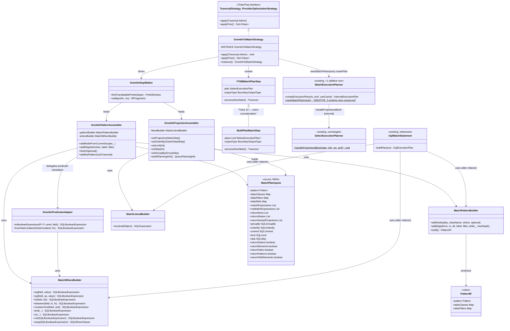

# Gremlin-to-MATCH Translator — Design

## Overview

The translator turns the pattern-matching subset of a TinkerPop traversal
into the same in-memory IR that the YouTrackDB SQL parser produces for `MATCH`
statements (`Pattern` + `aliasClasses` + `aliasFilters` + projection
metadata, packaged into a new `MatchPlanInputs` record) and feeds it
directly to the existing `MatchExecutionPlanner` via a new **additive**
constructor `MatchExecutionPlanner(MatchPlanInputs)`. No SQL text is
generated, and the planner's existing `createExecutionPlan` pipeline runs
unmodified — it internally appends the projection / order / limit chain via
`SelectExecutionPlanner.handleProjectionsBlock`. The translator is wired in
as a TinkerPop `ProviderOptimizationStrategy` that detects the longest
contiguous prefix of recognized steps in a traversal, replaces that prefix
with a single boundary step (`YTDBMatchPlanStep`), and lets any unrecognized
suffix run as native TinkerPop steps over the boundary's emitted traversers.

The IR construction is factored into a new shared package
(`internal/core/sql/executor/match/builder/`) consumed by both the new translator and
the existing GQL front-end. GQL is migrated onto the shared builders in the
same Phase 1; its observable behavior is unchanged.

The design has four moving parts:

1. **Strategy** — the entry point. Idempotent, ordered after
   `YTDBGraphCountStrategy` and before `YTDBGraphMatchStepStrategy`. Walks
   the step list, identifies the prefix, invokes the translator, swaps the
   prefix for `YTDBMatchPlanStep`.
2. **Translator** — four collaborators (`GremlinStepWalker`,
   `GremlinPredicateAdapter`, `GremlinPatternAssembler`,
   `GremlinProjectionAssembler`) that read TinkerPop steps and emit MATCH IR
   via the shared builders.
3. **Shared MATCH IR builders** — `MatchPatternBuilder`, `MatchWhereBuilder`,
   `MatchLiteralBuilder`. Pure helpers around the existing IR classes.
   Replace inline IR construction in `GqlMatchStatement.buildPlan`,
   `GqlMatchStatement.buildWhereClause` (the static helper called by
   `GqlMatchVisitor`), and `GqlMatchStatement.toLiteral`.
4. **Boundary step** — `YTDBMatchPlanStep`, plus the `MultiPlanMatchStep`
   subclass for `union(...)` concatenation (Track 10). Each holds one or
   N `SelectExecutionPlan`s and a configured output type. Emits TinkerPop
   `Traverser`s by iterating the plan(s) `ExecutionStream` (via
   `hasNext(ctx)` / `next(ctx)`) and projecting each `Result` into the
   configured payload type.

## Class Design



The diagram shows three layers:

- **Strategy + translator** (`GremlinToMatchStrategy` and the four
  `GremlinXxxAssembler/Walker/Adapter` classes) — TinkerPop side, owns the
  step iteration and decision-making.
- **Shared MATCH IR builders** (`MatchPatternBuilder`, `MatchWhereBuilder`,
  `MatchLiteralBuilder`) — language-agnostic IR construction. Both the new
  translator and the refactored `GqlMatchStatement` consume them.
- **Existing engine** (`MatchExecutionPlanner`, `SelectExecutionPlanner`,
  the IR classes themselves) — preserved. The only modification is
  **one** new public constructor `MatchExecutionPlanner(MatchPlanInputs)`
  (additive — does not alter the two existing constructors). The
  `handleProjectionsBlock` static helper is invoked by the planner
  internally; the translator does not call it directly.

`PatternIR` is a small value class returned by `MatchPatternBuilder.build()`
encapsulating the three IR pieces the planner expects, so callers don't have
to assemble them from separate getters.

`YTDBMatchPlanStep` is the boundary that bridges the YTDB execution stream
back to TinkerPop's traverser-driven model. It carries the configured
output type because the prefix terminator dictates what TinkerPop expects
the next step to consume.

## Workflow

```mermaid
sequenceDiagram
    participant Client
    participant TP as TinkerPop traversal
    participant Strat as GremlinToMatchStrategy
    participant Walker as GremlinStepWalker
    participant Asm as Pattern/ProjectionAssembler
    participant Build as Shared builders
    participant MEP as MatchExecutionPlanner
    participant SEP as SelectExecutionPlanner
    participant Step as YTDBMatchPlanStep
    participant Stream as ExecutionStream

    Client->>TP: g.V().has(..).out(..).toList()
    TP->>Strat: applyStrategies()
    Strat->>Strat: idempotency check (find YTDBMatchPlanStep)
    alt fresh traversal
        Strat->>Walker: findTranslatablePrefix(steps)
        Walker-->>Strat: PrefixWindow{first, last, terminator}
        opt prefix non-trivial
            Strat->>Walker: walk(prefix)
            Walker->>Asm: feed step-by-step
            Asm->>Build: addNode/addEdge/where
            Build-->>Asm: SQLMatch* / SQLWhereClause
            Asm-->>Walker: assembled IR + projection metadata
            Walker-->>Strat: MatchPlanInputs (Pattern + alias maps + return/order/limit)
            Strat->>MEP: new(MatchPlanInputs)
            Strat->>MEP: createExecutionPlan(ctx, prof, useCache=false)
            Note over MEP,SEP: planner internally calls<br/>SEP.handleProjectionsBlock<br/>with populated info
            MEP->>SEP: handleProjectionsBlock(plan, info, ctx, prof)
            SEP-->>MEP: plan with projection / order / limit / etc.
            MEP-->>Strat: SelectExecutionPlan
            Strat->>TP: removeSteps(prefix); addStep(0, YTDBMatchPlanStep(plan, outputType))
        end
    else already translated
        Note over Strat: no-op
    end
    TP-->>Client: traversal ready

    Client->>TP: iterator.next()
    TP->>Step: processNextStart()
    Step->>Stream: hasNext(ctx)
    Stream-->>Step: true
    Step->>Stream: next(ctx)
    Stream-->>Step: Result row
    Step->>Step: project(row, outputType)
    Step-->>TP: Traverser(payload)
    TP-->>Client: result
```

The `applyStrategies` phase happens once per traversal lifecycle (defensive
re-entry handled via idempotency). Translation is a pure function from a
TinkerPop step list to a `MatchPlanInputs` record, which feeds the new
additive `MatchExecutionPlanner(MatchPlanInputs)` constructor (D2). The
planner's existing `createExecutionPlan` then runs unchanged — it
internally invokes `SelectExecutionPlanner.handleProjectionsBlock` (the
`MatchExecutionPlanner.java:624` call site) with the fully populated info,
producing the projection / order / limit / skip / group-by / distinct
chain. The strategy does **not** call `handleProjectionsBlock` separately;
doing so would double-append projection steps (the consistency review
caught this). After translation, the traversal looks like
`[YTDBMatchPlanStep, ...native suffix steps...]` instead of the original
step list.

The execution phase is straightforward: TinkerPop iterates as usual; the
boundary step pulls one row at a time from `ExecutionStream`, projects
into the configured TinkerPop payload type (Vertex, Edge, Map, value, scalar),
and emits a `Traverser`. Native suffix steps consume the traversers exactly
as they would consume the same shape from a fully-native pipeline.

## Hybrid boundary mechanics

The boundary is the single point where YTDB execution semantics meet TinkerPop
execution semantics. Two design pressures shape it.

**Output type negotiation.** TinkerPop is statically-shaped at each step — a
`HasStep` consumes vertices and emits vertices; a `SelectStep` consumes
elements and emits maps. When we translate a prefix, the natural emit type
of the prefix's last step dictates what the next native step expects. The
translator records this via a `BoundaryOutputType` enum (`ELEMENT`,
`SINGLE_VALUE`, `MAP`, `SCALAR`) and chooses the appropriate projection
inside `YTDBMatchPlanStep.processNextStart`. The mapping is deterministic
and recorded in the implementation plan (Track 11).

**Path label propagation.** TinkerPop's `as("a")` step labels are visible
to any downstream step via `select("a")`, `path()`, and `where("a", ...)`.
Inside the prefix, our IR captures `as` labels as `SQLMatchFilter.alias` —
visible during the MATCH execution. But once the prefix terminator emits a
plain element (e.g. the prefix ends with `.out("knows")` and emits a
`Vertex`), those labels are no longer reachable by a downstream
`select("a")` — the bound result row is gone.

The translator handles this in two passes. The first pass translates the
prefix as if no cross-boundary references exist, producing the natural
output type. The second pass scans steps **after** the prefix for label
references that point into the prefix. When found, the boundary's output
type is widened to `MAP` (a `LinkedHashMap` keyed by all referenced labels),
the IR's projection is widened to project all referenced labels, and the
downstream `select("a")` step naturally finds its key.

**`path()` decline.** TinkerPop's `path()` step requires the per-step
history of bindings — every traverser carries a `Path` accumulating bindings
at each step it visited. MATCH does not produce path histories; it produces
final result rows. If `path()` follows the prefix, the natural mapping is
to expand the projection to all path-element labels and reconstruct a
`Path` in the boundary step — but this materializes records the user did
not ask for. Phase 1 default: when a `path()` step is found among the
downstream steps **and** it references prefix-internal step labels, the
prefix is shortened so that the `path()` step's required scope stays in
the native pipeline. This is a clean, conservative choice; precise
translation of `path()` is Phase 2 territory.

## Predicate translation

`GremlinPredicateAdapter` is the chokepoint between TinkerPop's predicate
algebra and `SQLBooleanExpression`. The mapping is mostly mechanical, but
several edge cases require care.

**Compare predicates** (`Compare.eq/neq/gt/gte/lt/lte`) map 1:1 to YTDB
operators:

| TinkerPop | YTDB |
|---|---|
| `Compare.eq` | `SQLEqualsOperator` |
| `Compare.neq` | `SQLNeOperator` |
| `Compare.gt` | `SQLGtOperator` |
| `Compare.gte` | `SQLGeOperator` |
| `Compare.lt` | `SQLLtOperator` |
| `Compare.lte` | `SQLLeOperator` |

**Contains predicates**: `Contains.within` → `SQLInCondition` with the
`SQLCollection` populated from the predicate's value (which is always a
`Collection`); `Contains.without` → `SQLNotInCondition`.

**Composite `P` instances** (`P.and(p1, p2)`, `P.or(p1, p2)`, `P.not(p)`)
recurse: each child predicate is translated independently, then composed
via `MatchWhereBuilder.and/or/not`. This makes `P.between`, `P.inside`,
`P.outside` straightforward — they're typically implemented as `P.and(gte, lt)`
or `P.or(lt, gt)` in TinkerPop, and recursion handles them. We override the
common cases for cleaner output (`between` becomes a single
`SQLBetweenCondition` if YTDB has one, else the AND form).

**Text predicates** (`Text.containing`, `Text.startingWith`, `Text.endingWith`,
`Text.notContaining`, etc.) map to `SQLContainsTextCondition` for the
positive forms and a NOT-wrapped variant for the negatives. YTDB's
`SQLContainsTextCondition` is a String-only operator; if the predicate is
applied to a non-String field we decline (causing the prefix to cut before
this step).

**Custom user predicates** — TinkerPop allows users to extend `P<T>` with
their own `BiPredicate`. We cannot translate arbitrary code. Detection: if
`P.getBiPredicate()` is not an instance of `Compare`, `Contains`, `Text`, or
a recognized YTDB-side predicate, decline.

**`hasNot(key)`**: maps to `key IS NULL` semantically. YTDB's WHERE supports
`field is null` via `SQLBaseExpression` plus an equality / null-check; we
build it via `MatchWhereBuilder.not(...)` over a "field exists" check.
Equivalently the `SQLBinaryCondition` can compare against a null literal —
which one to use is settled in Track 4.

## Optional and union semantics divergence

These two Gremlin steps share a structural risk: their TinkerPop semantics
do not exactly match the closest MATCH construct. We translate the
well-formed common shape and decline (native fallback) the rest.

**`optional(traversal)`.** TinkerPop semantics: for each input traverser,
run the sub-traversal; if it produces ≥1 output, emit those outputs;
otherwise emit the original input. MATCH semantics for `{optional:true}`
on a node: if no neighbor matches, the alias is null in the result row, but
other aliases are still bound. These coincide only for the shape

```
g.V().as("a").optional(__.out("knows").as("b")).select("a","b")
```

— the optional is terminal, the input is preserved on null match, and the
absence is null in `select`. They diverge for nested optionals
(`optional(optional(...))`), optionals in mid-chain
(`optional(out("knows")).has("city","NY")`), and optionals whose sub-traversal
contains side effects.

We detect "well-formed terminal optional" structurally: the optional step
is followed only by projection/limit/order/dedup steps; the sub-traversal
is a pure pattern (one or more edges with optional filters). When this
shape holds, the translator emits MATCH `{optional:true}` on the terminal
node. When it doesn't, the prefix cuts before the optional step and the
optional stays native.

**`union(traversals…)`.** TinkerPop semantics: for each input traverser,
concatenate the outputs of all child traversals. MATCH `splitDisjointPatterns`
joins disconnected patterns via **cartesian product** — not the same.
We translate union by treating each child as a standalone translation
target: build an independent `SelectExecutionPlan` per child, place all
plans into a `MultiPlanMatchStep` (a variant of `YTDBMatchPlanStep` that
holds N plans and iterates them in order), and emit the concatenation. All
children must agree on output type; if any child fails to translate or
disagrees on type, the entire union step stays native.

The decision to keep union as concatenation rather than cartesian is
strict: violating it would silently change result semantics, and that
violates the "Cucumber suite stays green" invariant.

## Strategy idempotency

A traversal's strategy chain may be applied more than once during a session:
TinkerPop clones traversals for sub-traversal reuse, test harnesses
sometimes re-apply strategies for verification, and certain traversal
sources lazily apply on first iteration.

If `GremlinToMatchStrategy` re-translates a traversal that already contains
`YTDBMatchPlanStep`, two things go wrong: the existing plan is discarded
and a new one is built (wasted work), or the strategy fails to recognize
the boundary step as a "translatable start" and produces incorrect output.

The defense is a single early check at the top of `apply`: scan the step
list once for any `YTDBMatchPlanStep` instance. If found, return
immediately. The scan is O(N) where N is the step count — typically
single digits. The cost is negligible, the safety is absolute.

The check must scan the **entire** list, not just the start step, because
a wrapping traversal source or test harness could place additional
ordinary steps in front of a previously-translated traversal.

## Schema polymorphism

YTDB's `polymorphicQuery` flag (`OptionsStrategy` config) controls whether
class-based scans see subclasses. When `polymorphic=true`, `g.V().hasLabel("Person")`
returns instances of `Person` and all subclasses. When `polymorphic=false`,
only direct `Person` instances.

MATCH is polymorphic by default — `MATCH {class: Person, as: p}` matches
all instances of `Person` and subclasses. To express non-polymorphic, the
filter must add a `class IN [Person, ...not subclasses]` predicate, OR the
underlying engine must respect a non-polymorphic flag.

The translator reads the flag via `YTDBStrategyUtil.isPolymorphic(traversal)`
once per `apply()` call. For `polymorphic=true` (default), the translator
sets `aliasClasses[alias] = "Person"` and is done. For `polymorphic=false`,
the translator augments the alias's `where` with a `@class IN [...]`
predicate enumerating the schema-resolved exact-match classes — this is the
same pattern `YTDBGraphStep` uses today for non-polymorphic root scans.

If schema enumeration is unavailable (no schema, or the class doesn't
exist), the translator declines and the prefix cuts. The graph step
strategy still handles the root scan natively in that case.

## GQL refactor and shared builders evolution

The shared MATCH IR builder package
(`internal/core/sql/executor/match/builder/`) is consumed by two front-ends from
day 1: the new Gremlin translator and `GqlMatchStatement`. The refactor of
`GqlMatchStatement` happens in Track 1 and is strictly behavior-preserving.

Today `GqlMatchStatement.buildPlan` does three things:

1. For each `SQLMatchFilter`, creates a `PatternNode`, sets its alias,
   adds it to `Pattern.aliasToNode`, populates `aliasClasses`,
   conditionally populates `aliasFilters` from the filter's inline `where`.
2. Helper `buildWhereClause(Map<String,Object>)` builds an AND-block of
   equality conditions for inline property filters.
3. Helper `toLiteral(Object)` converts Java values to `SQLExpression`.

After refactor:

1. The `for` loop calls `MatchPatternBuilder.addNode(alias, className, where, false)`.
   Edge construction (zero today in GQL, but inevitable later) is a
   one-line `addEdge(...)` per hop.
2. `buildWhereClause` is replaced by a chain of
   `MatchWhereBuilder.eq(field, MatchLiteralBuilder.toLiteral(value))`
   followed by `whereBuilder.and(...).wrap()`.
3. `toLiteral` becomes a one-line delegate: `return MatchLiteralBuilder.toLiteral(value);`.

Functional changes: zero. `GqlMatchStatement`'s public API is unchanged.
Its tests must pass with the same assertions.

The shared builders are designed for both today's GQL needs (single-node
patterns, equality-only filters) and the translator's full needs (chains,
edges, full predicate algebra, optional, NOT). The API contracts are
captured in the builder Javadoc; implementations are pure functions over
the IR classes; new operations can be added without breaking existing
callers.

When GQL eventually adds edges, predicates, or projections, the shared
builders will already support them — no further refactor of the shared
layer needed.

## Aggregation barrier semantics

TinkerPop aggregates (`count`, `sum`, `min`, `max`, `mean`, `group`,
`groupCount`) are **barrier steps**: they consume the entire upstream
traverser stream and emit one (or in `group`, one keyed) result. MATCH
aggregates over a `SQLProjection` with `SQLGroupBy` in the
`QueryPlanningInfo`. The shapes differ in two ways.

**Single aggregate (`count`, `sum`, etc.) without group.** TinkerPop emits
exactly one traverser carrying the aggregate value. We translate to
`info.projection = SQLProjection([count(*) | sum(field) | …])`,
`info.groupBy = null`, and the boundary output type is `SCALAR`. The
boundary step pulls exactly one `Result` from the plan and emits one
`Traverser` carrying its scalar value.

**Empty input.** TinkerPop's `count` of an empty stream emits `0L` (a
single traverser); `sum`/`min`/`max`/`mean` of an empty stream emit
nothing in modern TinkerPop. MATCH's behavior is the same for `count`
(returns one row with `0`) and `null` for the others. We verify in tests
that empty-input behavior matches per-aggregate.

**Group with `by(key)`.** TinkerPop emits one map keyed by group keys.
We translate to `info.groupBy = SQLGroupBy(currentAlias.key)`,
`info.projection = SQLProjection([currentAlias.key, list(currentAlias) |
count(*) | …])`. The boundary output type is `MAP`. The boundary step
pulls all `Result` rows, accumulates them into one `LinkedHashMap`, and
emits one `Traverser`.

**Aggregates referring to property-extraction steps**
(`g.V().values("age").mean()` style): the prior `values("age")` step
must be visible to the aggregator. We resolve this during walker
post-processing: when the walker sees an aggregate step, it checks
whether the immediately preceding step was a `PropertiesStep` and
re-points the aggregate at the property's IR field-access expression
rather than the bare current alias. If the preceding step is anything
else, the aggregate works on the full element identity (TinkerPop
default behavior — typically only meaningful for `count` and `group`).
