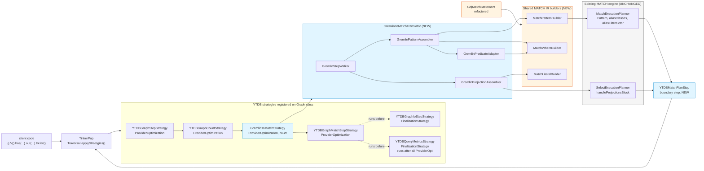

# Gremlin-to-MATCH Translator

## Design Document
[design.md](design.md)

## High-level plan

### Goals

Translate the pattern-matching subset of Gremlin traversals (`g.V()…`) into
YouTrackDB's existing MATCH IR (`Pattern` + alias maps + projection/order/limit
metadata) and feed that IR directly to `MatchExecutionPlanner`. Produce no
intermediate text; reuse the optimizer (cost estimation, prefetch, topological
scheduling, hash anti-joins) already built for SQL `MATCH`.

The translator is wired in as a TinkerPop `ProviderOptimizationStrategy`. When
applied to a traversal, it walks the **entire** step list. If every step is in
the recognized set, the translator converts the whole traversal into MATCH IR
via shared builders, runs `MatchExecutionPlanner` to obtain a
`SelectExecutionPlan`, and replaces the traversal with a single
`YTDBMatchPlanStep` that terminates the chain — emitting TinkerPop traversers of
the negotiated output type. If **any** step is unrecognized (`repeat`, lambdas,
`simplePath`, `choose`, `sack`, custom DSL, …), the strategy declines the
traversal and leaves it on the native TinkerPop pipeline unmodified
(all-or-nothing — see D3).

A second goal is to introduce a **shared MATCH IR builder package**
(`internal/core/sql/executor/match/builder/`) that both the new Gremlin translator and
the existing GQL front-end (`GqlMatchStatement`) consume. The builders own the
mechanical IR construction (Pattern/PatternNode/PatternEdge assembly, AND/OR/NOT
composition, Java-value → `SQLExpression` conversion). GQL is refactored onto
this shared layer in the same Phase 1 with no behavior change.

### Constraints

- **Full TinkerPop Cucumber suite (~1900 scenarios) must remain green** with
  the strategy enabled. Any traversal that contains at least one unrecognized
  step is declined whole and runs natively unmodified; the translator never
  causes a regression on a previously-passing scenario.
- **`MatchExecutionPlanner` is not modified.** Its public surface — including
  the `(Pattern, aliasClasses, aliasFilters)` constructor introduced for non-SQL
  front-ends — is consumed as-is. Any planner change found necessary must
  escalate (track-level discussion).
- **GQL refactor is behavior-preserving.** All existing GQL tests must pass
  unchanged after `GqlMatchStatement` is migrated onto the shared builders.
- **`polymorphicQuery` config is honored.** Translator reads
  `YTDBStrategyUtil.isPolymorphic(traversal)` and conveys polymorphism into
  the IR via class-IN constructs when necessary. Default = polymorphic.
- **No plan caching in Phase 1.** The boundary step requests
  `MatchExecutionPlanner.createExecutionPlan(ctx, profiling, /*useCache=*/false)`.
  This is consistent with the spec's Phase 2 caching deferral. Phase 1 includes
  a perf-baseline measurement track to quantify the cost of "no cache" against
  the current native pipeline and guide Phase 2 cache implementation.
- **Gremlin steps marked out-of-scope in the spec stay native** (`repeat`,
  `until`, `times`, `sack`, `store`, `aggregate`, lambdas, `subgraph`,
  `simplePath`, `cyclicPath`, advanced `path()`, `choose`, `option`,
  `executeInTx`, `computeInTx`).
- **JDK 21+, build via `./mvnw`.** Existing project-wide formatting
  (Spotless / Eclipse formatter) and the 2-space indent / 100-col width style
  apply. Runs under the existing `core` module test JVM args.
- **Strategy must be idempotent.** Re-applying it to a traversal that already
  contains the boundary step is a no-op — TinkerPop applies the strategy chain
  on every `applyStrategies()` call.

### Architecture Notes

#### Component Map



What changes:

- **`GremlinToMatchStrategy` (new, `internal/core/gremlin/translator/strategy/`)** —
  a `ProviderOptimizationStrategy` registered alongside the three existing
  `ProviderOptimizationStrategy` instances on `YTDBGraphImplAbstract`
  (`YTDBGraphStepStrategy`, `YTDBGraphCountStrategy`,
  `YTDBGraphMatchStepStrategy`). Two further strategies registered on the
  same Graph class, `YTDBGraphIoStepStrategy` and `YTDBQueryMetricsStrategy`,
  are `FinalizationStrategy` instances and run after all `ProviderOpt`
  strategies — unaffected by our ordering. Walks the entire step list; if
  every step is in the recognized set, invokes the translator and replaces
  the whole step list with a single terminating `YTDBMatchPlanStep`.
  Otherwise declines the traversal whole (D3 all-or-nothing).
- **`GremlinToMatchTranslator` package
  (`internal/core/gremlin/translator/`)** — orchestrates the translation. Has
  four collaborators:
  - `GremlinStepWalker` — iterates `Traversal.getSteps()`, keeps a current
    "node-under-construction" context, decides where each step belongs.
  - `GremlinPredicateAdapter` — translates TinkerPop `P<T>` (predicate algebra)
    and `HasContainer` instances into `SQLBinaryCondition`/`SQLInCondition`/
    `SQLContainsTextCondition`.
  - `GremlinPatternAssembler` — drives `MatchPatternBuilder` to construct
    `Pattern` + alias maps; handles `as()`, `optional()`, edge methods, NOT
    expressions.
  - `GremlinProjectionAssembler` — drives `MatchLiteralBuilder` and direct
    construction of `SQLProjection`/`SQLOrderBy`/`SQLLimit`/`SQLSkip`/
    `SQLGroupBy` to populate a `QueryPlanningInfo` for
    `handleProjectionsBlock`.
- **Shared MATCH IR builder package
  (`internal/core/sql/executor/match/builder/`, new)** — three classes:
  - `MatchPatternBuilder` — `addNode(alias, className, where, optional)`,
    `addEdge(fromAlias, toAlias, direction, edgeLabel, edgeFilter,
    whileCondition, maxDepth)`, `build()` returning `(Pattern, aliasClasses,
    aliasFilters)`.
  - `MatchWhereBuilder` — `eq`, `op`, `in`, `notIn`, `between`, `containsText`,
    `startsWith`, `endsWith`, `and`, `or`, `not` returning
    `SQLBooleanExpression`; `wrap()` to a `SQLWhereClause`.
  - `MatchLiteralBuilder` — `toLiteral(Object) → SQLExpression`, extracted
    verbatim from `GqlMatchStatement.toLiteral`.
- **`YTDBMatchPlanStep` (new,
  `internal/core/gremlin/translator/step/`)** — TinkerPop `AbstractStep` that
  wraps a `SelectExecutionPlan`. On `processNextStart()` it pulls one row from
  the plan's stream, projects the configured boundary output type
  (Vertex/Edge/Map/property-value/scalar), and emits a `Traverser`.
- **`GqlMatchStatement` (refactored)** — its inline IR construction is replaced
  by calls into the shared builders. Public API unchanged. Tests must pass.
- **`YTDBGraphImplAbstract.registerOptimizationStrategies` (1-line change)** —
  `GremlinToMatchStrategy.instance()` added to the strategy list. Position
  in the addition order is informational; actual strategy execution order
  is enforced by `applyPrior()` + `applyPost()` declarations on the new
  strategy class itself (see D4 — Ordering mechanism).

#### D1: Integration via `ProviderOptimizationStrategy`

- **Alternatives considered**: (a) Explicit entry point on
  `YTDBGraphTraversalSourceDSL` (e.g. `g.matchPattern(…)`); (b) Modify
  `YTDBGraphTraversalDSL` to route certain shapes through translator at DSL
  build time; (c) Strategy.
- **Rationale**: Strategy is the canonical TinkerPop extension point for
  vendor-specific traversal optimization. The four existing
  `ProviderOptimizationStrategy` instances on `YTDBGraphImplAbstract` use
  the same mechanism, and the Cucumber suite exercises traversals built
  through the standard `g.V()…` API — only a strategy reaches them.
  Explicit entry point would not capture pre-existing client code and
  would force a user-visible API addition.
- **Risks/Caveats**: Strategy must be idempotent (TinkerPop may invoke
  `applyStrategies()` more than once during a session); handled by detecting
  an already-installed `YTDBMatchPlanStep` and short-circuiting. Strategy
  ordering vs the four existing strategies is significant — see D4.
- **Implemented in**: Track 2.

#### D2: Planner entry via new **additive** `(MatchPlanInputs)` ctor; planner handles projection block internally

- **Alternatives considered**: (a) Existing minimal
  `(Pattern, aliasClasses, aliasFilters)` ctor + external
  `SelectExecutionPlanner.handleProjectionsBlock` — rejected: planner
  already calls `handleProjectionsBlock` internally
  (`MatchExecutionPlanner.java:624`) so a second external call would
  double-append projection / order / limit steps. (b) Existing
  `(SQLMatchStatement)` ctor — semantic mismatch (not parsing SQL) and
  the AST class is JJTree-generated, awkward to construct manually.
  (c) Public setters mutating planner state between construction and
  `createExecutionPlan` — opaque API.
- **Rationale**: Add one new additive constructor
  `MatchExecutionPlanner(MatchPlanInputs)` where `MatchPlanInputs` is a
  record holding all post-parse fields (full field list: design.md
  `MatchPlanInputs` class entry). The translator builds the record;
  `createExecutionPlan` runs unchanged and its internal
  `handleProjectionsBlock` sees populated info. **No external
  `handleProjectionsBlock` call.** The three existing constructors stay
  unchanged — new ctor is purely additive.
- **Risks/Caveats**: The new ctor is the **only** modification to
  `MatchExecutionPlanner` in Phase 1. Implementation = public record +
  delegating ctor body that defensive-copies fields, mirroring the
  existing `(SQLMatchStatement)` ctor's pattern. Resolves CR1
  (`notMatchExpressions`) and Track 4's `aliasRids` gap together.
- **Implemented in**: Track 2 (record + ctor + minimal-V wiring); Tracks
  4 / 5 / 7–9 / 11 (consumers).

#### D3: All-or-nothing translation, no hybrid prefix (revised after Track 2)

- **Original decision** (Phase 1 plan): translate the longest contiguous
  prefix of recognized steps; replace that prefix with one
  `YTDBMatchPlanStep` boundary; let the suffix steps continue as native
  TinkerPop steps consuming the boundary's output (hybrid prefix).
- **What changed**: Phase 1 minimal scope is `g.V()` / `g.V(ids)` only;
  the hybrid mechanism only pays off if the recognized set is large enough
  that mid-traversal cuts produce useful plans. Phase 2 will introduce
  the full caching and recognized-set expansion — there is no value in
  growing the hybrid mechanism in Phase 1 only to retire or rework it
  later. The Track 2 implementation already de-facto enforces
  all-or-nothing via the `traversal.getSteps().size() > 1` decline gate;
  this revision aligns the documented architecture with what the code
  actually does.
- **Revised decision**: walk the entire traversal. If every step is in
  the recognized set, translate the whole traversal and replace it with
  one `YTDBMatchPlanStep` that **terminates** the chain — emitting
  TinkerPop traversers of the negotiated output type for downstream
  consumption (`.toList()`, `.iterate()`, etc.). If any step is
  unrecognized, decline the whole traversal and leave the native step
  list unmodified.
- **Alternatives considered**: (a) hybrid prefix (original); (b) hybrid
  subgraph (translate any contiguous segment); (c) all-or-nothing
  (chosen); (d) hybrid prefix kept but gated to a large recognized set
  via a config knob.
- **Rationale**: simpler walker (one yes/no decision, no prefix-cut
  bookkeeping), fewer edge cases (no output-type negotiation across
  a mid-traversal boundary, no label propagation, no `path()`-interaction
  subtleties), and the Phase 2 cache work is unaffected — the cache key
  shape is the same. Native fallback is preserved at traversal granularity
  rather than step granularity, which matches how operators reason about
  "this query did or did not benefit from MATCH".
- **Risks/Caveats**: the recognized step set grows track by track; until
  it covers the LDBC-relevant shapes, most production traversals will
  decline. Track 12's perf baseline must measure against the recognized
  set as it stands at end of Phase 1, not against the full LDBC suite.
- **Implemented in**: Track 2 (size-1 gate already present; description
  rewritten to remove "prefix" language), Tracks 3-10 (extend the
  recognized set; their wording changes from "translate prefix" to
  "extend recognized step set"), Track 11 retired as `[~]` (boundary
  refinement subsumed: output-type negotiation merges into Tracks 7/8/9
  where the relevant terminal steps are introduced; cross-boundary
  label propagation and `path()` interaction are no-ops under
  all-or-nothing).

#### D4: Strategy ordering — after `YTDBGraphStepStrategy` and `YTDBGraphCountStrategy`, before `YTDBGraphMatchStepStrategy`

- **Alternatives considered**: (a) Run before `YTDBGraphStepStrategy` — but
  then we don't see `YTDBGraphStep` with absorbed has-containers and the
  step walker misses already-folded label predicates; (b) Run after
  `YTDBGraphMatchStepStrategy` — but its label-folding is now
  superseded by the translator's full `g.V().match()` handling, and the
  ordering would never let the translator reach `match()`-bearing
  traversals; (c) Replace `YTDBGraphMatchStepStrategy` entirely.
- **Rationale**: After the graph-step strategy: we receive `YTDBGraphStep`
  with `hasContainers` already attached, which the translator reads as the
  "root selectivity" of the pattern. After count strategy: avoids touching
  `g.V().count()` traversals already optimized to class-count. Before the
  match-step label folder: when our translator handles `g.V().match(...)`
  end-to-end, the label folder becomes a no-op for that traversal — but if
  the translator declines, the label folder still applies as fallback.
  `YTDBGraphIoStepStrategy` and `YTDBQueryMetricsStrategy` are
  `FinalizationStrategy` instances and run after all `ProviderOpt`s —
  irrelevant to this ordering.
- **Ordering mechanism**: TinkerPop's strategy resolver uses both
  `applyPrior()` (predecessors) and `applyPost()` (successors) to build a
  total order. Reading the existing code, `YTDBGraphMatchStepStrategy.applyPrior()`
  returns `singleton(YTDBGraphStepStrategy.class)` — it does not constrain
  the new strategy's position relative to itself. Therefore the new strategy
  must declare both `applyPrior() = {YTDBGraphStepStrategy.class,
  YTDBGraphCountStrategy.class}` AND `applyPost() = {YTDBGraphMatchStepStrategy.class}`
  to enforce the desired position. No edit to existing strategies is
  required when we use this two-sided declaration.
- **Risks/Caveats**: Cucumber test runs that exercised the old label folder
  must still pass. Translator must be ready to decline gracefully when it
  cannot make a complete IR. The ordering is verified by a unit test that
  builds a `TraversalStrategies` set and asserts iteration order rather
  than relying on `applyPrior`/`applyPost` declarations alone.
- **Implemented in**: Track 2.

#### D5: No plan cache in Phase 1; perf baseline measured

- **Alternatives considered**: (a) Phase 1 with no cache (per spec); (b)
  Reuse `YqlExecutionPlanCache` with a synthetic
  `"GREMLIN_BC:" + normalized-bytecode` key in Phase 1; (c) Build a
  separate `GremlinPlanCache` modeled on `GqlExecutionPlanCache` in Phase 1.
- **Rationale**: The spec explicitly defers "Cross-query caching: Cache
  translated plans keyed by traversal bytecode fingerprint" to Phase 2.
  Adding cache in Phase 1 expands scope (bytecode normalizer, parameter
  extraction, cache invalidation discipline) without a measured perf
  signal. We measure first, then implement targeted caching in Phase 2.
- **Risks/Caveats**: Per-call planning cost (`estimateRootEntries`,
  topological sort, cost model) is paid every time. For LDBC-style
  workloads (same-shape query in a loop) this can produce a measurable
  per-query regression vs the current native pipeline (which has zero
  planning overhead and instead pays in JVM materialization). The Phase 1
  perf-baseline track quantifies this so Phase 2 has a target. If the
  baseline shows unacceptable regression, Phase 2 cache moves into
  Phase 1 with an ESCALATE.
- **Implemented in**: Track 12 (perf baseline).

#### D6: Shared MATCH IR builder package; GQL refactor in Phase 1

- **Alternatives considered**: (a) Translator owns its private builders,
  shared layer extracted post-Phase-1; (b) Builders shared from day 1,
  GQL adopts in same Phase 1; (c) No extraction, translator copies what
  it needs from `GqlMatchStatement`.
- **Rationale**: The shareable parts (Pattern construction primitives,
  AND/OR/NOT composition, `toLiteral`) are thin wrappers over already-stable
  IR classes — not speculative abstractions. Extracting them now means
  one consistent IR construction surface from day 1; future GQL extensions
  (edges, predicates, projections) reuse the same plumbing. The cost is
  a small GQL refactor (~30 LOC diff in `GqlMatchStatement`) that is
  behavior-preserving and validated by GQL tests.
- **Risks/Caveats**: GQL test suite must remain green after refactor — a
  blocker if not. The shared API must accommodate both today's GQL needs
  (single-node patterns) and the translator's full needs (chains, edges,
  optional, NOT) without baking in either's specifics.
- **Implemented in**: Track 1.

#### D7: Strategy idempotency

- **Alternatives considered**: (a) Always re-translate — costly and
  potentially incorrect if `YTDBMatchPlanStep` is in the chain; (b)
  Detect `YTDBMatchPlanStep` and short-circuit; (c) Rely on TinkerPop
  to apply strategies once per traversal — fragile assumption.
- **Rationale**: TinkerPop's `Traversal.applyStrategies()` is invoked at
  least once but may be invoked more than once in cloned traversals, in
  remote execution prep, in test harnesses, etc. An idempotent strategy
  is robust regardless of caller. Detection is cheap — first step
  inspection.
- **Risks/Caveats**: If `YTDBMatchPlanStep` is somewhere other than
  position 0 (because user wrapped it), naïve detection fails. Detector
  must scan the entire step list, not just the start step.
- **Implemented in**: Track 2.

#### D8: Optional and union — well-formed shapes only join the recognized set (revised after Track 2)

- **Original decision**: translate the well-formed `optional` / `union`
  shapes inline; decline shapes that don't cleanly map by cutting the
  prefix at that step and letting the native pipeline handle the rest.
- **What changed**: D3 is now all-or-nothing — there is no "decline
  mid-chain to a hybrid suffix". Any unrecognized shape causes the entire
  traversal to decline.
- **Revised decision**: `optional` and `union` enter the recognized set
  only for the well-formed shapes named in the original D8 — terminal
  `optional` mapping to MATCH `{optional:true}`, and `union` of
  independent pattern matches each emitting one row per match,
  implemented as a sequence of independent translated plans whose result
  streams are concatenated by the boundary step. Any other shape
  (deeper nested or mid-chain optional, type-divergent union children)
  falls outside the recognized set, so under D3 the entire traversal
  declines.
- **Alternatives considered**: (a) keep the original "decline mid-chain
  to a hybrid suffix" wording — incompatible with revised D3 which
  retired the hybrid mechanism; (b) drop `optional` / `union` from the
  recognized set entirely in Phase 1 — defers a useful capability with
  no offsetting simplification, since the well-formed-shape detector
  is needed in Phase 2 anyway; (c) recognize only the well-formed
  shapes; let the rest decline the whole traversal under D3 (chosen).
- **Rationale**: Gremlin's `optional(traversal)` emits the original
  traverser when the sub-traversal yields nothing; MATCH's
  `{optional:true}` null-fills an alias in the result row. These coincide
  only when the Gremlin shape matches "extend a path with one optional
  terminal hop"; deeper nested or mid-chain optionals diverge. Similarly
  Gremlin's `union(...)` is concatenation of result streams; MATCH
  supports disjoint patterns joined by **cartesian product** via
  `splitDisjointPatterns` / `CartesianProductStep`, which is not the same.
- **Risks/Caveats**: "Well-formed shape detection" is a non-trivial
  predicate; tests must cover both translate-and-correct and
  decline-the-whole-traversal paths to avoid silent semantic drift.
- **Implemented in**: Track 6 (optional well-formed shape recognition),
  Track 10 (union recognition + multi-plan boundary step).

### Invariants

- `MatchExecutionPlanner` existing public method signatures are unchanged
  after Phase 1. Phase 1 adds **one** new public ctor
  `MatchExecutionPlanner(MatchPlanInputs)` (D2) — a purely additive
  change. No existing ctor or method is altered (verified by reading the
  file's public method list before/after).
- `GqlMatchStatement` produces a **structurally equivalent** plan tree
  (same step types in the same order, same alias bindings, equivalent
  `prettyPrint(0,2)` output) before and after the shared-builder migration
  for all existing GQL test inputs. Verified by the existing GQL test
  suite passing 1:1, plus golden-string regression tests over
  `prettyPrint(0,2)` for representative queries (single-node anonymous,
  multi-property AND filter, multi-filter map). "Byte-identical" was
  rejected as too strict — construction-order differences through the
  builder API may produce semantically equivalent but not byte-identical
  field-level state.
- For any traversal whose start step is not a translatable
  `g.V()`/`g.E()`, the strategy is a no-op — the traversal is unmodified.
- For any traversal that contains at least one unrecognized step, the
  strategy declines the whole traversal: no IR is constructed, no
  boundary step is inserted, and the step list is preserved verbatim
  (D3 all-or-nothing).
- Re-applying the strategy to a traversal that already contains
  `YTDBMatchPlanStep` is a no-op (verified by a unit test that calls
  `apply()` twice and asserts step list equality).
- Cucumber suite test count: count after Phase 1 ≥ count before Phase 1.
  The PR title carries `[no-test-number-check]` only if intentional
  test consolidation was done (it is not expected here).

### Integration Points

- **Strategy registration**: `YTDBGraphImplAbstract.registerOptimizationStrategies(Class)`,
  one new line adding `GremlinToMatchStrategy.instance()` between
  `YTDBGraphCountStrategy.instance()` and `YTDBGraphMatchStepStrategy.instance()`.
- **Polymorphism flag**: Translator reads
  `YTDBStrategyUtil.isPolymorphic(traversal)` and conveys polymorphism into
  the IR (e.g. `SQLMatchFilter.className` for the polymorphic case is
  set to the parent class; for non-polymorphic, the filter is augmented
  with a `class IN [...]` constraint or a flag).
- **Boundary step output**: `YTDBMatchPlanStep` extends
  `org.apache.tinkerpop.gremlin.process.traversal.step.map.GraphStep`,
  emits `Traverser`s whose payload types are negotiated by the
  traversal's terminal step (Vertex, Edge, `Map<String,Object>`,
  property value, scalar). Under D3 all-or-nothing the boundary step
  terminates a fully-translated traversal — there is no native suffix
  consuming its output.
- **Shared builder package**: `internal/core/sql/executor/match/builder/` —
  `MatchPatternBuilder`, `MatchWhereBuilder`, `MatchLiteralBuilder`.
  Consumed by both the new translator and refactored
  `GqlMatchStatement`.
- **Cucumber feature suite**: `core` module's `YTDBGraphFeatureTest` and
  `embedded` module's `EmbeddedGraphFeatureTest` exercise the strategy
  end-to-end with no test changes. Strategy is registered through
  `YTDBGraphEmbedded`'s static initializer.

### Non-Goals

- **`repeat().until()/times()`** — variable-depth traversal. Could map to
  MATCH `WHILE`/`maxDepth` but that's its own design effort. Phase 2.
- **`sack()`, `store()`, `aggregate()`** — stateful traverser side-effects
  with no MATCH equivalent. Likely never supported; stay native.
- **Lambda steps** — arbitrary code, untranslatable. Stay native.
- **`subgraph()`** — subgraph extraction, not a pattern match. Out of scope.
- **`simplePath()`, `cyclicPath()`, advanced `path()` manipulation** —
  partial support possible later. Phase 2.
- **`choose().option()`** — imperative branching. Phase 2.
- **`executeInTx()`, `computeInTx()`** — execution model concerns, not
  pattern matching. Stay native.
- **Bytecode-keyed plan caching (`GremlinPlanCache`)** — Phase 2 per spec.
  Phase 1 measures the cost of "no cache" via the perf-baseline track.

## Checklist

- [x] Track 1: Shared MATCH IR builders + GQL adoption
  > Establishes the foundation that the rest of Phase 1 builds on. Creates a
  > new package `internal/core/sql/executor/match/builder/` with three
  > classes — `MatchLiteralBuilder`, `MatchWhereBuilder`, `MatchPatternBuilder` —
  > and refactors `GqlMatchStatement` onto them so GQL today and the upcoming
  > Gremlin translator share one MATCH IR construction surface.
  >
  > **Track episode:**
  > Built three shared builder classes plus a `PatternIR` record returned by
  > `MatchPatternBuilder.build()`. The builder is **one-shot** — `build()`
  > sets a `built` flag and any further `addNode`/`addEdge`/`build` throws
  > `IllegalStateException`, making the planner-takes-ownership invariant
  > explicit. `addNode` documented as merge-not-replace: className/where
  > overwrite-on-non-null, optional monotonic-upgrade. `MatchLiteralBuilder.toLiteral`
  > now uses an explicit `Objects.requireNonNull` for a documented contract
  > NPE rather than an incidental one. `MatchWhereBuilder` uses reflection
  > on `SQLInCondition.operator` because the parser-generated class lives
  > under the off-limits `internal/core/sql/parser/` directory; the
  > Javadoc records the visibility (`protected`) and the parser-generated
  > rationale. `GqlMatchStatement.buildWhereClause` deliberately bypasses
  > `MatchWhereBuilder.and`'s single-operand passthrough, building the
  > `SQLAndBlock` manually so the plan-tree shape stays identical to the
  > pre-refactor output across the 86 existing GQL tests. Cross-track
  > observation for downstream tracks: cartesian-product plan output is
  > non-deterministic in alias scheduling, so multi-pattern golden tests
  > use a tempered-greedy regex (`(?:(?!\+ PREFETCH ).)*?`) to scope
  > alias→filter binding within each PREFETCH block. Track-level review
  > ran 3 iterations; all four dimensions (CQ/BC/TB/TC) PASS. No plan
  > corrections; no impact on Tracks 2–12.
  >
  > **Step file:** `tracks/track-1.md` (4 steps, 0 failed)
  >
  > **Strategy refresh:** CONTINUE — Track 1's builder API matches Track 2's
  > wiring contract; downstream observations (call `addNode` after `addEdge`
  > to register target class/filters; one-shot builder; non-deterministic
  > cartesian-product alias scheduling) are implementation guidance for
  > Tracks 3, 4, 10, 12 already implied by their existing scope, not plan
  > corrections.

- [x] Track 2: Strategy skeleton + boundary step + minimal `g.V()`/`g.V(ids)` translation
  > Wires the new strategy into the optimization chain and establishes the
  > end-to-end pipeline with the simplest possible recognized traversal.
  > Introduces **`MatchPlanInputs`** (record in
  > `internal/core/sql/executor/match/`, new) holding `Pattern`,
  > `aliasClasses`, `aliasFilters`, `aliasRids`, `matchExpressions`,
  > `notMatchExpressions`, `returnItems`, `returnAliases`,
  > `returnNestedProjections`, `groupBy`, `orderBy`, `unwind`, `limit`,
  > `skip`, `returnDistinct`, and the four return-flags
  > (`returnElements`/`returnPaths`/`returnPatterns`/`returnPathElements`).
  > Adds the corresponding additive constructor
  > `MatchExecutionPlanner(MatchPlanInputs)` that field-by-field defensive-
  > copies the inputs (mirroring the existing `(SQLMatchStatement)` ctor's
  > pattern). The three existing constructors stay untouched. This is the
  > **only** modification to `MatchExecutionPlanner` planned for Phase 1
  > (D2).
  >
  > Creates **`GremlinToMatchStrategy`** (`internal/core/gremlin/translator/strategy/`)
  > as a `ProviderOptimizationStrategy` singleton. Its `apply(Traversal.Admin)`
  > method walks the entire step list under D3 (all-or-nothing):
  > 1. Returns immediately if the traversal contains `YTDBMatchPlanStep`
  >    anywhere (idempotency, D7).
  > 2. Returns immediately if the start step is not a `GraphStep`/
  >    `YTDBGraphStep` (D1: only translate traversals starting with `g.V()` /
  >    `g.E()`).
  > 3. Walks every step in the traversal. Phase 1's recognized set is
  >    exactly `{ YTDBGraphStep with optional ID list }` — i.e. the start
  >    step alone. If any step beyond the start is present, it is
  >    unrecognized and the strategy declines the entire traversal.
  > 4. If the whole traversal is recognized, invokes the translator to
  >    construct a `MatchPlanInputs` (Pattern + alias maps +
  >    return/order/limit metadata) via the shared builders and obtains a
  >    `SelectExecutionPlan` from `new MatchExecutionPlanner(inputs)
  >    .createExecutionPlan(ctx, profiling, /*useCache=*/false)`.
  > 5. Replaces the entire step list with one `YTDBMatchPlanStep` that
  >    terminates the traversal — emitting TinkerPop traversers of the
  >    negotiated output type for `.toList()` / `.iterate()` / etc.
  >
  > Creates **`YTDBMatchPlanStep`** (`internal/core/gremlin/translator/step/`),
  > extending `GraphStep<Object, E>`. Holds an `InternalExecutionPlan` and
  > a configured **boundary output type** (initially `Vertex`). On
  > iterator exhaustion, drives the plan's `ExecutionStream`, pulls one
  > `Result` per `next`, projects it to the configured output type, and
  > emits a `Traverser`. Closes the stream and the plan on traversal close.
  >
  > Registers the strategy in `YTDBGraphImplAbstract.registerOptimizationStrategies`
  > between `YTDBGraphCountStrategy.instance()` and
  > `YTDBGraphMatchStepStrategy.instance()` (D4). Configures
  > `applyPrior()` and `applyPost()` to enforce the ordering programmatically.
  >
  > Verifies via integration test that `g.V().toList()` produces the same
  > vertices as the un-translated path (acts as a strategy-engagement
  > smoke test). Verifies `g.V(ids).toList()` returns the same vertices
  > as RID-driven SQL `MATCH`. Cucumber suite must pass — the very
  > minimal recognized set means most scenarios decline the whole traversal
  > and run native unmodified (D3 all-or-nothing), validating that the
  > native-fallback contract preserves all current behavior.
  >
  > Track-internal flow:
  >
  > ```mermaid
  > flowchart LR
  >     T[Traversal] --> S[GremlinToMatchStrategy.apply]
  >     S --> ID[idempotency check]
  >     ID -->|already translated| END1[no-op]
  >     ID -->|fresh| W[walk full step list]
  >     W --> P[entire traversal recognized?]
  >     P -->|no| END2[decline whole traversal — leave native]
  >     P -->|yes| TR[translator → IR]
  >     TR --> MEP[MatchExecutionPlanner]
  >     MEP --> PLAN[SelectExecutionPlan]
  >     PLAN --> RPL[replace whole step list with YTDBMatchPlanStep]
  > ```
  >
  > **Track episode:**
  > Built `MatchPlanInputs` (19-field record) + additive
  > `MatchExecutionPlanner(MatchPlanInputs)` ctor with field-by-field
  > defensive copies of all working maps and the five list fields — the
  > only modification to `MatchExecutionPlanner` in Phase 1, purely
  > additive. `YTDBMatchPlanStep extends GraphStep<S, E>` is single-shot
  > per instance via a `started` flag; `clone()` resets the flag and
  > rebinds the iterator supplier so original and clone each get their
  > own first `plan.start()`. `GremlinToMatchStrategy` declares
  > `applyPrior = {YTDBGraphStepStrategy, YTDBGraphCountStrategy}` and
  > `applyPost = {YTDBGraphMatchStepStrategy}`, runs structurally-first
  > gating (idempotency → vertex-graph-start → empty-hasContainers →
  > kill-switch session resolve) so non-translatable traversals never
  > pay `tx.readWrite()`, has a pre-touch contract guard that rejects
  > buggy translator outputs before any traversal mutation, and a
  > top-level try/catch that declines back to native execution on any
  > unexpected throw. `GremlinToMatchTranslator` (package-private)
  > produces `MatchPlanInputs` for bare `g.V()` / `g.V(ids)`: empty and
  > single-ID through `aliasRids`, multi-ID through a hand-built
  > `@rid IN [...]` filter (forced because `aliasRids` is single-RID-
  > per-alias by SQL grammar), non-polymorphic shapes add
  > `@class = 'V'`, and blank-string IDs decline. Strategy registered in
  > `YTDBGraphImplAbstract.registerOptimizationStrategies` between Count
  > and MatchStep strategies.
  >
  > **D3 revised during this track to all-or-nothing translation;
  > Track 11 retired as `[~]`.** The plan-file Decision Records and
  > checklist already reflect the revision. Tracks 3-10 broaden the
  > recognised set rather than the prefix mechanism; Track 12's perf
  > baseline measures decline+translate at traversal granularity.
  >
  > **Cross-track impact:** Track 4's `hasId(...)` handler faces the
  > same single-RID-per-alias limitation as the multi-ID path here and
  > should reuse the `@rid IN [...]` routing. `SQLInCondition.operator`
  > reflection is duplicated between the translator and
  > `MatchWhereBuilder`; when a third call site lands, lift to a shared
  > helper in `match.builder/`. `InternalExecutionPlan.copy()` would be
  > required if a future track wants original/clone iterating the same
  > plan independently; not addressed in Phase 1, documented in the
  > boundary step's clone javadoc.
  >
  > **Deferred review findings (no blockers; all suggestion-tier):**
  > doubled per-row `stream.hasNext` defensive check preserves
  > documented Iterator-contract tests, Phase 2 cached-hasNext is the
  > right fix once a perf baseline justifies the test refactor;
  > duplicated `setInOperator` reflection (see cross-track impact above);
  > minor test-precision strengthening (assert non-null entry identities
  > in `record_returnAliases_nullEntriesPreserved`, assert planner
  > construction empty in idempotency tests, mixed-valid multi-ID list
  > test); pre-existing utility volatility / clone re-attach ordering /
  > `BasicCommandContext` lifecycle docs; assorted style nits (inline
  > FQNs, builder for the 19-field record, raw-type test casts).
  >
  > Track-level review ran 3 iterations; CQ/BC/TB/TC/PF/TS dimensions
  > all PASS. 94 tests in the 5 affected suites + 125 across regression
  > suites pass.
  >
  > **Step file:** `tracks/track-2.md` (5 steps, 0 failed)
  >
  > **Strategy refresh:** ADJUST — Track 3 description amended to surface
  > the size>1 hard-decline gate that this track introduced and Track 3
  > must replace with a step-recognition walker. Track 4 description
  > amended to surface multi-ID `hasId(...)` routing through
  > `aliasFilters @rid IN [...]` (not `aliasRids`, which is single-RID-
  > per-alias by SQL grammar) and the `setInOperator` reflection
  > duplication that becomes a third call site at that point. Track 11
  > now carries its own Strategy refresh line confirming the D3
  > all-or-nothing retirement is settled. Decision Records intact;
  > Tracks 5-10 and 12 unaffected.

- [x] Track 3: Edge traversal — `out`, `in`, `both`, `outE.inV`, `inE.outV`, `bothE.otherV`
  > Extends the recognized step set with edge-traversal patterns. Replaces
  > the prior track's `traversal.getSteps().size() > 1` hard-decline gate
  > with a step-recognition walker that classifies each step via a
  > registry of `StepRecogniser` instances and declines the entire
  > traversal only when at least one step is unrecognized (D3
  > all-or-nothing). The walker becomes the load-bearing entry point for
  > Tracks 4-10.
  >
  > **Track episode:**
  > Built the load-bearing `GremlinStepWalker` + `StepRecogniser`
  > registry abstraction the next 7 tracks build on, plus three concrete
  > recognisers — `StartStepRecogniser` (refactored out of the prior
  > translator), `VertexStepRecogniser` for directional single-label
  > `out(label)` / `in(label)` vertex hops, `NoOpBarrierRecogniser` for
  > TinkerPop's `LazyBarrierStrategy`-injected barriers between
  > consecutive vertex hops. Anonymous alias minting via
  > `AnonAliasGenerator` (`$g2m_anon_N`) with a walker pre-flight scan
  > that declines whole if any user-supplied step label collides with
  > the prefix. Polymorphism flag now propagates via
  > `WalkerContext.polymorphic` (set by the start-step recogniser, read
  > by chain-target recognisers); shared `MatchClassFilters` helper
  > centralises `@class = '<name>'` AST construction. Strategy contract
  > guard tightened to exact equality under D3 all-or-nothing. Splice
  > now removes the recognised prefix BEFORE inserting the boundary so
  > a mid-loop `removeStep` throw cannot leave a corrupted
  > `[boundary, suffix...]` traversal feeding the boundary into native
  > suffix steps. New `EdgeTraversalEquivalenceTest` is a parameterised
  > JUnit-4 harness (`@Category(SequentialTest.class)`, `DbTestBase`
  > lifecycle) seeded from representative TinkerPop `Vertex.feature`
  > shapes — 13 cases × 2 methods, the reusable harness Tracks 4-10
  > extend.
  >
  > **Phase A scope reduction** (5 reviewer-converged blockers):
  > multi-label edges, `both`/`bothE`, `outE.inV` pairing with edge
  > labels, edge-returning terminals, and `bothE.otherV` are all
  > carved out and decline under D3 all-or-nothing — leaving
  > directional single-label `out(label)`/`in(label)` as the
  > recognised set. Each carve-out has explicit decline tests; some
  > shapes pre-fold via TinkerPop's `IncidentToAdjacentStrategy`
  > (e.g. `outE("k").inV()` → `out("k")`) and reclassify accordingly.
  > Verification methodology switched from "translated MATCH == SQL
  > MATCH" to **strategy-on vs strategy-off equivalence tests** so
  > Gremlin/MATCH semantic divergences (multiset cardinality,
  > edge-alias loss, output-type negotiation) cannot silently slip
  > through encoding-only assertions.
  >
  > **Cross-track impact for Tracks 4-10:** Walker registry is
  > additive — new recognisers go into
  > `GremlinStepWalker.PRODUCTION_RECOGNISERS` (declaration order
  > matters; first match wins). Recognisers must validate before
  > mutating `WalkerContext` (no rollback). Recognisers owning the
  > terminal step must pin `boundaryAlias` / `outputType` /
  > `returnClass`. `WalkerContext.rebindBoundaryProjection(alias)` is
  > the canonical way for terminator-owning recognisers to update the
  > result projection — Tracks 7/8/9 should call it (or extend it)
  > when they own the terminal step. `MatchClassFilters.classEq` +
  > `WalkerContext.polymorphic` are reuse points for Track 4's
  > `hasLabel` recogniser. **Alias-filter merge direction**:
  > `finalAliasFilters.putAll(ctx.aliasFilters)` — context entries
  > override builder entries on the same alias, so Track 4's
  > `hasLabel` narrowing must write through `ctx.aliasFilters` (not
  > `MatchPatternBuilder.addNode`) to avoid a stale `@class = 'V'`
  > from `VertexStepRecogniser` silently overwriting a more-specific
  > class. **TinkerPop strategy folding**: `LazyBarrierStrategy`
  > injects `NoOpBarrierStep` between consecutive vertex hops;
  > `IncidentToAdjacentStrategy` folds `outE(label).inV()` to
  > `out(label)` before provider-optimization fires.
  >
  > **Track-level concern surfaced for next session's strategy
  > refresh:** the equivalence-test seed has no self-loops or
  > parallel edges, so the harness does not actively exercise the
  > multiset/set cardinality divergence motivating the `both`/`bothE`
  > carve-out. Adding such edges might either confirm the carve-out's
  > rationale by exposing real OUT/IN translation issues or require
  > the recognised set to shrink further. Track 12's Cucumber-green +
  > LDBC perf-baseline track is the natural place to investigate
  > once the recognised set is broader.
  >
  > **Deferred review findings (no blockers; all
  > suggestion-tier):** DRY refactors (`DEFAULT_VERTEX_CLASS`,
  > cached `setInOperator` reflection, `WalkerContextFixtures` test
  > helper) all queued for Track 4's third call site;
  > performance findings PF1-PF6 (pre-flight collision scan, eager
  > `WalkerContext` allocation, three-LinkedHashMap merge, dispatch
  > loop) deferred to Track 12 perf-baseline; minor coverage and
  > test-precision suggestions accepted as-is.
  >
  > Track-level review ran 1 iteration; CQ/BC/TB/TC/PF/TS dimensions
  > all PASS. 130 tests across 8 affected suites pass; 10 should-fix
  > items applied as one review-fix commit.
  >
  > **Step file:** `tracks/track-3.md` (5 steps, 0 failed)
  >
  > **Strategy refresh:** ADJUST — Track 4 description amended to surface
  > the walker-registry framing (Track 4's filter handling becomes
  > `StepRecogniser` implementations registered in `PRODUCTION_RECOGNISERS`,
  > not bespoke "step handlers in `GremlinStepWalker`"); the alias-filter
  > merge invariant (`finalAliasFilters.putAll(ctx.aliasFilters)`) and its
  > implication for `hasLabel` chain-target narrowing under non-polymorphic
  > mode; the `MatchClassFilters.classEq` + `WalkerContext.polymorphic`
  > reuse points; the deferred DRY items (`DEFAULT_VERTEX_CLASS`, cached
  > `setInOperator` reflection helper, `WalkerContextFixtures`) that the
  > track is the natural lift site for; and the verification methodology
  > switch to strategy-on vs strategy-off equivalence (extending
  > `EdgeTraversalEquivalenceTest`) over the older SQL-MATCH-equivalence
  > pattern. Decision Records intact; Tracks 5–10 and 12 unaffected.

- [x] Track 4: Filtering + predicates
  > Implements the predicate adapter and filtering recognisers
  > (HasStep, HasLabelStep, HasIdStep, HasNotStep), plus the
  > load-bearing changes that make folded `HasContainer` translation
  > actually reach the walker — without which the dominant LDBC shape
  > `g.V().has(...)` would silently decline.
  >
  > **Track episode:**
  > Built the predicate-translation layer the dominant LDBC
  > `g.V().has(...)` shape needs: `GremlinPredicateAdapter` (TinkerPop
  > `P<T>` → `SQLBooleanExpression` with three-valued-logic
  > compensation, LIKE escape, ConnectiveP/AndP/OrP recursion);
  > `StartStepRecogniser` extension that lifts the
  > `hasContainers.isEmpty()` decline gate and translates folded
  > `HasContainer`s on the start step (T.id → `aliasRids` /
  > `@rid IN`, T.label → `aliasClasses`, property → AND-merged
  > `aliasFilters`); mid-chain `HasStepRecogniser` (T.id native
  > handling, property-bucket flat-AND merge, T.label
  > defence-in-depth decline); `HasLabelStepRecogniser` for
  > `YTDBHasLabelStep` (single-class polymorphic via `aliasClasses`,
  > single/multi-class non-polymorphic via `aliasFilters`,
  > polymorphic multi-class declines because the planner has no
  > class-IN polymorphic mechanism); two shared utility classes
  > (`MatchRidFilters`, `MatchClassFilters.classIn`) lifted from
  > `StartStepRecogniser` as the third call site materialised.
  > `hasNot(key)` was deferred to the logical-filter track because
  > TinkerPop 3.8 desugars it to `NotStep(__.values(key))` rather
  > than a `HasStep` with a special predicate.
  >
  > Iteration 2 review fixes addressed a footgun: `HasLabelStepRecogniser`
  > originally overwrote `aliasFilters[boundaryAlias]`
  > unconditionally — would silently drop prior property predicates
  > if any non-class predicate landed before the recogniser fired
  > (e.g. `g.V().out().has(name,v).barrier().hasLabel(X)`). Fixed
  > via `mergeAliasFilter` + `stripClassEqualsClauses` (strip
  > top-level `@class = X` clauses, AND-merge new class filter with
  > what remains). `HasStepRecogniser.installIdConstraint` direct-RID
  > short-cut avoids a `RecordIdInternal.fromString("#X:Y")`
  > round-trip and uses `Set#contains` for the single-element
  > intersection check. Equivalence harness gained Eve (Employee) +
  > Mick (Manager) instances and three `shapePolymorphic` cases
  > distinguishing multisets end-to-end. IN-list and RID-list test
  > assertions tightened from size-only to per-element render.
  >
  > **Cross-track impact for downstream tracks:**
  >
  > 1. Walker registry: `HasLabelStepRecogniser` is registered between
  >    vertex and has-step recognisers (declaration order is first-match
  >    wins).
  > 2. Alias-filter merge contract: any new chain-target filter writer
  >    must AND-merge through `WHERE.andOptional(...)` and tolerate the
  >    prior `@class = V` defaults that `VertexStepRecogniser` and
  >    `StartStepRecogniser` write under non-polymorphic mode. The
  >    `stripClassEqualsClauses` helper is package-private in
  >    `HasLabelStepRecogniser`; if a third call site lands, lift to
  >    `match.builder/`.
  > 3. `MatchRidFilters` (extractIdsFromPredicate, buildRidIn, toSqlRid,
  >    toRecordId) and `MatchClassFilters.classIn` are the shared AST
  >    builders for `@rid IN` / `@class IN` constraints — new call
  >    sites delegate.
  > 4. Use `SchemaClass.VERTEX_CLASS_NAME` (not the bare `"V"` literal)
  >    in production and tests.
  > 5. **Pre-existing semantic divergence under non-polymorphic mode:**
  >    the `@class = V` filter that `VertexStepRecogniser` /
  >    `StartStepRecogniser` write under non-polymorphic mode matches
  >    no Person/Place subclass instances, so chain queries empty out
  >    (`g.V().out("Knows").hasLabel("Person")` polymorphic-false
  >    returns `[]` instead of the expected Bob/Carol/David).
  >    Native Gremlin's `g.V()` always returns all vertices regardless
  >    of polymorphic flag — only `hasLabel(X)` semantics change. This
  >    predates Track 4 (the IR-shape-only existing tests didn't catch
  >    it). Track 5 description below carries the plan correction.
  > 6. `EdgeTraversalEquivalenceTest` is becoming a kitchen-sink
  >    (60 cases across five recognisers). Split into per-recogniser
  >    equivalence classes is queued for Track 5+ to keep failure
  >    attribution clean. Track 5 description below carries this plan
  >    correction.
  >
  > **Deferred review findings (no blockers; all suggestion-tier):**
  > LIKE-escape edge cases (multi-metachar / empty / only-backslashes);
  > `P.eq("")` / `P.eq(0)` adapter boundaries; `Contains.within()` /
  > `without()` empty-list adapter cases; `TextP` non-string decline;
  > `HasStepRecogniser` property-then-T.label defensive no-commit
  > test; equivalence harness sentinel decline-must-not-translate;
  > property-absent vs property-set-to-null fixture (would need a
  > substantial seed-schema expansion); `MatchClassFilters.classIn`
  > dedicated test class; `MatchWhereBuilder.andOptional(null)`
  > single-null cardinality gap; long `recognize` method extraction
  > in `HasStep`/`StartStep` recognisers; `MatchClassFilters.classIn`
  > and `HasStep` test FQN cleanups; performance allocation churn
  > (already deferred to Track 12 — PF1-PF4) and additional micro-opts
  > (Optional in `translateContains`, `SQLInOperator` per-call
  > allocation, single-element `LinkedHashSet` in `MatchRidFilters`,
  > shared `MatchWhereBuilder.INSTANCE`); test-structure suggestions
  > (`WalkerContextFixtures` naming overlap, `pinBoundary` refactor,
  > `JAVADOC_REFERENCE` workaround, `///` vs `/** */` Javadoc style);
  > polymorphism cross-mode multiset-divergence end-to-end assertion;
  > chain-target polymorphic-false equivalence pin (blocked by item 5
  > above).
  >
  > Track-level review ran 2 iterations; CQ/BC/TB/TC/PF/TS dimensions
  > all PASS at gate. 259 tests across 13 affected suites + 98
  > GqlMatchStatement regression tests pass.
  >
  > **Step file:** `tracks/track-4.md` (6 steps, 0 failed)
  >
  > **Strategy refresh:** CONTINUE — Track 5 already carries the two
  > load-bearing plan corrections from Track 4's review (non-polymorphic
  > `@class = V` divergence audit + `EdgeTraversalEquivalenceTest` per-
  > recogniser split). Other Track 4 discoveries (walker-registry first-
  > match-wins, flat-AND merge via `WHERE.andOptional(list.toArray(...))`,
  > reuse of `MatchRidFilters` / `MatchClassFilters.classIn` /
  > `MatchWhereBuilder.andOptional`/`isNull`/`isNullAttribute` /
  > `SqlInOperatorBinding`) are implementation guidance Phase A will pick
  > up from Track 4's episodes — not plan changes. Decision Records
  > intact; Tracks 6–10 and 12 unaffected.

- [ ] Track 5: Logical filters — `and`, `or`, `not`, `where`
  > Implements TinkerPop's logical filter steps (which contain
  > sub-traversals) by descending into their global children.
  >
  > Behavior:
  > - **`AndStep` / `OrStep` (the `ConnectiveStrategy` form)** — these are
  >   barrier-style steps that contain N sub-traversals; each sub-traversal
  >   is a sequence of filter steps applied to the current traverser.
  >   Translation: each sub-traversal becomes a `SQLBooleanExpression`
  >   subtree (recursively walking filter steps as if they were a
  >   has-chain on the current alias); the N subtrees are joined by
  >   `MatchWhereBuilder.and(...)` / `or(...)` and merged into the
  >   current node's `where`.
  > - **`NotStep`** with a sub-traversal that is a pure pattern match
  >   (one or more edge hops with optional filters) — translates to a
  >   new `SQLMatchExpression` added to `MatchPlanInputs.notMatchExpressions`
  >   (consistency review CR1; routed through the new ctor introduced in
  >   Track 2). The first alias of the NOT pattern must already exist in
  >   the positive pattern (planner constraint, see
  >   `MatchExecutionPlanner.manageNotPatterns`).
  > - **`NotStep`** with a pure filter sub-traversal (no edge hops) —
  >   translates inline to `MatchWhereBuilder.not(...)` on the current
  >   node's `where`.
  > - **`WhereTraversalStep`** — same as `NotStep` but positive: a
  >   sub-traversal that must yield ≥1 result for the current row to
  >   pass. Translated as either an inline filter (when the sub-traversal
  >   is pure filter) or as an additional `SQLMatchExpression` linked
  >   to existing aliases.
  > - **`WherePredicateStep`** — `where(P.eq("a"))` style; compares two
  >   step-labels. Translates to a `where` clause referencing
  >   `$matched.a` accessors.
  >
  > Verification: tests for each combinator, including negated edge
  > patterns (`not(out("knows"))`) and where-with-step-label
  > (`where("a", P.eq("b"))`).
  >
  > **Plan corrections inherited from prior track's track-level review:**
  >
  > - **Non-polymorphic `@class = V` semantic divergence (load-bearing
  >   for chain semantics).** `VertexStepRecogniser` and
  >   `StartStepRecogniser` write `@class = 'V'` to the start node's
  >   `aliasFilters` under non-polymorphic mode. In schemas where V is
  >   abstract and only subclasses (Person/Place/...) carry instances,
  >   the filter matches no rows so `g.V().out(label).hasLabel(X)` under
  >   `polymorphicQuery=false` empties the result set instead of
  >   returning the chain target's direct instances. Native Gremlin's
  >   `g.V()` always returns all vertices regardless of polymorphic
  >   flag — only `hasLabel(X)` semantics change. Audit the recognisers'
  >   non-polymorphic class-filter writes and either drop the start-step
  >   `@class = V` (since V is the polymorphic root) or guard the write
  >   on whether a non-V class was named upstream. New equivalence cases
  >   on the seeded class hierarchy under both polymorphic modes pin the
  >   fix.
  > - **`EdgeTraversalEquivalenceTest` is a kitchen-sink (60 cases
  >   across five recognisers).** Split into per-recogniser equivalence
  >   classes (`StartStepEquivalenceTest`, `VertexStepEquivalenceTest`,
  >   `HasStepEquivalenceTest`, `HasLabelStepEquivalenceTest`,
  >   `HasIdStepEquivalenceTest`) extending a small `EquivalenceHarnessBase`
  >   that owns the seed fixture + `runCollecting` + `withStrategyEnabled`.
  >   Add the split as the first step of this track so subsequent logical-
  >   filter cases land in fresh, focused classes.
  >
  > **Scope:** ~6 steps covering equivalence-test split,
  > non-polymorphic V-filter audit + fix, and/or, not-with-pattern,
  > not-with-filter, where-traversal, where-predicate, equivalence tests.
  > **Depends on:** Track 4.

- [ ] Track 6: Step labels + optional + dedup
  > Adds the recognized-step set: `as(label)`, `optional(traversal)`,
  > `dedup()`/`dedup(labels...)`.
  >
  > - **`as(label)`** — the walker reads the `Step.getLabels()` of every
  >   step it visits and propagates the label to the most recent
  >   `SQLMatchFilter` via `MatchPatternBuilder.alias(...)` updates.
  >   Default aliases (when a node has none) are generated under the
  >   translator's own private prefix (e.g. `$g2m_anon_N`) — see Track 3
  >   for the rationale (consistency review CR4: planner's
  >   `assignDefaultAliases` does not run on our path, so we do not need
  >   to share the executor's package-private
  >   `MatchExecutionPlanner.DEFAULT_ALIAS_PREFIX`).
  > - **`OptionalStep`** — translates to MATCH `{optional:true}` only when
  >   the wrapped sub-traversal is a "well-formed terminal optional shape":
  >   one or more edge hops ending in a node with an optional flag. Any
  >   deeper or mid-chain optional shape is unrecognized, so under D3
  >   all-or-nothing the entire traversal declines (D8). Detection happens
  >   during walker pre-pass.
  > - **`DedupStep` (no labels)** — translates to `info.distinct = true`
  >   on the `QueryPlanningInfo`, materialized as a `DistinctExecutionStep`
  >   by `handleProjectionsBlock`.
  > - **`DedupStep(labels...)`** — translates to a projection over those
  >   labels followed by `DISTINCT`. Declines (and the whole traversal
  >   declines under D3) if the labels reference step labels not surfaced
  >   by the traversal's projection (`select`).
  >
  > Verification: `as` labels survive through the boundary and downstream
  > `select` works; optional emits the matched node when present and
  > `null` when absent (verified against equivalent SQL `MATCH`); dedup
  > over (a) full row, (b) a single label, (c) multiple labels.
  > **Scope:** ~4 steps covering as-label propagation, optional well-formed
  > shape detection, dedup, parity tests with SQL.
  > **Depends on:** Track 5.

- [ ] Track 7: Projections — `select`, `values`, `valueMap`, `elementMap`, `project`
  > Implements `GremlinProjectionAssembler` to populate the
  > `QueryPlanningInfo.projection` slot.
  >
  > - **`SelectStep(label1, label2, ...)`** — produces a `SQLProjection`
  >   whose `SQLProjectionItem`s reference `$matched.<label>` accessors.
  >   `SelectOneStep(label)` is the single-label form. Output type:
  >   `Map<String,Object>` for multi-label, single value for single-label.
  > - **`PropertiesStep` / `PropertyMapStep` (`values(keys...)`,
  >   `valueMap(keys...)`)** — projection over property names of the
  >   currently-bound node. `values(name)` projects `currentAlias.name`.
  >   `valueMap(name1, name2)` projects a sub-map.
  > - **`ElementMapStep`** — projection over all properties of the bound
  >   element (the schema-driven map form). Mapped to `SELECT * FROM ...`
  >   semantics in MATCH.
  > - **`ProjectStep(keys...).by(...)`** — composite map projection.
  >   Each `by(...)` modulator is a sub-traversal evaluated in the context
  >   of the current binding. Translated to one `SQLProjectionItem` per
  >   key, with the modulator's value computed by recursing into the
  >   sub-traversal (only if the sub-traversal is a pure filter/property
  >   chain — otherwise decline).
  >
  > Boundary step output type is set per the traversal's terminal step:
  > `Map` for `select`/`project`/`valueMap`/`elementMap`, value type for
  > `values(singleKey)`, full record for no-projection traversals.
  >
  > Verification: equivalence tests vs explicit SQL `RETURN`. Edge case:
  > `select` over a label that's not in the IR (should decline).
  > **Scope:** ~5 steps covering ProjectionAssembler skeleton, select,
  > values/valueMap, elementMap, project-by, equivalence tests.
  > **Depends on:** Track 6.

- [ ] Track 8: Order + pagination — `order().by`, `limit`, `skip`, `range`
  > Adds `OrderGlobalStep`, `RangeGlobalStep` recognition plus their
  > by-modulators.
  >
  > - **`OrderGlobalStep` with `by(key, Order.asc/desc)`** — produces a
  >   `SQLOrderBy` with one entry per `by` modulator. `Order.asc` /
  >   `Order.desc` map directly. `Order.shuffle` declines (no MATCH
  >   equivalent — fall back to native `OrderGlobalStep` post-boundary).
  >   Multiple `by(...)` modulators produce a multi-key sort.
  > - **`RangeGlobalStep(low, high)`** with `low ≥ 0`, `high > 0` —
  >   `SQLSkip(low)` + `SQLLimit(high - low)`. Half-open intervals
  >   handled via the convention used in MATCH.
  > - **`limit(n)`** and **`skip(n)`** are `RangeGlobalStep` variants in
  >   modern TinkerPop — handled by the same path.
  >
  > Verification: ordering equivalence vs SQL `ORDER BY`; pagination
  > equivalence; ordering on multiple keys; ordering by a property that
  > requires projection (verify `handleProjectionsBeforeOrderBy`
  > behavior).
  > **Scope:** ~3 steps covering order, range/limit/skip, equivalence
  > tests including multi-key.
  > **Depends on:** Track 7.

- [ ] Track 9: Aggregations — `count`, `sum`, `min`, `max`, `mean`, `group`, `groupCount`
  > Adds aggregation step recognition. Each maps to a combination of
  > `SQLProjection` aggregate items + `SQLGroupBy`.
  >
  > - **`CountGlobalStep`** — `RETURN count(*)` with empty group-by.
  >   Output type: scalar `Long`.
  > - **`SumGlobalStep` / `MinGlobalStep` / `MaxGlobalStep` / `MeanGlobalStep`** —
  >   require the prior step to be a property-extraction step (`values(key)`)
  >   so we know which field to aggregate. Translates to
  >   `RETURN sum(currentAlias.key)` etc. with empty group-by.
  > - **`GroupStep` (= `group()`)** — without `by`, produces
  >   `Map<element, list>`; the no-by form mirrors `group().by(__.identity()).by(__.fold())`.
  >   Translates to `GROUP BY currentAlias` + `RETURN currentAlias,
  >   collect(*)`.
  > - **`GroupStep.by(key)`** — `GROUP BY currentAlias.key` + accumulator.
  > - **`GroupCountStep`** — `GROUP BY` + `RETURN count(*)`.
  >
  > Boundary output type is the aggregate result type (scalar for
  > count/sum/min/max/mean; `Map` for group/groupCount).
  >
  > Verification: aggregate equivalence tests vs SQL; group-by equivalence;
  > empty result handling (count of empty match → 0, not absence).
  > **Scope:** ~5 steps covering count/sum/min/max/mean, group, groupCount,
  > aggregate equivalence tests, empty-result tests.
  > **Depends on:** Track 8.

- [ ] Track 10: Union — concatenation of multiple translated patterns
  > Handles `UnionStep` with N global child traversals.
  >
  > Approach: each child sub-traversal is independently inspected. If all
  > children are fully translatable as standalone pattern matches that
  > produce the same boundary output type, the strategy translates each
  > child to its own `SelectExecutionPlan` and the boundary step
  > **concatenates** their result streams (Gremlin union semantics).
  > Implementation: a `MultiPlanMatchStep` variant of `YTDBMatchPlanStep`
  > that holds N plans and iterates them in order. If any child fails to
  > translate fully, the `UnionStep` is unrecognized and under D3
  > all-or-nothing the entire enclosing traversal declines (D8).
  >
  > Type-check before concatenation: all children must agree on output
  > type. `union(__.values("a"), __.out("knows"))` mixes `String` and
  > `Vertex` — types diverge — decline.
  >
  > Verification: union of two pattern matches returns the concatenation;
  > union of three; union with one declined child stays native (test the
  > fallback explicitly).
  > **Scope:** ~3 steps covering UnionStep handler, MultiPlanMatchStep,
  > type compatibility check + fallback test.
  > **Depends on:** Track 9.

- [~] Track 11: Hybrid boundary refinement — output type negotiation, label propagation
  > Hardens the boundary step against edge cases that earlier tracks
  > deferred.
  >
  > **Skipped:** D3 was revised to all-or-nothing translation. The
  > boundary step's role becomes a pure terminator — output type is
  > determined by the (fully-recognized) terminal step, and there is
  > no cross-boundary label reference because no native step crosses
  > the boundary. The output-type negotiation table merges into Tracks
  > 7/8/9 where the relevant terminal steps are introduced (each track
  > pins the boundary output type for its own terminal). Cross-boundary
  > label propagation and `path()` interaction are no-ops under
  > all-or-nothing — `path()` is unrecognized in Phase 1, so any
  > traversal that contains it declines whole and runs natively. Track
  > deferred to Phase 2 if a hybrid path() / cross-boundary label
  > strategy ever returns.
  >
  > **Strategy refresh:** CONTINUE — retirement settled by the prior
  > track's D3 revision; output-type negotiation merges into the
  > projection / order / aggregation tracks; cross-boundary label
  > propagation is a no-op under all-or-nothing.

- [ ] Track 12: Cucumber green + perf baseline
  > Final hardening and measurement.
  >
  > - Run the full TinkerPop Cucumber feature suite (`YTDBGraphFeatureTest`
  >   in `core` and `EmbeddedGraphFeatureTest` in `embedded`) end-to-end
  >   with the strategy registered. All scenarios that passed before must
  >   pass after. Investigate and fix any new failure with track-level
  >   review.
  > - Document, per spec category, the test scenarios that exercise
  >   each translated step. This is a regression-prevention catalogue,
  >   not a marketing list.
  > - Run LDBC SNB JMH benchmarks (`jmh-ldbc/`) on `develop` (HEAD before
  >   branch) and the branch HEAD. Compare per-query mean times. Capture
  >   the delta in a benchmark report on the branch (worktree only — do
  >   not commit). The aim is **a measured number, not a pass/fail gate**:
  >   the spec defers cache to Phase 2, so any regression here is the
  >   expected cost of "no cache" and informs Phase 2 cache priority.
  > - If LDBC shows large unexpected wins, document which queries benefited
  >   and why (likely candidates: queries with multi-hop patterns where
  >   MATCH's cost-based scheduler picks better starting points than
  >   TinkerPop's left-to-right execution).
  > - If LDBC shows acceptable performance overall, finalize.
  > - If LDBC shows unacceptable regressions on representative queries,
  >   ESCALATE: pull Phase 2 cache (`GremlinPlanCache`) into Phase 1.
  >
  > Under D3 all-or-nothing, the Cucumber pass rate measures the
  > strategy's recognize-and-decline correctness (every traversal whose
  > step set isn't fully recognized must run natively unmodified); the
  > LDBC benchmarks measure the strategy's recognize-and-translate value
  > on the subset that does fully translate.
  >
  > **Scope:** ~3 steps covering full Cucumber re-run + fix, scenario
  > catalogue, LDBC baseline + report.
  > **Depends on:** Track 10 (Track 11 retired as `[~]` after D3
  > revision).

## Final Artifacts

- [ ] Phase 4: Final artifacts (`design-final.md`, `adr.md`)
