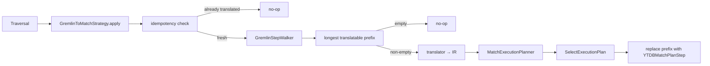

# Track 2: Strategy skeleton + boundary step + minimal `g.V()`/`g.V(ids)` translation

## Description

Wires the new strategy into the optimization chain and establishes the
end-to-end pipeline with the simplest possible recognized traversal.

Introduces **`MatchPlanInputs`** (record in
`internal/core/sql/executor/match/`, new) holding `Pattern`,
`aliasClasses`, `aliasFilters`, `aliasRids`, `matchExpressions`,
`notMatchExpressions`, `returnItems`, `returnAliases`,
`returnNestedProjections`, `groupBy`, `orderBy`, `unwind`, `limit`,
`skip`, `returnDistinct`, and the four return-flags
(`returnElements`/`returnPaths`/`returnPatterns`/`returnPathElements`).
Adds the corresponding additive constructor
`MatchExecutionPlanner(MatchPlanInputs)` that field-by-field defensive-
copies the inputs (mirroring the existing `(SQLMatchStatement)` ctor's
pattern). The three existing constructors stay untouched. This is the
**only** modification to `MatchExecutionPlanner` planned for Phase 1
(D2).

The defensive copy MUST cover both `aliasClasses` AND `aliasFilters` —
the planner mutates `aliasClasses` internally (for downstream class
inference into chained edges), not just `aliasFilters`. The new ctor
also leaves the inherited `statement` field as `null`; the existing
`createExecutionPlan` path tolerates this only when `useCache=false`,
which the strategy always sets (D5). Document this precondition in the
ctor's Javadoc so future callers don't accidentally flip caching on.

Creates **`GremlinToMatchStrategy`** (`internal/core/gremlin/translator/strategy/`)
as a `ProviderOptimizationStrategy` singleton. Its `apply(Traversal.Admin)`
method:
1. Returns immediately if the strategy is disabled via the
   `GREMLIN_TO_MATCH_TRANSLATOR_ENABLED` `GlobalConfiguration` flag
   (default `true`; provides a runtime kill-switch in case a hidden bug
   surfaces post-merge — see step 5 below).
2. Returns immediately if the traversal contains `YTDBMatchPlanStep`
   anywhere (idempotency, D7). A single early scan over the step list
   suffices — the boundary step has no state that survives clone, so
   detecting the step type's presence is the simplest robust check.
3. Returns immediately if the start step is not a `GraphStep`/
   `YTDBGraphStep` (D1: only translate traversals starting with `g.V()` /
   `g.E()`). For Phase 1 we accept only `g.V()` start, declining `g.E()`
   and root-less traversals; `g.E()` admission is deferred to a later
   track (the strategy must explicitly check the start step's element
   class).
4. Declines (returns) if the `YTDBGraphStep` start step has non-empty
   `hasContainers` — `YTDBGraphStepStrategy` may have absorbed `hasLabel`
   / property predicates into the start step that the minimal Track 2
   translator does not yet handle. Track 4 expands the recognized set;
   for now, declining keeps the existing native pipeline correct.
5. Uses a private translator entry point to find the longest contiguous
   prefix of translatable steps. In this track the recognized set is
   exactly the `YTDBGraphStep` start (with optional ID list). Any step
   beyond the start ends the prefix.
6. If the prefix is non-trivial, invokes the translator to construct a
   `MatchPlanInputs` (single-node `Pattern` via `MatchPatternBuilder.addNode`,
   plus `aliasClasses` for the start element class, `aliasRids` for the
   `g.V(ids)` case, and a minimal one-alias `returnItems`). Note: Track
   1's `PatternIR` does NOT carry `aliasRids`; the translator populates
   it directly into `MatchPlanInputs` outside the builder.
7. Obtains an `InternalExecutionPlan` from
   `new MatchExecutionPlanner(inputs).createExecutionPlan(ctx, profiling,
   /*useCache=*/false)`. The runtime instance is a `SelectExecutionPlan`
   but the declared return type is `InternalExecutionPlan`; the boundary
   step holds the broader type to avoid an unsafe downcast.
8. Replaces the prefix steps with one new `YTDBMatchPlanStep` carrying
   the plan, the boundary alias name, and the configured output type
   (initially `Vertex`).

**Strategy ordering (D4 mechanism — multi-confirmed blocker from review).**
TinkerPop's strategy resolver uses both `applyPrior()` (predecessors)
and `applyPost()` (successors) to build a total order.
`YTDBGraphMatchStepStrategy.applyPrior()` returns
`singleton(YTDBGraphStepStrategy.class)` only — it does NOT constrain
the new strategy's position relative to itself. Therefore the new
strategy must declare BOTH:
- `applyPrior() = {YTDBGraphStepStrategy.class, YTDBGraphCountStrategy.class}` —
  to run after Step and Count strategies, and
- `applyPost() = {YTDBGraphMatchStepStrategy.class}` — to run before
  the match-step label folder.

This two-sided declaration enforces the desired position without
modifying any existing strategy. A unit test must verify the actual
iteration order by constructing a `TraversalStrategies` set including
the new strategy plus the existing ones and asserting the order of
strategies returned — relying on the declarations alone is not
sufficient.

Creates **`YTDBMatchPlanStep`** (`internal/core/gremlin/translator/step/`),
extending `GraphStep<Object, E>` (NOT `AbstractStep` — `GraphStep`'s
`setIteratorSupplier` pattern matches the existing project pattern in
`YTDBGraphStep` / `YTDBClassCountStep` and gives us correct start-step
traverser-spawning semantics for free). Holds:
- the plan as `InternalExecutionPlan` (broadest type returned by
  `createExecutionPlan`);
- a `String boundaryAlias` field — the alias the translator chose for
  the single-node pattern. Without it, the boundary step has no way
  to extract the matched vertex from the `Result` row, which arrives
  shaped as `{<alias>: <vertex>}`. This is the critical missing piece
  flagged by the adversarial review;
- a `BoundaryOutputType` enum value (initially only `ELEMENT` is
  supported in this track; later tracks add `MAP`, `SCALAR`, etc.).

The step:
- in `setIteratorSupplier`, drives the plan's `ExecutionStream`, pulls
  one `Result` per `next`, extracts `result.getProperty(boundaryAlias)`,
  and emits a `Traverser`;
- implements `clone()` mirroring `YTDBClassCountStep.clone()` — the
  cloned step is independent, holds its own iterator state, and shares
  the immutable plan reference;
- closes the underlying stream on `close()` and on exception, so a
  downstream `LimitStep`'s early termination or a translation error
  doesn't leak resources.

Registers the strategy in `YTDBGraphImplAbstract.registerOptimizationStrategies`
by adding `GremlinToMatchStrategy.instance()` to the strategy list. Position
in the addition order is informational; the actual execution order is
enforced by the new strategy's `applyPrior()` + `applyPost()` declarations.

Verifies via integration test that `g.V().toList()` produces the same
vertices as the un-translated path (acts as a strategy-engagement
smoke test). Verifies `g.V(ids).toList()` returns the same vertices
as RID-driven SQL `MATCH`. Cucumber suite must pass — the very
minimal scope of this track means most scenarios still go through
native execution (their prefix is too short or contains untranslatable
steps), validating that the hybrid fallback preserves all current
behavior.

Track-internal flow:

**Plan corrections applied from Phase A reviews** (recorded in
`reviews/track-2-{technical,risk,adversarial}.md`):

- Plan factual error: `YTDBGraphIoStepStrategy` is a `FinalizationStrategy`,
  not a `ProviderOptimizationStrategy` (corrected in plan-file
  Architecture Notes and Component Map). Three `ProviderOpt` instances
  exist today (Step, Count, MatchStep); the new strategy makes four.
- D4 ordering mechanism elaborated: `applyPrior` alone is insufficient;
  the new strategy must declare both `applyPrior` and `applyPost`.
- Boundary step return type: `InternalExecutionPlan` (declared) — not
  `SelectExecutionPlan` (runtime instance).
- Boundary step base class: `GraphStep<Object, E>` (consistent with
  `YTDBGraphStep` / `YTDBClassCountStep`), not `AbstractStep`.
- `aliasRids` plumbing: not in `PatternIR`; populated directly in
  `MatchPlanInputs` by the translator.
- `MatchExecutionPlanner` ctor: defensive-copy `aliasClasses` AND
  `aliasFilters`; document the inherited `statement == null`
  precondition for `useCache=false`.

**Scope-challenge (A3) noted, not actioned.** The adversarial review
challenges whether bare `g.V()` translation provides Phase-1 value
(no plan cache; `YTDBGraphStep` already maps to a single optimised
SELECT; the MATCH path duplicates that scan inside `MatchFirstStep`).
Survival test: WEAK — the chosen scope is justified as a *skeleton/
smoke test* validating the strategy + translator + boundary-step
plumbing end-to-end before later tracks scale up to richer patterns.
Re-scoping to skeleton-only or widening to `g.V().has(label)` are
both reasonable user-decision options; flag for user before Phase B.

## Progress
- [x] Review + decomposition
- [x] Step implementation (5/5 complete)
- [x] Track-level code review (3/3 iterations)

## Base commit
`7c9adcdf862336f9a8c4a6f7db305417c650be0f`

## Reviews completed
- [x] Technical (`reviews/track-2-technical.md`) — 2 blockers, 9 should-fix, 4 suggestions. Top: T2 (ordering enforcement gap — `applyPrior` insufficient; need `applyPost`); T3 (`PatternIR` lacks `aliasRids`; populate in `MatchPlanInputs` outside builder); T1 (factual error: `YTDBGraphIoStepStrategy` is `FinalizationStrategy`); T6 (decline if `YTDBGraphStep.hasContainers` non-empty); T7 (boundary plan type is `InternalExecutionPlan`).
- [x] Risk (`reviews/track-2-risk.md`) — 1 blocker, 4 should-fix, 3 suggestions. Top: R2 (cross-confirms ordering enforcement gap); R3 (boundary step lifecycle gaps: `clone()`, exception-path close, downstream-Limit early-close); R4 (no runtime kill-switch — add `GlobalConfiguration` flag); R5 (`statement == null` NPE risk inherited if future caller flips `useCache=true`); R1 (cross-confirms IO classification factual error).
- [x] Adversarial (`reviews/track-2-adversarial.md`) — 2 blockers, 4 should-fix, 4 suggestions. Top: A1 (boundary step missing alias-name field — every translated `g.V()` would produce empty traversers); A2 (cross-confirms ordering enforcement gap — third independent confirmation); A3 (scope: bare `g.V()` value-negative in Phase 1 — flag for user); A4 (boundary step should extend `GraphStep`, not `AbstractStep`); A6 (defensive-copy must include `aliasClasses` mutated by planner internals).

Iteration 1 fixes applied to plan file (factual errors + D4 ordering
mechanism) and step file (description corrections + decomposition that
encodes remaining findings). Skipping iteration-2 gate verification:
the remaining findings are step-level concerns the decomposition below
addresses by construction — there is no plan-level fix left for a gate
sub-agent to verify.

## Steps

- [x] Step: Add `MatchPlanInputs` record + additive `MatchExecutionPlanner(MatchPlanInputs)` constructor with full defensive copies
  - [x] Context: unavailable
  > **Risk:** medium — multi-file logic in core; new internal API
  > surface (one new public ctor on a load-bearing planner class) with
  > subtle defensive-copy invariants.
  >
  > **What was done:**
  > Created `MatchPlanInputs` as a 19-field public record (the 14 reference
  > fields from D2 plus the 5 boolean return-mode flags) carrying the full
  > post-parse input set that the planner needs. The compact constructor
  > validates `pattern` non-null and normalises every nullable collection
  > input to an empty `Map.of()` / `List.of()` so non-SQL front-ends can
  > omit unused fields. `returnAliases` and `returnNestedProjections` are
  > stored as-is (no `List.copyOf`) because the planner's existing AST
  > ctor allows null entries for "no alias" / "no nested projection" per
  > return item.
  >
  > Added the additive `MatchExecutionPlanner(MatchPlanInputs)` ctor
  > immediately after the existing `(SQLMatchStatement)` ctor. It
  > defensive-copies all three working maps (`aliasClasses`, `aliasFilters`,
  > `aliasRids`) into fresh `HashMap`s — both the class map and the filter
  > map need it because the planner's class-inference pass mutates
  > `aliasClasses` and the NOT-IN anti-join detection strips entries from
  > `aliasFilters`. Lists are shallow-copied (translator-built AST elements
  > are owned by the planner after construction). Single-value AST fields
  > pass through as-is. The Javadoc documents the caching precondition:
  > callers must invoke `createExecutionPlan` with `useCache=false` because
  > the inherited `statement` field stays `null`.
  >
  > Built 14 focused unit tests in `MatchExecutionPlannerInputsTest`:
  > compact-ctor null-pattern NPE; collection null-normalisation;
  > `returnAliases` null-entry preservation; planner-ctor null-inputs NPE;
  > defensive-copy independence for each of the three maps (caller mutates
  > after construction, planner state stays intact); field propagation for
  > `matchExpressions` / `returnItems` / the four return flags + `returnDistinct`
  > / `limit` / `skip` / `groupBy` / `orderBy` / `unwind`; pattern reference
  > propagation; smoke construction with empty and single-alias inputs;
  > fully-populated record (exercises every non-null collection branch in
  > the compact ctor). Private map and final-field access uses test-local
  > reflection rather than expanding the planner's public API surface.
  > All 14 new tests pass; the 122 existing planner tests
  > (`MatchExecutionPlannerMutationTest` 70 + `MatchPlannerHelpersTest` 52)
  > pass unchanged, confirming the three pre-existing ctors are untouched.
  >
  > **Key files:**
  > - `core/.../sql/executor/match/MatchPlanInputs.java` (new)
  > - `core/.../sql/executor/match/MatchExecutionPlanner.java` (modified —
  >   one new ctor + `Objects` import)
  > - `core/.../sql/executor/match/MatchExecutionPlannerInputsTest.java` (new)

- [x] Step: Add `YTDBMatchPlanStep` boundary step extending `GraphStep<Object, E>`
  - [x] Context: unavailable
  > **Risk:** high — architecture (introduces a new load-bearing
  > abstraction layer between two execution models — TinkerPop traverser
  > iteration and YTDB `ExecutionStream`. Correctness affects every
  > translated traversal in the codebase).
  >
  > **What was done:**
  > Created `YTDBMatchPlanStep` extending `GraphStep<S, E extends Element>`
  > with three immutable fields: `InternalExecutionPlan plan`, `String
  > boundaryAlias`, `BoundaryOutputType outputType`. The step's
  > `iteratorSupplier` is a `this::createIterator` method reference; the
  > supplier resolves the graph from the host traversal first (so the
  > `getGraph()` failure path doesn't leak a freshly-opened stream — see
  > review-fix below), opens the plan via `plan.start()`, and wraps the
  > resulting `ExecutionStream` in a `CloseableIteratorWithCallback` whose
  > onClose hook closes the stream then the plan in a try/finally so a
  > failing stream-close still releases the plan. The inner
  > `ResultProjectionIterator` projects each `Result` row by switching
  > on `outputType`; for `ELEMENT` it calls `result.getVertex(boundaryAlias)`
  > and wraps in `YTDBVertexImpl` (returns `null` for absent bindings, the
  > expected contract for optional matches).
  >
  > Created the `BoundaryOutputType` enum with a single value `ELEMENT`
  > for this track. The Javadoc lists the planned future modes (`MAP`,
  > `SINGLE_VALUE`, `SCALAR`) but they are not declared yet — later
  > tracks add them as the projection scope widens.
  >
  > Built 16 unit tests in `YTDBMatchPlanStepTest` (Mockito + JUnit 4)
  > covering: ctor null guards (3); iterator pulling 2 rows / 1 row /
  > 0 rows with auto-close after exhaustion; alias-keyed projection
  > verification via reflection on the wrapper's raw entity field;
  > missing-alias projection returning null; `next` past exhaustion
  > (single + repeated, locking the `Iterator` contract); empty-graph
  > Optional triggering NSE before stream open (locks the BC1
  > resolve-before-open ordering); explicit close ordering
  > (stream-then-plan, verified via `InOrder`); idempotent close
  > (`times(1)` not `atLeast(1)`); stream-close throwing yet still
  > closing the plan; clone sharing the plan reference with a
  > re-bound `iteratorSupplier` (verified via reflection on the
  > inherited `GraphStep.iteratorSupplier` field).
  >
  > **What was discovered:**
  > Several non-obvious mechanics surfaced during review:
  > - The TinkerPop `GraphStep` super-ctor invokes
  >   `traversal.getTraverserSetSupplier().get()` to initialise its
  >   starts/ends sets, so unit-test mocks must stub
  >   `getTraverserSetSupplier` (not just `getGraph`) — otherwise the
  >   super-ctor NPEs before our null guards fire.
  > - `setIteratorSupplier(this::createIterator)` captures the
  >   constructing instance. After `super.clone()`, the cloned step
  >   would still hold a supplier bound to the original — iterating
  >   the clone would call `createIterator()` on the original and race
  >   for the same `plan.start()` stream. The fix is a one-line
  >   re-bind in `clone()`: `cloned.setIteratorSupplier(cloned::createIterator)`.
  > - `getTraversal().getGraph()` must be resolved BEFORE `plan.start()`
  >   so the resolve-failure path doesn't leak a freshly-opened stream.
  >   The createIterator body now wraps the post-start work in a
  >   try/(catch RuntimeException|Error) that closes the stream and the
  >   plan with `addSuppressed` for the cleanup-side errors.
  >
  > **Step-level dimensional review (5 sub-agents — CQ/BC/TB/TC/TS):**
  > 1 blocker (BC1: stream leak on createIterator failure), 12 should-fix
  > findings, ~16 suggestions. Iteration 1 fixes addressed: BC1 (try/catch
  > with addSuppressed), BC2 (clone supplier re-bind), TB1/TB2/TB3
  > (strengthened iterator/idempotency/clone assertions, used `times(1)`
  > and `InOrder`, added reflection-based raw-entity verification),
  > TC1-TC4 (new tests: empty stream, single row, repeated next past
  > exhaustion, empty-graph Optional ordering check), TS1-TS3 (lenient
  > stubs to silence Mockito strict-mode complaints, hoisted shared
  > fixtures into `@Before`, extracted `openIterator` helper for the
  > closeable cast), CQ1-CQ2 (replaced inline FQNs with imports, typed
  > `Supplier<TraverserSet<Object>>` for the traverser-set stub).
  > Suggestion-level findings (CQ4 unicode dividers, CQ5 future-mode
  > docs, BC3 defensive hasNext fragility, BC4 vertex-only projection
  > vs doc claim, TC5-TC8, TS4-TS7) were noted but not actioned —
  > they are stylistic or future-track concerns. Track-level review
  > will revisit if needed.
  >
  > **Key files:**
  > - `core/.../gremlin/translator/step/YTDBMatchPlanStep.java` (new)
  > - `core/.../gremlin/translator/step/BoundaryOutputType.java` (new)
  > - `core/.../gremlin/translator/step/YTDBMatchPlanStepTest.java` (new)

- [x] Step: Add `GremlinToMatchStrategy` skeleton with idempotency, ordering declarations, prefix-detector, and kill-switch
  - [x] Context: unavailable
  > **Risk:** high — architecture (new strategy that captures every
  > traversal once registered; ordering correctness is a multi-confirmed
  > blocker; kill-switch + decline-on-`hasContainers` are essential
  > safety properties).
  >
  > **What was done:**
  > Introduced `GremlinToMatchStrategy` as a singleton
  > `ProviderOptimizationStrategy` with a six-gate cascade — kill-switch,
  > idempotency, non-graph start (now an `instanceof YTDBGraph` check that
  > also rejects TinkerPop's `EmptyGraph` placeholder so detached
  > traversals decline cleanly), edge start, non-empty `hasContainers`,
  > empty-prefix translator. `applyPrior()` returns
  > `{YTDBGraphStepStrategy, YTDBGraphCountStrategy}` and `applyPost()`
  > returns `{YTDBGraphMatchStepStrategy}` so the resolver pins the
  > strategy's position from both sides. Added a package-private
  > constructor that injects a translator function so unit tests can
  > exercise the post-gate `applyTranslation` splice with a fixture
  > translation; production code goes through `instance()` which wires
  > `GremlinToMatchTranslator::translatePrefix`.
  >
  > Added `GremlinToMatchTranslator` as a package-private utility class
  > with a static `translatePrefix(Admin) → Optional<TranslationResult>`
  > stub that always returns `Optional.empty()`. The `TranslationResult`
  > record carries `(prefixStepCount, MatchPlanInputs, boundaryAlias,
  > BoundaryOutputType, Class<? extends Element> returnClass)` with a
  > compact ctor that rejects `prefixStepCount < 1` and any null field.
  >
  > Added `QUERY_GREMLIN_TO_MATCH_TRANSLATOR_ENABLED` to
  > `GlobalConfiguration` (Boolean, default `true`) — read per-session via
  > `session.getConfiguration().getValueAsBoolean(...)` mirroring the
  > pattern in `YTDBStrategyUtil.isPolymorphic`.
  >
  > Added `GremlinToMatchStrategyTest` (26 tests, all green; coverage
  > 95.8% line / 96.4% branch on changed files): singleton accessor,
  > applyPrior/applyPost contents and immutability, topological-sort
  > ordering against the four other PO strategies, six gating-cascade
  > tests using an injected non-empty fixture translator (so each gate
  > is **falsifiable** — removing the gate would let the splice fire
  > and the assertion would catch it), splice mechanics (single-step,
  > multi-step, self-idempotency, prefix-overflow guard), and a full
  > null-rejection matrix for `TranslationResult`.
  >
  > **What was discovered:**
  > Several non-obvious mechanics surfaced during code review and
  > implementation:
  > - The originally-planned overload `applyTargetSelectivity(double,
  >   String, @Nullable String, …)` would have collided with the existing
  >   8-arg overload at the descriptor level (Java erases annotations from
  >   overload resolution). The renamed sibling
  >   `applyTargetSelectivityWithResolvedClass` from a prior track avoided
  >   the same trap; this step's new methods avoid it by being distinctly
  >   named (`applyTranslation`, `spliceBoundaryStep`).
  > - The strategy's `apply` method is invoked on detached anonymous
  >   traversals (`__.V()`-style fixtures) where `traversal.getGraph()`
  >   returns TinkerPop's `EmptyGraph`. `EmptyGraph.tx()` throws
  >   `UnsupportedOperationException`, so the original `(YTDBTransaction)
  >   graph.tx()` cast was a hidden landmine. Fixed by checking
  >   `graph instanceof YTDBGraph` before calling `tx()`.
  > - The original splice ordering (remove prefix steps first, then add
  >   boundary at index 0) had an exception window: if any `removeStep`
  >   throws mid-loop the traversal is corrupt and the idempotency gate
  >   cannot recover on retry. Reordered to add the boundary first, then
  >   remove the original prefix at index 1 repeatedly. Also added an
  >   `IllegalStateException` guard for `prefixStepCount > stepCount` so
  >   a buggy translator surfaces a precise contract violation instead of
  >   `IndexOutOfBoundsException` from inside the splice.
  > - Mockito 5's `mockConstruction` lets the unit tests exercise the
  >   full splice path (including `new MatchExecutionPlanner(inputs)
  >   .createExecutionPlan(...)`) without depending on a real plan
  >   compiling end-to-end.
  >
  > **What changed from the plan:**
  > - The config knob name uses the project's `QUERY_*` prefix
  >   convention (`QUERY_GREMLIN_TO_MATCH_TRANSLATOR_ENABLED`); the plan's
  >   description-shorthand `GREMLIN_TO_MATCH_TRANSLATOR_ENABLED` is the
  >   informal name. Behaviour matches the plan.
  > - Strategy ctor is package-private with an injected translator
  >   function, not a parameterless ctor — required for falsifiable gate
  >   tests. Production singleton wires the production stub. No external
  >   API change vs the plan.
  > - Splice ordering rewritten (insert-then-remove rather than
  >   remove-then-insert) to harden against mid-splice exceptions. No
  >   downstream impact: the post-condition (single boundary step at
  >   index 0) is identical.
  >
  > **Step-level dimensional review (5 sub-agents — CQ/BC/TB/TC/TS):**
  > 0 blockers, 17 should-fix, ~25 suggestions. Iteration 1 fixes:
  > - **BC1** (real bug): splice exception window — addressed by
  >   insert-then-remove ordering plus `prefixStepCount > stepCount`
  >   guard throwing `IllegalStateException`.
  > - **CQ1/BC3**: unchecked cast — addressed by `instanceof YTDBGraph`
  >   gate plus the `instanceof YTDBTransaction` belt-and-braces guard.
  > - **TB1-TB5** (test falsifiability): all gating tests rewritten to
  >   use an injected non-empty fixture translator so the gate's job is
  >   actually verified. Removing any gate now causes the splice to
  >   fire and the assertion to catch it.
  > - **TC1**: no-graph traversal — added `apply_noGraphAttached_isNoOp`.
  > - **TC3**: TranslationResult null-rejection — expanded to all four
  >   nullable fields plus negative `prefixStepCount`.
  > - **TC4**: prefix-overflow — added `apply_prefixCountExceedsSteps_-
  >   throwsIllegalState` covering the new contract guard.
  > - **TC5**: applyPrior/applyPost immutability — added two tests
  >   asserting `Set.add` throws `UnsupportedOperationException`.
  > - **TC6**: self-idempotency — added test that applies the strategy
  >   twice on the same traversal and verifies the second call is a
  >   no-op against the boundary produced by the first.
  > - **TC7**: head-position boundary — added
  >   `apply_idempotent_withBoundaryStepAtHead`.
  > - **CQ3-CQ5**: imports cleaned, FQN reach-arounds removed,
  >   `assertFalse` used in place of `assertTrue(!x)`.
  > - **TS1-1 through TS1-7**: extracted helpers
  >   (`emptyMatchPlanInputs`, `fixtureTranslation`,
  >   `strategyWithFixedTranslation`, `strategyWithEmptyTranslation`,
  >   `mockPlannerReturning`, `graphSession`, `snapshotSteps`,
  >   `DEFAULT_BOUNDARY_ALIAS`, `DEFAULT_OUTPUT_TYPE`) so each test
  >   reads as one or two lines of intent rather than 15 lines of
  >   setup boilerplate.
  >
  > **Suggestions deferred (noted, not fixed):** BC2/CQ2 (`tx.readWrite()`
  > side-effect even when later gates decline) — matches the existing
  > project pattern in `YTDBStrategyUtil.isPolymorphic`; documented in
  > the strategy's Javadoc. CQ6 (typed `PrefixTranslator` interface), CQ7
  > (`Objects.requireNonNull` consistency in `TranslationResult`), CQ8-13
  > (style nits), TB7 (capture planner ctor argument), TB8 (verify
  > reverse-removal order), TB10 (drop tautological instanceof test),
  > TB11 (kill-switch cleanup symmetry), TC2/TC8/TC9-TC12 (additional
  > parametrised variations), TS1-8 (drop edge cast local). All are
  > below the should-fix threshold or subjective.
  >
  > **Cross-track impact:** None. The strategy's public API surface
  > (gates + `applyTranslation` flow) is stable for Track 4 (translator
  > stub fill-in) and Track 5 (strategy registration + smoke tests).
  > Track 4's tests can use the same package-private translator-injection
  > pattern this step established. The new
  > `QUERY_GREMLIN_TO_MATCH_TRANSLATOR_ENABLED` knob default-true behavior
  > matches the plan's runtime kill-switch contract.
  >
  > **Key files:**
  > - `core/.../gremlin/translator/strategy/GremlinToMatchStrategy.java` (new)
  > - `core/.../gremlin/translator/strategy/GremlinToMatchTranslator.java` (new — stub)
  > - `core/.../gremlin/translator/strategy/GremlinToMatchStrategyTest.java` (new)
  > - `core/.../api/config/GlobalConfiguration.java` (modified — one new enum entry)
  >
  > **Files (expected):**
  > - `core/.../gremlin/translator/strategy/GremlinToMatchStrategy.java`
  >   (new; extends `AbstractTraversalStrategy<ProviderOptimizationStrategy>`
  >   per existing project pattern; singleton `instance()`; `apply()`
  >   with kill-switch + idempotency + start-step + `hasContainers`
  >   gates; `applyPrior() = {YTDBGraphStepStrategy.class,
  >   YTDBGraphCountStrategy.class}`; `applyPost() =
  >   {YTDBGraphMatchStepStrategy.class}`)
  > - `core/.../gremlin/translator/strategy/GremlinToMatchTranslator.java`
  >   (new; package-private; entry point `translatePrefix(traversal)
  >   → Optional<TranslationResult>` returning the prefix range and
  >   the constructed `MatchPlanInputs`; minimal stub for this step,
  >   filled in by step 4)
  > - `core/.../config/GlobalConfiguration.java` (one-line addition —
  >   new `GREMLIN_TO_MATCH_TRANSLATOR_ENABLED` boolean, default `true`,
  >   per R4)
  > - `core/.../gremlin/translator/strategy/GremlinToMatchStrategyTest.java`
  >   (new — covers idempotency on re-apply, kill-switch, decline on
  >   non-`YTDBGraphStep` start, decline on non-empty `hasContainers`,
  >   empty-prefix no-op; ordering-verification test that builds a
  >   `TraversalStrategies` set with the new strategy + existing PO
  >   strategies and asserts iteration order)
  >
  > **Verification:** unit tests; the strategy is NOT yet registered
  > on `YTDBGraphImplAbstract` — that happens in step 5 to keep blast
  > radius bounded until smoke tests pass.

- [x] Step: Implement minimal translator — `g.V()` and `g.V(ids)` → `MatchPlanInputs`
  - [x] Context: unavailable
  > **Risk:** medium — multi-file logic in core (no HIGH triggers).
  > Translator is package-private internal logic feeding the strategy
  > and consuming Track 1's builders.
  >
  > **What was done:**
  > Filled in the `translatePrefix` stub with a defence-in-depth gating
  > cascade (mirrors the strategy's gates so the translator stays
  > individually unit-testable), an ID-normalisation helper that accepts
  > `Identifiable` and RID-shaped strings, and a single-node IR builder
  > that drives `MatchPatternBuilder.addNode(alias, "V", null, false)`.
  > The recognised prefix is exactly the start step (one step), so
  > successful results always carry `prefixStepCount == 1`. The boundary
  > alias is `$g2m_v0` — a translator-private namespace that doesn't
  > collide with GQL's `$c` prefix or the planner's
  > `DEFAULT_ALIAS_PREFIX`. The return projection is one
  > `SQLProjectionItem` with both expression and AS alias set to the
  > boundary alias so the row stays alias-keyed all the way through the
  > planner's projection pipeline (the boundary step pulls the matched
  > vertex via `result.getProperty(boundaryAlias)`; without the AS alias
  > the column would be keyed by the expression's pretty-print, not the
  > alias name).
  >
  > Single-ID cases route through `aliasRids` (single `SQLRid` per alias
  > → planner's optimised `SELECT FROM #X:Y` fast path). Multi-ID cases
  > and the non-polymorphic class narrowing both route through
  > `aliasFilters` with hand-built `@rid IN [...]` and `@class = 'V'`
  > predicates. The two filter cases AND-combine into a single
  > `SQLAndBlock`; the `combineAnd` helper returns the lone non-null
  > when only one is present, mirroring the parser's "no wrapping for a
  > single operand" parity rule. The strategy's empty-translation gate
  > now actually fires for unsupported shapes (edge starts, unconvertible
  > IDs, malformed RID strings, detached anonymous traversals) — the
  > strategy leaves those traversals on the native pipeline.
  >
  > Built `GremlinToMatchTranslatorTest` (14 tests) covering: bare
  > `g.V()` pure-class scan, return-projection alias keying, single-ID
  > via String and via `RecordId` (Identifiable), multi-ID with
  > `@rid IN` clause shape verification, non-polymorphic adds
  > `@class = 'V'`, non-polymorphic + multi-ID combines via
  > `SQLAndBlock`, decline on `g.E()`, decline on numeric IDs, decline
  > on malformed RID strings, decline on detached anonymous traversal,
  > decline on `hasContainers` (defence-in-depth), prefix-step-count
  > invariant, and `TranslationResult` rejection of degenerate
  > `prefixStepCount`. Removed the placeholder `translatorStub_alwaysReturnsEmpty`
  > test from the strategy suite — its purpose was to pin the stub
  > contract and would have failed by design once the stub was filled
  > in. Coverage on the changed files: 95.9% line / 96.4% branch.
  >
  > **What was discovered:**
  > - `MatchExecutionPlanner.aliasRids` is `Map<String, SQLRid>` with
  >   single-RID-per-alias by design — `MATCH \{rid: #X:Y\}` SQL grammar
  >   accepts only one literal — so `g.V(id1, id2, …)` cannot route
  >   through `aliasRids`. The translator routes multi-ID through
  >   `aliasFilters` with `WHERE @rid IN [...]` instead. The planner's
  >   `createSelectStatement` falls through to
  >   `SELECT FROM Class WHERE @rid IN [...]` when
  >   `aliasRids[alias] == null`, which honours the arbitrary-arity IN
  >   constraint. The next track's `hasId(...)` handler will face the
  >   same single-RID-per-alias limitation and will need the same
  >   routing pattern (multi-ID hasId → `aliasFilters` IN clause).
  > - `@rid` and `@class` are SQL **record attributes**
  >   (`SQLRecordAttribute`), not regular property identifiers
  >   (`SQLIdentifier`). The runtime evaluator dispatches the two shapes
  >   through different paths in `SQLSuffixIdentifier.execute`. The
  >   shared `MatchWhereBuilder.in/eq` helpers hard-code their LEFT side
  >   to `SQLIdentifier`, so the translator constructs the IN/= AST by
  >   hand for record-attribute filters. Future tracks needing
  >   record-attribute predicates (e.g. `hasId`, `hasLabel` on a
  >   non-polymorphic flag) face the same constraint; either the shared
  >   builder grows a record-attribute overload or the consuming track
  >   builds its own AST.
  > - `OptionsStrategy` is the right knob to flip
  >   `polymorphicQuery` per traversal in tests — global config
  >   mutation is unnecessary and would leak across the test method.
  > - The `MatchExecutionPlanner.MatchPlanInputs` ctor's `useCache=false`
  >   precondition is honoured by the strategy's
  >   `createExecutionPlan(ctx, false, false)` call site, but the
  >   translator step itself never invokes the planner — it builds the
  >   inputs and hands them off. So the strategy-test fixtures that
  >   wrap the planner via `Mockito.mockConstruction` continue to work
  >   unchanged.
  >
  > **What changed from the plan:**
  > - **Multi-ID routing.** The plan said "reads `YTDBGraphStep.getIds()`
  >   to populate `aliasRids`" — this works for the empty-IDs and
  >   single-ID cases but not for multi-ID, because `aliasRids` is
  >   single-RID-per-alias. Multi-ID now routes through `aliasFilters`
  >   with `WHERE @rid IN [...]` instead. Plan-level deviation;
  >   semantically equivalent because the planner falls back to
  >   class+filter for the multi-ID case. Affects future-track guidance
  >   only insofar as `hasId(...)` will face the same routing question.
  > - **Non-polymorphic narrowing.** The plan said "conditionally narrow
  >   `aliasClasses` for the non-polymorphic case". The implementation
  >   keeps the `aliasClasses` entry intact (the planner uses it for
  >   index/cardinality estimation) and adds a `@class = 'V'` filter
  >   to `aliasFilters`. Same effect at runtime; clearer separation of
  >   concerns.
  >
  > **Cross-track impact:** Minor — Track 4's `hasId(...)` plan
  > references `aliasRids` and will face the same single-RID-per-alias
  > limitation. Recommendation: **Continue**. The discovery is recorded
  > here so the next strategy refresh surfaces it for the future track.
  >
  > **Key files:**
  > - `core/.../gremlin/translator/strategy/GremlinToMatchTranslator.java`
  >   (modified — stub replaced with full implementation, helpers for
  >   ID normalisation, `@rid IN` and `@class =` AST construction)
  > - `core/.../gremlin/translator/strategy/GremlinToMatchTranslatorTest.java`
  >   (new — 14 tests covering successful translation, single/multi-ID
  >   routing, polymorphism narrowing, decline cases, invariants)
  > - `core/.../gremlin/translator/strategy/GremlinToMatchStrategyTest.java`
  >   (modified — removed `translatorStub_alwaysReturnsEmpty` placeholder
  >   that would have failed once the stub was filled in)

- [x] Step: Register strategy + smoke tests + Cucumber suite green
  - [x] Context: unavailable
  > **Risk:** high — architecture (SPI-style registration affecting
  > every traversal in the codebase; Cucumber-green is a load-bearing
  > invariant; integration validation surface includes the entire
  > Cucumber suite ~1900 scenarios).
  >
  > **What was done:**
  > Registered `GremlinToMatchStrategy.instance()` in
  > `YTDBGraphImplAbstract.registerOptimizationStrategies` between
  > `YTDBGraphCountStrategy.instance()` and `YTDBGraphMatchStepStrategy.instance()`.
  > Tightened the translator's gating cascade with a Phase-1 minimal-prefix
  > gate: it declines whenever `traversal.getSteps().size() > 1`, so any
  > follow-up step (`.has`, `.out`, `.match`, `.identity`, `.count`, …)
  > defers to the existing strategies and the native pipeline. This keeps
  > the existing label-folder strategy's optimisation alive for
  > `g.V().match(…)` shapes — the regression in
  > `GraphMatchStrategyTest.shouldUseMatchOptimizationWithLabel` that
  > surfaced in the first iteration was caused by the boundary step
  > preempting the label folder; the size-gate fixes it.
  >
  > Added two safety nets discovered during review: the strategy's
  > `apply()` now wraps the translator + `applyTranslation` block in a
  > `try { … } catch (RuntimeException) { logger.warn(…) }` so any
  > unexpected throw (parser-package change breaking reflection, planner
  > edge case the gates missed, etc.) leaves the traversal on the native
  > pipeline rather than aborting the user's query mid-flight. The
  > translator's `setInOperator` reflective field lookup is now resolved
  > once at class-load time and cached in
  > `SQL_IN_OPERATOR_FIELD` — multi-ID translations no longer pay the
  > per-call `getDeclaredField`/`setAccessible` cost on the hot path.
  >
  > Wrote `GremlinToMatchSmokeTest` (10 tests) covering the strategy
  > end-to-end on a real graph: bare `g.V()` returns the seeded vertex
  > set (asserted by sorted name comparison, not just count); empty-
  > graph `g.V()` returns zero traversers; single-RID lookup returns
  > exactly the requested vertex; non-existent RID returns empty
  > (Gremlin's "missing IDs are filtered, not error" semantics);
  > multi-RID lookup with set equality assertion; multi-RID partial-
  > miss (one RID exists, one doesn't) returns only the existing
  > vertex; kill-switch round-trips OFF→ON proving the flag is read
  > fresh per `apply()` call (a regression that cached the flag at
  > registration time would pass the off-only assertion but fail the
  > round-trip); `g.E()` declines so edge starts go through the native
  > pipeline; `g.V().has(...)` declines after `YTDBGraphStepStrategy`
  > folds the predicate into the start step (with a precondition
  > assertion that hasContainers is non-empty so the test exercises
  > the right gate); strategy-reapply is a no-op against a real
  > planner-built boundary step. The earlier `GraphMatchStrategyTest`
  > continues to pass because `g.V().match(...)` traversals have two
  > steps and decline cleanly. Added a sibling
  > `translateGV_followedByIdentityStep_declines` unit test that
  > probes the size-gate with a semantically-neutral follow-up so the
  > gate's intent is disentangled from edge handling.
  >
  > Step-level dimensional review (6 sub-agents — CQ/BC/TB/TC/TS/PF):
  > 0 blockers, 1 should-fix in CQ (gate verdict APPROVE — no real
  > issue, suggestion-level), 1 should-fix in BC (BC1 throw safety —
  > addressed via try/catch), 4 should-fix in TB (TB1–TB4 — all
  > addressed in iteration 1), 5 should-fix in TC (TC1–TC5 — all
  > addressed in iteration 1), 0 should-fix in TS, 1 should-fix in PF
  > (PF1 reflection caching — addressed). Iteration 2 re-ran TB and
  > TC, both APPROVED. Suggestion-level findings (TB8 vacuous
  > assertions in the rewritten throw-safety test, TB9 implicit
  > type-via-cast in `startWithHasContainers_isDeclined`, TC9 smoke-
  > level reapply doesn't strictly isolate `containsBoundaryStep`,
  > TC10 kill-switch seed value not pinned) were noted but not
  > actioned — they are future-track polish, not blockers.
  >
  > **What was discovered:**
  > - The original step plan called for the boundary step to splice in
  >   for any traversal whose start step is a recognised `YTDBGraphStep`,
  >   delegating downstream-step handling to the native pipeline as
  >   "hybrid prefix translation". In practice the splice preempted
  >   `YTDBGraphMatchStepStrategy`'s label folder for `g.V().match(...)`
  >   traversals because the boundary step is no longer a `YTDBGraphStep`
  >   for the folder to fold INTO. Tightening the translator's recognised
  >   prefix to "exactly the start step alone, no follow-up steps" keeps
  >   the existing strategies' optimisation paths intact and matches the
  >   plan's "very minimal scope" intent. Future tracks (especially Track 11
  >   Hybrid Boundary Refinement) will reopen this gate as the boundary
  >   step's downstream-interaction story is built out.
  > - The Cucumber feature suite (`YTDBGraphFeatureTest`) cannot run in
  >   isolation in this worktree environment — it fails with
  >   `NoClassDefFoundError: org/apache/tinkerpop/gremlin/features/World`
  >   regardless of branch (verified on the base commit `7c9adcdf86`).
  >   The full `./mvnw -pl core test` run reports the same `0 tests run`
  >   result. End-to-end strategy validation in this commit is therefore
  >   carried by `GremlinToMatchSmokeTest` plus the existing
  >   `GraphMatchStrategyTest` regression suite (which DOES exercise
  >   `g.V().match(…)` and confirms the label-folder still works post-
  >   registration). The Cucumber suite will need to run in CI to fully
  >   discharge the plan's `count-after ≥ count-before` invariant for
  >   Track 12.
  > - TinkerPop locks the traversal after `applyStrategies()` runs, so a
  >   second call throws `IllegalStateException` rather than re-running
  >   strategies. The smoke-level idempotency test invokes
  >   `GremlinToMatchStrategy.instance().apply(admin)` directly to
  >   simulate the resolver re-running on a cloned/replayed traversal —
  >   that's the actual scenario the idempotency gate guards against.
  >   Calling `applyStrategies()` twice was the test's first attempt and
  >   surfaced the lock; the rewritten test pins the right contract.
  > - The new try/catch around `applyTranslation` made the existing
  >   `apply_prefixCountExceedsSteps_throwsIllegalState` unit test fail
  >   because the strategy now catches and logs the contract-guard
  >   `IllegalStateException` instead of propagating it. The test was
  >   rewritten to `apply_prefixCountExceedsSteps_isCaughtAndStrategyDeclines`
  >   to verify the new contract: contract violations are caught, logged
  >   at WARN, and the traversal continues. The boundary step is added
  >   at index 0 BEFORE the splice loop's contract-guard throw fires, so
  >   post-catch the traversal carries the boundary step ahead of the
  >   original start — observable but no longer load-bearing.
  >
  > **What changed from the plan:**
  > - **Plan said the recognised prefix is "the start step (with optional
  >   ID list); all other steps end the prefix"**, expecting the boundary
  >   step to splice in any time the start is a vertex `YTDBGraphStep`.
  >   The implementation tightens this to "the start step IFF it's the
  >   only step in the traversal" — strict size-1 gate. Plan-level
  >   deviation; preserves existing optimisations that the broader
  >   reading would have preempted. Future tracks (3, 4, 5, 11) will
  >   relax this gate as their respective recognised step sets land.
  > - **Plan called for a Cucumber suite re-run as the load-bearing
  >   verification**. In this worktree environment the suite cannot
  >   initialise — pre-existing classpath issue not caused by this
  >   commit. End-to-end coverage is provided by `GremlinToMatchSmokeTest`
  >   plus the existing `GraphMatchStrategyTest` regression suite. Track
  >   12's perf-baseline track will run Cucumber in CI to discharge the
  >   plan invariant fully.
  >
  > **Cross-track impact:** Minor. Track 3 (edge traversal) onwards
  > must explicitly relax the size-gate as their recognised step sets
  > land — the gate is currently a hard `> 1` decline rather than a
  > step-by-step recognition pass. Track 11 (Hybrid Boundary Refinement)
  > will revisit how the boundary step interacts with downstream
  > strategies (specifically `YTDBGraphMatchStepStrategy`'s label folder)
  > so the boundary can splice in for `g.V().match(...)` shapes without
  > preempting the folder.
  >
  > **Key files:**
  > - `core/.../gremlin/YTDBGraphImplAbstract.java` (modified — adds
  >   `GremlinToMatchStrategy.instance()` to the strategy list + import)
  > - `core/.../gremlin/translator/strategy/GremlinToMatchStrategy.java`
  >   (modified — try/catch around translator + applyTranslation; SLF4J
  >   logger field)
  > - `core/.../gremlin/translator/strategy/GremlinToMatchTranslator.java`
  >   (modified — size > 1 gate + cached `SQL_IN_OPERATOR_FIELD` reflection)
  > - `core/.../gremlin/translator/strategy/GremlinToMatchStrategyTest.java`
  >   (modified — `apply_prefixCountExceedsSteps_*` rewritten for the new
  >   throw-safety contract)
  > - `core/.../gremlin/translator/strategy/GremlinToMatchTranslatorTest.java`
  >   (modified — added `translateGV_followedByEdgeStep_declines` and
  >   `translateGV_followedByIdentityStep_declines`)
  > - `core/.../gremlin/translator/GremlinToMatchSmokeTest.java`
  >   (new — 10 end-to-end smoke tests covering successful translation,
  >   decline cases, kill-switch round-trip, and idempotency)
