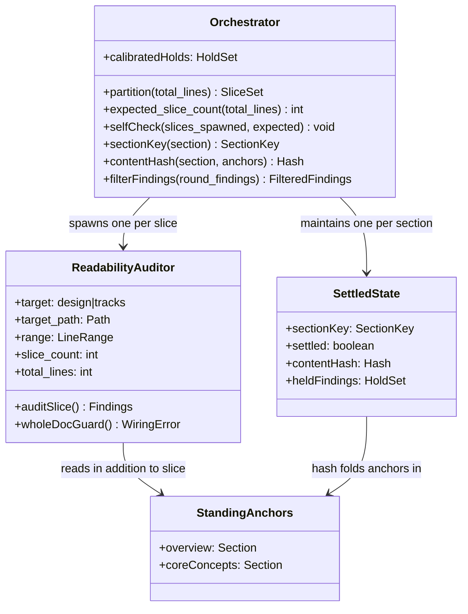

<!-- workflow-sha: 1065c173addca97b35fda8af611eb1e656e3ada2 -->
# Harden readability-auditor slicing and convergence — Design

## Overview

Today the in-loop `readability-auditor` — the cold sub-agent that reads a slice
of `design.md` (or a track file) with no prior context and reports every passage
a mid-level developer cannot follow — has two defects on the design path. First,
its fan-out is unenforced: the orchestrator is told the auditor "is range-sliced"
but is given no partition rule, no slice count, and no floor, so it can run a
single whole-doc spawn over a 700-line `design.md` and spread per-passage
attention thin enough to miss real findings. Second, the auditor is a stateless
cold spawn every round. The dual-clean review loop iterates until both reviewers
— the readability auditor and the absorption check — report a clean round; a
stateless auditor re-rolls already-settled prose through a fresh reader each
round, so the loop oscillates instead of converging. The originating YouTrack
issue (YTDB-1158) measured it: finding counts ran 13 → 8 → 3 → 8 across rounds —
not a descent to zero, and one slice swung from 0 findings to 5 on byte-identical
prose.

This design hardens three things. It makes the design-path slice partition a
**deterministic orchestrator obligation**: ~200-line windows aligned on `##` /
`# Part` boundaries, capped at ~6, one auditor per window, with a hard floor that
a doc over ~300 lines never produces a single whole-doc slice. It pairs that
partition with an agent-side guard that flags a collapse-to-one-slice as a wiring
error. It adds
**orchestrator-side section-keyed settled-state**: the orchestrator tracks, per
`##` section, whether that section is settled (clean or held), drops re-flags on
unchanged settled sections, and re-audits only changed ones — while the auditor
itself stays fully cold, so the cold-read guarantee is intact. And it
**relocates** all Phase-1 authoring-loop params and review files from
`_workflow/plan/` into `_workflow/reviews/`, so `plan/` holds only `track-N.md`
artifacts.

All three fixes touch the same files — `edit-design/SKILL.md` (the design-path
home), `create-plan/SKILL.md` Step 4b (the track path, by cross-reference),
`readability-auditor.md`, and `conventions-execution.md` §2.5 — so the design
treats them together.

Core Concepts defines the seven load-bearing terms; Class Design and Workflow
model the components and one loop round; Parts 1–3 then cover slicing,
convergence, and relocation-and-meta.

## Core Concepts

This design introduces seven load-bearing ideas. Each is named and used without re-definition in the Parts that follow; if a Part references one of these, its definition is here. Each entry pairs the concept with what it replaces, so the delta from the baseline is visible at a glance.

**Deterministic slice partition.** A rule that maps a document's line count to an exact set of auditor slices: ~200-line windows aligned on `##` / `# Part` boundaries, capped at ~6 windows, one auditor spawn per window. Deterministic means two orchestrator runs on the same document produce the same slice set. Replaces "the auditor is range-sliced" with no stated rule. → Part 1 §"Deterministic design-path slice partition".

**Whole-doc floor invariant.** The hard rule that the partition never emits a single whole-doc slice for a document above ~300 lines (a 200-line window already forces ≥2 slices above ~250). Replaces the absent floor that let a single whole-doc spawn run. → Part 1 §"Deterministic design-path slice partition".

**Expected-slice-count self-check.** The orchestrator computes the slice count it should produce from values it already holds (total line count, the ~200-line window, the ~6 cap), spawns exactly that many auditors, then checks `slices_spawned == expected_slice_count` and surfaces a mismatch as a wiring error. This is the "verifiable spawn count" the issue asks for, satisfied by a stated obligation rather than a script. Replaces an unverifiable spawn count. → Part 1 §"Verifiable spawn count without a script".

**Agent-side whole-doc guard.** A secondary detector inside the auditor: it flags a wiring error when its params file says `slice_count == 1 AND total_lines > ~300`. Because the cold auditor cannot learn the document's total length on its own (its read-scope bars it), the orchestrator passes `slice_count` and `total_lines` as params. A legitimate single-slice short doc under the floor does not fire the guard. Replaces silent reliance on the orchestrator never collapsing the fan-out. → Part 1 §"The agent-side whole-doc guard".

**Section-keyed settled-state.** Orchestrator-side memory keyed per `##` / `# Part` section (never per line range), recording whether each section is settled and storing its content hash. On the next round the orchestrator drops re-flags on unchanged settled sections and re-audits only changed ones. Replaces the loop's whole-document re-roll every round. → Part 2 §"Section-keyed settled-state".

**Calibrated hold.** A deliberate orchestrator decision to accept a dense-but-followable should-fix finding rather than send it back to the author, recorded with the finding's verbatim quote and a one-line reason. A held section counts as settled. Each calibrated hold is an individual decision, recorded one finding at a time. The only backstop against over-accepting prose holds is the user veto: the orchestrator presents the held set for review at the end of the loop (D15). Replaces re-litigating the same accepted finding every round. → Part 2 §"Calibrated holds and the convergence backstop".

**Standing anchor.** A section the auditor always reads in addition to its slice, so it can resolve cross-references without false-positiving on every defined term. On the design path the anchors are `## Overview` plus `## Core Concepts` (when present). The settled-state content hash folds the anchors in, because an anchor edit changes what the auditor sees and so re-opens dependent sections. → Part 2 §"The anchor-folded content hash".

## Class Design

This is a workflow-prose change, so the diagram below models the **workflow components** of the dual-clean loop — the orchestrator that drives it, the cold auditor it fans out, and the new settled-state record — not Java classes. The contracts shown are the params each component reads and the obligations each owns.

The orchestrator owns every cross-round decision: it computes the partition and the expected slice count, spawns the auditors, computes each section's content hash, and filters the returned findings against the settled-state. The auditor owns only the read of its own slice plus the standing anchors, and the secondary whole-doc guard; it holds no cross-round memory and reads no research log. `SettledState` is orchestrator working memory (not a file), one record per section, carrying the section's settled flag, its anchor-folded content hash, and the verbatim quotes of any calibrated holds. The `slice_count` and `total_lines` fields on the auditor are the slicing metadata the orchestrator passes so the guard is computable — they are the same for every slice in a round, so they cannot nudge any auditor toward a particular finding.

### Decisions & invariants

- D-records: D1 (deterministic partition), D2 (operative home + agent guard),
  D3 (settled-state is orchestrator-side), D4 (section-keyed, anchor-folded hash)
- Invariants: the auditor reads no research log (S1); the prose AI-tell axis has
  exactly one owner per surface (S4)

## Workflow

The diagram below shows one round of the design-path dual-clean inner loop with the slicing obligation (D1/D2) and the settled-state filter (D3/D4) wired in. The track path (`create-plan` Step 4b item 9) runs the same shape with two parameters swapped (Part 2).

```mermaid
sequenceDiagram
    participant O as Orchestrator
    participant A as Author
    participant Au as ReadabilityAuditor (×N slices)
    participant Ab as AbsorptionCheck

    O->>O: expected = expected_slice_count(total_lines)
    O->>A: re-ground flagged_passages, write design.md
    A-->>O: thin summary (draft on disk)
    O->>O: partition into N windows on ##/# Part
    O->>O: selfCheck(N == expected) else wiring error
    loop one spawn per slice
        O->>Au: params: range, slice_count=N, total_lines
        Au->>Au: guard: slice_count==1 AND total_lines>~300?
        Au-->>O: findings for this slice
    end
    O->>Ab: research_log_path, draft_path
    Ab-->>O: coverage findings
    O->>O: for each section: recompute content hash
    O->>O: drop re-flags on unchanged settled sections
    O->>O: keep findings on changed sections
    O->>O: dual-clean? else next round
```

Two filters run on the orchestrator side and are the heart of this design. The expected-slice-count self-check (D1) runs before the fan-out: the orchestrator computes how many slices the partition rule demands and refuses to proceed if it spawned a different number. The settled-state filter (D4) runs after the fan-out: the orchestrator recomputes each section's anchor-folded content hash, drops every finding on a section that is both settled and hash-unchanged, and keeps findings on changed sections. The auditor between them is unchanged in kind — a cold reader of one slice — except that it now carries the `slice_count` / `total_lines` params that make its whole-doc guard computable.

### Edge cases / Gotchas

- A legitimate single-slice short doc (under the ~300-line floor) is not a collapse: the partition emits one slice, the self-check expects one, and the agent guard does not fire because `total_lines` is below the floor.
- The track path has no mid-loop resume glob today; this design does not add one (Part 3).

### Decisions & invariants

- D-records: D1 and D2 (the slicing obligation and its self-check / guard),
  D3 and D4 (the settled-state filter), D5 (both paths share the mechanism)
- Invariants: the auditor reads no research log (S1)

# Part 1 — Deterministic slicing

Concern A makes the design-path slice partition a deterministic, verifiable
orchestrator obligation, and adds an agent-side guard that catches the degenerate
collapse-to-one-slice case the obligation alone cannot self-detect. The two
sections below state the partition rule, its expected-count self-check, and the
in-agent guard.

## Deterministic design-path slice partition

**TL;DR.** The design-path auditor fan-out becomes a mandatory deterministic
prose rule, ported from the existing `/readability-feedback` partition: split
`design.md` into ~200-line windows aligned on `##` / `# Part` boundaries, cap at
~6 windows, spawn exactly one auditor per window. A hard floor forbids a single
whole-doc slice for any doc over ~300 lines. The rule lives in `edit-design`
Step 4 (where the orchestrator acts) and is cross-referenced from the track path,
`readability-auditor.md`, `design-document-rules.md`, and `/readability-feedback`.

Today the design-path spawn carries no slice rule at all. `edit-design` Step 4 § "Spawning the per-round auditor and second check" says only that the auditor "is range-sliced: each slice gets its own spawn whose params file carries `target=design`, `target_path`, and the slice `range`." There is no slice count, no boundary rule, and no floor against a single whole-doc slice. An orchestrator reading that line can satisfy it with one spawn whose `range` spans the whole document — which is exactly the under-catching failure the issue reports, because a cold reader handed 700 lines spreads per-passage attention thin.

The fix ports the partition rule that already works. `/readability-feedback` Procedure step 2 reads: "Split the doc into ~200-line ranges on `##` / `# Part` boundaries; give each companion file (`design-mechanics.md`) its own range. Cap at ~6 sub-agents." That rule produced the 5-slice fan-out the issue cites as the run that caught the misses, so it is proven on this exact document shape. The in-loop design path audits only `design.md` (mechanics is skip-review), so the companion-file clause does not apply; the rest ports verbatim.

The partition rule:

1. Capture section boundaries (the `##` and `# Part` heading lines) and the total line count.
2. Walk the boundaries, accumulating ~200-line windows that always break on a heading, so no `##` section is split across two slices. Keeping sections whole matters because the auditor reads its slice plus the Overview / Core Concepts standing anchors and resolves "defined in Core Concepts" against them; a section split across slices would lose that resolution.
3. Cap at ~6 windows. Windows grow past 200 lines only when the cap binds — that is, on docs over ~1200 lines.
4. Spawn exactly one auditor per window.

**The whole-doc floor invariant.** The floor is stated as a hard invariant, not a separate tunable knob: the partition never emits a single whole-doc slice for a doc above ~300 lines. The 200-line window already forces this — any doc over ~250 lines yields ≥2 windows — so the floor is a property of the window size, restated explicitly so a reader cannot misread the rule as permitting a single slice.

**Warm-up is severed from slicing.** The gate-A7 cache warm-up (the fixed delay between the first auditor spawn and the rest, so later spawns hit a warm prefix) governs only the *sequencing* of the N>1 spawns. It never reduces N to 1. "Disable the warm-up" therefore means "pay N cold prefixes," never "run one whole-doc spawn." The two decisions are independent: the warm-up is a tunable cost lever, the partition is a correctness obligation, and the prose states each in its own place so they cannot be conflated.

### Edge cases / Gotchas

- Uneven sections: a single `##` section longer than ~200 lines is its own window (the walk breaks only on headings, so it never splits the section); the cap binds before the window count grows unbounded.
- A doc under the ~300-line floor produces one slice legitimately — the floor is the boundary, not a defect.

### Decisions & invariants

- D-records: D1 (deterministic ~200-line partition as a prose orchestrator
  obligation, no helper script), D2 (the rule's operative home is `edit-design`
  Step 4, with the other files cross-referencing it)
- Invariants: whole-doc floor (no single slice above ~300 lines)
- Mirrors: `/readability-feedback` Procedure step 2 (the source rule); the track
  path partitions per file, not per window (D5)

## Verifiable spawn count without a script

**TL;DR.** The issue's "verifiable spawn count" requirement is satisfied at the
obligation level rather than by a check script. The orchestrator computes the
expected slice count deterministically, spawns exactly that many auditors, and
self-checks `slices_spawned == expected_slice_count`, surfacing a mismatch as a
wiring error. The issue explicitly accepts a stated orchestrator obligation as an
alternative to a machine check.

The issue's point-3 asks for a verifiable spawn count and accepts "a stated orchestrator obligation" as an alternative to a check. So the design adds no new machinery. The orchestrator already holds the three inputs the partition rule needs: total line count, the ~200-line window size, the ~6 cap. Because the partition rule (above) is deterministic, the expected slice count is a pure function of those three inputs. The orchestrator computes it, spawns exactly that many auditors, and then asserts `slices_spawned == expected_slice_count`. A mismatch means the fan-out wiring is wrong, and the orchestrator surfaces it as a wiring error rather than proceeding with a thinned fan-out.

This is a prose check the orchestrator runs in working memory, with no script and no test machinery. It pairs with the agent-side guard (next section): the self-check catches a wiring error visible to the orchestrator (it spawned the wrong count), and the guard catches the degenerate case from inside the auditor (a single whole-doc slice over the floor). Together they satisfy the issue's verifiable-count clause without adding a helper script.

A helper script that emitted the slice ranges was considered and rejected. A script would be truly deterministic, would give free spawn-count verifiability, and would share one definition between `/readability-feedback` and the in-loop path. It was rejected for lightness: the user chose the prose obligation over new script-plus-test machinery, and the prose rule already matches the track path's existing style ("one spawn per `track-N.md`").

### Edge cases / Gotchas

- The self-check is the orchestrator's own assertion; it is not visible to the auditor, which is why the agent-side guard exists as the second, independent detector.

### Decisions & invariants

- D-records: D1 (the deterministic partition the count is computed from), D2 (the
  verifiable-count obligation pairs with the agent-side guard)

## The agent-side whole-doc guard

**TL;DR.** `readability-auditor.md` turns "Range-sliced fan-out" from a
description into a hard requirement and adds a guard: the auditor flags a wiring
error when its params say `slice_count == 1 AND total_lines > ~300`. The
orchestrator's partition (D1) is the primary enforcement; the agent guard is the
secondary detector. Because a cold auditor cannot learn the document's total
length on its own, the orchestrator passes `slice_count` and `total_lines` as two
new params fields.

The orchestrator's partition obligation is the primary enforcement — it spawns exactly the computed count, ≥2 above the floor. But a stated obligation can be violated silently if the orchestrator collapses the fan-out, and the issue asks for the collapse to be detectable rather than silent. A check script would have provided that detection; without the script, the agent guard recovers most of it.

The guard cannot read the document's total length on its own. The auditor's read-scope (the S1 cold-read invariant) bars it from reading anything but `house-style.md`, its slice, and the standing anchors — so it cannot count the lines of a document it only ever sees one slice of. The guard is therefore computable only if the orchestrator hands it the two facts: how many slices the round fanned out into (`slice_count`) and how long the whole document is (`total_lines`). Both are constant across a round's fan-out and are slicing metadata, not conclusions about the prose, so passing them does not prime the reader and does not violate the cold-read guarantee (the same S1 reasoning that keeps the held-set off the auditor, Part 2).

The auditor params file therefore gains two fields — `slice_count` and `total_lines` — added to the existing `target`, `target_path`, and `range`. The auditor fires the guard when `slice_count == 1 AND total_lines > ~300`: a single slice over the floor is a collapse and is reported as a wiring error. A single-slice short doc under the floor is legitimate and does not fire the guard. The floor condition therefore lives in two places: the orchestrator's partition produces ≥2 slices above it, and the guard checks it again from inside the auditor.

**Where the rule lives, and why it is distributed.** The operative partition algorithm lives in `edit-design` Step 4 § auditor, because the orchestrator reads Step 4 when spawning and never reads the agent's `.md` file — the algorithm has to live where it acts. `readability-auditor.md` carries the hard requirement plus the guard, because the guard runs inside the agent. The other three files cross-reference the shared principle rather than duplicating it: `create-plan` Step 4b item 9 (the track path, whose unit differs — per file, not per window), `design-document-rules.md` (any cold-read-mechanics slicing statement, kept in sync by reference), and `/readability-feedback` (so the standalone tool and the in-loop path cannot drift on window size or cap). A single canonical home inside `readability-auditor.md` was rejected because the orchestrator never reads the agent file; duplicating the full rule verbatim in each file was rejected for drift risk.

### Edge cases / Gotchas

- The guard is secondary: it catches the orchestrator-collapsed case from inside the auditor, but the orchestrator's partition + self-check is what normally prevents the collapse from happening at all.
- `slice_count` and `total_lines` are constant across the round's fan-out, so every slice's auditor receives the same two values; only `range` varies per slice.

### Decisions & invariants

- D-records: D2 (the "range-sliced" description becomes a hard requirement plus
  the agent-side whole-doc guard, made computable by the `slice_count` /
  `total_lines` params)
- Invariants: the auditor reads no research log (S1); slicing metadata is S1-safe
  (constant across the fan-out, not conclusion-priming)

# Part 2 — Convergence

Concern B gives the dual-clean loop a way to stop re-rolling settled prose while
keeping the auditor fully cold. The mechanism below is orchestrator-side
section-keyed settled-state, and it covers the design path and the track path
alike.

## Section-keyed settled-state

**TL;DR.** The convergence fix is orchestrator-side memory keyed per `##` /
`# Part` section, recording whether each section is settled and storing its
anchor-folded content hash. A settled section whose hash is unchanged between
rounds has its re-flags dropped (and its slice may be skipped); a changed section
is re-audited fresh. The auditor stays fully cold — it never receives the
settled-state — so the cold-read guarantee is intact by construction.

The root cause of the oscillation is that the auditor is a stateless cold spawn every round, so the loop re-rolls already-settled prose through a fresh reader. `edit-design` Step 6 asserts the loop "moves monotonically toward dual-clean — typically one or two rounds."

But the per-round state (round, budget, `flagged_passages`) lives only in orchestrator working memory. The author re-grounds only the flagged passages, not the whole document. So each round's auditor is a fully cold spawn with no do-not-re-flag set, and it re-litigates settled dense prose — a slice that returned 0 findings one round can return 5 on byte-identical prose the next. That variance is the dominant source of the 13 → 8 → 3 → 8 finding counts.

**The state lives entirely orchestrator-side (D3).** The auditor is never handed a held-set and never told which passages are accepted; it reads its slice plus the anchors fully cold every spawn. The orchestrator holds the settled-state, decides which sections to re-spawn, and filters the returned findings. This resolves the issue's stated tension by construction: with zero state on the agent there is no conclusion-priming, so the cold-read guarantee — the auditor's whole value — is strictly intact. The rejected alternative was an exclusion-list-in-spawn: passing a `do_not_reflag` list into each later-round spawn. That was rejected on two grounds. First, it primes the reader ("these passages are blessed"), the exact conclusion-priming the issue warns against. Second, a per-round-varying params list invalidates the shared-prompt cache the fan-out relies on.

**Keyed per section, not per line (D4).** The state is tracked per `##` / `# Part` section, keyed on section identity plus a content hash, never on line ranges. Line ranges would break, because the document grows between rounds and the deterministic partition (Part 1) can regroup sections into different windows — so any line-keyed memory is stale after the next partition. Section identity survives re-partitioning: a section is the same section whether it lands in slice 2 this round or slice 3 next round.

**Settled, and what the orchestrator does with it.** A section is **settled** when it has no open finding the orchestrator intends to act on — either it returned clean, or its only findings were accepted as calibrated holds (next section). The orchestrator then does one of two things per section each round:

- **Settled and unchanged** (hash matches last round): drop all the section's findings. The orchestrator may also skip re-spawning a slice that covers only such sections — a cost optimization, since the filter would drop the findings anyway. This is what kills the clean→dirty oscillation on byte-identical prose.
- **Changed** (hash differs, or never settled): re-audit fresh. Drop any returned finding whose verbatim quote is an accepted hold that still appears, keep genuinely new findings, then re-evaluate the section's settled-state.

The unified settled notion (clean-or-held) collapses the issue's two carry-forward sources — already-fixed findings and accepted holds — into one mechanical filter the orchestrator runs without re-reading the document. The literal passage-level do-not-re-flag list from the issue comment was rejected because a clean slice (round 7's 0 findings) leaves no quotes to carry forward, so a passage list cannot suppress the clean→dirty oscillation that is the dominant variance source. The section hash can suppress it, because it carries the "this section was clean and is unchanged" verdict that a quote list cannot.

### Edge cases / Gotchas

- A section that was held last round and edited this round is "changed": its hash differs, so it re-audits fresh and the hold is re-evaluated against the new text.
- Skipping the re-spawn of an all-settled slice is optional; the filter alone is correct, and an orchestrator that re-spawns every slice still converges because the filter drops the re-flags.

### Decisions & invariants

- D-records: D3 (the cross-round state lives entirely orchestrator-side; the
  auditor stays cold), D4 (the state is section-keyed, not a passage
  do-not-re-flag list)
- Invariants: the auditor reads no research log and receives no settled-state
  (S1); the prose AI-tell axis has one owner per surface (S4)

## The anchor-folded content hash

**TL;DR.** A section's content hash folds in its own text plus whichever standing
anchors exist, because the auditor reads those anchors too — so an anchor edit
must re-open every dependent section. On `target=design` the anchors are
`## Overview` (always present) plus `## Core Concepts` (present only
conditionally). The hash tolerates an absent Core Concepts.

The settled-state hash cannot be over a section's own text alone, because the auditor does not read a section's text alone. It reads its slice plus the standing anchors, and it resolves cross-references like "defined in Core Concepts" against them. So a section's auditability depends on the anchor text as well: if the Overview is rewritten, a section that leaned on an Overview definition may now read differently to the cold auditor even though the section's own bytes are untouched. A hash over the section text alone would mark that section "settled, unchanged" and wrongly suppress findings the anchor edit just introduced.

The hash therefore folds in the standing anchors that exist. On `target=design` that is `## Overview` plus `## Core Concepts` **when present**. Core Concepts is seeded only conditionally — when the doc has Parts or introduces ≥3 new domain terms — so the hash must tolerate its absence: when there is no Core Concepts section, the hash folds in the Overview alone, and the auditor (which resolves anchors on demand) tolerates the absence the same way. An edit to either anchor changes every section's hash, so every section re-audits, which is the correct behavior — an anchor edit is exactly the case where settled verdicts go stale.

### Edge cases / Gotchas

- An absent `## Core Concepts` is normal on short single-Part designs; the hash folds in only the anchors that exist, so a missing Core Concepts is not an error and does not force a re-audit by itself.
- Folding the anchors in means an Overview rewrite re-audits the whole document. That is intentional, not over-conservative: the cold auditor's reading of every section can shift when the anchor it resolves against changes.

### Decisions & invariants

- D-records: D4 (the section-keyed hash folds in the standing anchors the auditor
  reads, tolerating an absent Core Concepts)
- Invariants: the auditor reads no research log (S1)

## Calibrated holds and the convergence backstop

**TL;DR.** A calibrated hold is a deliberate orchestrator decision to accept a
dense-but-followable should-fix rather than send it to the author, recorded with
the verbatim quote and a one-line reason — never a bulk dismiss. A held section
counts as settled. The only backstop against over-accepting prose holds to force
convergence is the user veto at the D15 presentation, where the held set is
surfaced; the comprehension gate is not a prose-hold backstop.

A calibrated hold lets the loop converge on prose that is dense but followable — a should-fix the orchestrator judges acceptable as written. The hold is recorded with the finding's verbatim quote and a one-line calibration reason, so the decision is auditable and is not a bulk dismiss of every open finding. A section whose only open findings are calibrated holds is settled, so it stops being re-audited the same way a clean section does.

The risk a hold introduces is over-acceptance: an orchestrator could hold every finding to force a clean loop. The backstop against that, for **prose** holds, is the user veto at the D15 presentation. When the plan is presented for the user's pre-persist confirmation, the held set is surfaced, and the user can veto a hold and send the finding back to the author. This is the only prose-hold backstop, for a specific reason. The comprehension gate, run cold with its prior warm context stripped, runs no prose AI-tell axis. The S4 one-owner-per-surface rule put that axis on the auditor alone, so the only prose owner is the very auditor the hold suppresses. An over-held prose finding therefore has no second catcher, which leaves the D15 user veto as its only backstop.

The comprehension gate and the iteration-budget escalation remain backstops only for the comprehension / structural and decision-shaped axes. A decision-shaped hold re-opens the S3 freeze-order gate, because a held decision is a decision the loop has not actually settled. The S3 gate blocks the comprehension review while an unresolved log-adversarial entry is open — the entry the Phase-0→1 adversarial gate leaves open on the research log when a decision is still contested.

### Edge cases / Gotchas

- A hold on a decision-shaped finding is not a prose hold: it re-opens the S3 gate rather than relying on the D15 user veto, because the decision must survive challenge before the comprehension gate runs.
- A held finding whose quote no longer appears (the author rewrote the passage) is no longer a live hold; the section is re-evaluated on its new text.

### Decisions & invariants

- D-records: D4 (a calibrated hold makes a section settled; the D15 user veto is
  the only prose-hold backstop)
- Invariants: the prose AI-tell axis has one owner — the auditor (S4); the
  comprehension gate reads no log and runs no prose axis

## Both paths get the convergence fix

**TL;DR.** The same stateless-cold-auditor loop runs on the track path
(`create-plan` Step 4b item 9 spawns the same `readability-auditor` each round),
so the convergence fix applies to both paths. The mechanism (D3/D4) is identical;
only two parameters differ — the settled-state key and the standing-anchor set.
The canonical statement lives in `edit-design` Step 6; `create-plan` Step 4b
item 9 cross-references it with the track-path parameters.

The track path runs the identical defect. `create-plan` Step 4b item 9 calls its loop "the track-path analog of the `edit-design phase1-creation` loop, parameterized to `target=tracks`," and spawns the **same** `readability-auditor` agent — one cold spawn per `track-N.md` each round, same dual-clean structure, same `iteration_budget`. So the convergence defect applies to the track path too, and is arguably worse there, because each round re-rolls N track files. (The absorption half does not oscillate — coverage-matching is near-deterministic — so only the readability auditor needs the fix, on both paths.)

The mechanism is identical across the two paths; only two parameters differ, mirroring the slicing split in Part 1:

| Parameter | `target=design` | `target=tracks` |
|---|---|---|
| Settled-state key | per `##` / `# Part` section of `design.md` | per `track-N.md` file |
| Standing-anchor set | `## Overview` + `## Core Concepts` (when present) | the plan Component Map + each track's `## Purpose / Big Picture` (whichever exist) |

The canonical convergence mechanism is stated once in `edit-design` Step 6, parameterized by the settled-key and the anchor set; `create-plan` Step 4b item 9 cross-references it with the track-path values above. This is symmetric with the D2 home for slicing and consistent with `create-plan` Step 4b already deferring to `edit-design`'s loop contracts. Fixing only the design path was rejected — it leaves the track-path loop chasing the same variance; restating the full mechanism in both files was rejected for drift risk.

**Track-path anchor stability.** On the track path, `create-plan` Step 4b items 1–8 settle the plan Component Map and the track skeletons *before* item 9's dual-clean loop runs. So the standing anchors the settled-state hash folds in are byte-stable for the loop's duration — they are not still moving while the loop iterates. The cross-reference states this explicitly so a `lite` / `minimal` reader does not assume the Component Map is still in flux during the loop.

### Edge cases / Gotchas

- The track path has no `## Core Concepts`; its anchors are the Component Map and the per-track Purpose sections, so the hash folds in a different anchor set, but the folding rule is the same.
- An anchor on the track path is the whole-plan vocabulary a single track-file slice lacks; an edit to the Component Map re-opens every track's settled-state, the same way an Overview edit does on the design path.

### Decisions & invariants

- D-records: D3 and D4 (the convergence mechanism), D5 (the same fix covers the
  track path, with two path-specific parameters)
- Invariants: the auditor reads no research log (S1)

# Part 3 — Relocation and meta

Concern C moves the authoring-loop files to `_workflow/reviews/`; the meta context
(D7) settles two things: tier `full` and full §1.7 staging. The consequence is that
this branch runs the unmodified live loop during its own authoring. The two sections
below cover each in turn.

## File relocation to `_workflow/reviews/`

**TL;DR.** Every Phase-1 authoring-loop per-spawn params file (author,
readability-auditor, absorption / fidelity, comprehension) and every review
output file moves out of `_workflow/plan/` into the plan-scoped
`_workflow/reviews/`. The design-path resume round-count glob follows.
`conventions-execution.md` §2.5 generalizes its third-scope home to cover the
authoring loop. After the move `plan/` holds only `track-N.md` artifacts.

Today the authoring-loop files pollute `plan/`. `edit-design` Step 4 writes one params file per spawn "under `_workflow/plan/`," and the comprehension gate's `phase4-creation` `output_path` is also "under `_workflow/plan/`." Concern C moves all of them into the plan-scoped `_workflow/reviews/` directory. After the move, `plan/` holds only `track-N.md` artifacts. The new per-slice params files (Part 1) and the settled-state scaffolding (Part 2) inherit this home.

**Why the plan-scoped `_workflow/reviews/`, not the track-anchored `plan/track-N/reviews/`.** The canonical execution-phase review home is the track-anchored `plan/track-N/reviews/` (`conventions-execution.md` §2.1 Review-file lifecycle). But the design path runs in Step 4a *before any `plan/track-N/` directory exists*, and the author and comprehension spawns operate on the whole plan, not a single track — so a track-anchored home cannot host them uniformly. The Phase-0→1 gate is the adversarial review that clears the research log before any Phase-1 artifact derives. The plan-scoped `_workflow/reviews/` is the natural home, and `conventions-execution.md` §2.5 already defines exactly that directory for the Phase-0→1 gate's files. So the change generalizes §2.5's "Third-scope review-file home" from "the Phase-0→1 gate's files" to "Phase-1 plan-scoped review scaffolding." Execution-phase review files (Phase 2/3, `track-review`) keep their existing track-anchored home — C touches only the Phase-1 authoring loop.

**The two values, and where each applies.** The primary value on both paths is decluttering `plan/` so it holds only `track-N.md` artifacts. The secondary "resume glob reads one location" benefit applies only to the design path. The `edit-design` Step 6 dual-clean loop can resume after an interruption, and it recovers which round it was on by counting the per-round params files already on disk. Because relocating those files changes where they live, the glob's path updates with them — from `_workflow/plan/` to `_workflow/reviews/`. The `create-plan` Step 4b track-path loop has **no** resume round-count glob at all — a pre-existing gap, see the edge cases below — so the move's track-path value is solely `plan/` de-pollution, not glob simplification. The move is forward-compatible: if a track-path resume glob is ever added, it reads `_workflow/reviews/` consistently with the design path.

**Scope of edits.** `edit-design` Step 4 (params + comprehension `output_path`) and Step 6 (the resume round-count glob), `create-plan` Step 4b item 9 (params), and `conventions-execution.md` §2.5. The agent files need no change: they read whatever params path the spawn prompt names, so they are path-agnostic on file location.

### Edge cases / Gotchas

- The track-path Step-4b loop has no mid-loop resume mechanism today (a pre-existing gap): `edit-design` Step 6 has an explicit resume block that re-derives the round count from the latest per-round params files, but the `create-plan` Step 4b loop writes the same per-spawn params with no equivalent glob. This change does not add one — that is out of scope and orthogonal to file location — but the move is forward-compatible if one is ever added.
- Moving only the literal "auditor and comprehension" files named in the Concern-C comment was rejected: the author and absorption / fidelity params files also pollute `plan/`, and the design-path resume glob reads all of them, so a partial move leaves the mess and splits the glob.

### Decisions & invariants

- D-records: D6 (all Phase-1 authoring-loop files move to `_workflow/reviews/`;
  the design-path resume glob follows; §2.5 generalizes)
- Mirrors: `conventions-execution.md` §2.1 Review-file lifecycle (the
  track-anchored execution-phase home, unchanged); §2.5 Third-scope review-file
  home (the generalized Phase-1 home)

## Meta: tier and §1.7 routing

**TL;DR.** Tier is `full`, because Concern B is a genuine mechanism design
(section-keyed settled-state, the anchor-hash subtlety, the populate / drop
rules) that warrants a `design.md`. The centrally-matched HIGH-risk category is
`Workflow machinery`. §1.7 routing is full staging rather than the §1.7(k)
prose-rule opt-out, because the core edits are an executable orchestration loop.
The consequence: this branch runs the unmodified live loop during its own
authoring.

**Tier = `full`.** Concern B is a real mechanism design — the section-keyed settled-state, the anchor-folded content-hash subtlety, the populate / drop rules — not a one-line prose tweak, so it warrants a `design.md`. The centrally-matched HIGH-risk category is `Workflow machinery`: the change edits a load-bearing control-flow protocol, the dual-clean review-iteration loop.

**§1.7 routing = full staging, not the opt-out.** The §1.7 staging discipline governs how workflow-modifying branches keep their own running phases off a half-modified workflow. §1.7(k) offers a prose-rule opt-out for branches whose edits are judgment-layer prose, letting them edit live and gain self-application. This branch does **not** qualify, on two grounds. First, §1.7(k)'s criterion 2 disqualifies a plan from the prose-rule opt-out when a running phase reads its edited files as executable procedure rather than merely as prose, and the criterion explicitly names "the step-implementation orchestration loop." This change's core edits are the dual-clean orchestration loop (`edit-design` Step 4/6, `create-plan` Step 4b) plus the resume glob — executable procedure, not judgment-layer prose — so the opt-out fails criterion 2. Second, staging is the safe choice regardless: editing the loop live would let this branch's own Phase 4 design-final authoring and Phase 3C re-reads run the half-modified loop — the exact destabilization staging prevents: a running phase must never read a half-modified workflow (I6).

**The accepted consequence.** Implementation edits land under `_workflow/staged-workflow/.claude/...` and a Phase 4 promotion commit copies them live. This branch's own Phase 1 authoring (Step 4a `design.md`, Step 4b tracks) and all later phases run the **live develop-state, unmodified** loop — so the branch cannot dogfood its own fixes during its own planning. Its own design / track authoring exhibits the old unenforced-slicing and oscillation behavior, which is expected and accepted. It is the standard staging trade-off, the same one staged workflow-modifying branches accept: they cannot dogfood their own fixes during their own planning.

### Edge cases / Gotchas

- The branch's own authoring oscillating or running a single whole-doc auditor slice is not a regression in this change; it is the live-loop behavior the staged fix has not yet promoted.

### Decisions & invariants

- D-records: D7 (tier `full`; §1.7 routing is full staging, not the prose-rule
  opt-out; the branch runs the unmodified live loop during its own authoring)
- Invariants: a running phase never reads a half-modified workflow (I6)
